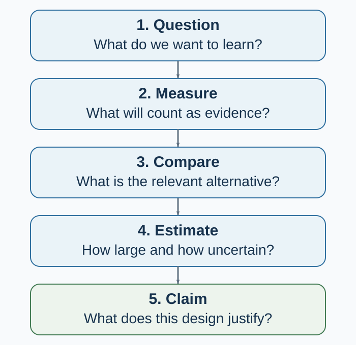

---
aliases:
  - appendix-c-how-behavioral-evidence-is-built.html
  - appendix-d-how-behavioral-evidence-is-built.html
---

# Running an Experimental Study: From Question to Credible Evidence

*A practical workflow for designing, implementing, analyzing, and reporting behavioral experiments*

::: {.callout-note .research-lens icon=false}
## Research Companion

This appendix is optional for readers following the book's professional pathway and central for students who must design, run, analyze, or evaluate an experimental study. It can be read as one methods chapter or used phase by phase while a study is in progress.
:::

::: {.callout-note .core-idea icon=false}
## Core idea

This appendix is a practical chapter about **running an experimental study**. The work begins before participants arrive and continues after the last result is reported: define the question, build the treatment and measure, plan the assignment and analysis, implement the protocol, protect the data, estimate the effect, and document what happened. Evidence is not a result with a small *p*-value. It is the entire chain.
:::

## The experimental workflow

Use this appendix as a working protocol in five phases. Each phase leaves a record that the next phase can inspect.

| Phase | What you do | What you preserve |
| --- | --- | --- |
| **1. Define** | Turn the topic into a testable question; define the construct, outcome, comparison, population, and estimand | Research question, theory, hypotheses, construct definitions |
| **2. Design** | Choose the experimental design; create treatments and measures; plan assignment, power, exclusions, and analysis | Protocol, materials, code, design calculation, preregistration, ethics approval |
| **3. Implement** | Recruit, assign, deliver, measure, and monitor without steering the study toward a preferred result | Recruitment and assignment logs, timestamps, deviations, attrition, treatment fidelity |
| **4. Analyze** | Freeze the data, execute the planned analysis, check robustness, and label exploration | Immutable raw data, cleaning scripts, analysis code, output log, deviation record |
| **5. Report and preserve** | Report estimates and uncertainty, match the claim to the design, share what can be shared, and archive what must be protected | Manuscript, tables and figures, reproducibility package, access conditions, correction path |
: Running an experimental study from definition to preservation {#tbl-experimental-workflow}

Before collecting data, complete the design card in @tbl-evidence-design-card. During implementation, monitor assignment, exposure, attrition, contamination, measurement, and deviations without looking for a preferred result. After data collection, state the estimand first, report uncertainty and all planned outcomes, distinguish confirmatory from exploratory analysis, and narrow the claim to what the experiment actually learned.

The point is not to make every study maximally complicated. It is to stop complexity from remaining hidden.

## Start with the claim you want to earn

Suppose sales rise after a company introduces a negotiation workshop. Four questions can be asked:

- **Description:** By how much did sales rise?
- **Prediction:** Which teams are likely to improve next quarter?
- **Causation:** What would sales have been for these teams without the workshop?
- **Mechanism:** Did the workshop work through preparation, information sharing, confidence, manager attention, or something else?

The same dataset may answer the first question and fail on the other three. A time trend describes. A predictive model forecasts under a data-generating environment. A causal design compares potential outcomes under interventions. A mechanism claim needs further variation or measurement that distinguishes pathways.

{#fig-claim-to-design-pipeline fig-alt="A left-to-right pipeline begins with question, then measure, compare, estimate, and claim. Under each stage is a common failure: vague target, invalid measure, confounding, fragile estimate, and overclaiming. A lower arrow labeled reproduce, replicate, revise returns from the claim to the question."}

@fig-claim-to-design-pipeline shows the discipline: each arrow carries assumptions. A transparent failure at one stage can improve the next design. An opaque success cannot.

## 1. Turn a topic into a question and hypothesis

“Anchoring,” “happiness,” and “AI advice” are topics. A research question specifies what would count as an answer.

For an empirical study, write:

> For **population P**, what is the effect or association of **intervention/exposure X**, relative to **comparison C**, on **outcome Y**, over **time T**, and through which proposed **mechanism M**?

Not every question needs every element in its title. The design does.

A hypothesis should make a risky prediction before the outcome is known. “Anchoring matters” is too elastic. “Participants who see a high initial price will report a higher willingness to pay than those who see a low initial price, for the preregistered product and estimator” can be contradicted.

Three distinctions prevent later confusion:

- **Confirmatory** analysis evaluates a claim and analysis plan specified without using the outcome pattern.
- **Exploratory** analysis uses the data to discover patterns and generate explanations.
- **Post hoc prediction** can be valuable, but it must not be narrated as if it was specified in advance.

ABT—AND, BUT, THEREFORE—can make the motivation clear. It cannot establish novelty, measurement quality, or identification. A compelling contradiction earns attention; a design earns the claim.

### Research question check

- Can another researcher name the population, comparison, outcome, and horizon?
- Is the question descriptive, predictive, causal, mechanistic, or a synthesis question?
- What result would count against the hypothesis?
- Is the study feasible with the available sample, ethics, time, access, and measurement?
- Would the answer change theory, a decision, a design, or a boundary condition?

## 2. Define the construct before choosing the instrument

A **construct** is the theoretical object: trust, impatience, fairness, experienced affect, cooperation. An **operationalization** is how the study makes that object observable: an item, scale, choice, response time, transfer, physiological signal, or coded behavior.

Similar labels can hide different constructs. A one-shot transfer, a self-report of generosity, and repeated helping behavior are not interchangeable measures of “prosociality.” Different labels can also hide near-identical measures. Name the construct first, then justify why the operation captures it in this population and setting.

**Reliability** concerns the consistency or precision of a measurement for its intended use. **Validity** concerns whether the interpretation of the score is warranted. A measure can be reliable and invalid: a scale can reproduce the same number while measuring the wrong object. High internal consistency does not establish construct validity. A correlation with brain activity does not certify a questionnaire as the true measure of a mental state.

Before data collection, record:

- exact items, task, instructions, response scale, timing, scoring, exclusions, and version;
- why the measure fits the construct and decision context;
- evidence about reliability and validity in a relevant population;
- whether the treatment changes the measure itself rather than the underlying construct;
- whether comparison across languages or groups assumes comparable scale use;
- which outcome is primary and which are secondary, manipulation checks, mediators, or exploratory.

Manipulation checks need care. A post-treatment check can be a useful diagnostic, but conditioning the main analysis on passing it can break randomization. If the treatment changes how people interpret the check, the check is also an outcome.

Measurement is not clerical work after theory. It is the bridge between theory and data (Flake & Fried, 2020).

## 3. Separate description, prediction, causation, and mechanism

| Claim family | Target question | Design requirement | Common overreach |
| --- | --- | --- | --- |
| Description | What happened, to whom, and how variable was it? | Defined population, measure, sampling, missingness | Generalizing beyond the observed population |
| Association | How do measured variables co-vary? | Transparent adjustment and measurement | Calling an adjusted coefficient an effect |
| Prediction | How well does a model forecast new observations? | Honest out-of-sample evaluation and distribution-shift checks | Treating predictive importance as a causal lever |
| Causation | What would change under an intervention? | Credible counterfactual and identification assumptions | Treating before–after change as treatment effect |
| Mechanism | Through which pathway did the effect arise? | Variation or evidence that separates pathways | Relabeling a mediator correlation as a process |
: Claim families require different evidence {#tbl-claim-families}

Prediction and causation can point in different directions. An excellent predictor may be impossible or unethical to intervene on. A weak predictor can still be a useful treatment if its manipulated change affects the outcome. “The model predicts who defaults” does not answer “What policy reduces default?”

Mechanism is harder still. Showing that treatment changes a proposed mediator and the mediator correlates with the outcome is not, by itself, a causal mechanism test. The mediator is post-treatment and can be confounded with unmeasured responses. Mechanism evidence becomes stronger when designs manipulate or otherwise identify the pathway, rule out alternatives, and predict boundary conditions.

## 4. Make the counterfactual and confounding visible

For person $i$, let $Y_i(1)$ denote the outcome under treatment and $Y_i(0)$ the outcome under control. The individual causal effect is:

$$
Y_i(1)-Y_i(0).
$$

Only one potential outcome is observed. The missing one is the **counterfactual problem**. A comparison group is useful when its observed outcome represents what would have happened to the treated units without treatment.

**Confounding** occurs when the groups differ in causes of the outcome apart from the treatment. Employees who volunteer for training may be more motivated. People who marry differ from people who do not. Countries with stronger institutions differ in many ways from countries with weaker institutions. Regression adjustment removes confounding only under assumptions about what was measured, how it was modeled, and what was not measured.

Ask of every causal claim:

- Why is the comparison group a credible counterfactual?
- Which common causes of treatment and outcome are blocked by design?
- Which remain possible?
- Did treatment affect observation, attrition, reporting, or exposure to the outcome?
- Could one unit's treatment change another unit's outcome?

## 5. Choose the design that identifies the contrast

| Design | What creates the comparison? | Strong use | Central assumption or limit |
| --- | --- | --- | --- |
| Randomized experiment | Known random assignment | Average effects of assignment in the study population | Implementation, attrition, interference, and sampling still matter |
| Laboratory experiment | Randomization in a controlled task | Mechanisms and comparative statics | Task, stakes, participants, and institution bound transport |
| Field experiment | Randomization in a natural setting | Causal effects under field implementation | Less control; treatment delivery and spillovers may vary |
| Natural or quasi-experiment | Rule, threshold, shock, timing, or instrument | Causal effects when the assignment process is credible | Each design has specific untestable assumptions |
| Observational study | Naturally occurring differences | Description, prediction, hypothesis generation; sometimes causal analysis with strong assumptions | Unmeasured confounding and selection |
| Simulation | Outcomes generated by an explicit model | Logic, mechanisms, sensitivity, boundary results | A result about the model is not automatically evidence about people |
: Designs answer different questions under different assumptions {#tbl-evidence-designs}

“Quasi-experiment” is not a stamp of causality. A regression discontinuity design needs continuity near the threshold and limited manipulation. Difference-in-differences needs a credible counterfactual trend and attention to timing and heterogeneous treatment effects. An instrumental-variable design needs instrument relevance plus independence, exclusion, and—for the usual LATE interpretation—monotonicity. A natural event is useful only if the process generating exposure supports the comparison.

No design dominates on every dimension. Control can improve internal validity and narrow realism. Field context can increase realism and add uncontrolled pathways. Build a body of evidence whose weaknesses do not all point in the same direction.

## 6. Random sampling and random assignment solve different problems

**Random sampling** selects units from a population and supports population description under the sampling design. **Random assignment** allocates eligible units to conditions and supports causal comparison within the experimental sample.

A convenience sample can support an internally valid randomized comparison but not a population prevalence estimate. A representative survey can estimate population characteristics yet fail to identify a causal effect. Keep the two random processes separate.

{#fig-random-sampling-vs-assignment fig-alt="Two side-by-side panels distinguish random sampling from random assignment. On the left, units move from a defined population to a probability sample and then to a population claim. On the right, an eligible study sample is randomly divided into two conditions whose outcomes are compared. A boundary band says that neither process alone fixes noncompliance, missing outcomes, attrition, interference, or transportability."}

@fig-random-sampling-vs-assignment keeps the direction of inference visible. Sampling asks how observed units connect to a defined population. Assignment asks whether outcomes differ because units were allocated to different conditions. A study can do either, both, or neither.

### Random assignment balances in expectation

Random assignment does not guarantee that realized groups are identical. It makes assignment independent of baseline potential outcomes and covariates according to a known mechanism. Across repeated randomizations, differences average to zero; in one realized sample, chance imbalance can occur (Imbens & Rubin, 2015).

This changes how balance should be used.

1. Verify the assignment code, unit, probabilities, strata, clusters, and allocation concealment.
2. Report important baseline covariates by group and inspect standardized differences or design-relevant summaries.
3. Do not run dozens of baseline significance tests and treat one *p* < .05 as proof that randomization failed. Under valid randomization, some chance differences are expected; *p*-values mainly restate that fact (Senn, 1994).
4. Pre-specify adjustment for strong predictors to improve precision; do not select controls by whether their baseline test is significant.
5. Investigate patterns that suggest coding errors, differential recruitment after assignment, or implementation failure.

### Rerandomization is a design, not a rescue

Discarding an allocation after viewing an inconvenient imbalance can invalidate the stated assignment mechanism. But the rule “never rerandomize” is also wrong. **Rerandomization** can be valid when the acceptable-balance criterion, variables, and procedure are specified before treatment assignment and the analysis accounts for that restricted randomization (Morgan & Rubin, 2012).

Stratification, pair matching, blocking, clustering, and covariate-adaptive allocation can also improve balance or logistics. Record the procedure completely; it becomes part of the estimand and inference.

## 7. Plan precision before collecting outcomes

Power is the probability that a specified analysis will meet its decision criterion under a specified effect and data-generating process. It is not a property of sample size alone.

A defensible design calculation declares:

- primary outcome and estimator;
- smallest effect of substantive interest and plausible effect range;
- outcome variance, baseline correlation, and repeated-measure structure;
- assignment ratio, clusters, intraclass correlation, and strata;
- expected noncompliance, attrition, missingness, and multiple testing;
- significance or interval criterion and analysis model.

Do not take the largest published estimate from a small study, insert it into a calculator, and call the resulting sample adequate. Selective publication and sampling variation tend to make early significant effects too large.

Low power causes more than missed significance. Conditional on passing a significance filter, estimates can have the wrong sign (**Type S error**) or a seriously exaggerated magnitude (**Type M error**). Design analysis should therefore examine plausible estimates and uncertainty, not only a binary rejection probability (Gelman & Carlin, 2014).

After data collection, observed power computed from the observed effect adds little. Report the estimate, compatible interval, design assumptions, and what effect sizes the study could or could not distinguish.

## 8. Protect the assignment during implementation

A randomized design can lose its meaning after allocation. Track a participant or unit flow from eligibility through assignment, delivery, outcome observation, and analysis.

{#fig-participant-flow-threats fig-alt="Two randomized arms proceed through treatment receipt, outcome observation, and analysis. Dashed curved arrows between arms mark spillovers or interference. A lower band distinguishes noncompliance, missingness, and interference and states that no fixed attrition percentage is universally safe."}

@fig-participant-flow-threats prevents several losses from being collapsed into “dropout.” **Noncompliance** separates assignment from treatment receipt. **Missingness or attrition** separates assignment from outcome observation. **Interference** means that one unit's assignment or treatment changes another unit's exposure or outcome. Each changes the estimand or the assumptions needed for interpretation.

### Attrition and missing outcomes

Attrition is dangerous when missingness differs by assignment or relates to potential outcomes. Equal attrition rates do not guarantee equal selection, and a low percentage is not automatically harmless.

Report rates and reasons by arm, timing, baseline predictors of missingness, and sensitivity analyses under plausible missing-data assumptions. Do not silently replace the randomized sample with complete cases and retain the original causal language.

### Noncompliance: assignment is not receipt

Let $Z$ be assignment and $D$ treatment received.

The **intention-to-treat (ITT)** effect compares outcomes by assignment:

$$
ITT = E[Y\mid Z=1]-E[Y\mid Z=0].
$$

ITT answers the effect of offering, assigning, or implementing the treatment under observed compliance. It preserves the randomized comparison and is often the policy-relevant estimand.

The effect among those who actually received treatment is not obtained by simply comparing receivers with nonreceivers; receipt is selected. Under a valid binary instrument, the assignment can identify a **local average treatment effect (LATE)** for compliers. The standard interpretation requires:

- **relevance:** assignment changes treatment receipt;
- **independence:** assignment is as good as random relative to potential outcomes and compliance types;
- **exclusion:** assignment affects the outcome only through treatment receipt;
- **monotonicity:** no unit systematically does the opposite of assignment.

Then the Wald ratio is:

$$
LATE = \frac{E[Y\mid Z=1]-E[Y\mid Z=0]}{E[D\mid Z=1]-E[D\mid Z=0]}.
$$

LATE is local to compliers induced by that instrument. It is not automatically the average treatment effect for all participants, always larger than ITT, or portable to another implementation (Angrist et al., 1996).

### Spillovers, interference, and displacement

The usual no-interference assumption says one unit's outcome does not depend on other units' assignments. Social information, contagion, peer effects, congestion, and markets often violate it.

Spillovers can make the standard difference too small, too large, or simply answer the wrong question. A job-placement program can help treated workers while displacing untreated workers from a fixed number of jobs. The direct effect and the total labor-market effect are different estimands.

Possible responses include randomizing at a higher level, varying treatment saturation, measuring networks, defining exposure mappings, and using pure control markets. None is automatic. State whose outcome depends on whose treatment.

### Evaluation can change behavior

Participants can respond to being studied, surveyed, observed, encouraged, or assigned to control. Labels such as demand, Hawthorne, John Henry, demoralization, anticipation, and survey effects describe possibilities, not guaranteed biases of one sign.

Reduce avoidable salience, blind participants or staff where ethical and feasible, use unobtrusive or administrative measures with appropriate consent and privacy, standardize contact, and design diagnostics. Deception or undisclosed observation requires independent ethical justification; methodological convenience does not override respect for persons.

## 9. Make multiplicity and flexibility visible

With many outcomes, subgroups, exclusions, transformations, models, and stopping rules, some apparently strong results will arise by chance. The problem is not only a researcher consciously “fishing.” Undocumented flexibility makes the effective analysis set unknowable.

Before outcomes are observed:

- designate primary and secondary outcomes;
- specify the estimator, treatment contrast, exclusions, covariates, missing-data rule, transformations, subgroup tests, and stopping rule;
- define a family for error-rate or false-discovery control where appropriate;
- preserve space for exploration and label it as exploration.

Preregistration time-stamps decisions. It does not make a poor hypothesis important, an invalid measure valid, or a biased design causal. Deviations can be scientifically necessary. Report what changed, when, why, and whether the change used outcome information.

Report all planned outcomes, raw treatment-control summaries where meaningful, adjusted estimates, uncertainty, and the multiplicity approach. A null result is not evidence of exact zero; a significant result is not evidence of practical importance.

## 10. Replication is estimation under a declared protocol

A replication is not a ritual in which an effect “works” or “fails.” It asks whether an estimate appears under a specified protocol, sample, setting, measure, and analysis—and how the new estimate changes cumulative uncertainty.

- **Direct replication** holds key procedures close to the original to test repeatability under a defined protocol.
- **Conceptual replication** tests a theory with a different operation; a difference can reflect the theory, the new measure, or an unrecognized moderator.
- **Multi-site replication** estimates average effects and heterogeneity across implementations, populations, and settings.
- **Reanalysis or reproduction** checks whether reported results follow from the declared data and code; it is not the same as collecting new data.

Large replication projects in psychology and experimental economics found both replicated effects and substantial attenuation or heterogeneity (Camerer et al., 2016; Open Science Collaboration, 2015). The lesson is not that an entire field is false. It is that single studies—especially small, flexible, selected ones—provide less certainty than clean narratives imply.

For a useful replication, document fidelity and departures, compare effect estimates with intervals, analyze protocol heterogeneity, and update the cumulative claim. A statistically significant original and nonsignificant replication can still have compatible estimates. A binary verdict discards that information.

## 11. Build an open and reproducible workflow

Transparency is not “put everything online.” Human-subject data can contain confidential or re-identifiable information. The target is **as open as possible and as protected as necessary**.

A minimum project structure preserves:

- immutable raw inputs with provenance and checksums;
- a data dictionary, consent and access conditions, and de-identification decisions;
- versioned materials, assignment code, and implementation logs;
- scripted transformations from raw to analytic data;
- an environment or dependency record plus random seeds where relevant;
- a machine-readable analysis that regenerates tables and figures;
- a README with exact commands and expected outputs;
- a deviation log connecting preregistration, implementation, and final analysis;
- disclosure of inaccessible data, proprietary materials, or manual steps.

Run the pipeline in a clean environment before release. Check that figures and tables match the manuscript, the sample flow adds up, and the public package contains no direct or inferable identifiers. The FAIR principles—findable, accessible, interoperable, reusable—do not imply that every dataset is public; “accessible” can mean a governed access process (Wilkinson et al., 2016).

Preregistration, open materials, open code, and registered reports change different incentives. They should be evaluated and improved rather than treated as badges of truth (Munafò et al., 2017; Nosek et al., 2018).

## 12. Transport the result only as far as the evidence travels

**Internal validity** concerns whether the comparison supports the causal claim in the studied setting. **External validity** concerns where the result travels: to which people, tasks, institutions, treatments, outcomes, and times.

“The laboratory is artificial” is not a complete criticism. Every design abstracts. A lab can identify a mechanism that is hidden in the field. A field experiment can be realistic and highly local. A representative sample can improve population description but not guarantee that an intervention effect transports across institutions.

Build a transport argument:

1. Name the target population and setting.
2. Compare the study and target on effect modifiers, treatment delivery, outcome measurement, incentives, and equilibrium conditions.
3. Explain why the mechanism should remain or change.
4. Test heterogeneity with enough precision and without converting exploratory subgroups into facts.
5. Seek replications whose contexts vary on the proposed boundary condition.

External validity is not a yes/no property of a study. It is an argument supported by design, theory, and accumulated evidence.

## 13. Match the final sentence to the design

| Evidence obtained | Defensible sentence | Sentence to avoid |
| --- | --- | --- |
| Cross-sectional association | “X and Y were associated in this sample.” | “X changed Y.” |
| Out-of-sample predictive accuracy | “The model predicted Y in the held-out sample under this data environment.” | “The important predictors are causal levers.” |
| Randomized ITT estimate | “Assignment to the offer changed Y by … in the study sample.” | “Receiving treatment has this effect for everyone.” |
| Valid IV estimate | “For compliers induced by this instrument, treatment changed Y under the stated assumptions.” | “This is the universal treatment effect.” |
| Laboratory treatment effect | “Under this task, institution, stakes, and sample, treatment changed behavior.” | “Humans always behave this way.” |
| Simulation result | “Under these model rules and parameters, the mechanism can produce the pattern.” | “The simulation proves the human mechanism.” |
| Mediator correlation | “The pattern is consistent with the proposed pathway.” | “The mediator caused the effect.” |
: Claim-to-design matching {#tbl-claim-design-matching}

Scientific writing becomes clearer when it states the estimand and scope before the interpretation.

## The one-page evidence design card

| Field | Complete before data |
| --- | --- |
| Question | Population; treatment/exposure; comparison; outcome; horizon; mechanism |
| Claim family | Description; association; prediction; causation; mechanism |
| Construct | Definition and competing interpretations |
| Measure | Exact operation; scoring; reliability; validity; primary/secondary status |
| Assignment/comparison | Unit; probabilities; strata/clusters; counterfactual logic |
| Estimand | ITT, ATE, LATE, direct, spillover, total, predictive loss, or other quantity |
| Threats | Confounding; attrition; noncompliance; interference; demand; measurement change |
| Precision | Plausible effect; MDE; variance; dependence; attrition; multiplicity |
| Analysis | Estimator; covariates; exclusions; missingness; uncertainty; family corrections |
| Ethics | Respect; consent; beneficence; justice; privacy; data access; stopping rules |
| Reproducibility | Registration; materials; code; environment; provenance; access plan |
| Transport | Target setting; likely effect modifiers; planned boundary tests |
: A compact evidence design card {#tbl-evidence-design-card}

## Worked study: from question to report

The following example is a **simulated teaching study**, not evidence about any real clinic. Its purpose is to show how the records connect from question to final sentence.

**Question.** Among patients already eligible for a routine appointment, what is the intention-to-treat effect of assignment to a shorter, plain-language reminder, relative to the standard reminder, on attending within thirty days?

**Preregistered design.** Randomly assign 1,200 eligible patients in equal numbers after eligibility is fixed. The primary outcome is an administrative indicator for attendance within thirty days. The primary estimator is the difference in mean attendance by assignment, with an unpooled standard error and 95% confidence interval. Analyze every assigned patient in the assigned arm; report missing administrative outcomes rather than excluding them silently. Secondary outcomes, subgroup comparisons, and mechanism measures are exploratory unless separately declared.

| Design-card field | Declared choice |
| --- | --- |
| Population | Patients eligible for the appointment under the clinic's existing rule |
| Treatment and comparison | Plain-language reminder versus standard reminder |
| Unit and assignment | Individual patient; exactly 600 assignments per arm |
| Primary outcome | Attendance recorded within thirty days |
| Estimand | ITT risk difference: assignment to new reminder minus assignment to standard reminder |
| Main threats | Delivery failure, wrong contact information, spillovers within households, missing administrative records, and outcome-definition errors |
| Mechanism boundary | The contrast tests the reminder package; it does not separately identify comprehension, fear reduction, salience, or lower friction |
| Decision rule | Report estimate and interval; the clinic evaluates operational cost, distribution across patient groups, and implementation errors before scaling |
: Preregistered design card for the simulated reminder study {#tbl-worked-reminder-design}

The data below are generated with a declared seed and fixed probabilities solely to make the workflow reproducible:

```python
import math
import random

rng = random.Random(20260830)
n_control = n_treatment = 600
control = [int(rng.random() < 0.65) for _ in range(n_control)]
treatment = [int(rng.random() < 0.70) for _ in range(n_treatment)]

p_control = sum(control) / n_control
p_treatment = sum(treatment) / n_treatment
effect = p_treatment - p_control
se = math.sqrt(
    p_control * (1 - p_control) / n_control
    + p_treatment * (1 - p_treatment) / n_treatment
)
ci = (effect - 1.96 * se, effect + 1.96 * se)
```

The generated data contain 380 attendances among 600 control assignments and 417 among 600 treatment assignments. Attendance was therefore 63.3% under the standard reminder and 69.5% under the plain-language reminder. The estimated ITT difference is **6.2 percentage points**, with an approximate 95% confidence interval from **0.8 to 11.5 percentage points**.

**Design-matched interpretation.** In this simulated study, assignment to the plain-language reminder increased recorded attendance by 6.2 percentage points relative to assignment to the standard reminder. The interval remains compatible with effects from about 0.8 to 11.5 points under the stated standard-error approximation. The result estimates the reminder package in the simulated study population. It does not establish which component caused the difference, whether the effect would persist in another clinic, or whether the redesign is ethically and operationally preferable for every patient group.

**Deviation and preservation record.** This simulated analysis has no analytical deviations because the code follows the declared generation and estimation procedure. It bypasses recruitment, delivery, attrition, spillovers, implementation failure, and measurement operations, so it does **not** demonstrate treatment fidelity or the absence of protocol deviations in a real study. A real study would preserve the eligibility extract, assignment file, delivered-message log, undeliverable contacts, outcome pull, code, environment, consent or waiver decision, preregistration, and every departure from the protocol. A model answer is credible because each sentence can be traced back through that record—not because the estimate happens to exclude zero.

## Ethics is part of identification

The Belmont principles remain a useful starting point: **respect for persons**, **beneficence**, and **justice**. Respect requires meaningful information and voluntary participation where consent applies. Beneficence requires risks to be minimized and justified by potential value. Justice asks who bears research burdens and who can benefit.

Ethics also affects evidence. Coercive recruitment selects participants. Privacy fears change answers. An intervention that cannot be implemented ethically may have little policy relevance. Excluding affected groups for convenience can make the sample uninformative about those who bear the decision.

Institutional review, data-protection law, registration, and local procedures change over time. Check current requirements with the relevant institution before collecting data; a historical lecture link is not approval.

## Key ideas

- Begin with the claim family and estimand, not with a preferred method.
- Define the construct and justify the operation before collecting numbers.
- Association, prediction, causation, and mechanism answer different questions.
- Random assignment creates comparability in expectation; realized balance is a diagnostic, not a significance-test ritual.
- Predeclared rerandomization or covariate-adaptive assignment can be valid; outcome-informed rescue is not the same design.
- Power depends on an effect, variance, dependence, allocation, attrition, multiplicity, and analysis—not sample size alone.
- ITT estimates assignment; LATE identifies an effect for compliers only under relevance, independence, exclusion, and monotonicity.
- Attrition, noncompliance, spillovers, displacement, and evaluation-driven behavior change the estimand.
- Preregistration distinguishes planned from discovered analysis; replication estimates cumulative evidence rather than issuing a pass/fail verdict.
- A claim should never be stronger or broader than the design that earned it.

## Study and practice

1. Rewrite “Does social media affect happiness?” as a descriptive, predictive, and causal question.
2. Give an example of a reliable but invalid measure.
3. Why does a valid random assignment not guarantee identical observed groups?
4. When is rerandomization defensible?
5. Distinguish ITT from LATE in a job-training offer with partial take-up.
6. How can spillovers reverse a policy conclusion even when the direct effect is positive?
7. Why can a significant estimate from a low-powered study have an exaggerated magnitude?
8. Convert one causal overclaim in a news story into a design-matched sentence.

::: {.callout-tip .activity icon=false}
## Activity: break and repair the evidence chain

Choose one claim from the book or current media. Place it in @fig-claim-to-design-pipeline. State the question, construct, measure, comparison, estimand, and final sentence. Mark the weakest arrow. Then propose the smallest feasible redesign that would strengthen that link. If the redesign cannot support the original claim, narrow the claim.

Submit the completed pipeline, one explicit assumption, the revised design, and a final sentence whose strength matches the evidence the redesign could earn.
:::

## References cited in this appendix

::: {.reference}
Angrist, J. D., Imbens, G. W., & Rubin, D. B. (1996). Identification of causal effects using instrumental variables. *Journal of the American Statistical Association, 91*(434), 444–455.
:::

::: {.reference}
Bruhn, M., & McKenzie, D. (2009). In pursuit of balance: Randomization in practice in development field experiments. *American Economic Journal: Applied Economics, 1*(4), 200–232.
:::

::: {.reference}
Camerer, C. F., Dreber, A., Forsell, E., Ho, T.-H., Huber, J., Johannesson, M., Kirchler, M., Almenberg, J., Altmejd, A., Chan, T., Heikensten, E., Holzmeister, F., Imai, T., Isaksson, S., Nave, G., Pfeiffer, T., Razen, M., & Wu, H. (2016). Evaluating replicability of laboratory experiments in economics. *Science, 351*(6280), 1433–1436.
:::

::: {.reference}
Flake, J. K., & Fried, E. I. (2020). Measurement schmeasurement: Questionable measurement practices and how to avoid them. *Advances in Methods and Practices in Psychological Science, 3*(4), 456–465.
:::

::: {.reference}
Gelman, A., & Carlin, J. (2014). Beyond power calculations: Assessing Type S (sign) and Type M (magnitude) errors. *Perspectives on Psychological Science, 9*(6), 641–651.
:::

::: {.reference}
Imbens, G. W., & Rubin, D. B. (2015). *Causal inference for statistics, social, and biomedical sciences: An introduction.* Cambridge University Press.
:::

::: {.reference}
Morgan, K. L., & Rubin, D. B. (2012). Rerandomization to improve covariate balance in experiments. *Annals of Statistics, 40*(2), 1263–1282.
:::

::: {.reference}
Munafò, M. R., Nosek, B. A., Bishop, D. V. M., Button, K. S., Chambers, C. D., Percie du Sert, N., Simonsohn, U., Wagenmakers, E.-J., Ware, J. J., & Ioannidis, J. P. A. (2017). A manifesto for reproducible science. *Nature Human Behaviour, 1*, 0021.
:::

::: {.reference}
Nosek, B. A., Ebersole, C. R., DeHaven, A. C., & Mellor, D. T. (2018). The preregistration revolution. *Proceedings of the National Academy of Sciences, 115*(11), 2600–2606.
:::

::: {.reference}
Open Science Collaboration. (2015). Estimating the reproducibility of psychological science. *Science, 349*(6251), aac4716.
:::

::: {.reference}
Senn, S. (1994). Testing for baseline balance in clinical trials. *Statistics in Medicine, 13*(17), 1715–1726.
:::

::: {.reference}
Shadish, W. R., Cook, T. D., & Campbell, D. T. (2002). *Experimental and quasi-experimental designs for generalized causal inference.* Houghton Mifflin.
:::

::: {.reference}
Wilkinson, M. D., Dumontier, M., Aalbersberg, I. J. J., Appleton, G., Axton, M., Baak, A., Blomberg, N., Boiten, J.-W., da Silva Santos, L. B., Bourne, P. E., Bouwman, J., Brookes, A. J., Clark, T., Crosas, M., Dillo, I., Dumon, O., Edmunds, S., Evelo, C. T., Finkers, R., ... Mons, B. (2016). The FAIR Guiding Principles for scientific data management and stewardship. *Scientific Data, 3*, 160018.
:::
