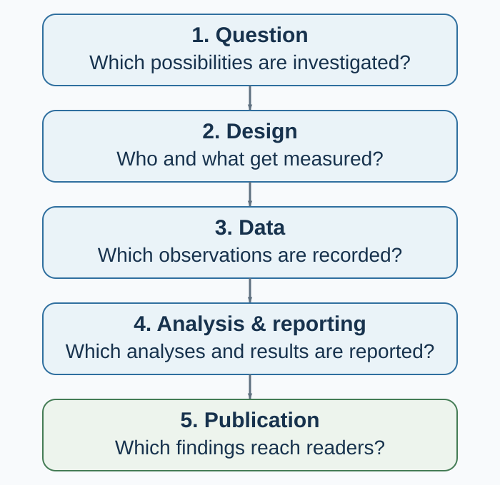
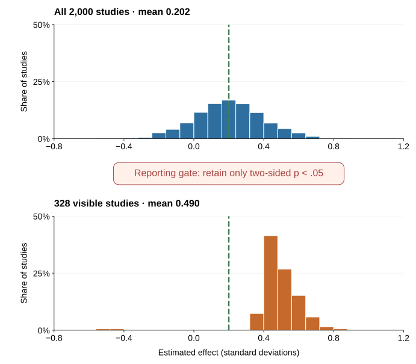

---
aliases:
  - appendix-d-when-evidence-breaks.html
  - appendix-e-when-evidence-breaks.html
---

# When Evidence Breaks: The Replication Crisis and Research Integrity

::: {.content-visible unless-format="epub"}
[]{#when-evidence-breaks-the-replication-crisis-and-research-integrity}
:::

*Publication bias, underpowered studies, data fabrication, and the systems that can correct them*

**Evidence map updated:** 10 September 2026. Replication findings and journal notices are dated below so that later evidence can revise the account.

Imagine that one hundred teams test promising interventions. You hear about the studies with striking positive results, while inconclusive studies attract little attention. Years later, larger replications produce a less impressive picture. Some effects recur, some become smaller, and others disappear.

Readers may already have used the original findings to recommend a policy, redesign a workplace, or teach a general lesson about behavior. The published studies may all have followed recognizable scientific procedures. Why, then, did their collective picture prove so much more convincing than the later evidence—and how could a reader have recognized the problem earlier?

To answer, follow a result from the original question to the article you read. Sampling variation matters, but so do decisions about what to measure, which analysis to report, and which results become visible. The same trail helps distinguish an uncertain effect from a flawed record; a failed replication alone cannot tell you that someone fabricated data.

{#fig-selected-evidence-pipeline fig-alt="Five vertical stages ask which possibilities are investigated, who and what are measured, which observations are recorded, which analyses are reported, and which findings reach readers."}

Each stage in @fig-selected-evidence-pipeline changes what readers can know. Preregistration records a plan; open code lets others check the calculation; replication collects new evidence. Their usefulness depends on the problem at that stage.

## When a striking result becomes less convincing {#what-the-replication-crisis-doesand-does-notmean}

Behavioral science uses the phrase **replication crisis** for accumulating evidence that some influential findings are less stable, smaller, or more context-dependent than the published literature initially suggested. “Crisis” captures the seriousness of the credibility problem.

Large coordinated projects document this change. The Open Science Collaboration attempted replications of 100 studies published in three psychology journals. Ninety-seven percent of the original studies reported statistically significant results, compared with 36% of the replications; the replication effects were, on average, about half the magnitude of the originals (Open Science Collaboration, 2015). Those numbers revealed substantial attenuation and uncertainty within the sampled literature.

In experimental economics, Camerer et al. (2016) replicated 18 laboratory studies from the *American Economic Review* and the *Quarterly Journal of Economics* using prespecified designs with at least 90% power to detect the original effect size. Eleven of the 18 replications found a significant effect in the original direction, and the average replicated effect was 66% of the original. This set contained both recurrence and attenuation.

“Statistically significant again” depends on sample size, noise, analysis, and threshold. An original and replication can fall on opposite sides of .05 while having compatible effect estimates. Two significant estimates can also disagree sharply in magnitude. Compare estimates and uncertainty, protocol fidelity, and context; a replication rate is not the proportion of a field that is true.

### A concrete update: watched eyes and the honesty box

Bateson, Nettle, and Roberts (2006) alternated pictures of eyes and flowers above the price list beside an honesty box in a university coffee room. Contributions per unit consumed were nearly three times as high during eye-image weeks as during flower-image weeks. The result suggested that even a minimal cue of observation might activate reputational concern.

The memorable image travelled further than the cumulative evidence justified. Northover et al. (2017) later reported two meta-analyses that found no reliable overall effect of artificial surveillance cues on generosity. The combined evidence provides little support for using eye images to increase generosity. An organization considering such a poster should test the relevant behavior in its own setting, rather than assume that the image creates accountability.

This is how scientific updating should work. Retain the original observation, widen the evidence base, revise the general claim, and identify the boundary conditions that future studies must test.

## Find out what kind of check was performed {#four-questions-that-are-often-confused}

A claim that a finding has been “checked” sounds reassuring. Reproducing its calculation, however, can leave an incorrect measure or a confounded comparison intact. Before relying on the finding, ask which source of uncertainty the check actually addressed.

| Question | What it asks | New data? | Main diagnostic |
| --- | --- | --- | --- |
| **Reproducibility** | Can the reported result be regenerated from the same data, code, and procedures? | No | Does the computational record reproduce the table, figure, and estimate? |
| **Replicability** | Does a new study addressing the same empirical claim obtain a consistent result? | Yes | How does the new estimate update the cumulative evidence? |
| **Robustness** | Does the conclusion survive reasonable alternative measurements, models, exclusions, or assumptions? | Not necessarily | Which defensible analytical choices change the conclusion? |
| **Generalizability** | Does the result travel to other people, tasks, institutions, treatments, outcomes, or times? | Usually | Which boundary conditions explain stability or heterogeneity? |
: Different credibility questions require different tests {#tbl-credibility-questions}

The terminology follows the National Academies’ useful distinction: **reproducibility** uses the same data and computational steps, whereas **replicability** obtains new data to address the same scientific question (National Academies of Sciences, Engineering, and Medicine, 2019). Disciplines sometimes use the words differently, so state the intended operation rather than relying on the label alone.

A perfectly reproduced analysis can still estimate the wrong construct. A robust association can still be confounded. A direct replication can establish stability under a narrow protocol without showing that the effect travels. These are complementary tests, not ranks on one ladder.

## Underpowered studies create a selection problem

Statistical power is the probability that a specified analysis will meet a specified decision criterion under a stated effect and data-generating process. Power therefore depends on more than the number of participants. It depends on the effect worth detecting, variance, measurement reliability, allocation, clustering, attrition, compliance, multiplicity, and the estimator.

Low power has an obvious consequence: real effects are often missed. Its less obvious consequence appears when only “successful” results become visible.

Suppose the true effect is small. Small studies will produce a wide distribution of estimates. Most will be inconclusive. A few will be large enough to cross a significance threshold. If journals, authors, or news outlets disproportionately select those few, the visible estimates will be unusually large. This is the **winner’s curse**: conditional on winning the selection contest, the estimate tends to overstate the underlying signal.

{#fig-selected-literature-simulation fig-alt="Two histograms compare all 2,000 simulated estimates with the 328 whose two-sided p-values are below .05. Their means are .202 and .490 standard deviations; the true effect is .20. The shared horizontal scale shows effect size, and the vertical scale shows the percentage of studies in each bin."}

@fig-selected-literature-simulation isolates one mechanism. The generator uses independent normal-outcome studies with true effect 0.20 standard deviations, outcome variance 1, 50 observations per arm, and seed 20260830. A known-variance, two-sided z test with alpha .05 gives each difference in means standard error 0.20 and theoretical power 17.0%. The significance-only rule makes 328 of 2,000 studies visible; their mean estimate is 0.490, about 2.5 times the true effect, and four have the wrong sign. The deterministic generator is `scripts/build_methods_appendix_figures.py`; its study-level output and parameter record are preserved in `figures/source/selected-literature-simulation.csv` and `.json`.

This creates two risks:

- **Type S error:** the estimated sign can be wrong.
- **Type M error:** the estimated magnitude can be severely exaggerated.

Gelman and Carlin (2014) emphasize that design analysis should examine these risks, not only conventional power. Button et al. (2013) showed how low power can undermine reliability in neuroscience, a warning that applies more broadly wherever small, noisy studies pass through a significance filter.

The reporting gate does not improve the underlying studies. A nonsignificant estimate may be too imprecise to rule out an important effect, while a significant estimate can still be badly exaggerated. Planning a useful study therefore begins with the effect worth detecting and the uncertainty a decision can tolerate, as in [Appendix E](appendix-e-how-behavioral-evidence-is-built.qmd).

## Flexible analysis creates many paths to a result

A dataset rarely dictates one analysis. Researchers may choose among outcomes, scale constructions, exclusion rules, covariates, transformations, subgroup definitions, stopping points, and model specifications. Each choice may be defensible alone. The problem arises when the result guides the choice and the final report hides the alternatives.

Simmons, Nelson, and Simonsohn (2011) demonstrated how undisclosed flexibility can raise false-positive rates while leaving a conventional report that looks orderly. Readers therefore need to know which decisions were made before and after the outcome pattern became visible.

Two processes should be separated:

- **Strategic selection or p-hacking:** analysis choices are repeatedly searched or selectively reported to obtain a preferred result.
- **Unrecorded researcher degrees of freedom:** reasonable choices branch as researchers learn from the data, but the final paper presents the surviving path as if it were the only path.

Intent differs, but the inferential problem overlaps: the nominal *p*-value or interval no longer reflects the full selection process.

The remedy is not to forbid exploration. Exploration is how new ideas are found. The remedy is to preserve the difference between **confirmation** and **discovery**. Preregister the primary outcomes, contrasts, exclusions, stopping rules, and analysis where possible. Report deviations. Label unexpected analyses as exploratory. Then test promising discoveries with new data.

## Publication bias changes what readers can see

Even perfectly analyzed studies do not enter the literature with equal probability. A result can disappear at several points:

1. the analysis is never completed;
2. the manuscript is never written;
3. the study is written but not submitted;
4. a journal rejects it;
5. a null outcome is omitted while another outcome is reported;
6. a published correction or failed replication receives less attention than the original claim.

The classic **file-drawer problem** is one part of this process. Selection can begin with the decision to write up a study and continue long after publication.

Franco, Malhotra, and Simonovits (2014) examined 221 studies conducted through one known social-science program, which allowed them to observe completed studies rather than only published papers. Studies with strong results were about 40 percentage points more likely to be published and 60 percentage points more likely to be written up than studies with null results. Much of the loss occurred before journal submission. The study is especially useful because the denominator was known.

Publication bias changes interpretation. A literature containing ten positive papers is not equivalent to ten positive studies if many unobserved null studies existed. Funnel plots and statistical selection models can diagnose some patterns, but they depend on assumptions and cannot recover studies or outcomes that were never recorded. The stronger response is prospective: register studies, link outcomes to protocols, encourage results-independent review, publish informative nulls, and preserve a discoverable record of completed work.

## Honest error, questionable practice, and misconduct are not the same

Scientific records contain mistakes. A cell is mislabeled. A merge duplicates rows. A reverse-coded item is not reversed. A researcher misunderstands a package default. Honest errors can be consequential, and scientists remain responsible for checking and correcting them. But an error is not automatically misconduct.

The United States Office of Research Integrity defines research misconduct as fabrication, falsification, or plagiarism in proposing, performing, reviewing, or reporting research, and explicitly excludes honest error and differences of opinion from the definition (Office of Research Integrity, n.d.). Its terms are useful beyond one jurisdiction:

- **Fabrication:** inventing observations or findings and presenting them as research.
- **Falsification:** altering, suppressing, or manipulating research inputs or outputs so that the record becomes misleading.
- **Plagiarism:** using someone else’s intellectual work without proper attribution.

Formal findings also require standards of evidence and mental state defined by the applicable institution and law. Suspicion, an unusual distribution, or a failed replication is not by itself proof.

Between honest error and formally established misconduct sits a wide range of **questionable research practices**: undisclosed outcome switching, opportunistic exclusions, misleading rounding, inadequate recordkeeping, selective citation, ghost variables, or presenting exploratory results as confirmatory. Some acts may be reckless or prohibited; others reflect weak training or ambiguous norms. The label does not remove the need to identify the exact action, evidence, intent standard, and policy.

Survey evidence suggests that fabrication and falsification occur, but prevalence estimates are difficult because the behavior is sensitive and definitions vary. Fanelli’s (2009) meta-analysis of survey studies found that 1.97% of scientists admitted at least one instance of fabricating, falsifying, or modifying data or results, while substantially larger shares admitted other questionable practices.[^appf-misconduct-survey]

An impossible value or duplicated observation warrants investigation, but the immediate task is to reproduce the discrepancy and check its provenance. Coding, versioning, and transcription errors can produce alarming patterns without fabrication. The correction procedure below keeps that distinction visible.

## Why incentives matter without removing responsibility

The one hundred teams in the opening example work within institutions that reward some contributions more visibly than others. Individual responsibility remains, but the incentives affect which findings readers eventually see.

Novel, clean, and positive results are easier to tell as stories. Hiring, promotion, funding, journal space, and media attention can reward speed and surprise more visibly than careful null results, replications, data curation, or corrections. When many career decisions depend on a small number of papers, researchers and institutions may optimize for publication rather than cumulative information.

The design task is therefore two-level:

- **Researcher level:** make choices traceable, distinguish planned from discovered analysis, preserve data provenance, and correct errors.
- **Institutional level:** reward credible process, replication, data stewardship, team contributions, and correction—not merely the count and novelty of positive findings.

Reform works when it changes both information and incentives.

## Safeguards and complementary checks {#safeguards-what-each-reform-can-and-cannot-do}

| Safeguard | What it strengthens | Complementary check |
| --- | --- | --- |
| **Design analysis and adequate precision** | Reduces exaggerated selected estimates; makes informative nulls more likely | Valid measurement, unbiased implementation, or generalizability |
| **Preregistration** | Time-stamps planned hypotheses, outcomes, and analyses; reveals deviations | Theory, measurement, compliance, and execution |
| **Registered Reports** | Reviews question and method before results; offers in-principle acceptance independent of outcome | Implementation and interpretation |
| **Open materials and code** | Enables inspection, reuse, and computational reproduction | Ethical release of confidential data or validity of the design |
| **Governed data access** | Balances verification with consent, privacy, and legal constraints | Access burden and re-identification risk |
| **Multi-analyst or multiverse analysis** | Shows sensitivity to defensible analytical choices | Credibility of each included model |
| **Direct and multi-site replication** | Estimates stability and heterogeneity under declared protocols | Transport to the target context |
| **Corrections and retractions** | Updates the visible record when evidence changes | Earlier citations, publicity, and downstream use |
: Safeguards solve different credibility problems {#tbl-research-safeguards}

**Registered Reports** move part of peer review before outcomes are known: journals evaluate the question and proposed method and can offer in-principle acceptance based on that plan rather than the direction of the findings (Chambers, 2013). The format weakens publication bias at the journal stage.

The Transparency and Openness Promotion guidelines encourage journals to state standards for citation, data, materials, code, design transparency, preregistration, and replication (Nosek et al., 2015). Credibility depends on interacting practices, incentives, and checks (Munafò et al., 2017; Nosek et al., 2018).

## How to interpret a replication

When an original and a replication disagree, proceed in this order.

1. **Reproduce each result.** Do the reported data and code generate the claims?
2. **Compare the estimands.** Did both studies estimate the same effect for the same treatment, outcome, population, and horizon?
3. **Inspect protocol fidelity.** Which materials, incentives, timing, exclusions, and implementation details changed?
4. **Compare estimates and intervals.** Ignore the temptation to reduce the pair to significant versus nonsignificant.
5. **Examine precision and selection.** Was the original small and selected? Was the replication powered for a plausible effect rather than the original point estimate alone?
6. **Test moderators cautiously.** A post hoc explanation is a new hypothesis until tested with new variation.
7. **Update cumulatively.** Combine the new evidence with prior studies under a transparent synthesis model; report heterogeneity and uncertainty.
8. **Narrow the claim.** If the effect depends on a population, material, institution, or period, make that condition part of the theory.

A failed replication can reveal that the effect was absent, smaller than thought, badly measured, analytically fragile, or conditional on an unrecognized feature. A successful replication can increase confidence under that protocol while leaving external validity open. Both outcomes are information.

## Before you repeat a finding {#how-to-read-a-behavioral-science-claim}

Use the short audit in [How to Read Evidence](../how-to-read-evidence.qmd), then look up the study in the [evidence-status map](#famous-findings-after-replication). Record the original comparison, the later update, and the sentence you would now be willing to teach. This last step forces the evidence review to change the claim.

## What to do when you find a serious problem

The first obligation is to the accuracy of the record, not to winning an argument.

1. Preserve the original files, metadata, logs, outputs, and correspondence. Do not alter source data.
2. Reproduce the discrepancy with a written, versioned procedure.
3. Check benign explanations: versions, filters, merges, coding, duplicated exports, unit conventions, and undocumented but legitimate decisions.
4. Describe the observable problem precisely. Separate what is known from what is inferred.
5. Use the relevant journal correction process or institutional research-integrity officer when misconduct may be involved. Requirements differ by jurisdiction and institution.
6. Protect confidential data and good-faith reporters. Do not circulate identifiable allegations beyond those who need to assess them.
7. Correct the public claim proportionately: erratum, corrected analysis, expression of concern, retraction, or a documented explanation that resolves the discrepancy.

A system that can reveal, investigate, and correct error strengthens the scientific record.

## Study and practice

Return to the one hundred teams. Suppose you can change only one feature of their research system: study precision, prospective registration, results-independent publication, or data and code preservation. Explain which problem your choice addresses and which would remain. Then compare a significant original estimate with a smaller nonsignificant replication: what information would you need before deciding whether they conflict?

::: {.callout-tip .activity icon=false}
## Activity: audit the evidence pipeline

A small original study reports a large intervention effect on one of six measured outcomes. The article discusses only that outcome and does not disclose its stopping rule. A larger preregistered replication estimates a much smaller effect with an interval spanning zero. The raw data and analysis code for the original are unavailable.

Do not vote “true” or “false.” Map the case onto @fig-selected-evidence-pipeline. Identify the uncertainty introduced at design, data, analysis, publication, and replication. Then propose: (a) the next study, (b) the cumulative claim that is warranted now, and (c) one institutional change that would have made the evidence easier to interpret.

Submit the completed pipeline, two distinct threats stated without alleging intent, the next test, the revised cumulative claim, and the institutional safeguard.
:::

## Famous findings after replication: an evidence-status map {#famous-findings-after-replication}

A list of “studies that failed to replicate” sounds simple but usually mixes different scientific events. A close direct replication may estimate almost no effect. A multilab project may find a much smaller average effect. A meta-analysis may find substantial heterogeneity. Better controls may weaken a predictive association without repeating the original study. A reanalysis may reveal a statistical artifact. A retraction concerns the reliability of the research record, not merely whether another team obtained a different estimate.

This map covers influential cases used in or closely related to the book. Each entry connects the memorable claim to a later test or correction. The [FORRT Replication Database](https://forrt.org/fred-apps/) provides a broader, evolving index of replication studies (Röseler et al., 2024).

::: {.callout-important icon=false}
## Read the status, not just the headline

- **Not reproduced** means that a strong direct or coordinated test did not recover the focal effect under the tested protocol.
- **Attenuated or conditional** means that the cumulative estimate is smaller, more heterogeneous, or more dependent on moderators than the famous version implies.
- **Reinterpreted** means that later controls or analysis changed what the evidence can identify; it is not necessarily a direct replication failure.
- **Retracted or integrity-qualified** records a problem with the original research record. Nonreplication alone is not evidence of misconduct.
:::

### Direct tests, coordinated replications, and integrity updates {#direct-or-coordinated-tests-that-did-not-reproduce-the-focal-result}

| Famous finding | Key update and defensible conclusion |
| --- | --- |
| **Elderly-word priming slows walking.** Bargh, Chen, and Burrows (1996) reported that exposure to words associated with old age made participants walk more slowly. | **Not reproduced under automated timing.** Doyen et al. (2012) did not recover the effect in a larger replication with automated measurement. A second experiment produced slowing only when experimenters expected it. Expectancy and implementation are plausible moderators. |
| **Professor priming improves trivia performance.** Dijksterhuis and van Knippenberg (1998) reported that activating the professor stereotype increased general-knowledge performance. | **Not reproduced in a registered multilab project.** Twenty-three eligible replications involving 4,493 participants produced no reliable professor-priming advantage (O'Donnell et al., 2018). |
| **Holding something warm produces interpersonal warmth.** Williams and Bargh (2008) reported warmer personality judgments and more prosocial choices after brief physical warmth. | **Not reproduced in two blinded replications.** Chabris et al. (2019) obtained near-zero estimates in two larger samples. |
| **Moral threat increases interest in cleansing—the “Macbeth effect.”** In Study 2, Zhong and Liljenquist (2006) reported greater interest in cleansing products after copying an unethical rather than an ethical first-person story. | **Not reproduced in three direct attempts at Study 2.** Earp et al. (2014) did not recover the predicted preference for cleansing products.[^appf-macbeth-protocol] |
| **Expansive “power poses” change hormones and risk taking.** Carney, Cuddy, and Yap (2010) reported higher testosterone, lower cortisol, and greater risk tolerance after brief expansive poses. | **Focal physiological and risk effects not reproduced.** Ranehill et al. (2015) found no effects on hormones or risk tolerance in a substantially larger sample, although self-reported feelings of power increased. |
| **A first act of self-control depletes a general resource.** Baumeister et al. (1998) launched the sequential-task account of ego depletion. | **Effects were near zero or small in coordinated tests.** A preregistered 23-laboratory replication of a later sequential-task protocol estimated a near-zero effect whose interval included zero (Hagger et al., 2016). A 36-site paradigmatic test also found a very small, nonsignificant effect (Vohs et al., 2021), while another multilab project found a small significant effect (Dang et al., 2021). The protocols leave room for explanations involving motivation, fatigue, and task design ([Ch. 39](../chapters/39-behavior-design-make-the-better-action-easier.qmd)). |
| **Mortality salience increases worldview defense.** Greenberg et al. (1994) reported more favorable evaluation of a pro-American author, relative to an anti-American author, after participants wrote about death. | **Not reproduced in Many Labs 4.** Seventeen laboratories and 1,550 participants found little evidence for the focal effect using both in-house and original-author-advised protocols (Klein et al., 2022). |
| **Distraction produces better complex decisions than conscious thought.** Dijksterhuis et al. (2006) reported an “unconscious-thought advantage” for multiattribute choices. | **Not reproduced in a large replication and unsupported by the small-study pattern.** Nieuwenstein et al. (2015) found no advantage in a sample of 399 and concluded that the meta-analytic pattern was concentrated in small studies. |
| **Ill-fated disease–birth-year combinations shorten Chinese-American lives.** Phillips, Ruth, and Wagner (1993) reported that Chinese-American decedents with combinations considered unfavorable in Chinese astrology and traditional medicine died 1.3–4.9 years earlier than expected. | **Not reproduced in independent years; the original specification was also challenged.** Smith (2006) found that a more direct and inclusive analysis of the 1969–1990 data provided little support for the claim, and California mortality records from 1960–1968 and 1991–2002 did not reproduce it. The reanalysis and independent years challenge both the original specification and its out-of-sample stability. |
| **Images of watching eyes increase generosity.** Bateson et al. (2006) reported higher coffee-room honesty-box contributions under eye images than under flower images. | **No reliable overall effect in two meta-analyses.** Northover et al. (2017) found that artificial surveillance cues did not reliably increase generosity. See the [worked case above](#a-concrete-update-watched-eyes-and-the-honesty-box). |
| **Recalling moral rules reduces cheating.** Mazar, Amir, and Ariely (2008) reported that recalling the Ten Commandments reduced dishonest reporting. | **Not reproduced; original article carries an expression of concern.** Twenty-five preregistered direct replications involving 5,786 participants found a small difference in the opposite direction (Verschuere et al., 2018). A 2024 journal notice separately identified reporting and data-provenance concerns. The notice records concerns about the article's evidence.[^appf-expression-of-concern] The moral-reminder result is unsupported by the direct replications ([Ch. 7](../chapters/07-the-narrator-after-choice-why-reasons-are-not-always-causes.qmd)). |
| **Signing an honesty statement first reduces cheating.** Shu et al. (2012) reported less dishonest reporting when people signed at the beginning rather than the end of a form. | **Not reproduced; original article retracted.** Five conceptual replications and a preregistered direct replication found no signing-first effect (Kristal et al., 2020). The original article was later retracted. The replication result updates the intervention claim; the retraction separately updates confidence in the original record. |
| **Evenly spaced external deadlines reduce procrastination and improve performance.** Ariely and Wertenbroch (2002) reported that imposed, evenly spaced deadlines outperformed self-set or end deadlines. | **Not reproduced; original article retracted on 2 September 2026.** Hyndman and Bisin's (2026) replication of Study 2 found negligible deadline effects and no advantage of evenly spaced deadlines. The journal retracted the original article because it could no longer attest to the findings' reliability; both authors agreed (Psychological Science, 2026). The replication challenges the spacing prescription ([Ch. 19](../chapters/19-intertemporal-decision-making-why-later-loses-to-now.qmd)). |
| **Holding a pen in the teeth makes cartoons funnier.** Strack, Martin, and Stepper (1988) used the pen-in-mouth task as evidence for facial feedback. | **Specific procedure not reproduced; broader mechanism has qualified support.** A 17-laboratory registered replication found essentially no pen-condition difference (Wagenmakers et al., 2016). A later 19-country multilab study found effects on reported happiness for voluntary smiles and facial mimicry, while evidence from the pen-in-mouth task was less conclusive (Coles et al., 2022). |

: Prominent direct and coordinated replication cases, updated 10 September 2026 {#tbl-famous-direct-replication-cases}

### Famous conclusions that became smaller, conditional, or different

These cases belong in the same teaching map because they are often described casually as “debunked.” That label discards the most useful information: what changed and what remains.

| Famous conclusion | Key update and defensible conclusion |
| --- | --- |
| **More choice demotivates—the jam-study story.** Iyengar and Lepper (2000) reported that a larger display attracted more attention but a smaller display produced more purchases. | **Attenuated and moderator-dependent.** Scheibehenne, Greifeneder, and Todd's (2010) meta-analysis found a near-zero mean effect with substantial heterogeneity; Chernev, Böckenholt, and Goodman (2015) identified conditions involving task difficulty, preference uncertainty, and decision goals. The cumulative evidence favors a conditional account of overload ([Chs. 2](../chapters/02-building-a-better-decision-alternatives-opportunity-cost-information-and-robustness.qmd) and [40](../chapters/40-choice-architecture-the-environment-gets-a-vote.qmd)). |
| **The marshmallow test reveals a stable trait that predicts life success.** Shoda, Mischel, and Peake (1990) reported associations between preschool delay and later competencies. | **Reinterpreted and attenuated.** Watts, Duncan, and Quan (2018) used a larger, more diverse sample. Among children whose mothers had not completed college, the association between waiting and adolescent achievement was smaller than in the original studies and fell by about two thirds after controls for family background, early cognitive ability, and home environment. Experiences of an experimenter's reliability can also change waiting (Kidd et al., 2013; [Ch. 19](../chapters/19-intertemporal-decision-making-why-later-loses-to-now.qmd)). |
| **Stereotype threat explains performance gaps.** Classic experiments showed that identity-relevant cues can impair performance (Steele & Aronson, 1995; Spencer, Steele, & Quinn, 1999). | **Conditional and smaller in operationally realistic settings.** Meta-analytic estimates vary with domain, design, setting, and publication selection; effects in settings resembling real high-stakes testing are negligible to small (Flore & Wicherts, 2015; Shewach et al., 2019). The operational setting is central to interpreting the effect ([Ch. 5](../chapters/05-expectations-when-predictions-become-causes.qmd)). |
| **Reminders of money make people self-sufficient and less prosocial.** Vohs, Mead, and Goode (2006) reported a broad package of effects across nine experiments. | **Heterogeneous and sensitive to study selection.** Lodder et al.'s (2019) meta-analysis found a positive overall average with indications of publication bias. The 47 preregistered experiments, most of which tested system justification, averaged near zero. Evaluate the evidence for each cue and outcome. |
| **Explicitly naming a forgone use of money reduces purchasing.** Frederick et al. (2009) reported that adding “keep the money for other purchases” shifted some participants away from buying. | **Replicated on average, but smaller than the original impression.** A meta-analysis of 39 experiments found a reliable but modest effect, mainly in hypothetical decisions (Maguire et al., 2023). Making opportunity cost visible can change reported choice ([Ch. 2](../chapters/02-building-a-better-decision-alternatives-opportunity-cost-information-and-robustness.qmd#name-the-opportunity-cost)). |
| **People falsely believe in the hot hand.** Gilovich, Vallone, and Tversky (1985) treated basketball streak beliefs as a cognitive illusion. | **Reinterpreted by statistical correction, not a failed replication.** Miller and Sanjurjo (2018) showed that the conventional within-sequence comparison was biased against detecting positive dependence and found evidence consistent with hot-hand performance. The statistical correction changes the interpretation of the original result. |

: Famous findings revised by later evidence and analysis {#tbl-famous-qualified-replication-cases}

A changed conclusion can come from new data, a better comparison, or a correction to the record. The distinction matters: Smith (2006), for example, both reanalyzed the original Chinese-American mortality period and tested independent years. The first operation assessed robustness; the second assessed replication.

[^appf-misconduct-survey]: The surveys differed in date, population, and definitions, and self-reports may understate misconduct. The 1.97% is the meta-analytic estimate from the included surveys.

[^appf-macbeth-protocol]: These replications tested Study 2’s product-preference effect, not the original article’s separate washing-and-helping result.

[^appf-expression-of-concern]: An expression of concern is distinct from a retraction or a finding of fraud.

## References cited in this appendix

::: {.reference}
Ariely, D., & Wertenbroch, K. (2002). Procrastination, deadlines, and performance: Self-control by precommitment. *Psychological Science, 13*(3), 219–224. **Retracted September 2026.**
:::

::: {.reference}
Bargh, J. A., Chen, M., & Burrows, L. (1996). Automaticity of social behavior: Direct effects of trait construct and stereotype activation on action. *Journal of Personality and Social Psychology, 71*(2), 230–244. https://doi.org/10.1037/0022-3514.71.2.230
:::

::: {.reference}
Bateson, M., Nettle, D., & Roberts, G. (2006). Cues of being watched enhance cooperation in a real-world setting. *Biology Letters, 2*(3), 412–414. https://doi.org/10.1098/rsbl.2006.0509
:::

::: {.reference}
Baumeister, R. F., Bratslavsky, E., Muraven, M., & Tice, D. M. (1998). Ego depletion: Is the active self a limited resource? *Journal of Personality and Social Psychology, 74*(5), 1252–1265. https://doi.org/10.1037/0022-3514.74.5.1252
:::

::: {.reference}
Button, K. S., Ioannidis, J. P. A., Mokrysz, C., Nosek, B. A., Flint, J., Robinson, E. S. J., & Munafò, M. R. (2013). Power failure: Why small sample size undermines the reliability of neuroscience. *Nature Reviews Neuroscience, 14*, 365–376.
:::

::: {.reference}
Camerer, C. F., Dreber, A., Forsell, E., Ho, T.-H., Huber, J., Johannesson, M., Kirchler, M., Almenberg, J., Altmejd, A., Chan, T., Heikensten, E., Holzmeister, F., Imai, T., Isaksson, S., Nave, G., Pfeiffer, T., Razen, M., & Wu, H. (2016). Evaluating replicability of laboratory experiments in economics. *Science, 351*(6280), 1433–1436.
:::

::: {.reference}
Carney, D. R., Cuddy, A. J. C., & Yap, A. J. (2010). Power posing: Brief nonverbal displays affect neuroendocrine levels and risk tolerance. *Psychological Science, 21*(10), 1363–1368. https://doi.org/10.1177/0956797610383437
:::

::: {.reference}
Chabris, C. F., Heck, P. R., Mandart, J., Benjamin, D. J., & Simons, D. J. (2019). No evidence that experiencing physical warmth promotes interpersonal warmth: Two failures to replicate Williams and Bargh (2008). *Social Psychology, 50*(2), 127–132. https://doi.org/10.1027/1864-9335/a000361
:::

::: {.reference}
Chambers, C. D. (2013). Registered Reports: A new publishing initiative at Cortex. *Cortex, 49*(3), 609–610.
:::

::: {.reference}
Chernev, A., Böckenholt, U., & Goodman, J. (2015). Choice overload: A conceptual review and meta-analysis. *Journal of Consumer Psychology, 25*(2), 333–358.
:::

::: {.reference}
Coles, N. A., March, D. S., Marmolejo-Ramos, F., Larsen, J. T., Arinze, N. C., et al. (2022). A multi-lab test of the facial feedback hypothesis by the Many Smiles Collaboration. *Nature Human Behaviour, 6*(12), 1731–1742. https://doi.org/10.1038/s41562-022-01458-9
:::

::: {.reference}
Dang, J., Barker, P., Baumert, A., Bentvelzen, M., Berkman, E., et al. (2021). A multilab replication of the ego depletion effect. *Social Psychological and Personality Science, 12*(1), 14–24. https://doi.org/10.1177/1948550619887702
:::

::: {.reference}
Dijksterhuis, A., Bos, M. W., Nordgren, L. F., & van Baaren, R. B. (2006). On making the right choice: The deliberation-without-attention effect. *Science, 311*(5763), 1005–1007. https://doi.org/10.1126/science.1121629
:::

::: {.reference}
Dijksterhuis, A., & van Knippenberg, A. (1998). The relation between perception and behavior, or how to win a game of Trivial Pursuit. *Journal of Personality and Social Psychology, 74*(4), 865–877. https://doi.org/10.1037/0022-3514.74.4.865
:::

::: {.reference}
Doyen, S., Klein, O., Pichon, C.-L., & Cleeremans, A. (2012). Behavioral priming: It's all in the mind, but whose mind? *PLOS ONE, 7*(1), e29081. https://doi.org/10.1371/journal.pone.0029081
:::

::: {.reference}
Earp, B. D., Everett, J. A. C., Madva, E. N., & Hamlin, J. K. (2014). Out, damned spot: Can the “Macbeth effect” be replicated? *Basic and Applied Social Psychology, 36*(1), 91–98. https://doi.org/10.1080/01973533.2013.856792
:::

::: {.reference}
Fanelli, D. (2009). How many scientists fabricate and falsify research? A systematic review and meta-analysis of survey data. *PLOS ONE, 4*(5), e5738.
:::

::: {.reference}
Flore, P. C., & Wicherts, J. M. (2015). Does stereotype threat influence performance of girls in stereotyped domains? A meta-analysis. *Journal of School Psychology, 53*(1), 25–44.
:::

::: {.reference}
Franco, A., Malhotra, N., & Simonovits, G. (2014). Publication bias in the social sciences: Unlocking the file drawer. *Science, 345*(6203), 1502–1505.
:::

::: {.reference}
Frederick, S., Novemsky, N., Wang, J., Dhar, R., & Nowlis, S. (2009). Opportunity cost neglect. *Journal of Consumer Research, 36*(4), 553–561.
:::

::: {.reference}
Gelman, A., & Carlin, J. (2014). Beyond power calculations: Assessing Type S (sign) and Type M (magnitude) errors. *Perspectives on Psychological Science, 9*(6), 641–651.
:::

::: {.reference}
Gilovich, T., Vallone, R., & Tversky, A. (1985). The hot hand in basketball: On the misperception of random sequences. *Cognitive Psychology, 17*(3), 295–314.
:::

::: {.reference}
Greenberg, J., Pyszczynski, T., Solomon, S., Simon, L., & Breus, M. (1994). Role of consciousness and accessibility of death-related thoughts in mortality salience effects. *Journal of Personality and Social Psychology, 67*(4), 627–637. https://doi.org/10.1037/0022-3514.67.4.627
:::

::: {.reference}
Hagger, M. S., Chatzisarantis, N. L. D., Alberts, H., Anggono, C. O., Batailler, C., Birt, A. R., Brand, R., Brandt, M. J., Brewer, G., Bruyneel, S., Calvillo, D. P., Campbell, W. K., Cannon, P. R., Carlucci, M., Carruth, N. P., Cheung, T., Crowell, A., De Ridder, D. T. D., Dewitte, S., et al. (2016). A multilab preregistered replication of the ego-depletion effect. Perspectives on Psychological Science, 11(4), 546-573.
:::

::: {.reference}
Hyndman, K., & Bisin, A. (2026). Replication of “Procrastination, deadlines, and performance: Self-control by precommitment.” Psychological Science, 37(8), 557–571. https://doi.org/10.1177/09567976261460772
:::

::: {.reference}
Iyengar, S. S., & Lepper, M. R. (2000). When choice is demotivating: Can one desire too much of a good thing? *Journal of Personality and Social Psychology, 79*(6), 995–1006.
:::

::: {.reference}
Kidd, C., Palmeri, H., & Aslin, R. N. (2013). Rational snacking: Young children's decision-making on the marshmallow task is moderated by beliefs about environmental reliability. *Cognition, 126*(1), 109–114.
:::

::: {.reference}
Klein, R. A., Cook, C. L., Ebersole, C. R., Vitiello, C., Nosek, B. A., Hilgard, J., et al. (2022). Many Labs 4: Failure to replicate mortality salience effect with and without original author involvement. *Collabra: Psychology, 8*(1), 35271. https://doi.org/10.1525/collabra.35271
:::

::: {.reference}
Kristal, A. S., Whillans, A. V., Bazerman, M. H., Gino, F., Shu, L. L., Mazar, N., & Ariely, D. (2020). Signing at the beginning versus at the end does not decrease dishonesty. *Proceedings of the National Academy of Sciences, 117*(13), 7103–7107. https://doi.org/10.1073/pnas.1911695117
:::

::: {.reference}
Lodder, P., Ong, H. H., Grasman, R. P. P. P., & Wicherts, J. M. (2019). A comprehensive meta-analysis of money priming. *Journal of Experimental Psychology: General, 148*(4), 688–712. https://doi.org/10.1037/xge0000570
:::

::: {.reference}
Maguire, A., Persson, E., & Tinghög, G. (2023). Opportunity cost neglect: A meta-analysis. *Journal of the Economic Science Association, 9*(2), 176–192.
:::

::: {.reference}
Miller, J. B., & Sanjurjo, A. (2018). Surprised by the hot hand fallacy? A truth in the law of small numbers. *Econometrica, 86*(6), 2019–2047.
:::

::: {.reference}
Munafò, M. R., Nosek, B. A., Bishop, D. V. M., Button, K. S., Chambers, C. D., Percie du Sert, N., Simonsohn, U., Wagenmakers, E.-J., Ware, J. J., & Ioannidis, J. P. A. (2017). A manifesto for reproducible science. *Nature Human Behaviour, 1*, 0021.
:::

::: {.reference}
National Academies of Sciences, Engineering, and Medicine. (2019). *Reproducibility and replicability in science.* National Academies Press.
:::

::: {.reference}
Nieuwenstein, M. R., Wierenga, T., Morey, R. D., Wicherts, J. M., Blom, T. N., Wagenmakers, E.-J., & van Rijn, H. (2015). On making the right choice: A meta-analysis and large-scale replication attempt of the unconscious thought advantage. *Judgment and Decision Making, 10*(1), 1–17.
:::

::: {.reference}
Northover, S. B., Pedersen, W. C., Cohen, A. B., & Andrews, P. W. (2017). Artificial surveillance cues do not increase generosity: Two meta-analyses. *Evolution and Human Behavior, 38*(1), 144–153. https://doi.org/10.1016/j.evolhumbehav.2016.07.001
:::

::: {.reference}
Nosek, B. A., Alter, G., Banks, G. C., Borsboom, D., Bowman, S. D., Breckler, S. J., Buck, S., Chambers, C. D., Chin, G., Christensen, G., Contestabile, M., Dafoe, A., Eich, E., Freese, J., Glennerster, R., Goroff, D., Green, D. P., Hesse, B., Humphreys, M., ... Yarkoni, T. (2015). Promoting an open research culture. *Science, 348*(6242), 1422–1425.
:::

::: {.reference}
Nosek, B. A., Ebersole, C. R., DeHaven, A. C., & Mellor, D. T. (2018). The preregistration revolution. *Proceedings of the National Academy of Sciences, 115*(11), 2600–2606.
:::

::: {.reference}
Office of Research Integrity. (n.d.). Definition of research misconduct. U.S. Department of Health and Human Services. https://ori.hhs.gov/definition-research-misconduct
:::

::: {.reference}
O'Donnell, M., Nelson, L. D., Ackermann, E., Aczel, B., Akhtar, A., et al. (2018). Registered Replication Report: Dijksterhuis and van Knippenberg (1998). *Perspectives on Psychological Science, 13*(2), 268–294. https://doi.org/10.1177/1745691618755704
:::

::: {.reference}
Open Science Collaboration. (2015). Estimating the reproducibility of psychological science. *Science, 349*(6251), aac4716.
:::

::: {.reference}
Phillips, D. P., Ruth, T. E., & Wagner, L. M. (1993). Psychology and survival. *The Lancet, 342*(8880), 1142–1145. https://doi.org/10.1016/0140-6736(93)92124-C
:::

::: {.reference}
Ranehill, E., Dreber, A., Johannesson, M., Leiberg, S., Sul, S., & Weber, R. A. (2015). Assessing the robustness of power posing: No effect on hormones and risk tolerance in a large sample of men and women. *Psychological Science, 26*(5), 653–656. https://doi.org/10.1177/0956797614553946
:::

::: {.reference}
Röseler, L., Kaiser, L., Doetsch, C., Klett, N., Seida, C., Schütz, A., et al. (2024). The Replication Database: Documenting the replicability of psychological science. *Journal of Open Psychology Data, 12*, 8. https://doi.org/10.5334/jopd.101
:::

::: {.reference}
Scheibehenne, B., Greifeneder, R., & Todd, P. M. (2010). Can there ever be too many options? A meta-analytic review of choice overload. *Journal of Consumer Research, 37*(3), 409–425.
:::

::: {.reference}
Shewach, O. R., Sackett, P. R., & Quint, S. (2019). Stereotype threat effects in settings with features likely versus unlikely in operational test settings: A meta-analysis. *Journal of Applied Psychology, 104*(12), 1514–1534. https://doi.org/10.1037/apl0000420
:::

::: {.reference}
Shoda, Y., Mischel, W., & Peake, P. K. (1990). Predicting adolescent cognitive and self-regulatory competencies from preschool delay of gratification: Identifying diagnostic conditions. *Developmental Psychology, 26*(6), 978–986. https://doi.org/10.1037/0012-1649.26.6.978
:::

::: {.reference}
Shu, L. L., Mazar, N., Gino, F., Ariely, D., & Bazerman, M. H. (2012). Signing at the beginning makes ethics salient and decreases dishonest self-reports in comparison to signing at the end. *Proceedings of the National Academy of Sciences, 109*(38), 15197–15200. https://doi.org/10.1073/pnas.1209746109. **Retracted.**
:::

::: {.reference}
Simmons, J. P., Nelson, L. D., & Simonsohn, U. (2011). False-positive psychology: Undisclosed flexibility in data collection and analysis allows presenting anything as significant. *Psychological Science, 22*(11), 1359–1366.
:::

::: {.reference}
Smith, G. (2006). The five elements and Chinese-American mortality. *Health Psychology, 25*(1), 124–129. https://doi.org/10.1037/0278-6133.25.1.124
:::

::: {.reference}
Spencer, S. J., Steele, C. M., & Quinn, D. M. (1999). Stereotype threat and women's math performance. *Journal of Experimental Social Psychology, 35*(1), 4–28.
:::

::: {.reference}
Steele, C. M., & Aronson, J. (1995). Stereotype threat and the intellectual test performance of African Americans. *Journal of Personality and Social Psychology, 69*(5), 797–811.
:::

::: {.reference}
Strack, F., Martin, L. L., & Stepper, S. (1988). Inhibiting and facilitating conditions of the human smile: A nonobtrusive test of the facial feedback hypothesis. *Journal of Personality and Social Psychology, 54*(5), 768–777. https://doi.org/10.1037/0022-3514.54.5.768
:::

::: {.reference}
Vohs, K. D., Mead, N. L., & Goode, M. R. (2006). The psychological consequences of money. *Science, 314*(5802), 1154–1156. https://doi.org/10.1126/science.1132491
:::

::: {.reference}
Vohs, K. D., Schmeichel, B. J., Lohmann, S., Gronau, Q. F., Finley, A. J., et al. (2021). A multisite preregistered paradigmatic test of the ego-depletion effect. *Psychological Science, 32*(10), 1566–1581. https://doi.org/10.1177/0956797621989733
:::

::: {.reference}
Wagenmakers, E.-J., Beek, T., Dijkhoff, L., Gronau, Q. F., Acosta, A., et al. (2016). Registered Replication Report: Strack, Martin, & Stepper (1988). *Perspectives on Psychological Science, 11*(6), 917–928. https://doi.org/10.1177/1745691616674458
:::

::: {.reference}
Watts, T. W., Duncan, G. J., & Quan, H. (2018). Revisiting the marshmallow test: A conceptual replication investigating links between early delay of gratification and later outcomes. *Psychological Science, 29*(7), 1159–1177. https://doi.org/10.1177/0956797618761661
:::

::: {.reference}
Williams, L. E., & Bargh, J. A. (2008). Experiencing physical warmth promotes interpersonal warmth. *Science, 322*(5901), 606–607. https://doi.org/10.1126/science.1162548
:::

::: {.reference}
Zhong, C.-B., & Liljenquist, K. (2006). Washing away your sins: Threatened morality and physical cleansing. *Science, 313*(5792), 1451–1452. https://doi.org/10.1126/science.1130726
:::

::: {.reference}
Mazar, N., Amir, O., & Ariely, D. (2008). The dishonesty of honest people: A theory of self-concept maintenance. *Journal of Marketing Research, 45*(6), 633–644. https://doi.org/10.1509/jmkr.45.6.633. **Expression of concern published in 2024.**
:::

::: {.reference}
Journal of Marketing Research. (2024). Expression of concern: “The dishonesty of honest people: A theory of self-concept maintenance.” *Journal of Marketing Research, 61*(6), 1183. https://doi.org/10.1177/00222437241285882
:::

::: {.reference}
Verschuere, B., Meijer, E. H., Jim, A., Hoogesteyn, K., Orthey, R., et al. (2018). Registered Replication Report on Mazar, Amir, and Ariely (2008). *Advances in Methods and Practices in Psychological Science, 1*(3), 299–317. https://doi.org/10.1177/2515245918781032
:::

::: {.reference}
Psychological Science. (2026, September 2). Retraction: Procrastination, deadlines, and performance: Self-control by precommitment. *Psychological Science*. Advance online publication. https://doi.org/10.1177/09567976261488042
:::
