% Decision, Persuasion, and Negotiation
% Huanren Warren Zhang
% 2026 Edition

# Preface: The Decision Point Is Usually Too Late

A visible choice is the end of a hidden process. Before anyone signs, buys, rejects, concedes, or walks away, attention has selected evidence, perception has interpreted it, expectations have shaped what seems likely, valuation has determined what matters, social cues have altered the field, and previous choices have become habits. This book begins upstream.

The revised structure follows a continuous movement from individual judgment to social influence, communication, negotiation, and decision hygiene. Each short chapter can be read independently, but the sequence is cumulative.

# Part 1. The Architecture of Choice

From the visible choice to the hidden processes of attention, prediction, valuation, and expectation.

# Chapter 1. The Choice Is the Tip of the Iceberg

*Decision-making begins before the moment of choice*

<aside class="callout core-idea">
CORE IDEA

To understand a choice, move upstream: ask what entered attention, which options appeared, what was predicted, what was valued, what was sacrificed, and what feedback will follow.
</aside>

## Learning goals

- Map a decision as a loop rather than a single moment.
- Separate prediction from valuation.
- Distinguish decision quality from outcome quality.
- Apply the decision loop to persuasion and negotiation.

<aside class="callout scientific-caution">
SCIENTIFIC CAUTION

The Google advertising arrow and the reported Mars-bar response to Mars publicity are useful business anecdotes, not controlled demonstrations. In this book, anecdotes open questions; they do not establish effect sizes or general laws.
</aside>

Imagine that you are choosing between two job offers. The first comes from a prestigious consulting firm. The salary is high, the brand name is powerful, and the career path is clear. Your classmates congratulate you. Your family thinks it is the obvious choice.

The second offer comes from a smaller sustainability start-up. The salary is lower, the company is less secure, and the future is uncertain. But the work feels meaningful. You would have more autonomy, more responsibility, and perhaps more opportunity to learn quickly.

Which job should you choose?

At first, the decision looks like a comparison between salary and meaning, prestige and autonomy, security and uncertainty. But the more carefully you look, the more complicated it becomes. What will you actually learn in each role? How stable is each organization? How much risk can you tolerate? How important is income at this stage of life? What will each job make possible five years from now? Which values are yours, and which are borrowed from family, peers, or status signals? What are you giving up by choosing one path rather than another?

Now change the setting. A marketing director must hire a product manager. A venture investor can fund only two of several start-ups. A university must decide whether to launch a new executive program. A negotiator must accept, reject, or redesign a proposed deal. These cases differ in content, but they share a structure: alternatives, incomplete information, uncertain consequences, values, constraints, trade-offs, action, and feedback.

That shared structure is why decision-making needs a science. A scientific approach gives us concepts for naming the parts of a decision, models for clarifying what coherent choice would require, evidence about how real people actually judge and choose, and tools for improving decisions in personal, organizational, social, and strategic life.

## The hidden process

When people explain a decision, they usually begin near the end of the process: "I chose the consulting job because it had better prospects"; "We hired her because she was the strongest candidate"; "I bought the product because it offered the best value"; "We launched the program because demand was strong." These explanations may be partly correct. They are rarely the whole causal story.

The distinction among normative, descriptive, and prescriptive decision science follows a long tradition of formal decision theory, bounded rationality, and decision-improvement research (Edwards, 1954; Simon, 1955; Milkman et al., 2009).

Before the choice became visible, some information entered attention and other information did not. Some alternatives appeared while others remained invisible. Some outcomes were imagined vividly, while others stayed abstract. Some sources were trusted and others discounted. Some values felt urgent because they were tied to identity, emotion, or social approval. The environment made some actions easy and others effortful.

The visible choice is therefore the tip of an iceberg. Beneath it lies a process of noticing, interpreting, predicting, valuing, comparing, acting, and learning. Decision science begins by making this process visible and inspectable.

## The decision loop

<figure class="book-figure">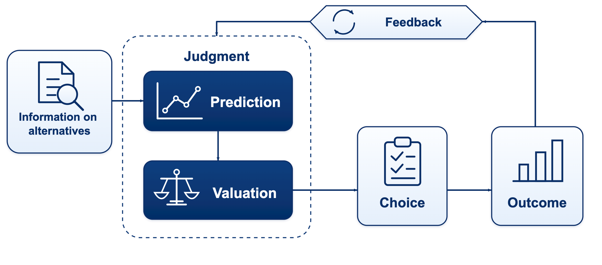<figcaption>Figure 1.1. The decision loop separates prediction from valuation and treats feedback as an input to future choices.</figcaption></figure>

A useful organizing model is the decision loop. Alternatives and information enter judgment. Judgment includes at least two distinguishable tasks: prediction and valuation. Prediction concerns what is true or likely; valuation concerns how desirable, costly, fair, meaningful, or unacceptable possible outcomes would be. Judgment supports choice. Choice produces an outcome. Outcomes provide feedback that may update later beliefs, values, habits, and option sets.

The loop is deliberately simple. It is not a claim that the mind always processes information in a fixed order, or that every stage is conscious. Prediction and valuation often interact. Feedback may arrive before the outcome is complete. People can revisit alternatives after learning something new. The value of the model is functional: it tells us which questions a decision requires and where errors can enter.

## Options are made, not merely received

We rarely choose in a vacuum. We choose among options, but the options we notice are not necessarily the only feasible options. A student choosing between two jobs may be able to negotiate, ask for more time, continue searching, accept one role temporarily, or create a hybrid arrangement. A company choosing between suppliers may split the contract, redesign the product, delay production, or build internal capacity. A government considering two policies may pilot one, combine elements, or redefine the problem.

Decision quality therefore depends partly on option quality. Careful evaluation cannot rescue a choice set that excludes the best alternative. Chapter 3 develops this point through feasible sets and opportunity cost.

## Facts and values answer different questions

Prediction asks what is likely to happen. Valuation asks how good or bad an outcome would be. A university considering an executive program may predict enrollment, willingness to pay, competitor response, and faculty workload. It must separately value revenue, mission fit, learning, reputation, staff burden, and risk.

The distinction is simple but powerful. A person who wants a project to succeed may overestimate its probability. A person who fears relocation may persuade themselves that a distant job has poor prospects. A group may appear to disagree about "risk" when one person means a high probability of failure and another means that even a low probability would be unacceptable. Good discussion identifies whether disagreement concerns facts, forecasts, values, constraints, or trade-offs.

## The loop is functional, not always conscious

The decision loop should not be mistaken for a conscious checklist that people execute before every action. Much ordinary behavior is fast, cue-driven, and automatic. A phone lights up; attention shifts; the cue predicts possible social information; checking acquires immediate value; the hand moves. A familiar route, routine purchase, greeting, or practiced professional response can unfold with little explicit deliberation.

Automaticity is not a defect. Skilled driving, fluent reading, expert pattern recognition, and routine coordination depend on processes that no longer require step-by-step conscious control. Intuition can reflect compressed expertise when an environment contains learnable regularities and provides sufficiently rapid, accurate feedback. Chess and some operational settings can meet these conditions. Long-horizon strategy, many hiring judgments, political forecasting, and novel investments often do not.

The same efficiency that supports expertise also creates vulnerability. Familiarity can be mistaken for truth. A default can become a choice without reflection. A vivid anecdote can crowd out a base rate. Social pressure can suppress a private concern. A short-term reward can dominate a delayed objective. Decision science does not ask whether automatic processing is good or bad in general. It asks when it is well trained, when it is misled, and where a pause or external aid would improve the loop.

## Outcome is not process

A good decision can produce a bad outcome, and a poor decision can produce a favorable outcome. Uncertainty separates process quality from result quality.

Outcome bias and hindsight bias show why a good process cannot be reconstructed reliably from the result alone (Baron & Hershey, 1988; Fischhoff, 1975).

An investor may buy a stock after one enthusiastic social-media post and make money. The outcome is favorable, but the reasoning may have been reckless. Another investor may diversify, use sound evidence, and lose money during an unexpected market shock. The outcome is unfavorable, but the process may have been defensible. A surgeon can recommend the treatment best supported by the available evidence and still encounter a rare complication. A negotiator can reject a poor agreement and later discover that conditions changed unexpectedly.

Outcome bias is the tendency to judge a decision mainly by its result rather than by the quality of the process that produced it. Hindsight bias makes an event seem more predictable after it occurs than it was beforehand. Together, these biases corrupt learning: luck can reward a bad process, while an unlucky result can discredit a good one.

Feedback therefore does not automatically create wisdom. A useful review reconstructs what was known at the time, what alternatives were considered, what probabilities were assigned, which values mattered, and which assumptions were uncertain. Learning requires a record that outcome knowledge cannot rewrite.

## Defaults, frames, decoys, and social cues

Framing changes interpretation rather than the underlying arithmetic. A 90 percent survival statement and a 10 percent mortality statement are extensionally equivalent, yet they direct attention toward different outcomes. In consequential medical or policy communication, the practical response is not to choose the most persuasive frame in secret. It is to use transparent absolute frequencies, show complementary frames where appropriate, and explain uncertainty.

Defaults change what happens when the chooser does nothing. They can reduce effort, signal a recommendation, create a sense of normality, and shift responsibility for departure. Automatic enrollment can help translate a stated intention into action, but a low savings default can also anchor contributions downward. In organ donation, registration or stated consent is only one link in a larger clinical and institutional process.

Decoys and option order change comparison. An asymmetrically dominated option can make another option easier to justify even when the decoy is rarely selected. The lesson is not that every third option manipulates choice; it is that the choice set defines contrasts and can reveal or manufacture apparent value. Ethical design removes misleading dominated options or explains why they are present.

Social cues and motive-message fit change meaning. A watching-eyes image may activate reputational concern in some settings, but the evidence does not support a universal effect. Social-proof and distinctiveness appeals may also work differently depending on active motives and reference groups. Responsible application requires testing the mechanism in the actual population rather than importing a memorable result as a recipe.

## One architecture across the course

The decision loop is the common foundation of Decision, Persuasion, and Negotiation.

In a decision, a person manages their own model: which situation they are in, what options exist, what is likely to happen, what matters, and what can be learned. In persuasion, one person tries to influence another person's attention, interpretation, beliefs, values, or willingness to act. In negotiation, two or more parties make interdependent choices while forming models of one another's interests, alternatives, constraints, credibility, and likely moves.

This framing improves both effectiveness and ethics. Persuasion is not simply adding more facts; facts matter only when they are noticed, understood, relevant, and trusted. Negotiation is not merely exchanging offers; questions can reveal hidden constraints, change beliefs about feasibility, and create options that neither side saw initially. In all three domains, model humility matters: the decision-maker's representation is not reality itself.

## Mini-case: the executive program

A university is considering an executive program. One professor says, "It will be prestigious." Another says, "The market is too small." A third says, "Competitors are already doing it." A fourth says, "We should not become too commercial." A fifth says, "Executives will pay." A sixth says, "We tried something similar ten years ago and it failed."

The discussion is confused because participants are talking about different parts of the loop. Prestige and mission are values. Market size, willingness to pay, faculty workload, and competitor response are predictions. The prior failure is feedback whose relevance must be assessed. The visible yes-or-no question hides alternatives such as a pilot, partnership, shorter certificate, delayed launch, or no launch.

## Transfer: career choice

The consulting-versus-start-up case should not be reduced to a personality test. The student can expand the feasible set by negotiating location, role, start date, compensation, or learning opportunities; asking for more time; continuing the search; or accepting a reversible trial arrangement. Forecasts concern organizational survival, workload, learning, advancement, and future options. Values concern income, autonomy, mission, health, family time, identity, and tolerance for risk. The best choice depends on both, together with the opportunity cost of the path not taken.

## Transfer: hiring

Hiring is a prediction problem with normative constraints. The organization must predict future job performance while deciding which contributions count as valuable and which criteria are legally and ethically legitimate. Confidence, warmth, accent, prestige, or similarity can become a global impression before evidence is structured. A better process defines success in advance, specifies evidence sources, uses comparable questions and work samples, records judgments independently, and later checks whether the criteria predicted performance. Structure does not eliminate judgment; it makes the judgment inspectable.

## Transfer: venture investment

A charismatic founder and an exciting technology can make a vivid future easy to simulate. The investor should ask which claims are forecasts, which are values, and which assumptions drive the thesis. Relevant outside-view questions include survival rates for similar firms, time to product-market fit, financing needs, customer acquisition, and regulatory exposure. Due diligence has value when it can change the ranking or reveal a staged option. Some uncertainty is reducible through tests; some is irreducible and must be priced, diversified, or accepted.

## Transfer: negotiation

Negotiators often treat the visible offer as the complete choice set and argue over one dimension such as price. A decision-loop analysis distinguishes predictions about the other side, values attached to issues, constraints, BATNAs, and information worth learning. Questions about timing, risk, implementation, confidentiality, warranties, future volume, reputation, or decision authority can reveal trades that neither side initially represented. The choice may improve not because one party calculates better inside the old menu, but because the parties create a better menu.

*Table 1.1  A practical map of the decision loop*

| Component | Core question | Common failure | Practical habit |
| --- | --- | --- | --- |
| Alternatives | What can be done? | Treating the first visible menu as the complete choice set. | Generate, combine, negotiate, delay, pilot, or redesign options. |
| Information and attention | What enters the model? | Assuming available information is the same as noticed or trusted information. | Identify missing evidence, salience, source credibility, and information format. |
| Prediction | What is likely to happen? | Treating hope, fear, confidence, or identity as evidence. | Use base rates, comparison cases, explicit probabilities, and disconfirming evidence. |
| Valuation | What matters, and how much? | Hiding value conflicts inside vague words such as "best," "fit," or "risk." | Name objectives and trade-offs explicitly. |
| Choice | What action will be taken? | Choosing without recognizing constraints, reversibility, or sacrifice. | Ask what is forgone and whether the decision can be tested or staged. |
| Outcome and feedback | What happened, and what should be learned? | Equating the result with the quality of the prior process. | Record reasoning before acting and review it after outcomes arrive. |

## Key ideas

- To understand a choice, move upstream: ask what entered attention, which options appeared, what was predicted, what was valued, what was sacrificed, and what feedback will follow.
- Map a decision as a loop rather than a single moment.
- Separate prediction from valuation.
- Distinguish decision quality from outcome quality.

## Study and practice

1. How would you map a decision as a loop rather than a single moment?

2. Separate prediction from valuation?

3. How would you distinguish decision quality from outcome quality?

<aside class="callout activity">
ACTIVITY

Choose one important decision. Draw the loop from information and alternatives through prediction, valuation, choice, outcome, and feedback. Mark one place where the process could be redesigned. EXPERIENCE - EXPLAIN - APPLY (MAXIMUM 120 WORDS) Experience: describe one specific decision, interaction, or observation. Explain: use one or two concepts from this chapter accurately. Apply: state one improvement, implication, or testable prediction.
</aside>

# Chapter 2. A Rational Benchmark, Not a Portrait

*What coherent choice would require under stated beliefs and values*

<aside class="callout core-idea">
CORE IDEA

Rational choice is a model for making assumptions and trade-offs inspectable; it is not a claim that real people consciously calculate perfectly or that rational values must be selfish.
</aside>

## Learning goals

- Distinguish instrumental, epistemic, procedural, and outcome rationality.
- Identify the building blocks of a rational-choice problem.
- Explain utility as a representation of preference.
- Use expected utility without confusing it with expected money.

Chapter 1 mapped the full decision loop and showed how attention, context, internal state, and feedback shape real behavior. Chapter 2 asks a narrower normative question: if a decision-maker wanted to choose coherently under stated beliefs, values, and constraints, what structure would the decision require?

Return to the two job offers. The consulting role provides salary, training, brand value, and a relatively clear path, but may impose long hours and less autonomy. The sustainability start-up offers mission, responsibility, and learning, but lower income and greater uncertainty. A coherent decision requires more than a feeling about which option is "better." It requires a defined set of alternatives, beliefs about possible outcomes, values over those outcomes, constraints, trade-offs, and a comparison rule.

Rational choice provides that comparison rule. It is the ruler behind later discussions of framing, loss aversion, defaults, preference reversals, and bias. A ruler does not describe the shape of every object. It allows us to describe where and how the object bends.

## What rationality means

The word rational is used loosely in everyday language. It can mean calm, intelligent, mathematical, selfish, unemotional, or realistic. Decision theory uses the term more precisely, but even within decision science there is more than one relevant standard.

Instrumental rationality concerns fit between means and ends: given a person's goals and beliefs, does the action advance those goals? Epistemic rationality concerns the quality of belief formation: are beliefs probabilistically coherent and responsive to evidence? Procedural rationality concerns whether the decision process was appropriate given limits of time, information, and computation. Outcome quality concerns what actually happened. These standards overlap, but they are not identical.

A choice can be instrumentally coherent relative to a false belief. If a patient reasonably but incorrectly believes a treatment is ineffective, declining it may follow from their belief and values, yet the belief may be inaccurate. Conversely, a person can obtain a favorable outcome through a poorly justified choice. Rationality therefore cannot be inferred from outcome alone.

The benchmark asks for coherence and disciplined belief formation, not coldness. A person can rationally value family, loyalty, fairness, dignity, environmental welfare, identity, or moral commitment. Emotion helps reveal significance and can support practical choice. It becomes problematic when the feeling itself is treated as sufficient evidence about what is likely to happen.

## Rationality does not require selfishness

Rational choice theory does not dictate what a person must value. A parent can prefer a lower-paying job that provides time with children. A manager can reject a profitable contract because it violates ethical standards. A negotiator can sacrifice short-term gain to protect a valuable relationship. The theory asks whether choices are consistent with the relevant preferences and constraints; moral evaluation of those preferences is a separate question.

This separation is useful but ethically incomplete. A decision can be coherent for the agent and still violate rights or harm others. Normative decision theory is not a complete moral theory. In organizational and public decisions, legitimate values, affected stakeholders, and procedural justice must be made explicit rather than hidden inside a utility score.

## A family of models

<figure class="book-figure">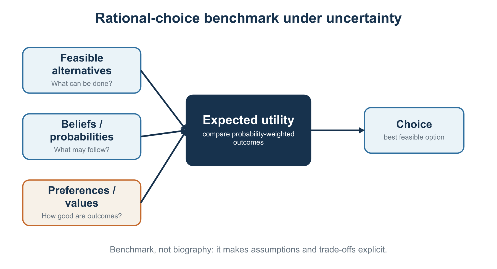<figcaption>Figure 2.1. Rational choice combines feasible actions, beliefs, and values; the diagram is a benchmark, not a literal mental algorithm.</figcaption></figure>

There is no single rational choice model that covers every decision without additional assumptions. The appropriate model depends on whether consequences are certain, probabilistic, ambiguous, multi-objective, interdependent, or dynamically changing.

Expected utility and subjective expected utility are normative representations of coherent choice under specified assumptions, not descriptions of a conscious mental algorithm (von Neumann & Morgenstern, 1944; Savage, 1954; Edwards, 1954).

Under certainty, each feasible action leads to a known outcome. Rational choice can be represented as selecting the most preferred outcome. Under risk, possible outcomes and their probabilities are specified or treated as known. Expected utility theory combines probabilities and utility. Under uncertainty, probabilities are not objectively given; subjective expected utility represents beliefs as subjective probabilities, provided they satisfy coherence conditions. Under ambiguity or model uncertainty, even the set of states or relevant probabilities may be unclear, and additional decision rules or robustness analysis may be needed.

The distinction matters because the phrase "maximize expected utility" can sound more universal than it is. Expected utility is a powerful benchmark under its assumptions. It is not a license to invent precise probabilities where the evidence does not support them.

## The building blocks

A useful rational-choice analysis begins before calculation. The decision must be framed, the feasible set constructed, and the relevant outcomes and values identified. Poor framing can make a technically correct calculation irrelevant.

## Feasibility and option creation

A decision is rational only relative to a feasible set. The best imaginable option may be unavailable because of budget, law, time, authority, health, or organizational capacity. Yet constraints should not be accepted too quickly. A deadline may be negotiable. A role can be redesigned. A partnership can create capacity. A pilot can reduce the required commitment. Good analysis distinguishes real constraints from assumed constraints.

Option generation is therefore part of rationality, not a creative extra. A choice among poor options can be coherent and still be avoidably poor because the best feasible alternative was never generated.

## Preferences, utility, and coherence

Preferences describe how a decision-maker ranks alternatives or outcomes. Utility is a numerical representation of those preferences. It is not automatically money, happiness, pleasure, or moral worth.

For choice under certainty, only order matters. If a decision-maker prefers A to B and B to C, any numerical scale that preserves that order can represent the preference. Saying u(A) = 100 and u(B) = 60 does not mean A provides exactly 40 more units of felt happiness. The numbers encode ranking.

Under expected utility theory, the utility index carries more structure because differences in utility help represent attitudes toward risky lotteries. Even then, the scale is not an objective psychological thermometer. A positive affine transformation - multiplying by a positive number and adding a constant - represents the same expected-utility preferences.

Two basic coherence conditions are completeness and transitivity. Completeness means the decision-maker can compare any two alternatives in the relevant domain: prefer A, prefer B, or be indifferent. Transitivity means that if A is preferred to B and B to C, then A should be preferred to C. These conditions support a stable representation, but they should not be turned into moral accusations. In novel, morally conflicted, or poorly specified choices, temporary incompleteness can be reasonable: the person may need information, reflection, or a richer framing before comparison is possible.

## What violations do - and do not - show

Empirical violations of completeness, transitivity, or independence do not imply that every observed choice is irrational or that normative analysis should be abandoned. A violation may reflect unstable attention, changing interpretation, incomplete preference formation, misunderstanding, or a genuine departure from the model's axioms. The correct inference depends on the task and measurement.

The Allais paradox, for example, shows that many people violate the independence axiom in systematic ways. Prospect theory and other descriptive models were developed partly to explain such patterns. The normative model remains useful because it identifies the assumption being violated and clarifies the trade-off involved; the descriptive model explains how actual behavior differs. A benchmark is most useful when its assumptions are visible rather than treated as universal truths.

## Beliefs, risk, uncertainty, and ambiguity

Preferences alone cannot determine action. The decision-maker also needs beliefs about what each alternative may produce. Beliefs should be represented with the degree of confidence the evidence warrants.

Probability is one language for disciplined belief. Coherent probabilities obey basic rules: they lie between zero and one, mutually exclusive possibilities add appropriately, and conditional beliefs update when relevant evidence arrives. Bayesian updating is a normative rule for revising probabilities when a prior model and likelihood are specified. It does not imply that priors are objective, that every causal model is known, or that all uncertainty can be reduced to a single precise number.

Risk usually refers to situations in which relevant outcomes and probabilities are known or estimable. Uncertainty refers to situations in which probabilities are not fully known. Ambiguity goes further: the decision-maker may be unsure which probability model applies. In practice these categories form a continuum. A scientifically responsible analysis can use ranges, scenarios, confidence intervals, or multiple models rather than forcing a precise point estimate.

## Expected utility

Expected utility combines beliefs and values. For a feasible action a, possible states s, outcomes x(a,s), probabilities P(s|a), and a utility function u, the expected utility of the action is:

EU(a) = ∑ₛ P(s | a) × u[x(a,s)]

The benchmark selects the feasible action with the highest expected utility. If the outcome is certain, the formula reduces to choosing the outcome with the greatest utility. If probabilities are subjective, the calculation represents subjective expected utility.

Expected utility is not expected money. A person may value each additional euro less than the previous one, value avoiding ruin disproportionately, or care about nonfinancial outcomes. A concave utility function can represent risk aversion even when expected monetary value favors a riskier option. Conversely, a person may rationally accept risk when upside, learning, or mission has high utility and downside is bearable.

The arithmetic is usually the easy part. The difficult work is defining outcomes, assigning defensible probabilities, representing values, and checking whether the model omits an important objective or constraint.

## Worked example: the two job offers

Suppose the student uses three simplified outcome scenarios for each job. The numbers below are illustrative, not objective. They represent the student's current beliefs and utility judgments on a scale chosen for this decision.

Under these inputs, the start-up has higher expected utility. But the conclusion is conditional. If the student assigns a lower probability to start-up survival, places greater utility on income security, or treats burnout risk differently, the ranking can reverse. That is not a flaw. Sensitivity to beliefs and values is the point: the table shows what the choice depends on.

A good analysis therefore reports not only the winning option but also the assumptions that make it win.

## Dominance and sensitivity analysis

Before detailed calculation, check dominance. An option is strictly dominated if another option is at least as good in every relevant state or attribute and better in at least one, given the same constraints. Dominated alternatives should ordinarily be removed unless they provide information, flexibility, or some omitted value.

Then conduct sensitivity analysis. Vary uncertain probabilities, utilities, weights, or constraints within plausible ranges. If one option remains best across the range, the decision is robust. If small changes reverse the ranking, the decision is fragile and additional information, a pilot, or a reversible choice may be valuable.

## Bounded rationality and satisficing

Rational choice is powerful because it makes a decision inspectable. It is incomplete as a description of actual cognition and sometimes too demanding as a procedure.

Bounded rationality and satisficing recognize that search, information, and computation have costs (Simon, 1955, 1956).

Herbert Simon's bounded rationality emphasizes limits of information, attention, memory, time, and computation. People often satisfice: they search until they find an option that meets an aspiration level rather than proving that it is globally optimal. Satisficing can be rational in a broader procedural sense when the cost of further search exceeds the expected benefit.

Preferences can also be incomplete, unstable, or constructed during choice. A person may not know how much they value remote work until they experience it. A new medical decision may involve values that have never been compared. Context can change attention and the meaning of attributes. These facts do not make benchmarks useless; they explain why the benchmark is not a psychological portrait.

A benchmark can also fail because the model is badly framed. An expected-utility calculation may be internally correct while ignoring an affected group, using a poor proxy, assuming the wrong causal structure, or treating a negotiable constraint as fixed. Rationality is not achieved by arithmetic alone. The decision-maker must remain willing to reopen the problem, revise the feasible set, and question the values or evidence built into the model.

The right amount of analysis is itself a decision. Low-stakes, familiar, reversible choices can use routines or simple rules. High-stakes, novel, irreversible, strategically interdependent, or low-feedback choices deserve more structure. The rational benchmark should guide proportionate deliberation, not turn life into continuous calculation.

<aside class="callout evidence-and-boundary-conditions">
EVIDENCE AND BOUNDARY CONDITIONS

Utility is not a brain chemical, a unit of happiness, or moral worth. It is a formal representation of preference under stated assumptions.
</aside>

<aside class="callout evidence-and-boundary-conditions">
EVIDENCE AND BOUNDARY CONDITIONS

A precise probability is not scientific merely because it contains a number. It needs a defined event, time horizon, evidence base, and reference class.
</aside>

*Table 2.1  Four standards that are often confused*

| Standard | Question | Possible failure |
| --- | --- | --- |
| Instrumental rationality | Does the action advance the agent's ends, given their beliefs and constraints? | Choosing means that do not fit the stated goal. |
| Epistemic rationality | Are beliefs coherent and appropriately responsive to evidence? | Overconfidence, wishful thinking, ignored base rates, or inconsistent probabilities. |
| Procedural rationality | Was the process reasonable given time, stakes, and cognitive limits? | Overanalyzing trivial choices or underanalyzing irreversible ones. |
| Outcome quality | What happened? | Mistaking luck for good reasoning or misfortune for bad reasoning. |

*Table 2.2  Certainty, risk, uncertainty, and strategic interdependence*

| Setting | What is known? | Benchmark |
| --- | --- | --- |
| Certainty | Each action has a known consequence. | Choose the most preferred feasible outcome. |
| Risk | Possible outcomes and probabilities are specified or well estimated. | Maximize expected utility. |
| Subjective uncertainty | Probabilities are not given but the decision-maker can represent coherent beliefs. | Subjective expected utility. |
| Ambiguity or model uncertainty | Probabilities, states, or causal structure are poorly known. | Use scenarios, robustness, sensitivity, experimentation, or ambiguity-sensitive rules; do not manufacture false precision. |
| Strategic interdependence | Outcomes depend on what other actors do. | Game-theoretic analysis adds beliefs about others, incentives, and equilibrium or strategic stability. |

## Key ideas

- Rational choice is a model for making assumptions and trade-offs inspectable; it is not a claim that real people consciously calculate perfectly or that rational values must be selfish.
- Distinguish instrumental, epistemic, procedural, and outcome rationality.
- Identify the building blocks of a rational-choice problem.
- Explain utility as a representation of preference.

## Study and practice

1. How would you distinguish instrumental, epistemic, procedural, and outcome rationality?

2. How would you identify the building blocks of a rational-choice problem in a real case?

3. How would you explain utility as a representation of preference?

<aside class="callout activity">
ACTIVITY

Take a decision you expect to make this year. Specify the feasible set, uncertain states, predicted consequences, preferences, constraints, and comparison rule. Then identify the assumption most likely to fail. EXPERIENCE - EXPLAIN - APPLY (MAXIMUM 120 WORDS) Experience: describe one specific decision, interaction, or observation. Explain: use one or two concepts from this chapter accurately. Apply: state one improvement, implication, or testable prediction.
</aside>

# Chapter 3. Opportunity Cost, Information, and Better Options

*The quality of a choice depends on the menu and the information that could change it*

<aside class="callout core-idea">
CORE IDEA

Optimization inside a poor option set is still a poor decision; good decision-making creates alternatives, names the best forgone option, and seeks information only when it can change action.
</aside>

## Learning goals

- Explain opportunity cost as the best feasible alternative forgone.
- Use value of information to decide whether a test or question is worthwhile.
- Build a multi-objective decision table without false precision.
- Match the amount of analysis to stakes, reversibility, and uncertainty.

Every choice uses scarce resources and excludes alternatives. Opportunity cost is the value of the best feasible alternative forgone. It is not merely the money paid, and it is not the sum of all unchosen options.

The cost of a two-hour meeting is the best alternative use of those two hours. The cost of spending one million euros on advertising includes the best foregone use of that capital: product development, hiring, debt reduction, customer support, or reserves. The cost of a high-paying job with long hours includes the best alternative career path, time, health, relationships, and future options sacrificed.

Opportunity cost changes the question from "Is this option good?" to "Is this better than the best feasible alternative?" Many options look attractive in isolation. Rational comparison requires making the alternative concrete. Research on opportunity-cost neglect shows that people are more likely to consider sacrifice when the forgone alternative is explicitly represented.

Option creation and opportunity cost are therefore linked. A negotiator who sees only accept or reject may miss redesigned payment terms, timing, risk sharing, warranties, or future cooperation. Creating a better alternative changes the opportunity cost of the existing menu.

## Information has value only when it can change action

<figure class="book-figure">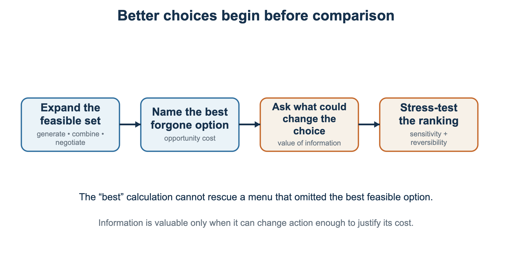<figcaption>Figure 3.1. A disciplined decision expands options, represents sacrifice, values information, and tests sensitivity before committing.</figcaption></figure>

A rational decision-maker should not gather all available information. Information is valuable when it can improve action enough to justify its cost.

Opportunity costs are often neglected when the best forgone alternative is not explicitly represented (Frederick et al., 2009).

The expected value of information is the expected utility achievable after learning the information minus the expected utility achievable without it. Net value subtracts the cost of obtaining, processing, and waiting for the information. Perfect information reveals the relevant state completely; sample information, such as a survey or pilot, only changes probabilities.

In practical terms, a reference check has value if it can change a hiring decision. A diagnostic test has value if treatment differs by result. A prototype has value if it reveals demand or feasibility before full investment. A negotiation question has value if it uncovers an interest or constraint that changes the agreement. Information has little instrumental value when no plausible result would alter action.

Information can also have costs: delay, money, attention, privacy, false precision, or strategic exposure. In negotiation, asking a question may reveal priorities. In a fast-moving market, waiting for more evidence may destroy an option. The value of information is therefore decision-specific and time-sensitive.

Net value of information = expected utility with information - expected utility without information - information cost

## Multiple objectives and decision tables

Important decisions rarely have one objective. A job choice involves income, learning, autonomy, health, location, culture, mission, risk, relationships, and future options. A university program involves revenue, mission, student value, faculty workload, reputation, access, and strategic fit. Multi-criteria decision analysis makes these dimensions visible.

Value-of-information and multi-attribute analysis make the benefits of learning and trade-offs inspectable (Raiffa, 1968; Keeney & Raiffa, 1976).

A simple decision table can compare alternatives across criteria, identify whether each entry is a prediction or value judgment, and show uncertainty. More formal models assign scales and trade-off weights. The purpose is not to replace judgment with arithmetic. It is to discipline judgment by exposing what is being counted, how it is valued, and where the conclusion is sensitive.

Three cautions matter.

First, avoid double counting. Prestige, future options, and salary may partly reflect the same underlying advantage. Second, weights are trade-off statements, not mere ratings of abstract importance. Saying health has weight 30 and learning has weight 25 is meaningful only relative to defined scales. Third, use sensitivity analysis. A table that produces one exact score from highly uncertain inputs can create false precision.

The table should make disagreement discussable. One person may believe demand is high but value mission more than revenue. Another may value revenue but predict low demand. Structure clarifies the disagreement; it does not manufacture consensus.

## Worked transfer: the executive program

The recurring university case illustrates how the benchmark organizes an institutional decision without pretending to eliminate judgment. The decision can be framed as whether to launch a defined pilot for a defined audience, date, capacity, and budget. The feasible set includes a full launch, smaller pilot, partnership, short certificate, market test, delay, or no launch.

Beliefs concern enrollment, price, employer sponsorship, faculty workload, completion, reputational effects, and competitor response. Values concern mission, revenue, student learning, access, faculty welfare, strategic visibility, and tolerance for downside. Constraints include accreditation, calendar, staff, marketing capacity, and decision rights. Opportunity cost is the best alternative use of the same faculty time, money, and institutional attention.

The decision may be fragile because several probabilities are uncertain. Instead of inventing precise numbers, the university can use scenarios and sensitivity analysis. A prototype workshop, employer interviews, or a small pilot has information value if its outcomes would alter the scale, price, design, or decision to proceed. The final choice should include review dates and stopping, revision, or scaling criteria. Rational analysis therefore turns a debate of slogans into an explicit, testable model.

## The benchmark across the book

The benchmark applies beyond solitary choice.

In decision-making, it clarifies the actor's feasible alternatives, beliefs, values, constraints, and information needs. In persuasion, it helps diagnose what a message is trying to change: beliefs about consequences, valuation of outcomes, perceived feasibility, or the option set. Ethical persuasion should not disguise a value claim as a factual prediction or hide alternatives. In negotiation, each side has a feasible set and an outside option. Agreement changes the feasible set, redistributes value, and depends on beliefs about what the other side will accept and implement.

A BATNA - the best alternative to a negotiated agreement - is an opportunity-cost concept. Reservation values depend on the utility of alternatives, not merely on the other side's first offer. Integrative negotiation creates value by discovering differences in beliefs, priorities, risk tolerance, timing, and capabilities. Game theory later adds strategic interdependence: the best action can depend on what others do.

## Application: hiring

Hiring illustrates why rational analysis and structured judgment belong together. The organization must define job-relevant outcomes, predict candidate performance, value different contributions, and respect legal and ethical constraints. A vague instruction to "hire the best person" leaves the model hidden.

A better process defines success before seeing candidates, specifies criteria and evidence sources, uses comparable questions and work samples, records independent ratings, and tracks later performance. Structured methods generally provide more reliable prediction than unstructured impressions, although validity depends on role, implementation, range restriction, and the quality of the criterion being predicted. A numeric score is useful only if the underlying target and evidence are legitimate.

## Decision design is power

Understanding the decision loop creates influence. Whoever sets a default, frames a statistic, orders a menu, displays popularity, controls friction, or decides what feedback appears has power. The same mechanisms can support autonomy or exploit inattention.

Ethical design clarifies relevant information, preserves meaningful alternatives, reduces unjustified friction, and helps people act on goals they would endorse under reflection. Manipulative design hides costs, narrows agency through identity threat, exploits fear or inertia, or makes refusal technically possible but practically difficult.

Decision science should therefore teach both influence and resistance. People need to understand how environments shape them, and designers need standards for using that knowledge.

<aside class="callout evidence-and-boundary-conditions">
EVIDENCE AND BOUNDARY CONDITIONS

Decision tables clarify values; they do not remove value judgments. Weights and scores should be treated as claims to examine, not facts discovered by the spreadsheet.
</aside>

*Table 3.1  When information is worth pursuing*

| Information request | Could it change action? | Likely value |
| --- | --- | --- |
| Another general report repeating known facts | No clear decision branch changes. | Low; may create reassurance or delay. |
| A reference check on a role-critical behavior | Yes; could change ranking or contract terms. | Potentially high. |
| A small market pilot before irreversible launch | Yes; can update demand and implementation beliefs. | Often high when the pilot is informative and cheap. |
| A diagnostic test when treatment is identical either way | No treatment choice changes. | Low instrumental value, though it may have other purposes. |
| A negotiation question about timing constraints | Yes; may reveal a trade that creates value. | High when timing differs across parties. |

## Key ideas

- Optimization inside a poor option set is still a poor decision; good decision-making creates alternatives, names the best forgone option, and seeks information only when it can change action.
- Explain opportunity cost as the best feasible alternative forgone.
- Use value of information to decide whether a test or question is worthwhile.
- Build a multi-objective decision table without false precision.

## Study and practice

1. How would you explain opportunity cost as the best feasible alternative forgone?

2. How would you use value of information to decide whether a test or question is worthwhile in practice?

3. Build a multi-objective decision table without false precision?

<aside class="callout activity">
ACTIVITY

For an upcoming choice, write the best alternative you would give up. Then list three pieces of information you could collect. For each, state exactly what answer would change the action. EXPERIENCE - EXPLAIN - APPLY (MAXIMUM 120 WORDS) Experience: describe one specific decision, interaction, or observation. Explain: use one or two concepts from this chapter accurately. Apply: state one improvement, implication, or testable prediction.
</aside>

# Chapter 4. Fast Answers, Slow Inspection

*Two modes of processing without two little people in the head*

<aside class="callout core-idea">
CORE IDEA

Automatic and reflective processing are complementary modes: fast cognition supplies impressions and skilled patterns; reflective cognition can inspect, simulate, inhibit, and redesign, but it is effortful and selective.
</aside>

## Learning goals

- Explain the dual-process distinction without treating it as literal anatomy.
- Describe the strengths and weaknesses of automatic processing.
- Explain why reflective thought is effortful and often late.
- Identify conditions under which intuition deserves trust.

Consider this problem:

A bat and a ball cost $1.10 in total. The bat costs $1.00 more than the ball. How much does the ball cost?

For many people, the answer appears almost immediately: 10 cents.

It feels right. It is simple. It is available. The total is $1.10, the difference is $1.00, so 10 cents seems natural.

But it is wrong.

If the ball costs 10 cents, the bat costs $1.10, and the total is $1.20. The correct answer is 5 cents: the ball costs 5 cents, the bat costs $1.05, and the total is $1.10.

This is one of the classic items from Frederick’s Cognitive Reflection Test (Frederick, 2005). Its power is not that the math is difficult. The power is that an incorrect answer comes to mind quickly and fluently. To answer correctly, you must notice that your first answer may be wrong, inhibit it, and engage in a slower check.

The problem reveals two modes of thinking.

Fast thinking generates an immediate answer. Slow thinking can inspect that answer. The first answer is not random. It follows a simple pattern and feels coherent. But coherence is not the same as correctness. The mind often prefers an answer that comes easily to an answer that requires effort.

The Cognitive Reflection Test predicts more than performance on puzzles. Frederick (2005) found that people who performed better on these problems also tended to differ in some economic preferences, including patience and risk attitudes. Later research showed that cognitive reflection is related to the tendency to question intuitive answers and engage in analytic reasoning (Toplak et al., 2011). The test is not a complete measure of intelligence or rationality, but it captures an important habit: the ability to distrust an answer that feels obvious.

Everyday life contains many versions of the bat-and-ball problem. A confident candidate feels competent. A familiar claim feels true. A vivid risk feels common. A higher price feels like higher quality. A popular product feels like a good product. A simple story feels like a complete explanation. In each case, the first impression may contain useful information, but it may also be incomplete or wrong.

The first lesson of two-system thinking is therefore not “intuition is bad.” The lesson is subtler:

The mind often answers an easier question before we notice the harder one.

Instead of asking, “What is the correct calculation?” the mind asks, “What answer feels compatible with the numbers?” Instead of asking, “How predictive is this interview?” the mind asks, “How impressive does this candidate feel?” Instead of asking, “What is the base rate?” the mind asks, “How easily can I imagine this outcome?”

Fast thinking gives us answers. Reflective thinking asks whether those answers deserve trust.

## Fast thinking is not primitive thinking

<figure class="book-figure">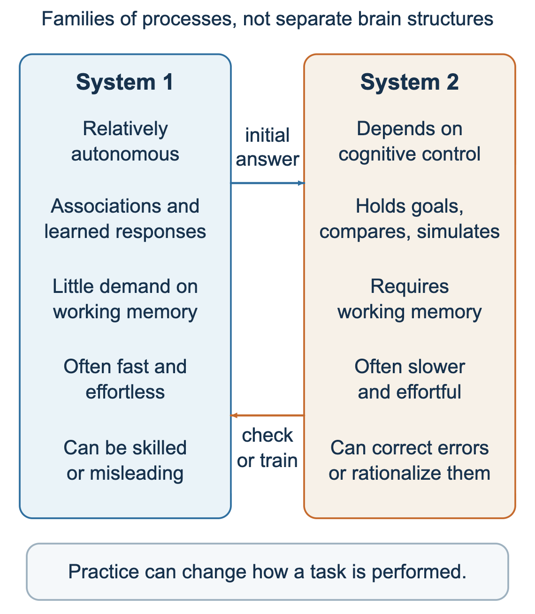<figcaption>Figure 4.1. Automatic and reflective processing cooperate: one supplies candidate answers; the other can inspect, revise, and train them.</figcaption></figure>

System 1 is often described as fast, automatic, intuitive, effortless, associative, and emotional. Those words can make it sound crude or primitive. That would be a mistake.

Fast thinking is not merely a source of error. It is the foundation of skilled life.

You use fast thinking when you recognize a friend’s face, understand speech, read a familiar sentence, detect sarcasm, catch a falling object, sense that a room has become tense, drive on a familiar road, or know instantly that 2 + 2 = 4. These operations feel effortless because the mind has already done enormous work beneath awareness.

Automatic processing is essential because the world moves faster than conscious deliberation. If every perception, movement, and social exchange required explicit calculation, ordinary life would become impossible. A person crossing a street cannot compute every trajectory. A driver cannot consciously deliberate about every steering adjustment. A musician cannot explicitly calculate every finger movement. A fluent speaker does not choose each grammatical structure by rule.

Psychologists have long distinguished between controlled and automatic processing (Schneider & Shiffrin, 1977; Shiffrin & Schneider, 1977). Controlled processing is slow, effortful, flexible, and attention-demanding. Automatic processing is fast, efficient, and often triggered by familiar cues. With repetition, tasks that once required effort can become automatic. Learning to drive is initially exhausting because every action requires attention. Later, much of driving becomes automatic enough that a person may arrive at a familiar destination with little memory of the route.

Fast thinking is also central to expertise. An experienced chess player sees meaningful patterns that a novice does not. A skilled physician may recognize a disease pattern quickly. A firefighter may sense that a building is unsafe before being able to articulate why. Such intuition can be powerful when it is built in environments with regular patterns and clear feedback (Kahneman & Klein, 2009).

The evolutionary logic is also important. For organisms facing danger, speed often matters more than perfect accuracy. If a rustling sound in the grass might be a predator, a false alarm is usually cheaper than a missed threat. This logic helps explain why minds may be biased toward fast caution in uncertain environments (Haselton & Buss, 2000; Nesse, 2005). A system that waits for complete evidence may be too slow to survive.

Fast thinking therefore has great strengths. It is quick, efficient, context-sensitive, and often adaptive. It allows people to act in real time. It makes expertise possible. It reduces cognitive burden. It supports social understanding. It gives immediate value signals.

But its strengths are also its weaknesses.

Because System 1 works quickly, it often relies on what is salient, familiar, emotionally charged, or easy to process. Because it builds coherent stories, it can ignore missing information. Because it seeks quick meaning, it may see patterns in noise. Because it uses similarity, it may neglect base rates. Because it treats fluency as a signal, it may confuse familiarity with truth. Because it automatically evaluates, it may produce preferences before evidence has been examined.

Kahneman (2011) described one of System 1’s central tendencies as WYSIATI: “What You See Is All There Is.” The mind builds the best story it can from the information currently available, but it is often insensitive to the information that is absent. If a candidate is charming, articulate, and confident, that information may dominate the impression, even if the person’s actual job performance remains uncertain. If a news story is vivid, it may shape risk perception, even if the event is rare. If a product looks familiar and easy to understand, it may feel safer, even if the feeling is not evidence.

System 1 also tends to believe before it doubts. Gilbert (1991) argued that comprehension often begins with a kind of initial acceptance; disbelief requires additional mental work. In experiments, when people were distracted or cognitively loaded, they were more likely to accept false statements they had initially processed (Gilbert et al., 1993). This helps explain why repetition, fluency, and confident presentation can influence belief. To understand a statement, the mind temporarily entertains it as true; rejecting it takes effort.

This is why fast thinking is both brilliant and dangerous. It gives us a world that feels coherent enough to act in. But the feeling of coherence can arrive before the evidence deserves it.

## Slow thinking is powerful, expensive, and often late

System 2 is the mode of thinking we associate with deliberate reasoning. It is slower, more effortful, more explicit, and more rule-guided. It is used when we calculate, compare, plan, inhibit impulses, follow instructions, check logic, solve unfamiliar problems, or choose carefully among competing goals.

System 2 is what you use when you compute 27 × 46, compare mortgage options, evaluate a statistical argument, write a careful email, prepare a negotiation strategy, or notice that the bat-and-ball answer of 10 cents cannot be right. It supports the rational-choice benchmark from Chapter 2 because it can explicitly identify alternatives, separate predictions from values, compare criteria, consider opportunity costs, and update beliefs.

But System 2 has three major limitations.

First, it is effortful. Mental effort is real. Difficult cognitive tasks consume attention, working memory, and executive control. Working memory—the ability to hold and manipulate information in mind—is sharply limited (Baddeley, 1992; Cowan, 2001). This is why multiplying two numbers in your head can make it difficult to follow a conversation, and why people often stop walking when asked to solve a difficult mental arithmetic problem.

Mental effort also shows up in the body. Research on pupil dilation found that pupils expand during demanding cognitive activity, making the eye a rough window into mental effort (Beatty, 1982; Kahneman & Beatty, 1966). System 2 is not a cost-free supervisor. It requires resources.

Second, System 2 is selective. It does not monitor everything all the time. It tends to become active when something is difficult, surprising, conflicting, novel, or important. If a situation feels fluent and familiar, System 2 may not intervene. This is efficient, but it creates vulnerability. When an intuitive answer feels right, reflection may not be triggered.

Third, System 2 is often late. It frequently evaluates answers that System 1 has already generated. It may correct them, but it may also rationalize them. A person may first feel that a candidate is impressive and then search for reasons to justify that impression. A consumer may first want a product and then construct arguments about quality. A negotiator may first feel insulted and then explain why rejection is strategically necessary. Reflection can be a judge, but it can also become a lawyer for intuition.

Neuroscience supports the idea that controlled reasoning depends heavily on prefrontal systems involved in executive control. The dorsolateral prefrontal cortex is often associated with maintaining goals, manipulating information, and exerting control over behavior (Miller & Cohen, 2001). Conflict monitoring and cognitive control involve networks including the anterior cingulate cortex and prefrontal regions (Botvinick et al., 2001). These systems allow people to pause, inhibit, plan, compare, and redirect attention.

Yet executive control is limited. Fatigue, stress, distraction, cognitive load, alcohol, time pressure, and emotional arousal can all shift behavior toward more automatic responses. This does not mean System 2 disappears. It means its ability to monitor and regulate is weakened.

Development also matters. The prefrontal systems involved in control and long-term planning mature gradually into adolescence and young adulthood (Casey et al., 2008; Gogtay et al., 2004; Steinberg, 2008). This helps explain why young people may have strong cognitive abilities in some settings but still be more vulnerable to impulsive choices, peer influence, and emotionally charged contexts. The issue is not simply knowledge; it is the development and coordination of control, valuation, emotion, and social motivation.

Slow thinking is therefore powerful, but it is not an all-seeing rational commander. It is more like a limited control system that can intervene when attention is available, motivation is sufficient, and the need for correction is detected.

## How the modes train and correct one another

It is tempting to imagine System 1 and System 2 as enemies: intuition versus reason, emotion versus logic, impulse versus control. That image is too simple.

In most successful decisions, fast and slow thinking cooperate.

System 1 supplies impressions, patterns, feelings, and candidate answers. System 2 can inspect, revise, compare, and sometimes override those answers. System 2 can also train System 1. When you practice a skill deliberately, slow effort gradually creates fast intuition. Reading, driving, playing an instrument, diagnosing cases, solving equations, and negotiating all become more fluent with repeated practice.

This is one of the most important connections between the two systems: what is slow today can become fast tomorrow.

Fitts and Posner (1967) described skill acquisition as moving from a cognitive stage, where performance requires conscious attention, to an associative stage, where errors are reduced, and finally to an autonomous stage, where performance becomes fast and relatively effortless. Logan’s (1988) instance theory similarly explains automaticity as the retrieval of stored instances from memory after repeated exposure. With practice, the mind no longer has to compute every step; it recognizes the situation and retrieves a response.

This is why experts can appear intuitive. Their intuition is not magic. It is often compressed learning.

A novice driver thinks consciously about mirrors, pedals, steering, speed, and lane position. An experienced driver handles many of these automatically. A novice chess player sees pieces. A master sees structures, threats, and opportunities. A novice negotiator hears numbers. An expert hears interests, anchors, concessions, and hidden constraints.

But expertise requires the right learning environment. Kahneman and Klein (2009) argued that intuitive expertise is most trustworthy when the environment is sufficiently regular and the person has had many opportunities for practice with clear, timely feedback. Chess provides such an environment. So do many athletic, musical, and technical skills. But some environments are much less friendly to intuition: stock picking, long-term political forecasting, hiring based on unstructured interviews, and strategic decisions with delayed feedback. In these settings, confidence can grow faster than accuracy.

System 2 can also shape System 1 by directing attention. If you decide to buy a red car, you may suddenly notice red cars everywhere. The world has not changed; your attentional priorities have. If a doctor is searching for one diagnosis, other possibilities may become less visible. If a negotiator focuses on price, delivery time, warranty, risk-sharing, and future business may fade into the background. Slow goals guide fast perception.

The systems can also conflict. A person may know that saving is wise but feel the pull of immediate spending. A student may plan to study but click on a notification. A manager may know that structured interviews are better but still feel drawn to the charismatic candidate. A negotiator may know that anger will damage the deal but still want to retaliate. These conflicts are not signs that one system is “good” and the other “bad.” They reflect multiple goals, time horizons, value signals, and control processes competing within one person.

The practical lesson is that better decision-making does not always mean “use System 2 more.” Sometimes System 2 should slow down the process. Sometimes it should design better environments so that System 1 does the right thing automatically. If you want to eat healthier, you can deliberate every time you open the refrigerator—or you can change what is in the refrigerator. If you want fewer phone distractions, you can rely on willpower—or you can turn off notifications and keep the phone out of reach. If an organization wants better hiring, it can tell managers to be objective—or it can require structured criteria before interviews begin.

Good decision-making often means training, guiding, and designing the automatic system rather than constantly fighting it.

## Emotion is part of judgment

A common image of two-system thinking is that System 1 is emotional and System 2 is rational. This image is partly useful but deeply incomplete.

Emotion can distort judgment, but it is also essential for valuation. Chapter 1 emphasized the distinction between prediction and valuation. Prediction asks what will happen. Valuation asks how good or bad that outcome would be. Emotion is central to valuation because it helps tag outcomes as desirable, dangerous, unfair, meaningful, disgusting, comforting, or worth pursuing.

Damasio’s work is important here. In Descartes’ Error, he described patients with damage to brain regions involved in integrating emotion and decision-making. Some patients could reason abstractly and list pros and cons, yet struggled to make ordinary decisions because options lacked emotional significance (Damasio, 1994). Bechara et al. (1997) developed the Iowa Gambling Task to study how people learn from reward and punishment. Patients with ventromedial prefrontal damage often failed to develop normal anticipatory emotional signals and continued choosing disadvantageous decks even when the pattern harmed them.

The lesson is not that emotion always improves decisions. The lesson is that reason alone does not determine what is worth doing. A purely cold prediction cannot choose between outcomes unless something assigns value to them.

Neuroscience of purchasing decisions offers another example. Knutson et al. (2007) found that activity in reward-related regions such as the nucleus accumbens and pain-related regions such as the insula helped predict purchasing decisions. Buying is not simply a calculation of price and product features. It involves anticipated pleasure, anticipated pain of paying, and the integration of those feelings into choice. Loewenstein et al. (2001) similarly argued that risky decisions are shaped by “risk as feelings,” not only by cognitive estimates of probability and outcome.

Emotion also helps explain why facts alone often fail to persuade. Information influences choice only if it connects to valuation. A spreadsheet can show that a policy saves money, but people may still reject it if it feels unfair. A doctor can explain a probability, but a patient must still decide what kind of risk is acceptable. A manager can list the benefits of change, but employees may resist if the change threatens identity or dignity.

A striking clinical example is Capgras delusion, in which a person may recognize a loved one’s face but feel that the person is an impostor. One influential explanation is that visual recognition remains intact while the emotional feeling of familiarity is disrupted (Ellis & Young, 1990; Hirstein & Ramachandran, 1997). The mind then tries to explain the mismatch: “This looks like my spouse, but does not feel like my spouse; therefore, it must be an impostor.” The example shows how cognition and affect normally work together. Recognition is not only factual; it is also emotional.

For decision-making, the implication is clear: good judgment does not eliminate emotion. It interrogates emotion.

What is this feeling telling me? Is it about value or probability? Is the feeling relevant to the decision? Is it caused by the option itself or by fatigue, social pressure, fear, or recent experience? Would I feel the same way tomorrow? Would I advise a friend to treat this feeling as evidence?

Emotion is indispensable for deciding what matters. But emotion should not be allowed to impersonate evidence about what is likely.

## When intuition deserves trust

The two-system framework becomes practical when it helps us decide when to trust intuition and when to slow down.

Intuition is more likely to be trustworthy when three conditions are met.

First, the environment must contain learnable regularities. There must be patterns that can actually be detected. Chess, firefighting, surgery, music, and many athletic skills contain meaningful patterns. Some financial and political environments are much noisier and less stable.

Second, the decision-maker must have repeated experience. One dramatic event does not create expertise. A manager who has hired three people is not necessarily an expert in hiring. An investor who succeeded during one market boom may have learned luck rather than skill.

Third, feedback must be clear and timely. If feedback is delayed, ambiguous, or confounded by luck, intuition may not improve. Hiring decisions often suffer from this problem. Performance unfolds over months or years and is influenced by onboarding, team fit, market conditions, and managerial support. The interviewer may never learn whether another candidate would have performed better.

When these conditions are absent, intuition deserves caution.

A decision should be slowed down when it is high-stakes, unfamiliar, irreversible, emotionally charged, socially pressured, statistically complex, or vulnerable to conflicts of interest. It should also be slowed down when the first answer feels too easy, when the evidence is incomplete, when people disagree strongly, when the decision-maker has incentives to believe one conclusion, or when the choice will be difficult to reverse.

Slowing down does not always mean endless analysis. It can mean asking one additional question:

What am I missing? What is the base rate? What would change my mind? What is the opportunity cost? What would I believe if I did not want this to be true? What would someone outside the situation say? Am I evaluating evidence or defending a first impression?

A useful rule is:

Use intuition for familiar, repeated, feedback-rich situations. Use structure for high-stakes, uncertain, novel, delayed-feedback, or socially charged decisions.

This framework connects Chapter 4 to the rest of the book. Chapter 5 examines what attention admits as evidence; Chapters 6–8 explain prediction, valuation, and expectation; Chapters 9–17 examine shortcuts, probability, bias, framing, priming, and fluency; Parts IV–VI apply these mechanisms to influence, communication, and negotiation.

Two-system thinking is not the whole science of decision-making. But it gives us a powerful starting point: the mind produces quick answers, and then sometimes checks them.

Better decisions depend on knowing when the first answer is a gift and when it is a trap.

<aside class="callout evidence-and-boundary-conditions">
EVIDENCE AND BOUNDARY CONDITIONS

System 1 and System 2 are teaching labels for families of processes, not two anatomical organs, brain hemispheres, or independent agents.
</aside>

<aside class="callout evidence-and-boundary-conditions">
EVIDENCE AND BOUNDARY CONDITIONS

Slow thinking is not automatically rational. It can rationalize, overfit, and defend identity as effectively as it can correct intuition.
</aside>

*Table 4.1  Two processing modes as useful contrasts, not literal systems*

| Automatic mode | Reflective mode |
| --- | --- |
| Fast, associative, often effortless | Slower, rule-guided, attention-demanding |
| Supplies impressions, habits, and skilled recognition | Maintains goals, simulates, compares, and inhibits |
| Works in parallel across many cues | Works serially with limited working memory |
| Can be brilliantly trained or badly misled | Can correct intuition or rationalize it |

## Key ideas

- Automatic and reflective processing are complementary modes: fast cognition supplies impressions and skilled patterns; reflective cognition can inspect, simulate, inhibit, and redesign, but it is effortful and selective.
- Explain the dual-process distinction without treating it as literal anatomy.
- Describe the strengths and weaknesses of automatic processing.
- Explain why reflective thought is effortful and often late.

## Study and practice

1. How would you explain the dual-process distinction without treating it as literal anatomy?

2. What evidence and mechanism would you use to describe the strengths and weaknesses of automatic processing?

3. How would you explain why reflective thought is effortful and often late?

<aside class="callout activity">
ACTIVITY

Solve the bat-and-ball problem, then identify a current decision in which an answer arrived before analysis. What cue produced the first answer, and what check would justify or overturn it? EXPERIENCE - EXPLAIN - APPLY (MAXIMUM 120 WORDS) Experience: describe one specific decision, interaction, or observation. Explain: use one or two concepts from this chapter accurately. Apply: state one improvement, implication, or testable prediction.
</aside>

# Chapter 5. Attention Is the Gatekeeper of Evidence

*What is not noticed cannot enter judgment*

<aside class="callout core-idea">
CORE IDEA

Attention is a scarce, selective resource. It does not merely reveal evidence; it helps determine which evidence exists for the decision-maker.
</aside>

## Learning goals

- Explain inattentional blindness and change blindness.
- Distinguish top-down selection from bottom-up capture.
- Explain how expertise can sharpen and narrow attention.
- Redesign a meeting, classroom, or decision to make neglected information visible.

<aside class="callout the-invisible-gorilla-in-expert-search">
THE INVISIBLE GORILLA IN EXPERT SEARCH

Radiologists searching lung scans for nodules sometimes failed to report a large inserted gorilla, even when their gaze reached its location. Expertise makes task-relevant patterns more visible, but a strong search template can also make off-template events psychologically disappear (Drew et al., 2013).
</aside>

## Inattentional blindness: what attention leaves out

Imagine watching a video of people passing a basketball. Your task is to count the number of passes made by the players in white shirts. You focus carefully. The players move, pass, cross paths, and your attention tracks the ball. Halfway through, a person in a gorilla suit walks into the scene, turns toward the camera, beats their chest, and walks away. Would you notice? Most people believe they would. Many do not.

In the famous invisible gorilla study, Simons and Chabris (1999) found that many participants failed to notice the gorilla when their attention was occupied by the counting task. The gorilla was not hidden. It was visible in the center of the scene. The problem was not the eyes. The problem was attention.

This phenomenon is called inattentional blindness: failing to notice an unexpected object or event because attention is engaged elsewhere. The term is closely associated with work by Mack and Rock (1998), who showed that people can miss clearly visible stimuli when they are not attending to them.

Inattentional blindness is not rare, and it is not limited to novices. Drew et al. (2013) asked radiologists to inspect lung scans for nodules. An image of a gorilla, many times larger than the average nodule, was inserted into the scan. Many radiologists failed to report it, even though eye-tracking showed that some looked directly at the location. Expertise did not eliminate attentional limits. When attention is tuned for one kind of target, other information can disappear from awareness.

This is not because people are stupid. It is because attention is selective.

## Top-down goals and bottom-up capture

Attention is often described as a spotlight, but that metaphor can mislead. A spotlight suggests that everything inside the beam is seen clearly and everything outside is dark. Attention is more complicated. It selects, enhances, suppresses, prioritizes, and organizes information according to goals, salience, expectations, and task demands. William James (1890) famously described attention as the mind taking possession of one object or train of thought among several possible ones. Modern cognitive psychology has refined this idea through filter models, capacity models, and neural competition models (Broadbent, 1958; Desimone & Duncan, 1995; Kahneman, 1973; Treisman, 1964).

Some attention is top-down: guided by goals, plans, and expectations. If you are searching for your friend in a crowd, your mind is tuned to face shape, height, clothing, or gait. If a radiologist is searching for nodules, the visual system is tuned to nodules. If a negotiator is searching for price concessions, price becomes more visible than timing, warranty, risk-sharing, or relationship value.

Some attention is bottom-up: captured by salient events, such as sudden movement, loud sounds, bright colors, threat cues, novelty, or emotional stimuli. A phone notification, a flashing advertisement, a crying baby, a sharp tone, or an angry face can capture attention before conscious choice. Corbetta and Shulman (2002) distinguish between networks involved in goal-directed attention and those involved in stimulus-driven reorienting. In real life, attention reflects the interaction between what we are trying to do and what the world pulls from us.

This is why attention is a decision problem before decision-making begins. What receives attention becomes evidence. What does not receive attention may never enter judgment.

## Attention under divided demand

Attention is also limited. The adult human brain consumes a large share of the body’s energy relative to its weight, and neural processing is metabolically expensive (Attwell & Laughlin, 2001; Raichle & Gusnard, 2002). The brain cannot process everything in full detail. Cognitive capacity is constrained by attention, working memory, and control systems (Baddeley, 1992; Cowan, 2001; Marois & Ivanoff, 2005). This means that attention is a scarce resource. Spending it in one place means not spending it elsewhere.

This has practical consequences.

Students who divide attention between class and digital distractions often learn less. Junco and Cotten (2012) found that multitasking with technology was associated with poorer academic performance. Sana et al. (2013) found that laptop multitasking harmed not only the multitasker’s learning but also the learning of nearby students who could see the screen. Gingerich and Lineweaver (2014) found that media multitasking during class was associated with poorer retention. Attention is not infinitely divisible.

Drivers using phones suffer similar limits. Strayer and Johnston (2001) showed that cell phone conversations can impair driving performance, and Strayer et al. (2003) found that hands-free conversation does not eliminate the attentional cost. The problem is not merely holding a device. It is the diversion of attention from the driving environment.

Organizations also suffer from attentional limits. A leadership team focused on quarterly revenue may miss employee burnout. A product team focused on technical features may miss user confusion. A board focused on legal compliance may miss reputational risk. A negotiator focused on price may miss interests that could create value. A hiring committee focused on confidence may miss reliability.

Attention is the gatekeeper of judgment. If the wrong information enters, or important information stays out, later reasoning may be careful but still misguided.

## Change blindness

Change blindness shows a related problem. People often fail to notice changes in a scene when the change occurs during a brief interruption, eye movement, or visual disruption. Rensink et al. (1997) demonstrated that large changes can go unnoticed when attention is not directed to the changing feature. Simons and Levin (1998) famously showed that people giving directions to a stranger often failed to notice when the stranger was replaced by a different person during a brief interruption.

This tells us something unsettling: we are not general-purpose change detectors. We notice changes that are attended to, meaningful, expected, or salient. Much else can pass by unseen.

The lesson for decision-making is direct. Asking people to “look carefully” is not enough. Attention must be designed. In high-stakes environments, decision-makers need checklists, role assignments, structured observation, independent review, and deliberate attention shifts. Pilots, surgeons, auditors, negotiators, and managers cannot rely only on natural noticing. The mind sees what it is set up to see.

## Every organism inhabits a partial world

<figure class="book-figure">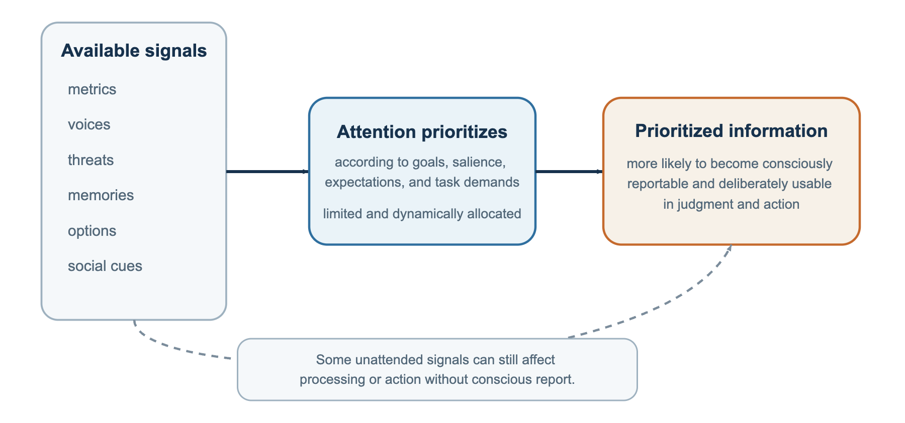<figcaption>Figure 5.1. Attention does not merely inspect evidence; it determines which information becomes evidence at all.</figcaption></figure>

Attention filters information, but before attention can filter anything, the senses must first sample the world. That sample is already incomplete.

Human beings do not perceive the world as it is. We perceive the world as human sensory systems make it available. Our eyes detect only a narrow band of electromagnetic radiation. Our ears detect only a limited range of sound frequencies. Our skin detects pressure, temperature, pain, and vibration only within certain limits. Our noses and tongues sample chemical information in ways that are modest compared with many other animals.

Jakob von Uexküll introduced the idea of the Umwelt: each organism lives in its own perceptual world, shaped by the sensory and action systems that matter for its survival (von Uexküll, 1934/2010). A tick, a bat, a bee, a dog, an elephant, and a human inhabit the same physical environment but not the same experienced world. Thomas Nagel (1974) made a related point in his famous essay on bats: even if we know the physical facts about echolocation, the subjective world of a bat is not simply the human world plus sonar.

Different species detect different kinds of information. Bees can see ultraviolet patterns on flowers that humans cannot see unaided; those patterns help guide pollination behavior (Chittka & Menzel, 1992). Many snakes detect infrared radiation from warm bodies. Elephants communicate using low-frequency sounds that can travel long distances. Migratory birds use geomagnetic cues that humans do not experience directly (Wiltschko & Wiltschko, 2005). Dogs live in a world saturated with scent information that humans barely register.

The point is not merely biological curiosity. It is epistemological humility. What feels like “the world” to us is a species-specific sample.

Even within human perception, the senses are incomplete. We do not see ultraviolet light. We do not hear ultrasound. We do not directly sense magnetic fields. We do not perceive microscopic organisms without instruments. We do not experience carbon monoxide directly. We do not see radio waves, Wi-Fi signals, or most of the electromagnetic spectrum. We perceive a narrow slice of reality, then build a world from it.

This matters for decision-making because people often confuse available information with complete information. If something is not visible, audible, emotionally vivid, or socially salient, it may not feel real. Climate risk, compound interest, long-term health effects, structural inequality, statistical base rates, cybersecurity vulnerabilities, and slow reputation damage are all difficult because they are not always directly perceptible. They require instruments, models, data, and imagination.

Scientific instruments extend perception. Telescopes, microscopes, X-rays, MRI, satellite imaging, statistical dashboards, financial statements, user analytics, and epidemiological models all help humans perceive what the unaided senses cannot. But instruments do not interpret themselves. People still must attend to them, understand them, and integrate them into judgment.

This creates a recurring decision problem: the most important information is often not the most perceptually available.

A manager can see a confident presenter but not long-term reliability. A doctor can hear a patient’s story but may need lab tests to reveal hidden disease. An investor can see a rising stock price but not necessarily fundamental value. A teacher can see student attendance but not attention. A government can see visible costs of regulation but not invisible harms prevented.

The senses provide evidence, not reality itself. Good decision-making often requires asking: what information is missing because humans are not built to perceive it directly?

## Designing better attention

If attention and perception shape judgment, then better decisions require better attentional design.

The first step is to reduce unnecessary distraction. In classrooms, meetings, negotiations, and analytical work, attention is often the limiting resource. Phones, notifications, open laptops, side conversations, and multitasking do not merely add small interruptions; they change what information enters working memory. A student cannot learn material that attention never processes. A team cannot solve a problem while half its members are mentally elsewhere.

The second step is to assign attention deliberately. In complex decisions, one person should not be responsible for noticing everything. Teams can assign roles: one person tracks evidence, one tracks risks, one tracks stakeholder concerns, one tracks implementation, one tracks assumptions, one watches for missing alternatives. Aviation, medicine, and emergency response use checklists and role structures precisely because unaided attention is unreliable (Gawande, 2009).

The third step is to change the question. Attention follows questions. If a hiring committee asks, “Who impressed us most?” attention goes to charisma and confidence. If it asks, “What evidence predicts performance in this role?” attention shifts to job-relevant criteria. If a negotiator asks, “How do I get the best price?” attention goes to claiming value. If the negotiator asks, “What differences in priorities could create mutual gain?” attention shifts to interests, timing, risk, and trade-offs.

The fourth step is to make the invisible visible. Many important variables are not naturally salient: base rates, opportunity costs, long-term effects, silent stakeholders, delayed harms, and counterfactual outcomes. Decision tools should bring these into view. A dashboard can show long-term retention rather than only monthly sales. A hiring rubric can show evidence rather than impressions. A medical decision aid can show absolute risk rather than only relative risk. A negotiation preparation sheet can show interests, alternatives, and constraints.

The fifth step is to create friction for premature closure. Once the mind settles on an interpretation, it tends to see supporting evidence. Decision processes should include moments for alternative explanations. In medicine, diagnostic timeouts can ask, “What else could this be?” In organizations, premortems can ask, “Imagine this failed—why?” (Klein, 2007). In forecasting, outside-view prompts can ask, “What happened in similar cases?” In negotiations, perspective-taking can ask, “What problem is the other side trying to solve?”

The sixth step is to improve feedback. Attention improves with feedback only when feedback is clear, timely, and connected to the original judgment. A decision journal can record what was predicted before the outcome. Later, decision-makers can compare prediction with result. This helps distinguish skill from luck and improves calibration.

The seventh step is to design environments that guide automatic attention. If healthy food is visible and junk food hidden, eating changes without constant willpower. If dashboards highlight leading indicators rather than vanity metrics, managers notice earlier. If meeting agendas begin with the decision to be made and the assumptions to test, discussion becomes more focused. If forms display consequences clearly, users make more informed choices. Choice architecture begins with attention architecture.

Attention is not just a personal skill. It is a design problem.

<aside class="callout evidence-and-boundary-conditions">
EVIDENCE AND BOUNDARY CONDITIONS

The brain&#x27;s high energy use does not mean difficult thinking consumes a huge extra amount of whole-brain energy. Task demands mainly redistribute activity within a system that is already metabolically active.
</aside>

*Table 5.1. Attention failures and design responses*

| Failure | Mechanism | Design response |
| --- | --- | --- |
| Unexpected event is missed | Search is tuned to another target. | Assign an anomaly role or run a deliberate second scan. |
| Important information never enters discussion | Agenda, metric, or hierarchy filters attention. | Change the question, representation, or speaking order. |
| Divided attention weakens encoding | Working memory is consumed by task switching. | Protect focused intervals and remove avoidable digital capture. |
| Team closes too early | A coherent interpretation suppresses alternatives. | Use a diagnostic timeout, premortem, or independent review. |

## Key ideas

- Attention is a scarce, selective resource. It does not merely reveal evidence; it helps determine which evidence exists for the decision-maker.
- Explain inattentional blindness and change blindness.
- Distinguish top-down selection from bottom-up capture.
- Explain how expertise can sharpen and narrow attention.

## Study and practice

1. How would you explain inattentional blindness and change blindness?

2. How would you distinguish top-down selection from bottom-up capture?

3. How would you explain how expertise can sharpen and narrow attention?

<aside class="callout activity">
ACTIVITY

Audit one recent meeting or class. List what captured attention, what was probably missed, and one change to the agenda, role assignment, representation, or environment that would make the missing information visible. EXPERIENCE - EXPLAIN - APPLY (MAXIMUM 120 WORDS) Experience: describe one specific decision, interaction, or observation. Explain: use one or two concepts from this chapter accurately. Apply: state one improvement, implication, or testable prediction.
</aside>

# Chapter 6. The Predictive Mind

*Perception is inference constrained by sensory evidence*

<aside class="callout core-idea">
CORE IDEA

The brain does not passively record the world. It combines incomplete sensory signals with prior models, goals, context, and estimates of reliability to infer what is present and what action is appropriate.
</aside>

## Learning goals

- Explain perception as inference rather than recording.
- Describe predictive processing, prediction error, and precision in plain language.
- Use illusions to reveal the assumptions of ordinary perception.
- Explain how inner models can support expertise or protect themselves from correction.

If perception is not complete sensory recording, what is it?

A powerful answer is that perception is inference. The brain uses incomplete sensory evidence to infer the most likely causes of that evidence. This idea goes back at least to Helmholtz, who described perception as unconscious inference (Helmholtz, 1867/1962). Later work in psychology and cognitive science developed this idea through theories of constructivist perception, Bayesian perception, and predictive processing (Gregory, 1980; Kersten et al., 2004; Knill & Richards, 1996; Rock, 1983).

The brain does not simply ask, “What light hit the retina?” It asks, in effect, “What in the world is most likely to have caused this pattern of light?” The answer depends on sensory evidence, but also on context, prior experience, expectations, goals, and assumptions about how the world usually works.

This is why illusions are so useful. Illusions are not merely tricks. They reveal the assumptions the visual system uses to construct experience.

Consider brightness and shadow illusions. Two regions with the same physical luminance can appear different because the visual system interprets one as being in shadow and the other as being in light. Adelson’s checker-shadow illusion is a famous example: squares with identical luminance appear different because the brain estimates surface reflectance by taking illumination into account (Adelson, 2000). The visual system is not measuring raw light; it is inferring surfaces under lighting conditions.

Shape-from-shading illusions reveal another assumption: light usually comes from above. When we see patterns of light and dark, the brain uses a “light-from-above” prior to infer whether shapes are bumps or dents (Ramachandran, 1988). The same image can appear as a raised surface or a hollow depending on orientation. The sensory input is the same; the inferred cause changes.

Faces provide another example. Humans have strong priors about faces because faces are socially important. The Thatcher illusion shows that grotesque changes to facial features are much harder to notice when a face is upside down than when it is upright (Thompson, 1980). We have powerful models for upright faces, weaker models for inverted ones. Perception depends on the match between sensory input and learned models.

The Kanizsa triangle demonstrates how the visual system constructs edges and shapes not physically present in the image (Kanizsa, 1976). We perceive a bright triangle because the arrangement suggests an occluding surface. The brain infers a coherent object from incomplete evidence.

Body ownership can also be inferred. In the rubber hand illusion, a visible rubber hand is stroked in synchrony with a participant’s hidden real hand. Many participants begin to feel as if the rubber hand is part of their body (Botvinick & Cohen, 1998). The brain integrates visual, tactile, and proprioceptive evidence and infers a common cause. Body ownership, which feels immediate and obvious, is partly constructed.

These examples show that perception is active interpretation. The brain uses prior knowledge because sensory information is ambiguous. A given retinal image could be caused by many possible arrangements of objects, lighting, distance, and movement. Perception resolves ambiguity by using assumptions that usually work.

This is adaptive. If perception required complete data, action would be too slow. Priors allow the brain to act quickly in uncertain environments. But priors can also mislead.

A person afraid of spiders may perceive a spider as larger or more threatening than another person would. Research suggests that fear and desire can influence perceptual judgments of distance, size, and slope, although the interpretation of such effects remains debated (Balcetis & Dunning, 2010; Proffitt, 2006; Stefanucci & Proffitt, 2009). A person with social anxiety may interpret neutral expressions as hostile. A medical student who has just learned about a disease may notice normal bodily sensations and interpret them as symptoms. A manager expecting resistance may perceive questions from employees as opposition rather than curiosity.

Perception is constrained by the world, but not dictated by it. It is neither pure reality nor pure imagination. It is a controlled construction: a best guess, shaped by evidence and prior models.

This has a major implication for disagreement. People who disagree may not be “looking at the same thing” in the psychological sense. They may receive similar sensory input but interpret it through different models. One person sees a risky disruption; another sees an opportunity. One sees disrespect; another sees honesty. One sees a vague proposal; another sees flexibility. One sees a suspicious pause in a negotiation; another sees careful thought.

Better decisions require not only better data, but better awareness of the models through which data are interpreted.

## Prediction, error, and precision

<figure class="book-figure">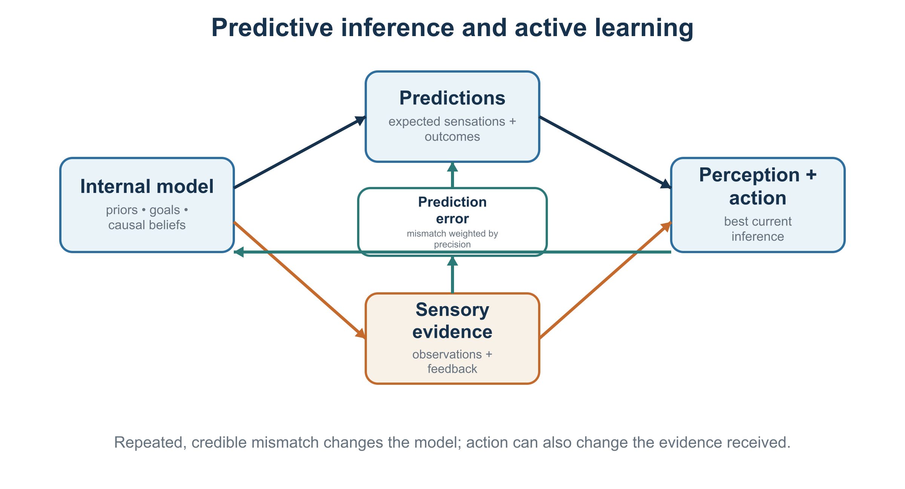<figcaption>Figure 6.1. Perception and judgment emerge from predictions constrained by evidence; precision determines how strongly each source is weighted.</figcaption></figure>

The idea that perception is inference becomes more powerful in predictive processing. Predictive processing theories propose that the brain is constantly generating predictions about sensory input and updating those predictions when errors occur (Clark, 2013; Friston, 2010; Hohwy, 2013; Rao & Ballard, 1999). The brain does not wait passively for the world to arrive. It predicts the world, compares prediction with incoming evidence, and revises its model when mismatch matters.

In this framework, the brain maintains a generative model: an internal model of what causes sensory input. The model generates predictions about what should be seen, heard, felt, or experienced. Incoming sensory signals are compared with predictions. The difference is called prediction error.

If prediction error is small, the model is working well enough. If prediction error is large and reliable, the brain updates its beliefs or directs action to reduce the mismatch.

For example, when you walk into your kitchen at night, your brain predicts the location of furniture, the feel of the floor, and the likely appearance of objects. You do not need to reconstruct the room from scratch. But if a chair has been moved, your foot bumps into it. Prediction error occurs. You update: the chair is not where expected.

Predictive processing helps explain why perception is fast. The brain does not process every detail equally. It predicts what is likely and focuses processing on what is surprising, uncertain, or important. This makes perception efficient. It also makes it vulnerable to expectation.

Attention plays a central role in predictive processing. In this framework, attention can be understood partly as the assignment of precision to prediction errors (Feldman & Friston, 2010). Precision means the estimated reliability or importance of a signal. If a sensory signal is treated as precise, it has more influence on updating perception. If it is treated as noisy or irrelevant, it has less influence.

This idea helps explain why attention changes perception. If you are listening for your name in a noisy room, speech sounds related to your name receive high precision. If you are searching for a typo, letter-level details become more precise. If you are afraid of threat, threat cues receive more precision. If you are motivated to defend a belief, evidence consistent with that belief may receive more weight than evidence against it.

Predictive processing also connects perception with action. Active inference theories extend the predictive framework by proposing that organisms reduce prediction error not only by updating beliefs but also by acting to make the world fit predictions or preferred states (Friston, 2010; Friston et al., 2017). If you predict that your body should be warm, you put on a coat. If you expect a cup to be in your hand, you reach for it. If you want uncertainty reduced, you look more closely, ask a question, run an experiment, or check the data.

This connects directly to decision-making. Judgment is not simply receiving information, forming beliefs, and then choosing. The brain predicts, samples, compares, updates, and acts in a continuous loop. It chooses actions that help achieve preferred states, reduce uncertainty, or confirm and refine its model of the world.

This does not mean the brain is always accurate. A predictive system can become trapped if its priors are too strong, if it samples evidence selectively, or if it acts in ways that prevent disconfirmation.

Consider social anxiety. A person expects rejection, attends to ambiguous signs of disapproval, interprets neutral expressions negatively, avoids interaction, and therefore loses opportunities to learn that others might respond warmly. The model predicts rejection; attention finds threat; action prevents correction. The prediction becomes self-protecting.

Consider organizational strategy. A leadership team believes customers do not want a new product. They do little market testing, underinvest in prototypes, and interpret weak early signals as confirmation. Their action produces the world they expected. Again, prediction guides sampling and action.

Consider medical diagnosis. A physician with a strong early hypothesis may attend to confirming symptoms and underweight disconfirming evidence. Expertise helps when the hypothesis is right, but premature closure can be dangerous. Diagnostic reasoning therefore requires deliberate checks against alternative explanations (Croskerry, 2003).

Predictive processing helps explain why “just give people more information” is often insufficient. New information changes judgment only if it is attended to, treated as reliable, and integrated into the person’s model. If the model dismisses the information as irrelevant, biased, threatening, or noisy, the information may not update belief.

This is why decision science must study internal models, not just external data.

## When inner models help - and trap

Inner models are essential. Without them, the world would be chaotic.

Imagine trying to read without prior knowledge of letters, words, grammar, and context. Imagine trying to understand a meeting without assumptions about roles, goals, norms, and social meaning. Imagine trying to cross a street without expectations about cars, traffic signals, speed, and human behavior. Inner models allow perception and action to be fast, meaningful, and adaptive.

They also make expertise possible. A radiologist sees patterns in medical images that a novice cannot. A musician hears structure in sound that a beginner misses. A negotiator hears interests behind positions. A teacher sees confusion in a student’s expression. A firefighter notices that a fire behaves strangely. Expertise is partly the development of better models for a domain.

But inner models can trap us when they become too rigid, too narrow, or too self-protective.

One trap is seeing what we expect. If a manager expects an employee to be difficult, ambiguous behavior may be interpreted as resistance. If a teacher expects a student to struggle, errors may seem diagnostic while improvements are overlooked. If a doctor expects a common diagnosis, rare but dangerous alternatives may be missed. Expectations guide attention and interpretation.

Another trap is not seeing what lacks a model. People may fail to perceive or understand information for which they have no useful framework. The neurologist Oliver Sacks (1995) described cases of people who regained sight after long blindness but struggled to make sense of visual input. Modern work with formerly blind individuals also shows that learning to see involves more than retinal input; the brain must learn to parse objects, depth, motion, and meaning (Ostrovsky et al., 2006). Sensory data without an interpretive model can be overwhelming.

This has a decision-making analogue. An organization without a model for psychological safety may fail to see why employees remain silent. A manager without a model for incentive conflict may interpret strategic behavior as personality. A student without a model for opportunity cost may experience a choice as simply “what I want” rather than “what I give up.” Concepts change perception. Once you learn a concept, you begin to see what was previously invisible.

A third trap is emotional precision. Emotion can increase the weight assigned to certain signals. Fear makes threat cues more salient. Anger makes offense and blame more salient. Desire makes opportunities more vivid. Shame makes social evaluation more central. This can be adaptive, but it can also narrow judgment.

A person afraid of heights may overestimate the steepness or danger of a slope. A socially anxious person may overread signs of disapproval. A manager under threat may interpret dissent as disloyalty. A negotiator who feels insulted may miss information about the other side’s constraints.

A fourth trap is attention capture by unresolved concerns. When something bothers us, attention repeatedly returns to it. This makes it difficult to engage fully with other tasks. Rumination, anxiety, unresolved conflict, and unfinished goals can occupy working memory and reduce executive control. Zeigarnik (1927) observed that unfinished tasks tend to remain mentally active, and later research on goal systems and rumination has explored how unresolved concerns capture thought (Martin & Tesser, 1996). In decision contexts, this means that emotional preoccupation can narrow the field of available information.

A fifth trap is model-protecting action. People may act in ways that prevent their inner model from being tested. If I believe others will reject me, I avoid them. If I believe employees cannot handle autonomy, I micromanage them. If I believe customers will not want the product, I never build a serious prototype. If I believe negotiations are zero-sum, I never ask questions that reveal trade-offs. The model survives because behavior prevents disconfirmation.

Good decision-making requires using inner models without becoming imprisoned by them.

A practical method is to ask:

What am I expecting to see? What would I notice if my expectation were wrong? What information am I treating as precise? What am I treating as noise? What alternative model could explain the same evidence? What action would test the model rather than protect it?

These questions prepare the way for later chapters on heuristics, biases, framing, and probability judgment. Many biases are not separate from perception; they begin in what attention selects and what the model makes plausible.

<aside class="callout evidence-and-boundary-conditions">
EVIDENCE AND BOUNDARY CONDITIONS

Predictive processing is an influential family of frameworks, not one settled theory with a single agreed implementation. Use it as a disciplined way to ask how priors, evidence, and precision interact, not as a universal explanation that can never be falsified.
</aside>

<aside class="callout evidence-and-boundary-conditions">
EVIDENCE AND BOUNDARY CONDITIONS

Clinical examples such as hallucinations or functional neurological symptoms are complex. They should not be reduced to &quot;strong priors&quot; without considering neural, developmental, social, and medical mechanisms.
</aside>

*Table 6.1. A functional predictive loop*

| Internal model | Predictions | Sensory evidence | Perception and action | Prediction error and learning |
| --- | --- | --- | --- | --- |
| Beliefs, causal assumptions, goals, and policies | What sensations and outcomes are expected | Signals from the environment and body | Inference about the current situation and a plan for action | Mismatch updates current beliefs; repeated mismatch can revise the model |

## Key ideas

- The brain does not passively record the world. It combines incomplete sensory signals with prior models, goals, context, and estimates of reliability to infer what is present and what action is appropriate.
- Explain perception as inference rather than recording.
- Describe predictive processing, prediction error, and precision in plain language.
- Use illusions to reveal the assumptions of ordinary perception.

## Study and practice

1. How would you explain perception as inference rather than recording?

2. What evidence and mechanism would you use to describe predictive processing, prediction error, and precision in plain language?

3. How would you use illusions to reveal the assumptions of ordinary perception in practice?

<aside class="callout activity">
ACTIVITY

Choose a disagreement in which two people received similar information but saw different situations. Write each person&#x27;s prior model, the evidence each treated as precise, and one observation that could distinguish the models. EXPERIENCE - EXPLAIN - APPLY (MAXIMUM 120 WORDS) Experience: describe one specific decision, interaction, or observation. Explain: use one or two concepts from this chapter accurately. Apply: state one improvement, implication, or testable prediction.
</aside>

# Chapter 7. Value Is Constructed

*How options become worth pursuing, avoiding, or protecting*

<aside class="callout core-idea">
CORE IDEA

Subjective value is not a fixed price tag inside an option. It is constructed from expected consequences, attention, bodily state, emotion, memory, identity, social meaning, and current motives.
</aside>

## Learning goals

- Distinguish formal utility from psychological valuation.
- Explain emotion as a value signal rather than the opposite of reason.
- Describe how self-relevance and social relevance change value.
- Use valuation analysis to separate integral emotion from incidental spillover.

<aside class="callout contextual-cues-and-impatience">
CONTEXTUAL CUES AND IMPATIENCE

Early studies reported that exposure to attractive opposite-sex cues increased men&#x27;s temporal discounting. Later work proposed mechanisms involving subjective time and reward salience, while other studies found limited or no effect on discounting. The responsible lesson is not a universal rule about sexual cues; it is that contextual cues can alter valuation, and mechanisms require direct testing.
</aside>

Earlier, utility was introduced as subjective value. The rational choice model assumes that people have preferences, form beliefs, and choose the feasible option that best satisfies their preferences. Utility is the formal language for representing what the decision-maker values.

But in real life, value is not simply waiting inside us like a fixed number attached to each option. Value is often constructed in the moment. It depends on what we notice, what we compare, what we expect, what state we are in, what goal is active, and what identity feels relevant.

Imagine walking past a bakery in the afternoon. You smell fresh bread and cinnamon. Suddenly, the pastry in the window has value. Ten minutes earlier, you were not thinking about it. Now you can almost taste it. The pastry did not change. Your state changed. The cue changed. Attention changed. Valuation changed.

Now imagine receiving an invitation from a prestigious organization to give a talk. One person sees status, recognition, professional opportunity, and personal meaning. Another sees travel, anxiety, preparation time, and disruption. The invitation is the same. The value is not.

Valuation is the process through which the mind assigns subjective significance to options and outcomes. In psychology and neuroscience, valuation refers to how the brain integrates expected benefits, costs, risks, needs, goals, emotions, memories, social meanings, and bodily states into a sense of “worth it” or “not worth it.”

Modern neuroeconomics has shown that valuation depends on distributed systems rather than a single “value center.” Regions such as the ventromedial prefrontal cortex, orbitofrontal cortex, ventral striatum, posterior cingulate cortex, and related networks are often involved when people evaluate options, rewards, and trade-offs (Bartra et al., 2013; Clithero & Rangel, 2014; Levy & Glimcher, 2012; Rangel et al., 2008). The ventromedial prefrontal cortex is often associated with integrating multiple attributes into subjective value, while the ventral striatum is strongly involved in reward anticipation, motivation, and learning.

These brain findings should be interpreted carefully. It is too simple to say that one brain region “is” value, pleasure, or desire. The brain works through networks, and the same region can participate in different processes depending on the task. Still, the evidence supports an important idea: different kinds of goods can be compared because the brain translates many attributes into forms of subjective value that guide choice.

This is what makes difficult comparison possible. A person choosing between two jobs is not comparing salary with salary alone. They are comparing salary, status, autonomy, learning, location, culture, family time, risk, identity, and future options. A patient choosing a treatment compares survival probability, side effects, pain, dignity, family burden, uncertainty, and hope. A manager choosing a strategy compares profit, reputation, employee morale, organizational identity, and long-term positioning.

Valuation compresses many dimensions into action readiness.

But valuation is not always conscious. Pessiglione et al. (2007) showed that subliminal monetary cues could influence how much physical effort participants exerted. Even when participants were not consciously aware of the reward cue, higher rewards increased effort. This suggests that motivational systems can translate reward information into action without full conscious awareness.

Purchasing studies show similar patterns. Knutson et al. (2007) found that neural responses associated with anticipated gain and anticipated pain of paying helped predict whether people would buy products. Buying was not simply a calculation of product features and price. It involved attraction, anticipated pleasure, cost, and the emotional experience of paying.

Valuation also depends on attention. Attention does not merely determine what information enters the mind; it changes the value computation itself. If a decision-maker focuses on salary, the high-paying job becomes more attractive. If they focus on autonomy, the start-up becomes more attractive. If they focus on family time, both jobs may look different. In choice experiments, gaze and attention can influence preferences: people are more likely to choose items they look at longer, and attention can amplify the weight of attended attributes (Armel et al., 2008; Krajbich et al., 2010; Shimojo et al., 2003).

This means that value is not only in the option. Value is partly in the interaction between the option and the mind attending to it.

A useful question for any important decision is therefore:

Which features of this option are receiving attention, and which features are being neglected?

## Emotion tells the mind what matters

<figure class="book-figure">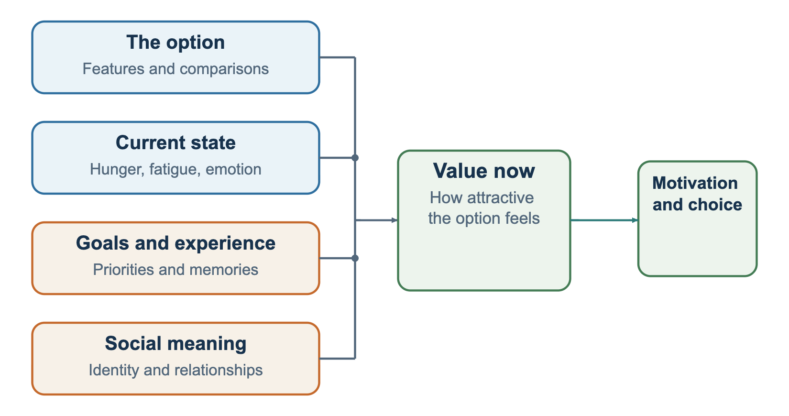<figcaption>Figure 7.1. Subjective value integrates option features with bodily state, goals, memory, identity, social meaning, attention, and comparison.</figcaption></figure>

Many people think of emotion as the enemy of rationality. This is understandable. Fear can exaggerate danger. Anger can produce rash action. Desire can narrow attention. Shame can distort self-evaluation. Excitement can make risks look smaller than they are.

But emotion is not the opposite of rationality. Emotion is central to valuation.

Prediction tells us what might happen. Emotion helps tell us why it matters.

A person who feels fear around a decision is not merely being irrational. Fear may signal possible loss, threat, embarrassment, danger, or uncertainty. A person who feels anger may be registering unfairness or violation. A person who feels guilt may be detecting inconsistency with moral standards. A person who feels pride may be sensing achievement or identity. A person who feels love may be recognizing attachment. A person who feels regret may be noticing the value of a path not taken.

Damasio’s work on patients with damage affecting emotion-related decision processes challenged the idea that reason works best without feeling. Some patients could reason abstractly and discuss options, yet struggled to make practical life decisions because options lacked emotional significance (Damasio, 1994). Bechara et al. (1997) developed the Iowa Gambling Task to study how people learn from reward and punishment. Patients with ventromedial prefrontal damage often failed to develop normal anticipatory emotional signals and continued choosing disadvantageous options even when the pattern harmed them.

The lesson is not that emotion always improves decisions. The lesson is that reason alone does not determine what is worth doing. A purely factual prediction cannot choose between outcomes unless something assigns value to them.

The somatic marker hypothesis proposes that bodily and emotional signals become linked to expected outcomes and help guide choice (Damasio, 1994). When a possible action is associated with danger, loss, or reward, the body may generate signals that bias attention and behavior. These signals can be useful shortcuts, especially when full calculation is impossible. They can also mislead when they are based on irrelevant associations or outdated learning.

The idea that emotion guides risk perception is also central to the “risk as feelings” framework. Loewenstein et al. (2001) argued that decisions under risk are shaped not only by cognitive estimates of probability and outcome, but also by immediate feelings such as fear, dread, anxiety, and excitement. This helps explain why a statistically small but vivid risk can dominate judgment, while a statistically larger but familiar or delayed risk may be ignored.

The affect heuristic describes a similar process. Slovic et al. (2002) argued that people often rely on their positive or negative feelings toward an object or activity when judging its risks and benefits. If something feels good, its benefits tend to seem high and its risks low. If something feels bad, its risks tend to seem high and its benefits low.

This pattern appears in many domains. A technology associated with progress may be judged as beneficial and safe. A technology associated with dread may be judged as risky and less beneficial. A company that people admire may receive the benefit of the doubt. A disliked group may have its actions interpreted more negatively. A familiar medical procedure may feel safer than an unfamiliar one even when the actual risk comparison is more complex.

Emotion also affects judgment in different ways depending on the emotion. Lerner and Keltner (2001) found that fear and anger have different effects on risk perception. Fear tends to be associated with pessimistic risk assessments and avoidance. Anger, by contrast, can be associated with more optimistic risk assessments and approach. Lerner and colleagues’ appraisal-tendency framework argues that different emotions carry different appraisals of certainty, control, responsibility, and anticipated effort, which then influence judgments and choices (Lerner et al., 2015).

This matters in organizations. A fearful leadership team may become overly cautious. An angry team may underestimate risk and move aggressively. A proud team may ignore warning signs. A guilty team may overcorrect. A disgusted team may reject options without analysis. An excited team may overvalue upside.

The answer is not to remove emotion. The answer is to identify what emotion is doing.

When facing an important decision, ask:

What am I feeling? Is this feeling about value or probability? Is the feeling relevant to the decision? Is it caused by the option itself, or by fatigue, social pressure, recent experience, or identity threat? Would I feel the same way tomorrow? Would I advise someone else to treat this feeling as evidence?

Emotion is essential for knowing what matters. It becomes dangerous when it silently impersonates evidence about what is likely.

## The self changes value

People do not evaluate options as detached observers. They evaluate them in relation to the self.

Self-relevance changes attention, memory, emotion, and value. Information connected to the self is more likely to capture attention and be remembered. The self-reference effect shows that information processed in relation to oneself is remembered better than information processed in other ways (Rogers et al., 1977). Neuroimaging studies have linked self-referential processing to medial prefrontal and default network regions (Kelley et al., 2002; Northoff et al., 2006).

Everyday examples are easy to find. You notice your own name in a noisy room. You scan a group photo for yourself. After buying a particular car, you notice that model everywhere. A comment about “people like you” feels more important than a general statement. A criticism of your profession, university, nationality, religion, political group, or company may feel personal even when it is abstract.

Self-relevance increases value. A mug is worth more when it is my mug. A project matters more when it is my project. A company strategy feels different when it affects my team. A public issue feels different when it touches my identity. A criticism feels different when it is criticism of me.

The endowment effect, which will be discussed more fully in Chapter 15 on framing and reference points, shows that ownership can increase valuation. Kahneman et al. (1990) found that people often demanded more money to give up an object they owned than they would have paid to acquire it. Ownership changes value partly because the object becomes incorporated into the self or reference point.

Self-relevance can motivate effort and persistence. When a goal is tied to identity—“I am a scientist,” “I am a teacher,” “I am a good parent,” “I am an honest person,” “I am someone who finishes what I start”—actions supporting that identity become more valuable. Identity-based motivation theory argues that identities shape what people attend to, how they interpret difficulty, and which actions feel congruent with who they are (Oyserman, 2009).

But self-relevance can also distort judgment. When an idea becomes part of the self, evidence against it may feel threatening. A founder may overvalue their product because it represents years of effort and identity. A manager may defend a strategy because it was “my initiative.” A student may avoid feedback because it threatens the identity of being smart. A political belief may become resistant to evidence because it signals group membership.

This is why self-relevance is both fuel and filter. It gives decisions energy, but it can also narrow what the decision-maker is willing to see.

A useful question is:

Is this option valuable because it serves my goals, or because it protects my self-image?

The answer is not always obvious. But asking the question opens space for reflection.

## Other people enter the value calculation

Value is also social. Human beings care deeply about approval, belonging, status, respect, fairness, reputation, and social meaning. We are not isolated calculators who care only about private material payoff.

Social approval can feel rewarding. Neuroimaging studies suggest that social acceptance, positive reputation, and approval can engage reward-related systems (Izuma et al., 2008; Korn et al., 2012). Social rejection, exclusion, and humiliation can feel painful. Eisenberger et al. (2003) found that social exclusion activated regions associated with distress, including the dorsal anterior cingulate cortex and anterior insula. Although the precise overlap between social pain and physical pain has been debated, the broader point remains: social experience has motivational force (Eisenberger, 2012).

This helps explain why decisions often change in public. A person may choose differently when observed. A student may ask fewer questions when peers are watching. A manager may reject uncertainty to appear decisive. A consumer may buy a brand that signals taste or status. A negotiator may refuse a reasonable offer because accepting it would feel humiliating.

Status is especially powerful. Humans are sensitive to rank, respect, prestige, and relative position. Status can motivate achievement and contribution, but it can also distort valuation. A job may become attractive because it impresses others. A purchase may become valuable because it signals belonging. A business strategy may be chosen because it makes leaders appear bold. A policy may be rejected because it seems like losing face.

Affiliation also shapes value. People value belonging, friendship, team identity, and being part of something larger than themselves. Deci and Ryan’s self-determination theory identifies relatedness, along with autonomy and competence, as a basic psychological need (Deci & Ryan, 2000). Belongingness theory similarly argues that humans have a strong need for stable, positive social bonds (Baumeister & Leary, 1995).

This means that social context can change what an option is worth. Working late may feel burdensome alone but meaningful when done for a trusted team. A difficult sacrifice may feel worthwhile when it supports family. A modest salary may be acceptable in a community of shared purpose but not in a culture of status competition. A decision may feel right because it preserves belonging, even if it is privately costly.

Social value also explains why fairness matters. People often reject outcomes that feel unfair, even at personal cost. This topic will be developed later in the social-mind and negotiation chapters, but it belongs here as a preview: valuation includes moral and relational meaning, not only material payoff.

Social value can be beneficial. It supports cooperation, trust, loyalty, care, and moral behavior. But it can also lead people to chase approval, conform to harmful norms, avoid necessary conflict, or make decisions for appearance rather than substance.

A useful decision question is:

Would I value this option the same way if no one else knew I chose it?

The answer can reveal the role of social value.

## Motives change the decision landscape

The same person can value the same option differently depending on which motive is active.

A hungry person values food differently from a full person. A frightened person values safety differently from a relaxed person. A lonely person values social contact differently from someone who feels secure. A status-conscious person values recognition differently from someone focused on mastery. A parent values risk differently when thinking about their child. A tired person values convenience differently from a rested person.

This does not mean preferences are random. It means humans have multiple motivational systems. Which motive is active changes the decision landscape.

Motivational psychology has offered many frameworks for understanding human goals. Drive theories emphasized biological needs such as hunger and thirst (Hull, 1943). Self-determination theory emphasizes autonomy, competence, and relatedness as basic psychological needs (Deci & Ryan, 2000). Evolutionary approaches emphasize recurring adaptive challenges such as self-protection, disease avoidance, affiliation, status, mate acquisition, mate retention, and kin care (Kenrick et al., 2010). These motives are not rigid steps in a ladder. They are overlapping systems that become more or less salient depending on context.

When a motive becomes active, it changes attention and value. Fear increases the value of safety. Disgust increases the value of purity and avoidance. Romantic interest can increase the value of status, distinctiveness, or attractiveness. Affiliation increases the value of belonging. Status motives increase sensitivity to rank and recognition. Care motives increase attention to vulnerability and protection.

Research by Griskevicius and colleagues illustrates how motives change preferences. In one set of studies, different emotional and motivational states changed which persuasive appeals worked. Fear increased the appeal of social proof, while romantic desire increased the appeal of distinctiveness and standing out (Griskevicius et al., 2006, 2009). The same museum could be attractive because “many people visit” or because it helps someone “stand out,” depending on the active motive.

Mating-related cues can also change valuation and patience. Wilson and Daly (2004) found that exposure to attractive opposite-sex faces led men to discount the future more steeply, choosing smaller immediate rewards over larger delayed ones. Roney (2003) found that men exposed to potential mates reported greater valuation of wealth, ambition, and status-related traits. These effects do not imply conscious strategy. They show that cues can shift motivational priorities.

Hunger provides a simpler example. Read and van Leeuwen (1998) found that current hunger influenced choices for future snacks. People in a “hot” state often mispredict what they will want in a “cold” state. Loewenstein (1996) called this the hot-cold empathy gap: people underestimate how much preferences and judgments change across visceral states such as hunger, pain, craving, sexual arousal, fear, anger, or fatigue.

This matters because many decisions are made in states that will not last. People shop while hungry, send messages while angry, make promises while inspired, accept deadlines while optimistic, agree to favors while socially pressured, and choose long-term paths while temporarily anxious or status-focused. Later, in another state, the choice may no longer fit.

A useful decision practice is to revisit important decisions in more than one state. Do not choose only while excited, afraid, tired, hungry, socially pressured, or angry. Sleep on major choices. Ask how the decision looks when calm, rested, and removed from immediate cues. Ask whether a temporary motive is making one value dominate all others.

This does not mean we should distrust motives. Motives are part of life. Safety, status, affiliation, care, curiosity, autonomy, and meaning all matter. The point is to notice which motive is currently steering valuation.

The most useful question in this chapter may be:

Which motive is making this option valuable right now?

## Using valuation wisely

Valuation is necessary. Without it, decision-making would have no direction. But because valuation is automatic, state-dependent, self-relevant, social, and motivationally flexible, it needs discipline.

The first discipline is to separate value from evidence. “I care about this” is not the same as “this will happen.” “This feels wrong” is not the same as “this is unlikely to work.” “This option excites me” is not the same as “this option has high expected value.” Chapter 1 introduced the distinction between prediction and valuation. This chapter shows why the distinction is difficult: value arrives quickly and feels like truth.

The second discipline is to ask what feature is driving value. Is the job attractive because of learning, salary, prestige, social approval, fear of missing out, or genuine fit? Is the product attractive because of usefulness, design, identity, scarcity, or wanting? Is the strategy attractive because of long-term value or because it makes leaders look bold?

The third discipline is to compare wanting with likely experience. Strong wanting can be informative, but it is not proof of lasting satisfaction. Before making major choices, ask whether the option will produce experienced value or mainly anticipated value, social value, or relief.

The fourth discipline is to choose in a representative state. If the decision affects your ordinary life, do not make it only in an extraordinary state. Do not evaluate a career only after public praise or public humiliation. Do not evaluate a purchase only under scarcity pressure. Do not evaluate a relationship only during conflict or infatuation. Do not evaluate a strategy only in panic.

The fifth discipline is to use outside perspectives. Other people may see which motives are active when we cannot. A trusted friend may notice that status is driving a career decision. A colleague may notice that fear is driving risk avoidance. A coach may notice that a leader is protecting identity rather than evaluating evidence.

The sixth discipline is to design environments that support better valuation. If what is visible becomes valuable, make long-term goals visible. If social meaning changes value, create cultures where good decisions are respected more than flashy decisions. If attention changes value, design meetings, dashboards, and decision templates that direct attention to what matters.

This is especially important in organizations. Organizations create value environments. What gets measured becomes important. What leaders praise becomes valuable. What gets promoted becomes desirable. What gets punished becomes avoided. If a company celebrates only speed, employees undervalue reflection. If it celebrates only revenue, they may undervalue trust. If it celebrates only confidence, they may undervalue accuracy. If it punishes every failed experiment, employees undervalue learning.

Leaders are architects of valuation.

So are teachers, doctors, designers, parents, negotiators, and policymakers. A teacher can make curiosity valuable. A doctor can make preventive action meaningful rather than frightening. A designer can make healthy choices salient. A negotiator can make cooperation feel respectful rather than weak. A parent can make effort more valuable than effortless success.

The ethical challenge is clear. To shape valuation is to influence choice. This can support autonomy and well-being, or it can manipulate attention and desire. Ethical valuation design helps people act on values they would endorse under reflection. Manipulative valuation design exploits temporary motives, insecurities, cravings, or social pressures for someone else’s gain.

The chapter ends with two bridges. Chapter 8 examines expectations: beliefs that can change attention, action, and feedback. Part II then shows how shortcuts and context shape judgment; Chapters 18–21 follow the choice into explanation, habit, self-control, and behavior design.

Before turning to habit, however, we need to examine a special kind of valuation loop: expectations. Sometimes beliefs do not merely describe reality. They help create it. When a teacher expects a student to succeed, when a patient expects side effects, when a manager expects employees to be irresponsible, or when a person expects rejection, those expectations can change attention, emotion, behavior, and feedback. Predictions can become causes.

Chapter 8 examines how expectations can become part of the causal system.

<aside class="callout evidence-and-boundary-conditions">
EVIDENCE AND BOUNDARY CONDITIONS

There is no single &quot;value center&quot; in the brain. Value-related signals arise in interacting networks, and fMRI associations do not imply that one region contains a psychological function or determines what a person ought to value.
</aside>

<aside class="callout evidence-and-boundary-conditions">
EVIDENCE AND BOUNDARY CONDITIONS

A neural signal can add predictive information about a choice without reading a stable preference or establishing a causal mechanism.
</aside>

*Table 7.1. Questions for separating value from evidence*

| Question | What it diagnoses | Typical risk |
| --- | --- | --- |
| What am I feeling? | The current value signal. | Treating emotion as probability. |
| What feature has my attention? | Attribute weighting in the moment. | Ignoring a quiet but important objective. |
| Do I want this, or expect to like it? | Motivational pull versus experienced value. | Choosing the cue rather than the outcome. |
| Whose approval or identity is involved? | Social and self-relevance. | Borrowing another audience’s values. |
| What changes if my state changes? | Hunger, fatigue, threat, or mood dependence. | Mistaking a temporary state for a stable preference. |

## Key ideas

- Subjective value is not a fixed price tag inside an option. It is constructed from expected consequences, attention, bodily state, emotion, memory, identity, social meaning, and current motives.
- Distinguish formal utility from psychological valuation.
- Explain emotion as a value signal rather than the opposite of reason.
- Describe how self-relevance and social relevance change value.

## Study and practice

1. How would you distinguish formal utility from psychological valuation?

2. How would you explain emotion as a value signal rather than the opposite of reason?

3. What evidence and mechanism would you use to describe how self-relevance and social relevance change value?

<aside class="callout activity">
ACTIVITY

Decompose the value of one option into functional, emotional, identity, social, moral, and future-self components. Which component was officially discussed, and which was quietly doing the work? EXPERIENCE - EXPLAIN - APPLY (MAXIMUM 120 WORDS) Experience: describe one specific decision, interaction, or observation. Explain: use one or two concepts from this chapter accurately. Apply: state one improvement, implication, or testable prediction.
</aside>

# Chapter 8. Expectations That Become Causes

*Beliefs can change perception, physiology, behavior, and social feedback*

<aside class="callout core-idea">
CORE IDEA

An expectation is sometimes more than a description of the future. It can alter attention, interpretation, effort, bodily response, treatment by others, and the feedback that later appears to confirm the original belief.
</aside>

## Learning goals

- Map a self-fulfilling expectation loop.
- Explain placebo and nocebo pathways without treating belief as magic.
- Evaluate self-efficacy and mindset evidence with boundary conditions.
- Design high expectations that include opportunity, support, and feedback.

The sociologist Robert K. Merton introduced the term self-fulfilling prophecy to describe a false definition of a situation that evokes behavior making the originally false belief come true (Merton, 1948). His classic example was a bank run. If enough people believe a bank is in trouble, they withdraw their money. Their withdrawals then create the very crisis they feared. The belief becomes real through the behavior it causes.

This structure appears far beyond banking.

A rumor that a company is failing may cause employees to leave, customers to hesitate, suppliers to tighten terms, and investors to withdraw support. These reactions can weaken the company and make failure more likely. A leader who believes a team lacks initiative may centralize every decision, preventing the team from developing initiative. A student who believes they cannot succeed may reduce effort, avoid challenge, and perform poorly, confirming the belief.

A self-fulfilling belief is a loop:

Belief shapes attention. Attention shapes interpretation. Interpretation shapes emotion. Emotion shapes action. Action shapes the environment. The environment produces feedback. Feedback seems to confirm the belief.

The danger is that the final confirmation feels like evidence. The manager says, “See? They really cannot work independently.” The student says, “See? I really am bad at this.” The anxious person says, “See? People do reject me.” The investor says, “See? The market knew.” But the evidence was partly produced by the original expectation.

Not every expectation fulfills itself. Some expectations are accurate because they are based on good evidence. Others are false but self-correcting. A prediction of failure may motivate preparation and prevent failure. A prediction of danger may lead to safety measures that avoid harm. These are sometimes called self-defeating prophecies: predictions that change behavior in ways that prevent the predicted outcome.

The key distinction is whether the belief changes the system. A weather forecast does not usually change the weather, although it changes whether people carry umbrellas. A bank failure rumor can change the bank’s actual condition. A teacher’s expectation can change a student’s opportunities. A doctor’s words can change a patient’s anxiety and bodily experience. A manager’s trust or distrust can change employee behavior.

Self-fulfilling beliefs matter for decision-making because they blur the line between prediction and action. When people make predictions about human systems, the prediction can become part of the system itself.

This is especially important in organizations. Forecasts influence budgets, hiring, morale, investment, and attention. If leaders predict that a product will fail, they may underfund it, assign weaker teams, and interpret early problems as confirmation. If they predict success, they may provide resources, patience, and attention. The forecast becomes a resource allocation decision disguised as a belief.

The same thing happens in education. A child labeled “gifted” may receive more challenge, encouragement, and patience. A child labeled “weak” may receive less demanding work, less wait time, and less autonomy. Over time, the labels can become less like descriptions and more like instructions.

The ethical lesson is clear: expectations are not neutral. To expect something from another person is often to begin treating them in a way that changes what becomes possible.

## Expectation in the body

<figure class="book-figure">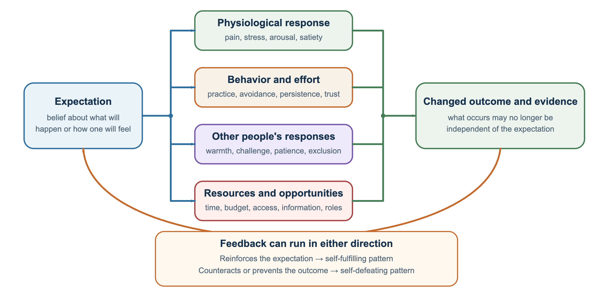<figcaption>Figure 8.1. Expectations can shape attention, action, and social response, producing feedback that appears to confirm the original belief.</figcaption></figure>

Expectation effects are not only social. They can shape subjective experience and even bodily responses.

The best-known examples are placebo and nocebo effects. A placebo effect occurs when positive expectations about a treatment contribute to improvement, even when the treatment has no active ingredient specific to the condition. A nocebo effect occurs when negative expectations contribute to worsening symptoms, side effects, or distress (Benedetti, 2008; Colloca & Barsky, 2020; Colloca & Miller, 2011).

Placebo effects are not simply “imaginary.” They can involve real psychological and physiological mechanisms, including expectation, learning, attention, anxiety reduction, endogenous opioids, dopamine pathways, and conditioning processes (Benedetti, 2008; Finniss et al., 2010). Response expectancy theory argues that expectations about one’s own nonvolitional responses—such as pain, anxiety, nausea, or fatigue—can help produce those responses (Kirsch, 1985).

If a patient expects pain relief, anxiety may fall, attention to pain may decrease, and endogenous pain-control systems may become more active. If a patient expects side effects, attention to bodily sensations may increase, ordinary sensations may be interpreted as symptoms, and anxiety may amplify discomfort.

Nocebo effects raise a difficult ethical problem in medicine. Patients have a right to know risks. But the way risks are communicated can increase fear and symptoms. A doctor who says, “This drug often causes terrible nausea” may produce a different expectation than one who says, “Some people experience nausea, but many do not, and we have ways to manage it.” Both can be truthful, but they create different expectation environments.

Ethical communication does not require hiding information. It requires communicating risks accurately without unnecessary threat amplification. Clinicians can validate concerns, provide balanced probabilities, explain what to monitor, and emphasize available support. The goal is neither deception nor careless optimism. The goal is informed expectation.

Expectation also shapes taste, pleasure, and consumer experience. Plassmann et al. (2008) found that when people believed they were drinking more expensive wine, they reported greater pleasantness, and valuation-related brain activity increased, even when the wine was actually the same. Lee et al. (2006) found that beer preferences changed depending on whether people learned before or after tasting that vinegar had been added. Information changed experience, not merely post-hoc explanation.

Marketing can produce placebo-like effects. Shiv et al. (2005) found that people who consumed an energy drink purchased at a discounted price performed worse on puzzle tasks than those who consumed the same drink at full price. The lower price apparently reduced expected efficacy. Again, the product did not change. Expectation changed performance.

Crum and Langer (2007) studied hotel room attendants whose work involved substantial physical activity. Some were informed that their work satisfied exercise recommendations; others were not. The informed group later showed improvements in measures such as weight, blood pressure, and perceived exercise. The study suggests that mindset about an activity can affect physiological outcomes, though such findings should be interpreted carefully and not turned into simplistic claims that belief alone determines health. Crum et al. (2011) similarly found that beliefs about a milkshake’s indulgence influenced physiological satiety responses.

The lesson is not that expectation is magic. Expectations do not override biology, poverty, disease, structural constraints, or physical reality. A person cannot believe away a broken bone or a toxic workplace. But expectations can shape attention, stress, interpretation, motivation, subjective experience, and physiological regulation. In many domains, those pathways matter.

This has practical implications.

A teacher’s words can make a difficult task feel like evidence of growth or evidence of inadequacy. A manager’s framing can make feedback feel like investment or punishment. A doctor’s explanation can make sensations feel manageable or alarming. A coach’s instruction can make fatigue feel like progress or failure. A product’s price, brand, and description can change how it is experienced.

People often think that expectations are “just mental.” But mental states are part of the body’s regulatory system. Expectations can change how the body prepares, attends, feels, and responds.

## Ability beliefs and performance

Expectations are especially powerful when they concern ability.

Consider a student who believes, “I am not a math person.” This belief can shape attention before the problem begins. The student may notice difficulty more quickly, interpret confusion as proof of inability, feel anxiety, avoid practice, give up earlier, and perform worse. The poor performance then confirms the belief.

Now consider a student who believes, “Math is difficult, but ability grows with practice.” This belief does not make the problem easy. But it can change the meaning of difficulty. Confusion becomes part of learning rather than proof of inadequacy. Effort becomes useful rather than embarrassing. Feedback becomes information rather than threat.

Self-efficacy, a concept developed by Bandura, refers to people’s beliefs about their capability to organize and execute actions required to achieve goals (Bandura, 1977, 1997). Self-efficacy affects effort, persistence, resilience, emotional response, and willingness to take on challenge. People with higher self-efficacy are more likely to approach difficult tasks, persist after setbacks, and recover from failure.

Self-efficacy is not the same as empty confidence. It is most useful when grounded in mastery experiences, modeling, feedback, and realistic strategies. False confidence can be dangerous. But low confidence can also become self-defeating if it prevents the very effort that would build ability.

Dweck’s work on implicit theories of intelligence makes a related point. A fixed mindset treats ability as relatively stable; a growth mindset treats ability as developable through effort, strategy, and support (Dweck & Leggett, 1988; Dweck, 2006). Students with growth-oriented beliefs may respond differently to difficulty because failure carries a different meaning. Blackwell et al. (2007) found that growth mindset interventions could improve motivation and academic trajectories in some settings.

However, mindset should not be oversold. Meta-analytic work suggests that mindset effects and interventions can be modest and context-dependent (Sisk et al., 2018). Yeager et al. (2019) found that a national growth mindset intervention had small but meaningful effects, especially in supportive school contexts. The practical conclusion is not “just believe and success will follow.” A better conclusion is: beliefs about ability matter most when environments provide real opportunities, strategies, support, and feedback.

Learned helplessness shows the darker side of expectation. In early research, animals exposed to uncontrollable adverse events later failed to escape even when escape became possible (Seligman, 1975). Abramson et al. (1978) extended the idea to human attributional style: people are more vulnerable when they explain bad outcomes as internal, stable, and global—“It is my fault, it will always be this way, and it affects everything.” Maier and Seligman (2016) later refined the neuroscience and interpretation of learned helplessness, emphasizing control and active coping.

In decision-making, helplessness becomes dangerous because it changes the perceived choice set. A person who believes nothing will help stops searching for alternatives. A team that believes leadership never listens stops speaking up. A community that believes institutions are permanently unresponsive stops participating. The belief narrows action, and reduced action confirms the belief.

Expectations also shape performance through other people. Rosenthal and Jacobson’s famous study, Pygmalion in the Classroom, suggested that teacher expectations could influence student achievement (Rosenthal & Jacobson, 1968). Teachers were told that certain randomly selected students were likely to show intellectual growth. Those students later showed greater gains, especially among younger children. The interpretation and magnitude of teacher expectancy effects have been debated, but later reviews conclude that expectancy effects are real, though usually more moderate and context-dependent than popular accounts suggest (Jussim & Harber, 2005).

Expectancy effects can operate through multiple channels: teachers may provide more warmth, more challenging material, more response opportunities, more detailed feedback, and more patience to students from whom they expect growth (Harris & Rosenthal, 1985). Students then respond to the richer environment.

The same logic applies to management. Eden (1992) described Pygmalion effects in organizations: leaders’ high expectations can improve subordinate performance when they produce confidence, support, challenge, and opportunity. McNatt’s (2000) meta-analysis found evidence for Pygmalion effects in management contexts. Low expectations can produce the opposite, sometimes called a Golem effect, where negative expectations undermine performance.

The ethical distinction is important. “High expectations” should not mean pressure without support. It should mean credible belief in capacity combined with resources, coaching, autonomy, and feedback. Empty slogans can become blame: “If you failed, you must not have believed enough.” That is not decision science; it is moralized optimism.

Good expectations are not fantasies. They are structured invitations to grow.

## Identity and the meaning of difficulty

Expectations do not only come from individuals. They also come from culture.

A person can enter a classroom, workplace, negotiation, or exam carrying social expectations about what “people like me” are supposed to be good at, bad at, allowed to do, or likely to become. These expectations can affect performance even when no one explicitly discriminates in the moment.

Stereotype threat occurs when people fear confirming a negative stereotype about a group to which they belong (Steele & Aronson, 1995). Steele and Aronson found that Black students performed worse on difficult verbal tests when the test was framed as diagnostic of ability, making racial stereotypes about intellectual ability more relevant. When the same task was framed differently, performance gaps were reduced.

Spencer et al. (1999) found stereotype threat effects among women taking difficult math tests when gender stereotypes about math ability were made relevant. Shih et al. (1999) found that Asian American women’s math performance shifted depending on whether ethnic identity or gender identity was made salient. The same person can perform differently depending on which identity-linked expectation is activated.

The mechanism is not simple. Stereotype threat may operate through anxiety, increased monitoring, working memory load, reduced sense of belonging, altered motivation, and interpretation of difficulty (Schmader et al., 2008). Meta-analyses show that effects vary by context, task, group, and methodology, and the literature has generated debate about effect sizes and boundary conditions (Flore & Wicherts, 2015; Nguyen & Ryan, 2008). But the core idea remains important: social meanings can enter performance through expectation.

A key feature of stereotype threat is that difficulty changes meaning. A hard problem is not merely hard. It becomes evidence that one may confirm a stereotype. That extra meaning consumes attention and increases pressure. In Chapter 6’s terms, the task is no longer just a task; it is filtered through an inner model of social evaluation.

Stereotypes can also shape aging. Levy and Langer (1994) found that cultural beliefs about aging were associated with memory performance among older adults in different cultural groups. Levy (2009) and colleagues have argued that aging stereotypes can influence health through psychological, behavioral, and physiological pathways. In one longitudinal study, people with more positive self-perceptions of aging lived longer on average than those with more negative self-perceptions, even after controlling for several relevant factors (Levy et al., 2002). Negative aging stereotypes held earlier in life have also been linked to later cardiovascular events (Levy et al., 2009).

These findings should not be interpreted as saying that aging is “all mindset.” Biology, healthcare, income, environment, discrimination, and physical conditions matter enormously. But beliefs about aging can influence activity, stress, motivation, social engagement, and interpretation of bodily changes. A person who believes decline is inevitable may stop exercising, learning, or seeking social connection. A person who believes growth and adaptation remain possible may act differently.

Expectations also shape belonging. Walton and Cohen (2011) found that a brief social-belonging intervention improved academic and health outcomes among African American college students over time. The intervention helped students interpret common social difficulties as normal and temporary rather than as evidence that they did not belong. The effect was not simply positive thinking; it changed the meaning of adversity.

This is one of the most important principles of expectation effects:

Expectations change the meaning of difficulty.

Difficulty can mean “I am not capable.” It can mean “I am learning.” It can mean “I do not belong.” It can mean “This is normal at the beginning.” It can mean “People like me cannot do this.” It can mean “People like me have done this before.”

The experience of the same difficulty can lead to withdrawal or persistence depending on the expectation attached to it.

Educators, leaders, parents, doctors, and negotiators should therefore be careful meaning-makers. The words they use can attach interpretations to effort, pain, uncertainty, conflict, and failure. Those interpretations can influence what people do next.

## Expectations between people

Expectations shape not only individual performance but also relationships.

Suppose you expect a colleague to be defensive. You enter the conversation cautiously, use guarded language, avoid warmth, and interpret questions as resistance. Your colleague senses distrust, becomes less open, and responds stiffly. You leave thinking, “I knew they would be defensive.”

But your expectation helped create the interaction.

Snyder et al. (1977) demonstrated this kind of behavioral confirmation in a classic study. Men spoke by telephone with women whom they believed to be either physically attractive or unattractive, based on photographs that were not actually of the women. Men who believed they were speaking with an attractive woman behaved more warmly. The women, responding to that warmth, behaved in ways that independent observers judged as warmer and more sociable. The men’s expectations changed their own behavior, which elicited confirming behavior from the women.

Darley and Fazio (1980) described expectancy-confirmation processes in social interaction. Expectations shape how perceivers act toward targets; targets respond to that treatment; perceivers interpret the response as evidence for their original expectation. The process can happen without conscious intention.

This has obvious implications for leadership. A manager who trusts employees may give autonomy, share information, and invite initiative. Employees may respond with responsibility and engagement. A manager who distrusts employees may monitor closely, withhold information, and restrict discretion. Employees may become passive or resentful, confirming the manager’s belief.

It also matters for negotiation. If you expect the other side to be dishonest, you may withhold information, make guarded offers, and interpret ambiguity as manipulation. The other side, sensing distrust, may also become guarded. The negotiation becomes more adversarial, confirming your expectation. Conversely, if you assume cooperation too naively, you may reveal too much or fail to protect yourself. The point is not to trust blindly. The point is to recognize that expectations shape the interaction.

Expectations also matter in intimate relationships. If one partner expects criticism, they may hear neutral comments as attacks. If another expects abandonment, they may test the relationship in ways that create conflict. If a friend expects exclusion, they may withdraw, reducing invitations and confirming loneliness. Social life is full of loops in which expectation shapes behavior and behavior shapes evidence.

Social anxiety offers a clear example. A person expects negative evaluation, monitors themselves intensely, avoids eye contact, speaks less, or behaves stiffly. Others may experience the interaction as distant, which can reduce warmth. The anxious person interprets the reduced warmth as rejection. The original expectation becomes self-confirming.

The practical question is:

How am I treating people because of what I expect from them?

In many relationships, the fastest way to test an expectation is not to ask whether it is true in the abstract, but to change one’s own behavior and observe what becomes possible. Offer trust with boundaries. Ask a warmer question. Give clearer responsibility. Provide more autonomy. Interpret ambiguity generously once, not forever. Make it easier for the other person to disconfirm your expectation.

Expectations are invitations. Some invite defensiveness. Others invite competence, openness, trust, or effort.

## Building truthful, supported expectations

Expectation effects can help or harm. The goal is not to believe whatever feels good. The goal is to create expectations that are truthful, empowering, testable, and ethically communicated.

The first step is to identify the loop. When an expectation keeps confirming itself, ask how it might be shaping attention, interpretation, emotion, action, and feedback.

A teacher might ask: Do I call on some students more often? Do I wait longer for some answers? Do I give richer feedback to students I expect to succeed? Do I interpret the same mistake differently depending on the student?

A manager might ask: Do I give autonomy only to employees I already trust? Do I create passivity through micromanagement? Do I treat questions as resistance? Do I underinvest in people I have labeled as weak?

A person might ask: Do I avoid situations that could disconfirm my fear? Do I interpret neutral feedback negatively? Do I quit early because I expected difficulty? Do I act in ways that make rejection more likely?

The second step is to separate prediction from treatment. It may be reasonable to believe that someone currently lacks a skill. It does not follow that they should be denied opportunities to build it. A student may be behind; that is a prediction about current performance. The valuation question is how much support and challenge they deserve. The action question is what environment would allow improvement.

The third step is to make expectations testable. Instead of saying, “This employee lacks initiative,” specify observable predictions: “If given a clear goal and authority over the method, will this employee propose a plan within one week?” Then run a small test. Instead of saying, “I am bad at public speaking,” specify: “If I practice three times with feedback, will my next presentation improve?” A testable expectation can learn.

The fourth step is to use high expectations with high support. High expectations without support become pressure. Support without expectations becomes low challenge. The strongest developmental environments communicate: “This is difficult, you can improve, and we will provide the tools, feedback, and standards that help you improve.”

The fifth step is to avoid identity traps. Do not turn temporary performance into permanent identity. “You did poorly on this task” is different from “You are bad at this.” “This strategy failed” is different from “We are not innovative.” “This conversation was difficult” is different from “This relationship is hopeless.” Identity labels are sticky because they shape future attention and action.

The sixth step is to communicate uncertainty carefully. In medicine, education, management, and leadership, people need accurate information, but they also need language that does not unnecessarily create nocebo, helplessness, or identity threat. A doctor can say, “Some patients experience side effects, and here is what to watch for; many do not, and we can manage them if they arise.” A teacher can say, “This is a hard problem, and confusion at this stage is normal.” A manager can say, “This project has risks, but here is how we will test them.”

The seventh step is to change the environment, not only the belief. Expectation interventions work best when the environment supports the new belief. Telling students they belong is more credible when classrooms are inclusive. Telling employees they are trusted is credible when they receive real authority. Telling patients symptoms are manageable is credible when support is available. Beliefs need evidence.

The ethical principle is simple: use expectations to expand agency, not to deny reality.

Positive expectations become harmful when they blame people for structural barriers, illness, discrimination, or bad luck. Negative expectations become harmful when they deny people opportunity. Ethical expectation design combines honesty, support, and possibility.

Parts II and III carry this loop forward. Chapters 9–18 examine judgment and post-choice explanation; Chapters 19–21 then show how repeated expectation-guided actions can become habits and how those habits can be redesigned. Expectations shape what we notice, feel, and do. When expectation-guided actions are repeated in stable contexts, they can become automatic. A student repeatedly avoiding math, a manager repeatedly micromanaging, a patient repeatedly scanning for symptoms, or a person repeatedly withdrawing from social contact may no longer experience the behavior as a decision. It becomes a habit loop.

Before behavior becomes habit, it is often expectation in action.

<aside class="callout evidence-and-boundary-conditions">
EVIDENCE AND BOUNDARY CONDITIONS

Expectation effects are pathways, not magic. They do not erase disease, material constraints, discrimination, poverty, or structural power.
</aside>

<aside class="callout evidence-and-boundary-conditions">
EVIDENCE AND BOUNDARY CONDITIONS

Growth-mindset and stereotype-threat effects are heterogeneous and often modest. Context, task, support, measurement, and implementation matter. Avoid converting a conditional effect into blame for people who face real barriers.
</aside>

*Table 8.1. Expectation pathways and ethical conditions*

| Domain | Pathway | Ethical condition |
| --- | --- | --- |
| Medicine | Expectation changes attention, anxiety, and symptom experience. | Give balanced risk information and a credible coping plan. |
| Education | Ability beliefs change effort, persistence, and interpretation of difficulty. | Pair high expectations with strategy, support, and opportunity. |
| Management | Leader expectations change autonomy, feedback, and challenge. | Make resources and standards match the expectation. |
| Relationships | Predicted rejection changes behavior and the response it elicits. | Test the prediction through perspective-getting, not mind-reading. |

## Key ideas

- An expectation is sometimes more than a description of the future. It can alter attention, interpretation, effort, bodily response, treatment by others, and the feedback that later appears to confirm the original belief.
- Map a self-fulfilling expectation loop.
- Explain placebo and nocebo pathways without treating belief as magic.
- Evaluate self-efficacy and mindset evidence with boundary conditions.

## Study and practice

1. How would you map a self-fulfilling expectation loop?

2. How would you explain placebo and nocebo pathways without treating belief as magic?

3. How would you evaluate self-efficacy and mindset evidence with boundary conditions?

<aside class="callout activity">
ACTIVITY

Map one expectation loop from belief through attention, feeling, action, response from others, and feedback. Redesign one link so the expectation can be tested rather than automatically fulfilled. EXPERIENCE - EXPLAIN - APPLY (MAXIMUM 120 WORDS) Experience: describe one specific decision, interaction, or observation. Explain: use one or two concepts from this chapter accurately. Apply: state one improvement, implication, or testable prediction.
</aside>

# Part 2. Judgment Under Uncertainty and Context

How shortcuts, statistics, comparison sets, frames, and fluency shape what seems true and worth doing.

# Chapter 9. Heuristics: The Adaptive Toolbox

*Simple rules for a world that does not permit complete calculation*

<aside class="callout core-idea">
CORE IDEA

A heuristic is a simplifying process, not an error by definition. Its quality depends on whether the cue it uses matches the structure of the environment.
</aside>

## Learning goals

- Explain heuristics as a response to bounded rationality.
- Describe ecological rationality and satisficing.
- Explain recognition and fast-and-frugal rules.
- Identify when expert intuition has been trained by valid feedback.

The rational-choice benchmark in Chapter 2 assumes that decision-makers identify alternatives, form beliefs, clarify preferences, compare trade-offs, and choose the option that best satisfies their goals. That model is useful as a benchmark. But it is too slow and information-hungry for much of life.

A person choosing a sandwich does not calculate expected utility. A driver does not compute every possible path through traffic. A doctor in an emergency cannot compare every possible diagnosis in equal detail. A firefighter cannot stand inside a burning building and build a spreadsheet. A parent crossing a street with a child cannot wait for complete information.

Human beings are bounded. Time, attention, memory, information, and computational capacity are limited (Simon, 1955, 1956). Heuristics are one way the mind deals with these limits.

A heuristic simplifies. It may use one or a few cues rather than all available information. It may stop search early. It may rely on recognition, emotion, similarity, availability, or a single decisive reason. It may choose the first option that is good enough rather than searching for the best possible option. It may answer a related easier question when the harder question is too difficult.

This is not necessarily foolish. In many real environments, more information does not always improve judgment. Too much information can distract, delay, and create overfitting. Simple models and simple rules often perform surprisingly well, especially when environments are noisy and feedback is limited (Gigerenzer & Gaissmaier, 2011; Gigerenzer et al., 1999; Payne et al., 1993).

Consider emergency medicine. A doctor may use a fast triage rule that relies on a few critical cues rather than a full diagnostic model. In finance, simple diversification rules can sometimes protect ordinary investors better than elaborate but fragile forecasting. In hiring, structured criteria may outperform rich but unstructured impressions. In daily life, choosing a familiar route, buying a trusted product, or asking a knowledgeable friend may be efficient.

The mistake is to treat heuristics as the opposite of rationality. A better view is that heuristics are part of bounded rationality. They are ways of making decisions when full optimization is impossible or too costly.

Herbert Simon’s idea of satisficing is central here. Instead of searching endlessly for the best possible option, people often search until they find an option that is good enough (Simon, 1955, 1956). Satisficing can be highly rational when search is costly. If choosing a restaurant, it may be better to find a good enough place in ten minutes than the theoretically optimal place after three hours.

Gigerenzer and colleagues describe the mind as having an adaptive toolbox: a collection of heuristics suited to different environments (Gigerenzer et al., 1999; Gigerenzer & Selten, 2001). A hammer is useful for nails but poor for surgery. A heuristic is useful when it fits the structure of the problem but poor when applied in the wrong environment.

This is the idea of ecological rationality: a strategy is rational when it works well in the environment in which it is used (Gigerenzer & Gaissmaier, 2011). A simple rule can be better than a complex rule if the simple rule matches the environment and avoids noise.

This reframes the study of heuristics. The question is not: “Why are people irrational?” The better question is:

When does this shortcut fit the environment, and when does it fail?

A heuristic becomes dangerous when the cue it relies on is no longer valid, when the environment has changed, when someone manipulates the cue, or when the problem requires statistical reasoning that the shortcut does not provide.

For example, “familiar means safe” may work in a small community where familiarity comes from repeated reliable experience. It can mislead in digital media, where repeated exposure can be manufactured. “Confident means competent” may work in some physical or emergency contexts where confidence reflects practiced skill. It can mislead in interviews, sales, politics, and leadership, where confidence can be performed. “Popular means good” may work when popularity reflects genuine collective experience. It can mislead when popularity is driven by hype, bots, herd behavior, or advertising.

Heuristics are shortcuts. Whether they are wise depends on the road.

## Trigger features and cue-based judgment

<figure class="book-figure">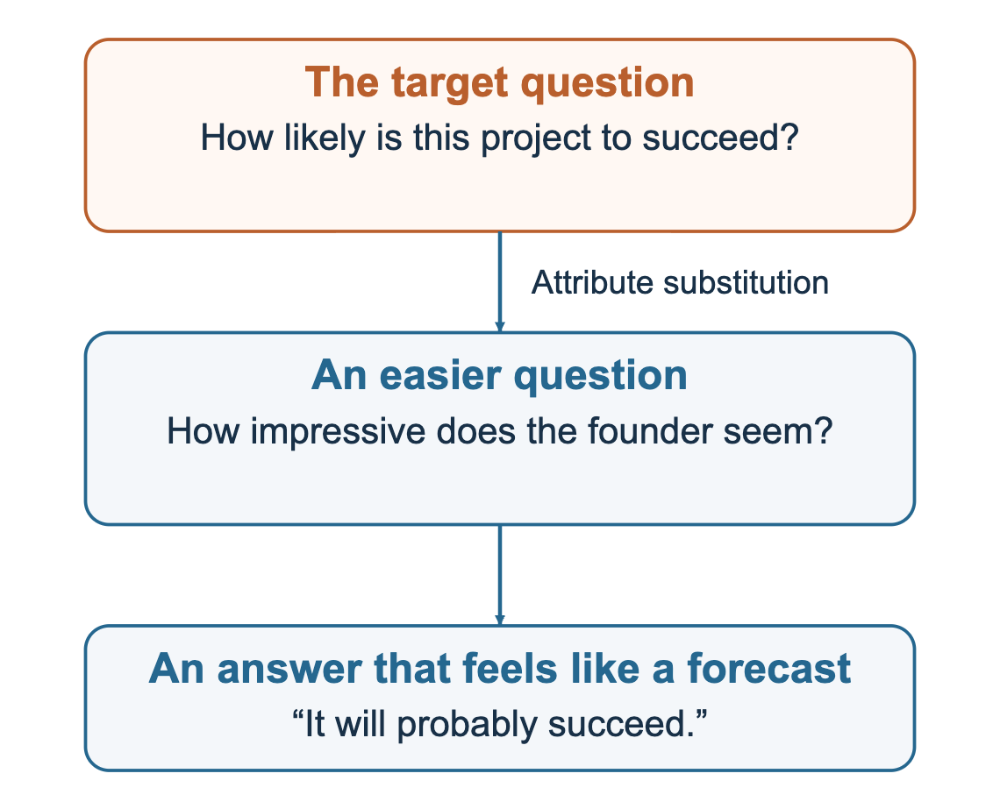<figcaption>Figure 9.1. A heuristic often answers an easier question than the one the decision actually requires.</figcaption></figure>

Animals use simple cues to guide behavior. A mother turkey responds strongly to the “cheep-cheep” sound of chicks. Ethologists have shown that animals often rely on trigger features—specific cues that activate adaptive behavior. Such cues usually work because they are reliable in the animal’s natural environment. But they can be exploited or misdirected when the cue is artificially produced (Cialdini, 2009; Tinbergen, 1951).

Heuristics are adaptive strategies for bounded agents; their quality depends on the fit between a rule and the environment in which it is used (Simon, 1955, 1956; Gigerenzer & Gaissmaier, 2011).

Humans also respond to trigger features. We see a white coat and infer medical authority. We see a high price and infer quality. We see many people choosing something and infer it is good. We hear a reason after a request and become more willing to comply. We see a smiling face and infer warmth. We see a familiar logo and infer reliability.

These cue-based judgments are efficient because attention is scarce. The mind cannot evaluate every object, person, message, and choice from first principles. It uses signals. Many signals are useful. A uniform may indicate role. A credential may indicate training. A crowd may indicate quality. A reason may indicate legitimacy. A familiar brand may indicate prior reliability.

But trigger features can be exploited. A salesperson can display authority cues without expertise. A website can show fake popularity. A product can use premium packaging to imply quality. A political message can use emotional imagery to bypass careful evaluation. A scam can use urgency and scarcity to shut down reflection.

This is why heuristics connect to later chapters on social influence, persuasion, and choice architecture. Influence often works by activating shortcuts that are usually useful. The problem is not that people use shortcuts. The problem is that modern environments can manufacture the cues that shortcuts rely on.

Kahneman and Frederick (2002) described many heuristics as cases of attribute substitution. When faced with a difficult question, the mind substitutes an easier one.

Difficult question: How likely is this start-up to succeed? Easier question: How impressive is the founder’s story?

Difficult question: How risky is this medical treatment compared with alternatives? Easier question: How frightening does the treatment sound?

Difficult question: How good will this candidate be in the role after one year? Easier question: How confident did the candidate seem in the interview?

Difficult question: How common is this event? Easier question: How easily can I remember examples?

The mind often answers the easier question and then experiences the answer as if it applied to the harder one. Attribute substitution is efficient because the easier question is available. It is dangerous because the substituted attribute may not be valid.

The purpose of decision science is not to eliminate substitution. That is impossible. The purpose is to recognize when the substitute question is good enough and when the original question deserves more careful treatment.

## Recognition and fast-and-frugal rules

Some heuristics use even less information. The recognition heuristic says that if one of two objects is recognized and the other is not, and recognition is correlated with the criterion, infer that the recognized object has the higher value on that criterion (Goldstein & Gigerenzer, 2002).

Suppose someone asks which city is larger: San Diego or San Antonio. A person who recognizes San Diego but not San Antonio may choose San Diego. If recognition is correlated with city size, the heuristic works. Partial ignorance can be useful. This is sometimes called a “less-is-more” effect: people with less knowledge may sometimes perform better than people with more knowledge if recognition points in the right direction and additional information adds noise.

Recognition can be useful in sports, geography, brands, politics, and consumer choice when recognition reflects genuine exposure, reputation, or quality. But it can mislead when recognition is created by advertising, scandal, repetition, or manipulation. A well-known product is not always better. A familiar candidate is not always more competent. A famous company is not always a good investment.

Fast-and-frugal heuristics use simple rules that search for limited information and stop quickly. One example is take-the-best: compare options on the most valid cue; if that cue discriminates, choose the better option; if not, move to the next cue (Gigerenzer & Goldstein, 1996). This kind of heuristic can perform well when cues differ in validity and information search is costly.

Another simple strategy is elimination by aspects, described by Tversky (1972). People choose an attribute, eliminate options that fail to meet a threshold, then move to another attribute. A student choosing apartments may first eliminate all options above a budget, then all options too far from campus, then all without natural light. This is not full utility maximization, but it is often practical.

Fast-and-frugal trees are simple classification tools that use a few yes/no questions. In some medical and organizational settings, such trees can be effective because they are transparent, quick, and robust (Gigerenzer & Gaissmaier, 2011; Martignon et al., 2008). A complex model may perform better in some circumstances, but simple decision trees can be easier to implement, audit, and teach.

This connects to research showing that simple models can sometimes rival or outperform expert judgment. Dawes (1979) argued for the “robust beauty” of improper linear models: even simple, imperfectly weighted models can outperform unaided clinical judgment because they apply criteria consistently. Meehl (1954) famously argued that statistical prediction often outperforms clinical judgment in many domains. The lesson is not that human judgment is useless. It is that simple rules can reduce inconsistency.

In organizational decision-making, simple heuristics can be valuable when they are explicit.

For example:

Never hire without a work sample. Never launch a major project without a premortem. If a meeting has no decision question, do not hold it. If a project’s downside threatens survival, stage it. If an investment cannot be explained simply, do not buy it. If a negotiation has only one issue, look for more issues.

These rules are not perfect. But they can protect against common failures.

The challenge is to choose heuristics deliberately rather than inherit them unconsciously. “Trust your gut,” “hire for culture fit,” “move fast,” “follow the leader,” “avoid conflict,” and “choose the cheapest option” are also heuristics. Some are useful; some are dangerous. A good organization examines its rules of thumb.

A useful question is:

What heuristic are we already using, and is it the right one for this environment?

## Expert intuition

Not all fast judgment is naive. Sometimes intuition reflects genuine expertise.

Gary Klein’s research on naturalistic decision-making examined how firefighters, military commanders, nurses, and other professionals make decisions in real-world environments involving time pressure, uncertainty, and high stakes. Klein (1998) proposed the recognition-primed decision model. Experts often do not compare many options. Instead, they recognize a situation as familiar, retrieve a plausible course of action, mentally simulate whether it will work, and act if it seems adequate.

This is a form of skilled heuristic judgment. A firefighter entering a burning building may sense that something is wrong because the fire is too quiet or the heat pattern does not fit expectations. A nurse may notice subtle signs that a patient is deteriorating. A chess master may see a strong move quickly. These judgments are fast, but they are not arbitrary. They are built from experience.

Kahneman and Klein (2009) examined when intuitive expertise should be trusted. They agreed on two conditions. First, the environment must be sufficiently regular to be predictable. Second, the decision-maker must have had enough opportunity to learn from clear, timely feedback.

Chess satisfies these conditions. So do many domains of skilled perception and action. But some environments do not. Long-term stock picking, geopolitical forecasting, hiring from unstructured interviews, and predicting the success of early-stage start-ups often provide noisy, delayed, ambiguous feedback. In such environments, confidence can grow without accuracy.

This distinction is crucial. Experience alone does not produce expertise. Repeated exposure to a noisy environment can produce confident illusions. A manager who has interviewed hundreds of candidates may feel expert, but if feedback is delayed, ambiguous, and never compared with rejected candidates, the learning environment is weak. An investor who succeeded in one market boom may interpret luck as skill. A political pundit may make confident forecasts without systematic feedback.

Expert intuition works when patterns are real and feedback trains recognition.

This suggests practical tests for trusting intuition:

Is the environment stable enough to learn? Have I seen many similar cases? Was feedback clear and timely? Have I tracked my predictions? Do experts in this domain agree more than chance? Could success be due to luck? Am I recognizing a pattern or merely feeling familiarity?

Fast judgment can be a gift when trained in the right environment. It can be a trap when confidence is mistaken for expertise.

## When a shortcut leaves its home environment

Heuristics misfire when the cue they rely on no longer predicts the outcome, when the environment changes, when feedback is poor, or when someone manipulates the cue.

Modern life creates many mismatches.

In small communities, reputation may be a reliable guide. In online environments, reputation signals can be manufactured. In ancestral environments, sweet and fatty foods were scarce and valuable. In modern food environments, they are abundant and engineered. In direct personal experience, repeated exposure may indicate familiarity and safety. In media environments, repeated exposure may indicate advertising budget or algorithmic amplification. In face-to-face groups, social proof may reflect genuine local knowledge. Online, social proof may reflect virality, bots, or herd behavior.

This does not mean humans have “bad brains.” It means brains built to act under uncertainty can be exploited by environments that control cues.

Heuristics also misfire with statistics. People are good at stories, examples, patterns, and intentions. They are less naturally good at base rates, conditional probabilities, regression to the mean, sample size, and random variation. Representativeness and availability can make a detailed story feel more likely than a general statistic. This is why probability judgment deserves its own chapter.

Heuristics misfire under strong motivation. If a conclusion supports our identity, our search and evaluation processes may become biased. If we want a project to succeed, availability supplies success stories. If we fear failure, availability supplies disasters. If a candidate resembles our prototype of excellence, representativeness supplies confidence. Heuristics do not operate in a neutral mind; they operate inside motives.

They also misfire when the cost of error is high. A shortcut that is acceptable for choosing lunch may be dangerous for choosing a medical treatment, hiring a leader, approving a merger, or designing public policy. The appropriate decision process depends on stakes, reversibility, uncertainty, and feedback.

A simple rule is:

Use heuristics when the decision is low-stakes, familiar, repeated, feedback-rich, and time-constrained. Slow down when the decision is high-stakes, novel, irreversible, statistical, emotionally charged, socially pressured, or vulnerable to manipulation.

This rule is itself a heuristic. But it is a useful one.

## Using heuristics wisely

The goal is not to eliminate heuristics. That would be impossible and undesirable. The goal is to use them wisely.

The first step is to name the shortcut. Am I using affect, availability, representativeness, recognition, social proof, authority, price, familiarity, or a single decisive criterion? Naming the heuristic creates distance.

The second step is to ask whether the cue is valid. Does confidence predict performance in this role? Does familiarity predict truth in this information environment? Does popularity predict quality in this market? Does similarity to past success predict future success here?

The third step is to check the base rate. Even when a story feels representative, ask what usually happens in similar cases. How often do start-ups succeed? How often do projects finish on time? How predictive are interviews? How common is the feared event? Base rates often correct availability and representativeness.

The fourth step is to improve the environment. If people rely on shortcuts, design better shortcuts. In hiring, require structured criteria and work samples. In medicine, use checklists for rare but serious conditions. In organizations, create decision rules that trigger premortems, outside views, or independent estimates. In personal life, use default rules: “Do not make major purchases after 10 p.m.” or “Wait twenty-four hours before replying to an angry email.”

The fifth step is to combine heuristics with reflection. A fast impression can be the beginning of judgment, not the end. Ask: “My intuition says yes. What is the strongest reason it might be wrong?” Or: “This feels risky. Is the risk actually likely, or just vivid?”

The sixth step is to track feedback. If you rely on intuition in a domain, keep score. Forecast outcomes, record confidence, and review accuracy. Without feedback, heuristics cannot improve.

The seventh step is to match effort to stakes. Not every decision deserves analysis. But important decisions deserve more than an unexamined shortcut. The skill is not being slow all the time. The skill is knowing when fast is enough.

A good decision-maker does not ask, “Should I use heuristics or rational analysis?” A good decision-maker asks:

Which shortcut is my mind using, and does this situation deserve a slower check?

Chapters 10–17 examine the shortcuts, statistical errors, and contextual mechanisms that can bend judgment. The distinction is important. Heuristics are processes. Biases are systematic errors that may result from those processes. Availability is a shortcut. Overestimating rare vivid events is a bias that can result from it. Representativeness is a shortcut. Ignoring base rates is a bias that can result from it. Affect is a shortcut. Treating dislike as evidence of danger is a bias that can result from it.

Heuristics make judgment possible. Biases show where judgment bends.

<aside class="callout evidence-and-boundary-conditions">
EVIDENCE AND BOUNDARY CONDITIONS

&quot;Less is more&quot; is not a license to ignore evidence. Simple rules can outperform complex models in noisy environments, but only when their stopping rule and cue structure fit the task.
</aside>

## Key ideas

- A heuristic is a simplifying process, not an error by definition. Its quality depends on whether the cue it uses matches the structure of the environment.
- Explain heuristics as a response to bounded rationality.
- Describe ecological rationality and satisficing.
- Explain recognition and fast-and-frugal rules.

## Study and practice

1. How would you explain heuristics as a response to bounded rationality?

2. What evidence and mechanism would you use to describe ecological rationality and satisficing?

3. How would you explain recognition and fast-and-frugal rules?

<aside class="callout activity">
ACTIVITY

Choose a recent judgment. Name the hard target question, the simpler question you actually answered, and the environmental condition that makes the shortcut valid or invalid. EXPERIENCE - EXPLAIN - APPLY (MAXIMUM 120 WORDS) Experience: describe one specific decision, interaction, or observation. Explain: use one or two concepts from this chapter accurately. Apply: state one improvement, implication, or testable prediction.
</aside>

# Chapter 10. Feeling and Availability as Shortcuts

*When emotion and memory answer questions about risk, value, and frequency*

<aside class="callout core-idea">
CORE IDEA

Feelings and ease of recall often summarize useful experience, but they can become misleading when incidental emotion or vivid memory substitutes for evidence.
</aside>

## Learning goals

- Explain the affect heuristic.
- Explain availability and retrieval fluency.
- Distinguish integral from incidental emotion.
- Use base rates to check vivid judgments.

The affect heuristic occurs when people use feelings of goodness or badness as a guide to judgment. If something feels good, people tend to judge its benefits as high and its risks as low. If something feels bad, they tend to judge its risks as high and its benefits as low (Slovic et al., 2002).

This shortcut is deeply natural. Emotion summarizes past experience, bodily response, social meaning, and immediate value. A bad feeling can signal danger. A good feeling can signal opportunity, trust, or familiarity. It would be impossible to make every decision without affect.

The affect heuristic becomes visible when feelings substitute for analysis. Suppose people are asked about a technology. If they feel positively toward it, they may judge it as highly beneficial and relatively safe. If they feel negatively toward it, they may judge it as risky and less beneficial. Alhakami and Slovic (1994) found that perceived risks and perceived benefits of activities were often negatively related in people’s judgments, even though in the world risks and benefits can both be high. Finucane et al. (2000) showed that manipulating affective information could change perceived risks and benefits.

The affect heuristic can be useful. If you feel uneasy walking down a dark street, that feeling may summarize subtle cues: isolation, lighting, past experience, body posture of others, and uncertainty. If you feel trust toward a colleague, that may reflect repeated reliable interaction. If you feel disgust toward spoiled food, the feeling protects you.

But affect can also mislead. A risk may feel low because it is familiar, voluntary, or socially accepted. Driving may feel safer than flying because it is familiar and controlled, even when statistical risk comparisons may differ. A financial investment may feel good because others are excited. A candidate may feel right because they are similar to the interviewer. A policy may feel wrong because it is associated with a disliked group. A brand may feel trustworthy because of repetition, not evidence.

The affect heuristic also helps explain why debates can become polarized. People do not evaluate facts in emotional neutrality. Once an issue becomes affectively charged, new information is filtered through liking, disliking, fear, anger, pride, or identity. A person who likes a technology sees benefits; a person who dislikes it sees risks. A person who likes a leader sees strength; a person who dislikes the leader sees arrogance.

Earlier, emotion was described as a value signal. The affect heuristic is what happens when that value signal becomes a broad shortcut for judgment. The problem is not feeling. The problem is using feeling to answer the wrong question.

A useful corrective is to separate affect from prediction:

What do I feel about this option? What does that feeling tell me about my values? What evidence do I have about likely outcomes? Would my probability judgment change if I felt differently? What would someone who does not share my emotional reaction notice?

The affect heuristic is often the first draft of valuation. It should not always be the final draft of belief.

## Availability: what comes to mind feels common

<figure class="book-figure">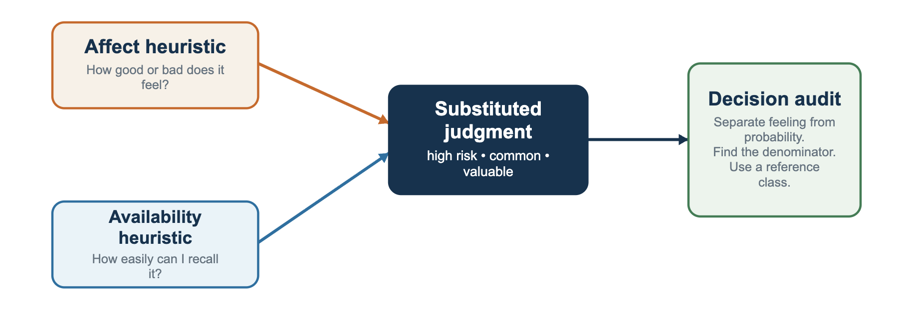<figcaption>Figure 10.1. Affect and availability become biases when a feeling or memorable case silently substitutes for probability and evidence.</figcaption></figure>

The availability heuristic occurs when people judge frequency, probability, or importance by how easily examples come to mind (Tversky & Kahneman, 1973). If examples are easy to recall or imagine, the event feels common or likely. If examples are hard to recall, the event feels rare or unlikely.

Availability and affect can be sensible cues, but vividness, recency, and incidental emotion can make them diverge from frequency and diagnostic evidence (Tversky & Kahneman, 1973; Slovic et al., 2002; Lerner et al., 2015).

Availability is often sensible. Common events are often easier to remember than rare events. Personal experience can be useful evidence. If you have repeatedly seen a supplier miss deadlines, it is reasonable to judge the supplier as unreliable. If a road is often congested when you use it, your memory is relevant.

But availability is influenced by more than frequency. It is affected by vividness, recency, emotional intensity, media coverage, personal experience, social discussion, and ease of imagination.

A plane crash receives dramatic news coverage. The images are vivid. The event becomes available. Flying may then feel more dangerous than before, even if the statistical risk remains very low. A friend’s bad medical experience may loom larger than base-rate data. A recent failure may dominate a performance review. A memorable start-up success may make entrepreneurship seem easier than it is. A single vivid crime may shift public perception more than broader crime trends.

Lichtenstein et al. (1978) found that people’s estimates of causes of death were related to availability and media coverage. Dramatic causes were often overestimated, while less dramatic but more common causes were underestimated. Combs and Slovic (1979) similarly showed that newspaper coverage was related to distorted frequency judgments. Events that receive more attention become mentally available.

Availability also works through retrieval fluency. Schwarz et al. (1991) asked participants to recall either six or twelve examples of assertive behavior. People who had to recall twelve examples often rated themselves as less assertive than those who recalled six, because retrieving twelve examples was difficult. The experience of difficulty became information. People did not simply count examples; they used ease of retrieval as a cue.

This has wide application.

A manager evaluating an employee may overweight the most recent incident because it is available. This is the recency effect in performance evaluation. A doctor may overdiagnose a condition recently encountered. A student may overestimate the difficulty of an exam after hearing one horror story. A parent may overestimate rare dangers that are vivid and underestimate common dangers that are mundane. A voter may judge national conditions based on a few memorable stories.

Availability affects organizations as well. After a crisis, leaders may overcorrect toward the last failure. If a cybersecurity breach occurred, cybersecurity may dominate attention. If a public relations scandal occurred, reputation may dominate. These concerns may be legitimate, but availability can crowd out other risks.

Availability can also be deliberately manipulated. News, advertising, political campaigns, social media, and organizational storytelling all influence what comes easily to mind. If a company repeatedly celebrates customer success stories but hides failure data, employees may overestimate customer satisfaction. If a political campaign repeatedly highlights a vivid threat, voters may overestimate its frequency. If social media repeatedly shows extreme lifestyles, users may misjudge what is normal.

The corrective is not to ignore memory. The corrective is to ask whether memory is representative.

How many examples come to mind? Why do these examples come to mind? Are they recent, vivid, emotional, or repeated? What is the base rate? What would a broader sample show? What cases are missing because they are quiet, ordinary, or invisible?

Availability is useful when memory samples the environment fairly. It misleads when memory is biased by salience.

## Feeling as evidence

The affect heuristic uses positive or negative feeling as a rapid guide to judgment. Options that feel good tend to be judged as more beneficial and less risky; disliked options can appear less beneficial and more dangerous. Affect compresses a large amount of experience into a simple approach-avoid signal (Slovic et al., 2002).

This can be adaptive. A sense of unease may reflect subtle cues learned through experience before the person can articulate them. It becomes problematic when the feeling is incidental, misattributed, or socially manufactured.

Schwarz and Clore (1983) found that mood influenced reported life satisfaction, and that directing attention to the weather could reduce the effect by making the source of mood salient. The mind asks, in effect, "How do I feel about my life?" and uses current feeling unless given a reason to attribute it elsewhere.

Different emotions also carry different appraisals. Anger is associated with certainty and individual control, while fear is associated with uncertainty and situational control. Experiments have found that anger can increase optimistic risk judgments and risk taking relative to fear, even when both emotions are negative (Lerner & Keltner, 2001). The category "negative emotion" is therefore too crude.

Incidental emotion matters in markets and organizations, but claims require caution. Correlations between sunshine, sporting outcomes, and financial returns are intriguing and can reflect mood, attention, or other mechanisms; they do not imply that every sunny day causes irrational buying. Laboratory and field effects vary with context and specification (Edmans et al., 2007; Hirshleifer & Shumway, 2003).

A useful question is:

Is this feeling information about the option, or information carried into the option?

## Vivid memory and hidden denominators

The availability heuristic estimates frequency or probability from the ease with which examples come to mind. Vivid, recent, emotional, and heavily reported events are easier to retrieve and therefore feel more common (Tversky & Kahneman, 1973).

Air crashes receive concentrated coverage and remain imaginable; the risks of ordinary driving are distributed across countless unremarkable trips. A founder's dramatic success story is easier to recall than the invisible population of failed ventures. A manager remembers the employee's recent error and treats it as representative of the year.

Retrieval structure itself creates bias. People find it easier to generate words beginning with a letter than words containing the same letter in a less searchable position, and they can confuse that ease with the number of words in each category. The judgment is about the architecture of memory, not only the world.

Availability is also socially engineered. News selection, platform algorithms, and repeated messaging determine which examples are retrievable. When one rare event is shown repeatedly, mental availability is no longer an innocent mirror of prevalence.

The countermeasure is not to distrust memory. It is to supplement it with denominators, time windows, and reference classes:

Out of how many cases?

Compared with what base rate?

Over which period?

Which unreported cases are missing?

<aside class="callout evidence-and-boundary-conditions">
EVIDENCE AND BOUNDARY CONDITIONS

Weather, sports results, and market outcomes can correlate in historical datasets, but such findings are vulnerable to specification choices and multiple testing. Treat them as prompts for mechanism and replication, not ready-made forecasting rules.
</aside>

*Table 10.1. When affect and availability help or mislead*

| Shortcut | Useful when | Misleads when | Corrective |
| --- | --- | --- | --- |
| Affect | Feeling summarizes relevant, repeated experience. | Mood or identity spills into an unrelated forecast. | Name the feeling, then estimate probability separately. |
| Availability | Memory samples the environment fairly. | News, vividness, recency, or repetition distort retrieval. | Find the denominator and a representative reference class. |
| Personal example | The case is diagnostically similar. | One case substitutes for a distribution. | Ask how often the pattern occurs across comparable cases. |

## Key ideas

- Feelings and ease of recall often summarize useful experience, but they can become misleading when incidental emotion or vivid memory substitutes for evidence.
- Explain the affect heuristic.
- Explain availability and retrieval fluency.
- Distinguish integral from incidental emotion.

## Study and practice

1. How would you explain the affect heuristic?

2. How would you explain availability and retrieval fluency?

3. How would you distinguish integral from incidental emotion?

<aside class="callout activity">
ACTIVITY

Take a risk that feels large or small. Record the examples that come to mind, why they are memorable, and the relevant denominator or base rate. Then reassess the judgment. EXPERIENCE - EXPLAIN - APPLY (MAXIMUM 120 WORDS) Experience: describe one specific decision, interaction, or observation. Explain: use one or two concepts from this chapter accurately. Apply: state one improvement, implication, or testable prediction.
</aside>

# Chapter 11. Resemblance Is Not Probability

*Prototypes, stereotypes, conjunctions, and the seduction of a good story*

<aside class="callout core-idea">
CORE IDEA

Representativeness asks whether a case resembles a category; probability asks how often the category occurs and how diagnostic the resemblance actually is.
</aside>

## Learning goals

- Explain representativeness and base-rate neglect.
- Recognize conjunction and disjunction errors.
- Explain the law of small numbers.
- Separate predictive features from culturally familiar prototypes.

The representativeness heuristic occurs when people judge probability by similarity to a prototype or stereotype (Kahneman & Tversky, 1972; Tversky & Kahneman, 1974). An option, person, event, or story feels likely when it resembles the category people have in mind.

A person who is tall and athletic seems likely to be a basketball player. A quiet person who enjoys books seems likely to be a librarian. A confident speaker seems likely to be a leader. A young founder in a hoodie with a bold vision seems likely to be the next technology success. A company with a sleek product and enthusiastic users seems likely to become a unicorn. A candidate with an elite degree seems likely to be competent.

Representativeness is useful because similarity often contains information. If someone has medical symptoms that closely match flu, flu is a plausible diagnosis. If a person has the skills and experience typical of successful engineers, they may be more likely to perform well as an engineer. If a business model resembles many failed businesses, caution is reasonable.

But representativeness can mislead when similarity overrides base rates, sample size, chance, or causal evidence.

A classic example is the “Linda problem.” Participants read a description of Linda as single, outspoken, bright, and concerned with social justice. Many judged it more likely that Linda was a bank teller and active in the feminist movement than that Linda was a bank teller, even though the conjunction of two events cannot be more probable than one event alone (Tversky & Kahneman, 1983). The more detailed description felt more representative, but it was less probable.

Chapter 12 develops the statistical correction in detail. Here the key point is that representativeness answers the question, “How much does this resemble my mental model?” rather than “How probable is this event?”

Representativeness can distort hiring. Interviewers may look for someone who resembles their prototype of a leader: confident, articulate, energetic, polished, extroverted. That prototype may be partly valid in some roles, but it may also exclude quiet competence, integrity, persistence, judgment, and teamwork. A candidate may look like success without being likely to produce it.

Representativeness can distort entrepreneurship. Investors may look for founders who resemble famous past founders. But if they rely on surface features, they may miss less glamorous but stronger businesses. A start-up that resembles a famous success may still fail because base rates, timing, execution, competition, and market structure differ.

Representativeness can distort social judgment. People may infer personality, ability, or trustworthiness from appearance, accent, dress, age, gender, ethnicity, or group membership. Stereotypes are representativeness shortcuts applied to people. They may feel informative because they reduce complexity, but they can produce unfair and inaccurate judgments.

Representativeness also affects randomness. People often expect random sequences to “look random,” meaning mixed and patternless. A sequence like H-T-H-T-T-H may feel more random than H-H-H-H-H-H, even though both are possible outcomes of fair coin flips. This contributes to the gambler’s fallacy and misperception of streaks, topics developed later.

A useful corrective is to ask:

What category am I comparing this to? Is the resemblance superficial or causally meaningful? What is the base rate? How large is the sample? What evidence predicts the outcome besides similarity? Would I make the same judgment if the person or case did not fit the prototype?

Representativeness is a powerful categorization tool. It becomes dangerous when resemblance is treated as probability.

## The representative story

<figure class="book-figure">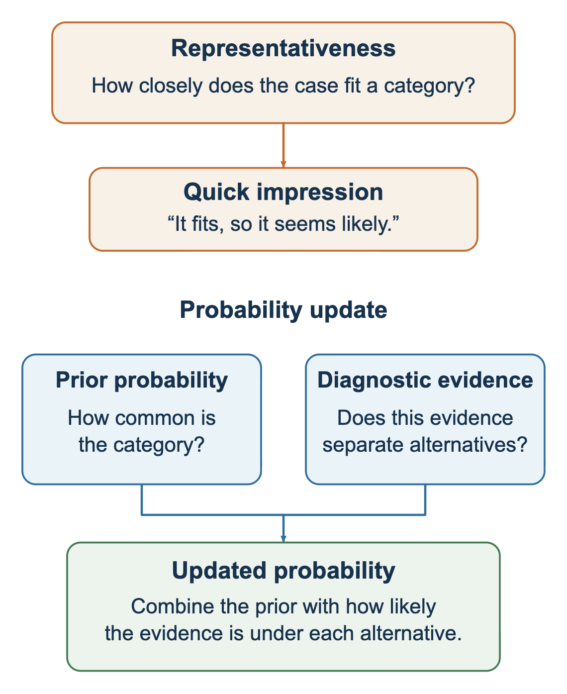<figcaption>Figure 11.1. Probability requires base rates and diagnostic evidence in addition to resemblance.</figcaption></figure>

The representativeness heuristic, introduced in Chapter 9, becomes especially important in probability judgment. People often judge likelihood by how much something resembles a prototype, pattern, or story (Kahneman & Tversky, 1972; Tversky & Kahneman, 1974).

Representativeness substitutes resemblance for probability, which helps explain base-rate neglect and conjunction errors (Kahneman & Tversky, 1972; Tversky & Kahneman, 1983).

The classic Linda problem makes the issue vivid. Participants read a description of Linda as 31 years old, single, outspoken, bright, and concerned with discrimination and social justice. They are then asked which is more probable:

Linda is a bank teller. Linda is a bank teller and active in the feminist movement.

Many people choose the second option. It feels like a better match. But it cannot be more probable. The probability of A and B together cannot exceed the probability of A alone. Adding detail can make a story feel more representative while making it statistically less likely (Tversky & Kahneman, 1983).

This is the conjunction fallacy.

The error is not simply mathematical ignorance. It reflects a conflict between narrative fit and probability logic. “Bank teller and feminist” sounds like Linda. “Bank teller” sounds less like Linda. The mind answers, “Which description fits?” instead of “Which event is more probable?”

A related issue is disjunction neglect. People may underweight the probability of “A or B” because no single component feels strongly representative. Yet disjunctions often have higher probability than individual events. For example, “The project will be delayed because of supplier problems, staff turnover, legal review, technical defects, or client revisions” may be more likely than any one specific delay cause. But because no single cause dominates imagination, the total risk may be underestimated.

This matters in planning. A team may say, “Supplier failure is unlikely,” “Staff turnover is unlikely,” “Legal issues are unlikely,” and “Technical problems are unlikely.” Each statement may be true individually. But the probability that at least one thing goes wrong can be high. Plans fail not only because one disaster is likely, but because many small disruptions are possible.

Representativeness also causes base-rate neglect. Suppose you meet someone who is quiet, precise, introverted, and loves books. Is this person more likely to be a librarian or a salesperson? Many people say librarian because the description fits the librarian stereotype. But if salespeople vastly outnumber librarians, the base rate may dominate. Similarity is not enough.

In hiring, representativeness can cause decision-makers to look for people who resemble their prototype of success. A leader “looks like” a leader. A founder “sounds like” a founder. A consultant “seems like” a consultant. This may include valid cues, but it may also include stereotypes. The question should be: which features actually predict performance?

Representativeness also shapes judgments of randomness. People expect random sequences to look random. A sequence like H-T-H-T-T-H may feel more random than H-H-H-H-H-H, although both are possible sequences of six coin flips. People underestimate how often streaks and clusters occur by chance.

Tversky and Kahneman (1971) described belief in the law of small numbers: people expect small samples to resemble the population more closely than they do. If a basketball player makes several shots, people may infer a hot hand. If a fund manager outperforms for two years, investors infer skill. If a new employee makes two mistakes, a manager infers low competence. Small samples are noisy, but the mind wants them to be meaningful.

The corrective is to ask:

Am I judging probability by resemblance? What is the base rate? How large is the sample? How much noise should I expect? Am I adding detail that makes the story more vivid but less probable? What is the total probability across many possible ways this could happen?

Representativeness makes stories persuasive. Statistical intuition asks how often the story is true.

## Small samples, streaks, and clusters

Human beings are pattern detectors. This is one of our greatest strengths. We detect faces, language, intentions, danger, seasons, social norms, and causal relationships. But pattern detection can overshoot. We often see meaningful order in random variation.

A fair coin can produce streaks. A basketball player can make several shots in a row by chance. A stock can rise for several days without a deeper trend. A student can perform unusually well or poorly on one test because of noise. A hospital can have an unusual number of boys born on one day by chance. Randomness is clumpier than people expect.

The gambler’s fallacy occurs when people believe that after a streak of one outcome, the opposite outcome is “due.” After five reds in roulette, black feels more likely. But if the wheel is fair, the next spin does not remember the previous spins. Tversky and Kahneman (1971) linked this to the belief that random sequences should quickly balance out. People expect small samples to represent the larger process.

The gambler’s fallacy appears outside casinos. A hiring manager may think, “We rejected the last three candidates, so the next one is more likely to be good.” A salesperson may think, “I have lost five prospects in a row, so I am due for a win.” A student may think, “The professor has used answer C several times, so the next answer cannot be C.” Unless the process has dependence, these beliefs are mistaken.

The opposite belief is the hot-hand belief: after a streak of success, success is more likely to continue. Gilovich et al. (1985) famously argued that the hot hand in basketball was largely a cognitive illusion, with people seeing streaks in random sequences. Later research complicated the story. Miller and Sanjurjo (2018) identified a statistical bias in earlier tests and found evidence that hot-hand effects may exist in some contexts. The modern lesson is nuanced: people may overperceive streaks in randomness, but performance can also have genuine state dependence in some domains.

This nuance matters. Sometimes streaks are noise. Sometimes they reflect momentum, confidence, fatigue, strategy, opponent adjustment, learning, or changing conditions. The question is not whether streaks are always illusions. The question is whether the evidence supports dependence.

A fund manager who outperforms for three years may have skill, but may also be lucky. A salesperson on a streak may be improving, or may have encountered a favorable cluster of clients. A student with several strong results may have learned better strategies, or may have benefited from easier tests. Statistical judgment requires separating signal from noise.

Randomness also creates clusters. If disease cases cluster in one neighborhood, people may infer a local cause. Sometimes a local cause exists. Sometimes clustering occurs by chance. If many schools are compared, some will appear unusually good or bad by random variation. If many investors are tracked, some will outperform for years by chance. If many experiments are run, some will produce significant results by chance. The more patterns one searches for, the more patterns one will find.

Nickerson (2002) reviewed how people perceive patterns in randomness and noted that humans are prone to seeing structure, especially when outcomes are meaningful. This tendency is understandable. Missing a real pattern can be costly. But seeing false patterns can also be costly.

A useful corrective is to ask:

How much variation should we expect by chance? How many cases are in the sample? How many patterns did we search for? Would this pattern replicate in new data? Is there a plausible mechanism? Is the process independent or dependent?

Good statistical intuition does not deny patterns. It asks whether the pattern is stronger than noise.

<aside class="callout evidence-and-boundary-conditions">
EVIDENCE AND BOUNDARY CONDITIONS

Face-based impressions can predict aggregate election outcomes in some datasets, but prediction is not proof of competence, causation, or legitimacy. Appearance cues can reflect stereotypes, campaign selection, media presentation, and voter behavior.
</aside>

*Table 11.1. From resemblance to probability*

| Evidence | Question it can answer | Common error | Better use |
| --- | --- | --- | --- |
| Prototype match | What category does this resemble? | Treating resemblance as probability. | Combine with base rates and diagnosticity. |
| Detailed story | How could events connect? | Conjunction fallacy: detail feels more likely. | Check whether added conditions can only reduce probability. |
| Short streak | What happened in this small sample? | Inferring a stable process from noise. | Estimate expected variation and seek more observations. |
| Appearance or confidence | What first impression was triggered? | Substituting “looks like” for predictive evidence. | Use structured, job-relevant measures. |

## Key ideas

- Representativeness asks whether a case resembles a category; probability asks how often the category occurs and how diagnostic the resemblance actually is.
- Explain representativeness and base-rate neglect.
- Recognize conjunction and disjunction errors.
- Explain the law of small numbers.

## Study and practice

1. How would you explain representativeness and base-rate neglect?

2. Recognize conjunction and disjunction errors?

3. How would you explain the law of small numbers?

<aside class="callout activity">
ACTIVITY

Select a person, project, or company that &quot;looks like&quot; a success or failure. State the prototype, the base rate, the sample size, and which features are actually predictive. EXPERIENCE - EXPLAIN - APPLY (MAXIMUM 120 WORDS) Experience: describe one specific decision, interaction, or observation. Explain: use one or two concepts from this chapter accurately. Apply: state one improvement, implication, or testable prediction.
</aside>

# Chapter 12. Base Rates, Randomness, and Calibration

*Statistical intuition begins where the story meets the denominator*

<aside class="callout core-idea">
CORE IDEA

Good probability judgment starts with a reference class, updates with diagnostic evidence, expects noise and regression, and records forecasts so confidence can be calibrated.
</aside>

<figure class="book-figure">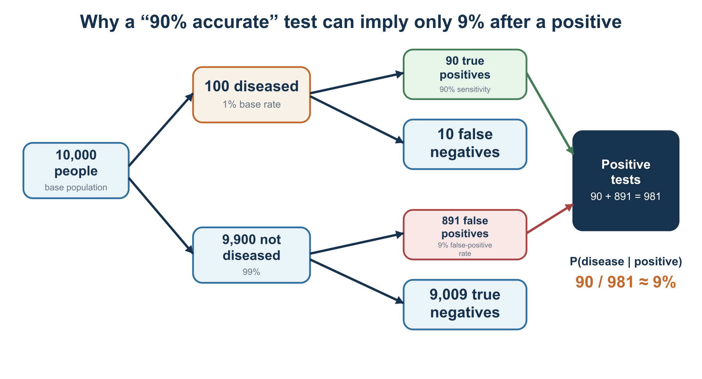<figcaption>Figure 12.1. Natural frequencies make base rates and false positives visible: only about 9% of positive tests in this example are true positives.</figcaption></figure>

## Learning goals

- Use base rates and natural frequencies.
- Distinguish P(evidence|hypothesis) from P(hypothesis|evidence).
- Explain regression to the mean.
- Use explicit probabilities and feedback to improve calibration.

Imagine that you are evaluating a start-up founder. She is energetic, persuasive, technically skilled, and deeply committed. She tells a compelling story about a market that incumbents have ignored. She has a prototype and early user enthusiasm. The story feels strong.

Now ask a different question: out of 100 start-ups at this stage, how many return significant value to investors?

The first question invites narrative judgment. The second invites statistical judgment.

Both matter. A base rate without case information is incomplete. Case information without a base rate is ungrounded. The challenge is integration.

A base rate is the general frequency of an outcome in a relevant class. If 10% of similar projects succeed, that is a base rate. If 30% of candidates with a certain background perform well, that is a base rate. If 1% of people in a population have a disease, that is a base rate. If most mergers fail to create shareholder value, that is a base-rate warning. If similar construction projects usually exceed budget, that matters.

People often underuse base rates. Kahneman and Tversky (1973) showed that people sometimes rely heavily on individuating descriptions even when base-rate information is available. Bar-Hillel (1980) reviewed evidence that base rates are neglected especially when case-specific information feels diagnostic, vivid, or representative. In plain language, people often prefer the story to the statistic.

Consider hiring. A candidate gives an excellent unstructured interview. The interviewer is impressed. The candidate seems confident, fluent, and culturally compatible. But how predictive are unstructured interviews? How often do confident interviewees actually perform well? How much better are structured interviews, work samples, or job-relevant tests? Without reference-class information, the interviewer may confuse interview performance with job performance.

Consider medicine. A doctor hears symptoms that fit a familiar diagnosis. The story is coherent. But if the disease is rare and the symptoms are common across many conditions, the base rate matters. Diagnosis requires asking not only “Does this look like disease X?” but also “How common is disease X among patients like this, and how strongly do these symptoms distinguish it from alternatives?”

Consider public fear after a vivid event. A dramatic crime, accident, or disaster can dominate attention. But a vivid event is not the same as a frequent event. If public policy responds mainly to the most available story, it may overinvest in dramatic risks and underinvest in common but less visible harms.

A base rate is not a substitute for judgment. It is the starting point that keeps judgment from floating away.

Bayesian reasoning gives a formal version of this principle. The basic idea is simple: begin with a prior probability, examine new evidence, and update depending on how diagnostic the evidence is. The prior is the base rate or initial belief. The new evidence should move the probability up or down depending on how likely that evidence would be if the hypothesis were true compared with if it were false (Bayes, 1763; Edwards, 1968; Tversky & Kahneman, 1974).

In everyday language:

Start with how common it is. Ask how much the evidence should change that. Do not let a vivid detail erase the base rate unless the detail is genuinely diagnostic.

This discipline is hard because stories feel more personal than statistics. “This founder reminds me of a famous success” feels alive. “Most start-ups fail” feels abstract. “This patient has a symptom I recognize” feels immediate. “The condition is rare” feels distant. “This project team is different” feels more compelling than “similar projects usually run late.”

The outside view helps correct this tendency. Instead of focusing only on the unique details of the case, we ask what happened in a reference class of similar cases (Kahneman & Lovallo, 1993). This idea appeared earlier in planning fallacy and overconfidence, but it is fundamentally a probability tool. It asks decision-makers to step outside the story and look at the distribution.

A useful question is:

What is the relevant reference class, and what usually happens there?

This question is simple. It is also one of the strongest defenses against poor probability judgment.

## Conditional probability and natural frequencies

Probability becomes especially difficult when evidence is conditional.

Consider a medical test. Suppose 1% of a population has a disease. A test correctly detects the disease 90% of the time when the disease is present. The test also produces false positives in 9% of people who do not have the disease. A person tests positive. What is the probability that the person actually has the disease?

Many people answer close to 90%. That is wrong.

Use natural frequencies. Imagine 10,000 people.

About 1%, or 100 people, have the disease. Of those 100, the test correctly identifies 90. The remaining 9,900 people do not have the disease. Of those 9,900, 9% test positive falsely, which is 891 people. So the total number of positive tests is 90 true positives plus 891 false positives = 981 positive tests. Out of those 981 positive tests, only 90 are actual disease cases.

The probability of disease given a positive test is about 90/981, or about 9%.

This result surprises people because they confuse the probability of a positive test given disease with the probability of disease given a positive test. These are not the same.

The first is:

If the person has the disease, how likely is a positive test?

The second is:

If the person has a positive test, how likely is the disease?

This distinction is central to conditional probability. Confusing the two can produce serious errors in medicine, law, security, hiring, and everyday judgment.

Eddy (1982) showed that physicians often struggled with Bayesian reasoning in medical diagnosis. Gigerenzer and Hoffrage (1995) later showed that presenting information as natural frequencies can greatly improve reasoning compared with abstract probabilities. Cosmides and Tooby (1996) argued that human reasoning often improves when probability problems are presented in frequency formats that match how people may naturally track events.

The problem is not that people are incapable of statistical reasoning. It is that many probability formats are cognitively unfriendly.

Natural frequencies help because they preserve the nested structure of the problem. Instead of juggling percentages, people can count cases. “Out of 10,000 people…” is often easier than “1% prevalence, 90% sensitivity, 9% false-positive rate…”

The same problem appears in legal reasoning. The prosecutor’s fallacy occurs when the probability of evidence given innocence is confused with the probability of innocence given evidence. Suppose a DNA match is rare: only 1 in 1 million people would match by chance. That does not automatically mean there is a 1 in 1 million chance the defendant is innocent. The probability of innocence depends on the prior probability, the size of the population, the quality of the evidence, possible lab errors, and other case evidence. Legal scholars and statisticians have long warned about such errors in courtroom reasoning (Thompson & Schumann, 1987).

Conditional probability also matters in everyday life.

If a person is nervous in an interview, how likely is incompetence? If a company misses one deadline, how likely is future unreliability? If someone is quiet in a meeting, how likely is disagreement? If a student performs poorly once, how likely is low ability? If a stock rises after good news, how likely is continued growth?

The evidence may matter, but it must be interpreted against a base rate and an alternative hypothesis. A nervous candidate may be incompetent, but they may also be introverted, under pressure, or unfamiliar with interviews. A quiet employee may disagree, but they may also be thinking, uncertain, culturally cautious, or waiting for invitation. A missed deadline may indicate unreliability, but it may also reflect unclear scope, overload, or one-time disruption.

Bayesian reasoning is not only mathematics. It is disciplined humility about evidence.

Ask:

How common is the hypothesis before this evidence? How likely is this evidence if the hypothesis is true? How likely is this evidence if the hypothesis is false? What alternative explanations could produce the same evidence? How should my belief change—not to certainty, but upward or downward?

Good probability judgment rarely jumps from evidence to conclusion. It updates.

## Regression to the mean

Regression to the mean is one of the most important and least intuitive ideas in statistics.

When an outcome is extreme, the next measurement is likely to be closer to average, partly because extreme outcomes often reflect both skill and luck. If a student scores unusually high on one test, the next score is likely to be lower, even if the student remains strong. If a salesperson has an extraordinary month, the next month is likely to be more ordinary. If a mutual fund dramatically outperforms, future performance may move closer to the market average. If a pilot performs unusually badly during one training flight, the next flight may improve even without intervention.

Francis Galton first described regression toward mediocrity in his study of heredity (Galton, 1886). The concept later became central to statistics. In decision-making, regression matters because people often invent causal explanations for movement that is partly statistical.

Kahneman and Tversky (1973) described how people misunderstand regression. Suppose a flight instructor praises pilots after excellent landings and criticizes them after poor landings. The instructor observes that praise is often followed by worse performance and criticism by better performance. He concludes that criticism works and praise harms. But regression to the mean provides another explanation. Exceptional landings are likely to be followed by less exceptional ones, and poor landings by better ones, regardless of feedback.

This error is common.

A company has a terrible quarter. Leadership launches a new initiative. Performance improves. The initiative gets credit, even if some improvement was regression from an unusually bad quarter.

A student performs badly on a test. Parents punish the student. The next score improves. Punishment gets credit, even if the first score was unusually low.

A sports team fires a coach after a losing streak. Performance improves. The firing gets credit, even if the streak was partly bad luck.

A hospital unit has unusually high infection rates one month. Management intervenes. Rates fall. The intervention may have helped, but regression may also contribute.

Regression does not mean interventions do not work. It means improvement after an extreme outcome is not sufficient evidence that the intervention caused improvement. We need comparison groups, longer histories, or repeated data.

Regression also matters in prediction. People often make extreme predictions from extreme evidence. A student who scores in the 99th percentile once is predicted to always perform at that level. A job candidate who gives a brilliant interview is predicted to be outstanding. A company with rapid early growth is predicted to continue rapid growth. But if the evidence contains noise, predictions should be regressed toward the average.

This is one reason intuitive predictions are often too extreme. People predict outcomes that are as extreme as the evidence seems, rather than adjusting for unreliability. If an interview is only moderately predictive, an outstanding interview should not produce an extremely high performance forecast. If early sales are noisy, strong early sales should be tempered.

A useful corrective is:

How reliable is this measure? How extreme is the current observation? How much luck might be involved? What is the average outcome in the reference class? How far should my prediction move back toward that average?

Regression to the mean teaches humility. Extreme outcomes invite stories. Some stories are true. Many are partly luck.

## Calibration

Probability judgment is not only about avoiding specific errors. It is also about becoming calibrated.

A person is well calibrated when events assigned a probability of 70% happen about 70% of the time, events assigned 90% happen about 90% of the time, and so on. Calibration is not about being certain. It is about matching confidence to reality.

Research on calibration shows that people are often overconfident, especially when answering difficult knowledge questions or forecasting uncertain events (Lichtenstein et al., 1982). They may say they are 90% confident but be correct much less often. This is overprecision, discussed in Chapter 13.

Calibration matters because decisions depend on confidence. If a manager says a project has an 80% chance of success, the organization may invest heavily. If the true probability is closer to 40%, the decision changes. If a doctor says a diagnosis is very likely, treatment follows. If an investor is highly confident in a forecast, they may concentrate risk.

Forecasting research offers tools for improvement. Tetlock’s work on expert political judgment found that many experts performed poorly at long-term forecasting, especially when they relied on broad ideological narratives (Tetlock, 2005). Later work on forecasting tournaments found that some people—“superforecasters”—performed unusually well by breaking problems into parts, using base rates, updating gradually, thinking probabilistically, considering alternatives, and learning from feedback (Mellers et al., 2014; Tetlock & Gardner, 2015).

Good forecasters do not simply “trust their gut.” They use habits that align with statistical reasoning:

Start with base rates. Break complex questions into components. Use comparison classes. Make numerical probability estimates. Update incrementally when evidence changes. Look for disconfirming information. Track accuracy over time. Distinguish uncertainty from ignorance. Avoid false precision.

One useful tool is the Brier score, a measure of forecast accuracy for probabilistic predictions (Brier, 1950). A lower Brier score indicates better accuracy. Most people do not need to compute Brier scores in daily life, but the principle matters: probabilistic predictions should be recorded and checked.

Calibration also requires using probability language carefully. Words such as “likely,” “possible,” “rare,” “serious risk,” and “good chance” mean different things to different people. One person’s “likely” may mean 60%; another’s may mean 90%. In organizations, vague probability language causes confusion. A project described as “highly likely” may be interpreted differently by executives, analysts, and engineers.

Sherman Kent, a pioneer of intelligence analysis, argued for translating probability words into numerical ranges to reduce ambiguity (Kent, 1964). Modern intelligence communities often use probability terms with defined ranges. This is useful in business too. Instead of saying “There is a real chance,” say “I estimate 25–35%.” Instead of “This is unlikely,” say “About 10%.” Numbers are not perfect, but they force clarity.

People often resist numerical probabilities because they feel artificial. But vague words can hide disagreement. A team may agree that success is “likely” while one person means 55% and another means 85%. The agreement is an illusion.

A useful decision practice is to ask each person privately for a probability estimate before discussion. Then compare. Differences reveal assumptions.

Calibration is not about pretending to know more than we do. It is about admitting uncertainty precisely enough to learn.

## Building statistical intuition

Statistical intuition can improve. It requires tools that make probability more concrete and less story-dependent.

The first tool is natural frequencies. Instead of saying “The disease prevalence is 1%, the sensitivity is 90%, and the false-positive rate is 9%,” say “Out of 10,000 people, 100 have the disease, 90 of them test positive, and 891 people without the disease also test positive.” Natural frequencies make conditional probability easier (Gigerenzer & Hoffrage, 1995).

The second tool is reference-class forecasting. Ask what happened in similar cases. A project plan should be compared with similar projects. A hiring forecast should be compared with similar hires. A medical risk should be compared with similar patients. A start-up should be compared with similar ventures at a similar stage. The reference class anchors the prediction.

The third tool is sample size awareness. Small samples are noisy. A few cases rarely prove a pattern. Before drawing conclusions, ask how many observations are involved. A school’s test scores, a doctor’s outcomes, a fund manager’s returns, or a team’s performance may fluctuate substantially when samples are small.

The fourth tool is regression thinking. Extreme outcomes should be expected to move partly toward average unless there is strong evidence of lasting change. This helps prevent overreaction to exceptional success or failure.

The fifth tool is alternative explanations. When evidence appears diagnostic, ask what else could produce it. A positive test could be true disease or false positive. A quiet student could be confused, bored, shy, reflective, or culturally cautious. A rising stock could reflect fundamentals, hype, liquidity, or temporary sentiment.

The sixth tool is probabilistic language. Replace certainty with ranges. Say “I am 70% confident” rather than “I know.” Say “My estimate is 40–60%” rather than “It could happen.” Probability language helps people update.

The seventh tool is feedback. Record forecasts, compare outcomes, and update calibration. Without feedback, people repeat the same probability errors.

The eighth tool is visual representation. Icon arrays, frequency trees, risk ladders, and simple charts can make probability easier to grasp. Visual aids are especially useful in medicine and public policy, where abstract percentages can confuse (Gigerenzer & Edwards, 2003).

The ninth tool is slowing down when stories are vivid. A coherent story should trigger the question: how common is this story? Vividness is not probability.

The tenth tool is humility. Many probabilities are uncertain. The goal is not false precision but disciplined uncertainty.

A practical probability checklist:

What is the reference class? What is the base rate? How diagnostic is the evidence? What alternative explanations exist? How large is the sample? Could this be random variation? Should I expect regression to the mean? What probability would I assign? What evidence would change it? How will I check calibration later?

Statistical intuition is not about becoming a calculator. It is about learning to ask questions that stories often hide.

Chapter 2 showed how probabilities and utilities are combined under risk; this chapter supplies the statistical discipline those models require. Probability judgment asks how likely outcomes are. Risky decision-making asks how people choose when probabilities and outcomes must be combined. That requires expected value, expected utility, risk aversion, and the limits of the rational model under risk.

*Table 12.1  A probability checklist*

| Question | Why it matters |
| --- | --- |
| What is the reference class and base rate? | The story needs a statistical starting point. |
| How diagnostic is the evidence? | Evidence matters relative to alternative explanations. |
| How large and selected is the sample? | Small or filtered samples are noisy. |
| Could regression or random clustering explain the pattern? | Extreme outcomes often move toward average. |
| What probability do I assign, and when will I review it? | Calibration needs explicit forecasts and feedback. |

## Key ideas

- Good probability judgment starts with a reference class, updates with diagnostic evidence, expects noise and regression, and records forecasts so confidence can be calibrated.

Natural-frequency formats, reference classes, and calibration make statistical structure easier to see and improve probabilistic judgment (Gigerenzer & Hoffrage, 1995; Tetlock & Gardner, 2015).

- Use base rates and natural frequencies.
- Distinguish P(evidence|hypothesis) from P(hypothesis|evidence).
- Explain regression to the mean.

## Study and practice

1. How would you use base rates and natural frequencies in practice?

2. How would you distinguish p(evidence|hypothesis) from p(hypothesis|evidence)?

3. How would you explain regression to the mean?

<aside class="callout activity">
ACTIVITY

Convert one percentage problem into natural frequencies. Then make a forecast with a numerical probability and a review date. After the outcome, score whether the confidence was calibrated. EXPERIENCE - EXPLAIN - APPLY (MAXIMUM 120 WORDS) Experience: describe one specific decision, interaction, or observation. Explain: use one or two concepts from this chapter accurately. Apply: state one improvement, implication, or testable prediction.
</aside>

# Chapter 13. Biases That Protect a Story

*Confirmation, self-serving judgment, and the feeling of knowing*

<aside class="callout core-idea">
CORE IDEA

Biases persist because they often feel like fair, coherent, and evidence-based judgment from the inside. Naming the bias is useful only when it changes the process.
</aside>

## Learning goals

- Distinguish a heuristic from a bias.
- Explain confirmation bias and motivated reasoning.
- Explain self-serving attribution and the bias blind spot.
- Distinguish overestimation, overplacement, and overprecision.

The language of bias can easily become accusatory. We say, “You are biased,” and the conversation becomes defensive. But in decision science, bias should function more like diagnosis than accusation.

Imagine a doctor who says, “This looks like pneumonia.” The doctor is not insulting the patient. The label organizes evidence. It points toward causes, tests, risks, and treatments. Similarly, saying “this looks like confirmation bias” should mean: we may be searching for supporting evidence and neglecting disconfirming evidence. Saying “this looks like anchoring” should mean: the first number may be pulling later judgments. Saying “this looks like escalation of commitment” should mean: prior investment may be making it harder to stop.

The point is not to shame the decision-maker. The point is to improve the decision.

A bias label is useful only if it changes the process. Naming confirmation bias should lead to disconfirming tests. Naming overconfidence should lead to calibration, outside views, and uncertainty ranges. Naming anchoring should lead to independent estimates before discussion. Naming halo effects should lead to structured evaluation criteria. Naming sunk costs should lead to a fresh decision based on future costs and benefits.

Biases often arise from mechanisms that are useful in many contexts. Confirmation helps build coherent models. Confidence supports action. First impressions help rapid social judgment. Anchors provide starting points when uncertainty is high. Commitment supports persistence. These mechanisms are not inherently bad. They become biases when they are applied too strongly, too automatically, or in the wrong environment.

This is why a bias is not simply “bad thinking.” It is often good thinking used in the wrong place.

Biases also persist because they are supported by stories. A person does not usually experience themselves as confirming, anchoring, or rationalizing. They experience themselves as being realistic, fair, decisive, loyal, prudent, strategic, or experienced. The mind supplies a story that makes the judgment feel reasonable.

“I am not ignoring evidence; I am focusing on what matters.” “I am not overconfident; I have experience.” “I am not anchored; that number was a useful starting point.” “I am not favoring my team; I know their true quality.” “I am not escalating commitment; I am showing perseverance.” “I am not biased; I am more objective than most people.”

These stories matter because they protect the bias from correction. Chapter 18 examines rationalization as the story after the choice. In many biases, the story begins even earlier. It accompanies the judgment while it is being formed.

The practical goal of this chapter is not to memorize a list of biases. It is to develop diagnostic habits. When a judgment feels obvious, ask what might be bending it.

## Confirmation and myside bias

<figure class="book-figure">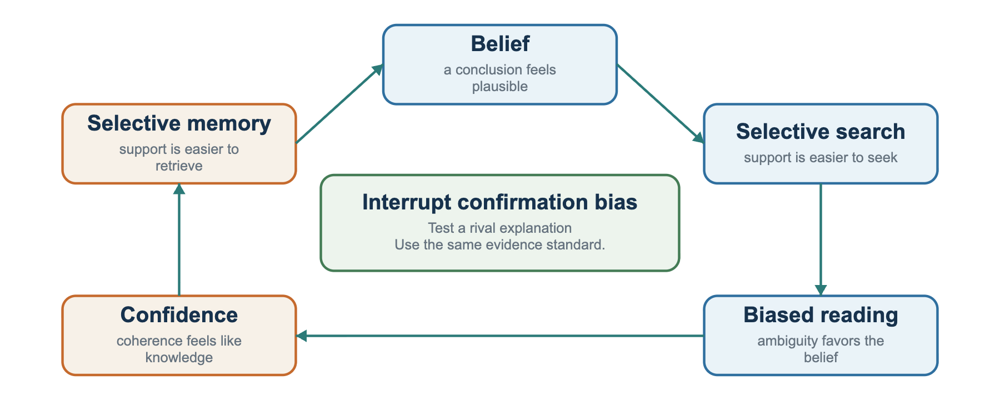<figcaption>Figure 13.1. Bias persists when search, interpretation, memory, and confidence form a self-reinforcing loop.</figcaption></figure>

Confirmation bias is the tendency to seek, interpret, and remember information in ways that support existing beliefs or hypotheses (Nickerson, 1998). It is one of the most important biases because it affects nearly every domain of judgment.

People prefer coherence. Once a belief begins to form, the mind naturally looks for information that fits. Evidence that supports the belief feels relevant. Evidence that challenges it feels flawed, exceptional, or less important. The result is not always conscious distortion. Often it is selective attention, selective search, selective interpretation, and selective memory.

A classic demonstration comes from Wason’s rule-discovery task. Participants saw a sequence such as 2-4-6 and were asked to discover the rule by proposing other sequences. Many people tested sequences that confirmed their initial hypothesis, such as “increasing by two,” rather than trying sequences that might falsify it (Wason, 1960). The actual rule was broader. The task illustrates a general habit: people often test whether they are right rather than whether they might be wrong.

In another classic line of work, Lord et al. (1979) gave people who supported or opposed capital punishment mixed evidence about whether the death penalty deters crime. Rather than moving toward each other, participants interpreted the evidence in ways that strengthened their original positions. Supporters saw the pro-deterrence study as stronger; opponents saw the anti-deterrence study as stronger. The same evidence increased polarization.

This pattern is sometimes called biased assimilation: people assimilate evidence into their prior beliefs. It is also related to myside bias, the tendency to evaluate evidence and arguments in ways that favor one’s own position (Stanovich et al., 2013). Myside bias can appear even among intelligent and educated people because intelligence can help people generate better arguments for what they already believe.

Confirmation bias begins early in the decision loop. It shapes what information is selected, how it is interpreted, and what feedback is remembered. A manager who believes an employee lacks initiative notices missed opportunities but overlooks quiet contributions. A doctor who has a favored diagnosis attends to confirming symptoms. A negotiator who believes the other side is hostile interprets ambiguity as bad faith. An investor who believes in a company searches for good news and dismisses warnings.

Confirmation bias is especially strong when beliefs are tied to identity, status, morality, or prior commitment. Kunda (1990) described motivated reasoning as reasoning directed toward preferred conclusions. Kahan (2013) showed that people’s reasoning about evidence can become entangled with ideology and identity. When accepting evidence would threaten group belonging or self-image, people may become more—not less—skilled at defending their prior view.

Confirmation bias also explains why vague personality descriptions can feel accurate. The Barnum effect or Forer effect occurs when people accept general descriptions as uniquely true of themselves. Forer (1949) gave students a personality description supposedly based on a test, but actually composed of vague statements that could apply to many people. Students rated the description as highly accurate. People search their memories for confirming examples and ignore mismatches. A horoscope, personality reading, or vague leadership profile can feel personal because the mind supplies the evidence.

This does not mean all belief persistence is irrational. Some beliefs are worth preserving because they are supported by strong evidence. A scientist should not abandon a theory after one weak anomaly. A doctor should not discard a likely diagnosis because of one ambiguous symptom. The problem is not maintaining beliefs. The problem is protecting them from fair tests.

Good decision-making requires active disconfirmation. Ask:

What evidence would prove me wrong? Have I searched for that evidence? What would someone who disagrees notice? Am I interpreting weak evidence as strong because I like the conclusion? Am I demanding more proof from opposing evidence than from supporting evidence? What belief would I hold if I did not care which answer was true?

Confirmation bias is hard to see because coherence feels like truth. But a story that fits together is not necessarily a story that fits reality.

## Self-serving explanations

Self-serving bias is the tendency to interpret events in ways that protect or enhance the self. People often attribute success to their own ability, effort, or character, while attributing failure to bad luck, unfair conditions, other people, or external constraints (Miller & Ross, 1975; Mezulis et al., 2004).

After a team wins, fans may say, “We were better.” After the team loses, they may blame the referee, weather, injuries, or luck. A manager whose project succeeds may credit vision and leadership. If the project fails, the manager may emphasize market conditions, poor execution by others, or unexpected constraints. A student who does well on an exam may credit intelligence and preparation. If they do poorly, they may blame the exam, instructor, room, or timing.

Self-serving bias is not always entirely false. External factors do matter. Referees make mistakes. Markets shift. Exams vary in fairness. But the asymmetry is the issue. People often explain good and bad outcomes differently depending on whether the outcome protects self-image.

The bias is partly motivational. People want to see themselves as competent, moral, and in control. It is also informational. People have more access to their own intentions and constraints than to others’. When we fail, we know the obstacles we faced. When others fail, we see mainly the behavior. This connects to attribution biases, especially the tendency to overattribute others’ behavior to character and underweight situational forces (Ross, 1977). Later social chapters will treat attribution in more detail, but self-serving attribution belongs here because it directly affects learning.

Self-serving bias makes learning difficult. If failure is always caused by external factors, the decision-maker has little reason to change. If success is always caused by personal brilliance, the decision-maker becomes overconfident. Teams and organizations can become trapped in flattering explanations.

Negotiation provides a powerful example. Babcock and Loewenstein (1997) reviewed research showing that disputants often interpret fairness in self-serving ways. When people know which side they represent, they tend to view fair settlements as more favorable to their own side. This can make bargaining harder, because each side sincerely believes its position is fair. In one study of settlement negotiations, participants who learned their role before reviewing case materials developed more self-serving assessments and settled less often than those who evaluated the case before knowing their role (Babcock et al., 1995).

The danger is that self-serving judgments feel like fairness. Each side says, “We are being reasonable.” The conflict persists because “reasonable” has been filtered through self-interest.

A related bias is the bias blind spot: people tend to see biases more readily in others than in themselves (Pronin et al., 2002). We judge our own objectivity by introspection: “I do not feel biased.” We judge others by their behavior: “Their conclusion serves their interest.” Because biases often operate outside awareness, introspection is a poor detector. Scopelliti et al. (2015) found that people who were more prone to bias blind spot were not necessarily better at avoiding other biases; believing oneself objective can reduce correction.

Self-serving bias is not always harmful. Some positive illusions may support motivation and resilience (Taylor & Brown, 1988). People who maintain hope after setbacks may persist. But self-protection becomes costly when it blocks accurate feedback.

A useful corrective is to ask:

If someone else made this decision and got this outcome, how would I explain it? What did I contribute to this failure? What did luck contribute to this success? What would the other side say is fair? Am I using different standards for myself and others? What feedback am I avoiding because it threatens self-image?

Self-serving bias protects identity. Good judgment requires protecting learning too.

## Three forms of overconfidence

Overconfidence is not one bias but several related biases. Moore and Healy (2008) distinguish three forms: overestimation, overplacement, and overprecision.

Overestimation means believing one’s performance or ability is better than it is. Overplacement means believing one is better than others. Overprecision means being too certain that one’s beliefs are accurate.

All three are common.

People often overestimate how quickly they can finish tasks. They may believe they are above-average drivers, leaders, investors, teachers, or negotiators. They may give narrow confidence intervals around uncertain estimates. They may feel certain about forecasts that are actually fragile.

Svenson (1981) famously found that a large majority of drivers rated themselves as safer and more skillful than the median driver. This is statistically impossible if everyone is comparing themselves to the same population. Better-than-average effects are widespread, especially for desirable traits that are ambiguous and easy to define in self-serving ways (Alicke & Govorun, 2005).

The Dunning-Kruger effect describes one form of miscalibration. Kruger and Dunning (1999) found that people who performed poorly on tasks such as logic, grammar, and humor tended to greatly overestimate their performance. A key explanation is that the skills required to perform well are often similar to the skills required to recognize good performance. People lacking competence may also lack the ability to detect their errors. Later work has refined and debated aspects of the effect, but the basic lesson remains useful: confidence is not a reliable indicator of competence.

Overprecision is especially important in forecasting. People often give confidence intervals that are too narrow. They underestimate uncertainty. A project manager may say there is a 90% chance the project will finish in six months, when similar projects rarely do. An investor may feel certain a stock is undervalued. A policy analyst may produce a precise forecast from uncertain assumptions. Precision creates comfort, but it can be false comfort.

Overconfidence has benefits. It can encourage action, entrepreneurship, leadership, and persistence. A world with no confidence would produce paralysis. Some degree of confidence may be motivationally useful.

But overconfidence is costly when it leads people to ignore evidence, underprepare, take excessive risks, underestimate competitors, or fail to build safeguards.

The planning fallacy is one of the most practical forms of overconfidence. People tend to underestimate how long tasks will take, even when they know similar tasks have taken longer in the past (Buehler et al., 1994; Kahneman & Tversky, 1979). They focus on the plan as imagined rather than the distribution of outcomes in similar cases. This is sometimes called taking the “inside view.” The inside view looks at the specific project, its steps, intentions, and hoped-for path. The “outside view” asks what happened in a reference class of similar projects (Kahneman & Lovallo, 1993; Lovallo & Kahneman, 2003).

A student thinks, “This paper should take two days.” A contractor thinks, “This renovation should take three months.” A software team thinks, “This feature should be ready next sprint.” A government thinks, “This infrastructure project should be completed within budget.” Each may be focusing on the ideal path and underweighting delays, coordination problems, revisions, illness, uncertainty, and competing priorities.

Overconfidence is also common in entrepreneurship and mergers. Entrepreneurs may overestimate the probability of success. Executives may overestimate their ability to integrate acquisitions. Lovallo and Kahneman (2003) described “delusions of success” in which decision-makers exaggerate benefits and underestimate costs.

A useful corrective is calibration. Ask people to make probability estimates and then compare outcomes with predictions over time. Forecasting research suggests that people can improve when they make explicit probabilistic forecasts and receive feedback (Tetlock & Gardner, 2015). Another corrective is using ranges rather than point estimates. Instead of asking, “How long will this take?” ask, “What is the 10th percentile, median, and 90th percentile completion time?” This makes uncertainty visible.

Other useful questions include:

What is the base rate for similar cases? How often have I been right in this domain before? What would make my estimate wrong? What does an outside view suggest? Am I confusing confidence with evidence? Have I built a margin of safety?

Overconfidence feels like knowledge. Good decision-making asks whether the feeling has been earned.

<aside class="callout evidence-and-boundary-conditions">
EVIDENCE AND BOUNDARY CONDITIONS

The Dunning-Kruger pattern should not be reduced to &quot;incompetent people are uniquely arrogant.&quot; Measurement scale, regression, task difficulty, and metacognitive skill all contribute. The useful lesson is that confidence needs external calibration.
</aside>

*Table 13.1. Bias diagnosis and process correction*

| Bias | Story from the inside | Process correction |
| --- | --- | --- |
| Confirmation / myside | “The evidence keeps supporting us.” | Specify disconfirming evidence and assign an opposing test. |
| Self-serving judgment | “Our success was skill; failure was circumstance.” | Apply the same attribution rule to self and others. |
| Overestimation | “We can do more than the record suggests.” | Compare prediction with past calibrated performance. |
| Overplacement | “We are better than the competitors.” | Use a real comparison distribution, not an imagined average. |
| Overprecision | “The range is narrow because the story is clear.” | Use intervals, scenarios, and sensitivity analysis. |

## Key ideas

- Biases persist because they often feel like fair, coherent, and evidence-based judgment from the inside. Naming the bias is useful only when it changes the process.
- Distinguish a heuristic from a bias.
- Explain confirmation bias and motivated reasoning.
- Explain self-serving attribution and the bias blind spot.

## Study and practice

1. How would you distinguish a heuristic from a bias?

2. How would you explain confirmation bias and motivated reasoning?

3. How would you explain self-serving attribution and the bias blind spot?

<aside class="callout activity">
ACTIVITY

Take one belief you strongly prefer to be true. Write the evidence that would change your mind, where you would look for it, and why you might be tempted to dismiss it. EXPERIENCE - EXPLAIN - APPLY (MAXIMUM 120 WORDS) Experience: describe one specific decision, interaction, or observation. Explain: use one or two concepts from this chapter accurately. Apply: state one improvement, implication, or testable prediction.
</aside>

# Chapter 14. Anchors, Halos, Decoys, and Escalation

*How initial values, global impressions, comparison sets, and prior investment bend judgment*

<aside class="callout core-idea">
CORE IDEA

The first number, first impression, surrounding options, and money already spent can redraw what feels plausible - unless the process establishes independent estimates, separate criteria, and forward-looking exit rules.
</aside>

## Learning goals

- Explain anchoring and insufficient adjustment.
- Explain halo and horn effects.
- Describe asymmetric dominance and context-dependent choice.
- Distinguish sunk costs from future costs and benefits.

Anchoring occurs when an initial value influences later judgment, even if the initial value is arbitrary or irrelevant. Tversky and Kahneman (1974) demonstrated anchoring by spinning a wheel of fortune rigged to land on either 10 or 65. Participants then estimated the percentage of African countries in the United Nations. Those who saw 65 gave higher estimates than those who saw 10, even though the number was random.

Anchoring is powerful because uncertain judgments need starting points. Once a starting point appears, people often adjust insufficiently away from it. Anchors can also make anchor-consistent information more accessible (Mussweiler & Strack, 1999; Strack & Mussweiler, 1997). If asked whether Gandhi was older or younger than 140 when he died, people know 140 is absurd, but it may still pull estimates upward compared with a lower anchor.

Anchors influence prices, salary negotiations, legal judgments, performance evaluations, forecasts, and self-assessments. A first offer in negotiation can shape the entire bargaining range. A list price influences perceived value. A suggested donation changes contributions. A manager’s initial performance rating influences later discussion. A budget from last year anchors this year’s budget. A project timeline proposed early becomes the reference point, even if it was invented under uncertainty.

Ariely et al. (2003) showed that even arbitrary anchors, such as the last two digits of a social security number, could influence willingness to pay for consumer goods. Participants first considered whether they would pay an amount equal to those digits, then stated their maximum willingness to pay. Higher arbitrary numbers led to higher valuations. The result illustrates how fragile valuation can be when people lack stable reference points.

Anchoring is not always irrational. In many situations, first estimates contain useful information. If an expert provides a starting estimate, it may be reasonable to use it. The problem is that anchors influence judgment even when they are irrelevant, extreme, strategic, or weakly justified.

Anchoring is especially important in negotiation. A high first offer can pull the final agreement upward; a low first offer can pull it downward. This will be developed in the negotiation chapters. For now, the point is broader: the first number gets a vote.

A useful corrective is to generate independent estimates before seeing anchors. In meetings, ask participants to write down estimates privately before discussion. In negotiations, prepare your own target, reservation point, and market data before hearing the other side’s offer. In budgeting, use bottom-up analysis and outside benchmarks rather than simply adjusting last year’s number. In forecasting, ask for multiple reference classes.

Other questions include:

What anchor may be influencing me? Was the anchor informative or arbitrary? What estimate would I make if I had not seen that number? What are independent sources of evidence? What range is plausible before negotiation begins? Am I adjusting enough?

Anchoring shows that judgment often begins before evidence has been fully evaluated. A number enters the room, and the room changes.

## Halo and horn effects

<figure class="book-figure">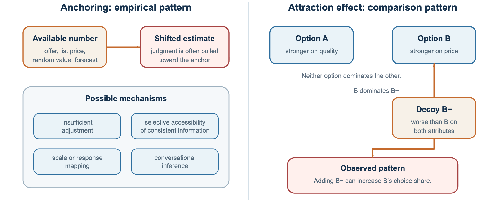<figcaption>Figure 14.1. Anchors pull numerical judgments, while decoys change the comparison that constructs preference.</figcaption></figure>

The halo effect occurs when an overall impression influences judgments of specific traits. A positive impression in one area spills over into unrelated judgments. A negative impression can produce a “horn effect,” where one negative quality colors everything else (Thorndike, 1920).

A charismatic person is judged as more competent. An attractive person is judged as more intelligent or kind. A prestigious university makes a candidate seem more capable. A successful company is assumed to have visionary leadership, strong culture, and superior strategy. A disliked politician’s voice, appearance, and competence are all judged more harshly. A confident CEO is perceived as more capable even when confidence is not evidence.

The halo effect reflects the mind’s preference for coherence. It is uncomfortable to hold mixed impressions: brilliant but unethical, warm but incompetent, confident but careless, prestigious but poorly suited, successful but lucky. System 1 tends to form coherent stories quickly. Once the overall impression forms, later evidence is interpreted in its light.

Solomon Asch’s classic work on impression formation showed that the order and valence of traits shape overall impressions. A person described as intelligent, industrious, impulsive, critical, stubborn, and envious is judged differently from a person described with the same traits in reverse order (Asch, 1946). Early information shapes the frame through which later information is interpreted.

Nisbett and Wilson (1977a) demonstrated a halo effect in evaluations of a lecturer. Participants watched the same instructor behave either warmly or coldly. Those who saw the warm version rated not only his personality but also his appearance, mannerisms, and accent more favorably. They often did not realize that their global impression had influenced specific judgments.

In organizations, halo effects distort performance evaluation. A high-performing employee in one visible area may be assumed strong in leadership, teamwork, or judgment. A person who makes one mistake may be downgraded globally. A company with strong financial performance may be assumed to have excellent leadership, even if external conditions or luck played a large role. Rosenzweig (2007) warned that business analysis often suffers from the halo effect: when companies perform well, observers infer superior strategy, culture, leadership, and execution; when performance falls, the same practices are reinterpreted negatively.

Halo effects are dangerous in hiring. Interviewers often form first impressions quickly and then ask questions that confirm them. A candidate who feels impressive early may receive easier interpretation of later answers. A candidate who begins awkwardly may struggle to recover. This is why structured interviews, predefined criteria, and independent ratings matter.

The halo effect also connects with confirmation bias. Once a coherent impression forms, people seek and interpret evidence in ways that preserve it. A good person’s ambiguous action is given a generous interpretation. A bad person’s ambiguous action is judged harshly.

A useful corrective is to evaluate dimensions separately. In hiring, rate technical skill, communication, reliability, learning ability, and teamwork independently before forming an overall score. In performance reviews, use concrete evidence for each criterion. In strategy, separate outcome quality from process quality. In evaluating leaders, separate charisma from judgment, confidence from competence, and success from skill.

Ask:

What is my overall impression? Which specific judgments might it be influencing? What evidence supports each trait separately? Would I interpret this behavior differently if I had a different overall impression? Am I allowing one visible strength or weakness to define the whole person?

Halo effects simplify the social world. They also flatten it. Good judgment restores texture.

## The decoy changes the comparison

Some biases arise not from what an option is, but from what it is compared with.

The decoy effect, also called the attraction effect or asymmetric dominance effect, occurs when adding an inferior option changes preferences between existing options (Huber et al., 1982). Suppose a customer is choosing between a cheaper online subscription and a more expensive print-plus-online subscription. If a print-only subscription is added at the same price as print-plus-online, it is clearly inferior. Rationally, it should not be chosen. Yet its presence can make the print-plus-online option look like a better deal and increase its choice share.

The decoy works because people often evaluate value relatively. They may not know whether print-plus-online is worth the price in absolute terms. But compared with print-only at the same price, it looks attractive. The decoy creates an easy comparison.

This bias connects directly to Chapter 15 on framing and Chapter 21 on behavior design, but it belongs here because it shows a broader principle: preferences are often constructed in context. The rational choice model assumes that preferences are stable enough that adding an irrelevant option should not reverse choices. The decoy effect shows that comparison sets can shape valuation.

Context effects appear in many decisions. A restaurant may include an extremely expensive wine to make other expensive wines look reasonable. A company may offer a premium package to make the middle package attractive. A negotiator may present an unattractive option to make another option seem like a concession. A university may compare its tuition to a more expensive peer rather than a cheaper alternative.

Not all contextual comparison is manipulative. Comparison can help people understand value. But when irrelevant or dominated options steer choice, decision-makers should be cautious.

Ask:

What option is serving as the comparison point? Would I choose the same option if the decoy were removed? Is this alternative actually relevant? Am I evaluating absolute value or relative attractiveness? Who designed the comparison set?

The decoy effect shows that preferences do not always exist fully formed before choice. Sometimes the menu helps create them.

## Planning fallacy, sunk costs, and escalation

Some biases unfold over time. They do not merely affect one judgment; they shape projects, investments, careers, relationships, and organizations.

The planning fallacy is the tendency to underestimate how long tasks will take, how much they will cost, or how difficult they will be, even when similar tasks have taken longer or cost more in the past (Buehler et al., 1994; Kahneman & Tversky, 1979). People focus on the specific plan and imagine a smooth path. They underweight delays, coordination failures, revisions, illness, competing priorities, and unexpected problems.

This is the inside view. The outside view asks what happened in similar cases. Kahneman and Lovallo (1993) argued that decision-makers often take the inside view because it feels rich and detailed, while the outside view feels impersonal. But the outside view is often more accurate. Lovallo and Kahneman (2003) described how executives suffer from “delusions of success,” overestimating benefits and underestimating costs in major initiatives.

The planning fallacy appears in student papers, software projects, home renovations, public infrastructure, mergers, product launches, and policy reforms. A team says, “This time is different.” Sometimes it is. Usually, not as much as the team thinks.

The sunk cost fallacy occurs when people continue an endeavor because of past investment rather than future costs and benefits. Rationally, sunk costs are already gone and should not determine whether to continue. The question should be: given where we are now, what future action has the best expected value? But psychologically, abandoning a project can feel like wasting the past.

Arkes and Blumer (1985) demonstrated sunk cost effects in experiments and field-like scenarios. People were more likely to continue when they had invested money, effort, or time, even when future benefits did not justify continuation. Sunk costs matter because they are tied to regret, responsibility, identity, and the desire to avoid admitting error.

Escalation of commitment is the organizational version. Staw (1976) found that people responsible for an initial investment were more likely to allocate additional resources after negative feedback. Staw (1981) described escalation as driven by self-justification, sunk costs, social pressure, and institutional inertia. Projects continue because stopping would make earlier choices look wrong.

Escalation is common in failing strategies. A company keeps investing in a declining product. A government continues a troubled project because cancellation would be embarrassing. A person stays in a bad relationship because of years already invested. A student continues a degree they dislike because they have already spent so much time. A leader doubles down because reversal would signal weakness.

Persistence is not always bias. Many valuable projects face setbacks. Quitting too early can be a mistake. The challenge is distinguishing justified persistence from self-justifying escalation.

Useful questions include:

If we had not already invested, would we start now? What future benefits justify future costs? What evidence would make us stop? Who is responsible for the original decision, and does that affect judgment? Are we continuing to create value or to avoid admitting loss? Can an independent reviewer evaluate continuation?

A powerful tool is to define exit criteria in advance. Before launching a project, specify what evidence would lead to stopping, pivoting, or scaling. Once identity and sunk costs accumulate, stopping becomes harder.

Planning fallacy, sunk cost bias, and escalation show that biases are not only momentary errors. They can become life paths.

## Biases become organizational routines

Many people assume groups reduce bias because multiple perspectives are present. Sometimes they do. Groups can correct individual blind spots, pool information, and challenge weak reasoning. But groups can also amplify biases.

Group discussions often begin with anchors. The first person to speak, the highest-status person, or the initial proposal can shape the entire conversation. Confirmation bias can become collective when teams search for evidence supporting a preferred strategy. Self-serving bias can become departmental: marketing blames operations, operations blames sales, sales blames product, and everyone protects their own identity. Overconfidence can become cultural when success is attributed to superior talent rather than favorable conditions.

Janis (1972) described groupthink as a pattern in cohesive groups where the desire for unanimity suppresses dissent and realistic evaluation. Groups may develop illusions of invulnerability, rationalize warnings, pressure dissenters, and assume moral superiority. The concept has been debated, but the warning remains important: harmony can become a bias.

Groups also often fail to share unique information. Stasser and Titus (1985) found that groups tend to discuss information already known to all members rather than unique information held by individual members. This “common information effect” can undermine group decisions, because the very reason to have a group—distributed knowledge—is not fully used.

Organizational incentives can sustain bias. If leaders punish bad news, employees confirm optimism. If promotions reward confidence, overconfidence spreads. If metrics reward short-term output, long-term risk is ignored. If dissent is labeled disloyal, groupthink grows. If past investments are tied to status, sunk cost escalation becomes normal.

Biases are therefore not only inside heads. They are embedded in systems.

A biased organization is not simply an organization with biased people. It is an organization whose routines, incentives, hierarchies, metrics, and stories systematically bend judgment.

To reduce organizational bias, change the process:

Ask for independent estimates before discussion. Assign someone to search for disconfirming evidence. Use premortems before major projects. Track forecasts and outcomes. Separate idea generation from idea evaluation. Reward people for updating beliefs. Use structured interviews in hiring. Rotate devil’s advocate roles. Invite lower-status voices early. Make exit criteria explicit before investment.

Better judgment requires better architecture.

## Redesigning the process

Learning about biases can produce a dangerous side effect: people become good at seeing bias in others and bad at seeing it in themselves.

This is why awareness is not enough. Merely knowing the name of a bias does not eliminate it. In some cases, it may even increase confidence: “I know about biases, so I must be less biased.” The bias blind spot warns against that.

Debiasing requires changing process, not just intention.

Larrick (2004) reviewed debiasing strategies and emphasized that different biases require different corrections. Arkes (1991) argued that some biases can be reduced by warnings, feedback, incentives, training, or decision aids, but effectiveness depends on the bias. Soll et al. (2015) reviewed practical strategies and grouped them into approaches such as changing the decision-maker, changing the environment, and improving aggregation.

Several tools are especially useful.

Consider the opposite. For confirmation bias, deliberately ask why the preferred conclusion might be wrong. Lord and colleagues’ biased assimilation work inspired research showing that considering alternative possibilities can reduce some forms of bias (Lord et al., 1984). This is not the same as vague open-mindedness. It means actively generating reasons against one’s current view.

Use the outside view. For planning fallacy and overconfidence, compare the current case with a reference class of similar cases. Ask how long similar projects took, how much they cost, and how often they succeeded.

Make independent estimates before discussion. For anchoring and group influence, ask people to write estimates privately before hearing others. This prevents early numbers and high-status voices from dominating.

Predefine criteria. For hiring, investment, and evaluation, define criteria before seeing candidates or outcomes. This reduces halo effects, motivated criteria shifting, and post-hoc justification.

Use structured decision tools. Checklists, scoring rubrics, decision trees, and premortems can reduce reliance on memory and impression. They are not perfect, but they make reasoning visible.

Keep decision records. Decision journals preserve beliefs, predictions, assumptions, and emotions before outcomes are known. They help reduce hindsight bias and rationalization.

Separate roles. Assign one person to advocate, another to critique, another to track evidence, and another to monitor process. Role separation reduces the burden on one mind to do everything.

Create feedback. Biases persist when feedback is absent or ambiguous. Forecasting accuracy, hiring outcomes, project completion data, and negotiation results should be tracked.

Design incentives for truth. If people are punished for bad news, they will hide it. If they are rewarded for confidence, they will overstate certainty. If they are rewarded for learning, they are more likely to update.

The purpose of debiasing is not to make people perfectly rational. It is to make predictable error less likely.

A useful closing question for any important decision is:

If this decision goes wrong, which bias will we later realize was obvious?

That question turns bias knowledge into prevention.

*Table 14.1  Bias diagnosis should trigger a process change*

| Bias | Likely trigger | Process response |
| --- | --- | --- |
| Anchoring | First number or range | Generate an independent estimate first |
| Halo | Strong global impression | Score criteria separately before discussion |
| Decoy/context | Comparison set defines value | Remove dominated options; compare pairwise and absolutely |
| Escalation | Prior investment and identity | Ignore sunk cost; set prospective stop rules |

## Key ideas

- The first number, first impression, surrounding options, and money already spent can redraw what feels plausible - unless the process establishes independent estimates, separate criteria, and forward-looking exit rules.
- Explain anchoring and insufficient adjustment.
- Explain halo and horn effects.
- Describe asymmetric dominance and context-dependent choice.

## Study and practice

1. How would you explain anchoring and insufficient adjustment?

2. How would you explain halo and horn effects?

3. What evidence and mechanism would you use to describe asymmetric dominance and context-dependent choice?

<aside class="callout activity">
ACTIVITY

Choose a hiring, budgeting, or purchasing decision. Create an independent estimate before seeing the anchor, separate the evaluation criteria, and write a stop rule based only on future consequences. EXPERIENCE - EXPLAIN - APPLY (MAXIMUM 120 WORDS) Experience: describe one specific decision, interaction, or observation. Explain: use one or two concepts from this chapter accurately. Apply: state one improvement, implication, or testable prediction.
</aside>

# Chapter 15. Frames Change the Decision

*Facts arrive with attention, meaning, reference points, and implied causality*

<aside class="callout core-idea">
CORE IDEA

A frame is not decorative wording. It defines what the decision is about, which outcomes are gains or losses, and which causes and responsibilities become visible.
</aside>

## Learning goals

- Distinguish framing from priming, fluency, and choice architecture.
- Explain attribute, goal, and risky-choice framing.
- Explain how questions frame the answer space.
- Use complementary frames ethically.

A frame is not merely wording. It is a structure of attention and meaning.

When information is framed, some features become focal. Others fade into the background. A “90% survival” frame directs attention to success, hope, and treatment benefit. A “10% mortality” frame directs attention to danger, loss, and possible regret. A “public investment” frame directs attention to future benefits. A “tax burden” frame directs attention to cost. A “conflict” frame directs attention to winners and losers. A “problem-solving” frame directs attention to interests and solutions.

Framing works because attention is limited, as Chapters 5 and 6 showed. People cannot attend to every aspect of a situation at once. A frame helps decide what the situation is “about.” Once that is decided, prediction and valuation follow. If a policy is framed as protection, people ask whether it protects enough. If it is framed as restriction, they ask whether it limits freedom too much. If a negotiation is framed as a battle, people look for leverage. If it is framed as joint problem-solving, they look for interests.

Framing also works because valuation is reference-dependent. A change can be experienced as a gain or a loss depending on the reference point. A salary of €60,000 may feel generous to someone expecting €50,000 and disappointing to someone expecting €70,000. A grade of 80 may feel like success after expecting 70 and failure after expecting 90. The number did not change; the reference frame did.

Tversky and Kahneman’s classic work showed that people often make different choices depending on whether outcomes are framed as gains or losses (Tversky & Kahneman, 1981). This finding later became central to prospect theory, which is central to prospect theory and reference-dependent choice. For now, the important point is simpler: the psychological meaning of an outcome depends on how the outcome is represented.

Framing differs from priming. Priming, discussed in Chapter 16, concerns the activation of ideas, goals, identities, or associations before judgment. Framing concerns the way the decision or information itself is described and organized. A person can be primed with the idea of safety before evaluating a policy. The policy can also be framed as a safety issue. These can overlap, but they are not identical.

Framing also differs from cognitive ease. Cognitive ease concerns how fluently information is processed. A frame may be easy or difficult, but framing is about meaning. “90% survival” and “10% mortality” are both easy to process; they differ in what they emphasize.

Framing differs again from choice architecture. Choice architecture concerns the design of the decision environment: defaults, option order, friction, reminders, salience, and feedback. Framing is one tool that can be used inside choice architecture, but the two should not be collapsed. A form can frame organ donation as “saving lives,” while the default can be opt-in or opt-out. The frame shapes meaning; the default shapes what happens if the person does nothing.

The frame is not decoration. It is part of the decision.

## Equivalent facts, different meanings

<figure class="book-figure">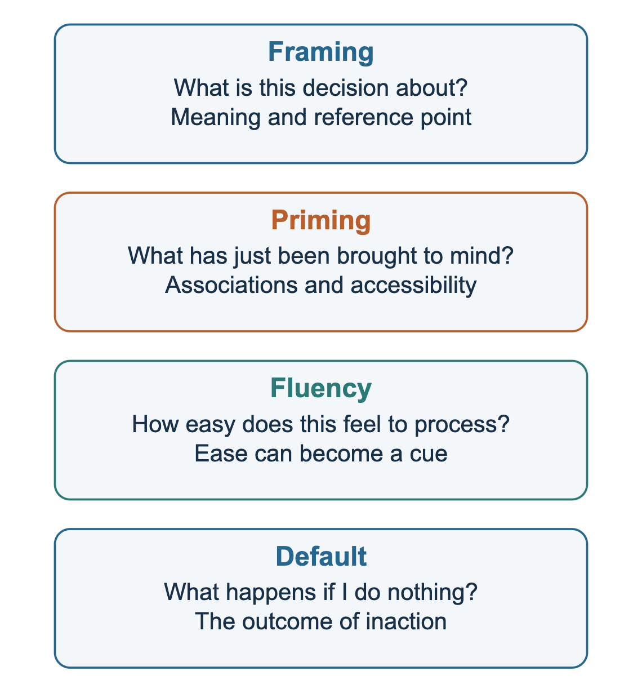<figcaption>Figure 15.1. Framing, priming, fluency, and defaults influence choice through different mechanisms and should not be treated as synonyms.</figcaption></figure>

The clearest framing effects occur when two descriptions are logically equivalent but psychologically different.

One classic category is attribute framing. An object or outcome is described in positive or negative terms, even though the underlying information is the same. Levin and Gaeth (1988) found that people evaluated beef more favorably when it was labeled “75% lean” than when it was labeled “25% fat.” The two labels are equivalent. But “lean” directs attention to health and quality, while “fat” directs attention to unhealthiness and excess.

Attribute framing is everywhere.

A yogurt is “90% fat-free” rather than “10% fat.” A product is “95% effective” rather than “5% ineffective.” A university has a “70% employment rate” rather than a “30% nonemployment rate.” A fund has “low volatility” rather than “limited upside.” A team has “strong continuity” rather than “little new talent.” A candidate is “experienced” rather than “old.” A strategy is “bold” rather than “risky.”

Attribute frames influence evaluation because they provide an interpretive label. They tell the mind what feature matters.

Another category is goal framing, where messages emphasize either the benefits of performing an action or the costs of failing to perform it. For example, a health message might say, “If you exercise regularly, you improve your heart health,” or “If you do not exercise regularly, you increase your risk of heart disease.” Rothman and Salovey (1997) argued that gain-framed messages may be more effective for prevention behaviors, while loss-framed messages may be more effective for detection behaviors, though later research shows that effects depend on behavior type, audience, and context. Meta-analyses suggest that framing can influence health behavior, but effects are often modest and variable (Gallagher & Updegraff, 2012; O’Keefe & Jensen, 2007).

Goal framing matters because it changes motivation. A gain frame says, “Here is what you can obtain.” A loss frame says, “Here is what you may lose.” The same action becomes pursuit or avoidance.

A third category is risky-choice framing. Here, choices involving uncertainty are described in terms of gains or losses. Tversky and Kahneman’s “Asian disease problem” is the classic example. Participants were told to imagine a disease expected to kill 600 people. In the gain frame, one program would save 200 people for sure, while another had a one-third chance of saving all 600 and a two-thirds chance of saving none. In the loss frame, one program would result in 400 deaths for sure, while another had a one-third chance that nobody would die and a two-thirds chance that all 600 would die. The outcomes were logically equivalent, but preferences changed. People tended to be risk averse in the gain frame and risk seeking in the loss frame (Tversky & Kahneman, 1981).

The psychological pattern is powerful: people often prefer a sure gain over a gamble but prefer a gamble over a sure loss. Losses make risk more attractive because risk offers a chance to avoid the loss. This gain–loss asymmetry is one of prospect theory’s central patterns.

Medical decisions provide especially important examples. McNeil et al. (1982) found that people’s preferences between surgery and radiation therapy for lung cancer changed depending on whether outcomes were described in survival terms or mortality terms. Surgery looked more attractive when framed by survival rates and less attractive when framed by early mortality. The statistics were equivalent, but the frame changed the emotional and evaluative meaning.

This raises an ethical issue. If equivalent frames produce different choices, which frame should doctors, managers, policymakers, or educators use? The answer cannot be “the neutral frame,” because there may be no perfectly neutral frame. Every description highlights something. Ethical framing requires helping people see multiple relevant frames rather than quietly steering them through one.

A doctor might say: “This can be described two ways. About 90 out of 100 patients survive this procedure, and about 10 out of 100 do not. Let us discuss what those numbers mean for you.” Presenting both frames can reduce manipulation and support informed judgment.

Equivalent facts can become different decisions because people do not process equivalence abstractly. They process meaning.

## Questions that contain an answer

Some frames are not just descriptions. They are questions that shape the answer.

A restaurant server can ask, “Do you want an egg with your ramen?” Or the server can ask, “Would you like one egg or two?” The second question assumes the decision to add eggs and shifts attention to quantity. The customer can still say no, but the frame changes what feels normal.

A salesperson can ask, “Do you want to buy today?” Or they can ask, “Would you prefer delivery this week or next week?” The second question assumes purchase. A manager can ask, “Should we do this?” Or, “How can we make this work?” The second question assumes commitment and shifts attention from whether to how.

Questions are frames because they define the decision space.

This matters in surveys, interviews, negotiations, medicine, and management. A survey that asks, “How much do you support protecting local jobs from foreign competition?” may produce different responses from one that asks, “How much do you support restricting consumer access to lower-priced imports?” Both may refer to the same policy. The first highlights workers. The second highlights consumers.

Schuman and Presser (1981) showed that survey responses can be sensitive to question wording, order, and context. Even small wording differences can change what respondents consider relevant. In political psychology and communication research, framing is central because public opinion often depends on which considerations are made salient (Chong & Druckman, 2007; Druckman, 2001).

In organizations, leaders frame problems through the questions they ask. A leader who asks, “Who is responsible for this failure?” creates a blame frame. A leader who asks, “What did our system make likely?” creates a learning frame. A leader who asks, “How do we cut costs?” gets different ideas from one who asks, “How do we create more value with the same resources?” A leader who asks, “Why are employees resisting?” gets different answers from one who asks, “What information, incentives, or fears might make this change look unattractive?”

Questions direct search. Search produces evidence. Evidence shapes judgment.

This is why problem framing is often more important than problem solving. A well-framed problem points toward useful solutions. A poorly framed problem traps attention.

Consider a company with declining sales. If the problem is framed as “Our salespeople are not working hard enough,” attention goes to effort, incentives, monitoring, and discipline. If framed as “Customers no longer see enough value,” attention goes to product, market fit, service, price, and competition. If framed as “Our brand is losing relevance,” attention goes to identity, communication, and customer meaning. Each frame makes some causes and solutions visible while hiding others.

No frame is complete. Better decision-making often requires reframing:

What problem are we solving? What would this look like from the customer’s perspective? What would this look like from the employee’s perspective? What would this look like if we assumed the people involved are rational from their own point of view? What frame makes the hidden trade-off visible? What frame are we avoiding because it is uncomfortable?

Reframing is not wordplay. It is changing the mental model of the situation.

## Framing memory and causality

Frames do not only influence choices about the future. They can also shape memory of the past.

Loftus and Palmer’s classic study showed participants films of car accidents and asked them to estimate speed. The wording of the question mattered. Participants gave higher speed estimates when asked how fast the cars were going when they “smashed” into each other than when asked how fast they were going when they “hit” each other. In a later memory question, those who heard stronger wording were more likely to report seeing broken glass, even though there was none (Loftus & Palmer, 1974).

The question framed the event. “Smashed” suggested severity, force, and damage. The frame influenced not only judgment but memory reconstruction.

This does not mean memory is completely invented. It means memory is reconstructive. People remember through schemas, expectations, language, and later information (Bartlett, 1932; Loftus, 2005). A question can provide a frame that shapes what seems to have happened.

This matters for eyewitness testimony, workplace investigations, performance reviews, customer feedback, and interpersonal conflict.

A manager asks, “Why did you ignore the client’s concern?” That question frames the behavior as neglect. The employee may become defensive. Another manager asks, “What happened when the client raised the concern?” This frame leaves more room for explanation. A parent asks, “Why were you careless?” rather than “What made this difficult?” A negotiator asks, “Why did you make such an unreasonable demand?” rather than “What constraint led you to that proposal?”

Questions can smuggle causality into the conversation.

Framing also affects responsibility. If a project fails, it can be framed as a people problem, process problem, incentive problem, strategy problem, market problem, or learning problem. Each frame assigns responsibility differently. A “human error” frame directs attention to individual mistakes. A “system failure” frame directs attention to training, workload, incentives, communication, design, and safeguards.

In safety-critical industries, the difference is crucial. A blame frame may produce fear and concealment. A systems frame may produce learning. This does not mean individuals are never responsible. It means that responsibility frames shape what gets investigated.

Moral judgment is also frame-sensitive. A policy can be framed as protecting vulnerable people or as restricting freedom. A company decision can be framed as efficiency or betrayal. A whistleblower can be framed as disloyal or courageous. A protest can be framed as disorder or democratic expression. Each frame changes which moral values become salient.

Entman (1993) famously defined framing in communication as selecting some aspects of perceived reality and making them more salient in a text, thereby promoting particular problem definitions, causal interpretations, moral evaluations, and treatment recommendations. This definition is useful because it shows that frames do four things: define problems, diagnose causes, make moral judgments, and suggest remedies.

For decision-making, this means that frames do not merely describe situations. They guide the entire chain from attention to action.

## Framing in management, negotiation, and policy

Framing is especially powerful in organizations because leaders often control the language of decision-making.

A performance problem can be framed as laziness, lack of skill, poor incentives, unclear goals, overload, bad tools, weak leadership, or low trust. Each frame implies a different solution. If the frame is laziness, the solution is pressure. If the frame is lack of skill, the solution is training. If the frame is unclear goals, the solution is alignment. If the frame is low trust, the solution is relationship repair.

A strategic initiative can be framed as cost, investment, experiment, threat response, mission fulfillment, or prestige. Each frame changes how people evaluate it. “Cost” invites cutting. “Investment” invites patience. “Experiment” invites learning. “Threat response” invites urgency. “Mission fulfillment” invites identity. “Prestige” invites status motives.

Negotiation is also shaped by frames. If a negotiation is framed as a battle, the goal is to win. The other side becomes an opponent. Information is hidden. Concessions feel like weakness. If framed as joint problem-solving, the goal is to understand interests and create value. The other side becomes a counterpart. Information may become useful. Concessions can be traded across issues.

This does not mean all negotiations should be naive or cooperative. Some negotiations are distributive and require value claiming. But the frame determines what negotiators look for. A battle frame may prevent integrative possibilities from being discovered. A problem-solving frame may create value but can expose one side if the other is purely exploitative. Skilled negotiators frame consciously and adaptively.

Frames also shape conflict. A disagreement can be framed as disrespect, incompetence, diversity of perspective, misunderstanding, or useful challenge. A team that frames dissent as disloyal will suppress information. A team that frames dissent as contribution will learn more. Edmondson’s work on psychological safety shows that teams need climates where people feel able to speak up with concerns, questions, and mistakes (Edmondson, 1999, 2019). Framing disagreement as learning rather than threat is one way to support such climates.

Policy debates are often contests over frames. A tax can be framed as a burden, contribution, investment, redistribution, theft, responsibility, or price of civilization. Immigration can be framed through labor, law, culture, humanitarian duty, security, or demographic renewal. Climate policy can be framed as cost, insurance, innovation, sacrifice, justice, or survival. Public health measures can be framed as protection, control, solidarity, or intrusion.

Chong and Druckman (2007) emphasize that framing effects in politics depend on the strength, repetition, credibility, and competition among frames. People are not passive recipients of any frame. They bring values and prior beliefs. But frames influence which considerations become active and how they are weighted.

This makes framing ethically serious. In public life, frames can clarify real trade-offs or obscure them. A good frame helps citizens understand what is at stake. A manipulative frame hides costs, dehumanizes opponents, or makes one value appear to be the only value.

The ethical test is not whether a frame is persuasive. All communication frames. The test is whether the frame helps people see the decision more fully or less fully.

## Reframing as a decision skill

Because every decision is framed somehow, better decision-making requires the ability to reframe.

Reframing means deliberately changing the way a situation is represented in order to reveal hidden assumptions, alternatives, values, or consequences. It is not spin. Spin tries to make one interpretation win. Reframing tries to understand what different interpretations reveal.

Suppose a student says, “I failed this exam.” One frame is identity: “I am not good at this.” Another is feedback: “My current study strategy did not work.” Another is system: “I did not allocate time well.” Another is opportunity: “This shows what to improve before the final.” The facts may be the same, but the next action differs.

Suppose an employee says, “My manager is micromanaging me.” One frame is distrust. Another is anxiety. Another is unclear expectations. Another is a manager responding to pressure from above. The right frame matters because the solution differs. If it is distrust, trust must be rebuilt. If it is unclear expectations, goals must be clarified. If it is pressure from above, the manager may need support.

Suppose a team says, “Customers do not understand our product.” One frame blames customers. Another says the product is confusing. Another says the value proposition is unclear. Another says the wrong customers are being targeted. Each frame suggests different action.

Good reframing does not require choosing one frame immediately. It requires generating multiple frames before committing.

Useful reframing questions include:

What else could this mean? What frame are we using now? What does this frame make visible? What does it hide? Who benefits from this frame? What would the other side call this situation? What would a customer, patient, student, employee, or citizen see? What if this is not a people problem but a system problem? What if this is not a failure but feedback? What if the real decision is not yes or no, but how, when, or under what conditions?

Reframing is especially useful when a group is stuck. Stuck decisions often repeat the same frame. People argue within the frame rather than questioning it. Should we launch or not launch? Should we punish or forgive? Should we cut costs or protect quality? Should we be tough or cooperative? Reframing may reveal a different decision: pilot first, redesign incentives, change the process, create options, stage the risk, separate issues, or define success differently.

In this sense, framing is not only a source of bias. It is also a tool for creativity.

The same mechanism that can manipulate choice can also expand understanding.

## Ethical framing

Framing is unavoidable. That is why its ethics matter.

A common but naive solution is to say, “Just present the facts neutrally.” But facts must be selected, ordered, worded, categorized, compared, and contextualized. Even a table has a frame. What is included? What is omitted? What is the baseline? What is the time horizon? What is the unit? What is the comparison group? What is labeled benefit or cost?

The ethical question is not whether to frame. The ethical question is how to frame responsibly.

A responsible frame should meet several standards.

First, it should be truthful. It should not use technically accurate wording to create a false impression. Saying “up to 90% effective” when the typical effect is much lower may be misleading even if technically defensible.

Second, it should make relevant trade-offs visible. A frame that highlights benefits while hiding costs is incomplete. A frame that highlights risks while hiding benefits is also incomplete.

Third, it should be audience-respecting. Ethical framing helps people understand, not merely comply. It does not exploit fear, shame, confusion, or time pressure.

Fourth, it should be reversible. If the same frame were used by an opponent, would we consider it fair? If not, the frame may be manipulative.

Fifth, it should allow alternative frames. In high-stakes decisions, people should see more than one valid description. A patient should understand both survival and mortality. A public should understand both cost and benefit. A team should understand both risk and opportunity.

Sixth, it should distinguish description from advocacy. It is acceptable to recommend a course of action. But the communicator should make clear when they are presenting facts and when they are arguing for a value judgment.

Framing is particularly sensitive in medicine. Patients need information in ways they can understand and use. Gigerenzer and Edwards (2003) argued that health statistics should often be presented in transparent formats such as natural frequencies rather than confusing relative risks. A treatment that reduces risk from 2 in 1,000 to 1 in 1,000 can be described as a 50% relative risk reduction or an absolute reduction of 1 in 1,000. Both are true. They do not feel the same. Ethical risk communication should include absolute risks, baselines, and comparisons.

In management, ethical framing means not using language to hide responsibility. “Rightsizing” may sound cleaner than layoffs, but it may obscure human cost. “Stretch goals” may inspire, but they may also normalize overload. “Customer engagement” may be positive, or it may hide addictive design. Ethical leaders use language that clarifies rather than anesthetizes.

In negotiation, ethical framing means presenting proposals in ways that reveal value without deceiving the other side. It is legitimate to frame an offer around mutual gain. It is not legitimate to hide material facts or create false baselines.

The practical rule is:

Frame to illuminate, not to conceal.

<aside class="callout evidence-and-boundary-conditions">
EVIDENCE AND BOUNDARY CONDITIONS

There may be no perfectly neutral frame. Ethical communication does not pretend framing can be removed; it makes relevant alternative frames, absolute frequencies, uncertainty, and choice consequences visible.
</aside>

*Table 15.1. Framing mechanisms and safeguards*

| Frame type | What changes | Safeguard |
| --- | --- | --- |
| Attribute frame | Which side of an equivalent description is focal. | Present both logically equivalent forms. |
| Risky-choice frame | Whether outcomes are coded as gains or losses. | Make the reference point explicit. |
| Goal frame | Whether action pursues benefit or avoids cost. | Match the frame to accurate stakes and efficacy. |
| Question frame | Which alternatives and causes enter search. | Ask a second question from another stakeholder’s perspective. |
| Causal frame | Who or what appears responsible. | Test competing mechanisms before assigning blame. |

## Key ideas

- A frame is not decorative wording. It defines what the decision is about, which outcomes are gains or losses, and which causes and responsibilities become visible.
- Distinguish framing from priming, fluency, and choice architecture.
- Explain attribute, goal, and risky-choice framing.
- Explain how questions frame the answer space.

## Study and practice

1. How would you distinguish framing from priming, fluency, and choice architecture?

2. How would you explain attribute, goal, and risky-choice framing?

3. How would you explain how questions frame the answer space?

<aside class="callout activity">
ACTIVITY

Rewrite one consequential message in at least three frames: gain/loss, individual/system, and short-term/long-term. Identify what each frame makes visible and what it hides. EXPERIENCE - EXPLAIN - APPLY (MAXIMUM 120 WORDS) Experience: describe one specific decision, interaction, or observation. Explain: use one or two concepts from this chapter accurately. Apply: state one improvement, implication, or testable prediction.
</aside>

# Chapter 16. Priming and the Active Mental Context

*What is already activated changes what the next event means*

<aside class="callout core-idea">
CORE IDEA

Priming changes accessibility: a recently activated concept, feeling, identity, or goal can shape interpretation and evaluation. It is not a behavioral remote control.
</aside>

## Learning goals

- Explain associative activation and semantic priming.
- Distinguish priming from framing and fluency.
- Describe affective, identity, goal, and masked priming.
- Evaluate broad behavioral-priming claims cautiously.

To understand priming, begin with memory.

Human memory is not a filing cabinet where each idea sits alone in a separate folder. It is more like a network. Ideas are connected to other ideas. “Doctor” is connected to “nurse,” “hospital,” “medicine,” “patient,” “white coat,” “illness,” and “trust.” “Exam” is connected to “grade,” “stress,” “study,” “failure,” “success,” “school,” and perhaps “parents.” “Negotiation” may be connected to “battle,” “deal,” “money,” “conflict,” “compromise,” or “problem-solving,” depending on experience.

When one idea becomes active, related ideas become easier to access. This is often called spreading activation. Collins and Loftus (1975) proposed an influential model in which concepts are linked in semantic memory, and activation spreads from one concept to related concepts. If “bread” is activated, “butter” becomes more accessible. If “fire” is activated, “smoke,” “danger,” and “alarm” may become more accessible.

Classic studies of semantic priming show this clearly. Meyer and Schvaneveldt (1971) found that people recognized a word such as “nurse” faster after seeing a related word such as “doctor” than after seeing an unrelated word such as “bread.” Neely (1977) showed that semantic priming could involve both automatic activation and strategic expectation depending on timing and task. The core finding is robust: recently activated concepts can make related concepts easier to process.

This is not mysterious. It is how a useful memory system should work. If one concept is active, related concepts may be relevant. If you hear “airport,” it is useful for “flight,” “luggage,” “passport,” and “delay” to become easier to think about. If you hear “storm,” it is useful for “umbrella,” “traffic,” “danger,” and “electricity” to become more accessible. Associative activation helps the mind prepare.

Priming becomes important for decision-making because accessibility can be mistaken for relevance, truth, probability, value, or importance. If a concept is active, it may influence how ambiguous information is interpreted. If danger is active, ambiguous behavior may seem threatening. If achievement is active, a task may seem more important. If money is active, social relations may be interpreted more transactionally. If cooperation is active, a negotiation may seem more solvable.

The mind often asks, “What does this situation mean?” Priming helps determine which meanings are ready to answer.

Consider the word “bank.” If someone has just read about rivers, “bank” may bring to mind the edge of a river. If someone has just read about loans, “bank” may bring to mind a financial institution. The stimulus is the same. The activated context changes interpretation.

Many real situations are like “bank”: ambiguous enough that accessibility matters. Is a colleague’s short email rude or efficient? Is a customer’s hesitation rejection or uncertainty? Is a student’s silence confusion or disengagement? Is a competitor’s move aggressive or defensive? Is a negotiation offer insulting or exploratory? The answer depends partly on what associations are already active.

Priming therefore connects directly to Chapter 6’s discussion of predictive processing. The brain interprets current input through prior expectations and active models. A prime can temporarily change which model is ready.

## Priming, framing, fluency, and architecture

<figure class="book-figure">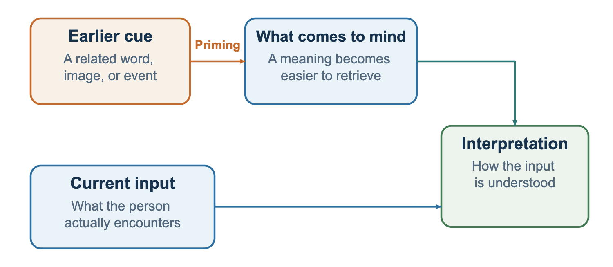<figcaption>Figure 16.1. Priming affects accessibility and can tilt interpretation, but effects depend on clear boundary conditions.</figcaption></figure>

Because framing and priming both shape interpretation, they are often confused. The difference is important.

A frame changes the presentation of the decision itself. It describes the information in a particular way. “This treatment has a 90% survival rate” frames the statistic in terms of survival. “This treatment has a 10% mortality rate” frames the same statistic in terms of death.

A prime changes the mental context before or around the decision. If a patient has just watched a frightening medical drama, the idea of rare complications may be highly accessible before the doctor even speaks. If a doctor’s office displays calm, trust-building cues, a different set of associations may be active. The statistic may be the same, but the patient’s mind begins from a different state.

Priming is also different from cognitive ease, which is examined in Chapter 17. Cognitive ease concerns how fluent, familiar, or effortless something feels. Priming can create cognitive ease because previously activated material is easier to process. But not all priming is fluency, and not all fluency is priming. Seeing a word repeatedly may make it feel familiar; hearing a related word may make it easier to recognize; being in a good mood may make processing feel easier. These overlap, but they are distinct.

Priming is also different from choice architecture. Choice architecture concerns the design of the decision environment: defaults, option order, friction, reminders, feedback, and salience. Priming can be one element of a decision environment, but the two are not the same. A cafeteria that places fruit at eye level uses salience and friction. A poster showing athletes may prime health or performance. Automatic enrollment in a retirement plan is a default, not a prime.

These distinctions matter because each mechanism suggests different ethical and practical questions.

Framing asks: How is the decision described? Priming asks: What associations are already active? Cognitive ease asks: How fluent or familiar does the information feel? Choice architecture asks: How is the decision environment designed?

A communicator who understands these distinctions can diagnose influence more precisely.

## Priming interpretation

One of the most important effects of priming is interpretation. Primes can make certain traits, categories, or meanings more accessible, influencing how ambiguous behavior is judged.

Higgins et al. (1977) demonstrated this in a classic study. Participants were first exposed to words related either to positive traits such as “adventurous” or negative traits such as “reckless.” Later, they read an ambiguous description of a person named Donald who engaged in risky activities. Participants primed with positive traits evaluated Donald more favorably than those primed with negative traits. The same behavior looked adventurous or reckless depending on which concept was accessible.

Srull and Wyer (1979) similarly showed that priming hostile concepts influenced later impressions of an ambiguously described person. Once a trait category becomes accessible, it can guide how behavior is interpreted.

This happens constantly in ordinary life.

If a manager has just heard complaints about employee laziness, they may interpret a late assignment as irresponsibility. If the manager has just discussed workload overload, the same late assignment may be interpreted as capacity strain. If a teacher has recently been thinking about student potential, a wrong answer may look like an opportunity for learning. If the teacher has been thinking about low standards, the same answer may look like lack of preparation.

Priming can also shape negotiations. If a negotiator is primed with competition, they may interpret the other side’s questions as attempts to exploit information. If primed with joint problem-solving, the same questions may seem like attempts to understand interests. The behavior is ambiguous. The accessible model changes the meaning.

In medicine, priming can influence diagnostic thinking. If a doctor has recently seen several cases of a disease, that disease may come to mind more readily. Sometimes this helps. Sometimes it produces availability bias. In law, media coverage of a type of crime may prime jurors, voters, or policymakers to see ambiguous behavior through that category. In organizations, a leader’s opening remarks can prime a meeting as a search for blame or a search for learning.

The practical implication is that the first topic in a conversation matters. The first story in a meeting matters. The examples used before a decision matter. They activate categories that later interpretation may use.

A useful question is:

What concepts have been made accessible before this judgment?

If the answer is threat, failure, blame, competition, or scarcity, the group may interpret ambiguity differently than if the accessible concepts are learning, curiosity, cooperation, or experimentation.

This does not mean positive primes should replace accuracy. Sometimes threat is real. Sometimes blame is appropriate. Sometimes competition is central. The point is that priming interpretation should be conscious rather than accidental.

## Affective priming

Primes can also activate feelings. A stimulus may become liked or disliked more quickly because related positive or negative associations have been activated.

Fazio et al. (1986) developed an affective priming paradigm showing that attitudes can be automatically activated. When people saw a positive or negative prime, they were faster to evaluate target words that matched the prime’s valence. For example, a positive prime facilitated responses to positive words. This suggested that evaluations can be activated quickly and automatically.

Murphy and Zajonc (1993) found that very brief exposure to smiling or scowling faces could influence later evaluations of neutral stimuli, even when participants were not consciously aware of the faces. Their work suggested that affect can sometimes be activated with minimal awareness and influence preference.

Affective priming helps explain why environments matter. A pleasant smell, warm lighting, soft music, a smiling face, or a trusted logo may create a positive affective context. A harsh tone, threatening image, crowded room, or prior frustration may create a negative one. The next object or person may be evaluated partly through that affective residue.

This does not mean people are helpless. But affective context can tilt valuation.

Consider a job interview. If the interviewer has just had a pleasant conversation, received good news, or entered a comfortable room, the candidate may benefit. If the interviewer is rushed, hungry, irritated, or primed by a previous poor candidate, the next candidate may suffer. The interviewer may explain the judgment in terms of fit or competence, but affective context may have played a role.

Consider consumer behavior. A product displayed in an elegant environment may borrow value from the surroundings. A luxury store does not merely show goods; it primes exclusivity, taste, and status. A discount store primes savings and practicality. A hospital waiting room can prime anxiety or calm. A classroom can prime seriousness, creativity, hierarchy, or belonging.

Affective priming is also important in politics and social judgment. If a group is repeatedly paired with threat, disgust, or disorder, negative affect can become easily activated. If a policy is repeatedly paired with care, patriotism, freedom, or fairness, positive affect may become accessible. Later evaluations may feel like independent judgments, even though affective associations were cultivated over time.

Advertising often works through associative and affective pairing. A product is shown with beauty, friendship, adventure, success, family warmth, humor, or rebellion. The product absorbs some of the affective meaning of the surrounding images. This is not the same as an argument. It is associative valuation.

A useful corrective is to ask:

What mood or emotion was active when I formed this evaluation? Is my reaction to the object itself, or to what it was paired with? Would I evaluate it the same way in another context? What associations has this brand, person, policy, or idea repeatedly been paired with?

Affective priming reminds us that liking often has a history, even when it feels immediate.

## Identity and social meaning

People do not enter decisions only as individuals. They enter as students, parents, professionals, citizens, friends, leaders, group members, moral selves, and cultural beings. Which identity is active can change judgment and behavior.

Identity priming occurs when a social identity becomes salient and influences perception, motivation, or performance. Shih et al. (1999) conducted a well-known study with Asian American women, whose identities were associated with conflicting stereotypes about math performance: a positive ethnic stereotype and a negative gender stereotype. When ethnic identity was made salient, performance improved; when gender identity was made salient, performance declined. The study is often discussed in connection with stereotype threat and stereotype lift, but it also illustrates identity priming: the active self matters.

Identity cues are everywhere. A school crest, national flag, professional uniform, religious symbol, family photo, team jersey, company mission statement, or demographic question can activate a social identity. Once active, identity can change what feels appropriate, possible, valuable, or threatening.

Devine’s (1989) work on stereotypes showed that stereotype-related concepts can be automatically activated even among people who do not endorse them. Automatic activation is not the same as personal belief. A person may reject a stereotype yet still live in a culture where the association is accessible. This distinction is crucial because ethical decision-making requires more than good intentions. It requires awareness of the associations that environments activate.

Greenwald and Banaji (1995) introduced the broader concept of implicit social cognition: attitudes, stereotypes, and self-concepts can operate outside conscious awareness and influence judgment. This work helped inspire large literatures on implicit bias and implicit association. Those literatures are complex and debated, especially regarding the prediction of individual behavior from implicit measures. But the broader idea remains important: social associations can be activated automatically, and decision-makers should not assume that conscious egalitarian values eliminate all biased processing.

Identity priming can also be positive. A person reminded of being a scientist may value accuracy more. A doctor reminded of professional ethics may communicate more carefully. A manager reminded of being a mentor may respond differently to mistakes. A negotiator reminded of shared identity may become more open to cooperation. A student reminded of belonging may persist through difficulty.

But identity priming can also narrow judgment. A person reminded of political identity may evaluate evidence defensively. A professional identity may cause someone to protect status. A group identity may increase in-group favoritism. A competitive identity may reduce cooperation. An authority identity may increase dominance.

The practical implication is that identity cues should be designed carefully. If an exam begins by asking demographic questions that activate stereotype threat, performance may be affected. If a meeting begins with hierarchy and status symbols, lower-status members may speak less. If a negotiation begins with shared goals and roles, cooperation may become easier. If an ethics meeting begins with financial targets, moral attention may narrow.

A useful question is:

Which identity is this environment inviting people to inhabit?

People do not have one self. They have multiple identities, and context calls some forward.

## Goals and action

Some research suggests that primes can activate goals and influence behavior. This area is both fascinating and controversial.

Bargh and colleagues argued that goals can sometimes be activated outside awareness and guide behavior in ways similar to consciously chosen goals (Bargh et al., 2001). For example, words related to achievement might increase persistence on a task, or cooperation-related cues might influence social behavior. Aarts and Dijksterhuis (2003) and Custers and Aarts (2010) also studied nonconscious goal pursuit, arguing that goals can be activated by environmental cues and linked to positive affect.

The basic idea is plausible. If a person sees running shoes by the door, the cue may activate an exercise goal. If a calendar reminder says “write,” it may activate a writing goal. If a team room displays customer stories, it may activate service goals. If a meeting begins with a safety story, it may activate caution. Environmental cues can remind people of goals they already have.

However, strong claims about unconscious goal priming require caution. Some well-known social priming studies have failed to replicate or appear more context-dependent than originally believed. A famous study by Bargh et al. (1996) reported that participants primed with elderly-related words walked more slowly afterward. Later replication attempts raised concerns. Doyen et al. (2012) found that the effect depended on experimenter expectations, suggesting that subtle experimenter behavior could influence results. Shanks et al. (2013) questioned the robustness of some priming effects on behavior. The broader replication crisis in psychology has led researchers to be more cautious about dramatic claims based on small samples or flexible methods (Open Science Collaboration, 2015).

More recent reviews and meta-analyses suggest a nuanced view. Priming effects on perception, word recognition, affect, and semantic processing are well established. Effects of primes on complex social behavior are more variable, often smaller, and dependent on context, measurement, motivation, and existing goals (Cesario, 2014; Molden, 2014; Weingarten et al., 2016).

This nuance is essential for a responsible book on decision-making. Priming is real, but it is not magic. A prime does not implant arbitrary behavior into passive minds. It usually works by making existing associations, interpretations, identities, feelings, or goals more accessible. Its effects depend on the person, context, task, motivation, awareness, and competing cues.

A gym poster may motivate someone who already cares about exercise, but not someone exhausted, injured, or uninterested. A teamwork slogan may help a team with trust, but not fix deep incentives for competition. A moral reminder may reduce cheating when ethical identity is relevant, but not overcome strong pressure and weak accountability. A negotiation room designed around collaboration may support cooperation, but not eliminate conflicting interests.

Goal primes work best when they activate goals people already hold, make them salient at the right time, and are supported by the environment.

This gives a practical principle:

Do not rely on priming to create motivation from nothing. Use cues to activate goals people already endorse and make the desired action easier.

## Masked priming and awareness

Some primes are consciously perceived. You see a brand logo, a poster, a word, or an image. Other primes are brief, subtle, or masked so that people have little or no conscious awareness of them.

In masked priming, a stimulus is presented very briefly and then followed by another stimulus that interferes with conscious perception. For example, a word may appear for a few milliseconds, followed by a visual mask. Participants may report not seeing the word, yet their responses to later stimuli may be influenced. Such methods have been used in research on word recognition, semantic processing, affective evaluation, and motor preparation (Forster & Davis, 1984; Greenwald et al., 1996; Marcel, 1983).

Masked priming is scientifically useful because it helps researchers distinguish conscious from nonconscious processing. It shows that some information can be processed enough to influence response without being reportable in ordinary awareness.

But masked priming is also frequently exaggerated in popular culture. It is often associated with fears of subliminal advertising or hidden control. The evidence does not support the idea that subliminal primes can force people to buy products, change deep values, or perform complex actions against their goals. Nonconscious processing is real, but its effects are usually limited, context-dependent, and influenced by motivation.

Research on subliminal goal-related cues suggests that effects are more likely when the prime is relevant to an existing need. For example, thirst-related cues may influence drink-related behavior more when people are actually thirsty (Strahan et al., 2002). This fits the broader principle: primes do not operate in a vacuum. They interact with internal states.

Awareness also changes ethical evaluation. A visible reminder such as “Remember your long-term goal” is different from a hidden manipulation. A hospital sign encouraging handwashing is visible and aligned with public health. A website using hidden cues to increase impulsive purchases would be ethically suspect. Transparency matters.

The ethical issue is not only whether a cue is conscious. Many environmental cues influence people without being the focus of awareness: architecture, music, smell, layout, color, and social signals. The ethical question is whether the influence respects the person’s interests, autonomy, and ability to reflect.

A useful standard is:

Would people object if they knew this cue was being used to influence them?

If the answer is yes, the prime may be manipulative.

## Everyday priming environments

Priming is not only a laboratory phenomenon. Everyday environments are full of cues that activate meanings, goals, identities, and emotions.

A courtroom primes seriousness, authority, and legal order. A classroom primes learning, hierarchy, evaluation, or curiosity depending on its design. A luxury store primes exclusivity and status. A hospital primes care but may also prime vulnerability and anxiety. A start-up office with whiteboards and prototypes primes experimentation. A boardroom with formal seating may prime hierarchy. A circular seating arrangement may prime discussion. A national flag may prime civic identity. A family photograph may prime care and responsibility.

Even objects can prime roles. A stethoscope, diploma, uniform, badge, podium, conference table, or microphone changes how people see themselves and others. Such objects do not determine behavior, but they activate scripts.

A script is a structured expectation about how a situation usually unfolds. Restaurants, classrooms, interviews, meetings, hospitals, airports, and negotiations all come with scripts. When a script is activated, people know what roles are available, what behavior is appropriate, what counts as success, and what emotions are expected.

This matters for organizations. If every meeting begins with performance metrics, people may approach discussion through evaluation and accountability. If meetings begin with customer stories, people may approach discussion through user value. If meetings begin with safety incidents, people may approach discussion through risk. If meetings begin with learning from failure, people may approach discussion through curiosity.

This also matters for negotiation. A room with people seated across a table may prime opposition. Sitting side by side looking at a shared document may prime joint problem-solving. Opening with positions primes bargaining; opening with interests primes exploration. Again, seating will not eliminate conflict. But it can activate a script.

Digital environments prime constantly. A red notification badge primes urgency. A “limited time” banner primes scarcity. A like count primes social comparison. A progress bar primes completion. A streak primes continuity. A profile image primes identity. A “people like you bought this” message primes social proof. Design is associative.

Education also uses priming, often unintentionally. A test labeled “diagnostic of ability” primes evaluation and fixed ability. A test labeled “practice for learning” primes improvement. A classroom displaying only elite achievements may inspire some students and alienate others. A classroom displaying diverse examples of success may prime belonging.

Medicine uses priming through context and ritual. The white coat, examination room, clinical language, and treatment procedure can activate expectations of care and authority. These cues can support healing but also anxiety. As earlier chapters explained, expectations can shape experience.

Because primes are everywhere, the choice is not between priming and no priming. The choice is between accidental priming and intentional, ethical priming.

A practical environmental audit asks:

What does this space make people think of? What identity does it invite? What emotion does it activate? What behavior script does it suggest? What goal becomes salient? What unwanted association might it trigger? Does the cue serve the person’s reflective interests or someone else’s hidden agenda?

Priming is one reason environments are never neutral.

## What the evidence does - and does not - justify

Priming is a useful concept, but it must be handled responsibly.

There are three levels of confidence.

The first level is strong: basic perceptual, semantic, and affective priming effects are well supported. A related word can speed recognition. A prior stimulus can influence processing of a target. Affective associations can be activated quickly. Repetition can facilitate processing. These effects are central to cognitive psychology.

The second level is moderate: identity, stereotype, and goal-related cues can influence judgment and behavior under some conditions. The evidence is meaningful, but effects depend on context, motivation, measurement, and individual differences. Researchers and practitioners should avoid assuming that a simple cue will reliably produce a large behavioral change.

The third level is weak or exaggerated: claims that subtle primes can control complex behavior in broad, predictable ways without awareness or existing motivation. Such claims are often overstated. Human behavior is shaped by many forces: goals, incentives, norms, habits, emotions, identity, constraints, and social context. A prime is one input, not a remote control.

The replication crisis in psychology has made this caution necessary. Some influential priming findings did not replicate cleanly, and the field has become more attentive to statistical power, preregistration, publication bias, and boundary conditions. This is healthy. A mature science does not abandon priming; it refines what kind of priming is reliable, under what conditions, and with what effect sizes.

For practical decision-making, the safest claims are:

Priming can make related ideas more accessible. Accessibility can shape interpretation of ambiguity. Affective primes can influence liking and evaluation. Identity cues can change which self is active. Goal cues can support behavior when goals already exist and the environment allows action. Priming effects are usually context-dependent and should not be treated as mind control.

This cautious view is actually more useful. It prevents magical thinking and encourages design thinking. Instead of asking, “What hidden prime will make people do what I want?” ask:

What associations does this environment activate? Are they aligned with the decision we want people to make reflectively? Are they transparent and ethical? Do they support existing goals? Do they reduce confusion or exploit it? What other forces—friction, incentives, norms, habits, information—must also be addressed?

Priming is a nudge to the mind’s starting point. It is not the whole journey.

*Table 16.1. Evidence tiers in priming*

| Claim | Evidence status | Responsible interpretation |
| --- | --- | --- |
| Semantic and perceptual accessibility | Robust across many laboratory paradigms. | Recent activation can change speed and interpretation. |
| Affective evaluation | Well-supported under specified tasks. | A prior cue can tilt immediate evaluation. |
| Identity and goal activation | Context-sensitive with important boundary conditions. | Effects depend on relevance, motivation, awareness, and setting. |
| Large automatic behavioral effects from subtle social primes | Many famous findings are contested or difficult to replicate. | Do not present priming as mind control or a universal behavior switch. |

## Ethical use

Priming can be used ethically when it helps people access goals, values, and information they would endorse under reflection.

A school can prime belonging by displaying diverse examples of achievement and making difficulty feel normal. A hospital can prime calm and agency through clear communication and supportive surroundings. A company can prime ethical attention by beginning meetings with customer impact or safety concerns. A negotiation can prime cooperation by inviting parties to define the shared problem before exchanging demands. A person can prime exercise by placing running shoes near the door. A family can prime connection by keeping phones away from the dinner table.

These are not manipulations in the sinister sense. They are forms of environment design aligned with reflective values.

Priming becomes ethically questionable when it bypasses reflection to exploit vulnerability, create false associations, hide intent, or push people toward choices they would reject if they understood the influence. A gambling app that primes near-miss excitement, a website that primes urgency to prevent comparison shopping, or a political campaign that primes fear of an outgroup through misleading imagery deserves ethical scrutiny.

Ethical priming follows several principles.

First, it should be aligned with the decision-maker’s welfare or legitimate shared goals. A handwashing reminder in a hospital serves patients and staff. A hidden cue designed to increase impulsive spending serves the seller at the buyer’s expense.

Second, it should be transparent when stakes are high. People should not be secretly manipulated in major financial, medical, political, or legal decisions.

Third, it should support reflection rather than replace it. A cue can remind people of values, but it should not obscure information.

Fourth, it should be evidence-based and modest. Designers should not assume a prime works simply because it is clever. Test effects and watch for unintended consequences.

Fifth, it should be reversible. If people learn about the cue, would they feel respected or tricked?

Priming is unavoidable because environments always activate associations. Ethical design asks which associations should be activated and why.

Chapter 17 turns to cognitive ease, fluency, and familiarity. Priming often makes processing easier. When something has been recently activated, it can feel more fluent. Fluency then creates its own effects: information feels familiar, true, safe, and pleasant. Priming activates the path. Cognitive ease changes how smooth the path feels.

<aside class="callout evidence-and-boundary-conditions">
EVIDENCE AND BOUNDARY CONDITIONS

Semantic, perceptual, and affective priming are well-established. Large, far-reaching behavioral effects from subtle social primes have proved less reliable and highly sensitive to method and context.
</aside>

## Key ideas

- Priming changes accessibility: a recently activated concept, feeling, identity, or goal can shape interpretation and evaluation. It is not a behavioral remote control.
- Explain associative activation and semantic priming.
- Distinguish priming from framing and fluency.
- Describe affective, identity, goal, and masked priming.

## Study and practice

1. How would you explain associative activation and semantic priming?

2. How would you distinguish priming from framing and fluency?

3. What evidence and mechanism would you use to describe affective, identity, goal, and masked priming?

<aside class="callout activity">
ACTIVITY

Before an upcoming meeting, list the concepts, stories, metrics, images, and identities activated in the first five minutes. Redesign the opening to make the task-relevant model accessible without hiding contrary evidence. EXPERIENCE - EXPLAIN - APPLY (MAXIMUM 120 WORDS) Experience: describe one specific decision, interaction, or observation. Explain: use one or two concepts from this chapter accurately. Apply: state one improvement, implication, or testable prediction.
</aside>

# Chapter 17. Fluency, Familiarity, and the Feeling of Truth

*Why an easy idea can feel safer, better, and more accurate than it is*

<aside class="callout core-idea">
CORE IDEA

The mind often treats ease of processing as evidence. Fluency can support comprehension, but repetition and familiarity can manufacture truth, liking, confidence, and trust.
</aside>

## Learning goals

- Explain processing fluency and cognitive ease.
- Explain mere exposure and illusory truth.
- Describe how names, rhyme, typography, and clarity affect judgment.
- Distinguish useful difficulty from pointless strain.

Processing fluency is the ease with which the mind processes information. A word is fluent when it is easy to read or pronounce. A sentence is fluent when it is clear and well structured. A face is fluent when it is familiar. An image is fluent when it is high contrast, symmetrical, or expected. An idea is fluent when it fits what we already know. A decision is fluent when the options are easy to compare.

Cognitive ease is the subjective feeling that accompanies fluency. It is the sense that something is effortless, familiar, coherent, and unproblematic. Cognitive strain is the opposite: the sense that something is difficult, unfamiliar, effortful, or suspicious.

Fluency matters because people use it as a metacognitive signal—a feeling about their own mental processing. The mind does not only process information; it also monitors how processing feels. If something is easy to process, the mind may infer that it is familiar, true, safe, common, beautiful, or liked. If something is difficult to process, the mind may infer that it is unfamiliar, risky, false, suspicious, or less attractive (Alter & Oppenheimer, 2009; Reber et al., 2004; Schwarz, 2004).

This inference is not foolish. Fluency often contains useful information. A familiar face is more likely to belong to someone we have seen before. A clear explanation is often better than a confusing one. A well-designed form is easier to complete. A readable warning is more useful than an unreadable one. A coherent argument may deserve more trust than a disorganized argument.

But fluency is not proof. It is only a signal. And signals can be caused by many things.

A statement can feel fluent because it is true. It can also feel fluent because it is repeated. A name can feel familiar because the person is trustworthy. It can also feel familiar because the name was advertised. A message can feel clear because the idea is well understood. It can also feel clear because the complexity was hidden.

Fluency influences judgment because people often do not correct for the source of ease. If something feels easy, we may attribute that ease to the object rather than to repetition, design, mood, font, familiarity, or prior exposure.

This is why cognitive ease is powerful. It operates as a quiet background feeling. People rarely say, “I believe this because it was easy to process.” They say, “It just makes sense.”

Kahneman (2011) described cognitive ease as a state associated with familiarity, good mood, trust, and intuitive processing. When processing is easy, people are more likely to rely on fast thinking. When processing is strained, people may become more vigilant, skeptical, and analytic. Alter et al. (2007) found that disfluent presentation could sometimes reduce intuitive errors by encouraging more analytic processing. The point is not that disfluency is always good. It is that ease and strain can shift how people think.

A decision-maker should therefore ask:

Does this feel right because it is right? Or because it is fluent?

That question sits at the heart of this chapter.

## Repetition becomes liking

<figure class="book-figure">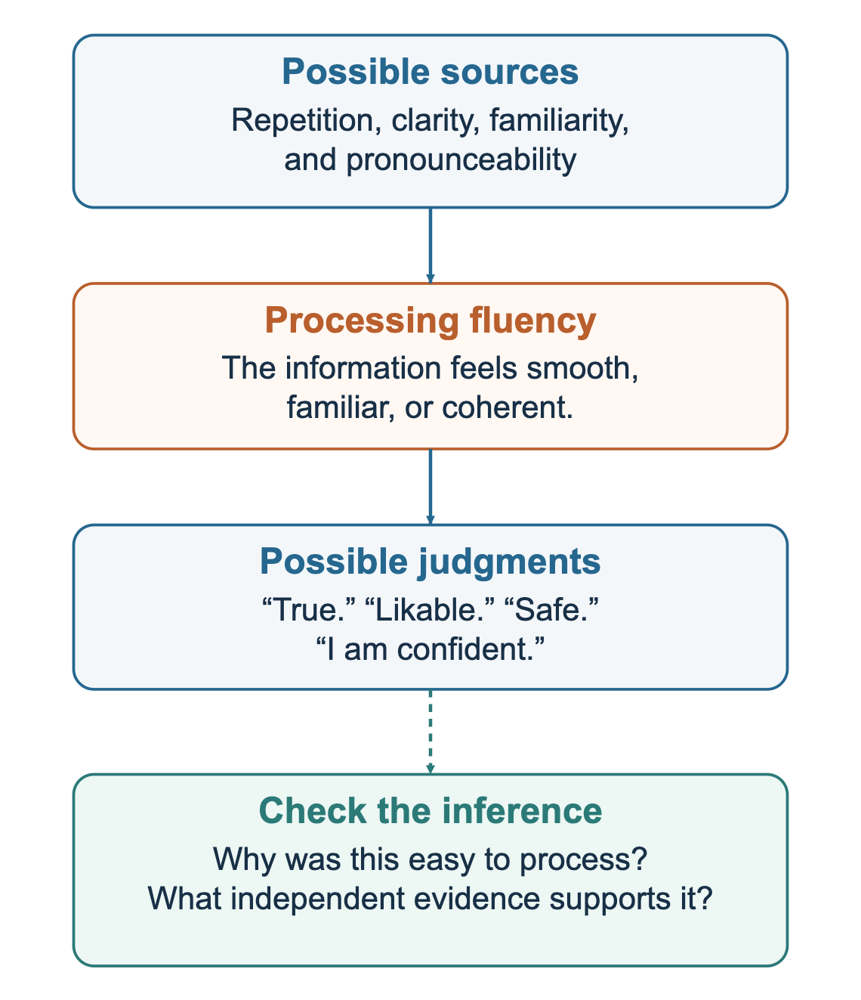<figcaption>Figure 17.1. Processing ease can be misattributed to truth, liking, safety, and confidence.</figcaption></figure>

One of the most important sources of fluency is repetition. Repeated exposure makes information easier to process. Over time, ease can become liking.

The mere exposure effect is the tendency for repeated exposure to a stimulus to increase liking for it. Zajonc (1968) famously showed that people often develop more positive attitudes toward stimuli they have encountered before, even when exposure is brief and no new information is provided. Later research confirmed that the effect appears across many kinds of stimuli, including words, symbols, faces, sounds, and objects (Bornstein, 1989).

The mechanism is partly fluency. A repeated stimulus becomes easier to process. That ease feels good or safe. The mind may interpret familiarity as a sign that the object is acceptable, known, or nonthreatening. Repetition reduces uncertainty.

This makes evolutionary sense. In many environments, something encountered repeatedly without harm is probably safe. Familiar foods, familiar paths, familiar people, and familiar places often deserve less suspicion than unknown ones. Familiarity can be useful.

But familiarity can also be manufactured.

Brands rely heavily on mere exposure. A logo seen repeatedly becomes familiar. A jingle heard repeatedly becomes easy to recognize. A politician’s name repeated often becomes more available. A slogan repeated often becomes part of the mental environment. A product that appears frequently in stores, feeds, videos, and conversations may become preferred simply because it feels known.

Mere exposure does not guarantee liking in every case. Repetition of an unpleasant or threatening stimulus can increase irritation. Excessive repetition can lead to boredom or reactance. The effect is strongest when initial reactions are neutral or mildly positive, when exposure is not experienced as coercive, and when the stimulus is not overprocessed (Bornstein, 1989; Zajonc, 2001).

Mere exposure also affects social life. A classmate, colleague, neighbor, or brand may become more likable simply through repeated, nonnegative exposure. Familiarity can create warmth. This helps explain why proximity matters in friendship and why repeated interaction can build trust. But it also explains why social environments shape preference. People often like what they have repeatedly encountered.

In music, repeated listening can turn unfamiliar songs into favorites. In food, repeated exposure can increase liking, especially for initially unfamiliar tastes. In culture, repeated narratives become normal. In organizations, repeated phrases become values. In politics, repeated associations become common sense.

This can be beneficial. Repeated exposure to diverse role models can make achievement feel possible. Repeated exposure to safety procedures can normalize caution. Repeated exposure to ethical reminders can make integrity salient. Repeated exposure to inclusive language can shift what feels normal.

But it can also be harmful. Repeated stereotypes become familiar. Repeated misinformation becomes easier to believe. Repeated cynicism becomes realism. Repeated hostility becomes normal. Repeated exposure to luxury lifestyles can make ordinary life feel inadequate.

A useful question is:

Do I like this because it is good, or because it has become familiar?

The answer may be both. But the distinction matters.

## Repetition becomes truth

Repetition does not only increase liking. It can also increase perceived truth.

The illusory truth effect is the tendency for repeated statements to be judged as more true than new statements, even when repetition provides no evidence. Hasher et al. (1977) showed that repeated statements were later rated as more truthful. This effect has been replicated many times and is considered robust (Dechêne et al., 2010).

The mechanism again involves fluency. Repeated statements are easier to process. The mind interprets ease as familiarity. Familiarity is then misattributed to truth. “I have heard this before” becomes “This seems true.”

This is one of the most important findings for modern information environments.

A false claim repeated often can begin to feel true. A misleading statistic repeated across media can become common knowledge. A rumor repeated in a workplace can become accepted. A stereotype repeated in jokes, headlines, and stories can become plausible. A political slogan repeated often can feel self-evident.

The illusory truth effect can occur even when people know better. Fazio et al. (2015) found that repetition increased perceived truth even for statements that participants could have known were false, such as “The Atlantic Ocean is the largest ocean on Earth.” Knowledge helps, but repetition still exerts influence. This is troubling because people often assume that misinformation can be corrected simply by knowing the facts. Fluency can still pull.

Begg et al. (1992) showed that people may confuse familiarity of a statement with credibility of its source. A statement encountered earlier may later feel more credible, even when the original source was unreliable. This is especially important in digital media, where claims detach from sources as they circulate.

Illusory truth is related to source-monitoring errors. People remember content more easily than where it came from. A person may recall hearing a claim but forget that it came from an unreliable website, a satire post, a rumor, or a hypothetical example (Johnson et al., 1993). Once source memory fades, fluency remains.

This creates a dilemma for correcting misinformation. Repeating a false claim in order to debunk it may increase familiarity. If the correction is not clear, the false claim may become more fluent. Research on misinformation correction suggests that corrections should be clear, repeated, provide alternative explanations, and avoid unnecessary repetition of the myth (Lewandowsky et al., 2012; Schwarz et al., 2016). The goal is to make the truth more fluent than the falsehood.

The illusory truth effect has practical implications for organizations. If leaders repeatedly say, “Employees resist change,” the statement may become accepted even if the real problem is poor communication or weak trust. If a team repeatedly says, “Customers only care about price,” they may stop seeing evidence of quality, service, or meaning. If a student repeatedly says, “I am bad at math,” the statement may become subjectively true and guide behavior. If a society repeatedly hears that aging means decline, people may internalize that expectation.

Repetition is not neutral. It builds mental roads. The more often a thought travels the road, the smoother it feels.

A useful defense is to ask:

Where did I first hear this? How many independent sources support it? Is this familiar because it is true or because it has been repeated? What would I believe if I had heard the opposite as often? Can I explain the evidence, or do I only recognize the claim?

Truth should be based on evidence, not merely fluency.

## Easy names, clear prose, and beautiful ideas

Fluency affects more than truth and liking. It affects risk perception, credibility, beauty, confidence, and even financial judgments.

Words that are easy to pronounce often feel safer and more familiar. Song and Schwarz (2009) found that people judged food additives with easier-to-pronounce names as less harmful than additives with difficult names. The name’s fluency influenced perceived risk. The chemical itself did not change.

Alter and Oppenheimer (2006) found that stocks with easier-to-pronounce names or ticker symbols performed better shortly after initial public offerings, suggesting that fluency may influence investor behavior, at least in early trading contexts. This does not mean pronounceable names create long-term value. It means that when information is limited, fluency can influence preference and confidence.

Fluency also affects aesthetic pleasure. Reber et al. (2004) argued that beauty is partly linked to processing fluency. Stimuli that are easier to process—because of symmetry, contrast, clarity, prototypicality, or prior exposure—often feel more pleasing. This does not reduce all beauty to ease, but it helps explain why clarity, balance, and familiarity can produce positive evaluation.

Rhyming can also increase perceived truth. McGlone and Tofighbakhsh (2000) found that aphorisms were judged more accurate when they rhymed than when equivalent meanings were expressed without rhyme. “Woes unite foes” feels more truthful than “Woes unite enemies.” Rhyme increases fluency, and fluency becomes credibility.

Oppenheimer (2006) showed that unnecessarily complex writing can make authors seem less intelligent. People sometimes use complex language to sound smart, but disfluency can backfire. Clear writing often produces higher judgments of intelligence because it is easier to process. This is an important lesson for students, managers, and leaders: clarity is not simplification in the bad sense. Clarity is respect for the reader’s cognitive resources.

Fonts and visual design also matter. Easy-to-read text feels smoother and may be judged more favorably. But the relationship between font disfluency and learning is complicated. Some early work suggested that difficult-to-read fonts might improve learning by increasing effort (Diemand-Yauman et al., 2011). Later studies found mixed results and raised doubts about broad claims that disfluent fonts reliably improve learning (Eitel & Kühl, 2016; Yue et al., 2013). The practical conclusion is cautious: desirable difficulty can improve learning when it leads to meaningful processing, but unnecessary perceptual difficulty often just creates strain.

This distinction is crucial. Difficulty is not automatically good. A challenging problem can deepen learning. A blurry slide does not. A complex case can build judgment. A confusing form may just cause errors. A hard-to-read font may create effort, but not necessarily useful effort.

Fluency affects credibility in communication. A speaker who is fluent, organized, and easy to follow often seems more knowledgeable. This can be appropriate if fluency reflects preparation and understanding. But fluency can also mask weak content. A smooth presentation can make shallow ideas persuasive. A confident narrative can feel more complete than uncertain truth.

In management, fluency affects strategy. A simple strategy story often travels more easily than a complex one. That is useful when the simple story captures the core truth. It is dangerous when the simplicity hides key trade-offs. “Move fast” is fluent. “Grow responsibly while preserving quality, employee trust, regulatory compliance, and long-term customer value” is less fluent but may be more accurate.

In public policy, fluent slogans outperform complex explanations. “Tough on crime,” “protect jobs,” “cut red tape,” “follow the science,” “freedom,” “fairness,” and “security” are cognitively efficient. They activate values quickly. But complex problems rarely fit fully inside a slogan.

The practical lesson is not to reject fluency. It is to respect its power.

A useful question is:

Is this idea persuasive because it is clear, or because it is oversimplified?

Clarity reveals complexity in usable form. Oversimplification hides it.

## When difficulty makes us think

Cognitive strain is the feeling that processing is difficult. It can come from unfamiliarity, poor design, complexity, surprise, contradiction, low contrast, hard fonts, technical language, ambiguity, or mental conflict.

Strain often feels unpleasant. People prefer ease. But strain can have benefits. It can signal that the situation requires attention. It can interrupt automatic processing. It can make people more skeptical.

Alter et al. (2007) found that when problems were presented in a hard-to-read font, people were more likely to answer some Cognitive Reflection Test-style problems correctly. The interpretation was that disfluency triggered analytic processing by making the task feel more difficult. When processing is easy, people may rely more on intuition. When processing is strained, they may slow down.

Kahneman (2011) similarly described cognitive strain as a state associated with vigilance and System 2 engagement. If something feels difficult, the mind may become less trusting. This can help when intuitive answers are wrong.

But strain is not a universal cure. Too much strain can confuse, frustrate, reduce motivation, and increase errors. A form that is hard to understand does not necessarily make people more thoughtful; it may make them give up. A lecture full of jargon may not produce deeper learning; it may produce disengagement. A legal disclosure written in dense language may not promote informed consent; it may hide information.

Learning research distinguishes between desirable difficulties and undesirable difficulties. Bjork (1994) argued that certain difficulties, such as spacing, retrieval practice, and varied practice, can improve long-term learning because they require meaningful effort. But difficulties that interfere with basic access to information are not desirable. The difficulty must support the learning process, not obstruct it.

This distinction applies to decision-making. A useful decision process may create productive strain by forcing people to consider alternatives, estimate probabilities, examine trade-offs, or confront disconfirming evidence. A bad process creates unproductive strain through unclear forms, jargon, poor organization, hidden fees, confusing options, or unnecessary friction.

For example, asking a team to conduct a premortem creates desirable difficulty. It forces people to imagine failure before committing. Asking a patient to read a ten-page legalistic consent form full of technical language may create undesirable difficulty. It burdens comprehension without necessarily improving understanding.

Strain can also be weaponized. Some companies use confusing cancellation processes, complex pricing, or hidden options to exploit people. This is sometimes called sludge: excessive friction that makes beneficial actions harder (Sunstein, 2021). The chapter on nudge and choice architecture will address this in detail.

The practical distinction is:

Does this difficulty help people think better? Or does it make good choice harder?

Cognitive ease should be used to make relevant information accessible. Cognitive strain should be used only when slowing down is helpful.

## Fluency in teaching, leadership, and design

Cognitive ease is not merely a bias. It is also a design principle.

Good teachers create fluency without removing intellectual challenge. They define key terms, use examples, organize information, connect new ideas to prior knowledge, and reduce unnecessary confusion. This frees students’ cognitive resources for the real difficulty: understanding, applying, analyzing, and questioning. A confusing explanation is not deeper because it is confusing.

Good managers also design fluency. A decision meeting should make the decision question clear. What are we deciding? What alternatives are on the table? What evidence matters? What are the trade-offs? What uncertainties remain? If people spend half the meeting trying to understand the structure of the decision, little attention remains for judgment.

Good visual design supports decision-making by making important information easy to find and compare. Tufte (2001) argued for visual displays that communicate data clearly and honestly. A chart should not merely look attractive; it should make patterns, comparisons, and uncertainty visible. Poor design creates cognitive strain that can lead to bad decisions.

Medical communication also depends on fluency. Patients need risk information in forms they can understand. Gigerenzer and Edwards (2003) argued that natural frequencies often make risks easier to understand than abstract percentages. “1 out of 1,000” may be more concrete than “0.1%.” Visual aids can help when designed clearly. But oversimplification can mislead if it hides uncertainty or trade-offs.

Legal, financial, and public policy communication often fail because they overload people. Dense disclosures, long terms of service, complicated forms, and unclear fee structures create strain. Sometimes the strain is accidental. Sometimes it benefits the institution because confused people are less likely to opt out, complain, compare, or switch.

Ethical design should reduce unnecessary strain. If people need to make an informed choice, the path to understanding should be as fluent as possible. This does not mean making the decision look easier than it is. It means making the complexity visible in a usable way.

Fluency also matters in leadership language. Leaders often underestimate how much repetition and clarity are needed. A strategy that has been discussed for months by executives may still be new to employees. A value that appears obvious to founders may be unclear to customers. A policy that seems simple to experts may be confusing to users. Communication must be repeated, clear, and connected to concrete action.

But leaders must also beware of fluent nonsense. A slogan can spread faster than a strategy. A catchy phrase can substitute for operational clarity. “Customer first” is fluent. What does it mean when customer demands conflict with employee well-being? “Move fast” is fluent. What does it mean when speed conflicts with safety? “Ownership” is fluent. What authority and resources come with it?

Fluent language should invite action, not replace thought.

A useful design checklist is:

What should be easy here? What should be hard? Is the difficulty meaningful or accidental? Does fluency clarify truth or hide complexity? Does repetition reinforce what is accurate? Could familiarity be mistaken for evidence? Would a newcomer understand this?

Good design respects limited attention. It makes the right things easy.

## The risk of the familiar

Familiarity is one of the strongest sources of cognitive ease. Familiar people, brands, ideas, routes, institutions, and routines feel safer than unfamiliar ones.

This can be adaptive. Familiarity often reflects experience. If a person has repeatedly been reliable, trust is reasonable. If a route has worked many times, it may be a good route. If a tool has been used successfully, it deserves confidence. Familiarity reduces uncertainty.

But familiarity can also trap people.

A familiar job may feel safer than a better unfamiliar opportunity. A familiar process may continue because people know it, not because it works. A familiar supplier may be chosen despite mediocre performance. A familiar investment may feel less risky than a diversified unfamiliar one. A familiar social norm may feel moral simply because it is normal. A familiar explanation may survive because people have heard it often.

Familiarity can be especially misleading in risk. People often fear unfamiliar risks more than familiar ones, even when familiar risks are statistically larger. Slovic (1987) showed that risk perception depends on qualitative features such as dread, familiarity, control, voluntariness, and catastrophic potential. A familiar voluntary risk may feel acceptable. An unfamiliar involuntary risk may feel alarming.

This explains why people may underestimate everyday risks such as driving too fast, poor diet, lack of exercise, sleep deprivation, or financial under-saving, while overestimating dramatic risks that are rare but vivid. Familiarity dulls concern.

Familiarity also affects organizational change. People resist new systems partly because the old system feels known. Even a flawed process has fluency. A new process creates strain. The first weeks of a better system may feel worse because people are losing fluency. Leaders often mistake this discomfort for evidence that the new system is bad. Sometimes it is simply unfamiliar.

This suggests a useful principle:

Do not judge a new system only while it is still disfluent.

Learning curves matter. A new software tool, meeting format, budgeting process, or decision checklist may feel cumbersome at first. The relevant question is not only how it feels now, but whether it will produce better outcomes after practice.

At the same time, the mere fact that resistance is due to unfamiliarity does not mean the new system is good. Some new systems are genuinely bad. The point is to separate discomfort from evidence.

Ask:

Do I trust this because it is familiar or because it is reliable? Do I distrust this because it is risky or because it is unfamiliar? What evidence do I have beyond ease? How would I evaluate this after a fair trial? What would a newcomer see that insiders miss?

Familiarity is a guide. It should not be a prison.

## Defending against misleading ease

Because cognitive ease feels good, true, safe, and trustworthy, people need defenses against misleading fluency.

The first defense is source checking. When a statement feels true, ask where it came from. Familiarity without source memory is dangerous. Did the claim come from evidence, rumor, advertising, repetition, or a respected expert? If source quality is weak, fluency should not carry much weight.

The second defense is independent evidence. Do not rely on the feeling of familiarity. Ask what evidence supports the claim. How many independent sources? What data? What base rates? What counterevidence?

The third defense is deliberate disfluency in the right place. For important decisions, slow down enough to ask hard questions. What is the strongest argument against this? What assumptions are hidden? What trade-offs are being simplified? Where might the slogan fail?

The fourth defense is multiple formats. A risk can be presented as a percentage, natural frequency, visual icon array, absolute risk reduction, and comparison with alternatives. If a conclusion depends on one format, framing or fluency may be driving it.

The fifth defense is time. Fluency effects can be strong in the moment. Waiting can reduce the pull of immediate ease. This is especially useful for purchases, persuasive messages, social media claims, and emotional decisions.

The sixth defense is exposure balance. If repeated exposure increases belief and liking, expose yourself to accurate information repeatedly, not only misinformation or outrage. Build fluency for truths you want to remember: principles, values, goals, and good habits. A person who repeatedly reviews long-term goals makes them more mentally available. A team that repeatedly discusses customer harm makes responsibility fluent.

The seventh defense is design ethics. Do not use fluency to make falsehoods or harmful choices attractive. Use fluency to make truth, safety, consent, learning, and good decisions easier.

A practical fluency check for any important message is:

Is it clear? Is it true? Is it complete enough? Is its simplicity hiding something important? Could repetition make it believable without evidence? Would people still accept it if it were harder to process?

Cognitive ease is not the enemy. Unexamined ease is.

<aside class="callout evidence-and-boundary-conditions">
EVIDENCE AND BOUNDARY CONDITIONS

Disfluency is not a general debiasing treatment. A hard-to-read font can create effort without useful thought. Difficulty helps only when it directs attention to the relevant structure of the task.
</aside>

*Table 17.1. What processing ease can and cannot tell you*

| Source of ease | Potentially valid inference | Invalid leap | Check |
| --- | --- | --- | --- |
| Clear organization | The message is easier to understand. | The claim must be true. | Inspect evidence and omitted complexity. |
| Repetition | The statement is familiar. | The statement is accurate. | Trace independent sources. |
| Easy pronunciation | The name is fluent. | The product is safer or better. | Separate the label from outcome data. |
| Familiar option | Past exposure reduces uncertainty. | The option has the best value now. | Compare current alternatives and costs. |

## Key ideas

- The mind often treats ease of processing as evidence. Fluency can support comprehension, but repetition and familiarity can manufacture truth, liking, confidence, and trust.
- Explain processing fluency and cognitive ease.
- Explain mere exposure and illusory truth.
- Describe how names, rhyme, typography, and clarity affect judgment.

## Study and practice

1. How would you explain processing fluency and cognitive ease?

2. How would you explain mere exposure and illusory truth?

3. What evidence and mechanism would you use to describe how names, rhyme, typography, and clarity affect judgment?

<aside class="callout activity">
ACTIVITY

Take a claim that &quot;just makes sense.&quot; Trace the source of fluency: repetition, prior belief, simple language, rhyme, design, or genuine understanding. Then write the evidence separately. EXPERIENCE - EXPLAIN - APPLY (MAXIMUM 120 WORDS) Experience: describe one specific decision, interaction, or observation. Explain: use one or two concepts from this chapter accurately. Apply: state one improvement, implication, or testable prediction.
</aside>

# Part 3. How Choices Become Stories and Habits

How post-choice explanation, repetition, craving, and environment design shape behavior over time.

# Chapter 18. The Narrator After the Choice

*Why explanations can be sincere and still miss the cause*

<aside class="callout core-idea">
CORE IDEA

The mind often turns a choice into a coherent story after the action. Explanations can express genuine values and still be incomplete causal accounts.
</aside>

## Learning goals

- Distinguish a reason, a justification, and a cause.
- Explain choice blindness, confabulation, and the interpreter.
- Describe cognitive dissonance and post-choice revaluation.
- Use tests, records, and outsider perspectives to hold stories accountable.

A person chooses the rightmost of four identical products and then explains the choice by texture and quality. A participant selects one face, receives the rejected face after a covert switch, and calmly explains why that was the preferred face. A manager approves an acquisition partly because of status competition, then remembers the decision as a disciplined strategic move. In each case, the explanation may be sincere. Sincerity, however, does not guarantee access to the cause.

Human beings are not only decision-makers. We are narrators. We turn actions into reasons, fragments into continuity, and accidents into stories that can be communicated to other people. This ability is indispensable for identity and coordination. It is also a source of error, because a plausible explanation can feel like direct introspection even when it is partly reconstructed after the fact (Nisbett & Wilson, 1977b).

## Reasons are not the same as causes

A reason can play several roles. It can describe what a person consciously considered before choosing. It can justify a choice to an audience. It can express a value the person genuinely endorses. It can also be a post-hoc account assembled from what is available after the action. These roles overlap, which is why the correct conclusion is not that introspection is useless. People often know their goals, deliberations, and conscious reasons. Their access to subtle causal influences - position, order, fluency, mood, priming, habit, social pressure, and automatic evaluation - is incomplete.

People can give sincere explanations for choices without having reliable introspective access to the processes that produced them (Nisbett & Wilson, 1977b; Johansson et al., 2005).

Nisbett and Wilson (1977b) reviewed evidence that people sometimes report culturally plausible theories of why they responded rather than direct knowledge of the process. In the well-known stocking display, identical items were arranged from left to right. The rightmost item was chosen more frequently, yet participants explained their preferences in terms of fabric and workmanship and rejected position as a cause. The study does not show that every reason is false. It shows that unnoticed influences can shape behavior while the mind produces a coherent account.

## Choice blindness and the confidence of explanation

Choice-blindness experiments make the gap more visible. Johansson et al. (2005) asked participants to choose between faces. Through a card trick, some participants were then shown the face they had rejected and asked to explain their choice. Many failed to detect the switch and offered detailed reasons for preferring the substituted option. Later work extended the paradigm to consumer choices and moral or political attitudes, while also showing that detection depends on the task and size of the manipulation (Hall et al., 2012).

The striking feature is not merely error. It is fluent justification. Once an option is represented as "my choice," the mind can search memory and construct reasons consistent with it. This is useful for commitment and social communication, but dangerous when confidence in the explanation is mistaken for evidence about the original cause.

## The interpreter and confabulation

Research with split-brain patients inspired the idea of an interpreter: a tendency, especially associated with the language-dominant hemisphere, to construct a coherent account of behavior from whatever information is available (Gazzaniga, 2000). In classic demonstrations, an action could be initiated by information unavailable to the speaking hemisphere. When asked why the action occurred, the person produced an immediate explanation rather than reporting ignorance.

These cases are neurologically unusual, and they should not be treated as a complete theory of ordinary self-knowledge. Their value is conceptual. The mind strongly prefers an intelligible story to an acknowledged gap. Confabulation in this sense need not involve deliberate deception. It is the filling of an explanatory gap with a story that feels subjectively real.

## Cognitive dissonance: the choice rewrites the chooser

After a difficult choice between attractive alternatives, people often increase the attractiveness of the chosen option and decrease the attractiveness of the rejected one. Brehm (1956) interpreted this spreading of alternatives as a response to post-decision dissonance. A choice creates inconsistency: if the rejected option was genuinely attractive, why did I reject it? Revaluation restores coherence.

Dissonance reduction can support commitment. Constantly reopening every decision would be exhausting. But it can also make feedback harder to hear. A team that invested heavily in a project may reinterpret weak demand as temporary misunderstanding. A person who chose a prestigious job may minimize the daily costs that were obvious before the decision. A negotiator who rejected an offer may later describe it as insulting even when it was close to acceptable.

## Reasoning as a social instrument

Reasoning is not used only to discover truth privately. It is also used to justify actions, persuade others, defend group commitments, and protect moral identity. Motivated reasoning occurs when people search and evaluate arguments in ways that favor a preferred conclusion while preserving the feeling of objectivity (Kunda, 1990). Greater cognitive skill can improve accuracy, but it can also provide a larger toolkit for defending identity-protective beliefs.

Moral rationalization is especially consequential. People can reframe questionable conduct as efficiency, loyalty, standard practice, competitive necessity, or obedience to procedure. Ethical fading occurs when the moral dimension disappears from the frame. Euphemistic language does not merely describe the action; it changes what is attended to and what can be justified (Bandura, 1999).

## Organizations have narrators too

Organizations create stories about why strategies succeeded, why projects failed, who deserves credit, and what the culture values. These stories organize memory and coordinate action. They can also protect leaders, suppress inconvenient evidence, and turn luck into a legend of skill. A postmortem that begins with "who failed?" produces a different institutional memory from one that asks "what assumptions, incentives, information flows, and constraints made this outcome likely?"

The central risk is that an explanation becomes immune to testing. "Customers were not ready" may hide a poor product. "The team resisted change" may hide an incoherent implementation. "We work best under pressure" may hide procrastination reinforced by last-minute relief.

## Making the narrator accountable

<figure class="book-figure">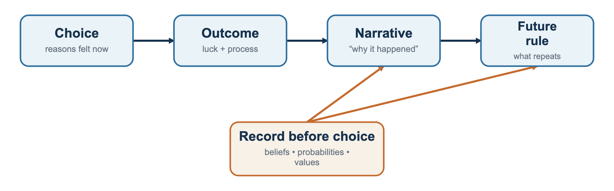<figcaption>Figure 18.1. Learning improves when post-outcome explanations are checked against a decision record created before hindsight arrived.</figcaption></figure>

A decision journal creates a record before outcome knowledge rewrites memory. Record the alternatives, assumptions, forecasts, values, emotions, reasons, and review date. Later, compare the original story with what happened. The aim is not self-accusation. It is causal humility.

Other useful practices include generating alternative explanations, asking what evidence would disconfirm the preferred story, inviting an outsider who does not need the story to be true, and running bounded experiments. If the story says employees cannot handle autonomy, test a limited autonomy arrangement. If it says customers will never want the product, build a small prototype. Testing is better than defending.

Self-affirmation can sometimes reduce defensiveness by reminding people that the whole self is not on trial (Cohen & Sherman, 2014; Steele, 1988). Organizations can also reward revision. A person who says, "My forecast was wrong and here is what changed," should be treated as a source of learning rather than as a threat to authority. The narrator is not an enemy. It is a press secretary, historian, lawyer, poet, and diplomat. Better judgment begins when we ask it one more question: How do I know this story is true?

<aside class="callout evidence-and-boundary-conditions">
EVIDENCE AND BOUNDARY CONDITIONS

The evidence does not imply that people never know why they act. Conscious deliberation is real. The narrower claim is that introspective access is incomplete and that confidence in an explanation is not a validity test.
</aside>

## Key ideas

- The mind often turns a choice into a coherent story after the action. Explanations can express genuine values and still be incomplete causal accounts.
- Distinguish a reason, a justification, and a cause.
- Explain choice blindness, confabulation, and the interpreter.
- Describe cognitive dissonance and post-choice revaluation.

## Study and practice

1. How would you distinguish a reason, a justification, and a cause?

2. How would you explain choice blindness, confabulation, and the interpreter?

3. What evidence and mechanism would you use to describe cognitive dissonance and post-choice revaluation?

<aside class="callout activity">
ACTIVITY

Write the official reason for one past choice. List three hidden influences that may also have mattered. Design one observation or small experiment that could have revealed them before the choice. EXPERIENCE - EXPLAIN - APPLY (MAXIMUM 120 WORDS) Experience: describe one specific decision, interaction, or observation. Explain: use one or two concepts from this chapter accurately. Apply: state one improvement, implication, or testable prediction.
</aside>

# Chapter 19. Habits: When Decisions Move Downstairs

*Repeated choices become context-bound policies*

<aside class="callout core-idea">
CORE IDEA

A habit is a learned cue-response pattern. The decision loop still exists functionally, but prediction and value have been compressed into an automatic response that the context can trigger before deliberation fully arrives.
</aside>

## Learning goals

- Define habits as context-response learning rather than frequency alone.
- Distinguish goal-directed and habitual control.
- Map cue, urge, response, reward or relief, and learning.
- Explain why stable context and immediate reinforcement build automaticity.

A person wakes up and reaches for the phone before deciding to do so. A student opens a laptop to study and, almost before noticing, checks messages. A manager enters a tense meeting intending to listen but interrupts as soon as a proposal feels threatening. A negotiator prepares to stay calm, then makes a concession the moment the other side rejects the first offer. A team says it values learning, but whenever bad news appears the meeting automatically turns to blame.

These behaviors are not all the same. Some are helpful, some harmful, some neutral, and some depend on context. But they share a feature: they often occur without full conscious deliberation. A cue appears, attention narrows, the body prepares, an old response becomes available, and action begins before the reflective self has finished the sentence "I should decide."

Habits show that decision-making is not only about isolated moments of conscious choice. Much of behavior is built from loops. Repeated loops become automatic. A behavior that once required deliberate intention becomes part of the environment-person system: the phone lights up and the hand moves; the meeting becomes tense and the manager defends; the task feels vague and the student seeks relief; the negotiation feels risky and the old script takes over.

This chapter turns decision science into design science. The question is not only why people choose poorly. It is how behavior becomes automatic, how cues recruit action, and how individuals and organizations can redesign the conditions that call behavior into being.

The point is not to shame habit. Habits are essential. Without them, life would collapse under the weight of tiny decisions. We need habits to brush teeth, type, drive, prepare, greet, read, teach, negotiate, wash hands, check assumptions, save, listen, and recover from mistakes. Good habits are the architecture of competence.

But habits can also let the past choose for the present. A behavior that once solved a problem may persist after the problem has changed. A routine that once reduced anxiety may prevent growth. A cue that once predicted reward may continue to produce wanting after liking has faded. A culture that once created speed may later block learning. The science of habits therefore asks a precise question: which parts of behavior should become automatic, and which parts require conscious review?

## Why habits belong in this book

Decision, persuasion, and negotiation are usually taught as deliberate skills. We teach people to analyze options, craft messages, prepare BATNAs, identify interests, ask better questions, and evaluate trade-offs. These skills matter. But knowing what to do is not the same as doing it under pressure. A student may know to check base rates and still rely on a vivid anecdote. A manager may know to invite dissent and still reward agreement. A negotiator may know to ask diagnostic questions and still defend a position when status feels threatened.

Habits are the bridge between knowledge and repeated action. Expertise is not only having concepts available in memory. It is making useful behaviors easier, more automatic, and more protected from distraction, emotion, and social pressure. In this sense, good judgment should become partly habitual. The scientist habitually asks what would falsify a claim. The doctor habitually washes hands. The manager habitually asks what is missing. The negotiator habitually prepares interests before numbers. The ethical persuader habitually asks whether the audience would endorse the design if it were explained.

This chapter therefore treats habit as both a risk and a resource. Bad habits compress old solutions into present responses. Good habits compress good judgment into reliable action. The goal is not to make all behavior conscious. The goal is to make the right things automatic and the right things reflective.

The Decision, Persuasion, and Negotiation course uses habit science as a behavior-design laboratory. Students are asked not only to understand better strategies, but to build small, repeated behaviors: decision routines before analysis, persuasion routines that respect agency, and negotiation routines that survive defensive pressure. This makes the chapter practical. It asks how concepts become behavior.

## What is a habit?

A habit is a learned association between a context cue and a response. The cue may be physical, such as a kitchen, desk, classroom, car, phone screen, coffee machine, supermarket, or meeting room. It may be temporal, such as morning, after lunch, Friday evening, before sleep, or the first five minutes after opening a laptop. It may be social, such as being with certain friends, hearing a supervisor speak, entering a negotiation, or noticing group silence. It may be emotional, such as boredom, anxiety, fatigue, loneliness, anger, excitement, shame, or uncertainty.

The response may be physical, mental, emotional, or social: eating, scrolling, smoking, exercising, checking email, apologizing, avoiding, arguing, smiling, rehearsing worries, asking a question, interrupting, withdrawing, or reaching for coffee. The response becomes more likely when the cue appears because the cue has previously been followed by reward, relief, completion, social approval, or reduced effort.

This definition prevents a common mistake. A habit is not simply something done often. It is something that becomes cued by context. A person may attend a conference every year, but the context may be too rare for automaticity. Another person may check the phone whenever anxious; because anxiety and phone availability are frequent cues, the behavior may become strong even if each single episode is brief.

Habits are efficient because they reduce cognitive load. The mind does not want to solve the same problem from scratch every time. It stores repeated patterns. If the same cue reliably calls for the same response, automaticity is useful. But the same efficiency becomes a problem when the old response no longer serves the current goal. The central paradox is simple: habits help us by making useful behavior automatic, but hurt us when automatic behavior no longer fits the situation.

In decision terms, habits are compressed decision loops. The cue carries prediction: this situation has led to reward, relief, or completion before. The response carries cached value: this is what worked here. The choice is not absent; it is shortened, routinized, and often hidden from conscious report.

## Goal-directed and habitual control

A conscious decision is flexible. It asks: given my current goals, beliefs, constraints, and options, what should I do now? It can simulate outcomes, compare alternatives, and adapt to novelty. A habit is less flexible. It says: when this cue appears, do this. It is fast, low-effort, context-bound, and learned from the past.

In reinforcement-learning language, goal-directed decisions are often described as model-based. They use an internal model of the world to simulate how actions lead to outcomes. Habitual actions are often described as model-free. They rely on cached action values or policies learned through reinforcement, without much current simulation. In plain language, model-based control asks, "What will happen if I do this now?" Model-free control says, "When this cue appears, do the action that worked before."

Imagine choosing dinner. The goal-directed system asks what you want, how hungry you are, what food is available, what you ate earlier, and what will make you feel good later. The habit system says: I am watching television; this is when I snack. Imagine checking email. The goal-directed system asks whether email helps the current task. The habit system says: I opened the laptop; check email. Imagine a difficult conversation. The goal-directed system asks what outcome you want and what the other person needs to understand. The habit system says: I feel criticized; defend.

This distinction does not mean conscious decisions are always good and habits are always bad. Conscious decisions can be biased, slow, exhausting, and overconfident. Habits can be wise, efficient, and morally useful. A person can habitually listen carefully, exercise, prepare, save, speak kindly, check assumptions, or ask one more question. The question is not whether behavior is automatic. The question is whether the automatic pattern still serves what matters.

## How habits form

<figure class="book-figure">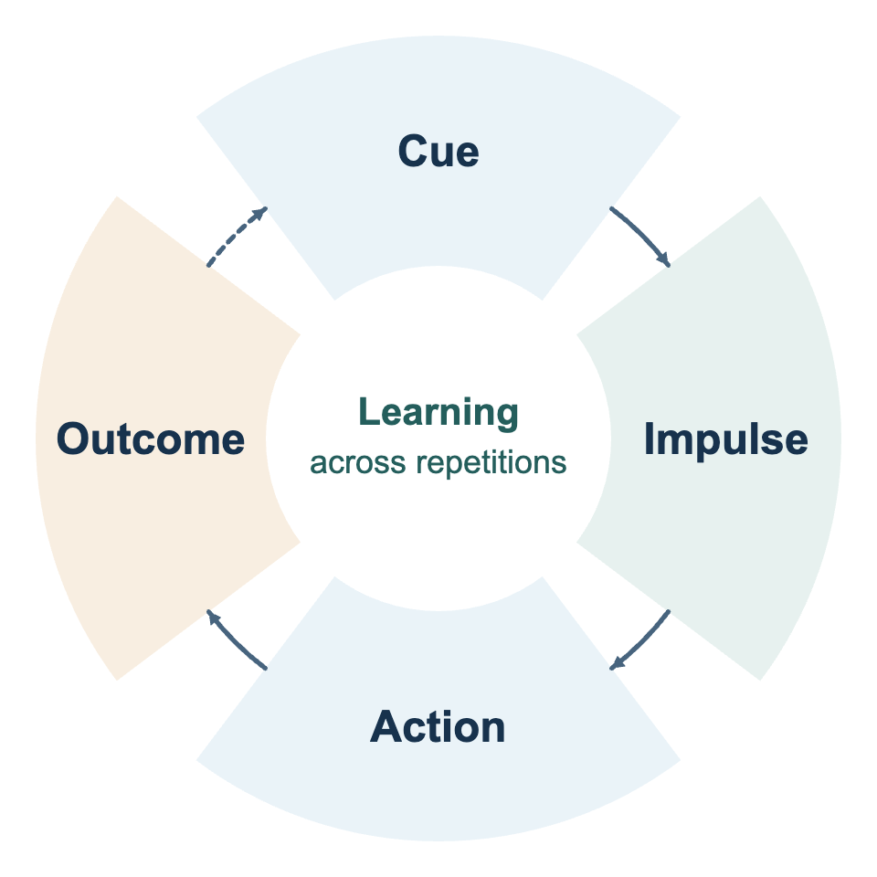<figcaption>Figure 19.1. Habits strengthen when cues repeatedly trigger responses that deliver reward or relief.</figcaption></figure>

Habits form through repetition in stable contexts, especially when behavior produces reward or relief. At first, a behavior may require intention. A person decides to meditate, run, write, save, practice, or avoid checking the phone. The action is effortful because the cue-response association is weak. The person must remember, initiate, and persist.

Automaticity develops gradually and varies substantially by behavior and person rather than following a fixed 21-day rule (Lally et al., 2010).

Habits are learned context-response associations that strengthen through repetition in stable settings; frequency alone is not the definition of habit (Wood et al., 2002; Wood & Neal, 2007; Wood & Rünger, 2016).

With repetition, the context begins to cue the response. The behavior becomes easier, faster, and less dependent on conscious motivation. Lally et al. (2010) studied everyday habit formation and found that automaticity increased gradually, often over weeks or months, with large variation across behaviors and people. The popular claim that habits form in exactly twenty-one days is too simple. Complexity, reward, consistency, context, and personal circumstances all matter.

Habit formation depends on several conditions. First is repetition: the behavior must occur often enough for the association to strengthen. Second is context stability: the behavior should occur in a similar situation so the cue can attach to the response. Third is reward or relief: the behavior must produce something the system treats as valuable. Fourth is ease: behaviors that are easy to perform are more likely to repeat. Fifth is attention at the beginning: early habit formation often requires conscious design before automaticity can take over.

This is why a vague intention such as "I will exercise more" is weak. It lacks cue, action, context, and reward. A stronger habit structure is: after I finish lunch, I put on walking shoes and walk for ten minutes around the same route; afterward I mark the calendar. The cue is lunch. The response is shoes and walking. The context is stable. The reward is immediate enough. The repeated loop can become automatic.

The science of habit formation supports a practical principle: a behavior becomes easier to repeat when it is attached to a stable cue and followed by a meaningful reward or relief.

## Context is the hidden engine

People often overestimate the role of motivation and underestimate the role of context. Context includes the physical, social, digital, temporal, and emotional environment in which behavior occurs. It includes what is visible, easy, nearby, expected, socially rewarded, timed, and emotionally present. It includes the body state in which the behavior is attempted.

Context matters because habits are cue-driven. When a context has repeatedly preceded a behavior, the context itself can activate the response. The person may experience this as an urge, an impulse, or simply "finding myself doing it." A desk can become an email cue. A sofa can become a streaming cue. A silence in a meeting can become a cue to fill the space. A critical tone can become a cue to defend. A commute can become a cue for coffee, news, or anxiety.

This is why changing context can disrupt habits. Moving house, starting university, changing jobs, beginning a new semester, becoming a parent, traveling, joining a new team, or changing a calendar can weaken old cues and create openings for new behavior. This is sometimes called the habit discontinuity effect. The fresh start effect works best when the temporal landmark also changes cues, routines, and expectations.

Context also explains why self-control often looks like character but operates like design. People with apparently strong self-control may not be constantly resisting temptation. They may have arranged environments so that temptations are less frequent and desired behaviors are easier. A person who does not keep sweets at home does not resist them every evening. A person who charges the phone outside the bedroom does not resist it at midnight. A person who works in a library does not overcome the sofa all day. A person who joins a running group does not generate social motivation alone.

This does not remove responsibility. It relocates responsibility from heroic moment-by-moment resistance to intelligent environment design. A useful question is: what behavior does this context make easy? The answer often predicts behavior better than stated intention.

## The habit loop

A habit loop is a practical model for repeated behavior: cue, urge or craving, response, reward or relief, and learning. The cue tells the system that a behavior is available. The urge is the motivational state: desire, tension, anticipation, discomfort, curiosity, or the sense that action should happen. The response is the behavior. The reward or relief is the consequence that reinforces the loop. Learning strengthens the cue-response link.

The reward does not have to be pleasure. Relief is often enough. A person checks email to reduce uncertainty. A student procrastinates to escape discomfort. A manager micromanages to reduce anxiety. A person avoids a difficult conversation and feels immediate relief. That relief reinforces avoidance, even if the long-term outcome is worse.

Phone checking illustrates the loop. Cue: a pause, boredom, uncertainty, notification, or difficult task. Urge: "Maybe something happened." Response: unlock, swipe, check, scroll. Reward or relief: novelty, social signal, escape from ambiguity, or temporary reduction of boredom. Learning: pauses become phone-shaped.

Procrastination has a similar structure. Cue: ambiguous task, high standards, fatigue, or fear of evaluation. Urge: escape discomfort and protect self-image. Response: research more, clean, check email, wait for pressure. Reward or relief: temporary freedom from evaluation. Cost: deadline panic, lower quality, and an identity story such as "I work under pressure." Procrastination is often emotion regulation with interest.

Defensiveness in feedback is also a habit. Cue: criticism, correction, silence, or questioning tone. Urge: protect competence, dignity, status, or belonging. Response: explain, interrupt, counterattack, or withdraw. Reward or relief: immediate self-protection. Cost: less learning, lower trust, fewer honest signals. Many relationship problems are automatic protection routines.

The first rule of habit diagnosis is therefore: do not remove a behavior until you understand the local problem it solves. A replacement behavior must answer the same cue more wisely. If the old habit solved uncertainty, the new response must provide a better way to handle uncertainty. If the old habit solved status threat, the new response must preserve dignity while opening learning.

## Reward, relief, and variable reinforcement

Thorndike described the law of effect: behaviors followed by satisfying consequences become more likely. Skinner later developed operant conditioning, showing how reinforcement and punishment shape behavior. Modern reinforcement learning describes how organisms learn from reward, punishment, and prediction error.

Intermittent reinforcement is especially important. A reward that appears unpredictably can make a behavior persistent because the next attempt might produce the reward. Gambling, email, social media, market prices, dating apps, and many digital platforms use variable novelty, social feedback, and uncertainty. The user does not know when the next interesting message, signal, or reward will appear, so checking continues.

Variable rewards are not magic, and not all digital habits are addiction. But uncertainty keeps prediction active. The brain keeps asking: is this the time something interesting happens? That question can become a behavioral engine.

This matters ethically. A language-learning app can use streaks and feedback to support a learner's endorsed goal. The same psychological architecture can also harvest attention, hide costs, or make exit difficult. Habit design can serve agency or capture it.

*Table 19.1  Conscious and habitual control*

| Dimension | Conscious decision | Habitual behavior | Practical implication |
| --- | --- | --- | --- |
| Value source | Current goals and predicted consequences. | Past reinforcement in a specific context. | Ask whether the behavior still serves current goals. |
| Flexibility | High: adapts to new information and changed goals. | Lower: repeats learned response when cue appears. | Use conscious review when context changes. |
| Awareness | Often reportable before action. | Often noticed after action has begun. | Study cues, not only explanations. |
| Cognitive cost | High: attention-hungry and effortful. | Low: fast and efficient. | Make good routines automatic when stakes are recurring. |
| Failure mode | Overthinking, delay, rationalization, or analysis paralysis. | Rigidity, automatic relapse, context capture. | Match the mode of control to the environment. |

*Table 19.2  Diagnosing common loops*

| Habit example | Cue | Urge or craving | Reward or relief | Better replacement |
| --- | --- | --- | --- | --- |
| Phone checking | Pause, notification, hard task, boredom. | Maybe something happened; escape uncertainty. | Novelty, social signal, relief from boredom. | Scheduled check plus capture note; phone outside reach during deep work. |
| Procrastination | Ambiguous task, high standards, fatigue. | Escape evaluation and uncertainty. | Temporary relief; self-image protection. | Two-minute next action; clarify the first visible step; ask for criteria. |
| Defensiveness | Criticism, correction, silence, questioning tone. | Protect competence and status. | Immediate dignity protection. | Breathe once; ask one example or diagnostic question before explaining. |
| Reactive concession | Offer rejected; silence at the table. | Reduce tension; avoid conflict. | Immediate relief and apparent progress. | Pause; ask what assumption makes the offer hard before changing the number. |
| Organizational blame | Error, missed target, bad news. | Protect status and assign responsibility quickly. | Emotional certainty; temporary control. | Run a learning review: what did the system make likely and what must change? |

## Key ideas

- A habit is a learned cue-response pattern. The decision loop still exists functionally, but prediction and value have been compressed into an automatic response that the context can trigger before deliberation fully arrives.
- Define habits as context-response learning rather than frequency alone.
- Distinguish goal-directed and habitual control.
- Map cue, urge, response, reward or relief, and learning.

## Study and practice

1. Define habits as context-response learning rather than frequency alone?

2. How would you distinguish goal-directed and habitual control?

3. How would you map cue, urge, response, reward or relief, and learning?

<aside class="callout activity">
ACTIVITY

Choose one repeated behavior. Identify the cue, urge, response, immediate reward or relief, delayed cost, and context. Do not propose a solution until you can state the local problem the habit solves. EXPERIENCE - EXPLAIN - APPLY (MAXIMUM 120 WORDS) Experience: describe one specific decision, interaction, or observation. Explain: use one or two concepts from this chapter accurately. Apply: state one improvement, implication, or testable prediction.
</aside>

# Chapter 20. Wanting, Craving, and Self-Control

*Why the action can remain compelling after pleasure fades*

<aside class="callout core-idea">
CORE IDEA

Wanting, liking, and choosing can separate. Self-control improves when an urge is treated as a prediction and bodily event rather than as a command or a moral verdict.
</aside>

## Learning goals

- Distinguish wanting from liking.
- Explain dopamine in learning and incentive salience rather than as simple pleasure.
- Explain addiction as more than a bad habit or weak will.
- Use craving observation, situation selection, and precommitment.

A major source of misunderstanding in habits and addiction is the confusion between wanting and liking. People often assume that if someone strongly wants something, they must strongly like it. This is not always true.

Liking refers to pleasure or hedonic enjoyment. It is the experienced pleasure of eating, drinking, resting, laughing, winning, being touched, or feeling relief. Wanting refers to motivational pull. It is the "go get it" force that makes a cue or option feel compelling. In neuroscience, wanting is closely related to incentive salience: the process by which cues become motivationally charged.

Dopamine is often described in popular language as the pleasure chemical. That is misleading. Dopamine is strongly involved in learning, prediction, pursuit, and the energizing of action. Pleasure itself depends on additional systems, including opioid and endocannabinoid mechanisms in particular hedonic hotspots. Dopamine helps make rewards and reward cues wanted; it is not simply the feeling of liking.

This distinction explains everyday experience. A person may want to check the phone but not enjoy the content. A person may crave a cigarette but dislike the taste. A person may feel pulled toward a snack but feel disappointed after eating it. A person may pursue status while finding the pursuit stressful. A person may keep refreshing email without liking the experience. Wanting says: go get it. Liking says: this is pleasant.

Evolutionarily, this separation makes sense. Organisms must pursue food, sex, connection, safety, information, and status before they can enjoy them. A system that motivates pursuit cannot wait until pleasure is already present. It must be triggered by cues that predict possible reward. But this creates vulnerability. A cue can activate wanting even when the resulting experience is no longer very pleasurable.

A useful self-control question is: do I actually like this, or do I mainly want it? The answer can reveal whether the loop is being driven by enjoyment, relief, prediction, identity, or policy strength.

## Addiction is more than a bad habit

Addiction is often described as a bad habit, but this is incomplete. Addiction involves habit-like learning, but it is more severe, more compulsive, and more biologically and socially complex. It can involve substances such as alcohol, nicotine, opioids, stimulants, or other drugs. It can also involve behavioral patterns such as gambling, though not every repeated high-wanting behavior should be casually labeled addiction.

Clinical addiction involves impaired control, craving, continued use despite harm, and significant impairment or distress. Depending on the substance or behavior, it may also involve tolerance, withdrawal, medical risk, social disruption, trauma, and co-occurring mental health problems.

The incentive-sensitization theory of addiction argues that repeated drug use can sensitize neural systems of wanting, making drug-related cues increasingly able to trigger intense motivation. The person may not like the drug as much as before, but cues can still produce powerful wanting. This helps explain why addiction can persist even when pleasure declines. A person may say, "I do not even enjoy it anymore," yet still feel compelled.

Addiction also involves relief learning. Substance use may begin as pleasure but continue as negative reinforcement: relief from withdrawal, anxiety, pain, shame, or dysphoria. Over time, the person may use not to feel good but to stop feeling bad.

Moralizing addiction is ineffective and harmful. Addiction is not simply choosing pleasure over responsibility. It often involves altered learning, sensitized wanting, withdrawal, stress systems, environmental cues, social context, trauma, mental health, availability, and identity. At the same time, addiction is not destiny. Treatment can help. Depending on the case, support may include medication, therapy, contingency management, motivational interviewing, recovery groups, social support, environmental change, treatment of co-occurring mental health problems, and harm reduction.

The practical distinction is important: ordinary habit change asks how to make a behavior easier or harder. Addiction treatment often must also address craving, withdrawal, sensitized cues, stress, identity, social environment, and medical risk. This distinction prevents two mistakes: treating addiction as mere habit, and treating ordinary habits as if every strong urge were clinical addiction.

## Craving as sensation and prediction

<figure class="book-figure">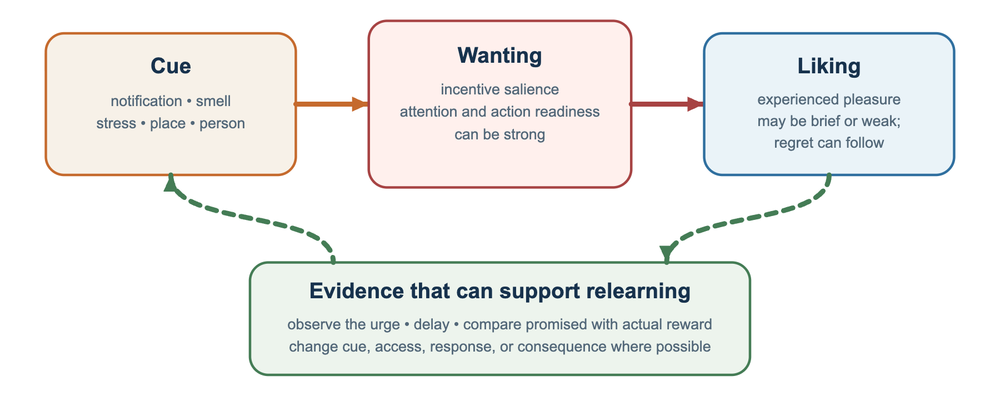<figcaption>Figure 20.1. Craving is a prediction and action tendency; comparing promised reward with actual experience creates room for relearning.</figcaption></figure>

A craving can feel like a command. But an urge is not an action. It is an experience. Many self-control and mindfulness-based approaches teach people to observe cravings as sensations that rise, change, and pass. This is sometimes called urge surfing.

A craving may include bodily sensations, mental images, verbal thoughts, emotions, and action impulses. It may feel like tension in the chest, heat in the face, restlessness in the hands, an image of the desired object, a thought such as "just once," or an urge to move. When the craving is not examined, it appears as a single force: I need this. When examined, it becomes a collection of changing sensations and predictions. That can weaken its authority.

A craving also contains a prediction. It predicts that doing the behavior will bring relief, pleasure, completion, escape, or control. Sometimes that prediction is accurate in the short run. Often it is exaggerated. The cigarette may reduce withdrawal briefly but deepen the cycle. The phone may reduce boredom briefly but leave the person scattered. The angry reply may feel powerful briefly but damage trust. The snack may reduce discomfort briefly but not solve the emotion beneath it.

A useful self-control question is: what is this craving promising, and what usually happens after I obey it? That question turns craving from a command into a hypothesis.

## The intention-behavior gap

Many people know what they want to do and still fail to do it. They intend to exercise but do not. They intend to save but spend. They intend to listen but interrupt. They intend to study but scroll. They intend to sleep but keep watching. They intend to prepare for a negotiation but improvise. They intend to give feedback calmly but become defensive.

This is the intention-behavior gap. Intentions matter, but they predict behavior imperfectly. One reason is that intentions are often abstract. "I will exercise more" does not specify when, where, how, or in response to what cue. Abstract intentions must be remembered, protected from competing motives, and translated into action at the right moment. Habits, by contrast, are cue-linked.

A second reason is that intentions are often formed in cool states but executed in hot states. A person plans to eat well when full, but encounters dessert when tired and stressed. A student plans to study in the morning, but feels bored and anxious when the difficult work begins. A manager plans to listen, but feels status threat when challenged. Loewenstein called this the hot-cold empathy gap: people underestimate how much preferences and behavior change across visceral states such as hunger, craving, anger, fear, pain, fatigue, and arousal.

A third reason is that environments are often designed against intentions. If unhealthy food is visible, notifications are constant, meetings reward fast talking, and social norms celebrate overwork, individual intention must fight the environment repeatedly. The environment usually wins.

A fourth reason is that immediate rewards are concrete while long-term rewards are abstract. The pleasure of scrolling, eating, avoiding, or buying is immediate. The benefits of health, learning, savings, trust, or reputation are delayed. Temporal distance weakens value. Behavior change becomes easier when long-term goals are translated into immediate cues, actions, and rewards.

## Self-control without heroics

Self-control is often imagined as an internal battle: the rational self fights temptation, and success depends on willpower. There is some truth here. People sometimes need to inhibit impulses. But the willpower model is too narrow.

Beneficial self-control often operates upstream through situation selection and reliable habits rather than constant resistance at the moment of temptation (Galla & Duckworth, 2015; Duckworth et al., 2016).

The influential ego-depletion theory proposed that self-control draws on a limited resource that can become depleted after use. The idea became widely known: self-control is like a muscle that gets tired. Later replication efforts and meta-analyses, however, raised serious questions about the size and reliability of the effect. The evidence no longer supports a simple fuel-tank model.

A better applied view is that self-control depends on motivation, attention, beliefs, emotions, opportunity, fatigue, reward, identity, social support, and situation. People may shift away from effortful control when it feels unrewarding, when attention is captured elsewhere, when temptation is salient, or when the goal no longer feels valuable.

People with strong self-control often do not succeed by constantly resisting temptation. They succeed by avoiding tempting situations, creating routines, changing environments, and making desired behavior easier. Good self-control often looks less like heroic resistance and more like wise design.

A person who keeps no cigarettes at home does not resist smoking at home. A student who studies in the library does not resist the bed. A person who turns off notifications does not resist every alert. A family that prepares healthy meals in advance does not decide under hunger and fatigue. A negotiator who writes a reservation price before entering the room does not invent discipline under pressure.

The design question is not "How do I become someone with infinite willpower?" The better question is: how do I make the desired action less dependent on willpower?

*Table 20.1. Intervene before the peak of temptation*

| Stage | Tool | Why it helps |
| --- | --- | --- |
| Before the cue | Situation selection, availability, precommitment. | Prevents the strongest loop from being activated. |
| At the cue | Prompt, if–then plan, replacement action. | Makes the desired response retrievable. |
| During the urge | Name sensations, urge surf, delay, BRAIN/RAIN. | Turns a command into a changing experience. |
| After action | Immediate feedback and nonmoralizing review. | Updates the promised reward against the actual experience. |
| After lapse | Recovery plan and next-cue restart. | Prevents one lapse from becoming an identity and a streak. |

## Creating space between cue and response

Mindfulness is the practice of paying attention to present-moment experience with openness, curiosity, and reduced automatic reactivity. Meditation is one way to train this capacity. In the context of habits and self-control, mindfulness matters because it creates space between cue and response.

A cue appears. The body reacts. A thought arises. A craving forms. An impulse pushes toward action. Normally, the response happens automatically. Mindfulness inserts awareness into the sequence. Instead of "I need to check my phone," the person notices, "Restlessness is here." Instead of "I must eat something," the person notices, "Anxiety feels like hunger." Instead of "I have to reply angrily," the person notices, "My body is preparing to defend."

This shift is sometimes called decentering or cognitive defusion: thoughts and urges are experienced as mental events rather than as facts or commands. The person is not eliminating the urge. They are changing their relationship to it.

Mindfulness is not a cure-all. It does not replace medical treatment, social support, behavior design, or structural change. For some people, especially those with trauma histories, intensive meditation can be difficult or destabilizing if not properly supported. It should be presented as a useful tool, not a universal solution or moral demand.

A practical classroom tool is BRAIN, a short adaptation of mindfulness methods such as RAIN. BRAIN is useful when an internal trigger appears: craving, anger, anxiety, boredom, shame, avoidance, or defensiveness.

<aside class="callout evidence-and-boundary-conditions">
EVIDENCE AND BOUNDARY CONDITIONS

Dopamine is not a unitary pleasure chemical. It participates in learning, prediction, motivation, and action across distributed circuits.
</aside>

<aside class="callout evidence-and-boundary-conditions">
EVIDENCE AND BOUNDARY CONDITIONS

Clinical addiction can involve withdrawal, medical risk, trauma, and comorbidity. Ordinary habit advice is not a substitute for professional treatment.
</aside>

## Key ideas

- Wanting, liking, and choosing can separate. Self-control improves when an urge is treated as a prediction and bodily event rather than as a command or a moral verdict.

Wanting, liking, and choosing depend on partly separable processes; dopamine is more closely tied to learning, incentive salience, and pursuit than to pleasure itself (Berridge & Robinson, 1998, 2003; Schultz et al., 1997).

- Distinguish wanting from liking.
- Explain dopamine in learning and incentive salience rather than as simple pleasure.
- Explain addiction as more than a bad habit or weak will.

## Study and practice

1. How would you distinguish wanting from liking?

2. How would you explain dopamine in learning and incentive salience rather than as simple pleasure?

3. How would you explain addiction as more than a bad habit or weak will?

<aside class="callout activity">
ACTIVITY

Choose a behavior you sometimes want more than you like. Write what the urge promises, what usually happens after obeying it, and one way to observe the urge for sixty seconds without acting. EXPERIENCE - EXPLAIN - APPLY (MAXIMUM 120 WORDS) Experience: describe one specific decision, interaction, or observation. Explain: use one or two concepts from this chapter accurately. Apply: state one improvement, implication, or testable prediction.
</aside>

# Chapter 21. Designing Behavior

*Cues, ability, prompts, friction, plans, identity, and recovery*

<aside class="callout core-idea">
CORE IDEA

Behavior changes when the moment makes the action possible: a cue is noticed, the behavior is easy enough, a prompt arrives, and the immediate consequence supports repetition.
</aside>

<figure class="book-figure">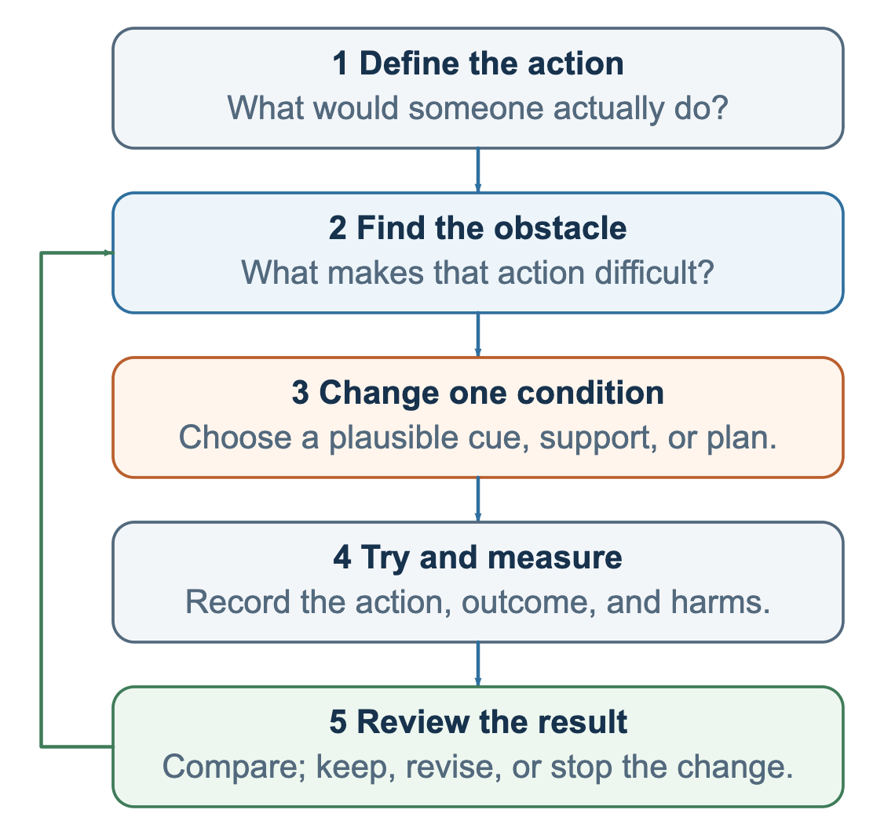<figcaption>Figure 21.1. Behavior design works best upstream: environment, motivation, ability, prompts, and recovery plans reinforce one another.</figcaption></figure>

## Learning goals

- Use implementation intentions and WOOP.
- Diagnose behavior with B=MAP and COM-B.
- Change friction, prompts, defaults, context, and immediate reward.
- Evaluate behavior design for autonomy, welfare, transparency, and reversibility.

Behavior change is difficult because habits are cue-based, rewards are immediate, and environments are powerful. But several tools reliably improve the odds. A useful toolkit begins with diagnosis rather than prescription.

COM-B is a simple diagnostic model: behavior occurs when capability, opportunity, and motivation converge. Capability asks whether the person can do the behavior: do they have skill, knowledge, energy, and physical ability? Opportunity asks whether the environment, time, tools, social context, and system make the behavior possible. Motivation asks whether reflective and automatic processes point toward the behavior. A motivational speech cannot fix a broken opportunity structure.

The Fogg Behavior Model offers a complementary lens: behavior happens when motivation, ability, and prompt converge. For repeated behavior, making action easier often beats trying to make motivation permanently higher. Motivation is weather. Ability and prompts are architecture.

Implementation intentions turn vague goals into cue-linked behaviors. Instead of saying "I will study more," a student says: "If I finish breakfast on weekdays, then I open the lecture notes for twenty-five minutes before email." Instead of "I will be less defensive," a manager says: "If I receive criticism, then I ask one clarifying question before explaining." Instead of "I will save money," a person says: "If I receive my salary, then I transfer 10 percent to savings immediately."

WOOP adds a useful self-regulation bridge: Wish, Outcome, Obstacle, Plan. The person identifies a meaningful wish, imagines the valued outcome, identifies the real internal or contextual obstacle, and forms an if-then plan. WOOP works because it refuses fantasy while preserving agency. It asks people to connect a valued future to the obstacle that will actually appear.

Friction is a behavioral force. To increase a behavior, reduce friction. To decrease a behavior, increase friction. Keep the book visible and the phone away. Remove saved payment information. Put exercise clothes by the bed. Create a meeting template. Make near-miss reporting simple and nonpunitive. Require a decision question before scheduling a meeting. Many behaviors live near the margin; small barriers and small ease can have large effects.

Temptation bundling attaches an immediate reward to a beneficial behavior whose benefits are delayed. A person might listen to a favorite podcast only while exercising, drink special coffee only while reading difficult material, or meet a friend only after a study session. The bundle works best when the tempting reward is reserved for the desired behavior and does not sabotage the goal.

Precommitment protects future behavior from predictable future states. Examples include automatic savings, self-imposed or externally structured deadlines, app blockers, accountability partners, public commitments, smaller plates, cancellation penalties, locked accounts, or working with a partner. A good commitment device preserves dignity and allows recovery after failure. A bad one creates shame without changing the loop.

Identity can support behavior change when behavior becomes evidence for the kind of person one is becoming. "I am trying to run" is different from "I am becoming a runner." "I am trying to be more careful" is different from "I am someone who checks assumptions." But identity can also trap. "I am a procrastinator," "I am bad with money," and "I work best under pressure" can become instructions. The healthiest identity statements are process-based and flexible: "I am becoming someone who practices."

Relapse planning prevents all-or-nothing collapse. A lapse tells you which cue, state, or friction you underestimated. The question is not "What is wrong with me?" but "What did the loop learn?" A useful plan is: if I miss once, then I restart at the next cue. A lapse is not a verdict; it is a bug report.

## Applications under pressure

Habits matter in this course because decision, persuasion, and negotiation skills usually fail under pressure. The goal is not only to know the right concept, but to have a prepared response when the cue appears.

Decision habits make good judgment easier before analysis begins. Examples include pausing before a high-stakes decision, writing the opportunity cost, asking for the base rate, separating prediction from valuation, running a premortem, checking whether the current evidence would change the decision, and recording assumptions before the outcome is known. These habits protect judgment from vivid anecdotes, overconfidence, and outcome bias.

Persuasion habits shift the focus from one-off messaging to ethical behavior architecture. A persuader asks what the audience already believes, what cue will make the behavior visible, what obstacle makes the desired behavior hard, what immediate reward or feedback can support it, and whether the design preserves autonomy. Persuasion becomes questionable when it hides the trigger, exploits vulnerability, makes exit difficult, or optimizes compliance over welfare.

Negotiation habits are scripts for pressure. Preparation should become automatic before tactical advice is introduced. A negotiator can habitually prepare BATNA, reservation value, aspiration, issues, interests, options, and questions. During the negotiation, useful automatic scripts include: pause before conceding; label tension; ask what assumption makes the proposal hard; ask which issue matters most; summarize before disagreeing; debrief after the outcome. Under pressure, people rarely rise to their abstract values. They fall to rehearsed scripts.

The same habit logic operates across the course: decision habits protect thought, persuasion habits design transparent paths, and negotiation habits prepare behavior for stress.

## Organizational habits

Habits do not exist only in individuals. Organizations have habits too. They are usually called routines: repeated patterns of behavior involving multiple people, roles, tools, and expectations. Organizations have routines for hiring, meetings, budgeting, customer service, safety checks, product launches, promotions, conflict, reporting, and crisis response. Some routines are written procedures. Others are unwritten habits: how people really do things.

Routines store organizational knowledge, coordinate action, reduce uncertainty, and allow complex work to happen without constant redesign. They can be valuable. A hospital checklist can prevent errors. A manufacturing routine can ensure quality. A customer service routine can create reliability. A research lab routine can preserve standards. A meeting routine can clarify decisions. A safety routine can protect lives.

But organizational routines can also become traps. A team may automatically punish bad news, leading people to hide problems. A company may approve projects because senior leaders like them, not because evidence supports them. A meeting may always begin with updates rather than decisions, wasting attention. A sales team may chase short-term revenue even when it damages trust. A committee may delay action by asking for more information even when the information will not change the decision. A leadership team may respond to failure with blame rather than learning.

These patterns persist because they have rewards. Blame provides immediate emotional relief. Avoiding conflict preserves temporary harmony. Delaying a decision reduces responsibility. Overworking signals commitment. Saying yes to senior leaders protects status. Focusing on measurable metrics creates clarity. These rewards may be short-term, but they maintain routines.

Changing organizational habits requires more than announcing new values. If an organization says "we value learning" but punishes every mistake, the real habit remains blame. If it says "we value innovation" but rewards only predictable success, the real habit remains caution. If it says "we value collaboration" but promotes individual heroes, the real habit remains competition.

To change organizational habits, leaders must change cues, incentives, scripts, roles, and feedback. If the goal is psychological safety, meetings must include routines for dissent, questions, and nonpunitive error discussion. If the goal is better hiring, the cue of "candidate interview" must trigger structured criteria rather than informal impressions. If the goal is better decisions, major proposals must trigger premortems, outside-view analysis, and decision logs. If the goal is customer focus, dashboards must show customer outcomes, not only internal efficiency.

A culture is not what an organization says. It is what it repeatedly does.

## Mini-case: the defensive meeting loop

A product team says it wants psychological safety and better decisions. Yet every Monday meeting follows the same pattern. A project lead presents progress. A senior manager asks a skeptical question. The project lead hears the question as criticism and begins explaining why the team made reasonable choices. Other members go quiet. The manager interprets the defensiveness as lack of ownership and asks more pointed questions. The project lead becomes more defensive. The meeting ends with action items but little learning.

Nobody intended to create this pattern. The senior manager intended to improve the project. The project lead intended to protect the team. Other members intended to avoid conflict. But together they created a routine.

A habit analysis changes the diagnosis. The cue is a skeptical question in a public meeting. The urge is self-protection and status defense. The response is explanation, interruption, or withdrawal. The immediate reward is dignity protection and temporary certainty. The long-term cost is weaker learning, less candor, and a stronger belief that meetings are unsafe.

A redesigned routine would not begin with a motivational speech about openness. It would change the loop. Before each update, the team names one uncertainty and one assumption that could be wrong. The manager asks: "What would be most useful for us to challenge?" The project lead has an implementation intention: if a question feels like criticism, then I will first ask, "Can you say more about the risk you are seeing?" A second person is assigned to summarize the strongest concern before action items are set. The meeting ends with one learning note, not only tasks.

The new routine gives the old cue a better response. Critique no longer automatically means status threat. It becomes information. The reward shifts from self-protection to useful clarity. Over time, the team can learn that disagreement is not danger but data.

This case illustrates the deepest practical lesson of habit science: do not rely on the self you hope will appear in the moment. Design for the self and the team that will actually be there.

## Habit design is power

Understanding habits creates power. If cues trigger behavior, the person who controls cues has power. If friction shapes action, the person who sets friction has power. If defaults make one behavior feel normal, the person who sets the default has power. If variable rewards keep attention searching, the person who designs the reward schedule has power.

This power can be used ethically or manipulatively. Ethical habit design helps people do what they would endorse under reflection. It clarifies information, reduces needless friction, protects autonomy, supports long-term welfare, and creates feedback that reveals whether the intervention helps. Manipulative design hides triggers, exploits vulnerability, captures attention, makes exit difficult, or optimizes the designer's goal at the decision-maker's expense.

The ethical question is not simply whether an intervention works. It is what kind of person, relationship, organization, and world the loop helps create. A study routine, safety checklist, or negotiation preparation script can expand agency. A dark pattern, addictive engagement loop, or shame-based commitment device can reduce it.

Good habit design should pass five tests: autonomy, transparency, welfare, reversibility, and evidence. Does the person retain meaningful choice? Would the design survive explanation? Does it serve the person's endorsed goals? Can the person exit or revise the loop? Will feedback reveal benefits and harms rather than hiding them in flattering metrics?

## Designing a life that decides well

The chapter began with a simple idea: repeated behaviors stop feeling like decisions. They become habits. This can sound discouraging, but it is also hopeful. If bad habits can become automatic, good habits can too.

A good life does not require making every good decision from scratch. It requires building systems that make good decisions more likely. A person who wants to become healthier can rely on daily motivation, but motivation fluctuates. A habit-based approach designs the environment: exercise clothes placed by the bed, workouts scheduled with a friend, healthy food prepared in advance, snacks kept out of sight, walking built into commuting, sleep routines protected, and progress tracked. The person is not stronger every day. The system is stronger.

A student who wants to learn better can promise to study harder. A habit-based approach creates a fixed study location, blocks distracting websites, uses short timed sessions, begins with a specific cue, reviews notes after class, asks questions weekly, and studies with others at scheduled times. Learning becomes less dependent on mood.

A manager who wants to listen better can promise to be more open. A habit-based approach uses a meeting rule: ask two questions before giving an opinion, summarize the other person's point before disagreeing, and end by asking what was not said. Listening becomes a routine.

An organization that wants better decisions can tell people to be rational. A habit-based approach creates decision templates, requires alternatives and opportunity costs, assigns a devil's advocate, uses premortems, logs predictions, and reviews outcomes without blame. Decision quality becomes a routine rather than a personality trait.

Do not rely on the self you hope will appear in the moment. Design for the self who will actually be there: tired, hungry, rushed, proud, threatened, distracted, tempted, social, and human. Good systems respect that reality.

Chapter 18 showed how the narrating self can rationalize actions after they occur. Habits explain how repeated behavior can happen without much deliberation. Rationalization explains what often happens afterward: the mind tells a story about why the behavior made sense. To improve decisions, we need to understand not only how habits act, but how the self explains them.

## Digital habits and attention defense

Modern habit science is incomplete without the digital environment. Phones, feeds, platforms, games, messaging systems, market dashboards, and work tools compress cues, rewards, social signals, novelty, and friction into portable loops. A phone is not one habit. It is a pocket full of habits: communication, status checking, escape, uncertainty reduction, entertainment, work monitoring, shopping, comparison, outrage, and reassurance.

Digital habits are sticky because they combine several behavioral forces. The cue is always nearby. The action requires little effort. The reward is variable: sometimes a message, sometimes a like, sometimes a problem, sometimes nothing. The feedback is fast. The loop can begin in many contexts: bed, classroom, meeting, family dinner, commute, work break, or boredom. The same device collapses contexts that used to be separate.

## Fresh starts, identity, and social context

Several themes from the source chapters deserve explicit integration because they keep behavior change from becoming a purely individual or motivational story. Habits are supported by stable contexts. When contexts change, old habits may weaken and new ones may become possible. But contexts are not only physical. They are also social and identity-based. People repeat behaviors partly because those behaviors answer the question: What do people like us do, and who am I becoming when I do this?

## Portable habit scripts

Decision, persuasion, and negotiation are learned practices. Students do not improve only by learning definitions. They improve when better behaviors become easier, prompted, rewarded, protected, ethically embedded, and connected to obstacle-sensitive plans. A portable habit script converts a principle into a cue-linked action that can survive pressure.

## Relapse, recovery, and ethics

Behavior change almost always includes lapses. A lapse is not a verdict on identity. It is a bug report from the loop. It tells the designer which cue, state, reward, friction, social pressure, or obstacle was underestimated. A good design therefore includes recovery before failure occurs.

<aside class="callout evidence-and-boundary-conditions">
EVIDENCE AND BOUNDARY CONDITIONS

The classic ego-depletion account of willpower as a depletable resource has faced serious replication and measurement challenges. Fatigue, motivation, beliefs, opportunity costs, and context still matter, but no single &quot;willpower fuel&quot; should be assumed.
</aside>

*Table 21.1  Behavior-change tools and their best uses*

| Tool | Best used when... | Example |
| --- | --- | --- |
| Implementation intention | The goal is clear but follow-through fails at the critical moment. | If I feel the urge to explain during feedback, then I ask one clarifying question first. |
| WOOP | Positive intention needs an honest obstacle and a concrete plan. | Wish: prepare earlier. Outcome: calm negotiation. Obstacle: vague starting point. Plan: if unclear, then write three interests. |
| Friction design | The behavior is sensitive to small barriers or ease. | Phone outside bedroom; saved card removed; document opened before leaving work. |
| Temptation bundling | The desired behavior has delayed benefits and needs immediate reward. | Only listen to a favorite audiobook while walking. |
| Precommitment | Future states predictably defeat current intentions. | Automatic savings, scheduled class, app blocker, accountability partner. |
| Context change | Old cues keep recruiting the old behavior. | Use a new study location, new commute, new meeting script, or new semester routine. |
| BRAIN / urge surfing | The urge is already active and cannot be avoided upstream. | Breathe, recognize, allow, investigate, non-identify, then choose. |
| Relapse plan | A missed repetition could become identity proof. | If I miss once, then I restart at the next cue with the smallest version. |

## Key ideas

- Behavior changes when the moment makes the action possible: a cue is noticed, the behavior is easy enough, a prompt arrives, and the immediate consequence supports repetition.

Mental contrasting, friction, prompts, defaults, and context change influence whether motivation becomes behavior (Oettingen, 2012; Johnson & Goldstein, 2003; Dai et al., 2014).

Implementation intentions strengthen the link between a specified cue and a planned response, especially when paired with a meaningful goal (Gollwitzer, 1999; Gollwitzer & Sheeran, 2006).

- Use implementation intentions and WOOP.
- Diagnose behavior with B=MAP and COM-B.
- Change friction, prompts, defaults, context, and immediate reward.

## Study and practice

1. How would you use implementation intentions and woop in practice?

2. Diagnose behavior with B=MAP and COM-B?

3. Change friction, prompts, defaults, context, and immediate reward?

<aside class="callout activity">
ACTIVITY

Design a one-week intervention for one behavior. Specify the cue, smallest viable action, ability or friction change, prompt, immediate reward, measurement, recovery plan, and ethical check. EXPERIENCE - EXPLAIN - APPLY (MAXIMUM 120 WORDS) Experience: describe one specific decision, interaction, or observation. Explain: use one or two concepts from this chapter accurately. Apply: state one improvement, implication, or testable prediction.
</aside>

# Part 4. The Social Mind

How other people become models, mirrors, evidence, audiences, norms, and authorities.

# Chapter 22. Social Learning, Mimicry, and Attribution

*How other people become models, mirrors, and causal explanations*

<aside class="callout core-idea">
CORE IDEA

Humans use other people as information, models, audiences, and regulators. Social learning is a superpower whose cost is vulnerability to copied errors, status signals, and self-serving social stories.
</aside>

## Learning goals

- Explain cumulative culture and overimitation.
- Explain mimicry as social coordination.
- Distinguish situational and dispositional attribution.
- Use an attribution flip and perspective-getting question before treating a social interpretation as fact.

A solitary learner must discover every causal relation through personal trial and error. A social learner can watch, listen, imitate, ask, and inherit. The difference is enormous. A child does not derive a language from first principles. A medical student does not independently rediscover germ theory. A new employee learns which spreadsheet matters, which deadline is real, and which sentence from the formal procedure everyone quietly ignores.

Cumulative culture depends on social transmission with enough fidelity to preserve useful practices and enough variation to improve them. Human groups can retain techniques whose causal structure is not obvious to any one learner. Over generations, tools and institutions become more complex than a single person could plausibly invent alone (Boyd & Richerson, 1985; Henrich, 2016; Tomasello, 1999).

Social learning therefore solves an information problem. When direct evidence is expensive, ambiguous, or unavailable, another person's behavior becomes a cue. If several experienced hikers turn back from a trail, their action may be better evidence than the blue sky above you. If every clinician in a unit checks a particular sign before discharge, the routine may contain knowledge that has not yet been made explicit.

The same mechanism creates vulnerability. People may copy a fashion because it is visible, a rumor because it is repeated, or a dangerous norm because everyone else appears calm. Social information is valuable precisely because it often works. A counterfeit signal is powerful only because the genuine signal is usually worth using.

This reframes influence. A person who follows others is not necessarily weak. They may be using a rational shortcut under uncertainty. The scientific task is to identify when social evidence is diagnostic and when it is self-generating.

## Copying and cumulative culture

<figure class="book-figure">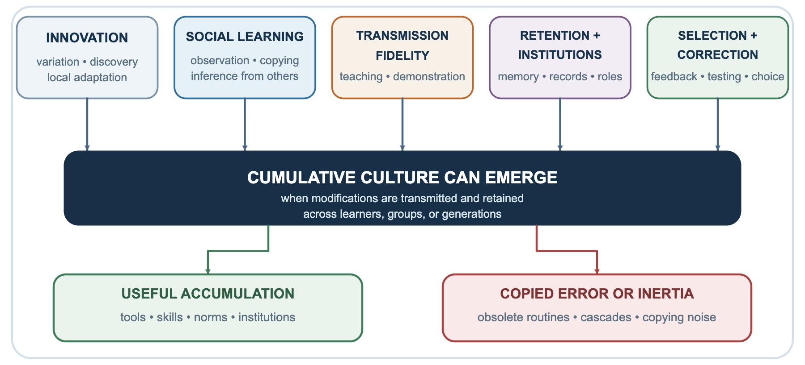<figcaption>Figure 22.1. Social learning supports cumulative culture while also transmitting errors, cascades, and obsolete routines.</figcaption></figure>

In a classic comparison, human children and chimpanzees watched an adult retrieve a reward from a puzzle box. Some demonstrated actions were causally necessary; others were not. When the box was transparent and the mechanism visible, chimpanzees tended to omit irrelevant actions and reproduce the efficient route. Children often copied both relevant and irrelevant steps (Horner & Whiten, 2005).

At first glance, the chimpanzee looks more rational. It extracts the causal structure and ignores theater. Yet children's tendency toward overimitation may serve a different problem. A learner cannot always know which step is irrelevant. A tap, gesture, sequence, or preparation may carry hidden causal information, social meaning, safety value, or conventional significance. High-fidelity copying can preserve opaque practices until their function becomes clear (Lyons et al., 2007).

The lesson is not that children blindly imitate everything. Human copying is sensitive to intention, pedagogy, group membership, convention, and context. Nor is overimitation always beneficial. It can preserve needless bureaucracy as effectively as useful craft. An organization may continue a reporting ritual because "this is how it is done" even after the original risk has vanished.

What looks locally inefficient can be culturally intelligent. What looks culturally faithful can also become institutional inertia.

A practical diagnostic is to ask two questions about a copied practice:

1. What hidden function might this step preserve?

2. What evidence would justify removing it?

The first protects against arrogant simplification. The second protects against ritual without learning.

## Mimicry and synchrony

People in conversation often align without noticing. Posture, facial movements, speech rhythm, word choice, and gestures can become more similar. Chartrand and Bargh (1999) called this the chameleon effect: nonconscious behavioral mimicry that can increase interpersonal smoothness and liking. In service encounters, subtle mimicry has also been associated with greater rapport and prosocial response (van Baaren et al., 2004).

Mimicry is not mind control. Effects vary with relationship, status, group membership, goals, awareness, and how conspicuous the imitation becomes. Obvious copying can feel mocking or manipulative. The useful mechanism is not theatrical duplication but attunement. Two people begin to occupy a more coordinated interactional rhythm.

This matters because persuasion is not only a sequence of propositions. The audience is also evaluating whether the speaker is safe, responsive, sincere, dominant, similar, or attentive. A perfectly logical message delivered without responsiveness may be assigned low weight. A warm and synchronized exchange may increase openness before any central claim changes.

The ethical boundary is straightforward in principle and difficult in practice. Natural adaptation to another person's tempo can communicate attention. Deliberate mimicry used as a covert compliance technique treats rapport as a lever rather than a relationship.

A useful self-check is:

Am I adjusting in order to understand this person, or performing similarity in order to bypass their judgment?

## Attribution

Social life requires causal inference. A colleague misses a deadline. A student remains silent. A supplier asks unusually detailed questions. The mind must decide why.

A dispositional attribution explains behavior through traits, motives, or character: careless, shy, manipulative, uncommitted. A situational attribution explains it through context: conflicting deadlines, unfamiliar language, ambiguous incentives, fear of punishment. Heider (1958) described people as intuitive psychologists, continually inferring the causes of action. Kelley (1967) formalized how information about consistency, distinctiveness, and consensus can support causal judgment.

The difficulty is asymmetry. We usually experience our own situation from the inside and another person's behavior from the outside.

When I am late, I remember the train cancellation, the urgent email, and the child who would not put on shoes. When you are late, I see a person arriving late.

The fundamental attribution error refers to the tendency, especially in some experimental contexts, to underweight situational constraints when explaining others' behavior (Ross, 1977). The effect should not be treated as a universal law of identical strength across all cultures and situations. Attribution varies with perspective, salience, information, motivation, and cultural models of agency. Yet the practical pattern is common enough to damage management and negotiation: "I have reasons; you have personality."

The explanation selected changes the next action. If an employee resists because she is difficult, punishment or exclusion feels appropriate. If she resists because she sees an implementation risk, inquiry becomes useful. If a negotiator asks many questions because he is trying to trap you, defensiveness follows. If he needs information to justify an agreement internally, disclosure can be designed.

Attribution is therefore not merely a belief about the past. It is a policy for the next move.

## The attribution flip

A disciplined attribution flip does not excuse harmful behavior. It delays certainty long enough to improve diagnosis.

Replace:

What is wrong with this person?

with:

What situation, incentive, information gap, identity threat, or system would make this behavior intelligible?

Then ask what evidence would discriminate among explanations.

A silent student may be unprepared. She may also be translating internally, uncertain about the instructor's norm for interruption, or convinced that only polished answers are welcome. A supplier may be unreliable. It may also face a contract that makes your "urgent" order less valuable than another customer's routine order. Better explanations change intervention.

## Self-serving social stories

Attribution becomes more asymmetric when the self is at stake. Success is easy to connect to skill, effort, and judgment. Failure is easier to connect to luck, constraints, or another person's obstruction. Meta-analytic work finds a broad self-serving attributional pattern, although its size and form vary across populations and outcomes (Mezulis et al., 2004).

This bias is not simply vanity. A functioning identity requires some stability. People cannot rebuild their entire self-concept after every setback. The problem appears when identity protection prevents process updating. The self is therefore not only a decision-maker; it is also a reputation manager that selects and revises personal history in identity-protective ways (Greenwald, 1980).

In negotiation, both sides can construct sincerely self-serving views of fairness. Each selects favorable comparison points, remembers concessions differently, and treats its own interpretation as objective. Babcock and Loewenstein (1997) showed how self-serving assessments can help explain bargaining impasse: what each side experiences as a principled view may be partly produced by role.

The bias blind spot deepens the problem. People often recognize biases more readily in others than in themselves, partly because they inspect their own intentions but infer others' bias from behavior (Pronin et al., 2002). "I considered the evidence; they are motivated" becomes a stable two-sided story.

Reflection begins when reasons are treated as hypotheses rather than privileged access. Ask:

Would I accept this explanation from the other side?

Which comparison point did my role make salient?

What evidence would make my preferred interpretation less comfortable?

How would a neutral observer describe the situation before knowing who I am?

The aim is not to eliminate commitment. It is to prevent moral certainty from hiding positional advantage.

## Other people as living data

Social influence begins with a practical problem: the world is uncertain, and no individual can learn everything alone.

If you arrive in a new city, you look at where locals eat, how people use public transport, which streets feel safe, and what behaviors attract disapproval. If you start a new job, you learn not only from formal rules but from how colleagues actually behave: when they speak, how they disagree, what they joke about, which deadlines matter, and how bad news is handled. If you enter a negotiation, you read tone, posture, silence, and the other side’s reactions. If you buy online, you look at ratings, reviews, downloads, likes, and testimonials.

Other people reduce uncertainty. They are living data.

This is why humans are powerful social learners. We do not learn only through direct trial and error. We learn by observing, imitating, teaching, and participating in shared practices. Tomasello (1999) argued that human cultural learning depends on capacities for shared attention, imitation, intention reading, and teaching. Boyd et al. (2011) argue that human success depends heavily on cumulative culture: knowledge and practices built across generations through social learning rather than reinvented individually.

Social learning is efficient because individual learning is costly. It is better to learn from someone else that a plant is poisonous than to test it yourself. It is better to learn from experienced colleagues how a system works than to discover every failure mode personally. It is better to learn professional norms from mentors than to violate them repeatedly.

People often use social learning selectively. They imitate successful people, prestigious people, similar people, older people, experts, high-status individuals, or the majority. Prestige-biased learning can be adaptive when prestige tracks skill or knowledge (Henrich & Gil-White, 2001). Majority-biased learning can be adaptive when many independent people converge on a useful behavior (Boyd & Richerson, 1985). Similarity-biased learning can be adaptive when people like us face similar problems.

But these social-learning rules can also fail. Prestige may reflect status rather than competence. Majorities may be wrong because they are copying one another. Similar others may share the same blind spots. An expert in one domain may be treated as an expert in another. A successful person may be lucky. A popular belief may be familiar rather than true.

Social influence therefore begins with a tension. Other people are indispensable sources of information, but they are not neutral evidence. Their behavior is shaped by their own incentives, ignorance, norms, identities, and previous social influence.

A useful question is:

Am I learning from independent evidence, or am I learning from people who may be copying one another?

This question will return later when we discuss collective expectations and asset bubbles. If everyone is looking at everyone else, the group may become confident without anyone having direct knowledge.

*Table 22.1. Auditing social evidence*

| Social cue | Why it can be useful | Failure mode | Test |
| --- | --- | --- | --- |
| Prestige | May summarize recognized expertise. | Status spills across domains. | What relevant performance earned the prestige? |
| Majority behavior | Can aggregate independent experience. | People may be copying the same source. | How independent are the judgments? |
| Similarity | Similar people may face similar constraints. | Shared identity can share the same blind spot. | Which similarities are decision-relevant? |
| Mimicry / synchrony | Can signal responsiveness and rapport. | Performed similarity becomes manipulation. | Does attunement improve mutual understanding? |
| Attribution | Creates a causal model for the next action. | Character stories hide situational constraints. | What question would discriminate among explanations? |

## Key ideas

- Human intelligence is culturally cumulative because people learn from other people.
- Imitation and mimicry can coordinate interaction, but prestige and similarity are imperfect signals of expertise.
- Attributions determine whether we punish, coach, ask, trust, or renegotiate.
- Perspective-getting is usually safer than confident mind-reading.

## Study and practice

### Questions

1. Why is social learning both a human advantage and a source of systematic error?

2. How does attribution change the next action in a conflict?

3. When is mimicry affiliative, and when could it become manipulative?

### Activities

1. Attribution flip: replace one recent character judgment with two situational hypotheses and one question.

2. Social-learning audit: identify whose behavior you treated as evidence and whether their judgment was independent.

### Experience-Explain-Apply reflection

In no more than 120 words: describe one specific experience, explain it using one or two concepts from the chapter, and state one application or testable prediction.

# Chapter 23. Conformity, Norms, and Social Proof

*How groups define what feels true, normal, safe, and desirable*

## Learning goals

- Distinguish informational from normative influence.
- Explain how conformity, descriptive norms, injunctive norms, and social proof shape behavior.
- Recognize cascades, pluralistic ignorance, boomerang effects, and the role of dissent.
- Design truthful norm messages that do not normalize the behavior they seek to reduce.

<aside class="callout core-idea">
CORE IDEA

Groups are not merely external pressure. They alter what counts as evidence, what seems normal, and what disagreement appears to cost.
</aside>

## Conformity and the pull of the group

Conformity occurs when people change their judgment, belief, or behavior in response to real or imagined group pressure. It can be explicit, as when a group demands agreement. It can also be subtle, as when people quietly adjust to what seems normal.

Muzafer Sherif’s autokinetic studies were among the earliest demonstrations of norm formation (Sherif, 1936). Participants viewed a stationary point of light in a dark room. Because of the autokinetic effect, the light appeared to move. When participants estimated the movement alone, their estimates varied. When they estimated in groups, their judgments converged. A shared norm emerged under uncertainty.

Sherif’s study shows informational influence: when reality is ambiguous, people use others as evidence. If I am uncertain and everyone else sees the situation differently, perhaps they know something I do not.

Solomon Asch’s conformity experiments showed something more striking. Participants judged which of several comparison lines matched a target line. The correct answer was obvious. But when confederates unanimously gave the wrong answer, many participants conformed at least some of the time (Asch, 1951, 1955, 1956). People sometimes publicly agreed with a group even when their own eyes told them the group was wrong.

Asch’s study shows the power of normative influence: people conform to avoid social disapproval, embarrassment, isolation, or conflict. Deutsch and Gerard (1955) distinguished informational influence, based on the desire to be correct, from normative influence, based on the desire to be accepted. In real life, the two often mix. We may follow a group partly because we think it knows something and partly because we do not want to stand apart.

Conformity varies across situations. Bond and Smith’s (1996) meta-analysis found that conformity in Asch-type line-judgment tasks varied across cultures and historical periods, with higher conformity in more collectivistic cultural contexts. Group size, unanimity, task ambiguity, status, public response, and group importance all matter. Even one dissenter can sharply reduce conformity because they break unanimity and make disagreement socially possible.

This has practical implications for organizations. If everyone appears to agree in a meeting, people may suppress doubts. But if one person voices a concern, others may feel permitted to speak. The first dissenter changes the social meaning of dissent.

Conformity is not always bad. It helps people coordinate. Driving on the same side of the road, standing in queues, following meeting protocols, using shared language, and respecting safety rules all require conformity. A society without conformity would be chaotic.

The problem is unthinking conformity. A team may conform to a bad strategy because dissent feels disloyal. Employees may conform to overwork because everyone else stays late. Students may conform to cynicism because enthusiasm is mocked. A profession may conform to outdated methods because “this is how we do things.” A community may conform to harmful norms because deviation is punished.

A useful organizational question is:

What would someone in this group hesitate to say, even if it were true?

The answer reveals where conformity may be shaping judgment.

<aside class="callout evidence-and-boundary-conditions">
EVIDENCE AND BOUNDARY CONDITIONS

Cultural differences in conformity or attribution are distributions, not personality labels. Context, institution, power, task, and individual history matter more than a national stereotype.
</aside>

<aside class="callout core-idea">
CORE IDEA

Social cues work because they usually carry information about safety, expertise, reciprocity, scarcity, belonging, and appropriate conduct. Manipulation begins when the signal is separated from the reality it is supposed to indicate.
</aside>

A norm is a shared expectation about behavior. Norms tell people what is typical, appropriate, admired, tolerated, or condemned. They reduce uncertainty and coordinate action. They also regulate belonging.

Cialdini et al. (1990) distinguish between descriptive norms and injunctive norms. Descriptive norms describe what people do. Injunctive norms describe what people approve or disapprove of.

A descriptive norm says: “Most people in this hotel reuse their towels.” An injunctive norm says: “People should conserve water.” A descriptive norm says: “Many employees answer emails at night.” An injunctive norm says: “Good employees are committed.” A descriptive norm says: “Students rarely ask questions in this class.” An injunctive norm says: “Asking questions is welcome here.”

Both types of norms influence behavior, but they work differently. Descriptive norms provide information about what is common. Injunctive norms provide information about what is socially approved.

Goldstein et al. (2008) showed that hotel guests were more likely to reuse towels when signs said that most guests in the same room had reused towels, compared with standard environmental messages. The behavior of similar others served as a guide. Schultz et al. (2007) found that households consuming more energy than average reduced use when told how they compared with neighbors. But households consuming less than average sometimes increased use unless the message also included an injunctive cue, such as a smiley face. This is called a boomerang effect.

Norm messages can backfire when they normalize undesirable behavior. Cialdini et al. (2006) found that signs emphasizing that many visitors stole petrified wood from a national park could increase theft by making theft seem common. A campaign saying “many students binge drink” may unintentionally tell students that binge drinking is normal. A message saying “tax evasion is widespread” may reduce compliance. If the descriptive norm is bad, broadcasting it may make the behavior seem more acceptable.

This is why norm design must be careful. If the desired behavior is common, descriptive norms can help: “Most people pay their taxes on time.” If the desired behavior is not yet common, injunctive norms or dynamic norms may be better: “More people are choosing plant-based meals each year” or “Most people agree that reducing food waste is important.” Dynamic norms highlight change rather than current prevalence (Sparkman & Walton, 2017).

People also underdetect the influence of norms. Nolan et al. (2008) found that people underestimated how much descriptive norms influenced their energy conservation behavior, even when such norms were effective. We often think we act from personal values, while others are influenced by social pressure. This is another form of bias blind spot.

Norms are powerful in organizations. Formal rules may say one thing, but norms tell people what really matters. A company may formally value work-life balance, but if everyone praises late-night emails, the descriptive and injunctive norms reward overwork. A university may formally encourage classroom participation, but if students laugh at basic questions, the norm discourages curiosity. A hospital may formally value safety reporting, but if people who report errors are blamed, silence becomes the norm.

To understand behavior, ask not only “What are the rules?” but:

What do people actually do? What gets admired? What gets punished? What do people joke about? What is considered normal? What would be embarrassing to refuse? What do newcomers learn without being told?

Norms are the invisible architecture of social decision-making.

## Social proof and cascades

<figure class="book-figure">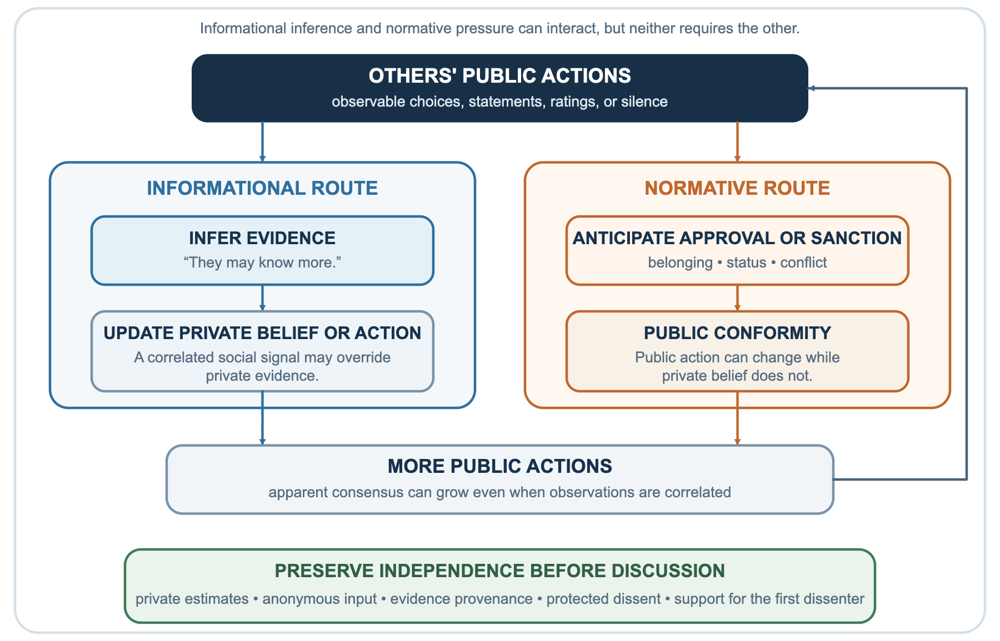<figcaption>Figure 23.1. A social cascade forms when public actions become evidence and raise the cost of dissent; independent elicitation can interrupt it.</figcaption></figure>

Social proof is the tendency to treat others’ behavior as evidence of what is correct, valuable, or appropriate. It is a form of informational social influence and one of the most widely used compliance triggers (Cialdini, 2009; Cialdini & Goldstein, 2004).

Social proof becomes especially powerful under uncertainty. If you do not know which restaurant is good, a crowd helps. If you do not know which software is reliable, user numbers help. If you do not know whether a joke is funny, laughter helps. If you do not know how to behave at a formal dinner, you watch others. If you do not know whether a market is overvalued, others’ buying may seem informative.

Social proof also becomes stronger when the others are similar to us. We are more influenced by people who seem to face the same situation, share our identity, or possess relevant experience. “Most people” may be less persuasive than “most students in your program,” “most doctors in your hospital,” “most households in your neighborhood,” or “most managers in your industry,” provided the claim is true.

Social proof can produce good outcomes. It spreads useful practices, safety behaviors, innovation, cooperation, and public health behavior. It helps people avoid mistakes when others have better information. It reduces the cost of individual learning.

But social proof can also produce cascades. In an informational cascade, people ignore their own private information and follow the behavior of those before them because others’ actions seem informative (Bikhchandani et al., 1992). Once a cascade begins, many people may follow without adding new evidence. This can happen in restaurants, fashion, hiring, technology adoption, investing, academic trends, political beliefs, and organizational strategy.

Imagine that the first two investors in a meeting express enthusiasm for a start-up. The third investor is uncertain but infers that the first two know something. The fourth sees three positive signals. Soon, enthusiasm becomes social evidence. The later investors may not have independent reasons. The group appears confident, but the confidence may be built on copying.

Social proof is also visible in digital platforms. Ratings, likes, downloads, follower counts, trending lists, bestseller labels, and “people like you bought this” messages all display social information. Some of this information is useful. Some is manipulable. Fake reviews, bots, paid followers, algorithmic amplification, and herd dynamics can make popularity appear more informative than it is.

A useful question is:

Are these people acting from independent knowledge, or are they also following the crowd?

When many independent judgments converge, social proof is powerful evidence. When people are copying one another, social proof may be a hall of mirrors.

## Key ideas

- Conformity can reflect a desire to be correct, accepted, or both.
- Descriptive norms say what people do; injunctive norms say what people approve.
- Popularity is informative only to the extent that judgments are independent and the signal is not manipulated.
- A single ally can transform the social cost of dissent.

## Study and practice

### Questions

1. Why can broadcasting a high rate of undesirable behavior increase it?

2. When is the crowd good evidence, and when is it a hall of mirrors?

3. How should a leader make private doubt speakable?

### Activities

1. Norm-message lab: write descriptive and injunctive versions of one message, then identify the backfire risk.

2. Dissent design: redesign a meeting so the first honest disagreement does not require heroism.

### Experience-Explain-Apply reflection

In no more than 120 words: describe one specific experience, explain it using one or two concepts from the chapter, and state one application or testable prediction.

# Chapter 24. Authority, Bystanders, and Influence Triggers

*Signals that coordinate behavior—and can be counterfeited*

## Learning goals

- Explain authority, diffusion of responsibility, pluralistic ignorance, and bystander intervention.
- Analyze reciprocity, consistency, scarcity, liking, unity, social proof, and reasons as recurring influence triggers.
- Distinguish legitimate signals from counterfeit cues.
- Design and resist influence while preserving truth, welfare, and agency.

<aside class="callout core-idea">
CORE IDEA

Influence triggers are useful because they compress social information. They become manipulative when the cue is manufactured, material facts are hidden, or exit is made difficult.
</aside>

## Authority and responsibility

Authority is one of the most powerful forms of social influence. People often comply with requests from those who appear to have legitimate power, expertise, or institutional role.

Authority can be useful. In emergencies, people need to follow trained leaders. In medicine, patients benefit from expert knowledge. In organizations, authority coordinates action. In education, teachers guide learning. Without some respect for authority, collective life becomes inefficient and chaotic.

But authority can also lead people to act against their own judgment.

Stanley Milgram’s obedience experiments remain among the most famous and disturbing studies in psychology. Participants were instructed by an experimenter to administer increasingly severe electric shocks to a learner whenever the learner made mistakes. The shocks were not real, but participants believed they were. Many continued to administer shocks despite the learner’s protests, when urged by the experimenter to continue (Milgram, 1963, 1974).

The experiments have been debated ethically and methodologically, and later scholars have offered more nuanced interpretations. But the core lesson remains powerful: ordinary people may comply with authority in ways that conflict with their moral discomfort, especially when responsibility is shifted upward, the setting is institutional, the task is gradual, and the authority appears legitimate. Burger (2009) replicated a modified version of the paradigm under modern ethical constraints and found substantial obedience up to a lower stopping point.

Authority works through several channels. It signals expertise. It defines roles. It reduces uncertainty. It shifts responsibility. It creates pressure to be cooperative. It makes refusal socially costly. It can also narrow attention: the person focuses on following instructions rather than evaluating the moral whole.

This matters in organizations. Employees may follow unethical orders because “leadership approved it.” Doctors may defer to senior physicians. Junior staff may fail to challenge unsafe decisions. Engineers may implement features they privately find manipulative. Soldiers, police, bureaucrats, and corporate employees may treat role obedience as responsibility.

Authority cues can be subtle. A title, uniform, badge, office, accent, credential, expensive suit, confident tone, or institutional logo can increase compliance. Sometimes the authority is real. Sometimes it is performed.

The ethical danger is not authority itself. It is unaccountable authority. Good systems create ways to question authority when stakes are high. Aviation, medicine, and safety-critical organizations use checklists, cross-checks, escalation protocols, and crew resource management partly to reduce harmful deference. A junior nurse or co-pilot must be able to speak up when safety is at risk.

A useful question is:

Am I complying because the authority has good reasons, or because the role makes disagreement difficult?

Authority should guide judgment, not replace it.

## Bystanders and pluralistic ignorance

Social influence can also stop people from acting.

In emergencies, one might expect that more witnesses would mean more help. But research on the bystander effect shows that the presence of others can reduce individual intervention. Darley and Latané (1968) found that participants were less likely to help a person apparently having a seizure when they believed other bystanders were present. Latané and Darley (1970) argued that bystander inaction arises from several processes: noticing the event, interpreting it as an emergency, accepting responsibility, knowing how to help, and deciding to act.

Other people can interfere at several stages. If no one else reacts, the situation may seem less serious. This is pluralistic ignorance: people privately feel concern but infer from others’ calm behavior that nothing is wrong. If many people are present, responsibility diffuses: “Someone else will act.” If action might be embarrassing, people hesitate.

Pluralistic ignorance appears beyond emergencies. Students may privately feel confused but remain silent because no one else asks questions. Employees may privately doubt a strategy but infer from others’ silence that they are alone. Citizens may privately oppose a norm but believe most others support it. College students may overestimate peers’ comfort with drinking because discomfort is hidden (Prentice & Miller, 1993).

Pluralistic ignorance is dangerous because it creates false consensus. Everyone looks around, sees silence, and concludes that others agree. The group continues a behavior that many members privately question.

Organizations should take pluralistic ignorance seriously. Silence is not consent. Lack of objection is not agreement. A meeting in which nobody speaks may reflect fear, confusion, hierarchy, fatigue, or uncertainty. Leaders who ask, “Any objections?” often get silence because objecting publicly is costly. Better methods include anonymous polling, private written input, structured rounds, red teams, and explicitly asking for concerns.

Diffusion of responsibility also appears in organizations. When many people are copied on an email, everyone may assume someone else will act. When a safety issue crosses departments, each group assumes another owns it. When unethical behavior is distributed across roles, each person sees only a small part and feels less responsible.

The antidote is responsibility design.

Who is responsible for noticing? Who is responsible for acting? What signal requires escalation? How can people safely express concern? What should one person do if everyone else is silent?

Social influence does not only push people toward action. It can also hold them still.

## Influence triggers: a diagnostic map

<figure class="book-figure">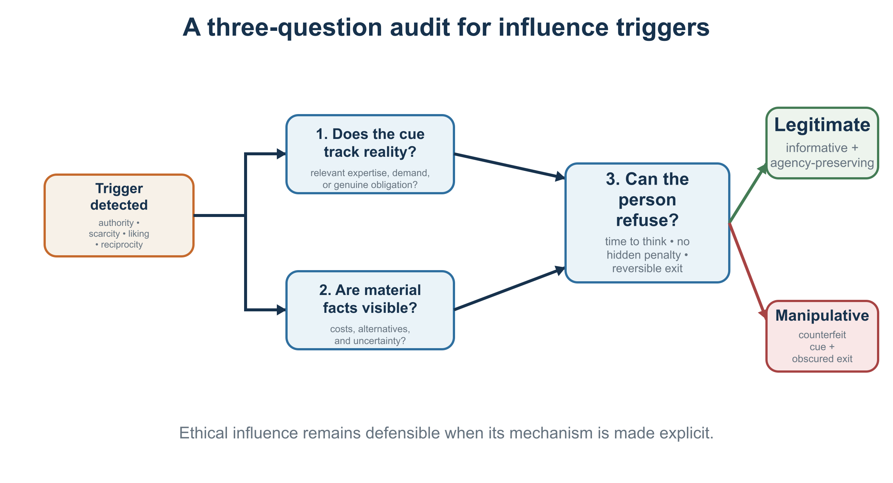<figcaption>Figure 24.1. Influence is more legitimate when cues track reality, material facts remain visible, and refusal remains meaningful.</figcaption></figure>

Influence triggers are compressed social rules. They are useful when a visible cue reliably tracks expertise, demand, obligation, commitment, or shared identity. They become manipulative when the cue is manufactured, material facts are hidden, or the cost of refusal is quietly increased.

*Table 24.1. Legitimate signals and counterfeit triggers*

| Trigger | Legitimate information it can carry | Counterfeit form | Pause question |
| --- | --- | --- | --- |
| A reason | The request has a relevant justification. | A reason-shaped phrase with no diagnostic content. | Would the reason change my judgment if the word “because” disappeared? |
| Social proof | Independent people with relevant experience converged. | Bots, copied reviews, paid popularity, or a cascade. | Are these judgments independent? |
| Commitment | A freely chosen promise expresses an endorsed value. | Early commitment was obtained before costs were disclosed. | Was the commitment informed and reversible? |
| Reciprocity | A genuine gift or concession supports cooperation. | A strategic favor functions as a hidden invoice. | Would I owe this if the tactic were explicit? |
| Authority | Relevant expertise is accountable and evidence-based. | Titles, uniforms, confidence, or logos substitute for reasons. | What is the source expert in, and who checks them? |
| Scarcity | Limited supply or time is real and decision-relevant. | A fake countdown or manufactured shortage creates panic. | Is the scarcity genuine, and does it change underlying value? |
| Liking | Trust grows from repeated, responsive interaction. | Charm, similarity, or compliments bypass scrutiny. | Would the claim survive if I disliked the source? |
| Unity | Shared identity supports mutual obligation. | Belonging is built through exclusion or contempt. | What is this “we” asking me not to see? |

## Eight recurring triggers

### A reason can be a trigger

Langer et al. (1978) studied requests to cut in line at a photocopier. In low-cost situations, adding the word "because" and a reason increased compliance, even when the reason was weak and nearly tautological: "because I have to make copies." The effect was much less permissive when the request imposed a larger cost.

The finding is often told as evidence that people obey the word "because." A more careful interpretation is that, in routine low-stakes settings, the presence of a reason can function as a quick signal that the request follows a legitimate script. When stakes rise, scrutiny rises.

The study does not license meaningless reasons as a general persuasion device. It shows how people economize on evaluation when the request appears ordinary and cheap.

### Social proof

Legitimate signal: accurate information about relevant others can reduce uncertainty.

Counterfeit: fabricated reviews, cherry-picked counts, bots, or a comparison group selected to manufacture normality.

Defense: inspect the reference group, sampling process, and whether visibility helped create the behavior.

### Commitment and consistency

People value coherence between action, identity, and public commitments. Cognitive dissonance theory describes discomfort when cognitions or actions conflict, although responses can include changing behavior, changing beliefs, or reframing the inconsistency (Festinger, 1957).

Small initial actions can also change later compliance. In the foot-in-the-door paradigm, agreeing to a small request increased willingness to accept a larger related request under some conditions (Freedman & Fraser, 1966). The initial action may alter self-perception, commitment, or the relationship with the requester. In the low-ball procedure, people first commit under attractive terms and are then more likely to persist after previously undisclosed costs appear (Cialdini et al., 1978). The finding illustrates commitment pressure, not an ethical license to hide costs.

Ethical use: help people enact values they already endorse. A public implementation plan can support follow-through.

Abuse: secure a trivial commitment and then escalate costs the person did not foresee.

Defense: ask whether the later request was visible when the initial commitment was made and whether exit remains meaningful.

### Reciprocity

Reciprocity supports cooperation by making generosity and concession sustainable. A favor can communicate trust. A concession can invite movement. In the door-in-the-face procedure, an initial large request followed by a smaller request can increase compliance, partly because the smaller request appears to be a concession (Cialdini et al., 1975).

Ethical use: give value without hiding a debt; make concessions that genuinely move toward agreement.

Abuse: create obligation with an unwanted gift or inflate the first request merely to make the target request appear reasonable.

Defense: separate gratitude from consent. A gift does not purchase a decision.

### Authority

Authority can be epistemic, based on expertise, or institutional, based on role. Both can be useful. A surgeon, engineer, or regulator may possess knowledge that a layperson lacks. The problem begins when authority replaces evidence rather than improving its quality.

Milgram's obedience experiments showed that ordinary participants could continue administering what they believed were increasingly painful shocks under pressure from an experimenter (Milgram, 1963). The findings emerged in a specific institutional setting and have generated extensive ethical and interpretive debate. They should not be reduced to "people obey anyone in a lab coat." The situation combined gradual escalation, a prestigious setting, division of responsibility, scripted reassurance, and ambiguity about the learner's actual condition.

Ethical use: disclose credentials, uncertainty, incentives, and the basis of the recommendation.

Abuse: use symbols of status, confidence, or institutional prestige to suppress questions.

Defense: ask what the authority knows, how they know it, what incentives they face, and whether disagreement is permitted.

### Scarcity

Scarcity can signal genuine competition, uniqueness, or timing. It also activates loss aversion and urgency. Limited seats, expiring capacity, and one-of-a-kind objects may truly require quick action.

Ethical use: state real constraints precisely.

Abuse: fake countdowns, perpetual "last chance" offers, or withholding ordinary availability to produce panic.

Defense: ask whether the underlying value changed or only the possibility of losing access became salient.

### Liking

We are more open to people we like. Similarity, familiarity, cooperation, praise, and attractiveness can influence liking. These cues can support trust when they reflect a genuine relationship; they can also spill into judgments of competence or product quality.

Ethical use: build authentic rapport and demonstrate attention.

Abuse: manufacture intimacy, excessive praise, or similarity unrelated to the decision.

Defense: separate "I like this source" from "this claim is well supported."

### Unity

Unity extends beyond similarity to shared identity. People can value outcomes differently when a person, organization, or cause becomes part of "we." Minimal-group experiments show how easily categorization can produce ingroup favoritism, even when group distinctions are arbitrary (Tajfel et al., 1971).

Ethical use: build inclusive identities around shared purpose and mutual obligation.

Abuse: create belonging through contempt, threat, or dehumanization of an outgroup.

Defense: ask what the proposed "we" requires you to ignore about people outside it.

## Signals and counterfeit signals

Many influence principles operate through cues that ordinarily carry information. Ethologists used the idea of a sign stimulus for a feature that releases a characteristic response; the analogy is useful only with caution, because human responses to social cues are learned, goal-sensitive, and context-dependent rather than fixed reflexes (Tinbergen, 1951).

A reason signals legitimacy.

A gift signals goodwill and relationship.

Authority signals expertise or institutional responsibility.

Scarcity signals competition or limited opportunity.

Popularity signals collective experience.

Similarity signals shared interests or diagnostic comparison.

Commitment signals identity and future consistency.

The response to these cues is not foolish. It becomes dangerous when the cue is detached from what it normally signifies. A fake countdown simulates scarcity. Purchased reviews simulate social proof. A white coat simulates expertise. A "free" gift creates obligation that was hidden at the moment of receipt.

A famous field study placed pictures of eyes or flowers above an honesty box in a university coffee room. Contributions were much higher during the eye-image weeks, suggesting that minimal observation cues might activate reputational concern (Bateson et al., 2006). The image became a textbook example of a subtle trigger.

The wider evidence is less theatrical. Two meta-analyses found no reliable overall effect of artificial surveillance cues on generosity and emphasized inconsistent results and possible moderators (Northover et al., 2017). The responsible lesson is not that a pair of printed eyes reliably makes people honest. It is that cues of observation can matter in some contexts, but the effect is not a dependable behavioral remote control. Real accountability, identifiable responsibility, norms, and enforcement are stronger foundations for cooperation than decorative eyes.

The defensive skill is not to ignore all triggers. It is to restore the missing question:

What does this cue actually prove here?

## When influence helps - and harms

Social influence is not a problem to eliminate. It is a capacity to govern.

It helps when others have independent knowledge, when norms support prosocial behavior, when authority is legitimate, when social proof reflects real quality, when reciprocity sustains cooperation, when commitment supports long-term goals, and when shared identity creates care.

It harms when others are copying one another, when norms normalize harmful behavior, when authority suppresses conscience, when social proof is manufactured, when reciprocity is exploited, when commitment traps people in bad decisions, when scarcity creates artificial urgency, and when unity becomes exclusion.

The key is to ask what function the influence is serving.

Is it providing information? Is it creating pressure? Is it coordinating action? Is it protecting status? Is it supporting cooperation? Is it exploiting inattention? Is it making a good action easier? Is it making refusal costly?

Social influence also depends on transparency. A visible norm message such as “Most people in this building recycle” is different from fake reviews. A real expert recommendation is different from an actor in a lab coat. A genuine gift is different from a strategic favor designed to create obligation. A real deadline is different from a fake countdown timer.

Ethical social influence should help people make choices they would endorse under reflection. Manipulative influence uses social pressure, identity, fear, liking, or obligation to push people toward choices they would resist if they understood the tactic.

A simple ethical test is:

Would the person feel respected or tricked if they understood how the influence worked?

If the answer is tricked, the influence deserves scrutiny.

## Designing and resisting influence

Because social influence is unavoidable, the practical goal is not independence from others. The goal is better social environments and better resistance to manipulation.

For organizations, this means designing norms intentionally. If leaders want people to speak up, they must make speaking up normal and safe. If they want ethical behavior, they must make ethics visible before decisions, not only after scandals. If they want learning, they must reward people who report problems. If they want cooperation, they must align incentives and identity with collective success.

Norms should be made explicit. “In this team, disagreement is a contribution.” “In this hospital, anyone can stop the line for safety.” “In this classroom, confusion is a normal part of learning.” “In this company, bad news early is valued.” Such statements matter only if behavior supports them.

Decision processes should reduce harmful conformity. Ask for independent estimates before discussion. Invite junior voices early. Use anonymous input for sensitive topics. Assign a rotating challenger role. Separate idea generation from evaluation. Create explicit space for dissent. Do not let the highest-status person speak first on uncertain issues.

To resist social influence individually, use several tools.

First, slow down under social pressure. Compliance triggers often work quickly. A pause restores agency.

Second, ask what cue is influencing you. Is it popularity, authority, scarcity, liking, reciprocity, commitment, or unity?

Third, seek independent evidence. Popularity is not proof. Authority is not proof. Scarcity is not proof. Liking is not proof.

Fourth, predefine values and limits. In negotiation, know your reservation price before the other side anchors. In purchases, know your budget before scarcity appears. In ethics, know what you will not do before authority pressures you.

Fifth, create dissent partners. A trusted person who is allowed to challenge you can break conformity.

Sixth, use private judgments before public discussion. Write down your view before hearing the group.

Seventh, be willing to be the first dissenter. One person can reduce conformity for others.

Finally, use social influence for good. Surround yourself with people whose norms support your values. Join groups where learning, health, integrity, generosity, and courage are normal. Make desired behavior visible. Praise the norms you want to spread. Social influence is not only something to resist; it is something to choose.

The broader cultural layer shapes the shared meanings within which immediate social influence operates. Social influence operates in immediate situations: groups, norms, authority, compliance triggers. Culture operates more broadly. It shapes what counts as respectful, moral, intelligent, risky, masculine, feminine, professional, loyal, independent, or successful. To understand decision-making fully, we must understand not only what others do in the moment, but the shared meanings that define the world in which decisions take place.

<aside class="callout evidence-and-boundary-conditions">
EVIDENCE AND BOUNDARY CONDITIONS

The watched-eyes effect is not a universal cooperation switch; results vary across tasks and settings. Use visible accountability only when its mechanism and ethical costs fit the context.
</aside>

<aside class="callout evidence-and-boundary-conditions">
EVIDENCE AND BOUNDARY CONDITIONS

The copy-machine &quot;because&quot; study is a classic demonstration under a low-stakes queue request, not proof that any reason word produces compliance.
</aside>

*Table 24.1  Influence principles as diagnostic questions*

| Principle | Question the mind may be answering | Ethical test |
| --- | --- | --- |
| Social proof | What do people like me do? | Are the displayed behaviors real and independent? |
| Consistency | What have I already said or become? | Was the commitment informed and freely chosen? |
| Reciprocity | What do I owe? | Was the favor a gift or a hidden invoice? |
| Authority | Who knows and who is responsible? | Does the cue track relevant expertise and accountability? |
| Scarcity | What might I lose? | Is the scarcity genuine and decision-relevant? |
| Liking | Who feels warm or similar? | Would the claim survive without personal affinity? |
| Unity | Who is us? | Does belonging expand cooperation or silence scrutiny? |

## Key ideas

- Authority is a coordination device, not a substitute for moral responsibility.
- Bystander inaction often reflects failures of noticing, interpretation, and assigned responsibility.
- Reciprocity, consistency, scarcity, liking, unity, and social proof are cue-based shortcuts that can be legitimate or counterfeited.
- Ethical influence makes the mechanism inspectable and preserves a meaningful path to refuse.

## Study and practice

### Questions

1. Why can ordinary people comply with harmful authority?

2. What makes a scarcity signal informative rather than manipulative?

3. How can an emergency system assign responsibility before ambiguity arrives?

### Activities

1. Influence audit: analyze a recent request and identify the cue, the information it legitimately conveyed, and the information it concealed.

2. Bystander redesign: turn an ambiguous request for help into an assigned, observable action.

### Experience-Explain-Apply reflection

In no more than 120 words: describe one specific experience, explain it using one or two concepts from the chapter, and state one application or testable prediction.

# Part 5. Persuasion, Story, and Connection

How messages update models, stories create simulated meaning, and conversation builds shared understanding.

# Chapter 25. Persuasion Is Model Updating

*Changing minds requires more than adding facts*

<aside class="callout core-idea">
CORE IDEA

Persuasion succeeds when credible evidence, emotional relevance, and audience values change the model through which the message is interpreted - while preserving the audience&#x27;s agency.
</aside>

## Learning goals

- Distinguish persuasion from coercion, manipulation, compliance, and communication.
- Use ethos, pathos, logos, and kairos.
- Explain central and peripheral routes to persuasion.
- Design for audience motivation, ability, resistance, and identity.

Many people imagine persuasion as argument: present evidence, give reasons, defeat objections, and the other person should change their mind. Sometimes that works. But often it does not.

A smoker may know smoking is dangerous and continue. A patient may know exercise is beneficial and avoid it. An employee may understand the strategy and still resist. A student may accept that statistics matters and still feel anxious. A citizen may hear evidence about climate change and reject the policy. A negotiator may understand the other side’s logic but still refuse the offer.

Facts matter, but facts do not persuade by themselves. They enter a mind already shaped by attention, prior beliefs, values, emotions, identity, trust, and social context. A message that is factually correct may fail if the audience does not trust the source, does not see relevance, feels threatened, lacks ability to process the information, or interprets the message as disrespect.

This is why persuasion is not only about what is said. It is also about who says it, to whom, in what context, with what evidence, through what emotional tone, and with what implied relationship.

The ancient tradition of rhetoric understood this well. Aristotle described three major modes of persuasion: ethos, pathos, and logos (Aristotle, trans. 2007). Logos refers to the argument: evidence, reasoning, examples, and structure. Pathos refers to emotion: the audience’s feelings, values, fears, hopes, anger, compassion, or pride. Ethos refers to the character and credibility of the speaker: whether the audience sees the speaker as knowledgeable, trustworthy, fair, and well-intentioned.

Modern persuasion research has given these ancient ideas more precise psychological language. Source credibility research studies ethos. Emotion and affect research studies pathos. Argument quality, evidence, and reasoning research studies logos. Dual-process theories explain when people scrutinize arguments carefully and when they rely more on cues such as credibility, attractiveness, fluency, emotion, or consensus.

The important lesson is that persuasion rarely works through one route alone. A strong argument from an untrusted source may fail. A trusted source with weak evidence may persuade temporarily but not deeply. A message that evokes emotion without evidence may move people but mislead them. A technically perfect argument may fail if it ignores the audience’s identity or values.

Effective persuasion begins with a question:

What is preventing this audience from changing its mind?

The obstacle may be lack of information. But it may also be distrust, fear, pride, confusion, identity threat, social norms, low relevance, competing goals, or lack of perceived efficacy.

A message should be designed for the actual obstacle, not the obstacle the persuader wishes were there.

## Ethos: why the source gets weight

People do not evaluate messages separately from messengers. Who speaks matters.

Hovland and Weiss (1951) showed that source credibility affects persuasion. Participants were more persuaded by messages attributed to high-credibility sources than by the same messages attributed to low-credibility sources. Source credibility often includes two major components: expertise and trustworthiness. Expertise means the source is seen as knowledgeable. Trustworthiness means the source is seen as honest and not trying to mislead.

A doctor may have expertise about medicine. A patient may still distrust the doctor if they believe the doctor is rushed, dismissive, financially motivated, or culturally insensitive. A scientist may have expertise about climate data. A skeptical audience may distrust the scientist if the issue has become politically charged. A manager may know the strategic facts. Employees may distrust the message if previous promises were broken.

Trustworthiness is not created by credentials alone. It is built through honesty, transparency, consistency, humility, and demonstrated concern for the audience’s interests.

Research on source credibility has identified several relevant dimensions. Expertise and trustworthiness are central, but goodwill, similarity, attractiveness, status, confidence, and perceived intent can also matter (Pornpitakpan, 2004). People are often more open to sources who seem to understand them, respect them, or share their concerns. This is why a peer messenger may sometimes be more persuasive than an expert, especially when identity and trust are central.

The “sleeper effect” complicates source credibility. Hovland and colleagues found that over time, people may remember the message but forget the source, allowing a message from a low-credibility source to become more persuasive later (Hovland et al., 1949; Kumkale & Albarracín, 2004). This effect is not universal, but it shows why misinformation can linger. A claim may detach from its source and survive as a familiar idea.

Ethos matters in leadership. A leader who asks for sacrifice after sharing sacrifice has more credibility than one who asks others to bear costs alone. A manager who admits uncertainty may be more trusted than one who pretends certainty. A teacher who respects students’ difficulties may be more persuasive when encouraging effort. A negotiator who acknowledges the other side’s legitimate concerns may be more persuasive when making a proposal.

Ethos can also be damaged quickly. Exaggeration, selective evidence, contempt, broken promises, hidden motives, and dismissing reasonable concerns all reduce credibility. Once trust is lost, even accurate messages may fail.

Credibility is not only personal. It is institutional. A message from a university, government agency, company, media outlet, or professional association carries the history of that institution. If the institution has acted unfairly, inconsistently, or arrogantly, the message must overcome that history.

A useful persuasion question is:

Why should this audience trust me on this issue?

If the honest answer is weak, the persuader may need to build trust before presenting arguments.

## Logos: evidence and causal structure

Logos is persuasion through reason. It includes claims, evidence, warrants, examples, comparisons, causal logic, statistics, counterarguments, and conclusions.

Strong arguments matter most when the audience is motivated and able to think carefully. If the audience cares about the issue, has enough knowledge, has time, and is not overwhelmed, weak arguments are more likely to be detected. If the audience is distracted, indifferent, tired, or overloaded, argument quality matters less and cues matter more.

Evidence can take many forms: statistics, experiments, expert testimony, case studies, analogies, demonstrations, historical examples, and personal experience. Different types of evidence persuade differently. Statistical evidence can show frequency, magnitude, and generality. Examples can make abstract claims concrete. Expert testimony can summarize complex knowledge. Demonstrations can make mechanisms visible. Analogies can transfer understanding from familiar domains.

But evidence must fit the claim. A vivid anecdote cannot prove a general pattern. A statistic without context may not show causality. An expert outside their domain may not be reliable. A correlation may not imply causation. A case study may illustrate a possibility but not a probability.

Persuasion fails when evidence answers the wrong question. Suppose a company wants employees to support a new digital system. Leaders present data showing that the system will increase efficiency. Employees resist because they fear surveillance, job loss, or loss of autonomy. The efficiency evidence may be correct, but it does not address the central concern. A persuasive message must answer the audience’s real question.

Argument structure also matters. A clear message usually states the claim, explains why it matters, presents evidence, addresses objections, and identifies action. Disorganized information increases cognitive strain and reduces persuasion. But oversimplification can produce false clarity. Good logos is not merely simple; it is appropriately structured.

Two-sided messages can be especially persuasive when audiences are informed or skeptical. A two-sided message acknowledges opposing arguments and then responds to them. Hovland et al. (1949) found that two-sided messages could be more effective for audiences initially opposed or exposed to counterarguments. Later research suggests that two-sided refutational messages are often more persuasive than one-sided messages, especially when the audience is likely to hear the other side (O’Keefe, 1999).

Acknowledging counterarguments can increase credibility because it signals fairness. But a weak or superficial acknowledgment can backfire. The audience may feel manipulated if objections are caricatured.

Logos also requires appropriate uncertainty. Overstating certainty may persuade in the short run but damage trust when uncertainty becomes visible. Understating certainty may fail to motivate action. Good persuasion often requires calibrated confidence: clear enough to guide action, honest enough to preserve trust.

A useful question is:

What would a reasonable skeptic need to know?

Not a hostile cynic. Not a passive supporter. A reasonable skeptic. This imagined audience improves logos because it forces the persuader to provide evidence, acknowledge uncertainty, and address real objections.

## Pathos: making stakes felt

Pathos is persuasion through emotion. It is often treated with suspicion because emotion can manipulate. But emotion is not the enemy of persuasion. Emotion tells people why a message matters.

A message about climate change that contains only temperature projections may inform but not motivate. A message about workplace safety that contains only rules may not change behavior. A message about public health that contains only probabilities may fail to move people. People act when facts connect to value, identity, care, fear, hope, anger, pride, or responsibility.

Emotion directs attention and valuation. Fear highlights danger. Anger highlights injustice and blame. Sadness highlights loss. Hope highlights possibility. Pride highlights identity and achievement. Compassion highlights suffering. Gratitude highlights connection. Guilt highlights responsibility. These emotional meanings shape what actions feel appropriate.

Research on emotion and judgment shows that different emotions influence decisions in different ways (Lerner et al., 2015). Fear tends to increase risk perception and avoidance. Anger can increase certainty and approach. Sadness may increase desire for change. Hope can sustain effort. Persuasion must therefore ask not only whether emotion is present, but which emotion and toward what action.

Fear appeals have been studied extensively in health and risk communication. Fear can motivate protective behavior when people believe the threat is serious, believe they are vulnerable, believe the recommended action is effective, and believe they can perform it. Witte’s extended parallel process model argues that fear appeals can produce danger control or fear control (Witte, 1992). Danger control means the person acts to reduce the threat. Fear control means the person acts to reduce the feeling of fear, perhaps by denial, avoidance, or reactance. A frightening message without efficacy can backfire.

For example, telling people “This disease is deadly” may increase attention. But if people do not believe they can prevent or treat it, they may avoid the message. A better fear appeal pairs threat with efficacy: “This disease is serious, but vaccination greatly reduces risk, and appointments are available here.”

Protection motivation theory similarly argues that protective behavior depends on threat appraisal and coping appraisal: people evaluate severity, vulnerability, response efficacy, and self-efficacy (Rogers, 1975, 1983). Fear alone is insufficient. People need a path.

Positive emotions can also persuade. Hope can motivate collective action. Pride can motivate effort. Gratitude can support reciprocity. Humor can reduce resistance and increase liking, though it can distract from the message if poorly used. Walter and colleagues’ meta-analysis suggests that humor can increase persuasion, especially when humor is relevant and not offensive, but effects vary by context (Walter et al., 2018).

Moral emotions are especially powerful. Anger can mobilize against injustice. Compassion can motivate helping. Disgust can motivate avoidance. But moral emotions can also polarize. A message that activates moral outrage may mobilize supporters while closing the minds of opponents. Ethical persuasion should be careful with emotions that dehumanize, humiliate, or inflame.

Pathos should not replace logos. Emotion without evidence can mislead. But evidence without emotion often fails to motivate. The question is not whether to use emotion, but whether the emotion is appropriate to the truth of the situation and respectful of the audience.

A useful persuasion question is:

What should the audience feel if they truly understood what is at stake?

The word “truly” matters. Ethical pathos makes the value of reality felt. Manipulative pathos manufactures feeling disconnected from reality.

## Two routes through a message

<figure class="book-figure">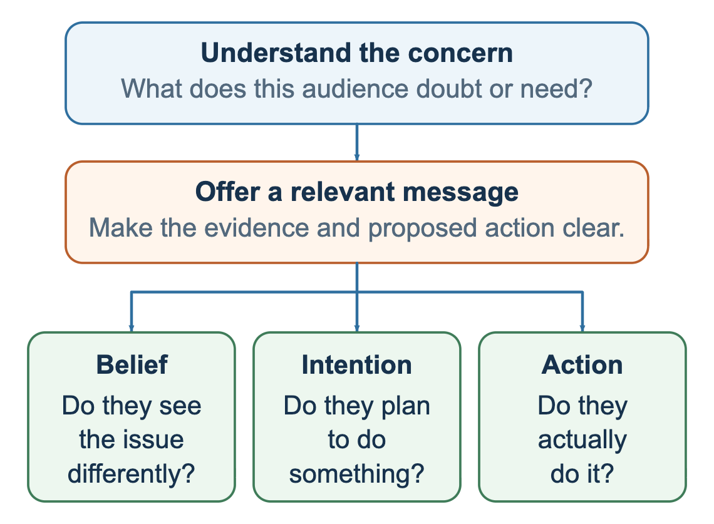<figcaption>Figure 25.1. Persuasion succeeds when message design addresses the audience’s actual model and obstacle to change.</figcaption></figure>

Modern persuasion research is strongly shaped by dual-process models. Two of the most influential are the elaboration likelihood model and the heuristic-systematic model.

Persuasion depends on both message arguments and the audience’s motivation and ability to elaborate; source cues matter differently under different processing conditions (Petty & Cacioppo, 1986; Chaiken, 1980).

The elaboration likelihood model, developed by Petty and Cacioppo, proposes that persuasion can occur through a central route or a peripheral route (Petty & Cacioppo, 1986; Petty & Briñol, 2012). Central-route persuasion occurs when people carefully think about message arguments. Peripheral-route persuasion occurs when people rely more on cues such as source attractiveness, credibility, number of arguments, emotional tone, or social consensus.

The model does not say that one route is always good and the other bad. It says that the route depends on elaboration: how motivated and able people are to think carefully about the message.

Motivation is higher when the issue is personally relevant, important, surprising, or connected to goals. Ability is higher when the message is understandable, the person has enough knowledge, distractions are low, and time is available. When motivation and ability are high, argument quality matters more. When motivation or ability is low, peripheral cues matter more.

Petty et al. (1981) demonstrated this with a study about comprehensive exams. When the issue was highly relevant to students, strong arguments produced more persuasion than weak arguments. When relevance was low, source expertise mattered more. The same cue can matter differently depending on involvement.

The heuristic-systematic model, developed by Chaiken, makes a similar distinction between systematic processing and heuristic processing (Chaiken, 1980; Chaiken et al., 1989). Systematic processing involves careful evaluation of message content. Heuristic processing relies on simple rules such as “experts can be trusted,” “longer messages are stronger,” “consensus implies correctness,” or “likable people are credible.”

One useful idea from this model is the sufficiency principle: people exert enough effort to reach a desired level of confidence, but not more. If a low-effort heuristic gives enough confidence, they may stop. If the decision is important or uncertainty remains, they may process more systematically.

These models connect persuasion to the rest of the book. Heuristics, fluency, authority, social proof, and affect are not merely biases; they are persuasion routes when people are not deeply elaborating. Central-route persuasion is closer to the rational choice model: evidence is examined, trade-offs considered, and beliefs updated. Peripheral or heuristic persuasion is closer to automatic decision loops.

Persuasion through the central route tends to be more durable, resistant to counterpersuasion, and predictive of behavior because people have integrated the argument into their own reasoning. Peripheral persuasion may be faster but more fragile, unless repeated or connected to identity and habits.

This has practical implications.

If the issue is important and the audience is motivated, provide strong arguments, evidence, and meaningful engagement. Do not rely only on slogans.

If the audience is overloaded or low-involvement, make the message simple, credible, timely, and easy to act on. Do not bury the point in technical detail.

If the audience is skeptical, acknowledge objections and provide credible evidence.

If the audience lacks ability to process, simplify without distorting.

If the audience’s identity is threatened, credibility and respect must come before argument.

A useful question is:

Is this audience willing and able to think deeply about this message right now?

The answer determines the persuasion strategy.

*Table 25.1. Audience conditions and persuasion design*

| Audience condition | Likely processing | Design implication |
| --- | --- | --- |
| High motivation and ability | Careful scrutiny of arguments. | Use strong evidence, causal logic, uncertainty, and counterarguments. |
| High motivation, low ability | Interest without sufficient comprehension. | Reduce jargon, scaffold concepts, and show concrete mechanisms. |
| Low motivation, high ability | Limited willingness to elaborate. | Create relevance before adding detail. |
| Low motivation and ability | Greater reliance on cues and simple heuristics. | Use transparent cues, one clear action, and avoid exploiting inattention. |

## The audience is part of the message

A message is not persuasive in isolation. It is persuasive to someone.

Audience analysis is therefore central. The same message can persuade one group, fail with another, and backfire with a third.

Several audience factors matter.

Prior attitude. People who already agree need reinforcement or action guidance. People who are undecided need clarity and relevance. People who disagree need trust, respect, and reasons to reconsider. Strongly opposed audiences may react defensively if the message attacks identity.

Involvement. If the issue matters personally, people think more carefully and counterargue more. If involvement is low, cues and simplicity matter more.

Knowledge. Experts need different messages from novices. Experts may want nuance, evidence, and caveats. Novices may need clear categories and concrete examples. Too much detail can overwhelm; too little can insult.

Need for cognition. Some people enjoy effortful thinking more than others (Cacioppo & Petty, 1982). High need-for-cognition audiences may respond more to argument quality. Low need-for-cognition audiences may prefer simpler cues and concrete implications.

Identity. Messages that threaten identity often produce resistance. A climate message framed as “people like you are irresponsible” may backfire. A health message framed as “you are failing” may produce shame. A workplace message framed as “your old skills are obsolete” may threaten professional identity.

Values. People are persuaded by messages that connect to values they hold. Moral foundations theory suggests that people differ in the moral concerns they emphasize, such as care, fairness, loyalty, authority, sanctity, and liberty (Graham et al., 2013; Haidt, 2012). A policy argument framed only in terms of care may fail with an audience that prioritizes liberty or loyalty. Persuasion often requires moral translation: connecting the message to the audience’s values rather than only the persuader’s values (Feinberg & Willer, 2015).

Efficacy. People must believe action is possible. A message that creates concern without agency can produce avoidance.

Trust. When trust is low, facts may be interpreted as tactics. Before persuasion, the communicator may need to repair relationship.

This is why persuasion requires empathy. Not agreement, but accurate perspective-taking: What does the audience already believe? What do they fear? What do they value? What identity is at stake? What objections are reasonable from their perspective? What would make change feel safe, honorable, useful, or necessary?

A common persuasion error is egocentric messaging: persuaders use arguments that persuade themselves. A scientist gives more data because data persuade scientists. A manager emphasizes efficiency because efficiency persuades managers. A public health official emphasizes population risk because population risk persuades officials. But the audience may care about freedom, dignity, trust, identity, immediate cost, or practical barriers.

Good persuasion begins where the audience is, not where the persuader wishes they were.

## Message strength and structure

A persuasive message needs content and form. The content must be credible. The form must help the audience process and remember it.

A strong message usually has a clear claim, relevant evidence, understandable reasoning, and a feasible action. It should answer: What is the issue? Why does it matter? What should the audience believe or do? Why? What about objections? What comes next?

Clarity matters because cognitive resources are limited. A confusing message may fail even when the evidence is strong. But clarity is not the same as oversimplification. A clear message makes complexity usable; an oversimplified message hides complexity.

Concreteness helps. Abstract claims are often less memorable than concrete examples. “This policy improves access” is less vivid than “Patients can book an appointment in three minutes instead of waiting on hold for forty.” Concrete details help the audience simulate consequences. However, concreteness can also mislead if the example is unrepresentative. A single vivid case should not be allowed to overpower base rates.

Statistics and examples work best together. Statistics show scope. Examples show meaning. A statistic without a human example may feel cold. An example without statistics may distort probability. A health campaign might say, “One in eight people in this group will face this condition,” and then show one person’s story to make the number human. Chapters 26 and 27 examine how stories create meaning and how they should be braided with evidence.

Message order can matter. Primacy effects occur when early information has more influence; recency effects occur when later information has more influence. Effects depend on time, memory, and context (Haugtvedt & Wegener, 1994). In practical communication, the safest rule is to begin with the central point when attention is limited, but build carefully when resistance is high.

Repetition matters, but it must be handled ethically. Repetition increases familiarity and fluency, as Chapter 17 showed. Repeated true messages can help people remember. Repeated misleading claims can create illusory truth. A persuasive message should repeat what is accurate and important, not simply what benefits the persuader.

Message framing also matters, as Chapter 15 showed. The same fact can be framed as gain or loss, safety or danger, investment or cost. Ethical persuasion should not rely on one frame that hides the trade-off. In high-stakes decisions, multiple frames may be necessary.

The call to action should be specific. “Be healthier” is vague. “Schedule a screening this week” is actionable. “Support innovation” is vague. “Approve a three-month pilot with these success metrics” is actionable. “Communicate better” is vague. “Begin each meeting by asking for one concern before discussion” is actionable.

Persuasion often fails at the final step. People may agree but not act. A message changes attitude, but behavior requires opportunity, timing, habit, social support, and reduced friction. This is why persuasion connects to nudge and choice architecture. A persuasive health message should be paired with easy appointment booking. A persuasive savings message should be paired with automatic enrollment. A persuasive organizational message should be paired with changed routines.

A useful message-design checklist:

What is the claim? What evidence supports it? Why should this audience care? What values does it connect to? What objections are likely? What action is feasible? What makes action easy or hard? What should be repeated? What should not be oversimplified? What would make the message trustworthy?

A message is not complete until it meets the audience at the point of action.

## Resistance and reactance

Persuasion is not only about changing minds. It is also about understanding why minds resist change.

People resist persuasion for many reasons. They may distrust the source. They may disagree with the evidence. They may feel the message threatens identity. They may fear loss. They may suspect manipulation. They may not believe action is possible. They may be loyal to a group. They may have heard counterarguments. They may simply not care.

Reactance occurs when people perceive that their freedom is being threatened and become motivated to restore it (Brehm, 1966; Brehm & Brehm, 1981). A message that says “You must,” “You have no choice,” or “Only ignorant people disagree” can produce resistance, especially when autonomy is valued. People may reject not only the message but also the messenger.

Reactance is common in health, politics, parenting, management, and marketing. A teenager may resist advice because it feels controlling. Employees may resist change because communication feels imposed. Citizens may resist public health guidance if it is framed as coercive or contemptuous. Consumers may resist sales pressure.

Reactance does not mean persuasion should avoid strong recommendations. Sometimes strong guidance is necessary. But autonomy-supportive communication often works better than controlling communication. Deci and Ryan’s self-determination theory emphasizes that people are more motivated when they experience autonomy, competence, and relatedness (Deci & Ryan, 2000). A message that supports choice, explains reasons, acknowledges concerns, and offers feasible action is less likely to trigger reactance.

A controlling message says: “You have to do this.” An autonomy-supportive message says: “Here is why this matters, here are the options, and here is what we recommend.”

Inoculation theory offers another approach to resistance. McGuire (1964) proposed that people can be made more resistant to persuasion by exposing them to weakened counterarguments and refutations, much like a vaccine exposes the body to a weakened threat. Inoculation messages warn people that they may encounter persuasion attempts, present common misleading arguments, and refute them. Meta-analyses suggest that inoculation can build resistance across domains (Banas & Rains, 2010).

Inoculation is useful against misinformation. For example, instead of only correcting false claims after they spread, communicators can teach people common manipulation techniques: fake experts, false balance, conspiracy logic, emotional scapegoating, cherry-picking, and misleading graphs. When people later encounter these tactics, they may recognize them.

However, persuasion can backfire if corrections threaten identity or repeat myths poorly. The evidence for a strong “backfire effect,” where corrections routinely strengthen false beliefs, is more limited than popular accounts sometimes suggest (Wood & Porter, 2019). Still, corrections can fail when people distrust sources or when misinformation fits identity. Effective correction should be clear, credible, repeated, and provide an alternative explanation (Lewandowsky et al., 2012).

Persuasion should also respect psychological ownership. People are more open when they feel they are participating in the conclusion. Asking questions, inviting reflection, and allowing self-generated reasons can be more effective than pushing. Motivational interviewing, developed in clinical contexts, uses empathy, autonomy support, and eliciting the person’s own reasons for change rather than direct confrontation (Miller & Rollnick, 2013). It is a model of respectful persuasion.

A useful question is:

What freedom, identity, or value might this message threaten?

If the persuader cannot answer that, resistance may be misdiagnosed as ignorance or stubbornness.

## Ethical persuasion

Persuasion creates moral responsibility because it changes how people think and act.

Ethical persuasion is not the same as weak persuasion. It can be clear, forceful, emotional, and strategic. But it respects the audience as decision-makers rather than treating them as objects to manipulate.

Several principles can guide ethical persuasion.

Truthfulness. Do not knowingly use false claims, misleading statistics, fake experts, or deceptive framing. Omitting relevant information can also mislead.

Respect for autonomy. The audience should be able to understand the message, consider alternatives, and refuse without hidden punishment.

Proportional emotion. Emotional appeals should fit the real stakes. Do not manufacture fear, outrage, shame, or hope disconnected from evidence.

Transparency of intent. Persuasion should not disguise itself as neutral information when the intent is to influence.

Audience welfare. The message should not exploit vulnerability, confusion, addiction, fear, or social pressure against the audience’s interests.

Fair representation. Opposing views should not be caricatured when the issue is complex and high-stakes.

Accountability. Persuaders should be willing to answer for the consequences of their influence.

Manipulation occurs when persuasion bypasses or undermines the audience’s capacity to make a reflective choice. It may use deception, hidden motives, artificial urgency, identity threat, fear without efficacy, or emotional exploitation. Not all influence is manipulation. But influence becomes morally suspect when it benefits the persuader by making the audience less able to judge well.

Ethical persuasion is especially important in asymmetrical relationships: doctor-patient, teacher-student, manager-employee, government-citizen, expert-public, platform-user, adult-child, negotiator-counterpart with unequal power. The more power the persuader has, the greater the duty to communicate responsibly.

A useful ethical test is:

Would I still endorse this message if the audience fully understood how it was designed to influence them?

If the answer is no, the message needs revision.

## Persuasion in practice

Persuasion is central to many domains.

In teaching, persuasion means helping students care about ideas. A teacher must persuade students that a topic is worth effort, that difficulty is part of learning, and that concepts can be used beyond the classroom. Good teaching uses ethos, pathos, and logos: credibility, care, evidence, clarity, examples, and relevance.

In leadership, persuasion means aligning people around purpose and action. Leaders must explain why change is needed, why the proposed direction is credible, what trade-offs exist, what support will be provided, and how people can contribute. Leaders who rely only on authority may get compliance without commitment.

In medicine, persuasion must support informed choice. Doctors should communicate risks clearly, build trust, acknowledge patient values, and avoid unnecessary fear or false reassurance. A patient persuaded without understanding is not truly informed.

In science communication, persuasion means making evidence understandable without overstating certainty. Scientists must often communicate with audiences who do not share their assumptions, vocabulary, or trust. Effective science communication connects evidence to public values while preserving accuracy.

In marketing, persuasion can help people discover products that meet needs, but it can also exploit insecurity, status anxiety, or impulsive desire. Ethical marketing should not create false needs or hide material information.

In public policy, persuasion is necessary because democratic societies require public justification. Citizens deserve reasons, not only commands. But policy persuasion must avoid propaganda, dehumanization, and selective truth.

In negotiation, persuasion is not merely arguing for your position. It involves helping the other side see why a proposal meets their interests, constraints, standards of fairness, and future goals. Persuasion in negotiation works best when combined with listening. If you do not understand what the other side values, you cannot persuade effectively.

Across domains, the same principle applies:

Persuasion begins with the audience’s mind, not the persuader’s message.

Chapters 26 and 27 turn to storytelling and evidence-aligned narrative design. Persuasion can work through evidence, credibility, emotion, and argument. But human beings often understand the world through narratives. Stories make values concrete, organize causality, invite identification, and help people imagine futures. That is why storytelling deserves its own chapter.

<aside class="callout evidence-and-boundary-conditions">
EVIDENCE AND BOUNDARY CONDITIONS

Peripheral processing is not synonymous with stupidity. People rationally use source, consensus, and fluency cues when time, ability, or stakes are limited. The ethical issue is whether the cue reliably tracks the claim.
</aside>

<aside class="callout evidence-and-boundary-conditions">
EVIDENCE AND BOUNDARY CONDITIONS

A broad, reliable &quot;backfire effect&quot; is not the default response to correction. Resistance depends on identity, trust, repetition, source, and correction design.
</aside>

## Key ideas

- Persuasion succeeds when credible evidence, emotional relevance, and audience values change the model through which the message is interpreted - while preserving the audience's agency.
- Distinguish persuasion from coercion, manipulation, compliance, and communication.
- Use ethos, pathos, logos, and kairos.
- Explain central and peripheral routes to persuasion.

## Study and practice

1. How would you distinguish persuasion from coercion, manipulation, compliance, and communication?

2. How would you use ethos, pathos, logos, and kairos in practice?

3. How would you explain central and peripheral routes to persuasion?

<aside class="callout activity">
ACTIVITY

Choose a real audience and a desired update. Write the audience&#x27;s current model, the barrier to change, the evidence they would treat as credible, the value at stake, and the smallest action that preserves agency. EXPERIENCE - EXPLAIN - APPLY (MAXIMUM 120 WORDS) Experience: describe one specific decision, interaction, or observation. Explain: use one or two concepts from this chapter accurately. Apply: state one improvement, implication, or testable prediction.
</aside>

# Chapter 26. Why Stories Move Minds

*Narrative turns information into simulated meaning*

<aside class="callout core-idea">
CORE IDEA

A story persuades differently from an argument because it lets an audience simulate a person pursuing a goal under constraint, experiencing consequences, and revising a model of the world.
</aside>

## Learning goals

- Distinguish information, example, anecdote, case, and story.
- Explain narrative transportation, identification, and mental simulation.
- Explain story as model updating.
- Recognize the identifiable-victim advantage and its statistical risk.

A policy report says, "Early screening reduces mortality." A story shows a father who ignored symptoms because the appointment felt inconvenient, then left his daughter with questions he could no longer answer. A strategy document says, "Digital transformation requires organizational learning." A story shows a middle manager whose team adopts a new system, fails publicly, revises routines, and discovers that the real challenge was not software but trust. A behavioral lecture says, "Defaults shape choice." A story shows an employee who intended to save for retirement for years but only began saving when enrollment became automatic. A climate report says, "Average temperature will rise." A story shows a farmer deciding whether to abandon land that has supported generations. A negotiation lecture says, "Positions hide interests." A story shows two parties fighting over a delivery date until they discover that one side needs symbolic reassurance while the other needs operational flexibility.

In each case, the story does something facts alone rarely do. It gives the audience a human situation in which an abstract point becomes concrete, causal, emotional, and memorable. The point is not that statistics are weak or that evidence is optional. The point is that decision-makers do not respond to information as neutral recording devices. They interpret information through attention, memory, emotion, identity, social meaning, prior expectations, and imagined futures.

A statistic tells us what is true on average. A story shows what that truth means for a particular person in a particular situation. In decision-making, that distinction matters. People rarely ask only, "Is this claim true?" They also ask, often implicitly: Does this matter to me? Who is affected? What could go wrong? What future does this invite me to imagine? What kind of person would I be if I accepted this claim? What will others think? What does this choice say about us?

Stories answer these questions more naturally than abstract argument does. A story turns a fact into a scene, a value into a stake, a trade-off into a conflict, a prediction into a future, and a concept into a decision moment. This is why storytelling belongs in a science of decision-making. Every story contains judgment, prediction, valuation, emotion, social meaning, action, feedback, and learning. In that sense, a story is not separate from decision-making. It is a compressed simulation of decision-making.

Consider two ways of presenting the same idea. The first says: "People often underestimate the danger of texting while driving." The statement is clear, but it is abstract. The second says: "A father is driving home after picking up his daughter from school. His phone lights up. It is a short message from work. He glances down for two seconds. When he looks up, the car in front of him has stopped." The second version does not merely state a fact. It creates a moment of simulation. We see the scene. We anticipate danger. We feel the gap between ordinary life and sudden consequence. We understand not only that texting while driving is risky, but how risk enters a real decision moment.

That is narrative persuasion: story turns information into lived meaning. It does not tell the audience only what to think. It lets the audience simulate why something matters, what is at stake, how change happens, and who they might become if they see the world differently.

## What is a story?

A story is not simply a sequence of events. Nor is it merely a vivid example, a company history, a customer testimonial, a slogan, a mission statement, or a list of achievements. A persuasive story has movement through meaning. It usually contains six elements: a protagonist, a desire or goal, stakes, conflict or obstacle, choices unfolding through cause and effect, and change.

Narratives organize experience through agents, intentions, conflict, and consequence, complementing abstract or paradigmatic reasoning (Bruner, 1986, 1990; Fisher, 1984, 1987).

A useful formula is: story = character + desire + obstacle + stakes + choice + change. For persuasion, the final element - change - is especially important. A persuasive story should not merely entertain the audience. It should move the audience from one model of reality to another.

An example clarifies a concept. A story creates tension and transformation. If we say, "Netflix is an example of business-model innovation," we have provided an example. If we show how Blockbuster dismissed the threat of online distribution, how Netflix experimented with DVD-by-mail and then streaming, and how changing consumer behavior disrupted the industry, we have created a story. The story contains uncertainty, mistaken assumptions, strategic choices, and consequences. It does not merely name the concept; it makes the concept memorable.

An anecdote is a particular case. It may be vivid, but it is not necessarily representative. A story can be anecdotal, but a good persuasive story is not just a vivid case. It is a case chosen, framed, and connected to evidence so that it reveals a broader pattern without pretending that one case proves everything. A story should illuminate the evidence, not bypass it.

Jerome Bruner argued that humans use both paradigmatic and narrative modes of thought. The paradigmatic mode organizes experience through logic, categories, and general principles. The narrative mode organizes experience through agents, intentions, conflict, and consequence. A good decision-maker needs both. Science tells us what is generally true. Story tells us how what is generally true becomes meaningful in human life.

Walter Fisher's narrative paradigm adds another important lens. People evaluate stories not only by formal logic, but by narrative probability and narrative fidelity. Narrative probability asks whether a story hangs together coherently. Narrative fidelity asks whether it rings true with the audience's values and experiences. In persuasion, people often ask: Does this story make sense? Does it fit what I know about the world? Does it express values I recognize? Does it show people like me facing a choice I can understand?

Lisa Cron's work is especially useful for distinguishing story from information. Across Wired for Story, Story Genius, and Story or Die, she argues that story is not about events alone. It is about how what happens affects someone who wants something and must revise what they believe. The audience cares because the events matter to someone. Without subjective meaning, events remain external.

## Information is not yet narrative

Consider two versions of the same organizational material. Version 1 says: "Our organization introduced a new feedback system in 2024. It involved monthly check-ins, anonymous reporting, team dashboards, and manager training. Employee engagement increased by 12%." This is information. It may be useful, but it is not yet a story.

Version 2 says: "When the new feedback system was announced, Sara, a team leader, privately hated it. She had built her reputation on solving problems before anyone noticed them. Anonymous feedback felt like losing control. In the first month, her team reported issues she thought she had already fixed. Her first reaction was defensiveness. But when she read one comment - 'I wish we could tell Sara bad news before it becomes an emergency' - she realized that her competence had become a bottleneck. She began opening meetings with one question: 'What problem are we hiding because we think I do not want to hear it?' Three months later, the dashboard mattered less than the new habit of honesty."

This is a story. It has a protagonist, a goal, a threat to identity, conflict, a turning point, and change. The same organizational intervention becomes meaningful because the audience can see why it was hard and why it mattered. Information says what happened. Story shows why it mattered.

## Story as model updating

<figure class="book-figure">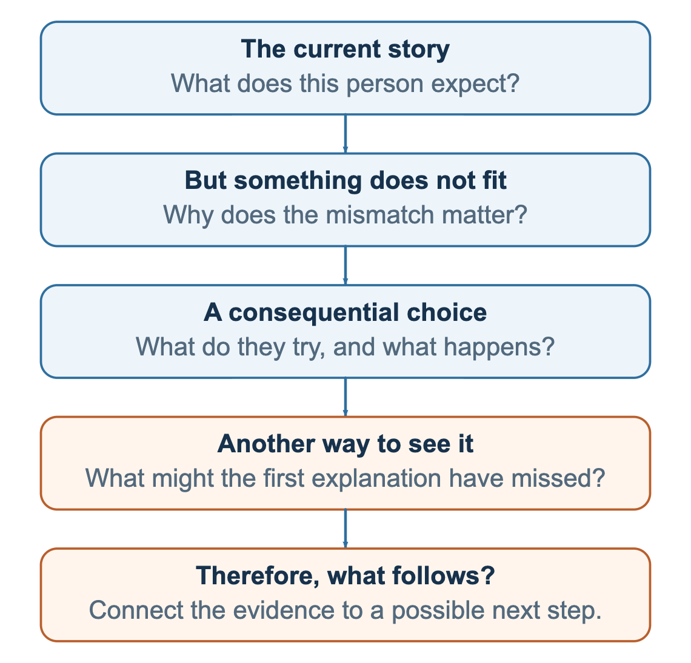<figcaption>Figure 26.1. A persuasive story begins in the audience’s current model, creates meaningful trouble, and resolves in an evidence-supported new model and action.</figcaption></figure>

A useful way to connect storytelling with decision science is through predictive processing and model updating. The mind does not passively receive reality. It predicts, interprets, compares, and updates. Perception, judgment, and action are shaped by prior expectations. The audience is not a blank slate. It arrives with assumptions about the market, the policy, the risk, the speaker, the organization, the other side in a negotiation, and itself.

This is why facts do not speak for themselves. Facts become persuasive only inside a model of what caused them and what follows from them. The same evidence can look like traction, noise, risk, or opportunity depending on the model through which the audience interprets it. Persuasion is therefore not simply information transfer. It is guided model updating.

A persuasive message often follows a sequence: old model, prediction error, new model, proof, and action. First, identify what the audience currently believes. Then create a meaningful mismatch: show what the old model fails to explain. Next, offer a better model that explains the mismatch. Then provide evidence that makes the new model credible. Finally, make the next action feel natural.

Story fits this sequence because story gives model updating a human form. The protagonist begins with a model of the world. Something violates expectation. The protagonist wants control, but reality resists. Action produces feedback. Feedback pressures belief revision. The audience leans in because the model must be updated.

Will Storr's The Science of Storytelling is valuable here because it links storytelling to a predictive, goal-directed, status-sensitive, meaning-making mind. Stories grip us when expectations meet change. A trusted colleague behaves unexpectedly. A weak competitor becomes dangerous. A patient's routine symptom becomes serious. A confident strategy fails. A default option changes behavior more than an expensive campaign. The audience wants to know: What is happening, and what does it mean?

In Decision, Persuasion, and Negotiation, this matters because each domain is a struggle over models. In decision-making, the question is: What model of the situation should guide choice? In persuasion, the question is: What model does the audience currently use, and what would make it update? In negotiation, the question is: What model does each side have of fairness, risk, interests, constraints, and possible agreement?

A story is therefore not a decorative opening. It is model change with a protagonist. It lets the audience experience the old model failing safely, before they are asked to change belief or behavior in real life.

## AND, BUT, THEREFORE

One practical structure for model updating is ABT: AND, BUT, THEREFORE. The AND begins from shared reality: what the audience already accepts. The BUT introduces meaningful contradiction: the prediction error or trouble the old model cannot explain. The THEREFORE offers the new model, solution, or action.

AAA structures are boring because nothing changes. Disconnected lists are confusing because the direction of change is unclear. The BUT is where the mind wakes up.

A product-dump message says: "We are an AI-powered SaaS platform for restaurant inventory optimization." It may be accurate, but it starts with the product and gives the audience no reason to care. A model-updating message says: "Independent restaurants use digital tools, BUT owners still guess demand because existing systems were built for chains. THEREFORE we built a lightweight forecasting assistant." The facts have not simply been made prettier. The second version starts where the audience is, shows what the current model misses, and makes action plausible.

## Why facts alone can fail

It is tempting to believe that persuasion should be simple: provide accurate information, and rational people will update their beliefs. Sometimes this works. If someone lacks information, trusts the source, shares the interpretive model, and is motivated to know the answer, facts can be enough. But many important decisions involve identity, values, risk, uncertainty, social pressure, habits, emotional investment, or threatened status. In these domains, information does not enter a blank mind. It enters an already organized worldview.

Facts alone often fail for several reasons.

First, people have limited attention. A fact that does not feel relevant may never be deeply processed. Story helps by creating curiosity and stakes. When people care what happens next, they allocate attention.

Second, people resist information that threatens identity or prior commitments. Direct argument can trigger counterarguing: the audience begins looking for reasons to reject the message. Narrative can reduce this resistance by inviting people into a simulated world rather than confronting them with a direct demand.

Third, people remember meaning better than isolated data. A statistic can be forgotten; a concrete character in a consequential situation is easier to retrieve from memory.

Fourth, people make decisions partly through emotion and valuation. Emotion is not the enemy of reason. It helps signal importance. A story connects information to human consequence.

Fifth, people often need to imagine future consequences before they act. Story supports mental simulation. It allows people to rehearse possible futures without experiencing them directly.

Sixth, people interpret new claims through their current models. A public health message, climate model, hiring guideline, or negotiation proposal is not merely evaluated as information. It is interpreted as threat, opportunity, insult, evidence, noise, status claim, moral appeal, or request for commitment.

## Rhetoric translated into decision science

Classical rhetoric helps organize this problem, but it becomes sharper when translated into decision science. Ethos asks whether the source should receive weight. In predictive-processing language, it affects the perceived precision or reliability of the message. Pathos asks why the message matters now. It affects relevance, attention, memory, and action-readiness. Logos asks why the explanation holds. It provides causal structure, evidence, and inference. Kairos asks why this moment is the right time. It concerns timing, readiness, salience, and opportunity.

Good persuasion does not choose emotion or reason. It coordinates source reliability, emotional relevance, evidence structure, and timing. A story can do this well because it gives ethos, pathos, logos, and kairos a shared scene. A credible protagonist faces a timely problem. Stakes create relevance. Causality makes the lesson intelligible. Evidence makes the lesson trustworthy.

## The psychology of narrative persuasion

Narrative persuasion is not magic. It can be understood through several mechanisms that convert information into human meaning. These mechanisms often interact. A story captures attention by creating unresolved desire. It creates causality by linking events through because, but, and therefore. It creates emotional relevance by making stakes visible. It supports mental simulation by letting the audience rehearse a situation. It enables identification by giving the audience a mind to follow. It can reduce resistance by drawing the audience into a narrative world. It can shape identity by asking: Who am I if this is true?

Transportation, identification, and mental simulation can reduce counterarguing and make consequences experientially meaningful (Green & Brock, 2000; Cohen, 2001; van Laer et al., 2014).

*Table 26.1. Narrative mechanisms, design questions, and risks*

| Mechanism | Design question | Risk |
| --- | --- | --- |
| Attention | What unresolved question makes the audience want the next event? | Manufactured suspense can hide weak relevance. |
| Transportation | What world is the audience invited to simulate? | Absorption can smuggle assumptions past scrutiny. |
| Identification | Whose goals and constraints can the audience understand? | A single perspective can erase affected others. |
| Emotion and valuation | What should matter if the evidence is understood? | Intensity can exceed the truth of the stakes. |
| Causal simulation | What mechanism links choice to consequence? | A coherent story can be mistaken for causal proof. |
| Memory | What principle will the story make retrievable? | The vivid case may crowd out the base rate. |

## Attention and curiosity

A story begins when something important is unresolved. Someone wants something, but the outcome is uncertain. This creates a gap the audience wants to close. Will the protagonist succeed? What will they do? What will happen next? What does this reveal?

Attention matters because people cannot process everything. In an information-rich world, the first persuasive problem is not only accuracy. It is relevance. A message that does not create a reason to attend may disappear before it is judged. A story opening should therefore begin near disruption, not background. "Our organization was founded in 1986 and has always valued innovation" is rarely a strong opening. "On paper, the new system was perfect. In practice, no one used it" creates a question.

## Transportation

Narrative transportation refers to mental absorption into a story world. When transported, people devote attention, imagery, and emotion to the unfolding narrative. They are not merely evaluating claims from the outside; they are experiencing a situation from within. Green and Brock's work made transportation a central concept in narrative persuasion, and later research, including meta-analytic work by van Laer and colleagues, supports its importance.

Transportation matters because persuasion often fails when people remain outside the message, evaluating it defensively. A transported audience temporarily enters the logic of the story. This does not mean they become irrational. It means they process the claim through simulation rather than only detached critique. In teaching, this suggests that opening with a problem situation can be more effective than opening with a definition. The definition becomes meaningful after the learner has entered the problem.

Transportation also creates risk. A compelling story can smuggle assumptions into experience. A political film can make a misleading causal story feel true. A corporate change story can make a strategy feel inevitable while hiding alternatives. Ethical storytellers must ask: What world am I inviting the audience to enter? What assumptions does that world make? Whose perspective is centered? Whose perspective is missing? What will feel true after the story ends?

## Identification

Identification occurs when audience members imaginatively take the perspective of a character, share goals or emotions, and experience events partly from inside the character's situation. Identification differs from liking. You may identify with a character you do not entirely like because you understand their motives or feel their struggle from within.

Identification matters because it changes the audience's self-position. Instead of asking, "What do I think about those people?" the audience asks, "What would this be like for me?" This can reduce distance and increase empathy. A message about cancer screening may list benefits. But a story about a person who delayed screening because of fear, then wished they had acted sooner, allows the audience to identify with avoidance and regret.

Character fit matters. If the protagonist is too perfect, identification may fail. If the protagonist is too different from the audience, the story may feel irrelevant. A persuasive protagonist does not need to be admirable in every way, but the audience must understand why the protagonist thinks and acts as they do. In public health, a story about poor financial planning, poor diet, or missed appointments is often more persuasive when the protagonist is not portrayed as foolish. Instead, the story should show a normal person facing small temptations, confusing information, fear, cost, habit, and social expectations. The audience can then recognize the decision environment rather than defensively conclude, "That would never be me."

## Self-reference and identity

Narrative persuasion becomes stronger when audiences connect the story to their own lives. Escalas's research on narrative processing and self-referencing in consumer contexts is useful here. More generally, people rarely ask only, "Is this true?" They ask, "What does this mean for me?" A good story helps them answer that question.

Stories also organize identity. People live inside stories about who they are: competent, caring, rational, independent, loyal, fair, hardworking, creative, responsible, misunderstood, resilient, or betrayed. A message that threatens these identity stories may trigger resistance. A sustainability message that says, "You are selfish if you do not change" may fail because it threatens moral identity. A more effective story might show a person who wants to do the right thing but is trapped in a system of convenience, cost, uncertainty, and habit. The story preserves dignity while inviting change.

Narrative persuasion often works by offering a better story of the self: you are not foolish; you were using an incomplete model. You are not weak; you were in an environment designed to trigger habit. You are not irrational; your judgment was shaped by framing, attention, and emotion. You do not have to abandon your identity; you can become a more capable version of it.

## Emotion, value, and memory

Stories persuade because they connect information to value. Emotion is not merely decoration added to cognition. It helps prioritize attention, encode memory, guide action, and signal what matters. In a story, emotion arises from stakes: someone wants something, something could be lost, and the outcome is uncertain. Without stakes, there is little reason to care.

A common mistake in academic and managerial communication is to remove all emotion in the name of objectivity. Objectivity is important for evidence, but persuasion requires significance. A story can preserve accuracy while making significance visible. "The project was delayed by six months" is information. The meaning becomes clearer when we understand who was affected: a small supplier that invested in new equipment, expected a contract, lost revenue, laid off workers, and became reluctant to join future innovation partnerships.

Stories also improve memory because causal and emotional information is easier to retrieve than disconnected details. People remember what someone wanted, what blocked them, what they chose, and what happened. The story provides a retrieval path for the principle.

## Mental simulation

Stories allow audiences to simulate decisions before making them. This is one reason case teaching is powerful. A good case does not simply deliver a conclusion; it places students inside a decision context. They must ask: What do we know? What is uncertain? What are the options? What are the risks? What would I do?

Mental simulation helps people understand causal structure. Instead of passively receiving advice, they rehearse consequences. This makes story especially useful for risk communication, ethics training, leadership development, entrepreneurship, public policy, and negotiation.

An ethics lecture that says, "Conflicts of interest are dangerous" may be less effective than a story in which a researcher accepts a small favor, then a larger favor, and gradually finds it harder to report unfavorable results. The story simulates moral drift. A negotiation lecture that says, "Positions hide interests" may be less effective than a story in which two teams fight over a deadline until they discover that one side needs symbolic reassurance and the other needs operational flexibility.

## Resistance reduction

Narratives can reduce resistance because they do not always feel like direct persuasion. Slater and Rouner's extended elaboration likelihood model and Moyer-Guse's entertainment overcoming resistance model suggest that narrative engagement can reduce counterarguing, reactance, selective avoidance, and perceived invulnerability. Entertainment-education research similarly shows how health and social messages can be embedded in narrative contexts where people follow characters and consequences rather than feeling targeted by a command.

This is especially important when the audience already has reasons to reject a message. If people feel that a message threatens freedom, they may resist. If they feel judged, they may defend themselves. If they believe the problem affects only others, they may ignore it. Stories can lower these defenses by allowing the audience to observe a situation before directly applying the lesson to themselves.

Ethical use is essential. Reducing resistance is not the same as bypassing judgment. The ethical goal is to improve judgment, not close it down.

## Causal stories and causal evidence

Stories persuade because they organize causality. They show how one thing led to another: because the protagonist believed X, they did Y; because they did Y, consequence Z followed; because Z happened, the old belief had to be revised. This is why stories are central in law. Pennington and Hastie's story model of juror decision-making suggests that jurors organize evidence into narrative accounts, compare those accounts to verdict categories, and select the verdict that best fits.

Organizations do something similar after success or failure. They construct stories: the market changed, leadership failed, customers were not ready, the technology was immature, incentives were wrong, or the team lacked discipline. The story determines what the organization learns. If the story is wrong, the organization learns the wrong lesson.

This creates a discipline: distinguish causal story from causal evidence. What mechanism does the story imply? What evidence supports that mechanism? What alternative story could explain the same events? What base rates or comparison cases are missing? What role did luck play? What structural factors are hidden by focusing on one character?

## The power - and danger - of one

Stories often persuade through one face, one name, one family, one patient, one customer, one employee. This can be morally important because large numbers can become abstract. A single person can restore emotional reality. Research on the identifiable victim effect and psychic numbing shows that people often respond more strongly to a single identifiable person than to statistical victims.

But the same mechanism can distort judgment. One vivid victim may receive attention while many unseen victims are neglected. A rare disease with a compelling story may attract disproportionate funding. A dramatic crime may shape policy more than widespread harms. A single customer complaint may dominate managerial attention even when broader data point elsewhere.

The ethical challenge is to connect story and scale. A good humanitarian message may begin with one person's story, then connect it to accurate statistics: this is one person, and the evidence shows how common or rare this pattern is. The story creates attention and care; the statistic creates proportion. Together they support responsible action.

<aside class="callout evidence-and-boundary-conditions">
EVIDENCE AND BOUNDARY CONDITIONS

A vivid story can create a strong causal impression from one unrepresentative case. Narrative should illuminate evidence, not replace base rates, comparison groups, or uncertainty.
</aside>

## Key ideas

- A story persuades differently from an argument because it lets an audience simulate a person pursuing a goal under constraint, experiencing consequences, and revising a model of the world.
- Distinguish information, example, anecdote, case, and story.
- Explain narrative transportation, identification, and mental simulation.
- Explain story as model updating.

## Study and practice

1. How would you distinguish information, example, anecdote, case, and story?

2. How would you explain narrative transportation, identification, and mental simulation?

3. How would you explain story as model updating?

<aside class="callout activity">
ACTIVITY

Take one abstract claim from the course. Write a protagonist, goal, obstacle, stakes, choice, and turning point that make the mechanism visible. Then add the statistic that shows scale and representativeness. EXPERIENCE - EXPLAIN - APPLY (MAXIMUM 120 WORDS) Experience: describe one specific decision, interaction, or observation. Explain: use one or two concepts from this chapter accurately. Apply: state one improvement, implication, or testable prediction.
</aside>

# Chapter 27. Building an Evidence-Aligned Story

*ABT, STORY, evidence, applications, and ethics*

<aside class="callout core-idea">
CORE IDEA

A persuasive story begins in the audience&#x27;s current model, creates meaningful trouble, follows a protagonist through choice and consequence, and resolves in a new model supported by proportionate evidence and an actionable next step.
</aside>

## Learning goals

- Use ABT and STORY as drafting tools.
- Integrate narrative with an evidence ladder.
- Adapt story to identity, resistance, and context.
- Identify ethical failures such as false causality, stereotype reinforcement, and manufactured urgency.

Many weak arguments fail because they begin with what the speaker wants to say rather than with what the audience currently believes. A conventional argument asks: What information do I want to deliver? A narrative persuasion approach asks: What belief does the audience currently hold, why does that belief make sense to them, what resistance prevents change, and what story would allow them to experience the limits of that belief?

The audience already has a story. They have beliefs about what is normal, fair, risky, trustworthy, costly, and possible. They have identities they are protecting and losses they fear. A story that ignores the audience's current worldview may be rejected before it is understood. Good persuasion begins inside the audience's model, then shows where that model stops working.

## Design the change

### Begin with the audience's current story

Begin by identifying what the audience currently believes. This belief may be explicit or implicit. Examples include: "Good decisions come from careful reasoning." "If people know the facts, they will change." "Innovation begins with a great idea." "Bias is something that happens to other people." "Customers choose the product with the best objective value." "Data-driven decision-making means surveillance." "Negotiation is about defending positions."

A persuasive story begins where the audience is, not where the speaker wishes they were. This is empathy, not manipulation. To change someone's mind, begin inside the story they already use to make sense of the world.

### Hidden resistance and protected identity

Next, identify why the audience may resist the new idea. Resistance may come from identity, habit, incentives, social pressure, fear, pride, confusion, mistrust, prior experience, or a legitimate constraint. Managers may resist behavioral science because it seems to imply that people are irrational. Students may resist statistics because they fear mathematics. Employees may resist data-driven decision-making because it feels like loss of professional judgment. Consumers may resist sustainability messages because they feel accused or powerless.

A good story does not ignore resistance. It dramatizes it. It lets the audience see why the old belief was attractive, useful, or protective - and why it is incomplete.

### Protagonist, goal, and stakes

A persuasive story needs a protagonist. The protagonist can be a patient, customer, employee, scientist, student, manager, parent, entrepreneur, citizen, negotiator, team, organization, community, or even a field of research. But the audience needs someone through whom to experience the situation.

The protagonist must want something. Without a goal, there is no story movement. The goal can be external - get treatment, launch a product, pass an exam, save money, negotiate agreement, reduce emissions, protect a team, survive a crisis. It can also be internal - preserve dignity, be seen as competent, belong, avoid shame, regain control, become honest, or act courageously.

Stakes answer why the goal matters. What happens if the protagonist fails? What is lost? Who is affected? Why now? Weak version: "A company needed to improve innovation." Stronger version: "A family-owned company had survived for thirty years by relying on craftsmanship and flexibility. But as older experts approached retirement, the knowledge that made the company special was at risk of disappearing." The stronger version gives the audience something to care about.

### Conflict, obstacle, and misbelief

Conflict is the engine of persuasion. It does not require melodrama. Conflict is the gap between desire and obstacle. The obstacle may be external, internal, interpersonal, institutional, or moral. External obstacles include money, time, tools, information, access, or opportunity. Internal obstacles include fear, shame, habit, craving, misbelief, identity threat, and overconfidence. Interpersonal obstacles include mistrust, competing interests, status threats, and social norms. Institutional obstacles include incentives, bureaucracy, metrics, silos, and culture. Moral obstacles include competing values and trade-offs.

The deepest persuasive stories do not merely show the protagonist receiving information. They show the protagonist's old belief becoming less workable and a new belief becoming more adaptive. A manager's misbelief may be, "If I ask for input, I will look weak." A student's misbelief may be, "If I do not understand immediately, I am not smart." A negotiator's misbelief may be, "If I reveal interests, I will be exploited." A patient's misbelief may be, "If I avoid the test, I avoid the disease." An organization's misbelief may be, "Our culture is already transparent because leaders are approachable."

Persuasion occurs when reality pressures that misbelief.

### Turning point, evidence, and change

A turning point is not merely an event. It is an event that forces reinterpretation. The dashboard that everyone ignored reveals that the problem was trust, not technology. The structured interview reveals that intuition was responding to confidence, not evidence. The data pattern reveals that a team has a decision problem, not a data problem. The negotiation question reveals that the deadline is about reassurance, not stubbornness.

A persuasive story then needs evidence. Evidence shows that the story is not just an anecdote. It can take the form of data, research, comparison cases, mechanism, repeated interviews, prototype tests, behavior patterns, or credible expert knowledge. Evidence is not the enemy of story. It is what keeps story from becoming manipulation.

Finally, something must change. The protagonist acts differently, sees differently, or chooses differently. The audience should not merely feel something; they should see differently. The new model may be a concept, framework, theory, principle, behavior, or decision rule.

## Practical story tools

<figure class="book-figure">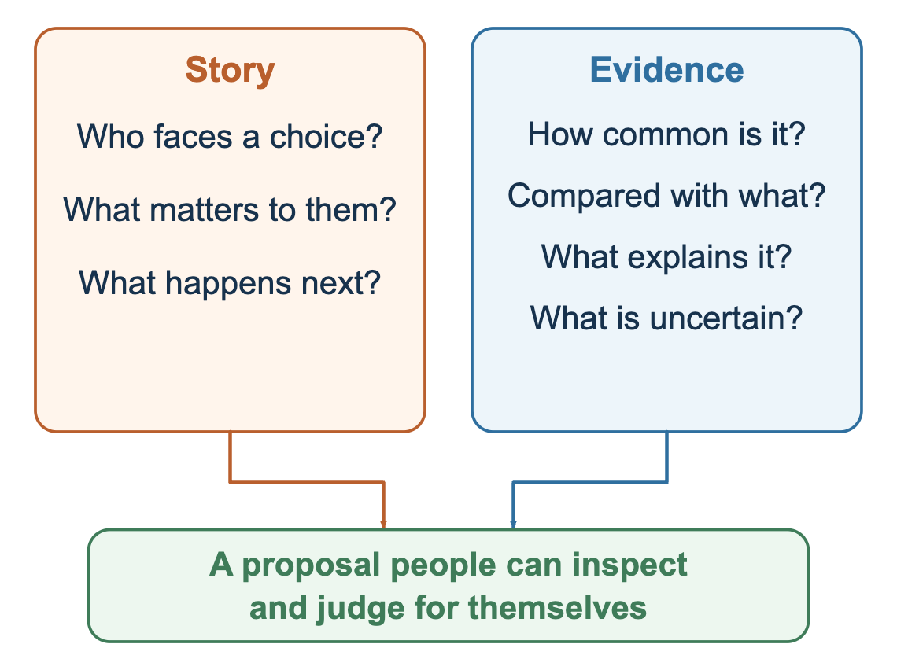<figcaption>Figure 27.1. An ethical persuasive story braids human meaning with base rates, mechanisms, comparisons, and uncertainty.</figcaption></figure>

The Decision, Persuasion, and Negotiation course treats story not as performance theater but as a practical tool for ethical model updating. Three tools are especially useful: ABT, STORY, and SUCCESs. ABT gives the smallest causal spine; STORY is a course-specific pitch framework; SUCCESs is a post-draft editing checklist. These are drafting aids, not substitutes for evidence.

### The ABT spine

ABT stands for AND, BUT, THEREFORE. AND establishes shared reality or the current pattern. BUT introduces the meaningful complication, conflict, or anomaly. THEREFORE states the consequence, change, or next move. The form is useful because a sequence of ANDs merely accumulates facts, whereas BUT creates a question and THEREFORE gives the argument direction (Olson, 2015).

### SUCCESs as an editing check

After the causal spine is clear, SUCCESs asks whether the message is Simple, Unexpected, Concrete, Credible, Emotional, and carried by Stories. The checklist is valuable when it improves comprehension and memory; it becomes dangerous when memorability is used to disguise weak evidence (Heath & Heath, 2007).

## The STORY framework

In entrepreneurship and applied persuasion, a longer structure is often needed. The STORY framework can be used in two closely related versions. In a business pitch, S often stands for stakeholder. In broader persuasive communication, S can stand for shared reality. The logic is the same: start from the audience's decision, not from your information.

A one-sentence STORY pitch can be written as: For [specific stakeholder] trying to [goal], [trouble] causes [cost, risk, or frustration], but [change or insight] creates a new opportunity; therefore [solution or idea] creates [value], supported by [evidence], and asks for [specific next step].

This structure prevents two common failures. First, it prevents product-first or speaker-first communication. The audience does not begin by caring what you built, what you know, or how impressive you are. It begins by caring about its own decision, risk, values, and cost of action. Second, STORY prevents evidence from becoming a data dump. A number should change what the audience believes about the story. If a statistic does not change the story, it is probably decoration.

## The evidence ladder

Story opens attention; proof earns trust. A practical evidence ladder helps move the weakest important claim one level higher. In a business pitch, "customers want this" is an assertion. One named customer story is better, but still weak. A repeated pattern across interviews is stronger. A prototype or demo shows that the mechanism works in practice. Traction shows that users pay, return, refer, or expand. Economics shows that the model can create and capture value.

The story tells us which claim matters. The evidence ladder tells us how risky that claim still is.

## Fluency: power and danger

Cognitive ease matters because messages are processed under limited attention. Legible structure, repeated core phrases, familiar words, and concrete language can reduce confusion and suspicion. This is not "dumbing down." It is respecting the audience's limited attention.

But ease is dangerous when it helps falsehood travel. Repetition can make claims feel familiar. Familiarity can feel like truth. Rhymes, simple slogans, vivid images, and fluent stories can make weak evidence feel stronger than it is. Ethical persuasion makes true things easier to understand, not false things easier to believe.

## The story-evidence braid

Some people distrust storytelling because stories can mislead. This concern is justified. A vivid anecdote can overpower base rates. A single emotional case can distort policy judgment. A manipulative story can hide weak evidence. A memorable narrative can make false claims feel true.

Narrative evidence is most defensible when a case is connected to representative data rather than allowed to substitute for base rates (Small et al., 2007; Slovic, 2007; Dahlstrom, 2014).

But the solution is not to abandon story. The solution is to integrate story and evidence responsibly.

Evidence without story can be ignored. Story without evidence can mislead. Story with evidence can make truth usable.

A useful structure is: story, evidence, mechanism, implication, return to story. Begin with a concrete situation that creates curiosity. Use evidence to show that the situation represents a broader pattern. Explain the mechanism that connects the story to the evidence. Translate the insight into action. Return to the story so the audience can see what the evidence means in lived experience.

For example, a public health message might begin with a patient who misses a screening appointment because the reminder letter is confusing and frightening. Evidence shows that missed appointments are common, especially among patients facing administrative burdens. Mechanism explains how complexity, fear, and friction reduce follow-through. Solution proposes simplified reminders, easy rescheduling, and planning prompts. The story resolves when the redesigned system helps the patient attend. The story does not replace the evidence. It makes the evidence psychologically available.

Use data to show scale; use story to show meaning. Data answers: How common is this? How large is the effect? How reliable is the pattern? Story answers: What does this mean in lived experience? Why should we care? How does the mechanism unfold? What action becomes possible?

## Applications across domains

### Teaching and academic writing

Academic writing often underuses story because it fears appearing unscientific. But story does not require exaggeration or sentimentality. A scientific argument can use narrative structure while preserving rigor. A strong academic chapter can be organized as a story of intellectual discovery: a field begins with a dominant assumption, an anomaly appears, existing theories struggle to explain it, researchers develop new models, evidence accumulates, the field's understanding changes, and new questions emerge.

For example, a chapter on heuristics and biases can be written as a narrative of changing assumptions about rationality. A chapter on predictive processing can be written as a story about the movement from perception as passive reception to perception as active inference. A chapter on habits can be written as a story about the limits of conscious intention.

In teaching, story creates intellectual need. Do not merely explain the concept. Tell the story of why the concept is needed. Instead of beginning with the definition of loss aversion, begin with a person who refuses to sell a stock at a loss while ignoring better investment opportunities. Instead of beginning with base rates, begin with a doctor facing a positive test result and a patient asking, "Do I have the disease?" Instead of beginning with two systems of thinking, begin with the bat-and-ball problem, where intuition gives a fluent but wrong answer. Instead of beginning with decision hygiene, begin with two reviewers giving opposite recommendations on the same paper.

A good classroom story should be concrete enough to imagine, short enough not to dominate, tied to a clear concept, designed around a decision or puzzle, and followed by analysis. Story should create the need for theory, not substitute for theory.

### Leadership and change

Leaders often try to change organizations through plans, metrics, and directives. These are necessary, but not sufficient. Organizational change requires people to revise shared meaning. A new strategy asks people to stop doing some things and start doing others. That threatens habits, status, identity, competence, and belonging. A spreadsheet cannot fully address those concerns. A story can.

Employees want to know: Why must we change? Why now? What is wrong with the old way? What happens if we do not change? What will be lost? What will be protected? What will this require of people like me? What does success look like in everyday behavior? What kind of organization are we becoming?

Leadership stories can answer these questions. A burning-platform story explains why the status quo is no longer safe, but it should be used carefully because exaggerated fear destroys trust. A bridge story connects old identity to new direction: we are not abandoning who we are; we are preserving what matters by changing how we work. A future-in-action story shows what the desired future looks like in a specific behavior.

Instead of saying, "We need knowledge sharing," a leader might tell a story about a machine breakdown that only one technician knew how to fix, and how the team realized that expertise locked in one person's head was not resilience. The story honors the expert and reframes documentation not as bureaucracy but as protecting craftsmanship.

Instead of saying, "We need psychological safety," a leader might tell a story about a junior employee who noticed a flaw but stayed silent because previous warnings had been dismissed. The story makes silence visible.

Leadership stories should not be propaganda. They should name real tensions, acknowledge loss, explain trade-offs, connect to values, and identify credible action. A story without obstacles feels like a slogan. A credible change story acknowledges that change costs something.

### Marketing and entrepreneurship

Marketing often fails when it makes the product or organization the hero. A product-centered message says: "Our platform integrates data across departments." A story-centered message asks: What problem does the customer face, what future do they want, what obstacle blocks them, and how does the product help them move forward?

This is the central insight of Storynomics. The customer is usually the protagonist. The product is not the story; it is part of the customer's story. A software company could say, "Our platform integrates data across departments." That is accurate but abstract. A story version might say: "A project manager spends every Monday morning reconciling numbers from three departments. Finance has one version, sales has another, and operations has a third. By the time the team agrees on what happened last week, it is too late to make a good decision for this week. The platform gives them one shared view before the meeting begins." The story shows pain, obstacle, cost of inaction, and value of the solution.

Entrepreneurs face a special persuasion problem. They must persuade before the future is observable. Customers must believe the product solves a real problem before they have tried it. Investors must believe the venture can become valuable before the numbers exist. Partners must believe cooperation is worth scarce attention and resources. Employees must believe the mission and upside justify uncertainty.

A startup pitch is therefore a structured answer to uncertainty: Why should I believe, care, trust, and act now? A strong entrepreneurial story does not begin with the founder's passion. It begins with the stakeholder's trouble.

In a pitch, confidence without evidence becomes hype; evidence without conviction becomes a report. A good pitch combines story, proof, and a specific ask. It explains the stakeholder, trouble, opportunity, resolution, and yes. It also names uncertainty honestly. Investors and partners often ask prevention questions because they are managing risk: How big is the market? Why will customers switch? Why can't incumbents copy? What if the technology fails? What do you need the money for? The persuasive answer addresses the risk behind the question, then bridges back to the opportunity story.

### Science, health, and policy

Science communicates through evidence, models, uncertainty, and mechanisms. Public understanding often requires narrative. A story can help non-expert audiences understand causality, consequences, and relevance. Antibiotic resistance can be explained through molecular mechanisms, but a story about a patient whose infection no longer responds to common antibiotics, connected to the mechanism of overuse and bacterial evolution, makes the issue concrete. Climate change can be explained through atmospheric physics, but stories about farmers, coastal communities, insurance markets, heat waves, and infrastructure make consequences visible.

Health communication often uses patient narratives because narratives can increase attention, comprehension, recall, and emotional engagement. They may be especially useful when audiences face fear, low literacy, mistrust, or low perceived relevance. But health narratives must be used carefully. A rare side-effect story can deter beneficial treatment. A miracle recovery story can create false hope. A personal testimonial can be powerful even when scientifically weak.

Policy communication faces similar risks. A story about one family harmed by regulation may obscure broader benefits. A story about one person helped by a program may obscure inefficiency or unintended consequences. A story about one crime may distort perceptions of crime rates. Responsible policy stories should be accurate, representative when used for general claims, connected to scale, and honest about trade-offs.

### Stories in negotiation

Negotiation is a contest of stories. Each side has a story about what happened, what is fair, what the other side wants, who has been reasonable, and what agreement would mean. A price is not just a number. It signals respect, value, power, fairness, and relationship. A concession is not just movement. It can mean flexibility, weakness, goodwill, or strategic retreat. A deadline can mean urgency, pressure, manipulation, production risk, or symbolic seriousness.

Good negotiators use stories to explain interests, not just positions. Instead of saying, "We need delivery by June 1," a negotiator might explain: "Our production line shuts down on June 5 if the component is not installed. A delay would force us to cancel customer orders and send workers home." The story reveals why the date matters and may open creative solutions.

Stories can humanize constraints. An employee can tell a story about childcare scheduling that makes flexibility meaningful. A supplier can tell a story about previous last-minute changes that created costly disruptions, explaining why predictability matters. Stories can reframe conflict: a dispute over penalties can become a story about trust, risk, and performance confidence. Stories can also help parties imagine a shared future: What would success look like six months after this agreement?

But stories in negotiation must be used carefully. A manipulative sob story can backfire. A blame story can harden conflict. A story that reveals vulnerability without strategic thought can be exploited. The best negotiation stories are specific, honest, and linked to interests.

A useful negotiation question is: What story is the other side telling itself about fairness? If you do not understand that story, your arguments may miss. If you can respectfully reshape that story, persuasion becomes possible.

## Ethics and common failure modes

### Ethical storytelling

Stories can enlighten, but they can also manipulate. A vivid story can make rare events seem common. A heroic story can justify reckless action. A victim story can erase broader statistics. A national story can dehumanize outsiders. A brand story can manufacture identity anxiety. A political story can turn complexity into scapegoating. A personal story can be used to silence structural analysis. A success story can create survivorship bias.

Narrative persuasion is dangerous when it helps people see one thing by making everything else disappear. Because stories work through emotion, identification, and simulated experience, they can narrow critical scrutiny. Ethical storytelling is therefore not a decorative final topic. It is part of responsible message design.

### Common mistakes

## Worked transformations

### From argument to story

Suppose you want to persuade readers of this claim: habits are not simply repeated choices; they are cue-triggered behavioral patterns shaped by context and reward. A purely explanatory paragraph might define habits, cite studies, and describe cue-routine-reward loops. That is useful, but it may not persuade readers who believe behavior is mainly a matter of willpower.

A story-based approach proceeds differently. First, identify the existing belief: "If I really wanted to change, I would just choose differently." Second, identify the resistance: people fear that explaining behavior through habit undermines responsibility. Third, create a protagonist: a professor wants to stop checking email late at night. Fourth, introduce the pattern: after putting his child to bed, he sits on the sofa "just for five minutes," the phone is nearby, a notification appears, and thirty minutes disappear. Fifth, show failed effort: he tells himself to be disciplined, deletes the app, reinstalls it, feels guilty, and repeats the behavior. Sixth, reveal the new model: the problem is not simply weak willpower. The environment contains cue, routine, and reward: fatigue, phone visibility, notification, professional anxiety, and relief. Seventh, translate to action: he charges the phone outside the living room, turns off notifications, and creates a replacement routine. The behavior changes not because his character changed, but because the cue structure changed.

Now the concept becomes persuasive. The story allows readers to experience the limits of the willpower model before introducing the habit model.

### Worked example: structured hiring

Persuasive goal: convince managers to use structured hiring interviews.

Information-only version: "Structured interviews have higher validity than unstructured interviews. They reduce bias and noise by asking comparable questions and using predefined criteria."

Story version: Maria had hired dozens of people and believed she was good at reading candidates. In one interview, a candidate from a familiar university spoke confidently about teamwork and leadership. Maria felt an immediate connection. Another candidate was quieter, less polished, and from an institution Maria did not know well. The team hired the first candidate. Six months later, performance problems appeared: missed deadlines, poor collaboration, and resistance to feedback. During a later review, Maria reread the interview notes and realized there were almost none. She had recorded impressions, not evidence. When the company introduced structured interviews, she resisted at first. They felt mechanical. But after using the same job-relevant questions and scoring evidence separately, she noticed something uncomfortable: her "intuition" had often been confidence responding to confidence. The structure did not replace her judgment. It gave her judgment something better to work with.

This story begins inside the manager's existing belief: "I can read people." It introduces conflict: intuitive confidence produces error. It creates a turning point: rereading the notes reveals the absence of evidence. It offers a new model: structure improves judgment rather than replacing it. It then prepares the audience to accept the research.

### Worked example: behavior change

Persuasive goal: show that motivation alone is not enough for behavior change.

Information-only version: "Behavior depends on motivation, ability, and prompt. Because motivation fluctuates, behavior change should focus on making actions easier and attaching them to reliable cues."

Story version: Jonas wanted to start running. Every Sunday night he promised himself that Monday would be different. He imagined waking early, running five kilometers, showering, and beginning work energized. On Monday morning, the alarm sounded. It was dark. His shoes were in the hallway closet. He did not know where his running shirt was. His phone was next to the bed. Ten minutes later, he was reading messages. By breakfast, he felt he had failed again.

Then he changed the problem. Instead of trying to become a runner at 6 a.m., he made the first behavior tiny. After brushing his teeth, he would put on running shoes. That was all. The first morning felt almost silly. But he did it. He smiled and said, "I showed up." The next day he stepped outside. A week later, he walked around the block. The change began not with stronger motivation but with a smaller action and a clearer cue.

This story persuades because the audience recognizes the old pattern. It dramatizes the new principle: design beats self-blame.

### Worked example: data-driven decision-making

Persuasive goal: show that data alone do not improve decisions unless judgment systems change.

Information-only version: "Data-driven decision-making requires not only access to data but also decision processes that clarify goals, interpret evidence, reduce bias, and support learning."

Story version: The leadership team had finally built the dashboard they wanted. Sales, costs, customer satisfaction, churn, productivity, and employee engagement appeared in real time. For the first month, everyone was impressed. By the third month, meetings had become worse. Each manager picked the number that supported their prior view. Sales pointed to revenue. Operations pointed to cost. HR pointed to burnout risk. The CEO asked for "more data."

The turning point came when a junior analyst said, "We do not have a data problem. We have a decision problem." The team began each meeting by writing the decision question first, then listing what evidence would matter, what base rates applied, and what would change their minds. The dashboard did not become less important. It became useful only when placed inside a better judgment process.

This story challenges a common misbelief: more data automatically means better decisions. It shows the inner shift from data accumulation to decision hygiene.

### Worked example: negotiation deadline

Persuasive goal: explain why a delivery deadline matters without making it sound like an arbitrary demand.

Information-only version: "We need delivery by June 1."

Story version: Last year, a component arrived four days late. The delay looked small on paper. But the production line had been scheduled tightly, customers had already booked installation dates, and workers were assigned to shifts that depended on the component arriving. By June 5, the line was stopped, customer orders were rescheduled, and the team had to explain a preventable delay. This year, the June 1 date is not a preference; it is the point that keeps the rest of the system from failing. We are willing to discuss price, batch size, or earlier partial delivery, but we need a plan that protects that date.

This story explains an interest without revealing a reservation value. It humanizes the constraint and opens problem-solving rather than simply asserting a position.

## Advanced craft and judgment

### Story under information overload

Modern audiences face too much information. They filter aggressively. Attention is scarce and trust is fragile. This is one reason storytelling has become central in business, education, politics, science communication, leadership, marketing, public health, and negotiation.

The solution is not to make every message emotional or dramatic. The solution is to make communication meaningful. Story helps because it organizes information around human intention, conflict, causality, and consequence.

In an information-rich world, the question is not only: Is this true? It is also: Why should anyone care, remember, and act on it? A story answers by showing relevance. It does not merely claim importance; it demonstrates importance through experience.

The strongest persuasion often combines narrative and analysis: story creates curiosity, concept explains what happened, evidence shows the pattern is not isolated, implication shows what should change, and return to story reinterprets the opening case through the new model. This structure respects both the narrative mind and the analytical mind. It does not force a false choice between story and science.

### Familiarity plus surprise

Raymond Loewy's design principle MAYA—most advanced yet acceptable—also applies to persuasive stories. Research on industrial design similarly finds that novelty and typicality can jointly shape aesthetic preference, although this is not a universal law of storytelling (Hekkert et al., 2003). A story that is too familiar may be boring because it creates no update. A story that is too strange may be rejected because the audience cannot enter it. Good persuasion often combines familiarity with surprise. It starts inside the audience's current model and then introduces a discrepancy that is close enough to understand but strong enough to matter.

In storytelling terms, familiarity gives the audience a door. Surprise gives them a reason to walk through it. A public-health story about screening is stronger when the protagonist is not a cartoon of irresponsibility, but a recognizable person facing fear, inconvenience, family obligations, and uncertainty. The surprise is not that the person is foolish. The surprise is that good intentions can fail when the system makes action hard.

### Numbers, images, metaphors, and scale

Numbers alone often fail because people struggle to feel scale. This does not make numbers unimportant. It means numbers need representation. A statement such as "the richest 1% own 31% of the wealth" may be accurate, but many listeners cannot picture the distribution. A metaphor can translate scale: imagine a 100-apartment building in which one person owns 31 apartments, ten people own 70 apartments, and the bottom half share only a tiny fraction of the building. The image does not replace the statistic. It makes the statistic imaginable.

Metaphor also frames causal models. In experiments on crime metaphors, describing crime as a wild beast increased support for capture-and-punishment responses, whereas describing it as a virus increased support for diagnosis and prevention (Thibodeau & Boroditsky, 2011). Both metaphors may highlight something real, but each also hides something. A beast metaphor can hide social causes; a virus metaphor can hide agency and harm. Ethical metaphor use requires asking what the metaphor makes visible and what it makes invisible.

Vivid images work for the same reason. A horse-sized syringe, for example, can make an otherwise abstract scale immediately perceptible. The craft lesson is not to exaggerate. It is to convert abstraction into perception. If the audience cannot see, hear, feel, or imagine the implication, the message may remain inert.

### Responsible compassion

The identifiable-victim effect is often illustrated with a named-child charity example: people may respond more strongly to one identifiable person than to statistics about many thousands. This chapter has already discussed the identifiable-victim effect and psychic numbing. The practical response is to combine compassion with scale. A story of one person can open the heart; evidence must then show how that person connects to the broader pattern.

A responsible humanitarian message might say: "This is one person's story, and it is one window into a broader problem affecting many people." An irresponsible message lets the audience infer that the most vivid case is the typical case, or lets one moving story determine policy without base rates, comparison cases, or unintended consequences. Ethical storytelling does not ask us to feel less. It asks us to connect feeling to proportion.

### Associative backfire

A message can activate the very association it tries to defeat. A campaign attacking a slogan may repeat the opponent's slogan so vividly that the opponent's frame becomes more memorable. A phrase such as "Make America Sick Again" can unintentionally pair one's own side with sickness because the mind often keeps the image after it forgets the negation. The shift from "Don't be evil" to "Do the right thing" illustrates a related principle: negated frames can still keep unwanted concepts active.

The same risk appears in storytelling. Graphic descriptions, humiliating examples, or vivid depictions of harmful behavior can make the wrong image travel. Fear appeals can capture attention but collapse agency. A story about cheating may accidentally teach methods. A story about corruption may make corruption feel normal. Before using a vivid story, ask: what picture, emotion, and association will remain in the audience after the argument fades?

### Concrete writing

The persuasion materials offered a practical writing rule: use strong verbs and nouns; minimize empty adjectives. "Innovative" is weak when it floats alone. It becomes stronger when the writer shows what is new, who benefits, what obstacle was overcome, and what changed. "Customer-centric" is weak when it is a label. It becomes stronger when a story shows an employee solving a customer's problem differently because the organization changed authority, information, or incentives.

The same applies to academic writing. "Important," "complex," "significant," and "transformative" are often claims waiting for stories. The writer should ask: important for whom, complex in what way, significant compared with what, and transformative because what changed? Concrete verbs and nouns force causal clarity.

### Story as a technology of meaning

Storytelling is not merely a communication technique. It is a technology of meaning. It helps people attend, care, imagine, remember, and act. It is persuasive because it fits how people make sense of reality: through agents, goals, obstacles, emotions, causes, consequences, identity, and change.

For decision-making, storytelling is especially important because decisions are rarely made in response to facts alone. People decide within narratives about who they are, what matters, what is possible, what others expect, and what future they want to avoid or create.

The practical lesson is simple but profound: do not merely tell readers what is true. Help them experience why the truth matters.

A persuasive story begins with the audience's current model of reality. It introduces a meaningful disruption. It follows a protagonist through conflict and choice. It reveals the limitations of the old model. It offers a better model. It grounds that model in evidence. And it invites the audience to carry the new model into their own decisions.

Used ethically, story does not weaken reason. It gives reason a human form.

<aside class="callout evidence-and-boundary-conditions">
EVIDENCE AND BOUNDARY CONDITIONS

Story frameworks are practical writing tools, not scientific laws. A memorable structure cannot rescue false evidence, a hidden conflict of interest, or a recommendation that removes meaningful choice.
</aside>

*Table 27.1  Information, example, anecdote, case, and story*

| Form | What it does | Example | Limitation |
| --- | --- | --- | --- |
| Information | States facts, events, features, dates, or numbers. | "Employee engagement increased by 12%." | May not show why the change was difficult or meaningful. |
| Example | Clarifies a concept by illustrating it. | "Netflix is an example of business-model innovation." | May not create tension, cause, stakes, or transformation. |
| Anecdote | Provides a vivid individual case. | "One customer waited three hours and gave up." | Can be unrepresentative and can overpower base rates. |
| Case | Describes a real or hypothetical situation for analysis. | A company adopts a feedback system and engagement rises. | May remain descriptive unless it shows inner conflict and meaning change. |
| Story | Shows motivated action under constraint and change through cause and consequence. | Sara resists anonymous feedback, sees that her competence has become a bottleneck, changes her meeting ritual, and creates a habit of honesty. | Can mislead if causality, evidence, or representativeness is distorted. |

*Table 27.2  An ethical story audit*

| Principle | Guiding question | Warning sign |
| --- | --- | --- |
| Truthfulness | Is the story factual, composite, or fictional, and is that clear? | Invented realism or altered key facts. |
| Representativeness | Does the case reflect a broader pattern supported by evidence? | Anecdote pretending to be a base rate. |
| Dignity | Are people more than props, victims, villains, or stereotypes? | Humans reduced to symbols or emotional instruments. |
| Complexity | Is causality simplified without becoming false? | One villain explains everything. |
| Transparency | Does the audience know what kind of story this is? | Composite or illustrative stories presented as single real cases. |
| Evidence alignment | Does the story illuminate evidence rather than replace it? | The story is used to hide weak or missing evidence. |
| Agency | Does the story expand action possibilities? | Fear, shame, or identity threat without a path forward. |
| Plurality | Are important missing perspectives acknowledged? | The story prevents the audience from seeing anything else. |
| Proportion | Does emotional force match the real significance of the issue? | Rare cases presented as common without scale. |
| Actionability | Does the story point toward a meaningful response? | Distress without a credible path. |

## Key ideas

- A persuasive story begins in the audience's current model, creates meaningful trouble, follows a protagonist through choice and consequence, and resolves in a new model supported by proportionate evidence and an actionable next step.
- Use ABT and STORY as drafting tools.
- Integrate narrative with an evidence ladder.
- Adapt story to identity, resistance, and context.

## Study and practice

1. How would you use abt and story as drafting tools in practice?

2. Integrate narrative with an evidence ladder?

3. Adapt story to identity, resistance, and context?

<aside class="callout activity">
ACTIVITY

Draft a ninety-second persuasive story using AND-BUT-THEREFORE. Add one piece of evidence at the appropriate level, one honest uncertainty, and one action the audience can freely accept or reject. EXPERIENCE - EXPLAIN - APPLY (MAXIMUM 120 WORDS) Experience: describe one specific decision, interaction, or observation. Explain: use one or two concepts from this chapter accurately. Apply: state one improvement, implication, or testable prediction.
</aside>

# Chapter 28. Communication Is Joint Inference

*Words are the visible tip; context and relationship do the hidden work*

<aside class="callout core-idea">
CORE IDEA

Better communication is not simply clearer speaking. It is the joint construction of meaning, trust, responsiveness, and shared reality between people whose minds are partly hidden from one another.
</aside>

## Learning goals

- Explain communication as grounding rather than transmission.
- Describe the health and decision value of social connection.
- Explain egocentric projection, false consensus, and illusion of transparency.
- Use perspective-getting instead of confident mind-reading.

Connection is not a luxury. It is part of human functioning.

A large body of research links social relationships to physical health, mental health, resilience, and longevity. Holt-Lunstad et al. (2010) meta-analysis found that stronger social relationships were associated with lower mortality risk, with an effect size comparable to several well-known health risk factors. Later reviews have continued to emphasize social connection as a major determinant of health (Holt-Lunstad, 2021; Snyder-Mackler et al., 2020). Loneliness and social isolation are associated with increased risks for depression, cognitive decline, cardiovascular problems, inflammation, and mortality (Cacioppo et al., 2014; Eisenberger & Cole, 2012).

Social connection also affects pain and threat. Eisenberger et al. (2003) showed that social exclusion activates neural systems associated with distress. Coan et al. (2006) found that holding a spouse’s hand reduced neural responses to threat, especially in high-quality relationships. Master et al. (2009) found that looking at a romantic partner’s photograph reduced experimentally induced pain. These findings illustrate a broader principle: trusted relationships help regulate the body.

Connection also matters for work and creativity. Social networks provide information, opportunities, feedback, emotional support, and access to diverse perspectives. People with richer networks often have more professional opportunities, but the quality of connection matters more than the number of contacts. A large network of shallow or stressful ties is not the same as a smaller network of supportive relationships.

Relationship quality is crucial. Supportive relationships are beneficial. Aversive relationships are stressful but often predictable. Ambivalent relationships—relationships that both help and hurt—can be especially stressful because they are unpredictable. A colleague, sibling, parent, spouse, or friend who alternates warmth and criticism can create vigilance: will this interaction support me or wound me? Research on ambivalent ties suggests that mixed relationships can be associated with physiological stress and worse well-being than clearly negative ties in some contexts (Holt-Lunstad et al., 2007; Uchino, 2006).

This matters for decision-making. People do not make good decisions when socially threatened, isolated, or chronically stressed. A student without belonging may interpret difficulty as proof of inadequacy. An employee in an ambivalent relationship with a manager may hide problems. A negotiator who feels disrespected may reject value-creating proposals. A patient who does not trust a doctor may not reveal important information. Connection is decision infrastructure.

A practical implication is to audit relationship quality, not only relationship quantity.

Which relationships are supportive? Which are aversive but predictable? Which are ambivalent and stressful? Which people help you think more clearly? Which people make you defensive, smaller, or chronically vigilant? Where do you act ambivalently toward others?

A social network is not just a list of people. It is an environment that shapes attention, emotion, interpretation, and action.

## Communication is coordination and repair

<figure class="book-figure">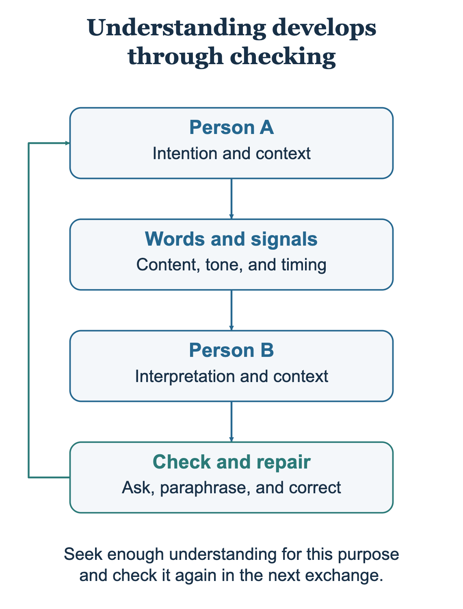<figcaption>Figure 28.1. Human communication requires grounding: participants check, correct, and repair interpretations until common ground is sufficient for action.</figcaption></figure>

The transmission model of communication is associated with Shannon and Weaver’s mathematical theory of communication (Shannon & Weaver, 1949). In that model, a sender transmits a signal through a channel to a receiver, and noise can interfere. This model is powerful for engineering problems. But human communication is not only signal transmission. It is meaning-making.

Suppose a manager says, “We need to improve accountability.” One employee hears, “We need clearer ownership.” Another hears, “Management is preparing to blame us.” A third hears, “We are finally addressing free riding.” A fourth hears, “They do not trust us.” The words are the same. The meaning is not.

This is because people interpret messages through prior experiences, expectations, identity, culture, power, and emotional state. Communication happens not only between mouths and ears, but between models of the world.

Herbert Clark’s work emphasizes common ground: the shared knowledge, assumptions, and context that speakers use to understand one another (Clark, 1996). Communication requires people to coordinate on what they both know, what they assume, and what has already been established. Clark and Brennan (1991) describe grounding as the process of establishing that people have understood each other well enough for the current purpose.

Grounding is why conversation includes signals such as “yes,” “I see,” “wait,” “what do you mean?,” “so you are saying…,” nods, pauses, repetition, examples, and repair. These are not meaningless fillers. They are coordination devices. They help participants check whether meaning is shared.

Grice’s cooperative principle also helps explain communication. Grice (1975) argued that conversation is guided by expectations that speakers provide information that is relevant, truthful, sufficiently informative, and clear. Much meaning comes from these expectations. If someone says, “Some of the students passed,” listeners may infer that not all passed, even though the sentence does not logically say that. If someone asks, “Can you pass the salt?” the literal answer may be “yes,” but the intended meaning is a request.

Human communication depends heavily on implication. People often say less than they mean because they expect listeners to infer. This makes communication efficient, but also fragile. Misunderstanding happens when people do not share the same assumptions.

This is especially clear in email and text communication. Kruger et al. (2005) found that people overestimate how well they can communicate tone over email. Senders think their intended sarcasm, humor, seriousness, or warmth is clear; receivers are much less accurate than senders expect. Both sides may then be surprised by misunderstanding. The sender thinks, “How could they not understand?” The receiver thinks, “How could they write such a thing?”

Good communicators do not assume understanding. They check it.

Useful questions include:

What do you understand this to mean? What part is unclear? What assumptions are we making? Can you say back what you think I am proposing? What concern would make this difficult for you? What does this word mean in your context? What would this look like in practice?

Communication improves when people treat understanding as a joint task, not a private achievement.

*Table 28.1. Grounding failures and repair moves*

| Failure | Hidden source | Repair move |
| --- | --- | --- |
| Same word, different meaning | Different assumptions or professional models. | Ask for an example and define the term in use. |
| Tone is misread | Text removes vocal and contextual cues. | State intent explicitly and check interpretation. |
| Mind-reading hardens | An inference is treated as fact. | Name it as a hypothesis and ask the person. |
| Agreement is assumed | Silence is interpreted as consent. | Invite a summary, private response, or explicit concern. |
| Perspective-taking projects the self | We imagine what we would feel. | Use perspective-getting: ask, listen, and verify. |

## Mind-reading is a hypothesis

Humans constantly infer hidden mental states.

What did she mean? Is he angry? Do they respect me? Will they accept my proposal? Are they interested in talking? Did I offend them? Do they like me? Are they hiding something?

This ability is sometimes called theory of mind or mentalizing. It is essential for social life. Without it, we could not cooperate, teach, negotiate, comfort, deceive, forgive, or build relationships. But our mind-reading is imperfect. We are often overconfident and self-centered when inferring others’ inner worlds.

One major error is egocentric projection: anchoring on one’s own perspective and insufficiently adjusting to another person’s perspective. We assume that our model of the world is closer to theirs than it really is. “I would not be offended by this feedback, so she should not be offended.” “I understood the email, so they should understand it.” “I enjoy this kind of small talk, so they must too.” “I would want direct advice, so they must want it.”

Diamond and Kirkham (2005) showed that adults, like children, can initially be pulled by their own perspective; the difference is often how quickly adults correct the egocentric error. Under pressure, distraction, or emotion, correction becomes harder.

A related error is the false consensus effect: people overestimate how common their own beliefs, preferences, choices, and behaviors are (Ross et al., 1977). If I think an action is ethical, I may assume most reasonable people agree. If I dislike a policy, I may assume most people secretly dislike it too. If I would accept a risk, I may assume others would. False consensus is a population-level version of egocentric projection.

Kruger and Gilovich (1999) showed that people can also be egocentric in responsibility judgments. In shared tasks, spouses and collaborators often overclaim responsibility for both positive and negative activities because their own contributions are more salient to them. Each person remembers what they did and underestimates invisible contributions by others.

Another error is the illusion of transparency: people overestimate how visible their internal states are to others (Gilovich et al., 1998). We think our anxiety, gratitude, embarrassment, confusion, or affection is obvious. It often is not. A student assumes the teacher can see they are confused. A manager assumes employees know they appreciate their effort. A friend assumes their hurt feelings are visible. A negotiator assumes the other side can see their constraint. Much conflict arises because people expect others to read emotions that have not been expressed.

The counterpart is the illusion of understanding: overestimating how well others understand the nuances in our writing, speech, or behavior. This is why explicitness matters. If something is important, do not rely on facial expressions, hints, vague wording, or silence. Say it.

People also exaggerate how much can be learned from body language and facial expression. Faces and bodies can reveal emotions, but they are noisy signals. Research on empathic accuracy suggests that verbal information is often more useful than trying to read expressions alone (Gesn & Ickes, 1999; Hall & Schmid Mast, 2007). Research on deception detection similarly suggests that people are generally poor lie detectors, and popular confidence in reading microexpressions is often overstated (Levine, 2010; Reinhard et al., 2011).

The practical lesson is simple:

Treat your interpretation of another person’s mind as a hypothesis, not a fact.

This principle is one of the most important in communication. “She is not interested,” “He is disrespecting me,” “They are hiding something,” “The students do not care,” “The client is unreasonable”—each may be true, but each is first a hypothesis. Good communication tests hypotheses before defending them.

## Stereotypes flatten the person

When people stereotype, they stop seeing the full person. They treat someone as a category rather than as a mind with feelings, values, motives, history, and complexity.

A person becomes “lazy,” “emotional,” “difficult,” “entitled,” “arrogant,” “not interested,” “too aggressive,” “too passive,” “typical of that group.” The label feels explanatory, but it often hides more than it reveals.

Stereotypes may sometimes capture directional differences between groups, but people often exaggerate the size of differences. Research on political stereotypes, for example, shows that people frequently overestimate how extreme and different opposing groups are (Ahler & Sood, 2018). Similar exaggerations can occur around gender, income, ideology, profession, nationality, or generation. The result is an illusion that groups are more divided, more uniform, and more predictable than they really are.

Stereotyping also connects to self-fulfilling prophecy. If a teacher expects a student to be weak, they may provide less challenge. If a manager expects an employee to resist, they may communicate defensively. If a negotiator expects dishonesty, they may withhold information, provoking guarded behavior in return. The stereotype changes the interaction, then the interaction confirms the stereotype.

Dehumanization is the extreme form of flattening. People are no longer experienced as full minds. Their pain matters less. Their motives are simplified. Their dignity becomes easier to ignore. Even mild everyday forms of dehumanization damage communication because they reduce curiosity.

A useful anti-stereotyping question is:

What is the iceberg beneath this behavior?

The visible behavior is only the top: silence, lateness, disagreement, emotion, refusal, enthusiasm, avoidance. Beneath it may be fear, identity, workload, culture, history, incentives, misunderstanding, status, shame, loyalty, or care. Communication improves when we ask about the iceberg before judging the surface.

## Ask rather than merely imagine

Because mind-reading is inaccurate, communication requires a better method.

Perspective-taking means trying to imagine another person’s perspective. It is useful, but limited. We often imagine what we would feel in their situation rather than what they actually feel. We project our own values, fears, and assumptions.

Perspective-getting means asking and listening.

Eyal et al. (2018) found that people were often more accurate when they asked others for their perspective than when they merely tried to imagine it. This distinction is crucial. Perspective-taking can become confident projection. Perspective-getting corrects it.

A manager may imagine, “Employees resist because they dislike change.” Asking may reveal: they do not understand the purpose, lack time, fear job loss, distrust leadership, or have seen previous changes fail.

A doctor may imagine, “The patient is noncompliant because they do not understand.” Asking may reveal cost, side effects, work schedule, family beliefs, fear, stigma, or previous disrespect.

A teacher may imagine, “Students are lazy.” Asking may reveal unclear expectations, anxiety, lack of background knowledge, competing work hours, or fear of looking stupid.

A negotiator may imagine, “They only care about price.” Asking may reveal delivery timing, reputation, internal approval, risk allocation, or future relationship.

Perspective-getting requires questions that are open, respectful, and specific:

How does this look from your side? What is the hardest part of this for you? What are you worried would happen? What would make this feel fair? What constraints are you under? What am I missing? What would you want me to understand before I respond?

The key lesson is:

Do not only imagine the other person’s mind. Invite them to show it to you.

## Shared reality

Connection is not only liking. It is often the feeling that another person experiences the world in a way that overlaps with your own.

This is shared reality: the sense that someone else sees, feels, understands, or values something as you do. Shared reality does not require identical backgrounds or superficial similarity. Two people can differ in nationality, age, profession, and personality yet feel deeply connected because they recognize the same emotional meaning in an experience.

Echterhoff et al. (2009) define shared reality as the experience of commonality with others’ inner states about the world. Pinel and colleagues’ work on I-sharing shows that people feel connected when they believe another person is having the same subjective experience at the same moment (Pinel et al., 2006). Huneke and Pinel (2016) found that I-sharing can foster selflessness. Neuroscience work on speaker-listener coupling suggests that successful communication can involve alignment of neural responses across people during shared understanding (Stephens et al., 2010).

Shared reality predicts rapport, closeness, and commitment. It is why laughing at the same joke, being moved by the same music, solving a problem together, dancing in synchrony, or recognizing the same absurdity can create immediate connection. Activities such as music, dance, comedy, ritual, and shared challenge synchronize attention, emotion, and bodily rhythms.

Shared reality also matters in work. A team becomes stronger when members not only exchange information but also share a sense of what matters. A doctor and patient build trust when they share an understanding of the problem. A teacher and student connect when both see confusion as part of learning. A negotiator builds rapport when both sides recognize the same constraint or opportunity.

Shared reality can be created deliberately.

Make agreement visible. Name the feeling you share. Reflect the other person’s meaning. Notice common concerns beneath different positions. Ask what an experience means to the other person. Create shared activities, not only shared talk. Let people know when their words resonate.

However, shared reality can also become an echo chamber. Feeling that someone “gets it” can make their beliefs seem more credible. Groups with strong shared reality may become closed to outside evidence. Connection should support truth, not replace it.

A useful question is:

Are we creating shared reality around reality, or around a comforting illusion?

Good connection makes the world clearer together.

## Social forecasts are often too pessimistic

People often underestimate how rewarding social interaction will be.

Epley and Schroeder (2014) asked commuters to either connect with a stranger, remain disconnected, or commute as usual. People predicted that solitude would be more pleasant, but those who talked to a stranger reported a more positive experience. Importantly, the interaction did not reduce productivity as much as people feared. Other work similarly suggests that weak-tie interactions can improve well-being more than people expect (Sandstrom & Dunn, 2014).

People also underestimate how much others like them after conversations. This is the liking gap. Boothby et al. (2018) found that after conversations, people tended to think their conversation partners liked them less than they actually did. This gap can discourage future contact, even when the interaction went well.

Introverts often expect less enjoyment from social interaction than extraverts, but after interacting, they may experience similar benefits. This does not mean introverts should become extraverts. It means anxious forecasts about connection are often worse than the actual experience.

People also underestimate others’ interest in deeper conversations. Kardas et al. (2022) found that people expected deep conversations with strangers to be more awkward and less enjoyable than they actually were. Participants often discovered that deeper questions produced more connection than expected.

Why do people mispredict social interaction?

They focus on awkwardness, competence, and rejection: Will I know what to say? Will I seem strange? Will they like me? The other person often focuses more on warmth, interest, and responsiveness. The result is a perspective gap. We judge our social actions from inside our anxiety; recipients judge them from the warmth they receive.

The practical implication is powerful:

Test your social predictions.

Ask one more question. Express one more appreciation. Move one conversation one layer deeper. Reach out to someone. Talk to a stranger. Respond warmly. Invite someone in. Repair a small rupture.

Your anxious forecast about connection is often worse than the actual experience.

<aside class="callout evidence-and-boundary-conditions">
EVIDENCE AND BOUNDARY CONDITIONS

Body language and facial expression are informative but noisy. Confidence in reading a person&#x27;s hidden state or detecting deception usually exceeds accuracy. Ask and verify.
</aside>

## Key ideas

- Better communication is not simply clearer speaking. It is the joint construction of meaning, trust, responsiveness, and shared reality between people whose minds are partly hidden from one another.
- Explain communication as grounding rather than transmission.
- Describe the health and decision value of social connection.
- Explain egocentric projection, false consensus, and illusion of transparency.

## Study and practice

1. How would you explain communication as grounding rather than transmission?

2. What evidence and mechanism would you use to describe the health and decision value of social connection?

3. How would you explain egocentric projection, false consensus, and illusion of transparency?

<aside class="callout activity">
ACTIVITY

Choose a recent misunderstanding. Separate the literal words, the sender&#x27;s intended meaning, the listener&#x27;s inferred meaning, the hidden context, and one repair question that could have grounded the conversation. EXPERIENCE - EXPLAIN - APPLY (MAXIMUM 120 WORDS) Experience: describe one specific decision, interaction, or observation. Explain: use one or two concepts from this chapter accurately. Apply: state one improvement, implication, or testable prediction.
</aside>

# Chapter 29. The Art of Conversation and Repair

*Questions, layered listening, appreciation, support, disagreement, and apology*

<aside class="callout core-idea">
CORE IDEA

Connection grows when people make attention visible, ask at the right depth, match the real conversation, separate observation from interpretation, and repair harm without hiding behind explanation.
</aside>

## Learning goals

- Use follow-up questions and layered listening.
- Give specific appreciation and ask for help effectively.
- Distinguish co-brooding from co-reflection.
- Use constructive disagreement and complete apology.

Good conversation is not only talking smoothly. It is mutual responsiveness.

Conversation creates connection through real-time feedback: quick replies, backchanneling, laughter, turn-taking, “yeah,” “uh-huh,” “tell me more,” and immediate adjustment. Live dialogue often creates more connection than watching or listening to a monologue because both people are shaping the interaction together.

Sacks et al. (1974) described the organization of turn-taking in conversation. Stivers et al. (2009) found that responses in conversation often occur with very short gaps across languages, though timing norms vary. Levinson (2016) argues that turn-taking is a fundamental infrastructure of human communication.

Asking questions is one of the easiest ways to build connection. Huang et al. (2017) found that people who ask more questions, especially follow-up questions, are better liked by conversation partners. Follow-up questions show attention because they build on what the other person has just said.

Good questions move conversation from surface to depth. A useful ladder is:

Depth does not mean forcing intimacy. It means allowing the conversation to move beyond exchange of labels into experience, meaning, and values when appropriate.

Good conversational questions include:

What was that like for you? What made that important? What surprised you? What did you learn? What are you hoping for? What is the hardest part? What would help?

Some questions are less helpful. Boomerasking turns the conversation back to oneself: “How was your trip? Mine was amazing…” Gotcha questions are designed to trap rather than understand. Repeated questions can feel like interrogation if they ignore the person’s answers. Good questions are responsive, not extractive.

Self-disclosure also builds connection. Aron et al. (1997) showed that structured mutual self-disclosure can create feelings of closeness between strangers. Collins and Miller’s (1994) meta-analysis found that people who disclose tend to be liked more, disclose more to people they like, and like people more after disclosing. Disclosure works when it is appropriate, reciprocal, and met with responsiveness.

People often fear that vulnerability will make them look weak. The beautiful mess effect suggests otherwise. Bruk et al. (2018) found that people evaluate their own vulnerability more negatively than others’ vulnerability. What feels like a mess from the inside may look courageous, authentic, or connecting from the outside.

There is also a novelty penalty: unfamiliar stories, ideas, or experiences can be harder for others to process. People may prefer familiar topics because they require less effort. Good storytelling can overcome the novelty penalty by making unfamiliar experiences concrete, structured, and meaningful.

A practical conversational habit is:

Listen for the point of aliveness. Where does the other person become more animated, thoughtful, emotional, or specific? Ask one more question there.

Connection often begins where a person feels that their inner world has been noticed.

## Listen for the layer beneath the words

<figure class="book-figure">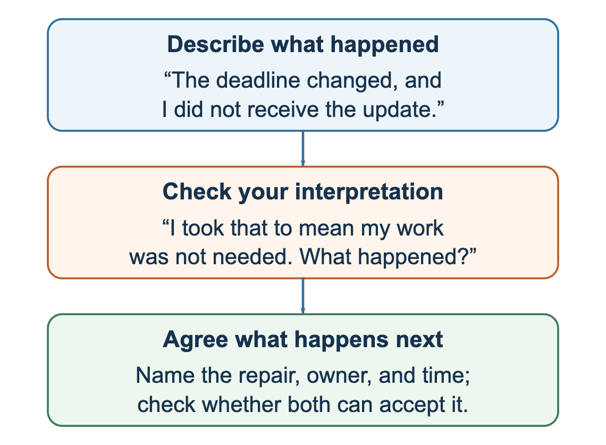<figcaption>Figure 29.1. Perspective-getting turns a private interpretation into shared meaning and a repairable next action.</figcaption></figure>

When communication is difficult, it helps to slow down and separate layers of experience. One practical model is:

This model helps because people often argue at the “what” level while the real conflict is at the “who” level.

A manager says, “The report was late.” The employee hears, “You think I am incompetent.” A partner says, “You forgot to call.” The other hears, “You do not care about me.” A colleague says, “Can we revisit this assumption?” The presenter hears, “You are attacking my work.”

The “what” is the event. The “how” is the feeling. The “why” is the interpretation. The “who” is the identity concern. The “when” is the personal or cultural history. The “action” is what follows.

Good listening asks:

What happened? How did it feel? What story did your mind tell? What value or identity did it touch? Where might that reaction come from? What response would serve the relationship and the goal?

This model also helps with self-regulation. Before responding defensively, ask: what layer am I reacting from? Is the other person attacking me, or did my mind interpret uncertainty as threat?

Communication improves when people can name the layers rather than collapse them into accusation.

## Appreciation and kindness

People are too reluctant to be kind.

They hesitate to express gratitude, give compliments, offer support, or perform small acts of kindness because they underestimate how good these actions will make recipients feel and overestimate how awkward or inadequate they will seem.

Kumar and Epley (2018) found that people writing gratitude letters underestimated how positive and surprised recipients would feel and overestimated awkwardness. Boothby and Bohns (2021) found that compliment givers underestimated how positive recipients would feel and overestimated discomfort. Kumar and Epley (2023) found that people performing acts of kindness underestimated their positive impact on recipients. These studies converge on a simple pattern: actors focus on competence—Will my words be right? Will this be awkward? Is this enough? Recipients focus on warmth—They thought of me. They cared. That felt good.

This is a decision error. People fail to take low-cost, high-impact social actions because their forecasts are wrong.

Gratitude, compliments, and kindness also benefit the giver. Prosocial behavior can increase well-being, and expressing appreciation can strengthen the giver’s sense of social support. Public praise may also create a witnessing effect: observers who see gratitude or appreciation directed at someone else may feel warmer toward both the giver and the receiver, because public appreciation signals a relational norm.

The practical rule is:

Never stifle a sincere generous impulse.

Send the thank-you note. Give the sincere compliment. Reach out. Offer help. Notice effort. Praise specifically. Tell someone why their action mattered.

Specificity matters. “Great job” is pleasant. “Your explanation of the customer problem helped the team see what we were missing” is more connecting. A good compliment shows attention.

In organizations, appreciation is not only niceness. It is information. It tells people what matters. It reinforces values. It builds trust. It supports motivation. A culture that notices only mistakes teaches vigilance. A culture that notices effort, care, learning, and contribution teaches connection.

## Asking for help

People also underestimate others’ willingness to help.

Bohns (2016) reviews evidence that people often underestimate compliance with direct requests for help. Asking feels costly from the inside because the requester anticipates rejection, awkwardness, or burden. But helpers often experience helping as meaningful. Helping can create connection because it gives the helper a valued role.

The Benjamin Franklin effect refers to the possibility that doing someone a favor can increase liking for that person. Jecker and Landy (1969) found that participants liked a researcher more after doing him a favor. One interpretation is cognitive dissonance: if I helped this person, I must like him. More broadly, requests for help can communicate trust and create relational investment.

In Japanese, the concept of amae refers to the expectation or desire to depend on another’s benevolence in a relationship (Doi, 1973). Asking for help can be a form of relational closeness when done respectfully. It says: I trust you enough to need you.

But asking for help must preserve freedom. A request that creates obligation without room to refuse can damage connection. Good requests are clear, bounded, and respectful:

Would you be willing to look at this for ten minutes? No problem if not, but I would value your advice. Could I ask for help with one specific part? Would this be a bad time?

The lesson is not to become dependent on others for everything. It is to recognize that appropriate help-seeking can strengthen relationships, improve decisions, and reduce unnecessary isolation.

## Truth, vulnerability, and feedback

Connection also depends on truth.

Secrets can create psychological burden and isolation. Slepian and colleagues have shown that the burden of secrecy often comes not only from hiding in social interaction but from mind-wandering back to the secret (Slepian et al., 2017). Sharing a secret with a trusted person can sometimes reduce isolation and increase connection, though disclosure must be safe and appropriate.

Honesty is complicated because people often use kindness as a reason to avoid truth. White lies can protect feelings, but they can also be paternalistic or prevent learning. People often underestimate others’ desire for honest feedback, especially when the feedback would be useful. In professional contexts, avoiding necessary feedback may feel kind in the moment but unfair in the long run.

Good feedback is specific, respectful, and actionable. Avoid the “praise sandwich” if it makes praise seem like packaging for criticism. Instead:

Name the specific behavior. Explain the impact. Acknowledge context where appropriate. Invite perspective. Offer a path forward.

For example:

“In yesterday’s meeting, when you interrupted Anna twice, the discussion narrowed and she stopped contributing. I know the topic was urgent, but I want us to make space for the whole team. What was happening from your side?”

This is more useful than “You need to be more respectful” or “Great work overall, but…”

Vulnerability can support connection when it is honest and appropriately bounded. A leader who admits a mistake can make learning safer. A teacher who says, “Many people find this concept difficult at first,” can reduce shame. A colleague who shares uncertainty can invite collaboration.

But vulnerability should not be used theatrically. It should serve truth, relationship, and learning.

A useful question is:

What truth would strengthen this relationship if expressed with care?

## Support without trapping attention

When someone is distressed, many people assume the best support is to let them vent. Sometimes people do need to be heard. But mutual venting can become co-brooding or co-rumination: repeatedly discussing problems in ways that intensify negative emotion without creating insight or action (Rose, 2002).

A more helpful pattern is co-reflection: validating feelings while helping the person see the situation more clearly, broadly, or constructively.

Validation says: your feelings make sense. Co-reflection asks: what else might be true, what can be learned, what matters now, what can be done?

This distinction is important. Support that skips validation feels dismissive: “Just look on the bright side.” Support that stays only in venting can deepen helplessness. Good support combines warmth and perspective.

Research on rumination shows that repetitive negative thinking can maintain distress (Nolen-Hoeksema et al., 2008). Research on self-distancing suggests that people can gain perspective by viewing a situation from a more distant standpoint, such as imagining how they will see it later or how a wise observer might view it (Kross & Ayduk, 2011).

Practical support begins by asking what kind of support the person wants:

Do you want me to listen, help solve, distract you, or just be with you? Would advice be useful, or would you rather I simply hear you? What feels hardest right now? What would help in the next hour?

When moving from validation to reflection, use gentle questions:

What do you think this situation is teaching you? How might you see this six months from now? What would you tell a friend in this situation? What part is within your control? What meaning are you giving this event? Is there another interpretation that is also possible?

Good support does not impose insight. It invites it.

## Constructive disagreement

Connection does not mean avoiding disagreement. In fact, strong relationships and good decisions require disagreement. The question is whether disagreement destroys shared reality or deepens it.

Disagreement becomes destructive when people feel unheard, disrespected, or existentially isolated: “How can you not see what is obvious?” When people disagree about seemingly self-evident truths, they may feel that the other person inhabits a different reality. That feeling can push people toward groups that validate them and away from dialogue.

Civility matters because disrespect closes minds. A useful label is the Montagu Principle: civility costs nothing and buys everything. In heated disagreement, contempt may feel satisfying, but it reduces persuasion and damages reputation among observers. Civility does not mean weakness or false equivalence. It means preserving the conditions for thought.

Another useful label is the Tucholsky Principle: personal experience can sometimes persuade more than statistics in moral and political disagreement. This does not mean anecdotes should replace evidence. It means that stories can help others understand why an issue matters to a real person. A statistic may show scale; a personal experience may open the door to empathy.

Moral reframing is also useful. Feinberg and Willer (2015) found that political arguments can be more persuasive when framed in terms of the audience’s moral values rather than the speaker’s. If someone values loyalty, authority, liberty, care, fairness, or purity differently than you do, repeating only your own moral language may fail. Translation is not manipulation when it is truthful; it is respect for the listener’s moral world.

Constructive disagreement requires several habits:

Show that you want to understand before trying to be understood. Reflect the other person’s argument in a form they accept. Ask what value they are protecting. Share personal experience without treating it as universal proof. Use evidence, but do not use evidence as a weapon. Avoid contempt. Translate into the other person’s moral language when possible. Look for the concern beneath the position.

A useful disagreement question is:

What would make an intelligent, decent person see it this way?

This question does not force agreement. It restores complexity.

## Apology and repair

Connection is tested when harm occurs.

A good apology repairs moral meaning. It tells the harmed person: I see what happened. I understand why it hurt. I accept responsibility. I still value you or the relationship. I will try to repair or prevent the harm.

Apologies often help, but they work best when they are specific, responsible, empathic, reparative, and followed by changed behavior. Lewicki et al. (2016) identify several components of effective apologies: expression of regret, explanation, acknowledgment of responsibility, declaration of repentance, offer of repair, and request for forgiveness. Acknowledging responsibility and offering repair are especially important.

A weak apology says:

“I’m sorry if you were offended.”

A stronger apology says:

“I interrupted you twice in the meeting. That was disrespectful and it made it harder for you to contribute. I am sorry. In the next meeting, I will make sure you have space to finish your point, and I will also acknowledge this to the team.”

Apologies are hard because offenders focus on shame, blame, and loss of face. Victims often focus on whether the offender understands the harm and will repair it. The offender asks, “Will I look bad?” The harmed person asks, “Do they get it?”

Forgiveness is related but distinct. Forgiveness does not mean excusing, forgetting, or eliminating accountability. It means releasing the desire for revenge and moving toward a different relationship with the harm. Worthington’s REACH model is one structured approach: recall the hurt, empathize, offer an altruistic gift of forgiveness, commit, and hold onto forgiveness (Worthington, 2006). Forgiveness is associated with better mental and physical health in many studies, though it should not be demanded from victims or used to pressure people to remain in harmful relationships (Toussaint et al., 2015).

Repair often requires psychological distance. In conflict, people become trapped in immediate emotion. Asking how one will view the event in six months, how a neutral third party would describe it, or what larger pattern is at stake can restore perspective.

A useful apology checklist:

Name the harm. Take responsibility. Express remorse and empathy. Explain without excusing. Repair if possible. Commit to change. Allow the harmed person to respond. Do not demand immediate forgiveness.

Repair is not a speech. It is a process.

## Sharing success

People also struggle to communicate success.

Self-praise can trigger envy, status threat, or dislike, especially when it involves direct comparison: “I did better than others.” False modesty can also backfire because it feels insincere. Humblebragging often makes people less likable than straightforward boasting because it combines self-promotion with complaint or fake modesty (Sezer et al., 2018).

Yet hiding success can also reduce connection. When people share joy, achievement, or pride appropriately, they allow others to participate in what some writers call cofelicity: shared happiness in another’s good fortune. Gable and colleagues’ work on capitalization shows that sharing positive events and receiving active constructive responses improves relationship quality (Gable et al., 2004).

The skill is to share success without turning it into hierarchy.

Good success-sharing is accurate, appreciative, and relational:

State the achievement without exaggeration. Acknowledge help and luck where relevant. Share what it means to you. Avoid direct comparison. Invite the other person into the joy rather than using success to dominate.

For example:

“I’m really happy—the paper was accepted. I was nervous about it because the review process was difficult. Your feedback helped me clarify the argument.”

This communicates success, gratitude, vulnerability, and shared reality.

Connection is damaged when success becomes status display. It grows when success becomes shared meaning.

## Connection as decision infrastructure

Communication and connection may sound softer than probability, risk, game theory, or negotiation strategy. But they are infrastructure for good decisions.

A team without connection hides information. A leader without trust receives performance theater. A doctor without rapport misses patient concerns. A teacher without responsiveness misses confusion. A negotiator without listening misses value creation. A family without repair repeats the same conflict. An organization without psychological safety learns too late.

Connection improves information flow. It lowers defensiveness. It makes uncertainty speakable. It allows people to share weak signals before they become crises. It makes disagreement less threatening. It supports cooperation, learning, and repair.

This does not mean connection replaces analysis. Warmth without rigor can produce avoidance and groupthink. Teams need both trust and standards. Leaders need both empathy and clarity. Negotiators need both relationship and preparation. Doctors need both compassion and evidence. Teachers need both care and intellectual challenge.

The best communication supports better decision-making by combining:

Clarity: What are we saying? Listening: What are we missing? Grounding: Do we understand the same thing? Responsiveness: Does the other person feel understood? Shared reality: Do we experience the issue together? Trust: Can truth be spoken? Repair: Can rupture be addressed? Action: What follows from this conversation?

The next part of the book turns to negotiation. Negotiation is a joint decision process under conflict, interdependence, and incomplete information. It requires rational analysis, strategic thinking, persuasion, storytelling, and—above all—communication. The best negotiators are not merely tough talkers. They are disciplined listeners, meaning-makers, trust managers, and designers of conversation.

*Table 29.1  A question ladder*

| Level | Example Question |
| --- | --- |
| Surface | What are you working on? |
| Experience | What has been most challenging? |
| Meaning | Why does this matter to you? |
| Identity | What kind of person do you want to become? |
| Future | What would meaningful progress look like? |

*Table 29.2  Listening beneath the surface*

| Layer | Meaning | Question |
| --- | --- | --- |
| What | Perceived situation, event, issue, task, or context | What is happening? |
| How | Bodily feeling, emotion, affect, impulse, anticipated feeling | How does it land in me? |
| Why | Interpretation, appraisal, attribution, perceived intent, prediction | Why did I feel that way? |
| Who | Value, need, identity, dignity, status, belonging, competence, autonomy | What self-relevant concern is touched? |
| When | History, habit, culture, prior experience, learned expectation | Where did I learn to see or feel it this way? |
| Action | Automatic reaction or mindful response | What do I do next? |

## Key ideas

- Connection grows when people make attention visible, ask at the right depth, match the real conversation, separate observation from interpretation, and repair harm without hiding behind explanation.
- Use follow-up questions and layered listening.
- Give specific appreciation and ask for help effectively.
- Distinguish co-brooding from co-reflection.

## Study and practice

1. How would you use follow-up questions and layered listening in practice?

2. Give specific appreciation and ask for help effectively?

3. How would you distinguish co-brooding from co-reflection?

<aside class="callout activity">
ACTIVITY

Practice a question ladder with a partner: fact, experience, meaning, identity, and future. Paraphrase before moving deeper. End by asking what the partner wants from the conversation now. EXPERIENCE - EXPLAIN - APPLY (MAXIMUM 120 WORDS) Experience: describe one specific decision, interaction, or observation. Explain: use one or two concepts from this chapter accurately. Apply: state one improvement, implication, or testable prediction.
</aside>

# Part 6. Negotiation: Claiming and Creating Value

How interdependent decision-makers prepare, bargain, trade across differences, and design workable agreements.

# Chapter 30. Negotiation Is Joint Decision-Making

*Interdependence turns choice into a shared search*

<aside class="callout core-idea">
CORE IDEA

Negotiation begins when parties need one another but do not want exactly the same thing. A wise agreement must beat each party&#x27;s alternative, manage conflict, and exploit compatibility that positions can hide.
</aside>

## Learning goals

- Define negotiation and distinguish it from persuasion, compromise, and bargaining.
- Separate positions, interests, issues, and options.
- Explain value claiming and value creation.
- Analyze fairness, relationship, culture, ethics, and implementation.

The rational choice model asks how one decision-maker should choose among alternatives. Negotiation asks how multiple decision-makers can choose together when their outcomes depend on one another.

This makes negotiation different from ordinary individual choice. In individual choice, I compare options and choose. In negotiation, my best option depends on what you will accept, and your best option depends on what I will accept. My words change your beliefs. Your reactions change my strategy. My offer is both an option and a signal. Your silence may mean refusal, calculation, anger, respect, or uncertainty. Negotiation is strategic, social, and interpretive.

Negotiation also differs from pure strategic interaction because the parties communicate. In many games, players choose actions without discussion. In negotiation, communication is part of the process. Parties can ask questions, reveal information, make offers, explain constraints, frame standards, tell stories, signal priorities, build trust, threaten, promise, mislead, apologize, and repair.

That is why negotiation draws on many parts of this book. It requires rational analysis, because parties must know their alternatives and reservation values. It requires probability judgment, because parties estimate what the other side will accept. It requires valuation, because parties compare money, time, risk, status, fairness, relationship, and future opportunities. It requires social decision-making, because fairness, reciprocity, trust, face, and norms matter. It requires communication, because parties must understand one another well enough to identify possible agreements. It requires persuasion, because parties must help others see why an agreement is legitimate and valuable. It requires self-control, because emotions can derail the process.

Negotiation is therefore a capstone topic. It is where decision-making becomes interpersonal.

A useful way to understand negotiation is as a loop:

Information is exchanged. Each party interprets the other’s interests, constraints, intentions, and alternatives. Each party evaluates possible agreements. Offers and counteroffers are made. Reactions create feedback. Beliefs and expectations update. The parties either reach agreement, continue searching, or walk away.

This loop is often imperfect. Parties hide information. They misread each other. They anchor too strongly. They become defensive. They confuse positions with interests. They escalate commitment. They reject fair offers because of pride. They accept bad deals because of pressure. They leave value on the table because they fail to ask the right questions.

Good negotiation begins by making the structure visible.

## What negotiation is not

<figure class="book-figure">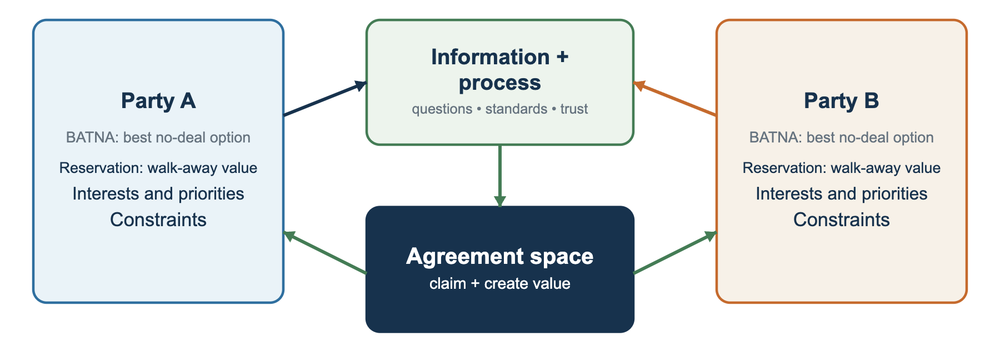<figcaption>Figure 30.1. Negotiation links each party’s alternatives and priorities to a jointly designed agreement space.</figcaption></figure>

Negotiation is often misunderstood. These misunderstandings lead to poor preparation and poor outcomes.

Negotiation is a joint decision process in which communication, alternatives, beliefs, preferences, and strategic interdependence jointly determine the agreement set (Raiffa, 1982; Lax & Sebenius, 1986; Thompson, 2015).

The first myth is that negotiation is mainly about being tough. Toughness can matter in some distributive situations, especially when the main issue is price and each side wants a larger share. But toughness alone can destroy value. A negotiator who is only tough may win on price while damaging relationship, missing hidden interests, or provoking retaliation. A better negotiator is firm on interests and disciplined about process.

The second myth is that negotiation is mainly about compromise. Compromise means each side gives something up. Sometimes compromise is necessary. But compromise is not the highest form of negotiation. If one party values delivery speed more and the other values price more, they may be able to trade across issues and make both better off. If they simply split the difference, they may miss value.

The third myth is that negotiation is a fixed-pie contest. In many negotiations, some value must be divided. But there may also be value to create through differences in preferences, beliefs, risk tolerance, time horizons, capabilities, and constraints. The fixed-pie assumption makes people focus too narrowly on claiming value and too little on discovering value.

The fourth myth is that good negotiators are natural. Some people are socially fluent or confident, but negotiation skill depends heavily on preparation, structure, listening, information management, and learning. Confidence without preparation can be dangerous.

The fifth myth is that negotiation is mostly talking. In fact, much of negotiation is listening, asking, diagnosing, preparing, and designing options. A negotiator who talks constantly may reveal strength or insecurity, but they may learn little.

The sixth myth is that negotiation begins at the table. It begins before the table: in preparation, alternative development, coalition-building, stakeholder alignment, information gathering, standard setting, and deciding who should be involved.

The seventh myth is that negotiation ends when agreement is reached. In many settings, implementation matters more than signing. A bad implementation process can destroy a good deal. A good negotiation considers future cooperation, monitoring, trust, dispute resolution, and adaptation.

These myths share one problem: they treat negotiation as performance. Better negotiation treats it as decision design.

A useful corrective is:

Do not ask only, “How do I get them to say yes?” Ask, “What agreement would make sense, compared with each party’s alternatives, and how can we discover whether such an agreement exists?”

*Table 30.1. Negotiation myths and replacement questions*

| Myth | Hidden cost | Replacement question |
| --- | --- | --- |
| “Good negotiators are tough.” | Toughness can destroy information and value. | What process protects interests and learning? |
| “Success means reaching agreement.” | A deal can be worse than the BATNA. | Is this agreement better than our best alternative? |
| “Compromise is the ideal.” | Splitting positions can miss compatible interests. | What do the parties value differently? |
| “Negotiation begins at the table.” | Alternatives, stakeholders, and standards are left undeveloped. | What can be improved before the conversation? |
| “Signing ends the negotiation.” | Implementation and adaptation are ignored. | How will the agreement be governed, reviewed, and repaired? |

## Positions, interests, and issues

One of the most important distinctions in negotiation is the difference between positions and interests.

A position is what a party says it wants.

“I want €70,000.” “We need delivery by June 1.” “I will not accept a noncompete clause.” “We want 40% equity.” “I need the office on Fridays.” “We require exclusivity.”

An interest is why the party wants it.

The job candidate may want €70,000 because of living costs, status, fairness, competing offers, debt, or future salary trajectory. The buyer may want delivery by June 1 because a production line depends on it. The employee may reject a noncompete because it threatens career mobility. The investor may want equity because of risk exposure and control. The parent may want Fridays in the office because of childcare. The supplier may want exclusivity because it justifies investment.

Positions often conflict. Interests may be more compatible.

Fisher et al. (2011) popularized the idea of focusing on interests rather than positions. This does not mean positions are irrelevant. Positions are important signals. But if negotiators stop at positions, they may miss the underlying reasons that allow creative agreement.

Consider two departments negotiating over a shared data analyst. Both say they need the analyst full time. Their positions conflict. But one department needs help with a quarterly report for two intense weeks each quarter; the other needs ongoing weekly dashboard maintenance. The underlying interests may allow a schedule that satisfies both.

Consider a job negotiation. The candidate asks for higher salary. The employer cannot raise salary due to internal equity constraints. If both remain fixed on salary, negotiation stalls. But if the candidate’s interests include learning, flexibility, relocation support, title, bonus, conference travel, or earlier review, there may be other ways to create value.

An issue is a negotiable dimension. Salary is an issue. Start date is an issue. Delivery time is an issue. Warranty is an issue. Payment schedule is an issue. Scope of work is an issue. Confidentiality is an issue. Relationship governance is an issue.

Single-issue negotiations are often distributive: more for one side means less for the other. Multi-issue negotiations create more possibilities because parties may value issues differently. Value creation often begins by adding issues to the table.

A useful preparation question is:

What are they asking for, and what interest might that position be trying to protect?

Another is:

What issues could be added so that we are not negotiating only over one dimension?

The difference between position and interest is the difference between arguing over demands and understanding value.

## Claiming and creating value

Negotiation has two fundamental tasks: claiming value and creating value.

Value claiming means obtaining a favorable share of existing value. If one issue is fixed, such as price, more for one side usually means less for the other. This is distributive negotiation. The central question is: how is value divided?

Value creation means finding ways to increase total value. This is integrative negotiation. The central question is: how can the parties structure agreement so that both are better off than they would be under a simple compromise?

Both tasks matter.

If negotiators focus only on claiming value, they may become defensive, hide information, and miss opportunities. If they focus only on creating value, they may reveal too much, fail to protect their interests, and be exploited. Skilled negotiators do both: they look for value to create while preparing to claim a fair share.

The tension is known as the negotiator’s dilemma (Lax & Sebenius, 1986). To create value, parties often need to share information about interests, priorities, constraints, and preferences. But sharing information can make one vulnerable. If I reveal that delivery date matters more than price, you might exploit that information. If you reveal that you have no good alternative, I might push harder.

Trust can help, but trust is rarely complete. Institutions, reputation, contracts, staged disclosure, objective standards, and reciprocal information sharing can reduce the risk.

One way to create value is to identify differences. Differences are not obstacles; they are raw material.

If one side cares more about timing and the other about price, trade timing for price. If one side is more risk tolerant, allocate risk accordingly. If one side has lower cost of providing a service, include it. If one side cares more about public recognition, trade recognition for money. If one side values future business, use contingent agreements. If parties disagree about future outcomes, create a contract contingent on what happens.

Value creation often begins with asking:

What do we value differently? What risks can each side best bear? What costs are low for one side but valuable to the other? What future events could determine payment or performance? What issues are missing from the table? What would make this agreement easier for them to accept without costing us much?

Chapters 31 and 32 develop value claiming; Chapters 33 and 34 develop value creation and advanced agreement design. This chapter’s purpose is to show that negotiation always contains both possibilities. A negotiation is not purely a fight or purely a collaboration. It is a mixed-motive process.

## Information is currency and risk

Information is the lifeblood of negotiation.

Without information, parties cannot know whether agreement is possible. They cannot identify interests, estimate reservation values, create options, or justify proposals. But information is also risky. Revealing too much can weaken a party’s position.

This is why negotiation is partly an information design problem.

Some information is generally useful to reveal: interests, priorities, standards of fairness, constraints that explain positions, implementation concerns, and low-cost/high-value trades. Other information is often dangerous to reveal too early: weak BATNAs, desperation, exact reservation values, internal divisions, or constraints that could be exploited.

But hiding everything is also costly. If neither side reveals anything, negotiation becomes positional bargaining. Parties exchange demands, make small concessions, and may miss better agreements.

A skilled negotiator learns to ask good questions and reveal selectively.

Good questions include:

What is most important to you in this agreement? What makes that issue important? What constraints are you working under? If we could solve one problem first, what should it be? How would this agreement be evaluated by your stakeholders? What concerns would prevent you from accepting? Are there issues where flexibility is easier for you? What would make implementation successful?

Good information sharing often begins with interests rather than reservation values. For example:

“Delivery timing is especially important because our production schedule depends on it.” “Our budget is constrained this year, but we may have flexibility on contract length.” “We care about public recognition because the project must show community impact.” “We need predictability more than the lowest possible price.”

Such statements reveal value-relevant information without surrendering the whole bargaining position.

Information must also be interpreted carefully. Parties may misrepresent, exaggerate, or strategically frame their constraints. They may also misunderstand their own interests. A negotiator may say price is the only issue, but after discussion, risk, timing, face, or internal approval may matter more.

Listening is therefore a negotiation skill. Not passive listening, but diagnostic listening. What is the other side repeating? Where do they become emotional? What constraint do they hint at? What stakeholder do they mention? What issue do they avoid? What would make their position make sense?

A useful rule is:

Reveal enough to make value creation possible, but not so much that you cannot protect value.

This balance is difficult, and it is why negotiation requires judgment.

## Fairness and objective standards

Negotiation is not only about power and alternatives. It is also about legitimacy.

People care whether an agreement feels fair. They care about procedure, respect, reciprocity, precedent, market value, need, contribution, equality, equity, and rights. A materially acceptable offer can be rejected if it feels insulting or illegitimate. A difficult concession can be accepted if it is justified by a fair standard.

Objective standards help. Fisher et al. (2011) recommend using objective criteria: market prices, expert opinions, legal standards, industry norms, scientific evidence, precedent, cost data, or professional benchmarks. Standards reduce the sense that negotiation is merely a battle of wills.

For example:

Salary can be discussed using market data and internal equity. A supplier price can be discussed using cost indices and quality benchmarks. A deadline can be discussed using production schedules and dependency maps. A licensing fee can be discussed using comparable agreements. A workload issue can be discussed using hours, staffing ratios, and service standards.

Objective standards do not eliminate conflict. Parties may disagree about which standard is relevant. A candidate may cite external market salary; an employer may cite internal equity. A supplier may cite cost inflation; a buyer may cite competitor prices. But standards improve the conversation because they shift from “because I want it” to “because this standard supports it.”

Fairness is also psychological. People compare offers with reference points. They ask whether they are being respected. They evaluate whether concessions are reciprocal. They notice whether procedures are transparent. They care whether the other side listens.

Procedural justice research shows that people are more likely to accept outcomes, even unfavorable ones, when the process is perceived as fair, respectful, and unbiased (Lind & Tyler, 1988; Tyler, 1990). In negotiation, process matters because it shapes legitimacy.

A party may accept less favorable terms if they believe the process was honest and constraints were real. A party may reject objectively reasonable terms if they believe the process was disrespectful or manipulative.

A useful preparation question is:

What standard would make our proposal look legitimate to a reasonable outsider?

Another is:

What standard will the other side think is fair?

Good negotiators do not rely only on pressure. They build legitimacy.

## Emotion, face, and relationship

Negotiation is emotionally charged because it touches value, uncertainty, conflict, status, identity, and trust.

People may feel fear of losing, anger at unfairness, pride in standing firm, anxiety about being exploited, shame about needing agreement, excitement about opportunity, or regret about concessions. These emotions shape attention and action.

Anger can sometimes extract concessions, but it can also damage trust, reduce creativity, and provoke retaliation. Van Kleef and colleagues found that expressions of anger in negotiation can sometimes lead opponents to concede, especially when they see the anger as legitimate and have low power, but anger can backfire when perceived as inappropriate or manipulative (Van Kleef et al., 2004). Emotions are strategic signals, but they are also relational events.

Face matters. As Chapter 29 discussed, face is the public image of social worth people maintain in interaction. A proposal can threaten face if it implies incompetence, weakness, low status, or disrespect. A negotiator may reject a financially reasonable offer because accepting it would humiliate them before their team. Another may resist apology because apology feels like loss of face. A concession may need to be framed so the other side can accept it with dignity.

Relationship also matters. Some negotiations are one-time transactions. Others occur inside ongoing relationships: employment, partnerships, supply chains, universities, families, professional networks, diplomacy. In ongoing relationships, the agreement is not the only outcome. Trust, reputation, commitment, and future cooperation matter.

A hard bargain may create short-term gain but long-term cost. A generous concession may build goodwill but set problematic precedent. A tough conversation may damage relationship if handled disrespectfully, but strengthen it if handled with clarity and care.

Negotiation should therefore distinguish between economic value and relational value. Economic value concerns money, time, risk, resources, and material outcomes. Relational value concerns trust, respect, reputation, future cooperation, and dignity. Good agreements often protect both.

A useful question is:

What will this agreement do to the relationship that must implement it?

If the relationship must continue, the answer matters.

## Culture without stereotypes

Negotiation is culturally embedded. Culture shapes what counts as respect, directness, fairness, relationship, authority, time, silence, agreement, and commitment.

In some contexts, parties expect to build relationship before discussing terms. In others, moving quickly to substance is seen as efficient. In some contexts, direct disagreement is valued. In others, disagreement is expressed indirectly to preserve face. In some contexts, a signed contract is the core commitment. In others, the relationship and ongoing adjustment matter as much as the document. In some contexts, the negotiator has full authority. In others, decisions require consultation with absent stakeholders.

Cultural differences are not only national. Professional, organizational, regional, class, gender, and generational cultures all shape negotiation. A lawyer, engineer, entrepreneur, doctor, diplomat, academic, and procurement manager may bring different negotiation scripts.

Culture should not be reduced to stereotype. The goal is not to assume “they negotiate this way.” The goal is to ask better questions.

What process do they expect? Who needs to be consulted? How direct should disagreement be? What does silence mean? How is respect shown? What role does hierarchy play? What makes an agreement legitimate? How are changes handled after agreement? What would cause loss of face? What does trust require?

Cross-cultural negotiation requires metacommunication: discussing how the negotiation itself should proceed. Parties can reduce misunderstanding by explicitly agreeing on agenda, decision authority, timeline, communication norms, confidentiality, and follow-up process.

This is especially important when one side interprets behavior through its own cultural script. A direct “no” may seem rude to one side and efficient to another. An indirect response may seem evasive to one side and respectful to another. Silence may be thoughtfulness, disagreement, hierarchy, or strategic withholding. Without checking, parties fill ambiguity with their own assumptions.

A useful rule is:

Treat cultural interpretation as a hypothesis, not a conclusion.

Ask, observe, and adapt.

## Ethics beyond getting away with it

Negotiation raises ethical questions because parties have incentives to shape information, expectations, and pressure.

Is bluffing acceptable? Can I exaggerate my alternatives? Can I hide my reservation value? Can I misrepresent demand? Can I imply I have authority I do not have? Can I use a fake deadline? Can I exploit the other side’s mistake? Can I make a threat I do not intend to carry out? Can I conceal information that would affect their decision?

Ethical standards vary across cultures, professions, and contexts, but some distinctions are useful.

It is generally acceptable not to reveal your reservation value. Negotiation does not require full transparency. It is generally acceptable to present your interests persuasively, open ambitiously, and ask for favorable terms. It is not acceptable to commit fraud, forge documents, make promises you do not intend to keep, or lie about material facts where the other side is entitled to truth.

Between clear honesty and clear fraud lies a gray zone: bluffing, selective disclosure, strategic ambiguity, emotional display, and framing. Negotiators often rationalize questionable behavior by saying “it is just negotiation.” Chapter 13 warned that ethical fading occurs when moral dimensions disappear behind strategic language.

One framework distinguishes between positions, intentions, facts, and promises. You may be strategic about positions. You should be careful with factual claims. You should not make promises you do not intend to honor. You should not deliberately create false beliefs about material facts that define the agreement.

Ethical negotiation is not naïve. It protects one’s interests. But it also recognizes that deception can destroy trust, reputation, implementation, and self-respect. In repeated or networked environments, reputation is a long-term asset.

Negotiation ethics also involves power. A tactic that seems acceptable between sophisticated parties may be exploitative when used against someone inexperienced, vulnerable, or lacking alternatives. High-pressure tactics, hidden terms, artificial scarcity, and complex contracts can undermine genuine consent.

A useful ethical test is:

Would I be comfortable if my negotiation behavior became known to the people whose respect matters to me?

Another is:

Would this tactic still seem acceptable if used against me by a more powerful party?

Ethics is not separate from negotiation skill. In many relationships, trustworthiness is skill.

## The negotiator's mind

Negotiators are human decision-makers. They bring biases and emotions to the table.

Anchoring matters. First offers can shape the bargaining range. Overconfidence matters. Negotiators often overestimate their alternatives or the strength of their case. Self-serving bias matters. Each side thinks its view of fairness is more objective than it is. Loss aversion matters. Concessions feel like losses. Reactive devaluation matters. A proposal may seem less attractive simply because it comes from the other side (Ross, 1995). Fixed-pie bias matters. Negotiators often assume interests are more opposed than they are (Thompson & Hastie, 1990).

The fixed-pie bias is especially important. Thompson and Hastie found that negotiators often assume that the other side’s interests are directly opposed to their own, even when compatible or tradeable interests exist. This bias leads parties to miss integrative potential.

Reactive devaluation is also common. If the other side proposes an idea, we may suspect it benefits them and therefore undervalue it. This can prevent agreement even when the proposal is objectively good.

Emotions can also narrow attention. Anger focuses on blame and retaliation. Anxiety may lead to premature concession. Pride may prevent apology. Fear may make walking away seem impossible. Excitement may lead to overcommitment. Shame may make people hide constraints.

Self-control matters. A negotiator should know what triggers them: disrespect, silence, pressure, deadlines, authority, comparison, or perceived unfairness. Preparation should include emotional preparation.

Useful questions include:

What bias am I most vulnerable to here? What emotion is likely to arise? What will I do if I feel pressured? What will I do if they make an extreme offer? What will I do if they insult my proposal? Who can help me think clearly before I respond?

Good negotiators design not only the deal but also their own mind.

## Agreement is not the end

A negotiated agreement is valuable only if it can be implemented.

Many negotiations fail after agreement because parties did not clarify expectations, responsibilities, timelines, contingencies, communication channels, monitoring, or dispute resolution. They agree in principle but disagree in practice.

Implementation questions include:

Who will do what by when? What resources are required? What happens if circumstances change? How will performance be measured? Who has authority to adjust? How will disputes be handled? What information will be shared? What happens if one side fails to perform? How will the relationship be maintained?

In complex negotiations, the agreement should include not only terms but governance. Governance means the structures that guide future interaction: meetings, reporting, escalation, review, revision, and enforcement.

A deal that looks efficient on paper may fail if it ignores relationship and implementation. A deal that looks less elegant may succeed if it includes clear process and trust-building mechanisms.

Negotiation should therefore ask:

Can the parties live with and carry out this agreement after the conversation ends?

If not, the negotiation is not finished.

<aside class="callout evidence-and-boundary-conditions">
EVIDENCE AND BOUNDARY CONDITIONS

Cultural frameworks can generate useful hypotheses about communication and norms. They should never substitute for asking the actual person about interests, authority, process, and meaning.
</aside>

## Key ideas

- Negotiation begins when parties need one another but do not want exactly the same thing. A wise agreement must beat each party's alternative, manage conflict, and exploit compatibility that positions can hide.
- Define negotiation and distinguish it from persuasion, compromise, and bargaining.
- Separate positions, interests, issues, and options.
- Explain value claiming and value creation.

## Study and practice

1. Define negotiation and distinguish it from persuasion, compromise, and bargaining?

2. Separate positions, interests, issues, and options?

3. How would you explain value claiming and value creation?

<aside class="callout activity">
ACTIVITY

Take a negotiation from work or life. List the stated positions, underlying interests, negotiable issues, possible options, relationship concerns, objective standards, and implementation risks. EXPERIENCE - EXPLAIN - APPLY (MAXIMUM 120 WORDS) Experience: describe one specific decision, interaction, or observation. Explain: use one or two concepts from this chapter accurately. Apply: state one improvement, implication, or testable prediction.
</aside>

# Chapter 31. Preparing to Claim Value

*BATNA, reservation value, targets, and the zone of possible agreement*

<aside class="callout core-idea">
CORE IDEA

Bargaining power begins before the conversation. It comes from credible alternatives, disciplined walk-away points, ambitious targets, and informed estimates of the other side&#x27;s constraints.
</aside>

## Learning goals

- Define BATNA, reservation value, target, and ZOPA.
- Calculate bargaining surplus in a simple case.
- Improve a BATNA before bargaining.
- Estimate the other side's reservation value as a revisable hypothesis.

Negotiation is disciplined by alternatives.

A party should not evaluate an agreement in isolation. It should compare the agreement with what it can do if no agreement is reached. This is the BATNA: the best alternative to a negotiated agreement (Fisher et al., 2011). Your BATNA is your best realistic course of action if the negotiation fails.

If you are negotiating a job offer, your BATNA may be another offer, staying in your current job, continuing your search, starting a PhD, or freelancing. If you are selling a car, your BATNA may be another buyer or keeping the car. If a company is negotiating with a supplier, its BATNA may be another supplier, internal production, redesigning the product, or delaying launch.

BATNA is not what you wish you had. It is not a fantasy alternative. It must be concrete and realistic. “I can always find another job” is not a BATNA unless there is a credible path. “We can sue” is not necessarily a good BATNA if litigation is costly, slow, uncertain, and relationship-damaging.

BATNA matters because it determines power. Negotiation power does not come mainly from personality, volume, or confidence. It comes from alternatives. If you can walk away to a good alternative, you have power. If you have no good alternative, you are vulnerable.

The reservation value is the worst agreement you would rationally accept before walking away to your BATNA. For a seller, it may be the lowest acceptable price. For a buyer, the highest acceptable price. In more complex negotiations, it includes multiple dimensions: money, risk, timing, relationship, reputation, and future opportunity.

The target or aspiration is what you aim to achieve. A good target should be ambitious but defensible. If your reservation value is the minimum acceptable outcome, your target is the outcome you actively try to reach.

The bargaining zone or zone of possible agreement exists when there are agreements both sides prefer to their BATNAs. In a simple price negotiation, if the buyer’s maximum willingness to pay is higher than the seller’s minimum acceptable price, a bargaining zone exists. If not, no agreement should occur unless other issues are added.

For example, a seller’s reservation price is €40,000. A buyer’s reservation price is €50,000. The bargaining zone is €40,000 to €50,000. Where the final price falls depends on information, anchors, concessions, patience, skill, fairness norms, and alternatives.

But many negotiations are not one-dimensional. A job offer includes salary, title, role, start date, location, flexibility, bonus, development, and future review. A supplier contract includes price, quality, delivery, warranty, payment terms, exclusivity, penalties, and future volume. A peace negotiation includes territory, security, recognition, monitoring, prisoner exchange, reparations, and political legitimacy.

In multi-issue negotiations, the bargaining zone is not a line. It is a space.

Preparation requires knowing your own BATNA and reservation value. It also requires estimating the other side’s. But estimates should be treated as hypotheses. Overconfidence about the other side’s alternative can lead to insulting offers. Underestimating your own alternative can lead to unnecessary concessions.

A useful BATNA discipline is:

Improve your BATNA before negotiating. Estimate their BATNA before proposing. Set your reservation value before hearing their anchor. Do not accept worse than your BATNA. Do not bluff about alternatives you do not have. Do not fall in love with agreement for its own sake.

Sometimes the best negotiation decision is no deal.

## The negotiation before the negotiation

Improvisation is overrated. Preparation is the foundation of negotiation.

Good preparation has several parts.

First, define the decision. What agreement are we trying to reach? What happens if no agreement is reached? Who must approve? What is the timeline?

Second, identify your interests. What do you really care about? Which interests are essential, important, or nice to have? Which are material, relational, reputational, ethical, or strategic?

Third, identify issues. What dimensions can be negotiated? Price, timing, quality, scope, role, title, risk, payment terms, confidentiality, exclusivity, support, review, future work, public recognition, dispute resolution?

Fourth, assess your BATNA. What will you do if no agreement is reached? How can you improve that alternative? What is your reservation value?

Fifth, set your target. What outcome is ambitious but defensible? What opening position might help you reach it?

Sixth, estimate their interests and BATNA. What do they need? What pressures do they face? Who are their stakeholders? What alternatives might they have? What do they value more or less than you?

Seventh, identify value-creation possibilities. What differences could be traded? What low-cost concessions might be high value to them? What low-cost concessions might be high value to you? Can risk, time, information, or future outcomes be structured creatively?

Eighth, prepare standards of legitimacy. What market data, precedents, benchmarks, expert opinions, cost information, or principles support your proposal?

Ninth, plan information strategy. What will you ask? What will you reveal? What will you not reveal? How will you build trust without becoming vulnerable?

Tenth, design the process. Who speaks first? What agenda? What tone? What medium? What sequence? What should be resolved first? What should wait? How will emotions be handled? How will agreement be documented?

A preparation worksheet should include:

My interests. Their likely interests. Issues. My BATNA. Their likely BATNA. My reservation value. My target. Possible bargaining zone. Objective standards. Questions to ask. Information to reveal. Information to protect. Possible trades. Implementation concerns. Ethical boundaries.

Preparation does not eliminate uncertainty. It makes uncertainty manageable.

## The structure of distributive bargaining

<figure class="book-figure">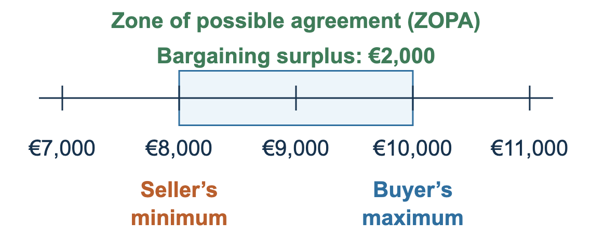<figcaption>Figure 31.1. A positive bargaining zone exists when the buyer’s maximum exceeds the seller’s minimum; the overlap is the bargaining surplus.</figcaption></figure>

A distributive negotiation occurs when parties divide a resource and their interests are directly opposed on at least one issue. The clearest example is a single-issue price negotiation.

Suppose a seller owns a used car. The seller would rather keep the car than sell it for less than €8,000. The buyer would rather buy the car than walk away if the price is €10,000 or lower. The seller’s reservation value is €8,000. The buyer’s reservation value is €10,000.

The bargaining zone, also called the zone of possible agreement or ZOPA, lies between €8,000 and €10,000. Any price in that zone is better than no agreement for both sides. At €8,000, the seller is just indifferent between selling and walking away, while the buyer gets a very favorable deal. At €10,000, the buyer is just indifferent between buying and walking away, while the seller gets a very favorable deal. At €9,000, the surplus is split evenly.

The bargaining surplus is the overlap between the parties’ reservation values. In this case:

Buyer’s reservation value = €10,000 Seller’s reservation value = €8,000 Bargaining surplus = €10,000 - €8,000 = €2,000

If the final price is €9,200, the seller’s surplus is:

Final price - seller’s reservation value = €9,200 - €8,000 = €1,200

The buyer’s surplus is:

Buyer’s reservation value - final price = €10,000 - €9,200 = €800

The total surplus remains €2,000, but the distribution changes. The seller claimed €1,200 of the surplus; the buyer claimed €800.

This simple example captures the core structure of distributive negotiation. The parties should reach agreement if there is a positive bargaining zone. But each party prefers agreement closer to the other party’s reservation value.

A positive bargaining zone exists when the buyer’s maximum willingness to pay is greater than the seller’s minimum willingness to accept. A negative bargaining zone exists when there is no overlap. If the seller will not accept less than €12,000 and the buyer will not pay more than €10,000, there is no deal on price alone. The parties should either walk away or add issues that might create value, such as warranty, financing, delivery, timing, repairs, or future business.

A common mistake is to continue bargaining when the bargaining zone is negative. Negotiators may become emotionally committed to agreement, interpret failure as personal defeat, or keep making concessions in the hope that agreement must exist. But no agreement is sometimes the rational outcome. Negotiation is not successful merely because it ends with a yes. It is successful when the agreement is better than the negotiator’s alternative.

This is why the first rule of distributive negotiation is simple:

Know when to walk away.

## BATNA and bargaining power

Power in negotiation is often misunderstood. People think power comes from confidence, toughness, rank, charm, or personality. These can matter, but the deepest source of bargaining power is the quality of your alternative.

A negotiator’s BATNA and reservation value discipline acceptance decisions, while ambitious but defensible aspirations can improve bargaining outcomes (Fisher et al., 2011; White & Neale, 1994).

Your BATNA is your best alternative to a negotiated agreement: what you will do if this negotiation fails. Your reservation value is the quantified value of that alternative in the current negotiation. It is your walk-away point.

If you are selling a car and already have another buyer willing to pay €8,000, your reservation value is at least €8,000. If you are negotiating a job offer and have another offer worth €70,000, your reservation value should reflect that alternative, adjusted for differences in location, growth, benefits, risk, and personal value. If you are negotiating with a supplier and have another supplier who can deliver at an acceptable quality for €100 per unit, that alternative shapes your reservation value.

A negotiator with a strong BATNA can walk away. A negotiator with a weak BATNA is vulnerable. This is why improving your BATNA before negotiation often matters more than clever tactics during negotiation.

Before negotiating, ask:

What will I do if we do not reach agreement? How realistic is that alternative? Can I improve it before the negotiation? Can I create more alternatives? What is the value of my best alternative? What agreement would be worse than walking away?

Reservation value should be set before the negotiation begins. If you wait until the heat of bargaining, you become vulnerable to anchors, pressure, liking, fear, deadlines, and desire for closure. A clear reservation value protects you against accepting a bad deal because the conversation feels difficult.

Your reservation value is not your target. It is your minimum acceptable outcome. Your target should be more ambitious. If a seller’s reservation value is €8,000, the target might be €9,800. If a buyer’s reservation value is €10,000, the target might be €8,300. The reservation value prevents bad agreements; the target guides value claiming.

A strong target matters because aspirations shape outcomes. Negotiators with higher aspirations often obtain better deals, provided their aspirations are realistic and supported by preparation. Low aspirations can become self-fulfilling. If you ask for too little, the other side may accept quickly, leaving you with the uncomfortable feeling that you should have asked for more. This is one form of the winner’s curse: winning too easily can reveal that your demand was insufficiently ambitious.

However, targets should not be fantasies. An extreme demand may create a chilling effect: the other side becomes offended, distrustful, or unwilling to continue. Ambition must be balanced with legitimacy. A strong target should be optimistic but defensible.

Distributive preparation therefore begins with three numbers:

Reservation value: the walk-away point. Target: the desired outcome. Opening offer: the initial proposal designed to shape the bargaining range.

Many negotiators know what they want but do not know what they will refuse. That is dangerous. In distributive negotiation, the ability to say no is as important as the ability to ask.

## Estimating the other side

Knowing your own reservation value is necessary but not sufficient. You must also estimate the other side’s.

In a price negotiation, the other side’s reservation value defines the far boundary of what you might obtain. If you are a buyer, you want to estimate the seller’s minimum acceptable price. If you are a seller, you want to estimate the buyer’s maximum willingness to pay. In salary negotiation, an employer estimates the candidate’s alternatives and minimum acceptable package; the candidate estimates the employer’s budget, urgency, internal equity constraints, and cost of restarting the search.

Estimating the other side’s reservation value requires information. Sources may include market prices, public data, industry norms, previous offers, deadlines, inventory levels, budget cycles, visible constraints, alternative suppliers, job market conditions, comparable salaries, and the other side’s behavior.

But estimates are uncertain. The other side may have alternatives you do not know about. They may value issues differently. They may be under pressure. They may be bluffing. They may be misinformed about their own alternatives. They may have hidden stakeholders.

This is why negotiation is an information game. The person who learns more usually has an advantage, provided they use the information well.

Good questions include:

What alternatives are you considering? What would make this agreement difficult for you? How did you arrive at that number? What constraints are you working within? What would make this proposal acceptable? What timeline are you facing? Who else needs to approve this? What happens if we cannot reach agreement?

Some of these questions may not be answered directly. But the way the other side responds can still provide information. Hesitation, justification, specificity, irritation, flexibility, and repeated concerns all reveal something.

The danger is confirmation bias. Negotiators often form an early belief about the other side’s reservation value and then interpret all evidence to support it. A buyer may assume the seller is desperate and ignore signs of another offer. A seller may assume the buyer has a high willingness to pay and ignore signs of budget constraint. A candidate may assume the employer has flexibility and ignore internal salary bands.

Because estimates are uncertain, skilled negotiators update during the conversation. If the other side rejects a seemingly reasonable offer quickly and credibly, your estimate may be wrong. If they accept too quickly, your estimate may also be wrong. If they make small concessions, they may be near their limit—or they may be signaling that they want you to believe they are near their limit.

A useful discipline is to write down before negotiation:

My estimate of their reservation value. Why I believe this. What evidence would make me revise it. What questions can test it.

Negotiation is not only influencing the other side. It is learning from the other side.

## When the first offer belongs in preparation

The first offer is one of the most powerful moves in distributive negotiation because it acts as an anchor.

Anchoring occurs when an initial number influences subsequent judgments, even when people know the number may be arbitrary or self-serving. Tversky and Kahneman (1974) showed that anchors can shape numerical estimates. In negotiation, Galinsky and Mussweiler (2001) showed that first offers can strongly influence final settlements.

The reason is partly cognitive. Once a number is placed on the table, people tend to adjust away from it insufficiently. The first offer shapes what feels reasonable, what counts as a concession, and where the bargaining range begins. It also influences the other side’s beliefs about your expectations and possibly your reservation value.

If a seller opens at €12,000, the buyer may revise upward what they think the seller expects. If a job candidate asks for €80,000, the employer may consider a higher range than if the candidate asks for €65,000. If a consultant proposes €50,000, the client may evaluate counteroffers relative to that figure.

A common lesson is: if you have good information, consider making the first offer. A strong first offer can pull the final agreement toward your side.

But first offers have two effects, and they are in tension.

First, they anchor. Second, they reveal information.

A first offer tells the other side something about your expectations, confidence, and possible reservation value. If you are well informed, this is usually acceptable. If you are poorly informed and the other side is well informed, your first offer may expose your ignorance.

Consider a writer new to Hollywood who demands a very low weekly salary because he does not know the market. If the other side is fair, they may correct him. If not, he may lose substantial value. Consider a famous scientist asked what salary he expects and naming a number far below what the institution is prepared to pay. An uninformed first offer can create a winner’s curse for the person who opens.

This leads to a more nuanced rule:

Make the first offer when you have enough information to anchor ambitiously and defensibly. Avoid making the first offer when you are poorly informed and the other side may know much more.

If neither side has much information, making the first offer may be useful because the anchor has room to operate. If both sides are well informed, the first offer still matters but extreme anchors are less likely to succeed. If the other side is better informed, try to learn before offering.

A first offer should be ambitious but not absurd. It should leave room for concession but not give away the bargaining zone. It should be supported by a rationale. A number without justification is easier to dismiss. A number tied to market data, cost structure, precedent, quality, risk, or comparable agreements feels more legitimate.

For example:

“Based on comparable roles, the scope of responsibility, and the market range for this position, I would be looking for a salary around €78,000.”

This is stronger than:

“I want €78,000.”

Justification protects the anchor from being treated as arbitrary.

*Table 31.1  The numbers to set before bargaining*

| Concept | Question |
| --- | --- |
| BATNA | What will I actually do if no agreement is reached? |
| Reservation value | What is the worst agreement still better than the BATNA? |
| Target | What ambitious but defensible outcome am I pursuing? |
| Opening offer | What anchor can I justify with standards and information? |
| Estimated ZOPA | Where might both parties prefer agreement to their alternatives? |

## Key ideas

- Bargaining power begins before the conversation. It comes from credible alternatives, disciplined walk-away points, ambitious targets, and informed estimates of the other side's constraints.
- Define BATNA, reservation value, target, and ZOPA.
- Calculate bargaining surplus in a simple case.
- Improve a BATNA before bargaining.

## Study and practice

1. Define BATNA, reservation value, target, and ZOPA?

2. Calculate bargaining surplus in a simple case?

3. Improve a BATNA before bargaining?

<aside class="callout activity">
ACTIVITY

Prepare a one-page negotiation sheet: BATNA, improvements to BATNA, reservation value, target, opening offer, estimated counterpart reservation value, evidence, questions, and what would make you revise the estimate. EXPERIENCE - EXPLAIN - APPLY (MAXIMUM 120 WORDS) Experience: describe one specific decision, interaction, or observation. Explain: use one or two concepts from this chapter accurately. Apply: state one improvement, implication, or testable prediction.
</aside>

# Chapter 32. Anchors, Concessions, and Bargaining Tactics

*Claiming value without losing learning, reputation, or the deal*

<aside class="callout core-idea">
CORE IDEA

A distributive move is both a transfer of value and a signal. Offers, pauses, concessions, deadlines, and justifications shape expectations about limits and legitimacy.
</aside>

## Learning goals

- Use precise and range offers appropriately.
- Respond to aggressive anchors with independent analysis and re-anchoring.
- Make concessions conditional, visible, and decreasing.
- Recognize common tactics and ethical boundaries.

Not all anchors are equal.

A precise offer can sometimes be more powerful than a round offer. An offer of €48,750 may appear more informed than €50,000. It suggests calculation. It can make the offer seem less arbitrary and more connected to underlying data. Research on precise offers suggests that precision can influence counteroffers and perceptions of the offer-maker’s knowledge, though effects depend on context and expertise (Mason et al., 2013).

Precision must be used carefully. A precise number without a plausible rationale can look fake. Experts may see excessive precision as a sign of incompetence if the situation does not justify it. In a highly uncertain negotiation, pretending to know the exact value to the euro may reduce credibility. Precision works best when paired with a legitimate explanation.

For example:

“Based on the repair estimate of €1,250, comparable listings around €9,800, and the age of the vehicle, I could offer €8,750.”

The number is precise because it follows from a calculation. By contrast, “I offer €8,743” with no reason may seem theatrical.

Range offers are another tool. Instead of offering one number, a negotiator offers a range: “I would be looking for something in the €70,000 to €75,000 range.” Ames and Mason (2015) found that certain range offers can improve outcomes while maintaining politeness. Both endpoints matter. A range can anchor the negotiation while seeming less rigid than a single demand.

However, range offers must be designed carefully. If you say, “I want €70,000 to €80,000,” the other side may hear €70,000. If the lower end is acceptable to you but not your target, the range may pull downward. A bolstering range sets the lower end at or near your target and the upper end above it. For example, if your target is €70,000, you might say, “I would be looking in the €70,000 to €75,000 range,” not “€65,000 to €70,000.”

Ranges should not be too wide. A very wide range can look unserious or uninformed. Narrow ranges are more credible. A range can also be linked to package terms:

“I would be looking for €70,000 to €75,000, depending on the bonus structure, flexibility, and review timeline.”

This invites multi-issue discussion while still anchoring value.

Precise offers and range offers are tools, not magic. They work best when embedded in preparation, information, and legitimacy.

## Responding to anchors

If the other side makes an aggressive first offer, the worst response is to treat it as the natural center of the conversation.

Precise and range offers affect perceived knowledge and counteroffers, but their credibility depends on context and justification (Mason et al., 2013; Ames & Mason, 2015).

First offers can anchor final settlements, but an uninformed first offer can reveal ignorance as well as shape the range (Galinsky & Mussweiler, 2001).

An anchor is not just a number. It is an attempt to define the frame. If you negotiate from their anchor, you may make concessions within their preferred range. To avoid this, you need to re-anchor.

First, pause. Do not respond emotionally or immediately. Silence can be useful. It signals that the offer is not self-evidently reasonable. It also gives you time to think.

Second, mentally return to your preparation. What is your BATNA? What is your reservation value? What is your target? What do you estimate their reservation value to be? Do not let their anchor replace your analysis.

Third, decide whether to ask for justification. If you genuinely need information, asking “How did you arrive at that number?” can be useful. But be careful: discussing their anchor in detail can strengthen it by making it the focus of the conversation. If the anchor is clearly extreme and not informative, it may be better to label it and re-anchor quickly.

Fourth, counter with a justified number or range. A good re-anchor does not merely say “no.” It offers an alternative frame.

For example:

“That number is far outside the market range I have seen. Based on comparable roles and the scope we discussed, I think a more appropriate range is €72,000 to €78,000.”

Or:

“I do not think €12,000 reflects the condition of the car or comparable listings. Given the repair estimate and market prices, I would be comfortable around €8,500.”

Fifth, give the other side a face-saving path. If an offer is extreme, the other side may need a way to move without humiliation. You might say:

“I suspect we may be using different assumptions. Could we look at the basis for the number?”

This allows them to moderate without appearing weak.

Strong anchors are especially dangerous when they create emotional reaction. A very low offer can feel insulting. A very high demand can feel aggressive. But outrage can make you focus on the anchor. The better response is disciplined re-anchoring.

A useful rule is:

Do not let their first number become your reference point. Return to your preparation and re-anchor with justification.

## Concessions and pressure

<figure class="book-figure">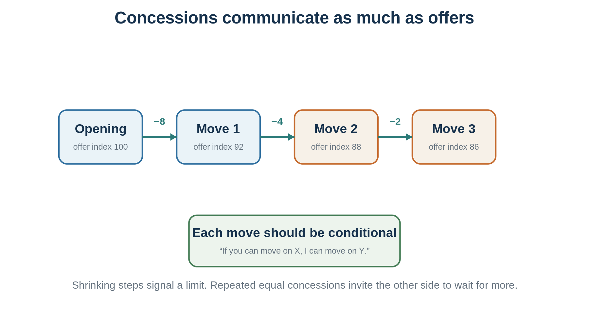<figcaption>Figure 32.1. A disciplined concession pattern uses diminishing, reciprocal, and conditional moves.</figcaption></figure>

### When an offer is surprisingly good

If the first offer is better than expected, it may be tempting to accept immediately. This can be a mistake.

First, a surprisingly good offer may reveal that your expectations were too modest. You may have underestimated the bargaining zone. Before accepting, ask whether the other side has information you lack, whether the offer includes hidden conditions, or whether there is room for additional value.

Second, immediate acceptance can make the other side dissatisfied. If they offer €10,000 and you instantly say yes, they may wonder whether they offered too much. This is reactive devaluation in reverse: people may devalue their own offer if the other side accepts too eagerly. They may feel regret, suspicion, or embarrassment. Even when you like the offer, it may be wise to pause, ask clarifying questions, and make the agreement feel considered.

Third, accepting immediately may prevent you from discovering other issues. There may be terms, timing, support, warranty, flexibility, or future opportunities that matter.

This does not mean you should always bargain theatrically. If an offer is genuinely excellent and the relationship matters, you should not invent conflict for its own sake. But you can still respond thoughtfully:

“That is a strong offer. I appreciate it. Before I respond, could we clarify the timeline and support terms?”

Or:

“I think we are close. Let me review the full package so I can make sure we are aligned.”

If the offer is due to the other side’s obvious lack of information and you value the relationship, you may even choose to correct them. This can build trust and protect long-term value. Distributive negotiation is not a license to exploit every mistake. Context matters.

The practical rule is:

Do not accept the first offer reflexively. Understand it, test it, and consider the full agreement.

### Concessions communicate limits

Concessions are almost always necessary in distributive negotiation. But concessions do more than change the terms. They send signals.

A concession can signal flexibility, goodwill, weakness, impatience, closeness to agreement, or lack of confidence. The pattern of concessions often matters as much as their size.

Suppose a seller opens at €12,000. The buyer counters at €8,000. The seller drops immediately to €9,500. The buyer may infer that the seller’s first offer was inflated and that more concessions are available. If the seller then drops again quickly to €9,000, the buyer may continue pressing.

Immediate large concessions can teach the other side to wait. Repeated concessions without reciprocity can teach them that pressure works. Conceding twice in a row without receiving movement can weaken your position.

A better concession strategy has several principles.

First, do not make immediate concessions unless there is a clear reason. Respond to the other side’s movement, new information, or package trade. If you concede too quickly, the concession may not be appreciated.

Second, make concessions smaller over time. A decreasing concession pattern signals that you are approaching your limit. For example, a seller might move from €12,000 to €11,000, then to €10,400, then to €10,100. The decreasing size suggests less room remains. A pattern of equal concessions may imply more movement is possible. A pattern of increasing concessions signals panic.

Third, avoid making more than one concession in a row. If you move, expect reciprocal movement. This does not mean every concession must be exactly matched, but unreciprocated concessions create imbalance.

Fourth, label concessions. If you make a concession silently, the other side may treat it as the new baseline rather than as a meaningful movement.

For example:

“I can move from €10,000 to €9,600, but that assumes payment this week.”

Or:

“I can reduce the price by €500 if we remove the delivery requirement.”

This connects concessions to conditions.

Fifth, use conditional concessions. “If you can do X, then I can do Y.” Conditional concessions encourage reciprocity and protect against giving value away.

Sixth, package concessions. Instead of bargaining one issue at a time, connect issues. “I can be flexible on timing if we can agree on price.” Even in distributive negotiation, packaging helps preserve value.

Seventh, be patient. Silence after a concession can be powerful. Many negotiators become uncomfortable and fill silence by conceding again. Do not negotiate against yourself.

A useful rule is:

Every concession should have a purpose, a label, and preferably a condition.

Concessions should move the negotiation toward agreement, not simply relieve discomfort.

### The even-split ploy

One common tactic in distributive negotiation is the suggestion to “split the difference.”

Suppose a seller asks €10,000 and the buyer offers €8,000. The midpoint is €9,000. Splitting the difference can feel fair because it appears equal. But it may not be fair if the numbers leading to the midpoint were strategically chosen.

If one party anchors aggressively and then suggests splitting the difference, the midpoint may favor them. For example, if a buyer with a true reservation value of €10,000 offers €6,000 and the seller asks €10,000, splitting the difference at €8,000 may be excellent for the buyer but poor for the seller. The fairness of the midpoint depends on the legitimacy of the endpoints.

“Let’s split the difference” also creates pressure because refusing can make you appear unreasonable. The tactic uses fairness language to claim value.

A disciplined response is:

“I appreciate the spirit of finding a fair middle. But before we split the difference, we should ask whether the endpoints are reasonable.”

Or:

“I am open to a fair solution, but I do not think the midpoint between those two numbers reflects the market data.”

Splitting can be useful when both parties’ positions are legitimate and the remaining gap is small. It can also help close a deal when relationship matters. But it should not replace analysis.

A useful question is:

Split the difference between what and what?

If the endpoints are arbitrary, the midpoint is arbitrary too.

### Deadlines and patience

Time is a source of power.

A party under deadline pressure may concede more. A seller who must sell today is weaker than one who can wait. A candidate with an expiring offer may have less flexibility. A company facing production shutdown may accept costly terms. A negotiator whose flight leaves in two hours may rush agreement.

Deadlines can be real or artificial. Real deadlines come from external constraints: legal filing dates, production schedules, budget cycles, event dates, expiring permits, or competing offers. Artificial deadlines are created to pressure the other side: “This offer expires tonight,” “I need an answer now,” “Another buyer is waiting,” or “This is only available today.”

Deadlines affect psychology. As time runs out, desire for closure increases. People become more willing to concede to avoid failure. But deadlines can also coordinate agreement. If both sides want a deal, a deadline can focus attention and force decisions.

Good negotiators manage time deliberately.

They ask whether a deadline is real. They avoid revealing their own time pressure unnecessarily. They create alternatives before deadlines become desperate. They do not let artificial urgency replace analysis. They use breaks when emotions rise. They slow down when pressured to decide immediately.

If the other side uses an exploding offer, ask:

Why does the offer expire so quickly? What changes after the deadline? Can we extend the timeline to evaluate properly? What information do I need before deciding? Is this urgency a signal of scarcity or a pressure tactic?

Sometimes you must decide quickly. But even then, return to your reservation value. Time pressure should not make you accept a deal worse than your BATNA.

Patience can be a bargaining advantage. The person who can tolerate silence, delay, and discomfort often learns more and concedes less.

### Power without aggression

Distributive negotiation often tempts people into two unhelpful styles: softness and aggression.

A soft negotiator wants agreement and may make concessions to preserve harmony. This can be appropriate in some relationships, but if taken too far, it leads to one-sided losses, resentment, and exploitation.

An aggressive negotiator wants victory and may use threats, pressure, and deception. This can sometimes claim value in one-shot interactions, but it often damages trust, reputation, and implementation.

A better approach is to be firm and respectful: soft on the people, hard on the substance. This idea is associated with principled negotiation (Fisher et al., 2011), but it is equally important in distributive contexts. Claiming value does not require contempt. It requires clarity.

Firmness means:

Know your BATNA. Set a target. Make justified offers. Protect your reservation value. Do not reward pressure with unilateral concessions. Ask for reciprocity. Use standards. Walk away when necessary.

Respect means:

Do not humiliate the other side. Do not lie about material facts. Listen to constraints. Give face-saving exits. Use legitimate standards. Separate disagreement from disrespect. Preserve the possibility of future cooperation.

This combination is powerful because it avoids the weaknesses of both softness and aggression. It lets you claim value without turning negotiation into personal conflict.

A useful sentence pattern is:

“I understand why that matters to you. From my side, I cannot agree to that term because it would put us below our alternative. What I could do is…”

This acknowledges the person while protecting the substance.

### Common tactics and responses

Distributive negotiation includes many tactics. Some are legitimate. Some are questionable. Some are manipulative. The best defense is recognition.

An extreme anchor is an ambitious first offer designed to pull the bargaining range. Respond by re-anchoring with justification.

A flinch is a visible negative reaction to an offer, designed to make the other side feel unreasonable. Respond by asking for substantive reasons, not emotional cues.

A nibble occurs when one party asks for small additional concessions after the main agreement seems settled. Respond by linking any new concession to a reciprocal adjustment.

A limited authority tactic occurs when one negotiator says they cannot approve the deal and must check with someone else. Sometimes this is true; sometimes it is a way to extract more concessions. Respond by clarifying decision authority early: “Who needs to approve this agreement?”

A good cop/bad cop tactic uses one friendly negotiator and one tough negotiator to make concessions seem necessary. Respond by focusing on substance and not the interpersonal contrast.

An exploding offer creates deadline pressure. Respond by testing the deadline and asking for time to evaluate.

A take-it-or-leave-it offer attempts to end bargaining. Sometimes it reflects a real limit; sometimes it is a tactic. Respond by exploring whether there are other issues or standards that justify movement.

A bogey involves pretending an issue is important in order to trade it later. This is ethically questionable if it misrepresents true preferences. Respond by asking why the issue matters and looking for objective constraints.

A false scarcity claim suggests that the opportunity is limited when it is not. Respond by asking for evidence and returning to your BATNA.

A fake bottom line misrepresents reservation value. This can damage trust and become unethical if it involves deception about material facts.

Not every tactic requires confrontation. Sometimes the best response is a question, silence, a process reset, or a return to standards.

For example:

“Help me understand the basis for that.” “That does not work for us. Here is what would.” “If that issue is important, we can discuss it, but we would need movement on another issue.” “I do not want to make a rushed decision. Let’s take a break and review the numbers.” “Who has final authority to approve this?” “I am not comfortable with artificial deadlines. If the offer is real, we should be able to evaluate it properly.”

Recognizing tactics reduces their emotional power.

## Ethics and process

### Ethics in claiming value

Distributive negotiation raises ethical tension because parties are expected to protect their own interests. You are not obligated to reveal your reservation value. You are not obligated to accept the first fair offer. You may open ambitiously. You may ask for more than you expect to receive. You may use silence, justification, and strategic concession patterns.

But not everything is acceptable.

Lying about material facts, fabricating alternatives, inventing fake offers, making promises you do not intend to keep, hiding defects you are obligated to disclose, or using artificial deadlines deceptively can cross ethical lines. Even when such tactics “work,” they may damage reputation, trust, and self-respect.

Negotiators often rationalize unethical behavior by saying, “Everyone does it,” “It is just bargaining,” or “They should have known.” This is ethical fading: the moral dimension disappears behind strategic language.

A useful distinction is between protecting private information and creating false beliefs.

It is usually acceptable not to reveal your reservation value. It is not acceptable to lie about having another offer. It is acceptable to make an ambitious opening offer. It is not acceptable to misrepresent a product’s condition. It is acceptable to say, “This is difficult for us.” It is not acceptable to invent a false deadline. It is acceptable to argue for a favorable standard. It is not acceptable to fabricate data.

Power also matters. A tactic used between sophisticated parties with equal information is different from the same tactic used against someone inexperienced or vulnerable. Ethical negotiation requires considering whether the other party can meaningfully understand and refuse the terms.

A practical test is:

Would I be comfortable if this tactic were described publicly? Would I accept this tactic if used against me by a more powerful party? Does this tactic help allocate value, or does it undermine informed consent? Will this behavior damage future trust if discovered?

Claiming value is legitimate. Deception is not made ethical by calling it negotiation.

### Common mistakes

Several mistakes appear repeatedly.

The first mistake is negotiating without preparation. People enter the conversation without a clear BATNA, reservation value, target, or estimate of the other side’s situation. Under pressure, they improvise. Improvisation feels flexible, but it often means vulnerability to anchors and emotions.

The second mistake is making the first offer without enough information. If you know too little and the other side knows much more, your first offer may reveal ignorance. Learn before anchoring.

The third mistake is making an insufficiently ambitious first offer. Many negotiators fear offending the other side and open too close to what they actually hope to get. They then have little room to concede and may claim too little value.

The fourth mistake is talking more than listening. Negotiators often try to influence before trying to learn. They explain, justify, and persuade, but fail to ask diagnostic questions.

The fifth mistake is revealing the reservation value. If the other side knows your walk-away point, they have little reason to offer more unless relationship or fairness motivates them.

The sixth mistake is miscalculating the bargaining zone and failing to update. Negotiators may assume there is a ZOPA when there is none, or assume there is none when there is. They must revise estimates as new information arrives.

The seventh mistake is making premature concessions. Immediate concessions, repeated concessions, or concessions without reciprocity teach the other side to ask for more.

The eighth mistake is accepting the first offer too quickly. This may leave value unclaimed and make the other side regret their offer.

The ninth mistake is splitting the difference without examining the endpoints. A midpoint is not fair if the anchors are not fair.

The tenth mistake is confusing value claiming with relationship destruction. Some negotiators become so focused on winning the slice that they damage the relationship needed to implement the deal or negotiate again.

The best protection against these mistakes is disciplined preparation and process.

### A distributive process

A distributive negotiation can be approached through a sequence.

Before the negotiation:

Define the issue. Identify your BATNA. Quantify your reservation value. Improve your BATNA where possible. Set your target. Estimate their BATNA and reservation value. Identify the likely bargaining zone. Gather standards and evidence. Decide whether you should make the first offer. Prepare your opening and justification. Plan your concession pattern. Identify ethical boundaries.

During the negotiation:

Learn before committing if information is limited. Listen for interests, constraints, alternatives, and deadlines. Anchor if you are well informed. Re-anchor if they anchor first aggressively. Justify offers with standards. Protect your reservation value. Make concessions slowly, conditionally, and reciprocally. Use silence when appropriate. Do not accept too quickly. Watch for tactics. Update your estimate of the bargaining zone. Know when to walk away.

After agreement:

Confirm all terms. Check implementation details. Clarify deadlines, responsibilities, and contingencies. Document the agreement. Preserve relationship where relevant. Reflect on what you learned.

This process does not guarantee success. But it reduces avoidable errors.

## Worked examples

### Worked example: salary

Consider a candidate negotiating a job offer.

The offer is €65,000. The candidate’s alternative is another job worth €62,000 but with less growth. The candidate values the current job more because of research opportunities and location. After comparing salary, benefits, flexibility, and growth, the candidate sets a reservation value equivalent to €64,000. Accepting less would be worse than the alternative.

The candidate researches market salaries and finds that comparable roles range from €68,000 to €78,000. The candidate sets a target of €74,000 and an opening range of €74,000 to €78,000 depending on the package.

The candidate says:

“I am very excited about the role. Based on comparable positions, the responsibilities we discussed, and my experience, I was expecting something in the €74,000 to €78,000 range, depending on the overall package.”

This is a range offer with justification. It anchors above the target while leaving room.

The employer responds:

“That is far beyond our budget. We might be able to do €67,000.”

The candidate should not immediately split the difference or drop sharply. A better response is:

“I appreciate the movement. Could you help me understand whether the constraint is salary band, total compensation, or budget for this year?”

This question gathers information. If the salary band is fixed, there may be other issues: signing bonus, relocation, research budget, remote work, title, professional development, earlier review, or performance bonus. If salary is flexible, the candidate can continue distributive bargaining.

Suppose the employer says salary cannot exceed €70,000 because of internal equity. The candidate might respond:

“If €70,000 is the salary ceiling, I would like to discuss a signing bonus and a six-month compensation review tied to clear performance criteria.”

This moves from pure distributive bargaining to multi-issue negotiation. But distributive discipline remains: the candidate knows the reservation value, target, and trade-offs.

Suppose instead the employer says:

“We can do €69,000, but only if you accept today.”

The candidate should test the deadline:

“I am very interested, but this is an important decision. What changes after today? I would like to review the full package and respond tomorrow.”

If the deadline is artificial, it may soften. If real, the candidate must compare the offer with the BATNA.

The lesson is that distributive negotiation is not about memorizing lines. It is about protecting value through preparation, information, anchors, and disciplined concessions.

### Worked example: used car

A buyer wants to buy a used car. After research, the buyer believes similar cars sell between €9,000 and €10,500. The buyer’s maximum willingness to pay is €10,000 because another acceptable car is available for that price. The buyer’s target is €8,800.

The seller lists the car for €11,500. The buyer inspects it and finds that tires will need replacement soon, estimated at €600. The buyer decides to make the first offer because they have good information.

The buyer says:

“Based on comparable listings around €9,500 and the tire replacement needed soon, I could offer €8,700.”

This is precise and justified. The seller responds:

“That is too low. I could maybe do €10,800.”

The buyer should not adjust too close to €10,800. Their reservation value is €10,000. They might respond:

“I understand you would like to stay close to the listing price. Given the market data and upcoming maintenance, €10,800 is above what makes sense for me. I could move to €9,000.”

The seller later says:

“Let’s split the difference between €9,000 and €10,800: €9,900.”

This is within the buyer’s reservation value, but the buyer should examine whether the endpoints are legitimate. The buyer might say:

“I appreciate trying to find a middle point. I do not think €10,800 is supported by the comparable listings. I could do €9,400 and complete payment this week.”

This concession is conditional: higher price in exchange for quick payment.

If the seller refuses below €10,300, the buyer should walk away because the alternative is better. Walking away is not failure. It is the purpose of having a BATNA.

<aside class="callout evidence-and-boundary-conditions">
EVIDENCE AND BOUNDARY CONDITIONS

An aggressive anchor can improve the final number and still damage trust, legitimacy, or future cooperation. Evaluate the whole negotiation, not only the immediate price.
</aside>

## Key ideas

- A distributive move is both a transfer of value and a signal. Offers, pauses, concessions, deadlines, and justifications shape expectations about limits and legitimacy.
- Use precise and range offers appropriately.
- Respond to aggressive anchors with independent analysis and re-anchoring.
- Make concessions conditional, visible, and decreasing.

## Study and practice

1. How would you use precise and range offers appropriately in practice?

2. Respond to aggressive anchors with independent analysis and re-anchoring?

3. Make concessions conditional, visible, and decreasing?

<aside class="callout activity">
ACTIVITY

Run a bargaining simulation with a target, reservation value, and concession plan. Afterward, calculate surplus, identify where the anchor moved you, and evaluate process and relationship separately from the final number. EXPERIENCE - EXPLAIN - APPLY (MAXIMUM 120 WORDS) Experience: describe one specific decision, interaction, or observation. Explain: use one or two concepts from this chapter accurately. Apply: state one improvement, implication, or testable prediction.
</aside>

# Chapter 33. Interests, Priorities, and Trade-Offs

*Creating value before dividing it*

<aside class="callout core-idea">
CORE IDEA

Integrative negotiation creates value by discovering differences in interests, priorities, time, risk, beliefs, and capabilities - then trading on those differences rather than splitting positions.
</aside>

## Learning goals

- Distinguish integration from compromise.
- Explain Pareto efficiency and the Pareto frontier.
- Diagnose fixed-pie perception and illusory conflict.
- Use interest discovery, priority mapping, and logrolling.

Distributive and integrative negotiation are often taught separately, but real negotiations usually contain both.

A salary negotiation may create value by adding flexibility, professional development, start date, title, bonus, and review schedule. But the parties may still divide value over salary. A supplier contract may create value through quality guarantees, delivery flexibility, risk sharing, and future volume commitments. But the parties may still bargain over price. A peace agreement may create value through security guarantees, demilitarized zones, recognition, and monitoring. But the parties may still disagree over territory, compensation, or authority.

Value creation and value claiming are not mutually exclusive. They are two tasks inside the same negotiation.

This creates a central tension. To create value, negotiators must often share information about their interests, priorities, constraints, and preferences. But sharing information can make them vulnerable when value is later claimed. If I tell you that delivery speed matters more to me than price, you may use that information to demand a higher price. If you tell me that you have no strong alternative, I may push harder. If I reveal that one issue is easy for me to concede, you may ask for it without giving anything back.

Lax and Sebenius (1986) call this the negotiator’s dilemma: the tension between cooperative moves that create value and competitive moves that claim value. Too little openness prevents value creation. Too much openness can lead to exploitation.

Good negotiators manage this tension. They do not reveal everything. They do not hide everything. They reveal enough to make value creation possible while protecting essential information such as their reservation value. They ask questions. They share interests rather than bottom lines. They make conditional offers. They propose multiple options. They use objective standards. They build trust gradually. They keep both value creation and value claiming in view.

A useful principle is:

Create value before claiming it, but prepare to claim value before you start creating it.

This means that integrative negotiation still requires the preparation discussed in Chapter 31: BATNA, reservation value, target, standards, and alternatives. Without distributive discipline, a cooperative negotiator can create value and then fail to capture a fair share of it.

## Pareto efficiency

<figure class="book-figure">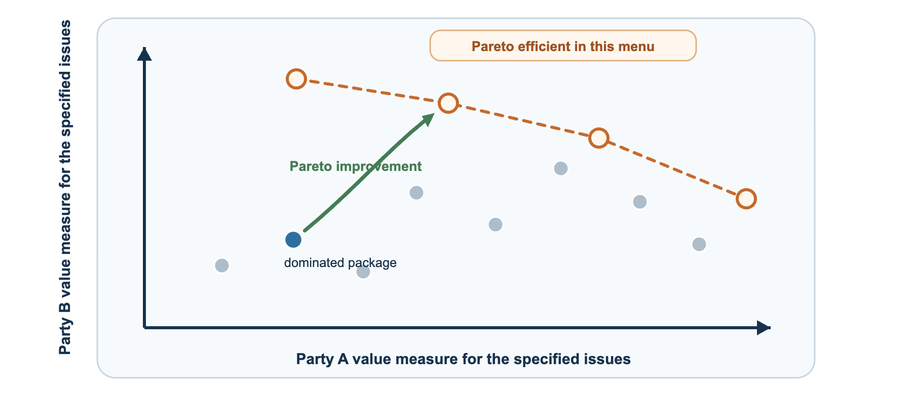<figcaption>Figure 33.1. Integrative negotiation moves agreements toward the Pareto frontier; efficiency and fairness remain distinct questions.</figcaption></figure>

The goal of integrative negotiation is not simply to reach agreement. The goal is to reach an agreement that uses the available value well.

An agreement is Pareto efficient if no party can be made better off without making another party worse off. In negotiation, a Pareto efficient agreement is one in which all possible joint value has been created. The parties may still argue about how that value is divided, but there is no missed opportunity to improve one side without hurting the other.

A Pareto frontier is the set of all Pareto efficient agreements. Agreements inside the frontier are inefficient: there is some way to make one or both parties better off. Agreements on the frontier are efficient: to improve one party from that point, another party must give something up.

Consider a negotiation between a software provider and a client. The parties negotiate price, start date, service level, customization, training, and contract length. Suppose they reach an agreement with a moderate price, late start date, no training, and short contract. Later they realize that the provider had unused training capacity, the client urgently needed training, and a longer contract would have reduced the provider’s risk enough to lower the price. The initial agreement was not Pareto efficient. Both could have been better off.

Pareto efficiency does not mean fairness. One party can receive most of the value and the agreement can still be Pareto efficient. Efficiency is about whether value is wasted. Fairness is about how value is divided. A complete negotiation must consider both.

This distinction matters because negotiators often settle for agreements that are both inefficient and unfair. They compromise on visible positions while missing hidden trades. They split one issue while ignoring others. They accept a deal that is better than impasse but worse than what both could have achieved.

True integrative negotiation asks:

Are there issues we have not discussed? Are there differences in priorities we can trade on? Are there risks one side can bear more cheaply? Are there timing differences that matter? Are there future events we can make the agreement contingent on? Are there capabilities each side can contribute? Are there ways to improve implementation? Can one party get something valuable that costs the other party little?

The best negotiators do not only ask, “Is this acceptable?” They ask, “Is this the best agreement we can jointly design?”

## Compromise is not integration

Compromise is often treated as the ideal negotiation outcome. Each side gives something up. The result feels balanced. But compromise is not always integrative. Sometimes compromise produces a worse outcome for both parties than a more creative agreement would have.

A simple example is the story of two children arguing over an orange. A compromise cuts the orange in half. But if one child wants the juice and the other wants the peel for baking, splitting the orange is inefficient. Both could have received more of what they wanted by revealing their interests.

Another example is the “brown shoe and black shoe” problem. If one person wants a pair of brown shoes and another wants a pair of black shoes, compromise might give each person one brown shoe and one black shoe. This is equal, but useless. Compromise can be lose-lose when the parties split positions instead of satisfying interests.

Compromise is especially tempting when conflict is uncomfortable. Splitting the difference creates closure. It feels fair. It avoids asking difficult questions. But it may leave value on the table.

Consider a job negotiation. The candidate asks for €80,000. The employer offers €70,000. They compromise at €75,000. This may be acceptable. But perhaps the employer cannot exceed €72,000 because of internal equity, while the candidate mainly cares about professional development and flexibility. A package of €72,000, remote work, conference funding, and a six-month review may be better for the candidate and easier for the employer than €75,000.

Consider a deadline negotiation. A client wants delivery in March. A supplier wants July. They compromise on May. But perhaps the client only needs one component in March, while the supplier can deliver that component early if the full system is delivered later. A staged delivery creates more value than splitting the date.

Consider a budget negotiation. Two departments each ask for €100,000. The dean gives each €50,000. But perhaps one department needs staff time and the other needs equipment; perhaps external grants can support one but not the other; perhaps shared infrastructure can satisfy both. Equal division may look fair while wasting value.

The key lesson is:

Compromise divides positions. Integration satisfies interests.

Compromise is not always bad. Sometimes it is the best available option. But it should not be the first imagination. Before compromising, ask whether the parties are solving the wrong problem.

## Barriers to value creation

If integrative negotiation is so valuable, why do negotiators so often fail to create value?

Fixed-pie beliefs and inaccurate social perception prevent negotiators from discovering compatible interests and differences in priorities (Thompson & Hastie, 1990).

The first barrier is fixed-pie perception. Negotiators assume that the other side’s interests are directly opposed to their own. Thompson and Hastie (1990) showed that negotiators often falsely assume a fixed pie even when integrative potential exists. If I assume everything you gain is my loss, I will hide information, resist questions, and interpret your proposals defensively. The fixed-pie perception becomes self-fulfilling.

The second barrier is illusory conflict. Parties may believe their interests conflict when they are actually compatible. For example, two departments may both oppose a shared plan because each assumes the other wants control. Discussion may reveal that one wants visibility and the other wants operational autonomy. These interests can be combined.

The third barrier is positional bargaining. When parties bargain over demands rather than interests, they narrow the negotiation. “I need €80,000.” “We can only offer €70,000.” “I need March.” “We can only do July.” Positions invite concession or resistance. Interests invite problem-solving.

The fourth barrier is mistrust. If parties fear exploitation, they will not share useful information. This is rational in some environments. Trust must be built through process, reciprocity, confidentiality, objective standards, and credible behavior.

The fifth barrier is poor listening. Negotiators often try to influence before trying to learn. They defend their position, repeat arguments, and prepare counterarguments instead of asking what matters to the other side.

The sixth barrier is overconfidence. Negotiators may be too confident in their predictions, legal case, market valuation, project timeline, or future demand. Overconfidence prevents contingent agreements because each side wants the other to accept its forecast.

The seventh barrier is self-serving bias. Each side interprets fairness in a way that favors itself. A seller thinks its price is fair because of effort and quality. A buyer thinks a lower price is fair because of market alternatives and defects. Both see themselves as reasonable and the other as biased.

The eighth barrier is reactive devaluation. A proposal may seem less attractive simply because it comes from the other side (Ross, 1995). If they suggested it, perhaps it must benefit them. This can block good deals.

The ninth barrier is single-issue framing. When negotiators discuss issues one by one, they often turn each issue into a distributive battle. Multi-issue package negotiation makes trade-offs easier.

The tenth barrier is fear of appearing weak. Some negotiators believe that asking about interests or offering options signals softness. In fact, curiosity is not weakness. It is information gathering.

A useful diagnostic question is:

Are we failing because no agreement can create value, or because our process prevents us from seeing it?

Often the second answer is closer to the truth.

## Interests behind positions

The basic move in integrative negotiation is to separate positions from interests.

Perspective-taking can improve discovery of integrative agreements, particularly when it supports diagnostic questioning rather than untested projection (Galinsky et al., 2008).

A position is what a party says it wants. An interest is why the party wants it.

Positions are visible. Interests are hidden.

“I want full ownership.” Why? Control, identity, security, future flexibility, investor expectations, legal simplicity?

“I need a higher salary.” Why? Living costs, status, fairness, debt, family obligations, future salary trajectory, recognition?

“We cannot accept delay.” Why? Customer commitments, regulatory deadline, cash-flow pressure, reputation, coordination with other projects?

“We require exclusivity.” Why? Investment protection, brand consistency, fear of competition, quality control?

The same position can serve different interests. The same interest can be served by different positions. This is why interest discovery creates value.

To uncover interests, ask:

What makes this important? What problem would this solve? What happens if this issue is not addressed? Who else is affected? What concern are you trying to protect? What would a good outcome allow you to do? If this exact term is difficult, what alternative could meet the same need?

Interests are not only material. They can include money, time, risk, predictability, autonomy, status, identity, face, fairness, trust, reputation, learning, security, dignity, and future opportunity.

Many negotiators ask too few “why” questions because they fear appearing intrusive. But respectful questions often improve negotiation. They signal that you are not simply rejecting the other side’s position; you are trying to understand the problem behind it.

A good phrase is:

“Help me understand what that term is meant to protect.”

This question respects the other side’s concern while opening space for alternatives.

## Camp David: sovereignty and security

One of the most famous examples of integrative negotiation is the Camp David Accords between Egypt and Israel. At first, the dispute over the Sinai Peninsula appeared distributive. Egypt wanted the return of the Sinai. Israel did not want to return it. Splitting the land was not acceptable to either side.

The breakthrough came from understanding interests behind positions. Egypt’s core interest was sovereignty over land it regarded as historically and politically Egyptian. Israel’s core interest was security from land or air attack. These interests were not identical to the stated positions. Once the interests were understood, a trade became possible: Egypt regained sovereignty over the Sinai, while security arrangements, demilitarization, and monitoring addressed Israel’s security concerns.

The lesson is not that all conflicts can be solved this way. Some interests genuinely conflict. Some parties lack trust. Some disputes involve sacred values, violence, trauma, or domestic political constraints. But the example shows how positions can make conflict appear impossible while interests reveal room for agreement.

The question “Who gets the Sinai?” produces a zero-sum frame. The question “What does each side need from the Sinai?” opens integrative possibilities.

This applies far beyond diplomacy.

“Who gets the office?” may become: one person needs quiet for writing; another needs visibility for team coordination. “Who gets the budget?” may become: one unit needs equipment; another needs travel; both can share infrastructure. “Who owns the idea?” may become: one person needs recognition; another needs implementation authority. “What price?” may become: one side needs cash now; the other needs lower risk over time.

Integrative negotiation often begins by changing the question.

## Preparing across issues

Integrative negotiation requires preparation. Improvisation is not enough.

A useful preparation process has six steps.

First, identify the issues. Do not reduce the negotiation to one visible issue too early. In a job negotiation, issues may include salary, title, start date, location, remote work, travel, budget, teaching load, research support, bonus, review timing, and professional development. In a supplier negotiation, issues may include price, volume, quality, delivery, payment timing, warranty, service level, exclusivity, penalties, data sharing, and future contract length.

Second, identify your position and underlying interest for each issue. What do you want, and why? Rank your priorities. Which issues matter most? Which are flexible? Which are symbolic? Which are essential?

Third, assess the other party’s likely positions, interests, and priorities. What do they ask for? What might that protect? Which issues are probably more important to them than to you? Which are probably less important?

Fourth, identify your BATNA, target, and reservation value. Integrative negotiation does not eliminate the need for distributive preparation. You still need to know when to walk away.

Fifth, estimate the other party’s BATNA and reservation value. What happens to them if no agreement occurs? What constraints do they face? How strong are their alternatives?

Sixth, update during the negotiation. Preparation creates hypotheses, not certainties. As you ask questions and observe reactions, revise your assessment.

A preparation table can be useful:

Such a table makes differences visible. Differences are not a problem. They are opportunities for trade.

The most important question in multi-issue preparation is:

What do I value less than they do, and what do I value more than they do?

That question is the beginning of logrolling.

*Table 33.1. A priority map for integrative trade-offs*

| Issue | My priority | Their likely priority | Potential trade |
| --- | --- | --- | --- |
| Price / salary | High | High | Use standards; do not expect easy integration. |
| Timing | High | Low or different | Trade speed, start date, or staging for value elsewhere. |
| Risk allocation | Medium | Different tolerance or forecast | Use warranties, insurance, or contingent terms. |
| Recognition / title | Low cost to one side | High symbolic value to the other | Trade status or visibility for a material term. |
| Future relationship | Different time horizons | Different | Use volume, renewal, review, or option clauses. |

## Logrolling

Logrolling means trading across issues based on differences in priorities. Each side gives way on issues it values less in exchange for gains on issues it values more.

Suppose a supplier cares most about contract length because it wants predictable revenue. The buyer cares most about delivery flexibility because demand is uncertain. A value-creating agreement might give the supplier a longer contract while giving the buyer flexible delivery quantities.

Suppose a job candidate values remote work highly and salary moderately. The employer values salary cost highly but is flexible on remote work. The candidate may accept a lower salary increase in exchange for remote work.

Suppose a publisher is cautious about paying a large advance, while an author is confident in future sales and values upside. The publisher can pay a lower advance but higher royalties. The author gets upside; the publisher reduces risk.

Logrolling works only when negotiators know priorities. This is why asking about interests matters. If parties hide all priorities, they cannot trade efficiently.

A useful question is:

“Which issues are most important to you, and where do you have more flexibility?”

Some negotiators fear answering because they believe every revealed priority will be exploited. One way to reduce vulnerability is reciprocal disclosure:

“I can share which issues are most important to us if you are willing to do the same. That may help us find trades rather than bargain issue by issue.”

Another way is to use packages:

“If we can be flexible on contract length, could you be flexible on delivery quantities?”

This reveals a trade without fully revealing reservation values.

The mistake is to negotiate each issue separately. If parties settle price first, then delivery, then warranty, then payment timing, they may turn every issue into a small distributive fight. Package negotiation allows trade-offs:

“I can accept your preferred delivery schedule if we can agree on longer payment terms and a higher service level.”

Logrolling is the heart of integrative negotiation. It transforms difference into value.

## Differences are opportunities

In everyday life, people often treat differences as obstacles. In negotiation, differences often create value.

Differences in valuation create trade. If you value an item more than I do, I can give it to you in exchange for something I value more.

Differences in cost create efficiency. If I can provide a service cheaply that is valuable to you, including it in the agreement creates value.

Differences in capabilities create cooperation. One firm has technology; another has distribution. One partner has local knowledge; another has capital. One colleague is good at analysis; another is good at presentation.

Differences in risk attitudes create insurance-like trades. A party better able to bear risk may accept uncertain payoff in exchange for compensation. A risk-averse party may prefer certainty.

Differences in time preferences create borrowing, lending, staged payments, early delivery discounts, or delayed compensation. One side may value cash now; another may value higher total payment later.

Differences in beliefs create contingent contracts. If one side is optimistic and the other skeptical, rather than arguing endlessly about who is right, they can make payments depend on future outcomes.

Differences in tax position, regulation, reputation, capacity, inventory, seasonality, or stakeholder constraints can also create value.

The key is not to convince the other side to think like you. If you like apples and they like oranges, do not spend the negotiation persuading them that apples are better. Trade.

This principle is easy to state but difficult to practice because disagreement often triggers persuasion. When someone values an issue differently, we may want to prove that our valuation is correct. In integrative negotiation, the better response is curiosity:

“If you value that issue more than I do, how can we structure a trade?”

Difference is not only a source of conflict. It is the raw material of agreement.

<aside class="callout evidence-and-boundary-conditions">
EVIDENCE AND BOUNDARY CONDITIONS

Creating value does not eliminate value claiming. A cooperative negotiator still needs a BATNA, reservation value, target, and standards for a fair division of the enlarged pie.
</aside>

## Key ideas

- Integrative negotiation creates value by discovering differences in interests, priorities, time, risk, beliefs, and capabilities - then trading on those differences rather than splitting positions.
- Distinguish integration from compromise.
- Explain Pareto efficiency and the Pareto frontier.
- Diagnose fixed-pie perception and illusory conflict.

## Study and practice

1. How would you distinguish integration from compromise?

2. How would you explain pareto efficiency and the pareto frontier?

3. Diagnose fixed-pie perception and illusory conflict?

<aside class="callout activity">
ACTIVITY

List at least five issues in a multi-issue negotiation. Rank your priorities and estimate theirs. Identify one issue that is cheap for you and valuable to them, and one with the opposite pattern. Propose a conditional trade. EXPERIENCE - EXPLAIN - APPLY (MAXIMUM 120 WORDS) Experience: describe one specific decision, interaction, or observation. Explain: use one or two concepts from this chapter accurately. Apply: state one improvement, implication, or testable prediction.
</aside>

# Chapter 34. MESOs, Contingent Contracts, and Better Agreements

*Learning priorities, betting on differences, and improving implementation*

<aside class="callout core-idea">
CORE IDEA

Better agreements can reveal priorities through multiple packages, convert forecast disagreement into contingent terms, stage trust, and reopen an initial settlement only when both parties can improve without risk.
</aside>

## Learning goals

- Design multiple equivalent simultaneous offers.
- Use contingent contracts when beliefs differ and performance can be measured.
- Manage disclosure through staged reciprocity and verification.
- Use process design, post-settlement settlements, and implementation planning.

One powerful tool for discovering integrative agreements is the use of multiple equivalent simultaneous offers, or MESOs.

A MESO is a set of two or more offers made at the same time, each designed to be roughly equal in value to the offer-maker but different in how value is allocated across issues. The other side’s reaction reveals priorities.

Suppose a service provider is negotiating with a client over start date, service level, and price. The provider might offer:

Option A: Start in July, standard service, €650,000. Option B: Start in March, standard service, €635,000. Option C: Start in July, premium service, €700,000. Option D: Start in March, premium service, €680,000.

If these options are designed to be roughly equivalent for the provider, the client’s preference reveals what the client values: early start, premium service, or lower price. The provider learns without asking the client to reveal reservation values directly.

MESOs have several advantages.

First, they reveal priorities. If the other side prefers Option B to Option A, early start matters. If they prefer Option C to Option A, premium service matters. If they reject all premium options, service level may be less valuable than expected.

Second, they signal flexibility. A single offer may feel rigid. Multiple offers say, “There are several ways to solve this.”

Third, they can improve satisfaction. People often like having choice, especially when options are meaningful. Even if the final agreement differs from all initial options, MESOs can create a more collaborative tone.

Fourth, they reduce the trade-off between claiming and creating value. Because all offers are equivalent to you, you do not give away value by offering choice. At the same time, the other side’s choice helps identify value-creating trades.

However, MESOs require preparation. If the options are not truly equivalent to you, the other side may choose the one that is worst for you. If the options are too complex, the other side may become confused. If one option is a manipulative decoy, trust may suffer. If you offer too many options, choice overload may reduce clarity.

Good MESOs should be:

Equivalent in value to you. Different in issue combinations. Simple enough to compare. Legitimate and sincere. Designed to reveal priorities. Open to discussion rather than take-it-or-leave-it.

A useful phrase is:

“We see several possible ways to structure this. These packages are all workable from our side, but they emphasize different priorities. Your reaction may help us understand what matters most.”

MESOs turn offers into questions. They allow the other side to teach you how value can be created.

## Designing across disagreement

<figure class="book-figure">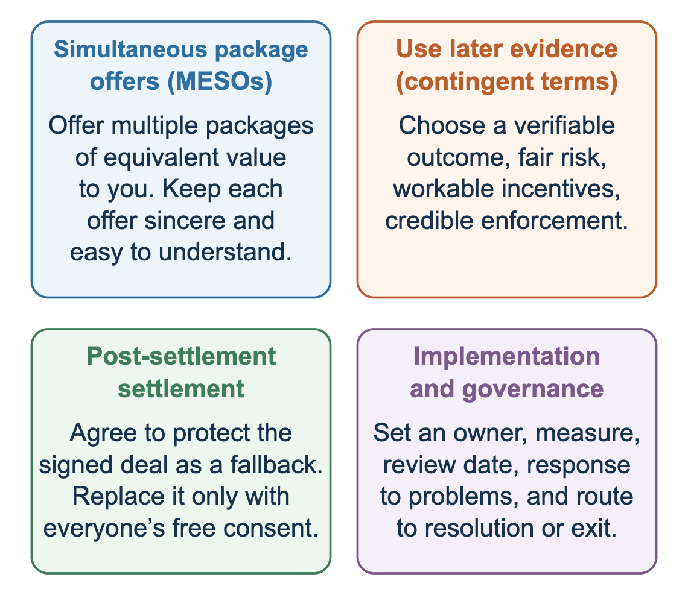<figcaption>Figure 34.1. Advanced agreement design uses MESOs, contingent terms, post-settlement improvement, and implementation governance.</figcaption></figure>

### Contingent contracts

Sometimes parties disagree not because they value different issues, but because they predict the future differently.

The seller believes the company will grow quickly. The buyer is skeptical. The author believes the book will sell well. The publisher is skeptical. The lawyer believes the case is strong. The client is unsure. The television producer expects high ratings. The station doubts it. The builder is confident the project will finish early. The buyer fears delay.

One approach is to argue about whose forecast is right. Another is to design a contingent contract: an agreement whose terms depend on future outcomes.

Contingent contracts are valuable because they allow parties to “bet” on their beliefs. If the optimistic party is right, they receive more. If the skeptical party is right, they are protected.

A lawyer might receive a large payment if the client wins and little or nothing if the client loses. An author might accept a lower advance in exchange for higher royalties. A television production company might receive a higher price if ratings exceed a threshold and a lower price if ratings disappoint. A salesperson might accept lower base pay and higher commission if confident in performance. A buyer and seller might set part of a company acquisition price as an earn-out based on future revenue.

The construction-delay example illustrates this logic. A buyer demands penalties if a building is delayed. The builder initially sees this as a last-minute concession demand. But the demand reveals an interest: timely completion is valuable to the buyer. If the builder is confident in its schedule, the builder can offer higher penalties for delay in exchange for bonuses for early completion. Both sides benefit. The buyer gets stronger protection and incentive alignment. The builder gets upside for performance.

Contingent contracts are especially useful when parties differ in:

Beliefs about future performance. Confidence in ability. Risk tolerance. Control over outcomes. Information about hidden quality. Expectations about market demand. Timing of value realization.

But contingent contracts have risks. They must be carefully designed.

First, the outcome must be measurable. Vague terms create future disputes. “Successful launch” is less useful than “revenue of at least €2 million by December 31.”

Second, the outcome must be verifiable. Both parties must agree on how performance will be observed.

Third, the contract must be enforceable. If enforcement is too costly or ambiguous, the contingent term may fail.

Fourth, incentives must not create perverse behavior. If a television station pays less when ratings are low, but also controls advertising and time slot, it might have incentive to reduce ratings unless the contract accounts for this. If a manager receives a bonus for cutting costs, quality may suffer. If a supplier pays penalties for late delivery, it may rush and compromise safety unless quality is also measured.

Fifth, risk must be allocated to the party best able to control or bear it. Do not make a party responsible for outcomes outside its influence unless compensation is appropriate.

Sixth, the contract should consider relationship. Contingent contracts can reduce disagreement, but they can also create monitoring, suspicion, and future conflict if poorly designed.

A useful contingent-contract checklist:

What future uncertainty divides us? Who is more optimistic? What outcome would reveal who was right? Can that outcome be measured clearly? Who controls the outcome? Could the incentive distort behavior? How will data be verified? What happens if external shocks occur? Is the contingent term worth the complexity?

Contingent contracts are not only legal devices. They are decision tools for transforming disagreement about the future into value.

### Worked example: an investment-bank fee

Consider a company owner negotiating a fee with an investment bank. The bank has identified a potential acquirer and proposes a 1% success fee. The owner expects the company to sell for about $500 million and thinks a 1% fee, or $5 million, is excessive. The owner proposes 0.625%. The bankers believe the likely sale price is closer to $250 million, where 0.625% would yield only $1.56 million. Each side has a different forecast of the company’s sale price.

If they argue over a single percentage, the negotiation becomes distributive. The owner wants a lower percentage. The bank wants a higher percentage. But their disagreement is partly about future value. This makes the situation suitable for a contingent contract.

One possible fee schedule might be:

1% if the sale price is $250 million or lower. 0.75% if the sale price is between $250 million and $500 million. 0.625% if the sale price is $500 million or higher.

This structure gives the bank protection if the sale price is low and gives the owner a lower rate if the sale price is high. Another structure might include a nonrefundable upfront fee and lower success percentages at higher valuations. The exact numbers matter less than the logic: the parties stop arguing about the future and make the agreement responsive to it.

This example also shows why contingent contracts require careful design. A fee schedule should preserve incentives for the bank to maximize sale value. If the percentage declines too sharply at higher prices, the bank might have weaker incentive to push for a higher price. A good structure aligns incentives rather than merely splitting forecasts.

The broader lesson is:

When parties disagree about the future, ask whether the agreement can let the future decide.

### Trust, disclosure, and verification

Integrative negotiation requires information, but information is not free. Revealing interests and priorities can create vulnerability.

This is why trust matters. But trust does not require blind openness. Trust can be built gradually through reciprocal disclosure, consistency, confidentiality, and behavior.

Start with low-risk information. Share interests that explain positions without revealing your reservation value.

“We care about delivery reliability because our customer contract has penalties.” “Our budget is tight this year, but we may have flexibility next year.” “We value public recognition because this project is important for our stakeholders.” “We need predictability more than the lowest possible price.”

Then ask for similar information:

“What constraints are most important on your side?” “Which issue is hardest for you to move on?” “Where do you have flexibility?” “What would make implementation easier?”

Information exchange should be purposeful. The goal is not confession. The goal is to discover trades.

A useful distinction is between interests, priorities, and limits.

Interests explain why something matters. Priorities reveal relative importance. Limits define reservation values.

In integrative negotiation, sharing interests and some priority information often helps. Revealing hard limits too early can weaken value claiming.

A good negotiator might say:

“Timing is more important to us than customization.”

This helps create value. They would not necessarily say:

“We would pay up to €200,000 for early delivery.”

That reveals a limit.

Trust is also built by how negotiators respond to information. If one party reveals a concern and the other exploits it immediately, future disclosure stops. If one party reveals a priority and the other proposes a trade, trust grows. Integrative negotiation is interactive. Each response teaches the other side whether openness is safe.

A useful rule is:

Reward useful disclosure with problem-solving, not exploitation.

This does not mean giving away value. It means using information to construct trades that both sides can accept.

### Perspective-getting

Chapter 28 distinguished perspective-taking from perspective-getting. This distinction is critical in negotiation.

Perspective-taking means imagining the other side’s perspective. It can help reduce egocentrism and improve strategic thinking. Galinsky et al. (2008) found that perspective-taking can improve negotiation outcomes by helping negotiators understand the other side’s interests. But perspective-taking can also become projection. You may imagine what you would think in their situation rather than what they actually think.

Perspective-getting means asking. It is often more accurate.

Good negotiators ask questions that reveal interests, priorities, constraints, and evaluation criteria:

What problem are you trying to solve with that term? Which of these issues matters most to you? What would make this agreement easier to approve internally? Where do you have flexibility? What would implementation success look like? What risks worry you most? If we cannot meet that exact request, what alternative might satisfy the same concern?

The challenge is that people may not answer fully. They may fear exploitation, lack self-awareness, or be constrained by role. This is why questions must be paired with trust-building and reciprocal openness.

Perspective-getting is especially useful when the other side’s position seems unreasonable. Instead of reacting immediately, ask:

“What would make that position make sense from their side?”

Then test the hypothesis.

Perhaps their demand is not about money but precedent. Perhaps their refusal is not about stubbornness but internal approval. Perhaps their deadline is not pressure but a real dependency. Perhaps their silence is not disinterest but consultation. Perhaps their anger is not aggression but fear of embarrassment.

Integrative negotiation begins when negotiators stop treating the other side’s position as irrational and start investigating the structure that makes it rational to them.

### Negotiate the process

Sometimes the best way to create value is to improve the process before negotiating substance.

Process questions include:

Who should be at the table? Who has authority to decide? What issues should be discussed? Should issues be negotiated one by one or as packages? What information should be exchanged before offers? What standards will be used? How will confidentiality be handled? How will emotions or conflict be managed? How will agreements be documented? How will implementation be reviewed?

If process is poorly designed, integrative potential disappears. For example, if parties negotiate price first and aggressively, trust may collapse before they discuss service level, timing, or future opportunities. If the wrong people are present, creative options may be impossible to approve. If confidentiality is unclear, parties may hide information. If the agenda is too narrow, hidden issues never emerge.

Good process design often begins with a joint statement:

“Before we discuss numbers, could we spend some time understanding what matters most on each side? Then we can look at packages rather than negotiate issue by issue.”

Or:

“Since there are several moving parts, I suggest we list all the issues first, discuss priorities, and then build a few package options.”

Or:

“Some of this information is sensitive. Could we agree that exploratory discussion is not a commitment and that either side can return to its BATNA if no package works?”

Negotiating the process may feel slow, but it often saves time. It creates the conditions for information exchange and value creation.

A useful process principle is:

Do not let the most visible issue become the only issue.

Many negotiations become distributive because the process makes them distributive.

### Post-settlement settlements

A post-settlement settlement is an improved agreement reached after the parties have already reached an initial agreement.

This idea may sound strange. If agreement has already been reached, why keep negotiating?

The reason is psychological safety. Before agreement, parties fear that exploring alternatives may weaken their position. After agreement, the parties can search for improvements without risking the deal, provided they agree that the initial settlement remains binding unless both prefer the new one.

The logic is:

“We have an agreement. That agreement protects both of us. Now let us see whether there is a better agreement that both of us prefer. If not, we keep the original agreement.”

This can reveal value that was missed due to time pressure, mistrust, fatigue, or narrow framing.

A post-settlement settlement process has several steps.

First, acknowledge the progress already made. This reduces fear that the agreement is being reopened.

Second, say that there may be aspects each side wishes could be improved.

Third, clarify that the goal is not to take back concessions but to search for a mutually better agreement.

Fourth, agree that the original agreement remains in place unless both sides voluntarily accept an improved version.

Fifth, brainstorm improvements using interests, trade-offs, and contingencies.

A possible script is:

“We are both satisfied enough to sign this agreement. At the same time, there may be aspects of the deal that each of us wishes could be improved. Since we now have a secure agreement, would it be worth spending a little time asking whether there is a version that makes both of us even better off? If we find nothing, the current agreement stands. If we find something both prefer, we can improve it.”

Post-settlement settlements are useful because they separate agreement security from creative search. They are especially valuable when parties reached agreement under pressure or did not fully explore multi-issue trades.

However, PSS requires care. If one side uses it to reopen distributive bargaining, trust collapses. If the initial agreement is not secure, the process may create anxiety. If one side lacks authority or time, PSS may be impractical.

The rule is:

Post-settlement settlement should only improve the deal for both parties. It should never be a disguised attempt to claw back value.

## Applications

### Employment

Employment negotiations are often treated as salary negotiations. But they are usually multi-issue negotiations.

Issues can include salary, bonus, title, start date, location, remote work, teaching load, research support, relocation, professional development, conference travel, administrative duties, mentoring, performance review, publication support, childcare flexibility, visa support, and future promotion criteria.

The candidate may care most about research time and flexibility. The employer may care most about start date and teaching coverage. A purely distributive salary negotiation could miss value.

For example, suppose an employer cannot exceed €70,000 due to salary bands. The candidate wants €76,000 because of living costs and recognition. Instead of ending the conversation, the parties could explore:

A signing bonus. Earlier salary review. Relocation support. Remote work. Reduced teaching in first semester. Research assistant support. Conference budget. Clear promotion timeline. Professional development funding. Flexible start date.

Some of these may be low-cost to the employer but high-value to the candidate. Others may be high-cost and therefore poor trades. The only way to know is to discuss priorities.

A candidate might say:

“I understand the salary band constraint. Could we look at the broader package? Research support, review timing, and flexibility are also important to me.”

An employer might say:

“We have limited flexibility on salary, but more flexibility on start date, professional development, and review schedule. Which of these would matter most?”

This is integrative negotiation because it treats the job offer as a package rather than a single number.

### Organizations

Organizations negotiate constantly: budgets, deadlines, resources, roles, strategy, priorities, credit, responsibility, and change.

Many internal negotiations fail because parties frame issues as departmental competition. Marketing wants more budget. Operations wants more budget. Faculty want autonomy. Administration wants standardization. Sales wants customization. Production wants stability. These positions conflict.

Integrative negotiation asks what interests the positions protect.

Marketing may need budget to generate leads. Operations may need budget to reduce delays. Faculty may need autonomy to protect academic judgment. Administration may need standardization to reduce errors. Sales may need customization to win clients. Production may need stability to deliver quality.

Once interests are explicit, creative options become possible:

Shared infrastructure. Pilot programs. Rotating resources. Service-level agreements. Decision rights by issue. Flexible standards. Contingent funding. Cross-functional teams. Joint metrics. Staged implementation. Trade-offs across time.

For example, a department may resist a new administrative system because it fears loss of autonomy. Administration may insist on standardization because manual processes create errors. An integrative solution might standardize core reporting while allowing local flexibility in workflow. Both interests are addressed.

Internal negotiation also depends on relationship. Unlike one-time market transactions, colleagues must continue working together. A department that claims value aggressively but damages trust may lose long-term cooperation. Integrative negotiation is therefore essential for organizational health.

A useful organizational question is:

What problem is each unit trying to solve, and can we design a system that solves more than one problem at once?

### Public policy

Public policy negotiations often involve multiple stakeholders with different values, risks, and constraints. Integrative negotiation can help move beyond symbolic conflict.

Consider climate policy. One side may emphasize emissions reduction; another side may emphasize jobs, affordability, energy security, or regional fairness. A purely positional debate becomes “regulation versus freedom” or “environment versus economy.” An integrative approach asks how policies can reduce emissions while addressing transition costs: retraining, regional investment, technological innovation, compensation, phased timelines, and energy reliability.

Consider urban planning. Residents may oppose new housing because of traffic, school capacity, neighborhood identity, or green space. Developers may want density. City governments may want affordability. An integrative agreement may include transit investment, design standards, affordable units, green space, school funding, and phased development.

Consider healthcare. Patients want access and dignity. Providers want manageable workload. Governments want cost control. Insurers want predictability. Integrative solutions may involve triage redesign, digital tools, preventive care, payment reform, and shared decision-making.

Policy negotiation is difficult because interests are often public, moral, and identity-laden. Not everything can be traded. Some values are sacred or rights-based. Still, many policy conflicts include practical dimensions that can be structured creatively.

The risk is that integrative language can be used to pressure weaker parties into compromise. Ethical integration must respect rights, dignity, and power imbalances. Creating value should not mean asking vulnerable groups to trade away basic protections.

A useful policy question is:

Which parts of this conflict are true value conflicts, and which parts are design problems?

The first may require democratic choice. The second may allow integrative design.

## Ethics, process, and implementation

### Ethics of value creation

Integrative negotiation sounds morally attractive because it aims for mutual gain. But it also has ethical risks.

First, value creation can become a cover for manipulation. A powerful party may say, “Let us create value,” while using the conversation to extract information and then claim most of the gains.

Second, integrative language can pressure people to be “reasonable” when they should protect themselves. A party with weak power may be told to collaborate while the stronger party controls the terms.

Third, contingent contracts can create perverse incentives. If payment depends on performance metrics, parties may manipulate metrics. If penalties are too severe, parties may hide problems. If bonuses reward speed, quality may suffer.

Fourth, MESOs can be designed as deceptive choice architecture. A negotiator may present options that appear flexible but all favor one side, or include decoy options to steer the other party.

Fifth, information sharing can be abused. If one party reveals interests in good faith and the other exploits them, trust is violated.

Ethical integrative negotiation requires:

Truthful representation. Reciprocal information sharing. Respect for BATNAs and rights. Attention to power asymmetry. No hidden traps in complex packages. Clear measurement in contingent terms. No perverse incentives. Implementation fairness. Voluntary agreement.

The ethical test is not only whether both parties signed. It is whether the process allowed informed, voluntary, and respectful agreement.

A useful question is:

Does this value-creating proposal make both parties genuinely better off, or does it merely make exploitation look cooperative?

The language of win-win should be earned, not assumed.

### An integrative process

Integrative negotiation can be approached as a structured process.

First, prepare separately. Identify issues, interests, priorities, BATNA, reservation value, target, standards, and possible trades.

Second, create a constructive process. Agree to discuss multiple issues, explore interests, and avoid premature commitment.

Third, exchange information gradually. Share interests and priorities, not hard limits. Ask diagnostic questions. Listen for constraints and hidden values.

Fourth, identify differences. Look for differences in valuation, cost, risk tolerance, time preference, beliefs, capabilities, and stakeholder needs.

Fifth, construct packages. Avoid negotiating issues one by one. Build offers that combine issues.

Sixth, use MESOs when useful. Present multiple packages equivalent to you but different in structure. Learn from the other side’s preferences.

Seventh, consider contingent contracts when beliefs differ. Let future outcomes determine part of the agreement if outcomes can be measured and incentives remain aligned.

Eighth, claim value fairly. Once value is created, negotiate division using BATNAs, standards, fairness, and relationship considerations.

Ninth, test for Pareto improvements. Ask whether any changes could make one party better off without hurting the other.

Tenth, plan implementation. Clarify responsibilities, timing, metrics, review, and dispute resolution.

Eleventh, consider post-settlement settlement. After reaching agreement, ask whether both parties want to search safely for improvements.

A simple integrative checklist:

What are all the issues? What are my interests? What are their interests? Which issues matter most to me? Which issues matter most to them? Where do we differ? What can I give that costs me little and helps them a lot? What can they give that costs them little and helps me a lot? Could a package create more value than issue-by-issue bargaining? Could a contingent term resolve different beliefs? Is the agreement Pareto efficient? Is the agreement fair enough to implement? Have we protected our BATNA and ethics?

This process turns negotiation from a contest into a design problem.

### Worked example: supplier contract

A manufacturing firm is negotiating with a component supplier. The buyer wants a low price, flexible delivery, high quality, and short lead time. The supplier wants higher price, predictable volume, longer contract length, and earlier payment.

A distributive negotiation over unit price may become difficult. The buyer wants €10 per unit. The supplier wants €12. They argue and settle at €11. But this compromise may miss value.

An integrative negotiation begins by identifying interests.

The buyer’s real interests:

Keep production costs low.

Avoid stockouts.

Maintain quality.

Preserve flexibility because demand is uncertain.

Reduce cash tied up in inventory.

The supplier’s real interests:

Protect margin.

Predict production volume.

Reduce last-minute changes.

Improve cash flow.

Justify investment in tooling.

The parties identify differences. The supplier values predictable volume more than the buyer realized. The buyer values flexibility more than the supplier realized. The supplier can provide higher quality at modest cost if volume is stable. The buyer can pay earlier for part of the order if price is lower.

A possible integrative package:

Base price of €10.80 per unit.

Two-year contract with minimum annual volume.

Flexible monthly delivery within a defined band.

Early payment discount for part of the volume.

Quality bonus if defect rates stay below threshold.

Shared forecast updates every month.

Option to increase volume at pre-agreed price if demand rises.

This package may be better for both than simply splitting price. The supplier gets predictability, cash flow, and potential bonus. The buyer gets flexibility, quality, and a price below the supplier’s initial demand.

The lesson is that price was not the whole problem. Price was the visible conflict. Value was hidden in volume, timing, risk, quality, and information.

### Worked example: academic workload

Two faculty members are negotiating responsibilities for a new master’s course. Both initially say they cannot take more work. The department head considers splitting tasks equally. But equal division may not fit interests or capabilities.

Faculty member A enjoys lectures and conceptual framing but dislikes grading and administrative coordination. Faculty member B prefers smaller interactive sessions, assessment design, and student feedback but dislikes large lectures. A has heavy research travel in October. B has heavy committee work in December.

A compromise might split lectures, grading, and administration equally. An integrative agreement might allocate tasks by strengths and timing:

A gives more large lectures early in the semester.

B designs assessments and leads workshops.

A prepares conceptual lecture notes.

B manages feedback rubrics.

Administrative tasks are reduced through templates.

Grading is divided based on timing availability.

Both agree on shared office hours before exams.

This agreement may create more value because it uses differences in preferences, capabilities, and calendars. It is not equal in every task, but it may be fairer and more efficient overall.

This example shows that integrative negotiation is not only for business deals. It is useful in everyday organizational life.

### From agreement to architecture

This chapter closes the negotiation part of the book. Negotiation is a joint decision process. It requires rational preparation, strategic thinking, social understanding, persuasion, storytelling, communication, and ethical judgment. Distributive negotiation helps parties avoid bad deals and claim value. Integrative negotiation helps parties discover better deals and create value.

Chapter 35 turns from individual agreements to recurring decision systems. Negotiation designs a better conversation and agreement; decision hygiene designs the agendas, roles, forecasts, checks, and feedback through which future decisions will be made.

*Table 34.1  A multi-issue priority map*

| Issue | My position | My interest | My priority | Their likely position | Their likely interest | Their likely priority |
| --- | --- | --- | --- | --- | --- | --- |
| Price | Lower | Budget constraint | High | Higher | Margin/reputation | High |
| Delivery | Flexible | Planning certainty | Medium | Earlier | Capacity utilization | Low/Medium |
| Payment timing | Later | Cash flow | High | Earlier | Cash flow | Medium |
| Service level | High | Reliability | High | Standard | Cost control | Medium |
| Contract length | Flexible | Optionality | Low | Longer | Predictability | High |

## Key ideas

- Better agreements can reveal priorities through multiple packages, convert forecast disagreement into contingent terms, stage trust, and reopen an initial settlement only when both parties can improve without risk.

MESOs and contingent agreements help reveal priorities and manage differences in beliefs, provided outcomes are measurable and incentives are well aligned (Raiffa et al., 2002; Thompson, 2015).

- Design multiple equivalent simultaneous offers.
- Use contingent contracts when beliefs differ and performance can be measured.
- Manage disclosure through staged reciprocity and verification.

## Study and practice

1. Design multiple equivalent simultaneous offers?

2. How would you use contingent contracts when beliefs differ and performance can be measured in practice?

3. Manage disclosure through staged reciprocity and verification?

<aside class="callout activity">
ACTIVITY

Create three packages that are equal in value to you but different in composition. Add one question the counterpart&#x27;s preference would answer, one contingent term for a forecast disagreement, and one implementation safeguard. EXPERIENCE - EXPLAIN - APPLY (MAXIMUM 120 WORDS) Experience: describe one specific decision, interaction, or observation. Explain: use one or two concepts from this chapter accurately. Apply: state one improvement, implication, or testable prediction.
</aside>

# Part 7. Better Decision Systems

How to make good judgment repeatable through decision hygiene, structured disagreement, and learning.

# Chapter 35. Decision Hygiene

*Notice, test, ask, design, and learn*

<aside class="callout core-idea">
CORE IDEA

Better judgment is less a personality trait than a property of a well-designed process: independent evidence, explicit assumptions, structured disagreement, meaningful alternatives, ethical influence, and feedback protected from hindsight.
</aside>

## Learning goals

- Design a decision process before debating the answer.
- Protect independent judgment and constructive dissent.
- Use environments, messages, conversations, and agreements as design objects.
- Debrief process quality separately from outcome.

<aside class="callout the-final-standard">
THE FINAL STANDARD

A useful intervention should remain defensible if the people affected understand how it works, whose objective it serves, what evidence supports it, and how they can refuse or revise it.
</aside>

By the end of this book, a familiar temptation appears: make a list of biases, promise to remember them, and trust the improved self to perform better next time. That is rarely enough. A bias label does not automatically change a meeting. Knowledge about anchors does not prevent an anchor from entering. Knowing that people conform does not make dissent socially safe. Knowing one should ask about interests does not make the question appear under pressure.

Decision hygiene treats judgment as a system property. The central question is not only whether an individual is intelligent or well intentioned. It is whether the process makes relevant evidence visible, protects independent thought, separates prediction from valuation, creates useful alternatives, records uncertainty, and produces feedback that can be learned from.

## Before the decision: improve the input

Start by defining the decision, the decision-maker, the deadline, and the real constraints. Generate alternatives before comparing them. Include doing nothing, delaying, piloting, negotiating, combining options, and changing the problem. Then make the best feasible alternative forgone visible. The sentence "By choosing this, we give up..." is a practical defense against invisible opportunity cost.

Decision hygiene improves judgment by changing the process around the judge: independent estimates, structured aggregation, premortems, calibration, and after-action review (Klein, 2007; Milkman et al., 2009; Soll et al., 2015; Kahneman et al., 2021).

Use the outside view before the inside story becomes emotionally complete. Identify a reference class and ask what usually happens. Collect independent estimates before discussion so that hierarchy, charisma, and early anchors do not manufacture agreement. Predefine evaluation criteria when hiring, selecting projects, or judging proposals. A rubric cannot eliminate judgment, but it can stop the first global impression from silently deciding every criterion.

## During the decision: structure disagreement

Separate prediction from valuation. Ask first what each person believes will happen and what evidence supports that belief. Ask separately what outcomes matter, which trade-offs are acceptable, and whose welfare or rights count. Many arguments become clearer when "too risky" is decomposed into probability and consequence.

Assign dissent a role rather than waiting for courage. Use a premortem: imagine that the decision failed and list plausible reasons. Ask one person to construct the strongest case against the emerging preference. Protect the dissenter from becoming the problem. The purpose is not permanent opposition; it is to expose information before commitment makes it expensive to hear.

## Design choices, not just advice

When behavior repeats, redesign the environment. Change defaults, friction, prompts, timing, information format, social visibility, and feedback. Make desired actions easier at the moment they must occur and make harmful impulsive actions harder. Ethical choice architecture preserves meaningful exit and serves goals that the affected person could endorse under informed reflection.

In persuasion, begin with the audience model rather than the speaker's facts. Identify the current story, the barrier to updating, the protected identity, and the evidence that would be treated as credible. In communication, ask before assuming and make interpretation testable. In negotiation, improve the BATNA, map interests and priorities, and prepare packages before the pressure of the table.

## After the outcome: learn without worshipping luck

Review the process using what was knowable at the time. A good decision can produce a bad outcome, and a poor process can get lucky. Compare forecasts with outcomes, not stories with feelings. Ask which assumptions failed, which information was missing, which values changed, and which parts of the process should remain even though the outcome was disappointing.

Do not update from one noisy result more than the evidence warrants. Regression to the mean, random variation, and selective feedback can create false lessons. Calibrate over many predictions. Reward accurate uncertainty and timely revision, not only confident success.

## The decision-improvement cycle: notice, test, ask, design, learn

<figure class="book-figure">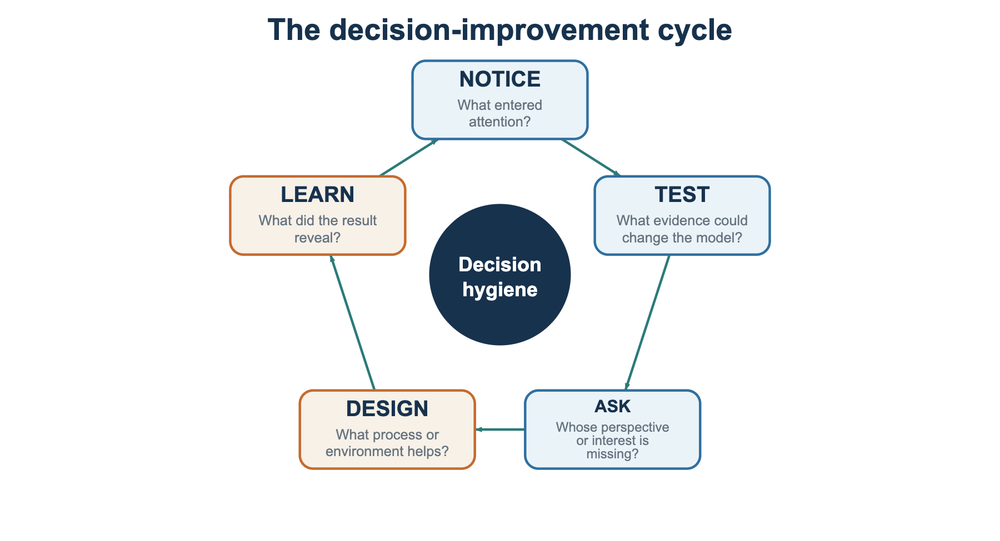<figcaption>Figure 35.1. Notice, test, ask, design, and learn form a repeatable cycle for improving decisions, persuasion, communication, and negotiation.</figcaption></figure>

The course can be compressed into five verbs. Notice what attention selected and what it excluded. Test the model with base rates, counterevidence, experiments, and alternative explanations. Ask other people for their perspective, interests, constraints, and meaning. Design the environment, message, conversation, or agreement so that good action is easier. Learn from a record that existed before the outcome.

Decision, persuasion, communication, and negotiation are not separate skills. They are different forms of model management. In each case, we are trying to understand how a mind represents a situation, what it expects, what it values, which actions appear possible, and what feedback will change the next cycle. The deepest practical lesson is therefore not "think harder." It is "build a process in which better thinking has a chance to occur."

*Table 35.1  The integrated decision audit*

| Move | Core question | Typical tool |
| --- | --- | --- |
| Notice | What entered attention, and what stayed invisible? | Attention audit; option generation |
| Test | What would disconfirm the current model? | Base rate; premortem; pilot; alternative explanation |
| Ask | Whose perspective, interest, or constraint is missing? | Perspective-getting; diagnostic questions |
| Design | How can the environment or process make better action easier? | Criteria; defaults; friction; packages; role design |
| Learn | What did we predict, what happened, and what was luck? | Decision journal; calibration; process debrief |

## Key ideas

- Better judgment is less a personality trait than a property of a well-designed process: independent evidence, explicit assumptions, structured disagreement, meaningful alternatives, ethical influence, and feedback protected from hindsight.
- Design a decision process before debating the answer.
- Protect independent judgment and constructive dissent.
- Use environments, messages, conversations, and agreements as design objects.

## Study and practice

1. Design a decision process before debating the answer?

2. Protect independent judgment and constructive dissent?

3. How would you use environments, messages, conversations, and agreements as design objects in practice?

<aside class="callout activity">
ACTIVITY

Complete the integrated decision studio on one real challenge: (1) notice the current loop, (2) test the model and base rate, (3) ask for missing perspectives and interests, (4) redesign the choice, message, conversation, or agreement, and (5) set a feedback date. EXPERIENCE - EXPLAIN - APPLY (MAXIMUM 120 WORDS) Experience: describe one specific decision, interaction, or observation. Explain: use one or two concepts from this chapter accurately. Apply: state one improvement, implication, or testable prediction.
</aside>

# Appendix A. Portable Course Tools

<aside class="callout one-page-decision-journal">
ONE-PAGE DECISION JOURNAL

Decision and deadline; alternatives considered; best feasible alternative forgone; predictions with probabilities; values and trade-offs; assumptions; emotional and social context; review date. After the outcome: compare forecast with result, separate process from luck, and state what should and should not change.
</aside>

<aside class="callout attention-audit">
ATTENTION AUDIT

What captured attention? What was missing? Which question, role, metric, order, device, or time pressure made that pattern likely? What design would make the neglected variable visible?
</aside>

<aside class="callout behavior-redesign-canvas">
BEHAVIOR REDESIGN CANVAS

Target behavior; cue ecology; urge or local problem; current response; immediate reward or relief; smallest replacement; friction change; prompt; immediate reinforcement; measurement; recovery plan; ethical check.
</aside>

<aside class="callout persuasion-canvas">
PERSUASION CANVAS

Audience current model; protected identity; barrier to change; meaningful mismatch; new causal model; credible evidence; appropriate emotion; source credibility; agency-preserving action; uncertainty and counterargument.
</aside>

<aside class="callout layered-listening">
LAYERED LISTENING

WHAT happened? HOW did it feel or unfold? WHY does it matter? WHO is implicated in identity or relationship? WHEN is the timing or history relevant? ACTION: what does the person want now - understanding, advice, decision, repair, or commitment?
</aside>

<aside class="callout negotiation-preparation">
NEGOTIATION PREPARATION

BATNA and how to improve it; reservation value; target; opening offer; objective standards; issues and priorities; estimate of their interests and alternatives; questions; packages; concession plan; ethical boundaries; implementation and review.
</aside>

# Appendix B. Index of Major Course Examples

Use this index to revisit the cases, demonstrations, and worked examples most likely to appear in class discussion and application questions.

| Example | Main concept | Chapter(s) |
| --- | --- | --- |
| Two job offers: consulting or sustainability start-up | Prediction, valuation, opportunity cost, and multi-objective choice | 1–3, 7 |
| Bat-and-ball problem | Cognitive reflection and intuitive substitution | 4 |
| Invisible gorilla and radiologist gorilla | Inattentional blindness and expert search templates | 5 |
| Door-study change blindness | The illusion of complete visual representation | 5 |
| Bees’ ultraviolet flower patterns and animal Umwelt | Species-specific perception and epistemic humility | 5 |
| Checker shadow, Kanizsa triangle, Thatcher illusion, and rubber hand | Perception as inference | 6 |
| Subliminal reward cue and handgrip effort | Motivation with limited awareness | 7 |
| Wine price, energy-drink discount, placebo, and nocebo | Expectation changes experience and performance | 8 |
| Ecological shortcuts and trigger features | Heuristics as adaptive tools | 9 |
| Plane crashes, vivid risks, and recent performance | Availability and affect | 10 |
| Linda problem, prototypes, faces, and elections | Representativeness and conjunction error | 11 |
| Medical-test frequencies, gambler’s fallacy, hot hand, and regression | Base rates, conditional probability, randomness, and calibration | 12 |
| Wason task, death-penalty evidence, Barnum effect, and overconfidence | Confirmation, self-serving judgment, and calibration | 13 |
| Wheel-of-fortune anchor, halo, decoy, sunk cost, and escalation | Contextual comparison and commitment | 14 |
| Survival versus mortality, lean versus fat, and Asian disease | Framing and reference dependence | 15 |
| Semantic, affective, identity, and goal priming | Associative accessibility and its boundary conditions | 16 |
| Mere exposure, illusory truth, rhymes, and easy names | Fluency, familiarity, liking, and belief | 17 |
| Stockings position effect and choice blindness | Reasons versus causes and rationalization | 18 |
| Phone checking, procrastination, defensiveness, and habit loops | Context-cued automaticity | 19 |
| Wanting versus liking, craving waves, and addiction | Incentive salience and self-control | 20 |
| Implementation intentions, WOOP, B=MAP, defaults, and friction | Behavior design | 21 |
| Overimitation, chameleon effect, and attribution flip | Social learning, mimicry, and causal explanation | 22 |
| Sherif, Asch, towel reuse, energy feedback, and cultural markets | Conformity, norms, social proof, and cascades | 23 |
| Milgram, bystanders, copier “because,” reciprocity, and scarcity | Authority, responsibility, and influence triggers | 24 |
| Ethos–pathos–logos, elaboration likelihood, fear, and reactance | Persuasion and resistance | 25 |
| Transportation, identification, identifiable victim, and ABT | Why narrative persuades | 26 |
| STORY, evidence ladder, story–evidence braid, and worked transformations | Evidence-aligned storytelling | 27 |
| Email tone, illusion of transparency, perspective-getting, and shared reality | Communication as joint inference | 28 |
| Deep questions, liking gap, appreciation, help, support, and apology | Conversation and repair | 29 |
| Positions, interests, BATNA, and the negotiator’s dilemma | Negotiation architecture | 30 |
| Used-car ZOPA and salary preparation | Reservation values, targets, and bargaining power | 31 |
| First offers, re-anchoring, concessions, even split, and deadlines | Distributive tactics | 32 |
| Orange story, Camp David, priority mapping, and logrolling | Integrative trade-offs | 33 |
| MESOs, contingent contracts, post-settlement search, and supplier terms | Advanced agreement design | 34 |
| Decision journal, independent estimates, premortem, and after-action review | Decision hygiene | 35 |

# References

Aarts, H., & Dijksterhuis, A. (2003). The silence of the library: Environment, situational norm, and social behavior. Journal of Personality and Social Psychology, 84(1), 18–28.

Abramson, L. Y., Seligman, M. E. P., & Teasdale, J. D. (1978). Learned helplessness in humans: Critique and reformulation. Journal of Abnormal Psychology, 87(1), 49–74.

Adelson, E. H. (2000). Lightness perception and lightness illusions. In M. Gazzaniga (Ed.), The new cognitive neurosciences (2nd ed., pp. 339–351). MIT Press.

Ahler, D. J., & Sood, G. (2018). The parties in our heads: Misperceptions about party composition and their consequences. Journal of Politics, 80(3), 964–981.

Alhakami, A. S., & Slovic, P. (1994). A psychological study of the inverse relationship between perceived risk and perceived benefit. Risk Analysis, 14(6), 1085–1096.

Alicke, M. D., & Govorun, O. (2005). The better-than-average effect. In M. D. Alicke, D. A. Dunning, & J. I. Krueger (Eds.), The self in social judgment (pp. 85–106). Psychology Press.

Alter, A. L., & Oppenheimer, D. M. (2006). Predicting short-term stock fluctuations by using processing fluency. Proceedings of the National Academy of Sciences, 103(24), 9369–9372.

Alter, A. L., & Oppenheimer, D. M. (2009). Uniting the tribes of fluency to form a metacognitive nation. Personality and Social Psychology Review, 13(3), 219–235.

Alter, A. L., Oppenheimer, D. M., Epley, N., & Eyre, R. N. (2007). Overcoming intuition: Metacognitive difficulty activates analytic reasoning. Journal of Experimental Psychology: General, 136(4), 569–576.

Ames, D. R., & Mason, M. F. (2015). Tandem anchoring: Informational and politeness effects of range offers in social exchange. Journal of Personality and Social Psychology, 108(2), 254–274.

Ariely, D., Loewenstein, G., & Prelec, D. (2003). “Coherent arbitrariness”: Stable demand curves without stable preferences. Quarterly Journal of Economics, 118(1), 73–106.

Aristotle. (2007). On rhetoric: A theory of civic discourse (G. A. Kennedy, Trans., 2nd ed.). Oxford University Press. (Original work ca. 4th century BCE).

Arkes, H. R. (1991). Costs and benefits of judgment errors: Implications for debiasing. Psychological Bulletin, 110(3), 486–498.

Arkes, H. R., & Blumer, C. (1985). The psychology of sunk cost. Organizational Behavior and Human Decision Processes, 35(1), 124–140.

Armel, K. C., Beaumel, A., & Rangel, A. (2008). Biasing simple choices by manipulating relative visual attention. Judgment and Decision Making, 3(5), 396–403.

Aron, A., Melinat, E., Aron, E. N., Vallone, R. D., & Bator, R. J. (1997). The experimental generation of interpersonal closeness: A procedure and some preliminary findings. Personality and Social Psychology Bulletin, 23(4), 363–377.

Asch, S. E. (1946). Forming impressions of personality. Journal of Abnormal and Social Psychology, 41(3), 258–290.

Asch, S. E. (1951). Effects of group pressure upon the modification and distortion of judgments. In H. Guetzkow (Ed.), Groups, leadership and men (pp. 177–190). Carnegie Press.

Asch, S. E. (1955). Opinions and social pressure. Scientific American, 193(5), 31–35.

Asch, S. E. (1956). Studies of independence and conformity: I. A minority of one against a unanimous majority. Psychological Monographs: General and Applied, 70(9), 1–70.

Attwell, D., & Laughlin, S. B. (2001). An energy budget for signaling in the grey matter of the brain. Journal of Cerebral Blood Flow & Metabolism, 21(10), 1133–1145.

Babcock, L., & Loewenstein, G. (1997). Explaining bargaining impasse: The role of self-serving biases. Journal of Economic Perspectives, 11(1), 109–126.

Babcock, L., Loewenstein, G., Issacharoff, S., & Camerer, C. (1995). Biased judgments of fairness in bargaining. American Economic Review, 85(5), 1337–1343.

Baddeley, A. (1992). Working memory. Science, 255(5044), 556–559.

Balcetis, E., & Dunning, D. (2010). Wishful seeing: More desired objects are seen as closer. Psychological Science, 21(1), 147–152.

Banas, J. A., & Rains, S. A. (2010). A meta-analysis of research on inoculation theory. Communication Monographs, 77(3), 281–311.

Bandura, A. (1977). Self-efficacy: Toward a unifying theory of behavioral change. Psychological Review, 84(2), 191–215.

Bandura, A. (1997). Self-efficacy: The exercise of control. W. H. Freeman.

Bandura, A. (1999). Moral disengagement in the perpetration of inhumanities. Personality and Social Psychology Review, 3(3), 193-209.

Bargh, J. A., Chen, M., & Burrows, L. (1996). Automaticity of social behavior: Direct effects of trait construct and stereotype activation on action. Journal of Personality and Social Psychology, 71(2), 230–244.

Bargh, J. A., Gollwitzer, P. M., Lee-Chai, A., Barndollar, K., & Trötschel, R. (2001). The automated will: Nonconscious activation and pursuit of behavioral goals. Journal of Personality and Social Psychology, 81(6), 1014–1027.

Bar-Hillel, M. (1980). The base-rate fallacy in probability judgments. Acta Psychologica, 44(3), 211–233.

Baron, J., & Hershey, J. C. (1988). Outcome bias in decision evaluation. Journal of Personality and Social Psychology, 54(4), 569-579.

Bartlett, F. C. (1932). Remembering: A study in experimental and social psychology. Cambridge University Press.

Bartra, O., McGuire, J. T., & Kable, J. W. (2013). The valuation system: A coordinate-based meta-analysis of BOLD fMRI experiments examining neural correlates of subjective value. NeuroImage, 76, 412-427.

Bateson, M., Nettle, D., & Roberts, G. (2006). Cues of being watched enhance cooperation in a real-world setting. Biology Letters, 2(3), 412-414.

Baumeister, R. F., & Leary, M. R. (1995). The need to belong: Desire for interpersonal attachments as a fundamental human motivation. Psychological Bulletin, 117(3), 497–529.

Beatty, J. (1982). Task-evoked pupillary responses, processing load, and the structure of processing resources. Psychological Bulletin, 91(2), 276–292.

Bechara, A., Damasio, H., Tranel, D., & Damasio, A. R. (1997). Deciding advantageously before knowing the advantageous strategy. Science, 275(5304), 1293–1295.

Begg, I. M., Anas, A., & Farinacci, S. (1992). Dissociation of processes in belief: Source recollection, statement familiarity, and the illusion of truth. Journal of Experimental Psychology: General, 121(4), 446–458.

Benedetti, F. (2008). Mechanisms of placebo and placebo-related effects across diseases and treatments. Annual Review of Pharmacology and Toxicology, 48, 33–60.

Berridge, K. C., & Robinson, T. E. (1998). What is the role of dopamine in reward: Hedonic impact, reward learning, or incentive salience? Brain Research Reviews, 28(3), 309–369.

Berridge, K. C., & Robinson, T. E. (2003). Parsing reward. Trends in Neurosciences, 26(9), 507–513.

Bikhchandani, S., Hirshleifer, D., & Welch, I. (1992). A theory of fads, fashion, custom, and cultural change as informational cascades. Journal of Political Economy, 100(5), 992–1026.

Bjork, R. A. (1994). Memory and metamemory considerations in the training of human beings. In J. Metcalfe & A. Shimamura (Eds.), Metacognition: Knowing about knowing (pp. 185–205). MIT Press.

Blackwell, L. S., Trzesniewski, K. H., & Dweck, C. S. (2007). Implicit theories of intelligence predict achievement across an adolescent transition: A longitudinal study and an intervention. Child Development, 78(1), 246–263.

Bohns, V. K. (2016). Underestimating our influence over others. Current Directions in Psychological Science, 25(2), 119–123.

Bond, R., & Smith, P. B. (1996). Culture and conformity: A meta-analysis of studies using Asch’s line judgment task. Psychological Bulletin, 119(1), 111–137.

Boothby, E. J., & Bohns, V. K. (2021). Why a simple act of kindness is not as simple as it seems: Underestimating the positive impact of our compliments on others. Personality and Social Psychology Bulletin, 47(5), 826–840.

Boothby, E. J., Cooney, G., Sandstrom, G. M., & Clark, M. S. (2018). The liking gap in conversations: Do people like us more than we think? Psychological Science, 29(11), 1742–1756.

Bornstein, R. F. (1989). Exposure and affect: Overview and meta-analysis of research, 1968–1987. Psychological Bulletin, 106(2), 265–289.

Botvinick, M., & Cohen, J. (1998). Rubber hands “feel” touch that eyes see. Nature, 391(6669), 756.

Botvinick, M. M., Braver, T. S., Barch, D. M., Carter, C. S., & Cohen, J. D. (2001). Conflict monitoring and cognitive control. Psychological Review, 108(3), 624–652.

Boyd, R., & Richerson, P. J. (1985). Culture and the evolutionary process. University of Chicago Press.

Boyd, R., Richerson, P. J., & Henrich, J. (2011). The cultural niche: Why social learning is essential for human adaptation. Proceedings of the National Academy of Sciences, 108(Supplement 2), 10918–10925.

Brehm, J. W. (1956). Postdecision changes in desirability of alternatives. Journal of Abnormal and Social Psychology, 52(3), 384-389.

Brehm, J. W. (1966). A theory of psychological reactance. Academic Press.

Brehm, S. S., & Brehm, J. W. (1981). Psychological reactance: A theory of freedom and control. Academic Press.

Brier, G. W. (1950). Verification of forecasts expressed in terms of probability. Monthly Weather Review, 78(1), 1–3.

Broadbent, D. E. (1958). Perception and communication. Pergamon Press.

Bruk, A., Scholl, S. G., & Bless, H. (2018). Beautiful mess effect: Self–other differences in evaluation of showing vulnerability. Journal of Personality and Social Psychology, 115(2), 192–205.

Bruner, J. (1986). Actual minds, possible worlds. Harvard University Press.

Bruner, J. (1990). Acts of meaning. Harvard University Press.

Buehler, R., Griffin, D., & Ross, M. (1994). Exploring the planning fallacy: Why people underestimate their task completion times. Journal of Personality and Social Psychology, 67(3), 366–381.

Burger, J. M. (2009). Replicating Milgram: Would people still obey today? American Psychologist, 64(1), 1–11.

Cacioppo, J. T., Cacioppo, S., & Boomsma, D. I. (2014). Evolutionary mechanisms for loneliness. Cognition and Emotion, 28(1), 3–21.

Cacioppo, J. T., & Petty, R. E. (1982). The need for cognition. Journal of Personality and Social Psychology, 42(1), 116–131.

Casey, B. J., Jones, R. M., & Hare, T. A. (2008). The adolescent brain. Annals of the New York Academy of Sciences, 1124(1), 111–126.

Cesario, J. (2014). Priming, replication, and the hardest science. Perspectives on Psychological Science, 9(1), 40–48.

Chaiken, S. (1980). Heuristic versus systematic information processing and the use of source versus message cues in persuasion. Journal of Personality and Social Psychology, 39(5), 752–766.

Chaiken, S., Liberman, A., & Eagly, A. H. (1989). Heuristic and systematic information processing within and beyond the persuasion context. In J. S. Uleman & J. A. Bargh (Eds.), Unintended thought (pp. 212–252). Guilford Press.

Chartrand, T. L., & Bargh, J. A. (1999). The chameleon effect: The perception-behavior link and social interaction. Journal of Personality and Social Psychology, 76(6), 893–910.

Chittka, L., & Menzel, R. (1992). The evolutionary adaptation of flower colours and the insect pollinators’ colour vision. Journal of Comparative Physiology A, 171(2), 171–181.

Chong, D., & Druckman, J. N. (2007). Framing theory. Annual Review of Political Science, 10, 103–126.

Cialdini, R. B. (2009). Influence: Science and practice (5th ed.). Pearson.

Cialdini, R. B., Cacioppo, J. T., Bassett, R., & Miller, J. A. (1978). Low-ball procedure for producing compliance: Commitment then cost. Journal of Personality and Social Psychology, 36(5), 463–476.

Cialdini, R. B., Demaine, L. J., Sagarin, B. J., Barrett, D. W., Rhoads, K., & Winter, P. L. (2006). Managing social norms for persuasive impact. Social Influence, 1(1), 3–15.

Cialdini, R. B., & Goldstein, N. J. (2004). Social influence: Compliance and conformity. Annual Review of Psychology, 55, 591–621.

Cialdini, R. B., Reno, R. R., & Kallgren, C. A. (1990). A focus theory of normative conduct. Journal of Personality and Social Psychology, 58(6), 1015–1026.

Cialdini, R. B., Vincent, J. E., Lewis, S. K., Catalan, J., Wheeler, D., & Darby, B. L. (1975). Reciprocal concessions procedure for inducing compliance: The door-in-the-face technique. Journal of Personality and Social Psychology, 31(2), 206–215.

Clark, A. (2013). Whatever next? Predictive brains, situated agents, and the future of cognitive science. Behavioral and Brain Sciences, 36(3), 181–204.

Clark, H. H. (1996). Using language. Cambridge University Press.

Clark, H. H., & Brennan, S. E. (1991). Grounding in communication. In L. B. Resnick, J. M. Levine, & S. D. Teasley (Eds.), Perspectives on socially shared cognition (pp. 127–149). American Psychological Association.

Clithero, J. A., & Rangel, A. (2014). Informatic parcellation of the network involved in the computation of subjective value. Social Cognitive and Affective Neuroscience, 9(9), 1289–1302.

Coan, J. A., Schaefer, H. S., & Davidson, R. J. (2006). Lending a hand: Social regulation of the neural response to threat. Psychological Science, 17(12), 1032–1039.

Cohen, G. L., & Sherman, D. K. (2014). The psychology of change: Self-affirmation and social psychological intervention. Annual Review of Psychology, 65, 333-371.

Cohen, J. (2001). Defining identification: A theoretical look at the identification of audiences with media characters. Mass Communication and Society, 4(3), 245-264.

Collins, A. M., & Loftus, E. F. (1975). A spreading-activation theory of semantic processing. Psychological Review, 82(6), 407–428.

Collins, N. L., & Miller, L. C. (1994). Self-disclosure and liking: A meta-analytic review. Psychological Bulletin, 116(3), 457–475.

Colloca, L., & Barsky, A. J. (2020). Placebo and nocebo effects. New England Journal of Medicine, 382(6), 554–561.

Colloca, L., & Miller, F. G. (2011). The nocebo effect and its relevance for clinical practice. Psychosomatic Medicine, 73(7), 598–603.

Combs, B., & Slovic, P. (1979). Newspaper coverage of causes of death. Journalism Quarterly, 56(4), 837–849.

Corbetta, M., & Shulman, G. L. (2002). Control of goal-directed and stimulus-driven attention in the brain. Nature Reviews Neuroscience, 3(3), 201–215.

Cosmides, L., & Tooby, J. (1996). Are humans good intuitive statisticians after all? Rethinking some conclusions from the literature on judgment under uncertainty. Cognition, 58(1), 1–73.

Cowan, N. (2001). The magical number 4 in short-term memory: A reconsideration of mental storage capacity. Behavioral and Brain Sciences, 24(1), 87–114.

Croskerry, P. (2003). The importance of cognitive errors in diagnosis and strategies to minimize them. Academic Medicine, 78(8), 775–780.

Crum, A. J., Corbin, W. R., Brownell, K. D., & Salovey, P. (2011). Mind over milkshakes: Mindsets, not just nutrients, determine ghrelin response. Health Psychology, 30(4), 424–429.

Crum, A. J., & Langer, E. J. (2007). Mind-set matters: Exercise and the placebo effect. Psychological Science, 18(2), 165–171.

Custers, R., & Aarts, H. (2010). The unconscious will: How the pursuit of goals operates outside of conscious awareness. Science, 329(5987), 47–50.

Dahlstrom, M. F. (2014). Using narratives and storytelling to communicate science with nonexpert audiences. Proceedings of the National Academy of Sciences, 111(Suppl. 4), 13614-13620.

Dai, H., Milkman, K. L., & Riis, J. (2014). The fresh start effect: Temporal landmarks motivate aspirational behavior. Management Science, 60(10), 2563-2582.

Damasio, A. R. (1994). Descartes’ error: Emotion, reason, and the human brain. Putnam.

Darley, J. M., & Fazio, R. H. (1980). Expectancy confirmation processes arising in the social interaction sequence. American Psychologist, 35(10), 867–881.

Darley, J. M., & Latané, B. (1968). Bystander intervention in emergencies: Diffusion of responsibility. Journal of Personality and Social Psychology, 8(4), 377–383.

Dawes, R. M. (1979). The robust beauty of improper linear models in decision making. American Psychologist, 34(7), 571–582.

Dechêne, A., Stahl, C., Hansen, J., & Wänke, M. (2010). The truth about the truth: A meta-analytic review of the truth effect. Personality and Social Psychology Review, 14(2), 238–257.

Deci, E. L., & Ryan, R. M. (2000). The "what" and "why" of goal pursuits: Human needs and the self-determination of behavior. Psychological Inquiry, 11(4), 227-268.

Desimone, R., & Duncan, J. (1995). Neural mechanisms of selective visual attention. Annual Review of Neuroscience, 18, 193–222.

Deutsch, M., & Gerard, H. B. (1955). A study of normative and informational social influences upon individual judgment. Journal of Abnormal and Social Psychology, 51(3), 629–636.

Devine, P. G. (1989). Stereotypes and prejudice: Their automatic and controlled components. Journal of Personality and Social Psychology, 56(1), 5–18.

Diamond, A., & Kirkham, N. (2005). Not quite as grown-up as we like to think: Parallels between cognition in childhood and adulthood. Psychological Science, 16(4), 291–297.

Diemand-Yauman, C., Oppenheimer, D. M., & Vaughan, E. B. (2011). Fortune favors the bold and the italicized: Effects of disfluency on educational outcomes. Cognition, 118(1), 111–115.

Doi, T. (1973). The anatomy of dependence. Kodansha International.

Doyen, S., Klein, O., Pichon, C.-L., & Cleeremans, A. (2012). Behavioral priming: It is all in the mind, but whose mind? PLoS ONE, 7(1), e29081.

Drew, T., Võ, M. L.-H., & Wolfe, J. M. (2013). The invisible gorilla strikes again: Sustained inattentional blindness in expert observers. Psychological Science, 24(9), 1848–1853.

Druckman, J. N. (2001). The implications of framing effects for citizen competence. Political Behavior, 23(3), 225–256.

Duckworth, A. L., Gendler, T. S., & Gross, J. J. (2016). Situational strategies for self-control. Perspectives on Psychological Science, 11(1), 35-55.

Dweck, C. S. (2006). Mindset: The new psychology of success. Random House.

Dweck, C. S., & Leggett, E. L. (1988). A social-cognitive approach to motivation and personality. Psychological Review, 95(2), 256–273.

Echterhoff, G., Higgins, E. T., & Levine, J. M. (2009). Shared reality: Experiencing commonality with others’ inner states about the world. Perspectives on Psychological Science, 4(5), 496–521.

Eddy, D. M. (1982). Probabilistic reasoning in clinical medicine: Problems and opportunities. In D. Kahneman, P. Slovic, & A. Tversky (Eds.), Judgment under uncertainty: Heuristics and biases (pp. 249–267). Cambridge University Press.

Eden, D. (1992). Leadership and expectations: Pygmalion effects and other self-fulfilling prophecies in organizations. The Leadership Quarterly, 3(4), 271–305.

Edmans, A., García, D., & Norli, Ø. (2007). Sports sentiment and stock returns. Journal of Finance, 62(4), 1967-1998.

Edmondson, A. C. (1999). Psychological safety and learning behavior in work teams. Administrative Science Quarterly, 44(2), 350–383.

Edmondson, A. C. (2019). The fearless organization: Creating psychological safety in the workplace for learning, innovation, and growth. Wiley.

Edwards, W. (1954). The theory of decision making. Psychological Bulletin, 51(4), 380-417.

Edwards, W. (1968). Conservatism in human information processing. In B. Kleinmuntz (Ed.), Formal representation of human judgment (pp. 17–52). Wiley.

Eisenberger, N. I. (2012). The pain of social disconnection: Examining the shared neural underpinnings of physical and social pain. Nature Reviews Neuroscience, 13(6), 421–434.

Eisenberger, N. I., & Cole, S. W. (2012). Social neuroscience and health: Neurophysiological mechanisms linking social ties with physical health. Nature Neuroscience, 15(5), 669–674.

Eisenberger, N. I., Lieberman, M. D., & Williams, K. D. (2003). Does rejection hurt? An fMRI study of social exclusion. Science, 302(5643), 290–292.

Eitel, A., & Kühl, T. (2016). Effects of disfluency and test expectancy on learning with text. Metacognition and Learning, 11(1), 107–121.

Ellis, H. D., & Young, A. W. (1990). Accounting for delusional misidentifications. British Journal of Psychiatry, 157(2), 239–248.

Entman, R. M. (1993). Framing: Toward clarification of a fractured paradigm. Journal of Communication, 43(4), 51–58.

Epley, N., & Schroeder, J. (2014). Mistakenly seeking solitude. Journal of Experimental Psychology: General, 143(5), 1980–1999.

Eyal, T., Steffel, M., & Epley, N. (2018). Perspective mistaking: Accurately understanding the mind of another requires getting perspective, not taking perspective. Journal of Personality and Social Psychology, 114(4), 547–571.

Fazio, L. K., Brashier, N. M., Payne, B. K., & Marsh, E. J. (2015). Knowledge does not protect against illusory truth. Journal of Experimental Psychology: General, 144(5), 993–1002.

Fazio, R. H., Sanbonmatsu, D. M., Powell, M. C., & Kardes, F. R. (1986). On the automatic activation of attitudes. Journal of Personality and Social Psychology, 50(2), 229–238.

Feinberg, M., & Willer, R. (2015). From gulf to bridge: When do moral arguments facilitate political influence? Personality and Social Psychology Bulletin, 41(12), 1665–1681.

Feldman, H., & Friston, K. J. (2010). Attention, uncertainty, and free-energy. Frontiers in Human Neuroscience, 4, Article 215.

Festinger, L. (1957). A theory of cognitive dissonance. Stanford University Press.

Finniss, D. G., Kaptchuk, T. J., Miller, F., & Benedetti, F. (2010). Biological, clinical, and ethical advances of placebo effects. The Lancet, 375(9715), 686–695.

Finucane, M. L., Alhakami, A., Slovic, P., & Johnson, S. M. (2000). The affect heuristic in judgments of risks and benefits. Journal of Behavioral Decision Making, 13(1), 1–17.

Fischhoff, B. (1975). Hindsight is not equal to foresight: The effect of outcome knowledge on judgment under uncertainty. Journal of Experimental Psychology: Human Perception and Performance, 1(3), 288-299.

Fisher, R., Ury, W., & Patton, B. (2011). Getting to yes: Negotiating agreement without giving in (3rd ed.). Penguin.

Fisher, W. R. (1984). Narration as a human communication paradigm: The case of public moral argument. Communication Monographs, 51(1), 1-22.

Fisher, W. R. (1987). Human communication as narration: Toward a philosophy of reason, value, and action. University of South Carolina Press.

Fitts, P. M., & Posner, M. I. (1967). Human performance. Brooks/Cole.

Flore, P. C., & Wicherts, J. M. (2015). Does stereotype threat influence performance of girls in stereotyped domains? A meta-analysis. Journal of School Psychology, 53(1), 25–44.

Forer, B. R. (1949). The fallacy of personal validation: A classroom demonstration of gullibility. Journal of Abnormal and Social Psychology, 44(1), 118–123.

Forster, K. I., & Davis, C. (1984). Repetition priming and frequency attenuation in lexical access. Journal of Experimental Psychology: Learning, Memory, and Cognition, 10(4), 680–698.

Frederick, S. (2005). Cognitive reflection and decision making. Journal of Economic Perspectives, 19(4), 25–42.

Frederick, S., Novemsky, N., Wang, J., Dhar, R., & Nowlis, S. (2009). Opportunity cost neglect. Journal of Consumer Research, 36(4), 553-561.

Freedman, J. L., & Fraser, S. C. (1966). Compliance without pressure: The foot-in-the-door technique. Journal of Personality and Social Psychology, 4(2), 195–202.

Friston, K. (2010). The free-energy principle: A unified brain theory? Nature Reviews Neuroscience, 11(2), 127–138.

Friston, K., FitzGerald, T., Rigoli, F., Schwartenbeck, P., & Pezzulo, G. (2017). Active inference: A process theory. Neural Computation, 29(1), 1–49.

Gable, S. L., Reis, H. T., Impett, E. A., & Asher, E. R. (2004). What do you do when things go right? The intrapersonal and interpersonal benefits of sharing positive events. Journal of Personality and Social Psychology, 87(2), 228–245.

Galinsky, A. D., Maddux, W. W., Gilin, D., & White, J. B. (2008). Why it pays to get inside the head of your opponent: The differential effects of perspective taking and empathy in negotiations. Psychological Science, 19(4), 378–384.

Galinsky, A. D., & Mussweiler, T. (2001). First offers as anchors: The role of perspective-taking and negotiator focus. Journal of Personality and Social Psychology, 81(4), 657–669.

Galla, B. M., & Duckworth, A. L. (2015). More than resisting temptation: Beneficial habits mediate the relationship between self-control and positive life outcomes. Journal of Personality and Social Psychology, 109(3), 508-525.

Gallagher, K. M., & Updegraff, J. A. (2012). Health message framing effects on attitudes, intentions, and behavior: A meta-analytic review. Annals of Behavioral Medicine, 43(1), 101–116.

Galton, F. (1886). Regression towards mediocrity in hereditary stature. Journal of the Anthropological Institute of Great Britain and Ireland, 15, 246–263.

Gawande, A. (2009). The checklist manifesto: How to get things right. Metropolitan Books.

Gazzaniga, M. S. (2000). Cerebral specialization and interhemispheric communication: Does the corpus callosum enable the human condition? Brain, 123(7), 1293-1326.

Gesn, P. R., & Ickes, W. (1999). The development of meaning contexts for empathic accuracy: Channel and sequence effects. Journal of Personality and Social Psychology, 77(4), 746–761.

Gigerenzer, G., & Edwards, A. (2003). Simple tools for understanding risks: From innumeracy to insight. BMJ, 327(7417), 741–744.

Gigerenzer, G., & Gaissmaier, W. (2011). Heuristic decision making. Annual Review of Psychology, 62, 451-482.

Gigerenzer, G., & Goldstein, D. G. (1996). Reasoning the fast and frugal way: Models of bounded rationality. Psychological Review, 103(4), 650–669.

Gigerenzer, G., & Hoffrage, U. (1995). How to improve Bayesian reasoning without instruction: Frequency formats. Psychological Review, 102(4), 684–704.

Gigerenzer, G., & Selten, R. (Eds.). (2001). Bounded rationality: The adaptive toolbox. MIT Press.

Gigerenzer, G., Todd, P. M., & the ABC Research Group. (1999). Simple heuristics that make us smart. Oxford University Press.

Gilbert, D. T. (1991). How mental systems believe. American Psychologist, 46(2), 107–119.

Gilbert, D. T., Tafarodi, R. W., & Malone, P. S. (1993). You cannot not believe everything you read. Journal of Personality and Social Psychology, 65(2), 221–233.

Gilovich, T., Savitsky, K., & Medvec, V. H. (1998). The illusion of transparency: Biased assessments of others’ ability to read one’s emotional states. Journal of Personality and Social Psychology, 75(2), 332–346.

Gilovich, T., Vallone, R., & Tversky, A. (1985). The hot hand in basketball: On the misperception of random sequences. Cognitive Psychology, 17(3), 295–314.

Gingerich, A. C., & Lineweaver, T. T. (2014). OMG! Texting in class = U fail :( Empirical evidence that text messaging during class disrupts comprehension. Teaching of Psychology, 41(1), 44–51.

Gogtay, N., Giedd, J. N., Lusk, L., Hayashi, K. M., Greenstein, D., Vaituzis, A. C., Nugent, T. F., III, Herman, D. H., Clasen, L. S., Toga, A. W., Rapoport, J. L., & Thompson, P. M. (2004). Dynamic mapping of human cortical development during childhood through early adulthood. Proceedings of the National Academy of Sciences, 101(21), 8174–8179.

Goldstein, D. G., & Gigerenzer, G. (2002). Models of ecological rationality: The recognition heuristic. Psychological Review, 109(1), 75–90.

Goldstein, N. J., Cialdini, R. B., & Griskevicius, V. (2008). A room with a viewpoint: Using social norms to motivate environmental conservation in hotels. Journal of Consumer Research, 35(3), 472–482.

Gollwitzer, P. M. (1999). Implementation intentions: Strong effects of simple plans. American Psychologist, 54(7), 493-503.

Gollwitzer, P. M., & Sheeran, P. (2006). Implementation intentions and goal achievement: A meta-analysis of effects and processes. Advances in Experimental Social Psychology, 38, 69-119.

Graham, J., Haidt, J., Koleva, S., Motyl, M., Iyer, R., Wojcik, S. P., & Ditto, P. H. (2013). Moral foundations theory: The pragmatic validity of moral pluralism. In P. Devine & A. Plant (Eds.), Advances in experimental social psychology (Vol. 47, pp. 55–130). Academic Press.

Green, M. C., & Brock, T. C. (2000). The role of transportation in the persuasiveness of public narratives. Journal of Personality and Social Psychology, 79(5), 701-721.

Greenwald, A. G. (1980). The totalitarian ego: Fabrication and revision of personal history. American Psychologist, 35(7), 603-618.

Greenwald, A. G., & Banaji, M. R. (1995). Implicit social cognition: Attitudes, self-esteem, and stereotypes. Psychological Review, 102(1), 4–27.

Greenwald, A. G., Draine, S. C., & Abrams, R. L. (1996). Three cognitive markers of unconscious semantic activation. Science, 273(5282), 1699–1702.

Gregory, R. L. (1980). Perceptions as hypotheses. Philosophical Transactions of the Royal Society of London. Series B, Biological Sciences, 290(1038), 181–197.

Grice, H. P. (1975). Logic and conversation. In P. Cole & J. L. Morgan (Eds.), Syntax and semantics: Speech acts (Vol. 3, pp. 41–58). Academic Press.

Griskevicius, V., Goldstein, N. J., Mortensen, C. R., Cialdini, R. B., & Kenrick, D. T. (2006). Going along versus going alone: When fundamental motives facilitate strategic nonconformity. Journal of Personality and Social Psychology, 91(2), 281-294.

Griskevicius, V., Goldstein, N. J., Mortensen, C. R., Sundie, J. M., Cialdini, R. B., & Kenrick, D. T. (2009). Fear and loving in Las Vegas: Evolution, emotion, and persuasion. Journal of Marketing Research, 46(3), 384-395.

Haidt, J. (2012). The righteous mind: Why good people are divided by politics and religion. Pantheon.

Hall, J. A., & Schmid Mast, M. (2007). Sources of accuracy in the empathic accuracy paradigm. Emotion, 7(2), 438–446.

Hall, L., Johansson, P., Tärning, B., Sikström, S., & Deutgen, T. (2012). Magic at the marketplace: Choice blindness for the taste of jam and the smell of tea. Cognition, 117(1), 54-61.

Harris, M. J., & Rosenthal, R. (1985). Mediation of interpersonal expectancy effects: 31 meta-analyses. Psychological Bulletin, 97(3), 363–386.

Haselton, M. G., & Buss, D. M. (2000). Error management theory: A new perspective on biases in cross-sex mind reading. Journal of Personality and Social Psychology, 78(1), 81–91.

Hasher, L., Goldstein, D., & Toppino, T. (1977). Frequency and the conference of referential validity. Journal of Verbal Learning and Verbal Behavior, 16(1), 107–112.

Haugtvedt, C. P., & Wegener, D. T. (1994). Message order effects in persuasion: An attitude strength perspective. Journal of Consumer Research, 21(1), 205–218.

Heath, C., & Heath, D. (2007). Made to stick: Why some ideas survive and others die. Random House.

Heider, F. (1958). The psychology of interpersonal relations. Wiley.

Hekkert, P. P. M., Snelders, H. M. J. J., & van Wieringen, P. C. W. (2003). Most advanced, yet acceptable: Typicality and novelty as joint predictors of aesthetic preference in industrial design. British Journal of Psychology, 94(1), 111-124.

Helmholtz, H. von. (1962). Treatise on physiological optics (J. P. C. Southall, Trans.). Dover. (Original work published 1867)

Henrich, J. (2016). The secret of our success: How culture is driving human evolution, domesticating our species, and making us smarter. Princeton University Press.

Henrich, J., & Gil-White, F. J. (2001). The evolution of prestige: Freely conferred deference as a mechanism for enhancing the benefits of cultural transmission. Evolution and Human Behavior, 22(3), 165–196.

Higgins, E. T., Rholes, W. S., & Jones, C. R. (1977). Category accessibility and impression formation. Journal of Experimental Social Psychology, 13(2), 141–154.

Hirshleifer, D., & Shumway, T. (2003). Good day sunshine: Stock returns and the weather. Journal of Finance, 58(3), 1009-1032.

Hirstein, W., & Ramachandran, V. S. (1997). Capgras syndrome: A novel probe for understanding the neural representation of the identity and familiarity of persons. Proceedings of the Royal Society B: Biological Sciences, 264(1380), 437–444.

Hohwy, J. (2013). The predictive mind. Oxford University Press.

Holt-Lunstad, J. (2021). The major health implications of social connection. Current Directions in Psychological Science, 30(3), 251–259.

Holt-Lunstad, J., Smith, T. B., & Layton, J. B. (2010). Social relationships and mortality risk: A meta-analytic review. PLOS Medicine, 7(7), e1000316.

Holt-Lunstad, J., Uchino, B. N., Smith, T. W., & Hicks, A. (2007). On the importance of relationship quality: The impact of ambivalence in friendships on cardiovascular functioning. Annals of Behavioral Medicine, 33(3), 278–290.

Horner, V., & Whiten, A. (2005). Causal knowledge and imitation/emulation switching in chimpanzees (Pan troglodytes) and children (Homo sapiens). Animal Cognition, 8(3), 164-181.

Hovland, C. I., Lumsdaine, A. A., & Sheffield, F. D. (1949). Experiments on mass communication. Princeton University Press.

Hovland, C. I., & Weiss, W. (1951). The influence of source credibility on communication effectiveness. Public Opinion Quarterly, 15(4), 635–650.

Huang, K., Yeomans, M., Brooks, A. W., Minson, J., & Gino, F. (2017). It doesn’t hurt to ask: Question-asking increases liking. Journal of Personality and Social Psychology, 113(3), 430–452.

Huber, J., Payne, J. W., & Puto, C. (1982). Adding asymmetrically dominated alternatives: Violations of regularity and the similarity hypothesis. Journal of Consumer Research, 9(1), 90-98.

Hull, C. L. (1943). Principles of behavior. Appleton-Century-Crofts.

Huneke, M., & Pinel, E. C. (2016). Fostering selflessness through I-sharing. Journal of Experimental Social Psychology, 63, 10–18.

Izuma, K., Saito, D. N., & Sadato, N. (2008). Processing of social and monetary rewards in the human striatum. Neuron, 58(2), 284–294.

James, W. (1890). The principles of psychology. Henry Holt.

Janis, I. L. (1972). Victims of groupthink. Houghton Mifflin.

Jecker, J., & Landy, D. (1969). Liking a person as a function of doing him a favour. Human Relations, 22(4), 371–378.

Johansson, P., Hall, L., Sikström, S., & Olsson, A. (2005). Failure to detect mismatches between intention and outcome in a simple decision task. Science, 310(5745), 116-119.

Johnson, E. J., & Goldstein, D. (2003). Do defaults save lives? Science, 302(5649), 1338-1339.

Johnson, M. K., Hashtroudi, S., & Lindsay, D. S. (1993). Source monitoring. Psychological Bulletin, 114(1), 3–28.

Junco, R., & Cotten, S. R. (2012). No A 4 U: The relationship between multitasking and academic performance. Computers & Education, 59(2), 505–514.

Jussim, L., & Harber, K. D. (2005). Teacher expectations and self-fulfilling prophecies: Knowns and unknowns, resolved and unresolved controversies. Personality and Social Psychology Review, 9(2), 131–155.

Kahan, D. M. (2013). Ideology, motivated reasoning, and cognitive reflection. Judgment and Decision Making, 8(4), 407-424.

Kahneman, D. (2011). Thinking, fast and slow. Farrar, Straus and Giroux.

Kahneman, D. (1973). Attention and effort. Prentice-Hall.

Kahneman, D., & Beatty, J. (1966). Pupil diameter and load on memory. Science, 154(3756), 1583–1585.

Kahneman, D., & Frederick, S. (2002). Representativeness revisited: Attribute substitution in intuitive judgment. In T. Gilovich, D. Griffin, & D. Kahneman (Eds.), Heuristics and biases: The psychology of intuitive judgment (pp. 49–81). Cambridge University Press.

Kahneman, D., & Klein, G. (2009). Conditions for intuitive expertise: A failure to disagree. American Psychologist, 64(6), 515-526.

Kahneman, D., Knetsch, J. L., & Thaler, R. H. (1990). Experimental tests of the endowment effect and the Coase theorem. Journal of Political Economy, 98(6), 1325–1348.

Kahneman, D., & Lovallo, D. (1993). Timid choices and bold forecasts: A cognitive perspective on risk taking. Management Science, 39(1), 17–31.

Kahneman, D., Sibony, O., & Sunstein, C. R. (2021). Noise: A flaw in human judgment. Little, Brown Spark.

Kahneman, D., & Tversky, A. (1972). Subjective probability: A judgment of representativeness. Cognitive Psychology, 3(3), 430–454.

Kahneman, D., & Tversky, A. (1973). On the psychology of prediction. Psychological Review, 80(4), 237–251.

Kahneman, D., & Tversky, A. (1979). Intuitive prediction: Biases and corrective procedures. TIMS Studies in Management Science, 12, 313–327.

Kanizsa, G. (1976). Subjective contours. Scientific American, 234(4), 48–52.

Kardas, M., Kumar, A., & Epley, N. (2022). Overly shallow? Miscalibrated expectations create a barrier to deeper conversation. Journal of Personality and Social Psychology, 122(3), 367–398.

Keeney, R. L., & Raiffa, H. (1976). Decisions with multiple objectives: Preferences and value tradeoffs. Wiley.

Kelley, H. H. (1967). Attribution theory in social psychology. In D. Levine (Ed.), Nebraska symposium on motivation (Vol. 15, pp. 192-238). University of Nebraska Press.

Kelley, W. M., Macrae, C. N., Wyland, C. L., Caglar, S., Inati, S., & Heatherton, T. F. (2002). Finding the self? An event-related fMRI study. Journal of Cognitive Neuroscience, 14(5), 785–794.

Kenrick, D. T., Griskevicius, V., Neuberg, S. L., & Schaller, M. (2010). Renovating the pyramid of needs: Contemporary extensions built upon ancient foundations. Perspectives on Psychological Science, 5(3), 292–314.

Kent, S. (1964). Words of estimative probability. Studies in Intelligence, 8(4), 49–65.

Kersten, D., Mamassian, P., & Yuille, A. (2004). Object perception as Bayesian inference. Annual Review of Psychology, 55, 271–304.

Kirsch, I. (1985). Response expectancy as a determinant of experience and behavior. American Psychologist, 40(11), 1189–1202.

Klein, G. (2007). Performing a project premortem. Harvard Business Review, 85(9), 18–19.

Klein, G. (1998). Sources of power: How people make decisions. MIT Press.

Knill, D. C., & Richards, W. (Eds.). (1996). Perception as Bayesian inference. Cambridge University Press.

Knutson, B., Rick, S., Wimmer, G. E., Prelec, D., & Loewenstein, G. (2007). Neural predictors of purchases. Neuron, 53(1), 147–156.

Korn, C. W., Prehn, K., Park, S. Q., Walter, H., & Heekeren, H. R. (2012). Positively biased processing of self-relevant social feedback. Journal of Neuroscience, 32(47), 16832–16844.

Krajbich, I., Armel, C., & Rangel, A. (2010). Visual fixations and the computation and comparison of value in simple choice. Nature Neuroscience, 13(10), 1292–1298.

Kross, E., & Ayduk, O. (2011). Making meaning out of negative experiences by self-distancing. Current Directions in Psychological Science, 20(3), 187–191.

Kruger, J., & Dunning, D. (1999). Unskilled and unaware of it: How difficulties in recognizing one’s own incompetence lead to inflated self-assessments. Journal of Personality and Social Psychology, 77(6), 1121–1134.

Kruger, J., Epley, N., Parker, J., & Ng, Z.-W. (2005). Egocentrism over email: Can we communicate as well as we think? Journal of Personality and Social Psychology, 89(6), 925–936.

Kruger, J., & Gilovich, T. (1999). “Naïve cynicism” in everyday theories of responsibility assessment: On biased assumptions of bias. Journal of Personality and Social Psychology, 76(5), 743–753.

Kumar, A., & Epley, N. (2018). Undervaluing gratitude: Expressers misunderstand the consequences of showing appreciation. Psychological Science, 29(9), 1423–1435.

Kumar, A., & Epley, N. (2023). A little good goes an unexpectedly long way: Underestimating the positive impact of kindness on recipients. Journal of Experimental Psychology: General, 152(1), 236–252.

Kumkale, G. T., & Albarracín, D. (2004). The sleeper effect in persuasion: A meta-analytic review. Psychological Bulletin, 130(1), 143–172.

Kunda, Z. (1990). The case for motivated reasoning. Psychological Bulletin, 108(3), 480-498.

Lally, P., van Jaarsveld, C. H. M., Potts, H. W. W., & Wardle, J. (2010). How are habits formed: Modelling habit formation in the real world. European Journal of Social Psychology, 40(6), 998-1009.

Langer, E. J., Blank, A., & Chanowitz, B. (1978). The mindlessness of ostensibly thoughtful action: The role of “placebic” information in interpersonal interaction. Journal of Personality and Social Psychology, 36(6), 635–642.

Larrick, R. P. (2004). Debiasing. In D. J. Koehler & N. Harvey (Eds.), Blackwell handbook of judgment and decision making (pp. 316–337). Blackwell.

Latané, B., & Darley, J. M. (1970). The unresponsive bystander: Why doesn’t he help? Appleton-Century-Crofts.

Lax, D. A., & Sebenius, J. K. (1986). The manager as negotiator: Bargaining for cooperation and competitive gain. Free Press.

Lee, L., Frederick, S., & Ariely, D. (2006). Try it, you’ll like it: The influence of expectation, consumption, and revelation on preferences for beer. Psychological Science, 17(12), 1054–1058.

Lerner, J. S., & Keltner, D. (2001). Fear, anger, and risk. Journal of Personality and Social Psychology, 81(1), 146–159.

Lerner, J. S., Li, Y., Valdesolo, P., & Kassam, K. (2015). Emotion and decision making. Annual Review of Psychology, 66, 799–823.

Lerner, J. S., Li, Y., Valdesolo, P., & Kassam, K. S. (2015). Emotion and decision making. Annual Review of Psychology, 66, 799–823.

Levine, T. R. (2010). A few transparent liars: Explaining 54% accuracy in deception detection experiments. Annals of the International Communication Association, 34(1), 41–61.

Levin, I. P., & Gaeth, G. J. (1988). How consumers are affected by the framing of attribute information before and after consuming the product. Journal of Consumer Research, 15(3), 374–378.

Levinson, S. C. (2016). Turn-taking in human communication—Origins and implications for language processing. Trends in Cognitive Sciences, 20(1), 6–14.

Levy, B. R. (2009). Stereotype embodiment: A psychosocial approach to aging. Current Directions in Psychological Science, 18(6), 332–336.

Levy, B. R., & Langer, E. (1994). Aging free from negative stereotypes: Successful memory in China and among the American deaf. Journal of Personality and Social Psychology, 66(6), 989–997.

Levy, B. R., Slade, M. D., Kunkel, S. R., & Kasl, S. V. (2002). Longevity increased by positive self-perceptions of aging. Journal of Personality and Social Psychology, 83(2), 261–270.

Levy, B. R., Zonderman, A. B., Slade, M. D., & Ferrucci, L. (2009). Age stereotypes held earlier in life predict cardiovascular events in later life. Psychological Science, 20(3), 296–298.

Levy, D. J., & Glimcher, P. W. (2012). The root of all value: A neural common currency for choice. Current Opinion in Neurobiology, 22(6), 1027–1038.

Lewandowsky, S., Ecker, U. K. H., Seifert, C. M., Schwarz, N., & Cook, J. (2012). Misinformation and its correction: Continued influence and successful debiasing. Psychological Science in the Public Interest, 13(3), 106–131.

Lewicki, R. J., Polin, B., & Lount, R. B., Jr. (2016). An exploration of the structure of effective apologies. Negotiation and Conflict Management Research, 9(2), 177–196.

Lichtenstein, S., Fischhoff, B., & Phillips, L. D. (1982). Calibration of probabilities: The state of the art to 1980. In D. Kahneman, P. Slovic, & A. Tversky (Eds.), Judgment under uncertainty: Heuristics and biases (pp. 306–334). Cambridge University Press.

Lichtenstein, S., Slovic, P., Fischhoff, B., Layman, M., & Combs, B. (1978). Judged frequency of lethal events. Journal of Experimental Psychology: Human Learning and Memory, 4(6), 551–578.

Lind, E. A., & Tyler, T. R. (1988). The social psychology of procedural justice. Plenum Press.

Loewenstein, G. (1996). Out of control: Visceral influences on behavior. Organizational Behavior and Human Decision Processes, 65(3), 272–292.

Loewenstein, G. F., Weber, E. U., Hsee, C. K., & Welch, N. (2001). Risk as feelings. Psychological Bulletin, 127(2), 267–286.

Loftus, E. F. (2005). Planting misinformation in the human mind: A 30-year investigation of the malleability of memory. Learning & Memory, 12(4), 361–366.

Loftus, E. F., & Palmer, J. C. (1974). Reconstruction of automobile destruction: An example of the interaction between language and memory. Journal of Verbal Learning and Verbal Behavior, 13(5), 585–589.

Logan, G. D. (1988). Toward an instance theory of automatization. Psychological Review, 95(4), 492–527.

Lord, C. G., Lepper, M. R., & Preston, E. (1984). Considering the opposite: A corrective strategy for social judgment. Journal of Personality and Social Psychology, 47(6), 1231–1243.

Lord, C. G., Ross, L., & Lepper, M. R. (1979). Biased assimilation and attitude polarization. Journal of Personality and Social Psychology, 37(11), 2098–2109.

Lovallo, D., & Kahneman, D. (2003). Delusions of success: How optimism undermines executives’ decisions. Harvard Business Review, 81(7), 56–63.

Lyons, D. E., Young, A. G., & Keil, F. C. (2007). The hidden structure of overimitation. Proceedings of the National Academy of Sciences, 104(50), 19751–19756.

Mack, A., & Rock, I. (1998). Inattentional blindness. MIT Press.

Maier, S. F., & Seligman, M. E. P. (2016). Learned helplessness at fifty: Insights from neuroscience. Psychological Review, 123(4), 349–367.

Marcel, A. J. (1983). Conscious and unconscious perception: Experiments on visual masking and word recognition. Cognitive Psychology, 15(2), 197–237.

Marois, R., & Ivanoff, J. (2005). Capacity limits of information processing in the brain. Trends in Cognitive Sciences, 9(6), 296–305.

Martignon, L., Katsikopoulos, K. V., & Woike, J. K. (2008). Categorization with limited resources: A family of simple heuristics. Journal of Mathematical Psychology, 52(6), 352–361.

Martin, L. L., & Tesser, A. (1996). Some ruminative thoughts. In R. S. Wyer Jr. (Ed.), Ruminative thoughts (pp. 1–47). Lawrence Erlbaum.

Mason, M. F., Lee, A. J., Wiley, E. A., & Ames, D. R. (2013). Precise offers are potent anchors: Conciliatory counteroffers and attributions of knowledge in negotiations. Journal of Experimental Social Psychology, 49(4), 759–763.

Master, S. L., Eisenberger, N. I., Taylor, S. E., Naliboff, B. D., Shirinyan, D., & Lieberman, M. D. (2009). A picture’s worth: Partner photographs reduce experimentally induced pain. Psychological Science, 20(11), 1316–1318.

McGlone, M. S., & Tofighbakhsh, J. (2000). Birds of a feather flock conjointly: Rhyme as reason in aphorisms. Psychological Science, 11(5), 424–428.

McGuire, W. J. (1964). Inducing resistance to persuasion: Some contemporary approaches. In L. Berkowitz (Ed.), Advances in experimental social psychology (Vol. 1, pp. 191–229). Academic Press.

McNatt, D. B. (2000). Ancient Pygmalion joins contemporary management: A meta-analysis of the result. Journal of Applied Psychology, 85(2), 314–322.

McNeil, B. J., Pauker, S. G., Sox, H. C., Jr., & Tversky, A. (1982). On the elicitation of preferences for alternative therapies. New England Journal of Medicine, 306(21), 1259-1262.

Meehl, P. E. (1954). Clinical versus statistical prediction: A theoretical analysis and a review of the evidence. University of Minnesota Press.

Mellers, B., Stone, E., Atanasov, P., Rohrbaugh, N., Metz, S. E., Ungar, L., Bishop, M. M., Horowitz, M., Merkle, E., & Tetlock, P. E. (2014). The psychology of intelligence analysis: Drivers of prediction accuracy in world politics. Journal of Experimental Psychology: Applied, 20(1), 1–14.

Merton, R. K. (1948). The self-fulfilling prophecy. The Antioch Review, 8(2), 193–210.

Meyer, D. E., & Schvaneveldt, R. W. (1971). Facilitation in recognizing pairs of words: Evidence of a dependence between retrieval operations. Journal of Experimental Psychology, 90(2), 227–234.

Mezulis, A. H., Abramson, L. Y., Hyde, J. S., & Hankin, B. L. (2004). Is there a universal positivity bias in attributions? A meta-analytic review of individual, developmental, and cultural differences in the self-serving attributional bias. Psychological Bulletin, 130(5), 711–747.

Milgram, S. (1963). Behavioral study of obedience. Journal of Abnormal and Social Psychology, 67(4), 371–378.

Milgram, S. (1974). Obedience to authority: An experimental view. Harper & Row.

Milkman, K. L., Chugh, D., & Bazerman, M. H. (2009). How can decision making be improved? Perspectives on Psychological Science, 4(4), 379–383.

Miller, D. T., & Ross, M. (1975). Self-serving biases in attribution of causality: Fact or fiction? Psychological Bulletin, 82(2), 213–225.

Miller, E. K., & Cohen, J. D. (2001). An integrative theory of prefrontal cortex function. Annual Review of Neuroscience, 24, 167–202.

Miller, J. B., & Sanjurjo, A. (2018). Surprised by the hot hand fallacy? A truth in the law of small numbers. Econometrica, 86(6), 2019–2047.

Miller, W. R., & Rollnick, S. (2013). Motivational interviewing: Helping people change (3rd ed.). Guilford Press.

Molden, D. C. (2014). Understanding priming effects in social psychology: What is “social priming” and how does it occur? Social Cognition, 32(Supplement), 1–11.

Moore, D. A., & Healy, P. J. (2008). The trouble with overconfidence. Psychological Review, 115(2), 502–517.

Murphy, S. T., & Zajonc, R. B. (1993). Affect, cognition, and awareness: Affective priming with optimal and suboptimal stimulus exposures. Journal of Personality and Social Psychology, 64(5), 723–739.

Mussweiler, T., & Strack, F. (1999). Hypothesis-consistent testing and semantic priming in the anchoring paradigm: A selective accessibility model. Journal of Experimental Social Psychology, 35(2), 136–164.

Nagel, T. (1974). What is it like to be a bat? The Philosophical Review, 83(4), 435–450.

Neely, J. H. (1977). Semantic priming and retrieval from lexical memory: Roles of inhibitionless spreading activation and limited-capacity attention. Journal of Experimental Psychology: General, 106(3), 226–254.

Nesse, R. M. (2005). Natural selection and the regulation of defenses: A signal detection analysis of the smoke detector principle. Evolution and Human Behavior, 26(1), 88–105.

Nguyen, H.-H. D., & Ryan, A. M. (2008). Does stereotype threat affect test performance of minorities and women? A meta-analysis of experimental evidence. Journal of Applied Psychology, 93(6), 1314–1334.

Nickerson, R. S. (2002). The production and perception of randomness. Psychological Review, 109(2), 330–357.

Nickerson, R. S. (1998). Confirmation bias: A ubiquitous phenomenon in many guises. Review of General Psychology, 2(2), 175–220.

Nisbett, R. E., & Wilson, T. D. (1977a). The halo effect: Evidence for unconscious alteration of judgments. Journal of Personality and Social Psychology, 35(4), 250–256.

Nisbett, R. E., & Wilson, T. D. (1977b). Telling more than we can know: Verbal reports on mental processes. Psychological Review, 84(3), 231-259.

Nolan, J. M., Schultz, P. W., Cialdini, R. B., Goldstein, N. J., & Griskevicius, V. (2008). Normative social influence is underdetected. Personality and Social Psychology Bulletin, 34(7), 913–923.

Nolen-Hoeksema, S., Wisco, B. E., & Lyubomirsky, S. (2008). Rethinking rumination. Perspectives on Psychological Science, 3(5), 400–424.

Northoff, G., Heinzel, A., de Greck, M., Bermpohl, F., Dobrowolny, H., & Panksepp, J. (2006). Self-referential processing in our brain: A meta-analysis of imaging studies on the self. NeuroImage, 31(1), 440–457.

Northover, S. B., Pedersen, W. C., Cohen, A. B., & Andrews, P. W. (2017). Artificial surveillance cues do not increase generosity: Two meta-analyses. Evolution and Human Behavior, 38(1), 144-153.

Oettingen, G. (2012). Future thought and behaviour change. European Review of Social Psychology, 23(1), 1-63.

O’Keefe, D. J. (1999). How to handle opposing arguments in persuasive messages: A meta-analytic review of the effects of one-sided and two-sided messages. Annals of the International Communication Association, 22(1), 209–249.

O’Keefe, D. J., & Jensen, J. D. (2007). The relative persuasiveness of gain-framed loss-framed messages for encouraging disease prevention behaviors: A meta-analytic review. Journal of Health Communication, 12(7), 623–644.

Olson, R. (2015). Houston, we have a narrative: Why science needs story. University of Chicago Press.

Open Science Collaboration. (2015). Estimating the reproducibility of psychological science. Science, 349(6251), aac4716.

Oppenheimer, D. M. (2006). Consequences of erudite vernacular utilized irrespective of necessity: Problems with using long words needlessly. Applied Cognitive Psychology, 20(2), 139–156.

Ostrovsky, Y., Andalman, A., & Sinha, P. (2006). Vision following extended congenital blindness. Psychological Science, 17(12), 1009–1014.

Oyserman, D. (2009). Identity-based motivation: Implications for action-readiness, procedural-readiness, and consumer behavior. Journal of Consumer Psychology, 19(3), 250–260.

Payne, J. W., Bettman, J. R., & Johnson, E. J. (1993). The adaptive decision maker. Cambridge University Press.

Pessiglione, M., Schmidt, L., Draganski, B., Kalisch, R., Lau, H., Dolan, R. J., & Frith, C. D. (2007). How the brain translates money into force: A neuroimaging study of subliminal motivation. Science, 316(5826), 904–906.

Petty, R. E., & Briñol, P. (2012). The elaboration likelihood model. In P. A. M. Van Lange, A. W. Kruglanski, & E. T. Higgins (Eds.), Handbook of theories of social psychology (Vol. 1, pp. 224–245). Sage.

Petty, R. E., & Cacioppo, J. T. (1986). Communication and persuasion: Central and peripheral routes to attitude change. Springer.

Petty, R. E., Cacioppo, J. T., & Goldman, R. (1981). Personal involvement as a determinant of argument-based persuasion. Journal of Personality and Social Psychology, 41(5), 847–855.

Pinel, E. C., Long, A. E., Landau, M. J., Alexander, K., & Pyszczynski, T. (2006). Seeing I to I: A pathway to interpersonal connectedness. Journal of Personality and Social Psychology, 90(2), 243–257.

Plassmann, H., O’Doherty, J., Shiv, B., & Rangel, A. (2008). Marketing actions can modulate neural representations of experienced pleasantness. Proceedings of the National Academy of Sciences, 105(3), 1050–1054.

Pornpitakpan, C. (2004). The persuasiveness of source credibility: A critical review of five decades’ evidence. Journal of Applied Social Psychology, 34(2), 243–281.

Prentice, D. A., & Miller, D. T. (1993). Pluralistic ignorance and alcohol use on campus: Some consequences of misperceiving the social norm. Journal of Personality and Social Psychology, 64(2), 243–256.

Proffitt, D. R. (2006). Embodied perception and the economy of action. Perspectives on Psychological Science, 1(2), 110–122.

Pronin, E., Lin, D. Y., & Ross, L. (2002). The bias blind spot: Perceptions of bias in self versus others. Personality and Social Psychology Bulletin, 28(3), 369–381.

Raichle, M. E., & Gusnard, D. A. (2002). Appraising the brain’s energy budget. Proceedings of the National Academy of Sciences, 99(16), 10237–10239.

Raiffa, H. (1968). Decision analysis: Introductory lectures on choices under uncertainty. Addison-Wesley.

Raiffa, H. (1982). The art and science of negotiation. Harvard University Press.

Raiffa, H., Richardson, J., & Metcalfe, D. (2002). Negotiation analysis: The science and art of collaborative decision making. Belknap Press.

Ramachandran, V. S. (1988). Perception of shape from shading. Nature, 331(6152), 163–166.

Rangel, A., Camerer, C., & Montague, P. R. (2008). A framework for studying the neurobiology of value-based decision making. Nature Reviews Neuroscience, 9(7), 545-556.

Rao, R. P. N., & Ballard, D. H. (1999). Predictive coding in the visual cortex: A functional interpretation of some extra-classical receptive-field effects. Nature Neuroscience, 2(1), 79–87.

Read, D., & van Leeuwen, B. (1998). Predicting hunger: The effects of appetite and delay on choice. Organizational Behavior and Human Decision Processes, 76(2), 189–205.

Reber, R., Schwarz, N., & Winkielman, P. (2004). Processing fluency and aesthetic pleasure: Is beauty in the perceiver’s processing experience? Personality and Social Psychology Review, 8(4), 364–382.

Reinhard, M.-A., Sporer, S. L., Scharmach, M., & Marksteiner, T. (2011). Listening, not watching: Situational familiarity and the ability to detect deception. Journal of Personality and Social Psychology, 101(3), 467–484.

Rensink, R. A., O’Regan, J. K., & Clark, J. J. (1997). To see or not to see: The need for attention to perceive changes in scenes. Psychological Science, 8(5), 368–373.

Rock, I. (1983). The logic of perception. MIT Press.

Rogers, R. W. (1975). A protection motivation theory of fear appeals and attitude change. Journal of Psychology, 91(1), 93–114.

Rogers, R. W. (1983). Cognitive and physiological processes in fear appeals and attitude change: A revised theory of protection motivation. In J. Cacioppo & R. Petty (Eds.), Social psychophysiology (pp. 153–176). Guilford Press.

Rogers, T. B., Kuiper, N. A., & Kirker, W. S. (1977). Self-reference and the encoding of personal information. Journal of Personality and Social Psychology, 35(9), 677–688.

Roney, J. R. (2003). Effects of visual exposure to the opposite sex: Cognitive aspects of mate attraction in human males. Personality and Social Psychology Bulletin, 29(3), 393–404.

Rose, A. J. (2002). Co-rumination in the friendships of girls and boys. Child Development, 73(6), 1830–1843.

Rosenthal, R., & Jacobson, L. (1968). Pygmalion in the classroom: Teacher expectation and pupils’ intellectual development. Holt, Rinehart & Winston.

Rosenzweig, P. (2007). The halo effect: ... and the eight other business delusions that deceive managers. Free Press.

Ross, L. (1977). The intuitive psychologist and his shortcomings: Distortions in the attribution process. In L. Berkowitz (Ed.), Advances in experimental social psychology (Vol. 10, pp. 173–220). Academic Press.

Ross, L. (1995). Reactive devaluation in negotiation and conflict resolution. In K. Arrow, R. H. Mnookin, L. Ross, A. Tversky, & R. Wilson (Eds.), Barriers to conflict resolution (pp. 26–42). W. W. Norton.

Ross, L., Greene, D., & House, P. (1977). The false consensus effect: An egocentric bias in social perception and attribution processes. Journal of Experimental Social Psychology, 13(3), 279–301.

Rothman, A. J., & Salovey, P. (1997). Shaping perceptions to motivate healthy behavior: The role of message framing. Psychological Bulletin, 121(1), 3–19.

Sacks, H., Schegloff, E. A., & Jefferson, G. (1974). A simplest systematics for the organization of turn-taking for conversation. Language, 50(4), 696–735.

Sacks, O. (1995). An anthropologist on Mars: Seven paradoxical tales. Knopf.

Sana, F., Weston, T., & Cepeda, N. J. (2013). Laptop multitasking hinders classroom learning for both users and nearby peers. Computers & Education, 62, 24–31.

Sandstrom, G. M., & Dunn, E. W. (2014). Social interactions and well-being: The surprising power of weak ties. Personality and Social Psychology Bulletin, 40(7), 910–922.

Savage, L. J. (1954). The foundations of statistics. Wiley.

Schmader, T., Johns, M., & Forbes, C. (2008). An integrated process model of stereotype threat effects on performance. Psychological Review, 115(2), 336–356.

Schneider, W., & Shiffrin, R. M. (1977). Controlled and automatic human information processing: I. Detection, search, and attention. Psychological Review, 84(1), 1–66.

Schultz, P. W., Nolan, J. M., Cialdini, R. B., Goldstein, N. J., & Griskevicius, V. (2007). The constructive, destructive, and reconstructive power of social norms. Psychological Science, 18(5), 429–434.

Schultz, W., Dayan, P., & Montague, P. R. (1997). A neural substrate of prediction and reward. Science, 275(5306), 1593-1599.

Schuman, H., & Presser, S. (1981). Questions and answers in attitude surveys: Experiments on question form, wording, and context. Academic Press.

Schwarz, N. (2004). Metacognitive experiences in consumer judgment and decision making. Journal of Consumer Psychology, 14(4), 332–348.

Schwarz, N., Bless, H., Strack, F., Klumpp, G., Rittenauer-Schatka, H., & Simons, A. (1991). Ease of retrieval as information: Another look at the availability heuristic. Journal of Personality and Social Psychology, 61(2), 195–202.

Schwarz, N., & Clore, G. L. (1983). Mood, misattribution, and judgments of well-being: Informative and directive functions of affective states. Journal of Personality and Social Psychology, 45(3), 513-523.

Schwarz, N., Newman, E., & Leach, W. (2016). Making the truth stick and the myths fade: Lessons from cognitive psychology. Behavioral Science & Policy, 2(1), 85–95.

Scopelliti, I., Morewedge, C. K., McCormick, E., Min, H. L., Lebrecht, S., & Kassam, K. S. (2015). Bias blind spot: Structure, measurement, and consequences. Management Science, 61(10), 2468–2486.

Seligman, M. E. P. (1975). Helplessness: On depression, development, and death. W. H. Freeman.

Sezer, O., Gino, F., & Norton, M. I. (2018). Humblebragging: A distinct—and ineffective—self-presentation strategy. Journal of Personality and Social Psychology, 114(1), 52–74.

Shanks, D. R., Newell, B. R., Lee, E. H., Balakrishnan, D., Ekelund, L., Cenac, Z., Kavvadia, F., & Moore, C. (2013). Priming intelligent behavior: An elusive phenomenon. PLoS ONE, 8(4), e56515.

Shannon, C. E., & Weaver, W. (1949). The mathematical theory of communication. University of Illinois Press.

Sherif, M. (1936). The psychology of social norms. Harper.

Shiffrin, R. M., & Schneider, W. (1977). Controlled and automatic human information processing: II. Perceptual learning, automatic attending, and a general theory. Psychological Review, 84(2), 127–190.

Shih, M., Pittinsky, T. L., & Ambady, N. (1999). Stereotype susceptibility: Identity salience and shifts in quantitative performance. Psychological Science, 10(1), 80–83.

Shimojo, S., Simion, C., Shimojo, E., & Scheier, C. (2003). Gaze bias both reflects and influences preference. Nature Neuroscience, 6(12), 1317–1322.

Shiv, B., Carmon, Z., & Ariely, D. (2005). Placebo effects of marketing actions: Consumers may get what they pay for. Journal of Marketing Research, 42(4), 383–393.

Simon, H. A. (1955). A behavioral model of rational choice. The Quarterly Journal of Economics, 69(1), 99-118.

Simon, H. A. (1956). Rational choice and the structure of the environment. Psychological Review, 63(2), 129-138.

Simons, D. J., & Chabris, C. F. (1999). Gorillas in our midst: Sustained inattentional blindness for dynamic events. Perception, 28(9), 1059–1074.

Simons, D. J., & Levin, D. T. (1998). Failure to detect changes to people during a real-world interaction. Psychonomic Bulletin & Review, 5(4), 644–649.

Sisk, V. F., Burgoyne, A. P., Sun, J., Butler, J. L., & Macnamara, B. N. (2018). To what extent and under which circumstances are growth mind-sets important to academic achievement? Two meta-analyses. Psychological Science, 29(4), 549–571.

Slepian, M. L., Chun, J. S., & Mason, M. F. (2017). The experience of secrecy. Journal of Personality and Social Psychology, 113(1), 1–33.

Slovic, P. (1987). Perception of risk. Science, 236(4799), 280–285.

Slovic, P. (2007). If I look at the mass I will never act: Psychic numbing and genocide. Judgment and Decision Making, 2(2), 79-95.

Slovic, P., Finucane, M. L., Peters, E., & MacGregor, D. G. (2002). The affect heuristic. In T. Gilovich, D. Griffin, & D. Kahneman (Eds.), Heuristics and biases: The psychology of intuitive judgment (pp. 397-420). Cambridge University Press.

Small, D. A., Loewenstein, G., & Slovic, P. (2007). Sympathy and callousness: The impact of deliberative thought on donations to identifiable and statistical victims. Organizational Behavior and Human Decision Processes, 102(2), 143-153.

Snyder-Mackler, N., Burger, J. R., Gaydosh, L., Belsky, D. W., Noppert, G. A., Campos, F. A., Bartolomucci, A., Yang, Y. C., Aiello, A. E., O’Rand, A., Harris, K. M., Shively, C. A., Alberts, S. C., & Tung, J. (2020). Social determinants of health and survival in humans and other animals. Science, 368(6493), eaax9553.

Snyder, M., Tanke, E. D., & Berscheid, E. (1977). Social perception and interpersonal behavior: On the self-fulfilling nature of social stereotypes. Journal of Personality and Social Psychology, 35(9), 656–666.

Soll, J. B., Milkman, K. L., & Payne, J. W. (2015). A user’s guide to debiasing. In G. Keren & G. Wu (Eds.), The Wiley Blackwell handbook of judgment and decision making (pp. 924–951). Wiley Blackwell.

Song, H., & Schwarz, N. (2009). If it’s difficult to pronounce, it must be risky: Fluency, familiarity, and risk perception. Psychological Science, 20(2), 135–138.

Sparkman, G., & Walton, G. M. (2017). Dynamic norms promote sustainable behavior, even if it is counternormative. Psychological Science, 28(11), 1663–1674.

Spencer, S. J., Steele, C. M., & Quinn, D. M. (1999). Stereotype threat and women’s math performance. Journal of Experimental Social Psychology, 35(1), 4–28.

Srull, T. K., & Wyer, R. S., Jr. (1979). The role of category accessibility in the interpretation of information about persons: Some determinants and implications. Journal of Personality and Social Psychology, 37(10), 1660–1672.

Stanovich, K. E., West, R. F., & Toplak, M. E. (2013). Myside bias, rational thinking, and intelligence. Current Directions in Psychological Science, 22(4), 259–264.

Stasser, G., & Titus, W. (1985). Pooling of unshared information in group decision making: Biased information sampling during discussion. Journal of Personality and Social Psychology, 48(6), 1467–1478.

Staw, B. M. (1976). Knee-deep in the big muddy: A study of escalating commitment to a chosen course of action. Organizational Behavior and Human Performance, 16(1), 27–44.

Staw, B. M. (1981). The escalation of commitment to a course of action. Academy of Management Review, 6(4), 577–587.

Steele, C. M. (1988). The psychology of self-affirmation: Sustaining the integrity of the self. In L. Berkowitz (Ed.), Advances in experimental social psychology (Vol. 21, pp. 261-302). Academic Press.

Steele, C. M., & Aronson, J. (1995). Stereotype threat and the intellectual test performance of African Americans. Journal of Personality and Social Psychology, 69(5), 797–811.

Stefanucci, J. K., & Proffitt, D. R. (2009). The roles of altitude and fear in the perception of height. Journal of Experimental Psychology: Human Perception and Performance, 35(2), 424–438.

Steinberg, L. (2008). A social neuroscience perspective on adolescent risk-taking. Developmental Review, 28(1), 78–106.

Stephens, G. J., Silbert, L. J., & Hasson, U. (2010). Speaker-listener neural coupling underlies successful communication. Proceedings of the National Academy of Sciences, 107(32), 14425-14430.

Stivers, T., Enfield, N. J., Brown, P., Englert, C., Hayashi, M., Heinemann, T., Hoymann, G., Rossano, F., de Ruiter, J. P., Yoon, K.-E., & Levinson, S. C. (2009). Universals and cultural variation in turn-taking in conversation. Proceedings of the National Academy of Sciences, 106(26), 10587–10592.

Strack, F., & Mussweiler, T. (1997). Explaining the enigmatic anchoring effect: Mechanisms of selective accessibility. Journal of Personality and Social Psychology, 73(3), 437–446.

Strahan, E. J., Spencer, S. J., & Zanna, M. P. (2002). Subliminal priming and persuasion: Striking while the iron is hot. Journal of Experimental Social Psychology, 38(6), 556–568.

Strayer, D. L., Drews, F. A., & Johnston, W. A. (2003). Cell phone-induced failures of visual attention during simulated driving. Journal of Experimental Psychology: Applied, 9(1), 23–32.

Strayer, D. L., & Johnston, W. A. (2001). Driven to distraction: Dual-task studies of simulated driving and conversing on a cellular telephone. Psychological Science, 12(6), 462–466.

Sunstein, C. R. (2021). Sludge: What stops us from getting things done and what to do about it. MIT Press.

Svenson, O. (1981). Are we all less risky and more skillful than our fellow drivers? Acta Psychologica, 47(2), 143–148.

Tajfel, H., Billig, M. G., Bundy, R. P., & Flament, C. (1971). Social categorization and intergroup behaviour. European Journal of Social Psychology, 1(2), 149-178.

Taylor, S. E., & Brown, J. D. (1988). Illusion and well-being: A social psychological perspective on mental health. Psychological Bulletin, 103(2), 193-210.

Tetlock, P. E. (2005). Expert political judgment: How good is it? How can we know? Princeton University Press.

Tetlock, P. E., & Gardner, D. (2015). Superforecasting: The art and science of prediction. Crown.

Thibodeau, P. H., & Boroditsky, L. (2011). Metaphors we think with: The role of metaphor in reasoning. PLOS ONE, 6(2), e16782.

Thompson, L. L. (2015). The mind and heart of the negotiator (6th ed.). Pearson.

Thompson, L. L., & Hastie, R. (1990). Social perception in negotiation. Organizational Behavior and Human Decision Processes, 47(1), 98–123.

Thompson, P. (1980). Margaret Thatcher: A new illusion. Perception, 9(4), 483–484.

Thompson, W. C., & Schumann, E. L. (1987). Interpretation of statistical evidence in criminal trials: The prosecutor’s fallacy and the defense attorney’s fallacy. Law and Human Behavior, 11(3), 167–187.

Thorndike, E. L. (1920). A constant error in psychological ratings. Journal of Applied Psychology, 4(1), 25–29.

Tinbergen, N. (1951). The study of instinct. Clarendon Press.

Tomasello, M. (1999). The cultural origins of human cognition. Harvard University Press.

Toplak, M. E., West, R. F., & Stanovich, K. E. (2011). The Cognitive Reflection Test as a predictor of performance on heuristics-and-biases tasks. Memory & Cognition, 39(7), 1275–1289.

Toussaint, L., Worthington, E. L., Jr., & Williams, D. R. (Eds.). (2015). Forgiveness and health: Scientific evidence and theories relating forgiveness to better health. Springer.

Treisman, A. M. (1964). Monitoring and storage of irrelevant messages in selective attention. Journal of Verbal Learning and Verbal Behavior, 3(6), 449–459.

Tufte, E. R. (2001). The visual display of quantitative information (2nd ed.). Graphics Press.

Tversky, A. (1972). Elimination by aspects: A theory of choice. Psychological Review, 79(4), 281–299.

Tversky, A., & Kahneman, D. (1973). Availability: A heuristic for judging frequency and probability. Cognitive Psychology, 5(2), 207–232.

Tversky, A., & Kahneman, D. (1971). Belief in the law of small numbers. Psychological Bulletin, 76(2), 105–110.

Tversky, A., & Kahneman, D. (1974). Judgment under uncertainty: Heuristics and biases. Science, 185(4157), 1124–1131.

Tversky, A., & Kahneman, D. (1983). Extensional versus intuitive reasoning: The conjunction fallacy in probability judgment. Psychological Review, 90(4), 293–315.

Tversky, A., & Kahneman, D. (1981). The framing of decisions and the psychology of choice. Science, 211(4481), 453-458.

Tyler, T. R. (1990). Why people obey the law. Yale University Press.

Uchino, B. N. (2006). Social support and health: A review of physiological processes potentially underlying links to disease outcomes. Journal of Behavioral Medicine, 29(4), 377–387.

van Baaren, R. B., Holland, R. W., Kawakami, K., & van Knippenberg, A. (2004). Mimicry and prosocial behavior. Psychological Science, 15(1), 71-74.

Van Kleef, G. A., De Dreu, C. K. W., & Manstead, A. S. R. (2004). The interpersonal effects of anger and happiness in negotiations. Journal of Personality and Social Psychology, 86(1), 57–76.

van Laer, T., de Ruyter, K., Visconti, L. M., & Wetzels, M. (2014). The extended transportation-imagery model: A meta-analysis of the antecedents and consequences of consumers' narrative transportation. Journal of Consumer Research, 40(5), 797-817.

von Neumann, J., & Morgenstern, O. (1944). Theory of games and economic behavior. Princeton University Press.

von Uexküll, J. (2010). A foray into the worlds of animals and humans: With a theory of meaning (J. D. O’Neil, Trans.). University of Minnesota Press. (Original work published 1934)

Walter, N., Cody, M. J., Xu, L. Z., & Murphy, S. T. (2018). A priest, a rabbi, and a minister walk into a bar: A meta-analysis of humor effects on persuasion. Human Communication Research, 44(4), 343–373.

Walton, G. M., & Cohen, G. L. (2011). A brief social-belonging intervention improves academic and health outcomes among minority students. Science, 331(6023), 1447–1451.

Wason, P. C. (1960). On the failure to eliminate hypotheses in a conceptual task. Quarterly Journal of Experimental Psychology, 12(3), 129–140.

Weingarten, E., Chen, Q., McAdams, M., Yi, J., Hepler, J., & Albarracín, D. (2016). From primed concepts to action: A meta-analysis of the behavioral effects of incidentally presented words. Psychological Bulletin, 142(5), 472–497.

White, S. B., & Neale, M. A. (1994). The role of negotiator aspirations and settlement expectancies in bargaining outcomes. Organizational Behavior and Human Decision Processes, 57(2), 303–317.

Wilson, M., & Daly, M. (2004). Do pretty women inspire men to discount the future? Proceedings of the Royal Society B: Biological Sciences, 271(Suppl. 4), S177–S179.

Wiltschko, R., & Wiltschko, W. (2005). Magnetic orientation and magnetoreception in birds and other animals. Journal of Comparative Physiology A, 191(8), 675–693.

Witte, K. (1992). Putting the fear back into fear appeals: The extended parallel process model. Communication Monographs, 59(4), 329–349.

Wood, T., & Porter, E. (2019). The elusive backfire effect: Mass attitudes’ steadfast factual adherence. Political Behavior, 41(1), 135–163.

Wood, W., & Neal, D. T. (2007). A new look at habits and the habit-goal interface. Psychological Review, 114(4), 843-863.

Wood, W., Quinn, J. M., & Kashy, D. A. (2002). Habits in everyday life: Thought, emotion, and action. Journal of Personality and Social Psychology, 83(6), 1281-1297.

Wood, W., & Rünger, D. (2016). Psychology of habit. Annual Review of Psychology, 67, 289-314.

Worthington, E. L., Jr. (2006). Forgiveness and reconciliation: Theory and application. Routledge.

Yeager, D. S., Hanselman, P., Walton, G. M., Murray, J. S., Crosnoe, R., Muller, C., Tipton, E., Schneider, B., Hulleman, C. S., Hinojosa, C. P., Paunesku, D., Romero, C., Flint, K., Roberts, A., Trott, J., Iachan, R., Buontempo, J., Yang, S. M., Carvalho, C. M., ... Dweck, C. S. (2019). A national experiment reveals where a growth mindset improves achievement. Nature, 573(7774), 364–369.

Yue, C. L., Castel, A. D., & Bjork, R. A. (2013). When disfluency is—and is not—a desirable difficulty: The influence of typeface clarity on metacognitive judgments and memory. Memory & Cognition, 41(2), 229–241.

Zajonc, R. B. (1968). Attitudinal effects of mere exposure. Journal of Personality and Social Psychology Monograph Supplement, 9(2, Pt. 2), 1-27.

Zajonc, R. B. (2001). Mere exposure: A gateway to the subliminal. Current Directions in Psychological Science, 10(6), 224–228.

Zeigarnik, B. (1927). On finished and unfinished tasks [Über das Behalten von erledigten und unerledigten Handlungen]. Psychologische Forschung, 9, 1–85.
