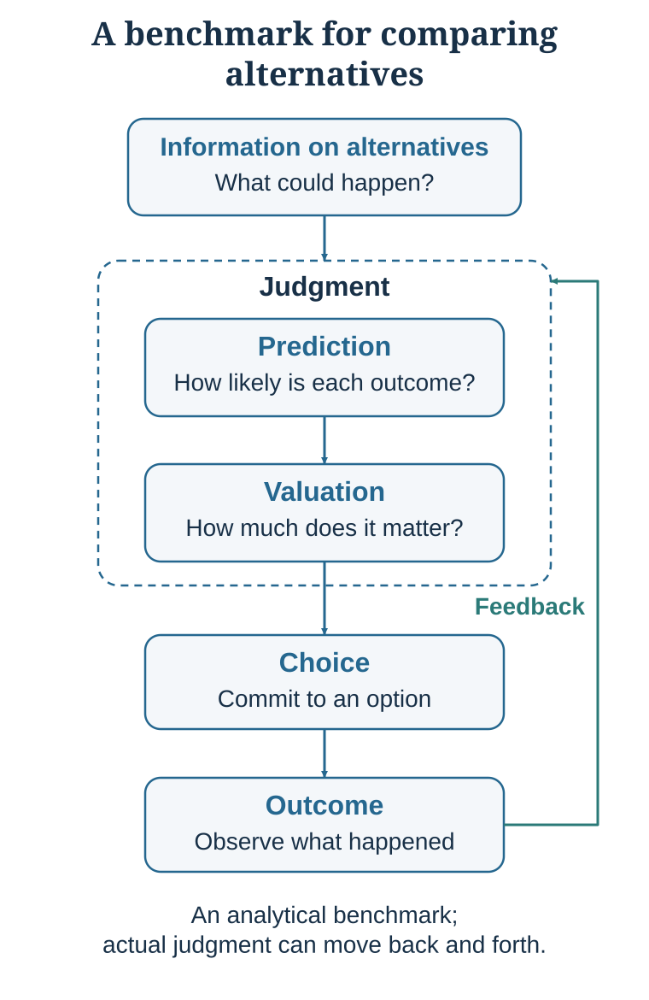

# Decision-Making Is a Process, Not a Moment

*Decision-making begins before the moment of choice*

::: {.callout-note .core-idea icon=false}
## Core Idea

Every visible choice is the end of a longer process: attention selected evidence, interpretation supplied meaning, prediction projected consequences, valuation assigned weight, and a menu made some actions possible. But judging only the final selection hides omitted options, sacrificed alternatives, and the feedback that will shape the next decision. Therefore, this chapter maps decision-making as a loop so that each upstream contribution—and the quality of the process—can be inspected.
:::

## Learning goals

- Map a decision as a loop rather than a single moment.
- Separate prediction from valuation.
- Distinguish decision-process quality from outcome quality and use a dated decision map to support learning.

::: {.callout-note .loop-location icon=false}
## Where this chapter enters the loop

This chapter introduces the whole navigation system: **Notice → Interpret → Predict → Value → Construct options → Choose → Act → Learn**. Later chapters slow down one connection at a time; this chapter keeps the complete path visible.
:::

Imagine that you are choosing between two job offers. The first comes from a prestigious consulting firm. The salary is high, the brand name is powerful, and the career path is clear. Your classmates congratulate you. Your family thinks it is the obvious choice.

The second offer comes from a smaller sustainability start-up. The salary is lower, the company is less secure, and the future is uncertain. But the work feels meaningful. You would have more autonomy, more responsibility, and perhaps more opportunity to learn quickly.

Which job should you choose?

At first, the decision looks like a comparison between salary and meaning, prestige and autonomy, security and uncertainty. But the more carefully you look, the more complicated it becomes. What will you actually learn in each role? How stable is each organization? How much risk can you tolerate? How important is income at this stage of life? What will each job make possible five years from now? Which values are yours, and which are borrowed from family, peers, or status signals? What are you giving up by choosing one path rather than another?

Now change the setting. A marketing director must hire a product manager. A venture investor can fund only two of several start-ups. A university must decide whether to launch a new executive program. A negotiator must accept, reject, or redesign a proposed deal. These cases differ in content, but they share a structure: alternatives, incomplete information, uncertain consequences, values, constraints, trade-offs, action, and feedback.

That shared structure is why decision-making needs a science. A scientific approach gives us concepts for naming the parts of a decision, models for clarifying what coherent choice would require, evidence about how real people actually judge and choose, and tools for improving decisions in personal, organizational, social, and strategic life.

## The hidden process

When people explain a decision, they usually begin near the end of the process: "I chose the consulting job because it had better prospects"; "We hired her because she was the strongest candidate"; "I bought the product because it offered the best value"; "We launched the program because demand was strong." These explanations may be partly correct. They are rarely the whole causal story.

Before the choice became visible, some information entered attention and other information did not. Some alternatives appeared while others remained invisible. Some outcomes were imagined vividly, while others stayed abstract. Some sources were trusted and others discounted. Some values felt urgent because they were tied to identity, emotion, or social approval. The environment made some actions easy and others effortful.

The visible choice is therefore the tip of an iceberg. Beneath it lies a process of noticing, interpreting, predicting, valuing, comparing, acting, and learning. Decision science begins by making this process visible and inspectable.

## The decision loop

{#fig-decision-loop fig-alt="Simple decision loop showing information on alternatives, judgment, prediction, valuation, choice, outcome, and feedback/learning."}

A useful starting model is the decision loop in Figure @fig-decision-loop. It separates the decision process into a small number of functional components. **Information on alternatives** enters **judgment**. Within judgment, **prediction** concerns what is true or likely to happen, whereas **valuation** concerns what is good, bad, costly, fair, meaningful, or unacceptable. Judgment supports **choice**; choice produces an **outcome**; and outcomes provide **feedback and learning** that influence later judgments.

This original loop is deliberately simple. It is helpful because it makes the architecture of coherent choice easy to see. In that sense, it is close to a **normative or analytic representation** of decision-making: it highlights the core tasks a decision process must somehow accomplish, even if real people do not perform them in a clean, orderly, fully conscious sequence.

The simple loop should therefore be treated as a functional map, not as a literal sequence that every mind consciously follows. Later in this chapter, after examining behavioral evidence, we will return to the loop and expand it into a more descriptive model of how choices are actually constructed.

## To Decide Is to Cut Off: Judgment, Choice, and Sacrifice

Decision-making begins before choice. Before we choose, we first judge. **Judgment** involves forming assessments from the available information: what is likely to happen, how uncertain the outcome is, and how desirable or undesirable the outcome would be. This distinction maps onto two central components of judgment: **prediction**, which concerns beliefs about the world, and **valuation**, which concerns the desirability of possible outcomes.

### Facts and values answer different questions

Prediction asks what is likely to happen. Valuation asks how good or bad an outcome would be. A university considering an executive program may predict enrollment, willingness to pay, competitor response, and faculty workload. It must separately value revenue, mission fit, learning, reputation, staff burden, and risk.

The distinction is simple but powerful. A person who wants a project to succeed may overestimate its probability. A person who fears relocation may persuade themselves that a distant job has poor prospects. A group may appear to disagree about "risk" when one person means a high probability of failure and another means that even a low probability would be unacceptable. Classic research on judgment under uncertainty shows that predictions are often shaped by heuristics rather than purely statistical reasoning (Tversky & Kahneman, 1974). The quality of choice therefore depends heavily on the quality of the judgment that precedes it. Good discussion identifies whether disagreement concerns facts, forecasts, values, constraints, or trade-offs.

### Choice turns judgment into sacrifice

Choice adds something that judgment alone does not: commitment. The English word *decide* derives from the Latin *dēcīdere*, meaning "to cut off," from *de-* plus *caedere*, meaning "to cut, strike, or fell." The etymology captures the deeper structure of choice. To decide is not merely to select one option; it is also to cut away other possible paths.

This is why every choice contains sacrifice. In economics, the sacrificed alternative is represented by **opportunity cost**: the value of the best feasible alternative forgone. If a student comes to class, they give up the best alternative use of that time, perhaps watching a film, working, or resting. If a person spends money on a product today, they give up saving it or spending it on something else. A choice therefore contains both a visible gain and an invisible cost: the path not taken.

People do not always represent this invisible cost spontaneously. Frederick, Novemsky, Wang, Dhar, and Nowlis (2009) call this pattern **opportunity-cost neglect**. Their studies found that consumers often failed to generate the alternatives displaced by a purchase. When opportunity costs were made explicit, participants became less willing to buy and more likely to choose affordable options. Simply asking, "What will this choice prevent me from doing?" can therefore improve the representation of a decision.

## Options are made, not merely received

We rarely choose in a vacuum. We choose among options, but the options we notice are not necessarily the only feasible options. A student choosing between two jobs may be able to negotiate, ask for more time, continue searching, accept one role temporarily, or create a hybrid arrangement. A company choosing between suppliers may split the contract, redesign the product, delay production, or build internal capacity. A government considering two policies may pilot one, combine elements, or redefine the problem.

Too few alternatives create tunnel vision: careful evaluation cannot rescue a choice set that excludes the best feasible option. Yet more choice is not always better. Iyengar and Lepper's (2000) classic study showed that a large assortment could attract interest while reducing completed choice. Later meta-analyses reached a more nuanced conclusion: choice overload is not universal, but it becomes more likely when options are complex, preferences are uncertain, the task is difficult, or the decision goal is unclear (Scheibehenne et al., 2010; Chernev et al., 2015).

Good option-set design therefore requires balance. The menu must be broad enough to avoid false either-or choices, but structured enough to remain comparable and actionable. Prediction helps estimate what may happen. Valuation helps rank what matters. Choice then transforms judgment into commitment by cutting off other possibilities. A decision is not only an act of selection; it is an act of sacrifice under uncertainty. *Building a Better Decision* develops this point through feasible sets, opportunity cost, and the value of information.

::: {.callout-note .core-idea icon=false}
## Core teaching message

Decision-making is the movement from prediction and valuation to commitment—and commitment always means giving up alternative futures.
:::

## The loop is functional, not always conscious

The decision loop should not be mistaken for a conscious checklist that people execute before every action. Much ordinary behavior is fast, cue-driven, and automatic. A phone lights up; attention shifts; the cue predicts possible social information; checking acquires immediate value; the hand moves. A familiar route, routine purchase, greeting, or practiced professional response can unfold with little explicit deliberation.

Automaticity is not a defect. Skilled driving, fluent reading, expert pattern recognition, and routine coordination depend on processes that no longer require step-by-step conscious control. Intuition can reflect compressed expertise when an environment contains learnable regularities and provides sufficiently rapid, accurate feedback. Chess and some operational settings can meet these conditions. Long-horizon strategy, many hiring judgments, political forecasting, and novel investments often do not.

The same efficiency that supports expertise also creates vulnerability. Familiarity can be mistaken for truth. A default can become a choice without reflection. A vivid anecdote can crowd out a base rate. Social pressure can suppress a private concern. A short-term reward can dominate a delayed objective. Decision science does not ask whether automatic processing is good or bad in general. It asks when it is well trained, when it is misled, and where a pause or external aid would improve the loop.

## Outcome is not process

A good decision can produce a bad outcome, and a poor decision can produce a favorable outcome. Uncertainty separates process quality from result quality.

Outcome bias and hindsight bias show why a good process cannot be reconstructed reliably from the result alone (Baron & Hershey, 1988; Fischhoff, 1975).

An investor may buy a stock after one enthusiastic social-media post and make money. The outcome is favorable, but the reasoning may have been reckless. Another investor may diversify, use sound evidence, and lose money during an unexpected market shock. The outcome is unfavorable, but the process may have been defensible. A surgeon can recommend the treatment best supported by the available evidence and still encounter a rare complication. A negotiator can reject a poor agreement and later discover that conditions changed unexpectedly.

Outcome bias is the tendency to judge a decision mainly by its result rather than by the quality of the process that produced it. Hindsight bias makes an event seem more predictable after it occurs than it was beforehand. Together, these biases corrupt learning: luck can reward a bad process, while an unlucky result can discredit a good one.

Feedback therefore does not automatically create wisdom. A useful review reconstructs what was known at the time, what alternatives were considered, what probabilities were assigned, which values mattered, and which assumptions were uncertain. Learning requires a record that outcome knowledge cannot rewrite.

Even a careful review cannot recover the road not taken. A graduate who chose one degree does not observe the career and life that would have followed from another. A firm that launched in September does not simultaneously observe the world in which it waited. Consequences may still be unfolding, and the realized path mixes choice, implementation, timing, and luck. An audit can reveal missing options, weak predictions, hidden values, and a process to redesign; it cannot prove that the chosen path was globally best or that the forgone one would have been worse.

## Three changes that expose the hidden process

If the clean loop were a complete psychological description, a change that leaves objective outcomes unchanged should rarely alter choice. Yet controlled research shows that representation, comparison, and the consequence of inaction can move decisions.

First, the same surgical outcomes can be described through survival or mortality. Equivalent numbers then direct attention toward different consequences and can shift treatment preference (McNeil et al., 1982; Tversky & Kahneman, 1981). Second, adding an asymmetrically dominated subscription can make a target option easier to compare and justify even when the added option is rarely chosen (Huber et al., 1982). Third, changing an organ-donation form from opt-in to opt-out changes what happens when a person does nothing; defaults can affect stated or registered participation even though freedom to choose formally remains (Johnson & Goldstein, 2003).

These findings do not show one universal bias. They locate three different entry points into the loop: a frame changes interpretation, a decoy changes comparison, and a default changes the path from intention to action. They are enough to show why the analytic loop needs a descriptive layer.

::: {.callout-caution .evidence-boundary icon=false}
## Evidence Boundary

An effect in one task does not supply a universal effect size, and a registration default does not by itself determine real-world organ recovery. The intervention, outcome, population, and institutional system must be kept distinct.
:::

## From the clean loop to a descriptive decision process

The examples now allow us to see what the original loop leaves implicit. The clean loop begins with “information on alternatives,” as though relevant evidence simply arrives in a neutral form. Behavioral evidence shows that the decision-maker encounters **presented information**: information selected, formatted, ordered, highlighted, framed, and embedded in a social environment.

{#fig-behavioral-decision-loop fig-alt="Diagram of decision-making according to behavioral evidence. Presented information on alternatives enters the decision-maker. Within judgment, prediction and valuation interact with selection and interpretation of information. External context shapes what is presented, internal state and model shape interpretation, and outcomes generate feedback and learning."}

Figure @fig-behavioral-decision-loop synthesizes this evidence in a descriptive model. **External context** includes frames, defaults, option sets, information format, friction, social cues, and primes. It influences which information is presented and can also influence the decision-maker’s internal state. **Internal state and model** includes attention and cognitive resources, beliefs, goals, affect, memory, identity, and causal assumptions. It shapes which information is selected, how it is interpreted, and how much weight it receives.

Within **judgment**, prediction and valuation remain analytically distinct but interact. Beliefs about what is likely can change value, and desires or fears can influence perceived probability. Both feed into the **selection and interpretation of information**, because evidence does not guide choice until it is noticed, trusted, and given meaning. Judgment supports **choice**, which produces an **outcome**. Feedback then updates the internal state and model rather than merely closing the loop.

The contrast between Figures @fig-decision-loop and @fig-behavioral-decision-loop is therefore deliberate. The first is a clean **normative-analytic map** of the functions a coherent decision process must accomplish. The second is a **descriptive-behavioral map** of how actual choices are constructed under limited attention, prior models, active motives, and contextual influence. *Building a Better Decision* develops the normative–descriptive distinction more fully; later chapters explain the mechanisms shown in the descriptive diagram.

## One architecture across the book

The decision loop is the common foundation of the book.

In a decision, a person manages their own model: which situation they are in, what options exist, what is likely to happen, what matters, and what can be learned. In persuasion, one person tries to influence another person's attention, interpretation, beliefs, values, or willingness to act. In negotiation, two or more parties make interdependent choices while forming models of one another's interests, alternatives, constraints, credibility, and likely moves.

This framing improves both effectiveness and ethics. Persuasion is not simply adding more facts; facts matter only when they are noticed, understood, relevant, and trusted. Negotiation is not merely exchanging offers; questions can reveal hidden constraints, change beliefs about feasibility, and create options that neither side saw initially. In all three domains, model humility matters: the decision-maker's representation is not reality itself.

## Three questions the book will ask

The rest of the book uses this common architecture to ask three different questions. *Building a Better Decision* begins with a **normative** question: what would coherent choice require, given a decision-maker's alternatives, beliefs, values, and constraints? Most of the middle chapters are primarily **descriptive**: how do people actually attend, predict, value, choose, rationalize, influence, communicate, and negotiate? The final chapters become explicitly **prescriptive**: how can individuals and organizations design better behavior, choice environments, and decision systems?

These labels describe the purpose of an analysis, not rigid boundaries between disciplines. A theory can sometimes be used in more than one way. *Building a Better Decision* develops the distinction after the rational-choice benchmark is in view; later descriptive chapters explain how actual behavior departs from that benchmark, and the final chapter shows how decision hygiene turns those insights into procedures for improvement (Edwards, 1954; Simon, 1955; Milkman et al., 2009).

## The hiring decision, mapped once

A marketing director must choose a product manager. The visible decision is a name on an offer letter; the hidden process begins much earlier. The committee must **notice** job-relevant evidence, **interpret** what each work sample reveals, **predict** future performance, **value** different contributions, **construct options** such as further assessment or redesigned responsibilities, **choose** and **act**, and later **learn** from performance without letting the outcome rewrite the original record.

The map also exposes category errors. Confidence, warmth, accent, prestige, or similarity can influence attention and interpretation without being valid evidence of performance. “Fit” can conceal a value judgment inside a prediction. A favorable first year may combine selection quality, onboarding, team conditions, and luck. Structure does not eliminate judgment; it makes each claim inspectable and gives later chapters a common case to revisit.

| Component | Core question | Common failure | Practical habit |
| --- | --- | --- | --- |
| Alternatives | What can be done? | Treating the first visible menu as complete—or assuming that a larger menu is always better. | Generate, combine, negotiate, delay, pilot, or redesign a manageable set of options. |
| Information and attention | What enters the model? | Assuming available information is the same as noticed or trusted information. | Identify missing evidence, salience, source credibility, and information format. |
| Prediction | What is likely to happen? | Treating hope, fear, confidence, or identity as evidence. | Use base rates, comparison cases, explicit probabilities, and disconfirming evidence. |
| Valuation | What matters, and how much? | Hiding value conflicts inside vague words such as "best," "fit," or "risk." | Name objectives and trade-offs explicitly. |
| Choice | What action will be taken? | Choosing without recognizing constraints, reversibility, or sacrifice. | Ask what is forgone and whether the decision can be tested or staged. |
| Outcome and feedback | What happened, and what should be learned? | Equating the result with the quality of the prior process. | Record reasoning before acting and review it after outcomes arrive. |
: A practical map of the decision loop {#tbl-01-1}

## Practice Lab

Before using the chapter's vocabulary, write five sentences about one consequential decision: what happened, why you chose as you did, what you expected, what mattered, and how it turned out. Keep this account unchanged. Then produce a one-page decision map from **Notice** through **Learn**. Name the best feasible alternative that commitment cut off, mark the assumption carrying the forecast, and rate process quality separately from outcome quality. The deliverable is the original account, the map, and one change you would make before a similar decision.

## Take it forward

- **Use this when:** a visible choice or outcome makes the earlier process disappear.
- **Do not infer:** that a good outcome proves a good decision, that an orderly diagram describes conscious mental steps, or that the first visible options exhaust the feasible set.
- **Try this next:** make one decision map before commitment and preserve it for the post-outcome review.

## References cited in this chapter

::: {.reference}
Baron, J., & Hershey, J. C. (1988). Outcome bias in decision evaluation. *Journal of Personality and Social Psychology, 54*(4), 569–579.
:::

::: {.reference}
Chernev, A., Böckenholt, U., & Goodman, J. (2015). Choice overload: A conceptual review and meta-analysis. *Journal of Consumer Psychology, 25*(2), 333–358.
:::

::: {.reference}
Edwards, W. (1954). The theory of decision making. *Psychological Bulletin, 51*(4), 380–417.
:::

::: {.reference}
Fischhoff, B. (1975). Hindsight is not equal to foresight: The effect of outcome knowledge on judgment under uncertainty. *Journal of Experimental Psychology: Human Perception and Performance, 1*(3), 288–299.
:::

::: {.reference}
Frederick, S., Novemsky, N., Wang, J., Dhar, R., & Nowlis, S. (2009). Opportunity cost neglect. *Journal of Consumer Research, 36*(4), 553–561.
:::

::: {.reference}
Huber, J., Payne, J. W., & Puto, C. (1982). Adding asymmetrically dominated alternatives: Violations of regularity and the similarity hypothesis. *Journal of Consumer Research, 9*(1), 90–98.
:::

::: {.reference}
Iyengar, S. S., & Lepper, M. R. (2000). When choice is demotivating: Can one desire too much of a good thing? *Journal of Personality and Social Psychology, 79*(6), 995–1006.
:::

::: {.reference}
Johnson, E. J., & Goldstein, D. G. (2003). Do defaults save lives? *Science, 302*(5649), 1338–1339.
:::

::: {.reference}
McNeil, B. J., Pauker, S. G., Sox, H. C., Jr., & Tversky, A. (1982). On the elicitation of preferences for alternative therapies. *New England Journal of Medicine, 306*(21), 1259–1262.
:::

::: {.reference}
Milkman, K. L., Chugh, D., & Bazerman, M. H. (2009). How can decision making be improved? *Perspectives on Psychological Science, 4*(4), 379–383.
:::

::: {.reference}
Scheibehenne, B., Greifeneder, R., & Todd, P. M. (2010). Can there ever be too many options? A meta-analytic review of choice overload. *Journal of Consumer Research, 37*(3), 409–425.
:::

::: {.reference}
Simon, H. A. (1955). A behavioral model of rational choice. *The Quarterly Journal of Economics, 69*(1), 99–118.
:::

::: {.reference}
Tversky, A., & Kahneman, D. (1974). Judgment under uncertainty: Heuristics and biases. *Science, 185*(4157), 1124–1131.
:::

::: {.reference}
Tversky, A., & Kahneman, D. (1981). The framing of decisions and the psychology of choice. *Science, 211*(4481), 453–458.
:::
