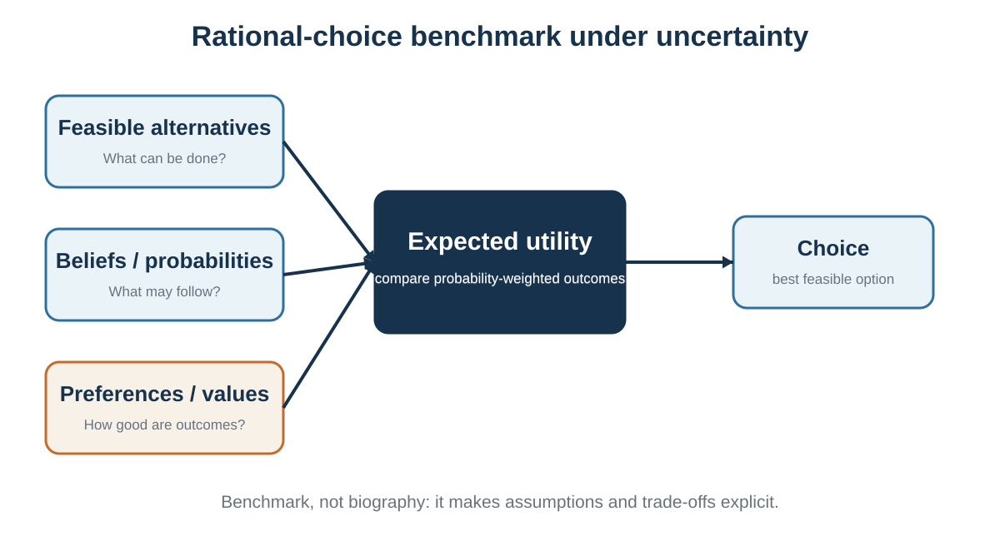

# Rationality: A Benchmark, Not a Portrait

*What coherent choice would require under stated beliefs and values*

::: {.callout-note .core-idea icon=false}
## Core Idea

Rational choice is a model for making assumptions and trade-offs inspectable; it is not a claim that real people consciously calculate perfectly or that rational values must be selfish.
:::

## Learning goals

- Distinguish instrumental, epistemic, procedural, and outcome rationality.
- Identify the building blocks of a rational-choice problem.
- Explain utility as a representation of preference.
- Use expected utility without confusing it with expected money.
- Distinguish normative, descriptive, and prescriptive decision science.
- Explain why rational choice and expected utility are mainly normative, prospect theory is primarily descriptive, and decision hygiene is prescriptive.

Chapter 1 mapped the full decision loop and showed how attention, context, internal state, and feedback shape real behavior. Chapter 2 asks a narrower normative question: if a decision-maker wanted to choose coherently under stated beliefs, values, and constraints, what structure would the decision require?

Return to the two job offers. The consulting role provides salary, training, brand value, and a relatively clear path, but may impose long hours and less autonomy. The sustainability start-up offers mission, responsibility, and learning, but lower income and greater uncertainty. A coherent decision requires more than a feeling about which option is "better." It requires a defined set of alternatives, beliefs about possible outcomes, values over those outcomes, constraints, trade-offs, and a comparison rule.

Rational choice provides that comparison rule. It is the ruler behind later discussions of framing, loss aversion, defaults, preference reversals, and bias. A ruler does not describe the shape of every object. It allows us to describe where and how the object bends.

## What rationality means

The word rational is used loosely in everyday language. It can mean calm, intelligent, mathematical, selfish, unemotional, or realistic. Decision theory uses the term more precisely, but even within decision science there is more than one relevant standard.

Instrumental rationality concerns fit between means and ends: given a person's goals and beliefs, does the action advance those goals? Epistemic rationality concerns the quality of belief formation: are beliefs probabilistically coherent and responsive to evidence? Procedural rationality concerns whether the decision process was appropriate given limits of time, information, and computation. Outcome quality concerns what actually happened. These standards overlap, but they are not identical.

A choice can be instrumentally coherent relative to a false belief. If a patient reasonably but incorrectly believes a treatment is ineffective, declining it may follow from their belief and values, yet the belief may be inaccurate. Conversely, a person can obtain a favorable outcome through a poorly justified choice. Rationality therefore cannot be inferred from outcome alone.

The benchmark asks for coherence and disciplined belief formation, not coldness. A person can rationally value family, loyalty, fairness, dignity, environmental welfare, identity, or moral commitment. Emotion helps reveal significance and can support practical choice. It becomes problematic when the feeling itself is treated as sufficient evidence about what is likely to happen.

## Rationality does not require selfishness

Rational choice theory does not dictate what a person must value. A parent can prefer a lower-paying job that provides time with children. A manager can reject a profitable contract because it violates ethical standards. A negotiator can sacrifice short-term gain to protect a valuable relationship. The theory asks whether choices are consistent with the relevant preferences and constraints; moral evaluation of those preferences is a separate question.

This separation is useful but ethically incomplete. A decision can be coherent for the agent and still violate rights or harm others. Normative decision theory is not a complete moral theory. In organizational and public decisions, legitimate values, affected stakeholders, and procedural justice must be made explicit rather than hidden inside a utility score.

## A family of models

{#fig-rational-benchmark fig-alt="Three inputs—feasible alternatives, beliefs and probabilities, preferences and values—feed expected utility and then choice."}

There is no single rational choice model that covers every decision without additional assumptions. The appropriate model depends on whether consequences are certain, probabilistic, ambiguous, multi-objective, interdependent, or dynamically changing.

Expected utility and subjective expected utility are normative representations of coherent choice under specified assumptions, not descriptions of a conscious mental algorithm (von Neumann & Morgenstern, 1944; Savage, 1954; Edwards, 1954).

Under certainty, each feasible action leads to a known outcome. Rational choice can be represented as selecting the most preferred outcome. Under risk, possible outcomes and their probabilities are specified or treated as known. Expected utility theory combines probabilities and utility. Under uncertainty, probabilities are not objectively given; subjective expected utility represents beliefs as subjective probabilities, provided they satisfy coherence conditions. Under ambiguity or model uncertainty, even the set of states or relevant probabilities may be unclear, and additional decision rules or robustness analysis may be needed.

The distinction matters because the phrase "maximize expected utility" can sound more universal than it is. Expected utility is a powerful benchmark under its assumptions. It is not a license to invent precise probabilities where the evidence does not support them.

## The building blocks

A useful rational-choice analysis begins before calculation. The decision must be framed, the feasible set constructed, and the relevant outcomes and values identified. Poor framing can make a technically correct calculation irrelevant.

## Feasibility and option creation

A decision is rational only relative to a feasible set. The best imaginable option may be unavailable because of budget, law, time, authority, health, or organizational capacity. Yet constraints should not be accepted too quickly. A deadline may be negotiable. A role can be redesigned. A partnership can create capacity. A pilot can reduce the required commitment. Good analysis distinguishes real constraints from assumed constraints.

Option generation is therefore part of rationality, not a creative extra. A choice among poor options can be coherent and still be avoidably poor because the best feasible alternative was never generated.

## Preferences, utility, and coherence

Preferences describe how a decision-maker ranks alternatives or outcomes. Utility is a numerical representation of those preferences. It is not automatically money, happiness, pleasure, or moral worth.

For choice under certainty, only order matters. If a decision-maker prefers A to B and B to C, any numerical scale that preserves that order can represent the preference. Saying u(A) = 100 and u(B) = 60 does not mean A provides exactly 40 more units of felt happiness. The numbers encode ranking.

Under expected utility theory, the utility index carries more structure because differences in utility help represent attitudes toward risky lotteries. Even then, the scale is not an objective psychological thermometer. A positive affine transformation - multiplying by a positive number and adding a constant - represents the same expected-utility preferences.

Two basic coherence conditions are completeness and transitivity. Completeness means the decision-maker can compare any two alternatives in the relevant domain: prefer A, prefer B, or be indifferent. Transitivity means that if A is preferred to B and B to C, then A should be preferred to C. These conditions support a stable representation, but they should not be turned into moral accusations. In novel, morally conflicted, or poorly specified choices, temporary incompleteness can be reasonable: the person may need information, reflection, or a richer framing before comparison is possible.

## What violations do - and do not - show

Empirical violations of completeness, transitivity, or independence do not imply that every observed choice is irrational or that normative analysis should be abandoned. A violation may reflect unstable attention, changing interpretation, incomplete preference formation, misunderstanding, or a genuine departure from the model's axioms. The correct inference depends on the task and measurement.

The Allais paradox, for example, shows that many people violate the independence axiom in systematic ways. Prospect theory and other descriptive models were developed partly to explain such patterns. The normative model remains useful because it identifies the assumption being violated and clarifies the trade-off involved; the descriptive model explains how actual behavior differs. A benchmark is most useful when its assumptions are visible rather than treated as universal truths.

## Beliefs, risk, uncertainty, and ambiguity

Preferences alone cannot determine action. The decision-maker also needs beliefs about what each alternative may produce. Beliefs should be represented with the degree of confidence the evidence warrants.

Probability is one language for disciplined belief. Coherent probabilities obey basic rules: they lie between zero and one, mutually exclusive possibilities add appropriately, and conditional beliefs update when relevant evidence arrives. Bayesian updating is a normative rule for revising probabilities when a prior model and likelihood are specified. It does not imply that priors are objective, that every causal model is known, or that all uncertainty can be reduced to a single precise number.

Risk usually refers to situations in which relevant outcomes and probabilities are known or estimable. Uncertainty refers to situations in which probabilities are not fully known. Ambiguity goes further: the decision-maker may be unsure which probability model applies. In practice these categories form a continuum. A scientifically responsible analysis can use ranges, scenarios, confidence intervals, or multiple models rather than forcing a precise point estimate.

## Expected utility

Expected utility combines beliefs and values. For a feasible action a, possible states s, outcomes x(a,s), probabilities P(s|a), and a utility function u, the expected utility of the action is:

EU(a) = ∑ₛ P(s | a) × u[x(a,s)]

The benchmark selects the feasible action with the highest expected utility. If the outcome is certain, the formula reduces to choosing the outcome with the greatest utility. If probabilities are subjective, the calculation represents subjective expected utility.

Expected utility is not expected money. A person may value each additional euro less than the previous one, value avoiding ruin disproportionately, or care about nonfinancial outcomes. A concave utility function can represent risk aversion even when expected monetary value favors a riskier option. Conversely, a person may rationally accept risk when upside, learning, or mission has high utility and downside is bearable.

The arithmetic is usually the easy part. The difficult work is defining outcomes, assigning defensible probabilities, representing values, and checking whether the model omits an important objective or constraint.

## Three questions of decision science

Decision science does not ask only one kind of question. It asks what would constitute a coherent decision, how people actually make decisions, and how decision processes can be improved. These are commonly described as **normative**, **descriptive**, and **prescriptive** questions.

The distinction concerns the purpose for which a theory or method is being used. It should not be treated as a rigid classification of entire disciplines. The same formal tool can sometimes be used in more than one way. In this book, however, the three labels provide a useful map.

| Approach | Core question | Representative theories and methods | Main standard of success |
| --- | --- | --- | --- |
| **Normative** | What would coherent or defensible choice require under specified assumptions? | Rational choice, expected utility theory, probability axioms, Bayesian updating, dominance, opportunity cost, and parts of game theory | Logical coherence, consistency, evidence-responsive beliefs, and fit between means and ends |
| **Descriptive** | How do people actually judge and choose? | Prospect theory, bounded rationality, heuristics and biases, dual-process theories, framing, attention, constructed preference, and social influence | Empirical accuracy, explanatory usefulness, predictive fit, and evidence about underlying processes |
| **Prescriptive** | How can judgment and choice be improved, given actual human capacities and environments? | Decision analysis, the outside view, structured judgment, decision journals, premortems, checklists, choice architecture, and decision hygiene | Better calibration, consistency, fairness, implementation, and learning |
: Three questions of decision science {#tbl-three-questions}

### Normative models: standards, not psychological portraits

A normative model specifies standards that a decision should satisfy under stated assumptions. Rational choice theory asks whether feasible alternatives, beliefs, preferences, constraints, and actions fit together coherently. Expected utility theory provides a normative framework for comparing risky alternatives when probabilities and utilities can be represented appropriately.

Calling these theories normative does **not** mean that they provide a complete moral theory. Expected utility cannot determine whose welfare should count, which rights may be traded, or whether a decision process is just. Nor does normative mean that people consciously perform the relevant calculations. The model provides a standard of coherence, not a literal description of mental activity.

A ruler does not explain how an object was produced. It supplies a standard against which the object can be examined. In the same way, expected utility can reveal dominance, inconsistency, or sensitivity to assumptions without claiming that the brain consciously computes expected utility.

### Descriptive models: explaining actual judgment and choice

A descriptive model aims to explain or predict what people actually do. **Prospect theory is primarily descriptive.** It was developed to account for systematic patterns that expected utility theory does not describe well, including reference dependence, loss aversion, diminishing sensitivity, and nonlinear probability weighting (Kahneman & Tversky, 1979).

These patterns may be psychologically powerful, but prospect theory does not claim that people *ought* to be loss averse or to weight probabilities nonlinearly. A descriptive regularity should not automatically become a recommendation.

Much of the foundational work in behavioral economics is similarly descriptive or explanatory. It documents and models how actual choices depart from standard rational-choice predictions because of limited attention, framing, reference points, present bias, constructed preferences, social influence, and other psychological mechanisms. However, behavioral economics as a whole is not purely descriptive. Behavioral welfare economics, choice architecture, and behavioral public policy also ask normative and prescriptive questions. It is therefore more accurate to classify particular theories and applications than to assign one label to the entire field.

### Prescriptive decision science: improving the process

Prescriptive decision science asks how people and organizations can make better decisions, given both the standards supplied by normative theory and the realities revealed by descriptive research. It does not merely tell people to “be rational.” It redesigns the procedure.

A prescriptive method may ask decision-makers to define objectives before comparing options, use a relevant reference class rather than relying only on the inside view, record predictions before outcomes are known, obtain independent estimates before group discussion, score criteria separately before forming an overall impression, or specify in advance what evidence would trigger revision (Milkman et al., 2009).

**Decision hygiene is a central prescriptive approach.** It treats judgment quality as a property of a system rather than only a personal virtue. Structured interviews, rubrics, checklists, independent estimates, noise audits, premortems, decision journals, calibration exercises, and review procedures are prescriptive because they are designed to reduce avoidable error and improve learning (Kahneman et al., 2021). Chapter 38 develops this approach in detail.

Prescriptive methods therefore combine two kinds of knowledge:

1. a normative view of what better judgment should achieve; and
2. descriptive evidence about how actual judgment tends to fail.

Without a normative standard, “improvement” has no clear meaning. Without descriptive evidence, recommendations may demand cognitive capacities people do not possess or target errors that do not occur in practice.

### One decision, three questions

Consider a hiring decision.

The **normative question** asks what a coherent and legitimate hiring decision should depend on. Which outcomes matter? Which criteria are job-relevant? What evidence should influence the choice? Which legal and ethical constraints apply?

The **descriptive question** asks how hiring decisions are actually made. Do interviewers overweight confidence, similarity, prestige, first impressions, or conversational fluency? How much disagreement or noise exists across evaluators? Do early impressions shape the interpretation of later evidence?

The **prescriptive question** asks how the hiring process should be redesigned. Possible responses include defining criteria in advance, using comparable questions and work samples, scoring dimensions independently, delaying overall impressions, aggregating judgments transparently, and auditing later performance.

The three questions are distinct, but they support one another. Normative theory clarifies the target. Descriptive research identifies the obstacles. Prescriptive methods redesign the process.

::: {.callout-important title="Do not confuse is, ought, and improvement" icon=false}
Three category errors should be avoided.

1. The fact that people commonly behave in a certain way does not mean they ought to behave that way. Loss aversion may be descriptively common without being a desirable basis for every decision.
2. A normatively coherent theory need not be descriptively realistic. Expected utility can be a useful benchmark even when people do not follow it psychologically.
3. A prescriptive intervention is not justified merely because it changes behavior. A nudge, default, checklist, or algorithm must still be evaluated against legitimate objectives, evidence, transparency, fairness, autonomy, and possible unintended consequences.
:::

## Worked example: the two job offers

Suppose the student uses three simplified outcome scenarios for each job. The numbers below are illustrative, not objective. They represent the student's current beliefs and utility judgments on a scale chosen for this decision.

Under these inputs, the start-up has higher expected utility. But the conclusion is conditional. If the student assigns a lower probability to start-up survival, places greater utility on income security, or treats burnout risk differently, the ranking can reverse. That is not a flaw. Sensitivity to beliefs and values is the point: the table shows what the choice depends on.

A good analysis therefore reports not only the winning option but also the assumptions that make it win.

## Dominance and sensitivity analysis

Before detailed calculation, check dominance. An option is strictly dominated if another option is at least as good in every relevant state or attribute and better in at least one, given the same constraints. Dominated alternatives should ordinarily be removed unless they provide information, flexibility, or some omitted value.

Then conduct sensitivity analysis. Vary uncertain probabilities, utilities, weights, or constraints within plausible ranges. If one option remains best across the range, the decision is robust. If small changes reverse the ranking, the decision is fragile and additional information, a pilot, or a reversible choice may be valuable.

## Bounded rationality and satisficing

Rational choice is powerful because it makes a decision inspectable. It is incomplete as a description of actual cognition and sometimes too demanding as a procedure.

Bounded rationality and satisficing recognize that search, information, and computation have costs (Simon, 1955, 1956).

Herbert Simon's bounded rationality emphasizes limits of information, attention, memory, time, and computation. People often satisfice: they search until they find an option that meets an aspiration level rather than proving that it is globally optimal. Satisficing can be rational in a broader procedural sense when the cost of further search exceeds the expected benefit.

Preferences can also be incomplete, unstable, or constructed during choice. A person may not know how much they value remote work until they experience it. A new medical decision may involve values that have never been compared. Context can change attention and the meaning of attributes. These facts do not make benchmarks useless; they explain why the benchmark is not a psychological portrait.

A benchmark can also fail because the model is badly framed. An expected-utility calculation may be internally correct while ignoring an affected group, using a poor proxy, assuming the wrong causal structure, or treating a negotiable constraint as fixed. Rationality is not achieved by arithmetic alone. The decision-maker must remain willing to reopen the problem, revise the feasible set, and question the values or evidence built into the model.

The right amount of analysis is itself a decision. Low-stakes, familiar, reversible choices can use routines or simple rules. High-stakes, novel, irreversible, strategically interdependent, or low-feedback choices deserve more structure. The rational benchmark should guide proportionate deliberation, not turn life into continuous calculation.

::: {.callout-caution .evidence-and-boundary-conditions icon=false}
## Utility represents preference; it is not moral worth

Utility is not a brain chemical, a unit of happiness, or moral worth. It is a formal representation of preference under stated assumptions.
:::

::: {.callout-caution .evidence-and-boundary-conditions icon=false}
## Precision requires a defined forecast

A precise probability is not scientific merely because it contains a number. It needs a defined event, time horizon, evidence base, and reference class.
:::

| Standard | Question | Possible failure |
| --- | --- | --- |
| Instrumental rationality | Does the action advance the agent's ends, given their beliefs and constraints? | Choosing means that do not fit the stated goal. |
| Epistemic rationality | Are beliefs coherent and appropriately responsive to evidence? | Overconfidence, wishful thinking, ignored base rates, or inconsistent probabilities. |
| Procedural rationality | Was the process reasonable given time, stakes, and cognitive limits? | Overanalyzing trivial choices or underanalyzing irreversible ones. |
| Outcome quality | What happened? | Mistaking luck for good reasoning or misfortune for bad reasoning. |
: Four standards that are often confused {#tbl-02-1}

| Setting | What is known? | Benchmark |
| --- | --- | --- |
| Certainty | Each action has a known consequence. | Choose the most preferred feasible outcome. |
| Risk | Possible outcomes and probabilities are specified or well estimated. | Maximize expected utility. |
| Subjective uncertainty | Probabilities are not given but the decision-maker can represent coherent beliefs. | Subjective expected utility. |
| Ambiguity or model uncertainty | Probabilities, states, or causal structure are poorly known. | Use scenarios, robustness, sensitivity, experimentation, or ambiguity-sensitive rules; do not manufacture false precision. |
| Strategic interdependence | Outcomes depend on what other actors do. | Game-theoretic analysis adds beliefs about others, incentives, and equilibrium or strategic stability. |
: Certainty, risk, uncertainty, and strategic interdependence {#tbl-02-2}

## Key ideas

- Rational choice is a model for making assumptions and trade-offs inspectable; it is not a claim that real people consciously calculate perfectly or that rational values must be selfish.
- Distinguish instrumental, epistemic, procedural, and outcome rationality.
- Identify the building blocks of a rational-choice problem.
- Explain utility as a representation of preference.
- Rational choice and expected utility are mainly normative: they specify standards of coherent choice under stated assumptions.
- Prospect theory is primarily descriptive: it explains systematic patterns in actual choice rather than prescribing how people ought to choose.
- Prescriptive decision science combines normative targets with descriptive evidence; decision hygiene is a system-level method for improving judgment.

## Study and practice

1. How would you distinguish instrumental, epistemic, procedural, and outcome rationality?

2. How would you identify the building blocks of a rational-choice problem in a real case?

3. How would you explain utility as a representation of preference?

4. Why is expected utility theory useful even if it is not a complete psychological description?

5. Why should prospect theory not be interpreted as a recommendation to be loss averse or to overweight small probabilities?

6. How does prescriptive decision science use both normative standards and descriptive evidence?

7. Classify each as mainly normative, descriptive, or prescriptive: expected utility, prospect theory, Bayesian updating, the framing effect, a premortem, and a noise audit. Explain any cases that could serve more than one purpose.

::: {.callout-tip .activity icon=false}
## Activity

Take a decision you expect to make this year. Specify the feasible set, uncertain states, predicted consequences, preferences, constraints, and comparison rule. Then analyze the same decision through three lenses: What is the **normative** standard? What **descriptive** tendencies may shape the actual choice? What **prescriptive** change would improve the process? Identify the assumption most likely to fail.  
EXPERIENCE - EXPLAIN - APPLY (MAXIMUM 120 WORDS)  
Experience: describe one specific decision, interaction, or observation. Explain: use one or two concepts from this chapter accurately. Apply: state one improvement, implication, or testable prediction.
:::

## References cited in this chapter

::: {.reference}
Edwards, W. (1954). The theory of decision making. Psychological Bulletin, 51(4), 380-417.
:::

::: {.reference}
Kahneman, D., Sibony, O., & Sunstein, C. R. (2021). Noise: A flaw in human judgment. Little, Brown Spark.
:::

::: {.reference}
Kahneman, D., & Tversky, A. (1979). Prospect theory: An analysis of decision under risk. Econometrica, 47(2), 263-291.
:::

::: {.reference}
Milkman, K. L., Chugh, D., & Bazerman, M. H. (2009). How can decision making be improved? Perspectives on Psychological Science, 4(4), 379-383.
:::

::: {.reference}
Savage, L. J. (1954). The foundations of statistics. Wiley.
:::

::: {.reference}
Simon, H. A. (1955). A behavioral model of rational choice. The Quarterly Journal of Economics, 69(1), 99-118.
:::

::: {.reference}
Simon, H. A. (1956). Rational choice and the structure of the environment. Psychological Review, 63(2), 129-138.
:::

::: {.reference}
von Neumann, J., & Morgenstern, O. (1944). Theory of games and economic behavior. Princeton University Press.
:::
