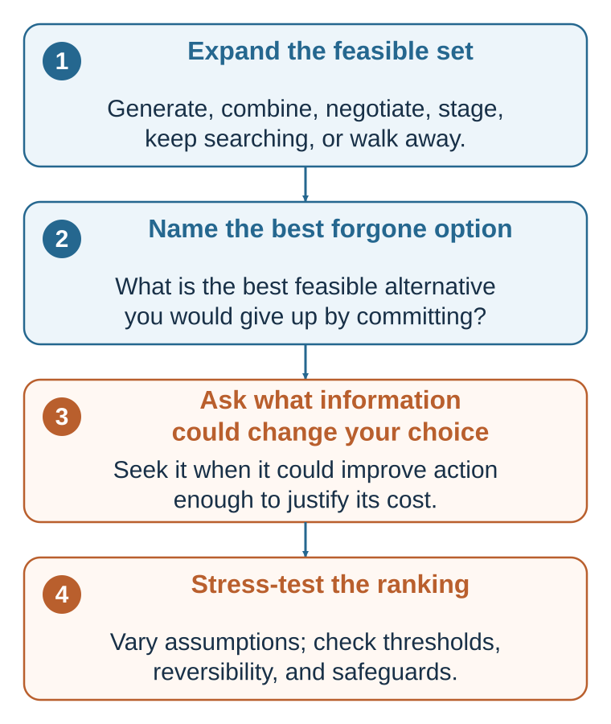

---
aliases:
  - 02-a-rational-benchmark-not-a-portrait.html
  - 02-building-a-better-decision-rationality-alternatives-and-opportunity-cost.html
---

# Building a Better Decision: Alternatives, Opportunity Cost, Information, and Robustness

*The best calculation cannot rescue a menu that omitted the best feasible path*

::: {.callout-note .core-idea icon=false}
## Core Idea

Rational choice is most useful in practice when its inputs are actively constructed and tested. A better decision process builds the feasible set rather than accepting the first visible menu, names the best alternative that commitment would displace, separates predictions from values, seeks information when it can change action, and stress-tests whether the recommendation survives plausible assumptions. The goal is not maximal calculation. It is proportionate, inspectable, and revisable judgment.
:::

## Learning goals

After reading this chapter, you should be able to:

- Distinguish the feasible set from the smaller set of alternatives that happen to receive serious consideration.
- Construct alternatives without treating constraints as a separate item from feasibility.
- Identify opportunity cost as the value of the best feasible alternative forgone.
- Separate predictions about consequences from values over those consequences.
- Assess information by whether plausible results could change action.
- Distinguish a robust recommendation from one that depends on fragile assumptions.

::: {.callout-note .loop-location icon=false}
## Where this chapter enters the loop

This chapter concentrates on **Construct options → Predict consequences → Value consequences → Compare and choose**. It also prepares **Commit and act** by making opportunity cost, reversibility, information needs, and review conditions explicit.
:::

Chapter 1 showed why the rational-choice benchmark is valuable as a normative standard but insufficient as a stand-alone description of actual decision-making. The feasible set is not simply handed to the mind. Consequences are not automatically noticed or correctly predicted. Values are not always stable, articulate, or independent of context. A preference can also fail to become action.

That does not make rational analysis obsolete. It changes its practical job. Prescriptive decision science must help real people construct, inspect, and improve the inputs on which coherent choice depends.

## A better decision begins before comparison {#from-diagnosis-to-a-better-decision}

Many decision tools begin with a table of options. By then, the most consequential mistake may already have occurred. The table may contain only the first two alternatives that became visible. A deadline may be treated as fixed although it is negotiable. A role may be treated as indivisible although it can be redesigned. A decision may be framed as accept or reject even though delay, a pilot, further information, a package, or a reversible commitment is feasible.

A disciplined process therefore begins before scoring.

{#fig-option-information fig-alt="Four vertically arranged steps: expand the feasible set, name the best forgone option, ask what information could change the choice, and stress-test the ranking."}

The sequence is not a rigid algorithm. Predictions can reveal a new option; values can show that a constraint should be challenged; new information can change feasibility. Its purpose is to keep four questions visible before commitment:

1. Are we choosing from the right set of alternatives?
2. What valuable path will the choice displace?
3. What uncertain information could actually change action?
4. Does the recommendation survive plausible changes in assumptions?

## Define the decision before solving it

A useful decision statement specifies the commitment being considered, the decision-maker, the relevant horizon, and the conditions under which the choice can be revised. Compare:

> Should I accept the start-up job?

with:

> By Friday, should I accept the start-up offer as written, negotiate its terms, request time for one further conversation, continue the search, or decline, given my financial runway, family location, learning goals, and tolerance for employment risk over the next two years?

The second statement does not guarantee a better answer. It makes the decision boundary inspectable. It reveals alternatives, time, affected values, and the possibility that the offer itself can be changed.

Before analysis, ask:

- What commitment is being made now?
- Who has authority to make it?
- Whose consequences legitimately matter?
- What is the relevant time horizon?
- Which parts are reversible, and at what cost?
- What decision will occur automatically if nobody acts?

These questions prevent a broad life problem from being compressed into a misleading yes-or-no choice.

## Construct the feasible set

A **feasible alternative** is a course of action that can actually be taken given relevant limits of money, time, law, authority, technology, health, capability, and commitment. Those limits define feasibility; they are not a separate fourth component added after the alternatives have been listed.

The practical difficulty is that people often confuse three sets:

- The **imaginable set**: everything one can describe, including options that are impossible or impermissible.
- The **feasible set**: the alternatives that can genuinely be implemented.
- The **consideration set**: the feasible alternatives that are noticed, generated, recalled, or taken seriously.

The consideration set is often much smaller than the feasible set. A person can choose consistently from the alternatives considered and still make a poor decision because a better feasible alternative never entered the comparison.

### Distinguish real constraints from assumed constraints

Some constraints are hard. A law prohibits an action. A budget cannot cover the cost. A physical deadline cannot be moved. A person lacks the authority to make the commitment.

Other apparent constraints may be negotiable or designed:

- A deadline can be extended.
- A role can be divided or redesigned.
- A partnership can create missing capacity.
- A contract can make payment contingent on performance.
- A pilot can reduce the scale of commitment.
- A sequence of smaller decisions can replace one irreversible decision.
- A safeguard can make an otherwise unacceptable risk tolerable.

The distinction is not an invitation to deny reality. It is a prompt to test whether the boundary is genuinely fixed. A good question is:

> **What would have to be true for this excluded option to become feasible?**

The answer may confirm the constraint. It may also reveal a negotiation, investment, permission, or redesign that changes the menu.

### Generate alternatives deliberately

When the visible menu is too narrow, use a small set of generative moves:

- **Maintain:** Keep the status quo or continue the current path.
- **Delay:** Preserve the option while waiting for a defined event or date.
- **Learn:** Gather information, run a test, seek a second opinion, or conduct a pilot.
- **Negotiate:** Change price, timing, scope, responsibilities, safeguards, or exit terms.
- **Combine:** Create a package or hybrid from parts of existing alternatives.
- **Stage:** Begin with a limited, reversible commitment and expand only if conditions are met.
- **Search:** Reopen the market or generate alternatives outside the current menu.
- **Exit:** Stop, decline, or abandon the project.

Option generation is part of rationality, not a decorative act of creativity. Careful comparison cannot rescue a choice set that excludes the best feasible path.

More choice is not automatically better. Choice overload is not universal, but it becomes more likely when alternatives are complex, preferences are uncertain, the task is difficult, or the decision goal is unclear (Iyengar & Lepper, 2000; Scheibehenne et al., 2010; Chernev et al., 2015). The aim is a set broad enough to escape tunnel vision and structured enough to remain actionable.

A useful stopping question is:

> Do we have at least one meaningfully different alternative, not merely a slightly altered version of the current favorite?

## Name the opportunity cost {#name-the-opportunity-cost}

Commitment has a cutting-off structure: choosing one path also gives up others.

Economics represents that sacrifice as **opportunity cost**: the value of the best feasible alternative forgone. It is not merely the money paid, and it is not the sum of everything left unchosen.

- The cost of a two-hour meeting is the best alternative use of those two hours.
- The cost of accepting one job is the value of the best complete path that the commitment displaces.
- The cost of investing in one project includes the value of the best feasible use of the same capital, talent, and managerial attention.
- The cost of waiting includes the value of the best action that could have been taken during the delay.

Opportunity cost depends on the alternative set. Discovering a better feasible option raises the cost of accepting every proposal already on the table. Conversely, if the apparent alternative is not actually feasible, it should not be used to exaggerate the sacrifice.

Research on opportunity-cost neglect shows that people do not always generate the displaced alternative spontaneously; making it explicit can change purchase decisions (Frederick et al., 2009). Before commitment, ask:

> **If I choose this, what is the best feasible path I will no longer be able to take?**

Naming that path often clarifies the decision more than adding another score to the favored option.

## Separate predictions from values

A consequence-based decision combines two distinct judgments:

- **Prediction:** What is likely to happen if this alternative is chosen?
- **Valuation:** How desirable or undesirable would that consequence be?

The distinction sounds obvious but is often lost in ordinary discussion. “The candidate is the best fit” may combine a prediction about performance, a value placed on similarity, a feeling of interpersonal ease, and an unstated view of what the organization should become. “The project is too risky” may combine the probability of failure, the size of the loss, the ability to recover, and the speaker's tolerance for uncertainty.

Separating predictions from values helps diagnose disagreement. If two people disagree about the probability of success, more relevant evidence may help. If they agree about the forecast but value the outcome differently, more data may not resolve the conflict. They need to discuss priorities, rights, trade-offs, or authority.

### Make predictions inspectable

For each alternative, state:

- The most important possible consequences.
- The time at which they may occur.
- A plausible range rather than only a point estimate.
- The evidence supporting the forecast.
- The main causal assumption.
- A reference class where one is available.
- What evidence would make the forecast change.

Confidence is not evidence. Vividness is not frequency. A detailed story is not necessarily a calibrated prediction. Later chapters develop base rates, sampling, regression, and calibration; here the central habit is to write the forecast in a form that can later be checked.

### Make values and trade-offs inspectable

Important decisions usually involve several objectives. A job can affect income, learning, autonomy, health, location, family time, mission, relationships, and future options. A public decision may affect different groups unequally. Some consequences can be traded off; others may be unacceptable even when an aggregate score is high. Multiattribute decision analysis can help make these objectives and trade-offs explicit (Keeney & Raiffa, 1976).

For each objective, ask:

- What exactly is being valued?
- Over what range does the difference matter?
- Whose value is represented?
- Is this an objective, a means to another objective, or a duplicate of something already counted?
- Is there a threshold or right that should not be traded away?
- Would the same consideration be applied consistently to other alternatives?

A decision table is not a machine for discovering the correct answer. It is a conversation made inspectable. Avoid double-counting related attributes. Do not attach a precise weight to an undefined concept. A statement such as “health matters 30 percent” has little meaning unless the relevant range and trade-off are clear.

| Alternative | Prediction: consequences, evidence, and uncertainty | Valuation, thresholds, and safeguards |
| --- | --- | --- |
| Option A | What is expected to happen, when, and across what plausible range? What evidence and causal assumption support the forecast? | Which consequences matter, to whom, and why? What must be true before committing? |
| Option B | What is expected to happen, when, and across what plausible range? What evidence and causal assumption support the forecast? | Which consequences matter, to whom, and why? What must be true before committing? |
| Status quo or delay | What follows if no new action is taken? Is inaction really neutral? | What is preserved, lost, or postponed? When will the decision be reopened? |

: A prediction–value table for comparing alternatives {#tbl-prediction-value}

The table should preserve uncertainty rather than hiding it. If one option looks best only because every uncertain input has been entered at its most favorable value, the apparent precision is misleading.

## Gather information only when it can change action

Information has instrumental value when it can improve action enough to justify its costs. Those costs include money, delay, attention, privacy, processing, false reassurance, and strategic exposure.

A reference check matters if a plausible result could change a hiring decision, safeguard, or contract term. A pilot matters if it could change scale, design, or the decision to proceed. A diagnostic test has little value for a particular treatment decision when treatment would remain the same regardless of the result, although it may still matter for prognosis, surveillance, or another decision.

The practical test requires no false precision:

1. List the possible results.
2. State the action that would follow each result.
3. Ask whether any plausible branch produces a different action.
4. Compare the likely improvement with the cost of obtaining and using the information.

If no plausible answer changes action, the request may serve reassurance, curiosity, politics, documentation, or delay rather than the decision at hand. Those purposes may still matter, but they should be named honestly.

| Question or test | Result that could change action | Likely decision value |
| --- | --- | --- |
| Reference check on role-critical behavior | Credible evidence changes the ranking, safeguards, or contract terms. | Potentially high when the choice is close and the source is informative. |
| Small pilot before an irreversible launch | A pre-stated threshold triggers scale-up, revision, delay, or stopping. | Often high when the pilot is cheap, representative, and tied to a decision rule. |
| Diagnostic test when treatment would be identical either way | No plausible result changes treatment. | Low for this treatment decision, though it may serve another purpose. |
| Negotiation question about timing | A real difference reveals a feasible trade or package. | Potentially high when the answer is credible and contractible. |

: A decision-branch test for information {#tbl-information-decision-branches}

The [technical appendix](../appendices/appendix-d-rational-choice-and-decision-analysis.qmd#rational-choice-and-decision-analysis) formalizes the expected value of perfect and imperfect information. The practical principle is simpler:

> **Do not ask only whether information would be interesting. Ask what you would do differently after each plausible answer.**

## Stress-test the recommendation

A recommendation is **robust relative to a stated decision model and plausible ranges** when it remains preferred across the specified changes in uncertain predictions, values, or constraints. It is **fragile relative to those ranges** when a small and credible change reverses the ranking. Robustness is therefore not an unconditional property of an option; it depends on which uncertainties the analysis includes and how widely they are varied.

Sensitivity analysis asks:

- Which assumption contributes most to the recommendation?
- How far would that assumption have to move before the preferred option changes?
- Is that threshold inside or outside the plausible range?
- Are the assumptions correlated?
- What happens under a jointly unfavorable scenario?
- Can the decision be staged or made reversible if the ranking is fragile?

Suppose the start-up is preferred only if it survives for three years, workload remains below a certain level, and rapid learning receives a very high value. The decision should not be reported simply as “the start-up scores 82 and consulting scores 78.” The useful conclusion is conditional:

> The start-up is preferred if its survival probability is above the stated threshold and if early autonomy is valued more than near-term income by at least the specified trade-off. Otherwise, consulting is preferred.

This form of conclusion identifies what should be investigated, negotiated, protected, or monitored.

Fragility does not always justify more analysis. When information is expensive or unavailable, a reversible choice may be better than another forecast. A pilot, probation period, staged investment, contingency clause, or exit option can reduce the cost of being wrong.

## Use proportionate analysis

Bounded rationality recognizes that search, attention, time, memory, and computation are scarce (Simon, 1955, 1956). People often **satisfice**: they search until an alternative meets an aspiration level rather than proving global optimality. That can be procedurally rational when further search costs more than it is likely to improve the decision.

The appropriate depth of analysis depends on the decision.

| Decision feature | Usually warrants less structure | Usually warrants more structure |
| --- | --- | --- |
| Stakes | Low | High |
| Familiarity | Repeated and well learned | Novel |
| Reversibility | Easy and inexpensive to reverse | Irreversible or costly to reverse |
| Feedback | Fast, clear, and diagnostic | Delayed, noisy, or absent |
| Interdependence | Mostly individual | Depends strategically on other people |
| Distributional effects | Limited and private | Affects rights, fairness, or many stakeholders |
| Uncertainty | Narrow and well understood | Wide, ambiguous, or model-dependent |

: When to use more or less decision structure {#tbl-proportionate-analysis}

Low-stakes, familiar, reversible choices can rely on routines, trained intuition, or simple rules. High-stakes, novel, irreversible, strategically interdependent, or low-feedback choices deserve more explicit structure. Rationality should guide proportionate deliberation, not turn life into continuous calculation. [*Fast and Frugal Thinking*](08-fast-and-frugal-thinking.qmd#fast-and-frugal-thinking) asks when compressed judgment is well trained; [*Risky Decision-Making*](16-risky-decision-making-a-probability-is-not-yet-a-feeling.qmd#risky-decision-making-a-probability-is-not-yet-a-feeling) develops the expected-utility detail needed when uncertain consequences must be combined.

## Produce a decision recommendation, not merely a score

The output of the process should be an inspectable recommendation. A useful one-page decision record contains:

1. **Decision:** What commitment is being made, by whom, and by when?
2. **Feasible alternatives:** Which options are genuinely available, including the status quo, delay, negotiation, learning, staging, and exit where relevant?
3. **Best forgone alternative:** What is the opportunity cost of the recommended choice?
4. **Predictions:** What are the main expected consequences, ranges, and causal assumptions?
5. **Values:** What matters, to whom, and which trade-offs, rights, or non-negotiable conditions apply?
6. **Recommendation:** Which alternative is preferred, and under which assumptions?
7. **Sensitivity:** What plausible change would reverse the recommendation?
8. **Information:** What further evidence could change action, and is it worth obtaining?
9. **Implementation:** Who acts, when, with what safeguards and exit conditions?
10. **Review:** What will be observed, when will the decision be reviewed, and how will outcome, implementation, and luck be separated?

The recommendation is not “Option A has the largest number.” It is:

> **Choose Option A because, under the stated evidence, objectives, constraints, rights or thresholds, and decision rule, it is preferred among the feasible alternatives. The recommendation would change if these particular assumptions crossed these thresholds.**

That sentence makes the analysis open to disagreement and revision.

## Worked framework: from two offers to a decision architecture

Consider a student choosing between a prestigious consulting firm and a smaller sustainability start-up.

### The first visible menu

The initial choice appears binary:

- Accept consulting.
- Accept the start-up.

This menu is incomplete.

### Constructed alternatives

Further analysis adds:

- Negotiate workload, location, start date, compensation, or role scope.
- Request a short extension for one further conversation.
- Continue the search.
- Decline both offers.
- Ask the start-up for a staged or probationary arrangement.
- Accept one offer while preserving a defined future exit option, where contractually and ethically possible.

Financial runway, visa conditions, location, deadlines, and family commitments determine which of these are feasible. They are not listed again as an independent ingredient after the feasible set has been defined.

### Predictions

The important predictions concern:

- Actual rather than advertised workload.
- Learning and responsibility during the first two years.
- Organizational survival.
- Promotion and future options.
- Quality of supervision.
- Location stability.
- The probability that negotiated terms will be honored in practice.

One further conversation has decision value only if a plausible answer could change the ranking, contract, safeguard, or decision to wait.

### Values

The relevant values include income, autonomy, mission, health, family time, learning, security, identity, and tolerance for downside. Some are partly overlapping. Learning and future options should not automatically be counted twice. Health may function as a threshold rather than a compensable attribute.

### Opportunity cost

If consulting is chosen and the start-up is the best complete feasible alternative, the opportunity cost is the overall value of that start-up path; its autonomy, mission, and early responsibility are dimensions contributing to that value. If the start-up is chosen and consulting is the best complete feasible alternative, the opportunity cost is the overall value of the consulting path, to which income, structured training, security, and network may contribute. The opportunity cost is not every benefit of every unchosen life. It is the singular value of the best complete feasible alternative displaced by commitment.

### Sensitivity and action

The recommendation may depend mainly on three assumptions: the start-up's survival, the consulting workload, and the value placed on early learning relative to financial security. If small plausible changes reverse the ranking, the decision is fragile. The student may then seek targeted information, negotiate a safeguard, or prefer a reversible arrangement.

The output is not a number pretending to be objective. It is a recommendation, the assumptions that make it preferred, the evidence that would reverse it, and the review point after action.

## Practice Lab

Prepare a one-page decision record for a consequential decision.

1. Rewrite the decision so that the commitment, decision-maker, horizon, and automatic outcome of inaction are explicit.
2. List the visible alternatives, then add at least one option created through delay, learning, negotiation, combination, staging, search, or exit.
3. Mark which alternatives are imaginable, feasible, and seriously considered.
4. State the best feasible alternative forgone by the current favorite.
5. Separate the three most important predictions from the three most important values.
6. Identify one piece of information and write the action that would follow each plausible result. Remove the information request if no branch changes action.
7. State the assumption most capable of reversing the recommendation and the threshold at which it would do so.
8. Specify one implementation safeguard and one review point.

## Take it forward

- **Use this when:** A decision arrives as a narrow menu, a score hides the assumptions producing it, or more information is being requested without a decision rule.
- **Do not infer:** That more alternatives, more data, or more calculation always improve a decision.
- **Try this next:** State the best forgone feasible path and the smallest plausible change that would reverse your recommendation.

## References cited in this chapter

::: {.reference}
Chernev, A., Böckenholt, U., & Goodman, J. (2015). Choice overload: A conceptual review and meta-analysis. *Journal of Consumer Psychology, 25*(2), 333–358.
:::

::: {.reference}
Frederick, S., Novemsky, N., Wang, J., Dhar, R., & Nowlis, S. (2009). Opportunity cost neglect. *Journal of Consumer Research, 36*(4), 553–561.
:::

::: {.reference}
Iyengar, S. S., & Lepper, M. R. (2000). When choice is demotivating: Can one desire too much of a good thing? *Journal of Personality and Social Psychology, 79*(6), 995–1006.
:::

::: {.reference}
Keeney, R. L., & Raiffa, H. (1976). *Decisions with multiple objectives: Preferences and value tradeoffs*. Wiley.
:::

::: {.reference}
Scheibehenne, B., Greifeneder, R., & Todd, P. M. (2010). Can there ever be too many options? A meta-analytic review of choice overload. *Journal of Consumer Research, 37*(3), 409–425.
:::

::: {.reference}
Simon, H. A. (1955). A behavioral model of rational choice. *The Quarterly Journal of Economics, 69*(1), 99–118.
:::

::: {.reference}
Simon, H. A. (1956). Rational choice and the structure of the environment. *Psychological Review, 63*(2), 129–138.
:::
