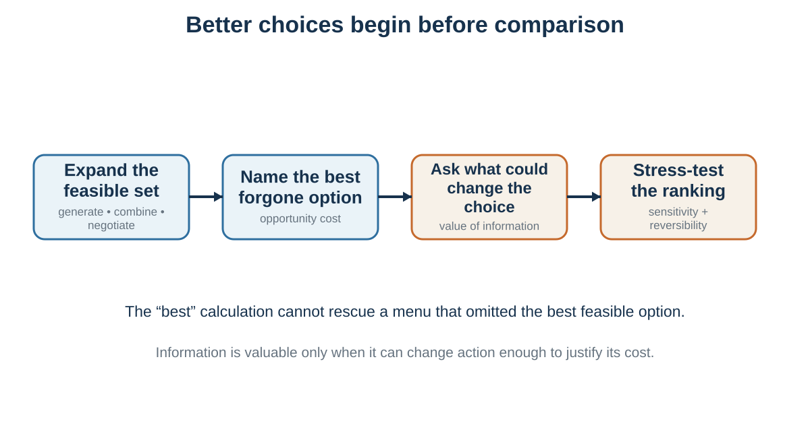

---
aliases:
  - 02-a-rational-benchmark-not-a-portrait.html
---

# Building a Better Decision: Rationality, Alternatives, and Opportunity Cost

*Context can challenge a benchmark, expose what it omitted, and show where the process needs repair*

::: {.callout-note .core-idea icon=false}
## Core Idea

Rational choice gives us a benchmark for coherent comparison, and some contextual changes should not matter if consequences, beliefs, values, and action costs truly remain fixed. But choices can move when a frame changes representation, a decoy changes comparison, a default changes inaction, or a cue changes attention and social meaning. Therefore, the useful task is not to call every movement irrational. It is to identify what entered the process, test what the evidence supports, and redesign alternatives, information, and commitment accordingly.
:::

## Learning goals

- Distinguish a direct challenge to a rational-choice assumption from a variable omitted by a thin model.
- Explain all seven opening examples by locating where context entered the decision process and calibrating the evidence behind each claim.
- Improve a decision by expanding the feasible set, naming opportunity cost, valuing information, and testing sensitivity before commitment.

::: {.callout-note .loop-location icon=false}
## Where this chapter enters the loop

Context can alter **Notice and interpret**, **Construct options**, **Predict**, **Value**, **Choose, commit and act**, and **Observe and learn**. This chapter shows those entry points before turning from descriptive diagnosis to prescriptive repair.
:::

Chapter 1 introduced a thin rational benchmark: feasible alternatives, beliefs about consequences, values over those consequences, constraints, and a coherent comparison rule. If those ingredients were fully specified and held fixed, merely changing a label or adding an option nobody wants should not change which existing option is preferred.

But that “if” carries much of the argument. A frame may change which consequence is mentally represented. A default may change effort, recommendation, responsibility, and what happens when nobody acts. A social cue may alter the perceived situation rather than leave it psychologically unchanged. Some observations directly challenge a specific invariance assumption; others reveal that the benchmark left a causal variable outside the model.

The seven examples below are therefore not seven proofs that people are irrational. They are seven invitations to inspect the decision in the making.

## Seven ways context enters choice {#seven-ways-context-enters-choice}

{#fig-context-enters-choice fig-alt="Seven vertically arranged examples grouped into representation and comparison, the path from intention to action, and social meaning, accessibility, and active motive. Each row states what a thin benchmark holds fixed, what enters the decision process, and the strength of the evidence." width="100%"}

### Representation and comparison {#representation-and-comparison}

#### 1. The same treatment data, framed through survival or mortality

McNeil, Pauker, Sox, and Tversky (1982) presented information about surgery and radiation therapy for lung cancer to ambulatory patients with chronic illnesses, graduate students, and physicians. Different groups received outcome data framed in terms of survival or mortality. The underlying cumulative probabilities and horizons were complementary, yet surgery was relatively more attractive in the survival frame.

This is a comparatively direct challenge to **description invariance**: when the same event, denominator, horizon, and consequences are represented in complementary ways, a thin rational model predicts that preference should not change merely because one description foregrounds living and another foregrounds dying. The study does not show that actual patients signed different consent forms or that every positive frame increases risk taking. Participants imagined the lung-cancer decision, and the result depended on a structured comparison between treatments. [*Framing*](12-framing-when-the-same-facts-become-different-decisions.qmd#equivalent-facts-different-meanings) develops the mechanism and the ethical response: show complementary frames and keep the event, denominator, and time horizon visible.

#### 2. The subscription option nobody chose

A well-known classroom demonstration asked participants to choose among web-only access, print-only access, and print plus web access. The print-only option cost the same as the combined offer and was dominated by it. Ariely (2008) reported that nobody in the classroom group chose the decoy, yet its presence shifted choices toward the combined offer. When the decoy was removed, web-only access became much more popular.

The exact counts are classroom choices reported in a trade book, not customer sales from *The Economist*. The stronger scientific foundation is the attraction-effect literature: adding an asymmetrically dominated alternative can violate **regularity**, because the share choosing an existing target can rise when a new option is introduced (Huber et al., 1982). This is a real challenge to menu-independent preference, but it is not a universal effect with a fixed size. The alternatives, attribute structure, comprehension, task, and population matter. [*When Context Rewrites Comparison*](11-when-context-rewrites-comparison.qmd#the-decoy-changes-the-comparison) contains the full evidence-aligned redraw and shows how a comparison set can reveal value or manufacture it.

### The path from intention to action {#the-path-from-intention-to-action}

#### 3. Organ donation and the consequence of doing nothing

An organ-donation form can require people to opt in, presume participation unless they opt out, or force an active choice. Johnson and Goldstein (2003) found large differences in stated agreement across online experimental defaults. Formal freedom to select either response remained, but the no-action path did not.

This is not a pure invariance test between costless equivalents. A default can change effort, perceived recommendation, normality, responsibility, anticipated regret, and what happens when a person postpones. It can therefore change the decision-relevant environment. The outcome must also be named precisely: stated agreement is not registration; registration is not a recovered organ; and recovered organs are not transplants. A longitudinal analysis of five countries that changed from opt-in to opt-out found no average increase in deceased donation after the policy switch, underscoring the importance of clinical capacity, public trust, family involvement, and implementation (Dallacker et al., 2024). [*Choice Architecture*](40-choice-architecture-the-environment-gets-a-vote.qmd#set-the-starting-point-defaults-and-active-choice) treats a default as one component of a system, not a button that automatically delivers welfare.

#### 4. A right-pointing arrow and a more visible action path

In 2012, Google changed text advertisements on its Display Network by adding a clickable right-pointing arrow while also changing typography, spacing, and layout. The hotel or product being advertised did not become objectively better merely because the arrow appeared, but the route from seeing the offer to clicking it became more salient. Google reported higher clicks after the redesign (Land & Yuan, 2012).

This example does not establish an independent arrow effect or a violation of rational choice. The public report describes a **bundled corporate redesign**: it disclosed neither a separate manipulation of the arrow nor an effect size, profit result, or measure of informed user welfare. Its narrower lesson is still useful. Attention and action affordance belong inside the causal path. An interface can change how easily an intention becomes action even when it does not change the underlying offer. [*Choice Architecture*](40-choice-architecture-the-environment-gets-a-vote.qmd#an-arrow-that-changed-the-action-path) returns to the original teaching redraw and asks which outcome the designer is optimizing.

### Social meaning, accessibility, and active motive {#social-meaning-accessibility-and-active-motive}

#### 5. Eyes above an honesty box

Bateson, Nettle, and Roberts (2006) alternated photographs of eyes and flowers above a price list next to an honesty box in one university coffee room. Across ten weekly observations, contributions per unit of milk consumed were nearly three times higher during eye-image weeks. Prices, beverages, and the payment rule remained the same, but a cue associated with observation may have changed perceived social meaning.

The unit of analysis was a weekly aggregate in one small setting, not an experimentally assigned measure of each person's honesty. More importantly, two later meta-analyses found no reliable overall increase in generosity from artificial surveillance cues (Northover et al., 2017). The scientifically interesting lesson is therefore an **evidence update**, not “add eyes and people become honest.” A narrow self-interest model may have omitted perceived observability, reputation, norms, or social preferences; a richer rational model can include them. [*Cooperation and Social Preferences*](25-cooperation-and-social-preferences-self-interest-is-not-the-only-payoff.qmd#can-an-image-of-eyes-create-reputation) presents the original field result beside the later cumulative evidence.

#### 6. Mars publicity and Mars-bar accessibility

News reports in 1997 linked rising sales of Mars bars to intense publicity around NASA's Pathfinder mission. The candy was named after the company's founder, not the planet, so the story offers an intuitive accessibility hypothesis: repeated references to *Mars* may have made the product name easier to retrieve.

The report is not a controlled study. Mars said sales had been rising for about a year, the available account does not provide a usable time series or comparison group, and other market changes could have contributed (Grant, 1997). Berger and Fitzsimons (2008) later used the story to motivate experiments on environmental cues, accessibility, evaluation, and choice, but those experiments do not retroactively identify the cause of the 1997 sales pattern. The case belongs in the book as a causal-inference exercise: an association can suggest a mechanism without estimating it. [*Accessibility, Familiarity, and Ease*](13-accessibility-familiarity-and-ease.qmd) supplies the experimentally grounded concepts.

#### 7. The same museum, a different active motive

Griskevicius and colleagues (2009) induced fear, romantic desire, or a neutral state with short film clips and then measured responses to advertisements for a museum or Las Vegas. Appeals using behavioral social proof—many people visit—or distinctiveness—stand out from the crowd—changed in effectiveness across the induced states. Fear made behavioral social proof relatively more persuasive and distinctiveness less persuasive; romantic desire produced the opposite pattern in the reported advertising evaluations.

The venue did not change, but neither was the psychological decision held fully constant: the active motivational state and the message changed together. The outcome was a persuasion-rating index, not actual museum attendance. The sample, short induction, and task constrain generalization, and the evolutionary-functional explanation is not uniquely established against every goal-congruence or learned-association account. The experiment nevertheless shows why a cue has no fixed value outside the model through which the audience interprets it. [*Valuation*](05-valuation-how-options-become-worth-choosing.qmd#motives-change-the-decision-landscape) develops state-dependent value; the persuasion chapters later develop audience-model fit.

## What the seven examples establish—and what they do not {#what-the-seven-examples-establish-and-what-they-do-not}

| Example | What the benchmark holds fixed | Evidence status and boundary |
| --- | --- | --- |
| Lung-cancer treatment frame | Outcome data, denominator, and horizon | Controlled framing study; hypothetical treatment choice, not signed consent or universal risk preference. |
| Subscription decoy | The original target options | General attraction effect has experimental support; the exact *Economist* counts are a classroom report, not sales. |
| Organ-donation default | Formal availability of either response | Experimental stated consent shifts; effort and inaction change, and policy outcomes depend on the wider transplant system. |
| Advertising redesign | The advertised offer | Bundled corporate report; arrow, typography, spacing, and layout were not separated. |
| Watched eyes | Prices and honesty-box rule | One small field result; later meta-analyses found no reliable overall generosity effect. |
| Mars publicity | The product | Anecdote with a plausible accessibility account and serious alternative explanations. |
| Museum message | The promoted venue | Context-sensitive experiments on ad ratings; motive, message meaning, and interpretation changed. |
: Seven context-sensitive choices with calibrated evidential status {#tbl-seven-context-examples}

The diagnostic question is not “Was the influence objectively irrelevant?” Ask instead:

1. What did the benchmark hold fixed?
2. Did payoffs, beliefs, effort, or the consequence of inaction actually change?
3. Did the option acquire a different representation or social meaning?
4. Does the evidence identify a cause, or only make one explanation plausible?
5. If the process changed, should it be corrected, supported, disclosed, or left alone?

Together, the cases support a precise conclusion. **Rational choice remains valuable as a normative benchmark, but a thin rational-choice model is not a sufficient descriptive model of actual behavior.** It leaves hidden how information is selected and represented, how options acquire meaning, how inaction is implemented, and how social cues and current motives enter the comparison. That gap justifies descriptive decision science, which explains the process, and prescriptive decision science, which tries to improve it without assuming that every contextual influence is an error.

## From a functional map to a descriptive model

The functional loop in Chapter 1 states the work a decision must somehow accomplish. The seven cases now show why that map needs a descriptive layer. Information does not simply arrive. It is selected, ordered, highlighted, framed, compared, embedded in a social setting, and connected to an action path.

{#fig-behavioral-decision-loop fig-alt="Diagram of decision-making according to behavioral evidence. Presented information enters the decision-maker. Within judgment, prediction and valuation interact with selection and interpretation. External context shapes what is presented, internal state and model shape interpretation, and outcomes generate feedback and learning."}

@fig-behavioral-decision-loop is a teaching synthesis of those causal entry points. **External context** includes frames, defaults, option sets, information format, friction, social cues, and prompts. **Internal state and model** includes attention, cognitive resources, beliefs, goals, affect, memory, identity, and causal assumptions. Prediction and valuation remain analytically distinct, but each can affect which evidence is selected and how it is interpreted. Feedback updates the model only when the evidence is noticed, trusted, and allowed to count.

The distinction among the book's three questions is now concrete:

> **Normative analysis** identifies what should remain invariant. **Descriptive analysis** identifies what actually changed. **Prescriptive analysis** asks whether the process should be corrected, supported, or ethically redesigned.

## From diagnosis to a better decision {#from-diagnosis-to-a-better-decision}

Behavioral evidence does not make rational analysis obsolete. It changes its practical job. A useful benchmark does more than calculate inside a menu. It makes the menu, sacrifice, evidence, values, constraints, and sensitivity of the conclusion visible.

### Construct the feasible set

A decision is coherent only relative to a feasible set. The best imaginable option may be unavailable because of budget, law, time, authority, health, or capacity. Yet constraints should not be accepted too quickly. A deadline may be negotiable. A role can be redesigned. A partnership can create capacity. A pilot can reduce commitment. Good analysis distinguishes real constraints from assumed ones.

Option generation is therefore part of rationality, not a creative extra. Careful comparison cannot rescue a choice set that excludes the best feasible path. Yet more choice is not always better. Choice overload is not universal, but it is more likely when options are complex, preferences are uncertain, the task is difficult, or the decision goal is unclear (Iyengar & Lepper, 2000; Scheibehenne et al., 2010; Chernev et al., 2015). Build a set broad enough to avoid tunnel vision and structured enough to remain actionable.

### Name the opportunity cost

**Opportunity cost** is the value of the best feasible alternative forgone. It is not merely the money paid, and it is not the sum of everything left unchosen. The cost of a two-hour meeting is the best alternative use of those two hours. The cost of accepting one job is the best complete path that the commitment displaces.

Research on opportunity-cost neglect shows that consumers do not always generate the displaced alternative spontaneously; making it explicit can change purchase decisions (Frederick et al., 2009). A practical question is: **If I choose this, what will I no longer be able to do?** A better alternative changes the opportunity cost of every proposal currently on the table.

### Gather information only when it can change action

{#fig-option-information fig-alt="Four-step flow from option generation through opportunity cost and value of information to sensitivity analysis."}

Information has instrumental value when it can improve action enough to justify money, delay, attention, privacy, processing, and strategic exposure. A reference check matters if a plausible result could change a hiring decision, safeguard, or contract term. A pilot matters if it could change scale, design, or the decision to proceed. A diagnostic test has little value for a particular treatment decision when treatment would remain the same regardless of the result.

The practical test requires no false precision: list the possible results, state what action follows from each, and ask whether any branch differs. If no plausible answer changes action, the request may serve reassurance, curiosity, politics, or delay rather than this decision.

| Question or test | Result that could change action | Likely decision value |
| --- | --- | --- |
| Reference check on role-critical behavior | Credible evidence changes the ranking, safeguards, or contract terms. | Potentially high when the choice is close and the source is informative. |
| Small pilot before an irreversible launch | A pre-stated threshold triggers scale-up, revision, delay, or stopping. | Often high when the pilot is cheap, representative, and tied to a rule. |
| Diagnostic test when treatment would be identical either way | No plausible result changes treatment. | Low for this treatment decision, though it may still serve prognosis or surveillance. |
| Negotiation question about timing | A real difference reveals a feasible trade or package. | Potentially high when the answer is credible and contractible. |
: A decision-branch test for information {#tbl-information-decision-branches}

### Separate predictions from values, then test sensitivity

Important decisions have multiple objectives. A job involves income, learning, autonomy, health, location, mission, relationships, and future options. A decision table can separate **predictions** about performance on each objective from **values** about how much those outcomes matter (Keeney & Raiffa, 1976).

The table is a conversation made inspectable, not a machine for discovering the correct answer. Avoid double-counting related attributes. Show uncertainty. Treat weights as trade-offs over defined ranges rather than declarations that “health matters 30.” Then vary the probabilities, values, weights, and constraints that could reverse the ranking. If one option remains best across plausible ranges, the recommendation is robust. If small changes reverse it, the decision is fragile and may justify more information, a pilot, a reversible commitment, or explicit disagreement.

### Use proportionate analysis

Bounded rationality recognizes that search, attention, time, memory, and computation are scarce (Simon, 1955, 1956). People often **satisfice**: they search until an option meets an aspiration level rather than proving global optimality. That can be procedurally rational when further search costs more than it is likely to improve the decision.

The right amount of analysis is itself a decision. Low-stakes, familiar, reversible choices can use routines or simple rules. High-stakes, novel, irreversible, strategically interdependent, or low-feedback choices deserve more structure. Rationality should guide proportionate deliberation, not turn life into continuous calculation. [*Fast and Frugal Thinking*](08-fast-and-frugal-thinking.qmd) asks when compressed judgment is well trained; the risk chapter supplies the expected-utility detail that is needed only when uncertain consequences must be combined.

## Worked decision: from two offers to a decision architecture

Consider a choice between a prestigious consulting firm and a smaller sustainability start-up. The initial menu contains two offers, but option construction adds negotiation, delayed commitment, further search, and a reversible trial. Predictions concern workload, organizational survival, learning, advancement, and future options. Values concern income, autonomy, mission, health, family time, and tolerance for downside. Constraints include finances, location, visa conditions, and deadlines.

The student names the best feasible alternative forgone for each commitment. One further conversation has value only if a plausible answer could change the ranking, contract, or decision to wait. Sensitivity analysis reveals whether the result depends mainly on the start-up's survival, consulting workload, or the value placed on early learning. The output is not a number pretending to be objective. It is a recommendation together with the assumptions that make it preferred, the evidence that would reverse it, and the review point after action.

## Practice Lab

First classify the seven examples in @tbl-seven-context-examples. For each, state whether the strongest interpretation is a challenge to invariance, a change in effort or inaction, an omitted belief or value, a change in social meaning, or an unresolved causal story. Then prepare one page for a consequential decision of your own: expand the feasible options, name the best alternative forgone, separate predictions from values, specify one sensitivity test, and list three possible information results with the action each would trigger. Finish with one normative question, one descriptive risk, and one prescriptive redesign.

## Take it forward

- **Use this when:** someone calls a contextual influence “irrational” without specifying which assumption or causal path changed.
- **Do not infer:** that every preference reversal is a bias, that a contextual factor is irrelevant merely because it leaves the product unchanged, or that an intervention is good because it moves behavior.
- **Try this next:** ask what the benchmark held fixed, what entered the process, and what evidence could change the action.

## References cited in this chapter

::: {.reference}
Ariely, D. (2008). *Predictably irrational: The hidden forces that shape our decisions*. HarperCollins.
:::

::: {.reference}
Bateson, M., Nettle, D., & Roberts, G. (2006). Cues of being watched enhance cooperation in a real-world setting. *Biology Letters, 2*(3), 412–414. https://doi.org/10.1098/rsbl.2006.0509
:::

::: {.reference}
Berger, J., & Fitzsimons, G. (2008). Dogs on the street, Pumas on your feet: How cues in the environment influence product evaluation and choice. *Journal of Marketing Research, 45*(1), 1–14. https://doi.org/10.1509/jmkr.45.1.1
:::

::: {.reference}
Chernev, A., Böckenholt, U., & Goodman, J. (2015). Choice overload: A conceptual review and meta-analysis. *Journal of Consumer Psychology, 25*(2), 333–358.
:::

::: {.reference}
Dallacker, M., Appelius, L., Brandmaier, A. M., Morais, A. S., & Hertwig, R. (2024). Opt-out defaults do not increase organ donation rates. *Public Health, 236*, 436–440. https://doi.org/10.1016/j.puhe.2024.08.009
:::

::: {.reference}
Frederick, S., Novemsky, N., Wang, J., Dhar, R., & Nowlis, S. (2009). Opportunity cost neglect. *Journal of Consumer Research, 36*(4), 553–561.
:::

::: {.reference}
Grant, T. (1997, July 21). On a Mars mission. *The Washington Post*.
:::

::: {.reference}
Griskevicius, V., Goldstein, N. J., Mortensen, C. R., Sundie, J. M., Cialdini, R. B., & Kenrick, D. T. (2009). Fear and loving in Las Vegas: Evolution, emotion, and persuasion. *Journal of Marketing Research, 46*(3), 384–395.
:::

::: {.reference}
Huber, J., Payne, J. W., & Puto, C. (1982). Adding asymmetrically dominated alternatives: Violations of regularity and the similarity hypothesis. *Journal of Consumer Research, 9*(1), 90–98.
:::

::: {.reference}
Iyengar, S. S., & Lepper, M. R. (2000). When choice is demotivating: Can one desire too much of a good thing? *Journal of Personality and Social Psychology, 79*(6), 995–1006.
:::

::: {.reference}
Johnson, E. J., & Goldstein, D. G. (2003). Do defaults save lives? *Science, 302*(5649), 1338–1339.
:::

::: {.reference}
Keeney, R. L., & Raiffa, H. (1976). *Decisions with multiple objectives: Preferences and value tradeoffs*. Wiley.
:::

::: {.reference}
Land, J., & Yuan, S. (2012, December 3). Enhancing text ads on the Google Display Network. *Inside AdSense*. https://adsense.googleblog.com/2012/12/enhancing-text-ads-on-google-display.html
:::

::: {.reference}
McNeil, B. J., Pauker, S. G., Sox, H. C., Jr., & Tversky, A. (1982). On the elicitation of preferences for alternative therapies. *New England Journal of Medicine, 306*(21), 1259–1262.
:::

::: {.reference}
Northover, S. B., Pedersen, W. C., Cohen, A. B., & Andrews, P. W. (2017). Artificial surveillance cues do not increase generosity: Two meta-analyses. *Evolution and Human Behavior, 38*(1), 144–153. https://doi.org/10.1016/j.evolhumbehav.2016.07.001
:::

::: {.reference}
Scheibehenne, B., Greifeneder, R., & Todd, P. M. (2010). Can there ever be too many options? A meta-analytic review of choice overload. *Journal of Consumer Research, 37*(3), 409–425.
:::

::: {.reference}
Simon, H. A. (1955). A behavioral model of rational choice. *The Quarterly Journal of Economics, 69*(1), 99–118.
:::

::: {.reference}
Simon, H. A. (1956). Rational choice and the structure of the environment. *Psychological Review, 63*(2), 129–138.
:::
