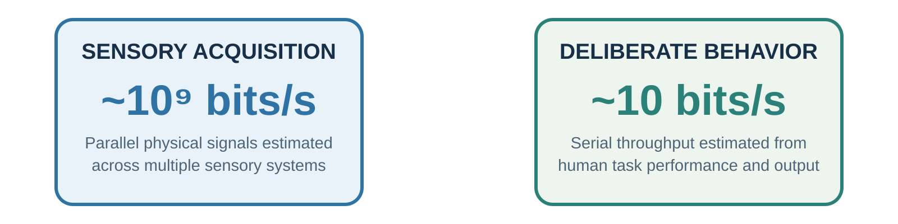
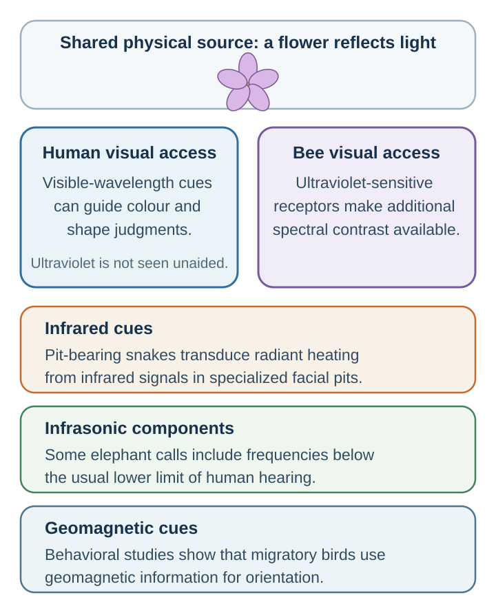

---
aliases:
  - 05-attention-is-the-gatekeeper-of-evidence.html
---

# Attention: What Becomes Evidence?

*What is not selected may fail to enter explicit judgment*

::: {.callout-note .core-idea icon=false}
## Core Idea

Before evidence can be interpreted or weighed, some of it must be selected for attention. But attention is scarce and selective: important changes can escape focal awareness, even though unattended information may still receive limited processing. Therefore, this chapter treats attention as the first gate in the decision loop and develops tools for identifying what is missed, what captures the gate, and how an information environment can make neglected evidence usable.
:::

## Learning goals

- Explain inattentional blindness and change blindness.
- Distinguish top-down selection from bottom-up capture.
- Redesign an information environment so that neglected evidence can enter judgment.

::: {.callout-note .loop-location icon=false}
## Where this chapter enters the loop

Attention is the loop's first gate: **Notice**. It strongly shapes which signals become available for explicit interpretation and deliberation, while some unattended or unreported information may still receive limited processing.
:::

::: {.callout-caution .the-invisible-gorilla-in-expert-search icon=false}
## The invisible gorilla in expert search

Radiologists searching lung scans for nodules sometimes failed to report a large inserted gorilla, even when their gaze reached its location. Expertise makes task-relevant patterns more visible, but a strong search template can also make off-template events psychologically disappear (Drew et al., 2013).
:::

## Inattentional blindness: what attention leaves out

Imagine watching a video of people passing a basketball. Your task is to count the number of passes made by the players in white shirts. You focus carefully. The players move, pass, cross paths, and your attention tracks the ball. Halfway through, a person in a gorilla suit walks into the scene, turns toward the camera, beats their chest, and walks away. Would you notice? Most people believe they would. Many do not.

In the famous invisible gorilla study, Simons and Chabris (1999) found that many participants failed to notice the gorilla when their attention was occupied by the counting task. The gorilla was not hidden. It was visible in the center of the scene. The problem was not the eyes. The problem was attention.

::: {.callout-note .watch-and-test icon=false}
## Watch and test: count first, explain second

Commit to a counting rule before you [open the attention demonstration](https://www.youtube.com/watch?v=Wie4v2YCPQY). Do not read ahead while watching. Then compare what the task made easy to notice with what it made easy to miss. A [second version of the demonstration](https://youtu.be/vBPG_OBgTWg) can be used to test whether knowing the lesson removes the bottleneck—or merely changes the target you search for.
:::

This phenomenon is called inattentional blindness: failing to notice an unexpected object or event because attention is engaged elsewhere. The term is closely associated with work by Mack and Rock (1998), who showed that people can miss clearly visible stimuli when they are not attending to them.

Inattentional blindness is not rare, and it is not limited to novices. Drew, Võ, and Wolfe (2013) asked radiologists to inspect lung scans for nodules. An image of a gorilla, many times larger than the average nodule, was inserted into the scan. Many radiologists failed to report it, even though eye-tracking showed that some looked directly at the location. Expertise did not eliminate attentional limits. When attention is tuned for one kind of target, other information can disappear from awareness.

This is not because people are stupid. It is because attention is selective.

## Top-down goals and bottom-up capture

Attention is often described as a spotlight, but that metaphor can mislead. A spotlight suggests that everything inside the beam is seen clearly and everything outside is dark. Attention is more complicated. It selects, enhances, suppresses, prioritizes, and organizes information according to goals, salience, expectations, and task demands. William James (1890) famously described attention as the mind taking possession of one object or train of thought among several possible ones. Modern cognitive psychology has refined this idea through filter models, capacity models, and neural competition models (Broadbent, 1958; Desimone & Duncan, 1995; Kahneman, 1973; Treisman, 1964).

Some attention is top-down: guided by goals, plans, and expectations. If you are searching for your friend in a crowd, your mind is tuned to face shape, height, clothing, or gait. If a radiologist is searching for nodules, the visual system is tuned to nodules. If a negotiator is searching for price concessions, price becomes more visible than timing, warranty, risk-sharing, or relationship value.

Some attention is bottom-up: captured by salient events, such as sudden movement, loud sounds, bright colors, threat cues, novelty, or emotional stimuli. A phone notification, a flashing advertisement, a crying baby, a sharp tone, or an angry face can capture attention before conscious choice. Corbetta and Shulman (2002) distinguish between networks involved in goal-directed attention and those involved in stimulus-driven reorienting. In real life, attention reflects the interaction between what we are trying to do and what the world pulls from us.

This is why attention is a decision problem at the beginning of the process, before choice becomes visible. What receives attention becomes evidence. What does not receive attention may never enter judgment.

## Attention under divided demand

Attention is also limited. The adult human brain consumes a large share of the body’s energy relative to its weight, and neural processing is metabolically expensive (Attwell & Laughlin, 2001; Raichle & Gusnard, 2002). The brain cannot process everything in full detail. Cognitive capacity is constrained by attention, working memory, and control systems (Baddeley, 1992; Cowan, 2001; Marois & Ivanoff, 2005). This means that attention is a scarce resource. Spending it in one place means not spending it elsewhere.

The scale of the bottleneck is easy to underestimate. The adult brain is roughly 2% of body mass but accounts for about 20% of resting energy use. Difficult tasks do not multiply whole-brain consumption; they mainly redistribute activity within a system that is already working continuously. At the information level, Zheng and Meister (2025) estimate that human sensory systems collectively acquire physical signals on the order of $10^9$ bits per second, while deliberate behavioral throughput is roughly 10 bits per second. These are broad order-of-magnitude estimates for **unlike channels**. They dramatize a large architectural contrast, but they do not measure how many sensory bits attention discards, identify attention as the sole mediator, or license subtracting one rate from the other as “lost information.” Evidence that attention prioritizes information comes from the attention literature discussed above, not from the numerical contrast alone.

{#fig-attention-bottleneck fig-alt="Two separate cards compare sensory acquisition at approximately one billion bits per second with deliberate behavioral throughput at approximately ten bits per second. A caution between them says they are unlike measurements and should not be subtracted as lost bits. A separate lower panel summarizes what attention research supports."}

This has practical consequences.

Students who divide attention between class and digital distractions often learn less. Junco and Cotten (2012) found that multitasking with technology was associated with poorer academic performance. Sana, Weston, and Cepeda (2013) found that laptop multitasking harmed not only the multitasker’s learning but also the learning of nearby students who could see the screen. Gingerich and Lineweaver (2014) found that media multitasking during class was associated with poorer retention. Attention is not infinitely divisible.

Drivers using phones suffer similar limits. Strayer and Johnston (2001) showed that cell phone conversations can impair driving performance, and Strayer, Drews, and Johnston (2003) found that hands-free conversation does not eliminate the attentional cost. The problem is not merely holding a device. It is the diversion of attention from the driving environment.

More information on one display does not guarantee more information in judgment. A head-up display can keep instrument data in a pilot's line of sight and still narrow attention so strongly that another visible event is missed. Integrating data spatially is therefore not the same as integrating attention psychologically. The design question is not only “Is the information present?” but “What search task does the display make dominant, and what anomaly could that task hide?”

Organizations also suffer from attentional limits. A leadership team focused on quarterly revenue may miss employee burnout. A product team focused on technical features may miss user confusion. A board focused on legal compliance may miss reputational risk. A negotiator focused on price may miss interests that could create value. A hiring committee focused on confidence may miss reliability.

Attention is a gatekeeper of explicit judgment, not the sole route by which information can affect the mind. If decision-relevant information is not made available for deliberate use, later reasoning may be careful but still misguided.

## Change blindness

Change blindness shows a related problem. People often fail to notice changes in a scene when the change occurs during a brief interruption, eye movement, or visual disruption. Rensink, O’Regan, and Clark (1997) demonstrated that large changes can go unnoticed when attention is not directed to the changing feature. Simons and Levin (1998) famously showed that people giving directions to a stranger often failed to notice when the stranger was replaced by a different person during a brief interruption.

::: {.callout-note .watch-and-test icon=false}
## Watch and test: what did your model preserve?

[Open the change-blindness demonstration](https://www.youtube.com/watch?v=GOF-saZ1XSQ). Before replaying it, write down the details you believe remained stable. On the second viewing, track one category only—people, objects, colour, or position. The contrast between the two viewings shows why “look more carefully” is weaker advice than assigning a search target.
:::

This tells us something unsettling: we are not general-purpose change detectors. We notice changes that are attended to, meaningful, expected, or salient. Much else can pass by unseen.

The lesson for decision-making is direct. Asking people to “look carefully” is not enough. Attention must be designed. In high-stakes environments, decision-makers need checklists, role assignments, structured observation, independent review, and deliberate attention shifts. Pilots, surgeons, auditors, negotiators, and managers cannot rely only on natural noticing. The mind sees what it is set up to see.

## Every organism inhabits a partial world

{#fig-attention-filter fig-alt="Many information streams compete for selection. Goals, salience, expectations, and load influence which signals become consciously reportable and deliberately usable, while a boundary notes that unselected information may still receive limited processing."}

Attention filters information, but before attention can filter anything, the senses must first sample the world. That sample is already incomplete.

Human beings do not perceive the world as it is. We perceive the world as human sensory systems make it available. Our eyes detect only a narrow band of electromagnetic radiation. Our ears detect only a limited range of sound frequencies. Our skin detects pressure, temperature, pain, and vibration only within certain limits. Our noses and tongues sample chemical information in ways that are modest compared with many other animals.

Jakob von Uexküll introduced the idea of the Umwelt: each organism lives in its own perceptual world, shaped by the sensory and action systems that matter for its survival (von Uexküll, 1934/2010). A tick, a bat, a bee, a dog, an elephant, and a human inhabit the same physical environment but not the same experienced world. Thomas Nagel (1974) made a related point in his famous essay on bats: even if we know the physical facts about echolocation, the subjective world of a bat is not simply the human world plus sonar.

Different species detect different kinds of information. Bees have ultraviolet-sensitive colour vision, so flower spectra can provide contrasts that humans do not see unaided (Chittka & Menzel, 1992). Pit-bearing snakes transduce radiant heating from infrared signals in specialized facial pits (Gracheva et al., 2010). Some elephant calls contain infrasonic components (Payne et al., 1986), and behavioral studies show that migratory birds use geomagnetic cues for orientation (Wiltschko & Wiltschko, 2005). These findings establish detectable information and behavior; they do not tell us what those cues feel like subjectively.

{#fig-sensory-windows fig-alt="A shared flower supplies reflected light, but human and bee visual systems have access to different spectral cues. Three vertically arranged examples show infrared detection by pit-bearing snakes, infrasonic components in elephant calls, and geomagnetic orientation cues used by migratory birds. A boundary note says evidence for detection and behavior does not reveal subjective experience and that sensory access is not the same as attention." style="width:100%;min-width:0;max-width:100%;max-height:none;height:auto;"}

The point is not merely biological curiosity. It is epistemological humility. What feels like “the world” to us is a species-specific sample.

Even within human perception, the senses are incomplete. We do not see ultraviolet light. We do not hear ultrasound. We do not directly sense magnetic fields. We do not perceive microscopic organisms without instruments. We do not experience carbon monoxide directly. We do not see radio waves, Wi-Fi signals, or most of the electromagnetic spectrum. We perceive a narrow slice of reality, then build a world from it.

This matters for decision-making because people often confuse available information with complete information. If something is not visible, audible, emotionally vivid, or socially salient, it may not feel real. Climate risk, compound interest, long-term health effects, structural inequality, statistical base rates, cybersecurity vulnerabilities, and slow reputation damage are all difficult because they are not always directly perceptible. They require instruments, models, data, and imagination.

Scientific instruments extend perception. Telescopes, microscopes, X-rays, MRI, satellite imaging, statistical dashboards, financial statements, user analytics, and epidemiological models all help humans perceive what the unaided senses cannot. But instruments do not interpret themselves. People still must attend to them, understand them, and integrate them into judgment.

This creates a recurring decision problem: the most important information is often not the most perceptually available.

A manager can see a confident presenter but not long-term reliability. A doctor can hear a patient’s story but may need lab tests to reveal hidden disease. An investor can see a rising stock price but not necessarily fundamental value. A teacher can see student attendance but not attention. A government can see visible costs of regulation but not invisible harms prevented.

The senses provide evidence, not reality itself. Good decision-making often requires asking: what information is missing because humans are not built to perceive it directly?

## Designing better attention

If attention and perception shape judgment, then better decisions require better attentional design.

The first step is to reduce unnecessary distraction. In classrooms, meetings, negotiations, and analytical work, attention is often the limiting resource. Phones, notifications, open laptops, side conversations, and multitasking do not merely add small interruptions; they change what information enters working memory. A student cannot learn material that attention never processes. A team cannot solve a problem while half its members are mentally elsewhere.

The second step is to assign attention deliberately. In complex decisions, one person should not be responsible for noticing everything. Teams can assign roles: one person tracks evidence, one tracks risks, one tracks stakeholder concerns, one tracks implementation, one tracks assumptions, one watches for missing alternatives. Aviation, medicine, and emergency response use checklists and role structures precisely because unaided attention is unreliable (Gawande, 2009).

The third step is to change the question. Attention follows questions. If a hiring committee asks, “Who impressed us most?” attention goes to charisma and confidence. If it asks, “What evidence predicts performance in this role?” attention shifts to job-relevant criteria. If a negotiator asks, “How do I get the best price?” attention goes to claiming value. If the negotiator asks, “What differences in priorities could create mutual gain?” attention shifts to interests, timing, risk, and trade-offs.

The fourth step is to make the invisible visible. Many important variables are not naturally salient: base rates, opportunity costs, long-term effects, silent stakeholders, delayed harms, and counterfactual outcomes. Decision tools should bring these into view. A dashboard can show long-term retention rather than only monthly sales. A hiring rubric can show evidence rather than impressions. A medical decision aid can show absolute risk rather than only relative risk. A negotiation preparation sheet can show interests, alternatives, and constraints.

The fifth step is to create friction for premature closure. Once the mind settles on an interpretation, it tends to see supporting evidence. Decision processes should include moments for alternative explanations. In medicine, diagnostic timeouts can ask, “What else could this be?” In organizations, premortems can ask, “Imagine this failed—why?” (Klein, 2007). In forecasting, outside-view prompts can ask, “What happened in similar cases?” In negotiations, perspective-taking can ask, “What problem is the other side trying to solve?”

The sixth step is to improve feedback. Attention improves with feedback only when feedback is clear, timely, and connected to the original judgment. A decision journal can record what was predicted before the outcome. Later, decision-makers can compare prediction with result. This helps distinguish skill from luck and improves calibration.

The seventh step is to design environments that guide automatic attention. If healthy food is visible and junk food hidden, eating changes without constant willpower. If dashboards highlight leading indicators rather than vanity metrics, managers notice earlier. If meeting agendas begin with the decision to be made and the assumptions to test, discussion becomes more focused. If forms display consequences clearly, users make more informed choices. Choice architecture begins with attention architecture.

Attention is not just a personal skill. It is a design problem.

### Attention architecture: the organization chooses what can be seen

Meetings and dashboards allocate attention before any participant begins to reason. Five design choices deserve an explicit audit:

| Design choice | What it makes visible | Failure when unmanaged |
| --- | --- | --- |
| Agenda | Which issue counts as the decision problem | The team optimizes the wrong problem. |
| Metrics | What is counted and compared | Important unmeasured consequences disappear. |
| Roles | What each person is expected and permitted to notice | Dissent, anomalies, and stakeholder harms remain silent. |
| Time pressure | Which cues can win quickly | Emotion and salience outrun slower evidence. |
| Representation | Which trade-offs are easy to inspect together | Delayed, probabilistic, or cross-functional effects remain abstract. |
: Attention architecture before deliberation {#tbl-attention-architecture}

The redesign is concrete: state the decision question, display leading and lagging indicators, assign an anomaly or dissent role, protect a second pass, and put competing consequences in the same representation. These changes do not guarantee good judgment. They make missing evidence easier to detect.

Suppose a project meeting begins with one question: “How do we cut costs?” The team notices supplier prices, headcount, and time spent. Customer trust, safety margin, learning value, and implementation risk become the meeting’s invisible gorilla. The question is not neutral; it defines the search target. A redesigned agenda might ask first, “Which value must this project preserve?” and then examine cost reductions alongside service, risk, learning, and implementation consequences.

::: {.callout-note .watch-and-test icon=false}
## Watch and test: directed attention in a story

In this [short scene from *Focus*](https://youtu.be/E26V363_k8o), track how one person deliberately constructs the other person’s field of attention. After viewing, list the cues that were present, the cues that became psychologically prominent, and the decision that prominence supported. The clip is linked for analysis; no film frame is reproduced here.
:::

::: {.callout-caution .evidence-and-boundary-conditions icon=false}
## Mental effort is not a simple energy meter

The brain's high energy use does not mean difficult thinking consumes a huge extra amount of whole-brain energy. Task demands mainly redistribute activity within a system that is already metabolically active.
:::

| Failure | Mechanism | Design response |
| --- | --- | --- |
| Unexpected event is missed | Search is tuned to another target. | Assign an anomaly role or run a deliberate second scan. |
| Important information never enters discussion | Agenda, metric, or hierarchy filters attention. | Change the question, representation, or speaking order. |
| Divided attention weakens encoding | Working memory is consumed by task switching. | Protect focused intervals and remove avoidable digital capture. |
| Team closes too early | A coherent interpretation suppresses alternatives. | Use a diagnostic timeout, premortem, or independent review. |
: Attention failures and design responses {#tbl-05-1}

## Practice Lab

Audit one consequential meeting, class, dashboard, or screening process. Produce a one-page **attention map** with four columns: the decision task, what reliably captured attention, what important evidence was easy to miss, and one redesign that would make the neglected signal visible without making everything equally salient. State how you would test whether the redesign improved detection rather than merely shifting the blind spot.

## Take it forward

- **Use this when:** a decision depends on evidence that is present but easy to overlook.
- **Do not infer:** that a missed signal proves carelessness, incompetence, or lack of concern; the task may have directed attention elsewhere.
- **Try this next:** collect one independent observation before discussion and redesign one agenda, display, or role so that the missing evidence has a clear route into judgment.

## References cited in this chapter

::: {.reference}
Attwell, D., & Laughlin, S. B. (2001). An energy budget for signaling in the grey matter of the brain. Journal of Cerebral Blood Flow & Metabolism, 21(10), 1133–1145.
:::

::: {.reference}
Baddeley, A. (1992). Working memory. Science, 255(5044), 556–559.
:::

::: {.reference}
Broadbent, D. E. (1958). Perception and communication. Pergamon Press.
:::

::: {.reference}
Chittka, L., & Menzel, R. (1992). The evolutionary adaptation of flower colours and the insect pollinators’ colour vision. Journal of Comparative Physiology A, 171(2), 171–181.
:::

::: {.reference}
Corbetta, M., & Shulman, G. L. (2002). Control of goal-directed and stimulus-driven attention in the brain. Nature Reviews Neuroscience, 3(3), 201–215.
:::

::: {.reference}
Cowan, N. (2001). The magical number 4 in short-term memory: A reconsideration of mental storage capacity. Behavioral and Brain Sciences, 24(1), 87–114.
:::

::: {.reference}
Desimone, R., & Duncan, J. (1995). Neural mechanisms of selective visual attention. Annual Review of Neuroscience, 18, 193–222.
:::

::: {.reference}
Drew, T., Võ, M. L.-H., & Wolfe, J. M. (2013). The invisible gorilla strikes again: Sustained inattentional blindness in expert observers. Psychological Science, 24(9), 1848–1853.
:::

::: {.reference}
Gawande, A. (2009). The checklist manifesto: How to get things right. Metropolitan Books.
:::

::: {.reference}
Gracheva, E. O., Ingolia, N. T., Kelly, Y. M., Cordero-Morales, J. F., Hollopeter, G., Chesler, A. T., Sánchez, E. E., Perez, J. C., Weissman, J. S., & Julius, D. (2010). Molecular basis of infrared detection by snakes. *Nature, 464*(7291), 1006–1011. https://doi.org/10.1038/nature08943
:::

::: {.reference}
Gingerich, A. C., & Lineweaver, T. T. (2014). OMG! Texting in class = U fail :( Empirical evidence that text messaging during class disrupts comprehension. Teaching of Psychology, 41(1), 44–51.
:::

::: {.reference}
James, W. (1890). The principles of psychology. Henry Holt.
:::

::: {.reference}
Junco, R., & Cotten, S. R. (2012). No A 4 U: The relationship between multitasking and academic performance. Computers & Education, 59(2), 505–514.
:::

::: {.reference}
Kahneman, D. (1973). Attention and effort. Prentice-Hall.
:::

::: {.reference}
Klein, G. (2007). Performing a project premortem. Harvard Business Review, 85(9), 18–19.
:::

::: {.reference}
Mack, A., & Rock, I. (1998). Inattentional blindness. MIT Press.
:::

::: {.reference}
Marois, R., & Ivanoff, J. (2005). Capacity limits of information processing in the brain. Trends in Cognitive Sciences, 9(6), 296–305.
:::

::: {.reference}
Mudrik, L., & Deouell, L. Y. (2022). Neuroscientific evidence for processing without awareness. *Annual Review of Neuroscience, 45*, 403–423. https://doi.org/10.1146/annurev-neuro-110920-033151
:::

::: {.reference}
Nagel, T. (1974). What is it like to be a bat? The Philosophical Review, 83(4), 435–450.
:::

::: {.reference}
Payne, K. B., Langbauer, W. R., Jr., & Thomas, E. M. (1986). Infrasonic calls of the Asian elephant (*Elephas maximus*). *Behavioral Ecology and Sociobiology, 18*(4), 297–301. https://doi.org/10.1007/BF00300007
:::

::: {.reference}
Raichle, M. E., & Gusnard, D. A. (2002). Appraising the brain’s energy budget. Proceedings of the National Academy of Sciences, 99(16), 10237–10239.
:::

::: {.reference}
Rensink, R. A., O’Regan, J. K., & Clark, J. J. (1997). To see or not to see: The need for attention to perceive changes in scenes. Psychological Science, 8(5), 368–373.
:::

::: {.reference}
Sana, F., Weston, T., & Cepeda, N. J. (2013). Laptop multitasking hinders classroom learning for both users and nearby peers. Computers & Education, 62, 24–31.
:::

::: {.reference}
Simons, D. J., & Chabris, C. F. (1999). Gorillas in our midst: Sustained inattentional blindness for dynamic events. Perception, 28(9), 1059–1074.
:::

::: {.reference}
Simons, D. J., & Levin, D. T. (1998). Failure to detect changes to people during a real-world interaction. Psychonomic Bulletin & Review, 5(4), 644–649.
:::

::: {.reference}
Strayer, D. L., Drews, F. A., & Johnston, W. A. (2003). Cell phone-induced failures of visual attention during simulated driving. Journal of Experimental Psychology: Applied, 9(1), 23–32.
:::

::: {.reference}
Strayer, D. L., & Johnston, W. A. (2001). Driven to distraction: Dual-task studies of simulated driving and conversing on a cellular telephone. Psychological Science, 12(6), 462–466.
:::

::: {.reference}
Treisman, A. M. (1964). Monitoring and storage of irrelevant messages in selective attention. Journal of Verbal Learning and Verbal Behavior, 3(6), 449–459.
:::

::: {.reference}
von Uexküll, J. (2010). A foray into the worlds of animals and humans: With a theory of meaning (J. D. O’Neil, Trans.). University of Minnesota Press. (Original work published 1934)
:::

::: {.reference}
Wiltschko, R., & Wiltschko, W. (2005). Magnetic orientation and magnetoreception in birds and other animals. Journal of Comparative Physiology A, 191(8), 675–693.
:::

::: {.reference}
Zheng, J., & Meister, M. (2025). The unbearable slowness of being: Why do we live at 10 bits/s? Neuron, 113(2), 192–204.
:::
