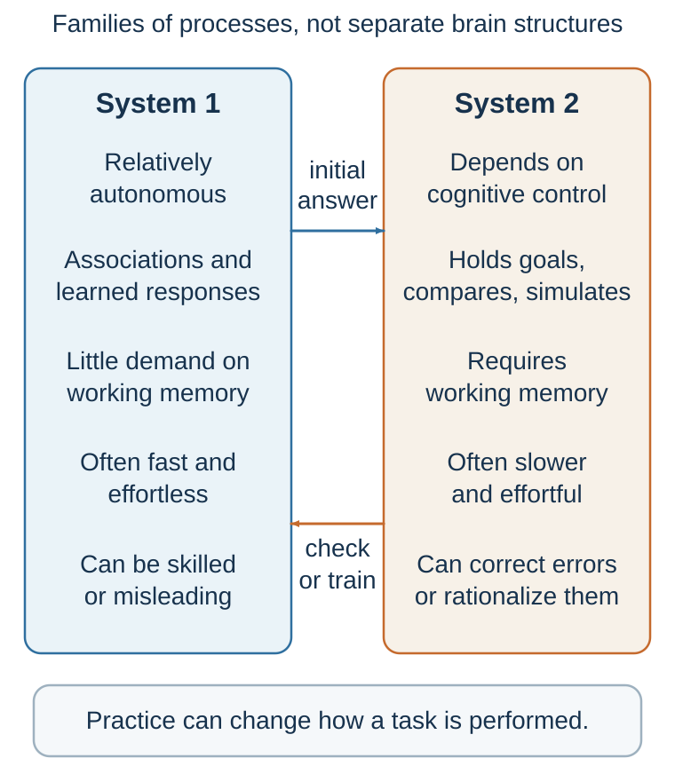

# Fast and Frugal Thinking

*A shortcut is useful when its cue fits the environment—and dangerous when fluency replaces the target question*

::: {.callout-note .core-idea icon=false}
## Core Idea

Fast cognition supplies impressions, learned patterns, and workable shortcuts. Reflection can inspect or redesign them, but neither speed nor effort guarantees accuracy; cue validity and feedback do.
:::

## Learning goals

- Explain automatic and reflective processing without treating them as literal brain systems.
- Diagnose a heuristic through its target question, cue, ecological fit, and feedback.
- Decide when intuition deserves trust and when a structured check is warranted.

::: {.callout-note .loop-location icon=false}
## Where this chapter enters the loop

Fast and frugal processes can operate across **Notice, Interpret, Predict, Value,** and **Choose**. The key question is not whether a judgment was fast, but whether the cue that carried it was valid in this environment.
:::

::: {.callout-note .watch-and-test icon=false}
## Watch and test: when the question supplies the answer

Before watching, write down what you think the demonstrator will reveal. Then [open the short “mind trick” demonstration](https://www.youtube.com/watch?v=43Mw-f6vIbo). Afterward, identify the cue that produced the first answer and the extra check that would have exposed it. The point is not that the quick answer is foolish; it is that the mind can fluently solve a question slightly different from the one asked.
:::

Consider this problem:

A bat and a ball cost $1.10 in total. The bat costs $1.00 more than the ball. How much does the ball cost?

For many people, the answer appears almost immediately: 10 cents.

It feels right. It is simple. It is available. The total is $1.10, the difference is $1.00, so 10 cents seems natural.

But it is wrong.

If the ball costs 10 cents, the bat costs $1.10, and the total is $1.20. The correct answer is 5 cents: the ball costs 5 cents, the bat costs $1.05, and the total is $1.10.

This is one of the classic items from Frederick’s Cognitive Reflection Test (Frederick, 2005). Its power is not that the math is difficult. The power is that an incorrect answer comes to mind quickly and fluently. To answer correctly, you must notice that your first answer may be wrong, inhibit it, and engage in a slower check.

The problem reveals two modes of thinking.

Fast thinking generates an immediate answer. Slow thinking can inspect that answer. The first answer is not random. It follows a simple pattern and feels coherent. But coherence is not the same as correctness. The mind often prefers an answer that comes easily to an answer that requires effort.

The Cognitive Reflection Test predicts more than performance on puzzles. Frederick (2005) found that people who performed better on these problems also tended to differ in some economic preferences, including patience and risk attitudes. Later research showed that cognitive reflection is related to the tendency to question intuitive answers and engage in analytic reasoning (Toplak et al., 2011). The test is not a complete measure of intelligence or rationality, but it captures an important habit: the ability to distrust an answer that feels obvious.

Everyday life contains many versions of the bat-and-ball problem. A confident candidate feels competent. A familiar claim feels true. A vivid risk feels common. A higher price feels like higher quality. A popular product feels like a good product. A simple story feels like a complete explanation. In each case, the first impression may contain useful information, but it may also be incomplete or wrong.

The first lesson of two-system thinking is therefore not “intuition is bad.” The lesson is subtler:

The mind often answers an easier question before we notice the harder one.

Instead of asking, “What is the correct calculation?” the mind asks, “What answer feels compatible with the numbers?” Instead of asking, “How predictive is this interview?” the mind asks, “How impressive does this candidate feel?” Instead of asking, “What is the base rate?” the mind asks, “How easily can I imagine this outcome?”

Fast thinking gives us answers. Reflective thinking asks whether those answers deserve trust.

## From a quick answer to a heuristic

A **heuristic** is a simplifying process that uses limited information to reach a workable judgment or action. It is not an error by definition. Under bounded time, attention, and computation, a simple cue can be more usable—and sometimes more accurate—than a complex model fitted to noise (Gigerenzer & Gaissmaier, 2011).

{#fig-heuristic-substitution fig-alt="A target question is replaced by an easier question and then produces a quick answer."}

The bat-and-ball response illustrates **attribute substitution**: the mind answers an easier question that resembles the target. The same substitution occurs when “How likely is this risk?” becomes “How easily can I picture it?” or “How well will this applicant perform?” becomes “How confident did the applicant sound?” (Kahneman & Frederick, 2002). The substituted answer may be informative. The error begins when its cue is assigned more evidential weight than it has earned.

Four elements make the diagnosis useful:

1. **Target:** What does the decision actually require?
2. **Cue:** Which accessible feature supplied the quick answer?
3. **Ecological fit:** How reliably does that cue predict the target in this environment?
4. **Feedback:** Has repeated, timely, interpretable feedback trained the cue–target connection?

This sequence replaces the slogan “trust your gut” with a testable question. A firefighter recognizing a familiar heat pattern and a recruiter liking a familiar conversational style may both feel intuitive certainty. Only the first environment may contain stable patterns and feedback capable of training the intuition.

## Fast thinking is not primitive thinking

{#fig-fast-slow fig-alt="Two large boxes for automatic and reflective processing connected by arrows in both directions."}

The label **System 1** is often used for a family of fast, automatic, intuitive, effortless, associative, and affective processes. It is teaching shorthand, not the name of one mental agent or brain system. Those features can make fast cognition sound crude or primitive. That would be a mistake.

Fast thinking is not merely a source of error. It is the foundation of skilled life.

You use fast thinking when you recognize a friend’s face, understand speech, read a familiar sentence, detect sarcasm, catch a falling object, sense that a room has become tense, drive on a familiar road, or know instantly that 2 + 2 = 4. These operations feel effortless because the mind has already done enormous work beneath awareness.

Automatic processing is essential because the world moves faster than conscious deliberation. If every perception, movement, and social exchange required explicit calculation, ordinary life would become impossible. A person crossing a street cannot compute every trajectory. A driver cannot consciously deliberate about every steering adjustment. A musician cannot explicitly calculate every finger movement. A fluent speaker does not choose each grammatical structure by rule.

Psychologists have long distinguished between controlled and automatic processing (Schneider & Shiffrin, 1977; Shiffrin & Schneider, 1977). Controlled processing is slow, effortful, flexible, and attention-demanding. Automatic processing is fast, efficient, and often triggered by familiar cues. With repetition, tasks that once required effort can become automatic. Learning to drive is initially exhausting because every action requires attention. Later, much of driving becomes automatic enough that a person may arrive at a familiar destination with little memory of the route.

{#fig-daughter-finger-counting fig-alt="A three-year-old child looks down at her hands while counting on her fingers to work out four plus one." width=42% fig-align="center"}

At age three, my daughter used her fingers as an external counting tool to compute 4 + 1. She had to hold the problem in mind, map numbers onto fingers, and inspect the result. The same answer later can arrive without visible counting. This personal example illustrates a general learning principle rather than proving a rigid System 1–System 2 division: with suitable practice and feedback, some components of an initially effortful, rule-guided activity can become faster and more automatic. Practice does not make every difficult judgment intuitive, nor does automaticity guarantee accuracy.

Fast thinking is also central to expertise. An experienced chess player sees meaningful patterns that a novice does not. A skilled physician may recognize a disease pattern quickly. A firefighter may sense that a building is unsafe before being able to articulate why. Such intuition can be powerful when it is built in environments with regular patterns and clear feedback (Kahneman & Klein, 2009).

The evolutionary logic is also important. For organisms facing danger, speed often matters more than perfect accuracy. If a rustling sound in the grass might be a predator, a false alarm is usually cheaper than a missed threat. This logic helps explain why minds may be biased toward fast caution in uncertain environments (Haselton & Buss, 2000; Nesse, 2005). A system that waits for complete evidence may be too slow to survive.

Fast thinking therefore has great strengths. It is quick, efficient, context-sensitive, and often adaptive. It allows people to act in real time. It makes expertise possible. It reduces cognitive burden. It supports social understanding. It gives immediate value signals.

But its strengths are also its weaknesses.

Because automatic judgment works quickly, it often relies on what is salient, familiar, emotionally charged, or easy to process. Because it builds coherent stories, it can ignore missing information. Because it seeks quick meaning, it may see patterns in noise. Because it uses similarity, it may neglect base rates. Because it treats fluency as a signal, it may confuse familiarity with truth. Because it evaluates without waiting for conscious instruction, it may produce preferences before evidence has been examined.

Kahneman (2011) described a central tendency of fast judgment as WYSIATI: “What You See Is All There Is.” The mind builds the best story it can from the information currently available, but it is often insensitive to the information that is absent. If a candidate is charming, articulate, and confident, that information may dominate the impression, even if the person’s actual job performance remains uncertain. If a news story is vivid, it may shape risk perception, even if the event is rare. If a product looks familiar and easy to understand, it may feel safer, even if the feeling is not evidence.

Automatic comprehension may also accept before it doubts. Gilbert (1991) argued that comprehension often begins with a kind of initial acceptance; disbelief requires additional mental work. In experiments, when people were distracted or cognitively loaded, they were more likely to accept false statements they had initially processed (Gilbert et al., 1993). This helps explain why repetition, fluency, and confident presentation can influence belief. To understand a statement, the mind temporarily entertains it as true; rejecting it takes effort.

This is why fast thinking is both brilliant and dangerous. It gives us a world that feels coherent enough to act in. But the feeling of coherence can arrive before the evidence deserves it.

## Slow thinking is powerful, expensive, and often late

The label **System 2** refers to a family of reflective, deliberative, and control processes. These processes are typically slower, more effortful, more explicit, and more rule-guided. They are recruited when we calculate, compare, plan, inhibit impulses, follow instructions, check logic, solve unfamiliar problems, or choose carefully among competing goals.

Reflective processing is recruited when you compute 27 × 46, compare mortgage options, evaluate a statistical argument, write a careful email, prepare a negotiation strategy, or notice that the bat-and-ball answer of 10 cents cannot be right. It supports the benchmark in *Building a Better Decision* because it can explicitly identify alternatives, separate predictions from values, compare criteria, consider opportunity costs, and update beliefs.

But reflective processing has three major limitations.

First, it is effortful. Mental effort is real. Difficult cognitive tasks consume attention, working memory, and executive control. Working memory—the ability to hold and manipulate information in mind—is sharply limited (Baddeley, 1992; Cowan, 2001). This is why multiplying two numbers in your head can make it difficult to follow a conversation, and why people often stop walking when asked to solve a difficult mental arithmetic problem.

Mental effort also shows up in the body. Research on pupil dilation found that pupils expand during demanding cognitive activity, making the eye a rough window into mental effort (Beatty, 1982; Kahneman & Beatty, 1966). Reflection is not a cost-free supervisor. It requires resources.

Second, reflective processing is selective. It does not monitor everything all the time. It is more likely to be recruited when something is difficult, surprising, conflicting, novel, or important. If a situation feels fluent and familiar, a check may not be triggered. This is efficient, but it creates vulnerability when an intuitive answer merely feels right.

The Stroop task makes that conflict visible. Try this self-contained version: name the **ink colour**, not the printed word, in “GREEN” printed in red and “BLUE” printed in yellow. Reading is so practiced that the word meaning arrives automatically and competes with the instructed response. The extra time and errors show controlled attention resolving a conflict between a fluent but task-irrelevant response and the current goal (Stroop, 1935).

Third, reflection is often late. It frequently evaluates answers that automatic processes have already generated. It may correct them, but it may also rationalize them. A person may first feel that a candidate is impressive and then search for reasons to justify that impression. A consumer may first want a product and then construct arguments about quality. A negotiator may first feel insulted and then explain why rejection is strategically necessary. Reflection can be a judge, but it can also become a lawyer for intuition.

Executive control is limited. Fatigue, stress, distraction, cognitive load, alcohol, time pressure, and emotional arousal can all make a deliberate check less likely or less effective. The practical inference is modest: the conditions under which a judgment is made affect whether reflection can inspect it. The evidence does not divide the brain into two anatomical systems.

Slow thinking is therefore powerful, but it is not an all-seeing rational commander. It is more like a limited control system that can intervene when attention is available, motivation is sufficient, and the need for correction is detected.

## How the modes train and correct one another

It is tempting to imagine automatic and reflective processing as enemies: intuition versus reason, emotion versus logic, impulse versus control. That image is too simple.

In most successful decisions, fast and slow thinking cooperate.

Automatic processes supply impressions, patterns, feelings, and candidate answers. Reflective processes can inspect, revise, compare, and sometimes override those answers. Deliberate practice can also train automatic responses. When you practice a skill deliberately, slow effort gradually creates fast intuition. Reading, driving, playing an instrument, diagnosing cases, solving equations, and negotiating all become more fluent with repeated practice.

This is one of the most important connections between the two systems: what is slow today can become fast tomorrow.

Fitts and Posner (1967) described skill acquisition as moving from a cognitive stage, where performance requires conscious attention, to an associative stage, where errors are reduced, and finally to an autonomous stage, where performance becomes fast and relatively effortless. Logan’s (1988) instance theory similarly explains automaticity as the retrieval of stored instances from memory after repeated exposure. With practice, the mind no longer has to compute every step; it recognizes the situation and retrieves a response.

This is why experts can appear intuitive. Their intuition is not magic. It is often compressed learning.

A novice driver thinks consciously about mirrors, pedals, steering, speed, and lane position. An experienced driver handles many of these automatically. A novice chess player sees pieces. A master sees structures, threats, and opportunities. A novice negotiator hears numbers. An expert hears interests, anchors, concessions, and hidden constraints.

But expertise requires the right learning environment. Kahneman and Klein (2009) argued that intuitive expertise is most trustworthy when the environment is sufficiently regular and the person has had many opportunities for practice with clear, timely feedback. Chess provides such an environment. So do many athletic, musical, and technical skills. But some environments are much less friendly to intuition: stock picking, long-term political forecasting, hiring based on unstructured interviews, and strategic decisions with delayed feedback. In these settings, confidence can grow faster than accuracy.

Reflective goals can shape automatic processing by directing attention. If you decide to buy a red car, you may suddenly notice red cars everywhere. The world has not changed; your attentional priorities have. If a doctor is searching for one diagnosis, other possibilities may become less visible. If a negotiator focuses on price, delivery time, warranty, risk-sharing, and future business may fade into the background. Slow goals guide fast perception.

The systems can also conflict. A person may know that saving is wise but feel the pull of immediate spending. A student may plan to study but click on a notification. A manager may know that structured interviews are better but still feel drawn to the charismatic candidate. A negotiator may know that anger will damage the deal but still want to retaliate. These conflicts are not signs that one system is “good” and the other “bad.” They reflect multiple goals, time horizons, value signals, and control processes competing within one person.

The practical lesson is that better decision-making does not always mean “reflect more.” Sometimes reflection should slow the process. Sometimes it should design the environment so that a useful response becomes easy and automatic. If you want to eat healthier, you can deliberate every time you open the refrigerator—or you can change what is in the refrigerator. If you want fewer phone distractions, you can rely on willpower—or you can turn off notifications and keep the phone out of reach. If an organization wants better hiring, it can tell managers to be objective—or it can require structured criteria before interviews begin.

Good decision-making often means training, guiding, and designing the automatic system rather than constantly fighting it.

## Emotion is part of judgment

A common image of two-system thinking equates fast cognition with emotion and slow cognition with rationality. That image is deeply incomplete.

Emotion can distort judgment, but it also often contributes to valuation. The opening decision map emphasized the distinction between prediction and valuation. Prediction asks what will happen. Valuation asks how good or bad that outcome would be. Affective signals can help tag outcomes as desirable, dangerous, unfair, meaningful, disgusting, comforting, or worth pursuing.

Damasio’s work is important here. In *Descartes’ Error*, he described patients with damage to brain regions involved in integrating emotion and decision-making. Some patients could reason abstractly and list pros and cons, yet struggled to make ordinary decisions (Damasio, 1994). These observations helped motivate the influential **somatic-marker account**, in which bodily and affective signals guide attention and choice among uncertain options. Bechara et al. (1997) used the Iowa Gambling Task to study related learning patterns: patients with ventromedial prefrontal damage often failed to develop the usual anticipatory responses and continued choosing disadvantageous decks. The account remains debated, and these findings do not establish one necessary mechanism through which emotion determines choice.

The lesson is not that emotion always improves decisions. The lesson is that reason alone does not determine what is worth doing. A purely cold prediction cannot choose between outcomes unless something assigns value to them.

Neuroscience of purchasing decisions offers another example. Knutson et al. (2007) found that activity in reward-related regions such as the nucleus accumbens and in the insula—a region implicated in interoception, salience, and negative affect—helped predict purchasing decisions. Buying is not simply a calculation of price and product features. It can involve anticipated pleasure, aversive responses to paying, and the integration of those signals into choice. Loewenstein et al. (2001) similarly argued that risky decisions are shaped by “risk as feelings,” not only by cognitive estimates of probability and outcome.

Emotion also helps explain why facts alone often fail to persuade. Information influences choice only if it connects to valuation. A spreadsheet can show that a policy saves money, but people may still reject it if it feels unfair. A doctor can explain a probability, but a patient must still decide what kind of risk is acceptable. A manager can list the benefits of change, but employees may resist if the change threatens identity or dignity.

A striking clinical example is Capgras delusion, in which a person may recognize a loved one’s face but feel that the person is an impostor. One influential explanation is that visual recognition remains intact while the emotional feeling of familiarity is disrupted (Ellis & Young, 1990; Hirstein & Ramachandran, 1997). The mind then tries to explain the mismatch: “This looks like my spouse, but does not feel like my spouse; therefore, it must be an impostor.” The example shows how cognition and affect normally work together. Recognition is not only factual; it is also emotional.

Prosopagnosia supplies a useful contrast. A person can have great difficulty consciously identifying familiar faces while still showing covert physiological discrimination between familiar and unfamiliar faces (Bauer, 1984; Tranel & Damasio, 1985). Capgras and prosopagnosia are heterogeneous clinical conditions, not mirror-image laboratory manipulations, so the comparison should not be pushed too far. Pedagogically, however, it exposes two contributions that everyday recognition normally fuses: identifying who a face belongs to and generating the feeling of familiarity attached to that person. A fast feeling can therefore be informative without being the whole judgment, just as a correct label can be incomplete without its affective significance.

For decision-making, the implication is clear: good judgment does not eliminate emotion. It interrogates emotion.

What is this feeling telling me? Is it about value or probability? Is the feeling relevant to the decision? Is it caused by the option itself or by fatigue, social pressure, fear, or recent experience? Would I feel the same way tomorrow? Would I advise a friend to treat this feeling as evidence?

Affective signals often help people decide what matters. But a feeling about value should not impersonate evidence about what is likely.

## When intuition deserves trust

The two-system framework becomes practical when it helps us decide when to trust intuition and when to slow down.

Intuition is more likely to be trustworthy when three conditions are met.

First, the environment must contain learnable regularities. There must be patterns that can actually be detected. Chess, firefighting, surgery, music, and many athletic skills contain meaningful patterns. Some financial and political environments are much noisier and less stable.

Second, the decision-maker must have repeated experience. One dramatic event does not create expertise. A manager who has hired three people is not necessarily an expert in hiring. An investor who succeeded during one market boom may have learned luck rather than skill.

Third, feedback must be clear and timely. If feedback is delayed, ambiguous, or confounded by luck, intuition may not improve. Hiring decisions often suffer from this problem. Performance unfolds over months or years and is influenced by onboarding, team fit, market conditions, and managerial support. The interviewer may never learn whether another candidate would have performed better.

When these conditions are absent, intuition deserves caution.

A decision should be slowed down when it is high-stakes, unfamiliar, irreversible, emotionally charged, socially pressured, statistically complex, or vulnerable to conflicts of interest. It should also be slowed down when the first answer feels too easy, when the evidence is incomplete, when people disagree strongly, when the decision-maker has incentives to believe one conclusion, or when the choice will be difficult to reverse.

Slowing down does not always mean endless analysis. It can mean asking one additional question:

What am I missing? What is the base rate? What would change my mind? What is the opportunity cost? What would I believe if I did not want this to be true? What would someone outside the situation say? Am I evaluating evidence or defending a first impression?

A useful presumption is:

Intuition is more likely to be informative in familiar, repeated, feedback-rich situations; structure becomes more valuable as stakes, uncertainty, novelty, delay, or social pressure increase. Even an expert judgment deserves an independent check when the event is rare, the consequence is severe, or past feedback could not have calibrated the relevant forecast.

This framework connects the present chapter to the rest of the book. Earlier chapters examined what attention admits as evidence, how predictive models interpret it, how options acquire value, and when expectations become causal. The chapters that follow examine specific shortcuts, belief protection, contextual comparison, framing, accessibility, fluency, and probability; later parts apply these mechanisms to choice across time, influence, communication, and negotiation.

Two-system thinking is not the whole science of decision-making. But it gives us a powerful starting point: the mind produces quick answers, and then sometimes checks them.

Better decisions depend on knowing when the first answer is a gift and when it is a trap.

::: {.callout-caution .evidence-and-boundary-conditions icon=false}
## Two systems are teaching labels

System 1 and System 2 are teaching labels for families of processes, not two anatomical organs, brain hemispheres, or independent agents.
:::

::: {.callout-caution .evidence-and-boundary-conditions icon=false}
## Slow thinking can rationalize

Slow thinking is not automatically rational. It can rationalize, overfit, and defend identity as effectively as it can correct intuition.
:::

| Automatic mode | Reflective mode |
| --- | --- |
| Fast, associative, often effortless | Slower, rule-guided, attention-demanding |
| Supplies impressions, habits, and skilled recognition | Maintains goals, simulates, compares, and inhibits |
| Works in parallel across many cues | Works serially with limited working memory |
| Can be brilliantly trained or badly misled | Can correct intuition or rationalize it |
: Two processing modes as useful contrasts, not literal systems {#tbl-04-1}

## Practice Lab

Choose a recent professional judgment and produce a five-line **heuristic detector**: target question, substituted question, cue, evidence of ecological fit, and one more direct test. Then score the environment on four dimensions—regularity, amount of relevant practice, speed and clarity of feedback, and cost or reversibility of error. The deliverable is a decision to trust the intuition, check it, or replace it with a rule, together with the evidence for that decision.

## Take it forward

- **Use this when:** an answer arrives before you can explain which evidence made it trustworthy.
- **Do not infer:** that fast thinking is foolish, that slow thinking is unbiased, or that experience alone creates expertise.
- **Try this next:** restore the target question, test the cue, and keep score in any domain where you repeatedly trust intuition.

## References cited in this chapter

::: {.reference}
Baddeley, A. (1992). Working memory. Science, 255(5044), 556–559.
:::

::: {.reference}
Beatty, J. (1982). Task-evoked pupillary responses, processing load, and the structure of processing resources. Psychological Bulletin, 91(2), 276–292.
:::

::: {.reference}
Bechara, A., Damasio, H., Tranel, D., & Damasio, A. R. (1997). Deciding advantageously before knowing the advantageous strategy. Science, 275(5304), 1293–1295.
:::

::: {.reference}
Bauer, R. M. (1984). Autonomic recognition of names and faces in prosopagnosia: A neuropsychological application of the guilty knowledge test. *Neuropsychologia, 22*(4), 457–469.
:::

::: {.reference}
Cowan, N. (2001). The magical number 4 in short-term memory: A reconsideration of mental storage capacity. Behavioral and Brain Sciences, 24(1), 87–114.
:::

::: {.reference}
Damasio, A. R. (1994). Descartes’ error: Emotion, reason, and the human brain. Putnam.
:::

::: {.reference}
Ellis, H. D., & Young, A. W. (1990). Accounting for delusional misidentifications. British Journal of Psychiatry, 157(2), 239–248.
:::

::: {.reference}
Fitts, P. M., & Posner, M. I. (1967). Human performance. Brooks/Cole.
:::

::: {.reference}
Frederick, S. (2005). Cognitive reflection and decision making. Journal of Economic Perspectives, 19(4), 25–42.
:::

::: {.reference}
Gigerenzer, G., & Gaissmaier, W. (2011). Heuristic decision making. Annual Review of Psychology, 62, 451–482.
:::

::: {.reference}
Gilbert, D. T. (1991). How mental systems believe. American Psychologist, 46(2), 107–119.
:::

::: {.reference}
Gilbert, D. T., Tafarodi, R. W., & Malone, P. S. (1993). You cannot not believe everything you read. Journal of Personality and Social Psychology, 65(2), 221–233.
:::

::: {.reference}
Haselton, M. G., & Buss, D. M. (2000). Error management theory: A new perspective on biases in cross-sex mind reading. Journal of Personality and Social Psychology, 78(1), 81–91.
:::

::: {.reference}
Hirstein, W., & Ramachandran, V. S. (1997). Capgras syndrome: A novel probe for understanding the neural representation of the identity and familiarity of persons. Proceedings of the Royal Society B: Biological Sciences, 264(1380), 437–444.
:::

::: {.reference}
Kahneman, D. (2011). Thinking, fast and slow. Farrar, Straus and Giroux.
:::

::: {.reference}
Kahneman, D., & Beatty, J. (1966). Pupil diameter and load on memory. Science, 154(3756), 1583–1585.
:::

::: {.reference}
Kahneman, D., & Klein, G. (2009). Conditions for intuitive expertise: A failure to disagree. American Psychologist, 64(6), 515-526.
:::

::: {.reference}
Kahneman, D., & Frederick, S. (2002). Representativeness revisited: Attribute substitution in intuitive judgment. In T. Gilovich, D. Griffin, & D. Kahneman (Eds.), Heuristics and biases: The psychology of intuitive judgment (pp. 49–81). Cambridge University Press.
:::

::: {.reference}
Knutson, B., Rick, S., Wimmer, G. E., Prelec, D., & Loewenstein, G. (2007). Neural predictors of purchases. Neuron, 53(1), 147–156.
:::

::: {.reference}
Loewenstein, G. F., Weber, E. U., Hsee, C. K., & Welch, N. (2001). Risk as feelings. Psychological Bulletin, 127(2), 267–286.
:::

::: {.reference}
Logan, G. D. (1988). Toward an instance theory of automatization. Psychological Review, 95(4), 492–527.
:::

::: {.reference}
Nesse, R. M. (2005). Natural selection and the regulation of defenses: A signal detection analysis of the smoke detector principle. Evolution and Human Behavior, 26(1), 88–105.
:::

::: {.reference}
Schneider, W., & Shiffrin, R. M. (1977). Controlled and automatic human information processing: I. Detection, search, and attention. Psychological Review, 84(1), 1–66.
:::

::: {.reference}
Stroop, J. R. (1935). Studies of interference in serial verbal reactions. Journal of Experimental Psychology, 18(6), 643–662.
:::

::: {.reference}
Shiffrin, R. M., & Schneider, W. (1977). Controlled and automatic human information processing: II. Perceptual learning, automatic attending, and a general theory. Psychological Review, 84(2), 127–190.
:::

::: {.reference}
Tranel, D., & Damasio, A. R. (1985). Knowledge without awareness: An autonomic index of facial recognition by prosopagnosics. *Science, 228*(4706), 1453–1454.
:::

::: {.reference}
Toplak, M. E., West, R. F., & Stanovich, K. E. (2011). The Cognitive Reflection Test as a predictor of performance on heuristics-and-biases tasks. Memory & Cognition, 39(7), 1275–1289.
:::
