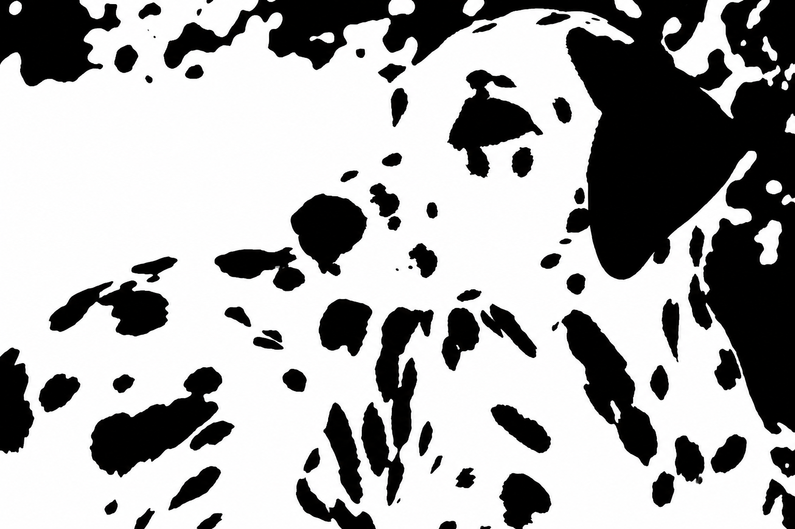

---
aliases:
  - 04-the-predictive-mind.html
  - 04-the-predictive-mind-perception-is-inference.html
  - 06-the-predictive-mind.html
---

# Predictive Mind {#the-predictive-mind-perception-is-inference}

*Perception Is Inference*

::: {#chapter-04-start .chapter-epigraph}
> “As a man is, so he sees. As the eye is formed, such are its powers.”
>
> — William Blake, [letter to the Reverend John Trusler](https://en.wikisource.org/wiki/Page:The_letters_of_William_Blake_%281906%29.djvu/120), 23 August 1799
:::

::: {#patches-become-a-scene}
Look at @fig-recognition-two-tone for a few seconds. What, if anything, do the patches represent? Write down your first interpretation, or note that you cannot yet find one. The grayscale source image appears in the final section of this chapter. Leave it until then, so that you can compare your first impression with what you see after the reveal.

{#fig-recognition-two-tone fig-alt="Irregular black patches on a white field. Some form small isolated clusters, while others join into larger dark regions. The image's subject is deliberately left unnamed for this recognition exercise." width=100% .phone-fit}

Removing the intermediate shades of gray makes it harder to tell which patches belong to the same object, which mark shadows, and which belong to the background. The visual information reaches your eyes, but its organization may remain unclear. Some readers will recognize the scene immediately; others will need a cue. Keep your own response in mind as we ask how an internal model gives sensory information meaning.
:::

::: {.callout-note .core-idea icon=false}
## Core Idea

Sensory evidence often fits more than one possible cause. Prior experience and context help resolve the ambiguity, while new evidence can correct the interpretation. The practical task is to recognize what you expected and seek an observation that could distinguish it from another plausible account.

:::

## Learning goals

- Explain perception as inference rather than recording.
- Describe priors, sensory evidence, prediction error, and precision in plain language.
- Explain how bodily regulation can anticipate the effects of an action, using thirst as an example.
- Distinguish perceptual prediction from a decision forecast, and specify an observation that could distinguish two competing interpretations.

## How an internal model organizes experience

An **internal model** represents learned relationships: what objects tend to look like, which features belong together, and what usually happens in a particular setting. It allows incomplete sensory signals to be interpreted in the light of experience. This need not be a literal picture stored in the brain or a consciously chosen explanation. The relevant knowledge can be distributed across many learned associations and levels of representation (Clark, 2013; Kersten et al., 2004).

In the opening image, a useful interpretation would connect scattered patches into a coherent arrangement. You may already know the kind of object depicted without yet recognizing it in this unusual form. The difficulty can lie in connecting the current signals to existing knowledge. A later cue may make that connection possible.

A more familiar example is walking into a dim kitchen. You recognize the table before you can make out all its edges. A shape beside it is probably a chair, although a coat draped over the back makes the outline uncertain. Familiarity with the room supplies a plausible account before every detail is visible. Moving closer can confirm it or reveal that you were mistaken.

The idea of perception as **inference** goes back at least to Helmholtz: the mind uses incomplete signals to infer their causes without requiring conscious calculation (Helmholtz, 1867/1962). Later accounts differ in how they explain this process (Gregory, 1980; Knill & Richards, 1996; Rock, 1983). A **prior** is an expectation formed before the current evidence is considered. In the kitchen, familiarity makes a chair a plausible interpretation; clearer sensory evidence can change that judgment.

Which learned expectations come into play depends partly on **context**. Surrounding objects, words, and situational cues can activate different interpretations and change the weight given to them. The same input can therefore acquire different meanings in different settings. Predictive processing offers one influential family of models for how these expectations and incoming signals might interact (Clark, 2013). The following demonstrations make the role of context visible before we examine that proposed mechanism.

## When context changes what appears

Read the middle symbol in each row of @fig-context-b13-demonstration. Its shape is identical in the two rows, but the neighbors invite different readings. The surrounding numbers make a numerical sequence relevant; the letters make the alphabet relevant. Both are familiar structures learned through experience. Context makes one interpretation easier to access. How much of your reading came from the mark, and how much came from its setting?

{#fig-context-b13-demonstration fig-alt="Two horizontal rows contain the same central ambiguous mark. The top row places it between 12 and 14, encouraging a reading of 13. The bottom row places it between A and C, encouraging a reading of B." width=100%}

[]{#ambiguous-animals-and-seasonal-context}

Before reading the caption, name the animal in @fig-duck-rabbit-context. Then try to find another animal without rotating the image. The challenge is to reorganize the same marks, not discover a second hidden drawing.

{#fig-duck-rabbit-context fig-alt="A single navy outline on white has a shared eye, rounded head, and two long extensions pointing right. It can be interpreted as a duck facing right, with the extensions forming its bill, or as a rabbit facing left, with the extensions forming its ears." width=100% .phone-fit}

Once one interpretation takes hold, the parts seem to fall into place: the same extension that was a bill becomes an ear. What is already accessible in memory is one possible influence on which reading arrives first. Around Easter, rabbits may be especially accessible to people familiar with that celebration. Brugger and Brugger (1993) reported a striking seasonal pattern: Zurich Zoo visitors tested on Easter Sunday predominantly named a rabbit, whereas a different group tested on an October Sunday predominantly named a bird.[^ch04-seasonal-design]

The seasonal story also needs an update. A later study conducted in the weeks around Easter found predominantly bird responses, failing to reproduce rabbit predominance (Dudda et al., 2026). The evidence for a seasonal influence is mixed. The drawing makes the perceptual point directly: **one set of marks can support more than one coherent interpretation**.

[]{#when-appearance-and-measurement-diverge}

The symbol and the ambiguous animal show how the same marks can support different identities. Context also changes the apparent properties of something we already recognize. The next demonstrations let us compare an appearance with a measurable property. Shadows, shading, and even synchronized touch have been used to study how sensory signals are organized into an experience (Adelson, 2000; Ramachandran, 1988; Botvinick & Cohen, 1998).

In @fig-perception-context-lab, the paired shafts, centre circles, and grey patches are physically identical within each comparison. The surrounding geometry or luminance changes their appearance. Measuring the target can correct the judgment without necessarily turning off the impression.

{#fig-perception-context-lab fig-alt="Three panels compare physically identical targets in different contexts. Equal horizontal shafts have different arrow fins, equal blue centre circles are surrounded by small or large circles, and identical grey patches appear on dark and light backgrounds. Each panel states the physical equality." width=100%}

[]{#color-and-illumination-context}

Look first at the isolated light on the left in @fig-traffic-light-color-context. What color would you call it? Now look at the upper lamp on the right. Both show the same lens, but only the right supplies its familiar setting. Does recognizing the traffic signal make the upper light seem redder?

{#fig-traffic-light-color-context fig-alt="The left panel contains only a gray textured lens on a plain blue-green background, with no frame or other objects. The right places the identical lens at the same size and height at the top of a three-lamp traffic signal in a blue-green scene. The familiar upper position supplies the learned expectation of red." width=100% .phone-fit}

The scene brings learned knowledge into play: in a familiar vertical traffic signal, the top lamp is red. Recognizing the signal makes red an expected interpretation of the upper lens. The isolated circle offers no such positional clue. Cover the housing and lower lamps, then reveal them again; notice both the color you assign to the lens and how it appears.[^ch04-color-cues] **The context tells us what the sensory evidence is likely to mean.**

Laboratory studies capture a related influence of familiar colors. When observers adjusted banana images until they looked gray, they shifted them slightly toward blue compared with their gray settings for unfamiliar control patches—the direction opposite to a banana's familiar yellow (Hansen et al., 2006). Related effects occur for familiar manufactured objects whose typical colors are learned through experience (Witzel et al., 2011).

The blue-green scene also supplies information about illumination. **Color constancy** helps an object's perceived color remain relatively stable as illumination changes: a white shirt can still look white in warm indoor light or cool daylight (Foster, 2011). Interpreting a scene can change that judgment. In a laboratory demonstration, changing the perceived folding direction of a card changed its apparent color in a way consistent with altered interpretation of light reflected between its surfaces (Bloj et al., 1999). The familiar object and the light falling on it jointly inform the interpretation.

[]{#hollow-face-illusion}

Learned expectations also affect apparent depth. Imagine looking into the inside of a face mask. Its nose recedes into the surface, yet you may see a normal face with a nose projecting toward you. This is the **hollow-face illusion**: a concave face can appear convex. Even knowing that the mask is hollow need not make it look hollow (Hill & Johnston, 2007).

:::: {.content-visible unless-format="epub"}
Watch the upper mask in @fig-hollow-face-illusion, then compare it with the featureless hollow surface below. Does the face seem to bulge toward you? Does its apparent shape change as it turns? Try separating what you **know about the shape** from what you **see**.

::: {#fig-hollow-face-illusion}
```{=html}
<div class="book-video-portrait">
  
</div>
```

A rotating hollow face above a featureless hollow surface.
:::
::::

::: {.content-visible when-format="epub"}
Watch the upper mask in the linked demonstration, then compare it with the featureless hollow surface below. Does the face seem to bulge toward you? Does its apparent shape change as it turns? Try separating what you **know about the shape** from what you **see**.
:::

::: {#hollow-face-media-description}
**Animation demonstration.** Two computer-rendered hollow surfaces rotate: a face above and a featureless surface below. The face may look solid while the lower surface is easier to see as hollow. [Watch the original video on Wikimedia Commons](https://commons.wikimedia.org/wiki/File:Hollow-face_illusion_with_rotating_mask_and_featureless_control_surface.webm).

Original video by Co (uploaded as Iljsdf), 2026; converted to a continuously looping GIF at reduced resolution and frame rate, preserving the full six-second sequence. Video and GIF: [CC BY-SA 4.0](https://creativecommons.org/licenses/by-sa/4.0/).
:::

Familiar faces provide a powerful expectation about shape. Experiments find that upright orientation strengthens the illusion, while lighting and information from binocular vision also influence it (Hill & Bruce, 1993). Familiar facial shading and coloration can enhance the effect further (Hill & Johnston, 2007). The explanation therefore involves both learned expectations and the available visual cues.

For a closer look, [rotate the 3D face model yourself](https://3dviewer.net/#model=https://upload.wikimedia.org/wikipedia/commons/d/db/Hollow_face_illusion.stl). Drag to inspect it from the side and behind, where its hollow geometry is easier to check. Then return toward a frontal view. **An impression can remain convincing even after another observation reveals why it is misleading.** In decision-making, this is a reason to seek a diagnostic view of the evidence rather than rely on how certain an interpretation feels.

The linked [3D model](https://commons.wikimedia.org/wiki/File:Hollow_face_illusion.stl) was designed by Wael Tsar, recentered, symmetrized, and converted to STL by cmglee; [CC BY 4.0](https://creativecommons.org/licenses/by/4.0/).

Context can bring learned structure into use. Learning is also needed to connect visual signals with familiar objects. **Detecting visual features and understanding what they belong to are different achievements.**

::: {#research-lens-restored-sight-as-a-bounded-calibration-case}

::: {.callout-note .research-lens icon=false collapse=true}
## Research Lens: Shirl Jennings and learning to see

Shirl Jennings knew his world through touch, sound, and movement long before surgery offered a new way into it. His eyesight had deteriorated after a serious illness at three. In 1991, at age 51, cataract surgery restored some vision after decades of severe visual impairment (Associated Press, 1999).

Restoring visual input might seem to be enough to reveal a world Jennings already knew by touch. Receiving visual information, however, did not make familiar objects instantly recognizable. Jennings sometimes needed to touch an object to distinguish a table from a chair (Associated Press, 1999). His surgeon identifies him as the man Oliver Sacks described under the name **Virgil** (Woodhams, n.d.). In Sacks's account, colors, movements, and shapes became visible, while organizing them into recognizable objects and coherent scenes remained difficult (Sacks, 1993).

Jennings already had knowledge of objects and ways of navigating his surroundings. The challenge was connecting newly available visual patterns with that knowledge. His experience makes the work of perceptual learning concrete.[^ch04-jennings-vision]

Systematic research offers a complementary test. Newly sighted participants initially struggled to match a seen object with one known by touch, then improved rapidly (Held et al., 2011). That improvement matters as much as the initial difficulty: new connections could develop through experience.

:::

:::

We need learned structure to interpret incomplete signals, and reliable new observations to correct an interpretation when that structure misleads us.

## Two meanings of prediction

To explain how learned expectations work, we first need to clarify a term that can otherwise cause confusion.

Recognizing a chair and forecasting the result of taking a job both draw on prior information. Yet a model that explains the first has not thereby supplied a reliable forecast of the second. To connect perception with decision-making, we need to specify what **prediction** is about in each case.

| Use of prediction | Meaning in this book |
| --- | --- |
| **Prediction in predictive processing** | An internal model anticipates sensory signals or infers their hidden causes. A mismatch between expected and incoming signals can alter perception or update the model. |
| **Prediction in judgment and decision-making** | A person or model forecasts a state or consequence that may occur, often under a specified option and time horizon. The forecast becomes one input into valuation and choice. |
: Predictive processing and predictive judgment ask different questions {#tbl-two-meanings-prediction}

The first row of @tbl-two-meanings-prediction asks, in effect, **“What is producing the signals I am receiving?”** The second asks **“What is likely to happen if this option is chosen?”** Both use prior information and uncertainty, but they predict different objects and are evaluated against different evidence. In a hiring interview, interpreting a quiet answer as thoughtfulness is an inference about what just happened; predicting reliable future work is a further claim.

This chapter concentrates on interpreting sensory and bodily signals. It also considers how the nervous system anticipates the bodily effects of actions such as drinking. Such anticipation need not involve a conscious forecast. The next chapter asks how expectations about an outcome can themselves help change that outcome.

## Prediction, error, and precision

Suppose the chair in the dim kitchen has been moved. Your first interpretation places it where it usually stands, but approaching it reveals a mismatch. A **prediction error** is a discrepancy between an expected signal and an incoming one. In predictive-processing models, such discrepancies can change the interpretation or update what is expected next time (Clark, 2013; Friston, 2010; Hohwy, 2013; Rao & Ballard, 1999).

How much should a discrepancy matter? In dim light, one uncertain outline may deserve little weight; after the light is switched on, the same location provides clearer evidence. **Precision** means estimated reliability, often formalized as inverse variance. A signal treated as more reliable has greater influence on the relevant update. Precision does not simply mean importance, emotional force, or confidence stated aloud.

Ernst and Banks (2002) made that weighting observable. Participants estimated the height of a virtual bar by seeing it, feeling it through a force-feedback device, or combining both senses. The researchers added visual noise and introduced small disagreements between the seen and felt heights. When vision was reliable, estimates gave it more weight; as the image became noisier, touch gained influence. The combined judgments closely followed predictions based on the reliability of each sense measured separately. The study supports reliability-weighted integration in this task; it does not establish every claim of predictive-processing theory.

The **generative process** is the world and body producing the observations; the **generative model** is the system's account of how those observations could arise. A model of a chair anticipates what its shape would look like from a particular angle and in particular lighting. Perceptual inference uses incoming signals to work back toward the likely object and setting. The actual chair belongs to the process, while these learned relationships belong to the model. Keeping them separate matters because a familiar model can be wrong.

{#fig-predictive-processing-decision fig-alt="Expectations and incoming signals converge on perception. Perception informs action and sampling, which changes the next evidence. A feedback arrow shows that mismatch can update the internal model."}

Predictive-processing models differ in their scope and implementation. Some model aspects of attention through precision assignment (Feldman & Friston, 2010), but precision and attention are not interchangeable. The return path through action and sampling in @fig-predictive-processing-decision also explains why a smaller prediction error need not mean a better account of the world: the system may have sampled only evidence its model already explains.

::: {.callout-note .research-lens icon=false collapse=true #research-lens-from-predictive-processing-to-active-inference}
## Research Lens: from predictive processing to active inference {#research-lens-from-predictive-processing-to-active-inference-title}

Predictive processing is a family of accounts in which perception and
learning involve predictions, precision-weighted errors, and belief
updating. **Active inference** develops a formal account of action as well as perception. One practical insight is that action changes
the observations on which the next judgment will be based (Friston et
al., 2017; Da Costa et al., 2020; Parr et al., 2022). Putting on a coat
changes bodily signals. Asking what would make a negotiation offer feasible can reveal information that accepting it immediately would leave unknown.

This suggests a usable two-question check before acting:

- **Outcome value:** Which action is most likely to produce the outcome
  I currently prefer?
- **Information value:** Which feasible action would most reduce an
  uncertainty that could change the decision?

A small pilot may be preferable to immediate scaling when the expected
value of resolving a decisive uncertainty exceeds the pilot's costs; once
that uncertainty is resolved, further exploration may add little (Friston et al., 2015). Some actions both produce outcomes and improve the evidence available for the next choice.

In formal models, variational and expected free energy are technical
quantities, not synonyms for surprise as a feeling, anxiety, discomfort,
or “negative energy” (Friston, 2010; Parr et al., 2022). A research
application must specify hidden states, observations, policies, preferred
outcomes, learning rules, and free parameters; it should test parameter
recovery where parameters carry psychological meaning, predict new data,
and be compared with simpler alternatives rather than redescribing every
result after it occurs. Readers who need the
formal derivations should use the cited technical sources. [Appendix
D](../appendices/appendix-e-how-behavioral-evidence-is-built.qmd#separate-description-prediction-causation-and-mechanism)
provides the complementary discipline for turning a model into a claim
that evidence can distinguish from its rivals.
:::


## Anticipating the body's needs {#anticipating-bodily-needs}

So far, the examples have concerned the world outside the body. The nervous system also integrates signals about the body's condition and uses them to regulate action. Thirst provides a concrete example of why regulation benefits from anticipating what an action will do.

[]{#why-drinking-can-relieve-thirst-before-rehydration-is-complete}

When the body loses water, changes in fluid concentration and circulating volume help generate thirst. Yet a drink can relieve that feeling quickly, while absorption and the restoration of fluid balance are still under way. In a small human experiment, thirst fell within minutes of drinking; even a much smaller amount reduced reported thirst, although its hormonal effects differed (Williams et al., 1989).

Waiting for complete rehydration before reducing the drive to drink would risk taking in more water than needed. Signals from the mouth and throat provide earlier information about intake. In mice, Zimmerman et al. (2016) found that thirst-promoting neurons were rapidly inhibited during drinking, before blood measures of fluid balance had recovered. Further experiments showed that signals from the gut convey information about the ingested fluid's concentration and help determine whether the initial suppression of thirst should persist (Zimmerman et al., 2019).

The system therefore combines information about **current need**, **water already consumed**, and **its expected effect**. This is prediction in a functional sense: early signals guide regulation before the eventual bodily consequence arrives. It need not involve consciously thinking, “That should be enough.” Nor does every sip eliminate thirst completely. Early signals are checked against information from the gut and, later, the blood.

[]{#why-seeing-a-toilet-can-change-the-urge}

[]{#context-cues-actions-and-urges}

Context helps us anticipate what to do as well as what we will encounter. An internal model can represent relationships between a setting, an available action, and its likely consequences: drinking can relieve thirst, and using a toilet can relieve bladder pressure. In active-inference accounts, expectations about actions and their outcomes help guide which action is selected (Friston et al., 2017; Da Costa et al., 2020). Through repetition, a familiar context can also bring a learned response to mind without a fresh evaluation of its consequences (Wood & Neal, 2007). The action becomes more salient—more ready to occur—when its usual cues appear.

This readiness can interact with how bodily signals are experienced. A predictive interpretation is that a familiar opportunity for relief draws attention toward the relevant sensation and prepares the associated response, making the need feel more pressing. Evidence that context can affect bodily urgency comes from a small study of 12 women with situational urgency incontinence: photographs of personally relevant situations changed bladder sensation in 11 participants, and personalized cues could also provoke measurable bladder activity and leakage (Clarkson et al., 2020).

The connection extends to urges for anticipated rewards. In a smoking experiment, increasing the stated chance of access to a cigarette increased reported craving on cigarette-cue trials (Bailey et al., 2010). An urge can therefore depend partly on what the setting makes seem possible now. [Chapter 21](21-habits-wanting-and-self-control.qmd#smoking-opportunity-and-craving) develops how cues, expected opportunities, and current needs interact. It also distinguishes readiness to act from a consciously felt urge, and shows how changing a cue or practicing a different response can help change a routine.

The thirst experiments illustrate anticipatory regulation, while the urgency study shows how context can affect bodily experience. [Chapter 5](05-expectations.qmd#illness-after-a-deadline) considers a more uncertain case: feeling ill only after a demanding period ends, and why its timing alone cannot establish an expectation effect.

## When inner models help—and when they stop learning

The illusions might suggest that we should strip away expectations and rely on incoming evidence alone. Yet recognizing letters and familiar objects depends on learned structure, and thirst shows why control can benefit from anticipating an action's effects. The challenge is to keep these advantages while allowing a mistaken model to change.

Inner models make perception usable. Reading requires models of letters, words, and grammar; crossing a street requires expectations about vehicles, signals, and speed. Expertise develops when repeated experience builds models that detect meaningful patterns. A radiologist sees structure in an image that a novice cannot, and an experienced firefighter may notice that a fire is behaving abnormally.

The broader decision lesson concerns the explanations we have available. A manager may interpret silence as agreement until she considers whether employees feel able to disagree. A student may see only the benefit of accepting an offer until she identifies the best alternative forgone. Learning another explanation changes what each person looks for.

When applying these ideas to everyday judgment, three possible obstacles are worth investigating:

1. **The prior becomes too rigid.** Ambiguous evidence is repeatedly interpreted in the expected direction.
2. **Reliability is judged selectively.** Confirming signals are treated as diagnostic while disconfirming signals are dismissed as noise. Emotion, identity, and incentives can influence this weighting.
3. **Action protects the model.** Avoidance, micromanagement, underinvestment in testing, or failure to ask diagnostic questions prevents informative feedback.

More information is therefore not automatic correction. A signal changes the model only if it enters attention, is treated as sufficiently reliable, and can be integrated into the current account. If it is dismissed as irrelevant or noisy, the model may survive unchanged.

The calibration exercise below turns this possibility into a test: compare the interpretation you favor with a plausible alternative, then choose an observation that would help distinguish them.

::: {.callout-tip .calibration-test icon=false}
## Calibration test

For one disputed perception or interpretation, write four lines: **prior
model**, **current evidence**, **why each source deserves its present
weight**, and **what observation would change that weight**. “Use less
intuition” is not yet a test; specify what evidence should become more
diagnostic.
:::

::: {#generative-ai-and-predictive-processing}

::: {.callout-note .research-lens icon=false collapse=true}
## Research Lens: generative models, learning, and AI

Consider the unfinished sentence **“At the bank, she…”** After a paragraph about fishing, *cast her line* would be a plausible continuation. After a paragraph about opening a savings account, *asked about interest rates* would fit better. The words to be continued are unchanged, but the setting changes what a good answer would be. Like the neighbors around the ambiguous symbol in @fig-context-b13-demonstration, surrounding information guides interpretation. This is useful when context clarifies a task; it becomes consequential when an assumption embedded in the question quietly guides the answer.

A **large language model**, or **LLM**, makes this dependence on context especially visible. A generative language model learns patterns from training material and uses them to construct text. Its output depends on both what training has encoded and the input available now. That combination offers a useful comparison with perception: incomplete information becomes meaningful through learned structure and present context.

### Learned structure and current context {.unlisted #how-a-generative-model-supports-perception}

In predictive processing, a generative model represents relationships between hidden causes and the observations they could produce. Seeing a shadowy shape as a chair depends on expectations about how chairs look under different conditions. The model can generate expectations about signals arriving now as well as signals likely to arrive next. The nervous system uses the mismatch with incoming evidence to revise its interpretation or its learned expectations (Rao & Ballard, 1999; Friston, 2010).

Attention participates in this loop. Searching for your keys makes some locations and features especially relevant; noticing a metallic glint can redirect the search. Expectations help guide attention, while attention affects which evidence has influence. Feldman and Friston (2010) model this influence through the estimated precision of sensory signals. On this account, attention and prediction interact continuously, rather than attention simply handing a finished input to a predictor.

[]{#what-does-a-language-model-predict}

In an **autoregressive** language model, generation proceeds by estimating probabilities for the next **token**: a unit of text that may be a word, part of a word, or punctuation. The model uses the available context, including earlier generated text, rather than only the immediately preceding word. A token is selected, appended, and becomes part of the context for the next step. Selection can involve sampling; the system need not always choose the most probable token (Vaswani et al., 2017; Brown et al., 2020).

The model can continue a historical account, a fictional story, or a plan for tomorrow. The prediction task is simple to state, but performing it well across varied texts draws on complex dependencies. Brown et al. (2020), for example, demonstrated translation and question answering from instructions and examples supplied in context, with substantial differences in performance across tasks.

[]{#images-and-videos-generation-is-broader-than-next-token-prediction}

It is tempting to extend the token-by-token picture to a painting assembled pixel by pixel or a film generated strictly frame by frame, but that would miss how other major generative systems work.

The family of generative models extends beyond language and uses several generation procedures. **Diffusion models** can start from noise and repeatedly refine it toward a generated sample. Latent diffusion performs this process in a compressed representation of an image, with text or other inputs guiding the result (Rombach et al., 2022). Video diffusion can refine a whole group of frames together; groups can also be extended using earlier frames as context (Ho et al., 2022).

Across these examples, learned patterns and supplied context constrain what gets generated. A convincing picture of a flooded street or video of a future city can help us imagine a possibility.

### Learning and adapting to new evidence {.unlisted #changing-the-current-interpretation-and-changing-the-model}

A **prompt** can supply instructions, examples, facts, and a conversation history. It plays a role analogous to contextual cues: it helps establish what the current task is and which responses fit. The model's learned parameters supply enduring structure; its temporary internal representations depend on the input being processed. During ordinary prompting, those representations change without retraining the parameters. This distinction underlies **in-context learning**: examples can alter how a task is performed without a training update to the model's weights (Brown et al., 2020).

Human learning is interwoven with ongoing perception and action. Yet people also distinguish, in effect, between **what is happening now** and **what is generally true**. Discovering that someone moved the chair changes your estimate of its current location. Finding it there every morning may change where you expect chairs to be kept. Predictive-processing accounts distinguish updating a current state estimate from learning more enduring relationships; a momentary correction need not rewrite a lasting expectation (Friston, 2010).

This makes the comparison with AI more precise. Standard LLM use usually separates parameter training from answering a particular prompt. Human brains remain capable of lasting learning during everyday activity. But a fixed-parameter LLM can still adapt its answers to examples within a conversation, and further training can change its parameters. The distinction concerns **where and when change occurs**, not whether one system can respond to new information at all.

The word *weight* can obscure this distinction. A model's **parameters** encode learned relationships; the **weight given to evidence** concerns how strongly an observation should influence the current judgment. A knowledgeable person can give decisive weight to a clear observation that contradicts an expectation. Having learned more does not mechanically mean assigning less weight to new evidence.

[]{#does-experience-make-the-mind-less-open-to-evidence}

Experience can make learning both easier and harder. A familiar pattern lets an expert recognize something a novice misses. The same expectations can make an unfamiliar pattern harder to discover. Lucas et al. (2014) found that four- and five-year-olds were more willing than adults to generalize an unusual causal rule: two objects had to work together to activate a machine. Adults more often carried over a familiar assumption that an individual object would suffice. The children's advantage concerned a particular kind of causal learning in which established expectations could mislead.

Later-life differences also depend on the task. In a changing prediction task, Nassar et al. (2016) found that older adults adjusted their learning less strongly to uncertainty about their current estimate. Both younger and older participants nevertheless increased learning after surprising outcomes. The pattern concerns how learners assessed when an update was needed, rather than a uniform failure to use new input. Older adults also remain capable of acquiring new skills: Boyke et al. (2008) observed learning and associated structural brain changes during juggling training.

There is therefore no single age-controlled dial that steadily turns down the influence of evidence. What matters is how reliable the present evidence is, how well established the relevant expectation is, and whether the environment has changed. For a learner of any age, the useful question is **“Does this observation reveal a temporary exception, or a relationship I need to relearn?”**

[]{#guiding-a-process-that-usually-runs-outside-awareness}

Adapting to evidence does not require conscious access to every inference. You experience the chair, not the calculations that made its outline recognizable. Much of the inference described by predictive processing happens without deliberate supervision. Conscious goals can nevertheless change the conditions under which it operates: you can switch on a light, inspect another angle, or ask someone what happened. Such actions supply evidence that an unchanged viewpoint would miss (Clark, 2013).

This opens a connection with reflective thinking. We can question a first interpretation and decide what to inspect next without gaining direct access to every process that produced it. [Chapter 8](08-intuition-and-deliberation.qmd#monitoring-and-guiding-thought) develops this capacity as **metacognition**, then examines how AI reasoning systems can perform some comparable checking functions.

### Prompts as framing and priming {.unlisted #prompt-framing-and-priming}

A prompt arranges the evidence, instructions, and context from which a model constructs its response. **Framing** and **priming** describe two ways that this arrangement can matter.

Framing concerns how a problem is represented. Compare “90 of the 100 trials succeeded” with “10 of the 100 trials failed,” where success and failure exhaust the possibilities. The information is equivalent, but the wording highlights a different outcome. If a model's recommendation systematically changes with the wording while the outcomes, options, and decision objective remain the same, it exhibits a framing effect. Binz and Schulz (2023) found gain–loss framing effects in GPT-3's responses to equivalent gamble problems. [Chapter 12](12-framing.qmd#what-a-frame-changes) develops the corresponding distinction between the underlying decision and its presentation.

Priming concerns how preceding material influences the response to what follows. In human experiments, an earlier word or sentence can facilitate processing related material, as [Chapter 13](13-priming-fluency-and-familiarity.qmd#accessibility-memory-prepares-an-answer) explains. Language models show a measurable counterpart: after encountering a particular grammatical construction, they can assign greater probability to a subsequent sentence with the same structure. Sinclair et al. (2022) demonstrated this **structural priming** in Transformer language models; later work showed how word overlap and frequency also influence its strength (Jumelet et al., 2024). This is evidence about the model's conditional predictions, without establishing that it uses the same memory mechanisms as a person.

The two influences can coexist. Calling a workplace disagreement “resistance to improvement” frames the issue; preceding it with examples of disloyal employees might also shift which explanation the model generates. The second claim is a hypothesis to test, not something established by the structural-priming studies. A useful test keeps the incident and question fixed while varying only the preceding material.

Other prompt effects have a more direct explanation. “Write three bullet points” specifies a format; examples can teach a task within context; new facts can warrant a new conclusion. A changed answer is therefore not enough to identify framing or priming. The question is **which feature of the prompt changed, and whether that feature should change the answer**.

[]{#change-the-questionand-then-seek-evidence}

Framing can also enter through assumptions built into a question. **“Why did my team resist a useful change?”** already assumes that the change was useful and that resistance is the problem. A more open inquiry would provide the observations, ask for competing explanations, and specify what evidence would distinguish them. Perhaps the team misunderstood the change; perhaps it recognized a cost the manager overlooked.

Changing the frame gives us alternatives to test against evidence. [Chapter 42](42-deciding-with-data-and-ai.qmd#ai-workbench) builds on this distinction: generative AI can help articulate options and questions, while predictions used for consequential choices need validation and the values guiding those choices need explicit human judgment.

[]{#exercise-separate-the-frame-from-the-preceding-cue}

**Try the comparison.** Present the same fictional project results as successes or failures while keeping the available actions and evaluation question identical. For a separate priming comparison, keep that entire prompt fixed and vary a preceding, unrelated passage. Choose in advance what to compare: the recommended action, the explanation, or a grammatical pattern. Use fresh conversations with the same model and settings, vary the order in which you run the conditions, and repeat them to distinguish a consistent difference from ordinary output variation. Check whether either manipulation accidentally supplied new evidence or instructions. Which claims came from the project facts, and which were added? Name one external observation needed to evaluate the recommendation.
:::

:::

## Practice Lab

Choose a disagreement in which two people received similar information but inferred different situations. State each person's interpretation, identify the evidence each treated as most reliable, and name one feasible observation that would be more likely under one account than the other. This is your two-model test. End by stating what action would follow from each possible result.

## Take it forward

In the kitchen, moving closer or switching on the light can settle what the uncertain shape is. In a disagreement, the equivalent move is to ask what observation would separate the competing interpretations. Before gathering more information, write down what each account predicts; otherwise, the same evidence may simply be absorbed into the explanation you already prefer.

[^ch04-color-cues]: The display combines learned signal identity with chromatic contrast, adaptation, and inferred illumination (Shevell & Kingdom, 2008). The lens is identical, but other surrounding cues differ. Memory-color effects in judgments need not always imply a corresponding change in visual appearance (Valenti & Firestone, 2019).
[^ch04-seasonal-design]: Brugger and Brugger (1993) compared different visitor groups on two dates. Dudda et al. (2026) sampled in the weeks around Easter, using different collection procedures and without an October comparison.
[^ch04-jennings-vision]: Residual eye damage and later serious illness also affected Jennings’s vision (Sacks, 1993).
[^ch04-recognition-illustrations]: The grayscale scene and its two-tone simplification were generated for this book. They are corresponding illustrations, not a pixelwise threshold conversion or stimuli from the cited experiment. The exercise compares your responses to the unchanged two-tone image before and after the reveal; no recognition rate has been measured for this particular illustration.

## References cited in this chapter

::: {.reference}
Adelson, E. H. (2000). Lightness perception and lightness illusions. In M. Gazzaniga (Ed.), The new cognitive neurosciences (2nd ed., pp. 339–351). MIT Press.
:::

::: {.reference}
Associated Press. (1999, February 1). Gift of sight brought fear, frustration. *Deseret News*. [Original reporting](https://www.deseret.com/1999/2/1/19421794/gift-of-sight-brought-fear-frustration/).
:::

::: {.reference}
Bailey, S. R., Goedeker, K. C., & Tiffany, S. T. (2010). The impact of cigarette deprivation and cigarette availability on cue-reactivity in smokers. *Addiction, 105*(2), 364–372. https://doi.org/10.1111/j.1360-0443.2009.02760.x
:::

::: {.reference}
Binz, M., & Schulz, E. (2023). Using cognitive psychology to understand GPT-3. *Proceedings of the National Academy of Sciences, 120*(6), e2218523120. https://doi.org/10.1073/pnas.2218523120
:::

::: {.reference}
Bloj, M. G., Kersten, D., & Hurlbert, A. C. (1999). Perception of three-dimensional shape influences colour perception through mutual illumination. *Nature, 402*(6764), 877–879. [Published paper](https://doi.org/10.1038/47245).
:::

::: {.reference}
Botvinick, M., & Cohen, J. (1998). Rubber hands “feel” touch that eyes see. Nature, 391(6669), 756.
:::

::: {.reference}
Boyke, J., Driemeyer, J., Gaser, C., Büchel, C., & May, A. (2008). Training-induced brain structure changes in the elderly. *Journal of Neuroscience, 28*(28), 7031–7035. https://doi.org/10.1523/JNEUROSCI.0742-08.2008
:::

::: {.reference}
Brown, T. B., Mann, B., Ryder, N., Subbiah, M., Kaplan, J., Dhariwal, P., Neelakantan, A., Shyam, P., Sastry, G., Askell, A., Agarwal, S., Herbert-Voss, A., Krueger, G., Henighan, T., Child, R., Ramesh, A., Ziegler, D. M., Wu, J., Winter, C., Hesse, C., Chen, M., Sigler, E., Litwin, M., Gray, S., Chess, B., Clark, J., Berner, C., McCandlish, S., Radford, A., Sutskever, I., & Amodei, D. (2020). Language models are few-shot learners. *Advances in Neural Information Processing Systems, 33*. [Published paper](https://proceedings.neurips.cc/paper/2020/hash/1457c0d6bfcb4967418bfb8ac142f64a-Abstract.html).
:::

::: {.reference}
Brugger, P., & Brugger, S. (1993). The Easter bunny in October: Is it disguised as a duck? *Perceptual and Motor Skills, 76*(2), 577–578. [Published paper](https://doi.org/10.2466/pms.1993.76.2.577).
:::

::: {.reference}
Clark, A. (2013). Whatever next? Predictive brains, situated agents, and the future of cognitive science. Behavioral and Brain Sciences, 36(3), 181–204.
:::

::: {.reference}
Clarkson, B. D., O'Connell, K., & Conklin, C. A. (2020). Reproducing situationally triggered urgency incontinence in a controlled environment. *Neurourology and Urodynamics, 39*(8), 2520–2526. [Published paper](https://doi.org/10.1002/nau.24524).
:::

::: {.reference}
Da Costa, L., Parr, T., Sajid, N., Veselic, S., Neacsu, V., & Friston, K. (2020). Active inference on discrete state-spaces: A synthesis. *Journal of Mathematical Psychology, 99*, 102447.
:::

::: {.reference}
Dolan, R. J., Fink, G. R., Rolls, E., Booth, M., Holmes, A., Frackowiak, R. S. J., & Friston, K. J. (1997). How the brain learns to see objects and faces in an impoverished context. *Nature, 389*, 596–599. [Published paper](https://doi.org/10.1038/39309).
:::

::: {.reference}
Dudda, L., Van der Hulst, E., Sahan, M. I., & Verheyen, S. (2026). Replication is child's play. *Open Education Studies, 8*(1), Article 20250134. [Published paper](https://doi.org/10.1515/edu-2025-0134).
:::

::: {.reference}
Ernst, M. O., & Banks, M. S. (2002). Humans integrate visual and haptic information in a statistically optimal fashion. *Nature, 415*(6870), 429–433.
:::

::: {.reference}
Feldman, H., & Friston, K. J. (2010). Attention, uncertainty, and free-energy. Frontiers in Human Neuroscience, 4, Article 215.
:::

::: {.reference}
Foster, D. H. (2011). Color constancy. *Vision Research, 51*(7), 674–700. [Published paper](https://doi.org/10.1016/j.visres.2010.09.006).
:::

::: {.reference}
Friston, K. (2010). The free-energy principle: A unified brain theory? Nature Reviews Neuroscience, 11(2), 127–138.
:::

::: {.reference}
Friston, K., Rigoli, F., Ognibene, D., Mathys, C., Fitzgerald, T., & Pezzulo, G. (2015). Active inference and epistemic value. *Cognitive Neuroscience, 6*(4), 187–214.
:::

::: {.reference}
Friston, K. J., FitzGerald, T., Rigoli, F., Schwartenbeck, P., & Pezzulo, G. (2017). Active inference: A process theory. Neural Computation, 29(1), 1–49.
:::

::: {.reference}
Gregory, R. L. (1980). Perceptions as hypotheses. Philosophical Transactions of the Royal Society of London. Series B, Biological Sciences, 290(1038), 181–197.
:::

::: {.reference}
Hansen, T., Olkkonen, M., Walter, S., & Gegenfurtner, K. R. (2006). Memory modulates color appearance. *Nature Neuroscience, 9*(11), 1367–1368. [Published paper](https://doi.org/10.1038/nn1794).
:::

::: {.reference}
Held, R., Ostrovsky, Y., de Gelder, B., Gandhi, T., Ganesh, S., Mathur, U., & Sinha, P. (2011). The newly sighted fail to match seen with felt. *Nature Neuroscience, 14*(5), 551–553.
:::

::: {.reference}
Helmholtz, H. von. (1962). Treatise on physiological optics (J. P. C. Southall, Trans.). Dover. (Original work published 1867)
:::

::: {.reference}
Hill, H., & Bruce, V. (1993). Independent effects of lighting, orientation, and stereopsis on the hollow-face illusion. *Perception, 22*(8), 887–897. [Published paper](https://doi.org/10.1068/p220887).
:::

::: {.reference}
Hill, H., & Johnston, A. (2007). The hollow-face illusion: Object-specific knowledge, general assumptions or properties of the stimulus? *Perception, 36*(2), 199–223. [Published paper](https://doi.org/10.1068/p5523).
:::

::: {.reference}
Ho, J., Salimans, T., Gritsenko, A., Chan, W., Norouzi, M., & Fleet, D. J. (2022). Video diffusion models. *Advances in Neural Information Processing Systems, 35*, 8633–8646. [Published paper](https://proceedings.neurips.cc/paper_files/paper/2022/hash/39235c56aef13fb05a6adc95eb9d8d66-Abstract-Conference.html).
:::

::: {.reference}
Hohwy, J. (2013). The predictive mind. Oxford University Press.
:::

::: {.reference}
Jumelet, J., Zuidema, W., & Sinclair, A. (2024). Do language models exhibit human-like structural priming effects? In *Findings of the Association for Computational Linguistics: ACL 2024* (pp. 14727–14742). Association for Computational Linguistics. https://doi.org/10.18653/v1/2024.findings-acl.877
:::

::: {.reference}
Kersten, D., Mamassian, P., & Yuille, A. (2004). Object perception as Bayesian inference. Annual Review of Psychology, 55, 271–304.
:::

::: {.reference}
Knill, D. C., & Richards, W. (Eds.). (1996). Perception as Bayesian inference. Cambridge University Press.
:::

::: {.reference}
Lucas, C. G., Bridgers, S., Griffiths, T. L., & Gopnik, A. (2014). When children are better (or at least more open-minded) learners than adults: Developmental differences in learning the forms of causal relationships. *Cognition, 131*(2), 284–299. https://doi.org/10.1016/j.cognition.2013.12.010
:::

::: {.reference}
Nassar, M. R., Bruckner, R., Gold, J. I., Li, S.-C., Heekeren, H. R., & Eppinger, B. (2016). Age differences in learning emerge from an insufficient representation of uncertainty in older adults. *Nature Communications, 7*, 11609. https://doi.org/10.1038/ncomms11609
:::

::: {.reference}
Parr, T., Pezzulo, G., & Friston, K. J. (2022). *Active inference: The free energy principle in mind, brain, and behavior.* MIT Press.
:::

::: {.reference}
Ramachandran, V. S. (1988). Perception of shape from shading. Nature, 331(6152), 163–166.
:::

::: {.reference}
Rao, R. P. N., & Ballard, D. H. (1999). Predictive coding in the visual cortex: A functional interpretation of some extra-classical receptive-field effects. Nature Neuroscience, 2(1), 79–87.
:::

::: {.reference}
Rock, I. (1983). The logic of perception. MIT Press.
:::

::: {.reference}
Rombach, R., Blattmann, A., Lorenz, D., Esser, P., & Ommer, B. (2022). High-resolution image synthesis with latent diffusion models. *Proceedings of the IEEE/CVF Conference on Computer Vision and Pattern Recognition*, 10684–10695. [Published paper](https://openaccess.thecvf.com/content/CVPR2022/html/Rombach_High-Resolution_Image_Synthesis_With_Latent_Diffusion_Models_CVPR_2022_paper.html).
:::

::: {.reference}
Sacks, O. (1993, May 10). To see and not see. *The New Yorker*. [Published essay](https://www.newyorker.com/magazine/1993/05/10/to-see-and-not-see-oliver-sacks).
:::

::: {.reference}
Shevell, S. K., & Kingdom, F. A. A. (2008). Color in complex scenes. *Annual Review of Psychology, 59*, 143–166. [Published paper](https://doi.org/10.1146/annurev.psych.59.103006.093619).
:::

::: {.reference}
Sinclair, A., Jumelet, J., Zuidema, W., & Fernández, R. (2022). Structural persistence in language models: Priming as a window into abstract language representations. *Transactions of the Association for Computational Linguistics, 10*, 1031–1050. https://doi.org/10.1162/tacl_a_00504
:::

::: {.reference}
Valenti, J. J., & Firestone, C. (2019). Finding the “odd one out”: Memory color effects and the logic of appearance. *Cognition, 191*, 103934. [Published paper](https://doi.org/10.1016/j.cognition.2019.04.003).
:::

::: {.reference}
Vaswani, A., Shazeer, N., Parmar, N., Uszkoreit, J., Jones, L., Gomez, A. N., Kaiser, Ł., & Polosukhin, I. (2017). Attention is all you need. *Advances in Neural Information Processing Systems, 30*. [Published paper](https://proceedings.neurips.cc/paper_files/paper/2017/hash/3f5ee243547dee91fbd053c1c4a845aa-Abstract.html).
:::

::: {.reference}
Williams, T. D., Seckl, J. R., & Lightman, S. L. (1989). Dependent effect of drinking volume on vasopressin but not atrial peptide in humans. *American Journal of Physiology, 257*(4 Pt 2), R762–R764. [Published paper](https://doi.org/10.1152/ajpregu.1989.257.4.R762).
:::

::: {.reference}
Witzel, C., Valkova, H., Hansen, T., & Gegenfurtner, K. R. (2011). Object knowledge modulates colour appearance. *i-Perception, 2*(1), 13–49. [Published paper](https://doi.org/10.1068/i0396).
:::

::: {.reference}
Wood, W., & Neal, D. T. (2007). A new look at habits and the habit-goal interface. Psychological Review, 114(4), 843-863.
:::

::: {.reference}
Woodhams, J. T. (n.d.). Do people who are blind who all of a sudden gain eyesight feel overwhelmed with colors, seeing how people really look like, etc.? *Woodhams Eye Clinic*. [Treating surgeon's account](https://woodhamseye.com/do-people-who-are-blind-who-all-of-a-sudden-gain-eyesight-feel-overwhelmed-with-colors/).
:::

::: {.reference}
Zimmerman, C. A., Huey, E. L., Ahn, J. S., Beutler, L. R., Tan, C. L., Kosar, S., Bai, L., Chen, Y., Corpuz, T. V., Madisen, L., Zeng, H., & Knight, Z. A. (2019). A gut-to-brain signal of fluid osmolarity controls thirst satiation. *Nature, 568*, 98–102. [Published paper](https://doi.org/10.1038/s41586-019-1066-x).
:::

::: {.reference}
Zimmerman, C. A., Lin, Y.-C., Leib, D. E., Guo, L., Huey, E. L., Daly, G. E., Chen, Y., & Knight, Z. A. (2016). Thirst neurons anticipate the homeostatic consequences of eating and drinking. *Nature, 537*, 680–684. [Published paper](https://doi.org/10.1038/nature18950).
:::

## Return to the opening image {#recognition-reveal}

Before looking below, recall your first interpretation of @fig-recognition-two-tone. Now examine the grayscale image in @fig-recognition-grayscale, then cover it or turn back to the opening image. Does the same arrangement of black and white look different?

{#fig-recognition-grayscale fig-alt="A grayscale illustration of a Dalmatian resting in dappled shade, its head facing left. Its nose is near the center-left, its eye is above it, and a dark ear hangs on the right." width=100% .phone-fit}

The scene shows a Dalmatian. Locate the nose toward the center-left, the eye above it, and the dark ear on the right. Can you now find the same features in the opening image? Try to see that image again as unrelated patches, without seeing the animal.

**The patches you return to have not changed; the interpretation available to you has.** The cue can connect prior knowledge of the animal with this particular arrangement, making individual marks into parts of a recognizable whole. Once that interpretation takes hold, it may be difficult to recover the earlier uncertainty. Your response may differ: you might have recognized the scene immediately, or still find the two-tone image difficult.[^ch04-recognition-illustrations]

Laboratory research with two-tone images supports this broader phenomenon: seeing the corresponding grayscale image can greatly improve later recognition of the degraded image (Dolan et al., 1997). This illustration has not been tested as an experimental stimulus, and the exercise does not establish one particular neural theory. It makes the chapter's central idea tangible: experience supplies ways to organize incoming signals, and a new cue can change which organization becomes available.
