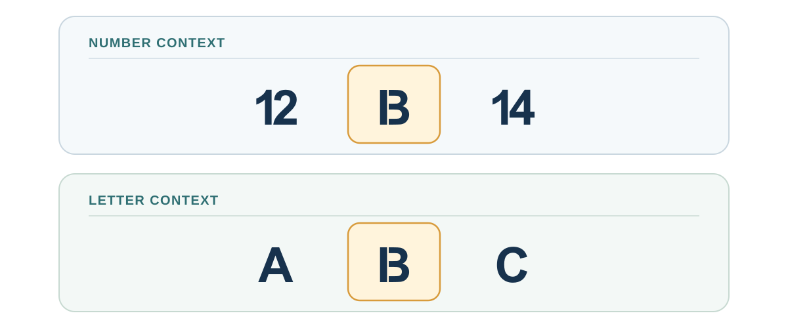
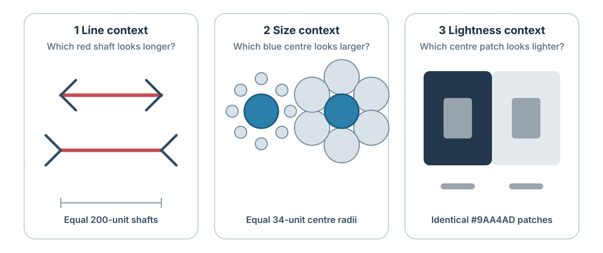
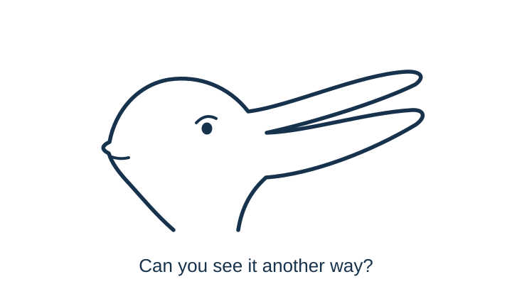
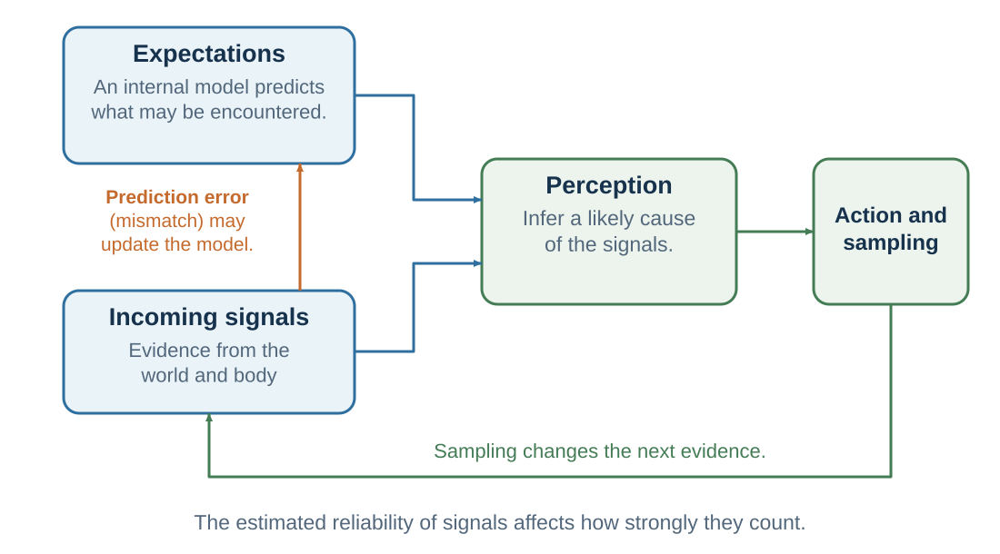

---
aliases:
  - 06-the-predictive-mind.html
---

# The Predictive Mind: Perception Is Inference

*Perception is inference constrained by sensory evidence*

::: {.chapter-epigraph}
> “Perceptions may be compared with hypotheses in science.”
>
> — Richard L. Gregory, [“Perceptions as Hypotheses”](https://doi.org/10.1098/rstb.1980.0090), 1980, p. 181
:::

Walking into a dim kitchen, you recognize the table before you can make out its edges. A familiar shape beside it is probably a chair, although a coat draped over the back makes the outline uncertain. You move closer, and the shape becomes easier to identify.

You need a usable picture of the room before every edge becomes clear, and experience supplies it. But familiarity can also make the wrong interpretation feel immediately right. The difficulty is knowing when to act on what seems obvious and when to seek a better view. This chapter asks how expectations help construct perception—and what allows evidence to correct it.

::: {.callout-note .core-idea icon=false}
## Core Idea

Sensory evidence often fits more than one possible cause. Prior experience and context help resolve the ambiguity, while new evidence can correct the interpretation. The practical task is to recognize what you expected and seek an observation that could distinguish it from another plausible account.

:::

## Learning goals

- Explain perception as inference rather than recording.
- Describe priors, sensory evidence, prediction error, and precision in plain language.
- Distinguish perceptual prediction from a decision forecast, and specify an observation that could distinguish two competing interpretations.
- Explain how context guides generative AI, and where the analogy with predictive processing stops.

The idea of perception as **inference** goes back at least to Helmholtz: the mind uses incomplete signals to infer their causes without requiring conscious calculation (Helmholtz, 1867/1962). Later accounts differ in how they explain this process (Gregory, 1980; Kersten et al., 2004; Knill & Richards, 1996; Rock, 1983). A **prior** is an expectation formed before the current evidence is considered. In the kitchen, familiarity with the room helps make a chair a plausible interpretation.

Predictive processing offers one influential family of models for how expectations and incoming signals might interact.

## Two meanings of prediction

Recognizing a chair and forecasting the result of taking a job both draw on prior information. Yet a model that explains the first has not thereby supplied a reliable forecast of the second. To connect perception with decision-making, we need to specify what **prediction** is about in each case.

| Use of prediction | Meaning in this book |
| --- | --- |
| **Prediction in predictive processing** | An internal model anticipates sensory signals or infers their hidden causes. A mismatch between expected and incoming signals can alter perception or update the model. |
| **Prediction in judgment and decision-making** | A person or model forecasts a state or consequence that may occur, often under a specified option and time horizon. The forecast becomes one input into valuation and choice. |
: Predictive processing and predictive judgment ask different questions {#tbl-two-meanings-prediction}

The first asks, in effect, **“What is producing the signals I am receiving?”** The second asks **“What is likely to happen if this option is chosen?”** Both use prior information and uncertainty, but they predict different objects and are evaluated against different evidence.

This chapter concentrates on interpreting current signals. It also uses generative AI to illuminate how learned patterns and context work together, while distinguishing content generation from forecasting real events. The later chapters on expectations and probability judgment ask how people forecast consequences.

## When context changes what appears

Read the middle symbol in each row below. Its shape is identical in the two rows, but the neighbors invite different readings. The example isolates a useful question: how much of the interpretation came from the mark, and how much came from its setting?

{#fig-context-b13-demonstration fig-alt="Two horizontal rows contain the same central ambiguous mark. The top row places it between 12 and 14, encouraging a reading of 13. The bottom row places it between A and C, encouraging a reading of B." width=100%}

Other demonstrations use shadows, shading, or synchronized touch to show how sensory signals are organized into an experience (Adelson, 2000; Ramachandran, 1988; Botvinick & Cohen, 1998).

The same teaching logic works when the target can be measured directly. In @fig-perception-context-lab, the paired shafts, centre circles, and grey patches are physically identical within each comparison. The surrounding geometry or luminance changes their appearance. Measuring the target can correct the judgment without necessarily turning off the impression.

{#fig-perception-context-lab fig-alt="Three panels compare physically identical targets in different contexts. Equal horizontal shafts have different arrow fins, equal blue centre circles are surrounded by small or large circles, and identical grey patches appear on dark and light backgrounds. Each panel states the physical equality and invites readers to measure the target." width=100%}

### Learned context gives color a meaning {#color-and-illumination-context}

Look first at the isolated light on the left in @fig-traffic-light-color-context. What color would you call it? Now look at the upper lamp on the right. Both show the same lens, but only the right supplies its familiar setting. Does recognizing the traffic signal make the upper light seem redder?

{#fig-traffic-light-color-context fig-alt="The left panel contains only a gray textured lens on a plain blue-green background, with no frame or other objects. The right places the identical lens at the same size and height at the top of a three-lamp traffic signal in a blue-green scene. The familiar upper position supplies the learned expectation of red." width=100%}

The scene brings learned knowledge into play: in a familiar vertical traffic signal, the top lamp is red. Recognizing the signal makes red an expected interpretation of the upper lens. The isolated circle offers no such positional clue. Cover the housing and lower lamps, then reveal them again; notice both the color you assign to the lens and how it appears.[^ch04-color-cues] **The context tells us what the sensory evidence is likely to mean.**

Laboratory studies capture a related influence of familiar colors. When observers adjusted banana images until they looked gray, they shifted them slightly toward blue compared with their gray settings for unfamiliar control patches—the direction opposite to a banana's familiar yellow (Hansen et al., 2006). Related effects occur for familiar manufactured objects whose typical colors are learned through experience (Witzel et al., 2011).

The blue-green scene also supplies information about illumination. **Color constancy** helps an object's perceived color remain relatively stable as illumination changes: a white shirt can still look white in warm indoor light or cool daylight (Foster, 2011). Interpreting a scene can change that judgment. In a laboratory demonstration, changing the perceived folding direction of a card changed its apparent color in a way consistent with altered interpretation of light reflected between its surfaces (Bloj et al., 1999). The familiar object and the light falling on it jointly inform the interpretation.

### One drawing, two animals {#ambiguous-animals-and-seasonal-context}

Before reading the caption, name the animal in @fig-duck-rabbit-context. Then try to find another animal without rotating the image. The challenge is to reorganize the same marks, not discover a second hidden drawing.

{#fig-duck-rabbit-context fig-alt="A single navy outline on white has a shared eye, rounded head, and two long extensions pointing right. It can be interpreted as a duck facing right, with the extensions forming its bill, or as a rabbit facing left, with the extensions forming its ears." width=100%}

Once one interpretation takes hold, the parts seem to fall into place: the same extension that was a bill becomes an ear. What is already accessible in memory is one possible influence on which reading arrives first. Around Easter, rabbits may be especially accessible to people familiar with that celebration. Brugger and Brugger (1993) reported a striking seasonal pattern: Zurich Zoo visitors tested on Easter Sunday predominantly named a rabbit, whereas a different group tested on an October Sunday predominantly named a bird.[^ch04-seasonal-design]

The seasonal story also needs an update. A later study conducted in the weeks around Easter found predominantly bird responses, failing to reproduce rabbit predominance (Dudda et al., 2026). The evidence for a seasonal influence is mixed. The drawing makes the perceptual point directly: **one set of marks can support more than one coherent interpretation**.

### A hollow face that seems to look back {#hollow-face-illusion}

Imagine looking into the inside of a face mask. Its nose recedes into the surface, yet you may see a normal face with a nose projecting toward you. This is the **hollow-face illusion**: a concave face can appear convex. Even knowing that the mask is hollow need not make it look hollow (Hill & Johnston, 2007).

Watch the upper mask in the demonstration, then compare it with the featureless hollow surface below. Does the face seem to bulge toward you? Does its apparent shape change as it turns? Try separating what you **know about the shape** from what you **see**.

::: {.content-visible unless-format="epub"}
```{=html}
<div class="book-video-portrait">
  <iframe width="640" height="1280" title="Hollow-face illusion: rotating concave face above a featureless concave surface" aria-describedby="hollow-face-media-description" frameborder="0" loading="lazy" allow="autoplay; fullscreen; picture-in-picture; clipboard-write; web-share" allowfullscreen src="https://commons.wikimedia.org/wiki/File:Hollow-face_illusion_with_rotating_mask_and_featureless_control_surface.webm?embedplayer=true"></iframe>
</div>
```
:::

::: {#hollow-face-media-description}
**Video demonstration.** Two computer-rendered hollow surfaces rotate: a face above and a featureless surface below. The face may look solid while the lower surface is easier to see as hollow. [Watch or replay the video on Wikimedia Commons](https://commons.wikimedia.org/wiki/File:Hollow-face_illusion_with_rotating_mask_and_featureless_control_surface.webm).

Video by Co (uploaded as Iljsdf), 2026, shown unchanged; [CC BY-SA 4.0](https://creativecommons.org/licenses/by-sa/4.0/).
:::

Familiar faces provide a powerful expectation about shape. Experiments find that upright orientation strengthens the illusion, while lighting and information from binocular vision also influence it (Hill & Bruce, 1993). Familiar facial shading and coloration can enhance the effect further (Hill & Johnston, 2007). The explanation therefore involves both learned expectations and the available visual cues.

For a closer look, [rotate the 3D face model yourself](https://3dviewer.net/#model=https://upload.wikimedia.org/wikipedia/commons/d/db/Hollow_face_illusion.stl). Drag to inspect it from the side and behind, where its hollow geometry is easier to check. Then return toward a frontal view. **An impression can remain convincing even after another observation reveals why it is misleading.** In decision-making, this is a reason to seek a diagnostic view of the evidence rather than rely on how certain an interpretation feels.

The linked [3D model](https://commons.wikimedia.org/wiki/File:Hollow_face_illusion.stl) was designed by Wael Tsar, recentered, symmetrized, and converted to STL by cmglee; [CC BY 4.0](https://creativecommons.org/licenses/by/4.0/).

## Prediction, error, and precision

Suppose the chair has been moved. Your first interpretation places it where it usually stands, but approaching it reveals a mismatch. A **prediction error** is a discrepancy between an expected signal and an incoming one. In predictive-processing models, such discrepancies can change the interpretation or update what is expected next time (Clark, 2013; Friston, 2010; Hohwy, 2013; Rao & Ballard, 1999).

How much should a discrepancy matter? In dim light, one uncertain outline may deserve little weight; after the light is switched on, the same location provides clearer evidence. **Precision** means estimated reliability, often formalized as inverse variance. A signal treated as more reliable has greater influence on the relevant update. Precision does not simply mean importance, emotional force, or confidence stated aloud.

The **generative process** is the world and body producing the observations; the **generative model** is the system's account of how those observations could arise. The actual chair belongs to the process, while expectations about its location belong to the model. Keeping them separate matters because a familiar model can be wrong.

{#fig-predictive-processing-decision fig-alt="Expectations and incoming signals converge on perception. Perception informs action and sampling, which changes the next evidence. A feedback arrow shows that mismatch can update the internal model; a note explains that estimated reliability affects the weight of signals."}

Predictive-processing models differ in their scope and implementation. Some model aspects of attention through precision assignment (Feldman & Friston, 2010), but precision and attention are not interchangeable. A smaller prediction error also need not mean a better account of the world if the system sampled only evidence that its model already explains.

::: {.callout-note .research-lens icon=false collapse=true #research-lens-from-predictive-processing-to-active-inference}
## Research Lens: from predictive processing to active inference {#research-lens-from-predictive-processing-to-active-inference-title}

Predictive processing is a family of accounts in which perception and
learning involve predictions, precision-weighted errors, and belief
updating. **Active inference** develops a formal account of action as well as perception. One practical insight is that action changes
the observations on which the next judgment will be based (Friston et
al., 2017; Da Costa et al., 2020; Parr et al., 2022). Putting on a coat
changes bodily signals. Asking what would make a negotiation offer feasible can reveal information that accepting it immediately would leave unknown.

This suggests a usable two-question check before acting:

- **Outcome value:** Which action is most likely to produce the outcome
  I currently prefer?
- **Information value:** Which feasible action would most reduce an
  uncertainty that could change the decision?

A small pilot may be preferable to immediate scaling when the expected
value of resolving a decisive uncertainty exceeds the pilot's costs; once
that uncertainty is resolved, further exploration may add little (Friston et al., 2015). Some actions both produce outcomes and improve the evidence available for the next choice.

In formal models, variational and expected free energy are technical
quantities, not synonyms for surprise as a feeling, anxiety, discomfort,
or “negative energy” (Friston, 2010; Parr et al., 2022). A research
application must specify hidden states, observations, policies, preferred
outcomes, learning rules, and free parameters; it should test parameter
recovery where parameters carry psychological meaning, predict new data,
and be compared with simpler alternatives rather than redescribing every
result after it occurs. Readers who need the
formal derivations should use the cited technical sources. [Appendix
E](../appendices/appendix-e-how-behavioral-evidence-is-built.qmd#separate-description-prediction-causation-and-mechanism)
provides the complementary discipline for turning a model into a claim
that evidence can distinguish from its rivals.
:::


## Generative AI: context changes what comes next {#generative-ai-and-predictive-processing}

Consider the unfinished sentence **“At the bank, she…”** After a paragraph about fishing, *cast her line* would be a plausible continuation. After a paragraph about opening a savings account, *asked about interest rates* would fit better. The words to be continued are unchanged, but the setting changes what a good answer would be. Like the neighbors around the ambiguous symbol in @fig-context-b13-demonstration, surrounding information guides interpretation. This is useful when context clarifies a task; it becomes consequential when an assumption embedded in the question quietly guides the answer.

A **large language model**, or **LLM**, makes this dependence on context especially visible. A generative language model learns patterns from training material and uses them to construct text. Its output depends on both what training has encoded and the input available now. That combination offers a useful comparison with perception: incomplete information becomes meaningful through learned structure and present context.

### What does a language model predict?

In an **autoregressive** language model, generation proceeds by estimating probabilities for the next **token**: a unit of text that may be a word, part of a word, or punctuation. The model uses the available context, including earlier generated text, rather than only the immediately preceding word. A token is selected, appended, and becomes part of the context for the next step. Selection can involve sampling; the system need not always choose the most probable token (Vaswani et al., 2017; Brown et al., 2020).

Here, **“next” means the next position in the output**, not necessarily the next event in the world. The model can continue a historical account, a fictional story, or a plan for tomorrow. The prediction task is simple to state, but performing it well across varied texts draws on complex dependencies. Brown et al. (2020), for example, demonstrated translation and question answering from instructions and examples supplied in context, with substantial differences in performance across tasks.

### A prompt supplies a setting for interpretation

A **prompt** can supply instructions, examples, facts, and a conversation history. It plays a role analogous to contextual cues: it helps establish what the current task is and which responses fit. The model's learned parameters supply enduring structure; its temporary internal representations depend on the input being processed. During ordinary prompting, those representations change without retraining the parameters. This distinction underlies **in-context learning**: examples can alter how a task is performed without a training update to the model's weights (Brown et al., 2020).

In predictive processing, current context includes sensory input and bodily state, while ongoing action can reveal new evidence. A person's current state is much richer than a written prompt. Predictive-processing theories describe how expectations and mismatches may support perceptual inference; standard text generation does not automatically compare every continuation with a fresh observation of the world (Clark, 2013; Vaswani et al., 2017). The shared principle is **learned structure interacting with current information**.

### Images and videos: generation is broader than next-token prediction

An autoregressive language model builds an output token by token. It is tempting to extend that picture to a painting assembled pixel by pixel or a film generated strictly frame by frame, but that would miss how other major generative systems work.

The family of generative models extends beyond language and uses several generation procedures. **Diffusion models** can start from noise and repeatedly refine it toward a generated sample. Latent diffusion performs this process in a compressed representation of an image, with text or other inputs guiding the result (Rombach et al., 2022). Video diffusion can refine a whole group of frames together; groups can also be extended using earlier frames as context (Ho et al., 2022).

Across these examples, learned patterns and supplied context constrain what gets generated. A convincing picture of a flooded street or video of a future city can help us imagine a possibility.

### Change the question—and then seek evidence

This comparison suggests a practical discipline for both thinking and prompting. **“Why did my team resist a useful change?”** already assumes that the change was useful and that resistance is the problem. A more open inquiry would provide the observations, ask for competing explanations, and specify what evidence would distinguish them. Perhaps the team misunderstood the change; perhaps it recognized a cost the manager overlooked.

Changing the frame can open another possibility. It cannot settle which possibility is correct. That requires evidence beyond the plausibility of the account. [Chapter 42](42-data-driven-decision-making.qmd#ai-workbench) builds on this distinction: generative AI can help articulate options and questions, while predictions used for consequential choices need validation and the values guiding those choices need explicit human judgment.

## When inner models help—and when they stop learning

The illusions might suggest that we should strip away expectations and rely on incoming evidence alone. Yet without learned structure, the evidence would be much harder to use. The challenge is to keep the interpretive advantage while allowing a mistaken model to change.

Inner models make perception usable. Reading requires models of letters, words, and grammar; crossing a street requires expectations about vehicles, signals, and speed. Expertise develops when repeated experience builds models that detect meaningful patterns. A radiologist sees structure in an image that a novice cannot, and an experienced firefighter may notice that a fire is behaving abnormally.

Models also determine what can be noticed. An organization without a concept of psychological safety may interpret silence as agreement. A manager without a model of incentive conflict may explain strategic behavior as personality. A student without the concept of opportunity cost may see only the chosen benefit and not the best alternative forgone. Better concepts can make previously invisible features of a decision visible.

When applying these ideas to everyday judgment, three possible obstacles are worth investigating:

1. **The prior becomes too rigid.** Ambiguous evidence is repeatedly interpreted in the expected direction.
2. **Reliability is judged selectively.** Confirming signals are treated as diagnostic while disconfirming signals are dismissed as noise. Emotion, identity, and incentives can influence this weighting.
3. **Action protects the model.** Avoidance, micromanagement, underinvestment in testing, or failure to ask diagnostic questions prevents informative feedback.

More information is therefore not automatic correction. A signal changes the model only if it enters attention, is treated as sufficiently reliable, and can be integrated into the current account. If it is dismissed as irrelevant or noisy, the model may survive unchanged.

Calibration therefore requires more than confidence. Ask:

- What am I expecting to see?
- Which observation would be more likely if my model were wrong?
- Why am I treating one signal as reliable and another as noise?
- What alternative model explains the same evidence?
- What feasible action would test the model rather than protect it?

These questions prepare the way for later chapters on heuristics, belief protection, framing, and probability judgment. Many errors begin before a final choice, in what attention selects and what the current model makes plausible.

## Research Lens: Shirl Jennings and learning to see {#research-lens-restored-sight-as-a-bounded-calibration-case}

Shirl Jennings knew his world through touch, sound, and movement long before surgery offered a new way into it. His eyesight had deteriorated after a serious illness at three. In 1991, at age 51, cataract surgery restored some vision after decades of severe visual impairment (Associated Press, 1999).

Restoring visual input might seem to be enough to reveal a world Jennings already knew by touch. Receiving visual information, however, did not make familiar objects instantly recognizable. Jennings sometimes needed to touch an object to distinguish a table from a chair (Associated Press, 1999). His surgeon identifies him as the man Oliver Sacks described under the name **Virgil** (Woodhams, n.d.). In Sacks's account, colors, movements, and shapes became visible, while organizing them into recognizable objects and coherent scenes remained difficult (Sacks, 1993).

**Detecting visual features and understanding what they belong to are different achievements.** Jennings already had knowledge of objects and ways of navigating his surroundings. The challenge was connecting newly available visual patterns with that knowledge. His experience makes the work of perceptual learning concrete.[^ch04-jennings-vision]

Systematic research offers a complementary test. Newly sighted participants initially struggled to match a seen object with one known by touch, then improved rapidly (Held et al., 2011). That improvement matters as much as the initial difficulty: new connections could develop through experience.

The target is therefore not perception with fewer predictions. Learned
structure helps sensory signals become a usable account of the world.
Nor is the target prediction that overrides every
mismatch. A calibrated system uses priors to interpret incomplete input,
weights current evidence by its reliability, and remains capable of
updating when persistent error deserves trust.

::: {.callout-tip .calibration-test icon=false}
## Calibration test

For one disputed perception or interpretation, write four lines: **prior
model**, **current evidence**, **why each source deserves its present
weight**, and **what observation would change that weight**. “Use less
intuition” is not yet a test; specify what evidence should become more
diagnostic.
:::

## Practice Lab

Choose a disagreement in which two people received similar information but inferred different situations. Produce a two-model test: state each person's prior model, identify the signal each treated as most precise, and name one feasible observation that would be expected under one model but not the other. End by stating what action would follow from each possible result.

For an AI extension, describe the same fictional workplace incident in two prompts, keeping the observations fixed but changing the framing question. Use a fresh conversation with the same model and settings for each trial. Compare the explanations an LLM offers, and repeat each prompt to see how much outputs vary even without a framing change. Which claims came from the supplied observations, and which were added? Name one external observation needed to evaluate the competing accounts.

## Take it forward

In the kitchen, moving closer or switching on the light can settle what the uncertain shape is. In a disagreement, the equivalent move is to ask what observation would separate the competing interpretations. Before gathering more information, write down what each account predicts; otherwise, the same evidence may simply be absorbed into the explanation you already prefer.

[^ch04-color-cues]: The display combines learned signal identity with chromatic contrast, adaptation, and inferred illumination (Shevell & Kingdom, 2008). The lens is identical, but other surrounding cues differ. Memory-color effects in judgments need not always imply a corresponding change in visual appearance (Valenti & Firestone, 2019).
[^ch04-seasonal-design]: Brugger and Brugger (1993) compared different visitor groups on two dates. Dudda et al. (2026) sampled in the weeks around Easter, using different collection procedures and without an October comparison.
[^ch04-jennings-vision]: Residual eye damage and later serious illness also affected Jennings’s vision (Sacks, 1993).

## References cited in this chapter

::: {.reference}
Adelson, E. H. (2000). Lightness perception and lightness illusions. In M. Gazzaniga (Ed.), The new cognitive neurosciences (2nd ed., pp. 339–351). MIT Press.
:::

::: {.reference}
Associated Press. (1999, February 1). Gift of sight brought fear, frustration. *Deseret News*. [Original reporting](https://www.deseret.com/1999/2/1/19421794/gift-of-sight-brought-fear-frustration/).
:::

::: {.reference}
Bloj, M. G., Kersten, D., & Hurlbert, A. C. (1999). Perception of three-dimensional shape influences colour perception through mutual illumination. *Nature, 402*(6764), 877–879. [Published paper](https://doi.org/10.1038/47245).
:::

::: {.reference}
Botvinick, M., & Cohen, J. (1998). Rubber hands “feel” touch that eyes see. Nature, 391(6669), 756.
:::

::: {.reference}
Brown, T. B., Mann, B., Ryder, N., Subbiah, M., Kaplan, J., Dhariwal, P., Neelakantan, A., Shyam, P., Sastry, G., Askell, A., Agarwal, S., Herbert-Voss, A., Krueger, G., Henighan, T., Child, R., Ramesh, A., Ziegler, D. M., Wu, J., Winter, C., Hesse, C., Chen, M., Sigler, E., Litwin, M., Gray, S., Chess, B., Clark, J., Berner, C., McCandlish, S., Radford, A., Sutskever, I., & Amodei, D. (2020). Language models are few-shot learners. *Advances in Neural Information Processing Systems, 33*. [Published paper](https://proceedings.neurips.cc/paper/2020/hash/1457c0d6bfcb4967418bfb8ac142f64a-Abstract.html).
:::

::: {.reference}
Brugger, P., & Brugger, S. (1993). The Easter bunny in October: Is it disguised as a duck? *Perceptual and Motor Skills, 76*(2), 577–578. [Published paper](https://doi.org/10.2466/pms.1993.76.2.577).
:::

::: {.reference}
Clark, A. (2013). Whatever next? Predictive brains, situated agents, and the future of cognitive science. Behavioral and Brain Sciences, 36(3), 181–204.
:::

::: {.reference}
Da Costa, L., Parr, T., Sajid, N., Veselic, S., Neacsu, V., & Friston, K. (2020). Active inference on discrete state-spaces: A synthesis. *Journal of Mathematical Psychology, 99*, 102447.
:::

::: {.reference}
Dudda, L., Van der Hulst, E., Sahan, M. I., & Verheyen, S. (2026). Replication is child's play. *Open Education Studies, 8*(1), Article 20250134. [Published paper](https://doi.org/10.1515/edu-2025-0134).
:::

::: {.reference}
Feldman, H., & Friston, K. J. (2010). Attention, uncertainty, and free-energy. Frontiers in Human Neuroscience, 4, Article 215.
:::

::: {.reference}
Foster, D. H. (2011). Color constancy. *Vision Research, 51*(7), 674–700. [Published paper](https://doi.org/10.1016/j.visres.2010.09.006).
:::

::: {.reference}
Friston, K. (2010). The free-energy principle: A unified brain theory? Nature Reviews Neuroscience, 11(2), 127–138.
:::

::: {.reference}
Friston, K., Rigoli, F., Ognibene, D., Mathys, C., Fitzgerald, T., & Pezzulo, G. (2015). Active inference and epistemic value. *Cognitive Neuroscience, 6*(4), 187–214.
:::

::: {.reference}
Friston, K. J., FitzGerald, T., Rigoli, F., Schwartenbeck, P., & Pezzulo, G. (2017). Active inference: A process theory. Neural Computation, 29(1), 1–49.
:::

::: {.reference}
Gregory, R. L. (1980). Perceptions as hypotheses. Philosophical Transactions of the Royal Society of London. Series B, Biological Sciences, 290(1038), 181–197.
:::

::: {.reference}
Hansen, T., Olkkonen, M., Walter, S., & Gegenfurtner, K. R. (2006). Memory modulates color appearance. *Nature Neuroscience, 9*(11), 1367–1368. [Published paper](https://doi.org/10.1038/nn1794).
:::

::: {.reference}
Held, R., Ostrovsky, Y., de Gelder, B., Gandhi, T., Ganesh, S., Mathur, U., & Sinha, P. (2011). The newly sighted fail to match seen with felt. *Nature Neuroscience, 14*(5), 551–553.
:::

::: {.reference}
Helmholtz, H. von. (1962). Treatise on physiological optics (J. P. C. Southall, Trans.). Dover. (Original work published 1867)
:::

::: {.reference}
Hill, H., & Bruce, V. (1993). Independent effects of lighting, orientation, and stereopsis on the hollow-face illusion. *Perception, 22*(8), 887–897. [Published paper](https://doi.org/10.1068/p220887).
:::

::: {.reference}
Hill, H., & Johnston, A. (2007). The hollow-face illusion: Object-specific knowledge, general assumptions or properties of the stimulus? *Perception, 36*(2), 199–223. [Published paper](https://doi.org/10.1068/p5523).
:::

::: {.reference}
Ho, J., Salimans, T., Gritsenko, A., Chan, W., Norouzi, M., & Fleet, D. J. (2022). Video diffusion models. *Advances in Neural Information Processing Systems, 35*, 8633–8646. [Published paper](https://proceedings.neurips.cc/paper_files/paper/2022/hash/39235c56aef13fb05a6adc95eb9d8d66-Abstract-Conference.html).
:::

::: {.reference}
Hohwy, J. (2013). The predictive mind. Oxford University Press.
:::

::: {.reference}
Kersten, D., Mamassian, P., & Yuille, A. (2004). Object perception as Bayesian inference. Annual Review of Psychology, 55, 271–304.
:::

::: {.reference}
Knill, D. C., & Richards, W. (Eds.). (1996). Perception as Bayesian inference. Cambridge University Press.
:::

::: {.reference}
Parr, T., Pezzulo, G., & Friston, K. J. (2022). *Active inference: The free energy principle in mind, brain, and behavior.* MIT Press.
:::

::: {.reference}
Ramachandran, V. S. (1988). Perception of shape from shading. Nature, 331(6152), 163–166.
:::

::: {.reference}
Rao, R. P. N., & Ballard, D. H. (1999). Predictive coding in the visual cortex: A functional interpretation of some extra-classical receptive-field effects. Nature Neuroscience, 2(1), 79–87.
:::

::: {.reference}
Rock, I. (1983). The logic of perception. MIT Press.
:::

::: {.reference}
Rombach, R., Blattmann, A., Lorenz, D., Esser, P., & Ommer, B. (2022). High-resolution image synthesis with latent diffusion models. *Proceedings of the IEEE/CVF Conference on Computer Vision and Pattern Recognition*, 10684–10695. [Published paper](https://openaccess.thecvf.com/content/CVPR2022/html/Rombach_High-Resolution_Image_Synthesis_With_Latent_Diffusion_Models_CVPR_2022_paper.html).
:::

::: {.reference}
Sacks, O. (1993, May 10). To see and not see. *The New Yorker*. [Published essay](https://www.newyorker.com/magazine/1993/05/10/to-see-and-not-see-oliver-sacks).
:::

::: {.reference}
Shevell, S. K., & Kingdom, F. A. A. (2008). Color in complex scenes. *Annual Review of Psychology, 59*, 143–166. [Published paper](https://doi.org/10.1146/annurev.psych.59.103006.093619).
:::

::: {.reference}
Valenti, J. J., & Firestone, C. (2019). Finding the “odd one out”: Memory color effects and the logic of appearance. *Cognition, 191*, 103934. [Published paper](https://doi.org/10.1016/j.cognition.2019.04.003).
:::

::: {.reference}
Vaswani, A., Shazeer, N., Parmar, N., Uszkoreit, J., Jones, L., Gomez, A. N., Kaiser, Ł., & Polosukhin, I. (2017). Attention is all you need. *Advances in Neural Information Processing Systems, 30*. [Published paper](https://proceedings.neurips.cc/paper_files/paper/2017/hash/3f5ee243547dee91fbd053c1c4a845aa-Abstract.html).
:::

::: {.reference}
Witzel, C., Valkova, H., Hansen, T., & Gegenfurtner, K. R. (2011). Object knowledge modulates colour appearance. *i-Perception, 2*(1), 13–49. [Published paper](https://doi.org/10.1068/i0396).
:::

::: {.reference}
Woodhams, J. T. (n.d.). Do people who are blind who all of a sudden gain eyesight feel overwhelmed with colors, seeing how people really look like, etc.? *Woodhams Eye Clinic*. [Treating surgeon's account](https://woodhamseye.com/do-people-who-are-blind-who-all-of-a-sudden-gain-eyesight-feel-overwhelmed-with-colors/).
:::
