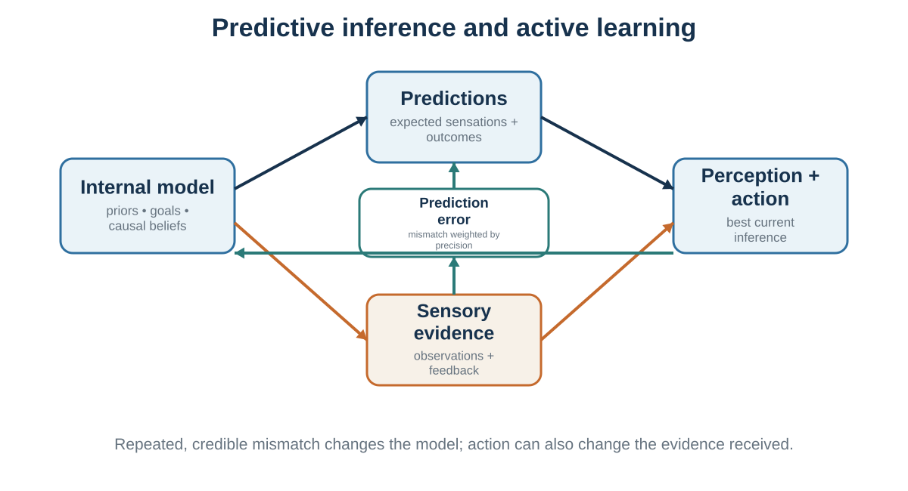

# The Predictive Mind

*Perception is inference constrained by sensory evidence*

::: {.callout-note .core-idea icon=false}
## Core Idea

The brain does not passively record the world. It combines incomplete sensory signals with prior models, goals, context, and estimates of reliability to infer what is present and what action is appropriate.
:::

## Learning goals

- Explain perception as inference rather than recording.
- Describe predictive processing, prediction error, and precision in plain language.
- Use illusions to reveal the assumptions of ordinary perception.
- Explain how inner models can support expertise or protect themselves from correction.

If perception is not complete sensory recording, what is it?

A powerful answer is that perception is inference. The brain uses incomplete sensory evidence to infer the most likely causes of that evidence. This idea goes back at least to Helmholtz, who described perception as unconscious inference (Helmholtz, 1867/1962). Later work in psychology and cognitive science developed this idea through theories of constructivist perception, Bayesian perception, and predictive processing (Gregory, 1980; Kersten et al., 2004; Knill & Richards, 1996; Rock, 1983).

The brain does not simply ask, “What light hit the retina?” It asks, in effect, “What in the world is most likely to have caused this pattern of light?” The answer depends on sensory evidence, but also on context, prior experience, expectations, goals, and assumptions about how the world usually works.

This is why illusions are so useful. Illusions are not merely tricks. They reveal the assumptions the visual system uses to construct experience.

Consider brightness and shadow illusions. Two regions with the same physical luminance can appear different because the visual system interprets one as being in shadow and the other as being in light. Adelson’s checker-shadow illusion is a famous example: squares with identical luminance appear different because the brain estimates surface reflectance by taking illumination into account (Adelson, 2000). The visual system is not measuring raw light; it is inferring surfaces under lighting conditions.

Shape-from-shading illusions reveal another assumption: light usually comes from above. When we see patterns of light and dark, the brain uses a “light-from-above” prior to infer whether shapes are bumps or dents (Ramachandran, 1988). The same image can appear as a raised surface or a hollow depending on orientation. The sensory input is the same; the inferred cause changes.

Faces provide another example. Humans have strong priors about faces because faces are socially important. The Thatcher illusion shows that grotesque changes to facial features are much harder to notice when a face is upside down than when it is upright (Thompson, 1980). We have powerful models for upright faces, weaker models for inverted ones. Perception depends on the match between sensory input and learned models.

The Kanizsa triangle demonstrates how the visual system constructs edges and shapes not physically present in the image (Kanizsa, 1976). We perceive a bright triangle because the arrangement suggests an occluding surface. The brain infers a coherent object from incomplete evidence.

Body ownership can also be inferred. In the rubber hand illusion, a visible rubber hand is stroked in synchrony with a participant’s hidden real hand. Many participants begin to feel as if the rubber hand is part of their body (Botvinick & Cohen, 1998). The brain integrates visual, tactile, and proprioceptive evidence and infers a common cause. Body ownership, which feels immediate and obvious, is partly constructed.

These examples show that perception is active interpretation. The brain uses prior knowledge because sensory information is ambiguous. A given retinal image could be caused by many possible arrangements of objects, lighting, distance, and movement. Perception resolves ambiguity by using assumptions that usually work.

This is adaptive. If perception required complete data, action would be too slow. Priors allow the brain to act quickly in uncertain environments. But priors can also mislead.

A person afraid of spiders may perceive a spider as larger or more threatening than another person would. Research suggests that fear and desire can influence perceptual judgments of distance, size, and slope, although the interpretation of such effects remains debated (Balcetis & Dunning, 2010; Proffitt, 2006; Stefanucci & Proffitt, 2009). A person with social anxiety may interpret neutral expressions as hostile. A medical student who has just learned about a disease may notice normal bodily sensations and interpret them as symptoms. A manager expecting resistance may perceive questions from employees as opposition rather than curiosity.

Perception is constrained by the world, but not dictated by it. It is neither pure reality nor pure imagination. It is a controlled construction: a best guess, shaped by evidence and prior models.

This has a major implication for disagreement. People who disagree may not be “looking at the same thing” in the psychological sense. They may receive similar sensory input but interpret it through different models. One person sees a risky disruption; another sees an opportunity. One sees disrespect; another sees honesty. One sees a vague proposal; another sees flexibility. One sees a suspicious pause in a negotiation; another sees careful thought.

Better decisions require not only better data, but better awareness of the models through which data are interpreted.

## Prediction, error, and precision

{#fig-predictive-loop fig-alt="A loop linking internal model, predictions, sensory evidence, prediction error, perception and action, and model updating."}

The idea that perception is inference becomes more powerful in predictive processing. Predictive processing theories propose that the brain is constantly generating predictions about sensory input and updating those predictions when errors occur (Clark, 2013; Friston, 2010; Hohwy, 2013; Rao & Ballard, 1999). The brain does not wait passively for the world to arrive. It predicts the world, compares prediction with incoming evidence, and revises its model when mismatch matters.

In this framework, the brain maintains a generative model: an internal model of what causes sensory input. The model generates predictions about what should be seen, heard, felt, or experienced. Incoming sensory signals are compared with predictions. The difference is called prediction error.

If prediction error is small, the model is working well enough. If prediction error is large and reliable, the brain updates its beliefs or directs action to reduce the mismatch.

For example, when you walk into your kitchen at night, your brain predicts the location of furniture, the feel of the floor, and the likely appearance of objects. You do not need to reconstruct the room from scratch. But if a chair has been moved, your foot bumps into it. Prediction error occurs. You update: the chair is not where expected.

Predictive processing helps explain why perception is fast. The brain does not process every detail equally. It predicts what is likely and focuses processing on what is surprising, uncertain, or important. This makes perception efficient. It also makes it vulnerable to expectation.

Attention plays a central role in predictive processing. In this framework, attention can be understood partly as the assignment of precision to prediction errors (Feldman & Friston, 2010). Precision means the estimated reliability or importance of a signal. If a sensory signal is treated as precise, it has more influence on updating perception. If it is treated as noisy or irrelevant, it has less influence.

This idea helps explain why attention changes perception. If you are listening for your name in a noisy room, speech sounds related to your name receive high precision. If you are searching for a typo, letter-level details become more precise. If you are afraid of threat, threat cues receive more precision. If you are motivated to defend a belief, evidence consistent with that belief may receive more weight than evidence against it.

Predictive processing also connects perception with action. Active inference theories extend the predictive framework by proposing that organisms reduce prediction error not only by updating beliefs but also by acting to make the world fit predictions or preferred states (Friston, 2010; Friston et al., 2017). If you predict that your body should be warm, you put on a coat. If you expect a cup to be in your hand, you reach for it. If you want uncertainty reduced, you look more closely, ask a question, run an experiment, or check the data.

This connects directly to decision-making. Judgment is not simply receiving information, forming beliefs, and then choosing. The brain predicts, samples, compares, updates, and acts in a continuous loop. It chooses actions that help achieve preferred states, reduce uncertainty, or confirm and refine its model of the world.

This does not mean the brain is always accurate. A predictive system can become trapped if its priors are too strong, if it samples evidence selectively, or if it acts in ways that prevent disconfirmation.

Consider social anxiety. A person expects rejection, attends to ambiguous signs of disapproval, interprets neutral expressions negatively, avoids interaction, and therefore loses opportunities to learn that others might respond warmly. The model predicts rejection; attention finds threat; action prevents correction. The prediction becomes self-protecting.

Consider organizational strategy. A leadership team believes customers do not want a new product. They do little market testing, underinvest in prototypes, and interpret weak early signals as confirmation. Their action produces the world they expected. Again, prediction guides sampling and action.

Consider medical diagnosis. A physician with a strong early hypothesis may attend to confirming symptoms and underweight disconfirming evidence. Expertise helps when the hypothesis is right, but premature closure can be dangerous. Diagnostic reasoning therefore requires deliberate checks against alternative explanations (Croskerry, 2003).

Predictive processing helps explain why “just give people more information” is often insufficient. New information changes judgment only if it is attended to, treated as reliable, and integrated into the person’s model. If the model dismisses the information as irrelevant, biased, threatening, or noisy, the information may not update belief.

This is why decision science must study internal models, not just external data.

## When inner models help - and trap

Inner models are essential. Without them, the world would be chaotic.

Imagine trying to read without prior knowledge of letters, words, grammar, and context. Imagine trying to understand a meeting without assumptions about roles, goals, norms, and social meaning. Imagine trying to cross a street without expectations about cars, traffic signals, speed, and human behavior. Inner models allow perception and action to be fast, meaningful, and adaptive.

They also make expertise possible. A radiologist sees patterns in medical images that a novice cannot. A musician hears structure in sound that a beginner misses. A negotiator hears interests behind positions. A teacher sees confusion in a student’s expression. A firefighter notices that a fire behaves strangely. Expertise is partly the development of better models for a domain.

But inner models can trap us when they become too rigid, too narrow, or too self-protective.

One trap is seeing what we expect. If a manager expects an employee to be difficult, ambiguous behavior may be interpreted as resistance. If a teacher expects a student to struggle, errors may seem diagnostic while improvements are overlooked. If a doctor expects a common diagnosis, rare but dangerous alternatives may be missed. Expectations guide attention and interpretation.

Another trap is not seeing what lacks a model. People may fail to perceive or understand information for which they have no useful framework. The neurologist Oliver Sacks (1995) described cases of people who regained sight after long blindness but struggled to make sense of visual input. Modern work with formerly blind individuals also shows that learning to see involves more than retinal input; the brain must learn to parse objects, depth, motion, and meaning (Ostrovsky et al., 2006). Sensory data without an interpretive model can be overwhelming.

This has a decision-making analogue. An organization without a model for psychological safety may fail to see why employees remain silent. A manager without a model for incentive conflict may interpret strategic behavior as personality. A student without a model for opportunity cost may experience a choice as simply “what I want” rather than “what I give up.” Concepts change perception. Once you learn a concept, you begin to see what was previously invisible.

A third trap is emotional precision. Emotion can increase the weight assigned to certain signals. Fear makes threat cues more salient. Anger makes offense and blame more salient. Desire makes opportunities more vivid. Shame makes social evaluation more central. This can be adaptive, but it can also narrow judgment.

A person afraid of heights may overestimate the steepness or danger of a slope. A socially anxious person may overread signs of disapproval. A manager under threat may interpret dissent as disloyalty. A negotiator who feels insulted may miss information about the other side’s constraints.

A fourth trap is attention capture by unresolved concerns. When something bothers us, attention repeatedly returns to it. This makes it difficult to engage fully with other tasks. Rumination, anxiety, unresolved conflict, and unfinished goals can occupy working memory and reduce executive control. Zeigarnik (1927) observed that unfinished tasks tend to remain mentally active, and later research on goal systems and rumination has explored how unresolved concerns capture thought (Martin & Tesser, 1996). In decision contexts, this means that emotional preoccupation can narrow the field of available information.

A fifth trap is model-protecting action. People may act in ways that prevent their inner model from being tested. If I believe others will reject me, I avoid them. If I believe employees cannot handle autonomy, I micromanage them. If I believe customers will not want the product, I never build a serious prototype. If I believe negotiations are zero-sum, I never ask questions that reveal trade-offs. The model survives because behavior prevents disconfirmation.

Good decision-making requires using inner models without becoming imprisoned by them.

A practical method is to ask:

What am I expecting to see? What would I notice if my expectation were wrong? What information am I treating as precise? What am I treating as noise? What alternative model could explain the same evidence? What action would test the model rather than protect it?

These questions prepare the way for later chapters on heuristics, biases, framing, and probability judgment. Many biases are not separate from perception; they begin in what attention selects and what the model makes plausible.

::: {.callout-caution .evidence-and-boundary-conditions icon=false}
## Evidence And Boundary Conditions

Predictive processing is an influential family of frameworks, not one settled theory with a single agreed implementation. Use it as a disciplined way to ask how priors, evidence, and precision interact, not as a universal explanation that can never be falsified.
:::

::: {.callout-caution .evidence-and-boundary-conditions icon=false}
## Evidence And Boundary Conditions

Clinical examples such as hallucinations or functional neurological symptoms are complex. They should not be reduced to "strong priors" without considering neural, developmental, social, and medical mechanisms.
:::

| Internal model | Predictions | Sensory evidence | Perception and action | Prediction error and learning |
| --- | --- | --- | --- | --- |
| Beliefs, causal assumptions, goals, and policies | What sensations and outcomes are expected | Signals from the environment and body | Inference about the current situation and a plan for action | Mismatch updates current beliefs; repeated mismatch can revise the model |
: A functional predictive loop {#tbl-06-1}

## Key ideas

- The brain does not passively record the world. It combines incomplete sensory signals with prior models, goals, context, and estimates of reliability to infer what is present and what action is appropriate.
- Explain perception as inference rather than recording.
- Describe predictive processing, prediction error, and precision in plain language.
- Use illusions to reveal the assumptions of ordinary perception.

## Study and practice

1. How would you explain perception as inference rather than recording?

2. What evidence and mechanism would you use to describe predictive processing, prediction error, and precision in plain language?

3. How would you use illusions to reveal the assumptions of ordinary perception in practice?

::: {.callout-tip .activity icon=false}
## Activity

Choose a disagreement in which two people received similar information but saw different situations. Write each person's prior model, the evidence each treated as precise, and one observation that could distinguish the models.  
EXPERIENCE - EXPLAIN - APPLY (MAXIMUM 120 WORDS)  
Experience: describe one specific decision, interaction, or observation. Explain: use one or two concepts from this chapter accurately. Apply: state one improvement, implication, or testable prediction.
:::

## References cited in this chapter

::: {.reference}
Adelson, E. H. (2000). Lightness perception and lightness illusions. In M. Gazzaniga (Ed.), The new cognitive neurosciences (2nd ed., pp. 339–351). MIT Press.
:::

::: {.reference}
Balcetis, E., & Dunning, D. (2010). Wishful seeing: More desired objects are seen as closer. Psychological Science, 21(1), 147–152.
:::

::: {.reference}
Botvinick, M., & Cohen, J. (1998). Rubber hands “feel” touch that eyes see. Nature, 391(6669), 756.
:::

::: {.reference}
Clark, A. (2013). Whatever next? Predictive brains, situated agents, and the future of cognitive science. Behavioral and Brain Sciences, 36(3), 181–204.
:::

::: {.reference}
Croskerry, P. (2003). The importance of cognitive errors in diagnosis and strategies to minimize them. Academic Medicine, 78(8), 775–780.
:::

::: {.reference}
Feldman, H., & Friston, K. J. (2010). Attention, uncertainty, and free-energy. Frontiers in Human Neuroscience, 4, Article 215.
:::

::: {.reference}
Friston, K. (2010). The free-energy principle: A unified brain theory? Nature Reviews Neuroscience, 11(2), 127–138.
:::

::: {.reference}
Friston, K., FitzGerald, T., Rigoli, F., Schwartenbeck, P., & Pezzulo, G. (2017). Active inference: A process theory. Neural Computation, 29(1), 1–49.
:::

::: {.reference}
Gregory, R. L. (1980). Perceptions as hypotheses. Philosophical Transactions of the Royal Society of London. Series B, Biological Sciences, 290(1038), 181–197.
:::

::: {.reference}
Helmholtz, H. von. (1962). Treatise on physiological optics (J. P. C. Southall, Trans.). Dover. (Original work published 1867)
:::

::: {.reference}
Hohwy, J. (2013). The predictive mind. Oxford University Press.
:::

::: {.reference}
Kanizsa, G. (1976). Subjective contours. Scientific American, 234(4), 48–52.
:::

::: {.reference}
Kersten, D., Mamassian, P., & Yuille, A. (2004). Object perception as Bayesian inference. Annual Review of Psychology, 55, 271–304.
:::

::: {.reference}
Knill, D. C., & Richards, W. (Eds.). (1996). Perception as Bayesian inference. Cambridge University Press.
:::

::: {.reference}
Martin, L. L., & Tesser, A. (1996). Some ruminative thoughts. In R. S. Wyer Jr. (Ed.), Ruminative thoughts (pp. 1–47). Lawrence Erlbaum.
:::

::: {.reference}
Ostrovsky, Y., Andalman, A., & Sinha, P. (2006). Vision following extended congenital blindness. Psychological Science, 17(12), 1009–1014.
:::

::: {.reference}
Proffitt, D. R. (2006). Embodied perception and the economy of action. Perspectives on Psychological Science, 1(2), 110–122.
:::

::: {.reference}
Ramachandran, V. S. (1988). Perception of shape from shading. Nature, 331(6152), 163–166.
:::

::: {.reference}
Rao, R. P. N., & Ballard, D. H. (1999). Predictive coding in the visual cortex: A functional interpretation of some extra-classical receptive-field effects. Nature Neuroscience, 2(1), 79–87.
:::

::: {.reference}
Rock, I. (1983). The logic of perception. MIT Press.
:::

::: {.reference}
Sacks, O. (1995). An anthropologist on Mars: Seven paradoxical tales. Knopf.
:::

::: {.reference}
Stefanucci, J. K., & Proffitt, D. R. (2009). The roles of altitude and fear in the perception of height. Journal of Experimental Psychology: Human Perception and Performance, 35(2), 424–438.
:::

::: {.reference}
Thompson, P. (1980). Margaret Thatcher: A new illusion. Perception, 9(4), 483–484.
:::

::: {.reference}
Zeigarnik, B. (1927). On finished and unfinished tasks [Über das Behalten von erledigten und unerledigten Handlungen]. Psychologische Forschung, 9, 1–85.
:::
