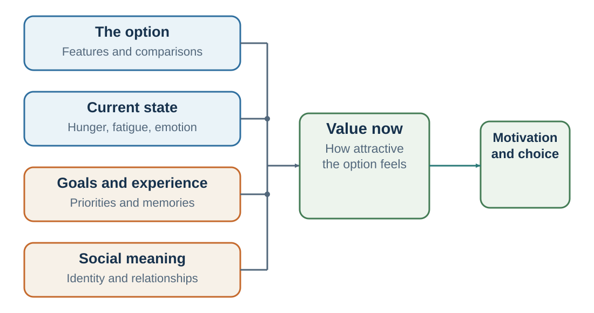
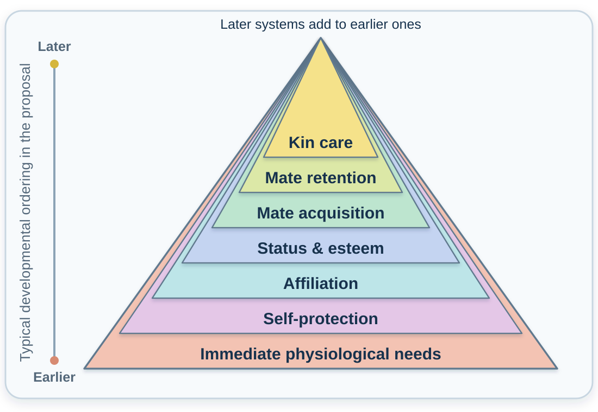

---
aliases:
  - 07-value-is-constructed.html
  - 05-valuation-how-options-become-worth-choosing.html
---

# Valuation: How Options Become Worth Choosing

*How options become worth pursuing, avoiding, or protecting*

::: {.chapter-epigraph}
> “Reason is, and ought only to be the slave of the passions.”
>
> — David Hume, [*A Treatise of Human Nature*](https://davidhume.org/texts/t/2/3/3), 1739–1740, Book II, Part III, §III
:::

An invitation arrives from an organization you admire. Before checking the date, you imagine standing on its stage and being introduced to the audience. Then you notice the travel: two flights, a weekend away, and several days of preparation. The invitation has not changed, but its appeal has.

The prestige that first made the invitation attractive competes with time you would give up elsewhere. Both responses contain something worth hearing, but accepting whichever feeling is strongest at the moment could leave a consequential cost unexamined. Which priorities should guide the commitment? To answer, we need to examine what each response is valuing.

::: {.callout-note .core-idea icon=false}
## Core Idea

Valuation gives consequences their weight in a decision. An option's appeal can change with attention, bodily state, experience, and social meaning. Understanding that influence helps distinguish a priority worth acting on from a feeling carried over from something else.

:::

## Learning goals

- Distinguish formal utility, psychological valuation, evolutionary fitness, and normative value.
- Explain how body, identity, relationships, price, context, and developmental history alter subjective value.
- Separate integral signals from incidental spillover without turning evolutionary origins into prescriptions.

A **utility function** represents an ordering of alternatives under stated assumptions. **Psychological valuation** asks how an option acquired its present appeal and why that appeal changes.

The invitation combines professional recognition, travel costs, preparation, and time with family. Attending to one feature can change the comparison with other uses of the same time. In experiments, manipulating visual attention can influence simple choices, although gaze also reflects emerging preference (Armel et al., 2008; Krajbich et al., 2010; Shimojo et al., 2003).

Neuroeconomic evidence links valuation to interacting systems rather than one literal “value center” (Bartra et al., 2013; Clithero & Rangel, 2014; Levy & Glimcher, 2012; Rangel et al., 2008). The research note near the end explains why a neural response alone cannot establish what someone truly values.

::: {.callout-note icon=false collapse=true #how-value-works-is-not-why-a-value-system-exists}
## How value works is not why a value system exists {#how-value-works-is-not-why-a-value-system-exists-title}

Why can a pastry become attractive when someone is hungry? “Because hunger and reward-related processes increase its current pull” and “because energy-seeking regulatory systems had fitness consequences over evolutionary history” are not rival answers. They answer different questions.

Tinbergen's framework separates **mechanism**, **development**,
**function**, and **phylogeny** (Tinbergen, 1963). The first two ask how
this response operates and develops; the latter two ask what past
selection problem it may have addressed and how the relevant capacities
arose. *Ultimate* means evolutionary, not final, most important, or
morally authoritative (Scott-Phillips et al., 2011). These levels
interact rather than forming a one-way chain: neural activity is only
one part of a proximate account, while development, learning, culture,
and inherited variation can shape one another (Laland et al., 2011).

For practice, keep four claims separate. **Decision value** is the weight
an option receives now; **experienced value** is the pleasure, pain,
satisfaction, or meaning that follows; **fitness consequence** is a
historical population-level effect on genetic representation; and
**normative value** concerns what should be pursued given welfare,
rights, duties, and effects on others. None establishes the others. An
evolutionary account can help explain why a motive exists, but it cannot
show that reproduction is what a person “really” values or that a
fitness-enhancing outcome is morally good.

[Appendix B](../appendices/appendix-b-evolutionary-explanations-of-value-choice-and-rationality.qmd#four-questions-not-one-cause)
develops Tinbergen's questions, Sapolsky's multilevel causal clock, the
evidence required for an evolutionary claim, and the boundary between
explanation and prescription (Sapolsky, 2017).

:::

Hume's epigraph points to a basic problem: facts alone cannot select an end. A forecast that the talk would attract a large audience matters only in relation to the speaker's aims. Reasons can help reconsider those aims, but choosing still requires an account of what is worth pursuing or giving up.

## Automatic evaluation is a first pass, not the decision

An immediate attraction can make an option feel settled before its costs have received attention. Yet the invitation that excites you may still be a poor use of the weekend. To understand that gap, separate the first positive response from the comparison that supports a commitment.

Value can begin to bend before deliberate comparison. Evaluative-priming studies, for example, measure whether a positive or negative cue changes response speed to a later target. Such latency differences can reveal rapid valence activation shaped by task, semantic relatedness, attention, and goal relevance (Giner-Sorolla et al., 1999; Klauer et al., 2016; Spruyt et al., 2018). Chapter 13 examines accessibility and priming in detail; here the important point is that an initial appraisal is only one input to valuation.

| Stage | Question it answers | What may shape it |
| --- | --- | --- |
| Rapid evaluative appraisal | “Good or bad for me, here, now?” | Learned associations, perceptual features, attention, and current goals |
| Subjective valuation | “How worthwhile is this option overall?” | Expected consequences, probability, delay, effort, state, identity, and social meaning |
| Decision and action | “What will I do under these constraints?” | Comparisons, control, habits, defaults, opportunity costs, and feasible actions |
: A first-pass valence signal is an input to choice, not choice itself {#tbl-automatic-evaluation-stages}

“Automatic” is not all-or-none: a response can be fast yet conscious, unintended yet goal-dependent, or efficient yet controllable (Moors & De Houwer, 2006). Treat rapid appraisal as a hypothesis about what first pulled the decision, not as the chooser's true preference.

This distinction also prevents four different constructs from collapsing into “preference”:

| Construct | Diagnostic question | Why divergence matters |
| --- | --- | --- |
| Liking | How pleasurable is the outcome? | Pleasure can fade while pursuit continues. |
| Wanting | How strongly does a cue pull action? | Cue-triggered desire can persist with little enjoyment. |
| Choice value | Which option is worth selecting now? | Comparison integrates costs, goals, uncertainty, and context. |
| Habit strength | What do I automatically do in this setting? | A learned policy can guide action with little fresh comparison. |
: Liking, wanting, choice value, and habit strength can come apart {#tbl-value-is-not-one-thing}

The separation will matter again when the book turns from choice to habit and self-control. For now, it supplies a diagnostic: a pastry can trigger positive appraisal and wanting yet receive low choice value under a health goal; a painful treatment can trigger negative affect yet receive high choice value because of its expected long-term benefit.

## Price can be both an outcome and an input {#price-can-be-both-an-outcome-and-an-input}

Imagine being offered two wines described as inexpensive and expensive, then learning that the glasses contain the same wine. You would expect the price difference to change what you pay, while the identical wine supplies the same tasting experience. Yet the label can enter that experience as well. If price helps create the pleasure taken as evidence of quality, deciding whether the premium is worthwhile becomes harder.

Price can influence valuation in two ways. It is a **cost**, reducing the resources available for other uses, and it can be a **signal** from which buyers infer quality or prestige. The signal may be informative, mistaken, or deliberately manufactured; a high price by itself establishes none of those qualities.

Controlled studies let researchers separate the product from its label. A meta-analysis by Rao and Monroe (1989) found a positive relationship between price and perceived product quality, although the size of the relationship varied with the research design and the strength of the price manipulation. In a small fMRI experiment, Plassmann and colleagues (2008) served the same wines under different price labels. Higher stated prices increased reported pleasantness and activity in medial orbitofrontal cortex, whereas taste-intensity ratings did not show the same pattern. When the wines were later tasted without price information, the price-linked differences in liking were absent. The label changed the interpretation and experience, not the wine.

Shiv and colleagues (2005) found a related marketing-placebo effect. Participants who bought the same energy drink at a discount solved fewer puzzles than those who paid its regular price. Across three experiments, the authors interpreted the pattern as consistent with price-related expectations. A lower price did not merely reduce monetary sacrifice; in that setting, it also reduced expected efficacy and performance.

Scarcity provides another possible route. In classic cookie experiments, a scarce supply increased desirability, especially when scarcity appeared to result from high demand rather than an accident (Worchel et al., 1975). A later meta-analysis likewise found that product-scarcity effects were heterogeneous: effects depended on whether scarcity came from demand or restricted supply, which kind of product was involved, and whether the product carried social meaning (Ladeira et al., 2023). A high price may sometimes borrow these meanings—“many people must want it,” “few people can obtain it,” or “this is exclusive”—and thereby increase desirability.

The wine and energy-drink studies examined **price**, while the cookie studies examined **scarcity**. A high price can signal quality or exclusivity, but it can also signal poor value, unfairness, or exploitation. Expertise, transparent quality information, credible comparisons, and distrust of the seller can weaken or reverse the inference.

::: {.callout-note icon=false}
## A price audit

- **Cost:** What must I give up to pay this price?
- **Signal:** What am I inferring from the price—quality, demand, scarcity, or status?
- **Evidence:** What independent evidence supports that inference?
- **Counterfactual:** If the price were hidden or randomly assigned, would I expect the same experience?
:::

## Emotion tells the mind what matters

{#fig-valuation fig-alt="Four groups of possible influences converge on current value: the option and comparisons, current state, goals and experience, and social meaning. Current value can guide motivation and choice."}

The excitement about the invitation may reveal a real desire for recognition or contribution. The hesitation may reveal a real cost to family time. Neither feeling supplies a probability that the talk will go well. **Integral emotion** concerns the decision itself; **incidental emotion** originates elsewhere and carries over into it. Anxiety caused by a difficult morning may make the invitation feel different without changing its likely consequences.

Damasio’s work on patients with damage affecting emotion-related decision processes challenged the idea that reason always works best without feeling. Some patients could reason abstractly and discuss options, yet struggled to make practical life decisions (Damasio, 1994). Bechara and colleagues (1997) developed the Iowa Gambling Task to study how people learn from reward and punishment. Patients with ventromedial prefrontal damage often continued choosing disadvantageous options and showed atypical anticipatory physiological responses. These findings motivated the somatic-marker account.[^ch06-somatic-marker]

The **somatic-marker hypothesis** proposes that learned bodily signals help guide choices by anticipating possible outcomes (Damasio, 1994).

The **risk-as-feelings** framework asks how immediate feelings interact with judgments of probability and consequence (Loewenstein et al., 2001). The **affect heuristic** concerns using a positive or negative impression to judge an option's risks and benefits (Slovic et al., 2002). Chapter 9 develops that shortcut. Here the useful question is whether a feeling reveals what matters or is being used to infer what will happen.

Emotion also affects judgment in different ways depending on the emotion. Lerner and Keltner (2001) found that fear and anger have different effects on risk perception. Fear tends to be associated with pessimistic risk assessments and avoidance. Anger, by contrast, can be associated with more optimistic risk assessments and approach. Lerner and colleagues’ appraisal-tendency framework argues that different emotions carry different appraisals of certainty, control, responsibility, and anticipated effort, which then influence judgments and choices (Lerner et al., 2015).

For the invitation, a practical check is to ask what the excitement and hesitation are about. If excitement concerns recognition, include recognition openly among the benefits. If unease comes from unrelated fatigue, revisit the choice when rested. Neither step requires treating emotion as an enemy or as a verdict.

## The self changes value

The invitation could be a valuable opportunity and a way to feel like the person you want to be. These aims may align, but they can also conflict: declining an exhausting trip may feel like abandoning an identity. Understanding the appeal therefore requires asking what the option promises about the self as well as what it will produce.

Self-relevance changes attention, memory, emotion, and value. Information connected to the self is more likely to capture attention and be remembered; the self-reference effect shows that information processed in relation to oneself is often remembered better than information processed in other ways (Rogers et al., 1977).

The invitation may also support an identity: being a respected scholar, a reliable colleague, or an involved parent. Different identities can make different consequences important, and their conflict cannot be settled by calculating travel time alone.

The endowment effect, discussed again in *Framing*, shows that ownership can increase valuation. Kahneman, Knetsch, and Thaler (1990) found that people often demanded more money to give up an object they owned than they would have paid to acquire it. Reference dependence and self-related meaning are among the proposed explanations.

Self-relevance can motivate effort and persistence. When a goal is tied to identity—“I am a scientist,” “I am a teacher,” “I am a good parent,” “I am an honest person,” “I am someone who finishes what I start”—actions supporting that identity become more valuable. Identity-based motivation theory argues that identities shape what people attend to, how they interpret difficulty, and which actions feel congruent with who they are (Oyserman, 2009).

But self-relevance can also distort judgment. When an idea becomes part of the self, evidence against it may feel threatening. A founder may overvalue their product because it represents years of effort and identity. A manager may defend a strategy because it was “my initiative.” A student may avoid feedback because it threatens the identity of being smart. A political belief may become resistant to evidence because it signals group membership.

A useful check is to imagine that another person proposed the same project. Which benefits would still matter, and which objections would become easier to hear? The answer can help separate the project's consequences from the wish to defend one's earlier commitment.

## Other people enter the value calculation

A choice can improve our private circumstances while disappointing people whose respect or company matters to us. Conversely, a costly commitment can become worthwhile because of the relationship it sustains. A comparison limited to money and time would miss these consequences. Human beings also care about approval, belonging, status, respect, fairness, reputation, and social meaning.

Social approval can feel rewarding, while rejection, exclusion, and humiliation can be aversive. Behavioral and neural evidence show the motivational force of social experience (Eisenberger et al., 2003; Eisenberger, 2012; Izuma et al., 2008).

Consider whether the invitation would still appeal if nobody in your professional circle heard about it. A different answer would reveal a social benefit. Recognition and relationships can matter in their own right. The question is whether they deserve the weight they receive relative to the other consequences.

Affiliation also shapes value. People value belonging, friendship, team identity, and being part of something larger than themselves. Deci and Ryan’s self-determination theory identifies relatedness, along with autonomy and competence, as a basic psychological need (Deci & Ryan, 2000). Belongingness theory similarly argues that humans have a strong need for stable, positive social bonds (Baumeister & Leary, 1995).

Social value can make a costly action worthwhile: working late for a trusted team may express care and commitment. It can also make necessary disagreement difficult when belonging feels at risk. Later chapters examine these consequences for cooperation and negotiation. Here, name the relationship or audience whose response enters the choice.

## Motives change the decision landscape

Planning around what appeals now assumes that its benefits will still matter when the consequences arrive. But the same person can value the same option differently depending on which motive is active. A commitment that outlasts the current state therefore needs a wider view than its present appeal.

A hungry person values food differently from a full person. A frightened person values safety differently from a relaxed person. A lonely person values social contact differently from someone who feels secure. A status-conscious person values recognition differently from someone focused on mastery. A parent values risk differently when thinking about their child. A tired person values convenience differently from a rested person.

Humans have multiple motivational systems. Which motive is active changes the decision landscape.

::: {.callout-note icon=false collapse=true #research-note-are-needs-a-hierarchy}
## Research note: are needs a hierarchy? {#research-note-are-needs-a-hierarchy-title}

A hierarchy of needs promises a simple way to identify what will matter most: locate the unmet need and work upward. But people can pursue dignity, belonging, and creativity while material needs remain unmet. Explaining that coexistence matters whenever a manager or policymaker tries to infer someone’s priorities from their circumstances.

Motivational psychology offers different accounts of human goals. Drive theories emphasized biological needs; self-determination theory emphasizes autonomy, competence, and relatedness; evolutionary approaches emphasize recurring adaptive problems (Deci & Ryan, 2000; Hull, 1943; Kenrick et al., 2010). These frameworks identify partially overlapping constructs.

Maslow (1943) organized physiological needs, safety, love and belonging, esteem, and self-actualization into a hierarchy of **relative prepotency**. On Maslow's account, when several needs are seriously deprived, the relatively prepotent need is more likely to dominate attention. But the familiar rigid pyramid is a later visualization, not a figure Maslow drew (Bridgman et al., 2019). Maslow allowed partial satisfaction, reversals, and simultaneous motives. A shared meal can address hunger, affiliation, identity, celebration, and status at once.

A classic review found only limited support for the proposed ordering and little support for the claim that satisfying one level reliably activates the next (Wahba & Bridwell, 1976). In survey data from 123 countries, fulfillment of several kinds of need was associated with different dimensions of subjective well-being, yet the associations were largely independent of whether other needs had already been fulfilled (Tay & Diener, 2011). People facing material deprivation do not stop loving, creating, seeking dignity, or finding meaning.

Kenrick and colleagues (2010) rebuilt the hierarchy around evolutionary and developmental questions. Their proposal retains immediate physiological needs, self-protection, affiliation, and status or esteem, then distinguishes mate acquisition, mate retention, and parenting. Later work on fundamental social motives uses the broader category **kin care**, which includes care for children and other relatives (Neel et al., 2016). @fig-overlapping-motive-systems combines that broader label with Kenrick and colleagues' central visual insight: later-developing systems **overlap** rather than replace earlier ones. Immediate cues can reactivate any developed system; a person caring for family can still be hungry, threatened, lonely, or concerned with status.

{#fig-overlapping-motive-systems fig-alt="A pile of seven complete, overlapping triangles shows proposed motive systems. From the broadest triangle upward, they are immediate physiological needs, self-protection, affiliation, status and esteem, mate acquisition, mate retention, and kin care. The exposed diagonal edges show that later-developing systems are added without removing earlier systems. A developmental guide labels the direction from earlier to later emergence."}

Developmental timing, current motivational priority, and evolutionary function answer different questions. The figure orders the emergence of systems; current circumstances determine which motive commands attention.

Kenrick and colleagues did not retain self-actualization as a separate fundamental motive; they proposed that activities commonly described as self-actualizing could be largely subsumed under status or esteem and mating-related motives. That reduction is disputed (Kesebir et al., 2010; Peterson & Park, 2010). A creative or moral project can be multiply determined, culturally elaborated, and personally meaningful even if it also carries status.

| Framework | What it contributes |
| --- | --- |
| Maslow's original proposal | Broad classes of need and the idea that severe deprivation can reorder attention |
| Kenrick et al.'s renovation | Overlapping, cue-sensitive motives linked to development and proposed evolutionary problems |
| Valuation analysis in this chapter | A way to identify which state, relationship, identity, and motive gives an option weight now |
: Three perspectives on motives and valuation {#tbl-maslow-kenrick-valuation}

:::

When a motive becomes salient, it **can** change attention and valuation. In some settings fear can increase the weight placed on safety, disgust can increase avoidance, romantic interest can increase the value of status or distinctiveness, affiliation can increase the value of belonging, and care motives can direct attention toward vulnerability and protection.

In one set of studies, different motivational contexts changed which appeals worked: fear increased the appeal of a popular museum, whereas a mating-related context increased the appeal of a distinctive one (Griskevicius et al., 2006, 2009). Measuring the active motive helps explain why one appeal works better than another.

Hunger provides a simpler example. Read and van Leeuwen (1998) found that current hunger influenced choices for future snacks. People in a “hot” state often mispredict what they will want in a “cold” state. Loewenstein (1996) called this the hot-cold empathy gap: people underestimate how much preferences and judgments change across visceral states such as hunger, pain, craving, sexual arousal, fear, anger, or fatigue.

The invitation may arrive just after public praise or during a week of exhaustion. Reconsidering it in a more ordinary state can reveal which priorities persist. Temporary needs can also be legitimate reasons to act.

The central question is: **Which motive gives this option its appeal now, and will that motive matter over the period affected by the choice?**

## Context can change the price of waiting

Suppose the choice is €40 today or €60 in three months. The amounts and delay remain unchanged, but the chooser has just encountered an emotionally charged cue unrelated to the money. If the choice moves toward €40 today, what changed? The immediate reward may have become more attractive. Three months may feel farther away. Attention may have narrowed toward what is available now. Or the decision process may simply have begun with a stronger bias toward the immediate option. The observed choice alone cannot distinguish these pathways.

::: {.callout-note icon=false collapse=true}
## Research note: arousal and impatience can come apart

Research using erotic cues makes this identification problem unusually visible. Wilson and Daly (2004) measured monetary discounting before and after participants rated photographs. Men who viewed attractive women subsequently discounted delayed money more steeply; the same shift was not reported for men viewing less attractive women or for women viewing men. Van den Bergh, Dewitte, and Warlop (2008) similarly reported greater impatience after sexual cues. Across their studies, the effect extended beyond money, was stronger among participants who were more sensitive to reward, and was attenuated by a satiation manipulation. They interpreted the pattern as evidence that an activated appetitive system can create generalized wanting for rewards available now.

Kim and Zauberman (2013) proposed a different route. In their studies, sexual cues made future intervals feel subjectively longer, and this change was associated with greater preference for smaller-sooner hypothetical monetary rewards. On this account, the delayed reward did not necessarily become less desirable in itself. It lost decision weight because the wait separating the chooser from it expanded psychologically. The distinction matters: an intervention aimed at reward appetite would miss a change in perceived temporal distance.

Later studies found different relationships between arousal and choice. In a preregistered experiment with 35 men, trial-wise erotic and aversive images increased physiological arousal but did not significantly change the steepness of temporal discounting; measured arousal explained little additional variation in choice (Knauth & Peters, 2022). In a block-exposure study with 39 heterosexual men, Mathar and colleagues (2023) found fewer larger-later choices after erotic cues. Their drift-diffusion analysis attributed the shift primarily to a starting-point bias toward the immediate option rather than a clear change in the discount-rate parameter. A further preregistered fMRI study with 38 men found stronger cortical and subcortical responses to erotic than neutral images but no corresponding increase in temporal discounting. Activity in the focal reward-related regions did not predict a change in choice (Knauth et al., 2023).

These findings separate four claims that are easy to collapse:

| Possible pathway | What changes | What would identify it |
| --- | --- | --- |
| Generalized reward appetite | Immediately available rewards acquire more pull | A replicated choice shift across reward domains, with the proposed motivational state measured or manipulated |
| Subjective time | The same objective delay feels longer | A measured or manipulated change in perceived delay that accounts for the choice shift |
| Starting-point bias | Evidence accumulation begins closer to the smaller-sooner option | A process model that distinguishes initial bias from the weighting of amount and delay |
| Arousal or neural cue reactivity | Body or reward-related activity responds to the cue | A response that predicts or causally contributes to the behavioral change |
: The same impatient choice can arise through different contextual pathways {#tbl-contextual-cues-and-waiting}

Across these studies, a cue can produce arousal or neural reward responses without changing intertemporal choice. A behavioral shift may instead reflect perceived time or a starting-point bias toward immediate rewards. The designs help distinguish these pathways.

:::

For an important decision, run a **cue audit**: What in the environment is currently appetitive, threatening, or socially charged? Is that cue integral to the consequences being valued, or incidental spillover? Did it change the appeal of an outcome, the perceived distance to it, the attention given to it, or only the consistency of choice? Would the decision survive a different cue, state, and time of day? Chapter 19 develops the full intertemporal-choice problem; the lesson here is that measured patience belongs partly to the valuation context in which it is elicited.

## Using valuation wisely

Return to the invitation and write two columns: what you expect to happen, and why each consequence matters. Then inspect the most influential entries. Does prestige stand for a real professional opportunity, enjoyment of recognition, or an assumption that an admired organization must be offering something worthwhile? Each is a different reason and deserves its own evidence.

For an important choice, compare the current appeal with the experience you expect afterward, revisit it under another ordinary state, and ask a trusted person to examine your assumptions. Their interpretation is additional evidence, not privileged access to your motives.

Organizations influence valuation through what they reward, display, and discuss. A team that celebrates speed while ignoring defects can make rushing attractive; changing the measures can make other consequences easier to consider. Such design should help people assess consequences and pursue aims they can endorse, with room to question the priorities being promoted.

This distinction becomes central when an organization uses AI. An accurate prediction cannot by itself establish which outcome is worth predicting, whose welfare should count, or how costly different mistakes would be. [Chapter 42](42-data-driven-decision-making.qmd#ai-target-variable-problem) turns this chapter's valuation audit into questions about a model's target and the action it supports. Making prediction cheaper increases the practical importance of stating and examining those priorities.

[]{#research-lens-value-is-distributed-not-a-single-center}

::: {.callout-caution .research-lens icon=false}
## Research Lens: value is distributed, not a single center

Value-related signals arise in interacting networks, not one literal
“value center.” An association between activity in a region and a choice
does not show that the region contains a unique psychological function.
Inferring a mental process from a nonspecific neural pattern is
**reverse inference** (Poldrack, 2006). A neural measure may improve
prediction while still failing to reveal a stable preference, identify a
causal mechanism, or determine what anyone ought to value. [Appendix
E](../appendices/appendix-e-how-behavioral-evidence-is-built.qmd#match-the-final-sentence-to-the-design)
develops the corresponding claim-to-method discipline.
:::

| Question | What it diagnoses | Typical risk |
| --- | --- | --- |
| What am I feeling? | The current value signal. | Treating emotion as probability. |
| What feature has my attention? | Attribute weighting in the moment. | Ignoring a quiet but important objective. |
| Do I want this, or expect to like it? | Motivational pull versus experienced value. | Choosing the cue rather than the outcome. |
| Whose approval or identity is involved? | Social and self-relevance. | Borrowing another audience’s values. |
| What changes if my state changes? | Hunger, fatigue, threat, or mood dependence. | Mistaking a temporary state for a stable preference. |
: Questions for separating value from evidence {#tbl-07-1}

## Practice Lab

Choose one option whose appeal changes across states or audiences. Produce a **valuation audit** with four rows—body and immediate state, self and identity, other people and relationships, situation and motive. For each row, record the predicted consequence, why it matters, whose welfare is included, and whether the emotional signal is integral to the decision or incidental to it. Identify one forecast that must be checked independently of preference.

## Take it forward

You may accept the invitation or decline it. The improvement is that recognition, contribution, travel, and family time now have explicit places in the choice. Before committing to an attractive option, ask which benefit first caught your attention and which quieter consequence still needs a fair hearing.

[^ch06-somatic-marker]: The Iowa Gambling Task and its interpretation remain debated; the findings do not establish that a particular bodily signal is necessary or sufficient for valuation.

## References cited in this chapter

::: {.reference}
Armel, K. C., Beaumel, A., & Rangel, A. (2008). Biasing simple choices by manipulating relative visual attention. Judgment and Decision Making, 3(5), 396–403.
:::

::: {.reference}
Bechara, A., Damasio, H., Tranel, D., & Damasio, A. R. (1997). Deciding advantageously before knowing the advantageous strategy. *Science, 275*(5304), 1293–1295.
:::

::: {.reference}
Bartra, O., McGuire, J. T., & Kable, J. W. (2013). The valuation system: A coordinate-based meta-analysis of BOLD fMRI experiments examining neural correlates of subjective value. NeuroImage, 76, 412-427.
:::

::: {.reference}
Baumeister, R. F., & Leary, M. R. (1995). The need to belong: Desire for interpersonal attachments as a fundamental human motivation. Psychological Bulletin, 117(3), 497–529.
:::

::: {.reference}
Bridgman, T., Cummings, S., & Ballard, J. (2019). Who built Maslow's pyramid? A history of the creation of management studies' most famous symbol and its implications for management education. *Academy of Management Learning & Education, 18*(1), 81–98. https://doi.org/10.5465/amle.2017.0351
:::

::: {.reference}
Clithero, J. A., & Rangel, A. (2014). Informatic parcellation of the network involved in the computation of subjective value. Social Cognitive and Affective Neuroscience, 9(9), 1289–1302.
:::

::: {.reference}
Damasio, A. R. (1994). Descartes’ error: Emotion, reason, and the human brain. Putnam.
:::

::: {.reference}
Deci, E. L., & Ryan, R. M. (2000). The "what" and "why" of goal pursuits: Human needs and the self-determination of behavior. Psychological Inquiry, 11(4), 227-268.
:::

::: {.reference}
Eisenberger, N. I. (2012). The pain of social disconnection: Examining the shared neural underpinnings of physical and social pain. Nature Reviews Neuroscience, 13(6), 421–434.
:::

::: {.reference}
Eisenberger, N. I., Lieberman, M. D., & Williams, K. D. (2003). Does rejection hurt? An fMRI study of social exclusion. Science, 302(5643), 290–292.
:::

::: {.reference}
Griskevicius, V., Goldstein, N. J., Mortensen, C. R., Cialdini, R. B., & Kenrick, D. T. (2006). Going along versus going alone: When fundamental motives facilitate strategic nonconformity. Journal of Personality and Social Psychology, 91(2), 281-294.
:::

::: {.reference}
Giner-Sorolla, R., García, M. T., & Bargh, J. A. (1999). The automatic evaluation of pictures. *Social Cognition, 17*(1), 76–96.
:::

::: {.reference}
Griskevicius, V., Goldstein, N. J., Mortensen, C. R., Sundie, J. M., Cialdini, R. B., & Kenrick, D. T. (2009). Fear and loving in Las Vegas: Evolution, emotion, and persuasion. *Journal of Marketing Research, 46*(3), 384–395. https://doi.org/10.1509/jmkr.46.3.384
:::

::: {.reference}
Hull, C. L. (1943). Principles of behavior. Appleton-Century-Crofts.
:::

::: {.reference}
Hume, D. (1739–1740). *A treatise of human nature*. https://davidhume.org/texts/t/
:::

::: {.reference}
Izuma, K., Saito, D. N., & Sadato, N. (2008). Processing of social and monetary rewards in the human striatum. Neuron, 58(2), 284–294.
:::

::: {.reference}
Kahneman, D., Knetsch, J. L., & Thaler, R. H. (1990). Experimental tests of the endowment effect and the Coase theorem. Journal of Political Economy, 98(6), 1325–1348.
:::

::: {.reference}
Klauer, K. C., Becker, M., & Spruyt, A. (2016). Evaluative priming in the pronunciation task: A preregistered replication and extension. *Experimental Psychology, 63*(2), 70–78.
:::

::: {.reference}
Kenrick, D. T., Griskevicius, V., Neuberg, S. L., & Schaller, M. (2010). Renovating the pyramid of needs: Contemporary extensions built upon ancient foundations. *Perspectives on Psychological Science, 5*(3), 292–314. https://doi.org/10.1177/1745691610369469
:::

::: {.reference}
Kesebir, S., Graham, J., & Oishi, S. (2010). A theory of human needs should be human-centered, not animal-centered: Commentary on Kenrick et al. (2010). *Perspectives on Psychological Science, 5*(3), 315–319. https://doi.org/10.1177/1745691610369470
:::

::: {.reference}
Kim, B. K., & Zauberman, G. (2013). Can Victoria's Secret change the future? A subjective time perception account of sexual-cue effects on impatience. *Journal of Experimental Psychology: General, 142*(2), 328–335. https://doi.org/10.1037/a0028954
:::

::: {.reference}
Knauth, K., & Peters, J. (2022). Trial-wise exposure to visual emotional cues increases physiological arousal but not temporal discounting. *Psychophysiology, 59*(4), e13996. https://doi.org/10.1111/psyp.13996
:::

::: {.reference}
Knauth, K., Mathar, D., Kuzmanovic, B., Tittgemeyer, M., & Peters, J. (2023). Erotic cue exposure increases neural reward responses without modulating temporal discounting. *Imaging Neuroscience, 1*, 1–25. https://doi.org/10.1162/imag_a_00008
:::

::: {.reference}
Krajbich, I., Armel, C., & Rangel, A. (2010). Visual fixations and the computation and comparison of value in simple choice. Nature Neuroscience, 13(10), 1292–1298.
:::

::: {.reference}
Laland, K. N., Sterelny, K., Odling-Smee, J., Hoppitt, W., & Uller, T. (2011). Cause and effect in biology revisited: Is Mayr's proximate–ultimate dichotomy still useful? *Science, 334*(6062), 1512–1516. https://doi.org/10.1126/science.1210879
:::

::: {.reference}
Ladeira, W. J., Lim, W. M., Santini, F. de O., Rasul, T., Perin, M. G., & Altinay, L. (2023). A meta-analysis on the effects of product scarcity. *Psychology & Marketing, 40*(7), 1267–1279. https://doi.org/10.1002/mar.21816
:::

::: {.reference}
Lerner, J. S., & Keltner, D. (2001). Fear, anger, and risk. Journal of Personality and Social Psychology, 81(1), 146–159.
:::

::: {.reference}
Lerner, J. S., Li, Y., Valdesolo, P., & Kassam, K. S. (2015). Emotion and decision making. Annual Review of Psychology, 66, 799–823.
:::

::: {.reference}
Levy, D. J., & Glimcher, P. W. (2012). The root of all value: A neural common currency for choice. Current Opinion in Neurobiology, 22(6), 1027–1038.
:::

::: {.reference}
Loewenstein, G. (1996). Out of control: Visceral influences on behavior. Organizational Behavior and Human Decision Processes, 65(3), 272–292.
:::

::: {.reference}
Loewenstein, G. F., Weber, E. U., Hsee, C. K., & Welch, N. (2001). Risk as feelings. *Psychological Bulletin, 127*(2), 267–286.
:::

::: {.reference}
Mathar, D., Wiebe, A., Tuzsus, D., Knauth, K., & Peters, J. (2023). Erotic cue exposure increases physiological arousal, biases choices toward immediate rewards, and attenuates model-based reinforcement learning. *Psychophysiology, 60*(12), e14381. https://doi.org/10.1111/psyp.14381
:::

::: {.reference}
Maslow, A. H. (1943). A theory of human motivation. *Psychological Review, 50*(4), 370–396. https://doi.org/10.1037/h0054346
:::

::: {.reference}
Moors, A., & De Houwer, J. (2006). Automaticity: A theoretical and conceptual analysis. *Psychological Bulletin, 132*(2), 297–326.
:::

::: {.reference}
Neel, R., Kenrick, D. T., White, A. E., & Neuberg, S. L. (2016). Individual differences in fundamental social motives. *Journal of Personality and Social Psychology, 110*(6), 887–907. https://doi.org/10.1037/pspp0000068
:::

::: {.reference}
Oyserman, D. (2009). Identity-based motivation: Implications for action-readiness, procedural-readiness, and consumer behavior. Journal of Consumer Psychology, 19(3), 250–260.
:::

::: {.reference}
Peterson, C., & Park, N. (2010). What happened to self-actualization? Commentary on Kenrick et al. (2010). *Perspectives on Psychological Science, 5*(3), 320–322. https://doi.org/10.1177/1745691610369471
:::

::: {.reference}
Poldrack, R. A. (2006). Can cognitive processes be inferred from neuroimaging data? Trends in Cognitive Sciences, 10(2), 59–63.
:::

::: {.reference}
Plassmann, H., O’Doherty, J., Shiv, B., & Rangel, A. (2008). Marketing actions can modulate neural representations of experienced pleasantness. *Proceedings of the National Academy of Sciences, 105*(3), 1050–1054.
:::

::: {.reference}
Rao, A. R., & Monroe, K. B. (1989). The effect of price, brand name, and store name on buyers' perceptions of product quality: An integrative review. *Journal of Marketing Research, 26*(3), 351–357. https://doi.org/10.1177/002224378902600309
:::

::: {.reference}
Rangel, A., Camerer, C., & Montague, P. R. (2008). A framework for studying the neurobiology of value-based decision making. Nature Reviews Neuroscience, 9(7), 545-556.
:::

::: {.reference}
Read, D., & van Leeuwen, B. (1998). Predicting hunger: The effects of appetite and delay on choice. Organizational Behavior and Human Decision Processes, 76(2), 189–205.
:::

::: {.reference}
Rogers, T. B., Kuiper, N. A., & Kirker, W. S. (1977). Self-reference and the encoding of personal information. Journal of Personality and Social Psychology, 35(9), 677–688.
:::

::: {.reference}
Sapolsky, R. M. (2017). *Behave: The biology of humans at our best and worst*. Penguin Press.
:::

::: {.reference}
Scott-Phillips, T. C., Dickins, T. E., & West, S. A. (2011). Evolutionary theory and the ultimate–proximate distinction in the human behavioral sciences. *Perspectives on Psychological Science, 6*(1), 38–47. https://doi.org/10.1177/1745691610393528
:::

::: {.reference}
Shiv, B., Carmon, Z., & Ariely, D. (2005). Placebo effects of marketing actions: Consumers may get what they pay for. Journal of Marketing Research, 42(4), 383–393.
:::

::: {.reference}
Shimojo, S., Simion, C., Shimojo, E., & Scheier, C. (2003). Gaze bias both reflects and influences preference. Nature Neuroscience, 6(12), 1317–1322.
:::

::: {.reference}
Slovic, P., Finucane, M. L., Peters, E., & MacGregor, D. G. (2002). The affect heuristic. In T. Gilovich, D. Griffin, & D. Kahneman (Eds.), *Heuristics and biases: The psychology of intuitive judgment* (pp. 397–420). Cambridge University Press.
:::

::: {.reference}
Spruyt, A., Tibboel, H., De Schryver, M., & De Houwer, J. (2018). Automatic stimulus evaluation depends on goal relevance. *Emotion, 18*(3), 332–341.
:::

::: {.reference}
Tay, L., & Diener, E. (2011). Needs and subjective well-being around the world. *Journal of Personality and Social Psychology, 101*(2), 354–365. https://doi.org/10.1037/a0023779
:::

::: {.reference}
Tinbergen, N. (1963). On aims and methods of ethology. *Zeitschrift für Tierpsychologie, 20*(4), 410–433. https://doi.org/10.1111/j.1439-0310.1963.tb01161.x
:::

::: {.reference}
Worchel, S., Lee, J., & Adewole, A. (1975). Effects of supply and demand on ratings of object value. *Journal of Personality and Social Psychology, 32*(5), 906–914. https://doi.org/10.1037/0022-3514.32.5.906
:::

::: {.reference}
Van den Bergh, B., Dewitte, S., & Warlop, L. (2008). Bikinis instigate generalized impatience in intertemporal choice. *Journal of Consumer Research, 35*(1), 85–97. https://doi.org/10.1086/525505
:::

::: {.reference}
Wahba, M. A., & Bridwell, L. G. (1976). Maslow reconsidered: A review of research on the need hierarchy theory. *Organizational Behavior and Human Performance, 15*(2), 212–240. https://doi.org/10.1016/0030-5073(76)90038-6
:::

::: {.reference}
Wilson, M., & Daly, M. (2004). Do pretty women inspire men to discount the future? *Proceedings of the Royal Society of London. Series B: Biological Sciences, 271*(Suppl. 4), S177–S179. https://doi.org/10.1098/rsbl.2003.0134
:::
