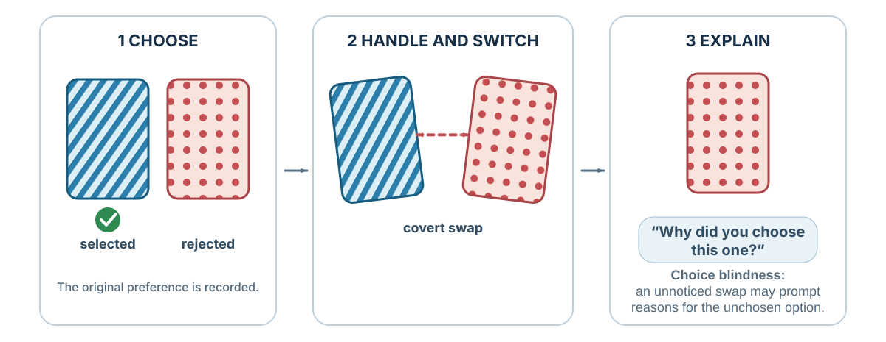

---
aliases:
  - 18-the-narrator-after-the-choice.html
---

# The Narrator After Choice

*Why Reasons Are Not Always Causes*

[]{#the-narrator-after-choice-why-reasons-are-not-always-causes}

*Why explanations can be sincere and still miss the cause*

::: {#chapter-07-start .chapter-epigraph}
> “Evidence is reviewed which suggests that there may be little or no direct introspective access to higher order cognitive processes.”
>
> — Richard E. Nisbett and Timothy D. Wilson, [“Telling More Than We Can Know”](https://doi.org/10.1037/0033-295X.84.3.231), 1977, p. 231
:::

You compare two faces, point to the one you prefer, and receive a card to explain your choice. You mention the expression and the eyes. Only afterward do you learn that the researcher handed you the face you rejected. The explanation felt like a memory of choosing, but it described a choice you had not made.

This is the experimental logic of **choice blindness** (Johansson et al., 2005). Some people notice the switch. When it goes unnoticed, the reasons offered afterward raise a difficult question: how do we know whether an explanation recovers a cause or constructs a plausible story? The distinction matters whenever we use an account of a decision to repeat a success, repair a failure, or assign responsibility.

::: {.callout-note .core-idea icon=false}
## Core Idea

A sincere explanation can describe a real value without identifying what caused a choice. Outcomes and current beliefs can reshape how earlier decisions are remembered. A record made before the result provides a comparison against which the later explanation can be checked.

:::

## Learning goals

- Distinguish a reason, a justification, and a cause.
- Explain how post-choice interpretation can alter memory, value, and later belief.
- Use a dated decision record and rival explanations to make learning answerable to evidence.

## Reasons are not the same as causes

Asking someone why they chose seems the direct route to understanding the choice. Yet an answer can explain why an option is defensible without identifying what brought it to the person’s attention or made it win. To learn from explanations, we first need to distinguish the roles a reason can play.

It can describe what a person consciously considered before choosing. It can justify a choice to an audience. It can express a value the person genuinely endorses. It can also be a post-hoc account assembled from what is available after the action. These roles overlap. People often know their goals, deliberations, and conscious reasons. Their access to subtle causal influences - position, order, fluency, mood, priming, habit, social pressure, and automatic evaluation - is incomplete.

Nisbett and Wilson (1977) reviewed evidence that people sometimes report culturally plausible theories of why they responded rather than direct knowledge of the process. In the well-known stocking display, identical items were arranged from left to right. The rightmost item was chosen more frequently, yet participants explained their preferences in terms of fabric and workmanship and rejected position as a cause. Unnoticed influences can shape behavior while the mind produces a coherent account.

## Choice blindness and the confidence of explanation

The face experiment separates the original selection from the option presented for explanation. Its interest lies in the reasons offered for an undetected substitution: a participant can discuss details of the rejected face as though they motivated the choice (Johansson et al., 2005).

{#fig-choice-blindness-swap fig-alt="A three-stage sequence uses striped and dotted abstract cards. The chooser selects the striped card, the cards are covertly swapped during handling, and the dotted card is then presented with the question why did you choose this one." width=100%}

The effect is not confined to faces. In a marketplace study, participants tasted jam or smelled tea, received a covertly switched sample, and sometimes explained why they preferred the option they had not selected (Hall et al., 2010). In a self-transforming moral survey, some participants failed to notice that an item had been reversed and then argued for the position now displayed as their own (Hall et al., 2012). Once an outcome is represented as **my choice** or **my view**, explanation can recruit current evidence and identity rather than retrieve a complete causal record.

Once the substituted option is accepted as “my choice,” its features supply material for a coherent explanation. That account may express a current preference, but it cannot be assumed to recover the cause of the earlier selection.

## The interpreter and confabulation

Research with split-brain patients inspired the idea of an interpreter: the language-dominant hemisphere can construct an account of behavior from the information available to it, even when the action was initiated by information it could not access (Gazzaniga & LeDoux, 1978; Gazzaniga, 2000). These cases show how an explanatory gap can be filled by a sincere story.

## Cognitive dissonance: the choice rewrites the chooser

A choice is supposed to express a preference: we select the option we value more. But commitment may also change the preference we later use to explain it.

After choosing between attractive alternatives, people may rate the chosen option more favorably and the rejected one less favorably. Brehm (1956) interpreted this **spreading of alternatives** as a response to dissonance: revaluing the options could make the commitment easier to live with.

The classic design has an important limitation. Initial ratings are imperfect measures of preference, and the choice itself reveals additional information; some apparent spreading can occur without a preference change (Chen & Risen, 2010). Establishing that choice changed an attitude therefore requires a design that separates this artifact from a causal effect.

Dissonance reduction can support commitment. Constantly reopening every decision would be exhausting. But it can also make feedback harder to hear. A team that invested heavily in a project may reinterpret weak demand as temporary misunderstanding. A person who chose a prestigious job may minimize the daily costs that were obvious before the decision. A negotiator who rejected an offer may later describe it as insulting even when it was close to acceptable.

### When behavior becomes evidence about the self

After an hour of repetitive tasks, including turning pegs, participants in Festinger and Carlsmith's (1959) experiment were asked to tell a waiting person that the work was enjoyable. Some received **$1** for the endorsement, others **$20**. Asked later to rate how enjoyable the tasks actually were, the $1 group gave the more favorable answer: an average of **1.35**, compared with **−0.05** in the $20 group, on a scale from −5 to +5. A control group that made no endorsement rated the tasks **−0.45**. Each analyzed group contained twenty participants.[^ch07-forced-compliance-sample]

The smaller payment accompanied the larger attitude shift. Dissonance theory interprets the result as coherence repair: $20 supplies an external explanation for praising dull work, while $1 leaves more tension between the endorsement and the experience. One way to resolve that tension is to judge the work more favorably.

Self-perception theory offers a related but distinct mechanism. When internal signals are weak, people can infer an attitude by observing their own conduct much as an outsider would: “I advocated for it with little pressure, so perhaps I believe it” (Bem, 1972). Dissonance emphasizes discomfort from inconsistency; self-perception emphasizes inference from behavior. Both warn that action is not merely the output of a stable preference. Action can become input to the next preference.

This is why small commitments deserve attention. Repeatedly defending a project can make the defender feel more certain. A minor dishonest act can be redescribed as harmless and then become evidence that the boundary was never important. Behavior, explanation, and identity can form a loop.

## Reasoning as a social instrument

A more carefully argued explanation should help a group understand what happened. But the person producing it may also need to defend a commitment or protect an identity. The ability to build a strong argument can then serve a preferred conclusion as readily as an accurate account.

Reasoning is used to discover truth, justify actions, persuade others, and defend group commitments. Motivated reasoning occurs when people search and evaluate arguments in ways that favor a preferred conclusion while preserving the feeling of objectivity (Kunda, 1990). Greater cognitive skill can improve accuracy, but it can also provide a larger toolkit for defending identity-protective beliefs.

The argumentative account of reasoning pushes the social point further: human reasoning is especially well suited to producing and evaluating arguments in interaction (Mercier & Sperber, 2011). It explains why one person may be better at finding support for a position than at finding its weaknesses—and why another person’s objections can improve the result. Discussion helps when participants bring genuinely different information, can challenge one another safely, and are not all rewarded for defending the same conclusion. A room full of advocates for one story can become more articulate without becoming more accurate.

Moral rationalization is especially consequential. People can reframe questionable conduct as efficiency, loyalty, standard practice, competitive necessity, or obedience to procedure. Ethical fading occurs when the moral dimension disappears from the frame and the choice is coded as “business,” “technical,” or “legal” instead (Tenbrunsel & Messick, 2004). Euphemistic language does not merely describe the action; it changes what is attended to and what can be justified (Bandura, 1999).

A practical warning follows from the moral-disengagement account: a vocabulary containing only cost, compliance, and performance may leave harm or consent out of the discussion. Suppose the hiring committee calls an unpaid week of trial work “a chance to prove commitment.” The label may hide who can afford to participate and what work the organization receives. A **moral judgment** asks whether that burden is justified, whose consent is meaningful, and whether the same standard would be acceptable from the applicant's side. Understanding how the label persuades does not settle those questions. [Chapter 28](28-authority-groupthink-and-shared-responsibility.qmd#authority-and-responsibility) examines what happens when authority supplies the justification instead.

::: {.callout-note icon=false collapse=true}
## Evidence note: self-concept maintenance

Mazar et al. (2008) proposed that people can benefit from dishonesty while preserving an honest self-image. The article now carries a [2024 expression of concern](https://journals.sagepub.com/doi/10.1177/00222437241285882). The notice identifies replication failures, undisclosed omitted conditions, and inconsistent data provenance for Experiment 1.
:::

## Organizations have narrators too

An organization needs a shared account of its past so people can coordinate what comes next. Yet the account also allocates credit, blame, and authority, giving participants a stake in which explanation survives.

Organizations create stories about why strategies succeeded, why projects failed, who deserves credit, and what the culture values. This is sensemaking: people construct a workable account of ambiguous events so coordinated action can continue (Weick, 1995). Stories organize memory and direction. They can also protect leaders, suppress inconvenient evidence, and turn luck into a legend of skill. A postmortem that begins with "who failed?" produces a different institutional memory from one that asks "what assumptions, incentives, information flows, and constraints made this outcome likely?"

Responsibility can harden the story. In escalation-of-commitment research, decision-makers responsible for an initial allocation sometimes invested more after negative feedback, as if renewed commitment could rescue both project and self-image (Staw, 1976). An organization then supplies additional audiences, sunk costs, status, and language: “the market is not ready,” “execution was the problem,” or “we have come too far to stop.” Any one claim may be true. The danger is a story that can explain every possible result and therefore cannot be wrong.

The problem is an explanation that can survive any outcome. “Customers were not ready” might be correct, but the team should state what observation would distinguish that account from a poor product or an ineffective launch.

## Making the narrator accountable

{#fig-narrator-learning fig-alt="Choice leads to outcome, narrative, and a future rule, while a contemporaneous decision record provides an independent comparison for detecting hindsight."}

A review conducted after the outcome has an information advantage and a memory problem: everyone now knows what happened. Asking for greater honesty cannot reconstruct the expectations that this knowledge has displaced.

A decision journal creates a protected comparison between two records: one written before outcome knowledge can rewrite memory, and one appended at a specified review point. Unlike a diary, it is organized around a decision rather than a day; unlike an after-action review, it preserves the original alternatives, assumptions, forecasts, values, context, and reasons. Later, compare that untouched entry with what happened. The aim is not self-accusation. It is causal humility. [Chapter 41](41-decision-hygiene-build-a-process-that-can-learn.qmd#what-a-decision-journal-is) defines the evidence base and every field; [Appendix C](../appendices/appendix-c-portable-course-tools.qmd#one-page-decision-journal) provides the portable template.

### The rationalization detector

When an explanation arrives fluently, do not ask only whether it is plausible. Ask whether it had to compete with alternatives.

| Detector question | What it is designed to expose |
| --- | --- |
| Did I record this reason before the choice, or discover it after the outcome? | Hindsight and post-hoc reconstruction |
| Would the same reason justify the option I rejected? | A reason flexible enough to defend either answer |
| If the outcome had reversed, what story would I now tell? | Outcome bias and asymmetric attribution |
| What fact would make this explanation less likely? | An explanation protected from disconfirmation |
| Who benefits if this becomes the official account? | Identity, status, and organizational incentives |
| What did I notice, believe, value, and sacrifice at the time? | Missing stages hidden by the final narrative |
: A rationalization detector for personal and organizational stories {#tbl-rationalization-detector}

The detector converts one coherent story into competing causal hypotheses.

The outcome/process problem was introduced in [*How Decisions Should Be Made—and How They Actually Are*](01-how-decisions-should-be-made-and-how-they-actually-are.qmd#outcome-is-not-process). Here the added mechanism is narrative reconstruction: after the outcome, a plausible story can make both the result and the decision feel more inevitable than the original evidence warranted.

### Record before; review after

A usable decision record has two moments. **Before choosing**, write the live alternatives, the best forgone option, probabilistic forecasts, key assumptions, values and trade-offs, current emotion, and the observations that would trigger revision. **At review**, reopen that untouched record and add the outcome, surprises, which assumptions survived, the role of luck, and one process change.

The review must separate process from outcome:

|  | Good outcome | Bad outcome |
| --- | --- | --- |
| Good process | Preserve what was sound; ask how much luck helped. | Do not abandon a sound method because uncertainty produced a loss. |
| Poor process | Treat the success as a warning, not proof of skill. | Diagnose the earliest correctable failure; avoid rewriting it as inevitable. |
: Process quality and outcome quality answer different questions {#tbl-process-outcome-review}

For a project review, compare the dated forecast with the outcome and ask someone who did not own the original decision to develop a rival explanation. If both explanations fit the result, identify a further observation that could separate them. A small prototype or a bounded delegation can test an assumption that another meeting would merely repeat.

The record lets the team compare what it expected with what it now knows.

Self-affirmation can sometimes reduce defensiveness by reminding people that the whole self is not on trial (Cohen & Sherman, 2014; Steele, 1988). Organizations can also reward revision. A person who says, "My forecast was wrong and here is what changed," should be treated as a source of learning rather than as a threat to authority. The task is to make explanation answerable to evidence. Self-reports remain useful records of conscious goals and experience, but confidence in a story is not a test of its causal accuracy.

## Practice Lab

Retrieve one consequential decision and produce a two-page review. Page one uses any records made before the choice to identify options, the best alternative forgone, forecasts, uncertainty, values, and the decision rule. Clearly label details reconstructed from memory; reconstruction does not create a contemporaneous record. Page two records the outcome, at least two rival explanations, and the evidence that would distinguish them. Finally, reverse the outcome in imagination and write the story you would have been tempted to tell.

## Take it forward

Before your next consequential choice, write the reason you expect to act and what would change your mind. At review, read that entry before explaining the outcome. The story can still develop, but it will have an earlier account to answer to.

[^ch07-forced-compliance-sample]: The original study recruited 71 male introductory psychology students and excluded eleven for reasons including suspicion, refusal, or revealing the experimental arrangement. The reported comparisons therefore describe the retained groups (Festinger & Carlsmith, 1959).

## References cited in this chapter

::: {.reference}
Bandura, A. (1999). Moral disengagement in the perpetration of inhumanities. Personality and Social Psychology Review, 3(3), 193-209.
:::

::: {.reference}
Bem, D. J. (1972). Self-perception theory. In L. Berkowitz (Ed.), Advances in experimental social psychology (Vol. 6, pp. 1-62). Academic Press.
:::

::: {.reference}
Brehm, J. W. (1956). Postdecision changes in desirability of alternatives. Journal of Abnormal and Social Psychology, 52(3), 384-389.
:::

::: {.reference}
Chen, M. K., & Risen, J. L. (2010). How choice affects and reflects preferences: Revisiting the free-choice paradigm. *Journal of Personality and Social Psychology, 99*(4), 573–594. https://doi.org/10.1037/a0020217
:::

::: {.reference}
Cohen, G. L., & Sherman, D. K. (2014). The psychology of change: Self-affirmation and social psychological intervention. Annual Review of Psychology, 65, 333-371.
:::

::: {.reference}
Festinger, L., & Carlsmith, J. M. (1959). Cognitive consequences of forced compliance. Journal of Abnormal and Social Psychology, 58(2), 203-210.
:::

::: {.reference}
Gazzaniga, M. S. (2000). Cerebral specialization and interhemispheric communication: Does the corpus callosum enable the human condition? Brain, 123(7), 1293-1326.
:::

::: {.reference}
Gazzaniga, M. S., & LeDoux, J. E. (1978). The integrated mind. Plenum Press.
:::

::: {.reference}
Hall, L., Johansson, P., & Strandberg, T. (2012). Lifting the veil of morality: Choice blindness and attitude reversals on a self-transforming survey. PLoS ONE, 7(9), e45457.
:::

::: {.reference}
Hall, L., Johansson, P., Tärning, B., Sikström, S., & Deutgen, T. (2010). Magic at the marketplace: Choice blindness for the taste of jam and the smell of tea. Cognition, 117(1), 54-61.
:::

::: {.reference}
Johansson, P., Hall, L., Sikström, S., & Olsson, A. (2005). Failure to detect mismatches between intention and outcome in a simple decision task. Science, 310(5745), 116-119.
:::

::: {.reference}
Kunda, Z. (1990). The case for motivated reasoning. Psychological Bulletin, 108(3), 480-498.
:::

::: {.reference}
Mazar, N., Amir, O., & Ariely, D. (2008). The dishonesty of honest people: A theory of self-concept maintenance. *Journal of Marketing Research, 45*(6), 633–644. https://doi.org/10.1509/jmkr.45.6.633. **Expression of concern published in 2024.**
:::

::: {.reference}
Mercier, H., & Sperber, D. (2011). Why do humans reason? Arguments for an argumentative theory. Behavioral and Brain Sciences, 34(2), 57-74.
:::

::: {.reference}
Nisbett, R. E., & Wilson, T. D. (1977). Telling more than we can know: Verbal reports on mental processes. *Psychological Review, 84*(3), 231–259.
:::

::: {.reference}
Staw, B. M. (1976). Knee-deep in the big muddy: A study of escalating commitment to a chosen course of action. Organizational Behavior and Human Performance, 16(1), 27-44.
:::

::: {.reference}
Steele, C. M. (1988). The psychology of self-affirmation: Sustaining the integrity of the self. In L. Berkowitz (Ed.), Advances in experimental social psychology (Vol. 21, pp. 261-302). Academic Press.
:::

::: {.reference}
Tenbrunsel, A. E., & Messick, D. M. (2004). Ethical fading: The role of self-deception in unethical behavior. Social Justice Research, 17(2), 223-236.
:::

::: {.reference}
Weick, K. E. (1995). Sensemaking in organizations. Sage.
:::
