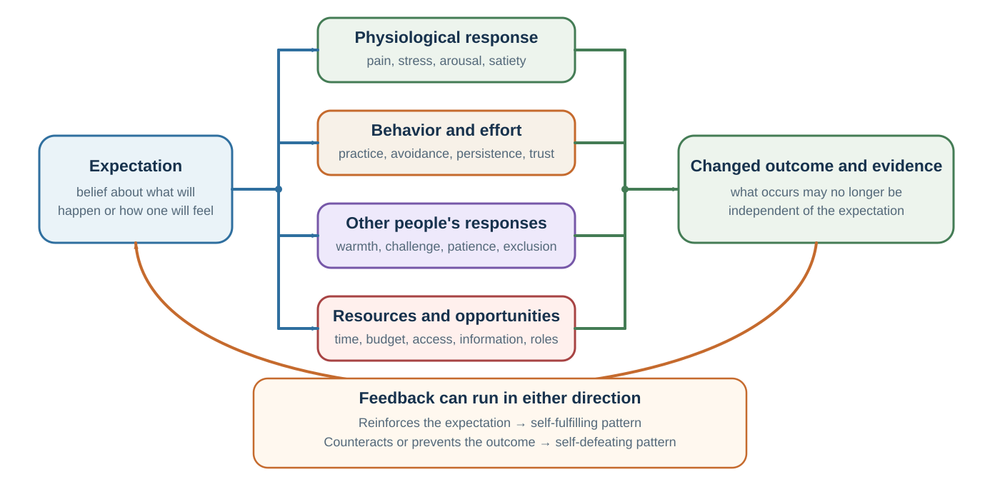

# Expectations: When Predictions Become Causes

*Beliefs can change perception, physiology, behavior, and social feedback*

::: {.callout-note .core-idea icon=false}
## Core Idea

An expectation is sometimes more than a description of the future. It can alter attention, interpretation, effort, bodily response, treatment by others, and the feedback that later appears to confirm the original belief.
:::

## Learning goals

- Map a self-fulfilling expectation loop.
- Distinguish four pathways through which expectations can change outcomes.
- Design a supported expectation and an independent test of its effects.

::: {.callout-note .loop-location icon=false}
## Where this chapter enters the loop

Expectations link **Predict** to **Act** and then back to **Learn**. In human systems, a forecast can change physiology, effort, other people's responses, or access to opportunity—and thereby help produce its own evidence.
:::

The sociologist Robert K. Merton introduced the term self-fulfilling prophecy to describe a false definition of a situation that evokes behavior making the originally false belief come true (Merton, 1948). His classic example was a bank run. If enough people believe a bank is in trouble, they withdraw their money. Their withdrawals then create the very crisis they feared. The belief becomes real through the behavior it causes.

This structure appears far beyond banking.

A rumor that a company is failing may cause employees to leave, customers to hesitate, suppliers to tighten terms, and investors to withdraw support. These reactions can weaken the company and make failure more likely. A leader who believes a team lacks initiative may centralize every decision, preventing the team from developing initiative. A student who believes they cannot succeed may reduce effort, avoid challenge, and perform poorly, confirming the belief.

A self-fulfilling belief is a loop:

Belief shapes attention. Attention shapes interpretation. Interpretation shapes emotion. Emotion shapes action. Action shapes the environment. The environment produces feedback. Feedback seems to confirm the belief.

The danger is that the final confirmation feels like evidence. The manager says, “See? They really cannot work independently.” The student says, “See? I really am bad at this.” The anxious person says, “See? People do reject me.” The investor says, “See? The market knew.” But the evidence was partly produced by the original expectation.

Not every expectation fulfills itself. Some expectations are accurate because they are based on good evidence. Others are false but self-correcting. A prediction of failure may motivate preparation and prevent failure. A prediction of danger may lead to safety measures that avoid harm. These are sometimes called self-defeating prophecies: predictions that change behavior in ways that prevent the predicted outcome.

The key distinction is whether the belief changes the system. A weather forecast does not usually change the weather, although it changes whether people carry umbrellas. A bank failure rumor can change the bank’s actual condition. A teacher’s expectation can change a student’s opportunities. A doctor’s words can change a patient’s anxiety and bodily experience. A manager’s trust or distrust can change employee behavior.

Self-fulfilling beliefs matter for decision-making because they blur the line between prediction and action. When people make predictions about human systems, the prediction can become part of the system itself.

### Diagnose the direction of the loop

An anxious presenter expects to look incompetent. That expectation directs attention toward bored-looking faces and makes neutral silence feel like failure. The presenter speeds up, stops asking questions, and avoids eye contact. The audience then disengages, producing the evidence the presenter feared. Merely disputing the initial thought misses the causal chain; changing the sampling or action can test it. The presenter might ask an early question, deliberately scan engaged as well as disengaged faces, or compare audience ratings with the private prediction recorded beforehand.

::: {#tbl-self-fulfilling-self-defeating}
<table class="table">
<thead>
<tr>
<th scope="col">Type of forecast</th>
<th scope="col">Example loop</th>
<th scope="col">What the later outcome means</th>
</tr>
</thead>
<tbody>
<tr>
<th scope="rowgroup" rowspan="2" style="vertical-align: middle;">Self-fulfilling</th>
<td>Distrust → withhold information → ambiguity and defensiveness → “They cannot be trusted.”</td>
<td>The outcome is partly caused by acting on the forecast.</td>
</tr>
<tr>
<td>Expect failure → avoid practice → weak performance → “I knew I would fail.”</td>
<td>Confirmation is not independent evidence for the original ability judgment.</td>
</tr>
<tr>
<th scope="rowgroup" rowspan="2" style="vertical-align: middle;">Self-defeating</th>
<td>Forecast operational risk → prepare contingencies → disruption is contained.</td>
<td>The forecast may have been useful even though the predicted disaster did not occur.</td>
</tr>
<tr>
<td>Fear an exam failure → create and follow a study plan → pass.</td>
<td>Non-occurrence does not show that the warning was irrational.</td>
</tr>
</tbody>
</table>

Predictions can create or prevent the outcomes they describe
:::

This yields a better review question than “Was the forecast right?” Ask: **Through what actions did the forecast change exposure, effort, resources, or other people’s responses?** Then ask what evidence remains independent of that intervention.

This is especially important in organizations. Forecasts influence budgets, hiring, morale, investment, and attention. If leaders predict that a product will fail, they may underfund it, assign weaker teams, and interpret early problems as confirmation. If they predict success, they may provide resources, patience, and attention. The forecast becomes a resource allocation decision disguised as a belief.

The same thing happens in education. A child labeled “gifted” may receive more challenge, encouragement, and patience. A child labeled “weak” may receive less demanding work, less wait time, and less autonomy. Over time, the labels can become less like descriptions and more like instructions.

The ethical lesson is clear: expectations are not neutral. To expect something from another person is often to begin treating them in a way that changes what becomes possible.

## Expectation in the body

{#fig-expectation-loop fig-alt="Circular loop from expectation through attention, interpretation, emotion, action, environment and others, feedback, and back to expectation."}

The loop contains at least four distinguishable causal pathways. They should not be collapsed into a vague claim that “mindset changes reality.”

| Pathway | What the expectation changes | Illustration |
| --- | --- | --- |
| Attention | What is monitored and retrieved. | Expecting a symptom increases scanning for it. |
| Interpretation | What ambiguous evidence is taken to mean. | Nervous arousal becomes danger or readiness. |
| Physiology | Stress, pain, fatigue, satiety, and arousal regulation. | A nocebo warning can amplify symptom experience. |
| Action | Practice, avoidance, disclosure, trust, persistence, and feedback seeking. | Low expectations reduce effort and opportunities to learn. |
: Four pathways from expectation to outcome {#tbl-08-expectation-pathways}

Expectation effects are not only social. They can shape subjective experience and even bodily responses.

The best-known examples are placebo and nocebo effects. A placebo effect occurs when positive expectations about a treatment contribute to improvement, even when the treatment has no active ingredient specific to the condition. A nocebo effect occurs when negative expectations contribute to worsening symptoms, side effects, or distress (Benedetti, 2008; Colloca & Barsky, 2020; Colloca & Miller, 2011).

Placebo effects are not simply “imaginary.” They can involve real psychological and physiological mechanisms, including expectation, learning, attention, anxiety reduction, endogenous opioids, dopamine pathways, and conditioning processes (Benedetti, 2008; Finniss et al., 2010). Response expectancy theory argues that expectations about one’s own nonvolitional responses—such as pain, anxiety, nausea, or fatigue—can help produce those responses (Kirsch, 1985).

If a patient expects pain relief, anxiety may fall, attention to pain may decrease, and endogenous pain-control systems may become more active. If a patient expects side effects, attention to bodily sensations may increase, ordinary sensations may be interpreted as symptoms, and anxiety may amplify discomfort.

Nocebo effects raise a difficult ethical problem in medicine. Patients have a right to know risks. But the way risks are communicated can increase fear and symptoms. A doctor who says, “This drug often causes terrible nausea” may produce a different expectation than one who says, “Some people experience nausea, but many do not, and we have ways to manage it.” Both can be truthful, but they create different expectation environments.

Ethical communication does not require hiding information. It requires communicating risks accurately without unnecessary threat amplification. Clinicians can validate concerns, provide balanced probabilities, explain what to monitor, and emphasize available support. The goal is neither deception nor careless optimism. The goal is informed expectation.

Expectation also shapes taste, pleasure, and consumer experience. Plassmann and colleagues (2008) found that when people believed they were drinking more expensive wine, they reported greater pleasantness, and valuation-related brain activity increased, even when the wine was actually the same. Lee, Frederick, and Ariely (2006) found that beer preferences changed depending on whether people learned before or after tasting that vinegar had been added. Information changed experience, not merely post-hoc explanation.

Marketing can produce placebo-like effects. Shiv, Carmon, and Ariely (2005) found that people who consumed an energy drink purchased at a discounted price performed worse on puzzle tasks than those who consumed the same drink at full price. The lower price apparently reduced expected efficacy. Again, the product did not change. Expectation changed performance.

Crum and Langer (2007) studied hotel room attendants whose work involved substantial physical activity. Some were informed that their work satisfied exercise recommendations; others were not. The informed group later showed improvements in measures such as weight, blood pressure, and perceived exercise. The study suggests that mindset about an activity can affect physiological outcomes, though such findings should be interpreted carefully and not turned into simplistic claims that belief alone determines health. Crum, Corbin, Brownell, and Salovey (2011) similarly found that beliefs about a milkshake’s indulgence influenced physiological satiety responses.

Stress provides another example of interpretation becoming action. Crum, Salovey, and Achor (2013) found that representing stress as potentially enhancing rather than only debilitating changed how participants interpreted and responded to demanding situations. The practical claim is not that harmful overload becomes healthy if relabeled. It is that arousal is ambiguous: it can be carried forward as evidence of damage and incapacity or as energy for a meaningful challenge, and that interpretation can alter the response repertoire.

Cultural expectations can also attach meaning to bodily events. Phillips, Ruth, and Wagner (1993) reported shorter survival among Chinese Americans whose birth years and diseases formed combinations treated as ill-fated in a five-phase cultural system. This example is historically influential because it proposes a path from shared belief to stress, behavior, care, and health. It also requires unusual caution: Smith’s (2006) reanalysis argued that the reported pattern was sensitive to analytical choices. The lesson is therefore not that astrology causes illness. It is that culturally learned expectations can plausibly shape experience and action, while striking observational results still require robust specification checks and replication.

The lesson is not that expectation is magic. Expectations do not override biology, poverty, disease, structural constraints, or physical reality. A person cannot believe away a broken bone or a toxic workplace. But expectations can shape attention, stress, interpretation, motivation, subjective experience, and physiological regulation. In many domains, those pathways matter.

This has practical implications.

A teacher’s words can make a difficult task feel like evidence of growth or evidence of inadequacy. A manager’s framing can make feedback feel like investment or punishment. A doctor’s explanation can make sensations feel manageable or alarming. A coach’s instruction can make fatigue feel like progress or failure. A product’s price, brand, and description can change how it is experienced.

People often think that expectations are “just mental.” But mental states are part of the body’s regulatory system. Expectations can change how the body prepares, attends, feels, and responds.

## Ability beliefs and performance

Expectations are especially powerful when they concern ability.

Consider a student who believes, “I am not a math person.” This belief can shape attention before the problem begins. The student may notice difficulty more quickly, interpret confusion as proof of inability, feel anxiety, avoid practice, give up earlier, and perform worse. The poor performance then confirms the belief.

Now consider a student who believes, “Math is difficult, but ability grows with practice.” This belief does not make the problem easy. But it can change the meaning of difficulty. Confusion becomes part of learning rather than proof of inadequacy. Effort becomes useful rather than embarrassing. Feedback becomes information rather than threat.

Self-efficacy, a concept developed by Bandura, refers to people’s beliefs about their capability to organize and execute actions required to achieve goals (Bandura, 1977, 1997). Self-efficacy affects effort, persistence, resilience, emotional response, and willingness to take on challenge. People with higher self-efficacy are more likely to approach difficult tasks, persist after setbacks, and recover from failure.

Self-efficacy is not the same as empty confidence. It is most useful when grounded in mastery experiences, modeling, feedback, and realistic strategies. False confidence can be dangerous. But low confidence can also become self-defeating if it prevents the very effort that would build ability.

Dweck’s work on implicit theories of intelligence makes a related point. A fixed mindset treats ability as relatively stable; a growth mindset treats ability as developable through effort, strategy, and support (Dweck & Leggett, 1988; Dweck, 2006). Students with growth-oriented beliefs may respond differently to difficulty because failure carries a different meaning. Blackwell, Trzesniewski, and Dweck (2007) found that growth mindset interventions could improve motivation and academic trajectories in some settings.

However, mindset should not be oversold. Meta-analytic work suggests that mindset effects and interventions can be modest and context-dependent (Sisk et al., 2018). Yeager and colleagues (2019) found that a national growth mindset intervention had small but meaningful effects, especially in supportive school contexts. The practical conclusion is not “just believe and success will follow.” A better conclusion is: beliefs about ability matter most when environments provide real opportunities, strategies, support, and feedback.

Learned helplessness shows the darker side of expectation. In early research, animals exposed to uncontrollable adverse events later failed to escape even when escape became possible (Seligman, 1975). Abramson, Seligman, and Teasdale (1978) extended the idea to human attributional style: people are more vulnerable when they explain bad outcomes as internal, stable, and global—“It is my fault, it will always be this way, and it affects everything.” Maier and Seligman (2016) later refined the neuroscience and interpretation of learned helplessness, emphasizing control and active coping.

In decision-making, helplessness becomes dangerous because it changes the perceived choice set. A person who believes nothing will help stops searching for alternatives. A team that believes leadership never listens stops speaking up. A community that believes institutions are permanently unresponsive stops participating. The belief narrows action, and reduced action confirms the belief.

Expectations also shape performance through other people. Rosenthal and Jacobson’s famous study, Pygmalion in the Classroom, suggested that teacher expectations could influence student achievement (Rosenthal & Jacobson, 1968). Teachers were told that certain randomly selected students were likely to show intellectual growth. Those students later showed greater gains, especially among younger children. The interpretation and magnitude of teacher expectancy effects have been debated, but later reviews conclude that expectancy effects are real, though usually more moderate and context-dependent than popular accounts suggest (Jussim & Harber, 2005).

Expectancy effects can operate through multiple channels: teachers may provide more warmth, more challenging material, more response opportunities, more detailed feedback, and more patience to students from whom they expect growth (Harris & Rosenthal, 1985). Students then respond to the richer environment.

The same logic applies to management. Eden (1992) described Pygmalion effects in organizations: leaders’ high expectations can improve subordinate performance when they produce confidence, support, challenge, and opportunity. McNatt’s (2000) meta-analysis found evidence for Pygmalion effects in management contexts. Low expectations can produce the opposite, sometimes called a Golem effect, where negative expectations undermine performance.

The ethical distinction is important. “High expectations” should not mean pressure without support. It should mean credible belief in capacity combined with resources, coaching, autonomy, and feedback. Empty slogans can become blame: “If you failed, you must not have believed enough.” That is not decision science; it is moralized optimism.

Good expectations are not fantasies. They are structured invitations to grow.

## Identity and the meaning of difficulty

Expectations do not only come from individuals. They also come from culture.

A person can enter a classroom, workplace, negotiation, or exam carrying social expectations about what “people like me” are supposed to be good at, bad at, allowed to do, or likely to become. These expectations can affect performance even when no one explicitly discriminates in the moment.

Stereotype threat occurs when people fear confirming a negative stereotype about a group to which they belong (Steele & Aronson, 1995). Steele and Aronson found that Black students performed worse on difficult verbal tests when the test was framed as diagnostic of ability, making racial stereotypes about intellectual ability more relevant. When the same task was framed differently, performance gaps were reduced.

Spencer, Steele, and Quinn (1999) found stereotype threat effects among women taking difficult math tests when gender stereotypes about math ability were made relevant. Shih, Pittinsky, and Ambady (1999) found that Asian American women’s math performance shifted depending on whether ethnic identity or gender identity was made salient. The same person can perform differently depending on which identity-linked expectation is activated.

Cross-national variation points in the same anti-essentialist direction. Guiso and colleagues (2008) reported that gender gaps in mathematics were smaller in societies with greater gender equality, whereas gender differences in reading followed a different pattern. Such country-level associations do not identify a single causal mechanism, but they make one conclusion difficult to avoid: a performance gap is not a context-free measure of innate capacity.

The mechanism is not simple. Stereotype threat may operate through anxiety, increased monitoring, working memory load, reduced sense of belonging, altered motivation, and interpretation of difficulty (Schmader et al., 2008). Meta-analyses show that effects vary by context, task, group, and methodology, and the literature has generated debate about effect sizes and boundary conditions (Flore & Wicherts, 2015; Nguyen & Ryan, 2008). But the core idea remains important: social meanings can enter performance through expectation.

A key feature of stereotype threat is that difficulty changes meaning. A hard problem is not merely hard. It becomes evidence that one may confirm a stereotype. That extra meaning consumes attention and increases pressure. In the terms developed in *Valuation*, the task is no longer just a task; it is filtered through an inner model of social evaluation.

Stereotypes can also shape aging. Levy and Langer (1994) found that cultural beliefs about aging were associated with memory performance among older adults in different cultural groups. Levy (2009) and colleagues have argued that aging stereotypes can influence health through psychological, behavioral, and physiological pathways. In one longitudinal study, people with more positive self-perceptions of aging lived longer on average than those with more negative self-perceptions, even after controlling for several relevant factors (Levy et al., 2002). Negative aging stereotypes held earlier in life have also been linked to later cardiovascular events (Levy et al., 2009).

These findings should not be interpreted as saying that aging is “all mindset.” Biology, healthcare, income, environment, discrimination, and physical conditions matter enormously. But beliefs about aging can influence activity, stress, motivation, social engagement, and interpretation of bodily changes. A person who believes decline is inevitable may stop exercising, learning, or seeking social connection. A person who believes growth and adaptation remain possible may act differently.

Expectations also shape belonging. Walton and Cohen (2011) found that a brief social-belonging intervention improved academic and health outcomes among African American college students over time. The intervention helped students interpret common social difficulties as normal and temporary rather than as evidence that they did not belong. The effect was not simply positive thinking; it changed the meaning of adversity.

This is one of the most important principles of expectation effects:

Expectations change the meaning of difficulty.

Difficulty can mean “I am not capable.” It can mean “I am learning.” It can mean “I do not belong.” It can mean “This is normal at the beginning.” It can mean “People like me cannot do this.” It can mean “People like me have done this before.”

The experience of the same difficulty can lead to withdrawal or persistence depending on the expectation attached to it.

Educators, leaders, parents, doctors, and negotiators should therefore be careful meaning-makers. The words they use can attach interpretations to effort, pain, uncertainty, conflict, and failure. Those interpretations can influence what people do next.

## Expectations between people

Expectations shape not only individual performance but also relationships.

Suppose you expect a colleague to be defensive. You enter the conversation cautiously, use guarded language, avoid warmth, and interpret questions as resistance. Your colleague senses distrust, becomes less open, and responds stiffly. You leave thinking, “I knew they would be defensive.”

But your expectation helped create the interaction.

Snyder, Tanke, and Berscheid (1977) demonstrated this kind of behavioral confirmation in a classic study. Men spoke by telephone with women whom they believed to be either physically attractive or unattractive, based on photographs that were not actually of the women. Men who believed they were speaking with an attractive woman behaved more warmly. The women, responding to that warmth, behaved in ways that independent observers judged as warmer and more sociable. The men’s expectations changed their own behavior, which elicited confirming behavior from the women.

Darley and Fazio (1980) described expectancy-confirmation processes in social interaction. Expectations shape how perceivers act toward targets; targets respond to that treatment; perceivers interpret the response as evidence for their original expectation. The process can happen without conscious intention.

This has obvious implications for leadership. A manager who trusts employees may give autonomy, share information, and invite initiative. Employees may respond with responsibility and engagement. A manager who distrusts employees may monitor closely, withhold information, and restrict discretion. Employees may become passive or resentful, confirming the manager’s belief.

It also matters for negotiation. If you expect the other side to be dishonest, you may withhold information, make guarded offers, and interpret ambiguity as manipulation. The other side, sensing distrust, may also become guarded. The negotiation becomes more adversarial, confirming your expectation. Conversely, if you assume cooperation too naively, you may reveal too much or fail to protect yourself. The point is not to trust blindly. The point is to recognize that expectations shape the interaction.

Expectations also matter in intimate relationships. If one partner expects criticism, they may hear neutral comments as attacks. If another expects abandonment, they may test the relationship in ways that create conflict. If a friend expects exclusion, they may withdraw, reducing invitations and confirming loneliness. Social life is full of loops in which expectation shapes behavior and behavior shapes evidence.

Social anxiety offers a clear example. A person expects negative evaluation, monitors themselves intensely, avoids eye contact, speaks less, or behaves stiffly. Others may experience the interaction as distant, which can reduce warmth. The anxious person interprets the reduced warmth as rejection. The original expectation becomes self-confirming.

The practical question is:

How am I treating people because of what I expect from them?

In many relationships, the fastest way to test an expectation is not to ask whether it is true in the abstract, but to change one’s own behavior and observe what becomes possible. Offer trust with boundaries. Ask a warmer question. Give clearer responsibility. Provide more autonomy. Interpret ambiguity generously once, not forever. Make it easier for the other person to disconfirm your expectation.

Expectations are invitations. Some invite defensiveness. Others invite competence, openness, trust, or effort.

## Building truthful, supported expectations

Expectation effects can help or harm. The goal is not to believe whatever feels good. The goal is to create expectations that are truthful, empowering, testable, and ethically communicated.

The first step is to identify the loop. When an expectation keeps confirming itself, ask how it might be shaping attention, interpretation, emotion, action, and feedback.

A teacher might ask: Do I call on some students more often? Do I wait longer for some answers? Do I give richer feedback to students I expect to succeed? Do I interpret the same mistake differently depending on the student?

A manager might ask: Do I give autonomy only to employees I already trust? Do I create passivity through micromanagement? Do I treat questions as resistance? Do I underinvest in people I have labeled as weak?

A person might ask: Do I avoid situations that could disconfirm my fear? Do I interpret neutral feedback negatively? Do I quit early because I expected difficulty? Do I act in ways that make rejection more likely?

The second step is to separate prediction from treatment. It may be reasonable to believe that someone currently lacks a skill. It does not follow that they should be denied opportunities to build it. A student may be behind; that is a prediction about current performance. The valuation question is how much support and challenge they deserve. The action question is what environment would allow improvement.

The third step is to make expectations testable. Instead of saying, “This employee lacks initiative,” specify observable predictions: “If given a clear goal and authority over the method, will this employee propose a plan within one week?” Then run a small test. Instead of saying, “I am bad at public speaking,” specify: “If I practice three times with feedback, will my next presentation improve?” A testable expectation can learn.

The fourth step is to use high expectations with high support. High expectations without support become pressure. Support without expectations becomes low challenge. The strongest developmental environments communicate: “This is difficult, you can improve, and we will provide the tools, feedback, and standards that help you improve.”

The fifth step is to avoid identity traps. Do not turn temporary performance into permanent identity. “You did poorly on this task” is different from “You are bad at this.” “This strategy failed” is different from “We are not innovative.” “This conversation was difficult” is different from “This relationship is hopeless.” Identity labels are sticky because they shape future attention and action.

The sixth step is to communicate uncertainty carefully. In medicine, education, management, and leadership, people need accurate information, but they also need language that does not unnecessarily create nocebo, helplessness, or identity threat. A doctor can say, “Some patients experience side effects, and here is what to watch for; many do not, and we can manage them if they arise.” A teacher can say, “This is a hard problem, and confusion at this stage is normal.” A manager can say, “This project has risks, but here is how we will test them.”

The seventh step is to change the environment, not only the belief. Expectation interventions work best when the environment supports the new belief. Telling students they belong is more credible when classrooms are inclusive. Telling employees they are trusted is credible when they receive real authority. Telling patients symptoms are manageable is credible when support is available. Beliefs need evidence.

The ethical principle is simple: use expectations to expand agency, not to deny reality.

Positive expectations become harmful when they blame people for structural barriers, illness, discrimination, or bad luck. Negative expectations become harmful when they deny people opportunity. Ethical expectation design combines honesty, support, and possibility.

The next part carries this loop into heuristics, belief protection, and probability judgment. Later chapters follow uncertainty into risky choice, experienced evidence, choice across time, habit, and self-control, before showing how those mechanisms can be redesigned. Expectations shape what we notice, feel, and do. When expectation-guided actions are repeated in stable contexts, they can become automatic. A student repeatedly avoiding math, a manager repeatedly micromanaging, a patient repeatedly scanning for symptoms, or a person repeatedly withdrawing from social contact may no longer experience the behavior as a decision. It becomes a habit loop.

Before behavior becomes habit, it is often expectation in action.

::: {.callout-caution .evidence-and-boundary-conditions icon=false}
## Expectations are pathways, not magic

Expectation effects are pathways, not magic. They do not erase disease, material constraints, discrimination, poverty, or structural power.
:::

::: {.callout-caution .evidence-and-boundary-conditions icon=false}
## Effects depend on context and support

Growth-mindset and stereotype-threat effects are heterogeneous and often modest. Context, task, support, measurement, and implementation matter. Avoid converting a conditional effect into blame for people who face real barriers.
:::

| Domain | Pathway | Ethical condition |
| --- | --- | --- |
| Medicine | Expectation changes attention, anxiety, and symptom experience. | Give balanced risk information and a credible coping plan. |
| Education | Ability beliefs change effort, persistence, and interpretation of difficulty. | Pair high expectations with strategy, support, and opportunity. |
| Management | Leader expectations change autonomy, feedback, and challenge. | Make resources and standards match the expectation. |
| Relationships | Predicted rejection changes behavior and the response it elicits. | Test the prediction through perspective-getting, not mind-reading. |
: Expectation pathways and ethical conditions {#tbl-08-1}

## Practice Lab

Map one expectation in health, education, leadership, or markets. Produce a four-pathway diagram showing any effects through physiology, the focal person's effort or behavior, other people's responses, and resources or opportunities. Add one measure collected before the loop can operate and one comparison that could separate an accurate forecast from an outcome partly produced by the forecast.

## Take it forward

- **Use this when:** a prediction concerns a person or system that can react to being predicted.
- **Do not infer:** that belief alone can overcome material constraints, that every confirming outcome validates the original forecast, or that all expectation effects share one mechanism.
- **Try this next:** pair one ambitious expectation with a concrete opportunity, support, feedback channel, and independent baseline.

## References cited in this chapter

::: {.reference}
Abramson, L. Y., Seligman, M. E. P., & Teasdale, J. D. (1978). Learned helplessness in humans: Critique and reformulation. Journal of Abnormal Psychology, 87(1), 49–74.
:::

::: {.reference}
Bandura, A. (1977). Self-efficacy: Toward a unifying theory of behavioral change. Psychological Review, 84(2), 191–215.
:::

::: {.reference}
Bandura, A. (1997). Self-efficacy: The exercise of control. W. H. Freeman.
:::

::: {.reference}
Benedetti, F. (2008). Mechanisms of placebo and placebo-related effects across diseases and treatments. Annual Review of Pharmacology and Toxicology, 48, 33–60.
:::

::: {.reference}
Blackwell, L. S., Trzesniewski, K. H., & Dweck, C. S. (2007). Implicit theories of intelligence predict achievement across an adolescent transition: A longitudinal study and an intervention. Child Development, 78(1), 246–263.
:::

::: {.reference}
Colloca, L., & Barsky, A. J. (2020). Placebo and nocebo effects. New England Journal of Medicine, 382(6), 554–561.
:::

::: {.reference}
Colloca, L., & Miller, F. G. (2011). The nocebo effect and its relevance for clinical practice. Psychosomatic Medicine, 73(7), 598–603.
:::

::: {.reference}
Crum, A. J., Corbin, W. R., Brownell, K. D., & Salovey, P. (2011). Mind over milkshakes: Mindsets, not just nutrients, determine ghrelin response. Health Psychology, 30(4), 424–429.
:::

::: {.reference}
Crum, A. J., & Langer, E. J. (2007). Mind-set matters: Exercise and the placebo effect. Psychological Science, 18(2), 165–171.
:::

::: {.reference}
Crum, A. J., Salovey, P., & Achor, S. (2013). Rethinking stress: The role of mindsets in determining the stress response. Journal of Personality and Social Psychology, 104(4), 716–733.
:::

::: {.reference}
Darley, J. M., & Fazio, R. H. (1980). Expectancy confirmation processes arising in the social interaction sequence. American Psychologist, 35(10), 867–881.
:::

::: {.reference}
Dweck, C. S. (2006). Mindset: The new psychology of success. Random House.
:::

::: {.reference}
Dweck, C. S., & Leggett, E. L. (1988). A social-cognitive approach to motivation and personality. Psychological Review, 95(2), 256–273.
:::

::: {.reference}
Eden, D. (1992). Leadership and expectations: Pygmalion effects and other self-fulfilling prophecies in organizations. The Leadership Quarterly, 3(4), 271–305.
:::

::: {.reference}
Finniss, D. G., Kaptchuk, T. J., Miller, F., & Benedetti, F. (2010). Biological, clinical, and ethical advances of placebo effects. The Lancet, 375(9715), 686–695.
:::

::: {.reference}
Flore, P. C., & Wicherts, J. M. (2015). Does stereotype threat influence performance of girls in stereotyped domains? A meta-analysis. Journal of School Psychology, 53(1), 25–44.
:::

::: {.reference}
Harris, M. J., & Rosenthal, R. (1985). Mediation of interpersonal expectancy effects: 31 meta-analyses. Psychological Bulletin, 97(3), 363–386.
:::

::: {.reference}
Guiso, L., Monte, F., Sapienza, P., & Zingales, L. (2008). Culture, gender, and math. Science, 320(5880), 1164–1165.
:::

::: {.reference}
Jussim, L., & Harber, K. D. (2005). Teacher expectations and self-fulfilling prophecies: Knowns and unknowns, resolved and unresolved controversies. Personality and Social Psychology Review, 9(2), 131–155.
:::

::: {.reference}
Kirsch, I. (1985). Response expectancy as a determinant of experience and behavior. American Psychologist, 40(11), 1189–1202.
:::

::: {.reference}
Lee, L., Frederick, S., & Ariely, D. (2006). Try it, you’ll like it: The influence of expectation, consumption, and revelation on preferences for beer. Psychological Science, 17(12), 1054–1058.
:::

::: {.reference}
Levy, B. R. (2009). Stereotype embodiment: A psychosocial approach to aging. Current Directions in Psychological Science, 18(6), 332–336.
:::

::: {.reference}
Levy, B. R., & Langer, E. (1994). Aging free from negative stereotypes: Successful memory in China and among the American deaf. Journal of Personality and Social Psychology, 66(6), 989–997.
:::

::: {.reference}
Levy, B. R., Slade, M. D., Kunkel, S. R., & Kasl, S. V. (2002). Longevity increased by positive self-perceptions of aging. Journal of Personality and Social Psychology, 83(2), 261–270.
:::

::: {.reference}
Levy, B. R., Zonderman, A. B., Slade, M. D., & Ferrucci, L. (2009). Age stereotypes held earlier in life predict cardiovascular events in later life. Psychological Science, 20(3), 296–298.
:::

::: {.reference}
Maier, S. F., & Seligman, M. E. P. (2016). Learned helplessness at fifty: Insights from neuroscience. Psychological Review, 123(4), 349–367.
:::

::: {.reference}
McNatt, D. B. (2000). Ancient Pygmalion joins contemporary management: A meta-analysis of the result. Journal of Applied Psychology, 85(2), 314–322.
:::

::: {.reference}
Merton, R. K. (1948). The self-fulfilling prophecy. The Antioch Review, 8(2), 193–210.
:::

::: {.reference}
Phillips, D. P., Ruth, T. E., & Wagner, L. M. (1993). Psychology and survival. The Lancet, 342(8880), 1142–1145.
:::

::: {.reference}
Plassmann, H., O’Doherty, J., Shiv, B., & Rangel, A. (2008). Marketing actions can modulate neural representations of experienced pleasantness. *Proceedings of the National Academy of Sciences, 105*(3), 1050–1054.
:::

::: {.reference}
Nguyen, H.-H. D., & Ryan, A. M. (2008). Does stereotype threat affect test performance of minorities and women? A meta-analysis of experimental evidence. Journal of Applied Psychology, 93(6), 1314–1334.
:::

::: {.reference}
Rosenthal, R., & Jacobson, L. (1968). Pygmalion in the classroom: Teacher expectation and pupils’ intellectual development. Holt, Rinehart & Winston.
:::

::: {.reference}
Schmader, T., Johns, M., & Forbes, C. (2008). An integrated process model of stereotype threat effects on performance. Psychological Review, 115(2), 336–356.
:::

::: {.reference}
Seligman, M. E. P. (1975). Helplessness: On depression, development, and death. W. H. Freeman.
:::

::: {.reference}
Shih, M., Pittinsky, T. L., & Ambady, N. (1999). Stereotype susceptibility: Identity salience and shifts in quantitative performance. Psychological Science, 10(1), 80–83.
:::

::: {.reference}
Shiv, B., Carmon, Z., & Ariely, D. (2005). Placebo effects of marketing actions: Consumers may get what they pay for. Journal of Marketing Research, 42(4), 383–393.
:::

::: {.reference}
Sisk, V. F., Burgoyne, A. P., Sun, J., Butler, J. L., & Macnamara, B. N. (2018). To what extent and under which circumstances are growth mind-sets important to academic achievement? Two meta-analyses. Psychological Science, 29(4), 549–571.
:::

::: {.reference}
Snyder, M., Tanke, E. D., & Berscheid, E. (1977). Social perception and interpersonal behavior: On the self-fulfilling nature of social stereotypes. Journal of Personality and Social Psychology, 35(9), 656–666.
:::

::: {.reference}
Smith, G. (2006). The five elements and Chinese-American mortality. Health Psychology, 25(1), 124–129.
:::

::: {.reference}
Spencer, S. J., Steele, C. M., & Quinn, D. M. (1999). Stereotype threat and women’s math performance. Journal of Experimental Social Psychology, 35(1), 4–28.
:::

::: {.reference}
Steele, C. M., & Aronson, J. (1995). Stereotype threat and the intellectual test performance of African Americans. Journal of Personality and Social Psychology, 69(5), 797–811.
:::

::: {.reference}
Walton, G. M., & Cohen, G. L. (2011). A brief social-belonging intervention improves academic and health outcomes among minority students. Science, 331(6023), 1447–1451.
:::

::: {.reference}
Yeager, D. S., Hanselman, P., Walton, G. M., Murray, J. S., Crosnoe, R., Muller, C., Tipton, E., Schneider, B., Hulleman, C. S., Hinojosa, C. P., Paunesku, D., Romero, C., Flint, K., Roberts, A., Trott, J., Iachan, R., Buontempo, J., Yang, S. M., Carvalho, C. M., Hahn, P. R., Gopalan, M., Mhatre, P., Ferguson, R., Duckworth, A. L., & Dweck, C. S. (2019). A national experiment reveals where a growth mindset improves achievement. *Nature, 573*, 364–369.
:::
