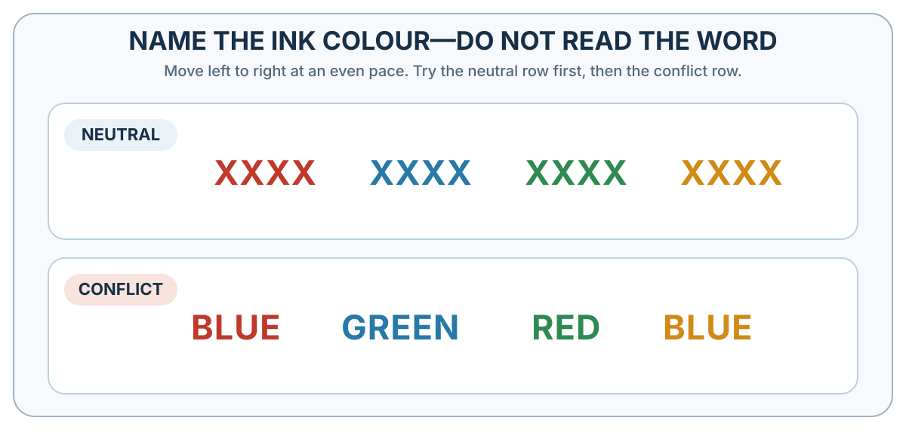

---
aliases:
  - 04-fast-answers-slow-inspection.html
---

# Intuition and Deliberation {#fast-and-frugal-thinking}

*Fast and Frugal Thinking*

::: {#chapter-08-start .chapter-epigraph}
> “The heart has its reasons, which reason does not know.”
>
> — Blaise Pascal, [*Pensées*](https://www.gutenberg.org/cache/epub/18269/pg18269-images.html), 1670, §277, translated by W. F. Trotter
:::

A bat and a ball cost $1.10 in total. The bat costs $1.00 more than the ball. How much does the ball cost?

Write down your answer before continuing, then check whether both prices satisfy both conditions. Simple arithmetic should be easy to settle, yet an answer can feel right before it has met the requirements. In a puzzle, checking costs little. In a hiring decision or an emergency, checking takes time that may itself matter. The practical problem is deciding when a fast answer deserves trust and when it needs inspection.

::: {.callout-note .core-idea icon=false}
## Core Idea

A quick answer can reflect skilled recognition or a misleading shortcut. Deliberation can correct it, but can also defend it. To judge an intuition, examine the cue it used, how reliably that cue predicts the target, and what feedback could have trained the connection.

:::

## Learning goals

- Explain automatic and reflective processing without treating them as literal brain systems.
- Diagnose a heuristic through its target question, cue, ecological fit, and feedback.
- Distinguish monitoring a judgment from choosing how to check or revise it.
- Decide when intuition deserves trust and when a structured check is warranted.

If the ball cost 10 cents, the bat would cost $1.10 and the total would be $1.20. The correct prices are 5 cents and $1.05. The tempting answer uses the numbers fluently while failing to preserve the stated difference.

Frederick's (2005) Cognitive Reflection Test uses problems of this kind to study responses to tempting errors. Studies have also observed correct initial answers under time pressure and cognitive load (Bago & De Neys, 2019); familiarity and skill can change which answer comes easily. The test relates to performance on other reasoning tasks (Toplak et al., 2011).

A comparable problem arises when an impressive interview answers “How engaging is this candidate?” while the employer needs to know “How well will this person perform the work?” The impression may be useful, but its relevance has to be established.

## From a quick answer to a heuristic

An error on a simple puzzle might suggest that shortcuts should always give way to fuller calculation. But time, attention, and useful information are limited; sometimes a short rule is the best tool available.

A **heuristic** is a simplifying process that uses limited information to reach a workable judgment or action. It is not an error by definition. Under bounded time, attention, and computation, a simple cue can be more usable—and sometimes more accurate—than a complex model fitted to noise (Gigerenzer & Gaissmaier, 2011).

{#fig-heuristic-substitution fig-alt="A target question is replaced by an easier question and then produces a quick answer." .phone-fit}

The bat-and-ball response and the founder example in @fig-heuristic-substitution illustrate **attribute substitution**: the mind answers an easier question that resembles the target. The same substitution occurs when “How likely is this risk?” becomes “How easily can I picture it?” or “How well will this applicant perform?” becomes “How confident did the applicant sound?” (Kahneman & Frederick, 2002). The substituted answer may be informative. The error begins when its cue is assigned more evidential weight than it has earned.

Four elements make the diagnosis useful:

1. **Target:** What does the decision actually require?
2. **Cue:** Which accessible feature supplied the quick answer?
3. **Ecological fit:** How reliably does that cue predict the target in this environment? **Ecological rationality** evaluates a strategy by this fit between its information use and the environment.
4. **Feedback:** Has repeated, timely, interpretable feedback trained the cue–target connection?

These questions distinguish the feeling of certainty from the conditions that could justify it. A firefighter recognizing a familiar heat pattern and a recruiter liking a familiar conversational style may both feel sure. To assess either judgment, we need to know whether the cue predicts the target and whether the person has had a fair opportunity to learn that relationship.

::: {.callout-note .research-lens icon=false collapse=true}
## Research Lens: choosing heuristics that fit the task

Several named heuristics make the cue-and-stopping-rule logic concrete. The **recognition heuristic** can be useful when recognizing one option but not another genuinely predicts the target; manufactured familiarity or unequal exposure can break that relation (Goldstein & Gigerenzer, 2002). **Take-the-best** searches cues in order of validity and stops when one discriminates between options (Gigerenzer & Goldstein, 1996). **Elimination by aspects** sequentially selects an aspect and removes options that lack it rather than computing one overall score (Tversky, 1972). **Fast-and-frugal trees** use a short sequence of yes/no questions to classify a case or trigger action (Martignon et al., 2008).

Their quality depends on cue validity, environmental stability, feedback, search costs, and the relative costs of different errors.
:::

## Automatic processing and skilled intuition {#fast-thinking-is-not-primitive-thinking}

If speed were the problem, slowing down would be the remedy. Yet expertise often makes a good answer arrive faster. **Dual-process theories** distinguish relatively autonomous processing from processing that depends more heavily on working memory and cognitive control. How a response is produced is a different question from whether it fits the task.

{#fig-fast-slow fig-alt="Two columns summarize System 1 and System 2 processing features. System 1 is typically fast, automatic, low effort, associative, and cue driven. System 2 is typically working-memory dependent, effortful, rule guided, and capable of hypothetical reasoning. Arrows show candidate answers and possible inspection or training." .phone-fit}

@fig-fast-slow draws on research into controlled and automatic processing (Schneider & Shiffrin, 1977; Shiffrin & Schneider, 1977). The label **System 1** is often used for a family of fast, automatic, intuitive, low-effort, associative, and affective processes; **System 2** groups working-memory-dependent, effortful, rule-guided processes. A single task can recruit several processes, and practice can change which features dominate its performance. These are broad families of processes, not two separate brain structures. Researchers also use **Type 1** and **Type 2** to avoid implying that each family is a single system (Evans & Stanovich, 2013); this book uses the familiar System labels consistently.

Recognizing a friend and reading a familiar sentence usually require little deliberate inspection. A practiced driver can make many small steering adjustments without calculating each movement, while still needing attention for an unexpected hazard. Practice changes particular components of a task.

{#fig-daughter-finger-counting fig-alt="A three-year-old child looks down at her hands while counting on her fingers to work out four plus one." width=42% fig-align="center"}

In @fig-daughter-finger-counting, my three-year-old daughter uses her fingers as an external counting tool to compute 4 + 1. She had to hold the problem in mind, map numbers onto fingers, and inspect the result. The same answer later can arrive without visible counting. With suitable practice and feedback, some components of an initially effortful, rule-guided activity can become faster and more automatic.

Fast thinking is also central to expertise. An experienced chess player sees meaningful patterns that a novice does not. A skilled physician may recognize a disease pattern quickly. A firefighter may sense that a building is unsafe before being able to articulate why. Such intuition can be powerful when it is built in environments with regular patterns and clear feedback (Kahneman & Klein, 2009).

Klein's **recognition-primed decision model** makes the mechanism more specific: experts often recognize a familiar situation, retrieve a plausible action, mentally simulate whether it will work, and act if it appears adequate rather than exhaustively comparing alternatives (Klein, 1998). This is skilled satisficing. It becomes trustworthy only when recurring patterns can be learned through sufficiently clear and timely feedback.

Imagine an experienced operations engineer responding to a service outage. An alarm pattern resembles a previous failure, so she considers isolating one component. Before acting, she mentally checks what should recover and what the isolation might disrupt. A contradictory reading sends her back to another explanation.

Under time pressure, the useful safeguard may be one decisive check, a reversible first action, and a clear condition for escalating to another expert. When the situation is unfamiliar, recognition deserves less confidence, even if it feels immediate. Afterward, a [decision review](41-decision-hygiene-build-a-process-that-can-learn.qmd#what-a-decision-journal-is) should retain the cue, expected result, and mismatch so the next fast judgment can learn from this one.

The outage example also raises a question about the cost of checking: how much evidence should the engineer require before taking protective action? Evolutionary accounts ask a related question about response thresholds. When a missed danger is much costlier than a false alarm, a cautious criterion can be favored even though it generates many false alarms (Haselton & Buss, 2000; Nesse, 2005). Time pressure may create an additional speed–accuracy trade-off. Signal-detection reasoning shows how a cautious threshold can be optimal under stated base rates and error costs. [Appendix B](../appendices/appendix-b-evolutionary-explanations-of-value-choice-and-rationality.qmd#heuristics-tools-and-biases) separates modeled performance, actual strategy use, and evolutionary origin.

In an unfamiliar situation, a coherent impression can still make a check feel unnecessary. A recruiter may recognize a confident style without knowing whether it predicts performance. Kahneman's (2011) phrase WYSIATI—“What You See Is All There Is”—captures the tendency to build an account from available information while overlooking what is missing.

Gilbert (1991) proposed that accepting a proposition can be easier than rejecting it. In experiments, distraction increased acceptance of statements presented as false (Gilbert et al., 1993). These findings show how cognitive load can interfere with checking.

## The benefits and costs of deliberate thought {#slow-thinking-is-powerful-expensive-and-often-late}

A tempting error gives reflection a clear job: check the answer against the rule. But that check competes for working memory and may never start if the first answer feels settled.

Reflective processing allows us to maintain a goal, compare evidence, and check a response against a rule. Its usefulness depends on whether the task leaves room for those operations. Holding intermediate results in working memory can interfere with another task, while a familiar answer may never prompt a check (Baddeley, 1992; Cowan, 2001). Pupil dilation can track changes in task demand under controlled conditions (Beatty, 1982; Kahneman & Beatty, 1966).

The effort involved can also influence whether we choose to think further. Kool and colleagues (2010) let participants choose between two on-screen decks of cards. Each card required a simple judgment: whether a number was even or whether it was below five. One deck required frequent switches between these rules; the other usually repeated the previous rule. Participants tended to favor the deck requiring fewer switches. Across the paper's experiments, avoiding errors or finishing sooner could not fully explain the preference for less demanding tasks. Being capable of deliberate thought does not guarantee that we will engage it. The practical aim is to direct that effort toward judgments where checking could make a worthwhile difference.

The Stroop task illustrates the effort of overriding a practiced response. In @fig-stroop-interference-lab, name the **ink colour**, rather than read the printed word. Reading is so practiced that a colour name printed in a different colour supplies a competing response before the instructed answer is ready. People are typically slower and more error-prone when controlled attention must resolve this conflict between a fluent but task-irrelevant response and the current goal (Stroop, 1935).

{#fig-stroop-interference-lab fig-alt="Two large rows ask the reader to name ink colour. The neutral row contains red, blue, green, and orange strings of X characters. The conflict row contains colour words printed in incongruent colours." width=100%}

Reflection may also work on behalf of an initial impression. An interviewer who already likes a candidate can spend considerable effort finding reasons to justify that preference. More thinking improves the decision only if it examines relevant evidence and permits a different conclusion.

Distraction, stress, and fatigue can make a check harder. A practical response is to provide the conditions for a useful check: time, a clear question, and evidence that can contradict the first impression.

## Monitoring and guiding thought {#monitoring-and-guiding-thought}

How do we recognize that a thought needs checking? Return to the bat-and-ball problem. “Ten cents” is a judgment about the answer. “That came too easily; I should check the total” is a judgment about your own thinking. **Metacognition** involves monitoring and regulating cognition: assessing what you know, noticing uncertainty, and deciding how to proceed.

Two functions matter. **Monitoring** estimates how well a cognitive process is going. **Control** changes what you do next: reread the question, calculate the total, seek another observation, or stop checking. A feeling of uncertainty can arise quickly; deliberately comparing an answer with the problem's conditions recruits the effortful processes associated with System 2. Metacognition can therefore connect an automatic warning with a controlled response.

Desender et al. (2018) separated confidence from accuracy in a perceptual decision task. Participants requested more information under conditions that reduced confidence, even when accuracy was matched. The study shows how an assessment of one's own judgment can guide evidence gathering. Whether that assessment deserves trust depends on how well confidence tracks performance.

This connects to [Chapter 4's predictive mind](04-the-predictive-mind-perception-is-inference.qmd#generative-ai-and-predictive-processing). The inference that makes a scene recognizable usually unfolds without conscious supervision. Reflection can question the resulting interpretation and guide the next observation. Our operations engineer may initially recognize a familiar failure, then ask which diagnostic reading would distinguish it from an alternative. She changes what evidence becomes available without consciously directing each perceptual computation.

Predictive processing and dual-process theory address different aspects of cognition. The former describes how expectations and incoming evidence may interact; the latter distinguishes processing by its dependence on working memory and control. Predictive processing should therefore not be identified wholesale with System 1. Its proposed computations can also contribute to attention and goal-directed action (Friston, 2010; Evans & Stanovich, 2013).

::: {#ai-reasoning-and-reflective-thought}

::: {.callout-note .research-lens icon=false collapse=true}
## Research Lens: AI reasoning and reflective thought

An AI system can also give an immediate answer or spend more computation developing and checking a solution. This makes reasoning modes a useful comparison with deliberate thought. To understand the comparison, follow what changes between the first candidate answer and the final one.

### Intermediate steps become input for later steps {.unlisted}

An autoregressive LLM continues to generate tokens during an extended reasoning sequence. Those tokens can state subproblems, carry intermediate results, identify contradictions, or propose another approach. Because earlier generated text becomes context for later generation, the system can use its own intermediate work to shape its next step. **Chain-of-thought prompting** elicits such sequences through examples of worked reasoning; Wei et al. (2022) demonstrated improvements on several reasoning benchmarks.

Reasoning behavior can also be learned during training. In the DeepSeek-R1 research, reinforcement learning rewarded successful solutions to verifiable problems and produced patterns of checking and revising intermediate work (Guo et al., 2025). Training changes parameters; using the resulting reasoning strategy on a new problem need not do so. More computation at answer time can improve a solution while the underlying parameters remain fixed.

### Some systems explicitly search among alternatives {.unlisted}

The idea of a model “prompting itself” is especially concrete in systems with a search procedure around the LLM. **Tree of Thoughts**, for example, generates candidate intermediate steps, evaluates alternatives, and searches forward or backtracks among them (Yao et al., 2023). Here, a control procedure organizes repeated model calls. Other reasoning systems develop a single extended sequence; a reasoning label alone does not establish that a separate controller compares multiple branches.

The functional resemblance to metacognition lies in treating an intermediate answer as something to examine and potentially revise. It does not establish human-like awareness or make the AI architecture an implementation of the psychological System 1/System 2 distinction.

### A useful check needs a criterion for being wrong {.unlisted}

Consider a model that proposes ten cents for the ball. Asking it to verify both the total and the price difference gives the next reasoning step a concrete test. Asking only “Are you sure?” leaves it to decide what counts as a reason to change. Huang et al. (2024) found that, in the systems and tasks they tested, attempts at self-correction without external feedback sometimes reduced reasoning accuracy. Trained checking strategies can help, but the opportunity to reconsider does not itself guarantee improvement.

The same practical problem appears when people deliberate. A longer explanation may expose an error or defend it more elaborately. Arithmetic supplies an internal consistency test; a claim about the world may require a measurement, an observation, or a reliable source. The value of reflection depends on what the additional work checks and whether its result can overturn the first answer. [Chapter 42](42-data-driven-decision-making.qmd#ai-workbench) applies this principle to AI-assisted decisions.
:::

:::

## How the modes train and correct one another

A check can improve the answer in front of us. Repeated checking with useful feedback can also change which answer comes to mind next time.

Practice can make a response faster without making its cue more trustworthy. The training problem is to develop fluency while preserving feedback that can expose error. Fitts and Posner (1967) described changes from effortful learning through refinement toward more autonomous performance. Logan's (1988) account emphasizes retrieving stored instances instead of recomputing each response.

The conditions of practice matter. Repeated experience can teach a pianist whether a movement produces the intended note; an interviewer may never discover how a rejected applicant would have performed. Without diagnostic feedback, confidence can grow even when accuracy does not (Kahneman & Klein, 2009). [Chapter 15](15-samples-randomness-regression-and-calibration.qmd#confidence-must-face-a-distribution) distinguishes overestimating performance, overestimating relative standing, and being too certain, then shows what feedback each requires.

Reflection can also prepare the setting in which a quick response will occur. A hiring committee can define job-relevant criteria before meeting candidates and record ratings before discussion. This directs attention while leaving the impressions open to comparison with evidence. Later chapters develop environmental changes that make useful actions easier to repeat.

## Emotion is part of judgment

Fast cognition is not simply emotion, and reflective cognition is not pure rationality. As Chapter 6 showed, affective and bodily signals can help assign value to predicted consequences; lesion and decision-task evidence helped motivate this claim (Damasio, 1994; Bechara et al., 1997). The diagnostic distinction remains **value versus probability**. A feeling may reveal that danger, fairness, dignity, or belonging matters while providing little evidence about how likely an outcome is (Loewenstein et al., 2001).

A person can also report little anxiety while showing signs of physiological strain. Researchers use **repressive coping** to describe a pattern of low reported anxiety combined with high defensiveness—a strong tendency to deny common negative feelings or traits. In two studies, participants with this pattern had higher resting salivary levels of cortisol, a stress-related hormone, than those reporting little anxiety and low defensiveness (Brown et al., 1996).

A useful reflective check begins by examining a feeling rather than assuming that suppressing it improves judgment. Worry about an outage may identify a consequence worth protecting against, while fatigue may intensify that worry without making the outage more likely. Name the consequence, then check its probability using evidence appropriate to the forecast.

## When intuition deserves trust

Skilled recognition and a poorly learned impression can both arrive with confidence. Feeling certain therefore leaves the most consequential question unanswered: what trained the judgment? Three questions help decide how much confidence to place in an intuition (Kahneman & Klein, 2009):

1. **Does the setting contain a learnable pattern?** A cue cannot predict an outcome that is mostly noise or has changed its relationship to that cue.
2. **Has the person practiced the relevant judgment?** Long experience in a profession is not equivalent to experience with every question within it.
3. **Was feedback informative?** It must arrive in a form that can connect the judgment to what happened, without confusing luck or later intervention with predictive skill.

A structured check becomes more valuable as stakes, novelty, irreversibility, and uncertainty increase. The check need not be elaborate: comparing a candidate's work sample with the interview impression may be more informative than another hour discussing how convincing the person seemed. An expert judgment also deserves examination when the event is rare or past feedback could not have calibrated it.

The contrasts in @tbl-04-1 summarize common processing features, not two kinds of person or two fixed locations in the brain. Neither column supplies a guarantee of accuracy.

| Feature | System 1 | System 2 |
| --- | --- | --- |
| Cognitive demands | Relatively autonomous; little demand on working memory | Depends on working memory and cognitive control |
| Typical speed and effort | Often fast and effortless, especially with practice | Often slower and more effortful |
| Common contributions | Supplies impressions, habitual responses, and skilled recognition | Maintains goals, compares alternatives, simulates, and checks responses |
| Sources of error | Misleading cues or poorly learned associations can supply a convincing answer | Limited capacity or selective reasoning can leave an error intact or defend it |
: System 1 and System 2 compared on the same dimensions {#tbl-04-1}

## Practice Lab

Choose a recent professional judgment and produce a five-line **heuristic detector**: target question, substituted question, cue, evidence of ecological fit, and one more direct test. Then score the environment on four dimensions—regularity, amount of relevant practice, speed and clarity of feedback, and cost or reversibility of error. The deliverable is a decision to trust the intuition, check it, or replace it with a rule, together with the evidence for that decision.

## Take it forward

The bat-and-ball problem can be checked against two conditions. Many real judgments need an equally explicit check, even when no exact answer is available. Before trusting an impression, state the question it actually answers and identify one piece of evidence that speaks more directly to the decision you face.

## References cited in this chapter

::: {.reference}
Baddeley, A. (1992). Working memory. Science, 255(5044), 556–559.
:::

::: {.reference}
Bago, B., & De Neys, W. (2019). The smart System 1: Evidence for the intuitive nature of correct responding on the bat-and-ball problem. *Thinking & Reasoning, 25*(3), 257–299. https://doi.org/10.1080/13546783.2018.1507949
:::

::: {.reference}
Beatty, J. (1982). Task-evoked pupillary responses, processing load, and the structure of processing resources. Psychological Bulletin, 91(2), 276–292.
:::

::: {.reference}
Bechara, A., Damasio, H., Tranel, D., & Damasio, A. R. (1997). Deciding advantageously before knowing the advantageous strategy. Science, 275(5304), 1293–1295.
:::

::: {.reference}
Brown, L. L., Tomarken, A. J., Orth, D. N., Loosen, P. T., Kalin, N. H., & Davidson, R. J. (1996). Individual differences in repressive-defensiveness predict basal salivary cortisol levels. *Journal of Personality and Social Psychology, 70*(2), 362–371.
:::

::: {.reference}
Cowan, N. (2001). The magical number 4 in short-term memory: A reconsideration of mental storage capacity. Behavioral and Brain Sciences, 24(1), 87–114.
:::

::: {.reference}
Damasio, A. R. (1994). Descartes’ error: Emotion, reason, and the human brain. Putnam.
:::

::: {.reference}
Desender, K., Boldt, A., & Yeung, N. (2018). Subjective confidence predicts information seeking in decision making. *Psychological Science, 29*(5), 761–778. https://doi.org/10.1177/0956797617744771
:::

::: {.reference}
Evans, J. St. B. T., & Stanovich, K. E. (2013). Dual-process theories of higher cognition: Advancing the debate. *Perspectives on Psychological Science, 8*(3), 223–241. https://doi.org/10.1177/1745691612460685
:::

::: {.reference}
Fitts, P. M., & Posner, M. I. (1967). Human performance. Brooks/Cole.
:::

::: {.reference}
Frederick, S. (2005). Cognitive reflection and decision making. Journal of Economic Perspectives, 19(4), 25–42.
:::

::: {.reference}
Friston, K. (2010). The free-energy principle: A unified brain theory? Nature Reviews Neuroscience, 11(2), 127–138.
:::

::: {.reference}
Gigerenzer, G., & Gaissmaier, W. (2011). Heuristic decision making. Annual Review of Psychology, 62, 451–482.
:::

::: {.reference}
Gigerenzer, G., & Goldstein, D. G. (1996). Reasoning the fast and frugal way: Models of bounded rationality. Psychological Review, 103(4), 650–669.
:::

::: {.reference}
Gilbert, D. T. (1991). How mental systems believe. American Psychologist, 46(2), 107–119.
:::

::: {.reference}
Gilbert, D. T., Tafarodi, R. W., & Malone, P. S. (1993). You cannot not believe everything you read. Journal of Personality and Social Psychology, 65(2), 221–233.
:::

::: {.reference}
Goldstein, D. G., & Gigerenzer, G. (2002). Models of ecological rationality: The recognition heuristic. Psychological Review, 109(1), 75–90.
:::

::: {.reference}
Guo, D., Yang, D., Zhang, H., et al. (2025). DeepSeek-R1 incentivizes reasoning in LLMs through reinforcement learning. *Nature, 645*, 633–638. https://doi.org/10.1038/s41586-025-09422-z
:::

::: {.reference}
Haselton, M. G., & Buss, D. M. (2000). Error management theory: A new perspective on biases in cross-sex mind reading. Journal of Personality and Social Psychology, 78(1), 81–91.
:::

::: {.reference}
Huang, J., Chen, X., Mishra, S., Zheng, H. S., Yu, A. W., Song, X., & Zhou, D. (2024). Large language models cannot self-correct reasoning yet. *International Conference on Learning Representations*. https://openreview.net/forum?id=IkmD3fKBPQ
:::

::: {.reference}
Kahneman, D. (2011). Thinking, fast and slow. Farrar, Straus and Giroux.
:::

::: {.reference}
Kahneman, D., & Beatty, J. (1966). Pupil diameter and load on memory. Science, 154(3756), 1583–1585.
:::

::: {.reference}
Kahneman, D., & Frederick, S. (2002). Representativeness revisited: Attribute substitution in intuitive judgment. In T. Gilovich, D. Griffin, & D. Kahneman (Eds.), Heuristics and biases: The psychology of intuitive judgment (pp. 49–81). Cambridge University Press.
:::

::: {.reference}
Kahneman, D., & Klein, G. (2009). Conditions for intuitive expertise: A failure to disagree. American Psychologist, 64(6), 515-526.
:::

::: {.reference}
Klein, G. (1998). *Sources of power: How people make decisions*. MIT Press.
:::

::: {.reference}
Kool, W., McGuire, J. T., Rosen, Z. B., & Botvinick, M. M. (2010). Decision making and the avoidance of cognitive demand. *Journal of Experimental Psychology: General, 139*(4), 665–682.
:::

::: {.reference}
Loewenstein, G. F., Weber, E. U., Hsee, C. K., & Welch, N. (2001). Risk as feelings. Psychological Bulletin, 127(2), 267–286.
:::

::: {.reference}
Logan, G. D. (1988). Toward an instance theory of automatization. Psychological Review, 95(4), 492–527.
:::

::: {.reference}
Martignon, L., Katsikopoulos, K. V., & Woike, J. K. (2008). Categorization with limited resources: A family of simple heuristics. Journal of Mathematical Psychology, 52(6), 352–361.
:::

::: {.reference}
Nesse, R. M. (2005). Natural selection and the regulation of defenses: A signal detection analysis of the smoke detector principle. Evolution and Human Behavior, 26(1), 88–105.
:::

::: {.reference}
Schneider, W., & Shiffrin, R. M. (1977). Controlled and automatic human information processing: I. Detection, search, and attention. Psychological Review, 84(1), 1–66.
:::

::: {.reference}
Shiffrin, R. M., & Schneider, W. (1977). Controlled and automatic human information processing: II. Perceptual learning, automatic attending, and a general theory. Psychological Review, 84(2), 127–190.
:::

::: {.reference}
Stroop, J. R. (1935). Studies of interference in serial verbal reactions. Journal of Experimental Psychology, 18(6), 643–662.
:::

::: {.reference}
Toplak, M. E., West, R. F., & Stanovich, K. E. (2011). The Cognitive Reflection Test as a predictor of performance on heuristics-and-biases tasks. Memory & Cognition, 39(7), 1275–1289.
:::

::: {.reference}
Tversky, A. (1972). Elimination by aspects: A theory of choice. Psychological Review, 79(4), 281–299.
:::

::: {.reference}
Wei, J., Wang, X., Schuurmans, D., Bosma, M., Ichter, B., Xia, F., Chi, E., Le, Q. V., & Zhou, D. (2022). Chain-of-thought prompting elicits reasoning in large language models. *Advances in Neural Information Processing Systems, 35*, 24824–24837. https://proceedings.neurips.cc/paper/2022/hash/9d5609613524ecf4f15af0f7b31abca4-Abstract-Conference.html
:::

::: {.reference}
Yao, S., Yu, D., Zhao, J., Shafran, I., Griffiths, T. L., Cao, Y., & Narasimhan, K. (2023). Tree of Thoughts: Deliberate problem solving with large language models. *Advances in Neural Information Processing Systems, 36*. https://proceedings.neurips.cc/paper/2023/hash/271db9922b8d1f4dd7aaef84ed5ac703-Abstract.html
:::
