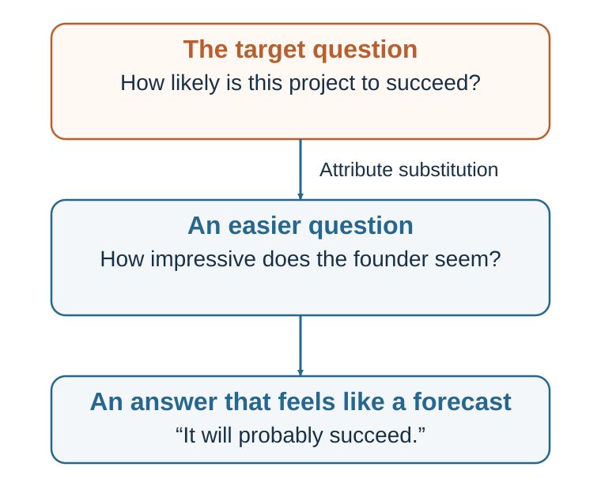

# Chapter 9. Heuristics: The Adaptive Toolbox

*Simple rules for a world that does not permit complete calculation*

<aside class="callout core-idea">
CORE IDEA

A heuristic is a simplifying process, not an error by definition. Its quality depends on whether the cue it uses matches the structure of the environment.
</aside>

## Learning goals

- Explain heuristics as a response to bounded rationality.
- Describe ecological rationality and satisficing.
- Explain recognition and fast-and-frugal rules.
- Identify when expert intuition has been trained by valid feedback.

The rational-choice benchmark in Chapter 2 assumes that decision-makers identify alternatives, form beliefs, clarify preferences, compare trade-offs, and choose the option that best satisfies their goals. That model is useful as a benchmark. But it is too slow and information-hungry for much of life.

A person choosing a sandwich does not calculate expected utility. A driver does not compute every possible path through traffic. A doctor in an emergency cannot compare every possible diagnosis in equal detail. A firefighter cannot stand inside a burning building and build a spreadsheet. A parent crossing a street with a child cannot wait for complete information.

Human beings are bounded. Time, attention, memory, information, and computational capacity are limited (Simon, 1955, 1956). Heuristics are one way the mind deals with these limits.

A heuristic simplifies. It may use one or a few cues rather than all available information. It may stop search early. It may rely on recognition, emotion, similarity, availability, or a single decisive reason. It may choose the first option that is good enough rather than searching for the best possible option. It may answer a related easier question when the harder question is too difficult.

This is not necessarily foolish. In many real environments, more information does not always improve judgment. Too much information can distract, delay, and create overfitting. Simple models and simple rules often perform surprisingly well, especially when environments are noisy and feedback is limited (Gigerenzer & Gaissmaier, 2011; Gigerenzer et al., 1999; Payne et al., 1993).

Consider emergency medicine. A doctor may use a fast triage rule that relies on a few critical cues rather than a full diagnostic model. In finance, simple diversification rules can sometimes protect ordinary investors better than elaborate but fragile forecasting. In hiring, structured criteria may outperform rich but unstructured impressions. In daily life, choosing a familiar route, buying a trusted product, or asking a knowledgeable friend may be efficient.

The mistake is to treat heuristics as the opposite of rationality. A better view is that heuristics are part of bounded rationality. They are ways of making decisions when full optimization is impossible or too costly.

Herbert Simon’s idea of satisficing is central here. Instead of searching endlessly for the best possible option, people often search until they find an option that is good enough (Simon, 1955, 1956). Satisficing can be highly rational when search is costly. If choosing a restaurant, it may be better to find a good enough place in ten minutes than the theoretically optimal place after three hours.

Gigerenzer and colleagues describe the mind as having an adaptive toolbox: a collection of heuristics suited to different environments (Gigerenzer et al., 1999; Gigerenzer & Selten, 2001). A hammer is useful for nails but poor for surgery. A heuristic is useful when it fits the structure of the problem but poor when applied in the wrong environment.

This is the idea of ecological rationality: a strategy is rational when it works well in the environment in which it is used (Gigerenzer & Gaissmaier, 2011). A simple rule can be better than a complex rule if the simple rule matches the environment and avoids noise.

This reframes the study of heuristics. The question is not: “Why are people irrational?” The better question is:

When does this shortcut fit the environment, and when does it fail?

A heuristic becomes dangerous when the cue it relies on is no longer valid, when the environment has changed, when someone manipulates the cue, or when the problem requires statistical reasoning that the shortcut does not provide.

For example, “familiar means safe” may work in a small community where familiarity comes from repeated reliable experience. It can mislead in digital media, where repeated exposure can be manufactured. “Confident means competent” may work in some physical or emergency contexts where confidence reflects practiced skill. It can mislead in interviews, sales, politics, and leadership, where confidence can be performed. “Popular means good” may work when popularity reflects genuine collective experience. It can mislead when popularity is driven by hype, bots, herd behavior, or advertising.

Heuristics are shortcuts. Whether they are wise depends on the road.

## Trigger features and cue-based judgment

<figure class="book-figure"><figcaption>Figure 9.1. A heuristic often answers an easier question than the one the decision actually requires.</figcaption></figure>

Animals use simple cues to guide behavior. A mother turkey responds strongly to the “cheep-cheep” sound of chicks. Ethologists have shown that animals often rely on trigger features—specific cues that activate adaptive behavior. Such cues usually work because they are reliable in the animal’s natural environment. But they can be exploited or misdirected when the cue is artificially produced (Cialdini, 2009; Tinbergen, 1951).

Heuristics are adaptive strategies for bounded agents; their quality depends on the fit between a rule and the environment in which it is used (Simon, 1955, 1956; Gigerenzer & Gaissmaier, 2011).

Humans also respond to trigger features. We see a white coat and infer medical authority. We see a high price and infer quality. We see many people choosing something and infer it is good. We hear a reason after a request and become more willing to comply. We see a smiling face and infer warmth. We see a familiar logo and infer reliability.

These cue-based judgments are efficient because attention is scarce. The mind cannot evaluate every object, person, message, and choice from first principles. It uses signals. Many signals are useful. A uniform may indicate role. A credential may indicate training. A crowd may indicate quality. A reason may indicate legitimacy. A familiar brand may indicate prior reliability.

But trigger features can be exploited. A salesperson can display authority cues without expertise. A website can show fake popularity. A product can use premium packaging to imply quality. A political message can use emotional imagery to bypass careful evaluation. A scam can use urgency and scarcity to shut down reflection.

This is why heuristics connect to later chapters on social influence, persuasion, and choice architecture. Influence often works by activating shortcuts that are usually useful. The problem is not that people use shortcuts. The problem is that modern environments can manufacture the cues that shortcuts rely on.

Kahneman and Frederick (2002) described many heuristics as cases of attribute substitution. When faced with a difficult question, the mind substitutes an easier one.

Difficult question: How likely is this start-up to succeed? Easier question: How impressive is the founder’s story?

Difficult question: How risky is this medical treatment compared with alternatives? Easier question: How frightening does the treatment sound?

Difficult question: How good will this candidate be in the role after one year? Easier question: How confident did the candidate seem in the interview?

Difficult question: How common is this event? Easier question: How easily can I remember examples?

The mind often answers the easier question and then experiences the answer as if it applied to the harder one. Attribute substitution is efficient because the easier question is available. It is dangerous because the substituted attribute may not be valid.

The purpose of decision science is not to eliminate substitution. That is impossible. The purpose is to recognize when the substitute question is good enough and when the original question deserves more careful treatment.

## Recognition and fast-and-frugal rules

Some heuristics use even less information. The recognition heuristic says that if one of two objects is recognized and the other is not, and recognition is correlated with the criterion, infer that the recognized object has the higher value on that criterion (Goldstein & Gigerenzer, 2002).

Suppose someone asks which city is larger: San Diego or San Antonio. A person who recognizes San Diego but not San Antonio may choose San Diego. If recognition is correlated with city size, the heuristic works. Partial ignorance can be useful. This is sometimes called a “less-is-more” effect: people with less knowledge may sometimes perform better than people with more knowledge if recognition points in the right direction and additional information adds noise.

Recognition can be useful in sports, geography, brands, politics, and consumer choice when recognition reflects genuine exposure, reputation, or quality. But it can mislead when recognition is created by advertising, scandal, repetition, or manipulation. A well-known product is not always better. A familiar candidate is not always more competent. A famous company is not always a good investment.

Fast-and-frugal heuristics use simple rules that search for limited information and stop quickly. One example is take-the-best: compare options on the most valid cue; if that cue discriminates, choose the better option; if not, move to the next cue (Gigerenzer & Goldstein, 1996). This kind of heuristic can perform well when cues differ in validity and information search is costly.

Another simple strategy is elimination by aspects, described by Tversky (1972). People choose an attribute, eliminate options that fail to meet a threshold, then move to another attribute. A student choosing apartments may first eliminate all options above a budget, then all options too far from campus, then all without natural light. This is not full utility maximization, but it is often practical.

Fast-and-frugal trees are simple classification tools that use a few yes/no questions. In some medical and organizational settings, such trees can be effective because they are transparent, quick, and robust (Gigerenzer & Gaissmaier, 2011; Martignon et al., 2008). A complex model may perform better in some circumstances, but simple decision trees can be easier to implement, audit, and teach.

This connects to research showing that simple models can sometimes rival or outperform expert judgment. Dawes (1979) argued for the “robust beauty” of improper linear models: even simple, imperfectly weighted models can outperform unaided clinical judgment because they apply criteria consistently. Meehl (1954) famously argued that statistical prediction often outperforms clinical judgment in many domains. The lesson is not that human judgment is useless. It is that simple rules can reduce inconsistency.

In organizational decision-making, simple heuristics can be valuable when they are explicit.

For example:

Never hire without a work sample. Never launch a major project without a premortem. If a meeting has no decision question, do not hold it. If a project’s downside threatens survival, stage it. If an investment cannot be explained simply, do not buy it. If a negotiation has only one issue, look for more issues.

These rules are not perfect. But they can protect against common failures.

The challenge is to choose heuristics deliberately rather than inherit them unconsciously. “Trust your gut,” “hire for culture fit,” “move fast,” “follow the leader,” “avoid conflict,” and “choose the cheapest option” are also heuristics. Some are useful; some are dangerous. A good organization examines its rules of thumb.

A useful question is:

What heuristic are we already using, and is it the right one for this environment?

## Expert intuition

Not all fast judgment is naive. Sometimes intuition reflects genuine expertise.

Gary Klein’s research on naturalistic decision-making examined how firefighters, military commanders, nurses, and other professionals make decisions in real-world environments involving time pressure, uncertainty, and high stakes. Klein (1998) proposed the recognition-primed decision model. Experts often do not compare many options. Instead, they recognize a situation as familiar, retrieve a plausible course of action, mentally simulate whether it will work, and act if it seems adequate.

This is a form of skilled heuristic judgment. A firefighter entering a burning building may sense that something is wrong because the fire is too quiet or the heat pattern does not fit expectations. A nurse may notice subtle signs that a patient is deteriorating. A chess master may see a strong move quickly. These judgments are fast, but they are not arbitrary. They are built from experience.

Kahneman and Klein (2009) examined when intuitive expertise should be trusted. They agreed on two conditions. First, the environment must be sufficiently regular to be predictable. Second, the decision-maker must have had enough opportunity to learn from clear, timely feedback.

Chess satisfies these conditions. So do many domains of skilled perception and action. But some environments do not. Long-term stock picking, geopolitical forecasting, hiring from unstructured interviews, and predicting the success of early-stage start-ups often provide noisy, delayed, ambiguous feedback. In such environments, confidence can grow without accuracy.

This distinction is crucial. Experience alone does not produce expertise. Repeated exposure to a noisy environment can produce confident illusions. A manager who has interviewed hundreds of candidates may feel expert, but if feedback is delayed, ambiguous, and never compared with rejected candidates, the learning environment is weak. An investor who succeeded in one market boom may interpret luck as skill. A political pundit may make confident forecasts without systematic feedback.

Expert intuition works when patterns are real and feedback trains recognition.

This suggests practical tests for trusting intuition:

Is the environment stable enough to learn? Have I seen many similar cases? Was feedback clear and timely? Have I tracked my predictions? Do experts in this domain agree more than chance? Could success be due to luck? Am I recognizing a pattern or merely feeling familiarity?

Fast judgment can be a gift when trained in the right environment. It can be a trap when confidence is mistaken for expertise.

## When a shortcut leaves its home environment

Heuristics misfire when the cue they rely on no longer predicts the outcome, when the environment changes, when feedback is poor, or when someone manipulates the cue.

Modern life creates many mismatches.

In small communities, reputation may be a reliable guide. In online environments, reputation signals can be manufactured. In ancestral environments, sweet and fatty foods were scarce and valuable. In modern food environments, they are abundant and engineered. In direct personal experience, repeated exposure may indicate familiarity and safety. In media environments, repeated exposure may indicate advertising budget or algorithmic amplification. In face-to-face groups, social proof may reflect genuine local knowledge. Online, social proof may reflect virality, bots, or herd behavior.

This does not mean humans have “bad brains.” It means brains built to act under uncertainty can be exploited by environments that control cues.

Heuristics also misfire with statistics. People are good at stories, examples, patterns, and intentions. They are less naturally good at base rates, conditional probabilities, regression to the mean, sample size, and random variation. Representativeness and availability can make a detailed story feel more likely than a general statistic. This is why probability judgment deserves its own chapter.

Heuristics misfire under strong motivation. If a conclusion supports our identity, our search and evaluation processes may become biased. If we want a project to succeed, availability supplies success stories. If we fear failure, availability supplies disasters. If a candidate resembles our prototype of excellence, representativeness supplies confidence. Heuristics do not operate in a neutral mind; they operate inside motives.

They also misfire when the cost of error is high. A shortcut that is acceptable for choosing lunch may be dangerous for choosing a medical treatment, hiring a leader, approving a merger, or designing public policy. The appropriate decision process depends on stakes, reversibility, uncertainty, and feedback.

A simple rule is:

Use heuristics when the decision is low-stakes, familiar, repeated, feedback-rich, and time-constrained. Slow down when the decision is high-stakes, novel, irreversible, statistical, emotionally charged, socially pressured, or vulnerable to manipulation.

This rule is itself a heuristic. But it is a useful one.

## Using heuristics wisely

The goal is not to eliminate heuristics. That would be impossible and undesirable. The goal is to use them wisely.

The first step is to name the shortcut. Am I using affect, availability, representativeness, recognition, social proof, authority, price, familiarity, or a single decisive criterion? Naming the heuristic creates distance.

The second step is to ask whether the cue is valid. Does confidence predict performance in this role? Does familiarity predict truth in this information environment? Does popularity predict quality in this market? Does similarity to past success predict future success here?

The third step is to check the base rate. Even when a story feels representative, ask what usually happens in similar cases. How often do start-ups succeed? How often do projects finish on time? How predictive are interviews? How common is the feared event? Base rates often correct availability and representativeness.

The fourth step is to improve the environment. If people rely on shortcuts, design better shortcuts. In hiring, require structured criteria and work samples. In medicine, use checklists for rare but serious conditions. In organizations, create decision rules that trigger premortems, outside views, or independent estimates. In personal life, use default rules: “Do not make major purchases after 10 p.m.” or “Wait twenty-four hours before replying to an angry email.”

The fifth step is to combine heuristics with reflection. A fast impression can be the beginning of judgment, not the end. Ask: “My intuition says yes. What is the strongest reason it might be wrong?” Or: “This feels risky. Is the risk actually likely, or just vivid?”

The sixth step is to track feedback. If you rely on intuition in a domain, keep score. Forecast outcomes, record confidence, and review accuracy. Without feedback, heuristics cannot improve.

The seventh step is to match effort to stakes. Not every decision deserves analysis. But important decisions deserve more than an unexamined shortcut. The skill is not being slow all the time. The skill is knowing when fast is enough.

A good decision-maker does not ask, “Should I use heuristics or rational analysis?” A good decision-maker asks:

Which shortcut is my mind using, and does this situation deserve a slower check?

Chapters 10–17 examine the shortcuts, statistical errors, and contextual mechanisms that can bend judgment. The distinction is important. Heuristics are processes. Biases are systematic errors that may result from those processes. Availability is a shortcut. Overestimating rare vivid events is a bias that can result from it. Representativeness is a shortcut. Ignoring base rates is a bias that can result from it. Affect is a shortcut. Treating dislike as evidence of danger is a bias that can result from it.

Heuristics make judgment possible. Biases show where judgment bends.

<aside class="callout evidence-and-boundary-conditions">
EVIDENCE AND BOUNDARY CONDITIONS

&quot;Less is more&quot; is not a license to ignore evidence. Simple rules can outperform complex models in noisy environments, but only when their stopping rule and cue structure fit the task.
</aside>

## Key ideas

- A heuristic is a simplifying process, not an error by definition. Its quality depends on whether the cue it uses matches the structure of the environment.
- Explain heuristics as a response to bounded rationality.
- Describe ecological rationality and satisficing.
- Explain recognition and fast-and-frugal rules.

## Study and practice

1. How would you explain heuristics as a response to bounded rationality?

2. What evidence and mechanism would you use to describe ecological rationality and satisficing?

3. How would you explain recognition and fast-and-frugal rules?

<aside class="callout activity">
ACTIVITY

Choose a recent judgment. Name the hard target question, the simpler question you actually answered, and the environmental condition that makes the shortcut valid or invalid. EXPERIENCE - EXPLAIN - APPLY (MAXIMUM 120 WORDS) Experience: describe one specific decision, interaction, or observation. Explain: use one or two concepts from this chapter accurately. Apply: state one improvement, implication, or testable prediction.
</aside>

## References cited in this chapter

Cialdini, R. B. (2009). Influence: Science and practice (5th ed.). Pearson.

Dawes, R. M. (1979). The robust beauty of improper linear models in decision making. American Psychologist, 34(7), 571–582.

Gigerenzer, G., &amp; Gaissmaier, W. (2011). Heuristic decision making. Annual Review of Psychology, 62, 451-482.

Gigerenzer, G., &amp; Goldstein, D. G. (1996). Reasoning the fast and frugal way: Models of bounded rationality. Psychological Review, 103(4), 650–669.

Gigerenzer, G., &amp; Selten, R. (Eds.). (2001). Bounded rationality: The adaptive toolbox. MIT Press.

Gigerenzer, G., Todd, P. M., &amp; the ABC Research Group. (1999). Simple heuristics that make us smart. Oxford University Press.

Goldstein, D. G., &amp; Gigerenzer, G. (2002). Models of ecological rationality: The recognition heuristic. Psychological Review, 109(1), 75–90.

Kahneman, D., &amp; Frederick, S. (2002). Representativeness revisited: Attribute substitution in intuitive judgment. In T. Gilovich, D. Griffin, &amp; D. Kahneman (Eds.), Heuristics and biases: The psychology of intuitive judgment (pp. 49–81). Cambridge University Press.

Kahneman, D., &amp; Klein, G. (2009). Conditions for intuitive expertise: A failure to disagree. American Psychologist, 64(6), 515-526.

Klein, G. (1998). Sources of power: How people make decisions. MIT Press.

Martignon, L., Katsikopoulos, K. V., &amp; Woike, J. K. (2008). Categorization with limited resources: A family of simple heuristics. Journal of Mathematical Psychology, 52(6), 352–361.

Meehl, P. E. (1954). Clinical versus statistical prediction: A theoretical analysis and a review of the evidence. University of Minnesota Press.

Payne, J. W., Bettman, J. R., &amp; Johnson, E. J. (1993). The adaptive decision maker. Cambridge University Press.

Simon, H. A. (1955). A behavioral model of rational choice. The Quarterly Journal of Economics, 69(1), 99-118.

Simon, H. A. (1956). Rational choice and the structure of the environment. Psychological Review, 63(2), 129-138.

Tinbergen, N. (1951). The study of instinct. Clarendon Press.

Tversky, A. (1972). Elimination by aspects: A theory of choice. Psychological Review, 79(4), 281–299.

