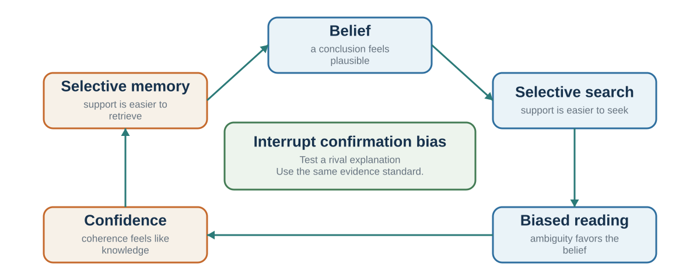

---
aliases:
  - 13-biases-that-protect-a-story.html
---

# Beliefs That Defend Themselves

*How search, interpretation, memory, and attribution protect an existing account*

::: {.chapter-epigraph}
> “The human understanding when it has once adopted an opinion … draws all things else to support and agree with it.”
>
> — Francis Bacon, [*Novum Organum*](https://constitution.org/2-Authors/bacon/nov_org.htm), 1620, Book I, Aphorism XLVI
:::

::: {.callout-note .core-idea icon=false}
## Core Idea

Evidence rarely enters an empty mind; existing beliefs guide search, interpretation, memory, and attribution. But the coherence produced by those same processes can be mistaken for independent confirmation, and calling someone biased supplies neither a rival explanation nor a diagnostic test. Therefore, this chapter traces how beliefs defend themselves and builds a disconfirmation protocol that turns disagreement into competing predictions answerable to evidence.
:::

## Learning goals

- Trace how an existing belief shapes search, interpretation, memory, and attribution.
- Distinguish confirmation, motivated reasoning, self-serving attribution, and correspondence bias.
- Build a structured disconfirmation protocol with a prediction recorded before discussion.

::: {.callout-note .loop-location icon=false}
## Where this chapter enters the loop

Belief protection bends **Interpret, Predict,** and **Learn**. A prior account selects its own evidence and then treats the resulting coherence as confirmation.
:::

The language of bias can easily become accusatory. We say, “You are biased,” and the conversation becomes defensive. But in decision science, bias should function more like diagnosis than accusation.

Imagine a doctor who says, “This looks like pneumonia.” The doctor is not insulting the patient. The label organizes evidence. It points toward causes, tests, risks, and treatments. Similarly, saying “this looks like confirmation bias” should mean: we may be searching for supporting evidence and neglecting disconfirming evidence. Saying “this looks like anchoring” should mean: the first number may be pulling later judgments. Saying “this looks like escalation of commitment” should mean: prior investment may be making it harder to stop.

The point is not to shame the decision-maker. The point is to improve the decision.

A bias label is useful only if it changes the process. Naming confirmation bias should lead to disconfirming tests. Naming overconfidence should lead to calibration, outside views, and uncertainty ranges. Naming anchoring should lead to independent estimates before discussion. Naming halo effects should lead to structured evaluation criteria. Naming sunk costs should lead to a fresh decision based on future costs and benefits.

Biases often arise from mechanisms that are useful in many contexts. Confirmation helps build coherent models. Confidence supports action. First impressions help rapid social judgment. Anchors provide starting points when uncertainty is high. Commitment supports persistence. These mechanisms are not inherently bad. They become biases when they are applied too strongly, too automatically, or in the wrong environment.

This is why a bias is not simply “bad thinking.” It is often good thinking used in the wrong place.

Biases also persist because they are supported by stories. A person does not usually experience themselves as confirming, anchoring, or rationalizing. They experience themselves as being realistic, fair, decisive, loyal, prudent, strategic, or experienced. The mind supplies a story that makes the judgment feel reasonable.

“I am not ignoring evidence; I am focusing on what matters.” “I am not overconfident; I have experience.” “I am not anchored; that number was a useful starting point.” “I am not favoring my team; I know their true quality.” “I am not escalating commitment; I am showing perseverance.” “I am not biased; I am more objective than most people.”

These stories matter because they protect the bias from correction. *The Narrator After Choice* examines rationalization once an outcome is known. Here the same logic begins earlier: the preferred story can accompany judgment while it is still being formed.

The practical goal of this chapter is not to memorize a list of biases. It is to develop diagnostic habits. When a judgment feels obvious, ask what might be bending it.

## Confirmation and myside bias

{#fig-belief-protection-loop fig-alt="An author's synthesis arranges selective search, interpretation, memory, and confidence in a possible reinforcing loop, with disconfirming tests and independent standards as interventions. The stages need not occur in this order."}

Confirmation bias is the tendency to seek, interpret, and remember information in ways that support existing beliefs or hypotheses (Nickerson, 1998). It is one of the most important biases because it affects nearly every domain of judgment.

People prefer coherence. Once a belief begins to form, the mind naturally looks for information that fits. Evidence that supports the belief feels relevant. Evidence that challenges it feels flawed, exceptional, or less important. The result is not always conscious distortion. Often it is selective attention, selective search, selective interpretation, and selective memory.

A classic demonstration comes from Wason’s rule-discovery task. Participants saw a sequence such as 2-4-6 and were asked to discover the rule by proposing other sequences. Many people tested sequences that confirmed their initial hypothesis, such as “increasing by two,” rather than trying sequences that might falsify it (Wason, 1960). The actual rule was broader. The task illustrates a general habit: people often test whether they are right rather than whether they might be wrong.

In another classic line of work, Lord, Ross, and Lepper (1979) gave people who supported or opposed capital punishment mixed evidence about whether the death penalty deters crime. Rather than moving toward each other, participants interpreted the evidence in ways that strengthened their original positions. Supporters saw the pro-deterrence study as stronger; opponents saw the anti-deterrence study as stronger. The same evidence increased polarization.

This pattern is sometimes called biased assimilation: people assimilate evidence into their prior beliefs. It is also related to myside bias, the tendency to evaluate evidence and arguments in ways that favor one’s own position (Stanovich et al., 2013). Myside bias can appear even among intelligent and educated people because intelligence can help people generate better arguments for what they already believe.

Confirmation bias begins early in the decision loop. It shapes what information is selected, how it is interpreted, and what feedback is remembered. A manager who believes an employee lacks initiative notices missed opportunities but overlooks quiet contributions. A doctor who has a favored diagnosis attends to confirming symptoms. A negotiator who believes the other side is hostile interprets ambiguity as bad faith. An investor who believes in a company searches for good news and dismisses warnings.

Confirmation bias is especially strong when beliefs are tied to identity, status, morality, or prior commitment. Kunda (1990) described motivated reasoning as reasoning directed toward preferred conclusions. Kahan (2013) showed that people’s reasoning about evidence can become entangled with ideology and identity. When accepting evidence would threaten group belonging or self-image, people may become more—not less—skilled at defending their prior view.

Confirmation bias also explains why vague personality descriptions can feel accurate. The Barnum effect or Forer effect occurs when people accept general descriptions as uniquely true of themselves. Forer (1949) gave students a personality description supposedly based on a test, but actually composed of vague statements that could apply to many people. Students rated the description as highly accurate. People search their memories for confirming examples and ignore mismatches. A horoscope, personality reading, or vague leadership profile can feel personal because the mind supplies the evidence.

This does not mean all belief persistence is irrational. Some beliefs are worth preserving because they are supported by strong evidence. A scientist should not abandon a theory after one weak anomaly. A doctor should not discard a likely diagnosis because of one ambiguous symptom. The problem is not maintaining beliefs. The problem is protecting them from fair tests.

Good decision-making requires active disconfirmation. Ask:

What evidence would prove me wrong? Have I searched for that evidence? What would someone who disagrees notice? Am I interpreting weak evidence as strong because I like the conclusion? Am I demanding more proof from opposing evidence than from supporting evidence? What belief would I hold if I did not care which answer was true?

Confirmation bias is hard to see because coherence feels like truth. But a story that fits together is not necessarily a story that fits reality.

::: {.callout-note .watch-and-test icon=false}
## Watch and test: are you testing the rule—or collecting agreement?

Before opening the [short “kiss test” demonstration](https://youtu.be/Q3kfJu4y0M0), write one observation that would support your preferred rule and one that would falsify it. After watching, classify each question asked as confirmatory or diagnostic. The debrief is the transferable tool: a good test separates competing explanations; it does not merely produce another “yes.”
:::

## Self-serving explanations

Self-serving bias is the tendency to interpret events in ways that protect or enhance the self. People often attribute success to their own ability, effort, or character, while attributing failure to bad luck, unfair conditions, other people, or external constraints (Miller & Ross, 1975; Mezulis et al., 2004). This is the pre-emptive partner of the narrator discussed earlier: one process protects the belief during judgment, while the other can reconstruct the cause after choice. The same safeguard serves both—record the forecast, mechanism, and revision condition before the outcome is known.

After a team wins, fans may say, “We were better.” After the team loses, they may blame the referee, weather, injuries, or luck. A manager whose project succeeds may credit vision and leadership. If the project fails, the manager may emphasize market conditions, poor execution by others, or unexpected constraints. A student who does well on an exam may credit intelligence and preparation. If they do poorly, they may blame the exam, instructor, room, or timing.

Self-serving bias is not always entirely false. External factors do matter. Referees make mistakes. Markets shift. Exams vary in fairness. But the asymmetry is the issue. People often explain good and bad outcomes differently depending on whether the outcome protects self-image.

The bias is partly motivational. People want to see themselves as competent, moral, and in control. It is also informational. People have more access to their own intentions and constraints than to others’. When we fail, we know the obstacles we faced. When others fail, we see mainly the behavior.

## Attribution: behavior is visible, situations are not

Attribution is the causal explanation attached to an action. A colleague misses a deadline. Was the cause carelessness, an impossible workload, ambiguous instructions, a dependency that failed, or a reasonable choice to protect a more important task? The observed behavior is the same. The implied remedy is not.

The **fundamental attribution error**, also called the **correspondence tendency**, is the tendency to infer a stable personal disposition from another person’s behavior while giving too little weight to situational constraints (Ross, 1977). The name can mislead if it is treated as a claim that character never matters. Dispositions sometimes predict behavior. The error is concluding too quickly that behavior corresponds to character when the situation could have produced the same action.

One reason is an actor-information asymmetry. Actors can usually retrieve their intentions, pressures, instructions, incentives, and blocked options. Observers see the action more directly than the conditions that shaped it. This asymmetry does not force one universal actor–observer pattern: people can blame themselves, excuse others, or reverse the usual tendency when motives and identities change. It does explain why a character story can feel complete before the situational evidence has been collected.

Self-serving attribution adds a directional motive to that informational problem. We may treat our own success as evidence of ability and our own failure as evidence of circumstance, then use the opposite weighting for someone else. Across studies, that self-protective tendency is common but varies across people, outcomes, development, and cultures (Miller & Ross, 1975; Mezulis et al., 2004). It should therefore be tested in the case at hand, not presumed from the label.

Use an **attribution audit** before converting an action into a judgment of character:

1. Describe the behavior without a trait word: “The report arrived two days late,” not “She is unreliable.”
2. List at least two situational explanations and one dispositional explanation that could produce it.
3. Apply the same evidentiary standard to yourself, the other person, and your preferred group.
4. Identify the observation that would distinguish among those explanations—for example, performance across different workloads or instructions.
5. Match the intervention to the supported cause: clarify the task, change the constraint, build a safeguard, or address a repeated behavioral pattern.

The audit does not excuse harmful behavior. It prevents a premature character verdict from hiding a repairable system or a testable alternative explanation.

Self-serving bias makes learning difficult. If failure is always caused by external factors, the decision-maker has little reason to change. If success is always caused by personal brilliance, the decision-maker becomes overconfident. Teams and organizations can become trapped in flattering explanations.

Negotiation provides a powerful example. Babcock and Loewenstein (1997) reviewed research showing that disputants often interpret fairness in self-serving ways. When people know which side they represent, they tend to view fair settlements as more favorable to their own side. This can make bargaining harder, because each side sincerely believes its position is fair. In one study of settlement negotiations, participants who learned their role before reviewing case materials developed more self-serving assessments and settled less often than those who evaluated the case before knowing their role (Babcock et al., 1995).

The danger is that self-serving judgments feel like fairness. Each side says, “We are being reasonable.” The conflict persists because “reasonable” has been filtered through self-interest.

A related bias is the bias blind spot: people tend to see biases more readily in others than in themselves (Pronin et al., 2002). We judge our own objectivity by introspection: “I do not feel biased.” We judge others by their behavior: “Their conclusion serves their interest.” Because biases often operate outside awareness, introspection is a poor detector. Scopelliti and colleagues (2015) found that people who were more prone to bias blind spot were not necessarily better at avoiding other biases; believing oneself objective can reduce correction.

Self-serving bias is not always harmful. Some positive illusions may support motivation and resilience (Taylor & Brown, 1988). People who maintain hope after setbacks may persist. But self-protection becomes costly when it blocks accurate feedback.

A useful corrective is to ask:

If someone else made this decision and got this outcome, how would I explain it? What did I contribute to this failure? What did luck contribute to this success? What would the other side say is fair? Am I using different standards for myself and others? What feedback am I avoiding because it threatens self-image?

Self-serving bias protects identity. Good judgment requires protecting learning too.

## Protect the test, not the belief

Confirmation, motivated reasoning, and self-serving attribution differ in what they protect, but they share a process risk: search, interpretation, and explanation become easier in the direction of a preferred conclusion. The correction is not a generic instruction to “be objective.” It is to design a test that the favored account can fail.

| Process risk | Story from the inside | Process correction |
| --- | --- | --- |
| Confirmation / myside search | “The evidence keeps supporting us.” | Specify disconfirming evidence and assign the rival test to someone with permission to challenge. |
| Motivated interpretation | “This evidence is weak; that evidence is decisive.” | Apply the same relevance and quality threshold to congenial and uncongenial evidence. |
| Self-serving attribution | “Our success was skill; failure was circumstance.” | Apply the same causal standard to self, others, and rival groups. |
| Correspondence error | “The action reveals the person.” | Compare dispositional and situational accounts using behavior across constraints. |
: Belief protection requires a test that can fail {#tbl-13-1}

Confidence is a related but distinct forecasting problem. Chapter 15 separates overestimation, overplacement, and overprecision, examines why the familiar Dunning–Kruger plot does not identify one simple metacognitive deficit, and turns confidence into a scored record. Keeping that material with calibration prevents “confidence” from becoming another motive inferred from a protected belief.

## Practice Lab

Choose one consequential belief held by you or a team. Produce a **disconfirmation protocol** with five entries: the current claim and confidence; the observation that would materially reduce confidence; the strongest competing account; a person assigned to develop that account without reputational penalty; and a dated prediction recorded before group discussion. Specify how each possible result changes action rather than merely the story.

## Take it forward

- **Use this when:** supporting evidence accumulates easily while the belief becomes harder to test.
- **Do not infer:** that persistence proves bias, that confidence measures competence, or that naming a bias corrects it.
- **Try this next:** state what would change your mind, give the rival account an owner, and record the prediction before the outcome can be explained away.

## References cited in this chapter

::: {.reference}
Babcock, L., & Loewenstein, G. (1997). Explaining bargaining impasse: The role of self-serving biases. Journal of Economic Perspectives, 11(1), 109–126.
:::

::: {.reference}
Babcock, L., Loewenstein, G., Issacharoff, S., & Camerer, C. (1995). Biased judgments of fairness in bargaining. American Economic Review, 85(5), 1337–1343.
:::

::: {.reference}
Bacon, F. (1620). *Novum organum*. https://constitution.org/2-Authors/bacon/nov_org.htm
:::

::: {.reference}
Forer, B. R. (1949). The fallacy of personal validation: A classroom demonstration of gullibility. Journal of Abnormal and Social Psychology, 44(1), 118–123.
:::

::: {.reference}
Kahan, D. M. (2013). Ideology, motivated reasoning, and cognitive reflection. Judgment and Decision Making, 8(4), 407-424.
:::

::: {.reference}
Kunda, Z. (1990). The case for motivated reasoning. Psychological Bulletin, 108(3), 480-498.
:::

::: {.reference}
Lord, C. G., Ross, L., & Lepper, M. R. (1979). Biased assimilation and attitude polarization. Journal of Personality and Social Psychology, 37(11), 2098–2109.
:::

::: {.reference}
Mezulis, A. H., Abramson, L. Y., Hyde, J. S., & Hankin, B. L. (2004). Is there a universal positivity bias in attributions? A meta-analytic review of individual, developmental, and cultural differences in the self-serving attributional bias. Psychological Bulletin, 130(5), 711–747.
:::

::: {.reference}
Miller, D. T., & Ross, M. (1975). Self-serving biases in attribution of causality: Fact or fiction? Psychological Bulletin, 82(2), 213–225.
:::

::: {.reference}
Nickerson, R. S. (1998). Confirmation bias: A ubiquitous phenomenon in many guises. Review of General Psychology, 2(2), 175–220.
:::

::: {.reference}
Pronin, E., Lin, D. Y., & Ross, L. (2002). The bias blind spot: Perceptions of bias in self versus others. Personality and Social Psychology Bulletin, 28(3), 369–381.
:::

::: {.reference}
Ross, L. (1977). The intuitive psychologist and his shortcomings: Distortions in the attribution process. In L. Berkowitz (Ed.), Advances in experimental social psychology (Vol. 10, pp. 173–220). Academic Press.
:::

::: {.reference}
Scopelliti, I., Morewedge, C. K., McCormick, E., Min, H. L., Lebrecht, S., & Kassam, K. S. (2015). Bias blind spot: Structure, measurement, and consequences. *Management Science, 61*(10), 2468–2486.
:::

::: {.reference}
Stanovich, K. E., West, R. F., & Toplak, M. E. (2013). Myside bias, rational thinking, and intelligence. Current Directions in Psychological Science, 22(4), 259–264.
:::

::: {.reference}
Taylor, S. E., & Brown, J. D. (1988). Illusion and well-being: A social psychological perspective on mental health. Psychological Bulletin, 103(2), 193-210.
:::

::: {.reference}
Wason, P. C. (1960). On the failure to eliminate hypotheses in a conceptual task. Quarterly Journal of Experimental Psychology, 12(3), 129–140.
:::
