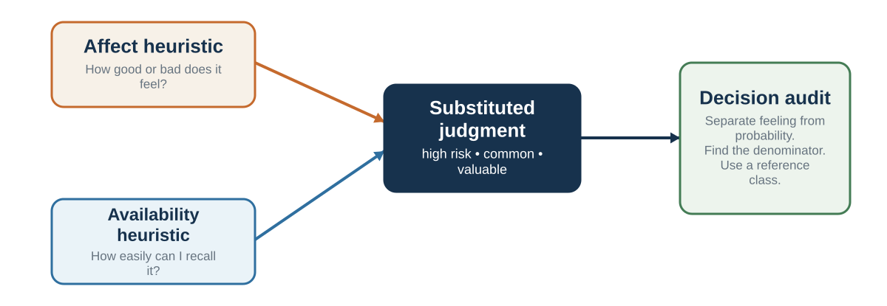

# Feeling and Availability as Shortcuts

*When emotion and memory answer questions about risk, value, and frequency*

::: {.callout-note .core-idea icon=false}
## Core Idea

Feelings and ease of recall often summarize useful experience, but they can become misleading when incidental emotion or vivid memory substitutes for evidence.
:::

## Learning goals

- Explain the affect heuristic.
- Explain availability and retrieval fluency.
- Distinguish integral from incidental emotion.
- Use base rates to check vivid judgments.

The affect heuristic occurs when people use feelings of goodness or badness as a guide to judgment. If something feels good, people tend to judge its benefits as high and its risks as low. If something feels bad, they tend to judge its risks as high and its benefits as low (Slovic et al., 2002).

This shortcut is deeply natural. Emotion summarizes past experience, bodily response, social meaning, and immediate value. A bad feeling can signal danger. A good feeling can signal opportunity, trust, or familiarity. It would be impossible to make every decision without affect.

The affect heuristic becomes visible when feelings substitute for analysis. Suppose people are asked about a technology. If they feel positively toward it, they may judge it as highly beneficial and relatively safe. If they feel negatively toward it, they may judge it as risky and less beneficial. Alhakami and Slovic (1994) found that perceived risks and perceived benefits of activities were often negatively related in people’s judgments, even though in the world risks and benefits can both be high. Finucane and colleagues (2000) showed that manipulating affective information could change perceived risks and benefits.

The affect heuristic can be useful. If you feel uneasy walking down a dark street, that feeling may summarize subtle cues: isolation, lighting, past experience, body posture of others, and uncertainty. If you feel trust toward a colleague, that may reflect repeated reliable interaction. If you feel disgust toward spoiled food, the feeling protects you.

But affect can also mislead. A risk may feel low because it is familiar, voluntary, or socially accepted. Driving may feel safer than flying because it is familiar and controlled, even when statistical risk comparisons may differ. A financial investment may feel good because others are excited. A candidate may feel right because they are similar to the interviewer. A policy may feel wrong because it is associated with a disliked group. A brand may feel trustworthy because of repetition, not evidence.

The affect heuristic also helps explain why debates can become polarized. People do not evaluate facts in emotional neutrality. Once an issue becomes affectively charged, new information is filtered through liking, disliking, fear, anger, pride, or identity. A person who likes a technology sees benefits; a person who dislikes it sees risks. A person who likes a leader sees strength; a person who dislikes the leader sees arrogance.

Earlier, emotion was described as a value signal. The affect heuristic is what happens when that value signal becomes a broad shortcut for judgment. The problem is not feeling. The problem is using feeling to answer the wrong question.

A useful corrective is to separate affect from prediction:

What do I feel about this option? What does that feeling tell me about my values? What evidence do I have about likely outcomes? Would my probability judgment change if I felt differently? What would someone who does not share my emotional reaction notice?

The affect heuristic is often the first draft of valuation. It should not always be the final draft of belief.

## Availability: what comes to mind feels common

{#fig-affect-availability fig-alt="Affect and available examples converge on a substituted judgment, followed by a denominator and reference-class audit."}

The availability heuristic occurs when people judge frequency, probability, or importance by how easily examples come to mind (Tversky & Kahneman, 1973). If examples are easy to recall or imagine, the event feels common or likely. If examples are hard to recall, the event feels rare or unlikely.

Availability and affect can be sensible cues, but vividness, recency, and incidental emotion can make them diverge from frequency and diagnostic evidence (Tversky & Kahneman, 1973; Slovic et al., 2002; Lerner et al., 2015).

Availability is often sensible. Common events are often easier to remember than rare events. Personal experience can be useful evidence. If you have repeatedly seen a supplier miss deadlines, it is reasonable to judge the supplier as unreliable. If a road is often congested when you use it, your memory is relevant.

But availability is influenced by more than frequency. It is affected by vividness, recency, emotional intensity, media coverage, personal experience, social discussion, and ease of imagination.

A plane crash receives dramatic news coverage. The images are vivid. The event becomes available. Flying may then feel more dangerous than before, even if the statistical risk remains very low. A friend’s bad medical experience may loom larger than base-rate data. A recent failure may dominate a performance review. A memorable start-up success may make entrepreneurship seem easier than it is. A single vivid crime may shift public perception more than broader crime trends.

Lichtenstein and colleagues (1978) found that people’s estimates of causes of death were related to availability and media coverage. Dramatic causes were often overestimated, while less dramatic but more common causes were underestimated. Combs and Slovic (1979) similarly showed that newspaper coverage was related to distorted frequency judgments. Events that receive more attention become mentally available.

Availability also works through retrieval fluency. Schwarz and colleagues (1991) asked participants to recall either six or twelve examples of assertive behavior. People who had to recall twelve examples often rated themselves as less assertive than those who recalled six, because retrieving twelve examples was difficult. The experience of difficulty became information. People did not simply count examples; they used ease of retrieval as a cue.

This has wide application.

A manager evaluating an employee may overweight the most recent incident because it is available. This is the recency effect in performance evaluation. A doctor may overdiagnose a condition recently encountered. A student may overestimate the difficulty of an exam after hearing one horror story. A parent may overestimate rare dangers that are vivid and underestimate common dangers that are mundane. A voter may judge national conditions based on a few memorable stories.

Availability affects organizations as well. After a crisis, leaders may overcorrect toward the last failure. If a cybersecurity breach occurred, cybersecurity may dominate attention. If a public relations scandal occurred, reputation may dominate. These concerns may be legitimate, but availability can crowd out other risks.

Availability can also be deliberately manipulated. News, advertising, political campaigns, social media, and organizational storytelling all influence what comes easily to mind. If a company repeatedly celebrates customer success stories but hides failure data, employees may overestimate customer satisfaction. If a political campaign repeatedly highlights a vivid threat, voters may overestimate its frequency. If social media repeatedly shows extreme lifestyles, users may misjudge what is normal.

The corrective is not to ignore memory. The corrective is to ask whether memory is representative.

How many examples come to mind? Why do these examples come to mind? Are they recent, vivid, emotional, or repeated? What is the base rate? What would a broader sample show? What cases are missing because they are quiet, ordinary, or invisible?

Availability is useful when memory samples the environment fairly. It misleads when memory is biased by salience.

## Feeling as evidence

The affect heuristic uses positive or negative feeling as a rapid guide to judgment. Options that feel good tend to be judged as more beneficial and less risky; disliked options can appear less beneficial and more dangerous. Affect compresses a large amount of experience into a simple approach-avoid signal (Slovic et al., 2002).

This can be adaptive. A sense of unease may reflect subtle cues learned through experience before the person can articulate them. It becomes problematic when the feeling is incidental, misattributed, or socially manufactured.

Schwarz and Clore (1983) found that mood influenced reported life satisfaction, and that directing attention to the weather could reduce the effect by making the source of mood salient. The mind asks, in effect, "How do I feel about my life?" and uses current feeling unless given a reason to attribute it elsewhere.

Different emotions also carry different appraisals. Anger is associated with certainty and individual control, while fear is associated with uncertainty and situational control. Experiments have found that anger can increase optimistic risk judgments and risk taking relative to fear, even when both emotions are negative (Lerner & Keltner, 2001). The category "negative emotion" is therefore too crude.

Incidental emotion matters in markets and organizations, but claims require caution. Correlations between sunshine, sporting outcomes, and financial returns are intriguing and can reflect mood, attention, or other mechanisms; they do not imply that every sunny day causes irrational buying. Laboratory and field effects vary with context and specification (Edmans et al., 2007; Hirshleifer & Shumway, 2003).

A useful question is:

Is this feeling information about the option, or information carried into the option?

## Vivid memory and hidden denominators

The availability heuristic estimates frequency or probability from the ease with which examples come to mind. Vivid, recent, emotional, and heavily reported events are easier to retrieve and therefore feel more common (Tversky & Kahneman, 1973).

Air crashes receive concentrated coverage and remain imaginable; the risks of ordinary driving are distributed across countless unremarkable trips. A founder's dramatic success story is easier to recall than the invisible population of failed ventures. A manager remembers the employee's recent error and treats it as representative of the year.

Retrieval structure itself creates bias. People find it easier to generate words beginning with a letter than words containing the same letter in a less searchable position, and they can confuse that ease with the number of words in each category. The judgment is about the architecture of memory, not only the world.

Availability is also socially engineered. News selection, platform algorithms, and repeated messaging determine which examples are retrievable. When one rare event is shown repeatedly, mental availability is no longer an innocent mirror of prevalence.

The countermeasure is not to distrust memory. It is to supplement it with denominators, time windows, and reference classes:

Out of how many cases?

Compared with what base rate?

Over which period?

Which unreported cases are missing?

::: {.callout-caution .evidence-and-boundary-conditions icon=false}
## Evidence And Boundary Conditions

Weather, sports results, and market outcomes can correlate in historical datasets, but such findings are vulnerable to specification choices and multiple testing. Treat them as prompts for mechanism and replication, not ready-made forecasting rules.
:::

| Shortcut | Useful when | Misleads when | Corrective |
| --- | --- | --- | --- |
| Affect | Feeling summarizes relevant, repeated experience. | Mood or identity spills into an unrelated forecast. | Name the feeling, then estimate probability separately. |
| Availability | Memory samples the environment fairly. | News, vividness, recency, or repetition distort retrieval. | Find the denominator and a representative reference class. |
| Personal example | The case is diagnostically similar. | One case substitutes for a distribution. | Ask how often the pattern occurs across comparable cases. |
: When affect and availability help or mislead {#tbl-10-1}

## Key ideas

- Feelings and ease of recall often summarize useful experience, but they can become misleading when incidental emotion or vivid memory substitutes for evidence.
- Explain the affect heuristic.
- Explain availability and retrieval fluency.
- Distinguish integral from incidental emotion.

## Study and practice

1. How would you explain the affect heuristic?

2. How would you explain availability and retrieval fluency?

3. How would you distinguish integral from incidental emotion?

::: {.callout-tip .activity icon=false}
## Activity

Take a risk that feels large or small. Record the examples that come to mind, why they are memorable, and the relevant denominator or base rate. Then reassess the judgment.  
EXPERIENCE - EXPLAIN - APPLY (MAXIMUM 120 WORDS)  
Experience: describe one specific decision, interaction, or observation. Explain: use one or two concepts from this chapter accurately. Apply: state one improvement, implication, or testable prediction.
:::

## References cited in this chapter

::: {.reference}
Alhakami, A. S., & Slovic, P. (1994). A psychological study of the inverse relationship between perceived risk and perceived benefit. Risk Analysis, 14(6), 1085–1096.
:::

::: {.reference}
Combs, B., & Slovic, P. (1979). Newspaper coverage of causes of death. Journalism Quarterly, 56(4), 837–849.
:::

::: {.reference}
Edmans, A., García, D., & Norli, Ø. (2007). Sports sentiment and stock returns. Journal of Finance, 62(4), 1967-1998.
:::

::: {.reference}
Hirshleifer, D., & Shumway, T. (2003). Good day sunshine: Stock returns and the weather. Journal of Finance, 58(3), 1009-1032.
:::

::: {.reference}
Kahneman, D. (1973). Attention and effort. Prentice-Hall.
:::

::: {.reference}
Lerner, J. S., & Keltner, D. (2001). Fear, anger, and risk. Journal of Personality and Social Psychology, 81(1), 146–159.
:::

::: {.reference}
Lerner, J. S., Li, Y., Valdesolo, P., & Kassam, K. (2015). Emotion and decision making. Annual Review of Psychology, 66, 799–823.
:::

::: {.reference}
Lerner, J. S., Li, Y., Valdesolo, P., & Kassam, K. S. (2015). Emotion and decision making. Annual Review of Psychology, 66, 799–823.
:::

::: {.reference}
Schwarz, N., & Clore, G. L. (1983). Mood, misattribution, and judgments of well-being: Informative and directive functions of affective states. Journal of Personality and Social Psychology, 45(3), 513-523.
:::

::: {.reference}
Slovic, P., Finucane, M. L., Peters, E., & MacGregor, D. G. (2002). The affect heuristic. In T. Gilovich, D. Griffin, & D. Kahneman (Eds.), Heuristics and biases: The psychology of intuitive judgment (pp. 397-420). Cambridge University Press.
:::

::: {.reference}
Tversky, A., & Kahneman, D. (1973). Availability: A heuristic for judging frequency and probability. Cognitive Psychology, 5(2), 207–232.
:::
