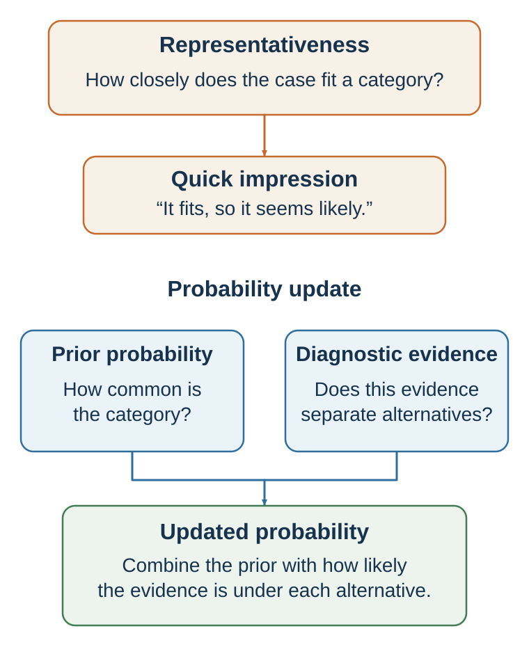

# Chapter 11. Resemblance Is Not Probability

*Prototypes, stereotypes, conjunctions, and the seduction of a good story*

<aside class="callout core-idea">
CORE IDEA

Representativeness asks whether a case resembles a category; probability asks how often the category occurs and how diagnostic the resemblance actually is.
</aside>

## Learning goals

- Explain representativeness and base-rate neglect.
- Recognize conjunction and disjunction errors.
- Explain the law of small numbers.
- Separate predictive features from culturally familiar prototypes.

The representativeness heuristic occurs when people judge probability by similarity to a prototype or stereotype (Kahneman & Tversky, 1972; Tversky & Kahneman, 1974). An option, person, event, or story feels likely when it resembles the category people have in mind.

A person who is tall and athletic seems likely to be a basketball player. A quiet person who enjoys books seems likely to be a librarian. A confident speaker seems likely to be a leader. A young founder in a hoodie with a bold vision seems likely to be the next technology success. A company with a sleek product and enthusiastic users seems likely to become a unicorn. A candidate with an elite degree seems likely to be competent.

Representativeness is useful because similarity often contains information. If someone has medical symptoms that closely match flu, flu is a plausible diagnosis. If a person has the skills and experience typical of successful engineers, they may be more likely to perform well as an engineer. If a business model resembles many failed businesses, caution is reasonable.

But representativeness can mislead when similarity overrides base rates, sample size, chance, or causal evidence.

A classic example is the “Linda problem.” Participants read a description of Linda as single, outspoken, bright, and concerned with social justice. Many judged it more likely that Linda was a bank teller and active in the feminist movement than that Linda was a bank teller, even though the conjunction of two events cannot be more probable than one event alone (Tversky & Kahneman, 1983). The more detailed description felt more representative, but it was less probable.

Chapter 12 develops the statistical correction in detail. Here the key point is that representativeness answers the question, “How much does this resemble my mental model?” rather than “How probable is this event?”

Representativeness can distort hiring. Interviewers may look for someone who resembles their prototype of a leader: confident, articulate, energetic, polished, extroverted. That prototype may be partly valid in some roles, but it may also exclude quiet competence, integrity, persistence, judgment, and teamwork. A candidate may look like success without being likely to produce it.

Representativeness can distort entrepreneurship. Investors may look for founders who resemble famous past founders. But if they rely on surface features, they may miss less glamorous but stronger businesses. A start-up that resembles a famous success may still fail because base rates, timing, execution, competition, and market structure differ.

Representativeness can distort social judgment. People may infer personality, ability, or trustworthiness from appearance, accent, dress, age, gender, ethnicity, or group membership. Stereotypes are representativeness shortcuts applied to people. They may feel informative because they reduce complexity, but they can produce unfair and inaccurate judgments.

Representativeness also affects randomness. People often expect random sequences to “look random,” meaning mixed and patternless. A sequence like H-T-H-T-T-H may feel more random than H-H-H-H-H-H, even though both are possible outcomes of fair coin flips. This contributes to the gambler’s fallacy and misperception of streaks, topics developed later.

A useful corrective is to ask:

What category am I comparing this to? Is the resemblance superficial or causally meaningful? What is the base rate? How large is the sample? What evidence predicts the outcome besides similarity? Would I make the same judgment if the person or case did not fit the prototype?

Representativeness is a powerful categorization tool. It becomes dangerous when resemblance is treated as probability.

## The representative story

<figure class="book-figure"><figcaption>Figure 11.1. Probability requires base rates and diagnostic evidence in addition to resemblance.</figcaption></figure>

The representativeness heuristic, introduced in Chapter 9, becomes especially important in probability judgment. People often judge likelihood by how much something resembles a prototype, pattern, or story (Kahneman & Tversky, 1972; Tversky & Kahneman, 1974).

Representativeness substitutes resemblance for probability, which helps explain base-rate neglect and conjunction errors (Kahneman & Tversky, 1972; Tversky & Kahneman, 1983).

The classic Linda problem makes the issue vivid. Participants read a description of Linda as 31 years old, single, outspoken, bright, and concerned with discrimination and social justice. They are then asked which is more probable:

Linda is a bank teller. Linda is a bank teller and active in the feminist movement.

Many people choose the second option. It feels like a better match. But it cannot be more probable. The probability of A and B together cannot exceed the probability of A alone. Adding detail can make a story feel more representative while making it statistically less likely (Tversky & Kahneman, 1983).

This is the conjunction fallacy.

The error is not simply mathematical ignorance. It reflects a conflict between narrative fit and probability logic. “Bank teller and feminist” sounds like Linda. “Bank teller” sounds less like Linda. The mind answers, “Which description fits?” instead of “Which event is more probable?”

A related issue is disjunction neglect. People may underweight the probability of “A or B” because no single component feels strongly representative. Yet disjunctions often have higher probability than individual events. For example, “The project will be delayed because of supplier problems, staff turnover, legal review, technical defects, or client revisions” may be more likely than any one specific delay cause. But because no single cause dominates imagination, the total risk may be underestimated.

This matters in planning. A team may say, “Supplier failure is unlikely,” “Staff turnover is unlikely,” “Legal issues are unlikely,” and “Technical problems are unlikely.” Each statement may be true individually. But the probability that at least one thing goes wrong can be high. Plans fail not only because one disaster is likely, but because many small disruptions are possible.

Representativeness also causes base-rate neglect. Suppose you meet someone who is quiet, precise, introverted, and loves books. Is this person more likely to be a librarian or a salesperson? Many people say librarian because the description fits the librarian stereotype. But if salespeople vastly outnumber librarians, the base rate may dominate. Similarity is not enough.

In hiring, representativeness can cause decision-makers to look for people who resemble their prototype of success. A leader “looks like” a leader. A founder “sounds like” a founder. A consultant “seems like” a consultant. This may include valid cues, but it may also include stereotypes. The question should be: which features actually predict performance?

Representativeness also shapes judgments of randomness. People expect random sequences to look random. A sequence like H-T-H-T-T-H may feel more random than H-H-H-H-H-H, although both are possible sequences of six coin flips. People underestimate how often streaks and clusters occur by chance.

Tversky and Kahneman (1971) described belief in the law of small numbers: people expect small samples to resemble the population more closely than they do. If a basketball player makes several shots, people may infer a hot hand. If a fund manager outperforms for two years, investors infer skill. If a new employee makes two mistakes, a manager infers low competence. Small samples are noisy, but the mind wants them to be meaningful.

The corrective is to ask:

Am I judging probability by resemblance? What is the base rate? How large is the sample? How much noise should I expect? Am I adding detail that makes the story more vivid but less probable? What is the total probability across many possible ways this could happen?

Representativeness makes stories persuasive. Statistical intuition asks how often the story is true.

## Small samples, streaks, and clusters

Human beings are pattern detectors. This is one of our greatest strengths. We detect faces, language, intentions, danger, seasons, social norms, and causal relationships. But pattern detection can overshoot. We often see meaningful order in random variation.

A fair coin can produce streaks. A basketball player can make several shots in a row by chance. A stock can rise for several days without a deeper trend. A student can perform unusually well or poorly on one test because of noise. A hospital can have an unusual number of boys born on one day by chance. Randomness is clumpier than people expect.

The gambler’s fallacy occurs when people believe that after a streak of one outcome, the opposite outcome is “due.” After five reds in roulette, black feels more likely. But if the wheel is fair, the next spin does not remember the previous spins. Tversky and Kahneman (1971) linked this to the belief that random sequences should quickly balance out. People expect small samples to represent the larger process.

The gambler’s fallacy appears outside casinos. A hiring manager may think, “We rejected the last three candidates, so the next one is more likely to be good.” A salesperson may think, “I have lost five prospects in a row, so I am due for a win.” A student may think, “The professor has used answer C several times, so the next answer cannot be C.” Unless the process has dependence, these beliefs are mistaken.

The opposite belief is the hot-hand belief: after a streak of success, success is more likely to continue. Gilovich et al. (1985) famously argued that the hot hand in basketball was largely a cognitive illusion, with people seeing streaks in random sequences. Later research complicated the story. Miller and Sanjurjo (2018) identified a statistical bias in earlier tests and found evidence that hot-hand effects may exist in some contexts. The modern lesson is nuanced: people may overperceive streaks in randomness, but performance can also have genuine state dependence in some domains.

This nuance matters. Sometimes streaks are noise. Sometimes they reflect momentum, confidence, fatigue, strategy, opponent adjustment, learning, or changing conditions. The question is not whether streaks are always illusions. The question is whether the evidence supports dependence.

A fund manager who outperforms for three years may have skill, but may also be lucky. A salesperson on a streak may be improving, or may have encountered a favorable cluster of clients. A student with several strong results may have learned better strategies, or may have benefited from easier tests. Statistical judgment requires separating signal from noise.

Randomness also creates clusters. If disease cases cluster in one neighborhood, people may infer a local cause. Sometimes a local cause exists. Sometimes clustering occurs by chance. If many schools are compared, some will appear unusually good or bad by random variation. If many investors are tracked, some will outperform for years by chance. If many experiments are run, some will produce significant results by chance. The more patterns one searches for, the more patterns one will find.

Nickerson (2002) reviewed how people perceive patterns in randomness and noted that humans are prone to seeing structure, especially when outcomes are meaningful. This tendency is understandable. Missing a real pattern can be costly. But seeing false patterns can also be costly.

A useful corrective is to ask:

How much variation should we expect by chance? How many cases are in the sample? How many patterns did we search for? Would this pattern replicate in new data? Is there a plausible mechanism? Is the process independent or dependent?

Good statistical intuition does not deny patterns. It asks whether the pattern is stronger than noise.

<aside class="callout evidence-and-boundary-conditions">
EVIDENCE AND BOUNDARY CONDITIONS

Face-based impressions can predict aggregate election outcomes in some datasets, but prediction is not proof of competence, causation, or legitimacy. Appearance cues can reflect stereotypes, campaign selection, media presentation, and voter behavior.
</aside>

*Table 11.1. From resemblance to probability*

| Evidence | Question it can answer | Common error | Better use |
| --- | --- | --- | --- |
| Prototype match | What category does this resemble? | Treating resemblance as probability. | Combine with base rates and diagnosticity. |
| Detailed story | How could events connect? | Conjunction fallacy: detail feels more likely. | Check whether added conditions can only reduce probability. |
| Short streak | What happened in this small sample? | Inferring a stable process from noise. | Estimate expected variation and seek more observations. |
| Appearance or confidence | What first impression was triggered? | Substituting “looks like” for predictive evidence. | Use structured, job-relevant measures. |

## Key ideas

- Representativeness asks whether a case resembles a category; probability asks how often the category occurs and how diagnostic the resemblance actually is.
- Explain representativeness and base-rate neglect.
- Recognize conjunction and disjunction errors.
- Explain the law of small numbers.

## Study and practice

1. How would you explain representativeness and base-rate neglect?

2. Recognize conjunction and disjunction errors?

3. How would you explain the law of small numbers?

<aside class="callout activity">
ACTIVITY

Select a person, project, or company that &quot;looks like&quot; a success or failure. State the prototype, the base rate, the sample size, and which features are actually predictive. EXPERIENCE - EXPLAIN - APPLY (MAXIMUM 120 WORDS) Experience: describe one specific decision, interaction, or observation. Explain: use one or two concepts from this chapter accurately. Apply: state one improvement, implication, or testable prediction.
</aside>

## References cited in this chapter

Gilovich, T., Vallone, R., &amp; Tversky, A. (1985). The hot hand in basketball: On the misperception of random sequences. Cognitive Psychology, 17(3), 295–314.

Kahneman, D., &amp; Tversky, A. (1972). Subjective probability: A judgment of representativeness. Cognitive Psychology, 3(3), 430–454.

Miller, J. B., &amp; Sanjurjo, A. (2018). Surprised by the hot hand fallacy? A truth in the law of small numbers. Econometrica, 86(6), 2019–2047.

Nickerson, R. S. (2002). The production and perception of randomness. Psychological Review, 109(2), 330–357.

Tversky, A. (1972). Elimination by aspects: A theory of choice. Psychological Review, 79(4), 281–299.

Tversky, A., &amp; Kahneman, D. (1971). Belief in the law of small numbers. Psychological Bulletin, 76(2), 105–110.

Tversky, A., &amp; Kahneman, D. (1974). Judgment under uncertainty: Heuristics and biases. Science, 185(4157), 1124–1131.

Tversky, A., &amp; Kahneman, D. (1983). Extensional versus intuitive reasoning: The conjunction fallacy in probability judgment. Psychological Review, 90(4), 293–315.

