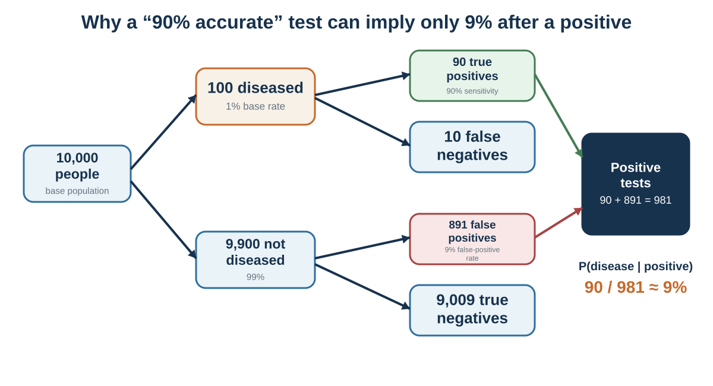

# Base Rates, Randomness, and Calibration

*Statistical intuition begins where the story meets the denominator*

::: {.callout-note .core-idea icon=false}
## Core Idea

Good probability judgment starts with a reference class, updates with diagnostic evidence, expects noise and regression, and records forecasts so confidence can be calibrated.
:::

{#fig-natural-frequencies fig-alt="Frequency tree for 10,000 people showing 90 true positives and 891 false positives, producing a 9 percent posterior probability."}

## Learning goals

- Use base rates and natural frequencies.
- Distinguish P(evidence|hypothesis) from P(hypothesis|evidence).
- Explain regression to the mean.
- Use explicit probabilities and feedback to improve calibration.

Imagine that you are evaluating a start-up founder. She is energetic, persuasive, technically skilled, and deeply committed. She tells a compelling story about a market that incumbents have ignored. She has a prototype and early user enthusiasm. The story feels strong.

Now ask a different question: out of 100 start-ups at this stage, how many return significant value to investors?

The first question invites narrative judgment. The second invites statistical judgment.

Both matter. A base rate without case information is incomplete. Case information without a base rate is ungrounded. The challenge is integration.

A base rate is the general frequency of an outcome in a relevant class. If 10% of similar projects succeed, that is a base rate. If 30% of candidates with a certain background perform well, that is a base rate. If 1% of people in a population have a disease, that is a base rate. If most mergers fail to create shareholder value, that is a base-rate warning. If similar construction projects usually exceed budget, that matters.

People often underuse base rates. Kahneman and Tversky (1973) showed that people sometimes rely heavily on individuating descriptions even when base-rate information is available. Bar-Hillel (1980) reviewed evidence that base rates are neglected especially when case-specific information feels diagnostic, vivid, or representative. In plain language, people often prefer the story to the statistic.

Consider hiring. A candidate gives an excellent unstructured interview. The interviewer is impressed. The candidate seems confident, fluent, and culturally compatible. But how predictive are unstructured interviews? How often do confident interviewees actually perform well? How much better are structured interviews, work samples, or job-relevant tests? Without reference-class information, the interviewer may confuse interview performance with job performance.

Consider medicine. A doctor hears symptoms that fit a familiar diagnosis. The story is coherent. But if the disease is rare and the symptoms are common across many conditions, the base rate matters. Diagnosis requires asking not only “Does this look like disease X?” but also “How common is disease X among patients like this, and how strongly do these symptoms distinguish it from alternatives?”

Consider public fear after a vivid event. A dramatic crime, accident, or disaster can dominate attention. But a vivid event is not the same as a frequent event. If public policy responds mainly to the most available story, it may overinvest in dramatic risks and underinvest in common but less visible harms.

A base rate is not a substitute for judgment. It is the starting point that keeps judgment from floating away.

Bayesian reasoning gives a formal version of this principle. The basic idea is simple: begin with a prior probability, examine new evidence, and update depending on how diagnostic the evidence is. The prior is the base rate or initial belief. The new evidence should move the probability up or down depending on how likely that evidence would be if the hypothesis were true compared with if it were false (Bayes, 1763; Edwards, 1968; Tversky & Kahneman, 1974).

In everyday language:

Start with how common it is. Ask how much the evidence should change that. Do not let a vivid detail erase the base rate unless the detail is genuinely diagnostic.

This discipline is hard because stories feel more personal than statistics. “This founder reminds me of a famous success” feels alive. “Most start-ups fail” feels abstract. “This patient has a symptom I recognize” feels immediate. “The condition is rare” feels distant. “This project team is different” feels more compelling than “similar projects usually run late.”

The outside view helps correct this tendency. Instead of focusing only on the unique details of the case, we ask what happened in a reference class of similar cases (Kahneman & Lovallo, 1993). This idea appeared earlier in planning fallacy and overconfidence, but it is fundamentally a probability tool. It asks decision-makers to step outside the story and look at the distribution.

A useful question is:

What is the relevant reference class, and what usually happens there?

This question is simple. It is also one of the strongest defenses against poor probability judgment.

## Conditional probability and natural frequencies

Probability becomes especially difficult when evidence is conditional.

Consider a medical test. Suppose 1% of a population has a disease. A test correctly detects the disease 90% of the time when the disease is present. The test also produces false positives in 9% of people who do not have the disease. A person tests positive. What is the probability that the person actually has the disease?

Many people answer close to 90%. That is wrong.

Use natural frequencies. Imagine 10,000 people.

About 1%, or 100 people, have the disease. Of those 100, the test correctly identifies 90. The remaining 9,900 people do not have the disease. Of those 9,900, 9% test positive falsely, which is 891 people. So the total number of positive tests is 90 true positives plus 891 false positives = 981 positive tests. Out of those 981 positive tests, only 90 are actual disease cases.

The probability of disease given a positive test is about 90/981, or about 9%.

This result surprises people because they confuse the probability of a positive test given disease with the probability of disease given a positive test. These are not the same.

The first is:

If the person has the disease, how likely is a positive test?

The second is:

If the person has a positive test, how likely is the disease?

This distinction is central to conditional probability. Confusing the two can produce serious errors in medicine, law, security, hiring, and everyday judgment.

Eddy (1982) showed that physicians often struggled with Bayesian reasoning in medical diagnosis. Gigerenzer and Hoffrage (1995) later showed that presenting information as natural frequencies can greatly improve reasoning compared with abstract probabilities. Cosmides and Tooby (1996) argued that human reasoning often improves when probability problems are presented in frequency formats that match how people may naturally track events.

The problem is not that people are incapable of statistical reasoning. It is that many probability formats are cognitively unfriendly.

Natural frequencies help because they preserve the nested structure of the problem. Instead of juggling percentages, people can count cases. “Out of 10,000 people…” is often easier than “1% prevalence, 90% sensitivity, 9% false-positive rate…”

The same problem appears in legal reasoning. The prosecutor’s fallacy occurs when the probability of evidence given innocence is confused with the probability of innocence given evidence. Suppose a DNA match is rare: only 1 in 1 million people would match by chance. That does not automatically mean there is a 1 in 1 million chance the defendant is innocent. The probability of innocence depends on the prior probability, the size of the population, the quality of the evidence, possible lab errors, and other case evidence. Legal scholars and statisticians have long warned about such errors in courtroom reasoning (Thompson & Schumann, 1987).

Conditional probability also matters in everyday life.

If a person is nervous in an interview, how likely is incompetence? If a company misses one deadline, how likely is future unreliability? If someone is quiet in a meeting, how likely is disagreement? If a student performs poorly once, how likely is low ability? If a stock rises after good news, how likely is continued growth?

The evidence may matter, but it must be interpreted against a base rate and an alternative hypothesis. A nervous candidate may be incompetent, but they may also be introverted, under pressure, or unfamiliar with interviews. A quiet employee may disagree, but they may also be thinking, uncertain, culturally cautious, or waiting for invitation. A missed deadline may indicate unreliability, but it may also reflect unclear scope, overload, or one-time disruption.

Bayesian reasoning is not only mathematics. It is disciplined humility about evidence.

Ask:

How common is the hypothesis before this evidence? How likely is this evidence if the hypothesis is true? How likely is this evidence if the hypothesis is false? What alternative explanations could produce the same evidence? How should my belief change—not to certainty, but upward or downward?

Good probability judgment rarely jumps from evidence to conclusion. It updates.

## Regression to the mean

Regression to the mean is one of the most important and least intuitive ideas in statistics.

When an outcome is extreme, the next measurement is likely to be closer to average, partly because extreme outcomes often reflect both skill and luck. If a student scores unusually high on one test, the next score is likely to be lower, even if the student remains strong. If a salesperson has an extraordinary month, the next month is likely to be more ordinary. If a mutual fund dramatically outperforms, future performance may move closer to the market average. If a pilot performs unusually badly during one training flight, the next flight may improve even without intervention.

Francis Galton first described regression toward mediocrity in his study of heredity (Galton, 1886). The concept later became central to statistics. In decision-making, regression matters because people often invent causal explanations for movement that is partly statistical.

Kahneman and Tversky (1973) described how people misunderstand regression. Suppose a flight instructor praises pilots after excellent landings and criticizes them after poor landings. The instructor observes that praise is often followed by worse performance and criticism by better performance. He concludes that criticism works and praise harms. But regression to the mean provides another explanation. Exceptional landings are likely to be followed by less exceptional ones, and poor landings by better ones, regardless of feedback.

This error is common.

A company has a terrible quarter. Leadership launches a new initiative. Performance improves. The initiative gets credit, even if some improvement was regression from an unusually bad quarter.

A student performs badly on a test. Parents punish the student. The next score improves. Punishment gets credit, even if the first score was unusually low.

A sports team fires a coach after a losing streak. Performance improves. The firing gets credit, even if the streak was partly bad luck.

A hospital unit has unusually high infection rates one month. Management intervenes. Rates fall. The intervention may have helped, but regression may also contribute.

Regression does not mean interventions do not work. It means improvement after an extreme outcome is not sufficient evidence that the intervention caused improvement. We need comparison groups, longer histories, or repeated data.

Regression also matters in prediction. People often make extreme predictions from extreme evidence. A student who scores in the 99th percentile once is predicted to always perform at that level. A job candidate who gives a brilliant interview is predicted to be outstanding. A company with rapid early growth is predicted to continue rapid growth. But if the evidence contains noise, predictions should be regressed toward the average.

This is one reason intuitive predictions are often too extreme. People predict outcomes that are as extreme as the evidence seems, rather than adjusting for unreliability. If an interview is only moderately predictive, an outstanding interview should not produce an extremely high performance forecast. If early sales are noisy, strong early sales should be tempered.

A useful corrective is:

How reliable is this measure? How extreme is the current observation? How much luck might be involved? What is the average outcome in the reference class? How far should my prediction move back toward that average?

Regression to the mean teaches humility. Extreme outcomes invite stories. Some stories are true. Many are partly luck.

## Calibration

Probability judgment is not only about avoiding specific errors. It is also about becoming calibrated.

A person is well calibrated when events assigned a probability of 70% happen about 70% of the time, events assigned 90% happen about 90% of the time, and so on. Calibration is not about being certain. It is about matching confidence to reality.

Research on calibration shows that people are often overconfident, especially when answering difficult knowledge questions or forecasting uncertain events (Lichtenstein et al., 1982). They may say they are 90% confident but be correct much less often. This is overprecision, discussed in Chapter 13.

Calibration matters because decisions depend on confidence. If a manager says a project has an 80% chance of success, the organization may invest heavily. If the true probability is closer to 40%, the decision changes. If a doctor says a diagnosis is very likely, treatment follows. If an investor is highly confident in a forecast, they may concentrate risk.

Forecasting research offers tools for improvement. Tetlock’s work on expert political judgment found that many experts performed poorly at long-term forecasting, especially when they relied on broad ideological narratives (Tetlock, 2005). Later work on forecasting tournaments found that some people—“superforecasters”—performed unusually well by breaking problems into parts, using base rates, updating gradually, thinking probabilistically, considering alternatives, and learning from feedback (Mellers et al., 2014; Tetlock & Gardner, 2015).

Good forecasters do not simply “trust their gut.” They use habits that align with statistical reasoning:

Start with base rates. Break complex questions into components. Use comparison classes. Make numerical probability estimates. Update incrementally when evidence changes. Look for disconfirming information. Track accuracy over time. Distinguish uncertainty from ignorance. Avoid false precision.

One useful tool is the Brier score, a measure of forecast accuracy for probabilistic predictions (Brier, 1950). A lower Brier score indicates better accuracy. Most people do not need to compute Brier scores in daily life, but the principle matters: probabilistic predictions should be recorded and checked.

Calibration also requires using probability language carefully. Words such as “likely,” “possible,” “rare,” “serious risk,” and “good chance” mean different things to different people. One person’s “likely” may mean 60%; another’s may mean 90%. In organizations, vague probability language causes confusion. A project described as “highly likely” may be interpreted differently by executives, analysts, and engineers.

Sherman Kent, a pioneer of intelligence analysis, argued for translating probability words into numerical ranges to reduce ambiguity (Kent, 1964). Modern intelligence communities often use probability terms with defined ranges. This is useful in business too. Instead of saying “There is a real chance,” say “I estimate 25–35%.” Instead of “This is unlikely,” say “About 10%.” Numbers are not perfect, but they force clarity.

People often resist numerical probabilities because they feel artificial. But vague words can hide disagreement. A team may agree that success is “likely” while one person means 55% and another means 85%. The agreement is an illusion.

A useful decision practice is to ask each person privately for a probability estimate before discussion. Then compare. Differences reveal assumptions.

Calibration is not about pretending to know more than we do. It is about admitting uncertainty precisely enough to learn.

## Building statistical intuition

Statistical intuition can improve. It requires tools that make probability more concrete and less story-dependent.

The first tool is natural frequencies. Instead of saying “The disease prevalence is 1%, the sensitivity is 90%, and the false-positive rate is 9%,” say “Out of 10,000 people, 100 have the disease, 90 of them test positive, and 891 people without the disease also test positive.” Natural frequencies make conditional probability easier (Gigerenzer & Hoffrage, 1995).

The second tool is reference-class forecasting. Ask what happened in similar cases. A project plan should be compared with similar projects. A hiring forecast should be compared with similar hires. A medical risk should be compared with similar patients. A start-up should be compared with similar ventures at a similar stage. The reference class anchors the prediction.

The third tool is sample size awareness. Small samples are noisy. A few cases rarely prove a pattern. Before drawing conclusions, ask how many observations are involved. A school’s test scores, a doctor’s outcomes, a fund manager’s returns, or a team’s performance may fluctuate substantially when samples are small.

The fourth tool is regression thinking. Extreme outcomes should be expected to move partly toward average unless there is strong evidence of lasting change. This helps prevent overreaction to exceptional success or failure.

The fifth tool is alternative explanations. When evidence appears diagnostic, ask what else could produce it. A positive test could be true disease or false positive. A quiet student could be confused, bored, shy, reflective, or culturally cautious. A rising stock could reflect fundamentals, hype, liquidity, or temporary sentiment.

The sixth tool is probabilistic language. Replace certainty with ranges. Say “I am 70% confident” rather than “I know.” Say “My estimate is 40–60%” rather than “It could happen.” Probability language helps people update.

The seventh tool is feedback. Record forecasts, compare outcomes, and update calibration. Without feedback, people repeat the same probability errors.

The eighth tool is visual representation. Icon arrays, frequency trees, risk ladders, and simple charts can make probability easier to grasp. Visual aids are especially useful in medicine and public policy, where abstract percentages can confuse (Gigerenzer & Edwards, 2003).

The ninth tool is slowing down when stories are vivid. A coherent story should trigger the question: how common is this story? Vividness is not probability.

The tenth tool is humility. Many probabilities are uncertain. The goal is not false precision but disciplined uncertainty.

A practical probability checklist:

What is the reference class? What is the base rate? How diagnostic is the evidence? What alternative explanations exist? How large is the sample? Could this be random variation? Should I expect regression to the mean? What probability would I assign? What evidence would change it? How will I check calibration later?

Statistical intuition is not about becoming a calculator. It is about learning to ask questions that stories often hide.

Chapter 2 showed how probabilities and utilities are combined under risk; this chapter supplies the statistical discipline those models require. Probability judgment asks how likely outcomes are. Risky decision-making asks how people choose when probabilities and outcomes must be combined. That requires expected value, expected utility, risk aversion, and the limits of the rational model under risk.

| Question | Why it matters |
| --- | --- |
| What is the reference class and base rate? | The story needs a statistical starting point. |
| How diagnostic is the evidence? | Evidence matters relative to alternative explanations. |
| How large and selected is the sample? | Small or filtered samples are noisy. |
| Could regression or random clustering explain the pattern? | Extreme outcomes often move toward average. |
| What probability do I assign, and when will I review it? | Calibration needs explicit forecasts and feedback. |
: A probability checklist {#tbl-12-1}

## Key ideas

- Good probability judgment starts with a reference class, updates with diagnostic evidence, expects noise and regression, and records forecasts so confidence can be calibrated.

Natural-frequency formats, reference classes, and calibration make statistical structure easier to see and improve probabilistic judgment (Gigerenzer & Hoffrage, 1995; Tetlock & Gardner, 2015).

- Use base rates and natural frequencies.
- Distinguish P(evidence|hypothesis) from P(hypothesis|evidence).
- Explain regression to the mean.

## Study and practice

1. How would you use base rates and natural frequencies in practice?

2. How would you distinguish p(evidence|hypothesis) from p(hypothesis|evidence)?

3. How would you explain regression to the mean?

::: {.callout-tip .activity icon=false}
## Activity

Convert one percentage problem into natural frequencies. Then make a forecast with a numerical probability and a review date. After the outcome, score whether the confidence was calibrated.  
EXPERIENCE - EXPLAIN - APPLY (MAXIMUM 120 WORDS)  
Experience: describe one specific decision, interaction, or observation. Explain: use one or two concepts from this chapter accurately. Apply: state one improvement, implication, or testable prediction.
:::

## References cited in this chapter

::: {.reference}
Bar-Hillel, M. (1980). The base-rate fallacy in probability judgments. Acta Psychologica, 44(3), 211–233.
:::

::: {.reference}
Brier, G. W. (1950). Verification of forecasts expressed in terms of probability. Monthly Weather Review, 78(1), 1–3.
:::

::: {.reference}
Cosmides, L., & Tooby, J. (1996). Are humans good intuitive statisticians after all? Rethinking some conclusions from the literature on judgment under uncertainty. Cognition, 58(1), 1–73.
:::

::: {.reference}
Eddy, D. M. (1982). Probabilistic reasoning in clinical medicine: Problems and opportunities. In D. Kahneman, P. Slovic, & A. Tversky (Eds.), Judgment under uncertainty: Heuristics and biases (pp. 249–267). Cambridge University Press.
:::

::: {.reference}
Edwards, W. (1968). Conservatism in human information processing. In B. Kleinmuntz (Ed.), Formal representation of human judgment (pp. 17–52). Wiley.
:::

::: {.reference}
Galton, F. (1886). Regression towards mediocrity in hereditary stature. Journal of the Anthropological Institute of Great Britain and Ireland, 15, 246–263.
:::

::: {.reference}
Gigerenzer, G., & Edwards, A. (2003). Simple tools for understanding risks: From innumeracy to insight. BMJ, 327(7417), 741–744.
:::

::: {.reference}
Gigerenzer, G., & Hoffrage, U. (1995). How to improve Bayesian reasoning without instruction: Frequency formats. Psychological Review, 102(4), 684–704.
:::

::: {.reference}
Kahneman, D., & Lovallo, D. (1993). Timid choices and bold forecasts: A cognitive perspective on risk taking. Management Science, 39(1), 17–31.
:::

::: {.reference}
Kahneman, D., & Tversky, A. (1973). On the psychology of prediction. Psychological Review, 80(4), 237–251.
:::

::: {.reference}
Kent, S. (1964). Words of estimative probability. Studies in Intelligence, 8(4), 49–65.
:::

::: {.reference}
Lichtenstein, S., Fischhoff, B., & Phillips, L. D. (1982). Calibration of probabilities: The state of the art to 1980. In D. Kahneman, P. Slovic, & A. Tversky (Eds.), Judgment under uncertainty: Heuristics and biases (pp. 306–334). Cambridge University Press.
:::

::: {.reference}
Mellers, B., Stone, E., Atanasov, P., Rohrbaugh, N., Metz, S. E., Ungar, L., Bishop, M. M., Horowitz, M., Merkle, E., & Tetlock, P. E. (2014). The psychology of intelligence analysis: Drivers of prediction accuracy in world politics. Journal of Experimental Psychology: Applied, 20(1), 1–14.
:::

::: {.reference}
Tetlock, P. E. (2005). Expert political judgment: How good is it? How can we know? Princeton University Press.
:::

::: {.reference}
Tetlock, P. E., & Gardner, D. (2015). Superforecasting: The art and science of prediction. Crown.
:::

::: {.reference}
Thompson, W. C., & Schumann, E. L. (1987). Interpretation of statistical evidence in criminal trials: The prosecutor’s fallacy and the defense attorney’s fallacy. Law and Human Behavior, 11(3), 167–187.
:::

::: {.reference}
Tversky, A., & Kahneman, D. (1974). Judgment under uncertainty: Heuristics and biases. Science, 185(4157), 1124–1131.
:::
