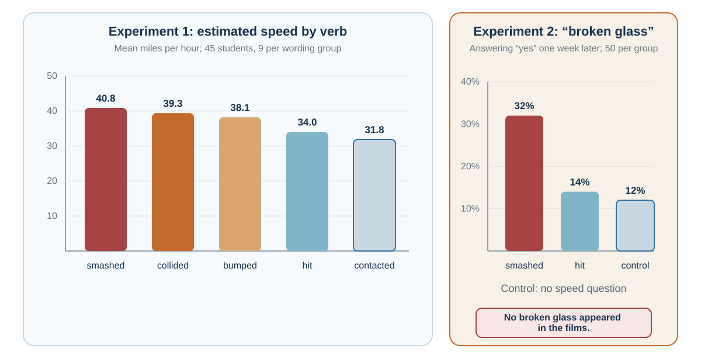

---
aliases:
  - 15-frames-change-the-decision.html
---

# Framing: When the Same Facts Become Different Decisions

*Facts arrive with attention, meaning, reference points, and implied causality*

::: {.chapter-epigraph}
> “The dependence of preferences on the formulation of decision problems is a significant concern for the theory of rational choice.”
>
> — Amos Tversky and Daniel Kahneman, [“The Framing of Decisions and the Psychology of Choice”](https://doi.org/10.1126/science.7455683), 1981, p. 453
:::

A report says that 90 of every 100 people survived a procedure for one year. A second report says that 10 of every 100 died within that year. Assuming the same people, endpoint, and follow-up, both describe the same outcome. Yet you may find yourself responding differently to the two sentences.

Before judging which sounds more reassuring, ask what each makes easy to notice. That is where a framing analysis begins.

::: {.callout-note .core-idea icon=false}
## Core Idea

A frame organizes what a decision appears to be about. Sometimes equivalent descriptions emphasize different sides of one outcome; sometimes a question changes which causes or options enter consideration. Comparing valid frames can reveal a hidden trade-off, provided we check whether the facts really remain equivalent.

:::

## Learning goals

- Distinguish framing from priming, fluency, and choice architecture.
- Explain how equivalent descriptions and different problem definitions alter judgment.
- Build an ethical complementary-frame protocol.

**Framing** concerns how information or a problem is described and organized. In the survival example, the outcome is held constant while the emphasis changes. In “Should we cut costs?” versus “Which service must we preserve?”, different objectives become focal. These are related questions about representation, but only the first is a test using complementary numerical descriptions.

Reference points can also change evaluation. A €60,000 salary may feel generous against an expectation of €50,000 and disappointing against €70,000. Prospect theory develops this reference dependence; here we examine how the representation guides attention and comparison (Tversky & Kahneman, 1981).

::: {.callout-note .personal-example icon=false}
## A personal illustration: from a fall to a somersault

My daughter once fell from a small toddler chair. I first checked that she was not seriously hurt and acknowledged the pain she might genuinely be feeling. I then exclaimed, “Wow, you did a somersault like a kung fu master!” She laughed proudly instead of crying.

One family episode cannot establish a framing effect. It does, however, illustrate a plausible reappraisal: describing the fall as an impressive performance offered a less threatening interpretation, which may have changed her emotional response. Safety and validation must come first. A calm, reassuring frame can sometimes reduce fear, but it should never deny injury, dismiss pain, or require another person to feel differently.
:::

A frame differs from a **prime**, which changes the mental context before or around a judgment, and from **fluency**, the ease of processing it. A **default** changes what happens without an active response. A donation form can therefore use reassuring language, readable typography, and an opt-out default at once, with each feature making a different contribution.

## Equivalent facts, different meanings

{#fig-context-mechanisms fig-alt="Four cards distinguish framing, priming, fluency, and defaults by the question each mechanism answers."}

The clearest framing effects occur when two descriptions are logically equivalent but psychologically different.

One classic category is attribute framing. An object or outcome is described in positive or negative terms, even though the underlying information is the same. Levin and Gaeth (1988) found that people evaluated beef more favorably when it was labeled “75% lean” than when it was labeled “25% fat.” The two labels are equivalent. But “lean” directs attention to health and quality, while “fat” directs attention to unhealthiness and excess.

The equivalence has to be checked. “70% employed” and “30% not employed” complement one another only if they use the same population, date, and definition. “Low volatility” and “limited upside,” or “experienced” and “old,” are not equivalent facts: they introduce different attributes or inferences. Calling them frames must not hide that change in information.

Another category is goal framing, where messages emphasize either the benefits of performing an action or the costs of failing to perform it. For example, a health message might say, “If you exercise regularly, you improve your heart health,” or “If you do not exercise regularly, you increase your risk of heart disease.” Rothman and Salovey (1997) argued that gain-framed messages may be more effective for prevention behaviors, while loss-framed messages may be more effective for detection behaviors, though later research shows that effects depend on behavior type, audience, and context. Meta-analyses suggest that framing can influence health behavior, but effects are often modest and variable (Gallagher & Updegraff, 2012; O’Keefe & Jensen, 2007).

Goal framing matters because it changes motivation. A gain frame says, “Here is what you can obtain.” A loss frame says, “Here is what you may lose.” The same action becomes pursuit or avoidance.

A third category is risky-choice framing. Here, choices involving uncertainty are described in terms of gains or losses. Tversky and Kahneman’s “Asian disease problem” is the classic example. Participants were told to imagine a disease expected to kill 600 people. In the gain frame, one program would save 200 people for sure, while another had a one-third chance of saving all 600 and a two-thirds chance of saving none. In the loss frame, one program would result in 400 deaths for sure, while another had a one-third chance that nobody would die and a two-thirds chance that all 600 would die. The outcomes were logically equivalent, but preferences changed. People tended to be risk averse in the gain frame and risk seeking in the loss frame (Tversky & Kahneman, 1981).

In this task, the wording shifted aggregate preferences between a sure outcome and a gamble. This does not mean losses always increase risk taking: probabilities, amounts, reference points, and task details matter. The risky-choice chapter develops those conditions.

If equivalent frames produce different choices, the ethical answer is not to search for a perfectly neutral sentence. Every description highlights something. Present complementary frames, preserve the same denominator and horizon, and ask which trade-off each wording makes easier to see. Equivalent facts can become different decisions because people process meaning, not equivalence alone.

## Questions that contain an answer

Some frames are not just descriptions. They are questions that shape the answer.

A restaurant server can ask, “Do you want an egg with your ramen?” Or the server can ask, “Would you like one egg or two?” The second question assumes the decision to add eggs and shifts attention to quantity. It therefore does more than describe equivalent facts differently: it also foregrounds a constrained menu. [Choice Architecture](40-choice-architecture-the-environment-gets-a-vote.qmd#choice-architecture-the-environment-gets-a-vote) returns to this overlap and asks whether “no” remains a genuine, easy response.

{#fig-assumed-choice-eggs fig-alt="Two side-by-side menu panels. The first asks whether the person wants an egg and displays no and yes. The second asks whether the person wants one or two eggs and displays only one and two. A note explains that the second question changes option salience and implied commitment rather than merely rewording equivalent facts." width=100%}

“Would you prefer delivery this week or next week?” similarly treats purchase as settled. A useful response is to restore the earlier question: whether to buy at all. This kind of framing changes option salience and implied commitment, rather than merely expressing an unchanged proposition.

Survey questions can also direct attention to different consequences of a policy. Asking about protecting local jobs highlights workers, while asking about restrictions on lower-priced imports highlights consumers. The descriptions may concern one policy without supplying equivalent information.

Schuman and Presser (1981) showed that survey responses can be sensitive to question wording, order, and context. Even small wording differences can change what respondents consider relevant. In political psychology and communication research, framing is central because public opinion often depends on which considerations are made salient (Chong & Druckman, 2007; Druckman, 2001).

For a company facing declining sales, “Why are salespeople not working hard enough?” embeds a causal claim in the question. “What explains the fall in sales?” leaves room to compare effort, product quality, price, and changing demand. The broader question is useful only if the team then gathers evidence capable of distinguishing those accounts.

Changing the wording does not establish that a preferred interpretation is true. It changes which explanations receive a hearing.

## Framing memory and causality

Frames do not only influence choices about the future. They can also shape memory of the past.

Loftus and Palmer’s classic study showed participants films of car accidents and asked them to estimate speed. The wording of the question mattered. Participants gave higher speed estimates when asked how fast the cars were going when they “smashed” into each other than when asked how fast they were going when they “hit” each other. In a separate experiment, wording also affected reports one week later: participants asked about cars that “smashed” were more likely to report broken glass than those asked about cars that “hit,” although the film contained none (Loftus & Palmer, 1974).

{#fig-wording-memory-study-redraw fig-alt="A two-panel original chart. In Experiment 1, with 45 students in five groups of nine, mean speed estimates rise from 31.8 miles per hour for contacted to 40.8 for smashed. In Experiment 2, with 50 students per group, 32 percent of the smashed group reported broken glass versus 14 percent of the hit group and 12 percent of controls, although no broken glass appeared."}

The results concern speed estimates and later reports, with the second experiment supporting an influence of wording beyond the immediate estimate. They fit a broader account of reconstructive memory, in which later information can affect what people report remembering (Bartlett, 1932; Loftus, 2005). They do not show that every wording effect reflects the same change in memory storage.

In a workplace review, “Why did you ignore the client?” likewise supplies neglect as an explanation before the employee answers. “What happened when the client raised the concern?” leaves more of the causal question open. Responsibility should follow the evidence gathered, rather than arrive concealed in the first question.

Entman (1993) famously defined framing in communication as selecting some aspects of perceived reality and making them more salient in a text, thereby promoting particular problem definitions, causal interpretations, moral evaluations, and treatment recommendations. This definition is useful because it shows that frames do four things: define problems, diagnose causes, make moral judgments, and suggest remedies.

For decision-making, this means that frames do not merely describe situations. They guide the entire chain from attention to action.

## Framing in management, negotiation, and policy

Frames influence what people look for. A negotiation described as a battle can emphasize winning and withholding, while joint problem-solving directs attention toward interests and possible trades. Neither description settles how much information is safe to share. The parties still need to assess incentives, alternatives, and safeguards.

Similarly, describing dissent as a contribution can support speaking up, but language alone does not create psychological safety. People need evidence that questions and mistakes can be raised without interpersonal punishment (Edmondson, 1999, 2019). In politics, competing frames interact with source credibility, prior beliefs, and the audience's values (Chong & Druckman, 2007). A persuasive label is not an unrestricted power to change opinion.

## Reframing as a decision skill

Start with one stuck problem. “Customers do not understand our product” might mean the product is confusing, the explanation is poor, or the intended customers need something else. Write what each account makes visible, then identify a test and an action that would follow from its result. Reframing is useful when it expands the inquiry and creates distinguishable possibilities.

A second perspective can also reveal an omitted value. The employee may see a new procedure as extra work where a manager sees control of errors. Both consequences could be real. Comparing them is more useful than simply replacing a negative label with a positive one.

## Ethical framing

Responsible framing preserves accurate information, shows material trade-offs, and makes room for another valid account. It should distinguish evidence from recommendation: a communicator can advocate a choice while making clear which values support it.

For numerical claims, check the event, denominator, time horizon, baseline, and comparison. For causal claims, check what is assumed about responsibility. For a proposed choice, make refusal and other feasible options visible. These checks are more useful than a claim that one preferred wording is perfectly neutral.

Framing is particularly sensitive in medicine. Patients need information in ways they can understand and use. Gigerenzer and Edwards (2003) argued that health statistics should often be presented in transparent formats such as natural frequencies rather than confusing relative risks. A treatment that reduces risk from 2 in 1,000 to 1 in 1,000 can be described as a 50% relative risk reduction or an absolute reduction of 1 in 1,000. Both are true. They do not feel the same. Ethical risk communication should include absolute risks, baselines, and comparisons.

The same care applies in management. A label such as “rightsizing” should not obscure job losses, and calling a workload a “stretch goal” does not establish that it is sustainable. Use language that lets the people affected understand the consequences and challenge the assumptions.

| Frame type | What changes | Safeguard |
| --- | --- | --- |
| Attribute frame | Which side of an equivalent description is focal. | Present both logically equivalent forms. |
| Risky-choice frame | Whether outcomes are coded as gains or losses. | Make the reference point explicit. |
| Goal frame | Whether action pursues benefit or avoids cost. | Match the frame to accurate stakes and efficacy. |
| Question frame | Which alternatives and causes enter search. | Ask a second question from another stakeholder’s perspective. |
| Causal frame | Who or what appears responsible. | Test competing mechanisms before assigning blame. |
: Framing mechanisms and safeguards {#tbl-15-1}

## Practice Lab

Take one consequential decision statement. Produce a paired-frame brief that reports gains and losses, absolute and relative quantities, final states and changes, and individual and system consequences. For each pair, mark what becomes visible and what recedes. End with the version you would show a decision-maker and explain why it preserves relevant choice rather than steering toward your preferred answer.

## Take it forward

Before presenting a recommendation, write the strongest valid complementary description. Check that its denominator, horizon, and facts match the first version. If the preference changes, investigate which consequence or value the original wording made too easy to overlook.

## References cited in this chapter

::: {.reference}
Bartlett, F. C. (1932). Remembering: A study in experimental and social psychology. Cambridge University Press.
:::

::: {.reference}
Chong, D., & Druckman, J. N. (2007). Framing theory. Annual Review of Political Science, 10, 103–126.
:::

::: {.reference}
Druckman, J. N. (2001). The implications of framing effects for citizen competence. Political Behavior, 23(3), 225–256.
:::

::: {.reference}
Edmondson, A. C. (1999). Psychological safety and learning behavior in work teams. Administrative Science Quarterly, 44(2), 350–383.
:::

::: {.reference}
Edmondson, A. C. (2019). The fearless organization: Creating psychological safety in the workplace for learning, innovation, and growth. Wiley.
:::

::: {.reference}
Entman, R. M. (1993). Framing: Toward clarification of a fractured paradigm. Journal of Communication, 43(4), 51–58.
:::

::: {.reference}
Gallagher, K. M., & Updegraff, J. A. (2012). Health message framing effects on attitudes, intentions, and behavior: A meta-analytic review. Annals of Behavioral Medicine, 43(1), 101–116.
:::

::: {.reference}
Gigerenzer, G., & Edwards, A. (2003). Simple tools for understanding risks: From innumeracy to insight. BMJ, 327(7417), 741–744.
:::

::: {.reference}
Levin, I. P., & Gaeth, G. J. (1988). How consumers are affected by the framing of attribute information before and after consuming the product. Journal of Consumer Research, 15(3), 374–378.
:::

::: {.reference}
Loftus, E. F. (2005). Planting misinformation in the human mind: A 30-year investigation of the malleability of memory. Learning & Memory, 12(4), 361–366.
:::

::: {.reference}
Loftus, E. F., & Palmer, J. C. (1974). Reconstruction of automobile destruction: An example of the interaction between language and memory. Journal of Verbal Learning and Verbal Behavior, 13(5), 585–589.
:::

::: {.reference}
O’Keefe, D. J., & Jensen, J. D. (2007). The relative persuasiveness of gain-framed loss-framed messages for encouraging disease prevention behaviors: A meta-analytic review. Journal of Health Communication, 12(7), 623–644.
:::

::: {.reference}
Rothman, A. J., & Salovey, P. (1997). Shaping perceptions to motivate healthy behavior: The role of message framing. Psychological Bulletin, 121(1), 3–19.
:::

::: {.reference}
Schuman, H., & Presser, S. (1981). Questions and answers in attitude surveys: Experiments on question form, wording, and context. Academic Press.
:::

::: {.reference}
Tversky, A., & Kahneman, D. (1981). The framing of decisions and the psychology of choice. Science, 211(4481), 453-458.
:::
