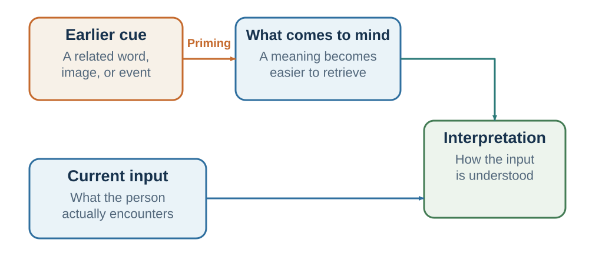

---
aliases:
  - 16-priming-and-the-active-mental-context.html
---

# Accessibility, Familiarity, and Ease

*What comes readily to mind—and what moves smoothly through it—can feel more relevant, likable, and true than the evidence warrants*

::: {.chapter-epigraph}
> “Mere repeated exposure of the individual to a stimulus is a sufficient condition for the enhancement of his attitude toward it.”
>
> — Robert B. Zajonc, [“Attitudinal Effects of Mere Exposure”](https://doi.org/10.1037/h0025848), 1968, p. 1
:::

::: {.callout-note .core-idea icon=false}
## Core Idea

Interpretation depends partly on what is mentally ready, and clear, familiar material is often easier to process. But accessibility, repetition, and fluency can make one meaning feel more relevant, likable, safe, or true without adding evidence for it. Therefore, this chapter separates accessibility from familiarity and processing ease, then asks how to use clarity to support understanding without allowing ease itself to borrow evidential weight.
:::

## Learning goals

- Distinguish semantic and affective accessibility from familiarity and processing fluency.
- Explain how repetition can increase liking and perceived truth without adding evidence.
- Redesign a message so that clarity improves comprehension without borrowing credibility from ease.

::: {.callout-note .loop-location icon=false}
## Where this chapter enters the loop

Accessibility acts at **Interpret** by making one meaning ready before others. Familiarity and ease then influence **Predict** and **Value** when the feeling of smooth processing is attributed to truth, safety, or quality.
:::

Chapter 9 asked why an event feels likely when examples are vivid or a case resembles a prototype. This chapter asks a different question: why can a claim feel true, safe, acceptable, or likable merely because its meaning is accessible and its processing is smooth? The first problem concerns the sample or category used for probability; the second concerns the source attributed to a feeling of ease.

A manager opens a meeting by saying, “We need to understand why the launch failed.” The group searches for mistakes, blame, and broken plans. Now change one sentence: “We need to understand what the launch taught us about the market.” The facts have not changed, but different concepts are ready to organize them.

Later, one explanation is repeated in three meetings: “Customers were not ready.” It becomes easier to retrieve, easier to say, and easier to understand. That ease can reflect genuine learning. It can also arise because the organization has repeated one story while neglecting alternatives such as poor positioning, weak onboarding, or an unreliable product.

Two mechanisms are operating. **Priming** changes which concepts are accessible before or around a judgment. **Processing fluency** changes how effortless a message feels. They often reinforce each other: activating a concept makes related information easier to process, and easy processing can make the concept feel familiar, safe, or true. The practical challenge is to use accessibility and clarity without allowing either to impersonate evidence.

## Accessibility: memory prepares an answer

Human memory is not a set of isolated folders. Concepts are linked. “Doctor” is connected to nurse, hospital, illness, medicine, care, authority, and perhaps anxiety. “Negotiation” may connect to battle, compromise, money, fairness, or problem-solving, depending on experience. When one concept becomes active, related concepts become easier to retrieve.

Classic semantic-priming experiments show this basic mechanism. People recognize *nurse* faster after *doctor* than after an unrelated word because the related concept has become accessible (Meyer & Schvaneveldt, 1971). Timing and task can also recruit expectations and strategic processing, but the basic facilitation of related material is robust (Neely, 1977).

This is an efficient property of memory. If a person hears *airport*, it is useful for luggage, passport, gate, and delay to become ready. The problem begins when accessibility is treated as diagnosticity. A recently seen illness may be easier for a physician to diagnose even when another illness is more prevalent. A dramatic cybersecurity incident can dominate a risk meeting even when a quieter operational failure has a larger expected cost. A familiar candidate profile can come to mind as the image of leadership even when it does not predict the role's outcomes.

{#fig-priming-pathway fig-alt="Four-step path from prior cue to accessibility, ambiguous input, and interpretation, with a boundary-conditions box."}

Accessibility differs from framing. A **frame** organizes the information in the decision itself—for example, survival rather than mortality. A **prime** changes the mental context from which that information is encountered—for example, a frightening medical story heard before the statistic. Accessibility also differs from a default, which changes what happens when no action is taken. Precise names matter because the mechanism identifies the correction.

## Accessible concepts interpret ambiguity

Priming matters most when the next event can support more than one interpretation. *Bank* can mean a financial institution or a riverbank. A short email can be efficient or rude. A supplier's hesitation can signal rejection, capacity limits, or a request for reassurance. Accessibility gives one interpretation a head start.

Higgins, Rholes, and Jones (1977) exposed participants to words associated with positive traits such as *adventurous* or negative traits such as *reckless*. Participants later evaluated the same ambiguously described person. The accessible trait influenced whether the behavior appeared admirable or irresponsible. Srull and Wyer (1979) similarly found that accessible hostility concepts could influence later impressions of an ambiguous target.

The mechanism extends naturally to professional judgment. If a hiring committee begins by discussing a previous employee's lack of initiative, it may interpret a candidate's careful answer as passivity. If it begins by discussing reckless overconfidence, the same answer may look prudent. A negotiation shaped by recent betrayal can make exploratory questions feel intrusive. A meeting opened with a failure story can make variance look like incompetence; one opened with experimentation can make it look like information.

The intervention is not to replace every negative concept with a positive one. Threat, blame, or competition may be relevant. The intervention is to ask which concepts were made accessible, whether the next evidence is ambiguous, and which rival interpretation deserves an equal route into the discussion. A balanced opening can name the decision question, the plausible mechanisms, and the evidence that would separate them.

Accessibility can carry affect as well as meaning, and affective-priming tasks have sometimes shifted immediate evaluation in specified laboratory conditions (Fazio et al., 1986; Murphy & Zajonc, 1993). Chapters 5 and 9 own the distinction between integral and incidental feeling. Here the narrower implication is order sensitivity: when an ambiguous target follows an emotional cue, use independent ratings, counterbalancing, a break, or delayed review before treating the evaluation as evidence about the target.

## Familiarity and cognitive ease

Accessibility concerns what is ready. **Processing fluency** concerns how easily information is perceived, understood, retrieved, or pronounced. **Cognitive ease** is the subjective feeling of smooth processing. A repeated statement, familiar face, clear sentence, expected image, or easily compared option can all feel fluent (Alter & Oppenheimer, 2009; Reber et al., 2004).

{#fig-fluency-pathway fig-alt="Four possible sources—repetition, clarity, familiarity, and pronounceability—converge on processing ease. Ease can influence perceived truth, liking, confidence, or context-specific risk and safety judgment. A separate evidence check asks what caused the ease and what independent evidence supports the inference."}

@fig-fluency-pathway is a teaching synthesis of several fluency literatures, not a claim that one common pathway always produces all four judgments (Alter & Oppenheimer, 2009; Reber et al., 2004). Ease is a useful metacognitive signal. A clear explanation is easier to use than a confused one. A familiar route has often worked before. A readable warning is more actionable than an unreadable one. But ease has multiple causes. A claim can be fluent because it is understood, because it fits prior belief, because its complexity has been hidden, or simply because it has been repeated. Safety inferences are especially context-specific: easy pronunciation has affected risk judgments in some tasks (Song & Schwarz, 2009), but fluency is not a general safety detector.

That ambiguity produces a common attribution error: “This is easy to process” becomes “This is true,” “safe,” “good,” or “well supported.” People rarely report the source of the judgment as font, repetition, rhyme, or familiarity. They report that the conclusion “just makes sense.”

## Repetition can become liking and truth

Repeated exposure can increase liking for initially neutral stimuli, a pattern known as the **mere-exposure effect** (Zajonc, 1968; Bornstein, 1989). Familiarity often signals that an object has been encountered without harm, so a modest preference for the familiar can be adaptive. It can also be manufactured through advertising, repeated visibility, and algorithmic exposure. The effect is not universal: repetition can create boredom or reactance, especially when the stimulus is unpleasant or exposure feels coercive.

Repetition also increases perceived truth. In the **illusory-truth effect**, repeated statements are later judged more truthful than new statements even when repetition adds no evidence (Hasher et al., 1977; Dechêne et al., 2010). Familiarity can outlast source memory. A person remembers having heard the claim but forgets that it came from a rumor, satire, a low-quality website, or a hypothetical example (Begg et al., 1992; Johnson et al., 1993).

Prior knowledge helps, but it does not always eliminate the effect. Fazio and colleagues (2015) found that repetition could increase perceived truth even for statements participants should have known were false. The finding does not imply helplessness. It shows why source checking and independent evidence must be separate steps rather than feelings retrieved with the claim.

Corrections face a practical tension. A correction may need to identify the false claim, but unnecessary repetition can strengthen familiarity. Effective correction makes the accurate account clear and memorable, identifies why the error is wrong, and provides an alternative explanation rather than leaving a causal gap (Lewandowsky et al., 2012). The goal is not merely to negate a fluent story. It is to build an evidence-aligned replacement that can be retrieved.

## Clarity without borrowed credibility

Fluency changes more than truth and liking. Easy-to-pronounce names have sometimes been judged less risky, rhyming aphorisms more accurate, and unnecessarily complex prose less intelligent (McGlone & Tofighbakhsh, 2000; Oppenheimer, 2006; Song & Schwarz, 2009). These effects should not become recipes for manipulation. They show that presentation can alter evaluation when substantive evidence is weak or difficult to access.

The right lesson is double-sided. **Improve clarity** because comprehension is a prerequisite for informed choice. Define terms, organize comparisons, use readable text, express risk in natural frequencies where helpful, and remove unnecessary jargon. **Do not treat clarity as validation.** A fluent slogan can hide an omitted trade-off, a smooth speaker can carry weak evidence, and an attractive chart can make an unsupported claim feel complete.

Difficulty is equally ambiguous. A challenging comparison, retrieval test, premortem, or requirement to state a rival model can create useful effort. A blurry slide, dense disclosure, confusing cancellation path, or unfamiliar acronym usually creates strain without insight. Some early work suggested that perceptual disfluency could reduce intuitive errors, but results are not a general license to make information hard to read (Alter et al., 2007; Eitel & Kühl, 2016).

Use a simple test: **Does the difficulty expose the structure the reader must understand, or does it obstruct access to that structure?** Productive difficulty asks for a meaningful judgment. Pointless strain taxes the reader before judgment can begin.

## The risk of the familiar

Familiarity can be a valid cue. A colleague who has repeatedly kept commitments deserves more trust than a stranger with no record. A route that has worked through many conditions is informative. A supplier's history can reduce uncertainty. The mistake is not using familiarity; it is failing to ask what produced it and whether the environment has changed.

Organizations often confuse the comfort of an old system with evidence of its quality. A familiar process has low learning cost, known workarounds, and an established language. A new process feels slower because people must build skill. Early disfluency can therefore be mistaken for failure. The relevant comparison is not the old system at mature fluency against the new system on its first day. It is performance after a fair learning period, including error, effort, welfare, and adaptability.

The reverse error is equally possible. Leaders sometimes dismiss every objection as “resistance to change.” A new system may create genuine burden, shift power, hide work, or solve the wrong problem. Familiarity explains discomfort only when a fair test shows that outcomes improve as fluency develops.

Run a **familiarity audit** with four questions:

1. What repeated experience makes this option feel safe or true?
2. Did that experience provide outcome feedback, or only repeated exposure?
3. Has the environment changed enough to break the learned relationship?
4. What comparison after a fair trial would separate reliability from mere familiarity?

This audit applies to a trusted supplier, a standard interview, an investment in the employer's industry, a familiar policy slogan, or an inherited meeting routine. Familiarity is evidence when it summarizes relevant feedback. It is inertia when exposure has replaced evaluation.

## Make accurate information fluent

Because repetition builds mental roads, accurate information also needs retrieval support. A one-time correction competes poorly with a simple falsehood repeated across headlines, meetings, or social feeds. Ethical communication should therefore repeat the verified account, preserve its source, and connect it to a usable causal explanation.

This does not mean turning every qualification into a slogan. The task is to design layers. Lead with the conclusion and the evidence boundary. Provide the denominator, comparison, and uncertainty in a visible form. Link to methods and data for readers who need them. Repeat the stable core without stripping away the conditions that make it true.

For example, replace “The pilot worked” with a repeatable but bounded statement: “In the three-month pilot, completion rose from 62 to 74 percent; the comparison was not randomized, and we are testing whether the gain persists.” The sentence is fluent enough to travel and precise enough to remain corrigible.

The same principle applies to teaching. Key distinctions should recur in stable language: prediction is not valuation; resemblance is not probability; outcome is not process. Repetition here does not manufacture truth. It makes an evidence-supported distinction easier to retrieve when the decision requires it.

## Evidence Boundary

| Claim | Evidential position | Responsible interpretation |
| --- | --- | --- |
| Semantic and perceptual accessibility | Robust across many laboratory paradigms | Recent activation can change processing speed and interpretation. |
| Affective accessibility | Supported in specified tasks | Prior valence can tilt immediate evaluation; effects depend on task and context. |
| Repetition, familiarity, and illusory truth | Substantial, replicated literatures | Familiarity can influence liking and truth judgments without adding evidence. |
| Large automatic behavioral effects from subtle social primes | Many prominent claims are contested or difficult to replicate | Do not describe priming as mind control or assume a portable effect size. |
| Disfluency as debiasing | Mixed and mechanism-dependent | Difficulty helps only when it directs effort to relevant reasoning. |
: Evidence tiers for accessibility and ease {#tbl-16-1}

The boundary is conceptual as well as empirical. A prime can make an idea accessible without producing behavior. A fluent claim can feel true without changing action. An observed action does not reveal which pathway operated. Motivation, incentives, constraints, identity, and competing cues can dominate or reverse the effect. The responsible claim specifies the cue, pathway, outcome, population, and comparison.

::: {.callout-caution .evidence-and-boundary-conditions icon=false}
## Evidence Boundary: concealed cues are not mind control

[]{#research-lens-masked-primes-and-awareness}

Masked-priming studies briefly present cues while limiting conscious
report, allowing narrow tests of processing without ordinary awareness
(Forster & Davis, 1984; Marcel, 1983). They do not show that hidden
messages can implant complex goals, override preferences, or force
purchases. The practical boundary is ethical as well as empirical: a
visible reminder that supports a person's stated goal is different from
concealed influence designed to defeat reflection.
:::

## Designing an evidence-aligned message

Start with a short workplace message: “The new review system is simple, fair, and proven.” It is fluent, but each adjective hides a claim. A redesign keeps the ease while restoring the evidence:

> The new review system uses the same four job-relevant criteria for every employee. In a three-month pilot, managers completed reviews faster and employee understanding improved; disagreement about ratings did not disappear. The pilot report and appeal process are linked here. We will review error patterns after the first cycle.

The revision is still readable. It states the mechanism, comparison, result, boundary, and correction route. Clarity carries the evidence rather than substituting for it.

For any important message, run four checks:

1. **Accessibility:** Which interpretation does the opening make ready, and which plausible rival recedes?
2. **Source:** Is the claim familiar because independent evidence supports it or because one source repeated it?
3. **Ease:** Does the design clarify the underlying structure or hide uncertainty and trade-offs?
4. **Agency:** Would the influence remain defensible if the audience understood how it worked and could question or refuse it?

The ethical objective is not a neutral environment—no environment is neutral. It is an environment in which task-relevant meanings are accessible, accurate information is easy to use, counterevidence can enter, and the reader does not have to confuse fluency with truth.

## Practice Lab

Select one message used in a meeting, course, website, policy, or campaign. Produce a before-and-after redesign. Annotate the original for concepts made accessible, sources of familiarity, and sources of processing ease or strain. The revision must preserve every substantive qualification while improving clarity. Add one independent source check, one rival interpretation, and one measure that would reveal whether comprehension improved without increasing unwarranted belief.

## Take it forward

- **Use this when:** a claim feels natural, familiar, or obviously clear before its source and alternatives have been examined.
- **Do not infer:** that accessibility controls behavior, that familiarity proves reliability, or that difficult presentation produces deeper thought.
- **Try this next:** make the evidence easy to use, then check the source and rival account separately from the feeling of ease.

## References cited in this chapter

::: {.reference}
Alter, A. L., Oppenheimer, D. M., Epley, N., & Eyre, R. N. (2007). Overcoming intuition: Metacognitive difficulty activates analytic reasoning. Journal of Experimental Psychology: General, 136(4), 569–576.
:::

::: {.reference}
Alter, A. L., & Oppenheimer, D. M. (2009). Uniting the tribes of fluency to form a metacognitive nation. Personality and Social Psychology Review, 13(3), 219–235.
:::

::: {.reference}
Begg, I. M., Anas, A., & Farinacci, S. (1992). Dissociation of processes in belief: Source recollection, statement familiarity, and the illusion of truth. Journal of Experimental Psychology: General, 121(4), 446–458.
:::

::: {.reference}
Bornstein, R. F. (1989). Exposure and affect: Overview and meta-analysis of research, 1968–1987. Psychological Bulletin, 106(2), 265–289.
:::

::: {.reference}
Dechêne, A., Stahl, C., Hansen, J., & Wänke, M. (2010). The truth about the truth: A meta-analytic review of the truth effect. Personality and Social Psychology Review, 14(2), 238–257.
:::

::: {.reference}
Eitel, A., & Kühl, T. (2016). Effects of disfluency and test expectancy on learning with text. Metacognition and Learning, 11(1), 107–121.
:::

::: {.reference}
Fazio, L. K., Brashier, N. M., Payne, B. K., & Marsh, E. J. (2015). Knowledge does not protect against illusory truth. Journal of Experimental Psychology: General, 144(5), 993–1002.
:::

::: {.reference}
Fazio, R. H., Sanbonmatsu, D. M., Powell, M. C., & Kardes, F. R. (1986). On the automatic activation of attitudes. Journal of Personality and Social Psychology, 50(2), 229–238.
:::

::: {.reference}
Forster, K. I., & Davis, C. (1984). Repetition priming and frequency attenuation in lexical access. Journal of Experimental Psychology: Learning, Memory, and Cognition, 10(4), 680–698.
:::

::: {.reference}
Hasher, L., Goldstein, D., & Toppino, T. (1977). Frequency and the conference of referential validity. Journal of Verbal Learning and Verbal Behavior, 16(1), 107–112.
:::

::: {.reference}
Higgins, E. T., Rholes, W. S., & Jones, C. R. (1977). Category accessibility and impression formation. Journal of Experimental Social Psychology, 13(2), 141–154.
:::

::: {.reference}
Johnson, M. K., Hashtroudi, S., & Lindsay, D. S. (1993). Source monitoring. Psychological Bulletin, 114(1), 3–28.
:::

::: {.reference}
Lewandowsky, S., Ecker, U. K. H., Seifert, C. M., Schwarz, N., & Cook, J. (2012). Misinformation and its correction: Continued influence and successful debiasing. Psychological Science in the Public Interest, 13(3), 106–131.
:::

::: {.reference}
Marcel, A. J. (1983). Conscious and unconscious perception: Experiments on visual masking and word recognition. Cognitive Psychology, 15(2), 197–237.
:::

::: {.reference}
McGlone, M. S., & Tofighbakhsh, J. (2000). Birds of a feather flock conjointly: Rhyme as reason in aphorisms. Psychological Science, 11(5), 424–428.
:::

::: {.reference}
Meyer, D. E., & Schvaneveldt, R. W. (1971). Facilitation in recognizing pairs of words: Evidence of a dependence between retrieval operations. Journal of Experimental Psychology, 90(2), 227–234.
:::

::: {.reference}
Murphy, S. T., & Zajonc, R. B. (1993). Affect, cognition, and awareness: Affective priming with optimal and suboptimal stimulus exposures. Journal of Personality and Social Psychology, 64(5), 723–739.
:::

::: {.reference}
Neely, J. H. (1977). Semantic priming and retrieval from lexical memory: Roles of inhibitionless spreading activation and limited-capacity attention. Journal of Experimental Psychology: General, 106(3), 226–254.
:::

::: {.reference}
Oppenheimer, D. M. (2006). Consequences of erudite vernacular utilized irrespective of necessity: Problems with using long words needlessly. Applied Cognitive Psychology, 20(2), 139–156.
:::

::: {.reference}
Reber, R., Schwarz, N., & Winkielman, P. (2004). Processing fluency and aesthetic pleasure: Is beauty in the perceiver's processing experience? Personality and Social Psychology Review, 8(4), 364–382.
:::

::: {.reference}
Song, H., & Schwarz, N. (2009). If it's difficult to pronounce, it must be risky: Fluency, familiarity, and risk perception. Psychological Science, 20(2), 135–138.
:::

::: {.reference}
Srull, T. K., & Wyer, R. S. (1979). The role of category accessibility in the interpretation of information about persons. Journal of Personality and Social Psychology, 37(10), 1660–1672.
:::

::: {.reference}
Zajonc, R. B. (1968). Attitudinal effects of mere exposure. Journal of Personality and Social Psychology Monograph Supplement, 9(2, Pt. 2), 1–27.
:::
