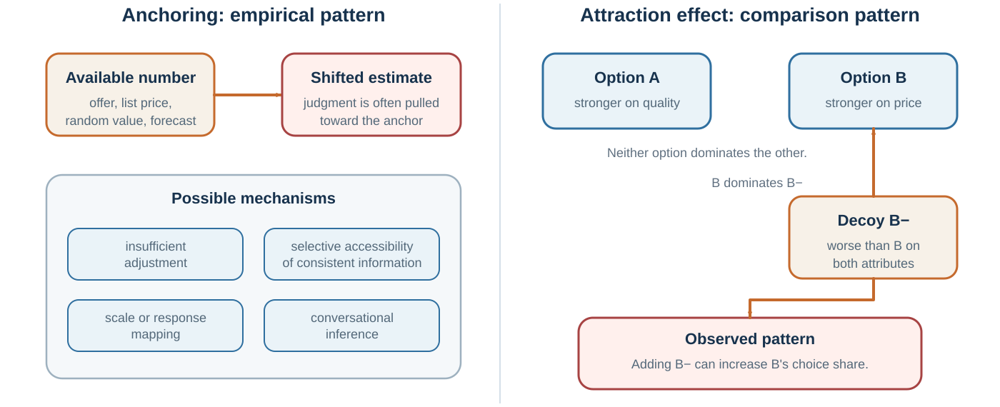

# Anchors, Halos, Decoys, and Escalation

*How initial values, global impressions, comparison sets, and prior investment bend judgment*

::: {.callout-note .core-idea icon=false}
## Core Idea

The first number, first impression, surrounding options, and money already spent can redraw what feels plausible - unless the process establishes independent estimates, separate criteria, and forward-looking exit rules.
:::

## Learning goals

- Explain anchoring and insufficient adjustment.
- Explain halo and horn effects.
- Describe asymmetric dominance and context-dependent choice.
- Distinguish sunk costs from future costs and benefits.

Anchoring occurs when an initial value influences later judgment, even if the initial value is arbitrary or irrelevant. Tversky and Kahneman (1974) demonstrated anchoring by spinning a wheel of fortune rigged to land on either 10 or 65. Participants then estimated the percentage of African countries in the United Nations. Those who saw 65 gave higher estimates than those who saw 10, even though the number was random.

Anchoring is powerful because uncertain judgments need starting points. Once a starting point appears, people often adjust insufficiently away from it. Anchors can also make anchor-consistent information more accessible (Mussweiler & Strack, 1999; Strack & Mussweiler, 1997). If asked whether Gandhi was older or younger than 140 when he died, people know 140 is absurd, but it may still pull estimates upward compared with a lower anchor.

Anchors influence prices, salary negotiations, legal judgments, performance evaluations, forecasts, and self-assessments. A first offer in negotiation can shape the entire bargaining range. A list price influences perceived value. A suggested donation changes contributions. A manager’s initial performance rating influences later discussion. A budget from last year anchors this year’s budget. A project timeline proposed early becomes the reference point, even if it was invented under uncertainty.

Ariely, Loewenstein, and Prelec (2003) showed that even arbitrary anchors, such as the last two digits of a social security number, could influence willingness to pay for consumer goods. Participants first considered whether they would pay an amount equal to those digits, then stated their maximum willingness to pay. Higher arbitrary numbers led to higher valuations. The result illustrates how fragile valuation can be when people lack stable reference points.

Anchoring is not always irrational. In many situations, first estimates contain useful information. If an expert provides a starting estimate, it may be reasonable to use it. The problem is that anchors influence judgment even when they are irrelevant, extreme, strategic, or weakly justified.

Anchoring is especially important in negotiation. A high first offer can pull the final agreement upward; a low first offer can pull it downward. This will be developed in the negotiation chapters. For now, the point is broader: the first number gets a vote.

A useful corrective is to generate independent estimates before seeing anchors. In meetings, ask participants to write down estimates privately before discussion. In negotiations, prepare your own target, reservation point, and market data before hearing the other side’s offer. In budgeting, use bottom-up analysis and outside benchmarks rather than simply adjusting last year’s number. In forecasting, ask for multiple reference classes.

Other questions include:

What anchor may be influencing me? Was the anchor informative or arbitrary? What estimate would I make if I had not seen that number? What are independent sources of evidence? What range is plausible before negotiation begins? Am I adjusting enough?

Anchoring shows that judgment often begins before evidence has been fully evaluated. A number enters the room, and the room changes.

## Halo and horn effects

{#fig-anchor-decoy fig-alt="Two-panel diagram showing insufficient adjustment from an anchor and a decoy making one option appear dominant."}

The halo effect occurs when an overall impression influences judgments of specific traits. A positive impression in one area spills over into unrelated judgments. A negative impression can produce a “horn effect,” where one negative quality colors everything else (Thorndike, 1920).

A charismatic person is judged as more competent. An attractive person is judged as more intelligent or kind. A prestigious university makes a candidate seem more capable. A successful company is assumed to have visionary leadership, strong culture, and superior strategy. A disliked politician’s voice, appearance, and competence are all judged more harshly. A confident CEO is perceived as more capable even when confidence is not evidence.

The halo effect reflects the mind’s preference for coherence. It is uncomfortable to hold mixed impressions: brilliant but unethical, warm but incompetent, confident but careless, prestigious but poorly suited, successful but lucky. System 1 tends to form coherent stories quickly. Once the overall impression forms, later evidence is interpreted in its light.

Solomon Asch’s classic work on impression formation showed that the order and valence of traits shape overall impressions. A person described as intelligent, industrious, impulsive, critical, stubborn, and envious is judged differently from a person described with the same traits in reverse order (Asch, 1946). Early information shapes the frame through which later information is interpreted.

Nisbett and Wilson (1977a) demonstrated a halo effect in evaluations of a lecturer. Participants watched the same instructor behave either warmly or coldly. Those who saw the warm version rated not only his personality but also his appearance, mannerisms, and accent more favorably. They often did not realize that their global impression had influenced specific judgments.

In organizations, halo effects distort performance evaluation. A high-performing employee in one visible area may be assumed strong in leadership, teamwork, or judgment. A person who makes one mistake may be downgraded globally. A company with strong financial performance may be assumed to have excellent leadership, even if external conditions or luck played a large role. Rosenzweig (2007) warned that business analysis often suffers from the halo effect: when companies perform well, observers infer superior strategy, culture, leadership, and execution; when performance falls, the same practices are reinterpreted negatively.

Halo effects are dangerous in hiring. Interviewers often form first impressions quickly and then ask questions that confirm them. A candidate who feels impressive early may receive easier interpretation of later answers. A candidate who begins awkwardly may struggle to recover. This is why structured interviews, predefined criteria, and independent ratings matter.

The halo effect also connects with confirmation bias. Once a coherent impression forms, people seek and interpret evidence in ways that preserve it. A good person’s ambiguous action is given a generous interpretation. A bad person’s ambiguous action is judged harshly.

A useful corrective is to evaluate dimensions separately. In hiring, rate technical skill, communication, reliability, learning ability, and teamwork independently before forming an overall score. In performance reviews, use concrete evidence for each criterion. In strategy, separate outcome quality from process quality. In evaluating leaders, separate charisma from judgment, confidence from competence, and success from skill.

Ask:

What is my overall impression? Which specific judgments might it be influencing? What evidence supports each trait separately? Would I interpret this behavior differently if I had a different overall impression? Am I allowing one visible strength or weakness to define the whole person?

Halo effects simplify the social world. They also flatten it. Good judgment restores texture.

## The decoy changes the comparison

Some biases arise not from what an option is, but from what it is compared with.

The decoy effect, also called the attraction effect or asymmetric dominance effect, occurs when adding an inferior option changes preferences between existing options (Huber et al., 1982). Suppose a customer is choosing between a cheaper online subscription and a more expensive print-plus-online subscription. If a print-only subscription is added at the same price as print-plus-online, it is clearly inferior. Rationally, it should not be chosen. Yet its presence can make the print-plus-online option look like a better deal and increase its choice share.

The decoy works because people often evaluate value relatively. They may not know whether print-plus-online is worth the price in absolute terms. But compared with print-only at the same price, it looks attractive. The decoy creates an easy comparison.

This bias connects directly to the next chapter on framing and to the later behavior-design chapter, but it belongs here because it shows a broader principle: preferences are often constructed in context. The rational choice model assumes that preferences are stable enough that adding an irrelevant option should not reverse choices. The decoy effect shows that comparison sets can shape valuation.

Context effects appear in many decisions. A restaurant may include an extremely expensive wine to make other expensive wines look reasonable. A company may offer a premium package to make the middle package attractive. A negotiator may present an unattractive option to make another option seem like a concession. A university may compare its tuition to a more expensive peer rather than a cheaper alternative.

Not all contextual comparison is manipulative. Comparison can help people understand value. But when irrelevant or dominated options steer choice, decision-makers should be cautious.

Ask:

What option is serving as the comparison point? Would I choose the same option if the decoy were removed? Is this alternative actually relevant? Am I evaluating absolute value or relative attractiveness? Who designed the comparison set?

The decoy effect shows that preferences do not always exist fully formed before choice. Sometimes the menu helps create them.

## Planning fallacy, sunk costs, and escalation

Some biases unfold over time. They do not merely affect one judgment; they shape projects, investments, careers, relationships, and organizations.

The planning fallacy is the tendency to underestimate how long tasks will take, how much they will cost, or how difficult they will be, even when similar tasks have taken longer or cost more in the past (Buehler et al., 1994; Kahneman & Tversky, 1979). People focus on the specific plan and imagine a smooth path. They underweight delays, coordination failures, revisions, illness, competing priorities, and unexpected problems.

This is the inside view. The outside view asks what happened in similar cases. Kahneman and Lovallo (1993) argued that decision-makers often take the inside view because it feels rich and detailed, while the outside view feels impersonal. But the outside view is often more accurate. Lovallo and Kahneman (2003) described how executives suffer from “delusions of success,” overestimating benefits and underestimating costs in major initiatives.

The planning fallacy appears in student papers, software projects, home renovations, public infrastructure, mergers, product launches, and policy reforms. A team says, “This time is different.” Sometimes it is. Usually, not as much as the team thinks.

The sunk cost fallacy occurs when people continue an endeavor because of past investment rather than future costs and benefits. Rationally, sunk costs are already gone and should not determine whether to continue. The question should be: given where we are now, what future action has the best expected value? But psychologically, abandoning a project can feel like wasting the past.

Arkes and Blumer (1985) demonstrated sunk cost effects in experiments and field-like scenarios. People were more likely to continue when they had invested money, effort, or time, even when future benefits did not justify continuation. Sunk costs matter because they are tied to regret, responsibility, identity, and the desire to avoid admitting error.

Escalation of commitment is the organizational version. Staw (1976) found that people responsible for an initial investment were more likely to allocate additional resources after negative feedback. Staw (1981) described escalation as driven by self-justification, sunk costs, social pressure, and institutional inertia. Projects continue because stopping would make earlier choices look wrong.

Escalation is common in failing strategies. A company keeps investing in a declining product. A government continues a troubled project because cancellation would be embarrassing. A person stays in a bad relationship because of years already invested. A student continues a degree they dislike because they have already spent so much time. A leader doubles down because reversal would signal weakness.

Persistence is not always bias. Many valuable projects face setbacks. Quitting too early can be a mistake. The challenge is distinguishing justified persistence from self-justifying escalation.

Useful questions include:

If we had not already invested, would we start now? What future benefits justify future costs? What evidence would make us stop? Who is responsible for the original decision, and does that affect judgment? Are we continuing to create value or to avoid admitting loss? Can an independent reviewer evaluate continuation?

A powerful tool is to define exit criteria in advance. Before launching a project, specify what evidence would lead to stopping, pivoting, or scaling. Once identity and sunk costs accumulate, stopping becomes harder.

Planning fallacy, sunk cost bias, and escalation show that biases are not only momentary errors. They can become life paths.

## Biases become organizational routines

Many people assume groups reduce bias because multiple perspectives are present. Sometimes they do. Groups can correct individual blind spots, pool information, and challenge weak reasoning. But groups can also amplify biases.

Group discussions often begin with anchors. The first person to speak, the highest-status person, or the initial proposal can shape the entire conversation. Confirmation bias can become collective when teams search for evidence supporting a preferred strategy. Self-serving bias can become departmental: marketing blames operations, operations blames sales, sales blames product, and everyone protects their own identity. Overconfidence can become cultural when success is attributed to superior talent rather than favorable conditions.

Janis (1972) described groupthink as a pattern in cohesive groups where the desire for unanimity suppresses dissent and realistic evaluation. Groups may develop illusions of invulnerability, rationalize warnings, pressure dissenters, and assume moral superiority. The concept has been debated, but the warning remains important: harmony can become a bias.

Groups also often fail to share unique information. Stasser and Titus (1985) found that groups tend to discuss information already known to all members rather than unique information held by individual members. This “common information effect” can undermine group decisions, because the very reason to have a group—distributed knowledge—is not fully used.

Organizational incentives can sustain bias. If leaders punish bad news, employees confirm optimism. If promotions reward confidence, overconfidence spreads. If metrics reward short-term output, long-term risk is ignored. If dissent is labeled disloyal, groupthink grows. If past investments are tied to status, sunk cost escalation becomes normal.

Biases are therefore not only inside heads. They are embedded in systems.

A biased organization is not simply an organization with biased people. It is an organization whose routines, incentives, hierarchies, metrics, and stories systematically bend judgment.

To reduce organizational bias, change the process:

Ask for independent estimates before discussion. Assign someone to search for disconfirming evidence. Use premortems before major projects. Track forecasts and outcomes. Separate idea generation from idea evaluation. Reward people for updating beliefs. Use structured interviews in hiring. Rotate devil’s advocate roles. Invite lower-status voices early. Make exit criteria explicit before investment.

Better judgment requires better architecture.

## Redesigning the process

Learning about biases can produce a dangerous side effect: people become good at seeing bias in others and bad at seeing it in themselves.

This is why awareness is not enough. Merely knowing the name of a bias does not eliminate it. In some cases, it may even increase confidence: “I know about biases, so I must be less biased.” The bias blind spot warns against that.

Debiasing requires changing process, not just intention.

Larrick (2004) reviewed debiasing strategies and emphasized that different biases require different corrections. Arkes (1991) argued that some biases can be reduced by warnings, feedback, incentives, training, or decision aids, but effectiveness depends on the bias. Soll, Milkman, and Payne (2015) reviewed practical strategies and grouped them into approaches such as changing the decision-maker, changing the environment, and improving aggregation.

Several tools are especially useful.

Consider the opposite. For confirmation bias, deliberately ask why the preferred conclusion might be wrong. Lord and colleagues’ biased assimilation work inspired research showing that considering alternative possibilities can reduce some forms of bias (Lord et al., 1984). This is not the same as vague open-mindedness. It means actively generating reasons against one’s current view.

Use the outside view. For planning fallacy and overconfidence, compare the current case with a reference class of similar cases. Ask how long similar projects took, how much they cost, and how often they succeeded.

Make independent estimates before discussion. For anchoring and group influence, ask people to write estimates privately before hearing others. This prevents early numbers and high-status voices from dominating.

Predefine criteria. For hiring, investment, and evaluation, define criteria before seeing candidates or outcomes. This reduces halo effects, motivated criteria shifting, and post-hoc justification.

Use structured decision tools. Checklists, scoring rubrics, decision trees, and premortems can reduce reliance on memory and impression. They are not perfect, but they make reasoning visible.

Keep decision records. Decision journals preserve beliefs, predictions, assumptions, and emotions before outcomes are known. They help reduce hindsight bias and rationalization.

Separate roles. Assign one person to advocate, another to critique, another to track evidence, and another to monitor process. Role separation reduces the burden on one mind to do everything.

Create feedback. Biases persist when feedback is absent or ambiguous. Forecasting accuracy, hiring outcomes, project completion data, and negotiation results should be tracked.

Design incentives for truth. If people are punished for bad news, they will hide it. If they are rewarded for confidence, they will overstate certainty. If they are rewarded for learning, they are more likely to update.

The purpose of debiasing is not to make people perfectly rational. It is to make predictable error less likely.

The redesign becomes clearer when it is attached to a real workflow:

| Decision | Likely trigger and failure | Redesign before judgment |
| --- | --- | --- |
| Hiring | An impressive credential or first impression produces halo, similarity, and anchoring. | Define criteria first; ask the same structured questions; collect a work sample; score independently before discussion. |
| Investment | Money, reputation, and identity already committed sustain sunk-cost reasoning and escalation. | Set milestones and exit rules before investing; require an independent prospective review at each gate. |
| Exam preparation | Familiar notes and easy rereading produce fluency and overconfidence. | Use closed-book retrieval tests; allocate study time from errors rather than familiarity. |
| Negotiation | The first number redraws the plausible range. | Write a target, reservation point, and evidence-based range before hearing or stating an anchor. |
| Project planning | The vivid ideal plan hides the distribution of delays. | Begin with similar completed projects; run a premortem; add milestones and contingency based on that reference class. |
: From a likely bias to a changed decision process {#tbl-applied-bias-redesign}

Each intervention moves upstream. It changes what will be attended to, recorded, compared, or permitted before a persuasive story can settle the judgment. That is why process design is more reliable than asking people to “be unbiased.”

A useful closing question for any important decision is:

If this decision goes wrong, which bias will we later realize was obvious?

That question turns bias knowledge into prevention.

| Bias | Likely trigger | Process response |
| --- | --- | --- |
| Anchoring | First number or range | Generate an independent estimate first |
| Halo | Strong global impression | Score criteria separately before discussion |
| Decoy/context | Comparison set defines value | Remove dominated options; compare pairwise and absolutely |
| Escalation | Prior investment and identity | Ignore sunk cost; set prospective stop rules |
: Bias diagnosis should trigger a process change {#tbl-14-1}

## Key ideas

- The first number, first impression, surrounding options, and money already spent can redraw what feels plausible - unless the process establishes independent estimates, separate criteria, and forward-looking exit rules.
- Explain anchoring and insufficient adjustment.
- Explain halo and horn effects.
- Describe asymmetric dominance and context-dependent choice.

## Study and practice

1. How would you explain anchoring and insufficient adjustment?

2. How would you explain halo and horn effects?

3. What evidence and mechanism would you use to describe asymmetric dominance and context-dependent choice?

::: {.callout-tip .activity icon=false}
## Activity

Choose a hiring, budgeting, or purchasing decision. Create an independent estimate before seeing the anchor, separate the evaluation criteria, and write a stop rule based only on future consequences.  
EXPERIENCE - EXPLAIN - APPLY (MAXIMUM 120 WORDS)  
Experience: describe one specific decision, interaction, or observation. Explain: use one or two concepts from this chapter accurately. Apply: state one improvement, implication, or testable prediction.
:::

## References cited in this chapter

::: {.reference}
Ariely, D., Loewenstein, G., & Prelec, D. (2003). “Coherent arbitrariness”: Stable demand curves without stable preferences. Quarterly Journal of Economics, 118(1), 73–106.
:::

::: {.reference}
Arkes, H. R. (1991). Costs and benefits of judgment errors: Implications for debiasing. Psychological Bulletin, 110(3), 486–498.
:::

::: {.reference}
Arkes, H. R., & Blumer, C. (1985). The psychology of sunk cost. Organizational Behavior and Human Decision Processes, 35(1), 124–140.
:::

::: {.reference}
Asch, S. E. (1946). Forming impressions of personality. Journal of Abnormal and Social Psychology, 41(3), 258–290.
:::

::: {.reference}
Buehler, R., Griffin, D., & Ross, M. (1994). Exploring the planning fallacy: Why people underestimate their task completion times. Journal of Personality and Social Psychology, 67(3), 366–381.
:::

::: {.reference}
Huber, J., Payne, J. W., & Puto, C. (1982). Adding asymmetrically dominated alternatives: Violations of regularity and the similarity hypothesis. Journal of Consumer Research, 9(1), 90-98.
:::

::: {.reference}
Janis, I. L. (1972). Victims of groupthink. Houghton Mifflin.
:::

::: {.reference}
Kahneman, D., & Lovallo, D. (1993). Timid choices and bold forecasts: A cognitive perspective on risk taking. Management Science, 39(1), 17–31.
:::

::: {.reference}
Kahneman, D., & Tversky, A. (1979). Intuitive prediction: Biases and corrective procedures. TIMS Studies in Management Science, 12, 313–327.
:::

::: {.reference}
Larrick, R. P. (2004). Debiasing. In D. J. Koehler & N. Harvey (Eds.), Blackwell handbook of judgment and decision making (pp. 316–337). Blackwell.
:::

::: {.reference}
Lord, C. G., Lepper, M. R., & Preston, E. (1984). Considering the opposite: A corrective strategy for social judgment. Journal of Personality and Social Psychology, 47(6), 1231–1243.
:::

::: {.reference}
Lovallo, D., & Kahneman, D. (2003). Delusions of success: How optimism undermines executives’ decisions. Harvard Business Review, 81(7), 56–63.
:::

::: {.reference}
Mussweiler, T., & Strack, F. (1999). Hypothesis-consistent testing and semantic priming in the anchoring paradigm: A selective accessibility model. Journal of Experimental Social Psychology, 35(2), 136–164.
:::

::: {.reference}
Nisbett, R. E., & Wilson, T. D. (1977a). The halo effect: Evidence for unconscious alteration of judgments. Journal of Personality and Social Psychology, 35(4), 250–256.
:::

::: {.reference}
Rosenzweig, P. (2007). The halo effect: ... and the eight other business delusions that deceive managers. Free Press.
:::

::: {.reference}
Soll, J. B., Milkman, K. L., & Payne, J. W. (2015). A user’s guide to debiasing. In G. Keren & G. Wu (Eds.), The Wiley Blackwell handbook of judgment and decision making (pp. 924–951). Wiley Blackwell.
:::

::: {.reference}
Stasser, G., & Titus, W. (1985). Pooling of unshared information in group decision making: Biased information sampling during discussion. Journal of Personality and Social Psychology, 48(6), 1467–1478.
:::

::: {.reference}
Staw, B. M. (1976). Knee-deep in the big muddy: A study of escalating commitment to a chosen course of action. Organizational Behavior and Human Performance, 16(1), 27–44.
:::

::: {.reference}
Staw, B. M. (1981). The escalation of commitment to a course of action. Academy of Management Review, 6(4), 577–587.
:::

::: {.reference}
Strack, F., & Mussweiler, T. (1997). Explaining the enigmatic anchoring effect: Mechanisms of selective accessibility. Journal of Personality and Social Psychology, 73(3), 437–446.
:::

::: {.reference}
Thorndike, E. L. (1920). A constant error in psychological ratings. Journal of Applied Psychology, 4(1), 25–29.
:::

::: {.reference}
Tversky, A., & Kahneman, D. (1974). Judgment under uncertainty: Heuristics and biases. Science, 185(4157), 1124–1131.
:::
