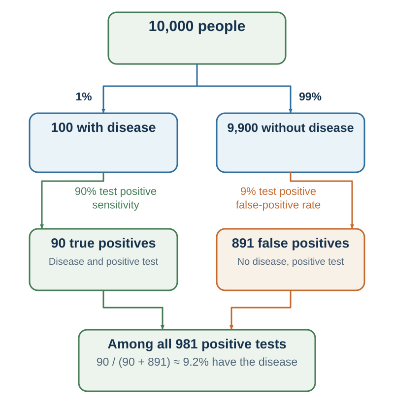

---
aliases:
  - 12-base-rates-randomness-and-calibration.html
---

# Base Rates, Conditional Probability, and Bayesian Updating

*A plausible story becomes a probability only after the event, denominator, and competing explanations are specified*

::: {.chapter-epigraph}
> “Given the number of times in which an unknown event has happened and failed …”
>
> — Thomas Bayes, [“An Essay towards Solving a Problem in the Doctrine of Chances”](https://doi.org/10.1098/rstl.1763.0053), 1763, p. 376
:::

::: {.callout-note .core-idea icon=false}
## Core Idea

Probability questions often arrive as persuasive stories, test results, or striking pieces of evidence. But no number can be interpreted safely when the event, denominator, reference class, or competing hypothesis has shifted, and the probability of evidence given a hypothesis is not the probability of the hypothesis given the evidence. Therefore, this chapter uses sets, natural frequencies, and Bayesian updating to keep the question stable and measure how well evidence distinguishes alternatives.
:::

## Learning goals

- Use complement, intersection, union, and conditional probability without changing the event or denominator.
- Translate a Bayesian update into natural frequencies and select defensible reference classes.
- Diagnose base-rate neglect, reversed conditionals, conjunction errors, and information dilution.

::: {.callout-note .loop-location icon=false}
## Where this chapter enters the loop

Probability disciplines **Predict**. It turns “this story feels likely” into defined events, comparable hypotheses, explicit denominators, and updates that remain answerable to evidence.
:::

A candidate passes a screening test that is described as “80 percent accurate.” How confident should the hiring committee be that the candidate will meet the performance standard? The number sounds decisive, but it does not yet answer the question. Eighty percent of *what*? How common are strong performers in the applicant pool? How often does the screen pass a weaker candidate? Was the test validated on a comparable population and outcome?

The committee's target is $P(\text{strong performance}\mid\text{positive screen})$. A report may instead provide $P(\text{positive screen}\mid\text{strong performance})$. Those quantities reverse the conditioning and use different denominators. The distinction is the spine of this chapter: before calculating, specify the event, comparison set, and process that produced the evidence.

## Probability begins with a model

A **sample space** $\Omega$ lists the elementary outcomes allowed by a model. An **event** $A$ is a subset of those outcomes. A probability measure assigns numbers satisfying

$$
0\le P(A)\le 1, \qquad P(\Omega)=1,
$$

and adds probabilities for mutually exclusive events. The notation cannot choose a good model for us. Calling a coin fair, successive observations independent, or an applicant pool comparable to the validation sample are substantive assumptions.

### Complement: preserve the event boundary

If $A^c$ means “not $A$,” then

$$
P(A^c)=1-P(A).
$$

If a project has a 0.70 probability of finishing by Friday, it has a 0.30 probability of not finishing by Friday under the same model. “Not finished by Friday” is not the same event as “the project fails.” A complement works only when the time horizon and outcome definition remain fixed.

### AND: use the conditional branch

For events $A$ and $B$,

$$
P(A\cap B)=P(A)P(B\mid A).
$$

If the events are independent, $P(B\mid A)=P(B)$. Independence is not the same as mutual exclusivity. Rain and traffic delay can occur together and may be dependent. Two cards drawn without replacement are dependent because the first draw changes the deck.

### OR: restore the overlap

For “$A$ or $B$ or both,”

$$
P(A\cup B)=P(A)+P(B)-P(A\cap B).
$$

The subtraction prevents double counting. A project can be delayed by a supplier problem, a software problem, or both. Adding the separate probabilities as though the routes were disjoint exaggerates total risk; considering only the most vivid route understates it.

## Conditional direction matters

Provided $P(B)>0$,

$$
P(A\mid B)=\frac{P(A\cap B)}{P(B)}.
$$

“How often does the test turn positive among people with the condition?” is not “How often do people with a positive test have the condition?” The first conditions on the condition; the second conditions on the positive tests.

The same reversal appears in court. A one-in-a-million probability of a DNA profile among unrelated people is not a one-in-a-million probability that a matched defendant is innocent. The latter depends on how the suspect was selected, how many people were compared, laboratory error, relatedness, the prior probability of different sources, and the rest of the case (Thompson & Schumann, 1987).

Conditional probability also makes independence explicit. Events are independent when learning one does not change the probability of the other. Zero correlation is not generally equivalent to independence: it rules out one linear relationship, not every probabilistic dependence.

## Bayes' rule restores the alternatives

If $A$ and $A^c$ partition the cases, total probability rebuilds the denominator:

$$
P(B)=P(B\mid A)P(A)+P(B\mid A^c)P(A^c).
$$

Bayes' rule then reverses the conditioning without reversing the evidence:

$$
P(A\mid B)=
\frac{P(B\mid A)P(A)}
{P(B\mid A)P(A)+P(B\mid A^c)P(A^c)}.
$$

The prior $P(A)$ gives the starting prevalence. The likelihood $P(B\mid A)$ asks how compatible the evidence is with $A$. The competing likelihood $P(B\mid A^c)$ asks how often the same evidence appears without $A$. The posterior is the updated belief (Bayes, 1763).

Bayes' rule cannot rescue a poor hypothesis set. Missing alternatives, selected samples, changing environments, weak measurements, and uncertain parameters remain problems. A posterior is precise only conditional on the model and inputs that produced it.

{#fig-probability-judgment-map fig-alt="Three-panel diagram. Panel one gives complement, AND, and OR probability rules. Panel two follows 10,000 people through a one-percent disease base rate, ninety-percent sensitivity, and nine-percent false-positive rate to show 90 true positives and 891 false positives, so 90 of 981 positive tests are true positives. Panel three shows a cycle from a numerical forecast to an observed outcome, a Brier score, and an updated forecast." width=100%}

## Natural frequencies make Bayes visible

Suppose 1 percent of a population has a disease. A test is positive for 90 percent of people who have it and for 9 percent of people who do not. A person tests positive. The tempting answer is 90 percent, but that is $P(+\mid D)$ rather than $P(D\mid +)$.

Imagine 10,000 people:

- 100 have the disease; 90 test positive.
- 9,900 do not; 891 test positive.
- Of 981 positive tests, 90 are true positives.

Therefore,

$$
P(D\mid +)=\frac{90}{90+891}=\frac{90}{981}\approx 0.0917.
$$

Natural frequencies preserve the nested sets and denominator, often making Bayesian reasoning more transparent than isolated percentages (Gigerenzer & Hoffrage, 1995). They do not solve measurement error or transportability; they make the assumed structure visible.

### Worked update: the same screen in two applicant pools

Return to the hiring screen. Suppose, for teaching purposes, that 20% of applicants in a broad pool would meet a clearly defined performance standard, the screen passes 80% of those future strong performers, and it also passes 30% of the others. Among 10,000 applicants:

- 2,000 would meet the standard; 1,600 pass the screen.
- 8,000 would not; 2,400 nevertheless pass.
- Of 4,000 positive screens, 1,600 are true positives.

Under those assumptions, $P(\text{strong performance}\mid\text{positive screen})=1{,}600/4{,}000=0.40$. The screen can be meaningfully informative—it raises the probability from 20% to 40%—without making a positive result decisive.

Now place the same screen in a carefully preselected pool where 50% would meet the standard. If its sensitivity and false-positive rate transport unchanged, then among 10,000 applicants it produces 4,000 true positives and 1,500 false positives, so the posterior is about 72.7%. Nothing about the assumed test characteristics changed; the starting population did. This is why an “80% sensitivity” claim cannot travel on its own: the receiving population and the transportability of both error rates are part of its meaning.

## Reference classes are judgment calls

A base rate is only as useful as its reference class. Should a start-up be compared with all new firms, firms in the same sector, firms at the same funding stage, or firms with similarly experienced founders? A narrow class may be more relevant but noisier. A broad class is more stable but less tailored.

Base-rate neglect is more likely when individuating detail feels causal and the statistic feels incidental (Bar-Hillel, 1980). The outside view therefore begins with comparable cases before explaining why the focal case differs (Kahneman & Lovallo, 1993). A defensible analysis reports several nested classes, shows whether the conclusion changes, and identifies which differences are genuinely diagnostic. “This case is unique” is a hypothesis, not a denominator.

Return to hiring. The base rate should concern future performance under the organization's role, support, and criterion—not an undefined pool of “talent.” The screen's sensitivity and false-positive rate must come from a comparable applicant population. If the criterion rewards manager similarity rather than job output, the posterior can be mathematically correct and substantively wrong.

[]{#research-lens-conjunction-disjunction-and-dilution}

::: {.callout-note .research-lens icon=false}
## Research Lens: conjunction, disjunction, and dilution

The resemblance chapter showed why a coherent story can feel probable. Probability supplies a non-negotiable set relation:

$$
P(A\cap B)\le P(A), \qquad P(A\cup B)\ge P(A).
$$

Adding a condition makes the event a subset. “A bank teller active in a social movement” cannot be more probable than “a bank teller,” however well the detail matches the description (Tversky & Kahneman, 1983). By contrast, adding alternative routes expands a union. The probability that a project is delayed by *at least one* of several causes cannot be smaller than the probability of any single route, though overlaps must be handled rather than simply added.

More detail is not always more information. Weakly diagnostic detail can dilute attention to stronger evidence. Sivanathan and Kakkar (2017) found that adding minor side effects to serious drug side effects could reduce perceived overall severity. The ethical response is not to hide minor effects. It is to group evidence by severity, probability, and decision relevance so completeness does not destroy structure.
:::

::: {.callout-tip icon=false}
## Check your denominator

For each prompt, write the target conditional before answering.

1. Seventy percent of successful trainees used a practice platform. What additional quantities are needed to estimate the probability of success among platform users?
2. Ten percent of projects suffer supplier delay and 12% suffer software delay. What must be known before adding the percentages?
3. A screen validated in experienced applicants is applied to entry-level applicants. Which part of the Bayesian model may no longer transport?

A complete answer names the conditioning event, denominator, relevant overlap or alternative, and at least one assumption about how the evidence was generated.
:::

::: {.callout-caution .evidence-boundary icon=false}
## Evidence Boundary

A Bayesian posterior is conditional on its prior, likelihoods, measurement, hypothesis set, and sampling process. It does not turn a contestable reference class into an objective fact or a predictive association into a causal effect.
:::

## Practice Lab

Take one positive test, screening result, warning signal, or performance indicator. Produce a one-page **Bayesian audit** using a population of 10,000. State the target conditional probability, choose and defend two plausible reference classes, show true positives and false positives under each, and identify one omitted alternative or measurement problem. The observable output is the two natural-frequency trees and a decision rule that states what action changes at which posterior range.

## Take it forward

- **Use this when:** a test result, vivid detail, or “accuracy” statistic is being treated as a posterior probability.
- **Do not infer:** that the reverse conditional is equal, that a narrow reference class is automatically better, or that a precise posterior proves causation.
- **Try this next:** put every case into one shared denominator and ask how often the evidence appears under the leading alternative.

## References cited in this chapter

::: {.reference}
Bar-Hillel, M. (1980). The base-rate fallacy in probability judgments. *Acta Psychologica, 44*(3), 211–233.
:::

::: {.reference}
Bayes, T. (1763). An essay towards solving a problem in the doctrine of chances. *Philosophical Transactions of the Royal Society of London, 53*, 370–418.
:::

::: {.reference}
Gigerenzer, G., & Hoffrage, U. (1995). How to improve Bayesian reasoning without instruction: Frequency formats. *Psychological Review, 102*(4), 684–704.
:::

::: {.reference}
Kahneman, D., & Lovallo, D. (1993). Timid choices and bold forecasts: A cognitive perspective on risk taking. *Management Science, 39*(1), 17–31.
:::

::: {.reference}
Sivanathan, N., & Kakkar, H. (2017). The unintended consequences of argument dilution in direct-to-consumer drug advertisements. *Nature Human Behaviour, 1*, 797–802.
:::

::: {.reference}
Thompson, W. C., & Schumann, E. L. (1987). Interpretation of statistical evidence in criminal trials: The prosecutor's fallacy and the defense attorney's fallacy. *Law and Human Behavior, 11*(3), 167–187.
:::

::: {.reference}
Tversky, A., & Kahneman, D. (1983). Extensional versus intuitive reasoning: The conjunction fallacy in probability judgment. *Psychological Review, 90*(4), 293–315.
:::
