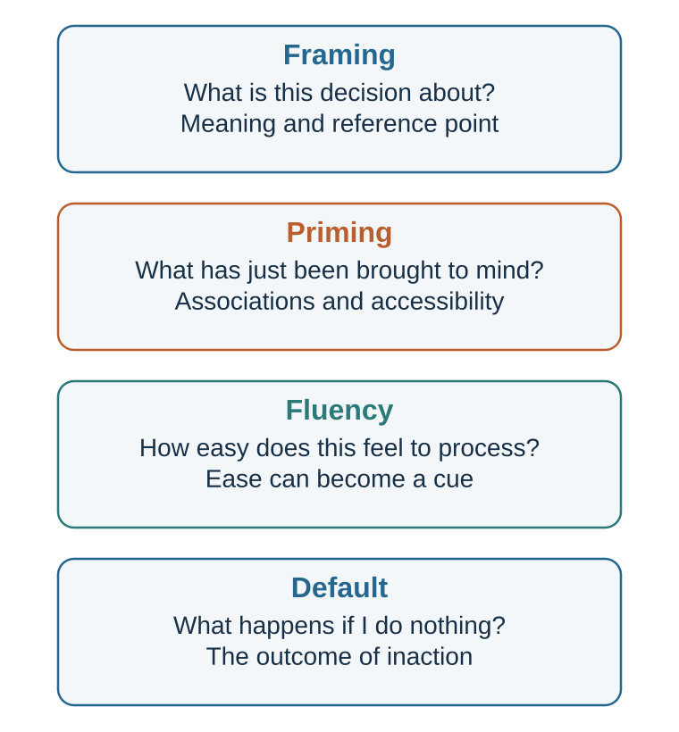

# Framing: When the Same Facts Become Different Decisions

*Facts arrive with attention, meaning, reference points, and implied causality*

::: {.callout-note .core-idea icon=false}
## Core Idea

A frame is not decorative wording. It defines what the decision is about, which outcomes are gains or losses, and which causes and responsibilities become visible.
:::

## Learning goals

- Distinguish framing from priming, fluency, and choice architecture.
- Explain attribute, goal, and risky-choice framing.
- Explain how questions frame the answer space.
- Use complementary frames ethically.

A frame is not merely wording. It is a structure of attention and meaning.

When information is framed, some features become focal. Others fade into the background. A “90% survival” frame directs attention to success, hope, and treatment benefit. A “10% mortality” frame directs attention to danger, loss, and possible regret. A “public investment” frame directs attention to future benefits. A “tax burden” frame directs attention to cost. A “conflict” frame directs attention to winners and losers. A “problem-solving” frame directs attention to interests and solutions.

Framing works because attention is limited, as earlier chapters showed. People cannot attend to every aspect of a situation at once. A frame helps decide what the situation is “about.” Once that is decided, prediction and valuation follow. If a policy is framed as protection, people ask whether it protects enough. If it is framed as restriction, they ask whether it limits freedom too much. If a negotiation is framed as a battle, people look for leverage. If it is framed as joint problem-solving, they look for interests.

Framing also works because valuation is reference-dependent. A change can be experienced as a gain or a loss depending on the reference point. A salary of €60,000 may feel generous to someone expecting €50,000 and disappointing to someone expecting €70,000. A grade of 80 may feel like success after expecting 70 and failure after expecting 90. The number did not change; the reference frame did.

Tversky and Kahneman’s classic work showed that people often make different choices depending on whether outcomes are framed as gains or losses (Tversky & Kahneman, 1981). This finding became central to prospect theory and reference-dependent choice. For now, the important point is simpler: the psychological meaning of an outcome depends on how the outcome is represented.

Framing differs from priming. Priming, discussed in the next chapter, concerns the activation of ideas, goals, identities, or associations before judgment. Framing concerns the way the decision or information itself is described and organized. A person can be primed with the idea of safety before evaluating a policy. The policy can also be framed as a safety issue. These can overlap, but they are not identical.

Framing also differs from cognitive ease. Cognitive ease concerns how fluently information is processed. A frame may be easy or difficult, but framing is about meaning. “90% survival” and “10% mortality” are both easy to process; they differ in what they emphasize.

Framing differs again from choice architecture. Choice architecture concerns the design of the decision environment: defaults, option order, friction, reminders, salience, and feedback. Framing is one tool that can be used inside choice architecture, but the two should not be collapsed. A form can frame organ donation as “saving lives,” while the default can be opt-in or opt-out. The frame shapes meaning; the default shapes what happens if the person does nothing.

The frame is not decoration. It is part of the decision.

## Equivalent facts, different meanings

{#fig-context-mechanisms fig-alt="Four cards distinguish framing, priming, fluency, and defaults by the question each mechanism answers."}

The clearest framing effects occur when two descriptions are logically equivalent but psychologically different.

One classic category is attribute framing. An object or outcome is described in positive or negative terms, even though the underlying information is the same. Levin and Gaeth (1988) found that people evaluated beef more favorably when it was labeled “75% lean” than when it was labeled “25% fat.” The two labels are equivalent. But “lean” directs attention to health and quality, while “fat” directs attention to unhealthiness and excess.

Attribute framing is everywhere.

A yogurt is “90% fat-free” rather than “10% fat.” A product is “95% effective” rather than “5% ineffective.” A university has a “70% employment rate” rather than a “30% nonemployment rate.” A fund has “low volatility” rather than “limited upside.” A team has “strong continuity” rather than “little new talent.” A candidate is “experienced” rather than “old.” A strategy is “bold” rather than “risky.”

Attribute frames influence evaluation because they provide an interpretive label. They tell the mind what feature matters.

Another category is goal framing, where messages emphasize either the benefits of performing an action or the costs of failing to perform it. For example, a health message might say, “If you exercise regularly, you improve your heart health,” or “If you do not exercise regularly, you increase your risk of heart disease.” Rothman and Salovey (1997) argued that gain-framed messages may be more effective for prevention behaviors, while loss-framed messages may be more effective for detection behaviors, though later research shows that effects depend on behavior type, audience, and context. Meta-analyses suggest that framing can influence health behavior, but effects are often modest and variable (Gallagher & Updegraff, 2012; O’Keefe & Jensen, 2007).

Goal framing matters because it changes motivation. A gain frame says, “Here is what you can obtain.” A loss frame says, “Here is what you may lose.” The same action becomes pursuit or avoidance.

A third category is risky-choice framing. Here, choices involving uncertainty are described in terms of gains or losses. Tversky and Kahneman’s “Asian disease problem” is the classic example. Participants were told to imagine a disease expected to kill 600 people. In the gain frame, one program would save 200 people for sure, while another had a one-third chance of saving all 600 and a two-thirds chance of saving none. In the loss frame, one program would result in 400 deaths for sure, while another had a one-third chance that nobody would die and a two-thirds chance that all 600 would die. The outcomes were logically equivalent, but preferences changed. People tended to be risk averse in the gain frame and risk seeking in the loss frame (Tversky & Kahneman, 1981).

The psychological pattern is powerful: people often prefer a sure gain over a gamble but prefer a gamble over a sure loss. Losses make risk more attractive because risk offers a chance to avoid the loss. This gain–loss asymmetry is one of prospect theory’s central patterns.

Medical decisions provide especially important examples. McNeil and colleagues (1982) found that people’s preferences between surgery and radiation therapy for lung cancer changed depending on whether outcomes were described in survival terms or mortality terms. Surgery looked more attractive when framed by survival rates and less attractive when framed by early mortality. The statistics were equivalent, but the frame changed the emotional and evaluative meaning.

This raises an ethical issue. If equivalent frames produce different choices, which frame should doctors, managers, policymakers, or educators use? The answer cannot be “the neutral frame,” because there may be no perfectly neutral frame. Every description highlights something. Ethical framing requires helping people see multiple relevant frames rather than quietly steering them through one.

A doctor might say: “This can be described two ways. About 90 out of 100 patients survive this procedure, and about 10 out of 100 do not. Let us discuss what those numbers mean for you.” Presenting both frames can reduce manipulation and support informed judgment.

Equivalent facts can become different decisions because people do not process equivalence abstractly. They process meaning.

## Questions that contain an answer

Some frames are not just descriptions. They are questions that shape the answer.

A restaurant server can ask, “Do you want an egg with your ramen?” Or the server can ask, “Would you like one egg or two?” The second question assumes the decision to add eggs and shifts attention to quantity. The customer can still say no, but the frame changes what feels normal.

A salesperson can ask, “Do you want to buy today?” Or they can ask, “Would you prefer delivery this week or next week?” The second question assumes purchase. A manager can ask, “Should we do this?” Or, “How can we make this work?” The second question assumes commitment and shifts attention from whether to how.

Questions are frames because they define the decision space.

This matters in surveys, interviews, negotiations, medicine, and management. A survey that asks, “How much do you support protecting local jobs from foreign competition?” may produce different responses from one that asks, “How much do you support restricting consumer access to lower-priced imports?” Both may refer to the same policy. The first highlights workers. The second highlights consumers.

Schuman and Presser (1981) showed that survey responses can be sensitive to question wording, order, and context. Even small wording differences can change what respondents consider relevant. In political psychology and communication research, framing is central because public opinion often depends on which considerations are made salient (Chong & Druckman, 2007; Druckman, 2001).

In organizations, leaders frame problems through the questions they ask. A leader who asks, “Who is responsible for this failure?” creates a blame frame. A leader who asks, “What did our system make likely?” creates a learning frame. A leader who asks, “How do we cut costs?” gets different ideas from one who asks, “How do we create more value with the same resources?” A leader who asks, “Why are employees resisting?” gets different answers from one who asks, “What information, incentives, or fears might make this change look unattractive?”

Questions direct search. Search produces evidence. Evidence shapes judgment.

This is why problem framing is often more important than problem solving. A well-framed problem points toward useful solutions. A poorly framed problem traps attention.

Consider a company with declining sales. If the problem is framed as “Our salespeople are not working hard enough,” attention goes to effort, incentives, monitoring, and discipline. If framed as “Customers no longer see enough value,” attention goes to product, market fit, service, price, and competition. If framed as “Our brand is losing relevance,” attention goes to identity, communication, and customer meaning. Each frame makes some causes and solutions visible while hiding others.

No frame is complete. Better decision-making often requires reframing:

What problem are we solving? What would this look like from the customer’s perspective? What would this look like from the employee’s perspective? What would this look like if we assumed the people involved are rational from their own point of view? What frame makes the hidden trade-off visible? What frame are we avoiding because it is uncomfortable?

Reframing is not wordplay. It is changing the mental model of the situation.

## Framing memory and causality

Frames do not only influence choices about the future. They can also shape memory of the past.

Loftus and Palmer’s classic study showed participants films of car accidents and asked them to estimate speed. The wording of the question mattered. Participants gave higher speed estimates when asked how fast the cars were going when they “smashed” into each other than when asked how fast they were going when they “hit” each other. In a later memory question, those who heard stronger wording were more likely to report seeing broken glass, even though there was none (Loftus & Palmer, 1974).

The question framed the event. “Smashed” suggested severity, force, and damage. The frame influenced not only judgment but memory reconstruction.

This does not mean memory is completely invented. It means memory is reconstructive. People remember through schemas, expectations, language, and later information (Bartlett, 1932; Loftus, 2005). A question can provide a frame that shapes what seems to have happened.

This matters for eyewitness testimony, workplace investigations, performance reviews, customer feedback, and interpersonal conflict.

A manager asks, “Why did you ignore the client’s concern?” That question frames the behavior as neglect. The employee may become defensive. Another manager asks, “What happened when the client raised the concern?” This frame leaves more room for explanation. A parent asks, “Why were you careless?” rather than “What made this difficult?” A negotiator asks, “Why did you make such an unreasonable demand?” rather than “What constraint led you to that proposal?”

Questions can smuggle causality into the conversation.

Framing also affects responsibility. If a project fails, it can be framed as a people problem, process problem, incentive problem, strategy problem, market problem, or learning problem. Each frame assigns responsibility differently. A “human error” frame directs attention to individual mistakes. A “system failure” frame directs attention to training, workload, incentives, communication, design, and safeguards.

In safety-critical industries, the difference is crucial. A blame frame may produce fear and concealment. A systems frame may produce learning. This does not mean individuals are never responsible. It means that responsibility frames shape what gets investigated.

Moral judgment is also frame-sensitive. A policy can be framed as protecting vulnerable people or as restricting freedom. A company decision can be framed as efficiency or betrayal. A whistleblower can be framed as disloyal or courageous. A protest can be framed as disorder or democratic expression. Each frame changes which moral values become salient.

Entman (1993) famously defined framing in communication as selecting some aspects of perceived reality and making them more salient in a text, thereby promoting particular problem definitions, causal interpretations, moral evaluations, and treatment recommendations. This definition is useful because it shows that frames do four things: define problems, diagnose causes, make moral judgments, and suggest remedies.

For decision-making, this means that frames do not merely describe situations. They guide the entire chain from attention to action.

## Framing in management, negotiation, and policy

Framing is especially powerful in organizations because leaders often control the language of decision-making.

A performance problem can be framed as laziness, lack of skill, poor incentives, unclear goals, overload, bad tools, weak leadership, or low trust. Each frame implies a different solution. If the frame is laziness, the solution is pressure. If the frame is lack of skill, the solution is training. If the frame is unclear goals, the solution is alignment. If the frame is low trust, the solution is relationship repair.

A strategic initiative can be framed as cost, investment, experiment, threat response, mission fulfillment, or prestige. Each frame changes how people evaluate it. “Cost” invites cutting. “Investment” invites patience. “Experiment” invites learning. “Threat response” invites urgency. “Mission fulfillment” invites identity. “Prestige” invites status motives.

Negotiation is also shaped by frames. If a negotiation is framed as a battle, the goal is to win. The other side becomes an opponent. Information is hidden. Concessions feel like weakness. If framed as joint problem-solving, the goal is to understand interests and create value. The other side becomes a counterpart. Information may become useful. Concessions can be traded across issues.

This does not mean all negotiations should be naive or cooperative. Some negotiations are distributive and require value claiming. But the frame determines what negotiators look for. A battle frame may prevent integrative possibilities from being discovered. A problem-solving frame may create value but can expose one side if the other is purely exploitative. Skilled negotiators frame consciously and adaptively.

Frames also shape conflict. A disagreement can be framed as disrespect, incompetence, diversity of perspective, misunderstanding, or useful challenge. A team that frames dissent as disloyal will suppress information. A team that frames dissent as contribution will learn more. Edmondson’s work on psychological safety shows that teams need climates where people feel able to speak up with concerns, questions, and mistakes (Edmondson, 1999, 2019). Framing disagreement as learning rather than threat is one way to support such climates.

Policy debates are often contests over frames. A tax can be framed as a burden, contribution, investment, redistribution, theft, responsibility, or price of civilization. Immigration can be framed through labor, law, culture, humanitarian duty, security, or demographic renewal. Climate policy can be framed as cost, insurance, innovation, sacrifice, justice, or survival. Public health measures can be framed as protection, control, solidarity, or intrusion.

Chong and Druckman (2007) emphasize that framing effects in politics depend on the strength, repetition, credibility, and competition among frames. People are not passive recipients of any frame. They bring values and prior beliefs. But frames influence which considerations become active and how they are weighted.

This makes framing ethically serious. In public life, frames can clarify real trade-offs or obscure them. A good frame helps citizens understand what is at stake. A manipulative frame hides costs, dehumanizes opponents, or makes one value appear to be the only value.

The ethical test is not whether a frame is persuasive. All communication frames. The test is whether the frame helps people see the decision more fully or less fully.

## Reframing as a decision skill

Because every decision is framed somehow, better decision-making requires the ability to reframe.

Reframing means deliberately changing the way a situation is represented in order to reveal hidden assumptions, alternatives, values, or consequences. It is not spin. Spin tries to make one interpretation win. Reframing tries to understand what different interpretations reveal.

Suppose a student says, “I failed this exam.” One frame is identity: “I am not good at this.” Another is feedback: “My current study strategy did not work.” Another is system: “I did not allocate time well.” Another is opportunity: “This shows what to improve before the final.” The facts may be the same, but the next action differs.

Suppose an employee says, “My manager is micromanaging me.” One frame is distrust. Another is anxiety. Another is unclear expectations. Another is a manager responding to pressure from above. The right frame matters because the solution differs. If it is distrust, trust must be rebuilt. If it is unclear expectations, goals must be clarified. If it is pressure from above, the manager may need support.

Suppose a team says, “Customers do not understand our product.” One frame blames customers. Another says the product is confusing. Another says the value proposition is unclear. Another says the wrong customers are being targeted. Each frame suggests different action.

Good reframing does not require choosing one frame immediately. It requires generating multiple frames before committing.

Useful reframing questions include:

What else could this mean? What frame are we using now? What does this frame make visible? What does it hide? Who benefits from this frame? What would the other side call this situation? What would a customer, patient, student, employee, or citizen see? What if this is not a people problem but a system problem? What if this is not a failure but feedback? What if the real decision is not yes or no, but how, when, or under what conditions?

Reframing is especially useful when a group is stuck. Stuck decisions often repeat the same frame. People argue within the frame rather than questioning it. Should we launch or not launch? Should we punish or forgive? Should we cut costs or protect quality? Should we be tough or cooperative? Reframing may reveal a different decision: pilot first, redesign incentives, change the process, create options, stage the risk, separate issues, or define success differently.

In this sense, framing is not only a source of bias. It is also a tool for creativity.

The same mechanism that can manipulate choice can also expand understanding.

## Ethical framing

Framing is unavoidable. That is why its ethics matter.

A common but naive solution is to say, “Just present the facts neutrally.” But facts must be selected, ordered, worded, categorized, compared, and contextualized. Even a table has a frame. What is included? What is omitted? What is the baseline? What is the time horizon? What is the unit? What is the comparison group? What is labeled benefit or cost?

The ethical question is not whether to frame. The ethical question is how to frame responsibly.

A responsible frame should meet several standards.

First, it should be truthful. It should not use technically accurate wording to create a false impression. Saying “up to 90% effective” when the typical effect is much lower may be misleading even if technically defensible.

Second, it should make relevant trade-offs visible. A frame that highlights benefits while hiding costs is incomplete. A frame that highlights risks while hiding benefits is also incomplete.

Third, it should be audience-respecting. Ethical framing helps people understand, not merely comply. It does not exploit fear, shame, confusion, or time pressure.

Fourth, it should be reversible. If the same frame were used by an opponent, would we consider it fair? If not, the frame may be manipulative.

Fifth, it should allow alternative frames. In high-stakes decisions, people should see more than one valid description. A patient should understand both survival and mortality. A public should understand both cost and benefit. A team should understand both risk and opportunity.

Sixth, it should distinguish description from advocacy. It is acceptable to recommend a course of action. But the communicator should make clear when they are presenting facts and when they are arguing for a value judgment.

Framing is particularly sensitive in medicine. Patients need information in ways they can understand and use. Gigerenzer and Edwards (2003) argued that health statistics should often be presented in transparent formats such as natural frequencies rather than confusing relative risks. A treatment that reduces risk from 2 in 1,000 to 1 in 1,000 can be described as a 50% relative risk reduction or an absolute reduction of 1 in 1,000. Both are true. They do not feel the same. Ethical risk communication should include absolute risks, baselines, and comparisons.

In management, ethical framing means not using language to hide responsibility. “Rightsizing” may sound cleaner than layoffs, but it may obscure human cost. “Stretch goals” may inspire, but they may also normalize overload. “Customer engagement” may be positive, or it may hide addictive design. Ethical leaders use language that clarifies rather than anesthetizes.

In negotiation, ethical framing means presenting proposals in ways that reveal value without deceiving the other side. It is legitimate to frame an offer around mutual gain. It is not legitimate to hide material facts or create false baselines.

The practical rule is:

Frame to illuminate, not to conceal.

::: {.callout-caution .evidence-and-boundary-conditions icon=false}
## No frame is perfectly neutral

There may be no perfectly neutral frame. Ethical communication does not pretend framing can be removed; it makes relevant alternative frames, absolute frequencies, uncertainty, and choice consequences visible.
:::

| Frame type | What changes | Safeguard |
| --- | --- | --- |
| Attribute frame | Which side of an equivalent description is focal. | Present both logically equivalent forms. |
| Risky-choice frame | Whether outcomes are coded as gains or losses. | Make the reference point explicit. |
| Goal frame | Whether action pursues benefit or avoids cost. | Match the frame to accurate stakes and efficacy. |
| Question frame | Which alternatives and causes enter search. | Ask a second question from another stakeholder’s perspective. |
| Causal frame | Who or what appears responsible. | Test competing mechanisms before assigning blame. |
: Framing mechanisms and safeguards {#tbl-15-1}

## Key ideas

- A frame is not decorative wording. It defines what the decision is about, which outcomes are gains or losses, and which causes and responsibilities become visible.
- Distinguish framing from priming, fluency, and choice architecture.
- Explain attribute, goal, and risky-choice framing.
- Explain how questions frame the answer space.

## Study and practice

1. How would you distinguish framing from priming, fluency, and choice architecture?

2. How would you explain attribute, goal, and risky-choice framing?

3. How would you explain how questions frame the answer space?

::: {.callout-tip .activity icon=false}
## Activity

Rewrite one consequential message in at least three frames: gain/loss, individual/system, and short-term/long-term. Identify what each frame makes visible and what it hides.  
EXPERIENCE - EXPLAIN - APPLY (MAXIMUM 120 WORDS)  
Experience: describe one specific decision, interaction, or observation. Explain: use one or two concepts from this chapter accurately. Apply: state one improvement, implication, or testable prediction.
:::

## References cited in this chapter

::: {.reference}
Bartlett, F. C. (1932). Remembering: A study in experimental and social psychology. Cambridge University Press.
:::

::: {.reference}
Chong, D., & Druckman, J. N. (2007). Framing theory. Annual Review of Political Science, 10, 103–126.
:::

::: {.reference}
Druckman, J. N. (2001). The implications of framing effects for citizen competence. Political Behavior, 23(3), 225–256.
:::

::: {.reference}
Edmondson, A. C. (1999). Psychological safety and learning behavior in work teams. Administrative Science Quarterly, 44(2), 350–383.
:::

::: {.reference}
Edmondson, A. C. (2019). The fearless organization: Creating psychological safety in the workplace for learning, innovation, and growth. Wiley.
:::

::: {.reference}
Entman, R. M. (1993). Framing: Toward clarification of a fractured paradigm. Journal of Communication, 43(4), 51–58.
:::

::: {.reference}
Gallagher, K. M., & Updegraff, J. A. (2012). Health message framing effects on attitudes, intentions, and behavior: A meta-analytic review. Annals of Behavioral Medicine, 43(1), 101–116.
:::

::: {.reference}
Gigerenzer, G., & Edwards, A. (2003). Simple tools for understanding risks: From innumeracy to insight. BMJ, 327(7417), 741–744.
:::

::: {.reference}
Levin, I. P., & Gaeth, G. J. (1988). How consumers are affected by the framing of attribute information before and after consuming the product. Journal of Consumer Research, 15(3), 374–378.
:::

::: {.reference}
Loftus, E. F. (2005). Planting misinformation in the human mind: A 30-year investigation of the malleability of memory. Learning & Memory, 12(4), 361–366.
:::

::: {.reference}
Loftus, E. F., & Palmer, J. C. (1974). Reconstruction of automobile destruction: An example of the interaction between language and memory. Journal of Verbal Learning and Verbal Behavior, 13(5), 585–589.
:::

::: {.reference}
O’Keefe, D. J., & Jensen, J. D. (2007). The relative persuasiveness of gain-framed loss-framed messages for encouraging disease prevention behaviors: A meta-analytic review. Journal of Health Communication, 12(7), 623–644.
:::

::: {.reference}
Rothman, A. J., & Salovey, P. (1997). Shaping perceptions to motivate healthy behavior: The role of message framing. Psychological Bulletin, 121(1), 3–19.
:::

::: {.reference}
Schuman, H., & Presser, S. (1981). Questions and answers in attitude surveys: Experiments on question form, wording, and context. Academic Press.
:::

::: {.reference}
Tversky, A., & Kahneman, D. (1981). The framing of decisions and the psychology of choice. Science, 211(4481), 453-458.
:::
