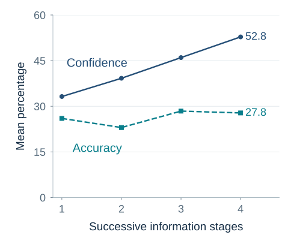

---
aliases:
  - 15-samples-randomness-regression-and-calibration.html
  - 12b-samples-randomness-regression-calibration.html
---

# Randomness and Overconfidence {#samples-randomness-and-calibration}

*Samples, Randomness, Regression, and Calibration*

::: {#chapter-15-start .chapter-epigraph}
> “I can live with doubt and uncertainty and not knowing.”
>
> — Richard P. Feynman, [*The Pleasure of Finding Things Out*](https://www.richardfeynman.com/about/quote.html), BBC interview, 1981
:::

A branch manager arrives after the worst quarter in the company’s history. Three months later, sales have recovered and headquarters praises the rescue. Perhaps the manager changed something that mattered. But a branch selected because it had an exceptionally bad quarter may also improve when temporary setbacks pass. How much of the recovery should count as evidence of good management?

Headquarters needs to recognize effective management and decide which practices to repeat. Crediting the entire recovery to the rescue could spread a policy that contributed little; dismissing it as luck could discard a useful change. The same question appears in smaller decisions: whether two successful hires validate an interview method, whether a winning streak reveals skill, or whether a missed deadline was foreseeable. We need to learn what variation alone can produce before deciding what a striking result means.

::: {.callout-note .core-idea icon=false}
## Core Idea

A striking result becomes useful evidence when we compare it with what the underlying process could produce by chance. Small samples and the selection of extreme cases can exaggerate apparent differences; repeated, recorded forecasts help us discover whether our confidence is deserved.
:::

## Learning goals

- Explain why small samples, streaks, and clusters can look more informative than they are.
- Diagnose regression to the mean and distinguish an apparent causal pattern, including superstition, from evidence that an action changes the outcome.
- Distinguish three forms of overconfidence, use an outside view to challenge the planning fallacy, and score forecasts for calibration and resolution.

## Randomness and apparent patterns {#which-sequence-looks-random}

Before explaining the branch’s recovery, consider a simpler problem: recognizing what chance can produce. A fair coin will be tossed six times. Rank these exact sequences from most to least likely:

1. H H H H H H
2. H H H T T T
3. H T H T H T

The first looks designed, while the third looks comfortably random. Yet every specified sequence has the same probability: one in 64.

The intuition answers a different question: *Which sequence resembles my prototype of randomness?* Alternation looks random; a run looks meaningful. Probability asks which event was specified before the tosses and how many elementary outcomes it contains.

The distinction also explains why “three heads and three tails in any order” is more likely than “all heads or all tails.” The first category contains twenty exact sequences; the second contains two. Each exact outcome remains equally likely. Categories differ because they collect different numbers of outcomes.

Randomness is clumpier than intuition expects. When many sequences, people, schools, funds, products, or locations are observed, some will display striking runs and clusters even when the underlying process is unchanged. A pattern invites explanation; a statistical model asks how surprising that pattern was given all the opportunities for one to appear.

:::: {#math-coin-sequences}
::: {.callout-note .research-lens .mathematical-analysis icon=false collapse=true}
## Mathematical analysis: counting coin sequences

For six independent fair tosses, each specified sequence has probability

$$
\left(\frac{1}{2}\right)^6=\frac{1}{64}.
$$

There are $\binom{6}{3}=20$ ways to place three heads among six positions. All heads and all tails account for only two sequences.
:::
::::

## Small samples swing widely

The expectation that a short sequence should look balanced extends to evidence about people and organizations. Tversky and Kahneman (1971) called this belief in the **law of small numbers**: expecting a small sample to resemble its population too closely. After three successful hires, an interview panel may feel it has found a reliable method. Yet three outcomes can change dramatically with the next appointment, especially if applicants and jobs vary. The question is how much confidence that sample can support.

Small samples produce more extreme proportions because each observation carries more weight. When an outcome has a 50% chance on each independent trial, the **standard error**, a measure of typical sampling fluctuation, is about 15.8 percentage points with ten observations, compared with 5.0 points with one hundred. The population did not become steadier; the estimate did.

:::: {#math-sampling-uncertainty}
::: {.callout-note .research-lens .mathematical-analysis icon=false collapse=true}
## Mathematical analysis: sampling uncertainty

For an independent Bernoulli event with probability $p$, the standard error of the sample proportion is

$$
SE(\hat p)=\sqrt{\frac{p(1-p)}{n}}.
$$

When $p=0.5$, the standard error is about 0.158 for $n=10$ and 0.050 for $n=100$.
:::
::::

Selection magnifies the problem. The branch reached headquarters’ agenda because its quarter was unusually bad, just as a fund enters a performance ranking because its returns were unusually good. In both cases, temporary variation has helped select the evidence we are about to explain.

When decisions cannot wait or populations are inherently small, the available sample must still inform action. Report uncertainty and identify which conclusion depends on one or two observations. Where cases are sufficiently comparable, shrinkage methods pull unstable estimates toward the wider average rather than taking each small sample at face value; the regression section below explains that logic.

## Streaks require a process model

After five reds at roulette, black may feel due. Under independent fair spins, it is not. The wheel has no memory. The **gambler's fallacy** treats short-run balancing as a physical correction because the sequence is expected to look representative quickly (Clotfelter & Cook, 1993).

The opposite intuition appears after success: a basketball player who has made several shots seems more likely to make the next. That **hot-hand belief** could misread random clustering, or it could reflect genuine state dependence through confidence, fatigue, strategy, defense, learning, or shot selection.

Gilovich, Vallone, and Tversky (1985) famously argued that observers saw more hot-hand dependence than basketball data supported. Later work identified a finite-sample bias in common comparisons of success following success and showed that some earlier tests understated streakiness (Miller & Sanjurjo, 2018). Resolving the question requires specifying and testing the process:

1. What would independent outcomes produce?
2. Was the streak pattern chosen before or after examining the data?
3. Did opportunities, difficulty, strategy, or selection change during the run?
4. Does the pattern replicate with a statistic suited to the sampling process?

## Clusters and the search for causes

A cluster of failures deserves attention because it may reveal a preventable cause. Yet searching more units, periods, or subgroups gives chance more opportunities to produce an impressive cluster (Nickerson, 2002). The practical challenge is to investigate a possible hazard without treating the most striking pattern as its own explanation.

A disease cluster may reveal a local exposure; a manufacturing cluster may reveal a faulty machine; a set of related forecast errors may reveal a missing variable. The test needs a denominator that includes the number of units, periods, outcomes, subgroups, and models searched. It also needs a mechanism or independent replication that was not selected by the same extreme pattern.

A useful sequence is:

**Describe → compare with chance → specify a mechanism → predict new observations → replicate.**

Stopping after description rewards the most surprising pattern. Jumping directly to a favored mechanism invites confirmation. A new prediction forces the proposed cause to do work outside the data that suggested it.

## Regression to the mean

The branch improved after the manager arrived. To decide how much that timing tells us, we need to separate persistent performance from the temporary variation that helped make the earlier quarter exceptional. An unusually high result can reflect high persistent ability, favorable temporary circumstances, or both. When the next temporary influence is less extreme, performance tends to move toward average even if the underlying ability does not change.

For illustration, suppose two measurements have a correlation of 0.40. A first result two standard deviations above average then predicts a second result only 0.8 standard deviations above average under a simple linear model. The person remains above average; the prediction is less extreme because the first observation was partly unreliable.

The flight-instructor example illustrates the attribution trap. Praise follows unusually good performance and criticism follows unusually poor performance. The next attempt often looks worse after praise and better after criticism. An instructor may conclude that criticism improves performance and praise harms it, although part of both movements reflects regression (Kahneman & Tversky, 1973).

Regression does not show that an intervention had no effect. It shows why before–after change among units selected for extreme outcomes does not identify the effect by itself. Use comparison groups, repeated pre-periods, credible counterfactuals, and uncertainty intervals. A real treatment effect and regression can occur together.

{#fig-regression-conditional-shrinkage fig-alt="A fixed-seed simulation of 50 standardized measurement pairs has an approximately 0.40 sample correlation under a declared normal data-generating process. The conditional prediction line is flatter than the no-noise identity line. Guides show that an initial value two standard deviations above average predicts a second value 0.8 standard deviations above average." width=100%}

Return to the branch manager. If the bad quarter was two standard deviations below average and the same illustrative correlation of 0.40 applied, the model would predict the next quarter at 0.8 standard deviations below average without any managerial change. That is a visible recovery of 1.2 standard deviations. @fig-regression-conditional-shrinkage shows the corresponding geometry. The recovery can be real while its attribution to the rescue plan remains unproven. Compare the branch with similarly troubled branches, examine several earlier periods, and identify which changes the manager actually introduced. That makes room for a managerial effect while accounting for the recovery that might have happened anyway.

:::: {#math-regression-model}
::: {.callout-note .research-lens .mathematical-analysis icon=false collapse=true}
## Mathematical analysis: regression and the teaching simulation

Suppose observed performance is

$$
Y=\theta+\varepsilon,
$$

where $\theta$ is a persistent component and $\varepsilon$ is temporary noise. Selecting an unusually high $Y$ selects cases with high persistent ability, favorable noise, or both. When the next noise term is less extreme, performance tends to move toward average even if the underlying ability does not change.

For two standardized measures with correlation $r$, a simple linear prediction is

$$
\widehat z_2=r z_1.
$$

If a measure two standard deviations above average has test–retest correlation $r=0.40$, the best linear prediction under that model is 0.8 standard deviations above average. The predicted person remains above average; the extreme observation is shrunk because part of it was unreliable.

A fixed-seed teaching simulation draws 50 observations from $z_1,\varepsilon\sim N(0,1)$ and $z_2=0.40z_1+\sqrt{0.84}\varepsilon$ (seed 50273; displayed sample $r\approx0.40$). The model's conditional mean is $E[z_2\mid z_1]=0.40z_1$: $z_1=+2$ predicts $z_2=+0.8$.
:::
::::

## Superstition and the illusion of control {#superstition}

A basketball player tosses chalk into the air before a game; a golfer wears red on Sunday. LeBron James’s chalk toss and Tiger Woods’s red shirt are familiar sporting rituals (NBA, 2009; PGA TOUR, 2024). In a humorous interview, Woods recalled winning in red, then unsuccessfully trying blue to challenge his mother’s belief that red was his “power color.” The sequence makes a memorable story, but different tournaments also bring different opponents, conditions, and performances.

**Superstition** attributes influence to an action or sign without adequate evidence of a causal connection. A ritual alone does not establish such a belief: an athlete might use a familiar routine to prepare or concentrate.

[]{#personal-story-superstition}

::: {.callout-note .personal-example icon=false}
## From my experience: a childhood warning that still follows me

When I was a child, I was told not to let someone else's legs pass over my head: if that happened, I would never grow. The remedy was to jump ten times.

Today, I no longer believe that warning. Yet when my daughter goes under my legs for fun or by accident, those childhood words return. I feel uneasy and am tempted to ask her to jump ten times. I can reject the rule intellectually while still feeling its pull.

If I asked her to jump, I could pass on the very rule I no longer believe.
:::

Laboratory studies have also examined how repeated actions can emerge without a causal connection to reward. Skinner’s (1948) pigeon experiment made the apparent connection between action and reward strikingly visible. Food arrived at regular intervals regardless of what the birds did. Six of eight developed recognizable repeated movements, including circling and head motions. Skinner proposed that movements accidentally followed by food had been reinforced, sustaining responses that did not produce the reward.

Staddon and Simmelhag’s (1971) later work found activities organized around the timing of food delivery, challenging the simple account that arbitrary movements had been strengthened by coincidence. Further experiments pointed to species-typical feeding patterns and the arrangement of the feeding environment as influences on the repeated behavior (Timberlake & Lucas, 1985).

For a human causal claim, ask what the ritual is supposed to change. Helping a player settle into a practiced routine is a different claim from changing the odds through an unrelated gesture. Record failures as carefully as successes, compare occasions with and without the action, and consider what else differed. The same discipline applies to the branch manager: a practice that preceded recovery deserves investigation before it becomes a rule for every branch.

[]{#illusion-of-control}

An **illusion of control** occurs when someone overestimates their causal influence over an outcome. The branch manager may control staffing and training but cannot thereby control every market shock. Naming the controllable action and comparing what would happen without it is more informative than asking whether the manager feels in charge.

Langer's (1975) classic studies helped establish the topic, but one familiar inference needs care: preferring a lottery ticket one selected does not show a belief that selecting it improved the odds. Preference, ownership, and anticipated regret can also matter. Across 17 experiments with 10,825 participants, Klusowski, Small, and Simmons (2021) found little support for the claim that choice itself creates inflated success expectations when options are functionally identical.

## Overconfidence: three different errors {#confidence-must-face-a-distribution}

The branch manager is now sure the rescue plan will work elsewhere. But what exactly is the claim: a large improvement, better results than other managers, or very little uncertainty? **Overconfidence** means that confidence exceeds the accuracy or justification it warrants. Moore and Healy (2008) distinguish three forms that should be measured separately:

- **Overestimation:** overestimating one's performance or ability. Predicting a score of 80 and obtaining 60 is an overestimate on that occasion.
- **Overplacement:** overestimating one's position relative to a defined comparison group. Someone who expects to rank in the top tenth but ranks near the middle has misplaced their relative standing. Being above average is not itself a bias.
- **Overprecision:** being too certain that a judgment is correct, for example by giving uncertainty intervals that are too narrow.

Each requires a different comparison, as @tbl-confidence-calibration shows. Asking a confident person to “think harder” supplies none of them.

| Form of overconfidence | Comparison required | Useful feedback |
| --- | --- | --- |
| Overestimation | Predicted versus measured performance | Record estimates and outcomes on the same scale across comparable tasks. |
| Overplacement | Predicted versus measured relative standing | Specify the comparison group and criterion, then check the predicted rank. |
| Overprecision | Stated certainty versus accuracy across comparable judgments | Compare prediction-interval coverage with its stated level, or probability judgments with observed event frequencies. |
: Three forms of overconfidence require different comparisons {#tbl-confidence-calibration}

The forms can move in opposite directions. In Moore and Healy's experiments, difficult tasks could produce overestimation of one's score alongside underplacement relative to others; easy tasks could reverse that combination. An error therefore needs a specified task, scale, comparison group, and repeated assessment.

Gathering more information does not necessarily close the gap between confidence and accuracy. Oskamp (1965) gave 32 judges, including eight clinical psychologists, one person's case history in four stages. After each stage, they answered the same 25 multiple-choice questions about that person's attitudes and behavior and rated their confidence. As the account grew from basic demographic facts into a detailed life history, average confidence rose significantly, from 33.2% to 52.8%. Accuracy changed from 26.0% to 27.8%, with no statistically significant improvement between the first and final stages.

@fig-confidence-accuracy separates the two trajectories: confidence rose at every stage, while accuracy fluctuated within a much narrower range.

{#fig-confidence-accuracy fig-alt="Across four information stages, mean confidence is 33.2, 39.2, 46.0, and 52.8 percent; mean accuracy is 26.0, 23.0, 28.4, and 27.8 percent. Distinct lines and markers distinguish confidence from accuracy." .phone-fit}

This was a small historical study of one case, using questions with five possible answers. It does not establish that additional information is generally unhelpful or harmful. It shows why becoming more convinced that we understand a person is insufficient evidence that our judgments have improved.

For the branch manager, the practical question is whether another detail changes a prediction in a way that later outcomes support. Record the prediction before those outcomes are known, then check accuracy alongside confidence. [Chapter 42](42-deciding-with-data-and-ai.qmd#make-the-test-resemble-the-task) applies a related safeguard to machine learning: keep an untouched test set to assess whether a developed model predicts new observations. The activity below begins such a record for your own judgments.

::: {#overprecision-interval-check .callout-tip .activity icon=false}
## Test the width of your uncertainty

Before checking results, choose ten comparable quantities whose answers can later be verified, such as completion times for routine tasks. For each, record a central estimate and a **90% subjective prediction interval**: a lower and upper bound that you believe together leave a 10% chance outside. A well-calibrated set should contain the answers about 90% of the time across many comparable forecasts, not exactly nine times in every batch of ten.

Afterward, examine both coverage and width. Repeatedly missing many intervals suggests overprecision; making every interval enormous avoids misses but supplies little useful information. Revise the forecasting process, then assess it on new cases. Ten cases start a learning record.
:::

The familiar Dunning–Kruger pattern raises a further measurement question: what explains the relationship between performance and errors in self-assessment? Kruger and Dunning (1999) reported larger self-assessment errors among lower performers in several tasks and proposed that some skills needed for good performance also help people recognize good performance. Measurement error, regression to the mean, scale boundaries, task difficulty, and general self-enhancement can produce part of the pattern; later work suggests that any distinctive metacognitive component may be smaller and more task-specific than the popular slogan implies (Gignac & Zajenkowski, 2020). Measure performance and confidence separately. Do not diagnose a person's metacognition from one rank comparison.

[]{#planning-fallacy-and-outside-view}

When will your thesis be finished? Buehler, Griffin, and Ross (1994) asked students working on an honors thesis for their best estimate, an optimistic estimate, and a pessimistic one. Among the 33 who finished during follow-up, the best estimate averaged **33.9 days**; completion took **55.5 days**. Even their pessimistic estimate averaged only 48.6 days. Four further students had not finished by the end of follow-up and were excluded from those completion-time averages. The gap therefore survives a comparison that leaves out the longest unfinished projects.

The **planning fallacy** is this tendency to underestimate how long a task will take. A plausible story of the remaining steps can crowd out experience of earlier delays (Buehler et al., 1994; Kahneman & Tversky, 1979). Underestimating the time needed can express overestimation of what one can accomplish; an unduly narrow completion window also expresses overprecision. It is an application of the errors in @tbl-confidence-calibration, rather than a fourth form of overconfidence.

The **outside view** starts with the completion-time distribution of comparable projects, then adjusts for differences with predictive evidence (Kahneman & Lovallo, 1993; Lovallo & Kahneman, 2003). The inside view still matters: a project's steps reveal dependencies and possible delays. Comparing the two prevents a coherent plan from erasing what happened to other coherent plans.

For the branch manager, the same distinction applies to the rescue plan. A compelling account of why it should work is an inside view. Results from other branches facing comparable conditions provide an outside view. Their disagreement is a reason to examine the assumptions, rather than average the two claims mechanically.

::: {.callout-note .research-lens icon=false collapse=true}
## Research Lens: information protocols change probability puzzles

In Monty Hall, seeing two unopened doors can make staying and switching look equally promising. Yet the host’s rule for revealing a goat determines what the reveal tells us: similar-looking endings can carry different evidence. In the standard Monty Hall protocol, a knowledgeable host always reveals a goat behind an unchosen door and always offers a switch; if either goat door could be opened, assume the host chooses between them uniformly at random. Following the unchosen-door branch in @fig-monty-hall-protocol shows why switching wins with probability $2/3$, compared with $1/3$ for staying (Selvin, 1975). If the host instead opens doors or offers a switch selectively, the evidence changes. Likewise, “at least one child is a boy,” “the older child is a boy,” and a parent volunteering “I have a boy” arise from different sampling rules. The transferable question is not the puzzle answer but: **How was this information generated?**

{#fig-monty-hall-protocol fig-alt="Three stages show a Monty Hall problem. First, the chosen door receives one-third probability and the two unchosen doors receive two-thirds together. Second, a knowledgeable host opens an unchosen goat door under a constrained rule, choosing randomly when either goat door could be opened. Third, keeping retains one-third while switching receives two-thirds." width=100%}
:::

## Calibration makes confidence answerable

A correct prediction can look like evidence of skill, but even a poor forecaster will sometimes be right. To decide whose probabilities deserve weight, we need a record of how stated confidence compares with outcomes across forecasts.

A forecaster is **calibrated** when events assigned 70 percent occur about 70 percent of the time, events assigned 20 percent occur about 20 percent of the time, and so forth. Calibration is a property of repeated forecasts, not one dramatic success.

Accuracy also requires **resolution** or discrimination. A forecaster who assigns 50 percent to everything may be calibrated in a balanced environment but contributes little separation. Useful forecasts move away from the base rate when evidence warrants it and remain calibrated across those movements.

The **Brier score** measures the squared gap between a forecast probability and what happened, coding occurrence as one and nonoccurrence as zero. A lower score is better: a 70% forecast scores 0.09 if the event occurs and 0.49 if it does not. Average the scores across forecasts to evaluate the record rather than its most memorable success (Brier, 1950; Murphy, 1973).

:::: {#math-brier-score}
::: {.callout-note .research-lens .mathematical-analysis icon=false collapse=true}
## Mathematical analysis: scoring a probability forecast

For a binary event with forecast $p$ and outcome $o\in\{0,1\}$, the Brier score is

$$
BS=(p-o)^2.
$$

Thus a forecast of $p=0.70$ scores $(0.70-1)^2=0.09$ if the event occurs and $(0.70-0)^2=0.49$ otherwise.
:::
::::

Research in geopolitical forecasting tournaments suggests that **probabilistic forecasting** can improve through repeatable practices: define the event precisely, start from reference classes, decompose the problem, update in small increments, seek disconfirming information, aggregate independent views, and obtain feedback (Mellers et al., 2014). Numeric probabilities also reveal false agreement. Two colleagues may both say “likely” while one means 55 percent and the other 90 percent.

| Field | Example |
| --- | --- |
| Event and resolution rule | “The supplier passes acceptance testing by 30 September, documented by a signed report.” |
| Probability and date | 0.65 on 1 June |
| Reference classes | Comparable suppliers; this supplier's last ten deliveries |
| Main evidence | Prototype passed; staffing remains incomplete |
| Alternative pathways | Certification, integration, staffing, or scope delay |
| Update triggers | Test failure, staff appointment, scope change |
| Outcome and score | Enter after resolution; preserve the original forecast |
: A minimal forecast ledger {#tbl-probability-forecast-ledger}

The dated entries in @tbl-probability-forecast-ledger matter because memory rounds forecasts toward outcomes. “We knew it might fail” can describe almost any vague prior statement. A dated number, event definition, and update rule allow learning to survive hindsight.

The same discipline is needed when AI supplies the forecast. [Chapter 42](42-deciding-with-data-and-ai.qmd#test-the-whole-decision) carries calibration and sampling into the evaluation of machine predictions: reserve observations that were not used to fit or tune the model, make the test resemble its intended use, and examine whether its probabilities support better actions. This is how the book's treatment of uncertainty helps distinguish a promising demonstration from evidence that a decision process has improved.

### Combine causal forecasts with the outside view {#from-a-project-story-to-a-forecast-system}

Breaking a project into possible failure routes should make its forecast more informative. But combining those routes carelessly can undo the benefit if they share causes or trigger one another.

A project team assigns 15 percent to supplier delay, 10 percent to regulatory delay, and 20 percent to software delay. The probability of **at least one of these delays** must lie between 20 percent and 45 percent: it cannot be smaller than the largest component, and adding the components would count any overlapping delays more than once. Under an illustrative independence assumption, the chance of at least one delay would be 38.8 percent. But a supplier delay might cause a software delay, so independence needs evidence. An event tree with conditional probabilities can make those dependencies explicit; the [probability rules in Chapter 14](14-base-rates-and-bayesian-updating.qmd#chapter-14-start) provide the first consistency check.

:::: {#math-combined-delays}
::: {.callout-note .research-lens .mathematical-analysis icon=false collapse=true}
## Mathematical analysis: combining independent delay risks

Under independence, multiply the probabilities that each delay does *not* occur, then subtract that joint no-delay probability from one:

$$
1-(1-0.15)(1-0.10)(1-0.20)=0.388.
$$

:::
::::

Missing the **final deadline** is a separate event. Schedule slack may absorb a component delay, while an omitted failure route may jeopardize completion. Define that final event and model how each route affects it before comparing the forecast with the deadline-miss rate for similar projects. If the estimates differ sharply, investigate the reference class, schedule assumptions, dependencies, and missing routes. The outside view cannot correct the inside view until both refer to the same outcome.

Record one forecast for the final date and separate forecasts for leading mechanisms. Update when relevant evidence arrives, including an unexpected development; record why the new information changes the forecast. After resolution, score the forecasts and examine whether errors came from the base rate, dependence assumptions, missing pathways, or unjustified confidence. Each project adds observations to the calibration ledger.

[]{#ch15-research-findings}

## Practice Lab

Choose one event that will resolve within four weeks. Produce a complete forecast ledger: an unambiguous event and resolution source, a numerical probability, two reference classes, an inside-view mechanism, one argument against, and a dated update trigger. For a quantity such as cost or completion time, add the 10th, 50th, and 90th percentiles and explain every adjustment away from the outside-view distribution. When the date arrives, enter the outcome and score without revising the original entry. Keep the ledger and identify which assumptions the outcome gives you reason to reconsider. One result may reveal a missing pathway, but calibration and systematic overconfidence require a longer record.

## Take it forward

The next time a spectacular success or failure reaches the meeting agenda, ask what led that case to be selected and what a comparable case would be expected to do next. Then write down the prediction before the next quarter arrives. That simple record gives the organization a chance to learn something more durable than a story about its latest result.

## References cited in this chapter

::: {.reference}
Brier, G. W. (1950). Verification of forecasts expressed in terms of probability. *Monthly Weather Review, 78*(1), 1–3. https://doi.org/10.1175/1520-0493(1950)078%3C0001:VOFEIT%3E2.0.CO;2
:::

::: {.reference}
Buehler, R., Griffin, D., & Ross, M. (1994). Exploring the planning fallacy: Why people underestimate their task completion times. *Journal of Personality and Social Psychology, 67*(3), 366–381.
:::

::: {.reference}
Clotfelter, C. T., & Cook, P. J. (1993). The gambler's fallacy in lottery play. *Management Science, 39*(12), 1521–1525.
:::

::: {.reference}
Gignac, G. E., & Zajenkowski, M. (2020). The Dunning–Kruger effect is (mostly) a statistical artefact: Valid approaches to testing the hypothesis with individual differences data. *Intelligence, 80*, Article 101449. https://doi.org/10.1016/j.intell.2020.101449
:::

::: {.reference}
Gilovich, T., Vallone, R., & Tversky, A. (1985). The hot hand in basketball: On the misperception of random sequences. *Cognitive Psychology, 17*(3), 295–314.
:::

::: {.reference}
Kahneman, D., & Lovallo, D. (1993). Timid choices and bold forecasts: A cognitive perspective on risk taking. *Management Science, 39*(1), 17–31.
:::

::: {.reference}
Kahneman, D., & Tversky, A. (1973). On the psychology of prediction. *Psychological Review, 80*(4), 237–251.
:::

::: {.reference}
Kahneman, D., & Tversky, A. (1979). Intuitive prediction: Biases and corrective procedures. *TIMS Studies in Management Science, 12*, 313–327.
:::

::: {.reference}
Klusowski, J., Small, D. A., & Simmons, J. P. (2021). Does choice cause an illusion of control? Psychological Science, 32(2), 159–172. https://doi.org/10.1177/0956797620958009
:::

::: {.reference}
Kruger, J., & Dunning, D. (1999). Unskilled and unaware of it: How difficulties in recognizing one's own incompetence lead to inflated self-assessments. *Journal of Personality and Social Psychology, 77*(6), 1121–1134.
:::

::: {.reference}
Langer, E. J. (1975). The illusion of control. Journal of Personality and Social Psychology, 32(2), 311–328. https://doi.org/10.1037/0022-3514.32.2.311
:::

::: {.reference}
Lovallo, D., & Kahneman, D. (2003). Delusions of success: How optimism undermines executives' decisions. *Harvard Business Review, 81*(7), 56–63.
:::

::: {.reference}
Mellers, B., Stone, E., Atanasov, P., Rohrbaugh, N., Metz, S. E., Ungar, L., Bishop, M. M., Horowitz, M., Merkle, E., & Tetlock, P. E. (2014). The psychology of intelligence analysis: Drivers of prediction accuracy in world politics. *Journal of Experimental Psychology: Applied, 20*(1), 1–14.
:::

::: {.reference}
Miller, J. B., & Sanjurjo, A. (2018). Surprised by the hot hand fallacy? A truth in the law of small numbers. *Econometrica, 86*(6), 2019–2047.
:::

::: {.reference}
Moore, D. A., & Healy, P. J. (2008). The trouble with overconfidence. *Psychological Review, 115*(2), 502–517.
:::

::: {.reference}
Murphy, A. H. (1973). A new vector partition of the probability score. *Journal of Applied Meteorology, 12*(4), 595–600.
:::

::: {.reference}
NBA. (2009, May 18). *LeBron’s chalk toss* [Video]. YouTube. https://www.youtube.com/watch?v=yY2dUuMj8q8
:::

::: {.reference}
Nickerson, R. S. (2002). The production and perception of randomness. *Psychological Review, 109*(2), 330–357.
:::

::: {.reference}
Oskamp, S. (1965). Overconfidence in case-study judgments. *Journal of Consulting Psychology, 29*(3), 261–265. https://doi.org/10.1037/h0022125
:::

::: {.reference}
PGA TOUR. (2024, April 30). *Tiger Woods appears on “The Tonight Show Starring Jimmy Fallon” to discuss Sun Day Red and more*. https://www.pgatour.com/article/news/latest/2024/04/30/tiger-woods-goes-on-the-tonight-show-jimmy-fallon-sun-day-red
:::

::: {.reference}
Selvin, S. (1975). A problem in probability. *The American Statistician, 29*(1), 67.
:::

::: {.reference}
Skinner, B. F. (1948). “Superstition” in the pigeon. *Journal of Experimental Psychology, 38*(2), 168–172. https://doi.org/10.1037/h0055873
:::

::: {.reference}
Staddon, J. E. R., & Simmelhag, V. L. (1971). The “superstition” experiment: A reexamination of its implications for the principles of adaptive behavior. *Psychological Review, 78*(1), 3–43. https://doi.org/10.1037/h0030305
:::

::: {.reference}
Timberlake, W., & Lucas, G. A. (1985). The basis of superstitious behavior: Chance contingency, stimulus substitution, or appetitive behavior? *Journal of the Experimental Analysis of Behavior, 44*(3), 279–299. https://doi.org/10.1901/jeab.1985.44-279
:::

::: {.reference}
Tversky, A., & Kahneman, D. (1971). Belief in the law of small numbers. *Psychological Bulletin, 76*(2), 105–110.
:::
