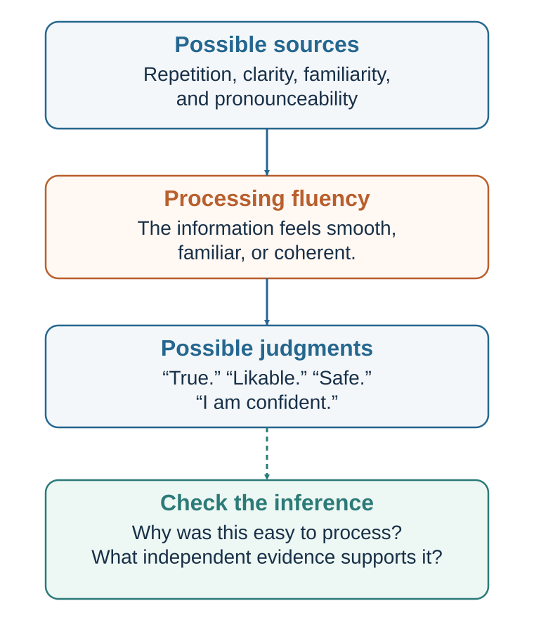

# Fluency, Familiarity, and the Feeling of Truth

*Why an easy idea can feel safer, better, and more accurate than it is*

::: {.callout-note .core-idea icon=false}
## Core Idea

The mind often treats ease of processing as evidence. Fluency can support comprehension, but repetition and familiarity can manufacture truth, liking, confidence, and trust.
:::

## Learning goals

- Explain processing fluency and cognitive ease.
- Explain mere exposure and illusory truth.
- Describe how names, rhyme, typography, and clarity affect judgment.
- Distinguish useful difficulty from pointless strain.

Processing fluency is the ease with which the mind processes information. A word is fluent when it is easy to read or pronounce. A sentence is fluent when it is clear and well structured. A face is fluent when it is familiar. An image is fluent when it is high contrast, symmetrical, or expected. An idea is fluent when it fits what we already know. A decision is fluent when the options are easy to compare.

Cognitive ease is the subjective feeling that accompanies fluency. It is the sense that something is effortless, familiar, coherent, and unproblematic. Cognitive strain is the opposite: the sense that something is difficult, unfamiliar, effortful, or suspicious.

Fluency matters because people use it as a metacognitive signal—a feeling about their own mental processing. The mind does not only process information; it also monitors how processing feels. If something is easy to process, the mind may infer that it is familiar, true, safe, common, beautiful, or liked. If something is difficult to process, the mind may infer that it is unfamiliar, risky, false, suspicious, or less attractive (Alter & Oppenheimer, 2009; Reber et al., 2004; Schwarz, 2004).

This inference is not foolish. Fluency often contains useful information. A familiar face is more likely to belong to someone we have seen before. A clear explanation is often better than a confusing one. A well-designed form is easier to complete. A readable warning is more useful than an unreadable one. A coherent argument may deserve more trust than a disorganized argument.

But fluency is not proof. It is only a signal. And signals can be caused by many things.

A statement can feel fluent because it is true. It can also feel fluent because it is repeated. A name can feel familiar because the person is trustworthy. It can also feel familiar because the name was advertised. A message can feel clear because the idea is well understood. It can also feel clear because the complexity was hidden.

Fluency influences judgment because people often do not correct for the source of ease. If something feels easy, we may attribute that ease to the object rather than to repetition, design, mood, font, familiarity, or prior exposure.

This is why cognitive ease is powerful. It operates as a quiet background feeling. People rarely say, “I believe this because it was easy to process.” They say, “It just makes sense.”

Kahneman (2011) described cognitive ease as a state associated with familiarity, good mood, trust, and intuitive processing. When processing is easy, people are more likely to rely on fast thinking. When processing is strained, people may become more vigilant, skeptical, and analytic. Alter and colleagues (2007) found that disfluent presentation could sometimes reduce intuitive errors by encouraging more analytic processing. The point is not that disfluency is always good. It is that ease and strain can shift how people think.

A decision-maker should therefore ask:

Does this feel right because it is right? Or because it is fluent?

That question sits at the heart of this chapter.

## Repetition becomes liking

{#fig-fluency-pathway fig-alt="Repetition, clarity, familiarity, and pronounceability feed processing ease, which branches to truth, liking, safety, and confidence, with an evidence check."}

One of the most important sources of fluency is repetition. Repeated exposure makes information easier to process. Over time, ease can become liking.

The mere exposure effect is the tendency for repeated exposure to a stimulus to increase liking for it. Zajonc (1968) famously showed that people often develop more positive attitudes toward stimuli they have encountered before, even when exposure is brief and no new information is provided. Later research confirmed that the effect appears across many kinds of stimuli, including words, symbols, faces, sounds, and objects (Bornstein, 1989).

The mechanism is partly fluency. A repeated stimulus becomes easier to process. That ease feels good or safe. The mind may interpret familiarity as a sign that the object is acceptable, known, or nonthreatening. Repetition reduces uncertainty.

This makes evolutionary sense. In many environments, something encountered repeatedly without harm is probably safe. Familiar foods, familiar paths, familiar people, and familiar places often deserve less suspicion than unknown ones. Familiarity can be useful.

But familiarity can also be manufactured.

Brands rely heavily on mere exposure. A logo seen repeatedly becomes familiar. A jingle heard repeatedly becomes easy to recognize. A politician’s name repeated often becomes more available. A slogan repeated often becomes part of the mental environment. A product that appears frequently in stores, feeds, videos, and conversations may become preferred simply because it feels known.

Mere exposure does not guarantee liking in every case. Repetition of an unpleasant or threatening stimulus can increase irritation. Excessive repetition can lead to boredom or reactance. The effect is strongest when initial reactions are neutral or mildly positive, when exposure is not experienced as coercive, and when the stimulus is not overprocessed (Bornstein, 1989; Zajonc, 2001).

Mere exposure also affects social life. A classmate, colleague, neighbor, or brand may become more likable simply through repeated, nonnegative exposure. Familiarity can create warmth. This helps explain why proximity matters in friendship and why repeated interaction can build trust. But it also explains why social environments shape preference. People often like what they have repeatedly encountered.

In music, repeated listening can turn unfamiliar songs into favorites. In food, repeated exposure can increase liking, especially for initially unfamiliar tastes. In culture, repeated narratives become normal. In organizations, repeated phrases become values. In politics, repeated associations become common sense.

This can be beneficial. Repeated exposure to diverse role models can make achievement feel possible. Repeated exposure to safety procedures can normalize caution. Repeated exposure to ethical reminders can make integrity salient. Repeated exposure to inclusive language can shift what feels normal.

But it can also be harmful. Repeated stereotypes become familiar. Repeated misinformation becomes easier to believe. Repeated cynicism becomes realism. Repeated hostility becomes normal. Repeated exposure to luxury lifestyles can make ordinary life feel inadequate.

A useful question is:

Do I like this because it is good, or because it has become familiar?

The answer may be both. But the distinction matters.

## Repetition becomes truth

Repetition does not only increase liking. It can also increase perceived truth.

The illusory truth effect is the tendency for repeated statements to be judged as more true than new statements, even when repetition provides no evidence. Hasher, Goldstein, and Toppino (1977) showed that repeated statements were later rated as more truthful. This effect has been replicated many times and is considered robust (Dechêne et al., 2010).

The mechanism again involves fluency. Repeated statements are easier to process. The mind interprets ease as familiarity. Familiarity is then misattributed to truth. “I have heard this before” becomes “This seems true.”

This is one of the most important findings for modern information environments.

A false claim repeated often can begin to feel true. A misleading statistic repeated across media can become common knowledge. A rumor repeated in a workplace can become accepted. A stereotype repeated in jokes, headlines, and stories can become plausible. A political slogan repeated often can feel self-evident.

The illusory truth effect can occur even when people know better. Fazio and colleagues (2015) found that repetition increased perceived truth even for statements that participants could have known were false, such as “The Atlantic Ocean is the largest ocean on Earth.” Knowledge helps, but repetition still exerts influence. This is troubling because people often assume that misinformation can be corrected simply by knowing the facts. Fluency can still pull.

Begg, Anas, and Farinacci (1992) showed that people may confuse familiarity of a statement with credibility of its source. A statement encountered earlier may later feel more credible, even when the original source was unreliable. This is especially important in digital media, where claims detach from sources as they circulate.

Illusory truth is related to source-monitoring errors. People remember content more easily than where it came from. A person may recall hearing a claim but forget that it came from an unreliable website, a satire post, a rumor, or a hypothetical example (Johnson et al., 1993). Once source memory fades, fluency remains.

This creates a dilemma for correcting misinformation. Repeating a false claim in order to debunk it may increase familiarity. If the correction is not clear, the false claim may become more fluent. Research on misinformation correction suggests that corrections should be clear, repeated, provide alternative explanations, and avoid unnecessary repetition of the myth (Lewandowsky et al., 2012; Schwarz et al., 2016). The goal is to make the truth more fluent than the falsehood.

The illusory truth effect has practical implications for organizations. If leaders repeatedly say, “Employees resist change,” the statement may become accepted even if the real problem is poor communication or weak trust. If a team repeatedly says, “Customers only care about price,” they may stop seeing evidence of quality, service, or meaning. If a student repeatedly says, “I am bad at math,” the statement may become subjectively true and guide behavior. If a society repeatedly hears that aging means decline, people may internalize that expectation.

Repetition is not neutral. It builds mental roads. The more often a thought travels the road, the smoother it feels.

A useful defense is to ask:

Where did I first hear this? How many independent sources support it? Is this familiar because it is true or because it has been repeated? What would I believe if I had heard the opposite as often? Can I explain the evidence, or do I only recognize the claim?

Truth should be based on evidence, not merely fluency.

## Easy names, clear prose, and beautiful ideas

Fluency affects more than truth and liking. It affects risk perception, credibility, beauty, confidence, and even financial judgments.

Words that are easy to pronounce often feel safer and more familiar. Song and Schwarz (2009) found that people judged food additives with easier-to-pronounce names as less harmful than additives with difficult names. The name’s fluency influenced perceived risk. The chemical itself did not change.

Alter and Oppenheimer (2006) found that stocks with easier-to-pronounce names or ticker symbols performed better shortly after initial public offerings, suggesting that fluency may influence investor behavior, at least in early trading contexts. This does not mean pronounceable names create long-term value. It means that when information is limited, fluency can influence preference and confidence.

Fluency also affects aesthetic pleasure. Reber, Schwarz, and Winkielman (2004) argued that beauty is partly linked to processing fluency. Stimuli that are easier to process—because of symmetry, contrast, clarity, prototypicality, or prior exposure—often feel more pleasing. This does not reduce all beauty to ease, but it helps explain why clarity, balance, and familiarity can produce positive evaluation.

Rhyming can also increase perceived truth. McGlone and Tofighbakhsh (2000) found that aphorisms were judged more accurate when they rhymed than when equivalent meanings were expressed without rhyme. “Woes unite foes” feels more truthful than “Woes unite enemies.” Rhyme increases fluency, and fluency becomes credibility.

Oppenheimer (2006) showed that unnecessarily complex writing can make authors seem less intelligent. People sometimes use complex language to sound smart, but disfluency can backfire. Clear writing often produces higher judgments of intelligence because it is easier to process. This is an important lesson for students, managers, and leaders: clarity is not simplification in the bad sense. Clarity is respect for the reader’s cognitive resources.

Fonts and visual design also matter. Easy-to-read text feels smoother and may be judged more favorably. But the relationship between font disfluency and learning is complicated. Some early work suggested that difficult-to-read fonts might improve learning by increasing effort (Diemand-Yauman et al., 2011). Later studies found mixed results and raised doubts about broad claims that disfluent fonts reliably improve learning (Eitel & Kühl, 2016; Yue et al., 2013). The practical conclusion is cautious: desirable difficulty can improve learning when it leads to meaningful processing, but unnecessary perceptual difficulty often just creates strain.

This distinction is crucial. Difficulty is not automatically good. A challenging problem can deepen learning. A blurry slide does not. A complex case can build judgment. A confusing form may just cause errors. A hard-to-read font may create effort, but not necessarily useful effort.

Fluency affects credibility in communication. A speaker who is fluent, organized, and easy to follow often seems more knowledgeable. This can be appropriate if fluency reflects preparation and understanding. But fluency can also mask weak content. A smooth presentation can make shallow ideas persuasive. A confident narrative can feel more complete than uncertain truth.

In management, fluency affects strategy. A simple strategy story often travels more easily than a complex one. That is useful when the simple story captures the core truth. It is dangerous when the simplicity hides key trade-offs. “Move fast” is fluent. “Grow responsibly while preserving quality, employee trust, regulatory compliance, and long-term customer value” is less fluent but may be more accurate.

In public policy, fluent slogans outperform complex explanations. “Tough on crime,” “protect jobs,” “cut red tape,” “follow the science,” “freedom,” “fairness,” and “security” are cognitively efficient. They activate values quickly. But complex problems rarely fit fully inside a slogan.

The practical lesson is not to reject fluency. It is to respect its power.

A useful question is:

Is this idea persuasive because it is clear, or because it is oversimplified?

Clarity reveals complexity in usable form. Oversimplification hides it.

## When difficulty makes us think

Cognitive strain is the feeling that processing is difficult. It can come from unfamiliarity, poor design, complexity, surprise, contradiction, low contrast, hard fonts, technical language, ambiguity, or mental conflict.

Strain often feels unpleasant. People prefer ease. But strain can have benefits. It can signal that the situation requires attention. It can interrupt automatic processing. It can make people more skeptical.

Alter and colleagues (2007) found that when problems were presented in a hard-to-read font, people were more likely to answer some Cognitive Reflection Test-style problems correctly. The interpretation was that disfluency triggered analytic processing by making the task feel more difficult. When processing is easy, people may rely more on intuition. When processing is strained, they may slow down.

Kahneman (2011) similarly described cognitive strain as a state associated with vigilance and System 2 engagement. If something feels difficult, the mind may become less trusting. This can help when intuitive answers are wrong.

But strain is not a universal cure. Too much strain can confuse, frustrate, reduce motivation, and increase errors. A form that is hard to understand does not necessarily make people more thoughtful; it may make them give up. A lecture full of jargon may not produce deeper learning; it may produce disengagement. A legal disclosure written in dense language may not promote informed consent; it may hide information.

Learning research distinguishes between desirable difficulties and undesirable difficulties. Bjork (1994) argued that certain difficulties, such as spacing, retrieval practice, and varied practice, can improve long-term learning because they require meaningful effort. But difficulties that interfere with basic access to information are not desirable. The difficulty must support the learning process, not obstruct it.

This distinction applies to decision-making. A useful decision process may create productive strain by forcing people to consider alternatives, estimate probabilities, examine trade-offs, or confront disconfirming evidence. A bad process creates unproductive strain through unclear forms, jargon, poor organization, hidden fees, confusing options, or unnecessary friction.

For example, asking a team to conduct a premortem creates desirable difficulty. It forces people to imagine failure before committing. Asking a patient to read a ten-page legalistic consent form full of technical language may create undesirable difficulty. It burdens comprehension without necessarily improving understanding.

Strain can also be weaponized. Some companies use confusing cancellation processes, complex pricing, or hidden options to exploit people. This is sometimes called sludge: excessive friction that makes beneficial actions harder (Sunstein, 2021). The chapter on nudge and choice architecture will address this in detail.

The practical distinction is:

Does this difficulty help people think better? Or does it make good choice harder?

Cognitive ease should be used to make relevant information accessible. Cognitive strain should be used only when slowing down is helpful.

## Fluency in teaching, leadership, and design

Cognitive ease is not merely a bias. It is also a design principle.

Good teachers create fluency without removing intellectual challenge. They define key terms, use examples, organize information, connect new ideas to prior knowledge, and reduce unnecessary confusion. This frees students’ cognitive resources for the real difficulty: understanding, applying, analyzing, and questioning. A confusing explanation is not deeper because it is confusing.

Good managers also design fluency. A decision meeting should make the decision question clear. What are we deciding? What alternatives are on the table? What evidence matters? What are the trade-offs? What uncertainties remain? If people spend half the meeting trying to understand the structure of the decision, little attention remains for judgment.

Good visual design supports decision-making by making important information easy to find and compare. Tufte (2001) argued for visual displays that communicate data clearly and honestly. A chart should not merely look attractive; it should make patterns, comparisons, and uncertainty visible. Poor design creates cognitive strain that can lead to bad decisions.

Medical communication also depends on fluency. Patients need risk information in forms they can understand. Gigerenzer and Edwards (2003) argued that natural frequencies often make risks easier to understand than abstract percentages. “1 out of 1,000” may be more concrete than “0.1%.” Visual aids can help when designed clearly. But oversimplification can mislead if it hides uncertainty or trade-offs.

Legal, financial, and public policy communication often fail because they overload people. Dense disclosures, long terms of service, complicated forms, and unclear fee structures create strain. Sometimes the strain is accidental. Sometimes it benefits the institution because confused people are less likely to opt out, complain, compare, or switch.

Ethical design should reduce unnecessary strain. If people need to make an informed choice, the path to understanding should be as fluent as possible. This does not mean making the decision look easier than it is. It means making the complexity visible in a usable way.

Fluency also matters in leadership language. Leaders often underestimate how much repetition and clarity are needed. A strategy that has been discussed for months by executives may still be new to employees. A value that appears obvious to founders may be unclear to customers. A policy that seems simple to experts may be confusing to users. Communication must be repeated, clear, and connected to concrete action.

But leaders must also beware of fluent nonsense. A slogan can spread faster than a strategy. A catchy phrase can substitute for operational clarity. “Customer first” is fluent. What does it mean when customer demands conflict with employee well-being? “Move fast” is fluent. What does it mean when speed conflicts with safety? “Ownership” is fluent. What authority and resources come with it?

Fluent language should invite action, not replace thought.

A useful design checklist is:

What should be easy here? What should be hard? Is the difficulty meaningful or accidental? Does fluency clarify truth or hide complexity? Does repetition reinforce what is accurate? Could familiarity be mistaken for evidence? Would a newcomer understand this?

Good design respects limited attention. It makes the right things easy.

## The risk of the familiar

Familiarity is one of the strongest sources of cognitive ease. Familiar people, brands, ideas, routes, institutions, and routines feel safer than unfamiliar ones.

This can be adaptive. Familiarity often reflects experience. If a person has repeatedly been reliable, trust is reasonable. If a route has worked many times, it may be a good route. If a tool has been used successfully, it deserves confidence. Familiarity reduces uncertainty.

But familiarity can also trap people.

A familiar job may feel safer than a better unfamiliar opportunity. A familiar process may continue because people know it, not because it works. A familiar supplier may be chosen despite mediocre performance. A familiar investment may feel less risky than a diversified unfamiliar one. A familiar social norm may feel moral simply because it is normal. A familiar explanation may survive because people have heard it often.

Familiarity can be especially misleading in risk. People often fear unfamiliar risks more than familiar ones, even when familiar risks are statistically larger. Slovic (1987) showed that risk perception depends on qualitative features such as dread, familiarity, control, voluntariness, and catastrophic potential. A familiar voluntary risk may feel acceptable. An unfamiliar involuntary risk may feel alarming.

This explains why people may underestimate everyday risks such as driving too fast, poor diet, lack of exercise, sleep deprivation, or financial under-saving, while overestimating dramatic risks that are rare but vivid. Familiarity dulls concern.

Familiarity also affects organizational change. People resist new systems partly because the old system feels known. Even a flawed process has fluency. A new process creates strain. The first weeks of a better system may feel worse because people are losing fluency. Leaders often mistake this discomfort for evidence that the new system is bad. Sometimes it is simply unfamiliar.

This suggests a useful principle:

Do not judge a new system only while it is still disfluent.

Learning curves matter. A new software tool, meeting format, budgeting process, or decision checklist may feel cumbersome at first. The relevant question is not only how it feels now, but whether it will produce better outcomes after practice.

At the same time, the mere fact that resistance is due to unfamiliarity does not mean the new system is good. Some new systems are genuinely bad. The point is to separate discomfort from evidence.

Ask:

Do I trust this because it is familiar or because it is reliable? Do I distrust this because it is risky or because it is unfamiliar? What evidence do I have beyond ease? How would I evaluate this after a fair trial? What would a newcomer see that insiders miss?

Familiarity is a guide. It should not be a prison.

## Defending against misleading ease

Because cognitive ease feels good, true, safe, and trustworthy, people need defenses against misleading fluency.

The first defense is source checking. When a statement feels true, ask where it came from. Familiarity without source memory is dangerous. Did the claim come from evidence, rumor, advertising, repetition, or a respected expert? If source quality is weak, fluency should not carry much weight.

The second defense is independent evidence. Do not rely on the feeling of familiarity. Ask what evidence supports the claim. How many independent sources? What data? What base rates? What counterevidence?

The third defense is deliberate disfluency in the right place. For important decisions, slow down enough to ask hard questions. What is the strongest argument against this? What assumptions are hidden? What trade-offs are being simplified? Where might the slogan fail?

The fourth defense is multiple formats. A risk can be presented as a percentage, natural frequency, visual icon array, absolute risk reduction, and comparison with alternatives. If a conclusion depends on one format, framing or fluency may be driving it.

The fifth defense is time. Fluency effects can be strong in the moment. Waiting can reduce the pull of immediate ease. This is especially useful for purchases, persuasive messages, social media claims, and emotional decisions.

The sixth defense is exposure balance. If repeated exposure increases belief and liking, expose yourself to accurate information repeatedly, not only misinformation or outrage. Build fluency for truths you want to remember: principles, values, goals, and good habits. A person who repeatedly reviews long-term goals makes them more mentally available. A team that repeatedly discusses customer harm makes responsibility fluent.

The seventh defense is design ethics. Do not use fluency to make falsehoods or harmful choices attractive. Use fluency to make truth, safety, consent, learning, and good decisions easier.

A practical fluency check for any important message is:

Is it clear? Is it true? Is it complete enough? Is its simplicity hiding something important? Could repetition make it believable without evidence? Would people still accept it if it were harder to process?

Cognitive ease is not the enemy. Unexamined ease is.

::: {.callout-caution .evidence-and-boundary-conditions icon=false}
## Evidence And Boundary Conditions

Disfluency is not a general debiasing treatment. A hard-to-read font can create effort without useful thought. Difficulty helps only when it directs attention to the relevant structure of the task.
:::

| Source of ease | Potentially valid inference | Invalid leap | Check |
| --- | --- | --- | --- |
| Clear organization | The message is easier to understand. | The claim must be true. | Inspect evidence and omitted complexity. |
| Repetition | The statement is familiar. | The statement is accurate. | Trace independent sources. |
| Easy pronunciation | The name is fluent. | The product is safer or better. | Separate the label from outcome data. |
| Familiar option | Past exposure reduces uncertainty. | The option has the best value now. | Compare current alternatives and costs. |
: What processing ease can and cannot tell you {#tbl-17-1}

## Key ideas

- The mind often treats ease of processing as evidence. Fluency can support comprehension, but repetition and familiarity can manufacture truth, liking, confidence, and trust.
- Explain processing fluency and cognitive ease.
- Explain mere exposure and illusory truth.
- Describe how names, rhyme, typography, and clarity affect judgment.

## Study and practice

1. How would you explain processing fluency and cognitive ease?

2. How would you explain mere exposure and illusory truth?

3. What evidence and mechanism would you use to describe how names, rhyme, typography, and clarity affect judgment?

::: {.callout-tip .activity icon=false}
## Activity

Take a claim that "just makes sense." Trace the source of fluency: repetition, prior belief, simple language, rhyme, design, or genuine understanding. Then write the evidence separately.  
EXPERIENCE - EXPLAIN - APPLY (MAXIMUM 120 WORDS)  
Experience: describe one specific decision, interaction, or observation. Explain: use one or two concepts from this chapter accurately. Apply: state one improvement, implication, or testable prediction.
:::

## References cited in this chapter

::: {.reference}
Alter, A. L., & Oppenheimer, D. M. (2006). Predicting short-term stock fluctuations by using processing fluency. Proceedings of the National Academy of Sciences, 103(24), 9369–9372.
:::

::: {.reference}
Alter, A. L., & Oppenheimer, D. M. (2009). Uniting the tribes of fluency to form a metacognitive nation. Personality and Social Psychology Review, 13(3), 219–235.
:::

::: {.reference}
Begg, I. M., Anas, A., & Farinacci, S. (1992). Dissociation of processes in belief: Source recollection, statement familiarity, and the illusion of truth. Journal of Experimental Psychology: General, 121(4), 446–458.
:::

::: {.reference}
Bjork, R. A. (1994). Memory and metamemory considerations in the training of human beings. In J. Metcalfe & A. Shimamura (Eds.), Metacognition: Knowing about knowing (pp. 185–205). MIT Press.
:::

::: {.reference}
Bornstein, R. F. (1989). Exposure and affect: Overview and meta-analysis of research, 1968–1987. Psychological Bulletin, 106(2), 265–289.
:::

::: {.reference}
Dechêne, A., Stahl, C., Hansen, J., & Wänke, M. (2010). The truth about the truth: A meta-analytic review of the truth effect. Personality and Social Psychology Review, 14(2), 238–257.
:::

::: {.reference}
Diemand-Yauman, C., Oppenheimer, D. M., & Vaughan, E. B. (2011). Fortune favors the bold and the italicized: Effects of disfluency on educational outcomes. Cognition, 118(1), 111–115.
:::

::: {.reference}
Eitel, A., & Kühl, T. (2016). Effects of disfluency and test expectancy on learning with text. Metacognition and Learning, 11(1), 107–121.
:::

::: {.reference}
Gigerenzer, G., & Edwards, A. (2003). Simple tools for understanding risks: From innumeracy to insight. BMJ, 327(7417), 741–744.
:::

::: {.reference}
Hasher, L., Goldstein, D., & Toppino, T. (1977). Frequency and the conference of referential validity. Journal of Verbal Learning and Verbal Behavior, 16(1), 107–112.
:::

::: {.reference}
Johnson, M. K., Hashtroudi, S., & Lindsay, D. S. (1993). Source monitoring. Psychological Bulletin, 114(1), 3–28.
:::

::: {.reference}
Kahneman, D. (2011). Thinking, fast and slow. Farrar, Straus and Giroux.
:::

::: {.reference}
Lewandowsky, S., Ecker, U. K. H., Seifert, C. M., Schwarz, N., & Cook, J. (2012). Misinformation and its correction: Continued influence and successful debiasing. Psychological Science in the Public Interest, 13(3), 106–131.
:::

::: {.reference}
McGlone, M. S., & Tofighbakhsh, J. (2000). Birds of a feather flock conjointly: Rhyme as reason in aphorisms. Psychological Science, 11(5), 424–428.
:::

::: {.reference}
Oppenheimer, D. M. (2006). Consequences of erudite vernacular utilized irrespective of necessity: Problems with using long words needlessly. Applied Cognitive Psychology, 20(2), 139–156.
:::

::: {.reference}
Reber, R., Schwarz, N., & Winkielman, P. (2004). Processing fluency and aesthetic pleasure: Is beauty in the perceiver’s processing experience? Personality and Social Psychology Review, 8(4), 364–382.
:::

::: {.reference}
Schwarz, N. (2004). Metacognitive experiences in consumer judgment and decision making. Journal of Consumer Psychology, 14(4), 332–348.
:::

::: {.reference}
Schwarz, N., Newman, E., & Leach, W. (2016). Making the truth stick and the myths fade: Lessons from cognitive psychology. Behavioral Science & Policy, 2(1), 85–95.
:::

::: {.reference}
Slovic, P. (1987). Perception of risk. Science, 236(4799), 280–285.
:::

::: {.reference}
Song, H., & Schwarz, N. (2009). If it’s difficult to pronounce, it must be risky: Fluency, familiarity, and risk perception. Psychological Science, 20(2), 135–138.
:::

::: {.reference}
Sunstein, C. R. (2021). Sludge: What stops us from getting things done and what to do about it. MIT Press.
:::

::: {.reference}
Tufte, E. R. (2001). The visual display of quantitative information (2nd ed.). Graphics Press.
:::

::: {.reference}
Yue, C. L., Castel, A. D., & Bjork, R. A. (2013). When disfluency is—and is not—a desirable difficulty: The influence of typeface clarity on metacognitive judgments and memory. Memory & Cognition, 41(2), 229–241.
:::

::: {.reference}
Zajonc, R. B. (1968). Attitudinal effects of mere exposure. Journal of Personality and Social Psychology Monograph Supplement, 9(2, Pt. 2), 1-27.
:::

::: {.reference}
Zajonc, R. B. (2001). Mere exposure: A gateway to the subliminal. Current Directions in Psychological Science, 10(6), 224–228.
:::
