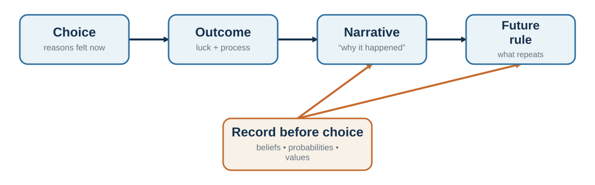

# The Narrator After Choice: Why Reasons Are Not Always Causes

*Why explanations can be sincere and still miss the cause*

::: {.callout-note .core-idea icon=false}
## Core Idea

The mind often turns a choice into a coherent story after the action. Explanations can express genuine values and still be incomplete causal accounts.
:::

## Learning goals

- Distinguish a reason, a justification, and a cause.
- Explain choice blindness, confabulation, and the interpreter.
- Describe cognitive dissonance, self-perception, and post-choice revaluation.
- Explain how reasoning can defend identity, persuade an audience, and make ethics fade from view.
- Use tests, records, and outsider perspectives to hold stories accountable.

A person chooses the rightmost of four identical products and then explains the choice by texture and quality. A participant selects one face, receives the rejected face after a covert switch, and calmly explains why that was the preferred face. A manager approves an acquisition partly because of status competition, then remembers the decision as a disciplined strategic move. In each case, the explanation may be sincere. Sincerity, however, does not guarantee access to the cause.

Human beings are not only decision-makers. We are narrators. We turn actions into reasons, fragments into continuity, and accidents into stories that can be communicated to other people. This ability is indispensable for identity and coordination. It is also a source of error, because a plausible explanation can feel like direct introspection even when it is partly reconstructed after the fact (Nisbett & Wilson, 1977b).

## Reasons are not the same as causes

A reason can play several roles. It can describe what a person consciously considered before choosing. It can justify a choice to an audience. It can express a value the person genuinely endorses. It can also be a post-hoc account assembled from what is available after the action. These roles overlap, which is why the correct conclusion is not that introspection is useless. People often know their goals, deliberations, and conscious reasons. Their access to subtle causal influences - position, order, fluency, mood, priming, habit, social pressure, and automatic evaluation - is incomplete.

People can give sincere explanations for choices without having reliable introspective access to the processes that produced them (Nisbett & Wilson, 1977b; Johansson et al., 2005).

Nisbett and Wilson (1977b) reviewed evidence that people sometimes report culturally plausible theories of why they responded rather than direct knowledge of the process. In the well-known stocking display, identical items were arranged from left to right. The rightmost item was chosen more frequently, yet participants explained their preferences in terms of fabric and workmanship and rejected position as a cause. The study does not show that every reason is false. It shows that unnoticed influences can shape behavior while the mind produces a coherent account.

## Choice blindness and the confidence of explanation

Choice-blindness experiments make the gap more visible. Johansson and colleagues (2005) asked participants to choose between faces. Through a card trick, some participants were then shown the face they had rejected and asked to explain their choice. Many failed to detect the switch and offered detailed reasons for preferring the substituted option.

The effect is not confined to faces. In a marketplace study, participants tasted jam or smelled tea, received a covertly switched sample, and sometimes explained why they preferred the option they had not selected (Hall et al., 2010). In a self-transforming moral survey, some participants failed to notice that an item had been reversed and then argued for the position now displayed as their own (Hall et al., 2012). Consumer taste and moral judgment are not equivalent domains, and many switches are detected. The narrower lesson is that once an outcome is represented as **my choice** or **my view**, explanation can recruit current evidence and identity rather than retrieve a complete causal record.

The striking feature is not merely error. It is fluent justification. Once an option is represented as "my choice," the mind can search memory and construct reasons consistent with it. This is useful for commitment and social communication, but dangerous when confidence in the explanation is mistaken for evidence about the original cause.

## The interpreter and confabulation

Research with split-brain patients inspired the idea of an interpreter: a tendency, especially associated with the language-dominant hemisphere, to construct a coherent account of behavior from whatever information is available (Gazzaniga & LeDoux, 1978; Gazzaniga, 2000). In classic demonstrations, an action could be initiated by information unavailable to the speaking hemisphere. When asked why the action occurred, the person produced an immediate explanation rather than reporting ignorance.

These cases are neurologically unusual, and they should not be treated as a complete theory of ordinary self-knowledge. Their value is conceptual. The mind strongly prefers an intelligible story to an acknowledged gap. Confabulation in this sense need not involve deliberate deception. It is the filling of an explanatory gap with a story that feels subjectively real.

## Cognitive dissonance: the choice rewrites the chooser

After a difficult choice between attractive alternatives, people often increase the attractiveness of the chosen option and decrease the attractiveness of the rejected one. Brehm (1956) interpreted this spreading of alternatives as a response to post-decision dissonance. A choice creates inconsistency: if the rejected option was genuinely attractive, why did I reject it? Revaluation restores coherence.

Dissonance reduction can support commitment. Constantly reopening every decision would be exhausting. But it can also make feedback harder to hear. A team that invested heavily in a project may reinterpret weak demand as temporary misunderstanding. A person who chose a prestigious job may minimize the daily costs that were obvious before the decision. A negotiator who rejected an offer may later describe it as insulting even when it was close to acceptable.

### When behavior becomes evidence about the self

Festinger and Carlsmith (1959) asked participants to perform a dull task and then tell another person it was enjoyable. Participants paid only a small amount later evaluated the task more favorably than those given a stronger external justification. Dissonance theory explains this as coherence repair: when “I said it was enjoyable” cannot be comfortably explained by the reward, the attitude moves toward the action.

Self-perception theory offers a related but distinct mechanism. When internal signals are weak, people can infer an attitude by observing their own conduct much as an outsider would: “I advocated for it with little pressure, so perhaps I believe it” (Bem, 1972). Dissonance emphasizes discomfort from inconsistency; self-perception emphasizes inference from behavior. They need not explain every case in the same way. Both warn that action is not merely the output of a stable preference. Action can become input to the next preference.

This is why small commitments deserve attention. Repeatedly defending a project can make the defender feel more certain. A minor dishonest act can be redescribed as harmless and then become evidence that the boundary was never important. Behavior, explanation, and identity can form a loop.

## Reasoning as a social instrument

Reasoning is not used only to discover truth privately. It is also used to justify actions, persuade others, defend group commitments, and protect moral identity. Motivated reasoning occurs when people search and evaluate arguments in ways that favor a preferred conclusion while preserving the feeling of objectivity (Kunda, 1990). Greater cognitive skill can improve accuracy, but it can also provide a larger toolkit for defending identity-protective beliefs.

The argumentative account of reasoning pushes the social point further: human reasoning is especially well suited to producing and evaluating arguments in interaction (Mercier & Sperber, 2011). That does not make reasoning defective. It explains why one person may be better at finding support for a position than at finding its weaknesses—and why another person’s objections can improve the result. Discussion helps when participants bring genuinely different information, can challenge one another safely, and are not all rewarded for defending the same conclusion. A room full of advocates for one story can become more articulate without becoming more accurate.

Moral rationalization is especially consequential. People can reframe questionable conduct as efficiency, loyalty, standard practice, competitive necessity, or obedience to procedure. Ethical fading occurs when the moral dimension disappears from the frame and the choice is coded as “business,” “technical,” or “legal” instead (Tenbrunsel & Messick, 2004). Euphemistic language does not merely describe the action; it changes what is attended to and what can be justified (Bandura, 1999).

People also protect a moral self-image by exploiting ambiguity. If consequences are easy not to know, responsibility is dispersed, or a rule can be redescribed as unfair, a person can benefit while retaining the story “I am honest” (Mazar et al., 2008). The practical warning is not that every neutral term hides misconduct. It is that a vocabulary containing only cost, compliance, engagement, and performance may remove the very concepts—harm, consent, dignity, fairness, responsibility—needed to see the decision clearly.

## Organizations have narrators too

Organizations create stories about why strategies succeeded, why projects failed, who deserves credit, and what the culture values. This is sensemaking: people construct a workable account of ambiguous events so coordinated action can continue (Weick, 1995). Stories organize memory and direction. They can also protect leaders, suppress inconvenient evidence, and turn luck into a legend of skill. A postmortem that begins with "who failed?" produces a different institutional memory from one that asks "what assumptions, incentives, information flows, and constraints made this outcome likely?"

Responsibility can harden the story. In escalation-of-commitment research, decision-makers responsible for an initial allocation sometimes invested more after negative feedback, as if renewed commitment could rescue both project and self-image (Staw, 1976). An organization then supplies additional audiences, sunk costs, status, and language: “the market is not ready,” “execution was the problem,” or “we have come too far to stop.” Any one claim may be true. The danger is a story that can explain every possible result and therefore cannot be wrong.

The central risk is that an explanation becomes immune to testing. "Customers were not ready" may hide a poor product. "The team resisted change" may hide an incoherent implementation. "We work best under pressure" may hide procrastination reinforced by last-minute relief.

## Making the narrator accountable

{#fig-narrator-learning fig-alt="Choice leads to outcome, narrative, and future rule, while a decision record provides an independent comparison."}

A decision journal creates a record before outcome knowledge rewrites memory. Record the alternatives, assumptions, forecasts, values, emotions, reasons, and review date. Later, compare the original story with what happened. The aim is not self-accusation. It is causal humility.

### The rationalization detector

When an explanation arrives fluently, do not ask only whether it is plausible. Ask whether it had to compete with alternatives.

| Detector question | What it is designed to expose |
| --- | --- |
| Did I record this reason before the choice, or discover it after the outcome? | Hindsight and post-hoc reconstruction |
| Would the same reason justify the option I rejected? | A reason flexible enough to defend either answer |
| If the outcome had reversed, what story would I now tell? | Outcome bias and asymmetric attribution |
| What fact would make this explanation less likely? | An explanation protected from disconfirmation |
| Who benefits if this becomes the official account? | Identity, status, and organizational incentives |
| What did I notice, believe, value, and sacrifice at the time? | Missing stages hidden by the final narrative |
: A rationalization detector for personal and organizational stories {#tbl-rationalization-detector}

The detector does not prove that a reason is false. It converts one coherent story into competing causal hypotheses.

### Record before; review after

A usable decision record has two moments. **Before choosing**, write the live alternatives, the best forgone option, probabilistic forecasts, key assumptions, values and trade-offs, current emotion, and the observations that would trigger revision. **At review**, reopen that untouched record and add the outcome, surprises, which assumptions survived, the role of luck, and one process change.

The review must separate process from outcome:

|  | Good outcome | Bad outcome |
| --- | --- | --- |
| Good process | Preserve what was sound; ask how much luck helped. | Do not abandon a sound method because uncertainty produced a loss. |
| Poor process | Treat the success as a warning, not proof of skill. | Diagnose the earliest correctable failure; avoid rewriting it as inevitable. |
: Process quality and outcome quality answer different questions {#tbl-process-outcome-review}

Consider five managers reviewing the same project. One celebrates because it made money. One condemns it because the result missed the forecast. One compares the result with the predictions and assumptions recorded before the decision. One asks the most senior participant what happened. One writes a smooth case study from memory. The third manager is best positioned to learn—not because records eliminate interpretation, but because the later story must answer to evidence created before hindsight.

For consequential organizational decisions, accountability should be designed before the outcome:

1. The proposal owner records forecasts, assumptions, alternatives, values, and a stop or review rule.
2. Other participants make an initial judgment independently before discussion.
3. A named challenger develops the strongest rival explanation rather than merely listing generic risks.
4. The review compares the untouched record with the outcome and separates process quality from luck.
5. Someone who did not own the original decision facilitates the learning review, and the organization records what will change.

This procedure does not remove narrative. It makes the official narrative compete with a dated record, an alternative model, and an audience with permission to revise it.

Other useful practices include generating alternative explanations, asking what evidence would disconfirm the preferred story, inviting an outsider who does not need the story to be true, and running bounded experiments. If the story says employees cannot handle autonomy, test a limited autonomy arrangement. If it says customers will never want the product, build a small prototype. Testing is better than defending.

Self-affirmation can sometimes reduce defensiveness by reminding people that the whole self is not on trial (Cohen & Sherman, 2014; Steele, 1988). Organizations can also reward revision. A person who says, "My forecast was wrong and here is what changed," should be treated as a source of learning rather than as a threat to authority. The narrator is not an enemy. It is a press secretary, historian, lawyer, poet, and diplomat. Better judgment begins when we ask it one more question: How do I know this story is true?

::: {.callout-caution .evidence-and-boundary-conditions icon=false}
## Introspection is incomplete, not useless

The evidence does not imply that people never know why they act. Conscious deliberation is real. The narrower claim is that introspective access is incomplete and that confidence in an explanation is not a validity test.
:::

## Key ideas

- The mind often turns a choice into a coherent story after the action. Explanations can express genuine values and still be incomplete causal accounts.
- Distinguish a reason, a justification, and a cause.
- Explain choice blindness, confabulation, and the interpreter.
- Behavior can become evidence for later belief through dissonance reduction and self-perception.
- Reasoning can discover errors, but it can also defend identity, persuade an audience, and make ethical questions disappear from the frame.
- Organizational stories learn only when they remain answerable to prior records, rival explanations, and disconfirming evidence.

## Study and practice

1. How would you distinguish a reason, a justification, and a cause?

2. How would you explain choice blindness, confabulation, and the interpreter?

3. How do cognitive dissonance and self-perception offer different explanations for behavior changing later attitudes?

4. What process would make an organization's explanation of failure answerable to evidence rather than status?

::: {.callout-tip .activity icon=false}
## Activity

Retrieve one real decision, or reconstruct it as honestly as possible. Write the official reason, three other possible influences, the best alternative forgone, and the forecast you would have recorded. Then imagine the outcome had reversed: what story would you be tempted to tell, and what observation could distinguish the stories?
EXPERIENCE - EXPLAIN - APPLY (MAXIMUM 120 WORDS)  
Experience: describe one specific decision, interaction, or observation. Explain: use one or two concepts from this chapter accurately. Apply: state one improvement, implication, or testable prediction.
:::

## References cited in this chapter

::: {.reference}
Bandura, A. (1999). Moral disengagement in the perpetration of inhumanities. Personality and Social Psychology Review, 3(3), 193-209.
:::

::: {.reference}
Bem, D. J. (1972). Self-perception theory. In L. Berkowitz (Ed.), Advances in experimental social psychology (Vol. 6, pp. 1-62). Academic Press.
:::

::: {.reference}
Brehm, J. W. (1956). Postdecision changes in desirability of alternatives. Journal of Abnormal and Social Psychology, 52(3), 384-389.
:::

::: {.reference}
Cohen, G. L., & Sherman, D. K. (2014). The psychology of change: Self-affirmation and social psychological intervention. Annual Review of Psychology, 65, 333-371.
:::

::: {.reference}
Festinger, L., & Carlsmith, J. M. (1959). Cognitive consequences of forced compliance. Journal of Abnormal and Social Psychology, 58(2), 203-210.
:::

::: {.reference}
Gazzaniga, M. S. (2000). Cerebral specialization and interhemispheric communication: Does the corpus callosum enable the human condition? Brain, 123(7), 1293-1326.
:::

::: {.reference}
Gazzaniga, M. S., & LeDoux, J. E. (1978). The integrated mind. Plenum Press.
:::

::: {.reference}
Hall, L., Johansson, P., & Strandberg, T. (2012). Lifting the veil of morality: Choice blindness and attitude reversals on a self-transforming survey. PLoS ONE, 7(9), e45457.
:::

::: {.reference}
Hall, L., Johansson, P., Tärning, B., Sikström, S., & Deutgen, T. (2010). Magic at the marketplace: Choice blindness for the taste of jam and the smell of tea. Cognition, 117(1), 54-61.
:::

::: {.reference}
Johansson, P., Hall, L., Sikström, S., & Olsson, A. (2005). Failure to detect mismatches between intention and outcome in a simple decision task. Science, 310(5745), 116-119.
:::

::: {.reference}
Kunda, Z. (1990). The case for motivated reasoning. Psychological Bulletin, 108(3), 480-498.
:::

::: {.reference}
Mazar, N., Amir, O., & Ariely, D. (2008). The dishonesty of honest people: A theory of self-concept maintenance. Journal of Marketing Research, 45(6), 633-644.
:::

::: {.reference}
Mercier, H., & Sperber, D. (2011). Why do humans reason? Arguments for an argumentative theory. Behavioral and Brain Sciences, 34(2), 57-74.
:::

::: {.reference}
Nisbett, R. E., & Wilson, T. D. (1977b). Telling more than we can know: Verbal reports on mental processes. Psychological Review, 84(3), 231-259.
:::

::: {.reference}
Staw, B. M. (1976). Knee-deep in the big muddy: A study of escalating commitment to a chosen course of action. Organizational Behavior and Human Performance, 16(1), 27-44.
:::

::: {.reference}
Steele, C. M. (1988). The psychology of self-affirmation: Sustaining the integrity of the self. In L. Berkowitz (Ed.), Advances in experimental social psychology (Vol. 21, pp. 261-302). Academic Press.
:::

::: {.reference}
Tenbrunsel, A. E., & Messick, D. M. (2004). Ethical fading: The role of self-deception in unethical behavior. Social Justice Research, 17(2), 223-236.
:::

::: {.reference}
Weick, K. E. (1995). Sensemaking in organizations. Sage.
:::
