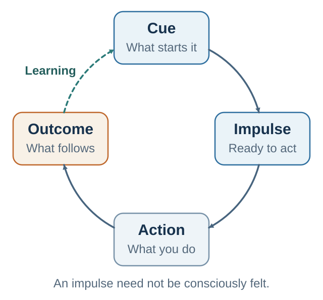

# Chapter 19. Habits: When Decisions Move Downstairs

*Repeated choices become context-bound policies*

<aside class="callout core-idea">
CORE IDEA

A habit is a learned cue-response pattern. The decision loop still exists functionally, but prediction and value have been compressed into an automatic response that the context can trigger before deliberation fully arrives.
</aside>

## Learning goals

- Define habits as context-response learning rather than frequency alone.
- Distinguish goal-directed and habitual control.
- Map cue, urge, response, reward or relief, and learning.
- Explain why stable context and immediate reinforcement build automaticity.

A person wakes up and reaches for the phone before deciding to do so. A student opens a laptop to study and, almost before noticing, checks messages. A manager enters a tense meeting intending to listen but interrupts as soon as a proposal feels threatening. A negotiator prepares to stay calm, then makes a concession the moment the other side rejects the first offer. A team says it values learning, but whenever bad news appears the meeting automatically turns to blame.

These behaviors are not all the same. Some are helpful, some harmful, some neutral, and some depend on context. But they share a feature: they often occur without full conscious deliberation. A cue appears, attention narrows, the body prepares, an old response becomes available, and action begins before the reflective self has finished the sentence "I should decide."

Habits show that decision-making is not only about isolated moments of conscious choice. Much of behavior is built from loops. Repeated loops become automatic. A behavior that once required deliberate intention becomes part of the environment-person system: the phone lights up and the hand moves; the meeting becomes tense and the manager defends; the task feels vague and the student seeks relief; the negotiation feels risky and the old script takes over.

This chapter turns decision science into design science. The question is not only why people choose poorly. It is how behavior becomes automatic, how cues recruit action, and how individuals and organizations can redesign the conditions that call behavior into being.

The point is not to shame habit. Habits are essential. Without them, life would collapse under the weight of tiny decisions. We need habits to brush teeth, type, drive, prepare, greet, read, teach, negotiate, wash hands, check assumptions, save, listen, and recover from mistakes. Good habits are the architecture of competence.

But habits can also let the past choose for the present. A behavior that once solved a problem may persist after the problem has changed. A routine that once reduced anxiety may prevent growth. A cue that once predicted reward may continue to produce wanting after liking has faded. A culture that once created speed may later block learning. The science of habits therefore asks a precise question: which parts of behavior should become automatic, and which parts require conscious review?

## Why habits belong in DPN

Decision, persuasion, and negotiation are usually taught as deliberate skills. We teach people to analyze options, craft messages, prepare BATNAs, identify interests, ask better questions, and evaluate trade-offs. These skills matter. But knowing what to do is not the same as doing it under pressure. A student may know to check base rates and still rely on a vivid anecdote. A manager may know to invite dissent and still reward agreement. A negotiator may know to ask diagnostic questions and still defend a position when status feels threatened.

Habits are the bridge between knowledge and repeated action. Expertise is not only having concepts available in memory. It is making useful behaviors easier, more automatic, and more protected from distraction, emotion, and social pressure. In this sense, good judgment should become partly habitual. The scientist habitually asks what would falsify a claim. The doctor habitually washes hands. The manager habitually asks what is missing. The negotiator habitually prepares interests before numbers. The ethical persuader habitually asks whether the audience would endorse the design if it were explained.

This chapter therefore treats habit as both a risk and a resource. Bad habits compress old solutions into present responses. Good habits compress good judgment into reliable action. The goal is not to make all behavior conscious. The goal is to make the right things automatic and the right things reflective.

The Decision, Persuasion, and Negotiation course uses habit science as a behavior-design laboratory. Students are asked not only to understand better strategies, but to build small, repeated behaviors: decision routines before analysis, persuasion routines that respect agency, and negotiation routines that survive defensive pressure. This makes the chapter practical. It asks how concepts become behavior.

## What is a habit?

A habit is a learned association between a context cue and a response. The cue may be physical, such as a kitchen, desk, classroom, car, phone screen, coffee machine, supermarket, or meeting room. It may be temporal, such as morning, after lunch, Friday evening, before sleep, or the first five minutes after opening a laptop. It may be social, such as being with certain friends, hearing a supervisor speak, entering a negotiation, or noticing group silence. It may be emotional, such as boredom, anxiety, fatigue, loneliness, anger, excitement, shame, or uncertainty.

The response may be physical, mental, emotional, or social: eating, scrolling, smoking, exercising, checking email, apologizing, avoiding, arguing, smiling, rehearsing worries, asking a question, interrupting, withdrawing, or reaching for coffee. The response becomes more likely when the cue appears because the cue has previously been followed by reward, relief, completion, social approval, or reduced effort.

This definition prevents a common mistake. A habit is not simply something done often. It is something that becomes cued by context. A person may attend a conference every year, but the context may be too rare for automaticity. Another person may check the phone whenever anxious; because anxiety and phone availability are frequent cues, the behavior may become strong even if each single episode is brief.

Habits are efficient because they reduce cognitive load. The mind does not want to solve the same problem from scratch every time. It stores repeated patterns. If the same cue reliably calls for the same response, automaticity is useful. But the same efficiency becomes a problem when the old response no longer serves the current goal. The central paradox is simple: habits help us by making useful behavior automatic, but hurt us when automatic behavior no longer fits the situation.

In decision terms, habits are compressed decision loops. The cue carries prediction: this situation has led to reward, relief, or completion before. The response carries cached value: this is what worked here. The choice is not absent; it is shortened, routinized, and often hidden from conscious report.

## Goal-directed and habitual control

A conscious decision is flexible. It asks: given my current goals, beliefs, constraints, and options, what should I do now? It can simulate outcomes, compare alternatives, and adapt to novelty. A habit is less flexible. It says: when this cue appears, do this. It is fast, low-effort, context-bound, and learned from the past.

In reinforcement-learning language, goal-directed decisions are often described as model-based. They use an internal model of the world to simulate how actions lead to outcomes. Habitual actions are often described as model-free. They rely on cached action values or policies learned through reinforcement, without much current simulation. In plain language, model-based control asks, "What will happen if I do this now?" Model-free control says, "When this cue appears, do the action that worked before."

Imagine choosing dinner. The goal-directed system asks what you want, how hungry you are, what food is available, what you ate earlier, and what will make you feel good later. The habit system says: I am watching television; this is when I snack. Imagine checking email. The goal-directed system asks whether email helps the current task. The habit system says: I opened the laptop; check email. Imagine a difficult conversation. The goal-directed system asks what outcome you want and what the other person needs to understand. The habit system says: I feel criticized; defend.

This distinction does not mean conscious decisions are always good and habits are always bad. Conscious decisions can be biased, slow, exhausting, and overconfident. Habits can be wise, efficient, and morally useful. A person can habitually listen carefully, exercise, prepare, save, speak kindly, check assumptions, or ask one more question. The question is not whether behavior is automatic. The question is whether the automatic pattern still serves what matters.

## How habits form

<figure class="book-figure"><figcaption>Figure 19.1. Habits strengthen when cues repeatedly trigger responses that deliver reward or relief.</figcaption></figure>

Habits form through repetition in stable contexts, especially when behavior produces reward or relief. At first, a behavior may require intention. A person decides to meditate, run, write, save, practice, or avoid checking the phone. The action is effortful because the cue-response association is weak. The person must remember, initiate, and persist.

Automaticity develops gradually and varies substantially by behavior and person rather than following a fixed 21-day rule (Lally et al., 2010).

Habits are learned context-response associations that strengthen through repetition in stable settings; frequency alone is not the definition of habit (Wood et al., 2002; Wood & Neal, 2007; Wood & Rünger, 2016).

With repetition, the context begins to cue the response. The behavior becomes easier, faster, and less dependent on conscious motivation. Lally et al. (2010) studied everyday habit formation and found that automaticity increased gradually, often over weeks or months, with large variation across behaviors and people. The popular claim that habits form in exactly twenty-one days is too simple. Complexity, reward, consistency, context, and personal circumstances all matter.

Habit formation depends on several conditions. First is repetition: the behavior must occur often enough for the association to strengthen. Second is context stability: the behavior should occur in a similar situation so the cue can attach to the response. Third is reward or relief: the behavior must produce something the system treats as valuable. Fourth is ease: behaviors that are easy to perform are more likely to repeat. Fifth is attention at the beginning: early habit formation often requires conscious design before automaticity can take over.

This is why a vague intention such as "I will exercise more" is weak. It lacks cue, action, context, and reward. A stronger habit structure is: after I finish lunch, I put on walking shoes and walk for ten minutes around the same route; afterward I mark the calendar. The cue is lunch. The response is shoes and walking. The context is stable. The reward is immediate enough. The repeated loop can become automatic.

The science of habit formation supports a practical principle: a behavior becomes easier to repeat when it is attached to a stable cue and followed by a meaningful reward or relief.

## Context is the hidden engine

People often overestimate the role of motivation and underestimate the role of context. Context includes the physical, social, digital, temporal, and emotional environment in which behavior occurs. It includes what is visible, easy, nearby, expected, socially rewarded, timed, and emotionally present. It includes the body state in which the behavior is attempted.

Context matters because habits are cue-driven. When a context has repeatedly preceded a behavior, the context itself can activate the response. The person may experience this as an urge, an impulse, or simply "finding myself doing it." A desk can become an email cue. A sofa can become a streaming cue. A silence in a meeting can become a cue to fill the space. A critical tone can become a cue to defend. A commute can become a cue for coffee, news, or anxiety.

This is why changing context can disrupt habits. Moving house, starting university, changing jobs, beginning a new semester, becoming a parent, traveling, joining a new team, or changing a calendar can weaken old cues and create openings for new behavior. This is sometimes called the habit discontinuity effect. The fresh start effect works best when the temporal landmark also changes cues, routines, and expectations.

Context also explains why self-control often looks like character but operates like design. People with apparently strong self-control may not be constantly resisting temptation. They may have arranged environments so that temptations are less frequent and desired behaviors are easier. A person who does not keep sweets at home does not resist them every evening. A person who charges the phone outside the bedroom does not resist it at midnight. A person who works in a library does not overcome the sofa all day. A person who joins a running group does not generate social motivation alone.

This does not remove responsibility. It relocates responsibility from heroic moment-by-moment resistance to intelligent environment design. A useful question is: what behavior does this context make easy? The answer often predicts behavior better than stated intention.

## The habit loop

A habit loop is a practical model for repeated behavior: cue, urge or craving, response, reward or relief, and learning. The cue tells the system that a behavior is available. The urge is the motivational state: desire, tension, anticipation, discomfort, curiosity, or the sense that action should happen. The response is the behavior. The reward or relief is the consequence that reinforces the loop. Learning strengthens the cue-response link.

The reward does not have to be pleasure. Relief is often enough. A person checks email to reduce uncertainty. A student procrastinates to escape discomfort. A manager micromanages to reduce anxiety. A person avoids a difficult conversation and feels immediate relief. That relief reinforces avoidance, even if the long-term outcome is worse.

Phone checking illustrates the loop. Cue: a pause, boredom, uncertainty, notification, or difficult task. Urge: "Maybe something happened." Response: unlock, swipe, check, scroll. Reward or relief: novelty, social signal, escape from ambiguity, or temporary reduction of boredom. Learning: pauses become phone-shaped.

Procrastination has a similar structure. Cue: ambiguous task, high standards, fatigue, or fear of evaluation. Urge: escape discomfort and protect self-image. Response: research more, clean, check email, wait for pressure. Reward or relief: temporary freedom from evaluation. Cost: deadline panic, lower quality, and an identity story such as "I work under pressure." Procrastination is often emotion regulation with interest.

Defensiveness in feedback is also a habit. Cue: criticism, correction, silence, or questioning tone. Urge: protect competence, dignity, status, or belonging. Response: explain, interrupt, counterattack, or withdraw. Reward or relief: immediate self-protection. Cost: less learning, lower trust, fewer honest signals. Many relationship problems are automatic protection routines.

The first rule of habit diagnosis is therefore: do not remove a behavior until you understand the local problem it solves. A replacement behavior must answer the same cue more wisely. If the old habit solved uncertainty, the new response must provide a better way to handle uncertainty. If the old habit solved status threat, the new response must preserve dignity while opening learning.

## Reward, relief, and variable reinforcement

Thorndike described the law of effect: behaviors followed by satisfying consequences become more likely. Skinner later developed operant conditioning, showing how reinforcement and punishment shape behavior. Modern reinforcement learning describes how organisms learn from reward, punishment, and prediction error.

Intermittent reinforcement is especially important. A reward that appears unpredictably can make a behavior persistent because the next attempt might produce the reward. Gambling, email, social media, market prices, dating apps, and many digital platforms use variable novelty, social feedback, and uncertainty. The user does not know when the next interesting message, signal, or reward will appear, so checking continues.

Variable rewards are not magic, and not all digital habits are addiction. But uncertainty keeps prediction active. The brain keeps asking: is this the time something interesting happens? That question can become a behavioral engine.

This matters ethically. A language-learning app can use streaks and feedback to support a learner's endorsed goal. The same psychological architecture can also harvest attention, hide costs, or make exit difficult. Habit design can serve agency or capture it.

*Table 19.1  Conscious and habitual control*

| Dimension | Conscious decision | Habitual behavior | Practical implication |
| --- | --- | --- | --- |
| Value source | Current goals and predicted consequences. | Past reinforcement in a specific context. | Ask whether the behavior still serves current goals. |
| Flexibility | High: adapts to new information and changed goals. | Lower: repeats learned response when cue appears. | Use conscious review when context changes. |
| Awareness | Often reportable before action. | Often noticed after action has begun. | Study cues, not only explanations. |
| Cognitive cost | High: attention-hungry and effortful. | Low: fast and efficient. | Make good routines automatic when stakes are recurring. |
| Failure mode | Overthinking, delay, rationalization, or analysis paralysis. | Rigidity, automatic relapse, context capture. | Match the mode of control to the environment. |

*Table 19.2  Diagnosing common loops*

| Habit example | Cue | Urge or craving | Reward or relief | Better replacement |
| --- | --- | --- | --- | --- |
| Phone checking | Pause, notification, hard task, boredom. | Maybe something happened; escape uncertainty. | Novelty, social signal, relief from boredom. | Scheduled check plus capture note; phone outside reach during deep work. |
| Procrastination | Ambiguous task, high standards, fatigue. | Escape evaluation and uncertainty. | Temporary relief; self-image protection. | Two-minute next action; clarify the first visible step; ask for criteria. |
| Defensiveness | Criticism, correction, silence, questioning tone. | Protect competence and status. | Immediate dignity protection. | Breathe once; ask one example or diagnostic question before explaining. |
| Reactive concession | Offer rejected; silence at the table. | Reduce tension; avoid conflict. | Immediate relief and apparent progress. | Pause; ask what assumption makes the offer hard before changing the number. |
| Organizational blame | Error, missed target, bad news. | Protect status and assign responsibility quickly. | Emotional certainty; temporary control. | Run a learning review: what did the system make likely and what must change? |

## Key ideas

- A habit is a learned cue-response pattern. The decision loop still exists functionally, but prediction and value have been compressed into an automatic response that the context can trigger before deliberation fully arrives.
- Define habits as context-response learning rather than frequency alone.
- Distinguish goal-directed and habitual control.
- Map cue, urge, response, reward or relief, and learning.

## Study and practice

1. Define habits as context-response learning rather than frequency alone?

2. How would you distinguish goal-directed and habitual control?

3. How would you map cue, urge, response, reward or relief, and learning?

<aside class="callout activity">
ACTIVITY

Choose one repeated behavior. Identify the cue, urge, response, immediate reward or relief, delayed cost, and context. Do not propose a solution until you can state the local problem the habit solves. EXPERIENCE - EXPLAIN - APPLY (MAXIMUM 120 WORDS) Experience: describe one specific decision, interaction, or observation. Explain: use one or two concepts from this chapter accurately. Apply: state one improvement, implication, or testable prediction.
</aside>

## References cited in this chapter

Lally, P., van Jaarsveld, C. H. M., Potts, H. W. W., &amp; Wardle, J. (2010). How are habits formed: Modelling habit formation in the real world. European Journal of Social Psychology, 40(6), 998-1009.

Wood, W., &amp; Neal, D. T. (2007). A new look at habits and the habit-goal interface. Psychological Review, 114(4), 843-863.

Wood, W., Quinn, J. M., &amp; Kashy, D. A. (2002). Habits in everyday life: Thought, emotion, and action. Journal of Personality and Social Psychology, 83(6), 1281-1297.

Wood, W., &amp; Rünger, D. (2016). Psychology of habit. Annual Review of Psychology, 67, 289-314.

