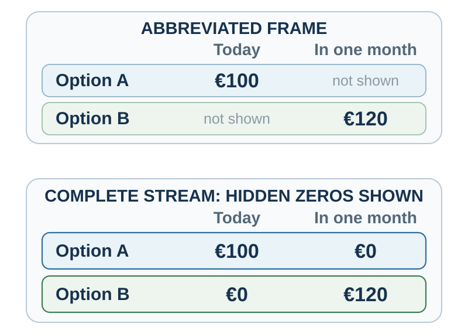

---
aliases:
  - 38-intertemporal-choice.html
---

# Intertemporal Decision Making

*Why Later Loses to Now*

::: {#chapter-19-start .chapter-epigraph}
> “I can resist everything except temptation.”
>
> — Oscar Wilde, [*Lady Windermere’s Fan*](https://www.gutenberg.org/cache/epub/790/pg790-images.html), 1892, Act I
:::

[]{#opening-puzzle-patient-tomorrow-impatient-today}Choose between €100 today and €120 in one month. Now choose between €100 in twelve months and €120 in thirteen months.

Many people are more willing to wait in the second choice than in the first. Yet both require waiting one additional month for the same additional €20. If the distant choice later reverses when the smaller reward becomes immediate, the person has changed a plan as the dates approached.[^ch19-reversal]

Consider a manager who decides on Friday to discuss a recurring problem with a colleague on Monday. On Monday, the discomfort is immediate and the improvement in their working relationship remains uncertain. Postponing until Tuesday feels reasonable, just as it did the week before. What would help the manager carry out the conversation—and how would the answer differ if waiting really allowed better information or a calmer setting?

::: {.callout-note .core-idea icon=false}
## Core Idea

A plan can lose its appeal when its effort becomes immediate. Understanding that reversal requires more than a label such as impatience: a delayed benefit must be valuable, credible, and reachable from the chooser’s present circumstances. The useful intervention depends on which part is failing.
:::

## Learning goals

- Use discounted utility and present bias to diagnose preference reversal without reducing it to weak willpower.
- Separate time preference from liquidity, trust, uncertainty, utility curvature, and task representation.
- Explain how connection to a future self can affect patience, distinguishing neural associations from intervention evidence.
- Build a credible bridge from a present action to a delayed benefit using the MOST audit.

## The benchmark: value across time

The discounted-utility model represents a stream of outcomes by reducing the present weight of outcomes that arrive later (Samuelson, 1937). In its simple **exponential** form, each additional period of delay reduces the weight by the same proportion.

With preferences and relevant circumstances held fixed, exponential discounting preserves the relative ranking of two future outcomes as time passes. If €120 in thirteen months is preferred to €100 in twelve months, moving both rewards eleven months closer should not reverse the preference.

The benchmark is useful even when it is not descriptively accurate. It forces a decision-maker to state the outcome stream, time horizon, assumptions, and trade-off between present and future. It also separates two ideas that ordinary language blends:

- **Utility curvature:** an additional €100 may matter less to a wealthy person than to someone who cannot pay rent.
- **Time weighting:** the same valued outcome may receive less weight because it arrives later.

Observed choices usually identify neither component cleanly. A person choosing money today may be impatient, cash-constrained, worried that the promise will not be honored, or facing an urgent need whose marginal value is high. Frederick, Loewenstein, and O'Donoghue (2002) therefore warn against treating every implied discount rate as pure time preference.

## Why delay changes more than mathematical value

### Present bias and preference reversal

Exponential discounting treats each added period proportionally. Human choices often display **declining impatience**: the difference between now and soon feels larger than an equal difference between two distant dates. Hyperbolic models capture this pattern by making the implied discount rate fall with delay (Ainslie, 1975). Quasi-hyperbolic models simplify it into a special penalty for anything not immediate, followed by more regular discounting across later periods (Laibson, 1997).

{#fig-discount-model-crossover fig-alt="A plot compares exponential, hyperbolic, and quasi-hyperbolic discount functions with declared parameters. Below it, a worked quasi-hyperbolic example prefers 120 euros in thirteen months when both rewards are delayed but reverses to 100 euros when the smaller reward becomes immediate. A note says the exponential example remains time consistent." width=100%}

The worked example in @fig-discount-model-crossover shows **dynamic inconsistency**: a plan that looks best from a distance can lose when temptation or effort becomes immediate. O'Donoghue and Rabin (1999) show how present bias can produce two familiar failures:

- **procrastination:** an action has an immediate cost and delayed benefit, so the person repeatedly postpones it;
- **premature indulgence:** an action has an immediate reward and delayed cost, so the person repeatedly brings it forward.

The manager’s postponed conversation contains both sides: delaying avoids discomfort now while moving the unresolved problem into the future.

:::: {#math-discount-models}
::: {.callout-note .research-lens .mathematical-analysis icon=false collapse=true}
## Mathematical analysis: discounted utility and the plotted models

The discounted-utility model represents a stream of outcomes by reducing the present weight of outcomes that arrive later (Samuelson, 1937). In a simple exponential form,

$$
U = \sum_{t=0}^{T} \delta^t u(c_t), \qquad 0 < \delta \leq 1.
$$

Here, $u(c_t)$ is the utility of consumption or another outcome at time $t$, and $\delta$ is the weight placed on each additional period of delay.

Three discount functions illustrate different implications: exponential $D(t)=0.95^t$, hyperbolic $D(t)=1/(1+0.15t)$, and quasi-hyperbolic $D(0)=1$ and $D(t>0)=0.70(0.95^t)$. With linear utility, the quasi-hyperbolic example prefers €120 in thirteen months when viewed today but reverses to €100 when that reward becomes immediate; exponential discounting keeps the relative ranking stable.

These are illustrative functions.
:::
::::

A person can also differ in awareness. A **sophisticated** present-biased chooser anticipates future reversal and seeks a commitment device. A **naïve** chooser expects future intentions to survive unchanged. A partly sophisticated chooser knows there is a problem but underestimates its size.

Commitment devices alter future options or make deviation costly before the tempting state arrives. A voluntary deposit contract is one example; its benefits and limits are examined below.

### Credibility, attention, and imagination

{#fig-intertemporal-choice fig-alt="An author's diagnostic synthesis shows two paths from a choice point. Possible bottlenecks on a delayed path include uncertainty, weak future imagery, and friction; design levers can be tested against them."}

Waiting is rarely just empty time. @fig-intertemporal-choice traces how uncertainty, weak future imagery, and friction can obstruct the path to a delayed benefit. The distinctions in @tbl-22-delay-mechanisms broaden the diagnosis to include urgent needs, subjective time, and the emotions experienced while waiting:

| Mechanism | Diagnostic question | Example |
| --- | --- | --- |
| Immediate salience | Which outcome can be felt or imagined now? | The taste of dessert competes with an abstract health benefit. |
| Uncertainty | Will the later outcome arrive, and can the promise be trusted? | An unstable employer promises a future bonus. |
| Liquidity and need | What urgent constraint changes marginal value today? | Cash now prevents a late fee or missed meal. |
| Subjective time | How long does the interval feel? | “In six months” feels different from a calendar date. |
| Future-self continuity | Does the later beneficiary feel like me? | Retirement saving can feel like giving money to a stranger. |
| Anticipatory emotion | Is waiting filled with savoring, dread, anxiety, or relief? | Delaying a holiday can create pleasure; delaying a medical result can create dread. |
: Delay enters the decision through several mechanisms {#tbl-22-delay-mechanisms}

The diagnosis changes the intervention. A future-self exercise cannot repair an institution’s broken promises, and advice about patience cannot pay an overdue bill.

### Amount, sign, wording, search, and domain

There is no single discount rate that travels unchanged across every choice. Several recurring patterns show that time preferences are partly constructed.

Before trying to make someone more patient, check whether the way the options are described changes the comparison. The classroom mnemonic **MOST** in @tbl-most-discounting keeps four option attributes visible, so that a change in wording or scale is not mistaken for a change in patience:

| Letter | Attribute | Recurring pattern | Diagnostic |
| --- | --- | --- | --- |
| **M** | Magnitude | Larger outcomes are often discounted less steeply | Does a fixed cost of waiting matter more for a small reward? |
| **O** | Opportunity cost | A choice hides what is received at the other date | Are both outcome streams, including zeros, visible? |
| **S** | Sign | Delayed gains and losses are not mirror images | Do dread, savoring, or a reference point change the comparison? |
| **T** | Time frame | Dates and delays create different representations | Does the wording make waiting or the future event salient? |
: MOST: four attributes that shift apparent discounting {#tbl-most-discounting}

**Larger outcomes often receive more patience.**

People commonly discount small rewards more steeply than large rewards—the **magnitude effect** (Thaler, 1981). Someone who refuses to wait for €10 may wait for €10,000 even when the proportional return is the same. Larger stakes can justify fixed waiting costs, attract more attention, or invite more deliberate comparison.

**Gains and losses are not temporal mirror images.**

Delayed gains are often discounted differently from delayed losses. People may be impatient to receive a gain yet willing to postpone a payment. But waiting for a negative outcome can also generate dread, making sooner resolution preferable. The **sign effect** therefore depends on framing, anticipation, and domain (Loewenstein & Prelec, 1992; Weber et al., 2007).

**Dates and delays create different representations.**

“In six months” emphasizes waiting. “On February 12” locates an event in a calendar and may make it more concrete. Read and colleagues (2005) found lower discounting when outcomes were described with dates rather than delays. A calendar date can make the future event easier to imagine.

**The invisible zero can be made visible.**

The choice “€100 today or €120 in a month” hides two complete outcome streams. The fuller representation in @fig-hidden-zero-frame makes the forgone payment at each date explicit:

- €100 today **and €0 in one month**, or
- €0 today **and €120 in one month**.

Making both zeros explicit increased selection of delayed rewards in the hidden-zero studies (Magen et al., 2008). The mechanism connects directly to opportunity-cost neglect: the immediate reward is not free; it replaces a later reward.

{#fig-hidden-zero-frame fig-alt="Two panels show the same intertemporal payoffs. The abbreviated panel displays 100 euros today or 120 euros in one month and leaves the other dates unstated. The complete panel displays 100 euros today plus zero next month, or zero today plus 120 euros next month." width=100%}

**The search path can construct patience.**

An intertemporal option has at least two attributes: amount and time. A person can search **within an option**, integrating “€100 now” before considering “€120 later.” Or the person can search **across an attribute**, comparing €100 with €120 and then now with one month. These paths make different contrasts salient.

Reeck, Wall, and Johnson (2017) traced information search and identified substantial heterogeneity in these strategies. Comparative searchers—who moved across amounts or across times—made more patient choices than integrative searchers. In a second experiment, the researchers made one search path slightly harder, causally shifting both search and choice. Most participants reported no awareness that the manipulation had changed their behavior.

The finding shows that a measured “discount rate” can partly reflect how information was searched. Inspect both the complete packages and the separate amount and time differences; disagreement between them is a reason to examine the representation.

**Money, health, environment, effort, and relationships differ.**

Money is tradable and often measurable. Health, pain, environmental quality, effort, and social trust are not interchangeable bank balances. People may discount across domains differently because uncertainty, irreversibility, emotion, identity, and moral meaning differ (Chapman, 1996; Hardisty & Weber, 2009).

A decision about a delayed health benefit may involve side effects now, uncertain benefit later, caregiving burden, trust in the institution, or values the experiment did not measure.

### What did the patience task identify?

A multiple price list seems to turn patience into a number: at which row does a person switch from a smaller-sooner to a larger-later amount? But choosing the earlier payment could also keep an urgent bill paid or avoid a promise the person distrusts. Treating either constraint as impatience would point to the wrong remedy. The design responses in @tbl-discount-identification show what must be measured or held comparable before attributing the observed choice to time preference.

| Possible component | How it can resemble impatience | Design response |
| --- | --- | --- |
| Utility curvature | €200 may be worth less than twice €100 | Jointly estimate or independently measure curvature |
| Payment risk | A later promise may be less credible | Equalize and verify payment reliability |
| Liquidity | Immediate cash may prevent a costly shortfall | Measure constraints; do not call urgent need a preference |
| Transaction costs | Waiting may require effort, return visits, or account access | Match procedures and delivery costs |
| Inflation and beliefs | The later amount may buy less | Elicit expected purchasing power and macro conditions |
| Task representation | Defaults, dates, search order, and hidden zeros change attention | Vary representation and report sensitivity |
: A discount-rate estimate combines preferences, beliefs, constraints, and task design {#tbl-discount-identification}

Incentive-compatible payment can improve a task, but it does not solve every identification problem. Cross-domain comparisons require matched procedures and explicit assumptions. A reported association between patience and education, saving, or health is not by itself evidence that changing one stable discount parameter will change those outcomes.

## Making future outcomes vivid and personally relevant {#the-future-must-become-believable-and-self-relevant}

Delayed outcomes often lose because they are represented poorly. The immediate reward is sensory and specific; the future reward is verbal and vague. **Episodic future thinking** asks people to imagine a personally relevant future event connected to the delayed outcome. Peters and Büchel (2010) found that individualized future-event cues reduced delay discounting in their task, with the vividness of episodic imagination predicting the change. Making a future concrete can increase its present decision weight.

Subjective time also matters. Calendar structure, temporal landmarks, and imagined events can change how long a delay feels. Zauberman and colleagues (2009) found that nonlinear perception of time contributes to observed discounting. A distant future may be undervalued because it feels both far away and poorly represented.

[]{#future-self-continuity}

There is a further distance to cross: the distance between the person choosing now and the person who will receive the benefit. Consider putting money aside for retirement. The sacrifice belongs to someone vividly present—you today—while the benefit belongs to an older person whose routines, needs, and appearance may be difficult to imagine. Saving can then feel less like keeping money for yourself and more like giving it to someone you barely know.

**Future-self continuity** is the felt connection between who one is now and who one will become. The hypothesis is that a stronger connection gives the later person's welfare more weight in today's decision (Hershfield, 2011). This adds a social dimension to temporal discounting: a reward can lose value because its recipient feels psychologically distant as well as because its delivery is delayed. The calendar interval stays the same, but the beneficiary becomes more or less personally important.

### Self, friends, and strangers in the brain

Neuroimaging offers evidence relevant to this idea. The **medial prefrontal cortex (mPFC)** lies along the brain's frontal midline. Its ventral portion (vmPFC) is lower; its dorsal portion (dmPFC) is higher. Across 107 imaging studies, Denny and colleagues (2012) found that judgments about oneself more often involved relatively ventral mPFC, whereas judgments about others more often involved relatively dorsal mPFC. Both kinds of judgment engaged overlapping regions. The result describes a graded difference in involvement, rather than activation physically moving from one location to another.

Who the other person is also matters. Mitchell, Macrae, and Banaji (2006) found that thinking about a person described as similar to oneself recruited a ventral region also involved in self-related thought, while thinking about a dissimilar person recruited a more dorsal region. Similarity and friendship are different, however. Krienen, Tu, and Buckner (2010) found stronger responses in anterior mPFC and rostral anterior cingulate regions for oneself and actual friends than for strangers, even when a friend held dissimilar views. These findings connect personal relevance with neural representation, but do not establish a fixed three-step anatomical ladder from self to friend to stranger.

Ersner-Hershfield, Wimmer, and Knutson (2009) brought the comparison into the future. Eighteen young adults judged traits describing themselves now, themselves ten years later, and another person. Thinking about the present self elicited greater activity than thinking about the future self in the **rostral anterior cingulate cortex (rACC)**, a neighboring frontal midline region also sensitive to the self–other distinction. Participants with a larger present–future difference in right rACC activity subsequently discounted delayed money more steeply.[^future-self-neural-evidence] This is consistent with a less personally connected representation of the future self.

### Giving the future self a face {#age-progressed-future-self}

The practical question follows naturally: can making the later beneficiary easier to recognize increase willingness to provide for that person? An age-progressed photograph gives an abstract future self a familiar face. The proposed mechanism is a reduction in felt distance: today's sacrifice becomes a contribution to someone whose welfare feels more closely connected to one's own.

Hershfield and colleagues (2011) tested this approach using age-progressed images and avatars. In Study 1, 50 participants were randomly assigned to interact with a current or older version of their own avatar in virtual reality. Those in the older-avatar condition allocated an average \$172 of a hypothetical \$1,000 windfall to retirement, compared with \$80 in the current-avatar condition. These were stated allocations, not observed pension deposits.

Study 2 compared an older avatar of oneself with an older avatar of someone else, while asking participants to discuss their similarities to the depicted person. Its 21 participants showed a pattern of greater willingness to favor future rewards in the self condition, including on a task with real delayed payments. The combined test across three outcomes was suggestive rather than conclusive (*p* = .056).

A later field experiment connected the idea to actual saving. Robalino and colleagues (2023) randomized 48,853 retirement-account holders in Mexico to receive ordinary saving messages or invitations to see an aged selfie, followed by a saving prompt and contribution link. Over one month, one-time contributions occurred among approximately 1.7% of the intervention group and 1.5% of controls. That modest difference concerned an outcome added after preregistration; the preregistered participation outcomes—recurring-deposit enrollment and any voluntary contribution—showed no statistically significant effects. The study tests the whole invitation-and-image intervention, and cannot isolate a photograph's effect or establish that greater future-self continuity was the mechanism.

The evidence supports making the future beneficiary concrete, while leaving the precise mechanism open. Seeing an older self may strengthen connection, increase attention, or make future needs easier to imagine. For a decision aid, the useful sequence is to picture an ordinary day in that person's life, identify what today's action could make possible, and choose an affordable step. Making the beneficiary feel closer can support patience when the delayed benefit is credible and the present sacrifice is feasible.

:::: {#research-lens-a-future-reward-can-motivate-now}
::: {.callout-note .research-lens icon=false collapse=true}
## Research Lens: a future reward can motivate now

Reward-related brain activity is not reserved for immediate gratification. Kable and Glimcher (2007) found that activity in the ventral striatum, medial prefrontal cortex, and posterior cingulate tracked the subjective value of delayed monetary rewards. These findings challenge a strict division between an impulsive reward system and a patient frontal system.

[Chapter 21](21-habits-wanting-and-self-control.qmd#dopamine-anticipation-and-effort) distinguishes anticipating a reward, working to obtain it, and enjoying it. For a delayed goal, the practical task includes making the future benefit meaningful enough to pursue and the present effort feasible.
:::
::::

## Scarcity and trust: when now is rational

Waiting can preserve a long-term goal, so choosing an immediate reward is easily read as weak self-control. But a person who cannot cover an urgent need, or cannot trust the promised payment, faces a different trade-off. Advising patience may increase the hardship. Before trying to change the preference, examine what waiting would actually cost.

If income is unstable, a promised future reward may be risky. If institutions have broken promises, trust should be lower. If a person faces urgent needs or expensive debt, money today can have much higher marginal value. If inflation or political instability threatens future purchasing power, waiting changes the outcome itself. If a medical condition can deteriorate, delay may be dangerous.

Scarcity certainly changes constraints. An influential set of studies proposed that it can also capture attention and impose cognitive load (Mani et al., 2013; Mullainathan & Shafir, 2013), but the size and generality of this additional cognitive mechanism remain contested. Carvalho, Meier, and Wang (2016), for example, found little evidence that being just before payday reduced cognitive function or decision quality in a low-income US sample, even though short-run resource availability changed. The larger lesson is that measured patience can partly reflect constraints, urgent needs, liquidity, and the reliability of the future.

The classic marshmallow task is therefore not a pure assay of willpower. A child chooses between eating a treat now and waiting for a larger reward, but waiting also depends on attention strategy, incentives, and whether the promise seems credible. Kidd, Palmeri, and Aslin (2013) experimentally varied whether an adult had first kept a promise; children waited longer after reliable experience.

Whether waiting predicts later achievement is a different question. In a longitudinal analysis concentrating on children whose mothers had not completed college, Watts, Duncan, and Quan (2018) found that each additional minute waited at age four predicted roughly one tenth of a standard deviation higher achievement at age fifteen before adjustment. That association shrank by about two thirds after accounting for family background, early cognitive ability, and the home environment.

[]{#ethics-whose-future-is-being-protected}

A policy that asks people to bear costs now for a collective or delayed benefit needs to show who carries those costs. Celebrating patience can hide present hardship for people with little liquidity; the full time path and its distribution belong in the comparison.

## Make delayed goals easier to act on now {#design-the-bridge-not-only-the-destination}

A delayed benefit needs a feasible first step. For the manager, preparing one observation and an opening question may matter more than another reminder of the relationship’s long-term value. A date and appointment then connect that preparation to a setting in which it can be used.

Where the barrier is different, change the bridge. A credible guarantee or staged payment can address uncertainty about a promised benefit; visible progress or a compatible immediate pleasure can help sustain effort. Commitment is a further option when the person expects to reverse a considered plan.

Temptation bundling illustrates an immediate bridge: combine a “want” available now with a “should” that produces delayed benefit, such as listening to a desired audiobook only while exercising (Milkman et al., 2014). A useful bundle must remain available under the intended conditions, and its immediate reward should support the activity rather than undermine its purpose.

The same sensitivity to immediate rewards can be exploited to sell credit, subscriptions, gambling, or continuing digital engagement while delaying awareness of the costs. A bridge should make the chooser’s goal easier to pursue, with the later costs still visible.

### Commitment devices: evidence and application {#evidence-update-commitment-devices-require-current-evidence}

A writer may know that another deadline will approach before the draft feels ready and want a reason to begin sooner. A **commitment device** changes the later choice environment by restricting an option or making deviation costly—for example, a voluntary deposit lost if the draft is late. That restriction can help a plan survive temptation, but it also removes flexibility if illness or an unexpected obligation intervenes. The question is which commitments improve follow-through at an acceptable cost.

A reminder can help someone remember a plan without binding them to it; commitment adds a restriction or cost that remains relevant when preferences change. A deposit contract is not beneficial merely because it is binding; losses, shame, and exclusion can outweigh improved follow-through. A commitment should serve the chooser’s considered goal, use a proportionate response to a lapse, and allow a response to changed circumstances.

The familiar deadline study by Ariely and Wertenbroch (2002) was **retracted on September 2, 2026**. It had reported benefits from self-imposed deadlines and stronger proofreading performance under evenly spaced external deadlines. A direct replication found negligible deadline effects (Hyndman & Bisin, 2026), and the journal’s [retraction notice](https://doi.org/10.1177/09567976261488042) reported that the original data’s authenticity and completeness could not be established and that the findings were no longer reliable. Both authors agreed to the retraction. The original study should not support a recommendation to impose deadlines; [Appendix E](../appendices/appendix-f-when-evidence-breaks.qmd#when-evidence-breaks-the-replication-crisis-and-research-integrity) explains how to update a claim without discarding every related mechanism.

Other commitment devices have been evaluated separately. For example, Giné, Karlan, and Zinman (2010) evaluated a voluntary deposit contract for smoking cessation. The practical rule is to test each device in its domain, report take-up and harm as well as average effects, and avoid building a policy on a memorable unreplicated example.

[]{#worked-application-saving-from-the-next-pay-increase}

“I should save more” leaves the amount and timing to be renegotiated at every payday. Begin by describing an ordinary day for the future self the saving will support: where that person lives, what they need, and which choices the money would preserve. One possible design then starts a contribution with the next pay increase, while protecting an accessible emergency fund. Before choosing it, check income stability, fees, investment risk, and whether the contribution remains adjustable. Showing progress toward that concrete future goal can keep the reason for saving visible.

### Worked application: a difficult conversation

Return to the manager who postpones the conversation each Monday. A specific plan gives the intention a place in the working day: “At Monday’s one-to-one, after reviewing current work, I will describe the observable pattern and ask for their view.” Preparing that observation and an opening question reduces the work of finding words at an uncomfortable moment. Listening to the colleague’s account can then reveal whether the manager has understood the problem correctly.

The delayed benefit is a more workable relationship. Agreeing on a change and a review date makes that benefit less vague: both people can check whether the conversation improved how they work together.

::: {.callout-note .research-lens icon=false}
## Applied Lens: compare the complete time stream

Intertemporal choice is not always a smaller-sooner versus larger-later pair. An option can create value or cost **before**, **during**, and **after** the focal event. Anticipating a holiday can be enjoyable, waiting for a medical procedure can create dread, representative moments can differ from the later memory, and peaks or endings can disproportionately influence whether an episode is repeated.

Before choosing, use @tbl-intertemporal-time-stream to sketch what each option creates before, during, and after the focal event:

| Part of the stream | Prompt | Minimum record |
| --- | --- | --- |
| Before | What savoring, dread, preparation, or foregone activity occurs while waiting? | Likely intensity and duration |
| During | What will an ordinary or representative period actually contain? | Benefits, costs, and how long each lasts |
| After | What peak, ending, or story is likely to shape memory and the next choice? | Expected memory and likely repeat decision |
: A three-part time-stream prompt {#tbl-intertemporal-time-stream}

Circle the row on which the options differ most, then state whose perspective should govern the choice and why. Do not optimize a memorable ending while hiding duration or serious harm. Where possible, compare the forecast with records from similar past episodes rather than relying on the current state alone. [*Deciding for a Better Life: Satisfaction, Connection, and Meaning*](22-deciding-for-a-better-life-satisfaction-connection-and-meaning.qmd#deciding-for-a-better-life-satisfaction-connection-and-meaning) develops experienced, remembered, relational, and evaluated well-being in full.
:::

## Practice Lab

Choose a saving, retirement, health, or project decision with an immediate cost and delayed benefit. Draw both complete outcome streams, including the hidden zeros. Apply MOST—Magnitude, Opportunity cost, Sign, and Time frame—then mark liquidity, trust, uncertainty, and the moment of likely reversal. Describe the future beneficiary and an ordinary situation in which the benefit would matter. Produce one bridge intervention, one recovery path, and a seven-day observable prediction.

## Take it forward

For the manager, “have the conversation” becomes an appointment, an opening sentence, and a specific observation to discuss. Preparing them on Friday reduces what must be worked out at the uncomfortable moment on Monday. Afterward, the manager can review how the conversation went and what preparation would help next time.

A plan can also lose out without a fresh comparison of now and later. Checking a phone or opening an inbox may begin because a familiar setting brings that action to mind. [Habits, Wanting, and Self-Control](21-habits-wanting-and-self-control.qmd#habits-wanting-and-self-control) examines how a repeated response can become easier to start even when it no longer serves the goal.

::: {.callout-note .mathematical-analysis .research-lens icon=false collapse=true}
## Mathematical analysis: interest and discounting {#interest-compounds-discounting-runs-the-calculation-backward}

Financial interest transfers purchasing power across time. If a principal $P$ earns a per-period interest rate $r$ for $n$ periods, its future value is

$$
FV = P(1+r)^n.
$$

At 5% annual interest, €1,000 becomes €1,050 after one year, about €1,276 after five years, €1,629 after ten years, and €11,467 after fifty years. Compounding becomes powerful because each year's return also earns later returns. The approximate **rule of 72** says that an amount doubles after about $72/r$ years when $r$ is expressed as a percentage.

Present value reverses the direction:

$$
PV = \frac{FV}{(1+r)^n}.
$$

A market interest rate contains inflation, default risk, liquidity, transaction costs, market power, and institutional conditions as well as compensation for waiting. A market rate therefore cannot be read directly as a measure of one person’s impatience.
:::

[^ch19-reversal]: Hypothetical comparisons reveal a pattern consistent with reversal; observing an actual reversal requires following the person over time.

[^future-self-neural-evidence]: In Ersner-Hershfield et al. (2009), removing one outlier made the Pearson correlation nonsignificant, although the rank correlation remained significant. The discounting association was specific to right rACC among the tested regions; it was not a general mPFC finding.

## References cited in this chapter

::: {.reference}
Ainslie, G. (1975). Specious reward: A behavioral theory of impulsiveness and impulse control. Psychological Bulletin, 82(4), 463–496.
:::

::: {.reference}
Ariely, D., & Wertenbroch, K. (2002). Procrastination, deadlines, and performance: Self-control by precommitment. Psychological Science, 13(3), 219–224. **Retracted September 2026.**
:::

::: {.reference}
Carvalho, L. S., Meier, S., & Wang, S. W. (2016). Poverty and economic decision-making: Evidence from changes in financial resources at payday. American Economic Review, 106(2), 260–284.
:::

::: {.reference}
Chapman, G. B. (1996). Temporal discounting and utility for health and money. Journal of Experimental Psychology: Learning, Memory, and Cognition, 22(3), 771–791.
:::

::: {.reference}
Denny, B. T., Kober, H., Wager, T. D., & Ochsner, K. N. (2012). A meta-analysis of functional neuroimaging studies of self and other judgments reveals a spatial gradient for mentalizing in medial prefrontal cortex. Journal of Cognitive Neuroscience, 24(8), 1742–1752. https://doi.org/10.1162/jocn_a_00233
:::

::: {.reference}
Ersner-Hershfield, H., Wimmer, G. E., & Knutson, B. (2009). Saving for the future self: Neural measures of future self-continuity predict temporal discounting. Social Cognitive and Affective Neuroscience, 4(1), 85–92.
:::

::: {.reference}
Frederick, S., Loewenstein, G., & O'Donoghue, T. (2002). Time discounting and time preference: A critical review. Journal of Economic Literature, 40(2), 351–401.
:::

::: {.reference}
Giné, X., Karlan, D., & Zinman, J. (2010). Put your money where your butt is: A commitment contract for smoking cessation. American Economic Journal: Applied Economics, 2(4), 213–235.
:::

::: {.reference}
Hardisty, D. J., & Weber, E. U. (2009). Discounting future green: Money versus the environment. Journal of Experimental Psychology: General, 138(3), 329–340.
:::

::: {.reference}
Hershfield, H. E. (2011). Future self-continuity: How conceptions of the future self transform intertemporal choice. Annals of the New York Academy of Sciences, 1235(1), 30–43.
:::

::: {.reference}
Hershfield, H. E., Goldstein, D. G., Sharpe, W. F., Fox, J., Yeykelis, L., Carstensen, L. L., & Bailenson, J. N. (2011). Increasing saving behavior through age-progressed renderings of the future self. Journal of Marketing Research, 48(SPL), S23–S37.
:::

::: {.reference}
Hyndman, K., & Bisin, A. (2026). Replication of “Procrastination, deadlines, and performance: Self-control by precommitment.” Psychological Science, 37(8), 557–571. https://doi.org/10.1177/09567976261460772
:::

::: {.reference}
Kable, J. W., & Glimcher, P. W. (2007). The neural correlates of subjective value during intertemporal choice. *Nature Neuroscience, 10*(12), 1625–1633. https://doi.org/10.1038/nn2007
:::

::: {.reference}
Kidd, C., Palmeri, H., & Aslin, R. N. (2013). Rational snacking: Young children's decision-making on the marshmallow task is moderated by beliefs about environmental reliability. Cognition, 126(1), 109–114.
:::

::: {.reference}
Krienen, F. M., Tu, P.-C., & Buckner, R. L. (2010). Clan mentality: Evidence that the medial prefrontal cortex responds to close others. Journal of Neuroscience, 30(41), 13906–13915. https://doi.org/10.1523/JNEUROSCI.2180-10.2010
:::

::: {.reference}
Laibson, D. (1997). Golden eggs and hyperbolic discounting. Quarterly Journal of Economics, 112(2), 443–477.
:::

::: {.reference}
Loewenstein, G., & Prelec, D. (1992). Anomalies in intertemporal choice: Evidence and an interpretation. Quarterly Journal of Economics, 107(2), 573–597.
:::

::: {.reference}
Magen, E., Dweck, C. S., & Gross, J. J. (2008). The hidden-zero effect: Representing a single choice as an extended sequence reduces impulsive choice. Psychological Science, 19(7), 648–649.
:::

::: {.reference}
Mani, A., Mullainathan, S., Shafir, E., & Zhao, J. (2013). Poverty impedes cognitive function. Science, 341(6149), 976–980.
:::

::: {.reference}
Milkman, K. L., Minson, J. A., & Volpp, K. G. M. (2014). Holding the Hunger Games hostage at the gym: An evaluation of temptation bundling. *Management Science, 60*(2), 283–299. https://doi.org/10.1287/mnsc.2013.1784
:::

::: {.reference}
Mitchell, J. P., Macrae, C. N., & Banaji, M. R. (2006). Dissociable medial prefrontal contributions to judgments of similar and dissimilar others. Neuron, 50(4), 655–663. https://doi.org/10.1016/j.neuron.2006.03.040
:::

::: {.reference}
Mullainathan, S., & Shafir, E. (2013). Scarcity: Why having too little means so much. Times Books.
:::

::: {.reference}
O'Donoghue, T., & Rabin, M. (1999). Doing it now or later. American Economic Review, 89(1), 103–124.
:::

::: {.reference}
Peters, J., & Büchel, C. (2010). Episodic future thinking reduces reward delay discounting through an enhancement of prefrontal-mediotemporal interactions. Neuron, 66(1), 138–148.
:::

::: {.reference}
Psychological Science. (2026, September 2). Retraction: Procrastination, deadlines, and performance: Self-control by precommitment. *Psychological Science*. Advance online publication. https://doi.org/10.1177/09567976261488042
:::

::: {.reference}
Read, D., Frederick, S., Orsel, B., & Rahman, J. (2005). Four score and seven years from now: The date/delay effect in temporal discounting. Management Science, 51(9), 1326–1335.
:::

::: {.reference}
Reeck, C., Wall, D., & Johnson, E. J. (2017). Search predicts and changes patience in intertemporal choice. Proceedings of the National Academy of Sciences, 114(45), 11890–11895.
:::

::: {.reference}
Robalino, J. D., Fishbane, A., Goldstein, D. G., & Hershfield, H. E. (2023). Saving for retirement: A real-world test of whether seeing photos of one's future self encourages contributions. Behavioral Science & Policy, 9(1), 1–9. https://doi.org/10.1177/23794607231190607
:::

::: {.reference}
Samuelson, P. A. (1937). A note on measurement of utility. Review of Economic Studies, 4(2), 155–161.
:::

::: {.reference}
Thaler, R. H. (1981). Some empirical evidence on dynamic inconsistency. Economics Letters, 8(3), 201–207.
:::

::: {.reference}
Watts, T. W., Duncan, G. J., & Quan, H. (2018). Revisiting the marshmallow test: A conceptual replication investigating links between early delay of gratification and later outcomes. *Psychological Science, 29*(7), 1159–1177. https://doi.org/10.1177/0956797618761661
:::

::: {.reference}
Weber, E. U., Johnson, E. J., Milch, K. F., Chang, H., Brodscholl, J. C., & Goldstein, D. G. (2007). Asymmetric discounting in intertemporal choice: A query-theory account. Psychological Science, 18(6), 516–523.
:::

::: {.reference}
Zauberman, G., Kim, B. K., Malkoc, S. A., & Bettman, J. R. (2009). Discounting time and time discounting: Subjective time perception and intertemporal preferences. Journal of Marketing Research, 46(4), 543–556.
:::
