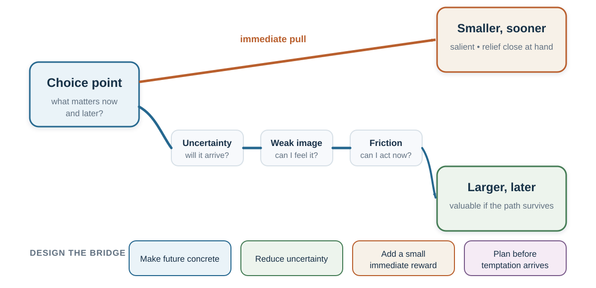

---
aliases:
  - 38-intertemporal-choice.html
---

# Intertemporal Decision-Making: Why Later Loses to Now

*A delayed outcome is not merely a smaller version of an immediate one. Delay changes attention, uncertainty, emotion, imagination, and who the future beneficiary feels like.*

::: {.callout-note .core-idea icon=false}
## Core Idea

Risky choice compares uncertain outcomes, and intertemporal choice compares outcomes arriving at different times. But observed impatience is not one stable trait or a pure discount rate; it can combine present bias, uncertainty, liquidity, framing, subjective time, anticipated emotion, future-self distance, and doubt that the future payoff will arrive. Therefore this chapter separates discounting from the other mechanisms that make later outcomes lose influence and asks how a present intention can survive until action.
:::

## Learning goals

- Use discounted utility and present bias to diagnose preference reversal without reducing it to weak willpower.
- Separate time preference from liquidity, trust, uncertainty, utility curvature, and task representation.
- Build a credible bridge from a present action to a delayed benefit using the MOST audit.

::: {.callout-note .loop-location icon=false}
## Where this chapter enters the loop

Time changes **Predict**, **Value**, and **Act** together. Delay affects credibility, attention, liquidity, emotion, and the felt connection between the present chooser and the future beneficiary.
:::

## Opening puzzle: patient tomorrow, impatient today

Choose between €100 today and €120 in one month. Now choose between €100 in twelve months and €120 in thirteen months.

Many people are more willing to wait in the second choice than in the first. Yet both require waiting one additional month for the same additional €20. The distant self plans to be patient; the present self sees an immediate reward and reverses the plan.

This puzzle appears in ordinary life. On Sunday, a student plans to begin on Monday; on Monday, starting tomorrow feels almost as good. A person intends to save the next pay increase, then finds the immediate purchase unusually compelling when the money arrives. A team agrees that a difficult conversation should happen soon, yet postpones it each time “soon” becomes today. A government values long-run resilience but repeatedly protects the next budget cycle.

Calling these choices “impatient” describes the result but does not yet explain it. What changed when the reward became immediate? Did value change, attention narrow, uncertainty grow, identity shift, or an immediate discomfort become more important? Intertemporal choice belongs in this book because it makes the whole decision architecture visible.

## The benchmark: value across time

The discounted-utility model represents a stream of outcomes by reducing the present weight of outcomes that arrive later (Samuelson, 1937). In a simple exponential form,

$$
U = \sum_{t=0}^{T} \delta^t u(c_t), \qquad 0 < \delta \leq 1.
$$

Here, $u(c_t)$ is the utility of consumption or another outcome at time $t$, and $\delta$ is the weight placed on each additional period of delay. Exponential discounting has an attractive property: the relative ranking of two future outcomes remains stable as time passes. If €120 in thirteen months is preferred to €100 in twelve months, moving both rewards eleven months closer should not reverse the preference.

The benchmark is useful even when it is not descriptively accurate. It forces a decision-maker to state the outcome stream, time horizon, assumptions, and trade-off between present and future. It also separates two ideas that ordinary language blends:

- **Utility curvature:** an additional €100 may matter less to a wealthy person than to someone who cannot pay rent.
- **Time weighting:** the same valued outcome may receive less weight because it arrives later.

Observed choices usually identify neither component cleanly. A person choosing money today may be impatient, cash-constrained, worried that the promise will not be honored, or facing an urgent need whose marginal value is high. Frederick, Loewenstein, and O'Donoghue (2002) therefore warn against treating every implied discount rate as pure time preference.

### Interest compounds; discounting runs the calculation backward

Financial interest transfers purchasing power across time. If a principal $P$ earns a per-period interest rate $r$ for $n$ periods, its future value is

$$
FV = P(1+r)^n.
$$

At 5% annual interest, €1,000 becomes €1,050 after one year, about €1,276 after five years, €1,629 after ten years, and €11,467 after fifty years. Compounding becomes powerful because each year's return also earns later returns. The approximate **rule of 72** says that an amount doubles after about $72/r$ years when $r$ is expressed as a percentage.

Present value reverses the direction:

$$
PV = \frac{FV}{(1+r)^n}.
$$

This financial discount factor is not the same object as a psychological discount parameter. A market interest rate contains inflation, default risk, liquidity, transaction costs, market power, and institutional conditions as well as compensation for waiting. Ethical and religious traditions also differ in how they classify interest and usury. “The interest rate measures impatience” is therefore an instructive first approximation, not a complete explanation.

## Why delay changes more than mathematical value

### Present bias and preference reversal

Exponential discounting treats each added period proportionally. Human choices often display **declining impatience**: the difference between now and soon feels larger than an equal difference between two distant dates. Hyperbolic models capture this pattern by making the implied discount rate fall with delay (Ainslie, 1975). Quasi-hyperbolic models simplify it into a special penalty for anything not immediate, followed by more regular discounting across later periods (Laibson, 1997).

The important psychological result is **dynamic inconsistency**. A plan that looks best from a distance can lose when temptation or effort becomes immediate. O'Donoghue and Rabin (1999) show how present bias can produce two familiar failures:

- **procrastination:** an action has an immediate cost and delayed benefit, so the person repeatedly postpones it;
- **premature indulgence:** an action has an immediate reward and delayed cost, so the person repeatedly brings it forward.

These are mirror images. Filing a form, exercising, studying, saving, or beginning a difficult conversation imposes cost now for benefit later. Scrolling, impulsive spending, avoiding conflict, or consuming an addictive reward offers relief now while moving cost into the future.

A person can also differ in awareness. A **sophisticated** present-biased chooser anticipates future reversal and seeks a commitment device. A **naïve** chooser expects future intentions to survive unchanged. A partly sophisticated chooser knows there is a problem but underestimates its size.

Commitment devices change the future option set or price before the tempting state arrives: automatic savings, a deposit contract, a deadline, an app blocker, a preordered healthy meal, a written reservation value before bargaining, or an appointment with another person. Commitment can protect a valued plan, but it can also become punitive or coercive. A good device is proportionate, transparent, and recoverable after a lapse.

### Credibility, attention, and imagination

{#fig-intertemporal-choice fig-alt="An author's diagnostic synthesis shows two paths from a choice point. Possible bottlenecks on a delayed path include uncertainty, weak future imagery, friction, and changing states; design levers can be tested against them. The factors are not required stages."}

Waiting is rarely just empty time. Delay changes at least six parts of the choice:

| Mechanism | Diagnostic question | Example |
| --- | --- | --- |
| Immediate salience | Which outcome can be felt or imagined now? | The taste of dessert competes with an abstract health benefit. |
| Uncertainty | Will the later outcome arrive, and can the promise be trusted? | An unstable employer promises a future bonus. |
| Liquidity and need | What urgent constraint changes marginal value today? | Cash now prevents a late fee or missed meal. |
| Subjective time | How long does the interval feel? | “In six months” feels different from a calendar date. |
| Future-self continuity | Does the later beneficiary feel like me? | Retirement saving can feel like giving money to a stranger. |
| Anticipatory emotion | Is waiting filled with savoring, dread, anxiety, or relief? | Delaying a holiday can create pleasure; delaying a medical result can create dread. |
: Delay enters the decision through several mechanisms {#tbl-22-delay-mechanisms}

This table changes the intervention. If the barrier is distrust, a vivid future-self exercise will not repair it. If the barrier is liquidity, a lecture on patience is insulting and ineffective. If the delayed outcome is abstract, making it concrete may help. If the immediate action is too difficult, reduce friction. If a person repeatedly reverses a considered plan, commitment may be useful.

### Amount, sign, wording, search, and domain

There is no single discount rate that travels unchanged across every choice. Several recurring patterns show that time preferences are partly constructed.

The mnemonic **MOST** keeps four option attributes visible:

| Letter | Attribute | Recurring pattern | Diagnostic |
| --- | --- | --- | --- |
| **M** | Magnitude | Larger outcomes are often discounted less steeply | Does a fixed cost of waiting matter more for a small reward? |
| **O** | Opportunity cost | A choice hides what is received at the other date | Are both outcome streams, including zeros, visible? |
| **S** | Sign | Delayed gains and losses are not mirror images | Do dread, savoring, or a reference point change the comparison? |
| **T** | Time frame | Dates and delays create different representations | Does the wording make waiting or the future event salient? |
: MOST: four attributes that shift apparent discounting {#tbl-most-discounting}

### Larger outcomes often receive more patience

People commonly discount small rewards more steeply than large rewards—the **magnitude effect** (Thaler, 1981). Someone who refuses to wait for €10 may wait for €10,000 even when the proportional return is the same. Larger stakes can justify fixed waiting costs, attract more attention, or invite more deliberate comparison. The pattern warns against estimating a person's general patience from one small hypothetical choice.

### Gains and losses are not temporal mirror images

Delayed gains are often discounted differently from delayed losses. People may be impatient to receive a gain yet willing to postpone a payment. But waiting for a negative outcome can also generate dread, making sooner resolution preferable. The **sign effect** therefore depends on framing, anticipation, and domain rather than expressing one universal taste for delayed losses (Loewenstein & Prelec, 1992; Weber et al., 2007).

### Dates and delays create different representations

“In six months” emphasizes waiting. “On February 12” locates an event in a calendar and may make it more concrete. Read and colleagues (2005) found lower discounting when outcomes were described with dates rather than delays. This is not a magical wording rule. A calendar date helps only when it makes the future more recoverable and does not conceal material uncertainty.

### The invisible zero can be made visible

The choice “€100 today or €120 in a month” hides two complete outcome streams. The fuller representation is:

- €100 today **and €0 in one month**, or
- €0 today **and €120 in one month**.

Making both zeros explicit increased selection of delayed rewards in the hidden-zero studies (Magen et al., 2008). The mechanism connects directly to opportunity-cost neglect: the immediate reward is not free; it replaces a later reward. A fair design can reveal the full stream without pretending that the later option must be chosen.

### The search path can construct patience

An intertemporal option has at least two attributes: amount and time. A person can search **within an option**, integrating “€100 now” before considering “€120 later.” Or the person can search **across an attribute**, comparing €100 with €120 and then now with one month. These paths make different contrasts salient.

Reeck, Wall, and Johnson (2017) traced information search and identified substantial heterogeneity in these strategies. Comparative searchers—who moved across amounts or across times—made more patient choices than integrative searchers. In a second experiment, the researchers made one search path slightly harder, causally shifting both search and choice. Most participants reported no awareness that the manipulation had changed their behavior.

This is not evidence that comparative search always produces the correct choice. It shows that a measured “discount rate” can partly summarize an information-search process. A transparent decision aid can invite both views:

1. **Integrate:** What complete package does each option deliver?
2. **Compare:** How much more is gained, how much longer must be waited, and what is the implied return?

When both representations point in the same direction, the choice is more robust. When they diverge, the search path itself becomes part of the diagnosis.

### Money, health, environment, effort, and relationships differ

Money is tradable and often measurable. Health, pain, environmental quality, effort, and social trust are not interchangeable bank balances. People may discount across domains differently because uncertainty, irreversibility, emotion, identity, and moral meaning differ (Chapman, 1996; Hardisty & Weber, 2009).

A monetary task therefore cannot automatically supply the discount rate for preventive medicine or climate policy. Nor should a patient who rejects a delayed health benefit be treated as displaying one stable defect. The decision may involve side effects now, uncertain benefit later, caregiving burden, trust in the institution, or values the experiment did not measure.

### What did the patience task identify?

A common elicitation uses a multiple price list: at which row does a person switch from a smaller-sooner to a larger-later amount? The implied rate is useful only under assumptions.

| Possible component | How it can resemble impatience | Design response |
| --- | --- | --- |
| Utility curvature | €200 may be worth less than twice €100 | Jointly estimate or independently measure curvature |
| Payment risk | A later promise may be less credible | Equalize and verify payment reliability |
| Liquidity | Immediate cash may prevent a costly shortfall | Measure constraints; do not call urgent need a preference |
| Transaction costs | Waiting may require effort, return visits, or account access | Match procedures and delivery costs |
| Inflation and beliefs | The later amount may buy less | Elicit expected purchasing power and macro conditions |
| Task representation | Defaults, dates, search order, and hidden zeros change attention | Vary representation and report sensitivity |
: A discount-rate estimate combines preferences, beliefs, constraints, and task design {#tbl-discount-identification}

Incentive-compatible payment can improve a task, but it does not solve every identification problem. Cross-domain comparisons require matched procedures and explicit assumptions. A reported association between patience and education, saving, or health is not by itself evidence that changing one stable discount parameter will change those outcomes.

## The future must become believable and self-relevant

Delayed outcomes often lose because they are represented poorly. The immediate reward is sensory and specific; the future reward is verbal and vague. **Episodic future thinking** asks people to imagine a personally relevant future event connected to the delayed outcome. Peters and Büchel (2010) found that individualized future-event cues reduced delay discounting in their task, with the vividness of episodic imagination predicting the change. The result supports a mechanism, not a universal recipe: making a future concrete can increase its present decision weight.

Future-self continuity offers a related account. If the person at age sixty-five feels psychologically remote, saving can resemble sacrifice for someone else. People who report or display stronger connection to their future selves tend to value delayed outcomes more (Ersner-Hershfield et al., 2009; Hershfield, 2011). A responsible application does not rely on an aging image as a trick. It connects a future goal to present identity, concrete milestones, and a feasible action.

Subjective time also matters. Calendar structure, temporal landmarks, and imagined events can change how long a delay feels. Zauberman and colleagues (2009) found that nonlinear perception of time contributes to observed discounting. Again, the lesson is diagnostic: a distant future may be undervalued because it feels both far away and poorly represented.

An age-progressed image can make the later beneficiary concrete. In a series of studies, Hershfield and colleagues (2011) found that participants exposed to age-progressed renderings of themselves allocated more to hypothetical future rewards or retirement than comparison groups. One study produced roughly twice the retirement allocation. This striking illustration is not a universal effect size and not permission to manipulate appearance. Its value is mechanistic: make the future beneficiary easier to represent, then test whether a feasible saving action changes.

## Scarcity and trust: when now is rational

Impatience is often moralized as weak self-control. That interpretation ignores the environment.

If income is unstable, a promised future reward may be risky. If institutions have broken promises, trust should be lower. If a person faces urgent needs or expensive debt, money today can have much higher marginal value. If inflation or political instability threatens future purchasing power, waiting changes the outcome itself. If a medical condition can deteriorate, delay may be dangerous.

Scarcity certainly changes constraints. An influential set of studies proposed that it can also capture attention and impose cognitive load (Mani et al., 2013; Mullainathan & Shafir, 2013), but the size and generality of this additional cognitive mechanism remain contested. Carvalho, Meier, and Wang (2016), for example, found little evidence that being just before payday reduced cognitive function or decision quality in a low-income US sample, even though short-run resource availability changed. Treat cognitive load as a hypothesis to test, not as the default explanation—and never as evidence that people with fewer resources are inherently worse decision-makers. The larger lesson is that measured patience can partly reflect constraints, urgent needs, liquidity, and the reliability of the future.

Before prescribing self-control, ask:

1. Is the later outcome actually more valuable after risk, inflation, and access are considered?
2. Can the chooser afford to wait?
3. Has the institution earned trust?
4. Can a partial or staged option protect both present need and future benefit?

Patience becomes easier when the future is credible.

The classic marshmallow task is therefore not a pure assay of willpower. Waiting depends on attention strategy, incentives, and beliefs that the delayed reward will actually arrive. Kidd, Palmeri, and Aslin (2013) experimentally varied whether an adult had first behaved reliably; children waited longer after reliable experience. The task remains useful, but the interpretation changes from “some children possess more character” to “self-control operates inside an expected environment.”

Time is also socially organized. Families, norms, religious practices, contract enforcement, inflation, and public safety nets change the meaning and reliability of the future. Languages differ in whether future events require a distinct tense, and cross-language associations with saving have generated influential hypotheses. But language, culture, institutions, geography, and selection travel together. Treat a language–saving correlation as an identification problem, not a grammar-based destiny.

## Design the bridge, not only the destination

A delayed benefit needs a path that can survive present attention and motivation. The following tools intervene at different mechanisms:

- **Reveal the complete stream.** Show what happens now and later under every option, including zeros and opportunity costs.
- **Use concrete dates and events.** Link the action to a calendar point and a personally meaningful future situation.
- **Create an immediate bridge reward.** Give prompt feedback, visible progress, social support, or a small compatible pleasure while protecting the delayed objective.
- **Shrink the first action.** A future benefit cannot motivate an action that is currently infeasible.
- **Precommit selectively.** Arrange the option set before the hot state arrives; preserve a safe recovery path.
- **Reduce uncertainty.** Use guarantees, staged payments, transparent milestones, escrow, or credible institutions where distrust is the real barrier.
- **Change the environment.** Automate saving, remove salient temptations, make the next study step visible, or schedule the difficult conversation.
- **Review predictions.** Compare what the immediate action promised with what it delivered, and what waiting promised with what actually arrived.

Temptation bundling illustrates an immediate bridge: combine a “want” available now with a “should” that produces delayed benefit, such as listening to a desired audiobook only while exercising (Milkman et al., 2014). It works only when the bundle remains controlled and the added reward does not undermine the goal.

### Deadlines and deposits: commitment requires current evidence

A commitment device can remove temptation, add friction, impose a deadline, or put something valued at stake. The familiar stories are vivid: Odysseus had himself tied to the mast; Victor Hugo reportedly removed his formal clothes so that leaving home would be difficult; a writer can authorize a colleague to cash a check if a draft is late; households sometimes convert cash into bricks so that saving becomes a partially irreversible house.

The intervention is real only if it changes the later choice environment. A calendar reminder is not commitment if it can be ignored at no cost. A deposit contract is not beneficial merely because it is binding; losses, shame, and exclusion can outweigh improved follow-through.

The classic deadline example needs an evidence update. Ariely and Wertenbroch (2002) reported that students used self-imposed deadlines and that evenly spaced external deadlines improved proofreading performance more. In August 2026, however, a direct replication reported negligible deadline effects and did not reproduce the original pattern (Hyndman & Bisin, 2026). One original author also disclosed serious anomalies in the underlying 2002 data and said the journal's review and retraction processes were being supported (Ariely, 2026). The original result should therefore not be used as established evidence.

The broader idea of precommitment remains testable, not guaranteed. For example, Giné, Karlan, and Zinman (2010) evaluated a voluntary deposit contract for smoking cessation. The practical rule is to test each device in its domain, report take-up and harm as well as average effects, and avoid building a policy on a memorable unreplicated example.

### Worked application: saving from the next pay increase

“I should save more” leaves the future to compete with every present cue. Diagnose the path:

- **Prediction:** How stable is income? What emergencies are plausible? What return and inflation assumptions are defensible?
- **Valuation:** Which present needs and future goals matter? What minimum liquidity must be protected?
- **Present bias:** Is the person likely to reverse the plan when money becomes available?
- **Architecture:** Can a contribution begin automatically with the next raise while leaving an accessible emergency fund?
- **Feedback:** Can progress be shown in future monthly income or a concrete goal rather than only an account balance?
- **Ethics:** Are fees, risks, lock-in, and exit legible?

The design does not tell every person to maximize delayed consumption. It makes a considered trade-off more likely to survive the moment when the immediate alternative becomes vivid.

### Worked application: a difficult conversation

A manager plans to address a recurring problem but delays because discomfort is immediate and relationship improvement is uncertain. A date-and-time plan reduces repeated renegotiation: “At Tuesday's one-to-one, after reviewing current work, I will describe the observable pattern and ask for their view.” A brief script reduces ability cost. Warm-honesty language makes the immediate action safer. A review date turns the conversation into a test rather than a verdict.

Here, the delayed reward is not money. It is trust and a more workable relationship. The same architecture applies.

::: {.callout-note .research-lens icon=false}
## Research Lens: profiles, anticipation, and remembered life

Intertemporal choice is not always a smaller-sooner versus larger-later pair. People also care about the **shape** of an outcome stream. With the same total pay, some prefer an increasing wage profile to a decreasing one. A person may prefer to complete an unpleasant task before eating a cake. A trip may be judged by its peak and ending rather than by the sum of every moment.

These preferences reveal three kinds of utility:

- **experienced utility:** pleasure and pain during each moment;
- **remembered utility:** the episode reconstructed afterward;
- **decision utility:** the option selected before the episode.

Peak–end weighting and duration neglect can make remembered utility diverge from total experienced utility. Projection bias and hot–cold empathy gaps can make today's hunger, weather, anxiety, or excitement stand in for the future self's state. Impact bias can exaggerate how long a future event will change well-being. Anticipation complicates the stream further: savoring a holiday can create value before consumption, while dread of a medical procedure can create cost during waiting.

The design implication is not “manufacture one spectacular ending and ignore everything else.” Serious failures still require repair, totals should remain visible, and service claims need validated customer data. The disciplined response is to forecast with evidence from comparable people and past episodes, protect the whole experience, and then consider its sequence. [*Deciding for a Better Life: Satisfaction, Connection, and Meaning*](22-deciding-for-a-better-life-satisfaction-connection-and-meaning.qmd) develops experienced, remembered, relational, and evaluated well-being in full.
:::

## Ethics: whose future is being protected?

Institutions often ask individuals to bear costs now for collective or delayed benefits. That can be justified, but the distribution matters. A policy that celebrates patience while shifting present hardship onto people with the least liquidity is not neutral. Nor is a dark pattern that exploits present bias to sell credit, subscriptions, gambling, or addictive engagement.

Ethical intertemporal design asks:

- Who receives the immediate benefit and who bears the delayed cost?
- Is the future outcome credible, measurable, and fairly distributed?
- Does commitment protect the chooser's considered goal or the designer's revenue?
- Is exit meaningful, and what happens after a lapse?
- Are immediate needs being treated as moral weakness rather than real constraints?

The goal is not to make later always defeat now. It is to make the whole time path visible enough that a person or institution can choose it deliberately.

## Practice Lab

Choose a saving, retirement, health, or project decision with an immediate cost and delayed benefit. Draw both complete outcome streams, including the hidden zeros. Apply MOST—Magnitude, Opportunity cost, Sign, and Time frame—then mark liquidity, trust, uncertainty, and the moment of likely reversal. Produce one bridge intervention, one recovery path, and a seven-day observable prediction.

## Take it forward

- **Use this when** a good intention repeatedly loses as the immediate alternative becomes vivid.
- **Do not infer** a stable impatience trait when liquidity, credibility, transaction cost, uncertainty, or task design could rationally favor now.
- **Try this next** by making both time paths concrete and attaching the first feasible action to a credible cue and recovery rule.

## References cited in this chapter

::: {.reference}
Ariely, D., & Wertenbroch, K. (2002). Procrastination, deadlines, and performance: Self-control by precommitment. Psychological Science, 13(3), 219–224. **Evidence-status note:** a 2026 replication did not reproduce the reported deadline pattern, and the original data are under integrity review.
:::

::: {.reference}
Ariely, D. (2026, August 7). An update: “Procrastination, deadlines, and performance: Self-control by precommitment” (2002) by Dan Ariely and Klaus Wertenbroch. https://danariely.com/dan-ariely-statement-on-2002-procrastination-study/
:::

::: {.reference}
Ainslie, G. (1975). Specious reward: A behavioral theory of impulsiveness and impulse control. Psychological Bulletin, 82(4), 463–496.
:::

::: {.reference}
Carvalho, L. S., Meier, S., & Wang, S. W. (2016). Poverty and economic decision-making: Evidence from changes in financial resources at payday. American Economic Review, 106(2), 260–284.
:::

::: {.reference}
Chapman, G. B. (1996). Temporal discounting and utility for health and money. Journal of Experimental Psychology: Learning, Memory, and Cognition, 22(3), 771–791.
:::

::: {.reference}
Ersner-Hershfield, H., Wimmer, G. E., & Knutson, B. (2009). Saving for the future self: Neural measures of future self-continuity predict temporal discounting. Social Cognitive and Affective Neuroscience, 4(1), 85–92.
:::

::: {.reference}
Giné, X., Karlan, D., & Zinman, J. (2010). Put your money where your butt is: A commitment contract for smoking cessation. American Economic Journal: Applied Economics, 2(4), 213–235.
:::

::: {.reference}
Frederick, S., Loewenstein, G., & O'Donoghue, T. (2002). Time discounting and time preference: A critical review. Journal of Economic Literature, 40(2), 351–401.
:::

::: {.reference}
Hardisty, D. J., & Weber, E. U. (2009). Discounting future green: Money versus the environment. Journal of Experimental Psychology: General, 138(3), 329–340.
:::

::: {.reference}
Hershfield, H. E. (2011). Future self-continuity: How conceptions of the future self transform intertemporal choice. Annals of the New York Academy of Sciences, 1235(1), 30–43.
:::

::: {.reference}
Hershfield, H. E., Goldstein, D. G., Sharpe, W. F., Fox, J., Yeykelis, L., Carstensen, L. L., & Bailenson, J. N. (2011). Increasing saving behavior through age-progressed renderings of the future self. Journal of Marketing Research, 48(SPL), S23–S37.
:::

::: {.reference}
Hyndman, K., & Bisin, A. (2026). Replication of “Procrastination, deadlines, and performance: Self-control by precommitment.” Psychological Science, 37(8). https://doi.org/10.1177/09567976261460772
:::

::: {.reference}
Kidd, C., Palmeri, H., & Aslin, R. N. (2013). Rational snacking: Young children's decision-making on the marshmallow task is moderated by beliefs about environmental reliability. Cognition, 126(1), 109–114.
:::

::: {.reference}
Laibson, D. (1997). Golden eggs and hyperbolic discounting. Quarterly Journal of Economics, 112(2), 443–477.
:::

::: {.reference}
Loewenstein, G., & Prelec, D. (1992). Anomalies in intertemporal choice: Evidence and an interpretation. Quarterly Journal of Economics, 107(2), 573–597.
:::

::: {.reference}
Magen, E., Dweck, C. S., & Gross, J. J. (2008). The hidden-zero effect: Representing a single choice as an extended sequence reduces impulsive choice. Psychological Science, 19(7), 648–649.
:::

::: {.reference}
Mani, A., Mullainathan, S., Shafir, E., & Zhao, J. (2013). Poverty impedes cognitive function. Science, 341(6149), 976–980.
:::

::: {.reference}
Milkman, K. L., Minson, J. A., & Volpp, K. G. M. (2014). Holding the Hunger Games hostage at the gym: An evaluation of temptation bundling. Management Science, 60(2), 283–299.
:::

::: {.reference}
Mullainathan, S., & Shafir, E. (2013). Scarcity: Why having too little means so much. Times Books.
:::

::: {.reference}
O'Donoghue, T., & Rabin, M. (1999). Doing it now or later. American Economic Review, 89(1), 103–124.
:::

::: {.reference}
Peters, J., & Büchel, C. (2010). Episodic future thinking reduces reward delay discounting through an enhancement of prefrontal-mediotemporal interactions. Neuron, 66(1), 138–148.
:::

::: {.reference}
Read, D., Frederick, S., Orsel, B., & Rahman, J. (2005). Four score and seven years from now: The date/delay effect in temporal discounting. Management Science, 51(9), 1326–1335.
:::

::: {.reference}
Reeck, C., Wall, D., & Johnson, E. J. (2017). Search predicts and changes patience in intertemporal choice. Proceedings of the National Academy of Sciences, 114(45), 11890–11895.
:::

::: {.reference}
Samuelson, P. A. (1937). A note on measurement of utility. Review of Economic Studies, 4(2), 155–161.
:::

::: {.reference}
Thaler, R. H. (1981). Some empirical evidence on dynamic inconsistency. Economics Letters, 8(3), 201–207.
:::

::: {.reference}
Weber, E. U., Johnson, E. J., Milch, K. F., Chang, H., Brodscholl, J. C., & Goldstein, D. G. (2007). Asymmetric discounting in intertemporal choice: A query-theory account. Psychological Science, 18(6), 516–523.
:::

::: {.reference}
Zauberman, G., Kim, B. K., Malkoc, S. A., & Bettman, J. R. (2009). Discounting time and time discounting: Subjective time perception and intertemporal preferences. Journal of Marketing Research, 46(4), 543–556.
:::
