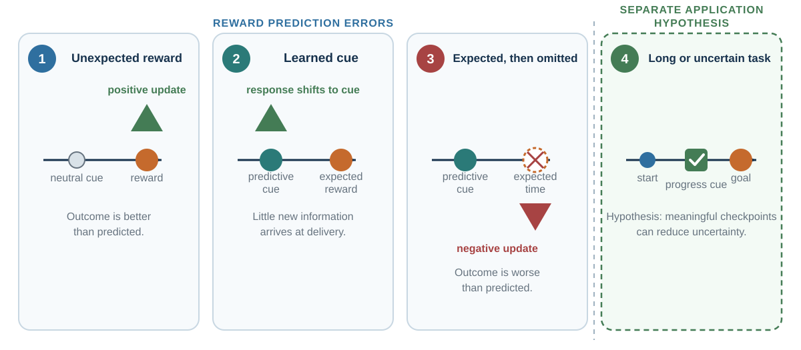
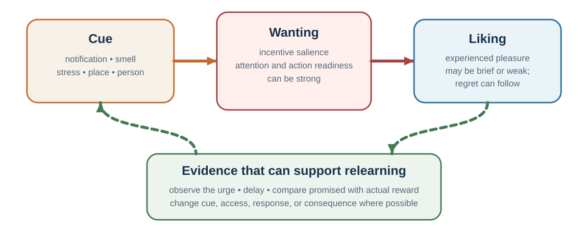
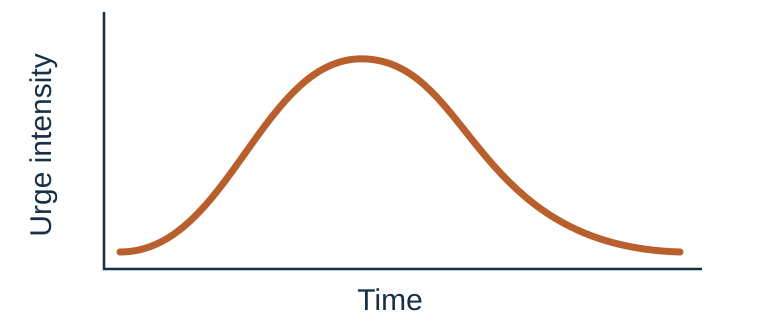

# Wanting and Self-Control: Urge Is Not Action

*Why the action can remain compelling after pleasure fades*

::: {.callout-note .core-idea icon=false}
## Core Idea

Wanting, liking, and choosing can separate. Self-control improves when an urge is treated as a prediction and bodily event rather than as a command or a moral verdict.
:::

## Learning goals

- Distinguish wanting from liking.
- Explain dopamine and reward prediction error without reducing either to pleasure or habit.
- Explain addiction as more than a bad habit or weak will.
- Use craving observation, situation selection, and precommitment.

A major source of misunderstanding in habits and addiction is the confusion between wanting and liking. People often assume that if someone strongly wants something, they must strongly like it. This is not always true.

Liking refers to pleasure or hedonic enjoyment. It is the experienced pleasure of eating, drinking, resting, laughing, winning, being touched, or feeling relief. Wanting refers to motivational pull. It is the "go get it" force that makes a cue or option feel compelling. In neuroscience, wanting is closely related to incentive salience: the process by which cues become motivationally charged.

Dopamine is often described in popular language as the pleasure chemical. That is misleading. Dopamine is strongly involved in learning, prediction, pursuit, and the energizing of action. Pleasure itself depends on additional systems, including opioid and endocannabinoid mechanisms in particular hedonic hotspots. Dopamine helps make rewards and reward cues wanted; it is not simply the feeling of liking.

This distinction explains everyday experience. A person may want to check the phone but not enjoy the content. A person may crave a cigarette but dislike the taste. A person may feel pulled toward a snack but feel disappointed after eating it. A person may pursue status while finding the pursuit stressful. A person may keep refreshing email without liking the experience. Wanting says: go get it. Liking says: this is pleasant.

Evolutionarily, this separation makes sense. Organisms must pursue food, sex, connection, safety, information, and status before they can enjoy them. A system that motivates pursuit cannot wait until pleasure is already present. It must be triggered by cues that predict possible reward. But this creates vulnerability. A cue can activate wanting even when the resulting experience is no longer very pleasurable.

A useful self-control question is: do I actually like this, or do I mainly want it? The answer can reveal whether the loop is being driven by enjoyment, relief, prediction, identity, or policy strength.

## Dopamine teaches the cue where to point

Reward prediction error makes the dopamine correction more precise. In classic recordings, an unexpected reward produced a phasic response. After learning, the response shifted toward the cue that predicted the reward. When the expected reward was omitted, activity dipped around the expected time (Schultz et al., 1997). A compact learning signal is:

$$
\delta_t = r_t - \hat r_t
$$

where $r_t$ is the outcome received and $\hat r_t$ is the outcome expected at that moment. Positive surprise supports upward updating; negative surprise supports downward updating.

Three boundaries matter.

First, reward prediction error overlaps with habit learning but does not define habit. Goal-guided learning, attention, movement, and other motivational processes also involve dopamine. Second, tonic and phasic activity, different circuits, and prolonged tasks cannot be reduced to one cartoon spike. Sustained effort often needs meaningful progress cues, not a constant burst. Third, the learning signal is not identical to pleasure. A cue can acquire incentive salience and pull action even when the eventual experience disappoints (Berridge & Robinson, 1998, 2003).

{#fig-reward-prediction-error-shift fig-alt="Four conceptual timelines. An unexpected reward produces a positive update; after learning, prediction moves to the cue and delivery brings little new information; an omitted expected reward produces a negative update; a meaningful progress checkpoint can reduce uncertainty in a long task. The figure explicitly states that it is not a neural recording." width=98%}

Read the four panels as a learning logic, not as a literal trace from one brain. What matters is where informative surprise occurs and whether a cue predicts a valued outcome—not the popular shorthand that every useful action needs a “dopamine hit.”

This creates a useful audit for an app, product, status goal, or defensive routine:

1. What does the cue promise?
2. What does the outcome actually deliver?
3. Which prediction errors are noticed, and which are ignored?
4. What underlying need—connection, relief, competence, certainty, dignity—could be met more directly?

Variable reward keeps uncertainty open, but “variable” does not mean every digital product is a slot machine. The mechanism must be demonstrated rather than asserted.

## Addiction is more than a bad habit

Addiction is often described as a bad habit, but this is incomplete. Addiction involves habit-like learning, but it is more severe, more compulsive, and more biologically and socially complex. It can involve substances such as alcohol, nicotine, opioids, stimulants, or other drugs. It can also involve behavioral patterns such as gambling, though not every repeated high-wanting behavior should be casually labeled addiction.

Clinical addiction involves impaired control, craving, continued use despite harm, and significant impairment or distress. Depending on the substance or behavior, it may also involve tolerance, withdrawal, medical risk, social disruption, trauma, and co-occurring mental health problems.

The incentive-sensitization theory of addiction argues that repeated drug use can sensitize neural systems of wanting, making drug-related cues increasingly able to trigger intense motivation. The person may not like the drug as much as before, but cues can still produce powerful wanting. This helps explain why addiction can persist even when pleasure declines. A person may say, "I do not even enjoy it anymore," yet still feel compelled (Robinson & Berridge, 1993).

Addiction can also involve relief learning and changes across stress, reward, and control systems. Substance use may begin as pleasure but continue as negative reinforcement: relief from withdrawal, anxiety, pain, shame, or dysphoria. Over time, the person may use not to feel good but to stop feeling bad (Koob & Volkow, 2016).

Moralizing addiction is ineffective and harmful. Addiction is not simply choosing pleasure over responsibility. It often involves altered learning, sensitized wanting, withdrawal, stress systems, environmental cues, social context, trauma, mental health, availability, and identity. At the same time, addiction is not destiny. Treatment can help. Depending on the case, support may include medication, therapy, contingency management, motivational interviewing, recovery groups, social support, environmental change, treatment of co-occurring mental health problems, and harm reduction.

The practical distinction is important: ordinary habit change asks how to make a behavior easier or harder. Addiction treatment often must also address craving, withdrawal, sensitized cues, stress, identity, social environment, and medical risk. This distinction prevents two mistakes: treating addiction as mere habit, and treating ordinary habits as if every strong urge were clinical addiction.

## Craving as sensation and prediction

{#fig-wanting-liking fig-alt="Cue leads to strong wanting and then an outcome with lower liking, followed by a relearning feedback loop."}

A craving can feel like a command. But an urge is not an action. It is an experience. Many self-control and mindfulness-based approaches teach people to observe cravings as sensations that rise, change, and pass. This is sometimes called urge surfing.

A craving may include bodily sensations, mental images, verbal thoughts, emotions, and action impulses. It may feel like tension in the chest, heat in the face, restlessness in the hands, an image of the desired object, a thought such as "just once," or an urge to move. When the craving is not examined, it appears as a single force: I need this. When examined, it becomes a collection of changing sensations and predictions. That can weaken its authority.

A craving also contains a prediction. It predicts that doing the behavior will bring relief, pleasure, completion, escape, or control. Sometimes that prediction is accurate in the short run. Often it is exaggerated. The cigarette may reduce withdrawal briefly but deepen the cycle. The phone may reduce boredom briefly but leave the person scattered. The angry reply may feel powerful briefly but damage trust. The snack may reduce discomfort briefly but not solve the emotion beneath it.

A useful self-control question is: what is this craving promising, and what usually happens after I obey it? That question turns craving from a command into a hypothesis.

## The intention-behavior gap

Many people know what they want to do and still fail to do it. They intend to exercise but do not. They intend to save but spend. They intend to listen but interrupt. They intend to study but scroll. They intend to sleep but keep watching. They intend to prepare for a negotiation but improvise. They intend to give feedback calmly but become defensive.

This is the intention-behavior gap. Intentions matter, but they predict behavior imperfectly. One reason is that intentions are often abstract. "I will exercise more" does not specify when, where, how, or in response to what cue. Abstract intentions must be remembered, protected from competing motives, and translated into action at the right moment. Habits, by contrast, are cue-linked.

A second reason is that intentions are often formed in cool states but executed in hot states. A person plans to eat well when full, but encounters dessert when tired and stressed. A student plans to study in the morning, but feels bored and anxious when the difficult work begins. A manager plans to listen, but feels status threat when challenged. Loewenstein (1996) called this the hot-cold empathy gap: people underestimate how much preferences and behavior change across visceral states such as hunger, craving, anger, fear, pain, fatigue, and arousal.

A third reason is that environments are often designed against intentions. If unhealthy food is visible, notifications are constant, meetings reward fast talking, and social norms celebrate overwork, individual intention must fight the environment repeatedly. The environment usually wins.

A fourth reason is that immediate rewards are concrete while long-term rewards are abstract. The pleasure of scrolling, eating, avoiding, or buying is immediate. The benefits of health, learning, savings, trust, or reputation are delayed. Temporal distance weakens value. Behavior change becomes easier when long-term goals are translated into immediate cues, actions, and rewards.

### The marshmallow is not a personality test

The classic delay-of-gratification task is often retold as if a child's waiting time reveals a durable supply of willpower and forecasts destiny. That story is too clean. Waiting also depends on attention strategies, beliefs about whether the promised later reward will arrive, incentives, family and environmental conditions, and what the child has learned about adult reliability (Mischel et al., 1989; Kidd et al., 2013). A child facing an unreliable environment may be making a reasonable prediction, not revealing a defective character.

The broader lesson is central to self-control: before praising or blaming inhibition, inspect the environment the person is predicting.

## Self-control without heroics

Self-control is often imagined as an internal battle: the rational self fights temptation, and success depends on willpower. There is some truth here. People sometimes need to inhibit impulses. But the willpower model is too narrow.

Beneficial self-control often operates upstream through situation selection and reliable habits rather than constant resistance at the moment of temptation (Galla & Duckworth, 2015; Duckworth et al., 2016).

The influential ego-depletion theory proposed that self-control draws on a limited resource that can become depleted after use. The idea became widely known: self-control is like a muscle that gets tired. A large preregistered multilab replication, among other challenges, raised serious questions about the size and reliability of the effect (Hagger et al., 2016). The evidence no longer supports a simple fuel-tank model.

A better applied view is that self-control depends on motivation, attention, beliefs, emotions, opportunity, fatigue, reward, identity, social support, and situation. People may shift away from effortful control when it feels unrewarding, when attention is captured elsewhere, when temptation is salient, or when the goal no longer feels valuable.

People with strong self-control often do not succeed by constantly resisting temptation. They succeed by avoiding tempting situations, creating routines, changing environments, and making desired behavior easier. Good self-control often looks less like heroic resistance and more like wise design.

A person who keeps no cigarettes at home does not resist smoking at home. A student who studies in the library does not resist the bed. A person who turns off notifications does not resist every alert. A family that prepares healthy meals in advance does not decide under hunger and fatigue. A negotiator who writes a reservation price before entering the room does not invent discipline under pressure.

The design question is not "How do I become someone with infinite willpower?" The better question is: how do I make the desired action less dependent on willpower?

| Stage | Tool | Why it helps |
| --- | --- | --- |
| Before the cue | Situation selection, availability, precommitment. | Prevents the strongest loop from being activated. |
| At the cue | Prompt, if–then plan, replacement action. | Makes the desired response retrievable. |
| During the urge | Name sensations, urge surf, delay, BRAIN/RAIN. | Turns a command into a changing experience. |
| After action | Immediate feedback and nonmoralizing review. | Updates the promised reward against the actual experience. |
| After lapse | Recovery plan and next-cue restart. | Prevents one lapse from becoming an identity and a streak. |
: Intervene before the peak of temptation {#tbl-20-1}

## Creating space between cue and response

Mindfulness is the practice of paying attention to present-moment experience with openness, curiosity, and reduced automatic reactivity. Meditation is one way to train this capacity. In the context of habits and self-control, mindfulness matters because it creates space between cue and response.

A cue appears. The body reacts. A thought arises. A craving forms. An impulse pushes toward action. Normally, the response happens automatically. Mindfulness inserts awareness into the sequence. Instead of "I need to check my phone," the person notices, "Restlessness is here." Instead of "I must eat something," the person notices, "Anxiety feels like hunger." Instead of "I have to reply angrily," the person notices, "My body is preparing to defend."

This shift is sometimes called decentering or cognitive defusion: thoughts and urges are experienced as mental events rather than as facts or commands. The person is not eliminating the urge. They are changing their relationship to it.

{#fig-urge-wave-observation fig-alt="A schematic urge-intensity curve rises and recedes over unspecified time, with faint alternative trajectories to emphasize variation. Four observation steps below the curve are breathe, recognize and allow, investigate, and non-identify and choose." width=88%}

The curve does not promise that every craving passes quickly or safely. Its purpose is narrower: replace the single label “I need this” with observations that can be tracked, tested, and—when appropriate—brought to clinical support.

Mindfulness is not a cure-all. It does not replace medical treatment, social support, behavior design, or structural change. For some people, especially those with trauma histories, intensive meditation can be difficult or destabilizing if not properly supported. It should be presented as a useful tool, not a universal solution or moral demand.

A practical classroom tool is BRAIN, a short adaptation of mindfulness methods such as RAIN. BRAIN is useful when an internal trigger appears: craving, anger, anxiety, boredom, shame, avoidance, or defensiveness.

| Step | In-the-moment prompt | Function |
| --- | --- | --- |
| **B — Breathe** | Take one breath before acting. | Interrupt the automatic sequence without pretending the breath solves the problem. |
| **R — Recognize** | Name the state: wanting, anger, anxiety, avoidance, shame. | Move from command to observation. |
| **A — Allow** | Let the experience be present briefly without suppression or obedience. | Reduce the secondary struggle. |
| **I — Investigate** | Where is it in the body? What does it predict? What action and relief does it promise? | Turn the urge into data. |
| **N — Non-identify and nurture** | “This is an urge, not my identity.” What is the next wise, caring action? | Protect agency and choose by values. |
: BRAIN creates a small interval between internal cue and action {#tbl-20-brain}

BRAIN is a classroom mnemonic, not an independently validated treatment. It can organize mindfulness, acceptance, and decentering practices; it cannot make an unsafe workplace safe, treat withdrawal, or replace clinical care.

::: {.callout-caution .evidence-and-boundary-conditions icon=false}
## Dopamine and addiction require narrower claims

- **Dopamine:** It is not a unitary pleasure chemical. It participates in learning, prediction, motivation, and action across distributed circuits.
- **Clinical addiction:** It can involve withdrawal, medical risk, trauma, and comorbidity. Ordinary habit advice is not a substitute for professional treatment.
:::

## Key ideas

- Wanting, liking, and choosing can separate. Self-control improves when an urge is treated as a prediction and bodily event rather than as a command or a moral verdict.
- Reward prediction error describes updating from better- or worse-than-expected outcomes; it is not a synonym for pleasure or habit.
- Strong wanting can outlast liking, while a variable outcome can keep the cue informative.
- Self-control often improves upstream through situation selection, attention design, precommitment, and trustworthy environments.
- Urge surfing and BRAIN create observation and choice; clinical addiction requires additional assessment and care.

## Study and practice

1. How would you distinguish wanting, liking, and choosing in a disappointing digital loop?

2. What happens to a reward-prediction signal when a reward is unexpected, predicted by a cue, or omitted?

3. Why is the marshmallow task an environmental prediction problem as well as a self-control task?

::: {.callout-tip .activity icon=false}
## One-Minute Urge-Surfing Lab

Choose a mild, private impulse; skip the exercise if observation would be unsafe or destabilizing. For sixty seconds, locate sensations, images, emotion, prediction, and action tendency. Note whether intensity changes without obeying or suppressing it. Then write what the urge promised, what the action usually delivers, and the next action you chose.

EXPERIENCE - EXPLAIN - APPLY (MAXIMUM 120 WORDS)  
Experience: describe the specific mild impulse. Explain: use wanting/liking, prediction, or decentering accurately. Apply: state one upstream change or replacement response.
:::

::: {.callout-note icon=false}
## Optional Media: Watch the Cue Move

View a short excerpt from [Wolfram Schultz on dopamine and reward prediction](https://www.youtube.com/watch?v=pLqgakCXW5Q). Before viewing, predict what should happen when a reward is unexpected, when a cue reliably predicts it, and when the predicted reward is omitted. Afterward, identify one accurate learning claim and one “dopamine equals pleasure” overclaim the evidence does not support.
:::

## References cited in this chapter

::: {.reference}
Berridge, K. C., & Robinson, T. E. (1998). What is the role of dopamine in reward: Hedonic impact, reward learning, or incentive salience? Brain Research Reviews, 28(3), 309–369.
:::

::: {.reference}
Berridge, K. C., & Robinson, T. E. (2003). Parsing reward. Trends in Neurosciences, 26(9), 507–513.
:::

::: {.reference}
Duckworth, A. L., Gendler, T. S., & Gross, J. J. (2016). Situational strategies for self-control. Perspectives on Psychological Science, 11(1), 35-55.
:::

::: {.reference}
Galla, B. M., & Duckworth, A. L. (2015). More than resisting temptation: Beneficial habits mediate the relationship between self-control and positive life outcomes. Journal of Personality and Social Psychology, 109(3), 508-525.
:::

::: {.reference}
Hagger, M. S., Chatzisarantis, N. L. D., Alberts, H., Anggono, C. O., Batailler, C., Birt, A. R., Brand, R., Brandt, M. J., Brewer, G., Bruyneel, S., Calvillo, D. P., Campbell, W. K., Cannon, P. R., Carlucci, M., Carruth, N. P., Cheung, T., Crowell, A., De Ridder, D. T. D., Dewitte, S., et al. (2016). A multilab preregistered replication of the ego-depletion effect. Perspectives on Psychological Science, 11(4), 546-573.
:::

::: {.reference}
Kidd, C., Palmeri, H., & Aslin, R. N. (2013). Rational snacking: Young children's decision-making on the marshmallow task is moderated by beliefs about environmental reliability. Cognition, 126(1), 109-114.
:::

::: {.reference}
Koob, G. F., & Volkow, N. D. (2016). Neurobiology of addiction: A neurocircuitry analysis. The Lancet Psychiatry, 3(8), 760-773.
:::

::: {.reference}
Loewenstein, G. (1996). Out of control: Visceral influences on behavior. Organizational Behavior and Human Decision Processes, 65(3), 272-292.
:::

::: {.reference}
Mischel, W., Shoda, Y., & Rodriguez, M. L. (1989). Delay of gratification in children. Science, 244(4907), 933-938.
:::

::: {.reference}
Robinson, T. E., & Berridge, K. C. (1993). The neural basis of drug craving: An incentive-sensitization theory of addiction. Brain Research Reviews, 18(3), 247-291.
:::

::: {.reference}
Schultz, W., Dayan, P., & Montague, P. R. (1997). A neural substrate of prediction and reward. Science, 275(5306), 1593-1599.
:::
