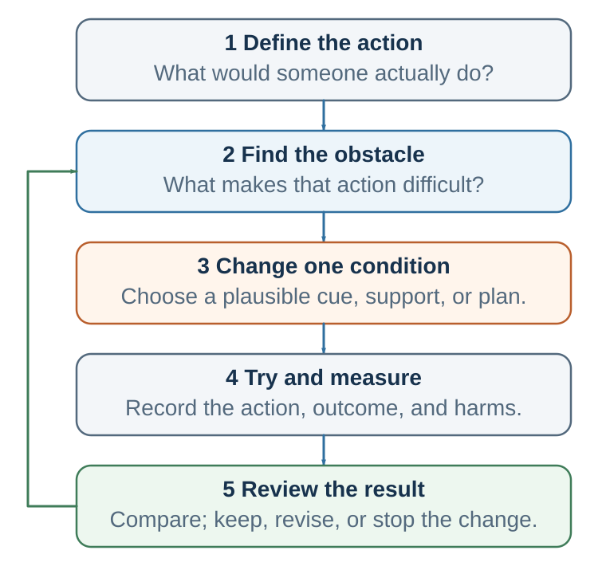

# Designing Behavior

*Cues, ability, prompts, friction, plans, identity, and recovery*

::: {.callout-note .core-idea icon=false}
## Core Idea

Behavior changes when the moment makes the action possible: a cue is noticed, the behavior is easy enough, a prompt arrives, and the immediate consequence supports repetition.
:::

{#fig-behavior-design fig-alt="A five-layer stack from environment through motivation, ability, prompt, and recovery."}

## Learning goals

- Use implementation intentions and WOOP.
- Diagnose behavior with B=MAP and COM-B.
- Change friction, prompts, defaults, context, and immediate reward.
- Evaluate behavior design for autonomy, welfare, transparency, and reversibility.

Behavior change is difficult because habits are cue-based, rewards are immediate, and environments are powerful. But several tools reliably improve the odds. A useful toolkit begins with diagnosis rather than prescription.

COM-B is a simple diagnostic model: behavior occurs when capability, opportunity, and motivation converge. Capability asks whether the person can do the behavior: do they have skill, knowledge, energy, and physical ability? Opportunity asks whether the environment, time, tools, social context, and system make the behavior possible. Motivation asks whether reflective and automatic processes point toward the behavior. A motivational speech cannot fix a broken opportunity structure.

The Fogg Behavior Model offers a complementary lens: behavior happens when motivation, ability, and prompt converge. For repeated behavior, making action easier often beats trying to make motivation permanently higher. Motivation is weather. Ability and prompts are architecture.

Implementation intentions turn vague goals into cue-linked behaviors. Instead of saying "I will study more," a student says: "If I finish breakfast on weekdays, then I open the lecture notes for twenty-five minutes before email." Instead of "I will be less defensive," a manager says: "If I receive criticism, then I ask one clarifying question before explaining." Instead of "I will save money," a person says: "If I receive my salary, then I transfer 10 percent to savings immediately."

WOOP adds a useful self-regulation bridge: Wish, Outcome, Obstacle, Plan. The person identifies a meaningful wish, imagines the valued outcome, identifies the real internal or contextual obstacle, and forms an if-then plan. WOOP works because it refuses fantasy while preserving agency. It asks people to connect a valued future to the obstacle that will actually appear.

Friction is a behavioral force. To increase a behavior, reduce friction. To decrease a behavior, increase friction. Keep the book visible and the phone away. Remove saved payment information. Put exercise clothes by the bed. Create a meeting template. Make near-miss reporting simple and nonpunitive. Require a decision question before scheduling a meeting. Many behaviors live near the margin; small barriers and small ease can have large effects.

Temptation bundling attaches an immediate reward to a beneficial behavior whose benefits are delayed. A person might listen to a favorite podcast only while exercising, drink special coffee only while reading difficult material, or meet a friend only after a study session. The bundle works best when the tempting reward is reserved for the desired behavior and does not sabotage the goal.

Precommitment protects future behavior from predictable future states. Examples include automatic savings, self-imposed or externally structured deadlines, app blockers, accountability partners, public commitments, smaller plates, cancellation penalties, locked accounts, or working with a partner. A good commitment device preserves dignity and allows recovery after failure. A bad one creates shame without changing the loop.

Identity can support behavior change when behavior becomes evidence for the kind of person one is becoming. "I am trying to run" is different from "I am becoming a runner." "I am trying to be more careful" is different from "I am someone who checks assumptions." But identity can also trap. "I am a procrastinator," "I am bad with money," and "I work best under pressure" can become instructions. The healthiest identity statements are process-based and flexible: "I am becoming someone who practices."

Relapse planning prevents all-or-nothing collapse. A lapse tells you which cue, state, or friction you underestimated. The question is not "What is wrong with me?" but "What did the loop learn?" A useful plan is: if I miss once, then I restart at the next cue. A lapse is not a verdict; it is a bug report.

## DPN applications

Habits matter in this course because decision, persuasion, and negotiation skills usually fail under pressure. The goal is not only to know the right concept, but to have a prepared response when the cue appears.

Decision habits make good judgment easier before analysis begins. Examples include pausing before a high-stakes decision, writing the opportunity cost, asking for the base rate, separating prediction from valuation, running a premortem, checking whether the current evidence would change the decision, and recording assumptions before the outcome is known. These habits protect judgment from vivid anecdotes, overconfidence, and outcome bias.

Persuasion habits shift the focus from one-off messaging to ethical behavior architecture. A persuader asks what the audience already believes, what cue will make the behavior visible, what obstacle makes the desired behavior hard, what immediate reward or feedback can support it, and whether the design preserves autonomy. Persuasion becomes questionable when it hides the trigger, exploits vulnerability, makes exit difficult, or optimizes compliance over welfare.

Negotiation habits are scripts for pressure. Preparation should become automatic before tactical advice is introduced. A negotiator can habitually prepare BATNA, reservation value, aspiration, issues, interests, options, and questions. During the negotiation, useful automatic scripts include: pause before conceding; label tension; ask what assumption makes the proposal hard; ask which issue matters most; summarize before disagreeing; debrief after the outcome. Under pressure, people rarely rise to their abstract values. They fall to rehearsed scripts.

The same habit logic operates across the course: decision habits protect thought, persuasion habits design transparent paths, and negotiation habits prepare behavior for stress.

## Organizational habits

Habits do not exist only in individuals. Organizations have habits too. They are usually called routines: repeated patterns of behavior involving multiple people, roles, tools, and expectations. Organizations have routines for hiring, meetings, budgeting, customer service, safety checks, product launches, promotions, conflict, reporting, and crisis response. Some routines are written procedures. Others are unwritten habits: how people really do things.

Routines store organizational knowledge, coordinate action, reduce uncertainty, and allow complex work to happen without constant redesign. They can be valuable. A hospital checklist can prevent errors. A manufacturing routine can ensure quality. A customer service routine can create reliability. A research lab routine can preserve standards. A meeting routine can clarify decisions. A safety routine can protect lives.

But organizational routines can also become traps. A team may automatically punish bad news, leading people to hide problems. A company may approve projects because senior leaders like them, not because evidence supports them. A meeting may always begin with updates rather than decisions, wasting attention. A sales team may chase short-term revenue even when it damages trust. A committee may delay action by asking for more information even when the information will not change the decision. A leadership team may respond to failure with blame rather than learning.

These patterns persist because they have rewards. Blame provides immediate emotional relief. Avoiding conflict preserves temporary harmony. Delaying a decision reduces responsibility. Overworking signals commitment. Saying yes to senior leaders protects status. Focusing on measurable metrics creates clarity. These rewards may be short-term, but they maintain routines.

Changing organizational habits requires more than announcing new values. If an organization says "we value learning" but punishes every mistake, the real habit remains blame. If it says "we value innovation" but rewards only predictable success, the real habit remains caution. If it says "we value collaboration" but promotes individual heroes, the real habit remains competition.

To change organizational habits, leaders must change cues, incentives, scripts, roles, and feedback. If the goal is psychological safety, meetings must include routines for dissent, questions, and nonpunitive error discussion. If the goal is better hiring, the cue of "candidate interview" must trigger structured criteria rather than informal impressions. If the goal is better decisions, major proposals must trigger premortems, outside-view analysis, and decision logs. If the goal is customer focus, dashboards must show customer outcomes, not only internal efficiency.

A culture is not what an organization says. It is what it repeatedly does.

## Mini-case: the defensive meeting loop

A product team says it wants psychological safety and better decisions. Yet every Monday meeting follows the same pattern. A project lead presents progress. A senior manager asks a skeptical question. The project lead hears the question as criticism and begins explaining why the team made reasonable choices. Other members go quiet. The manager interprets the defensiveness as lack of ownership and asks more pointed questions. The project lead becomes more defensive. The meeting ends with action items but little learning.

Nobody intended to create this pattern. The senior manager intended to improve the project. The project lead intended to protect the team. Other members intended to avoid conflict. But together they created a routine.

A habit analysis changes the diagnosis. The cue is a skeptical question in a public meeting. The urge is self-protection and status defense. The response is explanation, interruption, or withdrawal. The immediate reward is dignity protection and temporary certainty. The long-term cost is weaker learning, less candor, and a stronger belief that meetings are unsafe.

A redesigned routine would not begin with a motivational speech about openness. It would change the loop. Before each update, the team names one uncertainty and one assumption that could be wrong. The manager asks: "What would be most useful for us to challenge?" The project lead has an implementation intention: if a question feels like criticism, then I will first ask, "Can you say more about the risk you are seeing?" A second person is assigned to summarize the strongest concern before action items are set. The meeting ends with one learning note, not only tasks.

The new routine gives the old cue a better response. Critique no longer automatically means status threat. It becomes information. The reward shifts from self-protection to useful clarity. Over time, the team can learn that disagreement is not danger but data.

This case illustrates the deepest practical lesson of habit science: do not rely on the self you hope will appear in the moment. Design for the self and the team that will actually be there.

## Habit design is power

Understanding habits creates power. If cues trigger behavior, the person who controls cues has power. If friction shapes action, the person who sets friction has power. If defaults make one behavior feel normal, the person who sets the default has power. If variable rewards keep attention searching, the person who designs the reward schedule has power.

This power can be used ethically or manipulatively. Ethical habit design helps people do what they would endorse under reflection. It clarifies information, reduces needless friction, protects autonomy, supports long-term welfare, and creates feedback that reveals whether the intervention helps. Manipulative design hides triggers, exploits vulnerability, captures attention, makes exit difficult, or optimizes the designer's goal at the decision-maker's expense.

The ethical question is not simply whether an intervention works. It is what kind of person, relationship, organization, and world the loop helps create. A study routine, safety checklist, or negotiation preparation script can expand agency. A dark pattern, addictive engagement loop, or shame-based commitment device can reduce it.

Good habit design should pass five tests: autonomy, transparency, welfare, reversibility, and evidence. Does the person retain meaningful choice? Would the design survive explanation? Does it serve the person's endorsed goals? Can the person exit or revise the loop? Will feedback reveal benefits and harms rather than hiding them in flattering metrics?

## Designing a life that decides well

The chapter began with a simple idea: repeated behaviors stop feeling like decisions. They become habits. This can sound discouraging, but it is also hopeful. If bad habits can become automatic, good habits can too.

A good life does not require making every good decision from scratch. It requires building systems that make good decisions more likely. A person who wants to become healthier can rely on daily motivation, but motivation fluctuates. A habit-based approach designs the environment: exercise clothes placed by the bed, workouts scheduled with a friend, healthy food prepared in advance, snacks kept out of sight, walking built into commuting, sleep routines protected, and progress tracked. The person is not stronger every day. The system is stronger.

A student who wants to learn better can promise to study harder. A habit-based approach creates a fixed study location, blocks distracting websites, uses short timed sessions, begins with a specific cue, reviews notes after class, asks questions weekly, and studies with others at scheduled times. Learning becomes less dependent on mood.

A manager who wants to listen better can promise to be more open. A habit-based approach uses a meeting rule: ask two questions before giving an opinion, summarize the other person's point before disagreeing, and end by asking what was not said. Listening becomes a routine.

An organization that wants better decisions can tell people to be rational. A habit-based approach creates decision templates, requires alternatives and opportunity costs, assigns a devil's advocate, uses premortems, logs predictions, and reviews outcomes without blame. Decision quality becomes a routine rather than a personality trait.

Do not rely on the self you hope will appear in the moment. Design for the self who will actually be there: tired, hungry, rushed, proud, threatened, distracted, tempted, social, and human. Good systems respect that reality.

Chapter 18 showed how the narrating self can rationalize actions after they occur. Habits explain how repeated behavior can happen without much deliberation. Rationalization explains what often happens afterward: the mind tells a story about why the behavior made sense. To improve decisions, we need to understand not only how habits act, but how the self explains them.

## Digital habits and attention defense

Modern habit science is incomplete without the digital environment. Phones, feeds, platforms, games, messaging systems, market dashboards, and work tools compress cues, rewards, social signals, novelty, and friction into portable loops. A phone is not one habit. It is a pocket full of habits: communication, status checking, escape, uncertainty reduction, entertainment, work monitoring, shopping, comparison, outrage, and reassurance.

Digital habits are sticky because they combine several behavioral forces. The cue is always nearby. The action requires little effort. The reward is variable: sometimes a message, sometimes a like, sometimes a problem, sometimes nothing. The feedback is fast. The loop can begin in many contexts: bed, classroom, meeting, family dinner, commute, work break, or boredom. The same device collapses contexts that used to be separate.

## Fresh starts, identity, and social context

Several themes from the source chapters deserve explicit integration because they keep behavior change from becoming a purely individual or motivational story. Habits are supported by stable contexts. When contexts change, old habits may weaken and new ones may become possible. But contexts are not only physical. They are also social and identity-based. People repeat behaviors partly because those behaviors answer the question: What do people like us do, and who am I becoming when I do this?

## DPN habit scripts

Decision, Persuasion, and Negotiation are learned practices. Students do not improve only by learning definitions. They improve when better behaviors become easier, prompted, rewarded, protected, ethically embedded, and connected to obstacle-sensitive plans. A DPN habit script converts a principle into a cue-linked action that can survive pressure.

## Relapse, recovery, and ethics

Behavior change almost always includes lapses. A lapse is not a verdict on identity. It is a bug report from the loop. It tells the designer which cue, state, reward, friction, social pressure, or obstacle was underestimated. A good design therefore includes recovery before failure occurs.

::: {.callout-caution .evidence-and-boundary-conditions icon=false}
## Evidence And Boundary Conditions

The classic ego-depletion account of willpower as a depletable resource has faced serious replication and measurement challenges. Fatigue, motivation, beliefs, opportunity costs, and context still matter, but no single "willpower fuel" should be assumed.
:::

| Tool | Best used when... | Example |
| --- | --- | --- |
| Implementation intention | The goal is clear but follow-through fails at the critical moment. | If I feel the urge to explain during feedback, then I ask one clarifying question first. |
| WOOP | Positive intention needs an honest obstacle and a concrete plan. | Wish: prepare earlier. Outcome: calm negotiation. Obstacle: vague starting point. Plan: if unclear, then write three interests. |
| Friction design | The behavior is sensitive to small barriers or ease. | Phone outside bedroom; saved card removed; document opened before leaving work. |
| Temptation bundling | The desired behavior has delayed benefits and needs immediate reward. | Only listen to a favorite audiobook while walking. |
| Precommitment | Future states predictably defeat current intentions. | Automatic savings, scheduled class, app blocker, accountability partner. |
| Context change | Old cues keep recruiting the old behavior. | Use a new study location, new commute, new meeting script, or new semester routine. |
| BRAIN / urge surfing | The urge is already active and cannot be avoided upstream. | Breathe, recognize, allow, investigate, non-identify, then choose. |
| Relapse plan | A missed repetition could become identity proof. | If I miss once, then I restart at the next cue with the smallest version. |
: Behavior-change tools and their best uses {#tbl-21-1}

## Key ideas

- Behavior changes when the moment makes the action possible: a cue is noticed, the behavior is easy enough, a prompt arrives, and the immediate consequence supports repetition.

Mental contrasting, friction, prompts, defaults, and context change influence whether motivation becomes behavior (Oettingen, 2012; Johnson & Goldstein, 2003; Dai et al., 2014).

Implementation intentions strengthen the link between a specified cue and a planned response, especially when paired with a meaningful goal (Gollwitzer, 1999; Gollwitzer & Sheeran, 2006).

- Use implementation intentions and WOOP.
- Diagnose behavior with B=MAP and COM-B.
- Change friction, prompts, defaults, context, and immediate reward.

## Study and practice

1. How would you use implementation intentions and woop in practice?

2. Diagnose behavior with B=MAP and COM-B?

3. Change friction, prompts, defaults, context, and immediate reward?

::: {.callout-tip .activity icon=false}
## Activity

Design a one-week intervention for one behavior. Specify the cue, smallest viable action, ability or friction change, prompt, immediate reward, measurement, recovery plan, and ethical check.  
EXPERIENCE - EXPLAIN - APPLY (MAXIMUM 120 WORDS)  
Experience: describe one specific decision, interaction, or observation. Explain: use one or two concepts from this chapter accurately. Apply: state one improvement, implication, or testable prediction.
:::

## References cited in this chapter

::: {.reference}
Dai, H., Milkman, K. L., & Riis, J. (2014). The fresh start effect: Temporal landmarks motivate aspirational behavior. Management Science, 60(10), 2563-2582.
:::

::: {.reference}
Gollwitzer, P. M. (1999). Implementation intentions: Strong effects of simple plans. American Psychologist, 54(7), 493-503.
:::

::: {.reference}
Gollwitzer, P. M., & Sheeran, P. (2006). Implementation intentions and goal achievement: A meta-analysis of effects and processes. Advances in Experimental Social Psychology, 38, 69-119.
:::

::: {.reference}
Johnson, E. J., & Goldstein, D. (2003). Do defaults save lives? Science, 302(5649), 1338-1339.
:::

::: {.reference}
Oettingen, G. (2012). Future thought and behaviour change. European Review of Social Psychology, 23(1), 1-63.
:::
