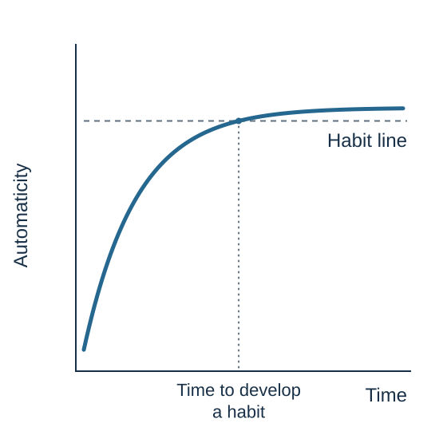

---
aliases:
  - 19-habits-when-decisions-move-downstairs.html
format:
  html:
    include-in-header:
      text: |
        
---

# Habits, Wanting, and Self-Control

::: {.content-visible unless-format="epub"}
[]{#habits-wanting-and-self-control}
:::

*The past can cue action before the present has finished deciding*

::: {#chapter-21-start .chapter-epigraph}
> “All our life, so far as it has definite form, is but a mass of habits.”
>
> — William James, [*Talks to Teachers on Psychology*](https://www.gutenberg.org/files/16287/16287-h/16287-h.htm), 1899, ch. VIII
:::

Imagine a student getting into bed and opening a social media feed for a quick look. A few posts are entertaining; most are forgettable. Twenty minutes later, the student is still scrolling.

The student is tired and would prefer to sleep. The last few posts were not particularly enjoyable. Yet the thumb moves again: perhaps the next one will be better.

There are two actions to explain. Opening the feed may have become a familiar response to getting into bed with the phone. Continuing to scroll may also reflect the attraction of what the next post could offer. The cost becomes clear when a quick look repeatedly ends later than intended, leaving less time available for sleep.

::: {.callout-note .core-idea icon=false}
## Core Idea

Repetition can teach a familiar situation to trigger a response with little deliberation. This makes useful routines easier to carry out, but it can also keep an unwanted action going. Changing the pattern begins with understanding its cues and consequences, then making a better response easier to repeat.
:::

## Learning goals

- Explain how a repeated action can become a habit, and why frequency alone is insufficient to identify one.
- Distinguish habits from habituation, and wanting an outcome from enjoying it.
- Explain how reward predictions guide learning and pursuit, and why a near miss can encourage another attempt without improving its odds.
- Use observations of cues, urges, and consequences to distinguish possible explanations of a recurring action.
- Design a specific replacement response to a familiar cue and explain how repetition can make it more automatic.
- Explain how suppression and self-blame can interfere with change, practice observing an urge, and respond to a lapse with a concrete adjustment.

Before reading on, recall one ordinary action you sometimes find yourself doing before you meant to. Keep that episode in mind as we continue our discussion.

## What is a habit?

The first few times the student opened the feed in bed, there may have been a clear reason: catching up with friends or enjoying a few posts at the end of the day. Those outcomes gave the student a reason to return. With repetition in the same setting, getting into bed with the phone could begin to bring opening the feed to mind, even before the student considered whether there was anything worth seeing.

A **habit** is a learned association through which a context cue retrieves a response, while **automaticity** describes how readily that response starts with little deliberate guidance. Research on everyday routines emphasizes how repeating an action in a recurring context can make familiar cues prompt that action with less need for a fresh decision (Wood et al., 2002; Wood & Neal, 2007).

Frequency alone does not tell us whether an action is habitual. A student might check a course website every day because the instructor has promised an important update, with each visit following a fresh judgment that the information is needed. The same number of visits could instead result from opening the site whenever the laptop starts, even after the announcement period ends.

[]{#following-a-goal-or-following-a-cue}

[]{#goal-directed-behavior-and-habitual-behavior}

**Goal-directed behavior** is guided by the expected consequences of an action and their current value: the student checks because the expected update matters now. **Habitual behavior** is prompted more directly by a learned association between a context cue and a response: opening the laptop brings checking the site to mind. Both can contribute to the same activity, as when a person chooses to study for an exam and relies on familiar routines to get started.

Goal-directed actions need not involve slow, explicit reasoning, and people can notice a habit while performing it. The research notes at the end explain how different methods test what guides a response.

There is considerable value in having useful actions become easy. If finishing lunch reliably brings to mind putting on walking shoes, a person does less negotiating before a planned walk begins. Good habits help turn knowledge into practice, although a response learned in the past can remain available after its usefulness has changed.

## How habits form

We can follow the start of the student's bedtime routine using **CIAO**: a **cue**, an **impulse**, an **action**, and an **outcome**. Getting into bed with the phone is the cue; readiness to open the feed is the impulse; unlocking the phone and opening the app is the action; and the first posts provide an outcome, whether interesting or disappointing. Here, *impulse* means readiness to act, which need not be consciously felt or acted on (Gardner, 2015).

{#fig-habit-loop fig-alt="Four equal segments form a ring: Cue, Impulse, Action, and Outcome. Three solid clockwise arrows trace an episode in that order. A dashed arrow from Outcome to Cue marks a later encounter with the cue. Learning across repetitions appears in the center." .phone-fit}

In @fig-habit-loop, learning concerns how responding changes across repeated episodes. Reward or relief can encourage repetition, through which a familiar cue becomes associated with the action and brings it to mind more readily (Wood & Neal, 2007). Once established, that association can persist without a satisfying outcome each time (Wood & Rünger, 2016). This helps explain why opening the feed could become easy to repeat even on nights when it offers little enjoyment.

[]{#a-learning-curve-not-a-deadline}

How long does it take for a planned action to become easier to start? Returning to the walk after lunch, each repetition gives the familiar occasion another chance to prompt the response.

Lally and colleagues (2010) followed people trying to establish everyday behaviors in a consistent context. The schematic curve in @fig-habit-formation-curve represents diminishing gains in reported automaticity. The median modeled time to reach 95% of the plateau was 66 days, with estimates from 18 to 254 days among participants whose data fitted the curve well.[^ch21-plateau]

{#fig-habit-formation-curve fig-alt="An automaticity curve crosses a horizontal dashed habit line at 95% of the plateau, labeled on the right. A vertical dotted line runs from the crossing to the time axis." width=100% fig-align="center" style="max-width: 560px !important;" .phone-fit}

The useful question is whether the chosen action is becoming easier to start when its cue occurs. A brief walk after lunch gives that question a concrete answer; a resolution to become healthier does not yet specify what to repeat.

[]{#habituation-and-reward-expectations}

Repetition can produce another kind of learning: **habituation**, a decline in response to a repeated stimulus beyond sensory adaptation or fatigue. Turning less often toward a harmless sound that keeps recurring is an everyday example. Responding can recover after a break (Rankin et al., 2009). A habit makes a practiced action easier to trigger; habituation reduces a response to repeated stimulation.

## Why an unrewarding routine can persist

If a habit was learned through useful or satisfying actions, why does disappointing experience fail to stop it? Two possibilities deserve attention. A familiar setting may still retrieve the practiced response. Or the action may deliver a small, immediate benefit that is easy to overlook when judging the whole episode.

[]{#the-popcorn-people-kept-eating}

Neal and colleagues (2011) gave cinema visitors fresh or week-old popcorn. People with weaker cinema-popcorn habits ate less stale popcorn; those with stronger habits ate similar amounts of fresh and stale popcorn despite liking the stale popcorn less. Consumption was measured by weighing what remained.

The context comparison used a separate group eating popcorn while watching music videos in a campus meeting room, rather than trailers at the cinema. There, even strong cinema-popcorn habits did not sustain stale-popcorn consumption. Participants were not randomly assigned to the two settings.

In a second cinema experiment, participants held a modified popcorn box by a side handle with a designated hand, leaving the other hand for eating. Requiring the nondominant eating hand weakened the habitual pattern: consumption became more sensitive to freshness. Habit strength was measured, whereas popcorn freshness and eating hand were manipulated. Together, the studies connect persistent responding to familiar circumstances and practiced execution.

[]{#what-checking-accomplishes}

Once the feed is open, an occasional entertaining post, a friend's update, or a moment of relief from boredom may make the next swipe attractive. Judged over twenty minutes, the student may regret continuing; judged at the moment of a swipe, another post may still seem worth seeing. The immediate attraction and the cost of stopping late occur on different timescales.

To investigate that explanation, ask what changes after a swipe: does something enjoyable appear, does boredom recede, or does the student simply move on with little awareness? A deliberate search for a particular update would give a different account from opening the app automatically or continuing in hope of finding something interesting.

Learning theory distinguishes consequences by what they do to future behavior. If receiving interesting content makes scrolling more likely, that is **positive reinforcement**; if relief from boredom makes it more likely, that is **negative reinforcement**. Both strengthen responding. *Negative* refers to removing an aversive condition, whereas **punishment** concerns consequences that reduce a response (Skinner, 1953).

## Wanting, liking, and reward learning {#wanting-can-outlast-liking}

The student has enjoyed little of the last few minutes, yet still feels drawn to see the next post. Separating **wanting**, or motivational attraction, from **liking**, or experienced pleasure, helps explain why pursuit can continue after enjoyment has faded (Berridge & Robinson, 1998).

**Incentive salience** is the process through which reward-associated cues become motivationally attractive. A cue can draw approach even when the reward provides little pleasure. This research use of “wanting” is more specific than the everyday use of the word for any conscious wish: the motivational pull need not depend on an explicit forecast of pleasure or relief (Berridge & Robinson, 1998).

Wanting also differs from habit. Feeling drawn to see another post describes a motivational pull; opening the feed automatically describes how a learned response begins. Both can contribute to the same episode.

### The neural foundations of wanting and liking

Berridge and Robinson (1998) reported that severe dopamine depletion disrupted rats' spontaneous feeding, yet positive reactions to sucrose delivered into the mouth remained. Their **taste-reactivity** measure recorded characteristic facial and mouth movements. These findings separate the motivation to obtain a reward from its hedonic impact. Mesolimbic dopamine pathways, which connect the midbrain with regions including the nucleus accumbens, contribute to reward pursuit.

Rat studies have also identified **hedonic hotspots**: small brain regions where particular forms of stimulation amplify positive reactions to a pleasant stimulus. Hotspots in the nucleus accumbens shell and posterior ventral pallidum interact in the enhancement of sweet liking through mu-opioid signaling (Smith & Berridge, 2007). Anandamide, an endocannabinoid made by the body, can enhance positive taste reactions in an accumbens hotspot (Mahler et al., 2007).

The location of the signal matters. Peciña and Berridge (2005) found that mu-opioid stimulation increased eating across the accumbens shell, but enhanced positive reactions to sweetness only within a small hotspot. Wanting and liking therefore involve overlapping chemical systems with different functional effects. @tbl-wanting-liking summarizes the comparison.

[]{#fig-wanting-liking}

|  | Wanting | Liking |
| :------- | :--------- | :--------- |
| **Question** | How strongly am I drawn to pursue it? | How enjoyable is the experience? |
| **Measures** | Approach, seeking, effort, and reported urges. | Pleasure ratings; positive taste reactions in animals. |
| **Dopamine** | Supports the pull of reward cues and effort to obtain rewards. | Positive taste reactions can survive severe dopamine depletion. |
| **Brain circuitry** | Distributed motivation networks, including mesolimbic pathways to the nucleus accumbens. | Hedonic hotspots in the accumbens shell and posterior ventral pallidum. |
| **Opioids and endocannabinoids** | Can increase food intake and reward pursuit. | Can amplify positive taste reactions in particular hotspots. |
| **Bedtime example** | “I want another post.” | “I am barely enjoying this.” |
: Wanting and liking {#tbl-wanting-liking}

### Learning from reward prediction errors {#dopamine-anticipation-and-effort}

The attraction can begin before anything rewarding happens. In classic monkey experiments, an unexpected juice reward briefly increased the firing of many dopamine neurons. After a visual cue reliably predicted the juice, the brief response appeared at the cue, with little additional response when the expected juice arrived. If the juice was omitted, firing fell below its usual level at the expected time. This **reward prediction error** signals a difference between expectation and outcome; it is not a reading of how pleasurable the juice tastes (Schultz et al., 1997; Schultz, 2016).

**Learning can bring reward pursuit forward in time.** Initially, the reward itself supplies the surprising news. With experience, its predictive cue supplies that news earlier, changing what the learner expects before the reward arrives. A cue can then draw attention to an approaching opportunity and motivate a learned response. For our student, the sight of the phone can make entertaining posts seem worth pursuing before the feed is opened. Where action matters, anticipating a reward allows preparation and timely effort; a cue that merely predicts an outcome provides no guarantee that the learner can control it.

Panels A–C of @fig-reward-prediction-error-shift show these three patterns. Panel D adds an unexpected delay: firing falls when the reward fails to arrive on time, then rises when it finally appears (Hollerman & Schultz, 1998). The dip reflects a violated expectation about timing. A delay known in advance creates a different expectation. Zero on these curves represents baseline firing, so a flat line at reward delivery can accompany enjoyment of a fully expected reward.

{#fig-reward-prediction-error-shift fig-alt="Four panels show schematic changes in dopamine-neuron firing over time. A stays at baseline after a cue that does not yet predict reward, then rises at the unexpected reward. B rises at the learned cue and shows little additional response at reward. C rises at the cue and falls below baseline when reward is omitted. D rises at the cue, dips when reward was due, and rises again when the delayed reward arrives. Baseline does not mean no dopamine." .phone-fit width=98%}

To make the principle concrete, imagine a monkey that expects one raisin after pressing a lever but suddenly receives two. The extra raisin is better than expected, producing a positive prediction error. If two raisins become the regular reward, the brief dopamine-neuron response at delivery diminishes as the new amount becomes expected. Returning to one raisin now produces a negative prediction error: the outcome is worse than the updated expectation. The same amount of food can therefore signal different news as expectations change. This updating of expectations differs from habituation to a repeated stimulus.

A brief dip can help revise a learned prediction. Chang and colleagues (2016) briefly inhibited dopamine neurons in rats when a reward arrived; the animals subsequently responded less to the cue predicting it. This supports a learning role for decreases in dopamine-neuron activity: they can help weaken an expectation and influence later behavior, without necessarily motivating a harder search for the missing reward or specifying which alternative action to take.

The scale of the signal can adjust too. Tobler, Fiorillo, and Schultz (2005) found that dopamine-neuron responses adapted to both the expected reward and the variability of possible rewards. Neural sensitivity to a reward difference was greater within a narrow range than within a wide one. This **adaptive coding** helps preserve sensitivity across different reward ranges.

[]{#learning-actions-that-earn-rewards}

These signals help answer a practical question: how do we learn what to do to obtain a reward again? An outcome that is better than expected can increase the learned value of the action that preceded it. Across repeated choices, this updating can favor actions that more reliably produce rewarding outcomes. In a human experiment, Pessiglione and colleagues (2006) asked participants to choose between symbols associated with different chances of monetary gains or losses. Participants given L-DOPA, which enhances dopamine function, chose the more rewarding option more often than participants given haloperidol, which blocks dopamine receptors. The difference concerned obtaining gains rather than avoiding losses. Better reward-guided choices were not accompanied by a significant difference in reported mood.

Learning which action pays off and becoming willing to perform it are related tasks. In rats, Hamid and colleagues (2016) found that experimentally changing dopamine signals affected both willingness to work for rewards and subsequent action choices. Dopamine can therefore contribute to pursuing a valued outcome and learning how to reach it. Such learning can occur through repeated experience without consciously working out a strategy. Deliberate comparison can also help a person distinguish a useful action from something that merely happened before a good outcome.

Consider the student who puts the phone away, reads a few pages, and discovers that the evening feels more restful. Noticing that benefit gives the alternative something to offer at the next bedtime. The student can also examine what helped: the book, the phone's location, or beginning earlier. **A rewarding result gives a reason to return; examining the sequence helps identify what to repeat.** [Chapter 39](39-behavior-design.qmd#celebrate-small-progress) considers immediate recognition as a practical way to acknowledge a small beginning. Whether that practice helps repetition is a question about behavior; it cannot be inferred from dopamine research alone.

### Why “maybe this time” can keep us going {#uncertain-rewards-and-near-misses}

What changes when a cue promises only a chance of reward? Fiorillo, Tobler, and Schultz (2003) trained two monkeys with visual cues predicting different probabilities of juice after a two-second delay. A gradual increase in dopamine-neuron activity during the wait was greatest at a 50% reward probability, where receiving and missing the reward were equally likely. This was distinct from the brief cue response, which increased with reward probability. Anticipatory licking also increased with reward probability rather than peaking at 50%: even within this experiment, the neural and behavioral measures followed different patterns.

@fig-reward-uncertainty-comparison contrasts a certain reward with a 50% chance of the same reward at the same time. The uncertain condition produces a smaller brief response to the cue, followed by increasing activity during the wait. Its two branches share that anticipatory history: firing rises if reward arrives and falls below baseline if it is omitted. The outcome determines which branch occurs.

{#fig-reward-uncertainty-comparison fig-alt="A solid teal line represents certain reward; a dashed blue line represents a 50% reward probability before the outcome. The certain cue elicits a larger brief response, followed by activity near baseline. The uncertain condition includes a smaller cue response and sustained activity increasing toward the outcome. At the outcome, a green dashed branch rises if reward is received, while a red dashed branch falls if it is omitted. Both branches share the same pre-outcome path. Curves show schematic changes in firing around baseline, not absolute dopamine release." .phone-fit width=98%}

For the learner, uncertainty may mean that a useful pattern remains undiscovered. Fiorillo and colleagues proposed that dopamine activity under uncertainty could help sustain attention and learning as the animal encounters further outcomes. On this account, continued engagement creates opportunities to find better predictors or more effective actions. The distinction matters: learning when rain is likely helps a gardener anticipate it; learning how much to water can improve a plant's chances of survival. Prediction can guide preparation, while effective action changes what is likely to happen.

The learner may initially be unable to tell whether a pattern exists. When outcomes are genuinely random, searching can continue because the person still suspects that the right cue or strategy has been missed. More observations can help estimate unknown odds, but cannot reveal a reliable predictor of the next independent outcome. A search that is useful in a learnable environment can therefore become persistent and costly in one that offers no further predictive advantage.

Whether uncertainty actually strengthens pursuit also depends on what is uncertain: receiving a reward, its size, or its timing. The [research lens below](#research-animal-variable-rewards) compares animal experiments that measure approach and choice, and connects them to human reward pursuit.

A slot machine adds another complication: a loss can look like progress. Two matching symbols stop on the payline, while the third lands just above it. The player has won nothing, but the display invites the thought, “Almost.” In a simplified two-reel experiment with 40 volunteers, near misses were rated less pleasant than full misses, yet increased the reported desire to continue when players had selected their own play symbol (Clark et al., 2009). Here, stronger motivation accompanied a worse experience.

In a skill task, getting closer to a target may provide useful feedback. On a slot machine with independent spins, a **near miss** does not improve the probability of winning next time. Treating resemblance to success as evidence of progress can therefore sustain costly pursuit. The [research note below](#research-near-miss-evidence) separates this behavioral finding from stronger claims about dopamine and gambling disorder.

### Effort and reward pursuit {#effort-and-reward-pursuit}

Learning what predicts a reward is only part of the story: obtaining it may require work. Salamone and colleagues (1991) gave rats a choice between pressing a lever for preferred food and eating less-preferred chow freely available nearby. Reducing dopamine signaling in the **nucleus accumbens** shifted behavior toward the freely available chow. The rats still sought and ate food, but allocated less behavior to the more demanding route. Here, reduced dopamine signaling changed willingness to work; the brief prediction-error dip discussed earlier can instead help revise what a cue predicts. The timing and location of the change matter for its behavioral effect.

Dopamine therefore contributes both to learning about rewards and to mobilizing effort to obtain them. These functions need not share one signal: Mohebi and colleagues (2019) found that dopamine release in the accumbens tracked changing reward expectations even when the firing of the recorded dopamine cells did not change correspondingly. Calling dopamine the “happiness of pursuit” would still confuse motivation with pleasure; an insistent urge can be unpleasant.

The [research lens on delay and effort](#research-delay-progress-effort) separates waiting longer from getting closer to a reward, and explains why a rising dopamine signal is not evidence that delay itself is motivating.

For our student, these findings suggest asking how attractive the next post seems, how enjoyable the recent posts have been, and how much effort another swipe requires. Such observations can help explain pursuit without revealing its neural activity. The conflict between another post now and time available for sleep also has a timing dimension; [Chapter 20](20-intertemporal-decision-making.qmd#the-future-must-become-believable-and-self-relevant) examines how a delayed benefit can acquire more weight in the present.

### Anticipating an opportunity to act {#smoking-opportunity-and-craving}

A cue's pull also depends on the **perceived opportunity to act**. Dar and colleagues (2010) asked flight attendants who smoked to rate their craving during flights. Craving rose as landing approached: near the end of a short flight leg lasting 3–5.5 hours, it was comparable to craving near the end of an 8–13-hour flight, and higher than at the corresponding elapsed time on the long flight. The pattern suggests that anticipating an opportunity to smoke mattered alongside time without smoking. This was a naturalistic comparison, not random assignment to flight lengths.

Bailey and colleagues (2010) tested availability in a laboratory, analyzing 101 smokers after excluding participants who did not meet abstinence criteria. Participants had been randomly assigned to 24-hour abstinence or usual smoking. On each trial, a lit cigarette or water stood inside a box with a glass access door. A display stated a 0%, 50%, or 100% chance that the door would open. Participants rated **cigarette craving on both cigarette and water trials**, before attempting access.

Craving rose with availability on cigarette trials, without a significant corresponding increase on water trials. Abstinence raised craving more generally; it did not reliably amplify the cue or probability effects. Thus, anticipated access can shape the urge before action.

Addiction can involve impaired control and continued use despite harm, with craving, withdrawal, and wider health problems. Theories of incentive sensitization and addiction help explain persistent pursuit of drugs (Robinson & Berridge, 1993; Koob & Volkow, 2016).

## Changing a routine {#changing-the-routine-before-the-next-difficult-sentence}

The bedtime episode offers several places to intervene: the setting that prompts opening the feed, the benefit that makes another swipe attractive, and the ease of continuing. Start by arranging a different response before the familiar moment arrives.

People reporting higher self-control also reported stronger beneficial routines in Galla and Duckworth's (2015) studies. This association suggests looking beyond acts of resistance. Duckworth and colleagues (2016) develop the complementary argument that choosing and modifying situations can make self-control easier by intervening before an impulse becomes strong.

[]{#find-the-cues-that-arrive-together}

The phone is only one part of the student's situation: it is within reach in bed, the end of the day supplies a familiar occasion, and the app makes the next post easy to obtain. Several cues and enabling conditions can converge on the same action.

For the student's next few evenings, three observations would be a useful start: where the phone sits, what happens just before the feed opens, and what prompts continuation after the student has decided to stop. Looking only for notifications could miss the role of the setting, boredom, and the attraction of another post.

A first change could be to charge the phone away from the bed while keeping any necessary calls accessible. If the student wants a quiet activity before sleep, a book could be ready instead. The changes aim to reduce automatic entry into the feed and provide an alternative way to wind down. [Limited Attention](03-limited-attention.qmd#chapter-03-start) examines the earlier question of which signals enter awareness; here the aim is to change the practiced response that follows.

### Give a familiar cue a new response {#give-a-familiar-cue-a-new-response}

[]{#give-the-pause-a-different-response}

Getting into bed will still happen after the phone has been moved. That familiar moment can become the occasion for a different action: opening a book. **Habit replacement** gives an existing cue a new response to retrieve. The practical question becomes, “When this happens again, what exactly will I do?”

1. **Locate the moment of action.** Use the observation record to identify what reliably comes just before the old response. For this student, it might be settling into bed, followed by opening the feed. A recognizable event gives the replacement a place in the evening; “use my phone less” leaves that moment unspecified.
2. **Choose one concrete alternative.** The student could plan, **“After I get into bed, I will pick up the book beside me and read one page.”** This is an **implementation intention**: a specified situation linked to a specified action (Gollwitzer, 1999). “Do not scroll” supplies no alternative to begin. Reading one page is an action the student can carry out immediately, even when tired.
3. **Prepare the setting.** Before bedtime, put an appealing book within reach, mark the page, and leave the phone at its charging place. Rehearse the first movement once. The cue remains, but the surrounding arrangement makes the chosen response easier and the old response less convenient.
4. **Check what the alternative offers.** If scrolling provides a way to wind down, reading something enjoyable may serve that purpose. If the observation record instead points to loneliness, arranging a conversation earlier in the evening may matter more than putting a book beside the bed. The old action may serve several functions. Test whether the new arrangement meets the relevant need and fits the larger goal of going to sleep on time.
5. **Repeat the response when the cue occurs.** Start with the manageable action and practice it across evenings. Repetition in a consistent context can make initiation more automatic (Lally et al., 2010). Record both whether the student starts reading and whether bedtime moves toward the intended time.

Planning can give the new response a chance to compete. In three experiments, Adriaanse and colleagues (2011) found that plans to choose an alternative snack or drink reduced the familiar option's accessibility advantage on a timed word-recognition task. This finding concerns how readily the options were activated in memory. Building the everyday routine requires carrying the plan into action; a strongly established habit may also require changes to its cues and convenience (Wood & Rünger, 2016).

::: {#personal-story-cola .callout-note .personal-example icon=false}
## From my experience: replacing cola with sparkling water

I like cola, including zero-sugar cola, but I want to drink it less often. The thought of having some often arrives when I feel a little drowsy or eat a heavy meal. If cola is within easy reach, I can find myself pouring a glass before giving the choice much thought.

Access makes a difference. At home, when cola is not readily available, the urge can pass without my acting on it. Replacing it with sparkling water has also worked well for me: I still have something fizzy to drink, and I find that the urge for cola subsides. This gives the familiar cue another action to lead to, while making the old action less convenient.

I could also use drowsiness as a prompt to begin a small exercise habit: “When I feel drowsy at home, I will do one push-up.” But the setting matters. One push-up is a small physical task, yet doing it in a restaurant would feel awkward. There, ordering sparkling water is a much easier response. A replacement needs to fit the place in which the cue occurs, as well as the behavior I want to change.
:::

The cola example brings together two changes: increasing friction for the old response and preparing an accessible alternative. It also shows why a tiny action can still be difficult: effort includes social awkwardness and the suitability of the setting. Choosing a response for a specific context makes it easier to rehearse and repeat.

An episode already underway needs a different plan. The student might decide: **“If I notice ‘one more’ after my planned stopping point, I close the feed and put the phone at its charging place.”** This interrupts scrolling once it has started. The bedtime plan rehearses a new beginning. In either case, the replacement action can be carried out while the wish to see another post is still present; the BRAIN practice below can help create that pause.

The same approach applies to interaction. A manager whose defensive replies follow a colleague's questioning tone might rehearse asking for one concrete example before explaining. The cue becomes an opportunity to practice curiosity. [Chapter 39](39-behavior-design.qmd#implementation-intentions) develops these plans into a broader method for testing and maintaining behavior change.

## Responding to urges and lapses {#create-space-without-demanding-that-the-urge-disappear}

Even after the setting changes, the student may still want one more post. “Stop wanting it,” the student thinks, then checks: “Has the urge gone?” A moment later comes another check. The phone has been put down, but the struggle with wanting it now occupies the evening.

There are two different things the student could try to control: the presence of the urge and the action that follows it. Forcing the wish to disappear makes success depend on a mental event that is not fully under voluntary control. Leaving the phone on its charger is a concrete action that can be chosen while the wish remains. **Allow the urge to be present while choosing how to respond.**

Trying to force a thought out of awareness can sometimes keep bringing it back. In Wegner and colleagues' (1987) experiments, people who first tried to suppress thoughts of a white bear later reported more of those thoughts, when invited to think about the bear, than people who had begun with that invitation. Wegner's (1994) **ironic-process account** offers an explanation: mental control involves both directing thought elsewhere and monitoring for the unwanted thought. That monitoring keeps the target accessible, particularly when other demands make deliberate control difficult. Repeatedly asking whether the urge has disappeared can become another reminder of it.

**Urge surfing** takes a different approach: noticing the changing sensations without immediately acting on them. Bowen and Marlatt (2009) randomly assigned 123 undergraduate smokers to brief mindfulness instructions or a no-instruction comparison before exposure to smoking cues. Reported urges did not differ significantly between groups, but those receiving the instructions reported smoking fewer cigarettes over the following seven days. The distinction is consequential: behavior changed without a corresponding reduction in reported craving.

These experiments concern different tasks, and suppression is not uniformly harmful. The [research lens below](#research-urge-surfing) compares smoking studies with different short-term and later results. They support testing both what a strategy does to the urge and what it does to behavior, rather than assuming that feeling better and acting differently must occur together.

For the student, the practical task is to notice the pull to scroll, identify what the action promises, and choose whether to follow it. A wish for entertainment, a restless hand, and worry about tomorrow can call for different responses. The [focusing illusion](22-deciding-for-a-better-life.qmd#focusing-illusion) supplies another useful question: has the urge occupied so much attention that sleep and tomorrow's plans have temporarily disappeared from the comparison?

Accepting the experience can make room for that comparison. Jung expressed the starting point succinctly: “We cannot change anything unless we accept it” (1969, para. 519). Here, acceptance means acknowledging what is present while choosing the next action; it need not wait for wanting to disappear.

[]{#yu-and-the-flood}

Ancient Chinese tradition offers a memorable image. In the *Book of Documents*, Gun attempts to contain destructive floodwaters by damming them, but his undertaking fails. His son Yu is remembered for opening passages and deepening channels so that the water can reach the sea (Legge, 1879, pp. 57–58, 139–140).

The contrast invites a different question: where can this go? Applied to an urge, the move is to give sensations room to change while guiding the next action. The “channel” is a sequence of noticing, allowing, and choosing; it need not run through the behavior the urge proposes. **You can allow the urge and redirect the action.** The sensations can change while you continue with something you have chosen to do.

This also matters in communication. When another person is upset, listening and checking that you can accurately restate their concern can make a difficult issue easier to discuss. [Connection and Repair](34-connection-and-repair.qmd#replace-mind-reading-with-verified-understanding) develops that approach. Here, BRAIN gives the individual a practical way to make room for their own experience.

### Observe an urge with BRAIN {#observing-an-urge-with-brain}

[]{#optional-practice-observing-an-urge-with-brain}

The classroom practice **BRAIN** gives the pause a simple structure: **Breathe, Recognize, Allow, Investigate, and Non-identify**.[^ch21-brain] Try it with a mild everyday urge, such as the student's wish for one more post. The prompts in @tbl-20-brain move from noticing the impulse to choosing a response.

| Step | Prompt |
| --- | --- |
| **B — Breathe** | Take one breath before acting. |
| **R — Recognize** | Name the feeling or impulse you notice. |
| **A — Allow** | Let it be present without obeying it or forcing it away. |
| **I — Investigate** | Briefly notice the sensations and what the action seems to offer. |
| **N — Non-identify** | “This urge does not define me.” Choose your next action. |
: Prompts for observing an urge {#tbl-20-brain}

Keep the investigation brief. The student notices the reaching hand, names the urge, then puts the phone at its charging place and picks up the prepared book. The exercise leads into a chosen action. If the urge remains, that is information about the experience, rather than evidence that the exercise must be repeated until the feeling disappears.

@fig-urge-wave-observation illustrates how an urge can rise, peak, and subside. The wave is schematic: an urge may last longer, fluctuate, or return. BRAIN gives the person a way to respond during that changing experience; making the feeling disappear is not the test of whether the practice has worked.

{#fig-urge-wave-observation fig-alt="A schematic curve of urge intensity rises to a rounded peak and then gradually declines. The line changes from yellow through orange to red around the peak, then through purple and blue to green as intensity declines. The axes have no numerical scale." width=100% .phone-fit}

### Recover from a lapse without self-blame {#decide-how-to-return-after-a-lapse}

Would treating a lapse kindly remove the motivation to improve? Breines and Chen (2012) tested that concern. After a difficult vocabulary test, participants prompted to respond compassionately to their difficulty spent more time preparing for another test than those given no such prompt. In a separate experiment, compassionate writing about a past wrongdoing increased reported motivation to make amends and avoid repeating it relative to self-esteem or positive-distraction conditions. These brief experiments support a modest conclusion: acknowledging a failure without condemning yourself can coexist with renewed effort.

**Self-compassion** combines acknowledgment of difficulty with a kind response to the person experiencing it. Suppose the student notices twenty minutes of unintended scrolling. The lost sleep matters, but the next ten minutes remain available. “I stayed up later than intended” identifies something to change; “I am hopeless” makes a much larger claim.

That distinction also directs attention. In experiments by Lyubomirsky and Nolen-Hoeksema (1995), participants already experiencing low mood who were prompted to ruminate interpreted situations more negatively and generated less effective solutions to interpersonal problems than those prompted to distract themselves. **Rumination** can keep a person examining what distress means about them while neglecting the action available now.

For the bedtime episode, ask what happened just before the feed opened and what it seemed to offer. The phone beside the bed explains access; worry about tomorrow may explain the search for relief. Moving the phone and addressing the worry target different parts of that possible sequence. Distress can make relief appealing, but it does not invariably shift control toward habits.[^ch21-stress-habits] The proposed explanation needs checking against what actually happens.

One lapse also need not erase earlier learning. Lally and colleagues (2010) found that missing a single occasion did not materially disrupt habit formation. Resume at the next workable cue. If lapses recur, examine the replacement's effort, timing, and benefit rather than treating each recurrence as another verdict on character. Repair may also require an apology or a changed arrangement when the action affects someone else.

::: {.callout-note .loop-location icon=false}
## Where this chapter enters the loop

Past learning can make a familiar setting retrieve an action with little fresh comparison of its consequences. The decision map helps us ask how that learned response interacts with what we predict, value, and choose. Changing the setting, rehearsing a response, and observing its consequences can help build a different pattern for the next encounter.
:::

## Practice Lab

Return to the mild, everyday behavior you recalled at the beginning. Build an observation record for two or three episodes; alternatively, compare opening a feed to find a specific update with opening it on getting into bed and then continuing to scroll.

1. **Reconstruct the sequence.** What happened just before the action, what did the person do, and what changed immediately afterward?
2. **Separate attraction from pleasure.** What did the action seem to offer, and what did it actually provide? Record an urge only if one was noticed.
3. **Compare explanations.** Did a familiar setting retrieve the response, did the action serve a currently valued goal, or could both contribute?
4. **Name a distinguishing observation.** Would the action continue when the expected benefit was unavailable, or change when the setting changed? Explain what either result would suggest and what it would leave uncertain.
5. **Prepare a replacement.** Write “When [specific cue] occurs, I will [observable action].” Make the first step easy to start, arrange what it needs, and consider what benefit might make it worth repeating.
6. **Practice at the next opportunity.** Carry out the replacement when the cue occurs. If a mild urge intervenes, use BRAIN briefly, then choose your response. Record what you did and whether it served your goal, even if some wanting remained.
7. **Recover after a lapse.** Describe the action and its consequence without judging your character. Identify the cue or need involved, make one concrete adjustment, and resume at the next workable opportunity.

Conclude with one explanation the observations support and one alternative they cannot yet exclude. This record supplies the diagnosis from which Chapter 39’s behavior-design studio builds a change plan.

## Take it forward

Picture the next evening, with the phone charging away from the bed and a book within reach. On another evening the student may already be scrolling when the thought “one more” appears. In either case, the aim is to support a chosen stopping point through the setting and the next response. Wanting another post need not vanish before the phone is put down. If a lapse has already occurred, the student can still protect the time that remains and prepare a different response for tomorrow.

- **Use this when** an ordinary repeated action starts with little deliberation or continues despite disappointing consequences.
- **Do not infer** habit, weak character, or addiction from frequency alone.
- **Try this next** by identifying one reliable cue, preparing a specific replacement response, and recording what happens when the cue returns.

Making an action reliable leaves another question: is it helping to build the life the person wants? [Deciding for a Better Life](22-deciding-for-a-better-life.qmd#deciding-for-a-better-life-satisfaction-connection-and-meaning) takes up that question. [Behavior Design](39-behavior-design.qmd#behavior-design-make-the-better-action-easier) later develops the practical tools for changing a routine.

## Research notes {#optional-research-and-practice-notes}

::: {.callout-note .research-lens icon=false collapse=true}
## Research note: what counts as evidence of a habit?

The everyday question “Was that a habit?” has several research counterparts. **Frequency** records how often an action occurs. **Automaticity** concerns how readily the response is retrieved and performed with little deliberation. **Outcome-devaluation tests** examine whether responding persists when its consequence has lost value, a stricter operational test of habitual behavior in some laboratory paradigms. These measures are related but not interchangeable (Wood & Neal, 2007; Wood & Rünger, 2016).

Computational models add a different distinction. **Model-based** algorithms use a representation of transitions to evaluate how actions lead to outcomes. **Model-free** algorithms learn values or policies from experience without using that transition model for planning (Sutton & Barto, 2018). These approaches help formalize control, but a model-free fit is not a diagnosis of an everyday habit. Increased automaticity alone does not demonstrate insensitivity to outcome value.

Optional viewing: [B. F. Skinner Foundation operant-conditioning clip](https://www.youtube.com/watch?v=TtfQlkGwE2U).
:::

:::: {#research-delay-progress-effort}
::: {.callout-note .research-lens icon=false collapse=true}
## Research Lens: delay, progress, and continued effort

**A longer wait can reduce a reward's present value.** Kobayashi and Schultz (2008) trained two monkeys with cues predicting juice after different delays. Responses to the predictive cues declined as the delay increased, consistent with the animals' preference for sooner rewards. This was a known delay, unlike the unexpected lateness in panel D of @fig-reward-prediction-error-shift.

**Approaching a reward can produce a rising signal.** Howe and colleagues (2013) measured dopamine release in the striatum as rats navigated mazes for food. Signals increased as the animals approached the goal and reflected reward size. The pattern tracked proximity better than elapsed trial time: a longer run did not simply produce a higher peak.

**Dopamine can influence whether work seems worth doing.** In a reward-seeking task with rats, Hamid and colleagues (2016) found that accumbens dopamine tracked reward availability and the value of continued pursuit. Experimentally changing dopamine signaling altered willingness to work as well as subsequent choices. This adds causal evidence about task engagement to the correlational evidence from recorded signals.

The measurements also matter. Mohebi and colleagues (2019) distinguished motivation-related changes in local dopamine release from brief learning-related changes in recorded dopamine-cell firing. **Waiting time, progress, expected reward, and effort cost must be separated before explaining a dopamine curve.** None is a direct measure of pleasure.

Further viewing: [Wolfram Schultz on dopamine and reward prediction](https://www.youtube.com/watch?v=pLqgakCXW5Q).
:::
::::

:::: {#research-animal-variable-rewards}
::: {.callout-note .research-lens icon=false collapse=true}
## Research Lens: what makes uncertain rewards attractive?

Uncertainty can attract behavior through several routes. The studies below distinguish attraction to a cue, preference for variable outcomes, information seeking, and enjoyment of pursuit. They also show why a neural response during anticipation cannot by itself tell us which reward an animal will choose.

Uncertain rewards should also be distinguished from **ambiguity**, where the probabilities themselves are unclear. [Chapter 16](16-risky-decision-making.qmd#ambiguity-and-brain-signals) examines why imaging evidence does not support a simple rule that known risk excites the reward system while ambiguity shuts it down.

**Uncertainty can strengthen attraction to a reward cue.** Anselme and colleagues (2013) presented rats with a lever cue before sucrose delivery. When both delivery and reward size varied, rats showed a stronger bias toward pressing the cue lever relative to checking the food dish than rats receiving one pellet every trial, despite similar average food delivery. This is **sign-tracking**: attraction to the reward-associated cue. Pressing did not earn extra food. The result concerns how behavior was directed; absolute lever-press counts did not reliably differ across groups.

**What varies can change the preference.** Bateson and Kacelnik (1995) offered starlings fixed and variable food sources. The birds strongly preferred a source delivering five food units after either 2.5 or 60.5 seconds over five units after 20 seconds. Yet when the delay stayed at 20 seconds and the amount varied between three and seven units, choice showed no reliable preference; response latency and pecking suggested weak avoidance of variability. Occasional short waits and variable quantities therefore had different effects.

**Seeking information is a separate possibility.** Bromberg-Martin and Hikosaka (2009) found that two macaques sought advance information about the size of an upcoming water reward. This supports the idea that learning what will happen can itself attract behavior. Information seeking is one candidate explanation to test, alongside attraction to reward cues and the value of particular possible outcomes.

**Enjoying the pursuit can make uncertainty attractive.** Shen, Fishbach, and Hsee (2015) found that uncertainty could increase investment in reward pursuit. In one study, more participants completed a task for a coin toss between $1 and $2 than for a certain $2, conditional on completion. Their auction experiments showed that focusing on the pursuit process could favor uncertain rewards, whereas focusing on the outcome favored certainty. Reported excitement and interest supported an account based on enjoying the pursuit.

For the bedtime example, the useful question is what keeps the next swipe attractive: the cue, a possible rewarding post, or finding out what appears.
:::
::::

:::: {#research-near-miss-evidence}
::: {.callout-note .research-lens icon=false collapse=true}
## Research Lens: what near-miss studies actually measure

In an fMRI study of 22 people, Habib and Dixon (2010) found greater overlap between responses to near misses and wins in the group classified as pathological gamblers. That is evidence about a blood-oxygenation signal associated with brain activity, not a direct measurement of dopamine release. Near-miss responses also occur in people without gambling disorder (Clark et al., 2009).

Sescousse and colleagues (2016) found stronger striatal responses to near misses in 22 pathological gamblers than in 22 controls. However, their dopamine-receptor-blocking drug manipulation did not reliably alter those responses. This result leaves the specific dopamine mechanism unresolved.

:::
::::

:::: {#research-urge-surfing}
::: {.callout-note .research-lens icon=false collapse=true}
## Research Lens: suppression, acceptance, and behavior

A strategy can change thoughts, the intensity of an urge, and behavior in different ways. Erskine and colleagues (2010) randomly assigned smokers to suppress thoughts of smoking, deliberately think about smoking, or simply monitor their smoking during the middle week of a three-week study. Participants were not trying to quit and were told to smoke as usual. Among the 85 participants analyzed, the suppression group reported fewer cigarettes during that middle week, but more than either comparison group in the following week, when all groups returned to monitoring. An apparent short-term success was followed by behavioral rebound.

Litvin and colleagues (2012) found a different pattern in a trial with 162 adult smokers assigned to brief acceptance instructions, suppression instructions, or a control condition. Suppression reduced smoking-related thoughts during the laboratory task, and both instructed strategies reduced craving on some measures. The researchers found no subsequent rebound after the instructions were withdrawn in the laboratory and no group difference in cigarettes smoked during the three-day follow-up. Suppression was not uniformly harmful, and acceptance was not superior on every outcome.

These comparisons clarify the target of the BRAIN practice. As the Bowen and Marlatt (2009) study in the main text illustrates, fewer unwanted actions need not require a weaker urge. For the bedtime routine, record whether the phone is put down and sleep begins nearer the intended time, as well as what the urge felt like. A practice earns its place by helping the person respond, even on an evening when the feeling takes longer to settle.
:::
::::

[^ch21-plateau]: Some estimated times extended beyond the study’s observation period (Lally et al., 2010).

[^ch21-stress-habits]: Schwabe and Wolf (2009) found that participants exposed to acute stress continued selecting an action whose food outcome had been devalued, consistent with reduced sensitivity to its current value. In two later experiments with 129 participants, Zwosta and colleagues (2025) found no evidence that acute stress strengthened habitual approach or avoidance responses. These studies manipulate stress, not self-blame, and do not establish a universal shift from goal-directed to habitual behavior.

[^ch21-brain]: BRAIN here adapts the original RAIN sequence described by Brach (2021), with Breathe added and Non-identification shortened to Non-identify. It is a classroom exercise, not a validated treatment for addiction, withdrawal, or trauma.

## References cited in this chapter

::: {.reference}
Adriaanse, M. A., Gollwitzer, P. M., de Ridder, D. T. D., de Wit, J. B. F., & Kroese, F. M. (2011). Breaking habits with implementation intentions: A test of underlying processes. *Personality and Social Psychology Bulletin, 37*(4), 502–513. https://doi.org/10.1177/0146167211399102
:::

::: {.reference}
Anselme, P., Robinson, M. J. F., & Berridge, K. C. (2013). Reward uncertainty enhances incentive salience attribution as sign-tracking. *Behavioural Brain Research, 238*, 53–61. https://doi.org/10.1016/j.bbr.2012.10.006
:::

::: {.reference}
Bailey, S. R., Goedeker, K. C., & Tiffany, S. T. (2010). The impact of cigarette deprivation and cigarette availability on cue-reactivity in smokers. *Addiction, 105*(2), 364–372. https://doi.org/10.1111/j.1360-0443.2009.02760.x
:::

::: {.reference}
Bateson, M., & Kacelnik, A. (1995). Preferences for fixed and variable food sources: Variability in amount and delay. *Journal of the Experimental Analysis of Behavior, 63*(3), 313–329. https://doi.org/10.1901/jeab.1995.63-313
:::

::: {.reference}
Berridge, K. C., & Robinson, T. E. (1998). What is the role of dopamine in reward: Hedonic impact, reward learning, or incentive salience? *Brain Research Reviews, 28*(3), 309–369. https://doi.org/10.1016/S0165-0173(98)00019-8
:::

::: {.reference}
Bowen, S., & Marlatt, A. (2009). Surfing the urge: Brief mindfulness-based intervention for college student smokers. Psychology of Addictive Behaviors, 23(4), 666–671. https://doi.org/10.1037/a0017127
:::

::: {.reference}
Brach, T. (2021, November 9). *Two versions of acronym RAIN*. https://www.tarabrach.com/blog-two-versions-of-acronym-rain/
:::

::: {.reference}
Breines, J. G., & Chen, S. (2012). Self-compassion increases self-improvement motivation. *Personality and Social Psychology Bulletin, 38*(9), 1133–1143. https://doi.org/10.1177/0146167212445599
:::

::: {.reference}
Bromberg-Martin, E. S., & Hikosaka, O. (2009). Midbrain dopamine neurons signal preference for advance information about upcoming rewards. *Neuron, 63*(1), 119–126. https://doi.org/10.1016/j.neuron.2009.06.009
:::

::: {.reference}
Chang, C. Y., Esber, G. R., Marrero-Garcia, Y., Yau, H.-J., Bonci, A., & Schoenbaum, G. (2016). Brief optogenetic inhibition of dopamine neurons mimics endogenous negative reward prediction errors. *Nature Neuroscience, 19*(1), 111–116. https://www.nature.com/articles/nn.4191
:::

::: {.reference}
Clark, L., Lawrence, A. J., Astley-Jones, F., & Gray, N. (2009). Gambling near-misses enhance motivation to gamble and recruit win-related brain circuitry. *Neuron, 61*(3), 481–490. https://doi.org/10.1016/j.neuron.2008.12.031
:::

::: {.reference}
Dar, R., Rosen-Korakin, N., Shapira, O., Gottlieb, Y., & Frenk, H. (2010). The craving to smoke in flight attendants: Relations with smoking deprivation, anticipation of smoking, and actual smoking. *Journal of Abnormal Psychology, 119*(1), 248–253. https://doi.org/10.1037/a0017778
:::

::: {.reference}
Duckworth, A. L., Gendler, T. S., & Gross, J. J. (2016). Situational strategies for self-control. Perspectives on Psychological Science, 11(1), 35-55.
:::

::: {.reference}
Erskine, J. A. K., Georgiou, G. J., & Kvavilashvili, L. (2010). I suppress, therefore I smoke: Effects of thought suppression on smoking behavior. *Psychological Science, 21*(9), 1225–1230. https://doi.org/10.1177/0956797610378687
:::

::: {.reference}
Fiorillo, C. D., Tobler, P. N., & Schultz, W. (2003). Discrete coding of reward probability and uncertainty by dopamine neurons. *Science, 299*(5614), 1898–1902. https://doi.org/10.1126/science.1077349
:::

::: {.reference}
Galla, B. M., & Duckworth, A. L. (2015). More than resisting temptation: Beneficial habits mediate the relationship between self-control and positive life outcomes. Journal of Personality and Social Psychology, 109(3), 508-525.
:::

::: {.reference}
Gardner, B. (2015). A review and analysis of the use of ‘habit’ in understanding, predicting and influencing health-related behaviour. *Health Psychology Review, 9*(3), 277–295. https://doi.org/10.1080/17437199.2013.876238
:::

::: {.reference}
Gollwitzer, P. M. (1999). Implementation intentions: Strong effects of simple plans. American Psychologist, 54(7), 493-503.
:::

::: {.reference}
Habib, R., & Dixon, M. R. (2010). Neurobehavioral evidence for the “near-miss” effect in pathological gamblers. *Journal of the Experimental Analysis of Behavior, 93*(3), 313–328. https://doi.org/10.1901/jeab.2010.93-313
:::

::: {.reference}
Hamid, A. A., Pettibone, J. R., Mabrouk, O. S., Hetrick, V. L., Schmidt, R., Vander Weele, C. M., Kennedy, R. T., Aragona, B. J., & Berke, J. D. (2016). Mesolimbic dopamine signals the value of work. *Nature Neuroscience, 19*(1), 117–126. https://doi.org/10.1038/nn.4173
:::

::: {.reference}
Hollerman, J. R., & Schultz, W. (1998). Dopamine neurons report an error in the temporal prediction of reward during learning. *Nature Neuroscience, 1*(4), 304–309. https://doi.org/10.1038/1124
:::

::: {.reference}
Howe, M. W., Tierney, P. L., Sandberg, S. G., Phillips, P. E. M., & Graybiel, A. M. (2013). Prolonged dopamine signalling in striatum signals proximity and value of distant rewards. *Nature, 500*(7464), 575–579. https://doi.org/10.1038/nature12475
:::

::: {.reference}
Jung, C. G. (1969). *Psychology and religion: West and East* (R. F. C. Hull, Trans.; 2nd ed., Collected Works, Vol. 11). Princeton University Press. https://www.jstor.org/stable/j.ctt5hhr4b
:::

::: {.reference}
Kobayashi, S., & Schultz, W. (2008). Influence of reward delays on responses of dopamine neurons. *Journal of Neuroscience, 28*(31), 7837–7846. https://doi.org/10.1523/JNEUROSCI.1600-08.2008
:::

::: {.reference}
Koob, G. F., & Volkow, N. D. (2016). Neurobiology of addiction: A neurocircuitry analysis. The Lancet Psychiatry, 3(8), 760-773.
:::

::: {.reference}
Lally, P., van Jaarsveld, C. H. M., Potts, H. W. W., & Wardle, J. (2010). How are habits formed: Modelling habit formation in the real world. European Journal of Social Psychology, 40(6), 998-1009.
:::

::: {.reference}
Legge, J. (Trans.). (1879). *The sacred books of China: The texts of Confucianism* (Part I, Sacred Books of the East, Vol. 3). Clarendon Press. https://sacred-texts.com/cfu/sbe03/index.htm
:::

::: {.reference}
Litvin, E. B., Kovacs, M. A., Hayes, P. L., & Brandon, T. H. (2012). Responding to tobacco craving: Experimental test of acceptance versus suppression. *Psychology of Addictive Behaviors, 26*(4), 830–837. https://doi.org/10.1037/a0030351
:::

::: {.reference}
Lyubomirsky, S., & Nolen-Hoeksema, S. (1995). Effects of self-focused rumination on negative thinking and interpersonal problem solving. *Journal of Personality and Social Psychology, 69*(1), 176–190. https://doi.org/10.1037/0022-3514.69.1.176
:::

::: {.reference}
Mahler, S. V., Smith, K. S., & Berridge, K. C. (2007). Endocannabinoid hedonic hotspot for sensory pleasure: Anandamide in nucleus accumbens shell enhances ‘liking’ of a sweet reward. *Neuropsychopharmacology, 32*, 2267–2278. https://doi.org/10.1038/sj.npp.1301376
:::

::: {.reference}
Mohebi, A., Pettibone, J. R., Hamid, A. A., Wong, J.-M. T., Vinson, L. T., Patriarchi, T., Tian, L., Kennedy, R. T., & Berke, J. D. (2019). Dissociable dopamine dynamics for learning and motivation. *Nature, 570*, 65–70. https://doi.org/10.1038/s41586-019-1235-y
:::

::: {.reference}
Neal, D. T., Wood, W., Wu, M., & Kurlander, D. (2011). The pull of the past: When do habits persist despite conflict with motives? *Personality and Social Psychology Bulletin, 37*(11), 1428–1437. https://doi.org/10.1177/0146167211419863
:::

::: {.reference}
Peciña, S., & Berridge, K. C. (2005). Hedonic hot spot in nucleus accumbens shell: Where do mu-opioids cause increased hedonic impact of sweetness? *Journal of Neuroscience, 25*(50), 11777–11786. https://doi.org/10.1523/JNEUROSCI.2329-05.2005
:::

::: {.reference}
Pessiglione, M., Seymour, B., Flandin, G., Dolan, R. J., & Frith, C. D. (2006). Dopamine-dependent prediction errors underpin reward-seeking behaviour in humans. *Nature, 442*, 1042–1045. https://doi.org/10.1038/nature05051
:::

::: {.reference}
Rankin, C. H., Abrams, T., Barry, R. J., Bhatnagar, S., Clayton, D. F., Colombo, J., Coppola, G., Geyer, M. A., Glanzman, D. L., Marsland, S., McSweeney, F. K., Wilson, D. A., Wu, C.-F., & Thompson, R. F. (2009). Habituation revisited: An updated and revised description of the behavioral characteristics of habituation. *Neurobiology of Learning and Memory, 92*(2), 135–138.
:::

::: {.reference}
Robinson, T. E., & Berridge, K. C. (1993). The neural basis of drug craving: An incentive-sensitization theory of addiction. Brain Research Reviews, 18(3), 247-291.
:::

::: {.reference}
Salamone, J. D., Steinpreis, R. E., McCullough, L. D., Smith, P., Grebel, D., & Mahan, K. (1991). Haloperidol and nucleus accumbens dopamine depletion suppress lever pressing for food but increase free food consumption in a novel food choice procedure. *Psychopharmacology, 104*(4), 515–521. https://doi.org/10.1007/BF02245659
:::

::: {.reference}
Schultz, W. (2016). Dopamine reward prediction error coding. *Dialogues in Clinical Neuroscience, 18*(1), 23–32. https://doi.org/10.31887/DCNS.2016.18.1/wschultz
:::

::: {.reference}
Schultz, W., Dayan, P., & Montague, P. R. (1997). A neural substrate of prediction and reward. Science, 275(5306), 1593-1599.
:::

::: {.reference}
Schwabe, L., & Wolf, O. T. (2009). Stress prompts habit behavior in humans. *Journal of Neuroscience, 29*(22), 7191–7198. https://doi.org/10.1523/JNEUROSCI.0979-09.2009
:::

::: {.reference}
Sescousse, G., Janssen, L. K., Hashemi, M. M., Timmer, M. H. M., Geurts, D. E. M., ter Huurne, N. P., Clark, L., & Cools, R. (2016). Amplified striatal responses to near-miss outcomes in pathological gamblers. *Neuropsychopharmacology, 41*, 2614–2623. https://doi.org/10.1038/npp.2016.43
:::

::: {.reference}
Shen, L., Fishbach, A., & Hsee, C. K. (2015). The motivating-uncertainty effect: Uncertainty increases resource investment in the process of reward pursuit. *Journal of Consumer Research, 41*(5), 1301–1315. https://doi.org/10.1086/679418
:::

::: {.reference}
Skinner, B. F. (1953). Science and human behavior. Macmillan.
:::

::: {.reference}
Smith, K. S., & Berridge, K. C. (2007). Opioid limbic circuit for reward: Interaction between hedonic hotspots of nucleus accumbens and ventral pallidum. *Journal of Neuroscience, 27*(7), 1594–1605. https://doi.org/10.1523/JNEUROSCI.4205-06.2007
:::

::: {.reference}
Sutton, R. S., & Barto, A. G. (2018). Reinforcement learning: An introduction (2nd ed.). MIT Press.
:::

::: {.reference}
Tobler, P. N., Fiorillo, C. D., & Schultz, W. (2005). Adaptive coding of reward value by dopamine neurons. *Science, 307*(5715), 1642–1645.
:::

::: {.reference}
Wegner, D. M. (1994). Ironic processes of mental control. *Psychological Review, 101*(1), 34–52. https://doi.org/10.1037/0033-295X.101.1.34
:::

::: {.reference}
Wegner, D. M., Schneider, D. J., Carter, S. R., III, & White, T. L. (1987). Paradoxical effects of thought suppression. *Journal of Personality and Social Psychology, 53*(1), 5–13. https://doi.org/10.1037/0022-3514.53.1.5
:::

::: {.reference}
Wood, W., & Neal, D. T. (2007). A new look at habits and the habit-goal interface. Psychological Review, 114(4), 843-863.
:::

::: {.reference}
Wood, W., Quinn, J. M., & Kashy, D. A. (2002). Habits in everyday life: Thought, emotion, and action. Journal of Personality and Social Psychology, 83(6), 1281-1297.
:::

::: {.reference}
Wood, W., & Rünger, D. (2016). Psychology of habit. Annual Review of Psychology, 67, 289-314.
:::

::: {.reference}
Zwosta, K., Karcz, T., Möschl, M., Walser, M., Goschke, T., Ruge, H., & Wolfensteller, U. (2025). No evidence for increased habitual or decreased goal-directed action control after acute stress. *PLOS ONE, 20*(9), e0327807. https://doi.org/10.1371/journal.pone.0327807
:::
