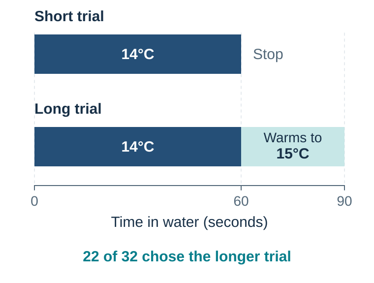
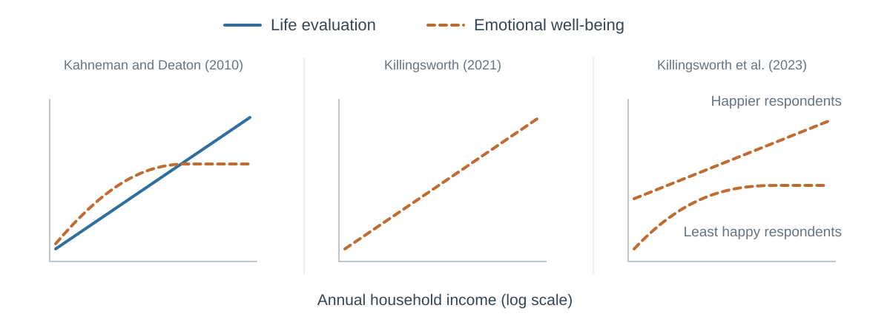

---
aliases:
  - 22-deciding-for-a-better-life-satisfaction-connection-and-meaning.html
  - 45-subjective-well-being.html
---

# Deciding for a Better Life

*Satisfaction, Connection, and Meaning*

[]{#deciding-for-a-better-life-satisfaction-connection-and-meaning}

::: {#chapter-22-start .chapter-epigraph}
> “Tell me, what is it you plan to do with your one wild and precious life?”
>
> — Mary Oliver, [“The Summer Day”](https://poets.org/poem/summer-day), 1990
:::

[]{#opening-question-which-job-produces-the-better-life}Imagine two jobs. Job A pays substantially more, carries status, and requires a long commute with unpredictable evening work. Job B pays less, leaves time for sleep and relationships, and offers work you find more meaningful.

The higher pay could buy security and the role could fulfill an ambition. Yet the commute and evening work could consume the time in which you would enjoy that security. Choosing the other job protects time and meaning while giving up income you also value. Even your own assessments may conflict: you might choose Job A, expect less pleasant ordinary Tuesdays, and later remember the move with pride. Which of these changes should determine whether the decision made life better?

Benjamin, Heffetz, Kimball, and Rees-Jones (2012) asked people to rank hypothetical alternatives both by what they would choose and by the subjective well-being they predicted. The rankings often agreed, but not always. Predicted purpose, control, family well-being, status, and other attributes helped explain choices even after predicted happiness was held constant. A single well-being question may omit something people value.

{#fig-well-being-six-lenses fig-alt="Four stations follow a choice through time: predicted utility before the choice, decision utility when choosing, experienced utility during the outcome, and remembered utility afterward. Each has a short guiding question. A separate band across the bottom contains life evaluation and meaning and purpose, representing broader perspectives rather than a final stage."}

@fig-well-being-six-lenses separates the forecast, the choice, the lived experience, and the remembered episode. Life evaluation and meaning take a broader view of what the choice contributes to a life. Job A can look successful from one perspective and costly from another.

::: {.callout-note .core-idea icon=false}
## Core Idea

How life feels while we live it can differ from how we remember and evaluate it. A better decision considers both perspectives, together with the relationships, meaning, and freedom the choice supports.
:::

## Learning goals

- Distinguish the experiencing self from the remembering self, connect them to emotional well-being and life evaluation, and explain why their assessments can diverge.
- Distinguish predicted, decision, experienced, and remembered utility, including the pleasure or distress of anticipation and recollection.
- Recognize when one salient feature dominates a judgment of a whole life, and bring the omitted consequences into the comparison.
- Distinguish social integration, perceived support, loneliness, and relationship quality while keeping association separate from causal evidence.
- Build a decision audit that names the person, measure, horizon, relationships, distribution, rights, and freedom to revise.

## Predicting well-being and choosing a life {#one-word-several-targets}

To compare the jobs, we need to distinguish how an ordinary day feels from how a person evaluates the life it belongs to. **Subjective well-being** includes both: the OECD distinguishes life evaluation, affect, and eudaimonia, or meaning and purpose. Life satisfaction is therefore a measure of subjective well-being, as are reports of daily feelings; they capture different aspects of it (OECD, 2025).

Work on experienced utility adds a distinction across time: what a person predicts, chooses, experiences, and later remembers (Kahneman et al., 1997). Job A could satisfy a valued ambition while reducing sleep and companionship. Following the choice through these stages helps explain why the life we want, the days we live, and the story we later tell need not receive the same verdict.

[]{#before-the-outcome-predicted-utility-is-a-forecast}

**Predicted utility** is our forecast of how pleasant or unpleasant an outcome will feel. We choose a home, partner, course, job, holiday, treatment, or purchase partly by imagining the resulting experience. Predicting those feelings is **affective forecasting** (Wilson & Gilbert, 2003). “I expect Job B to make my days more enjoyable” is a forecast that can later be compared with the days actually lived.

[]{#decision-utility-is-not-the-same-as-happiness}

**Decision utility** is the value reflected in choices among available options (Kahneman et al., 1997). Predicted enjoyment can help explain a choice, but other priorities enter too: you might expect Job B to feel better and still choose Job A for the financial security it gives your family. The forecast concerns how an outcome will feel; the choice reflects the trade-offs you make. Habits, defaults, constraints, and mistakes can also affect action. As [Chapter 21](21-habits-wanting-and-self-control.qmd#chapter-21-start) explains, a cue can make something strongly wanted even when you expect little enjoyment from it.

[]{#impact-bias-and-focalism}

**Impact bias** is the tendency to overestimate the intensity or duration of a future emotional reaction. Gilbert and colleagues (1998), for example, studied why people can underestimate their capacity to adapt psychologically to negative events. A related mechanism is **focalism**: when imagining one change, people give it more attention than it will receive once daily life resumes.

A vivid focal event can occupy more of the simulation than it will occupy the lived day. The later discussion of [the focusing illusion](#focusing-illusion) examines how to bring the rest of life into the forecast; the discussion of adaptation considers which changes persist.

Use a Tuesday test. Instead of asking only, “How will I feel when I receive the promotion?” simulate an ordinary Tuesday six months later: waking, commuting, working, caring, resting, and seeing other people. The broader scene often reveals what the focal forecast omitted.

[]{#projection-bias-the-present-self-forecasts-the-future-self}

Forecasting also begins from the current state. Hungry shoppers buy for a hungrier future than the one who will consume the food. A person making plans while enthusiastic may underestimate fatigue; a person making plans while distressed may underweight recovery. **Projection bias** describes the tendency to project current tastes or states too strongly into future utility (Loewenstein et al., 2003).

A simple protection is to forecast from more than one state. Revisit an important commitment when rested and rushed, excited and ordinary. If the decision changes sharply, the state is part of the evidence.

## The experiencing self and the remembering self {#during-the-outcome-experience-has-a-time-structure}

[]{#experiencing-and-remembering-self}

In his talk *The riddle of experience vs. memory*, Kahneman (2010) describes a listener who enjoyed about twenty minutes of beautiful music before a harsh sound spoiled the ending. The listener felt that the whole experience had been ruined. Kahneman's point is that the earlier pleasure had already happened: the ending changed the memory carried away from it. Judging the recording afterward gave a different answer from following the listener's enjoyment while it played.

Kahneman calls these two perspectives the **experiencing self** and the **remembering self**. The experiencing self lives through the moments: the pleasure of the music, the discomfort of a commute, or the warmth of a conversation. The remembering self selects and organizes what happened into an account we can recall and evaluate. **Emotional well-being concerns how life feels as it unfolds; life satisfaction concerns how we judge our life when we reflect on it.** The latter belongs broadly to Kahneman's remembering or evaluating perspective.

**Experienced utility** refers here to the pleasure or discomfort felt as life unfolds. **Affect** describes the feelings involved, such as enjoyment, stress, calm, affection, or boredom. Reports of affect help researchers study experienced utility, while the utility framework asks how good or bad an experience feels and how that changes over its duration. A day can contain both positive and negative affect: engagement at work can coexist with exhaustion, and a loving conversation can include worry.

Experience sampling asks about feelings at selected moments; the Day Reconstruction Method asks people to reconstruct yesterday's episodes and the feelings associated with them (Kahneman et al., 2004). Both aim to capture the emotional texture of daily life, although reconstruction also relies on memory.[^ch22-affect-measurement] Together with forecasts, later evaluations, and choices, these reports allow researchers to compare the four utility perspectives in @fig-well-being-six-lenses.

[]{#after-the-outcome-memory-edits-experience}

Memory compresses that sequence. In a study of colonoscopy and lithotripsy patients, Redelmeier and Kahneman (1996) tracked pain during treatment and later asked patients to evaluate the whole experience. Retrospective ratings were closely related to the worst pain and the pain near the end. Duration received surprisingly little weight. This **peak–end pattern**, together with **duration neglect**, helps explain how a longer episode with a gentler ending can be remembered less negatively than a shorter one (Fredrickson & Kahneman, 1993).

A later randomized trial tested whether changing the ending could change the memory. Some colonoscopy patients received a brief additional interval during which the instrument remained stationary, producing an ending that was less painful than the preceding part of the procedure. They subsequently remembered the procedure as less unpleasant than patients receiving the usual ending (Redelmeier et al., 2003). The added interval still involved discomfort: the remembered improvement and the additional time spent undergoing the procedure pointed in different directions.

What people remember can also influence what they choose to repeat. In a cold-water experiment, participants experienced a painful 60-second immersion and a longer immersion with the same first minute followed by 30 seconds in gradually warming, still unpleasant water. As @fig-cold-water-better-ending shows, the longer trial added discomfort but improved the ending. Twenty-two of the 32 men in the analyzed student sample chose to repeat it (Kahneman et al., 1993). Peaks and endings can thus shape a later choice even when they give an incomplete account of the time lived through.

{#fig-cold-water-better-ending fig-alt="The short trial lasts 60 seconds at 14 degrees Celsius. The long trial has the same first minute, followed by 30 seconds during which the water gradually warms toward 15 degrees Celsius. Twenty-two of 32 analyzed participants chose to repeat the longer trial." .phone-fit}

The same tension can arise with pleasant experiences. Imagine a second holiday week that is as enjoyable as the first but adds few distinctive events. It adds pleasant time, yet may add little to the story later told. Planning a family holiday can make this distinction especially visible, because the person choosing and the people having the experience may value its different parts.

[]{#personal-story-vacation-memories}

::: {.callout-note .personal-example icon=false}
## From my experience: will she remember the holiday?

When my wife and I were deciding where to go on vacation, she considered how much our toddler daughter would enjoy the experience. But she also asked me, “Would she remember all of this?” Her question added the prospect of future memories to the enjoyment she expected our daughter to have during the trip.
:::

Kahneman (2010) sharpens the comparison with a thought experiment: suppose you would retain no memories or photographs of your next holiday. Would you still pay the same amount for a beautiful resort? If your willingness to pay falls, part of what you were buying was the prospect of remembering. Reverse the example: imagine a large payment for enduring an intensely unpleasant episode, with the same experience and payment in both versions, but distressing recollections afterward in only one. Finding the version without those recollections more acceptable would show that the future burden of remembering enters the decision. Forgetting would leave the pain during the episode unchanged.

Evidence from actual holidays shows how memory can guide the next plan. Wirtz, Kruger, Scollon, and Diener (2003) compared students' forecasts, reports during spring break, and later recollections. In their analysis, remembered experience predicted the desire to take a similar holiday again beyond the forecasts and reports collected during the trip.

Two routes from memory to choice are worth separating. A remembered holiday can serve as evidence for a forecast: “I remember enjoying that place, so I expect to enjoy it again.” Alternatively, someone may choose an experience partly for the memory it promises: “Some of the trip may be tiring, but I want to be able to look back on it.” The first route uses memory to predict enjoyment during the event; the second values anticipated remembering. Both can influence decision utility, with their relative importance depending on the person and the choice. During the trip, enjoyment or fatigue can also change whether you continue an activity or stop.

Memory can also create pleasure or distress after the event is over. **Remembered utility** is the retrospective evaluation—“That was a wonderful holiday”—whereas **utility from remembering** is how it feels to recall it now. Looking back fondly can provide a fresh enjoyable moment; returning to an upsetting memory can bring fresh distress. These later feelings belong to experienced utility at the time of recollection. The remembering and experiencing perspectives therefore interact: remembering a past event is itself a present experience.

The value of a holiday can begin even earlier. Looking forward to it may make an ordinary working day more pleasant; dreading a difficult event may make the waiting period painful. Loewenstein's (1987) account of **anticipatory utility** explains how savoring and dread can affect preferences over when an event happens. A forecast such as “I will enjoy the holiday” concerns a future feeling; the excitement of anticipating it is a feeling now. An experience can thus contribute to well-being through anticipation, the event itself, and later recollection.

Giving memories weight need not be a mistake. A holiday can become part of a family story and provide repeated enjoyment afterward. But a striking memory need not require filling the days with exhaustion, just as a child's happy afternoon can be worth having without a lasting recollection of it. For the two job offers, the corresponding question is whether pride in the career story compensates for the ordinary Tuesdays the job creates. A good decision brings both the time lived and the future remembering into view.

To see where these perspectives diverge in your own decisions, keep three records:

1. Before the event, record the forecast.
2. During or immediately after representative moments, record experience.
3. Later, record memory and the next choice.

Comparing them can reveal whether the next choice follows the daily experience, the remembered highlights, or a valued achievement. It can also expose costs that disappear when an entire month is compressed into a single satisfying story.

## Across a life: satisfaction, emotion, and meaning {#across-a-life-evaluation-is-not-affect-and-meaning-is-not-pleasure}

**Life evaluation**, including life satisfaction, extends beyond remembering a particular episode. A retrospective rating asks how the holiday was; life satisfaction asks how life as a whole is going. In making the broader judgment, people can draw on memories alongside current circumstances, achievements, goals, identity, and comparison standards. This is why life evaluation fits Kahneman's remembering or evaluating perspective without being simply an average of remembered feelings.

A person might be satisfied with a demanding career while spending many working hours tired or worried. Someone else might enjoy an afternoon with friends while remaining dissatisfied with the direction of life. These possibilities do not make either assessment false: they identify different things that a decision can improve. Repeating a life-satisfaction question each evening tracks changes in that overall judgment; it does not turn the question into a measure of the feelings experienced throughout each day.

**Eudaimonic** measures add another question: whether life or an activity feels worthwhile, purposeful, or meaningful. Difficult but self-concordant work can reduce comfort and increase purpose. Ryff's (1989) account of psychological well-being similarly emphasizes purpose, autonomy, growth, and positive relations. Meaning can contribute to life satisfaction while also mattering during an activity, so the two-selves distinction does not replace these broader dimensions of well-being.

Domain measures add resolution: satisfaction with health, work, family, finances, housing, or time. They can reveal a severe local problem concealed by a tolerable global average. But many domain scores create a new question: who decides the weights?

A dashboard can reveal that Job A improves security while Job B protects time and purpose. The person still has to decide how much each difference matters; adding measures cannot make that judgment disappear.

Evolutionary fitness is another distinct quantity, not a master welfare measure. Past effects of a trait or behavior on relative genetic transmission need not align with a person's present pleasure, meaning, health, autonomy, or moral commitments. [Appendix B](../appendices/appendix-b-evolutionary-explanations-of-value-choice-and-rationality.qmd#evolution-explains-not-prescribes) separates evolutionary function, subjective value, well-being, and normative value.

Having followed the job through prediction, choice, experience, and reflection, use @tbl-well-being-targets to keep the questions separate. A strong answer in one row cannot silently stand in for the others.

::: {.callout-note icon=false}
## Compare the six questions

| Target | Question it answers | Typical measurement | What it can miss |
| --- | --- | --- | --- |
| Predicted utility | How do I expect the outcome to feel? | Forecast before an event | Adaptation, competing events, changing tastes |
| Decision utility | What value does my choice reveal? | Actual or hypothetical choice | Experience, coercion, mistakes, values not represented in the menu |
| Experienced utility | How pleasant or unpleasant is the experience? | Experience sampling, affect yesterday, day reconstruction | Long-run meaning, remembered narrative, rare but consequential episodes |
| Remembered utility | How does the remembering self evaluate this episode? | Retrospective rating | Duration and moment-to-moment variation |
| Life evaluation | How do I judge my life as a whole? | Life satisfaction or a life ladder | Daily emotional texture and domain-specific hardship |
| Eudaimonia or meaning | Does life feel worthwhile, purposeful, and coherent? | Meaning, purpose, or worthwhile-activity items | Pleasure, pain, and material constraint |
: Six targets that should not be collapsed into one happiness score {#tbl-well-being-targets}
:::

## How choices affect relationships and social support {#connection-is-part-of-the-outcome}

The job offer puts salary and duties on paper, making them easy to compare. Time for friends and family is less visible in the contract, yet the commute and evening work in Job A may reduce it. A choice that improves the employment terms could therefore weaken an important part of life outside work. The comparison needs to bring those relationships into view.

The contrasts in @tbl-relational-well-being prevent the amount of contact from standing in for its quality or the support it provides:

| Construct | What it asks | What it does not establish |
| --- | --- | --- |
| Social integration | How many roles, groups, contacts, and forms of participation connect the person to others? | That the ties are supportive, voluntary, or emotionally close. |
| Perceived support | Does the person believe that practical help, understanding, or care would be available when needed? | That help will arrive, or that a large network exists. |
| Loneliness | Is there a painful gap between the connection a person wants and the connection they experience? | Social isolation: a person can feel lonely in company or content while alone. |
| Relationship quality | Do important relationships contain responsiveness, trust, affection, conflict, strain, safety, or repair? | That more contact is better regardless of how the relationship functions. |
: Four relational measures that should not be used as synonyms {#tbl-relational-well-being}

Survey evidence reviewed by Helliwell and Putnam (2004) links family, friendship, community participation, trust, and related social conditions with self-reported well-being. Health, personality, income, neighborhood conditions, and prior well-being can affect both social participation and reported well-being, with influence running both ways.[^ch22-relationships]

Holt-Lunstad, Smith, and Layton's (2010) meta-analysis found that stronger social relationships were associated with lower mortality risk across prospective studies using varied structural and functional measures. Relationships belong among the central outcomes of major decisions, alongside work, money, and consumption.

The use of resources matters alongside time with other people. In an experiment by Dunn, Aknin, and Norton (2008), people assigned to spend money on others reported greater happiness at the end of the day than those assigned to spend it on themselves. This brings another consequence into the job comparison: what the extra income would let a person do for others, as well as for themselves.

Ask who would be present on an ordinary Tuesday and whether those ties provide support, strain, or both. More contact is not always better: a coercive relationship can be harmful, while chosen solitude can be restorative. The comparison concerns the quality and freedom of the relationship as well as time spent together.

## How income relates to well-being {#income-no-magic-number}

Within many samples, higher income is associated with higher life evaluation and, on average, better emotional well-being. That is unsurprising at the lower end: money can reduce hunger, insecurity, unsafe housing, unpaid bills, and painful lack of choice. The relationship is often closer to linear in **log income** than in income itself, which means that an additional unit of currency is usually associated with a larger difference at low income than at high income.

The income debate puts the experiencing and evaluating perspectives side by side. Kahneman and Deaton (2010) measured life evaluation by asking people to place their lives on a ladder from the worst to the best possible life. Their emotional-well-being measures asked yes-or-no questions about feelings during the previous day: retrospective reports aimed at daily experience, rather than an overall judgment of life. Across more than 450,000 US survey responses, life evaluation rose with log household income, while emotional well-being appeared to flatten near US$75,000 in 2008–2009 dollars. These are the solid and dashed lines in the first panel of @fig-income-wellbeing-evidence-synthesis.

Killingsworth (2021) also studied emotional experience, asking employed US adults to rate how they felt at sampled moments on a continuous scale. Their average experienced well-being continued to rise beyond the earlier income threshold. The disagreement therefore concerned **whether emotional well-being plateaus**: compare the dashed line in the first panel with the rising dashed line in the second. Both studies found that people with higher incomes tended to evaluate their lives more favorably; the solid line in the first panel is outside this disagreement.

Killingsworth, Kahneman, and Mellers (2023) worked together to explain the discrepancy. The earlier yes-or-no measures had a **ceiling effect**: many people already gave the most positive possible answers, leaving little room to distinguish degrees of happiness. Reanalyzing Killingsworth's more finely graded reports, the collaborators found flattening at higher incomes mainly among the least happy respondents. Emotional well-being continued to rise among happier respondents, and the rise became steeper among the happiest. The average upward trend had concealed these different patterns, while the earlier measures were better suited to detecting unhappiness than differences among happy people.

{#fig-income-wellbeing-evidence-synthesis fig-alt="A shared legend identifies solid blue lines as life evaluation and dashed orange lines as emotional well-being across three schematic panels, all plotted against log annual household income. Kahneman and Deaton (2010): life evaluation rises while emotional well-being flattens. Killingsworth (2021): emotional well-being continues rising. Killingsworth et al. (2023): smaller annotations distinguish the least happy respondents, whose emotional well-being flattens, from happier respondents, whose emotional well-being continues rising." width=100%}

The shape of the relationship also depends on where an analysis allows the curve to bend. Rather than fixing an income threshold in advance, Bennedsen (2024) estimated its location from the data and found evidence of a plateau around US$200,000. The 2023 reconciliation explains how the earlier findings can coexist, while the location and extent of any plateau remain debated.

## Adaptation and social comparison {#adaptation-selective-incomplete-and-morally-easy-to-misuse}

People often adapt to changes. Attention shifts, aspirations move, routines form, and an initially intense event becomes part of the background. This is one reason purchases and achievements may produce smaller durable changes than forecast.

Longitudinal evidence suggests incomplete or heterogeneous adaptation to events such as unemployment, and persistent pain, poor mental health, insecurity, loneliness, discrimination, and loss can continue to damage experience or evaluation (Lucas et al., 2004). Positive and negative events need not adapt at the same rate. People also differ.

Adaptation to harmful conditions does not make those conditions acceptable. Subjective well-being belongs beside rights, health, material conditions, and agency.

[]{#social-comparison-and-the-focusing-illusion}

Income and achievement carry social information. People compare upward and downward, locally and across time. A raise can improve purchasing power and still disappoint if peers gain more. A smaller home can feel adequate until the comparison group changes. Adaptation and aspiration therefore move the reference point.

Comparison can also change which part of life occupies attention. Seeing a colleague's salary may alter both the income you consider adequate and how much income dominates your judgment of your own life. The first change concerns the benchmark; the second concerns the weight given to one part of the picture.

## The focusing illusion: judging a whole life through one feature {#focusing-illusion}

Look again at the two job offers, but compare only their salaries. Now put the offers aside and picture the weekly calendars they would create. The same jobs can look different when the comparison moves from the payslip to the evenings, journeys, conversations, and interrupted sleep that would follow.

The shift from living a life to judging it creates another opening for selective attention. Kahneman (2010) connects the two selves to the **focusing illusion**: a feature that becomes prominent while we evaluate a life can receive more weight than its place in daily experience warrants. A question such as “How much happier would I be with that salary?” makes income unusually prominent at the very moment we assess its importance. Features that sharply distinguish two options are especially easy to think about; much of the life surrounding them may disappear from the comparison. **What makes an option distinctive does not, by itself, establish how much it will change life as a whole.**

The [evaluability findings in Chapter 11](11-anchors-halos-and-decoys.qmd#evaluation-modes) help explain why some features gain influence when options are compared: the comparison supplies a standard for judging an otherwise unfamiliar attribute (Hsee, 1996). Evaluability concerns how readily we can assess a feature; the focusing illusion concerns its disproportionate weight in an overall judgment. For the job decision, a salary table makes one difference easy to assess, while the quality of everyday supervision may remain obscure. Learning how each manager handles mistakes, interruptions, and requests for flexibility makes that less visible part of the job more concrete. A useful comparison makes the important consequences understandable and keeps them in view together.

[]{#why-california-seemed-happier}

Schkade and Kahneman (1998) surveyed university students in Southern California and the Midwest. Students in the two regions reported similar overall life satisfaction, yet respondents judging a comparable student expected greater satisfaction in California. Climate and cultural opportunities helped explain that predicted advantage.

The appeal of a sunny climate can be real. So can the salary difference between Job A and Job B. The error arises when an attractive feature supplies the answer to a much larger question. Someone considering a move may picture sunshine repeatedly while giving little attention to the work, friendships, household tasks, and worries that would also fill the new life.

This connects to **focalism** in affective forecasting: the event being imagined occupies more of the forecast than the other events that will compete for attention. **Adaptation** concerns how a response changes after an outcome occurs. A forecast can omit most of a future day even before we ask how quickly the person will get used to its new features.

[]{#bring-the-rest-of-the-day-into-the-forecast}

Wilson and colleagues (2000) tested a way to broaden this view. University football fans predicted how happy they would feel after a win or loss. Some first estimated the time they would spend on other everyday activities. This exercise moderated their forecasts; in a prospective study of 27 fans, the forecasts were also closer to reported happiness after the game. Thinking about ordinary activities helped prevent the game from filling the whole imagined day.

For the job decision, extend the Tuesday test into a concrete weekly schedule. Include what each option changes and what remains familiar. Trace the salary into what it would buy or make possible, and trace the working hours into what they would replace. Ask someone doing comparable work to describe yesterday, including the uneventful parts. These details give the forecast something more substantial than the feature highlighted in an offer letter.

Broadening the picture can strengthen the case for the higher-paying job. If the extra income secures stable housing or makes care affordable, its effects may run through much of daily life. Meaningful achievement can also matter to a person's evaluation of life even when it is not continuously in conscious attention. The aim is to judge the feature through its consequences and the person's values. Neither a vivid salary nor a vivid story about work–life balance should settle that judgment on its own.

## Measuring well-being without manufacturing a verdict

The job comparison needs evidence about whether life improves, and a well-being score offers a way to track it. But a score can move because the question changed or a different part of life became salient. Acting on that movement as if the whole decision had succeeded could conceal the cost we meant to evaluate.

Reliability asks whether a measure is sufficiently consistent for its purpose. Validity asks whether it captures the intended construct. Neither is established merely because a self-report correlates with physiology, observer ratings, or another questionnaire. Brain activity and heart rate can be evidence about processes; they are not simple meters that certify a person's happiness.

Wording, question order, timing, survey mode, and interpretation of response scales can change the result. The OECD (2025) therefore recommends standardized modules and treats subjective well-being as a complement to objective indicators. Report how and when each question was asked, who answered, and the distribution of responses alongside uncertainty and relevant material conditions.

[]{#a-policy-dashboard-not-a-happiness-maximum}

A policy evaluation must show who improved, who worsened or left the sample, and whether the design identifies a causal change. It must also examine displaced costs and freedom to refuse. A higher mean cannot automatically compensate for severe harm to a minority or the removal of future options.

[]{#what-this-chapter-deliberately-does-not-claim}

## A well-being decision audit

The jobs can rank differently on pay, daily experience, purpose, and relationships. A single overall impression can hide which sacrifice produces the apparent advantage. Compare the options across the four fields in @tbl-well-being-decision-audit so that gains in one area can be weighed against sacrifices in another and checked at the later review. Complete one line in each cell; add detail only where it could change the decision.

| Core field | Before choosing | At the review |
| --- | --- | --- |
| Ordinary-day experience | What would a representative Tuesday contain—affect, activity, time pressure, pain, rest, and attention? | What did representative days actually contain? |
| Life evaluation and meaning | How might I evaluate this life or domain, and what would feel worthwhile, purposeful, or coherent? | Did evaluation and meaning move together or diverge? |
| Material conditions and agency | What happens to income, health, time, safety, rights, reversibility, and future options? | Which constraints improved, persisted, or appeared later? |
| Relationships | Who gains or loses time, support, autonomy, trust, or relationship quality? | Who was affected, including people omitted from the original forecast? |
: Four core fields for a usable well-being decision audit {#tbl-well-being-decision-audit}

Below the table, state the most important trade-off, the person with authority to make it, one condition that must not be sacrificed, and a review date. This makes the sacrifice and the decision authority visible.

[]{#what-appears-to-helpand-what-the-evidence-can-support}

The audit identifies consequences to check: financial security, sleep, time pressure, relationships, and purposeful work. Use those outcomes to make a proposed change specific enough to evaluate.

Turn advice into a testable personal hypothesis:

> If I protect two evenings from low-value commitments for four weeks, then sleep, time pressure, and connection should improve without unacceptable cost to work or care.

Add what would count as an unacceptable cost, so the test has a clear condition for changing or stopping it.

Use an **optional module** only when it is central to the choice: predicted versus remembered utility for a repeated experience; repeated experience sampling when daily variation matters; distribution by household member or subgroup when averages can conceal harm; or a domain-specific measure for health, housing, work, or financial security.

## Practice Lab

Use the Job A–Job B case or a live reversible decision. Complete the four-field audit for both options, beginning with an ordinary Tuesday six months later. Choose one observable indicator and an acceptable range or threshold for each core field, name one stakeholder or constraint the initial forecast could miss, and set a review date. Finish with one conditional rule: “If ___ is worse than ___ by the review date, I will reconsider ___.” Add an optional module only if its result could change the choice.

## Take it forward

The job decision may remain a trade-off: Job A could provide needed security, while Job B could protect time and purpose. Ask both what life would feel like while you live it and what would make you satisfied when you reflect on it. The four-field audit makes that comparison explicit, and the review date gives you a chance to discover whether the ordinary Tuesdays match the ones you imagined.

[]{#bridge-a-better-life-is-not-made-alone}

Subjective well-being begins with a person's experience and evaluation, but the life being evaluated is social. Other people are valued ends, sources of support and conflict, and decision-makers whose actions change what our own options produce. [Strategic Interdependence](23-strategic-interdependence.qmd#chapter-23-start) begins that expansion by asking what happens when the result of our choice depends on another person’s response. [Connection](34-connection.qmd#chapter-34-start) later returns to how a difficult conversation can preserve or rebuild connection.

[^ch22-affect-measurement]: Experience estimates depend on sampling, wording, compliance, and the moments captured. A “yesterday” item can miss unusual days, and a phone prompt can interrupt the experience it measures.

[^ch22-relationships]: The survey and prospective studies cited here estimate associations. They do not isolate the effect of increasing a particular person’s social contact.

## References cited in this chapter

::: {.reference}
Benjamin, D. J., Heffetz, O., Kimball, M. S., & Rees-Jones, A. (2012). What do you think would make you happier? What do you think you would choose? *American Economic Review, 102*(5), 2083–2110.
:::

::: {.reference}
Bennedsen, M. (2024). Income and emotional well-being: Evidence for well-being plateauing around $200,000 per year. *Economics Letters, 238*, 111730. https://doi.org/10.1016/j.econlet.2024.111730
:::

::: {.reference}
Dunn, E. W., Aknin, L. B., & Norton, M. I. (2008). Spending money on others promotes happiness. *Science, 319*(5870), 1687–1688.
:::

::: {.reference}
Fredrickson, B. L., & Kahneman, D. (1993). Duration neglect in retrospective evaluations of affective episodes. *Journal of Personality and Social Psychology, 65*(1), 45–55.
:::

::: {.reference}
Gilbert, D. T., Pinel, E. C., Wilson, T. D., Blumberg, S. J., & Wheatley, T. P. (1998). Immune neglect: A source of durability bias in affective forecasting. *Journal of Personality and Social Psychology, 75*(3), 617–638.
:::

::: {.reference}
Helliwell, J. F., & Putnam, R. D. (2004). The social context of well-being. *Philosophical Transactions of the Royal Society of London. Series B: Biological Sciences, 359*(1449), 1435–1446.
:::

::: {.reference}
Holt-Lunstad, J., Smith, T. B., & Layton, J. B. (2010). Social relationships and mortality risk: A meta-analytic review. *PLoS Medicine, 7*(7), e1000316.
:::

::: {.reference}
Hsee, C. K. (1996). The evaluability hypothesis: An explanation for preference reversals between joint and separate evaluations of alternatives. Organizational Behavior and Human Decision Processes, 67(3), 247–257. https://doi.org/10.1006/obhd.1996.0077
:::

::: {.reference}
Kahneman, D. (2010, February). *The riddle of experience vs. memory* [Video]. TED. https://www.ted.com/talks/daniel_kahneman_the_riddle_of_experience_vs_memory
:::

::: {.reference}
Kahneman, D., & Deaton, A. (2010). High income improves evaluation of life but not emotional well-being. *Proceedings of the National Academy of Sciences, 107*(38), 16489–16493.
:::

::: {.reference}
Kahneman, D., Fredrickson, B. L., Schreiber, C. A., & Redelmeier, D. A. (1993). When more pain is preferred to less: Adding a better end. *Psychological Science, 4*(6), 401–405. https://doi.org/10.1111/j.1467-9280.1993.tb00589.x
:::

::: {.reference}
Kahneman, D., Krueger, A. B., Schkade, D. A., Schwarz, N., & Stone, A. A. (2004). A survey method for characterizing daily life experience: The Day Reconstruction Method. *Science, 306*(5702), 1776–1780.
:::

::: {.reference}
Kahneman, D., Wakker, P. P., & Sarin, R. (1997). Back to Bentham? Explorations of experienced utility. *Quarterly Journal of Economics, 112*(2), 375–406.
:::

::: {.reference}
Killingsworth, M. A. (2021). Experienced well-being rises with income, even above $75,000 per year. *Proceedings of the National Academy of Sciences, 118*(4), e2016976118.
:::

::: {.reference}
Killingsworth, M. A., Kahneman, D., & Mellers, B. (2023). Income and emotional well-being: A conflict resolved. *Proceedings of the National Academy of Sciences, 120*(10), e2208661120.
:::

::: {.reference}
Loewenstein, G. (1987). Anticipation and the valuation of delayed consumption. *The Economic Journal, 97*(387), 666–684. https://doi.org/10.2307/2232929
:::

::: {.reference}
Loewenstein, G., O'Donoghue, T., & Rabin, M. (2003). Projection bias in predicting future utility. *Quarterly Journal of Economics, 118*(4), 1209–1248.
:::

::: {.reference}
Lucas, R. E., Clark, A. E., Georgellis, Y., & Diener, E. (2004). Unemployment alters the set point for life satisfaction. *Psychological Science, 15*(1), 8–13.
:::

::: {.reference}
OECD. (2025). *OECD guidelines on measuring subjective well-being (2025 update).* OECD Publishing.
:::

::: {.reference}
Redelmeier, D. A., & Kahneman, D. (1996). Patients' memories of painful medical treatments: Real-time and retrospective evaluations of two minimally invasive procedures. *Pain, 66*(1), 3–8.
:::

::: {.reference}
Redelmeier, D. A., Katz, J., & Kahneman, D. (2003). Memories of colonoscopy: A randomized trial. *Pain, 104*(1–2), 187–194. https://doi.org/10.1016/S0304-3959(03)00003-4
:::

::: {.reference}
Ryff, C. D. (1989). Happiness is everything, or is it? Explorations on the meaning of psychological well-being. *Journal of Personality and Social Psychology, 57*(6), 1069–1081.
:::

::: {.reference}
Schkade, D. A., & Kahneman, D. (1998). Does living in California make people happy? A focusing illusion in judgments of life satisfaction. *Psychological Science, 9*(5), 340–346. https://doi.org/10.1111/1467-9280.00066
:::

::: {.reference}
Wilson, T. D., & Gilbert, D. T. (2003). Affective forecasting. *Advances in Experimental Social Psychology, 35*, 345–411.
:::

::: {.reference}
Wilson, T. D., Wheatley, T., Meyers, J. M., Gilbert, D. T., & Axsom, D. (2000). Focalism: A source of durability bias in affective forecasting. *Journal of Personality and Social Psychology, 78*(5), 821–836. https://doi.org/10.1037/0022-3514.78.5.821
:::

::: {.reference}
Wirtz, D., Kruger, J., Scollon, C. N., & Diener, E. (2003). What to do on spring break? The role of predicted, on-line, and remembered experience in future choice. *Psychological Science, 14*(5), 520–524. https://doi.org/10.1111/1467-9280.03455
:::
