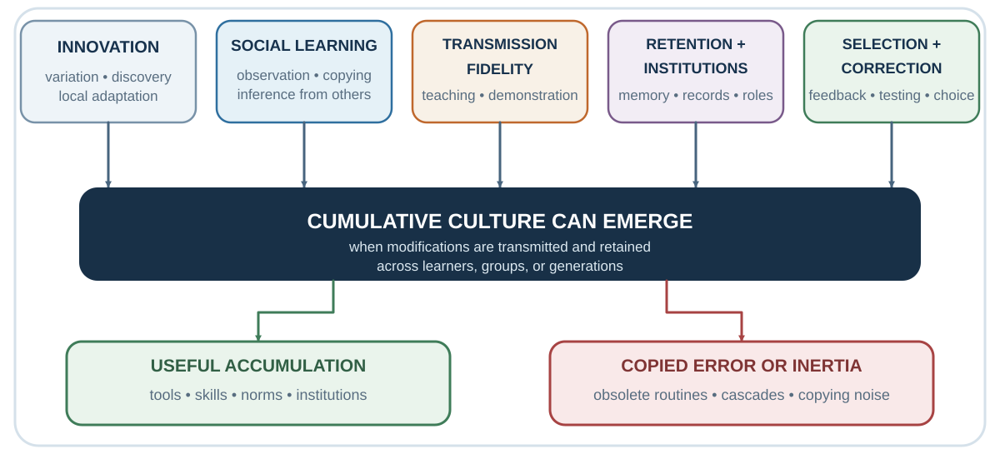

# Chapter 22. Social Learning, Mimicry, and Attribution

*How other people become models, mirrors, and causal explanations*

<aside class="callout core-idea">
CORE IDEA

Humans use other people as information, models, audiences, and regulators. Social learning is a superpower whose cost is vulnerability to copied errors, status signals, and self-serving social stories.
</aside>

## Learning goals

- Explain cumulative culture and overimitation.
- Explain mimicry as social coordination.
- Distinguish situational and dispositional attribution.
- Use an attribution flip and perspective-getting question before treating a social interpretation as fact.

A solitary learner must discover every causal relation through personal trial and error. A social learner can watch, listen, imitate, ask, and inherit. The difference is enormous. A child does not derive a language from first principles. A medical student does not independently rediscover germ theory. A new employee learns which spreadsheet matters, which deadline is real, and which sentence from the formal procedure everyone quietly ignores.

Cumulative culture depends on social transmission with enough fidelity to preserve useful practices and enough variation to improve them. Human groups can retain techniques whose causal structure is not obvious to any one learner. Over generations, tools and institutions become more complex than a single person could plausibly invent alone (Boyd & Richerson, 1985; Henrich, 2016; Tomasello, 1999).

Social learning therefore solves an information problem. When direct evidence is expensive, ambiguous, or unavailable, another person's behavior becomes a cue. If several experienced hikers turn back from a trail, their action may be better evidence than the blue sky above you. If every clinician in a unit checks a particular sign before discharge, the routine may contain knowledge that has not yet been made explicit.

The same mechanism creates vulnerability. People may copy a fashion because it is visible, a rumor because it is repeated, or a dangerous norm because everyone else appears calm. Social information is valuable precisely because it often works. A counterfeit signal is powerful only because the genuine signal is usually worth using.

This reframes influence. A person who follows others is not necessarily weak. They may be using a rational shortcut under uncertainty. The scientific task is to identify when social evidence is diagnostic and when it is self-generating.

## Copying and cumulative culture

<figure class="book-figure"><figcaption>Figure 22.1. Social learning supports cumulative culture while also transmitting errors, cascades, and obsolete routines.</figcaption></figure>

In a classic comparison, human children and chimpanzees watched an adult retrieve a reward from a puzzle box. Some demonstrated actions were causally necessary; others were not. When the box was transparent and the mechanism visible, chimpanzees tended to omit irrelevant actions and reproduce the efficient route. Children often copied both relevant and irrelevant steps (Horner & Whiten, 2005).

At first glance, the chimpanzee looks more rational. It extracts the causal structure and ignores theater. Yet children's tendency toward overimitation may serve a different problem. A learner cannot always know which step is irrelevant. A tap, gesture, sequence, or preparation may carry hidden causal information, social meaning, safety value, or conventional significance. High-fidelity copying can preserve opaque practices until their function becomes clear (Lyons et al., 2007).

The lesson is not that children blindly imitate everything. Human copying is sensitive to intention, pedagogy, group membership, convention, and context. Nor is overimitation always beneficial. It can preserve needless bureaucracy as effectively as useful craft. An organization may continue a reporting ritual because "this is how it is done" even after the original risk has vanished.

What looks locally inefficient can be culturally intelligent. What looks culturally faithful can also become institutional inertia.

A practical diagnostic is to ask two questions about a copied practice:

1. What hidden function might this step preserve?

2. What evidence would justify removing it?

The first protects against arrogant simplification. The second protects against ritual without learning.

## Mimicry and synchrony

People in conversation often align without noticing. Posture, facial movements, speech rhythm, word choice, and gestures can become more similar. Chartrand and Bargh (1999) called this the chameleon effect: nonconscious behavioral mimicry that can increase interpersonal smoothness and liking. In service encounters, subtle mimicry has also been associated with greater rapport and prosocial response (van Baaren et al., 2004).

Mimicry is not mind control. Effects vary with relationship, status, group membership, goals, awareness, and how conspicuous the imitation becomes. Obvious copying can feel mocking or manipulative. The useful mechanism is not theatrical duplication but attunement. Two people begin to occupy a more coordinated interactional rhythm.

This matters because persuasion is not only a sequence of propositions. The audience is also evaluating whether the speaker is safe, responsive, sincere, dominant, similar, or attentive. A perfectly logical message delivered without responsiveness may be assigned low weight. A warm and synchronized exchange may increase openness before any central claim changes.

The ethical boundary is straightforward in principle and difficult in practice. Natural adaptation to another person's tempo can communicate attention. Deliberate mimicry used as a covert compliance technique treats rapport as a lever rather than a relationship.

A useful self-check is:

Am I adjusting in order to understand this person, or performing similarity in order to bypass their judgment?

## Attribution

Social life requires causal inference. A colleague misses a deadline. A student remains silent. A supplier asks unusually detailed questions. The mind must decide why.

A dispositional attribution explains behavior through traits, motives, or character: careless, shy, manipulative, uncommitted. A situational attribution explains it through context: conflicting deadlines, unfamiliar language, ambiguous incentives, fear of punishment. Heider (1958) described people as intuitive psychologists, continually inferring the causes of action. Kelley (1967) formalized how information about consistency, distinctiveness, and consensus can support causal judgment.

The difficulty is asymmetry. We usually experience our own situation from the inside and another person's behavior from the outside.

When I am late, I remember the train cancellation, the urgent email, and the child who would not put on shoes. When you are late, I see a person arriving late.

The fundamental attribution error refers to the tendency, especially in some experimental contexts, to underweight situational constraints when explaining others' behavior (Ross, 1977). The effect should not be treated as a universal law of identical strength across all cultures and situations. Attribution varies with perspective, salience, information, motivation, and cultural models of agency. Yet the practical pattern is common enough to damage management and negotiation: "I have reasons; you have personality."

The explanation selected changes the next action. If an employee resists because she is difficult, punishment or exclusion feels appropriate. If she resists because she sees an implementation risk, inquiry becomes useful. If a negotiator asks many questions because he is trying to trap you, defensiveness follows. If he needs information to justify an agreement internally, disclosure can be designed.

Attribution is therefore not merely a belief about the past. It is a policy for the next move.

## The attribution flip

A disciplined attribution flip does not excuse harmful behavior. It delays certainty long enough to improve diagnosis.

Replace:

What is wrong with this person?

with:

What situation, incentive, information gap, identity threat, or system would make this behavior intelligible?

Then ask what evidence would discriminate among explanations.

A silent student may be unprepared. She may also be translating internally, uncertain about the instructor's norm for interruption, or convinced that only polished answers are welcome. A supplier may be unreliable. It may also face a contract that makes your "urgent" order less valuable than another customer's routine order. Better explanations change intervention.

## Self-serving social stories

Attribution becomes more asymmetric when the self is at stake. Success is easy to connect to skill, effort, and judgment. Failure is easier to connect to luck, constraints, or another person's obstruction. Meta-analytic work finds a broad self-serving attributional pattern, although its size and form vary across populations and outcomes (Mezulis et al., 2004).

This bias is not simply vanity. A functioning identity requires some stability. People cannot rebuild their entire self-concept after every setback. The problem appears when identity protection prevents process updating. The self is therefore not only a decision-maker; it is also a reputation manager that selects and revises personal history in identity-protective ways (Greenwald, 1980).

In negotiation, both sides can construct sincerely self-serving views of fairness. Each selects favorable comparison points, remembers concessions differently, and treats its own interpretation as objective. Babcock and Loewenstein (1997) showed how self-serving assessments can help explain bargaining impasse: what each side experiences as a principled view may be partly produced by role.

The bias blind spot deepens the problem. People often recognize biases more readily in others than in themselves, partly because they inspect their own intentions but infer others' bias from behavior (Pronin et al., 2002). "I considered the evidence; they are motivated" becomes a stable two-sided story.

Reflection begins when reasons are treated as hypotheses rather than privileged access. Ask:

Would I accept this explanation from the other side?

Which comparison point did my role make salient?

What evidence would make my preferred interpretation less comfortable?

How would a neutral observer describe the situation before knowing who I am?

The aim is not to eliminate commitment. It is to prevent moral certainty from hiding positional advantage.

## Other people as living data

Social influence begins with a practical problem: the world is uncertain, and no individual can learn everything alone.

If you arrive in a new city, you look at where locals eat, how people use public transport, which streets feel safe, and what behaviors attract disapproval. If you start a new job, you learn not only from formal rules but from how colleagues actually behave: when they speak, how they disagree, what they joke about, which deadlines matter, and how bad news is handled. If you enter a negotiation, you read tone, posture, silence, and the other side’s reactions. If you buy online, you look at ratings, reviews, downloads, likes, and testimonials.

Other people reduce uncertainty. They are living data.

This is why humans are powerful social learners. We do not learn only through direct trial and error. We learn by observing, imitating, teaching, and participating in shared practices. Tomasello (1999) argued that human cultural learning depends on capacities for shared attention, imitation, intention reading, and teaching. Boyd et al. (2011) argue that human success depends heavily on cumulative culture: knowledge and practices built across generations through social learning rather than reinvented individually.

Social learning is efficient because individual learning is costly. It is better to learn from someone else that a plant is poisonous than to test it yourself. It is better to learn from experienced colleagues how a system works than to discover every failure mode personally. It is better to learn professional norms from mentors than to violate them repeatedly.

People often use social learning selectively. They imitate successful people, prestigious people, similar people, older people, experts, high-status individuals, or the majority. Prestige-biased learning can be adaptive when prestige tracks skill or knowledge (Henrich & Gil-White, 2001). Majority-biased learning can be adaptive when many independent people converge on a useful behavior (Boyd & Richerson, 1985). Similarity-biased learning can be adaptive when people like us face similar problems.

But these social-learning rules can also fail. Prestige may reflect status rather than competence. Majorities may be wrong because they are copying one another. Similar others may share the same blind spots. An expert in one domain may be treated as an expert in another. A successful person may be lucky. A popular belief may be familiar rather than true.

Social influence therefore begins with a tension. Other people are indispensable sources of information, but they are not neutral evidence. Their behavior is shaped by their own incentives, ignorance, norms, identities, and previous social influence.

A useful question is:

Am I learning from independent evidence, or am I learning from people who may be copying one another?

This question will return later when we discuss collective expectations and asset bubbles. If everyone is looking at everyone else, the group may become confident without anyone having direct knowledge.

*Table 22.1. Auditing social evidence*

| Social cue | Why it can be useful | Failure mode | Test |
| --- | --- | --- | --- |
| Prestige | May summarize recognized expertise. | Status spills across domains. | What relevant performance earned the prestige? |
| Majority behavior | Can aggregate independent experience. | People may be copying the same source. | How independent are the judgments? |
| Similarity | Similar people may face similar constraints. | Shared identity can share the same blind spot. | Which similarities are decision-relevant? |
| Mimicry / synchrony | Can signal responsiveness and rapport. | Performed similarity becomes manipulation. | Does attunement improve mutual understanding? |
| Attribution | Creates a causal model for the next action. | Character stories hide situational constraints. | What question would discriminate among explanations? |

## Key ideas

- Human intelligence is culturally cumulative because people learn from other people.
- Imitation and mimicry can coordinate interaction, but prestige and similarity are imperfect signals of expertise.
- Attributions determine whether we punish, coach, ask, trust, or renegotiate.
- Perspective-getting is usually safer than confident mind-reading.

## Study and practice

### Questions

1. Why is social learning both a human advantage and a source of systematic error?

2. How does attribution change the next action in a conflict?

3. When is mimicry affiliative, and when could it become manipulative?

### Activities

1. Attribution flip: replace one recent character judgment with two situational hypotheses and one question.

2. Social-learning audit: identify whose behavior you treated as evidence and whether their judgment was independent.

### Experience-Explain-Apply reflection

In no more than 120 words: describe one specific experience, explain it using one or two concepts from the chapter, and state one application or testable prediction.

## References cited in this chapter

Babcock, L., &amp; Loewenstein, G. (1997). Explaining bargaining impasse: The role of self-serving biases. Journal of Economic Perspectives, 11(1), 109–126.

Boyd, R., &amp; Richerson, P. J. (1985). Culture and the evolutionary process. University of Chicago Press.

Boyd, R., Richerson, P. J., &amp; Henrich, J. (2011). The cultural niche: Why social learning is essential for human adaptation. Proceedings of the National Academy of Sciences, 108(Supplement 2), 10918–10925.

Chartrand, T. L., &amp; Bargh, J. A. (1999). The chameleon effect: The perception-behavior link and social interaction. Journal of Personality and Social Psychology, 76(6), 893–910.

Greenwald, A. G. (1980). The totalitarian ego: Fabrication and revision of personal history. American Psychologist, 35(7), 603-618.

Heider, F. (1958). The psychology of interpersonal relations. Wiley.

Henrich, J. (2016). The secret of our success: How culture is driving human evolution, domesticating our species, and making us smarter. Princeton University Press.

Henrich, J., &amp; Gil-White, F. J. (2001). The evolution of prestige: Freely conferred deference as a mechanism for enhancing the benefits of cultural transmission. Evolution and Human Behavior, 22(3), 165–196.

Horner, V., &amp; Whiten, A. (2005). Causal knowledge and imitation/emulation switching in chimpanzees (Pan troglodytes) and children (Homo sapiens). Animal Cognition, 8(3), 164-181.

Kelley, H. H. (1967). Attribution theory in social psychology. In D. Levine (Ed.), Nebraska symposium on motivation (Vol. 15, pp. 192-238). University of Nebraska Press.

Lyons, D. E., Young, A. G., &amp; Keil, F. C. (2007). The hidden structure of overimitation. Proceedings of the National Academy of Sciences, 104(50), 19751–19756.

Mezulis, A. H., Abramson, L. Y., Hyde, J. S., &amp; Hankin, B. L. (2004). Is there a universal positivity bias in attributions? A meta-analytic review of individual, developmental, and cultural differences in the self-serving attributional bias. Psychological Bulletin, 130(5), 711–747.

Pronin, E., Lin, D. Y., &amp; Ross, L. (2002). The bias blind spot: Perceptions of bias in self versus others. Personality and Social Psychology Bulletin, 28(3), 369–381.

Ross, L. (1977). The intuitive psychologist and his shortcomings: Distortions in the attribution process. In L. Berkowitz (Ed.), Advances in experimental social psychology (Vol. 10, pp. 173–220). Academic Press.

Tomasello, M. (1999). The cultural origins of human cognition. Harvard University Press.

van Baaren, R. B., Holland, R. W., Kawakami, K., &amp; van Knippenberg, A. (2004). Mimicry and prosocial behavior. Psychological Science, 15(1), 71-74.

