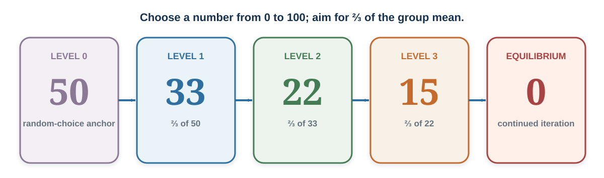

---
aliases:
  - 46-strategic-interdependence.html
---

# Strategic Interdependence

*The Best Move Depends on Other Minds*

::: {#chapter-23-start .chapter-epigraph}
> “The term is intended to focus on the interdependence of the adversaries’ decisions and on their expectations about each other’s behavior.”
>
> — Thomas C. Schelling, [*The Strategy of Conflict*](https://books.google.com/books/about/The_strategy_of_conflict.html?id=Bdt-AAAAMAAJ), 1960, p. 3
:::

[]{#opening-puzzle-meet-me-in-odense}You start chatting with someone in the queue at a concert and find that the two of you really click. You decide to watch the performance together. Once inside, you lose each other in the crowd before you have exchanged phone numbers.

You could head toward the stage, return to the entrance, or wait where you last saw them. A good spot near the stage would let you enjoy the music, but it will not help you find each other if they have gone back to the entrance.

The other person faces the same problem. Where you should go depends on where you expect them to go—and on where they expect to find you.

::: {.callout-note .core-idea icon=false}
## Core Idea

In a strategic interaction, your outcome depends on your action and on other people's actions. They are choosing too, often while trying to anticipate you. Understanding that dependence means looking beyond what you prefer to what others have reason to do.
:::

## Learning goals

- Explain strategic interdependence through three situations in which the outcome depends on other people's choices.
- Distinguish personal preferences from expectations about others, including what they expect you to do.
- Use equilibrium to describe choices that fit together, while recognizing why it may not predict actual play.

## Finding each other {#finding-each-other-in-odense}

Returning to the main entrance might seem promising because you both came through it. You know the other person has seen it, and they know you have too. That shared experience gives you a reason to expect the same destination, even though you know little about each other's habits or preferences.

But the stage may seem more obvious to them: that is where you intended to watch the performance together. A place can make sense to each of you for different reasons without bringing you together. Waiting matters as well. If one person arrives just after the other leaves to search elsewhere, choosing the same destination will still fail.

The other person is also trying to work out what you will do. They might return to the entrance because they expect you to see it as an obvious place to wait. Your uncertainty concerns someone who is responding to their own uncertainty about you. The next chapter examines how a shared experience, a landmark, or a convention can help people settle on the same answer.

Game theory calls the value of an outcome to a player a **payoff**. Here, the value of choosing a place depends partly on whether the other person goes there too. The next exercise separates personal preference from this dependence on another person's choice more sharply.

## Choosing a face: preference or prediction? {#two-beauty-contests}

Imagine a classroom exercise in which everyone receives the same set of labeled portraits. First, each participant selects the face they personally find most attractive. There is no correct answer and no reward for matching anyone else.

Now the instructor changes the rule. Participants are paired, and both receive a reward if they select the same face. Different selections earn nothing. Each chooses again without seeing the partner’s answer. How would this rule change what you consider when choosing?

Nothing about the faces has changed, but a different feature of them now matters: which one the other participant is likely to select. You might keep your original choice because you expect them to share your preference. You might instead choose a face you like less because it seems more widely appealing or distinctive. Either decision can be sensible under the new rule.

If matching earns 15 units, a face's expected reward depends on how likely the partner is to select it. For a player concerned only with that reward, the best response is to choose a face with the highest chance of a match. Your own ranking supplies possible evidence about their choice, but it no longer directly determines the monetary payoff.

The two tasks separate **what I prefer** from **what I expect someone else to choose**. A change of answer need not mean your taste changed or that you gave in to social pressure. The incentive changed. Equally, an unchanged answer does not establish that you ignored the incentive: preference and prediction may happen to point to the same face.

:::: {#math-matching-reward}
::: {.callout-note .research-lens .mathematical-analysis icon=false collapse=true}
## Mathematical analysis: the expected reward from matching

If your reward is 15 units, its expected value from selecting face $j$ is

$$
15\times\Pr(\text{the other person selects face }j).
$$

Because every successful match pays the same amount, maximizing the expected reward means maximizing the chance of a match.
:::
::::

### The other person is predicting too

The second participant is also paid to match. They may choose what they think *you* expect them to select. This makes a face that is commonly recognized as striking potentially useful even when neither person ranks it first privately. Shared expectations can converge on a choice that would not win a private-preference poll.

Keynes (1936, Chapter 12) used a newspaper beauty contest to illustrate a related difficulty in investing: anticipating others' judgments can matter alongside judging an asset's underlying value. His contest had different rules from this pair-matching exercise, but the distinction transfers. A trader expecting to resell soon must consider what the next buyer will pay, as [Markets, Mispricing, and Bubbles](27-markets-mispricing-and-bubbles.qmd#chapter-27-start) examines. That concern can influence trading without proving that every price movement reflects imitation or that fundamentals have ceased to matter.

To investigate a change of answer in the face task, record both the person's private ranking and their prediction of the other participant's selection. Observing the final choice alone cannot tell us whether they anticipated shared tastes, a salient face, or a convention learned from an earlier round.

## The guessing game: how far will others reason? {#opening-puzzle-should-a-sophisticated-player-choose-zero}

In a group of at least three people, everyone chooses a real number from 0 to 100. The person closest to two-thirds of the group's mean wins a fixed prize, shared equally in a tie. Choose your number before continuing.

The face task rewarded matching another person's answer. Here the target itself depends on everyone's answers, including yours. If the mean were 45, the target would be 30; if it were 30, the target would be 20. A number becomes a good choice through its relation to what the group chooses.

One starting guess is that people will choose roughly at random across the range, giving an expected mean of 50. Two-thirds of that is about 33. But the other players can see the same rule. If you expect them to take that step, a number around 22 becomes attractive. If you expect them to anticipate that step too, you may aim near 15.

These numbers approximate where a player might aim. Your own number influences the mean, and winning depends on how close the other numbers are to the target. Reasoning from an expected average becomes more useful in a large group, where your own effect on that average is small.

### Does thinking further always help? {#limited-strategic-depth-level-k}

Suppose most of the others stop around 33. A choice near 22 may beat them, while taking several more steps toward zero could leave you far from the target. Understanding the rule is useful, but winning also requires judging how the other people will use it.

Nagel's (1995) guessing-game experiments found behavior consistent with limited steps of reasoning, rather than everyone following the argument all the way down to zero. **Level-*k*** models describe such steps (Nagel, 1995; Stahl & Wilson, 1995). Level 0 supplies a starting rule, such as random choice; level 1 responds to that rule; level 2 responds to level 1. The familiar 50-to-33-to-22 sequence illustrates the idea.

The starting assumption matters as much as the number of steps. A sophisticated player may choose a relatively high number because they expect others to reason little. A low number is therefore not a direct measure of intelligence or strategic competence.

The [poisoned-goblet scene from *The Princess Bride*](https://youtu.be/0sPVEBAtwmg) makes this vulnerability memorable: each additional “I think that you think” rests on assumptions about the opponent. More reasoning cannot rescue a mistaken premise merely by extending it.

### Different reasoning can produce the same choice {#the-action-does-not-identify-the-thought}

A choice of 22 could reflect two steps from a random anchor. It could also come from remembering a previous classroom game, predicting a mean of 33 for another reason, or copying a familiar answer. Behavioral game theory compares such explanations rather than assigning a reasoning type from one number (Camerer, 2003; Crawford et al., 2013).

A further possibility is that players expect different people to reason differently. **Cognitive hierarchy** models allow a mixture of reasoning depths rather than assuming everyone is exactly one level below the player (Camerer et al., 2004). The Research Lens at the end of the chapter develops this model and the evidence across participant groups.

## What changes with experience? {#learning-is-not-the-same-as-deeper-initial-reasoning}

After several rounds, guessing-game choices often move downward. A player who saw a low group mean may revise their expectation; another may repeat a number that nearly won. Someone else may finally understand the rule. These routes can produce similar movement while implying different lessons about the next group.

**Belief learning** updates expectations about others. **Reinforcement learning** increases the tendency to repeat an action after a favorable outcome. **Imitation** copies another player's action. To distinguish them, vary the feedback: show the distribution of choices, show only the player's own earnings, or show which action won. Record expectations before each round as well as choices afterward.

A useful account should explain why the specified feedback changes behavior. Simply describing a falling mean as “greater rationality” leaves that explanation unfinished. Change in the prevalence of strategies across a population is a further question, developed in [Chapter 25's research lens](25-cooperation-and-social-preferences-self-interest-is-not-the-only-payoff.qmd#advanced-research-track-evolutionary-and-spatial-models).

## When do choices fit together? {#equilibrium-when-choices-fit-together}

The three situations have raised the same difficulty in different forms: you are deciding while other people are deciding too. Is there a combination of choices at which nobody would gain by changing their own choice alone?

A **Nash equilibrium** is such a combination: each player's strategy is a best response to the others (Nash, 1950). A **best response** gives the highest payoff against the other players' specified strategies. Equilibrium describes how the choices fit together; it does not require that the players reached them through a particular thought process.

In the meeting problem, suppose both people choose an accessible place and time where they can meet. Switching elsewhere alone would defeat their purpose. Many meeting arrangements could have this property, so identifying an equilibrium does not yet explain which one you and your new acquaintance will select. Likewise, several matching faces could satisfy the reward rule in the second exercise.

The guessing game has a different endpoint. Under its specified rules, the unique Nash equilibrium is for everyone to choose zero (Nagel, 1995). If everyone else chooses zero, choosing zero shares the prize. Choosing a positive number raises the mean, but in a group of at least three it leaves the zero-choosers closer to the resulting target, so the deviation loses.

The ladder in @fig-level-k-reasoning-ladder connects a few steps of reasoning with that endpoint. It separates where the argument can lead from where a particular group is likely to stop.

{#fig-level-k-reasoning-ladder fig-alt="An illustrative ladder starts from an expected random-choice anchor of fifty, then gives approximately thirty-three, twenty-two, fifteen, and the equilibrium zero for a two-thirds-of-the-mean guessing game." width=100%}

Choosing zero by yourself does not put the group in equilibrium. If others choose positive numbers, zero can lose. Your decision still depends on what you have reason to expect from these players. [Coordination and Focal Points](24-behavioral-game-theory-equilibrium-is-a-benchmark-not-a-portrait.qmd#chapter-24-start) introduces payoff matrices and develops equilibrium analysis from this starting point.

## Application: anticipate the response before committing

A manager may propose a new reporting system because it improves their team's work. Other departments may delay adoption because the system is useful only if everyone joins, because they bear more of the transition cost, or because they prefer to keep information private. The manager's own benefits cannot establish how those departments will respond.

Start by identifying what each person can do and how combinations of actions affect their payoffs. Separate your own preference from your prediction of theirs. Then ask what they know about your plan and what response they expect if they hesitate. A useful prediction identifies what could change another person's choice.

[]{#ethics-whose-payoff-enters-the-model}

Include the people affected by the arrangement, even if they cannot choose within it. An agreement between competitors can harm customers; a shared convention can exclude newcomers. A successful strategy for the people at the table may impose costs on others whose interests the model leaves out.

For an exercise in model construction, watch the [strategic-interdependence scene from *A Beautiful Mind*](https://youtu.be/Q-a1I61sIO8). List the participants' options, including those of the people the characters discuss, and check whether anyone could gain by departing from the proposed arrangement.

## Practice Lab

Revisit the three examples in order. For the meeting problem, pair people who know little about one another and ask them to imagine being separated at a crowded event. Have each choose a place to wait independently, then compare the cues each expected the other to recognize. For the face task, give everyone the same set of labeled portraits, then compare private rankings with rewarded matching choices. For the guessing game, record an initial choice and prediction of the mean, then play five rounds with feedback.

Before revealing each result, ask participants what they expect others to do and why. Afterward, identify one change in behavior and develop two possible explanations. Propose a change in information or incentives that would make those explanations predict different choices. Knowing an equilibrium answer is less informative than being able to explain when it would help predict the people actually playing.

## Take it forward

The meeting problem required anticipating where your new acquaintance would go to look for you. The face task separated private taste from rewarded prediction, and the guessing game made you examine where other people's reasoning might stop. In each case, evaluating your own choice required a view of someone else's action.

Before committing to a plan, identify the response you are counting on and what gives you reason to expect it. The next chapter makes that dependence visible in payoff matrices, then asks why people can struggle to coordinate even when they understand what would work.

[]{#cognitive-hierarchy-best-respond-to-a-mixture}

::: {.callout-note .research-lens icon=false collapse=true}
## Research Lens: cognitive hierarchy and the evidence

In cognitive hierarchy, a step-$k$ thinker best responds to a distribution of steps $0$ through $k-1$. Camerer, Ho, and Chong (2004) model the population frequency of step $h$ with a Poisson distribution,

$$
f(h)=\frac{e^{-\tau}\tau^h}{h!},
$$

and renormalize the distribution over the lower steps the player believes exist. The parameter $\tau$ controls the average number of steps. The authors report that a value around 1.5 fits behavior across many games, although fitted values differ by task and participant pool.

@tbl-beauty-contest-groups reproduces selected guessing-game results from their Table II. The sample sizes count participants across the reported groups. The fitted $\tau$ values in this table were chosen to match the observed mean.

| Participant pool | Sample size | Mean choice | Modal choice | Fitted $\tau$ |
| --- | ---: | ---: | ---: | ---: |
| Chief executives | 20 | 37.9 | 33 | 1.0 |
| German students | 66 | 37.2 | 25 | 1.1 |
| U.S. high-school students | 52 | 32.5 | 33 | 1.6 |
| Economics PhDs | 16 | 27.4 | — | 2.3 |
| Portfolio managers | 26 | 24.3 | 22 | 2.8 |
| Caltech students | 42 | 23.0 | 35 | 3.0 |
| Newspaper participants | 7,884 | 23.0 | 1 | 3.0 |
| Game theorists | 136 | 19.1 | 0 | 3.7 |
: Descriptive guessing-game results and fitted reasoning depths (Camerer et al., 2004, Table II) {#tbl-beauty-contest-groups}

The mean was 37.9 among the chief executives and 19.1 among the game theorists, but these are comparisons across settings and selected participant pools. Substantial variation remains within pools, and alternative beliefs can produce the same number. Model evaluation should compare predictions against new choices or against experimental changes on which rival explanations disagree.

The zero endpoint in the guessing game can also be approached through iterated elimination of weakly dominated high choices. The target cannot exceed $66\frac{2}{3}$; after excluding choices above that bound, the next upper bound is $44\frac{4}{9}$, then $29\frac{17}{27}$, and so on toward zero (Nagel, 1995). A weakly dominated choice never yields more than an alternative against the others' possible choices and yields less in at least some cases. This is a stronger assumption about what players rule out than simply saying that they want to win. [Chapter 24](24-behavioral-game-theory-equilibrium-is-a-benchmark-not-a-portrait.qmd#chapter-24-start) develops the comparison of strategies.

Coricelli and Nagel (2009) compared play against human and computer opponents using behavioral and neural measures. Their findings associate strategic reasoning with differences in processing when the opponent changes. Such evidence can help discriminate between accounts.
:::

[]{#research-lens-the-50-auction-and-competitive-escalation}

::: {.callout-note .research-lens icon=false collapse=true}
## Research Lens: the €50 auction and competitive escalation

In Shubik's dollar-auction game, the highest bidder wins the prize, but the second-highest bidder must also pay their final bid (Shubik, 1971). Early entry looks attractive. Once two people are competing, another small bid can appear cheaper than accepting a certain loss. Each expects that the next bid may make the rival quit. If both reason this way, bids can exceed the prize.

The game makes it possible to examine **competition neglect**, when bidders enter without accounting for rivals' persistence, and **escalation of commitment**, when earlier choices make stopping difficult (Staw, 1976). A further bid can also be a forward-looking response to a belief that the rival will stop. Bidding beyond the prize therefore does not by itself identify either psychological failure.

Competitive acquisition creates a related trap. When bidders have noisy estimates of a common value, winning can be bad news: the winner may simply be the most optimistic bidder (Bazerman & Samuelson, 1983). This winner's-curse problem concerns what winning reveals about the estimate, whereas the dollar auction concerns a rule requiring the runner-up to pay. Before entering, examine the rules and likely competitors, separate private synergies from common value, and set a reservation price based on future benefits and costs.
:::

::: {.callout-note .applied-module icon=false collapse=true}
## Applied module: market rules change the strategic game

Buyers and sellers can stand to gain from trade yet fail to find acceptable terms. Compare @tbl-market-institutions: each rule changes who can act, what they observe, and how a price forms.

| Institution | Basic rule | Strategic consequence to inspect |
| --- | --- | --- |
| Continuous double auction | Buyers and sellers submit and accept bids and asks during the trading period. | Rapid feedback can aid price discovery; timing and order visibility affect bargaining. |
| Posted-offer market | Sellers post take-it-or-leave-it prices and buyers choose among them. | Search and substitutability affect sellers' pricing power. |
| Call market | Orders are pooled and matched at a scheduled clearing time. | Pooling reduces continuous speed competition; clearing and rationing rules determine trades. |
: Market institutions alter information, timing, and bargaining power {#tbl-market-institutions}

A fish-market activity can assign private buyer values and seller costs, then vary supply across rounds, extending the experimental-market tradition of Smith (1962). Run the same underlying values under different trading rules. Compare prices, quantity, total surplus, and its division between buyers and sellers. Hold the economic environment as constant as possible so that differences can be traced to the rules under study.
:::

## References cited in this chapter

::: {.reference}
Bazerman, M. H., & Samuelson, W. F. (1983). I won the auction but don't want the prize. *Journal of Conflict Resolution, 27*(4), 618–634. https://doi.org/10.1177/0022002783027004003
:::

::: {.reference}
Camerer, C. F. (2003). *Behavioral game theory: Experiments in strategic interaction*. Princeton University Press.
:::

::: {.reference}
Camerer, C. F., Ho, T.-H., & Chong, J.-K. (2004). A cognitive hierarchy model of games. *Quarterly Journal of Economics, 119*(3), 861–898. https://doi.org/10.1162/0033553041502225
:::

::: {.reference}
Coricelli, G., & Nagel, R. (2009). Neural correlates of depth of strategic reasoning in medial prefrontal cortex. *Proceedings of the National Academy of Sciences, 106*(23), 9163–9168. https://doi.org/10.1073/pnas.0807721106
:::

::: {.reference}
Crawford, V. P., Costa-Gomes, M. A., & Iriberri, N. (2013). Structural models of nonequilibrium strategic thinking: Theory, evidence, and applications. *Journal of Economic Literature, 51*(1), 5–62. https://doi.org/10.1257/jel.51.1.5
:::

::: {.reference}
Keynes, J. M. (1936). *The general theory of employment, interest and money*. Macmillan.
:::

::: {.reference}
Nagel, R. (1995). Unraveling in guessing games: An experimental study. *American Economic Review, 85*(5), 1313–1326.
:::

::: {.reference}
Nash, J. F. (1950). Equilibrium points in n-person games. Proceedings of the National Academy of Sciences, 36(1), 48–49.
:::

::: {.reference}
Schelling, T. C. (1960). *The strategy of conflict*. Harvard University Press.
:::

::: {.reference}
Shubik, M. (1971). The dollar auction game: A paradox in noncooperative behavior and escalation. Journal of Conflict Resolution, 15(1), 109–111.
:::

::: {.reference}
Smith, V. L. (1962). An experimental study of competitive market behavior. *Journal of Political Economy, 70*(2), 111–137. https://doi.org/10.1086/258609
:::

::: {.reference}
Stahl, D. O., & Wilson, P. W. (1995). On players' models of other players: Theory and experimental evidence. *Games and Economic Behavior, 10*(1), 218–254. https://doi.org/10.1006/game.1995.1031
:::

::: {.reference}
Staw, B. M. (1976). Knee-deep in the Big Muddy: A study of escalating commitment to a chosen course of action. Organizational Behavior and Human Performance, 16(1), 27–44.
:::
