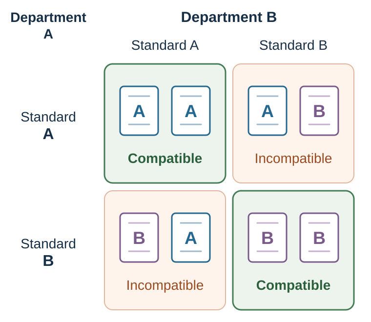

---
aliases:
  - 46-strategic-interdependence.html
---

# Strategic Interdependence

*The Best Move Depends on Other Minds*

::: {#chapter-23-start .chapter-epigraph}
> “The term is intended to focus on the interdependence of the adversaries’ decisions and on their expectations about each other’s behavior.”
>
> — Thomas C. Schelling, [*The Strategy of Conflict*](https://books.google.com/books/about/The_strategy_of_conflict.html?id=Bdt-AAAAMAAJ), 1960, p. 3
:::

[]{#opening-puzzle-meet-me-in-odense}You and another person must meet tomorrow in Odense. You cannot communicate. Write one exact place and one exact time. You receive the reward only if both answers match.

Your favorite café is not automatically a good answer. The central question is not, “Where would I like to go?” It is, “Which place would stand out to both of us, and would each of us expect the other to recognize it?”

The main station at noon might become a **focal point** if both people expect it to stand out to the other (Schelling, 1960). But an exchange student and a long-term resident may not share the same map. A successful answer depends on their shared expectations as well as the city’s geography.

::: {.callout-note .core-idea icon=false}
## Core Idea

When the outcome depends on other people’s choices, a good move must fit what they are likely to do. Game theory makes that dependence explicit so we can examine incentives, expectations, and rules—and see where changing the situation may help more than choosing a different move.
:::

## Learning goals

- Represent a strategic situation using players, actions, payoffs, information, timing, repetition, and enforcement.
- Distinguish coordination, mixed motives, and escalation while separating equilibrium from welfare and advice.
- Redesign one strategic situation by changing communication, commitment, timing, monitoring, or exit.

## Representing the strategic situation {#a-game-is-a-model-not-the-situation-itself}

A **game** is a mathematical representation of a strategic situation. At minimum, it specifies:

1. **Players:** Who can act, and whose response matters?
2. **Actions or strategies:** What can each player do?
3. **Payoffs:** What does each player value under every combination of actions?
4. **Information:** What does each player know, observe, or believe?
5. **Timing:** Who moves when, and can later players observe earlier moves?

Payoffs need not be money. They may include safety, time, status, fairness, identity, reputation, legal exposure, regret, or future access. A payoff table makes the proposed motives inspectable.

Timing also changes the game. Simultaneous price choices differ from a market in which one firm moves first and the other observes. A one-shot interaction differs from a relationship with an uncertain end. A public action differs from a private one because reputation and sanction become possible.

### See the game before solving it

Watch the linked [strategic-interdependence scene from *A Beautiful Mind*](https://youtu.be/Q-a1I61sIO8). Before accepting the character's solution, write the players, actions, payoffs, information, and timing. Then ask whose payoff is omitted and whether the proposed outcome is actually a Nash equilibrium. Treat the fictional scene as a model-building exercise, then test whether its proposed solution survives your payoff table.

## Best responses and Nash equilibrium

A **best response** is a strategy that gives a player the highest payoff against a specified strategy profile of the other players. In the two-player pure-action examples below, that reduces to choosing the best action against the other player's stated action. A **Nash equilibrium** is a strategy profile—possibly including mixed strategies—such that no player can gain by deviating alone (Nash, 1950).

This definition is narrow and powerful. It asks whether an outcome is stable against unilateral deviation. It does not ask whether the outcome is fair, efficient, moral, legal, or likely to occur.

Consider a stylized price-war game. The numbers are illustrative profit units.

| Firm 1 \ Firm 2 | High price | Low price |
| --- | ---: | ---: |
| **High price** | 10, 10 | 2, 15 |
| **Low price** | 15, 2 | 5, 5 |
: Illustrative price-war payoff matrix; Firm 1's payoff appears first {#tbl-price-war}

If Firm 2 chooses a high price, Firm 1 earns 15 by choosing low rather than 10 by choosing high. If Firm 2 chooses low, Firm 1 earns 5 by choosing low rather than 2 by choosing high. Low is therefore Firm 1's best response to either action. The same reasoning holds for Firm 2. The unique Nash equilibrium is low–low, with payoffs 5,5, even though both firms would earn more at high–high.

The matrix clarifies an incentive conflict: coordinated high prices may benefit firms while harming consumers and violating competition law. Efficiency must be defined for everyone affected, not only the players shown in the matrix.

### What equilibrium does—and does not—tell us

| Equilibrium can clarify | Equilibrium alone cannot establish |
| --- | --- |
| Whether each action is a best response to the others. | Whether players know the game or calculate correctly. |
| Whether an outcome is stable against one player's deviation. | Whether the outcome is socially efficient or fair. |
| How predictions change when payoffs, information, or timing change. | Which equilibrium will be selected when several exist. |
| Which commitment or rule changes the strategic incentives. | Whether the specified payoffs capture actual motives. |
: Equilibrium is a benchmark, not a portrait {#tbl-equilibrium-boundary}

[Behavioral Game Theory](24-behavioral-game-theory-equilibrium-is-a-benchmark-not-a-portrait.qmd#chapter-24-start) begins where the last column becomes unavoidable (Camerer, 2003): how do real people form beliefs, and how many steps of strategic reasoning do they use?

## Coordination: shared expectations can do the work

Coordination games often have several equilibria. The problem is not finding an action that would work if everyone chose it. The problem is selecting the same action.

Software formats and keyboard layouts become more useful when others use the same standard. These **network benefits** can make switching costly even when an alternative has attractive features.

David (1985) used QWERTY to motivate path dependence, while Liebowitz and Margolis (1990) challenged the familiar claim that QWERTY survived because it was deliberately designed to slow typists and was technically inferior. Historical adoption, installed bases, learning, compatibility, and switching costs can make a standard self-reinforcing.

### Focality, payoff dominance, and evidence

A focal outcome may be selected because it is salient. A payoff-dominant outcome gives all players a higher payoff than another equilibrium. These are not the same mechanism.

Suppose two people coordinate on a central station. Did they choose it because it was culturally salient, because it gave the highest payoff, or because each believed the other had visited it? A simple test varies salience while holding payoffs constant, or varies payoffs while holding labels and presentation constant. Without such a comparison, “focal point” may merely rename the outcome.

Culture can supply common expectations, but it can also divide them. When groups bring different conventions, explicit communication is not redundant; it creates common ground.

### Strategic uncertainty: the stag hunt

Both players could gain more by pursuing the stag together. Yet each risks being left with little if the other hunts hare. Agreement about the better joint outcome is therefore insufficient: each needs enough confidence that the other will follow through. The **stag hunt** makes that strategic uncertainty visible:

| Player 1 \ Player 2 | Stag | Hare |
| --- | ---: | ---: |
| **Stag** | 15, 15 | 2, 10 |
| **Hare** | 10, 2 | 10, 10 |
: Stag hunt with a payoff-dominant and a safer equilibrium {#tbl-stag-hunt}

Stag–stag and hare–hare are both Nash equilibria. Stag–stag is payoff dominant. Hare protects a player against being abandoned.

If Player 1 maximizes expected payoff and treats the displayed numbers linearly, and believes Player 2 chooses Stag with probability $p$, then:

$$
EU(\text{Stag})=15p+2(1-p)=2+13p,
$$

while $EU(\text{Hare})=10$. Stag is strictly better when $p>8/13\approx0.615$; at the threshold, both actions are best responses. The illustration makes one barrier visible: **strategic uncertainty** about whether others will coordinate can matter separately from ordinary outcome risk.

A new software platform poses a similar coordination problem. Users hesitate when few applications are available, while developers hesitate when few users have joined. A pilot, compatibility guarantee, or initial investment can change what each side expects the other to do. The stag-hunt model helps identify that dependence (Skyrms, 2004).

## Mixed motives, anti-coordination, and escalation

Some games require coordination while leaving players in conflict over which coordinated outcome should prevail.

::: {.callout-note .research-lens icon=false collapse=true}
## Research Lens: three additional strategic structures

These games differ in who benefits from matching actions and who bears the cost.

### Game of chicken

Two drivers approach a one-lane bridge. Both prefer that one yields. Neither wants to be the one who yields, and collision is worst. Similar structures appear in market entry, diplomatic confrontation, deadline bargaining, and escalation.

Commitment can change beliefs: a visible first move, sunk capacity, an exclusive contract, or a public launch date may make one action credible. But commitment does not create value by itself. A rigid commitment can also force a collision.

### Volunteer's dilemma

Everyone benefits if at least one person bears the cost of acting, but each prefers that someone else acts. Calling for help, reporting an error, or taking an unwanted organizational role can have this structure. More potential helpers do not guarantee action. [Shared Responsibility](28-authority-groupthink-and-shared-responsibility.qmd#bystanders-and-pluralistic-ignorance) examines the psychological evidence and distinguishes this incentive problem from uncertainty about whether help is needed.

### Battle of the Sexes—and turn taking

Two people prefer being together but disagree about the activity. Both coordinated outcomes are better than separation, yet distribution remains contested. In repeated versions of this structure, turn taking can create a Pareto improvement relative to persistent conflict. Rotation, lotteries, seniority, or a neutral tie-breaker can convert a distributional fight into a rule both sides can anticipate.

The lesson across these games is simple: “coordinate” is incomplete advice. Coordination must answer **on what**, **by which rule**, and **with what distribution of burdens and gains**.
:::

### Commitment changes the game

Keeping options open usually seems like an advantage. In bargaining, however, the other side may disregard a promise or threat precisely because you could cheaply abandon it. A credible commitment alters their expectations by making reversal costly, observable, or impossible. Schelling (1960) emphasized that deliberately limiting one's future freedom can sometimes increase bargaining power. The gain comes from changing the other player's response; the cost is the flexibility surrendered.

The Ford Price Promise provides a useful stylized case. A promise to reimburse buyers if the recommended price later fell could reassure consumers who expected a future price cut. It also raised Ford's cost of cutting price after the sale. If rivals adopted similar guarantees, the strategic incentives surrounding later price reductions could change. The case demonstrates how a customer promise may also operate as a competitive commitment (Rao et al., 2000).

Commitment and escalation can both make retreat difficult. To distinguish them, identify the response the commitment is supposed to change, check whether the audience can observe and believe it, and compare that future benefit with the flexibility sacrificed if circumstances change.

[]{#research-lens-the-50-auction-and-competitive-escalation}

::: {.callout-note .research-lens icon=false}
## Research Lens: the €50 auction and competitive escalation

In Shubik's dollar-auction game, the highest bidder wins the prize, but the second-highest bidder must also pay their final bid (Shubik, 1971). Early entry looks attractive. Once two people are competing, another small bid can appear cheaper than accepting a certain loss. Each expects that the next bid may make the rival quit. If both reason this way, bids can exceed the prize.

The game makes it possible to examine two explanations: **competition neglect**, when bidders enter without accounting for rivals’ persistence, and **escalation of commitment**, when earlier choices make stopping difficult (Staw, 1976). A further bid can also be a forward-looking best response to a belief that the rival will stop. Bidding beyond the prize therefore does not by itself establish either psychological failure.

The demonstration suggests a precaution before entry: set a reservation value and a stop rule based on future consequences, with an independent reviewer to challenge escalation.

Competitive acquisition creates a related trap. A bidder can value a target in isolation, then discover that the price is determined by rivals who saw the same target. When bidders have noisy estimates of a common value, winning can be bad news: the winner may simply be the most optimistic bidder (Bazerman & Samuelson, 1983). Before bidding, separate private synergies from common value, model likely rival entry, and set a reservation price that does not rise merely because competition becomes visible.
:::

### Bargaining is also a coordination problem

Suppose two players simultaneously claim shares of a total surplus of 4. If their claims sum to at most 4, each receives their claim. If the claims exceed 4, both receive 0.

Many claim pairs are feasible, and many can be sustained by expectations. The game combines coordination—avoid incompatible claims—with distribution—who receives how much. A focal equal split may help, but entitlement, contribution, alternatives, procedure, and power can support other claims.

This is why a Pareto improvement can still be unfair. Efficiency asks whether someone can be made better off without making another worse off. Fairness asks how benefits, burdens, voice, and procedure should be distributed. Neither criterion eliminates the other.

## First diagnose the strategic problem

Before choosing a move, identify the structure of dependence. The labels below are strategic archetypes, not mutually exclusive categories. Mixed motives combine cooperation and conflict; anti-coordination is a coordination family in which players benefit from taking different rather than matching roles. Let the specified payoffs determine which features coexist.

{#fig-strategic-situation-diagnostic fig-alt="An author's diagnostic map branches to four overlapping strategic archetypes: coordination, conflict, mixed motives, and anti-coordination, with anti-coordination identified as a coordination family. The archetypes converge on a game audit and design levers."}

| Structure | What makes the problem strategic? | Typical failure | Useful first question |
| --- | --- | --- | --- |
| Coordination | Interests broadly align, but actions must match. | Miscoordination or incompatible standards. | What common signal or convention can both sides recognize? |
| Conflict | One side's gain reduces the other's payoff. | Hidden resistance, retaliation, or exploitation. | What will the other side do after my move? |
| Mixed motives | Cooperation creates value, while distribution creates conflict. | Failure to cooperate or a fight over who receives the gain. | Which part creates value, and which part allocates it? |
| Anti-coordination | Players benefit from choosing different roles or actions. | Collision, delay, duplication, or nobody volunteering. | How will roles be assigned or rotated? |
: Four strategic archetypes that can overlap {#tbl-strategic-structures}

The same visible behavior can arise from different games. Two firms may keep prices high because costs increased, because demand changed, because they independently reached the same best response, or because they coordinated illegally. Two colleagues may remain silent because they agree, fear authority, expect the other to speak, or each hopes the other will bear the cost. Surface behavior does not identify the payoff structure or the beliefs behind it.

## Application: run a strategic audit before giving advice

A forceful move can fail when it solves the wrong strategic problem: pressure may harden a distributional conflict, while reassurance may leave an incentive to defect unchanged. Before choosing the move, establish which dependence makes the current outcome persist. Use this sequence:

1. **Name the players.** Include absent stakeholders, regulators, customers, and future selves whose responses matter.
2. **List actions.** Include delay, exit, communication, delegation, and rule changes—not only the two visible moves.
3. **Specify payoffs.** Separate money, relationship, status, fairness, legal exposure, and future options.
4. **Map information and timing.** What is observed, believed, hidden, or learned later?
5. **Find best responses and equilibria.** Use them as conditional benchmarks.
6. **Test alternative games.** Would another plausible payoff or belief structure reverse the prediction?
7. **Change the game.** Consider communication, sequencing, matching, guarantees, rotation, monitoring, commitment, or exit.
8. **Record a prediction.** State whose behavior should change, by how much, and what result would count against the diagnosis.

### Worked application: two departments need one reporting standard

Department A prefers a system integrated with its existing software. Department B prefers a more flexible platform. Both lose if they adopt incompatible systems.

Calling the disagreement “resistance to change” would personalize a coordination problem. A better design makes the game explicit:

- measure the payoff from compatibility separately from each system's local quality;
- identify switching and training costs for both departments;
- create a joint pilot with the same evaluation criteria;
- use a pre-agreed tie-breaker if results are close;
- compensate concentrated transition costs rather than pretending they do not exist;
- preserve an exit or review point if the common standard fails.

The goal is not merely agreement. It is an agreement whose coordination benefit survives implementation.

## Ethics: cooperation for whom, commitment against whom?

Strategic competence can create value, but it can also make exploitation more effective.

- Competitors can coordinate to raise prices at customers' expense.
- A focal norm can exclude people who do not share the dominant group's history.
- A commitment can protect a joint plan or coerce the other side by making harm inevitable.
- Reputation systems can support trust or punish dissent and trap people in stale labels.
- Institutions can solve a dilemma for insiders while moving costs to outsiders.

The ethical test is not whether the strategy reaches equilibrium. Ask who is included in the payoff table, whether material facts and alternatives remain visible, whether refusal is meaningful, and whether the rule would remain defensible if affected people understood how it worked.

## Practice Lab

Map a live supplier, departmental, or platform interaction. Produce a strategic map listing players, actions, material and social payoffs, information, timing, repetition, enforcement, and outsiders. Draw one baseline payoff table and identify best responses. Change exactly one rule—communication, timing, monitoring, commitment, rotation, or exit—and state the observable behavioral change the redesign predicts.

## Take it forward

The Odense meeting problem becomes easy once the two people can agree on a place and time. In a departmental conflict, agreement also has to cover training costs, the chosen standard, and what happens if it fails. In both cases, better advice begins by making the dependence visible.

::: {.callout-note .applied-module icon=false collapse=true}
## Applied module: market rules change the strategic game

Buyers and sellers may stand to gain from trade yet fail to find acceptable terms. Whether those gains are realized depends partly on the trading rule: who can move, when they move, what they observe, and how a price is formed.

| Institution | Basic rule | Strategic consequence to inspect |
| --- | --- | --- |
| Continuous double auction | Buyers and sellers submit and accept bids and asks during the trading period. | Rapid feedback can aid price discovery, while timing and order visibility affect bargaining. |
| Posted-offer market | Sellers post take-it-or-leave-it prices and buyers choose among them. | Price-setting power initially sits with sellers; search and substitutability determine discipline. |
| Call market | Orders are pooled and matched at a scheduled clearing time. | Pooling reduces continuous speed competition but makes the clearing and rationing rule consequential. |
: Market institutions alter information, timing, and bargaining power {#tbl-market-institutions}

A fish-market activity can assign private buyer values and vary available supply across rounds, extending the experimental-market tradition of Smith (1962). Run the same underlying values under different trading rules, then compare transaction prices, quantity, total surplus, and how surplus is divided between buyers and sellers. The scientific question is which rule changes price discovery, allocative efficiency, adaptation to a supply shock, and bargaining power, holding the economic environment as constant as possible.
:::

## References cited in this chapter

::: {.reference}
Bazerman, M. H., & Samuelson, W. F. (1983). I won the auction but don't want the prize. *Journal of Conflict Resolution, 27*(4), 618–634. https://doi.org/10.1177/0022002783027004003
:::

::: {.reference}
Camerer, C. F. (2003). *Behavioral game theory: Experiments in strategic interaction*. Princeton University Press.
:::

::: {.reference}
David, P. A. (1985). Clio and the economics of QWERTY. American Economic Review, 75(2), 332–337.
:::

::: {.reference}
Liebowitz, S. J., & Margolis, S. E. (1990). The fable of the keys. Journal of Law & Economics, 33(1), 1–25.
:::

::: {.reference}
Nash, J. F. (1950). Equilibrium points in n-person games. Proceedings of the National Academy of Sciences, 36(1), 48–49.
:::

::: {.reference}
Rao, A. R., Bergen, M. E., & Davis, S. (2000). How to fight a price war. Harvard Business Review, 78(2), 107–116.
:::

::: {.reference}
Schelling, T. C. (1960). *The strategy of conflict*. Harvard University Press.
:::

::: {.reference}
Shubik, M. (1971). The dollar auction game: A paradox in noncooperative behavior and escalation. Journal of Conflict Resolution, 15(1), 109–111.
:::

::: {.reference}
Skyrms, B. (2004). *The stag hunt and the evolution of social structure*. Cambridge University Press.
:::

::: {.reference}
Smith, V. L. (1962). An experimental study of competitive market behavior. *Journal of Political Economy, 70*(2), 111–137. https://doi.org/10.1086/258609
:::

::: {.reference}
Staw, B. M. (1976). Knee-deep in the Big Muddy: A study of escalating commitment to a chosen course of action. Organizational Behavior and Human Performance, 16(1), 27–44.
:::
