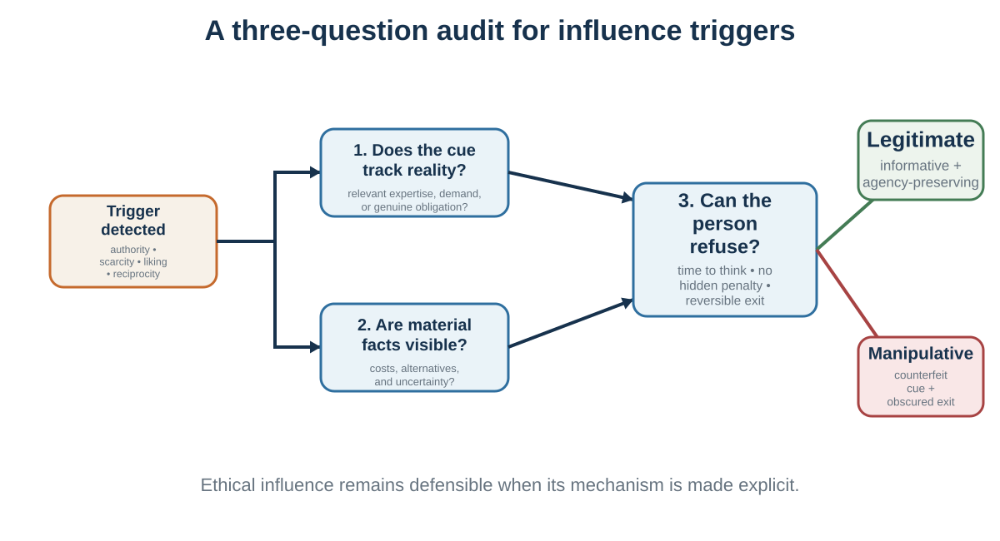

# Chapter 24. Authority, Bystanders, and Influence Triggers

*Signals that coordinate behavior—and can be counterfeited*

## Learning goals

- Explain authority, diffusion of responsibility, pluralistic ignorance, and bystander intervention.
- Analyze reciprocity, consistency, scarcity, liking, unity, social proof, and reasons as recurring influence triggers.
- Distinguish legitimate signals from counterfeit cues.
- Design and resist influence while preserving truth, welfare, and agency.

<aside class="callout core-idea">
CORE IDEA

Influence triggers are useful because they compress social information. They become manipulative when the cue is manufactured, material facts are hidden, or exit is made difficult.
</aside>

## Authority and responsibility

Authority is one of the most powerful forms of social influence. People often comply with requests from those who appear to have legitimate power, expertise, or institutional role.

Authority can be useful. In emergencies, people need to follow trained leaders. In medicine, patients benefit from expert knowledge. In organizations, authority coordinates action. In education, teachers guide learning. Without some respect for authority, collective life becomes inefficient and chaotic.

But authority can also lead people to act against their own judgment.

Stanley Milgram’s obedience experiments remain among the most famous and disturbing studies in psychology. Participants were instructed by an experimenter to administer increasingly severe electric shocks to a learner whenever the learner made mistakes. The shocks were not real, but participants believed they were. Many continued to administer shocks despite the learner’s protests, when urged by the experimenter to continue (Milgram, 1963, 1974).

The experiments have been debated ethically and methodologically, and later scholars have offered more nuanced interpretations. But the core lesson remains powerful: ordinary people may comply with authority in ways that conflict with their moral discomfort, especially when responsibility is shifted upward, the setting is institutional, the task is gradual, and the authority appears legitimate. Burger (2009) replicated a modified version of the paradigm under modern ethical constraints and found substantial obedience up to a lower stopping point.

Authority works through several channels. It signals expertise. It defines roles. It reduces uncertainty. It shifts responsibility. It creates pressure to be cooperative. It makes refusal socially costly. It can also narrow attention: the person focuses on following instructions rather than evaluating the moral whole.

This matters in organizations. Employees may follow unethical orders because “leadership approved it.” Doctors may defer to senior physicians. Junior staff may fail to challenge unsafe decisions. Engineers may implement features they privately find manipulative. Soldiers, police, bureaucrats, and corporate employees may treat role obedience as responsibility.

Authority cues can be subtle. A title, uniform, badge, office, accent, credential, expensive suit, confident tone, or institutional logo can increase compliance. Sometimes the authority is real. Sometimes it is performed.

The ethical danger is not authority itself. It is unaccountable authority. Good systems create ways to question authority when stakes are high. Aviation, medicine, and safety-critical organizations use checklists, cross-checks, escalation protocols, and crew resource management partly to reduce harmful deference. A junior nurse or co-pilot must be able to speak up when safety is at risk.

A useful question is:

Am I complying because the authority has good reasons, or because the role makes disagreement difficult?

Authority should guide judgment, not replace it.

## Bystanders and pluralistic ignorance

Social influence can also stop people from acting.

In emergencies, one might expect that more witnesses would mean more help. But research on the bystander effect shows that the presence of others can reduce individual intervention. Darley and Latané (1968) found that participants were less likely to help a person apparently having a seizure when they believed other bystanders were present. Latané and Darley (1970) argued that bystander inaction arises from several processes: noticing the event, interpreting it as an emergency, accepting responsibility, knowing how to help, and deciding to act.

Other people can interfere at several stages. If no one else reacts, the situation may seem less serious. This is pluralistic ignorance: people privately feel concern but infer from others’ calm behavior that nothing is wrong. If many people are present, responsibility diffuses: “Someone else will act.” If action might be embarrassing, people hesitate.

Pluralistic ignorance appears beyond emergencies. Students may privately feel confused but remain silent because no one else asks questions. Employees may privately doubt a strategy but infer from others’ silence that they are alone. Citizens may privately oppose a norm but believe most others support it. College students may overestimate peers’ comfort with drinking because discomfort is hidden (Prentice & Miller, 1993).

Pluralistic ignorance is dangerous because it creates false consensus. Everyone looks around, sees silence, and concludes that others agree. The group continues a behavior that many members privately question.

Organizations should take pluralistic ignorance seriously. Silence is not consent. Lack of objection is not agreement. A meeting in which nobody speaks may reflect fear, confusion, hierarchy, fatigue, or uncertainty. Leaders who ask, “Any objections?” often get silence because objecting publicly is costly. Better methods include anonymous polling, private written input, structured rounds, red teams, and explicitly asking for concerns.

Diffusion of responsibility also appears in organizations. When many people are copied on an email, everyone may assume someone else will act. When a safety issue crosses departments, each group assumes another owns it. When unethical behavior is distributed across roles, each person sees only a small part and feels less responsible.

The antidote is responsibility design.

Who is responsible for noticing? Who is responsible for acting? What signal requires escalation? How can people safely express concern? What should one person do if everyone else is silent?

Social influence does not only push people toward action. It can also hold them still.

## Influence triggers: a diagnostic map

<figure class="book-figure"><figcaption>Figure 24.1. Influence is more legitimate when cues track reality, material facts remain visible, and refusal remains meaningful.</figcaption></figure>

Influence triggers are compressed social rules. They are useful when a visible cue reliably tracks expertise, demand, obligation, commitment, or shared identity. They become manipulative when the cue is manufactured, material facts are hidden, or the cost of refusal is quietly increased.

*Table 24.1. Legitimate signals and counterfeit triggers*

| Trigger | Legitimate information it can carry | Counterfeit form | Pause question |
| --- | --- | --- | --- |
| A reason | The request has a relevant justification. | A reason-shaped phrase with no diagnostic content. | Would the reason change my judgment if the word “because” disappeared? |
| Social proof | Independent people with relevant experience converged. | Bots, copied reviews, paid popularity, or a cascade. | Are these judgments independent? |
| Commitment | A freely chosen promise expresses an endorsed value. | Early commitment was obtained before costs were disclosed. | Was the commitment informed and reversible? |
| Reciprocity | A genuine gift or concession supports cooperation. | A strategic favor functions as a hidden invoice. | Would I owe this if the tactic were explicit? |
| Authority | Relevant expertise is accountable and evidence-based. | Titles, uniforms, confidence, or logos substitute for reasons. | What is the source expert in, and who checks them? |
| Scarcity | Limited supply or time is real and decision-relevant. | A fake countdown or manufactured shortage creates panic. | Is the scarcity genuine, and does it change underlying value? |
| Liking | Trust grows from repeated, responsive interaction. | Charm, similarity, or compliments bypass scrutiny. | Would the claim survive if I disliked the source? |
| Unity | Shared identity supports mutual obligation. | Belonging is built through exclusion or contempt. | What is this “we” asking me not to see? |

## Eight recurring triggers

### A reason can be a trigger

Langer et al. (1978) studied requests to cut in line at a photocopier. In low-cost situations, adding the word "because" and a reason increased compliance, even when the reason was weak and nearly tautological: "because I have to make copies." The effect was much less permissive when the request imposed a larger cost.

The finding is often told as evidence that people obey the word "because." A more careful interpretation is that, in routine low-stakes settings, the presence of a reason can function as a quick signal that the request follows a legitimate script. When stakes rise, scrutiny rises.

The study does not license meaningless reasons as a general persuasion device. It shows how people economize on evaluation when the request appears ordinary and cheap.

### Social proof

Legitimate signal: accurate information about relevant others can reduce uncertainty.

Counterfeit: fabricated reviews, cherry-picked counts, bots, or a comparison group selected to manufacture normality.

Defense: inspect the reference group, sampling process, and whether visibility helped create the behavior.

### Commitment and consistency

People value coherence between action, identity, and public commitments. Cognitive dissonance theory describes discomfort when cognitions or actions conflict, although responses can include changing behavior, changing beliefs, or reframing the inconsistency (Festinger, 1957).

Small initial actions can also change later compliance. In the foot-in-the-door paradigm, agreeing to a small request increased willingness to accept a larger related request under some conditions (Freedman & Fraser, 1966). The initial action may alter self-perception, commitment, or the relationship with the requester. In the low-ball procedure, people first commit under attractive terms and are then more likely to persist after previously undisclosed costs appear (Cialdini et al., 1978). The finding illustrates commitment pressure, not an ethical license to hide costs.

Ethical use: help people enact values they already endorse. A public implementation plan can support follow-through.

Abuse: secure a trivial commitment and then escalate costs the person did not foresee.

Defense: ask whether the later request was visible when the initial commitment was made and whether exit remains meaningful.

### Reciprocity

Reciprocity supports cooperation by making generosity and concession sustainable. A favor can communicate trust. A concession can invite movement. In the door-in-the-face procedure, an initial large request followed by a smaller request can increase compliance, partly because the smaller request appears to be a concession (Cialdini et al., 1975).

Ethical use: give value without hiding a debt; make concessions that genuinely move toward agreement.

Abuse: create obligation with an unwanted gift or inflate the first request merely to make the target request appear reasonable.

Defense: separate gratitude from consent. A gift does not purchase a decision.

### Authority

Authority can be epistemic, based on expertise, or institutional, based on role. Both can be useful. A surgeon, engineer, or regulator may possess knowledge that a layperson lacks. The problem begins when authority replaces evidence rather than improving its quality.

Milgram's obedience experiments showed that ordinary participants could continue administering what they believed were increasingly painful shocks under pressure from an experimenter (Milgram, 1963). The findings emerged in a specific institutional setting and have generated extensive ethical and interpretive debate. They should not be reduced to "people obey anyone in a lab coat." The situation combined gradual escalation, a prestigious setting, division of responsibility, scripted reassurance, and ambiguity about the learner's actual condition.

Ethical use: disclose credentials, uncertainty, incentives, and the basis of the recommendation.

Abuse: use symbols of status, confidence, or institutional prestige to suppress questions.

Defense: ask what the authority knows, how they know it, what incentives they face, and whether disagreement is permitted.

### Scarcity

Scarcity can signal genuine competition, uniqueness, or timing. It also activates loss aversion and urgency. Limited seats, expiring capacity, and one-of-a-kind objects may truly require quick action.

Ethical use: state real constraints precisely.

Abuse: fake countdowns, perpetual "last chance" offers, or withholding ordinary availability to produce panic.

Defense: ask whether the underlying value changed or only the possibility of losing access became salient.

### Liking

We are more open to people we like. Similarity, familiarity, cooperation, praise, and attractiveness can influence liking. These cues can support trust when they reflect a genuine relationship; they can also spill into judgments of competence or product quality.

Ethical use: build authentic rapport and demonstrate attention.

Abuse: manufacture intimacy, excessive praise, or similarity unrelated to the decision.

Defense: separate "I like this source" from "this claim is well supported."

### Unity

Unity extends beyond similarity to shared identity. People can value outcomes differently when a person, organization, or cause becomes part of "we." Minimal-group experiments show how easily categorization can produce ingroup favoritism, even when group distinctions are arbitrary (Tajfel et al., 1971).

Ethical use: build inclusive identities around shared purpose and mutual obligation.

Abuse: create belonging through contempt, threat, or dehumanization of an outgroup.

Defense: ask what the proposed "we" requires you to ignore about people outside it.

## Signals and counterfeit signals

Many influence principles operate through cues that ordinarily carry information. Ethologists used the idea of a sign stimulus for a feature that releases a characteristic response; the analogy is useful only with caution, because human responses to social cues are learned, goal-sensitive, and context-dependent rather than fixed reflexes (Tinbergen, 1951).

A reason signals legitimacy.

A gift signals goodwill and relationship.

Authority signals expertise or institutional responsibility.

Scarcity signals competition or limited opportunity.

Popularity signals collective experience.

Similarity signals shared interests or diagnostic comparison.

Commitment signals identity and future consistency.

The response to these cues is not foolish. It becomes dangerous when the cue is detached from what it normally signifies. A fake countdown simulates scarcity. Purchased reviews simulate social proof. A white coat simulates expertise. A "free" gift creates obligation that was hidden at the moment of receipt.

A famous field study placed pictures of eyes or flowers above an honesty box in a university coffee room. Contributions were much higher during the eye-image weeks, suggesting that minimal observation cues might activate reputational concern (Bateson et al., 2006). The image became a textbook example of a subtle trigger.

The wider evidence is less theatrical. Two meta-analyses found no reliable overall effect of artificial surveillance cues on generosity and emphasized inconsistent results and possible moderators (Northover et al., 2017). The responsible lesson is not that a pair of printed eyes reliably makes people honest. It is that cues of observation can matter in some contexts, but the effect is not a dependable behavioral remote control. Real accountability, identifiable responsibility, norms, and enforcement are stronger foundations for cooperation than decorative eyes.

The defensive skill is not to ignore all triggers. It is to restore the missing question:

What does this cue actually prove here?

## When influence helps - and harms

Social influence is not a problem to eliminate. It is a capacity to govern.

It helps when others have independent knowledge, when norms support prosocial behavior, when authority is legitimate, when social proof reflects real quality, when reciprocity sustains cooperation, when commitment supports long-term goals, and when shared identity creates care.

It harms when others are copying one another, when norms normalize harmful behavior, when authority suppresses conscience, when social proof is manufactured, when reciprocity is exploited, when commitment traps people in bad decisions, when scarcity creates artificial urgency, and when unity becomes exclusion.

The key is to ask what function the influence is serving.

Is it providing information? Is it creating pressure? Is it coordinating action? Is it protecting status? Is it supporting cooperation? Is it exploiting inattention? Is it making a good action easier? Is it making refusal costly?

Social influence also depends on transparency. A visible norm message such as “Most people in this building recycle” is different from fake reviews. A real expert recommendation is different from an actor in a lab coat. A genuine gift is different from a strategic favor designed to create obligation. A real deadline is different from a fake countdown timer.

Ethical social influence should help people make choices they would endorse under reflection. Manipulative influence uses social pressure, identity, fear, liking, or obligation to push people toward choices they would resist if they understood the tactic.

A simple ethical test is:

Would the person feel respected or tricked if they understood how the influence worked?

If the answer is tricked, the influence deserves scrutiny.

## Designing and resisting influence

Because social influence is unavoidable, the practical goal is not independence from others. The goal is better social environments and better resistance to manipulation.

For organizations, this means designing norms intentionally. If leaders want people to speak up, they must make speaking up normal and safe. If they want ethical behavior, they must make ethics visible before decisions, not only after scandals. If they want learning, they must reward people who report problems. If they want cooperation, they must align incentives and identity with collective success.

Norms should be made explicit. “In this team, disagreement is a contribution.” “In this hospital, anyone can stop the line for safety.” “In this classroom, confusion is a normal part of learning.” “In this company, bad news early is valued.” Such statements matter only if behavior supports them.

Decision processes should reduce harmful conformity. Ask for independent estimates before discussion. Invite junior voices early. Use anonymous input for sensitive topics. Assign a rotating challenger role. Separate idea generation from evaluation. Create explicit space for dissent. Do not let the highest-status person speak first on uncertain issues.

To resist social influence individually, use several tools.

First, slow down under social pressure. Compliance triggers often work quickly. A pause restores agency.

Second, ask what cue is influencing you. Is it popularity, authority, scarcity, liking, reciprocity, commitment, or unity?

Third, seek independent evidence. Popularity is not proof. Authority is not proof. Scarcity is not proof. Liking is not proof.

Fourth, predefine values and limits. In negotiation, know your reservation price before the other side anchors. In purchases, know your budget before scarcity appears. In ethics, know what you will not do before authority pressures you.

Fifth, create dissent partners. A trusted person who is allowed to challenge you can break conformity.

Sixth, use private judgments before public discussion. Write down your view before hearing the group.

Seventh, be willing to be the first dissenter. One person can reduce conformity for others.

Finally, use social influence for good. Surround yourself with people whose norms support your values. Join groups where learning, health, integrity, generosity, and courage are normal. Make desired behavior visible. Praise the norms you want to spread. Social influence is not only something to resist; it is something to choose.

The broader cultural layer shapes the shared meanings within which immediate social influence operates. Social influence operates in immediate situations: groups, norms, authority, compliance triggers. Culture operates more broadly. It shapes what counts as respectful, moral, intelligent, risky, masculine, feminine, professional, loyal, independent, or successful. To understand decision-making fully, we must understand not only what others do in the moment, but the shared meanings that define the world in which decisions take place.

<aside class="callout evidence-and-boundary-conditions">
EVIDENCE AND BOUNDARY CONDITIONS

The watched-eyes effect is not a universal cooperation switch; results vary across tasks and settings. Use visible accountability only when its mechanism and ethical costs fit the context.
</aside>

<aside class="callout evidence-and-boundary-conditions">
EVIDENCE AND BOUNDARY CONDITIONS

The copy-machine &quot;because&quot; study is a classic demonstration under a low-stakes queue request, not proof that any reason word produces compliance.
</aside>

*Table 24.1  Influence principles as diagnostic questions*

| Principle | Question the mind may be answering | Ethical test |
| --- | --- | --- |
| Social proof | What do people like me do? | Are the displayed behaviors real and independent? |
| Consistency | What have I already said or become? | Was the commitment informed and freely chosen? |
| Reciprocity | What do I owe? | Was the favor a gift or a hidden invoice? |
| Authority | Who knows and who is responsible? | Does the cue track relevant expertise and accountability? |
| Scarcity | What might I lose? | Is the scarcity genuine and decision-relevant? |
| Liking | Who feels warm or similar? | Would the claim survive without personal affinity? |
| Unity | Who is us? | Does belonging expand cooperation or silence scrutiny? |

## Key ideas

- Authority is a coordination device, not a substitute for moral responsibility.
- Bystander inaction often reflects failures of noticing, interpretation, and assigned responsibility.
- Reciprocity, consistency, scarcity, liking, unity, and social proof are cue-based shortcuts that can be legitimate or counterfeited.
- Ethical influence makes the mechanism inspectable and preserves a meaningful path to refuse.

## Study and practice

### Questions

1. Why can ordinary people comply with harmful authority?

2. What makes a scarcity signal informative rather than manipulative?

3. How can an emergency system assign responsibility before ambiguity arrives?

### Activities

1. Influence audit: analyze a recent request and identify the cue, the information it legitimately conveyed, and the information it concealed.

2. Bystander redesign: turn an ambiguous request for help into an assigned, observable action.

### Experience-Explain-Apply reflection

In no more than 120 words: describe one specific experience, explain it using one or two concepts from the chapter, and state one application or testable prediction.

## References cited in this chapter

Bateson, M., Nettle, D., &amp; Roberts, G. (2006). Cues of being watched enhance cooperation in a real-world setting. Biology Letters, 2(3), 412-414.

Burger, J. M. (2009). Replicating Milgram: Would people still obey today? American Psychologist, 64(1), 1–11.

Cialdini, R. B., Cacioppo, J. T., Bassett, R., &amp; Miller, J. A. (1978). Low-ball procedure for producing compliance: Commitment then cost. Journal of Personality and Social Psychology, 36(5), 463–476.

Cialdini, R. B., Vincent, J. E., Lewis, S. K., Catalan, J., Wheeler, D., &amp; Darby, B. L. (1975). Reciprocal concessions procedure for inducing compliance: The door-in-the-face technique. Journal of Personality and Social Psychology, 31(2), 206–215.

Darley, J. M., &amp; Latané, B. (1968). Bystander intervention in emergencies: Diffusion of responsibility. Journal of Personality and Social Psychology, 8(4), 377–383.

Festinger, L. (1957). A theory of cognitive dissonance. Stanford University Press.

Freedman, J. L., &amp; Fraser, S. C. (1966). Compliance without pressure: The foot-in-the-door technique. Journal of Personality and Social Psychology, 4(2), 195–202.

Langer, E. J., Blank, A., &amp; Chanowitz, B. (1978). The mindlessness of ostensibly thoughtful action: The role of “placebic” information in interpersonal interaction. Journal of Personality and Social Psychology, 36(6), 635–642.

Latané, B., &amp; Darley, J. M. (1970). The unresponsive bystander: Why doesn’t he help? Appleton-Century-Crofts.

Milgram, S. (1963). Behavioral study of obedience. Journal of Abnormal and Social Psychology, 67(4), 371–378.

Milgram, S. (1974). Obedience to authority: An experimental view. Harper &amp; Row.

Northover, S. B., Pedersen, W. C., Cohen, A. B., &amp; Andrews, P. W. (2017). Artificial surveillance cues do not increase generosity: Two meta-analyses. Evolution and Human Behavior, 38(1), 144-153.

Prentice, D. A., &amp; Miller, D. T. (1993). Pluralistic ignorance and alcohol use on campus: Some consequences of misperceiving the social norm. Journal of Personality and Social Psychology, 64(2), 243–256.

Tajfel, H., Billig, M. G., Bundy, R. P., &amp; Flament, C. (1971). Social categorization and intergroup behaviour. European Journal of Social Psychology, 1(2), 149-178.

Tinbergen, N. (1951). The study of instinct. Clarendon Press.

