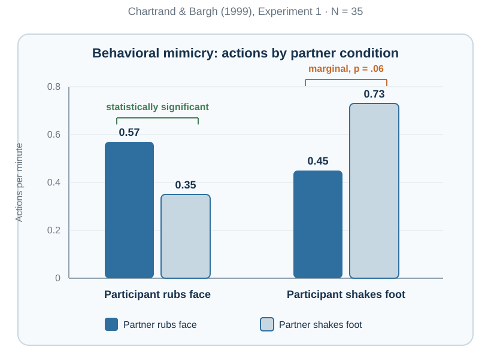
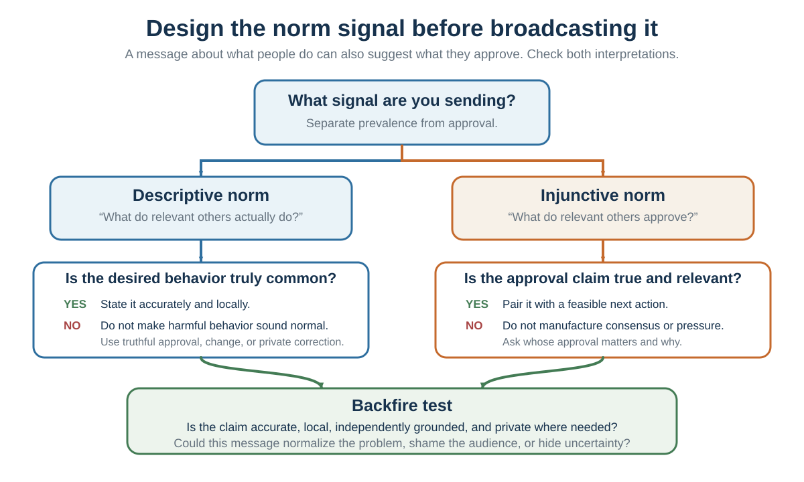
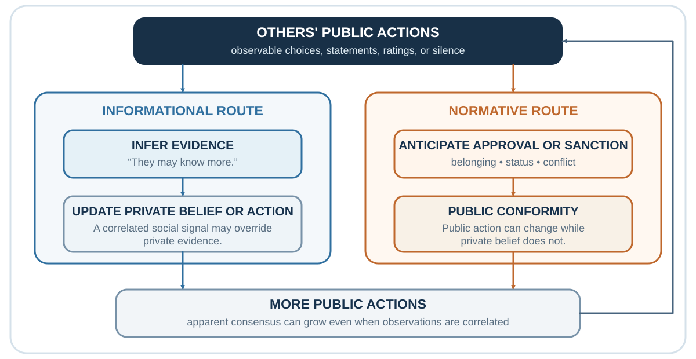

---
aliases:
  - 22-social-learning-mimicry-and-attribution.html
---

# Social Norms and Conformity: When Other People Become Evidence

*How public behavior becomes evidence, pressure, and a mirror that can mislead*

::: {.callout-note .core-idea icon=false}
## Core Idea

Other people are valuable sources of information, models, audiences, and regulation, and social learning helps make cumulative culture possible. But the same public behavior can reflect learning, coordination, approval, fear of sanction, identity, or copying, so visible conformity does not reveal its cause and an apparently large consensus may contain very little independent evidence. Therefore this chapter separates social learning, conformity, descriptive and injunctive norms, social proof, pluralistic ignorance, and information cascades before asking what the crowd should teach us.
:::

## Learning goals

- Treat conformity as an observed outcome, then distinguish informational learning, normative pressure, coordination, identity, and correlated copying as possible causes.
- Distinguish descriptive, injunctive, and dynamic norms; empirical and normative expectations; social proof; pluralistic ignorance; and information cascades.
- Redesign one meeting or norm message so private evidence is elicited before public influence begins.

::: {.callout-note .loop-location icon=false}
## Where this chapter enters the loop

Other people alter **Notice**, **Interpret**, **Predict**, **Value**, **Choose**, and **Learn**. Their actions can provide evidence about the world, reveal what a reference group does or approves, change the social cost of dissent, or merely repeat an earlier public signal.
:::

A solitary learner must discover every causal relation through personal trial and error. A social learner can watch, listen, imitate, ask, and inherit. The difference is enormous. A child does not derive a language from first principles. A medical student does not independently rediscover germ theory. A new employee learns which spreadsheet matters, which deadline is real, and which sentence from the formal procedure everyone quietly ignores.

Cumulative culture depends on social transmission with enough fidelity to preserve useful practices and enough variation to improve them. Human groups can retain techniques whose causal structure is not obvious to any one learner. Over generations, tools and institutions become more complex than a single person could plausibly invent alone (Boyd & Richerson, 1985; Henrich, 2016; Tomasello, 1999).

Social learning therefore solves an information problem. When direct evidence is expensive, ambiguous, or unavailable, another person's behavior becomes a cue. If several experienced hikers turn back from a trail, their action may be better evidence than the blue sky above you. If every clinician in a unit checks a particular sign before discharge, the routine may contain knowledge that has not yet been made explicit.

The same mechanism creates vulnerability. People may copy a fashion because it is visible, a rumor because it is repeated, or a dangerous norm because everyone else appears calm. Social information is valuable precisely because it often works. A counterfeit signal is powerful only because the genuine signal is usually worth using.

This reframes influence. A person who follows others is not necessarily weak. They may be using a rational shortcut under uncertainty. The scientific task is to identify when social evidence is diagnostic and when it is self-generating.

## The social brain is not simply the individually smartest brain

Human success should not be explained by imagining that humans outperform other species on every isolated cognitive task. Inoue and Matsuzawa (2007), for example, reported that trained chimpanzees could outperform adult humans in a demanding rapid-memory task for the locations of numerals. The important contrast is not “humans are intelligent and other primates are not.” Humans are unusually able to coordinate attention, imitate, teach, infer intentions, divide labor, preserve discoveries, and accumulate culture. Our advantage is deeply social.

Comparative evidence also links social complexity with brain organization. Dunbar (1992) reported an association between typical social-group size and neocortex measures across primate species, and Sallet and colleagues (2011) found that experimentally different social-network sizes were associated with differences in neural systems in macaques. These findings do not establish one universal “social brain number,” nor do they show that group size alone caused human intelligence. They support a narrower point: keeping track of alliances, status, trust, intention, and coordination is a computational problem that can shape cognition.

The decision implication is practical. Other minds are not an optional afterthought added to an otherwise private decision-maker. They help determine what is attended to, remembered, valued, imitated, and treated as possible.

One comparison makes the point vivid. In repeated matching-pennies games, chimpanzee choice frequencies were closer to the game-theoretic equilibrium than two human comparison samples, and the chimpanzees adjusted more closely to payoff changes (Martin et al., 2014). That result does **not** show that chimpanzees are generally more rational or that imitation alone explains the human pattern. It shows something narrower and more useful: human superiority is not uniform across solitary or competitive tasks, and an unusually social mind can carry task-specific costs as well as benefits.

## Copying and cumulative culture

{#fig-social-learning-culture fig-alt="Five nonsequential contributors—innovation, social learning, transmission fidelity, retention and institutions, and selection and correction—feed the possibility of cumulative culture. Outputs show useful accumulation and copied error or inertia."}

Observation and imitation do not automatically produce cumulative culture. Accumulation also requires some source of variation or innovation, sufficient transmission and retention, and processes that preserve, select, or correct practices across learners or generations. The mixture differs across settings; the diagram identifies conditional contributors rather than necessary stages in a fixed order.

In a classic comparison, human children and chimpanzees watched an adult retrieve a reward from a puzzle box. Some demonstrated actions were causally necessary; others were not. When the box was transparent and the mechanism visible, chimpanzees tended to omit irrelevant actions and reproduce the efficient route. Children often copied both relevant and irrelevant steps (Horner & Whiten, 2005).

At first glance, the chimpanzee looks more rational. It extracts the causal structure and ignores theater. Yet children's tendency toward overimitation may serve a different problem. A learner cannot always know which step is irrelevant. A tap, gesture, sequence, or preparation may carry hidden causal information, social meaning, safety value, or conventional significance. High-fidelity copying can preserve opaque practices until their function becomes clear (Lyons et al., 2007).

The lesson is not that children blindly imitate everything. Human copying is sensitive to intention, pedagogy, group membership, convention, and context. Nor is overimitation always beneficial. It can preserve needless bureaucracy as effectively as useful craft. An organization may continue a reporting ritual because "this is how it is done" even after the original risk has vanished.

What looks locally inefficient can be culturally intelligent. What looks culturally faithful can also become institutional inertia.

A practical diagnostic is to ask two questions about a copied practice:

1. What hidden function might this step preserve?

2. What evidence would justify removing it?

The first protects against arrogant simplification. The second protects against ritual without learning.

::: {.callout-note .research-lens icon=false}
## Research Lens: mimicry and synchrony

People in conversation often align without noticing. Posture, facial movements, speech rhythm, word choice, and gestures can become more similar. Chartrand and Bargh (1999) called this the chameleon effect: nonconscious behavioral mimicry that can increase interpersonal smoothness and liking. In service encounters, subtle mimicry has also been associated with greater rapport and prosocial response (van Baaren et al., 2004; Chartrand & Lakin, 2013).

{#fig-personal-mimicry-crossed-arms fig-alt="A young child and an adult stand several metres apart on a cobblestone street with matching crossed-arm postures." width="42%"}

{#fig-mimicry-study-redraw fig-alt="A zero-origin grouped bar chart reports actions per minute for 35 participants. Face rubbing is 0.57 with a face-rubbing partner and 0.35 with a foot-shaking partner, a statistically significant contrast. Foot shaking is 0.45 with a face-rubbing partner and 0.73 with a foot-shaking partner, a marginal contrast with p equal to point zero six. A boundary panel warns that one laboratory task does not establish a universal effect size."}

Mimicry is not mind control. Effects vary with relationship, status, group membership, goals, awareness, and how conspicuous the imitation becomes. Obvious copying can feel mocking or manipulative. The useful mechanism is not theatrical duplication but attunement. Two people begin to occupy a more coordinated interactional rhythm.

This matters because persuasion is not only a sequence of propositions. The audience is also evaluating whether the speaker is safe, responsive, sincere, dominant, similar, or attentive. A perfectly logical message delivered without responsiveness may be assigned low weight. A warm and synchronized exchange may increase openness before any central claim changes.

The ethical boundary is straightforward in principle and difficult in practice. Natural adaptation to another person's tempo can communicate attention. Deliberate mimicry used as a covert compliance technique treats rapport as a lever rather than a relationship.

A useful self-check is:

Am I adjusting in order to understand this person, or performing similarity in order to bypass their judgment?
:::

Social observation also requires causal explanation. When a colleague misses a deadline, the attribution audit developed in [Beliefs That Defend Themselves](10-beliefs-that-defend-themselves.qmd) asks which evidence would distinguish character, incentive, information, and constraint accounts before a convenient story selects the next policy.

## Other people as living data

Social influence begins with a practical problem: the world is uncertain, and no individual can learn everything alone.

If you arrive in a new city, you look at where locals eat, how people use public transport, which streets feel safe, and what behaviors attract disapproval. If you start a new job, you learn not only from formal rules but from how colleagues actually behave: when they speak, how they disagree, what they joke about, which deadlines matter, and how bad news is handled. If you enter a negotiation, you read tone, posture, silence, and the other side’s reactions. If you buy online, you look at ratings, reviews, downloads, likes, and testimonials.

Other people reduce uncertainty. They are living data.

This is why humans are powerful social learners. We do not learn only through direct trial and error. We learn by observing, imitating, teaching, and participating in shared practices. Tomasello (1999) argued that human cultural learning depends on capacities for shared attention, imitation, intention reading, and teaching. Boyd, Richerson, and Henrich (2011) argue that human success depends heavily on cumulative culture: knowledge and practices built across generations through social learning rather than reinvented individually.

Social learning is efficient because individual learning is costly. It is better to learn from someone else that a plant is poisonous than to test it yourself. It is better to learn from experienced colleagues how a system works than to discover every failure mode personally. It is better to learn professional norms from mentors than to violate them repeatedly.

People often use social learning selectively. They imitate successful people, prestigious people, similar people, older people, experts, high-status individuals, or the majority. Prestige-biased learning can be adaptive when prestige tracks skill or knowledge (Henrich & Gil-White, 2001). Majority-biased learning can be adaptive when many independent people converge on a useful behavior (Boyd & Richerson, 1985). Similarity-biased learning can be adaptive when people like us face similar problems. These capacities are part of a broader human system for sharing intentions and cultural knowledge (Tomasello et al., 2005).

But these social-learning rules can also fail. Prestige may reflect status rather than competence. Majorities may be wrong because they are copying one another. Similar others may share the same blind spots. An expert in one domain may be treated as an expert in another. A successful person may be lucky. A popular belief may be familiar rather than true.

Social influence therefore begins with a tension. Other people are indispensable sources of information, but they are not neutral evidence. Their behavior is shaped by their own incentives, ignorance, norms, identities, and previous social influence.

A useful question is:

Am I learning from independent evidence, or am I learning from people who may be copying one another?

This question will return later when we discuss collective expectations and asset bubbles. If everyone is looking at everyone else, the group may become confident without anyone having direct knowledge.

| Social cue | Why it can be useful | Failure mode | Test |
| --- | --- | --- | --- |
| Prestige | May summarize recognized expertise. | Status spills across domains. | What relevant performance earned the prestige? |
| Majority behavior | Can aggregate independent experience. | People may be copying the same source. | How independent are the judgments? |
| Similarity | Similar people may face similar constraints. | Shared identity can share the same blind spot. | Which similarities are decision-relevant? |
| Mimicry / synchrony | Can signal responsiveness and rapport. | Performed similarity becomes manipulation. | Does attunement improve mutual understanding? |
| Attribution | Creates a causal model for the next action. | Character stories hide situational constraints. | What question would discriminate among explanations? |
: Auditing social evidence {#tbl-22-1}

## Four conditions make social evidence more diagnostic

A crowd does not become wise merely by becoming large. Four conditions determine how much its convergence should change a belief.

First, observers need **relevant contact with the problem**. A thousand ratings from people who never used the difficult feature may be weaker than ten reports from users who completed the same task under similar constraints. Prestige can help locate expertise, but status earned in one domain does not automatically transfer to another.

Second, judgments need some **independence of evidence**. Independence does not mean that people never communicate. It means that their initial observations or reasons are not all copies of one visible claim. Ten analysts who used the same vendor report do not supply ten sources. Five interviewers who discussed a candidate after the first interview may have produced one shared impression rather than five assessments.

Third, the group needs **useful diversity and local knowledge**. People positioned in different roles may observe different parts of the system: a procurement officer sees contract exposure, an engineer sees reliability, a frontline employee sees workarounds, and a customer sees consequences. Diversity improves inference only if the process lets those differences reach the decision. Adding people while preserving one status hierarchy and one public script can increase representation without increasing information.

Fourth, the process needs an **aggregation and correction rule**. A mean forecast can pool independent numerical judgments; a structured discussion can surface reasons; a market price can reward information; a checklist can preserve a minority warning. Each rule loses something. Means can hide multimodality, discussion can amplify status, prices combine information with constraints, and checklists cannot anticipate every failure. The rule should fit what is being aggregated.

Return to the recurring hiring case. One committee sees a charismatic candidate and quickly agrees that the person “has leadership presence.” A better design asks each member to score the same predefined evidence independently, records confidence and reasons, identifies which interviewers observed the same episode, and then displays the distribution. A work sample and a base rate from comparable hires add evidence not produced by the room. Discussion comes afterward. If scores converge, the committee can now ask whether convergence came from independent observations or one shared halo.

The same audit applies to supplier reliability. Several managers saying “this supplier has never failed us” may represent one common organizational experience rather than several independent samples. The crowd is not irrelevant; it is simply counted by sources and exposures, not by voices.

## Conformity is an outcome, not a mechanism

Sherif's autokinetic studies asked people to estimate the apparent movement of a stationary light in darkness. Individual estimates varied; group estimates converged (Sherif, 1936). Under ambiguity, other judgments provided information and a shared norm emerged.

Asch's line-judgment studies changed the problem. The correct answer was visible, yet some participants publicly agreed with a unanimous wrong majority (Asch, 1956). Deutsch and Gerard (1955) distinguished **informational influence**, following others to be correct, from **normative influence**, following to avoid disapproval or visible deviance. Real situations mix them.

{#fig-asch-line-comparison fig-alt="A target vertical line of 170 units appears beside three comparison lines labeled A, B, and C. Comparison C is also 170 units. A lower prompt asks the reader to imagine that several people answer B aloud before their turn and to distinguish belief updating from the social cost of dissent." width=100%}

**Conformity** describes movement in judgment, belief, or behavior toward a group pattern. It does not identify why the movement occurred. The person may have learned something, anticipated approval or rejection, followed a coordination convention, expressed an identity, or concluded that resistance was not worth its cost. Public alignment can therefore coexist with private disagreement, and identical actions can arise from different causal routes.

| Observation | Candidate process | What not to infer |
| --- | --- | --- |
| Others appear better informed, and private belief changes. | Informational influence or social learning | That the evidence is independent or accurate. |
| Public action changes because approval, exclusion, or sanction is expected. | Normative influence | That private belief changed. |
| People choose the same side, platform, queue, or convention. | Coordination | That they think the option is intrinsically best. |
| Behavior expresses membership or local meaning. | Identity or cultural signaling | That outsiders attach the same meaning. |
| Later actors follow visible earlier actions despite contrary private signals. | Possible information cascade | That popularity began with quality. |
: Similar public alignment can have different causes {#tbl-social-alignment-mechanisms}

Conformity is not inherently defective. Shared conventions make traffic, queues, meetings, and safety routines possible. The danger is that public agreement does not reveal private belief. Group size, task ambiguity, status, public response, and unanimity change the pressure; even one dissenter can make disagreement socially possible. The organizational question is therefore: **What would someone hesitate to say here, even if it were true?**

::: {.callout-tip icon=false}
## Illustration, not evidence

The [elevator conformity demonstration](https://youtu.be/7Y0KT0ajZBw), an [Asch demonstration](https://youtu.be/TYIh4MkcfJA), and Andersen's public-domain tale *The Emperor's New Clothes* can make the mechanism memorable. Use them to predict what private response, one ally, or reduced ambiguity would change; do not treat edited clips or fiction as experimental evidence.
:::

## Social norms require a reference group

A social norm is not simply a behavior that many people perform. It concerns expectations within a **relevant reference group**: whose behavior is treated as typical, whose approval matters, and what people expect after compliance or violation. Bicchieri (2006) distinguishes **empirical expectations**—beliefs about what relevant others do—from **normative expectations**—beliefs about what relevant others think one ought to do. Both must be distinguished from a person's own preference. [Cooperation and Social Preferences](25-cooperation-and-social-preferences-self-interest-is-not-the-only-payoff.qmd) develops how norms and social preferences require different evidence and how norm judgments can be elicited.

In the focus theory of normative conduct, a **descriptive norm** reports what people do, while an **injunctive norm** reports what people approve or disapprove of (Cialdini et al., 1990). The distinction matters because a message can condemn a behavior while advertising that it is common. A late-night email may reveal that many colleagues work late without showing that they approve of the expectation. Silence in a meeting may reveal what people publicly do without revealing what they privately believe.

Before treating a pattern as a norm, ask:

- What do relevant people actually do?
- What do they admire, reward, tolerate, punish, or joke about?
- Whose reaction matters to the person deciding?
- What would be embarrassing, costly, or risky to refuse?
- Do public behavior and private belief point in the same direction?

{#fig-norm-message-diagnostic fig-alt="Flowchart starting with the signal a norm message sends. It branches to a descriptive norm about what people do and an injunctive norm about what people approve. The descriptive branch asks whether the desired behavior is truly common and warns not to advertise harmful behavior as normal. The injunctive branch asks whether approval is true and relevant. Both end in a backfire test for accuracy, locality, independent evidence, privacy, normalization, shame, and uncertainty." width="92%"}

Hotel guests were more likely to reuse towels when a sign described reuse by guests in the same room than under a standard environmental appeal in Goldstein et al.'s (2008) setting. Schultz et al. (2007) found that high-using households reduced energy use after comparison with neighbors, but low-using households could increase unless an injunctive approval cue accompanied the feedback. These results illustrate both social information and a **boomerang risk**.

When undesirable behavior is common, broadcasting its prevalence can normalize it. A national-park message emphasizing how many visitors stole petrified wood increased theft in one field study (Cialdini et al., 2006). A truthful design should therefore test the reference group, prevalence, privacy, and whether an injunctive or dynamic norm communicates the goal without making harm look ordinary.

A **dynamic norm** reports a verified direction of change when the desired behavior is not yet common—for example, that more households are reducing food waste—rather than pretending that the majority has already changed (Sparkman & Walton, 2017). It describes a trend, not current majority status. [Choice Architecture](40-choice-architecture-the-environment-gets-a-vote.qmd) develops when this design can help and the safeguards it requires. People may also underdetect how strongly descriptive norms affect their own behavior, which is one reason introspection alone is a poor norm audit (Nolan et al., 2008).

## Social proof is a cue; a cascade is a mechanism

**Social proof** is a useful practitioner label for treating other people's visible behavior as a cue. It is not a separate scientific mechanism. The cue may work because others appear informed, because approval matters, because a convention solves coordination, or because identity makes one group especially relevant. The proper diagnostic question is not merely whether social proof is present, but what the public behavior is being taken to prove.

Public behavior can also conceal private belief. In **pluralistic ignorance**, people privately doubt or reject a position yet misperceive others as accepting it because everyone observes the same cautious public behavior (Prentice & Miller, 1993). This is not simply conformity, and it is not false consensus. The misperception concerns the group's private view, which public silence or compliance fails to reveal. [Authority, Groupthink, and Shared Responsibility](28-authority-groupthink-and-shared-responsibility.qmd) develops how this pattern can delay action and suppress warnings.

An **information cascade** is more specific than popularity, herding, or conformity. In a sequence of decisions, later actors can rationally set aside a private signal because earlier actions appear sufficiently informative; once that happens, additional actions add visibility without adding independent evidence (Bikhchandani et al., 1992). Social proof is the cue that others acted; a cascade is one possible process through which sequential public actions overwhelm private information.

{#fig-social-pathways fig-alt="Two parallel paths begin with others' public actions. The informational route moves through inferred evidence to possible belief or action updating. The normative route moves through anticipated approval or sanction to public conformity. Both can produce more public actions; private elicitation protects independence."}

Do not diagnose every convergence as both a cascade and conformity pressure. An informational cascade can arise because earlier actions appear informative even when dissent is safe. Normative conformity can arise because disagreement is socially costly even when nobody thinks the majority knows more. The routes can interact, but the evidence needed to test them differs.

Digital counts make the dual role visible. Ratings, likes, downloads, and bestseller labels report earlier choices and influence later choices. In Salganik et al.'s (2006) experimental cultural markets, showing download counts made success more unequal and outcomes more variable across parallel worlds. Quality still mattered, but early accidents were amplified.

{#fig-cultural-market-study-redraw fig-alt="A schematic grouped bar chart shows greater unpredictability under social influence than independent choice in both experiments, without numeric bar labels. The panel identifies 7,149 and 7,192 participants, 28 comparisons among eight social worlds averaged across 48 songs, and an independent benchmark based on 1,000 random splits."}

The same logic travels to hiring, technology adoption, investment, and organizational strategy. Popularity may reflect quality; it may also partly produce the success later used to validate it. Ask whether the public observations share a source, whether the display changed the behavior, and what private evidence was suppressed.

## Independence before discussion

The most reusable intervention is procedural:

1. Elicit initial judgments, forecasts, or concerns privately.
2. Preserve reasons and confidence, not only a vote.
3. Display the distribution before the highest-status person argues.
4. Invite the strongest contrary evidence and one designated ally for dissent.
5. Deliberate, revise, and record what changed.

This sequence does not require permanent isolation. It preserves information before coordination pressure makes all observations look alike. It also prepares the decision-hygiene finale: a group learns more when it can distinguish convergence after independent observation from convergence produced by the meeting itself.

::: {.callout-caution .evidence-and-boundary-conditions icon=false}
## Evidence Boundary

Asch-type conformity varies across periods, cultures, tasks, and response conditions (Bond & Smith, 1996). Norm-message effects depend on the accuracy and relevance of the reference group, the visibility and independence of behavior, identity, sanctions, task ambiguity, culture, and delivery. A public count does not reveal how much is quality, coincidence, strategic display, approval, or copying, and public alignment does not establish private agreement. The evidence supports conditional mechanisms, not a universal claim that groups corrupt judgment.
:::

## Practice Lab

Redesign one hiring, investment, safety, or project meeting. Produce a before-and-after process map showing when private signals are collected, what social information is displayed, whose judgments may be correlated, how one dissenter receives an ally, and how revisions are recorded. Add one descriptive norm message, one injunctive version, and—only if the trend is verified—one dynamic version. Name the reference group and state the backfire risk of each.

## Take it forward

- **Use this when** a majority, rating, trend, or silent room is being treated as evidence.
- **Do not infer** independence, private agreement, quality, or causal proof from public convergence alone.
- **Try this next** by collecting judgments privately before discussion and tracing which observations share the same source.

When many people learn from the same visible signal and from one another, social evidence can become a feedback system. Financial markets provide a demanding application: price is both an aggregate outcome of earlier judgments and an input into later attention, prediction, and action.

## References cited in this chapter

::: {.reference}
Boyd, R., & Richerson, P. J. (1985). Culture and the evolutionary process. University of Chicago Press.
:::

::: {.reference}
Boyd, R., Richerson, P. J., & Henrich, J. (2011). The cultural niche: Why social learning is essential for human adaptation. Proceedings of the National Academy of Sciences, 108(Supplement 2), 10918–10925.
:::

::: {.reference}
Chartrand, T. L., & Bargh, J. A. (1999). The chameleon effect: The perception-behavior link and social interaction. Journal of Personality and Social Psychology, 76(6), 893–910.
:::

::: {.reference}
Chartrand, T. L., & Lakin, J. L. (2013). The antecedents and consequences of human behavioral mimicry. Annual Review of Psychology, 64, 285–308.
:::

::: {.reference}
Dunbar, R. I. M. (1992). Neocortex size as a constraint on group size in primates. Journal of Human Evolution, 22(6), 469–493.
:::

::: {.reference}
Henrich, J. (2016). The secret of our success: How culture is driving human evolution, domesticating our species, and making us smarter. Princeton University Press.
:::

::: {.reference}
Henrich, J., & Gil-White, F. J. (2001). The evolution of prestige: Freely conferred deference as a mechanism for enhancing the benefits of cultural transmission. Evolution and Human Behavior, 22(3), 165–196.
:::

::: {.reference}
Horner, V., & Whiten, A. (2005). Causal knowledge and imitation/emulation switching in chimpanzees (Pan troglodytes) and children (Homo sapiens). Animal Cognition, 8(3), 164-181.
:::

::: {.reference}
Inoue, S., & Matsuzawa, T. (2007). Working memory of numerals in chimpanzees. Current Biology, 17(23), R1004–R1005.
:::

::: {.reference}
Lyons, D. E., Young, A. G., & Keil, F. C. (2007). The hidden structure of overimitation. Proceedings of the National Academy of Sciences, 104(50), 19751–19756.
:::

::: {.reference}
Martin, C. F., Bhui, R., Bossaerts, P., Matsuzawa, T., & Camerer, C. (2014). Chimpanzee choice rates in competitive games match equilibrium game theory predictions. Scientific Reports, 4, 5182.
:::

::: {.reference}
Sallet, J., Mars, R. B., Noonan, M. P., Andersson, J. L., O’Reilly, J. X., Jbabdi, S., Croxson, P. L., Jenkinson, M., Miller, K. L., & Rushworth, M. F. S. (2011). Social network size affects neural circuits in macaques. Science, 334(6056), 697–700.
:::

::: {.reference}
Tomasello, M. (1999). The cultural origins of human cognition. Harvard University Press.
:::

::: {.reference}
Tomasello, M., Carpenter, M., Call, J., Behne, T., & Moll, H. (2005). Understanding and sharing intentions: The origins of cultural cognition. Behavioral and Brain Sciences, 28(5), 675–691.
:::

::: {.reference}
van Baaren, R. B., Holland, R. W., Kawakami, K., & van Knippenberg, A. (2004). Mimicry and prosocial behavior. Psychological Science, 15(1), 71-74.
:::

::: {.reference}
Asch, S. E. (1956). Studies of independence and conformity: I. A minority of one against a unanimous majority. Psychological Monographs: General and Applied, 70(9), 1–70.
:::

::: {.reference}
Bikhchandani, S., Hirshleifer, D., & Welch, I. (1992). A theory of fads, fashion, custom, and cultural change as informational cascades. Journal of Political Economy, 100(5), 992–1026.
:::

::: {.reference}
Bicchieri, C. (2006). *The grammar of society: The nature and dynamics of social norms*. Cambridge University Press.
:::

::: {.reference}
Bond, R., & Smith, P. B. (1996). Culture and conformity: A meta-analysis of studies using Asch’s line judgment task. Psychological Bulletin, 119(1), 111–137.
:::

::: {.reference}
Cialdini, R. B., Demaine, L. J., Sagarin, B. J., Barrett, D. W., Rhoads, K., & Winter, P. L. (2006). Managing social norms for persuasive impact. Social Influence, 1(1), 3–15.
:::

::: {.reference}
Cialdini, R. B., Reno, R. R., & Kallgren, C. A. (1990). A focus theory of normative conduct. Journal of Personality and Social Psychology, 58(6), 1015–1026.
:::

::: {.reference}
Deutsch, M., & Gerard, H. B. (1955). A study of normative and informational social influences upon individual judgment. Journal of Abnormal and Social Psychology, 51(3), 629–636.
:::

::: {.reference}
Goldstein, N. J., Cialdini, R. B., & Griskevicius, V. (2008). A room with a viewpoint: Using social norms to motivate environmental conservation in hotels. Journal of Consumer Research, 35(3), 472–482.
:::

::: {.reference}
Nolan, J. M., Schultz, P. W., Cialdini, R. B., Goldstein, N. J., & Griskevicius, V. (2008). Normative social influence is underdetected. Personality and Social Psychology Bulletin, 34(7), 913–923.
:::

::: {.reference}
Prentice, D. A., & Miller, D. T. (1993). Pluralistic ignorance and alcohol use on campus: Some consequences of misperceiving the social norm. Journal of Personality and Social Psychology, 64(2), 243–256.
:::

::: {.reference}
Salganik, M. J., Dodds, P. S., & Watts, D. J. (2006). Experimental study of inequality and unpredictability in an artificial cultural market. Science, 311(5762), 854–856.
:::

::: {.reference}
Sherif, M. (1936). The psychology of social norms. Harper.
:::

::: {.reference}
Schultz, P. W., Nolan, J. M., Cialdini, R. B., Goldstein, N. J., & Griskevicius, V. (2007). The constructive, destructive, and reconstructive power of social norms. Psychological Science, 18(5), 429–434.
:::

::: {.reference}
Sparkman, G., & Walton, G. M. (2017). Dynamic norms promote sustainable behavior, even if it is counternormative. Psychological Science, 28(11), 1663–1674.
:::
