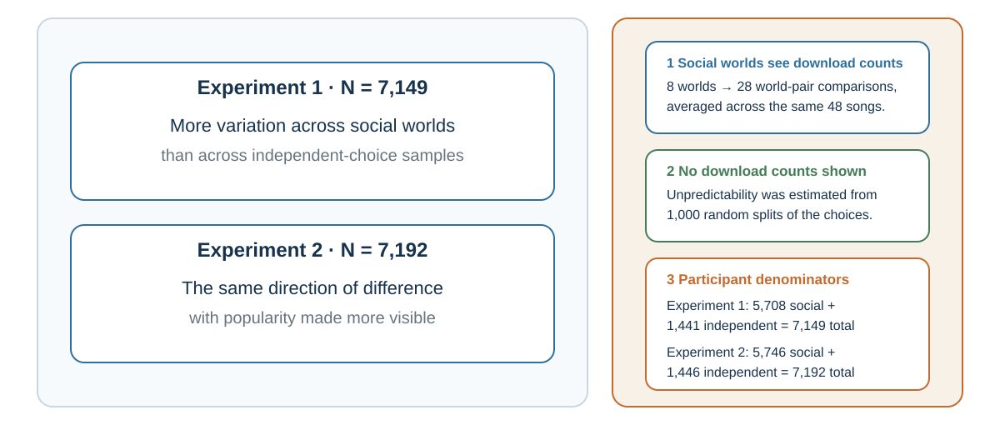

---
aliases:
  - 22-social-learning-mimicry-and-attribution.html
---

# Social Norms and Conformity: When Other People Become Evidence

::: {.content-visible unless-format="epub"}
[]{#social-norms-and-conformity-when-other-people-become-evidence}
:::

*How public behavior becomes evidence, pressure, and a mirror that can mislead*

::: {.chapter-epigraph}
> “An informational social influence may be defined as an influence to accept information obtained from another as evidence about reality.”
>
> — Morton Deutsch and Harold B. Gerard, [“A Study of Normative and Informational Social Influences upon Individual Judgment”](https://doi.org/10.1037/h0046408), 1955, p. 629
:::

A hiring committee hears the chair describe a candidate as “an obvious leader.” Around the table, heads nod. One member had doubts about the work sample but now wonders whether the others saw something she missed; another shares those doubts but does not want to hold up the decision. Their agreement looks the same from outside, although one may be revising a belief and the other withholding it.

What would the committee need to know before treating the nods as independent support?

::: {.callout-note .core-idea icon=false}
## Core Idea

Other people can provide information we could not obtain alone. Their agreement becomes informative only when we understand what they know, how their judgments formed, and whether they can disagree safely. Public alignment can reflect learning, pressure, or copying; the explanation changes what we should do next.
:::

## Learning goals

- Treat conformity as an observed outcome, then distinguish informational learning, normative pressure, coordination, identity, and correlated copying as possible causes.
- Distinguish descriptive, injunctive, and dynamic norms; empirical and normative expectations; social proof; pluralistic ignorance; and information cascades.
- Redesign one meeting or norm message so private evidence is elicited before public influence begins.

## Other people as living data

[]{#audit-social-evidence-before-following-it}

A new employee watches how colleagues handle an approaching deadline. Several submit without a final check, and the most experienced person says the check is unnecessary. Following them could save time because they know the system—or copy a mistake that nobody has tested.

People often learn selectively from prestigious, successful, similar, or numerous others. Those cues can be useful when they track relevant knowledge (Henrich & Gil-White, 2001; Boyd & Richerson, 1985). They are also fallible: prestige can spill across domains, success can reflect luck, and a majority can repeat one person's claim. Shared attention and teaching make cultural learning possible, but they do not make each public signal accurate (Tomasello, 1999; Tomasello et al., 2005; Boyd et al., 2011).

For the employee, the next useful step is to ask what the check was designed to catch and whether colleagues have independent evidence that it can be omitted. That question uses their experience while keeping the underlying problem in view.

::: {.callout-note icon=false collapse=true}
## A reference table for social cues

| Social cue | Why it can be useful | Failure mode | Test |
| --- | --- | --- | --- |
| Prestige | May summarize recognized expertise. | Status spills across domains. | What relevant performance earned the prestige? |
| Majority behavior | Can aggregate independent experience. | People may be copying the same source. | How independent are the judgments? |
| Similarity | Similar people may face similar constraints. | Shared identity can share the same blind spot. | Which similarities are decision-relevant? |
| Mimicry / synchrony | Can signal responsiveness and rapport. | Performed similarity becomes manipulation. | Does attunement improve mutual understanding? |
| Attribution | Creates a causal model for the next action. | Character stories hide situational constraints. | What question would discriminate among explanations? |
: Auditing social evidence {#tbl-22-1}
:::

## Four conditions make social evidence more diagnostic

Adding committee members seems to bring more evidence into the hiring decision. But if their judgments all follow the chair's first impression, the larger group may simply repeat the same signal. Agreement then looks more reassuring without adding much information. Four questions help assess how much the convergence should change a belief.

First, observers need **relevant contact with the problem**. A thousand ratings from people who never used the difficult feature may be weaker than ten reports from users who completed the same task under similar constraints. Prestige can help locate expertise, but status earned in one domain does not automatically transfer to another.

Second, judgments need some **independence of evidence**. Independence does not mean that people never communicate. It means that their initial observations or reasons are not all copies of one visible claim. Ten analysts who used the same vendor report do not supply ten sources. Five interviewers who discussed a candidate after the first interview may have produced one shared impression rather than five assessments.

Third, the group needs **useful diversity and local knowledge**. People positioned in different roles may observe different parts of the system: a procurement officer sees contract exposure, an engineer sees reliability, a frontline employee sees workarounds, and a customer sees consequences. Diversity improves inference only if the process lets those differences reach the decision. Adding people while preserving one status hierarchy and one public script can increase representation without increasing information.

Fourth, the process needs an **aggregation and correction rule**. A mean forecast can pool independent numerical judgments; a structured discussion can surface reasons; a market price can reward information; a checklist can preserve a minority warning. Each rule loses something. Means can hide multimodality, discussion can amplify status, prices combine information with constraints, and checklists cannot anticipate every failure. The rule should fit what is being aggregated.

Return to the hiring committee. One committee sees a charismatic candidate and quickly agrees that the person “has leadership presence.” A better design asks each member to score the same predefined evidence independently, records confidence and reasons, identifies which interviewers observed the same episode, and then displays the distribution. A work sample and a base rate from comparable hires add evidence not produced by the room. Discussion comes afterward. If scores converge, the committee can now ask whether convergence came from independent observations or one shared halo.

## Conformity is an outcome, not a mechanism

Sherif's autokinetic studies asked people to estimate the apparent movement of a stationary light in darkness. Individual estimates varied; group estimates converged (Sherif, 1936). Under ambiguity, other judgments provided information and a shared norm emerged.

Asch's line-judgment studies changed the problem. The correct answer was visible, yet some participants publicly agreed with a unanimous wrong majority (Asch, 1956). Deutsch and Gerard (1955) distinguished **informational influence**, following others to be correct, from **normative influence**, following to avoid disapproval or visible deviance. Real situations mix them.

{#fig-asch-line-comparison fig-alt="A target vertical line of 170 units appears beside three comparison lines labeled A, B, and C. Comparison C is also 170 units. A lower prompt asks the reader to imagine that several people answer B aloud before their turn and to distinguish belief updating from the social cost of dissent." width=100%}

**Conformity** describes movement toward a group pattern. The committee’s nods illustrate why the observation needs an explanation: learning something and withholding a doubt can produce the same public agreement.

| Observation | Candidate process | What not to infer |
| --- | --- | --- |
| Others appear better informed, and private belief changes. | Informational influence or social learning | That the evidence is independent or accurate. |
| Public action changes because approval, exclusion, or sanction is expected. | Normative influence | That private belief changed. |
| People choose the same side, platform, queue, or convention. | Coordination | That they think the option is intrinsically best. |
| Behavior expresses membership or local meaning. | Identity or cultural signaling | That outsiders attach the same meaning. |
| Later actors follow visible earlier actions despite contrary private signals. | Possible information cascade | That popularity began with quality. |
: Similar public alignment can have different causes {#tbl-social-alignment-mechanisms}

Conformity is not inherently defective. Shared conventions make traffic, queues, meetings, and safety routines possible. The danger is that public agreement does not reveal private belief. Group size, task ambiguity, status, public response, and unanimity change the pressure; even one dissenter can make disagreement socially possible. The organizational question is therefore: **What would someone hesitate to say here, even if it were true?**

::: {.callout-tip icon=false}
## Try the social prediction {#illustration-not-evidence}

The [elevator conformity demonstration](https://youtu.be/7Y0KT0ajZBw), an [Asch demonstration](https://youtu.be/TYIh4MkcfJA), and Andersen's public-domain tale *The Emperor's New Clothes* can make the mechanism memorable. Use them to predict what private response, one ally, or reduced ambiguity would change.
:::

## Social norms require a reference group

A social norm is not simply a behavior that many people perform. It concerns expectations within a **relevant reference group**: whose behavior is treated as typical, whose approval matters, and what people expect after compliance or violation. Bicchieri (2006) distinguishes **empirical expectations**—beliefs about what relevant others do—from **normative expectations**—beliefs about what relevant others think one ought to do. Both must be distinguished from a person's own preference. [Cooperation and Social Preferences](25-cooperation-and-social-preferences-self-interest-is-not-the-only-payoff.qmd) develops how norms and social preferences require different evidence and how norm judgments can be elicited.

In the focus theory of normative conduct, a **descriptive norm** reports what people do, while an **injunctive norm** reports what people approve or disapprove of (Cialdini et al., 1990). The distinction matters because a message can condemn a behavior while advertising that it is common. A late-night email may reveal that many colleagues work late without showing that they approve of the expectation. Silence in a meeting may reveal what people publicly do without revealing what they privately believe.

{#fig-norm-message-diagnostic fig-alt="Flowchart starting with the signal a norm message sends. It branches to a descriptive norm about what people do and an injunctive norm about what people approve. The descriptive branch asks whether the desired behavior is truly common and warns not to advertise harmful behavior as normal. The injunctive branch asks whether approval is true and relevant. Both end in a backfire test for accuracy, locality, independent evidence, privacy, normalization, shame, and uncertainty." width="92%"}

Hotel guests were more likely to reuse towels when a sign described reuse by guests in the same room than under a standard environmental appeal in Goldstein et al.'s (2008) setting. Schultz et al. (2007) found that high-using households reduced energy use after comparison with neighbors, but low-using households could increase unless an injunctive approval cue accompanied the feedback. These results illustrate both social information and a **boomerang risk**.

When undesirable behavior is common, broadcasting its prevalence can normalize it. In a national-park field study, 7.92% of marked pieces of petrified wood were stolen under a sign emphasizing how many visitors took wood, compared with 1.67% under a sign asking visitors not to remove it (Cialdini et al., 2006). A truthful design should therefore test the reference group, prevalence, privacy, and whether an injunctive or dynamic norm communicates the goal without making harm look ordinary.

A **dynamic norm** reports a verified direction of change when the desired behavior is not yet common—for example, that more households are reducing food waste—rather than pretending that the majority has already changed (Sparkman & Walton, 2017). It describes a trend, not current majority status. [Choice Architecture](40-choice-architecture-the-environment-gets-a-vote.qmd#choice-architecture-the-environment-gets-a-vote) develops when this design can help and the safeguards it requires. People may also underdetect how strongly descriptive norms affect their own behavior, which is one reason introspection alone is a poor norm audit (Nolan et al., 2008).

## Social proof is a cue; a cascade is a mechanism

**Social proof** is a useful practitioner label for treating other people's visible behavior as a cue. It is not a separate scientific mechanism. The cue may work because others appear informed, because approval matters, because a convention solves coordination, or because identity makes one group especially relevant. The proper diagnostic question is not merely whether social proof is present, but what the public behavior is being taken to prove.

Public behavior can also conceal private belief. In **pluralistic ignorance**, people privately doubt or reject a position yet misperceive others as accepting it because everyone observes the same cautious public behavior (Prentice & Miller, 1993). This is not simply conformity, and it is not false consensus. The misperception concerns the group's private view, which public silence or compliance fails to reveal. [Authority, Groupthink, and Shared Responsibility](28-authority-groupthink-and-shared-responsibility.qmd#authority-groupthink-and-shared-responsibility) develops how this pattern can delay action and suppress warnings.

An **information cascade** is more specific than popularity, herding, or conformity. In a sequence of decisions, later actors can rationally set aside a private signal because earlier actions appear sufficiently informative; once that happens, additional actions add visibility without adding independent evidence (Bikhchandani et al., 1992). Social proof is the cue that others acted; a cascade is one possible process through which sequential public actions overwhelm private information.

{#fig-social-pathways fig-alt="Two parallel paths begin with others' public actions. The informational route moves through inferred evidence to possible belief or action updating. The normative route moves through anticipated approval or sanction to public conformity. Both can produce more public actions; private elicitation protects independence."}

Do not diagnose every convergence as both a cascade and conformity pressure. An informational cascade can arise because earlier actions appear informative even when dissent is safe. Normative conformity can arise because disagreement is socially costly even when nobody thinks the majority knows more. The routes can interact, but the evidence needed to test them differs.

Digital counts make the dual role visible. Ratings, likes, downloads, and bestseller labels report earlier choices and influence later choices. In Salganik et al.'s (2006) experimental cultural markets, showing download counts made success more unequal and outcomes more variable across parallel worlds. Quality still mattered, but early accidents were amplified.

{#fig-cultural-market-study-redraw fig-alt="Two equal-size cards report greater variation across social worlds in both experiments. The panel identifies 7,149 and 7,192 participants, 28 comparisons among eight social worlds averaged across 48 songs, and an independent benchmark based on 1,000 random splits."}

Popularity may reflect quality and partly produce the success later used to validate it. The experimental comparison helps separate those directions in a way that an ordinary bestseller list cannot.

## Independence before discussion

The hiring committee needs discussion to exchange what its members know. Yet starting with public judgments can change those judgments before anyone records the independent evidence. Preserve the initial views first, then use discussion to compare and improve them:

1. Elicit initial judgments, forecasts, or concerns privately.
2. Preserve reasons and confidence, not only a vote.
3. Display the distribution before the highest-status person argues.
4. Invite the strongest contrary evidence and one designated ally for dissent.
5. Deliberate, revise, and record what changed.

Discussion still matters. The sequence preserves the evidence needed to tell whether agreement followed learning or merely followed the first speaker.

[]{#ch26-research-findings}

Asch-type conformity varies across periods, cultures, tasks, and response conditions (Bond & Smith, 1996).

## Practice Lab

Redesign one hiring, investment, safety, or project meeting. Produce a before-and-after process map showing when private signals are collected, what social information is displayed, whose judgments may be correlated, how one dissenter receives an ally, and how revisions are recorded. Add one descriptive norm message, one injunctive version, and—only if the trend is verified—one dynamic version. Name the reference group and state the backfire risk of each.

## Take it forward

The committee can start its next meeting with written assessments of the work sample, collected before the chair speaks. When members later agree, their reasons and revisions remain visible. The group still benefits from discussion, while preserving evidence that a quick round of nods would have concealed.

When many people learn from the same visible signal and from one another, social evidence can become a feedback system. Financial markets provide a demanding application: price is both an aggregate outcome of earlier judgments and an input into later attention, prediction, and action.

::: {.callout-note .research-lens icon=false collapse=true}
## Research Lens: social learning and cumulative culture

Social learning lets people use discoveries they could not reproduce alone. A medical student can learn germ theory and clinical routines without independently deriving either.

Cumulative culture depends on social transmission with enough fidelity to preserve useful practices and enough variation to improve them. Human groups can retain techniques whose causal structure is not obvious to any one learner. Over generations, tools and institutions become more complex than a single person could plausibly invent alone (Boyd & Richerson, 1985; Henrich, 2016; Tomasello, 1999).

That dependence becomes especially useful when a practice contains knowledge the learner cannot yet inspect. It also creates the risk examined in the main chapter: copying can preserve a useful routine or reproduce an untested error.

### The social brain is not simply the individually smartest brain

Inoue and Matsuzawa (2007) reported that trained chimpanzees could outperform adult humans in a demanding rapid-memory task for the locations of numerals. Humans are unusually able to coordinate attention, imitate, teach, infer intentions, divide labor, preserve discoveries, and accumulate culture. Our advantage is deeply social.

Comparative evidence also links social complexity with brain organization. Dunbar (1992) reported an association between typical social-group size and neocortex measures across primate species, and Sallet and colleagues (2011) found that experimentally different social-network sizes were associated with differences in neural systems in macaques. Keeping track of alliances, status, trust, intention, and coordination is a computational problem that can shape cognition.

One comparison makes the point vivid. In repeated matching-pennies games, chimpanzee choice frequencies were closer to the game-theoretic equilibrium than two human comparison samples, and the chimpanzees adjusted more closely to payoff changes (Martin et al., 2014). An unusually social mind can carry task-specific costs as well as benefits.

### Copying and cumulative culture

{#fig-social-learning-culture fig-alt="Five nonsequential contributors—innovation, social learning, transmission fidelity, retention and institutions, and selection and correction—feed the possibility of cumulative culture. Outputs show useful accumulation and copied error or inertia."}

Observation and imitation do not automatically produce cumulative culture. Accumulation also requires some source of variation or innovation, sufficient transmission and retention, and processes that preserve, select, or correct practices across learners or generations. The mixture differs across settings.

In a classic comparison, human children and chimpanzees watched an adult retrieve a reward from a puzzle box. Some demonstrated actions were causally necessary; others were not. When the box was transparent and the mechanism visible, chimpanzees tended to omit irrelevant actions and reproduce the efficient route. Children often copied both relevant and irrelevant steps (Horner & Whiten, 2005).

At first glance, the chimpanzee looks more rational. It extracts the causal structure and ignores theater. Yet children's tendency toward overimitation may serve a different problem. A learner cannot always know which step is irrelevant. A tap, gesture, sequence, or preparation may carry hidden causal information, social meaning, safety value, or conventional significance. High-fidelity copying can preserve opaque practices until their function becomes clear (Lyons et al., 2007).

Human copying is sensitive to intention, pedagogy, group membership, convention, and context. It can preserve needless bureaucracy as effectively as useful craft. An organization may continue a reporting ritual because "this is how it is done" even after the original risk has vanished.

Before removing a copied step, ask what hidden function it might preserve and what evidence could test whether that function is still needed.

### Mimicry and synchrony

People in conversation often align without noticing. Posture, facial movements, speech rhythm, word choice, and gestures can become more similar. Chartrand and Bargh (1999) called this the chameleon effect: nonconscious behavioral mimicry that can increase interpersonal smoothness and liking. Some experiments have also found more helping after participants were mimicked, while reviews show that the effect depends on the relationship and setting (van Baaren et al., 2004; Chartrand & Lakin, 2013).

{#fig-personal-mimicry-crossed-arms fig-alt="A young child and an adult stand several metres apart on a cobblestone street with matching crossed-arm postures." width="42%"}

{#fig-mimicry-study-redraw fig-alt="A zero-origin grouped bar chart reports actions per minute for 35 participants. Face rubbing is 0.57 with a face-rubbing partner and 0.35 with a foot-shaking partner, a statistically significant contrast. Foot shaking is 0.45 with a face-rubbing partner and 0.73 with a foot-shaking partner, a marginal contrast with p equal to point zero six."}

Mimicry effects vary with relationship, status, goals, awareness, and how conspicuous the copying becomes. An interaction may feel smoother when people adjust to one another’s tempo, while obvious imitation may feel mocking.

Adjusting to another person’s tempo can communicate attention. Using imitation to bypass their judgment turns apparent rapport into covert pressure; smoother interaction alone does not make that objective defensible.

Social observation also requires causal explanation. When a colleague misses a deadline, the attribution audit developed in [Beliefs That Defend Themselves](10-beliefs-that-defend-themselves.qmd) asks which evidence would distinguish character, incentive, information, and constraint accounts before a convenient story selects the next policy.
:::

## References cited in this chapter

::: {.reference}
Boyd, R., & Richerson, P. J. (1985). Culture and the evolutionary process. University of Chicago Press.
:::

::: {.reference}
Boyd, R., Richerson, P. J., & Henrich, J. (2011). The cultural niche: Why social learning is essential for human adaptation. Proceedings of the National Academy of Sciences, 108(Supplement 2), 10918–10925.
:::

::: {.reference}
Chartrand, T. L., & Bargh, J. A. (1999). The chameleon effect: The perception-behavior link and social interaction. Journal of Personality and Social Psychology, 76(6), 893–910.
:::

::: {.reference}
Chartrand, T. L., & Lakin, J. L. (2013). The antecedents and consequences of human behavioral mimicry. Annual Review of Psychology, 64, 285–308.
:::

::: {.reference}
Dunbar, R. I. M. (1992). Neocortex size as a constraint on group size in primates. Journal of Human Evolution, 22(6), 469–493.
:::

::: {.reference}
Henrich, J. (2016). The secret of our success: How culture is driving human evolution, domesticating our species, and making us smarter. Princeton University Press.
:::

::: {.reference}
Henrich, J., & Gil-White, F. J. (2001). The evolution of prestige: Freely conferred deference as a mechanism for enhancing the benefits of cultural transmission. Evolution and Human Behavior, 22(3), 165–196.
:::

::: {.reference}
Horner, V., & Whiten, A. (2005). Causal knowledge and imitation/emulation switching in chimpanzees (Pan troglodytes) and children (Homo sapiens). Animal Cognition, 8(3), 164-181.
:::

::: {.reference}
Inoue, S., & Matsuzawa, T. (2007). Working memory of numerals in chimpanzees. Current Biology, 17(23), R1004–R1005.
:::

::: {.reference}
Lyons, D. E., Young, A. G., & Keil, F. C. (2007). The hidden structure of overimitation. Proceedings of the National Academy of Sciences, 104(50), 19751–19756.
:::

::: {.reference}
Martin, C. F., Bhui, R., Bossaerts, P., Matsuzawa, T., & Camerer, C. (2014). Chimpanzee choice rates in competitive games match equilibrium game theory predictions. Scientific Reports, 4, 5182.
:::

::: {.reference}
Sallet, J., Mars, R. B., Noonan, M. P., Andersson, J. L., O’Reilly, J. X., Jbabdi, S., Croxson, P. L., Jenkinson, M., Miller, K. L., & Rushworth, M. F. S. (2011). Social network size affects neural circuits in macaques. Science, 334(6056), 697–700.
:::

::: {.reference}
Tomasello, M. (1999). The cultural origins of human cognition. Harvard University Press.
:::

::: {.reference}
Tomasello, M., Carpenter, M., Call, J., Behne, T., & Moll, H. (2005). Understanding and sharing intentions: The origins of cultural cognition. Behavioral and Brain Sciences, 28(5), 675–691.
:::

::: {.reference}
van Baaren, R. B., Holland, R. W., Kawakami, K., & van Knippenberg, A. (2004). Mimicry and prosocial behavior. Psychological Science, 15(1), 71-74.
:::

::: {.reference}
Asch, S. E. (1956). Studies of independence and conformity: I. A minority of one against a unanimous majority. Psychological Monographs: General and Applied, 70(9), 1–70.
:::

::: {.reference}
Bikhchandani, S., Hirshleifer, D., & Welch, I. (1992). A theory of fads, fashion, custom, and cultural change as informational cascades. Journal of Political Economy, 100(5), 992–1026.
:::

::: {.reference}
Bicchieri, C. (2006). *The grammar of society: The nature and dynamics of social norms*. Cambridge University Press.
:::

::: {.reference}
Bond, R., & Smith, P. B. (1996). Culture and conformity: A meta-analysis of studies using Asch’s line judgment task. Psychological Bulletin, 119(1), 111–137.
:::

::: {.reference}
Cialdini, R. B., Demaine, L. J., Sagarin, B. J., Barrett, D. W., Rhoads, K., & Winter, P. L. (2006). Managing social norms for persuasive impact. Social Influence, 1(1), 3–15.
:::

::: {.reference}
Cialdini, R. B., Reno, R. R., & Kallgren, C. A. (1990). A focus theory of normative conduct. Journal of Personality and Social Psychology, 58(6), 1015–1026.
:::

::: {.reference}
Deutsch, M., & Gerard, H. B. (1955). A study of normative and informational social influences upon individual judgment. Journal of Abnormal and Social Psychology, 51(3), 629–636.
:::

::: {.reference}
Goldstein, N. J., Cialdini, R. B., & Griskevicius, V. (2008). A room with a viewpoint: Using social norms to motivate environmental conservation in hotels. Journal of Consumer Research, 35(3), 472–482.
:::

::: {.reference}
Nolan, J. M., Schultz, P. W., Cialdini, R. B., Goldstein, N. J., & Griskevicius, V. (2008). Normative social influence is underdetected. Personality and Social Psychology Bulletin, 34(7), 913–923.
:::

::: {.reference}
Prentice, D. A., & Miller, D. T. (1993). Pluralistic ignorance and alcohol use on campus: Some consequences of misperceiving the social norm. Journal of Personality and Social Psychology, 64(2), 243–256.
:::

::: {.reference}
Salganik, M. J., Dodds, P. S., & Watts, D. J. (2006). Experimental study of inequality and unpredictability in an artificial cultural market. Science, 311(5762), 854–856.
:::

::: {.reference}
Sherif, M. (1936). The psychology of social norms. Harper.
:::

::: {.reference}
Schultz, P. W., Nolan, J. M., Cialdini, R. B., Goldstein, N. J., & Griskevicius, V. (2007). The constructive, destructive, and reconstructive power of social norms. Psychological Science, 18(5), 429–434.
:::

::: {.reference}
Sparkman, G., & Walton, G. M. (2017). Dynamic norms promote sustainable behavior, even if it is counternormative. Psychological Science, 28(11), 1663–1674.
:::
