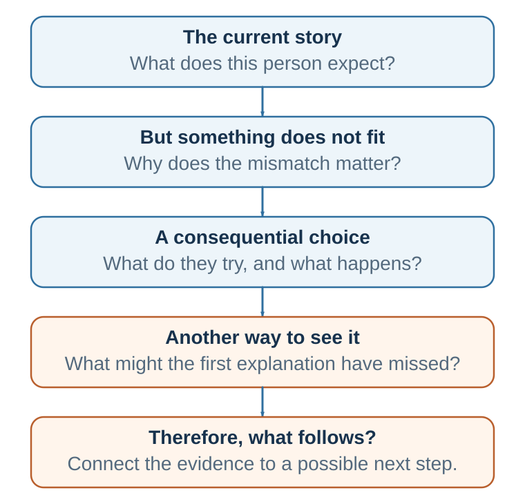

# Chapter 26. Why Stories Move Minds

*Narrative turns information into simulated meaning*

<aside class="callout core-idea">
CORE IDEA

A story persuades differently from an argument because it lets an audience simulate a person pursuing a goal under constraint, experiencing consequences, and revising a model of the world.
</aside>

## Learning goals

- Distinguish information, example, anecdote, case, and story.
- Explain narrative transportation, identification, and mental simulation.
- Explain story as model updating.
- Recognize the identifiable-victim advantage and its statistical risk.

A policy report says, "Early screening reduces mortality." A story shows a father who ignored symptoms because the appointment felt inconvenient, then left his daughter with questions he could no longer answer. A strategy document says, "Digital transformation requires organizational learning." A story shows a middle manager whose team adopts a new system, fails publicly, revises routines, and discovers that the real challenge was not software but trust. A behavioral lecture says, "Defaults shape choice." A story shows an employee who intended to save for retirement for years but only began saving when enrollment became automatic. A climate report says, "Average temperature will rise." A story shows a farmer deciding whether to abandon land that has supported generations. A negotiation lecture says, "Positions hide interests." A story shows two parties fighting over a delivery date until they discover that one side needs symbolic reassurance while the other needs operational flexibility.

In each case, the story does something facts alone rarely do. It gives the audience a human situation in which an abstract point becomes concrete, causal, emotional, and memorable. The point is not that statistics are weak or that evidence is optional. The point is that decision-makers do not respond to information as neutral recording devices. They interpret information through attention, memory, emotion, identity, social meaning, prior expectations, and imagined futures.

A statistic tells us what is true on average. A story shows what that truth means for a particular person in a particular situation. In decision-making, that distinction matters. People rarely ask only, "Is this claim true?" They also ask, often implicitly: Does this matter to me? Who is affected? What could go wrong? What future does this invite me to imagine? What kind of person would I be if I accepted this claim? What will others think? What does this choice say about us?

Stories answer these questions more naturally than abstract argument does. A story turns a fact into a scene, a value into a stake, a trade-off into a conflict, a prediction into a future, and a concept into a decision moment. This is why storytelling belongs in a science of decision-making. Every story contains judgment, prediction, valuation, emotion, social meaning, action, feedback, and learning. In that sense, a story is not separate from decision-making. It is a compressed simulation of decision-making.

Consider two ways of presenting the same idea. The first says: "People often underestimate the danger of texting while driving." The statement is clear, but it is abstract. The second says: "A father is driving home after picking up his daughter from school. His phone lights up. It is a short message from work. He glances down for two seconds. When he looks up, the car in front of him has stopped." The second version does not merely state a fact. It creates a moment of simulation. We see the scene. We anticipate danger. We feel the gap between ordinary life and sudden consequence. We understand not only that texting while driving is risky, but how risk enters a real decision moment.

That is narrative persuasion: story turns information into lived meaning. It does not tell the audience only what to think. It lets the audience simulate why something matters, what is at stake, how change happens, and who they might become if they see the world differently.

## What is a story?

A story is not simply a sequence of events. Nor is it merely a vivid example, a company history, a customer testimonial, a slogan, a mission statement, or a list of achievements. A persuasive story has movement through meaning. It usually contains six elements: a protagonist, a desire or goal, stakes, conflict or obstacle, choices unfolding through cause and effect, and change.

Narratives organize experience through agents, intentions, conflict, and consequence, complementing abstract or paradigmatic reasoning (Bruner, 1986, 1990; Fisher, 1984, 1987).

A useful formula is: story = character + desire + obstacle + stakes + choice + change. For persuasion, the final element - change - is especially important. A persuasive story should not merely entertain the audience. It should move the audience from one model of reality to another.

An example clarifies a concept. A story creates tension and transformation. If we say, "Netflix is an example of business-model innovation," we have provided an example. If we show how Blockbuster dismissed the threat of online distribution, how Netflix experimented with DVD-by-mail and then streaming, and how changing consumer behavior disrupted the industry, we have created a story. The story contains uncertainty, mistaken assumptions, strategic choices, and consequences. It does not merely name the concept; it makes the concept memorable.

An anecdote is a particular case. It may be vivid, but it is not necessarily representative. A story can be anecdotal, but a good persuasive story is not just a vivid case. It is a case chosen, framed, and connected to evidence so that it reveals a broader pattern without pretending that one case proves everything. A story should illuminate the evidence, not bypass it.

Jerome Bruner argued that humans use both paradigmatic and narrative modes of thought. The paradigmatic mode organizes experience through logic, categories, and general principles. The narrative mode organizes experience through agents, intentions, conflict, and consequence. A good decision-maker needs both. Science tells us what is generally true. Story tells us how what is generally true becomes meaningful in human life.

Walter Fisher's narrative paradigm adds another important lens. People evaluate stories not only by formal logic, but by narrative probability and narrative fidelity. Narrative probability asks whether a story hangs together coherently. Narrative fidelity asks whether it rings true with the audience's values and experiences. In persuasion, people often ask: Does this story make sense? Does it fit what I know about the world? Does it express values I recognize? Does it show people like me facing a choice I can understand?

Lisa Cron's work is especially useful for distinguishing story from information. Across Wired for Story, Story Genius, and Story or Die, she argues that story is not about events alone. It is about how what happens affects someone who wants something and must revise what they believe. The audience cares because the events matter to someone. Without subjective meaning, events remain external.

## Information is not yet narrative

Consider two versions of the same organizational material. Version 1 says: "Our organization introduced a new feedback system in 2024. It involved monthly check-ins, anonymous reporting, team dashboards, and manager training. Employee engagement increased by 12%." This is information. It may be useful, but it is not yet a story.

Version 2 says: "When the new feedback system was announced, Sara, a team leader, privately hated it. She had built her reputation on solving problems before anyone noticed them. Anonymous feedback felt like losing control. In the first month, her team reported issues she thought she had already fixed. Her first reaction was defensiveness. But when she read one comment - 'I wish we could tell Sara bad news before it becomes an emergency' - she realized that her competence had become a bottleneck. She began opening meetings with one question: 'What problem are we hiding because we think I do not want to hear it?' Three months later, the dashboard mattered less than the new habit of honesty."

This is a story. It has a protagonist, a goal, a threat to identity, conflict, a turning point, and change. The same organizational intervention becomes meaningful because the audience can see why it was hard and why it mattered. Information says what happened. Story shows why it mattered.

## Story as model updating

<figure class="book-figure"><figcaption>Figure 26.1. A persuasive story begins in the audience’s current model, creates meaningful trouble, and resolves in an evidence-supported new model and action.</figcaption></figure>

A useful way to connect storytelling with decision science is through predictive processing and model updating. The mind does not passively receive reality. It predicts, interprets, compares, and updates. Perception, judgment, and action are shaped by prior expectations. The audience is not a blank slate. It arrives with assumptions about the market, the policy, the risk, the speaker, the organization, the other side in a negotiation, and itself.

This is why facts do not speak for themselves. Facts become persuasive only inside a model of what caused them and what follows from them. The same evidence can look like traction, noise, risk, or opportunity depending on the model through which the audience interprets it. Persuasion is therefore not simply information transfer. It is guided model updating.

A persuasive message often follows a sequence: old model, prediction error, new model, proof, and action. First, identify what the audience currently believes. Then create a meaningful mismatch: show what the old model fails to explain. Next, offer a better model that explains the mismatch. Then provide evidence that makes the new model credible. Finally, make the next action feel natural.

Story fits this sequence because story gives model updating a human form. The protagonist begins with a model of the world. Something violates expectation. The protagonist wants control, but reality resists. Action produces feedback. Feedback pressures belief revision. The audience leans in because the model must be updated.

Will Storr's The Science of Storytelling is valuable here because it links storytelling to a predictive, goal-directed, status-sensitive, meaning-making mind. Stories grip us when expectations meet change. A trusted colleague behaves unexpectedly. A weak competitor becomes dangerous. A patient's routine symptom becomes serious. A confident strategy fails. A default option changes behavior more than an expensive campaign. The audience wants to know: What is happening, and what does it mean?

In Decision, Persuasion, and Negotiation, this matters because each domain is a struggle over models. In decision-making, the question is: What model of the situation should guide choice? In persuasion, the question is: What model does the audience currently use, and what would make it update? In negotiation, the question is: What model does each side have of fairness, risk, interests, constraints, and possible agreement?

A story is therefore not a decorative opening. It is model change with a protagonist. It lets the audience experience the old model failing safely, before they are asked to change belief or behavior in real life.

## AND, BUT, THEREFORE

One practical structure for model updating is ABT: AND, BUT, THEREFORE. The AND begins from shared reality: what the audience already accepts. The BUT introduces meaningful contradiction: the prediction error or trouble the old model cannot explain. The THEREFORE offers the new model, solution, or action.

AAA structures are boring because nothing changes. Disconnected lists are confusing because the direction of change is unclear. The BUT is where the mind wakes up.

A product-dump message says: "We are an AI-powered SaaS platform for restaurant inventory optimization." It may be accurate, but it starts with the product and gives the audience no reason to care. A model-updating message says: "Independent restaurants use digital tools, BUT owners still guess demand because existing systems were built for chains. THEREFORE we built a lightweight forecasting assistant." The facts have not simply been made prettier. The second version starts where the audience is, shows what the current model misses, and makes action plausible.

## Why facts alone can fail

It is tempting to believe that persuasion should be simple: provide accurate information, and rational people will update their beliefs. Sometimes this works. If someone lacks information, trusts the source, shares the interpretive model, and is motivated to know the answer, facts can be enough. But many important decisions involve identity, values, risk, uncertainty, social pressure, habits, emotional investment, or threatened status. In these domains, information does not enter a blank mind. It enters an already organized worldview.

Facts alone often fail for several reasons.

First, people have limited attention. A fact that does not feel relevant may never be deeply processed. Story helps by creating curiosity and stakes. When people care what happens next, they allocate attention.

Second, people resist information that threatens identity or prior commitments. Direct argument can trigger counterarguing: the audience begins looking for reasons to reject the message. Narrative can reduce this resistance by inviting people into a simulated world rather than confronting them with a direct demand.

Third, people remember meaning better than isolated data. A statistic can be forgotten; a concrete character in a consequential situation is easier to retrieve from memory.

Fourth, people make decisions partly through emotion and valuation. Emotion is not the enemy of reason. It helps signal importance. A story connects information to human consequence.

Fifth, people often need to imagine future consequences before they act. Story supports mental simulation. It allows people to rehearse possible futures without experiencing them directly.

Sixth, people interpret new claims through their current models. A public health message, climate model, hiring guideline, or negotiation proposal is not merely evaluated as information. It is interpreted as threat, opportunity, insult, evidence, noise, status claim, moral appeal, or request for commitment.

## Rhetoric translated into decision science

Classical rhetoric helps organize this problem, but it becomes sharper when translated into decision science. Ethos asks whether the source should receive weight. In predictive-processing language, it affects the perceived precision or reliability of the message. Pathos asks why the message matters now. It affects relevance, attention, memory, and action-readiness. Logos asks why the explanation holds. It provides causal structure, evidence, and inference. Kairos asks why this moment is the right time. It concerns timing, readiness, salience, and opportunity.

Good persuasion does not choose emotion or reason. It coordinates source reliability, emotional relevance, evidence structure, and timing. A story can do this well because it gives ethos, pathos, logos, and kairos a shared scene. A credible protagonist faces a timely problem. Stakes create relevance. Causality makes the lesson intelligible. Evidence makes the lesson trustworthy.

## The psychology of narrative persuasion

Narrative persuasion is not magic. It can be understood through several mechanisms that convert information into human meaning. These mechanisms often interact. A story captures attention by creating unresolved desire. It creates causality by linking events through because, but, and therefore. It creates emotional relevance by making stakes visible. It supports mental simulation by letting the audience rehearse a situation. It enables identification by giving the audience a mind to follow. It can reduce resistance by drawing the audience into a narrative world. It can shape identity by asking: Who am I if this is true?

Transportation, identification, and mental simulation can reduce counterarguing and make consequences experientially meaningful (Green & Brock, 2000; Cohen, 2001; van Laer et al., 2014).

*Table 26.1. Narrative mechanisms, design questions, and risks*

| Mechanism | Design question | Risk |
| --- | --- | --- |
| Attention | What unresolved question makes the audience want the next event? | Manufactured suspense can hide weak relevance. |
| Transportation | What world is the audience invited to simulate? | Absorption can smuggle assumptions past scrutiny. |
| Identification | Whose goals and constraints can the audience understand? | A single perspective can erase affected others. |
| Emotion and valuation | What should matter if the evidence is understood? | Intensity can exceed the truth of the stakes. |
| Causal simulation | What mechanism links choice to consequence? | A coherent story can be mistaken for causal proof. |
| Memory | What principle will the story make retrievable? | The vivid case may crowd out the base rate. |

## Attention and curiosity

A story begins when something important is unresolved. Someone wants something, but the outcome is uncertain. This creates a gap the audience wants to close. Will the protagonist succeed? What will they do? What will happen next? What does this reveal?

Attention matters because people cannot process everything. In an information-rich world, the first persuasive problem is not only accuracy. It is relevance. A message that does not create a reason to attend may disappear before it is judged. A story opening should therefore begin near disruption, not background. "Our organization was founded in 1986 and has always valued innovation" is rarely a strong opening. "On paper, the new system was perfect. In practice, no one used it" creates a question.

## Transportation

Narrative transportation refers to mental absorption into a story world. When transported, people devote attention, imagery, and emotion to the unfolding narrative. They are not merely evaluating claims from the outside; they are experiencing a situation from within. Green and Brock's work made transportation a central concept in narrative persuasion, and later research, including meta-analytic work by van Laer and colleagues, supports its importance.

Transportation matters because persuasion often fails when people remain outside the message, evaluating it defensively. A transported audience temporarily enters the logic of the story. This does not mean they become irrational. It means they process the claim through simulation rather than only detached critique. In teaching, this suggests that opening with a problem situation can be more effective than opening with a definition. The definition becomes meaningful after the learner has entered the problem.

Transportation also creates risk. A compelling story can smuggle assumptions into experience. A political film can make a misleading causal story feel true. A corporate change story can make a strategy feel inevitable while hiding alternatives. Ethical storytellers must ask: What world am I inviting the audience to enter? What assumptions does that world make? Whose perspective is centered? Whose perspective is missing? What will feel true after the story ends?

## Identification

Identification occurs when audience members imaginatively take the perspective of a character, share goals or emotions, and experience events partly from inside the character's situation. Identification differs from liking. You may identify with a character you do not entirely like because you understand their motives or feel their struggle from within.

Identification matters because it changes the audience's self-position. Instead of asking, "What do I think about those people?" the audience asks, "What would this be like for me?" This can reduce distance and increase empathy. A message about cancer screening may list benefits. But a story about a person who delayed screening because of fear, then wished they had acted sooner, allows the audience to identify with avoidance and regret.

Character fit matters. If the protagonist is too perfect, identification may fail. If the protagonist is too different from the audience, the story may feel irrelevant. A persuasive protagonist does not need to be admirable in every way, but the audience must understand why the protagonist thinks and acts as they do. In public health, a story about poor financial planning, poor diet, or missed appointments is often more persuasive when the protagonist is not portrayed as foolish. Instead, the story should show a normal person facing small temptations, confusing information, fear, cost, habit, and social expectations. The audience can then recognize the decision environment rather than defensively conclude, "That would never be me."

## Self-reference and identity

Narrative persuasion becomes stronger when audiences connect the story to their own lives. Escalas's research on narrative processing and self-referencing in consumer contexts is useful here. More generally, people rarely ask only, "Is this true?" They ask, "What does this mean for me?" A good story helps them answer that question.

Stories also organize identity. People live inside stories about who they are: competent, caring, rational, independent, loyal, fair, hardworking, creative, responsible, misunderstood, resilient, or betrayed. A message that threatens these identity stories may trigger resistance. A sustainability message that says, "You are selfish if you do not change" may fail because it threatens moral identity. A more effective story might show a person who wants to do the right thing but is trapped in a system of convenience, cost, uncertainty, and habit. The story preserves dignity while inviting change.

Narrative persuasion often works by offering a better story of the self: you are not foolish; you were using an incomplete model. You are not weak; you were in an environment designed to trigger habit. You are not irrational; your judgment was shaped by framing, attention, and emotion. You do not have to abandon your identity; you can become a more capable version of it.

## Emotion, value, and memory

Stories persuade because they connect information to value. Emotion is not merely decoration added to cognition. It helps prioritize attention, encode memory, guide action, and signal what matters. In a story, emotion arises from stakes: someone wants something, something could be lost, and the outcome is uncertain. Without stakes, there is little reason to care.

A common mistake in academic and managerial communication is to remove all emotion in the name of objectivity. Objectivity is important for evidence, but persuasion requires significance. A story can preserve accuracy while making significance visible. "The project was delayed by six months" is information. The meaning becomes clearer when we understand who was affected: a small supplier that invested in new equipment, expected a contract, lost revenue, laid off workers, and became reluctant to join future innovation partnerships.

Stories also improve memory because causal and emotional information is easier to retrieve than disconnected details. People remember what someone wanted, what blocked them, what they chose, and what happened. The story provides a retrieval path for the principle.

## Mental simulation

Stories allow audiences to simulate decisions before making them. This is one reason case teaching is powerful. A good case does not simply deliver a conclusion; it places students inside a decision context. They must ask: What do we know? What is uncertain? What are the options? What are the risks? What would I do?

Mental simulation helps people understand causal structure. Instead of passively receiving advice, they rehearse consequences. This makes story especially useful for risk communication, ethics training, leadership development, entrepreneurship, public policy, and negotiation.

An ethics lecture that says, "Conflicts of interest are dangerous" may be less effective than a story in which a researcher accepts a small favor, then a larger favor, and gradually finds it harder to report unfavorable results. The story simulates moral drift. A negotiation lecture that says, "Positions hide interests" may be less effective than a story in which two teams fight over a deadline until they discover that one side needs symbolic reassurance and the other needs operational flexibility.

## Resistance reduction

Narratives can reduce resistance because they do not always feel like direct persuasion. Slater and Rouner's extended elaboration likelihood model and Moyer-Guse's entertainment overcoming resistance model suggest that narrative engagement can reduce counterarguing, reactance, selective avoidance, and perceived invulnerability. Entertainment-education research similarly shows how health and social messages can be embedded in narrative contexts where people follow characters and consequences rather than feeling targeted by a command.

This is especially important when the audience already has reasons to reject a message. If people feel that a message threatens freedom, they may resist. If they feel judged, they may defend themselves. If they believe the problem affects only others, they may ignore it. Stories can lower these defenses by allowing the audience to observe a situation before directly applying the lesson to themselves.

Ethical use is essential. Reducing resistance is not the same as bypassing judgment. The ethical goal is to improve judgment, not close it down.

## Causal stories and causal evidence

Stories persuade because they organize causality. They show how one thing led to another: because the protagonist believed X, they did Y; because they did Y, consequence Z followed; because Z happened, the old belief had to be revised. This is why stories are central in law. Pennington and Hastie's story model of juror decision-making suggests that jurors organize evidence into narrative accounts, compare those accounts to verdict categories, and select the verdict that best fits.

Organizations do something similar after success or failure. They construct stories: the market changed, leadership failed, customers were not ready, the technology was immature, incentives were wrong, or the team lacked discipline. The story determines what the organization learns. If the story is wrong, the organization learns the wrong lesson.

This creates a discipline: distinguish causal story from causal evidence. What mechanism does the story imply? What evidence supports that mechanism? What alternative story could explain the same events? What base rates or comparison cases are missing? What role did luck play? What structural factors are hidden by focusing on one character?

## The power - and danger - of one

Stories often persuade through one face, one name, one family, one patient, one customer, one employee. This can be morally important because large numbers can become abstract. A single person can restore emotional reality. Research on the identifiable victim effect and psychic numbing shows that people often respond more strongly to a single identifiable person than to statistical victims.

But the same mechanism can distort judgment. One vivid victim may receive attention while many unseen victims are neglected. A rare disease with a compelling story may attract disproportionate funding. A dramatic crime may shape policy more than widespread harms. A single customer complaint may dominate managerial attention even when broader data point elsewhere.

The ethical challenge is to connect story and scale. A good humanitarian message may begin with one person's story, then connect it to accurate statistics: this is one person, and the evidence shows how common or rare this pattern is. The story creates attention and care; the statistic creates proportion. Together they support responsible action.

<aside class="callout evidence-and-boundary-conditions">
EVIDENCE AND BOUNDARY CONDITIONS

A vivid story can create a strong causal impression from one unrepresentative case. Narrative should illuminate evidence, not replace base rates, comparison groups, or uncertainty.
</aside>

## Key ideas

- A story persuades differently from an argument because it lets an audience simulate a person pursuing a goal under constraint, experiencing consequences, and revising a model of the world.
- Distinguish information, example, anecdote, case, and story.
- Explain narrative transportation, identification, and mental simulation.
- Explain story as model updating.

## Study and practice

1. How would you distinguish information, example, anecdote, case, and story?

2. How would you explain narrative transportation, identification, and mental simulation?

3. How would you explain story as model updating?

<aside class="callout activity">
ACTIVITY

Take one abstract claim from the course. Write a protagonist, goal, obstacle, stakes, choice, and turning point that make the mechanism visible. Then add the statistic that shows scale and representativeness. EXPERIENCE - EXPLAIN - APPLY (MAXIMUM 120 WORDS) Experience: describe one specific decision, interaction, or observation. Explain: use one or two concepts from this chapter accurately. Apply: state one improvement, implication, or testable prediction.
</aside>

## References cited in this chapter

Bruner, J. (1986). Actual minds, possible worlds. Harvard University Press.

Bruner, J. (1990). Acts of meaning. Harvard University Press.

Cohen, J. (2001). Defining identification: A theoretical look at the identification of audiences with media characters. Mass Communication and Society, 4(3), 245-264.

Fisher, W. R. (1984). Narration as a human communication paradigm: The case of public moral argument. Communication Monographs, 51(1), 1-22.

Fisher, W. R. (1987). Human communication as narration: Toward a philosophy of reason, value, and action. University of South Carolina Press.

Green, M. C., &amp; Brock, T. C. (2000). The role of transportation in the persuasiveness of public narratives. Journal of Personality and Social Psychology, 79(5), 701-721.

van Laer, T., de Ruyter, K., Visconti, L. M., &amp; Wetzels, M. (2014). The extended transportation-imagery model: A meta-analysis of the antecedents and consequences of consumers&#x27; narrative transportation. Journal of Consumer Research, 40(5), 797-817.

