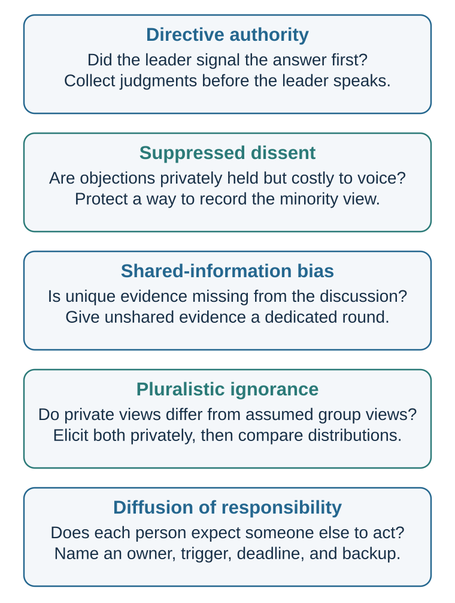

---
aliases:
  - 24-authority-bystanders-and-influence-triggers.html
---

# Authority, Groupthink, and Shared Responsibility

::: {.content-visible unless-format="epub"}
[]{#authority-groupthink-and-shared-responsibility}
:::

*Signals that coordinate behavior—and can be counterfeited*

::: {#chapter-28-start .chapter-epigraph}
> “Obedience is the psychological mechanism that links individual action to political purpose.”
>
> — Stanley Milgram, [“Behavioral Study of Obedience”](https://doi.org/10.1037/h0040525), 1963, p. 371
:::

Lena, a test engineer, emails seven colleagues after a component fails its safety check for the second time that week. The senior manager, Sam, replies, “It is probably fine,” and nobody adds a comment. By noon, the issue has no named owner. Does the silence mean that the others checked the evidence and agreed, that they are reluctant to challenge the manager, or that each expects someone else to investigate?

Those explanations call for different remedies. An invitation to speak may help with withheld doubts, but it will not assign an inspection to anyone. This chapter follows the gap between a group seeing a concern and somebody taking responsibility for it.

::: {.callout-note .core-idea icon=false}
## Core Idea

A group can appear to agree while its members hold different evidence, private doubts, or different assumptions about who will act. Improving the decision begins by finding which of these gaps is present, then making the relevant evidence, disagreement, or responsibility visible.
:::

## Learning goals

- Explain how authority can coordinate expertise while displacing judgment or personal responsibility.
- Distinguish directive authority, suppressed dissent and false unanimity, shared-information bias and hidden profiles, pluralistic ignorance, and diffusion of responsibility.
- Redesign one group decision or escalation process so evidence, ownership, dissent, and a safe path to correction are explicit.

## Authority and responsibility

The manager may know more than the engineer: perhaps the component was tested yesterday, or the apparent fault is normal under these conditions. Deferring to relevant expertise can save time and coordinate action. Yet a managerial title alone does not establish that this evidence exists. If the engineer stops asking because disagreement seems disloyal, authority has changed the decision through the social cost of speaking.

In the condition Milgram reported in 1963, forty men sat at a board of switches labelled from 15 to 450 volts. Each wrong answer from a learner in another room was to receive a stronger shock. At 300 volts, the learner pounded on the wall and stopped answering; the experimenter instructed the participant to count silence as an error. All forty reached 300 volts, five stopped there, and twenty-six reached 450. The learner was an actor and the shocks were simulated, but participants had been told they were administering real shocks.

What that continuation means remains contested. Milgram reported visible distress, yet later archival analysis found that belief in the setup varied and that skepticism may itself have increased continuation in some variants (Perry et al., 2020). Institutional trust, uncertainty about harm, gradual escalation, pressure to finish, and identification with the scientific project offer competing or interacting explanations (Haslam & Reicher, 2017). The wider series changed the situation and obtained different patterns (Milgram, 1974); the 26-of-40 result is evidence about one particular condition, not a population-wide obedience rate.

Burger (2009) tested a modified version of a different Milgram condition, stopping after the learner’s protest at 150 volts. In his baseline group, 28 of 40 participants began the next task item and had to be stopped by the experimenter. This was willingness to continue at that point; the study did not observe whether they would reach 450 volts. Its earlier cutoff and screening procedures also underline why the original distressing protocol cannot simply be repeated under present ethical standards.

The engineer may reasonably leave a wider safety assessment to management, provided the concern reaches someone who can assess it and accepts responsibility for responding. Before closing the issue, ask what evidence supports the reassurance and who checked it. A credential or title can help locate expertise; it cannot replace that connection between reasons and accountable action.

## Groupthink: a familiar but contested umbrella

Suppose one of Lena’s colleagues privately shares her concern but says nothing after Sam’s reassurance. If everyone reads that silence as agreement, the group gains apparent confidence without gaining evidence. A cohesive team can coordinate quickly, yet protecting that agreement can make an objection feel like a personal betrayal. Janis (1982) made **groupthink** a familiar account of how pressure for concurrence could narrow the appraisal of evidence and alternatives in policy groups. In his model, antecedent conditions could produce self-censorship, pressure on dissenters, and an illusion of unanimity, followed by defective decision processes. The framework remains a useful warning that agreement can be socially produced rather than evidentially earned.

It is also contested. Aldag and Fuller (1993) found that research did not convincingly validate the complete syndrome or a simple path from its proposed characteristics to poor outcomes. Esser's (1998) review found mixed results and continuing heuristic value, while emphasizing theoretical and methodological problems. The responsible use of the term is therefore as an umbrella that prompts diagnosis, not as a diagnosis supplied by hindsight.

**A bad outcome, apparent unanimity, or cohesion alone does not establish groupthink.** A bad result can follow from uncertainty, missing expertise, poor incentives, implementation failure, or chance. Unanimity can reflect genuinely convergent evidence or shared values. A meta-analysis found no significant overall effect of cohesion on decision quality; poorer decisions appeared under additional conditions such as directive leadership, and the result depended partly on what “cohesion” meant (Mullen et al., 1994).

Silence has several possible causes. @fig-silence-mechanisms separates five pathways and asks what observation would distinguish them.

{#fig-silence-mechanisms fig-alt="Five vertically arranged diagnostic cards distinguish directive authority, suppressed dissent, shared-information bias, pluralistic ignorance, and diffusion of responsibility. Each card pairs an observable test with a safeguard." style="width:100%;min-width:0;max-width:100%;max-height:none;height:auto;" .phone-fit}

A safeguard earns its place by revealing evidence, disagreement, or responsibility that the group previously lacked. Psychological safety—a shared belief that interpersonal risk taking is safe—was associated with learning behavior in 51 work teams (Edmondson, 1999). That association gives a reason to examine the cost of speaking; it does not show that announcing an “open door” makes a workplace safe. A colleague who raises a concern needs to see it considered, with a response that makes the next concern possible to raise.

The informational and normative routes in [Social Norms and Conformity: When Other People Become Evidence](26-social-norms-and-conformity-when-other-people-become-evidence.qmd#social-norms-and-conformity-when-other-people-become-evidence) can contribute to apparent consensus without being identical to groupthink. [Decision Hygiene](41-decision-hygiene-build-a-process-that-can-learn.qmd#decision-hygiene-build-a-process-that-can-learn) carries the safeguards forward as a repeatable process for independent evidence, structured disagreement, explicit authority, and learning.

## When the group knows more than the discussion reveals

There is another possibility in the safety thread: nobody is hiding a doubt, but each person holds only part of the relevant evidence. One has the new test result, another remembers a similar fault, and Sam has yesterday’s reassuring supplier report. A meeting can repeat that shared report while leaving the two warning signs unconnected.

Stasser and Titus (1985) studied this problem by distributing information about candidates among group members. Some facts were shared; others were known to only one member. In the hidden-profile condition, combining the unshared facts could reveal an alternative that each person’s initial information made less attractive. Discussion tended to favor shared and preference-consistent information, so having the relevant facts somewhere in the group did not ensure that they shaped its choice.

For Lena’s team, an evidence round should precede advocacy: what did each person observe that others may not know? Record the observations together before asking for a vote. This addresses **shared-information bias**. A private poll alone would preserve initial judgments while leaving the missing evidence unpooled.

## Bystanders and pluralistic ignorance

Even when people agree that a problem is serious, action can still stall. The safety email has several recipients, which seems to give it several chances of being handled, yet each may wait for someone else. The next problem is how shared awareness becomes—or fails to become—personal responsibility.

Darley and Latané (1968) placed participants alone in cubicles for what appeared to be a group discussion over an intercom. A recorded voice then appeared to suffer a seizure. Among the thirteen participants who believed they were the only other person listening, **85%** sought help before that speaker’s allotted turn ended; among thirteen who believed four additional listeners were present, **31%** did. Those percentages describe reporting within a particular time window. By the study’s six-minute cutoff, the corresponding proportions were 100% and 62%.

The experiment changed how many *other potential helpers* a participant believed were present. It measured an individual’s response, not the probability that at least one member of a real crowd would help. That distinction matters when applying the bystander effect outside the laboratory.

Across more than 7,700 participants and 105 independent effect sizes, Fischer and colleagues (2011) estimated an overall standardized effect of $g=-0.35$: others’ presence reduced individual helping on average. The reduction was smaller in dangerous emergencies, and some conditions showed no reduction or a positive effect when bystanders could provide physical support. Other people can spread responsibility, but they can also make intervention feasible.

Latané and Darley (1970) described helping as a sequence: notice the event, interpret it as an emergency, accept responsibility, know how to help, and decide to act. A failure at any step can prevent intervention.

Other people can interfere at several stages. If no one else reacts, the situation may seem less serious. This is pluralistic ignorance: people privately feel concern but infer from others’ calm behavior that nothing is wrong. If many people are present, responsibility diffuses: “Someone else will act.” If action might be embarrassing, people hesitate.

The same gap can appear in a classroom. Several students privately feel confused, yet each takes the absence of questions as evidence that everyone else understands. Asking separately what students understand and how well they think their classmates understand would reveal the gap more directly than observing silence. In a different setting, Prentice and Miller (1993) found that students misperceived their peers’ comfort with campus drinking norms.

An organization can make a similar comparison between private views and beliefs about colleagues’ views. Anonymous input may uncover concerns that a public “Any objections?” misses, although silence can also reflect fatigue, uncertainty, or lack of relevant information. The purpose is to discover what people think before deciding why they did not speak.

The unanswered safety email raises a separate possibility: all seven recipients may agree that the issue deserves attention, while each expects another person to act. Here the missing information concerns ownership. Naming an investigator, confirming receipt, setting a response time, and specifying a backup if the investigation stalls would address that gap. These arrangements still leave room to question the manager’s reassurance and to obtain any evidence the group lacks.

## Match the safeguard to the missing step

An invitation to speak may uncover a withheld doubt, but it still leaves Lena’s inspection unassigned. Naming an inspector solves that ownership problem without supplying evidence the inspector does not hold. An anonymous poll can expose mistaken beliefs about colleagues’ views, but it cannot create expertise absent from the group. A mismatched safeguard can leave everyone feeling that the matter has been handled while the original gap remains.

Use @tbl-group-failure-pathways to select the next observation and action. Several pathways may coexist, so record what each safeguard is expected to change.

::: {.callout-note icon=false}
## Diagnose the pathway

| Pathway | What must be distinguished | Safeguard |
|---|---|---|
| **Directive authority** | A leader signals a preferred answer, controls the agenda, or raises the cost of disagreement. | When feasible, capture judgments before the leader states a preference; have the leader ask for evidence and speak last; retain an escalation route outside the chain of command. |
| **Suppressed dissent and false unanimity** | Members withhold objections because speaking is costly, and public silence is then mistaken for private agreement. | Elicit concerns privately before public discussion, invite specific counterevidence, record unresolved minority views, and show how dissent affected the decision. |
| **Shared-information bias and hidden profiles** | Discussion repeats information everyone already holds while unique or preference-inconsistent evidence remains unpooled. | Inventory who holds which evidence before advocacy, give unique information a dedicated round, and delay preference aggregation until the evidence map is visible. |
| **Pluralistic ignorance** | Several people privately doubt the apparent norm but infer from others' silence that they are unusual. | Separately elicit private judgments and estimates of the group's judgment, then reveal the distributions without exposing individuals to retaliation. |
| **Diffusion of responsibility** | Several possible actors each expect someone else to notice, decide, or intervene. | Name one next owner, an observable trigger, a deadline, confirmation of receipt, and a backup escalation if the action does not occur. |

: Distinct pathways through which groups can suppress evidence, dissent, or action—and the safeguard matched to each pathway. {#tbl-group-failure-pathways}

:::

## Keeping the decision accountable {#two-links-outward}

Expertise can guide judgment, but an instruction does not transfer moral accountability away from the actor or the institution that designed the role. [Persuasion](30-persuasion-changing-minds-means-updating-models.qmd#influence-cues-are-signals-not-buttons) extends this question to other signals that can inform a choice or exploit trust.

[]{#authority-evidence-boundary}

## Practice Lab

Use the safety-email example or one near miss, disputed group decision, or ambiguous request for help.

1. Name the most plausible pathway and the observation that supports it. A bad outcome alone does not identify the cause.
2. Draw an escalation map: who must notice, what triggers action, who owns the next step, how receipt is confirmed, where dissent can be raised, and when the matter escalates again.
3. Write a sentence a junior colleague could use before proving wrongdoing: “I may be missing something, but can we check the test results before closing this?”
4. State what you expect the redesign to reveal or change, and what would make you revise the diagnosis.

## Take it forward

The safety email can now end differently: “Lena will inspect the component by 3 p.m. and post the evidence here. Until then, we will follow the existing safety procedure; if the inspection cannot be completed, Sam will escalate it.” Colleagues can still challenge the assessment, but they no longer need to guess who owns the next step.

Authority, silence, dissent, and compliance do not carry fixed meanings. Their interpretation depends on identity, hierarchy, face, relationships, norms, and institutional history. [Culture and Identity](29-culture-and-identity-the-same-action-is-not-the-same-act.qmd#chapter-29-start) therefore asks what the same observable action means here.

## References cited in this chapter

::: {.reference}
Aldag, R. J., & Fuller, S. R. (1993). Beyond fiasco: A reappraisal of the groupthink phenomenon and a new model of group decision processes. Psychological Bulletin, 113(3), 533–552. https://doi.org/10.1037/0033-2909.113.3.533
:::

::: {.reference}
Burger, J. M. (2009). Replicating Milgram: Would people still obey today? American Psychologist, 64(1), 1–11.
:::

::: {.reference}
Darley, J. M., & Latané, B. (1968). Bystander intervention in emergencies: Diffusion of responsibility. Journal of Personality and Social Psychology, 8(4), 377–383.
:::

::: {.reference}
Edmondson, A. C. (1999). Psychological safety and learning behavior in work teams. Administrative Science Quarterly, 44(2), 350–383.
:::

::: {.reference}
Esser, J. K. (1998). Alive and well after 25 years: A review of groupthink research. Organizational Behavior and Human Decision Processes, 73(2–3), 116–141. https://doi.org/10.1006/obhd.1998.2758
:::

::: {.reference}
Fischer, P., Krueger, J. I., Greitemeyer, T., Vogrincic, C., Kastenmüller, A., Frey, D., Heene, M., Wicher, M., & Kainbacher, M. (2011). The bystander-effect: A meta-analytic review on bystander intervention in dangerous and non-dangerous emergencies. Psychological Bulletin, 137(4), 517–537. https://doi.org/10.1037/a0023304
:::

::: {.reference}
Haslam, S. A., & Reicher, S. D. (2017). 50 years of “obedience to authority”: From blind conformity to engaged followership. Annual Review of Law and Social Science, 13, 59–78. https://doi.org/10.1146/annurev-lawsocsci-110316-113710
:::

::: {.reference}
Janis, I. L. (1982). Groupthink: Psychological studies of policy decisions and fiascoes (2nd ed.). Houghton Mifflin.
:::

::: {.reference}
Latané, B., & Darley, J. M. (1970). The unresponsive bystander: Why doesn’t he help? Appleton-Century-Crofts.
:::

::: {.reference}
Milgram, S. (1963). Behavioral study of obedience. Journal of Abnormal and Social Psychology, 67(4), 371–378.
:::

::: {.reference}
Milgram, S. (1974). Obedience to authority: An experimental view. Harper & Row.
:::

::: {.reference}
Mullen, B., Anthony, T., Salas, E., & Driskell, J. E. (1994). Group cohesiveness and quality of decision making: An integration of tests of the groupthink hypothesis. Small Group Research, 25(2), 189–204. https://doi.org/10.1177/1046496494252003
:::

::: {.reference}
Perry, G., Brannigan, A., Wanner, R. A., & Stam, H. (2020). Credibility and incredulity in Milgram's obedience experiments: A reanalysis of an unpublished test. Social Psychology Quarterly, 83(1), 88–106. https://doi.org/10.1177/0190272519861952
:::

::: {.reference}
Prentice, D. A., & Miller, D. T. (1993). Pluralistic ignorance and alcohol use on campus: Some consequences of misperceiving the social norm. Journal of Personality and Social Psychology, 64(2), 243–256.
:::

::: {.reference}
Stasser, G., & Titus, W. (1985). Pooling of unshared information in group decision making: Biased information sampling during discussion. Journal of Personality and Social Psychology, 48(6), 1467–1478. https://doi.org/10.1037/0022-3514.48.6.1467
:::
