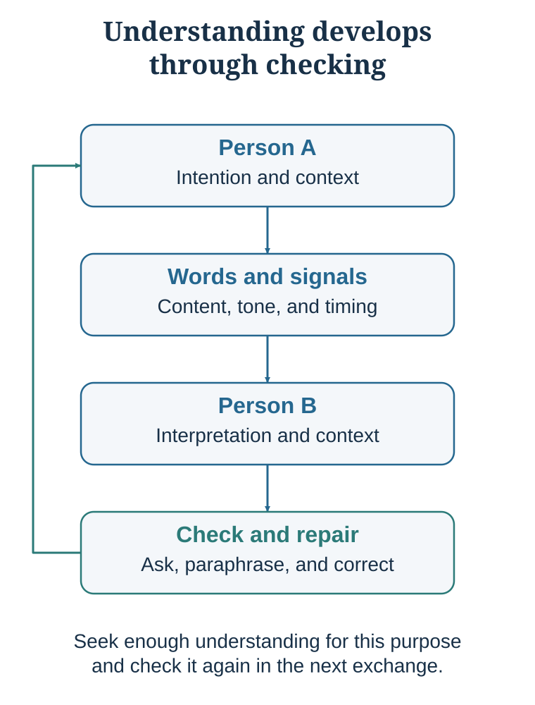

# Communication Is Joint Inference

*Words are the visible tip; context and relationship do the hidden work*

::: {.callout-note .core-idea icon=false}
## Core Idea

Better communication is not simply clearer speaking. It is the joint construction of meaning, trust, responsiveness, and shared reality between people whose minds are partly hidden from one another.
:::

## Learning goals

- Explain communication as grounding rather than transmission.
- Describe the health and decision value of social connection.
- Explain egocentric projection, false consensus, and illusion of transparency.
- Use perspective-getting instead of confident mind-reading.

Connection is not a luxury. It is part of human functioning.

A large body of research links social relationships to physical health, mental health, resilience, and longevity. Holt-Lunstad, Smith, and Layton’s (2010) meta-analysis found that stronger social relationships were associated with lower mortality risk, with an effect size comparable to several well-known health risk factors. Later reviews have continued to emphasize social connection as a major determinant of health (Holt-Lunstad, 2021; Snyder-Mackler et al., 2020). Loneliness and social isolation are associated with increased risks for depression, cognitive decline, cardiovascular problems, inflammation, and mortality (Cacioppo et al., 2014; Eisenberger & Cole, 2012).

Social connection also affects pain and threat. Eisenberger, Lieberman, and Williams (2003) showed that social exclusion activates neural systems associated with distress. Coan, Schaefer, and Davidson (2006) found that holding a spouse’s hand reduced neural responses to threat, especially in high-quality relationships. Master and colleagues (2009) found that looking at a romantic partner’s photograph reduced experimentally induced pain. These findings illustrate a broader principle: trusted relationships help regulate the body.

Connection also matters for work and creativity. Social networks provide information, opportunities, feedback, emotional support, and access to diverse perspectives. People with richer networks often have more professional opportunities, but the quality of connection matters more than the number of contacts. A large network of shallow or stressful ties is not the same as a smaller network of supportive relationships.

Relationship quality is crucial. Supportive relationships are beneficial. Aversive relationships are stressful but often predictable. Ambivalent relationships—relationships that both help and hurt—can be especially stressful because they are unpredictable. A colleague, sibling, parent, spouse, or friend who alternates warmth and criticism can create vigilance: will this interaction support me or wound me? Research on ambivalent ties suggests that mixed relationships can be associated with physiological stress and worse well-being than clearly negative ties in some contexts (Holt-Lunstad et al., 2007; Uchino, 2006).

This matters for decision-making. People do not make good decisions when socially threatened, isolated, or chronically stressed. A student without belonging may interpret difficulty as proof of inadequacy. An employee in an ambivalent relationship with a manager may hide problems. A negotiator who feels disrespected may reject value-creating proposals. A patient who does not trust a doctor may not reveal important information. Connection is decision infrastructure.

A practical implication is to audit relationship quality, not only relationship quantity.

Which relationships are supportive? Which are aversive but predictable? Which are ambivalent and stressful? Which people help you think more clearly? Which people make you defensive, smaller, or chronically vigilant? Where do you act ambivalently toward others?

A social network is not just a list of people. It is an environment that shapes attention, emotion, interpretation, and action.

## Communication is coordination and repair

{#fig-communication-grounding fig-alt="Two people exchange words and signals, then use grounding and repair in a feedback loop."}

The transmission model of communication is associated with Shannon and Weaver’s mathematical theory of communication (Shannon & Weaver, 1949). In that model, a sender transmits a signal through a channel to a receiver, and noise can interfere. This model is powerful for engineering problems. But human communication is not only signal transmission. It is meaning-making.

Suppose a manager says, “We need to improve accountability.” One employee hears, “We need clearer ownership.” Another hears, “Management is preparing to blame us.” A third hears, “We are finally addressing free riding.” A fourth hears, “They do not trust us.” The words are the same. The meaning is not.

This is because people interpret messages through prior experiences, expectations, identity, culture, power, and emotional state. Communication happens not only between mouths and ears, but between models of the world.

Herbert Clark’s work emphasizes common ground: the shared knowledge, assumptions, and context that speakers use to understand one another (Clark, 1996). Communication requires people to coordinate on what they both know, what they assume, and what has already been established. Clark and Brennan (1991) describe grounding as the process of establishing that people have understood each other well enough for the current purpose.

Grounding is why conversation includes signals such as “yes,” “I see,” “wait,” “what do you mean?,” “so you are saying…,” nods, pauses, repetition, examples, and repair. These are not meaningless fillers. They are coordination devices. They help participants check whether meaning is shared.

Grice’s cooperative principle also helps explain communication. Grice (1975) argued that conversation is guided by expectations that speakers provide information that is relevant, truthful, sufficiently informative, and clear. Much meaning comes from these expectations. If someone says, “Some of the students passed,” listeners may infer that not all passed, even though the sentence does not logically say that. If someone asks, “Can you pass the salt?” the literal answer may be “yes,” but the intended meaning is a request.

Human communication depends heavily on implication. People often say less than they mean because they expect listeners to infer. This makes communication efficient, but also fragile. Misunderstanding happens when people do not share the same assumptions.

This is especially clear in email and text communication. Kruger and colleagues (2005) found that people overestimate how well they can communicate tone over email. Senders think their intended sarcasm, humor, seriousness, or warmth is clear; receivers are much less accurate than senders expect. Both sides may then be surprised by misunderstanding. The sender thinks, “How could they not understand?” The receiver thinks, “How could they write such a thing?”

Good communicators do not assume understanding. They check it.

Useful questions include:

What do you understand this to mean? What part is unclear? What assumptions are we making? Can you say back what you think I am proposing? What concern would make this difficult for you? What does this word mean in your context? What would this look like in practice?

Communication improves when people treat understanding as a joint task, not a private achievement.

| Failure | Hidden source | Repair move |
| --- | --- | --- |
| Same word, different meaning | Different assumptions or professional models. | Ask for an example and define the term in use. |
| Tone is misread | Text removes vocal and contextual cues. | State intent explicitly and check interpretation. |
| Mind-reading hardens | An inference is treated as fact. | Name it as a hypothesis and ask the person. |
| Agreement is assumed | Silence is interpreted as consent. | Invite a summary, private response, or explicit concern. |
| Perspective-taking projects the self | We imagine what we would feel. | Use perspective-getting: ask, listen, and verify. |
: Grounding failures and repair moves {#tbl-28-1}

## Mind-reading is a hypothesis

Humans constantly infer hidden mental states.

What did she mean? Is he angry? Do they respect me? Will they accept my proposal? Are they interested in talking? Did I offend them? Do they like me? Are they hiding something?

This ability is sometimes called theory of mind or mentalizing. It is essential for social life. Without it, we could not cooperate, teach, negotiate, comfort, deceive, forgive, or build relationships. But our mind-reading is imperfect. We are often overconfident and self-centered when inferring others’ inner worlds.

One major error is egocentric projection: anchoring on one’s own perspective and insufficiently adjusting to another person’s perspective. We assume that our model of the world is closer to theirs than it really is. “I would not be offended by this feedback, so she should not be offended.” “I understood the email, so they should understand it.” “I enjoy this kind of small talk, so they must too.” “I would want direct advice, so they must want it.”

Diamond and Kirkham (2005) showed that adults, like children, can initially be pulled by their own perspective; the difference is often how quickly adults correct the egocentric error. Under pressure, distraction, or emotion, correction becomes harder.

A related error is the false consensus effect: people overestimate how common their own beliefs, preferences, choices, and behaviors are (Ross et al., 1977). If I think an action is ethical, I may assume most reasonable people agree. If I dislike a policy, I may assume most people secretly dislike it too. If I would accept a risk, I may assume others would. False consensus is a population-level version of egocentric projection.

Kruger and Gilovich (1999) showed that people can also be egocentric in responsibility judgments. In shared tasks, spouses and collaborators often overclaim responsibility for both positive and negative activities because their own contributions are more salient to them. Each person remembers what they did and underestimates invisible contributions by others.

Another error is the illusion of transparency: people overestimate how visible their internal states are to others (Gilovich et al., 1998). We think our anxiety, gratitude, embarrassment, confusion, or affection is obvious. It often is not. A student assumes the teacher can see they are confused. A manager assumes employees know they appreciate their effort. A friend assumes their hurt feelings are visible. A negotiator assumes the other side can see their constraint. Much conflict arises because people expect others to read emotions that have not been expressed.

The counterpart is the illusion of understanding: overestimating how well others understand the nuances in our writing, speech, or behavior. This is why explicitness matters. If something is important, do not rely on facial expressions, hints, vague wording, or silence. Say it.

People also exaggerate how much can be learned from body language and facial expression. Faces and bodies can reveal emotions, but they are noisy signals. Research on empathic accuracy suggests that verbal information is often more useful than trying to read expressions alone (Gesn & Ickes, 1999; Hall & Schmid Mast, 2007). Research on deception detection similarly suggests that people are generally poor lie detectors, and popular confidence in reading microexpressions is often overstated (Levine, 2010; Reinhard et al., 2011).

The practical lesson is simple:

Treat your interpretation of another person’s mind as a hypothesis, not a fact.

This principle is one of the most important in communication. “She is not interested,” “He is disrespecting me,” “They are hiding something,” “The students do not care,” “The client is unreasonable”—each may be true, but each is first a hypothesis. Good communication tests hypotheses before defending them.

## Stereotypes flatten the person

When people stereotype, they stop seeing the full person. They treat someone as a category rather than as a mind with feelings, values, motives, history, and complexity.

A person becomes “lazy,” “emotional,” “difficult,” “entitled,” “arrogant,” “not interested,” “too aggressive,” “too passive,” “typical of that group.” The label feels explanatory, but it often hides more than it reveals.

Stereotypes may sometimes capture directional differences between groups, but people often exaggerate the size of differences. Research on political stereotypes, for example, shows that people frequently overestimate how extreme and different opposing groups are (Ahler & Sood, 2018). Similar exaggerations can occur around gender, income, ideology, profession, nationality, or generation. The result is an illusion that groups are more divided, more uniform, and more predictable than they really are.

Stereotyping also connects to self-fulfilling prophecy. If a teacher expects a student to be weak, they may provide less challenge. If a manager expects an employee to resist, they may communicate defensively. If a negotiator expects dishonesty, they may withhold information, provoking guarded behavior in return. The stereotype changes the interaction, then the interaction confirms the stereotype.

Dehumanization is the extreme form of flattening. People are no longer experienced as full minds. Their pain matters less. Their motives are simplified. Their dignity becomes easier to ignore. Even mild everyday forms of dehumanization damage communication because they reduce curiosity.

A useful anti-stereotyping question is:

What is the iceberg beneath this behavior?

The visible behavior is only the top: silence, lateness, disagreement, emotion, refusal, enthusiasm, avoidance. Beneath it may be fear, identity, workload, culture, history, incentives, misunderstanding, status, shame, loyalty, or care. Communication improves when we ask about the iceberg before judging the surface.

## Ask rather than merely imagine

Because mind-reading is inaccurate, communication requires a better method.

Perspective-taking means trying to imagine another person’s perspective. It is useful, but limited. We often imagine what we would feel in their situation rather than what they actually feel. We project our own values, fears, and assumptions.

Perspective-getting means asking and listening.

Eyal, Steffel, and Epley (2018) found that people were often more accurate when they asked others for their perspective than when they merely tried to imagine it. This distinction is crucial. Perspective-taking can become confident projection. Perspective-getting corrects it.

A manager may imagine, “Employees resist because they dislike change.” Asking may reveal: they do not understand the purpose, lack time, fear job loss, distrust leadership, or have seen previous changes fail.

A doctor may imagine, “The patient is noncompliant because they do not understand.” Asking may reveal cost, side effects, work schedule, family beliefs, fear, stigma, or previous disrespect.

A teacher may imagine, “Students are lazy.” Asking may reveal unclear expectations, anxiety, lack of background knowledge, competing work hours, or fear of looking stupid.

A negotiator may imagine, “They only care about price.” Asking may reveal delivery timing, reputation, internal approval, risk allocation, or future relationship.

Perspective-getting requires questions that are open, respectful, and specific:

How does this look from your side? What is the hardest part of this for you? What are you worried would happen? What would make this feel fair? What constraints are you under? What am I missing? What would you want me to understand before I respond?

The key lesson is:

Do not only imagine the other person’s mind. Invite them to show it to you.

## Shared reality

Connection is not only liking. It is often the feeling that another person experiences the world in a way that overlaps with your own.

This is shared reality: the sense that someone else sees, feels, understands, or values something as you do. Shared reality does not require identical backgrounds or superficial similarity. Two people can differ in nationality, age, profession, and personality yet feel deeply connected because they recognize the same emotional meaning in an experience.

Echterhoff, Higgins, and Levine (2009) define shared reality as the experience of commonality with others’ inner states about the world. Pinel and colleagues’ work on I-sharing shows that people feel connected when they believe another person is having the same subjective experience at the same moment (Pinel et al., 2006). Huneke and Pinel (2016) found that I-sharing can foster selflessness. Neuroscience work on speaker-listener coupling suggests that successful communication can involve alignment of neural responses across people during shared understanding (Stephens et al., 2010).

Shared reality predicts rapport, closeness, and commitment. It is why laughing at the same joke, being moved by the same music, solving a problem together, dancing in synchrony, or recognizing the same absurdity can create immediate connection. Activities such as music, dance, comedy, ritual, and shared challenge synchronize attention, emotion, and bodily rhythms.

Shared reality also matters in work. A team becomes stronger when members not only exchange information but also share a sense of what matters. A doctor and patient build trust when they share an understanding of the problem. A teacher and student connect when both see confusion as part of learning. A negotiator builds rapport when both sides recognize the same constraint or opportunity.

Shared reality can be created deliberately.

Make agreement visible. Name the feeling you share. Reflect the other person’s meaning. Notice common concerns beneath different positions. Ask what an experience means to the other person. Create shared activities, not only shared talk. Let people know when their words resonate.

However, shared reality can also become an echo chamber. Feeling that someone “gets it” can make their beliefs seem more credible. Groups with strong shared reality may become closed to outside evidence. Connection should support truth, not replace it.

A useful question is:

Are we creating shared reality around reality, or around a comforting illusion?

Good connection makes the world clearer together.

## Social forecasts are often too pessimistic

People often underestimate how rewarding social interaction will be.

Epley and Schroeder (2014) asked commuters to either connect with a stranger, remain disconnected, or commute as usual. People predicted that solitude would be more pleasant, but those who talked to a stranger reported a more positive experience. Importantly, the interaction did not reduce productivity as much as people feared. Other work similarly suggests that weak-tie interactions can improve well-being more than people expect (Sandstrom & Dunn, 2014).

People also underestimate how much others like them after conversations. This is the liking gap. Boothby, Cooney, Sandstrom, and Clark (2018) found that after conversations, people tended to think their conversation partners liked them less than they actually did. This gap can discourage future contact, even when the interaction went well.

Introverts often expect less enjoyment from social interaction than extraverts, but after interacting, they may experience similar benefits. This does not mean introverts should become extraverts. It means anxious forecasts about connection are often worse than the actual experience.

People also underestimate others’ interest in deeper conversations. Kardas, Kumar, and Epley (2022) found that people expected deep conversations with strangers to be more awkward and less enjoyable than they actually were. Participants often discovered that deeper questions produced more connection than expected.

Why do people mispredict social interaction?

They focus on awkwardness, competence, and rejection: Will I know what to say? Will I seem strange? Will they like me? The other person often focuses more on warmth, interest, and responsiveness. The result is a perspective gap. We judge our social actions from inside our anxiety; recipients judge them from the warmth they receive.

The practical implication is powerful:

Test your social predictions.

Ask one more question. Express one more appreciation. Move one conversation one layer deeper. Reach out to someone. Talk to a stranger. Respond warmly. Invite someone in. Repair a small rupture.

Your anxious forecast about connection is often worse than the actual experience.

::: {.callout-caution .evidence-and-boundary-conditions icon=false}
## Evidence And Boundary Conditions

Body language and facial expression are informative but noisy. Confidence in reading a person's hidden state or detecting deception usually exceeds accuracy. Ask and verify.
:::

## Key ideas

- Better communication is not simply clearer speaking. It is the joint construction of meaning, trust, responsiveness, and shared reality between people whose minds are partly hidden from one another.
- Explain communication as grounding rather than transmission.
- Describe the health and decision value of social connection.
- Explain egocentric projection, false consensus, and illusion of transparency.

## Study and practice

1. How would you explain communication as grounding rather than transmission?

2. What evidence and mechanism would you use to describe the health and decision value of social connection?

3. How would you explain egocentric projection, false consensus, and illusion of transparency?

::: {.callout-tip .activity icon=false}
## Activity

Choose a recent misunderstanding. Separate the literal words, the sender's intended meaning, the listener's inferred meaning, the hidden context, and one repair question that could have grounded the conversation.  
EXPERIENCE - EXPLAIN - APPLY (MAXIMUM 120 WORDS)  
Experience: describe one specific decision, interaction, or observation. Explain: use one or two concepts from this chapter accurately. Apply: state one improvement, implication, or testable prediction.
:::

## References cited in this chapter

::: {.reference}
Ahler, D. J., & Sood, G. (2018). The parties in our heads: Misperceptions about party composition and their consequences. Journal of Politics, 80(3), 964–981.
:::

::: {.reference}
Boothby, E. J., Cooney, G., Sandstrom, G. M., & Clark, M. S. (2018). The liking gap in conversations: Do people like us more than we think? Psychological Science, 29(11), 1742–1756.
:::

::: {.reference}
Cacioppo, J. T., Cacioppo, S., & Boomsma, D. I. (2014). Evolutionary mechanisms for loneliness. Cognition and Emotion, 28(1), 3–21.
:::

::: {.reference}
Clark, H. H. (1996). Using language. Cambridge University Press.
:::

::: {.reference}
Clark, H. H., & Brennan, S. E. (1991). Grounding in communication. In L. B. Resnick, J. M. Levine, & S. D. Teasley (Eds.), Perspectives on socially shared cognition (pp. 127–149). American Psychological Association.
:::

::: {.reference}
Coan, J. A., Schaefer, H. S., & Davidson, R. J. (2006). Lending a hand: Social regulation of the neural response to threat. Psychological Science, 17(12), 1032–1039.
:::

::: {.reference}
Diamond, A., & Kirkham, N. (2005). Not quite as grown-up as we like to think: Parallels between cognition in childhood and adulthood. Psychological Science, 16(4), 291–297.
:::

::: {.reference}
Echterhoff, G., Higgins, E. T., & Levine, J. M. (2009). Shared reality: Experiencing commonality with others’ inner states about the world. Perspectives on Psychological Science, 4(5), 496–521.
:::

::: {.reference}
Eisenberger, N. I., & Cole, S. W. (2012). Social neuroscience and health: Neurophysiological mechanisms linking social ties with physical health. Nature Neuroscience, 15(5), 669–674.
:::

::: {.reference}
Eisenberger, N. I., Lieberman, M. D., & Williams, K. D. (2003). Does rejection hurt? An fMRI study of social exclusion. Science, 302(5643), 290–292.
:::

::: {.reference}
Epley, N., & Schroeder, J. (2014). Mistakenly seeking solitude. Journal of Experimental Psychology: General, 143(5), 1980–1999.
:::

::: {.reference}
Eyal, T., Steffel, M., & Epley, N. (2018). Perspective mistaking: Accurately understanding the mind of another requires getting perspective, not taking perspective. Journal of Personality and Social Psychology, 114(4), 547–571.
:::

::: {.reference}
Gesn, P. R., & Ickes, W. (1999). The development of meaning contexts for empathic accuracy: Channel and sequence effects. Journal of Personality and Social Psychology, 77(4), 746–761.
:::

::: {.reference}
Gilovich, T., Savitsky, K., & Medvec, V. H. (1998). The illusion of transparency: Biased assessments of others’ ability to read one’s emotional states. Journal of Personality and Social Psychology, 75(2), 332–346.
:::

::: {.reference}
Grice, H. P. (1975). Logic and conversation. In P. Cole & J. L. Morgan (Eds.), Syntax and semantics: Speech acts (Vol. 3, pp. 41–58). Academic Press.
:::

::: {.reference}
Hall, J. A., & Schmid Mast, M. (2007). Sources of accuracy in the empathic accuracy paradigm. Emotion, 7(2), 438–446.
:::

::: {.reference}
Holt-Lunstad, J. (2021). The major health implications of social connection. Current Directions in Psychological Science, 30(3), 251–259.
:::

::: {.reference}
Holt-Lunstad, J., Smith, T. B., & Layton, J. B. (2010). Social relationships and mortality risk: A meta-analytic review. PLOS Medicine, 7(7), e1000316.
:::

::: {.reference}
Holt-Lunstad, J., Uchino, B. N., Smith, T. W., & Hicks, A. (2007). On the importance of relationship quality: The impact of ambivalence in friendships on cardiovascular functioning. Annals of Behavioral Medicine, 33(3), 278–290.
:::

::: {.reference}
Huneke, M., & Pinel, E. C. (2016). Fostering selflessness through I-sharing. Journal of Experimental Social Psychology, 63, 10–18.
:::

::: {.reference}
Kardas, M., Kumar, A., & Epley, N. (2022). Overly shallow? Miscalibrated expectations create a barrier to deeper conversation. Journal of Personality and Social Psychology, 122(3), 367–398.
:::

::: {.reference}
Kruger, J., & Gilovich, T. (1999). “Naïve cynicism” in everyday theories of responsibility assessment: On biased assumptions of bias. Journal of Personality and Social Psychology, 76(5), 743–753.
:::

::: {.reference}
Levine, T. R. (2010). A few transparent liars: Explaining 54% accuracy in deception detection experiments. Annals of the International Communication Association, 34(1), 41–61.
:::

::: {.reference}
Pinel, E. C., Long, A. E., Landau, M. J., Alexander, K., & Pyszczynski, T. (2006). Seeing I to I: A pathway to interpersonal connectedness. Journal of Personality and Social Psychology, 90(2), 243–257.
:::

::: {.reference}
Reinhard, M.-A., Sporer, S. L., Scharmach, M., & Marksteiner, T. (2011). Listening, not watching: Situational familiarity and the ability to detect deception. Journal of Personality and Social Psychology, 101(3), 467–484.
:::

::: {.reference}
Ross, L., Greene, D., & House, P. (1977). The false consensus effect: An egocentric bias in social perception and attribution processes. Journal of Experimental Social Psychology, 13(3), 279–301.
:::

::: {.reference}
Sandstrom, G. M., & Dunn, E. W. (2014). Social interactions and well-being: The surprising power of weak ties. Personality and Social Psychology Bulletin, 40(7), 910–922.
:::

::: {.reference}
Shannon, C. E., & Weaver, W. (1949). The mathematical theory of communication. University of Illinois Press.
:::

::: {.reference}
Snyder-Mackler, N., Burger, J. R., Gaydosh, L., Belsky, D. W., Noppert, G. A., Campos, F. A., Bartolomucci, A., Yang, Y. C., Aiello, A. E., O’Rand, A., Harris, K. M., Shively, C. A., Alberts, S. C., & Tung, J. (2020). Social determinants of health and survival in humans and other animals. Science, 368(6493), eaax9553.
:::

::: {.reference}
Stephens, G. J., Silbert, L. J., & Hasson, U. (2010). Speaker-listener neural coupling underlies successful communication. Proceedings of the National Academy of Sciences, 107(32), 14425-14430.
:::

::: {.reference}
Uchino, B. N. (2006). Social support and health: A review of physiological processes potentially underlying links to disease outcomes. Journal of Behavioral Medicine, 29(4), 377–387.
:::
