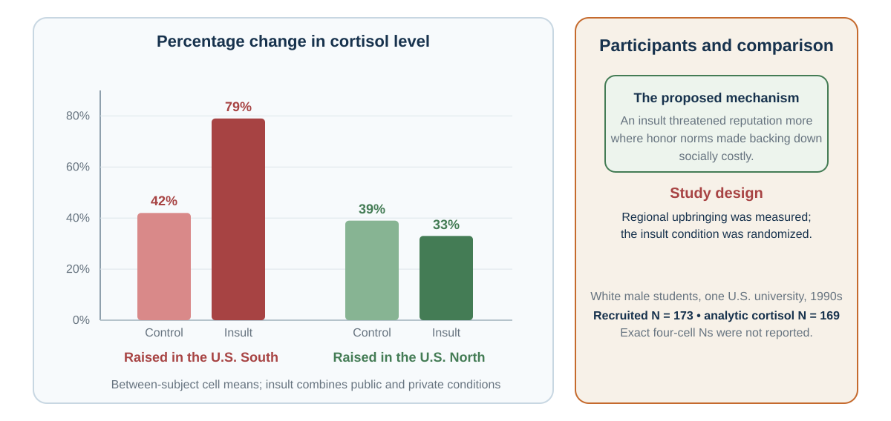

---
aliases:
  - 37-culture-identity-social-meaning.html
---

# Culture and Identity

*The Same Action Is Not the Same Act*

::: {#chapter-29-start .chapter-epigraph}
> “Every one gives the title of barbarism to everything that is not in use in his own country.”
>
> — Michel de Montaigne, [“Of Cannibals,” *Essays*](https://www.gutenberg.org/cache/epub/3600/pg3600-images.html), 1580, Book I, ch. XXX; Charles Cotton translation revised by W. Carew Hazlitt, 1877
:::

[]{#opening-puzzle-what-did-the-silence-mean}A senior manager presents a proposal to an international project team and asks, “Does everyone agree?” Nobody speaks, so the manager moves to the next item.

Afterward, a colleague mentions a serious problem that nobody raised in the meeting. The manager is puzzled: why did the team agree to something it thought would fail?

Perhaps it never agreed. Junior members may have been waiting for the person with formal responsibility, expecting concerns to be raised privately, or still finding words in a second language. Silence could also have meant agreement.

A decision about the proposal has become a decision about what other people meant. Before adding more facts or blaming the team's attitude, the manager needs to discover how disagreement works here. That is the practical question of this chapter: **what does an action mean to this person, in this relationship and setting?**

::: {.callout-note .core-idea icon=false}
## Core Idea

Culture and identity help people interpret actions: silence may communicate agreement in one meeting and deference in another. Use that possibility to investigate local meanings, while keeping the person’s role, incentives, and circumstances in view.
:::

## Learning goals

- Use four lenses—salient self, sanction strength, hierarchy and face, and local relational meaning—to interpret an ambiguous action.
- Distinguish group-level tendencies from individual diagnosis and generate evidence that could correct a cultural interpretation.
- Redesign one meeting or decision process so disagreement, dignity, and local verification can coexist.

The [previous chapter](28-authority-groupthink-and-shared-responsibility.qmd#chapter-28-start) examined how authority can keep concerns out of a decision. Here we examine a prior problem: recognizing a concern when people express it differently from what we expect. @fig-culture-meaning-map traces how the same observable action acquires different meanings along the way.

{#fig-culture-meaning-map fig-alt="An observable action branches through four evenly spaced meaning lenses: identity; relationship and power; institution and norm; and history and situation. The branches converge into an interpreted social act, which changes attention, value, prediction, and response."}

## Culture is a meaning environment

Culture is often introduced through visible differences: language, food, clothing, ritual, or holiday. These matter, but they do not capture its decision function. Culture is a system through which people learn what events signify, which motives are legitimate, what emotions fit a situation, who may speak, what counts as fairness, and what kind of person an action reveals.

Geertz (1973) described people as living within webs of significance they have collectively created. Swidler (1986) described culture as a repertoire of stories, symbols, practices, and strategies of action. Both perspectives move culture away from the idea of a single program stored inside a national mind. Culture is a shared interpretive environment.

People learn these meanings in language and stories, but also in everyday arrangements: who sits where, who may interrupt, which contribution gets rewarded, and what happens after an error. A workplace that praises openness while punishing bad news teaches a different lesson from its values poster. The [personal story in Chapter 15](15-samples-randomness-regression-and-calibration.qmd#personal-story-superstition) illustrates how a childhood warning can retain its emotional pull even after its claim is rejected.

[]{#personal-story-hotel-numbers}

::: {.callout-note .personal-example icon=false}
## From my experience: the numbers hotels leave out

During my travels, I have noticed some hotels whose floor numbering skips 4, 13, or 14. Some also avoid room numbers containing 4 or 13.

A room number can carry associations learned long before a journey. A hotel may accommodate guests' concerns about unlucky numbers through its numbering scheme, even if its staff do not share those beliefs. Cultural meanings can thus become part of the shared environment people encounter.
:::

These learned meanings shape a choice before anyone compares its material consequences. A request may be heard as an invitation, a duty, or a test of loyalty, changing whether refusal even feels possible. Asking for help may signal competence in one setting and inadequacy in another. Public praise can likewise be rewarding or embarrassing. In the opening meeting, the manager needs to know what team members expect disagreement to bring: useful discussion, rejection, or damage to their standing.

Culture does not eliminate agency. People inherit, combine, contest, and revise cultural repertoires. They may follow one script at home, another in a profession, and a third among friends. Knowing a local convention gives us a starting interpretation, which the person’s response may confirm or overturn.

::: {#big-five-personality .callout-note .research-lens icon=false collapse=true}
## Research Lens: distinguishing personality, culture, and identity

Two colleagues can share a national background and professional identity while differing in sociability, organization, or sensitivity to stress. **Personality traits** describe relatively enduring patterns of thought, feeling, and behavior. The **Big Five** organize many such differences into openness to experience, conscientiousness, extraversion, agreeableness, and neuroticism, often remembered as *OCEAN*. Instruments differ in their labels and facets: the BFI-2 uses *open-mindedness* and *negative emotionality* for two of these broad domains (Soto & John, 2017).

A trait dimension is not a fixed personality type, a moral ranking, or an explanation of every action. Culture concerns shared meanings and practices; identity concerns who someone understands themselves to be; a trait concerns a pattern across observations. They can interact without becoming interchangeable. Before calling a quiet colleague introverted, establish whether the pattern persists across settings or reflects this meeting's hierarchy, language demands, or reception of disagreement.
:::

[]{#a-cultural-tendency-is-not-a-diagnosis}

Because these meanings vary within as well as across societies, a country label is a poor answer to the manager’s puzzle. People within a country differ in experience, profession, generation, language, and organizational role, while one person may follow different conventions at work and at home. Even a well-measured group difference can leave substantial overlap between individuals.

Research samples also deserve scrutiny. Henrich, Heine, and Norenzayan (2010) warned that findings from Western, educated, industrialized, rich, and democratic populations had often been treated as universal human psychology. This calls for tests of how a mechanism depends on institutions, histories, meanings, and samples.

Use cultural knowledge as a **hypothesis generator**: “Silence may protect face; how are concerns normally raised here?” This question leaves room for an answer. “People from that country do not disagree” ends the inquiry before the person can speak.

[]{#cultural-dimensions-do-not-diagnose-a-person}

## Lens 1: Which self or identity enters the decision?

Advice to choose the job that best fits your ambitions seems straightforward. But an offer can advance those ambitions while straining obligations to family or colleagues. The decision changes depending on which relationships and commitments enter the sense of self. Markus and Kitayama (1991) distinguished two influential ways of construing the self.

An **independent self-construal** emphasizes autonomy, bounded individuality, internal preferences, abilities, and personal goals. An **interdependent self-construal** emphasizes relationships, roles, obligations, and adjustment to significant others. Most people can experience both. The useful question is which form of self a setting makes salient and legitimate.

The related terms **individualism** and **collectivism** concern cultural emphases on personal autonomy and individual goals, or on group obligations and shared goals (Hofstede, 1980). A cultural pattern and a person's self-construal are different levels of description. A country average does not tell us which commitment this person will prioritize in this decision.

Return to the job offer. An independent framing foregrounds:

- What work expresses my interests?
- Where will I grow?
- Which option fits my strengths and ambitions?

An interdependent framing also foregrounds:

- What will this choice require from my family?
- Which obligations and relationships would it strengthen or strain?
- What role am I expected to fulfill?
- Whose opportunity or security depends on my choice?

Each frame brings values and opportunity costs into view. Trouble begins when an adviser treats one self-model as natural and the other as interference.

Self-construal can also shape attention and explanation. Reviews of cultural cognition have found broad, context-dependent tendencies toward more analytic attention to focal objects in some settings and more holistic attention to relations and context in others (Nisbett et al., 2001). Experiments have reported differences in how objects are judged relative to their visual frames (Kitayama et al., 2003). Attribution studies have found variation in the weight placed on dispositions, situations, and relationships when explaining behavior (Miller, 1984; Morris & Peng, 1994).

[]{#a-three-object-prediction}

Before reading on, choose the two things in @fig-culture-triad-monkey-panda-banana that most naturally belong together.

{#fig-culture-triad-monkey-panda-banana fig-alt="An original textbook illustration shows a monkey and a giant panda above a banana, evenly spaced on a warm neutral background." width="82%"}

**Monkey + panda** share a taxonomic category: both are animals. **Monkey + banana** share a functional relationship: a monkey may eat a banana. The first pairing foregrounds focal-object similarity; the second foregrounds relation and context. Categorization depends on what kind of similarity the current setting has trained us to notice. Ask for the reason before interpreting the choice.

These findings raise a design question: **What is the current environment training people to notice and treat as causal?**

A manager may read silence as absence of opinion; a team member may use silence to protect hierarchy or allow collective reflection. A student may not volunteer because they are unprepared, because public error threatens face, because the teacher has not invited junior voices, or because the language of instruction makes rapid entry difficult. “Passive” is not yet an explanation.

### Identity changes which goals feel relevant {#identity-turns-what-do-i-want-into-who-are-we}

People define themselves partly through group membership: profession, family, organization, religion, nationality, political community, university, team, or moral group. Social identity theory and self-categorization theory explain how different group identities become salient and reorganize perception and conduct (Tajfel & Turner, 1979; Turner et al., 1987).

One person may evaluate the same proposal as a researcher, teacher, department member, parent, taxpayer, or citizen. Each identity supplies different standards of value and obligation.

Identity can improve decisions:

- “We protect patients.”
- “People like us report errors early.”
- “We are scientists; we change our minds when evidence changes.”
- “A good negotiator prepares questions before claims.”

Identity can also protect a bad model:

- Criticism of **our** strategy becomes disloyalty.
- Evidence against a political belief becomes an attack on belonging.
- A profession treats outside knowledge as low status.
- An “innovative” organization ignores reliability.
- A “practical” organization dismisses imagination.

Akerlof and Kranton (2000) incorporated identity into economic analysis by showing that acting consistently with an identity can itself carry utility. Oyserman's (2009) identity-based motivation account adds that identity changes how difficulty is interpreted. Difficulty can mean “this is important work people like us persist in” or “this shows that people like me do not belong.”

Identity is therefore not another preference sitting beside salary, time, and risk. It can change what counts as a cost, which evidence receives trust, and which actions enter the option set.

The cooperation consequences of these boundaries are developed in [Chapter 25](25-cooperation-and-social-preferences-self-interest-is-not-the-only-payoff.qmd#group-identity-changes-the-social-boundary): ingroup favoritism can restrict whom people help, while a shared task can make a wider team identity meaningful. The same person can retain a departmental identity while also acting as a member of the whole organization.

[]{#application-make-difficulty-identity-safe-without-lowering-standards}

::: {.callout-tip icon=false}
## Application: make difficulty identity-safe without lowering standards

A difficult task can communicate **challenge and investment**—“this matters, and support is available”—or **exclusion and incompetence**—“people like me do not belong here.” Identity-safe teaching keeps the intellectual standard clear while making belonging, support, representation, and paths to improvement credible. Brief belonging interventions illustrate how interpretations of adversity can affect persistence (Walton & Cohen, 2011). Credible support also requires adequate instruction, fair evaluation, resources, and structural access.
:::

## Lens 2: How tightly is deviation sanctioned?

A team needs reliable routines so that members can depend on one another. It also needs room to challenge a routine that has stopped working. Enforcing every rule tightly can protect execution while suppressing the learning needed to improve it; tolerating every deviation can make coordination unreliable. Gelfand and colleagues (2011) use **tightness** for contexts with strong norms and low tolerance for deviation and **looseness** for contexts with weaker norms and greater tolerance for variation.

Tightness can support coordination, predictability, and safety. It may be adaptive where errors spread quickly or collective discipline is essential. Looseness can support experimentation, difference, and improvisation. It may be adaptive where exploration and adaptation matter.

The trade-offs in @tbl-culture-tight-loose show why tighter and looser norms can each solve one problem while creating another:

| Norm environment | Possible strength | Possible failure |
| --- | --- | --- |
| Tighter | Reliability, coordination, clear expectations | Suppressed dissent, conformity, exclusion, low experimentation |
| Looser | Innovation, flexibility, tolerance of difference | Ambiguity, inconsistent execution, weak coordination |
: Tightness and looseness are context-dependent trade-offs {#tbl-culture-tight-loose}

A hospital operating room and an early-stage design studio may rationally need different levels of deviation. Even within one organization, medication verification can be tight while idea generation remains loose. The design problem is fit, not ideological preference.

Gelfand and colleagues (2011) found associations between tighter norms and ecological or historical threats across countries. A useful audit asks: Which errors are costly enough to justify a strong norm? Where would tolerance improve learning? Who is protected by the rule, and who is silenced?

## Lens 3: How do hierarchy and face filter information?

Leaders need accurate information to exercise authority. Yet if delivering bad news threatens a colleague’s standing or career, that authority can make the information harder to obtain. The design problem is to preserve accountable decisions while giving concerns a usable path upward.

Power distance refers to the degree to which unequal power is expected or accepted. Hofstede's (1980) national dimensions made the concept prominent in management research. National scores offer an initial comparison; local organizations may differ substantially.

The mechanism matters more than the score. Hierarchy shapes:

- who is expected to decide;
- who may ask questions or deliver bad news;
- whether a junior person can contradict a senior person in public;
- whose uncertainty is interpreted as care and whose as incompetence;
- which statements anchor the group before independent views appear.

If the senior person speaks first, others do not reveal independent evidence under the same conditions. If dissent carries career risk, silence is not a clean measure of agreement. Hierarchy can therefore degrade the information available to the hierarchy itself.

Accountable authority needs ways to hear concerns before deciding. Independent judgments before discussion and a private channel for concerns give members alternatives to publicly contradicting the leader. Explicit invitations to junior expertise can help too, provided the response shows that disagreement will be examined on its merits. These procedures reduce how much personal courage it takes to supply information the decision needs.

### Face, honor, and dignity: what else is at stake?

A public correction can improve a proposal while humiliating the person who presented it. The speaker may intend to protect accuracy; the recipient may hear a challenge to standing or respect. If that social cost closes the conversation, useful evidence may never be considered. Understanding what else is at stake helps us make the correction heard.

**Face** is socially recognized worth in an encounter. Face-work protects one's own and others' standing (Goffman, 1955). Face-negotiation theory further asks whether conflict protects self-face, other-face, or mutual face and how cultural context changes those priorities (Ting-Toomey, 1988). In the correction above, attending to face means considering how to preserve the recipient’s standing while examining the claim. Doing so can keep the relationship open to information that would otherwise be resisted.

**Honor** centers reputation for strength, loyalty, and willingness to answer threat or insult. Such a logic can become especially important where formal protection is unreliable and reputation deters exploitation. **Dignity** emphasizes worth that does not depend entirely on public reputation. Leung and Cohen (2011) show that face, honor, and dignity are cultural logics with substantial variation within as well as between societies.

::: {.callout-note .research-lens icon=false}
## Research Lens: testing an honor mechanism {#research-lens-one-bounded-test-of-an-honor-mechanism}

Cohen, Nisbett, Bowdle, and Schwarz (1996) tested an honor mechanism in a 1990s University of Michigan sample of White male students. In @fig-culture-honor-study-redraw, randomly assigned insult and control conditions produced a larger difference in mean cortisol change among students raised in the U.S. South than among those raised in the North. The experiment recruited 173 participants, with 169 included in the cortisol analysis.[^ch29-honor-design]

{#fig-culture-honor-study-redraw fig-alt="An original grouped bar chart shows mean cortisol change of 42 percent in the southern control group and 79 percent in the southern insult group, compared with 39 percent in the northern control group and 33 percent in the northern insult group. A design panel identifies experimentally assigned insult, measured regional upbringing, a between-subject comparison, recruited N of 173, analytic cortisol N of 169, and the restricted White male student sample at one university in the 1990s."}
:::

| Event | Face logic may foreground | Honor logic may foreground | Dignity logic may foreground |
| --- | --- | --- | --- |
| Public criticism | Relational standing and mutual face | Whether respect or strength is challenged | Whether the claim is fair to an equal person |
| Apology | Repair and restoration of interaction | Possible responsibility, strength, or status loss | Ownership without loss of inherent worth |
| Concession | Harmony and relationship | Reputation and vulnerability to exploitation | Pragmatic trade consistent with equal standing |
| Insult | Disruption of social order | Threat to reputation requiring response | Offense that need not determine worth |
: Different cultural logics can assign different stakes to the same exchange {#tbl-culture-face-honor-dignity}

The different readings of criticism, apology, concession, and insult in @tbl-culture-face-honor-dignity suggest a practical question: **What social value is at stake besides the material outcome—face, honor, dignity, respect, belonging, legitimacy, or status?**

## Lens 4: What does the action mean in this relationship or institution?

Giving someone €50 is physically and arithmetically the same transfer across settings. Socially, it can be:

- payment for work;
- a birthday gift;
- repayment of a debt;
- a tip;
- charity;
- compensation;
- an apology;
- a bribe;
- an insult.

Zelizer (1994) showed that people earmark money and distinguish household money, gift money, wages, inheritance, and other categories even though economic models often treat money as fungible. The category carries relationship and purpose.

The same issue arises when organizations use payments to change behavior. The recipient interprets both the amount and what offering it says about the relationship.

Titmuss (1970) argued that paying for blood could alter the meaning of donation. Experimental and meta-analytic evidence indicates that external rewards can sometimes reduce intrinsic motivation, particularly when experienced as controlling, although effects depend on task and reward conditions (Deci et al., 1999). In day-care centers, introducing a fine for late pickup increased lateness; a plausible interpretation is that the sanction converted a social obligation into a priced service (Gneezy & Rustichini, 2000). Bowles (2008) reviews how policies built for purely self-interested agents can crowd out civic or moral motives.

The examples in @tbl-culture-incentive-meaning separate a design’s intended purpose from the meaning it may acquire.

| Design action | Intended purpose | Possible meaning introduced |
| --- | --- | --- |
| Bonus for helping colleagues | Increase helping | “Helping is paid extra” or “help is valued” |
| Monitoring software | Increase compliance | “We do not trust you” |
| Public ranking | Increase effort | “Colleagues are competitors” |
| Small gift | Express appreciation | Gratitude, obligation, or attempted influence |
| Fine | Deter conduct | Moral sanction or purchasable permission |
: Incentives enter both the payoff and the relationship {#tbl-culture-incentive-meaning}

The same caution applies to words and gestures. A direct refusal may be received as honesty or disrespect; an apology may acknowledge responsibility or be interpreted as weakness. Ask what the act accomplishes in this relationship, especially when its effect surprises the person who performed it.

[]{#personal-story-toasting}

::: {.callout-note .personal-example icon=false}
## From my experience: saying “cheers” too often

On the drinking occasions I knew in China, we repeatedly toasted one another to express mutual respect and connection. When I went out for beers with colleagues, I carried that habit with me. A German colleague told me: “You cheer too much.”

I was using a familiar gesture to show warmth, but its frequency stood out to him. Repeating the gesture more often does not necessarily communicate more connection. Keeping the intention may mean adapting how I express it.
:::

### Organizations are local cultures

An organization’s stated values should help people know how to act. Yet daily rewards can teach a conflicting lesson: a firm praises integrity and rewards only sales; a university praises teaching and promotes mainly publication count; a hospital values safety and punishes error reports; a team praises diversity and accepts only one communication style. To understand the resulting decisions, we need to inspect which lesson has consequences.

Organizations create meanings at a smaller scale. A start-up may equate speed with intelligence. A hospital may treat caution as professionalism. A university may connect autonomy with academic dignity. A consultancy may mistake polish for competence. A research group may treat criticism as care—or as a status attack.

Schein (2010) distinguishes:

1. **Artifacts:** visible layouts, language, ceremonies, dashboards, routines, and meeting formats.
2. **Espoused values:** innovation, integrity, inclusion, customer focus, safety.
3. **Underlying assumptions:** what success means, who matters, whether people can be trusted, and what happens when bad news arrives.

Leaders teach culture through repeated allocation of attention and consequence. What do they ask first? Whom do they promote? What do they tolerate? How do they respond when a forecast fails? Do they thank the person who brings bad news or investigate their loyalty?

The [team-learning problem from Chapter 28](28-authority-groupthink-and-shared-responsibility.qmd#match-the-safeguard-to-the-missing-step) has a cultural dimension: what happens here after someone admits an error or questions a senior colleague? Psychological safety depends on those recurring consequences, alongside the standards for preparation and performance (Edmondson, 1999). A values poster cannot answer that question; the next response to bad news can.

[]{#an-organizational-culture-audit}

To investigate an organization, follow one recent decision. Who was rewarded, who could disagree, and what happened to the person who brought bad news? Compare those events with the stated values. The discrepancy often tells you more than another survey question asking whether integrity or inclusion matters.

## Interpreting differences and designing a shared process {#cross-cultures-by-asking-not-assuming}

Cultural intelligence is the capability to learn and act effectively across cultural settings, not a memorized list of national characteristics (Earley & Ang, 2003). It combines knowledge with motivation, metacognition, and behavioral flexibility.

Begin by separating what you observed from what you inferred, then ask a local question: “I noticed the room became quiet; how are concerns usually raised?” Include people with less power, whose public behavior may reveal constraints rather than preferences. Multicultural people can also shift interpretive frames with context (Hong et al., 2000), so an earlier encounter may not supply the right script for this one.

Finally, make the shared process explicit. Teams can agree how to invite junior voices, interpret silence, offer criticism, and raise private concerns. This gives people a common procedure without requiring a common background.

[]{#ethics-whose-common-sense-becomes-the-system}

When agreeing on that procedure, ask whose way of speaking is treated as normal and who pays the cost of adapting. People need ways to correct interpretations of their behavior and contest the rules of participation; assigning each person a fixed cultural category can restrict the very participation the process is meant to improve.

Respect for cultural meaning does not require accepting discrimination, coercion, violence, exclusion, or an unsafe hierarchy as “just cultural.” Teams still need explicit standards for safety, truthfulness, consent, non-discrimination, and accountability. Explain their purpose and provide fair ways to challenge their implementation, rather than treating a powerful institution’s preferred standard as culturally neutral.

Cross-cultural experience can broaden cognition when people engage and adapt rather than merely travel; living abroad has been associated with creativity under such conditions (Maddux & Galinsky, 2009). If differences remain silent or unsafe, the information never reaches the decision.

[]{#worked-application-redesign-the-silent-meeting}

Apply this inquiry to the opening meeting. The manager can redesign the process without pretending to know why everyone was silent.

**Step 1: Separate observation from interpretation.** Observation: nobody responded to a public yes-or-no question after the senior person presented.

**Step 2: Generate meanings.** Agreement, uncertainty, deference, fear, processing time, language difficulty, private-disagreement norm.

**Step 3: Inspect power and process.** Who spoke first? Was independent thinking possible? Can a junior person disagree publicly without cost?

**Step 4: Ask locally.** In one-to-one conversations or an anonymous channel, ask how concerns are normally raised and what would make disagreement usable.

**Step 5: Change the architecture.** Distribute the proposal in advance. Ask everyone to record risks independently. Invite the most junior or relevant expert before senior commentary. Use “What concern would we regret not discussing?” rather than “Does everyone agree?” Provide a private escalation path.

**Step 6: Learn.** Compare the number, novelty, and usefulness of concerns before and after the redesign. Check whether some members still carry disproportionate social cost.

The redesigned meeting gives concerns several routes into the decision. Check which routes people use and ask what made a concern easier to raise; changing several features together will not identify their separate effects. Later chapters use this habit of inquiry in persuasion, communication, and negotiation. Before trying to change another person’s response, establish what the situation means to them.

[]{#the-culture-and-identity-meaning-audit}

The questions in @tbl-culture-meaning-audit extend that meeting redesign to other consequential decisions:

| Audit question | Decision risk it exposes |
| --- | --- |
| Which identities are active? | Treating a person as an abstract chooser |
| What does each option symbolize? | Missing status, loyalty, care, or belonging |
| What norms determine what can be said? | Mistaking silence for preference |
| Who can disagree with whom? | Information filtered by hierarchy |
| What do acceptance and refusal communicate? | Material offer interpreted as social act |
| Whose script is treated as normal? | Dominant-culture design hidden as neutrality |
| Could an incentive change the meaning of the action? | Crowding out or distrust |
| What local evidence could correct our interpretation? | Stereotype replacing inquiry |
| Who bears the cost of adaptation? | Power and unequal cultural labor |
| Would affected people endorse the design and its identity message? | Efficient influence that reduces dignity or agency |
: A culture-and-identity meaning audit {#tbl-culture-meaning-audit}

Use @tbl-culture-meaning-audit to identify how the same material option could carry different meanings for different people, then seek local evidence that could correct your interpretation.

## Practice Lab

Choose one ambiguous action: silence, a direct refusal, a gift, an apology, public praise, a concession, or asking for help. Produce a Meaning Audit with four rows: salient self or identity; sanction strength; hierarchy and face; local relational or institutional meaning. For each row, state a rival interpretation, evidence that would distinguish it, and one perspective-getting question. Finish with a process redesign that prevents interpretation from silently becoming judgment.

## Take it forward

Before attributing a colleague’s silence to personality or culture, ask what speaking would mean in that particular relationship. The answer may change both your interpretation and the way you invite disagreement.

Once the same action can mean different things across audiences and relationships, influence cannot begin with the message alone. It must begin with the model through which the audience interprets it. Part V takes up that deliberate task through persuasion, communication, and repair.

[^ch29-honor-design]: Insult was experimentally assigned between participants; regional upbringing was measured. The interaction therefore identifies a difference in responses to insult across the sampled regional groups, rather than a causal effect of upbringing. The figure combines public and private insult conditions; exact four-cell sample sizes were not reported.

## References cited in this chapter

::: {.reference}
Akerlof, G. A., & Kranton, R. E. (2000). Economics and identity. Quarterly Journal of Economics, 115(3), 715-753.
:::

::: {.reference}
Bowles, S. (2008). Policies designed for self-interested citizens may undermine “the moral sentiments”: Evidence from economic experiments. Science, 320(5883), 1605-1609.
:::

::: {.reference}
Cohen, D., Nisbett, R. E., Bowdle, B. F., & Schwarz, N. (1996). Insult, aggression, and the southern culture of honor: An experimental ethnography. Journal of Personality and Social Psychology, 70(5), 945-960.
:::

::: {.reference}
Deci, E. L., Koestner, R., & Ryan, R. M. (1999). A meta-analytic review of experiments examining the effects of extrinsic rewards on intrinsic motivation. Psychological Bulletin, 125(6), 627-668.
:::

::: {.reference}
Earley, P. C., & Ang, S. (2003). Cultural intelligence: Individual interactions across cultures. Stanford University Press.
:::

::: {.reference}
Edmondson, A. C. (1999). Psychological safety and learning behavior in work teams. Administrative Science Quarterly, 44(2), 350-383.
:::

::: {.reference}
Geertz, C. (1973). The interpretation of cultures. Basic Books.
:::

::: {.reference}
Gelfand, M. J., Raver, J. L., Nishii, L., Leslie, L. M., Lun, J., Lim, B. C., Duan, L., Almaliach, A., Ang, S., Arnadottir, J., Aycan, Z., Boehnke, K., Boski, P., Cabecinhas, R., Chan, D., Chhokar, J., D’Amato, A., Ferrer, M., Fischlmayr, I. C., … Yamaguchi, S. (2011). Differences between tight and loose cultures: A 33-nation study. Science, 332(6033), 1100-1104.
:::

::: {.reference}
Gneezy, U., & Rustichini, A. (2000). A fine is a price. *Journal of Legal Studies, 29*(1), 1–17. https://doi.org/10.1086/468061
:::

::: {.reference}
Goffman, E. (1955). On face-work: An analysis of ritual elements in social interaction. Psychiatry, 18(3), 213-231.
:::

::: {.reference}
Henrich, J., Heine, S. J., & Norenzayan, A. (2010). The weirdest people in the world? Behavioral and Brain Sciences, 33(2-3), 61-83.
:::

::: {.reference}
Hofstede, G. (1980). Culture's consequences: International differences in work-related values. Sage.
:::

::: {.reference}
Hong, Y.-Y., Morris, M. W., Chiu, C.-Y., & Benet-Martínez, V. (2000). Multicultural minds: A dynamic constructivist approach to culture and cognition. American Psychologist, 55(7), 709-720.
:::

::: {.reference}
Kitayama, S., Duffy, S., Kawamura, T., & Larsen, J. T. (2003). Perceiving an object and its context in different cultures: A cultural look at New Look. Psychological Science, 14(3), 201-206.
:::

::: {.reference}
Leung, A. K.-Y., & Cohen, D. (2011). Within- and between-culture variation: Individual differences and the cultural logics of honor, face, and dignity cultures. Journal of Personality and Social Psychology, 100(3), 507-526.
:::

::: {.reference}
Maddux, W. W., & Galinsky, A. D. (2009). Cultural borders and mental barriers: The relationship between living abroad and creativity. Journal of Personality and Social Psychology, 96(5), 1047-1061.
:::

::: {.reference}
Markus, H. R., & Kitayama, S. (1991). Culture and the self: Implications for cognition, emotion, and motivation. Psychological Review, 98(2), 224-253.
:::

::: {.reference}
Miller, J. G. (1984). Culture and the development of everyday social explanation. Journal of Personality and Social Psychology, 46(5), 961-978.
:::

::: {.reference}
Morris, M. W., & Peng, K. (1994). Culture and cause: American and Chinese attributions for social and physical events. Journal of Personality and Social Psychology, 67(6), 949-971.
:::

::: {.reference}
Nisbett, R. E., Peng, K., Choi, I., & Norenzayan, A. (2001). Culture and systems of thought: Holistic versus analytic cognition. Psychological Review, 108(2), 291-310.
:::

::: {.reference}
Oyserman, D. (2009). Identity-based motivation: Implications for action-readiness, procedural-readiness, and consumer behavior. Journal of Consumer Psychology, 19(3), 250-260.
:::

::: {.reference}
Schein, E. H. (2010). Organizational culture and leadership (4th ed.). Jossey-Bass.
:::

::: {.reference}
Soto, C. J., & John, O. P. (2017). The next Big Five Inventory (BFI-2): Developing and assessing a hierarchical model with 15 facets to enhance bandwidth, fidelity, and predictive power. Journal of Personality and Social Psychology, 113(1), 117–143. https://doi.org/10.1037/pspp0000096
:::

::: {.reference}
Swidler, A. (1986). Culture in action: Symbols and strategies. American Sociological Review, 51(2), 273-286.
:::

::: {.reference}
Tajfel, H., & Turner, J. C. (1979). An integrative theory of intergroup conflict. In W. G. Austin & S. Worchel (Eds.), The social psychology of intergroup relations (pp. 33-47). Brooks/Cole.
:::

::: {.reference}
Ting-Toomey, S. (1988). Intercultural conflict styles: A face-negotiation theory. In Y. Y. Kim & W. B. Gudykunst (Eds.), Theories in intercultural communication (pp. 213-235). Sage.
:::

::: {.reference}
Titmuss, R. M. (1970). The gift relationship: From human blood to social policy. Allen & Unwin.
:::

::: {.reference}
Turner, J. C., Hogg, M. A., Oakes, P. J., Reicher, S. D., & Wetherell, M. S. (1987). Rediscovering the social group: A self-categorization theory. Basil Blackwell.
:::

::: {.reference}
Walton, G. M., & Cohen, G. L. (2011). A brief social-belonging intervention improves academic and health outcomes among minority students. Science, 331(6023), 1447-1451.
:::

::: {.reference}
Zelizer, V. A. (1994). The social meaning of money. Basic Books.
:::
