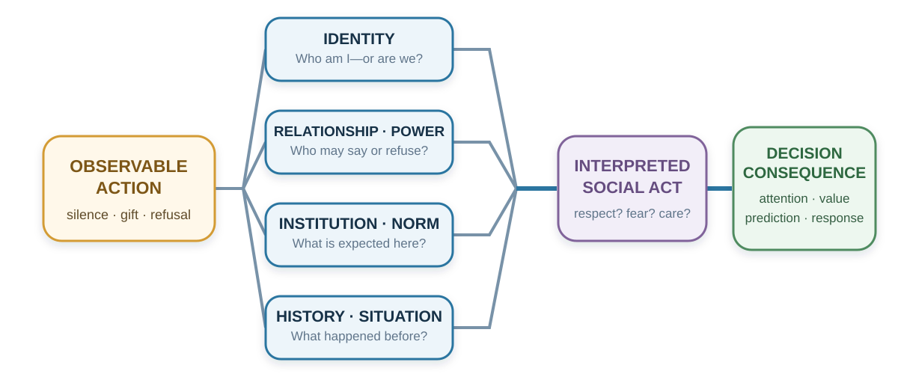

---
aliases:
  - 29-culture-and-identity-the-same-action-is-not-the-same-act.html
  - 37-culture-identity-social-meaning.html
---

# Culture and Identity

*The Same Action Is Not the Same Act*

::: {#chapter-29-start .chapter-epigraph}
> “Every one gives the title of barbarism to everything that is not in use in his own country.”
>
> — Michel de Montaigne, [“Of Cannibals,” *Essays*](https://www.gutenberg.org/cache/epub/3600/pg3600-images.html), 1580, Book I, ch. XXX; Charles Cotton translation revised by W. Carew Hazlitt, 1877
:::

[]{#opening-puzzle-what-did-the-silence-mean}A senior manager presents a proposal to an international project team and asks, “Does everyone agree?” Nobody speaks, so the manager moves to the next item.

Afterward, a colleague mentions a serious problem that nobody raised in the meeting. The manager is puzzled: why did the team agree to something it thought would fail?

Perhaps it never agreed. Junior members may have been waiting for the person with formal responsibility, expecting concerns to be raised privately, or still finding words in a second language. Silence could also have meant agreement.

A decision about the proposal has become a decision about what other people meant. Before adding more facts or blaming the team's attitude, the manager needs to discover how disagreement works here. That is the practical question of this chapter: **what does an action mean to this person, in this relationship and setting?**

::: {.callout-note .core-idea icon=false}
## Core Idea

Culture and identity help people interpret actions: silence may communicate agreement in one meeting and deference in another. Use that possibility to investigate local meanings, while keeping the person’s role, incentives, and circumstances in view.
:::

## Learning goals

- Explain what experiments on visual context, cultural cues, and insult reveal about how situations acquire meaning.
- Distinguish personality traits, cultural patterns, and identity; explain what genetic associations add to understanding individual differences.
- Distinguish group-level tendencies from individual diagnosis and generate evidence that could correct a cultural interpretation.
- Redesign one meeting or decision process so disagreement, dignity, and local verification can coexist.

The [previous chapter](28-social-influence.qmd#chapter-28-start) examined how requests, authority, and apparent agreement influence a decision. Here we examine a prior problem: recognizing a concern when people express it differently from what we expect. @fig-culture-meaning-map traces how the same observable action acquires different meanings along the way.

{#fig-culture-meaning-map fig-alt="An observable action branches through four evenly spaced meaning lenses: identity; relationship and power; institution and norm; and history and situation. The branches converge into an interpreted social act, which changes attention, value, prediction, and response."}

## Culture is a meaning environment

Culture is often introduced through visible differences: language, food, clothing, ritual, or holiday. These matter, but they do not capture its decision function. Culture is a system through which people learn what events signify, which motives are legitimate, what emotions fit a situation, who may speak, what counts as fairness, and what kind of person an action reveals.

Geertz (1973) described people as living within webs of significance they have collectively created. Swidler (1986) described culture as a repertoire of stories, symbols, practices, and strategies of action. Both perspectives move culture away from the idea of a single program stored inside a national mind. Culture is a shared interpretive environment.

People learn these meanings in language and stories, but also in everyday arrangements: who sits where, who may interrupt, which contribution gets rewarded, and what happens after an error. A workplace that praises openness while punishing bad news teaches a different lesson from its values poster. The [personal story in Chapter 15](15-randomness-and-overconfidence.qmd#personal-story-superstition) illustrates how a childhood warning can retain its emotional pull even after its claim is rejected.

[]{#personal-story-hotel-numbers}

::: {.callout-note .personal-example icon=false}
## From my experience: the numbers hotels leave out

During my travels, I have noticed some hotels whose floor numbering skips 4, 13, or 14. Some also avoid room numbers containing 4 or 13.

A room number can carry associations learned long before a journey. A hotel may accommodate guests' concerns about unlucky numbers through its numbering scheme, even if its staff do not share those beliefs. Cultural meanings can thus become part of the shared environment people encounter.
:::

These learned meanings shape a choice before anyone compares its material consequences. A request may be heard as an invitation, a duty, or a test of loyalty, changing whether refusal even feels possible. Asking for help may signal competence in one setting and inadequacy in another. Public praise can likewise be rewarding or embarrassing. In the opening meeting, the manager needs to know what team members expect disagreement to bring: useful discussion, rejection, or damage to their standing.

Can a familiar cultural cue change how someone interprets a scene? Hong and colleagues (2000) report an experiment in which 303 Hong Kong undergraduates were randomly shown American cultural icons, Chinese cultural icons, or neutral geometric images. They then interpreted a picture of one fish swimming ahead of a group. Was it leading the others or being chased? Chinese-icon exposure shifted judgments toward the group's influence relative to American-icon exposure.

The fish picture was unchanged; the preceding images changed which explanation seemed plausible. For these students, familiar with both cultural traditions, context made one interpretation more accessible than another. Culture can supply several ways of interpreting a situation, with cues in the setting bringing one to the fore.

[]{#a-cultural-tendency-is-not-a-diagnosis}

Because these meanings vary within as well as across societies, a country label is a poor answer to the manager’s puzzle. People within a country differ in experience, profession, generation, language, and organizational role, while one person may follow different conventions at work and at home. Even a well-measured group difference can leave substantial overlap between individuals.

Consider a software team in Shenzhen and one in Silicon Valley. Their ways of reviewing code or discussing product tests might resemble each other more than the practices of a technology team and a farming community within China. This is a comparison to investigate, not a measured ranking of whole cultures. The groups differ in occupation and working conditions as well as location; rural communities also contain considerable diversity.

Shared work provides one possible explanation. Similar technical problems can encourage similar routines, while professional education and networks supply standards that cross national borders. Schein (1996) described engineering and executive cultures whose reference groups extend beyond their own organizations. Recruitment can bring people with similar backgrounds into a firm; rewards and everyday interaction can then reinforce particular expectations. Similarity may therefore reflect both who joins and what people learn after joining. To examine the comparison, specify a practice and compare people in similar roles. Shared product-development routines need not imply shared views about authority or family obligations.

Research samples also deserve scrutiny. Henrich, Heine, and Norenzayan (2010) warned that findings from Western, educated, industrialized, rich, and democratic populations had often been treated as universal human psychology. This calls for tests of how a mechanism depends on institutions, histories, meanings, and samples.

Use cultural knowledge as a **hypothesis generator**: “Silence may protect face; how are concerns normally raised here?” This question leaves room for an answer. “People from that country do not disagree” ends the inquiry before the person can speak.

[]{#cultural-dimensions-do-not-diagnose-a-person}

## Personality: recurring patterns across situations {#big-five-personality}

Two colleagues can share a national background and professional identity while differing in sociability, organization, or sensitivity to stress. **Personality traits** describe relatively enduring patterns of thought, feeling, and behavior. Culture concerns shared meanings and practices; identity concerns who someone understands themselves to be. A trait describes a recurring pattern across observations. These distinctions matter when interpreting the opening meeting: a person's usual comfort with speaking, the meaning of public disagreement, and the identity they want to uphold can all influence the same response.

The **Big Five** summarize broad dimensions of personality, often remembered as *OCEAN*. They describe degrees of a tendency rather than mutually exclusive types. The Big Five Inventory–2 (BFI-2), developed and tested by Soto and John (2017), also distinguishes three narrower facets within each domain. Its labels *open-mindedness* and *negative emotionality* correspond to openness and neuroticism. @tbl-big-five-decisions connects these dimensions to questions a decision maker might investigate; the questions are applications, not a scoring instrument.

| Dimension | Recurring tendencies it describes | A question for a decision setting |
| --- | --- | --- |
| **Openness to experience** | Intellectual curiosity, imagination, and aesthetic sensitivity | Does this person seek unfamiliar possibilities or prefer familiar approaches? |
| **Conscientiousness** | Organization, productiveness, and responsibility | Which parts of preparing, following through, and checking work happen reliably? |
| **Extraversion** | Sociability, assertiveness, and energy | In which settings does the person initiate discussion or seek interaction? |
| **Agreeableness** | Compassion, respectfulness, and trust | How does the person balance cooperation, skepticism, and disagreement? |
| **Neuroticism** | Tendencies toward anxiety, depressed mood, and emotional volatility | Which uncertainties provoke distress, and how does that affect action? |
: Big Five dimensions and questions for understanding a decision pattern {#tbl-big-five-decisions}

The table gives dimensions, not five standards everyone should maximize. A job may require both cooperative work and firm disagreement, or both imaginative proposals and disciplined checking. A broad label can also conceal different combinations of facets: enjoying company and readily challenging a senior colleague are distinct tendencies within extraversion. Use the relevant behavior and task to interpret a score.

### A stable tendency can include considerable variation

Fleeson (2001) asked people repeatedly to describe their behavior in everyday life. Across three experience-sampling studies lasting two to three weeks, individuals showed substantial variation in how extraverted, agreeable, conscientious, emotionally stable, or open they were from one occasion to another. At the same time, their average patterns were stable across the sampled weeks. Someone can therefore be quieter than colleagues on average while being talkative in many situations. Personality describes the distribution of responses a person tends to show; one moment does not reveal the whole distribution.

For the manager, this changes the evidence to collect. Observe the colleague in smaller meetings, written exchanges, and situations with different authority relationships. If advance questions elicit useful objections, the team has learned how to obtain the needed information. Calling the colleague an introvert would add little unless it improves such predictions. [Chapter 10's Barnum-effect example](10-confirmation-bias-and-motivated-reasoning.qmd#barnum-effect) explains why a description that merely feels recognizable is a weak test of an assessment.

Personality's relevance nevertheless extends beyond a single meeting. Soto (2019) attempted to replicate 78 previously reported associations between traits and consequential outcomes. Eighty-seven percent were statistically significant in the expected direction, although replication effects were typically smaller. The replication used cross-sectional self-reports from U.S. online samples. It supports the usefulness of measured traits for describing associations with life outcomes; it cannot establish that changing a trait would cause an outcome to improve. That further question requires evidence about change.

### What the new genetics adds {#personality-genetics}

Schwaba and colleagues (2026), working through the **Revived Genomics of Personality Consortium (ReGPC)**, combined 46 cohorts, with approximately 611,000 to 1.14 million participants per Big Five trait. They identified 1,260 lead genetic variants associated with personality. Within-family analyses suggested that shared family conditions explained little of the genetic associations. This strengthens evidence for inherited contributions while leaving the pathways through experience open.

Prediction remained limited, and scores developed predominantly from European-ancestry data transferred less well to African-ancestry samples. The biological analyses also resisted a simple mapping from a personality dimension to one neurotransmitter system. [Appendix B](../appendices/appendix-b-evolutionary-explanations-of-value-choice-and-rationality.qmd#reading-personality-genetics) distinguishes genetic association, heritability, prediction, and causal inference.

For decisions, the useful synthesis is to take recurring individual differences seriously while examining how they meet a particular environment. A student who repeatedly misses deadlines might benefit from shorter milestones and visible reminders; a student who becomes distressed by unclear expectations might first need the assignment clarified. These are hypotheses to test with the student. Neither a trait score nor an account of its origins tells us which support will work. [Chapter 39](39-behavior-design.qmd#personality-and-deliberate-change) develops this point through an intervention designed to help people change their own personality patterns.

## Self, identity, and attention {#lens-1-which-self-or-identity-enters-the-decision}

Advice to choose the job that best fits your ambitions seems straightforward. But an offer can advance those ambitions while straining obligations to family or colleagues. The decision changes depending on which relationships and commitments enter the sense of self. Markus and Kitayama (1991) distinguished two influential ways of construing the self.

An **independent self-construal** emphasizes autonomy, bounded individuality, internal preferences, abilities, and personal goals. An **interdependent self-construal** emphasizes relationships, roles, obligations, and adjustment to significant others. Most people can experience both. The useful question is which form of self a setting makes salient and legitimate.

The related terms **individualism** and **collectivism** concern cultural emphases on personal autonomy and individual goals, or on group obligations and shared goals (Hofstede, 1980). A cultural pattern and a person's self-construal are different levels of description. A country average does not tell us which commitment this person will prioritize in this decision.

Return to the job offer. An independent framing foregrounds:

- What work expresses my interests?
- Where will I grow?
- Which option fits my strengths and ambitions?

An interdependent framing also foregrounds:

- What will this choice require from my family?
- Which obligations and relationships would it strengthen or strain?
- What role am I expected to fulfill?
- Whose opportunity or security depends on my choice?

Each frame brings values and opportunity costs into view. Trouble begins when an adviser treats one self-model as natural and the other as interference.

Cultural differences can appear even in what seems like a simple copying task. Kitayama and colleagues (2003) showed a line inside a square, then asked participants to draw it in another square. In one task they reproduced its absolute length; in the other they reproduced its length relative to the frame. In the first study, 20 Japanese participants in Kyoto were more accurate on the relative task, while 20 American participants in Chicago were more accurate on the absolute task. Neither group was simply better at copying: the advantage depended on what had to be preserved.

That comparison illustrates attention to an object versus its relation to the surrounding context (Nisbett et al., 2001). Participants were not randomly assigned to a cultural upbringing, and the small samples do not describe every Japanese or American person. Related attribution studies ask how much weight people give dispositions, situations, and relationships when explaining an action (Miller, 1984; Morris & Peng, 1994).

[]{#a-three-object-prediction}

Before reading on, choose the two things in @fig-culture-triad-monkey-panda-banana that most naturally belong together.

{#fig-culture-triad-monkey-panda-banana fig-alt="An original textbook illustration shows a monkey and a giant panda above a banana, evenly spaced on a warm neutral background." width="82%"}

**Monkey + panda** share a taxonomic category: both are animals. **Monkey + banana** share a functional relationship: a monkey may eat a banana. The first pairing foregrounds focal-object similarity; the second foregrounds relation and context. Categorization depends on what kind of similarity the current setting has trained us to notice. Ask for the reason before interpreting the choice.

These findings raise a design question: **What is the current environment training people to notice and treat as causal?**

Cultural learning may also affect what people do when explanations conflict. Peng and Nisbett (1999) presented Chinese and American university students with apparently contradictory statements. When both statements appeared together, American participants tended to strengthen their preference for the more plausible one, whereas Chinese participants moved toward intermediate judgments that allowed some truth in each. Other tasks examined preferences for proverbs and resolutions of interpersonal conflict. The authors interpreted the pattern as a difference between differentiating rival positions and seeking a compromise that preserves parts of each.

Neither response is automatically correct. Two claims may refer to different conditions and be reconcilable; they may also make incompatible predictions that require a test. In the opening meeting, apparent agreement could mean that a colleague is searching for a position that accommodates both concerns. Ask which evidence would distinguish the claims before interpreting compromise as confusion or direct disagreement as hostility.

A manager may read silence as absence of opinion; a team member may use silence to protect hierarchy or allow collective reflection. A student may not volunteer because they are unprepared, because public error threatens face, because the teacher has not invited junior voices, or because the language of instruction makes rapid entry difficult. “Passive” is not yet an explanation.

[]{#how-livelihoods-can-shape-cultural-learning}

The environments that train attention also have histories. Talhelm and colleagues (2014) compared 1,162 Han Chinese participants across six sites, relating psychological measures to rice cultivation in their regions of origin. Participants from historically rice-growing areas showed more interdependent and holistic patterns than those from wheat-growing areas; a comparison of neighboring counties along the agricultural boundary showed a similar difference. The proposed mechanism was repeated coordination: irrigated rice cultivation created demands for sharing water and labor that could make attention to relationships useful.

Talhelm, Zhang, and Oishi (2018) extended the question to an ordinary obstacle. They positioned chairs so that they partly blocked aisles in Starbucks stores and observed 678 customers. Customers in northern, predominantly wheat-growing cities were more likely to move a chair; those in southern, predominantly rice-growing cities were more likely to squeeze through. Moving the obstacle changes the environment; squeezing through adjusts the person to it. The researchers standardized an immediate situation, but did not randomly assign people to regional backgrounds. The result is consistent with different learned responses to a shared obstacle.

This is a hypothesis about practices and their transmission, not a property of people who eat rice. Participants were not randomly assigned to agricultural histories, and nearby regions can still differ in institutions, migration, language, and other experiences. The comparison therefore cannot establish agriculture as the sole cause of a thinking style. It does make national labels less satisfactory as explanations: people within the same country can encounter different coordination problems and inherit different practices. For a present-day team, ask which arrangements repeatedly reward independent initiative, mutual adjustment, or deference—and whether those arrangements still serve its work.

### Identity changes which goals feel relevant {#identity-turns-what-do-i-want-into-who-are-we}

People define themselves partly through group membership: profession, family, organization, religion, nationality, political community, university, team, or moral group. Social identity theory and self-categorization theory explain how different group identities become salient and reorganize perception and conduct (Tajfel & Turner, 1979; Turner et al., 1987).

One person may evaluate the same proposal as a researcher, teacher, department member, parent, taxpayer, or citizen. Each identity supplies different standards of value and obligation.

Identity can improve decisions:

- “We protect patients.”
- “People like us report errors early.”
- “We are scientists; we change our minds when evidence changes.”
- “A good negotiator prepares questions before claims.”

Identity can also protect a bad model:

- Criticism of **our** strategy becomes disloyalty.
- Evidence against a political belief becomes an attack on belonging.
- A profession treats outside knowledge as low status.
- An “innovative” organization ignores reliability.
- A “practical” organization dismisses imagination.

Akerlof and Kranton (2000) incorporated identity into economic analysis by showing that acting consistently with an identity can itself carry utility. Oyserman's (2009) identity-based motivation account adds that identity changes how difficulty is interpreted. Difficulty can mean “this is important work people like us persist in” or “this shows that people like me do not belong.”

These questions also arise before children have professions or political affiliations, as they begin to evaluate their own abilities and how others see them.

[]{#personal-story-preschool-being-right}

::: {.callout-note .personal-example icon=false}
## From my experience: wanting to be right at four

Watching my four-year-old daughter and her friends, I have noticed how keen they can be to show that they are right and, sometimes, better than one another. It makes me wonder whether these small competitions are also about identity: are they defending an answer, or a developing picture of themselves as capable?
:::

Developmental research makes the connection plausible. In two studies using simple tasks and information about performance, Butler (1998) found that even four- and five-year-olds evaluated themselves more favorably after doing better than another child than after doing worse. They could explicitly refer to the comparison when explaining their judgments. Other children's performance was already helping to give their own performance meaning.

Children can also take account of what a particular observer has seen. In an experiment with three- and four-year-olds, Asaba and Gweon (2022, Experiment 2b) arranged for children to fail and then succeed at operating a toy, with its responses secretly controlled by a remote. An adult either witnessed the eventual success or left before it occurred. Later, children could show that adult this familiar toy or a second toy she had never seen. They were more likely to choose the familiar toy when the adult had missed their success. Demonstrating it could update her impression of their ability. The contrast supports an early capacity to manage others' impressions.

“Identity” therefore needs some precision here. In the domain of ability, **self-concept** concerns how capable I believe I am, while concern about **reputation** involves how capable I think others believe I am. **Social comparison** can supply evidence for either judgment. Wanting to solve a problem, wanting recognition, and wanting to rank above a friend can produce similar behavior while pursuing different goals. A child may also insist on an answer simply because they believe it is correct. The link to [belief protection in Chapter 10](10-confirmation-bias-and-motivated-reasoning.qmd) is a possible mechanism: when an answer becomes evidence of personal competence, correcting it can feel more consequential than changing a factual claim.

How adults describe success may affect what a subsequent mistake seems to mean. Cimpian and colleagues (2007) studied 24 children around age four in puppet scenarios involving imaginary drawings. One group heard “You are a good drawer”; the other heard “You did a good job drawing.” After later imagined mistakes, the first group gave more discouraged responses and expressed less willingness to keep drawing. The children's immediate responses illustrate how praise attached to the person can make an error seem relevant to a broader judgment of ability.

A practical implication is to make room for competence without requiring superiority: discuss what worked, what needs correcting, and how an answer could be checked together. A child can receive recognition for learning something even when a friend already knows it.

[]{#local-rank-and-self-understanding}

At school, a belief such as “I am good at mathematics” can also grow from a local comparison. The same test score can place one student near the top of a class and another near the middle. Using English school records, Murphy and Weinhardt (2020) examined naturally occurring variation in primary-school rank among students with similar measured achievement, accounting for school and subject differences. Higher earlier rank predicted better later achievement and greater confidence in the subject, including after students had moved to secondary school. Rank also predicted subsequent subject choices. Local standing can leave a mark on how people understand their capabilities even after the original comparison group has changed.

This gives feedback two different jobs: locating performance against a substantive standard and explaining progress relative to other people. A teacher can identify which mathematical ideas a pupil understands and which need work without turning a position in this particular class into a permanent identity. In a workplace, likewise, being the least experienced person on an excellent team does not establish a lack of potential. The comparison group helps create the meaning of the result.

Identity is therefore not another preference sitting beside salary, time, and risk. It can change what counts as a cost, which evidence receives trust, and which actions enter the option set.

The cooperation consequences of these boundaries are developed in [Chapter 25](25-cooperation-and-social-preferences.qmd#group-identity-changes-the-social-boundary): ingroup favoritism can restrict whom people help, while a shared task can make a wider team identity meaningful. The same person can retain a departmental identity while also acting as a member of the whole organization.

[]{#stereotypes-of-warmth-and-competence}

Group labels can also supply expectations about what another person intends and can do. In Fiske and colleagues' (2002) studies, respondents rated how social groups were viewed in society. Perceived status was associated with attributed competence, while perceived competition was associated with lower attributed warmth. Many stereotypes mixed a favorable judgment on one dimension with an unfavorable judgment on the other: a group could be regarded as capable but threatening, or kindly but incapable. These were measurements of stereotypes, not tests of the groups' actual abilities or intentions. A seemingly positive label can therefore still restrict participation. Calling someone “naturally caring” while overlooking their technical expertise can assign them a role before their contribution is heard. Ask which expectation the label supplied, then examine the person's relevant evidence.

[]{#application-make-difficulty-identity-safe-without-lowering-standards}

::: {.callout-tip icon=false}
## Application: make difficulty identity-safe without lowering standards

A difficult task can communicate **challenge and investment**—“this matters, and support is available”—or **exclusion and incompetence**—“people like me do not belong here.” Identity-safe teaching keeps the intellectual standard clear while making belonging, support, representation, and paths to improvement credible. Brief belonging interventions illustrate how interpretations of adversity can affect persistence (Walton & Cohen, 2011). Credible support also requires adequate instruction, fair evaluation, resources, and structural access.
:::

## How strongly are norms enforced? {#lens-2-how-tightly-is-deviation-sanctioned}

How acceptable is laughing in a public park, a library, or a job interview? Gelfand and colleagues (2011) asked 6,823 respondents across 33 nations to judge the appropriateness of 12 behaviors in 15 situations. They also measured perceived norm strength and tolerance for deviation. Places judged to have stronger norms tended to constrain acceptable behavior across situations more tightly. The authors called these cultural patterns **tightness** and **looseness**.

The study moves the question beyond whether a country “values conformity”: it asks what people expect others to tolerate in particular settings. Tighter norms were also associated with ecological and historical threats. The samples were not nationally representative, and norm strength was measured rather than randomly changed. These comparisons therefore do not establish that tightening a team's rules will improve its performance.

@tbl-culture-tight-loose translates the distinction into questions for a local setting. The potential trade-offs need evidence from that setting; they are not outcomes guaranteed by the country comparison.

| Norm environment | What to examine | What else to check |
| --- | --- | --- |
| Tighter | Does consistent rule-following prevent consequential errors? | Can people question an obsolete or harmful rule? |
| Looser | Does tolerance allow useful variation and experimentation? | Can people still rely on essential shared procedures? |
: Questions to investigate when norms are tighter or looser {#tbl-culture-tight-loose}

A hospital can require strict medication checks while allowing staff to question how work is organized. The practical issue is which departures create danger and which reveal a better procedure.

## Hierarchy, face, and honor {#lens-3-how-do-hierarchy-and-face-filter-information}

Leaders need accurate information to exercise authority. Yet if delivering bad news threatens a colleague’s standing or career, that authority can make the information harder to obtain. The design problem is to preserve accountable decisions while giving concerns a usable path upward.

Power distance refers to the degree to which unequal power is expected or accepted. Hofstede's (1980) national dimensions made the concept prominent in management research. National scores offer an initial comparison; local organizations may differ substantially.

The mechanism matters more than the score. Hierarchy shapes:

- who is expected to decide;
- who may ask questions or deliver bad news;
- whether a junior person can contradict a senior person in public;
- whose uncertainty is interpreted as care and whose as incompetence;
- which statements anchor the group before independent views appear.

If the senior person speaks first, others do not reveal independent evidence under the same conditions. If dissent carries career risk, silence is not a clean measure of agreement. Hierarchy can therefore degrade the information available to the hierarchy itself.

Accountable authority needs ways to hear concerns before deciding. Independent judgments before discussion and a private channel for concerns give members alternatives to publicly contradicting the leader. Explicit invitations to junior expertise can help too, provided the response shows that disagreement will be examined on its merits. These procedures reduce how much personal courage it takes to supply information the decision needs.

### Rank, control, and the cost of hierarchy {#rank-control-and-stress}

Hierarchy also changes what a person must monitor. A subordinate may anticipate arbitrary demands; a leader may anticipate challenges to their position. Neither burden can be read directly from a job title. Gesquiere and colleagues (2011) examined rank and hormone measures over time in wild male baboons. Higher-ranking males generally had lower glucocorticoid levels, but the highest-ranking males were an exception: their levels were substantially higher than those of second-ranking males. Both access to resources and the costs of maintaining a position can matter. This observational result concerns a particular primate population; it does not establish a universal ladder from low rank to poor health in humans, or make a hormone concentration a complete measure of stress.

Human evidence gives a reason to examine control over demands. Sherman and colleagues (2012) studied samples including government officials and military officers. Leaders reported less anxiety and had lower salivary cortisol than nonleaders; among leaders, greater authority and more total subordinates were associated with a stronger sense of control and lower stress measures. These were observational comparisons, so selection into leadership and other differences remain possible explanations. They do not show that promoting someone will improve their health or that autonomy can cancel material deprivation. They suggest a more useful organizational question than “Who is highest?”: who can influence their workload, obtain support, and respond when demands conflict?

The source of deference matters too. **Dominance** secures influence through threats or intimidation; **prestige** involves respect for valued skill or knowledge. In newly formed groups completing a task, Cheng and colleagues (2013) found that both were associated with influence, although prestigious participants were better liked. These routes can coexist in one person, and neither a title nor popularity establishes decision competence. In the opening meeting, silence could reflect fear of sanctions or confidence in the manager's expertise. Finding out which is operating changes how to invite useful disagreement.

### Face, honor, and dignity: what else is at stake?

A public correction can improve a proposal while humiliating the person who presented it. The speaker may intend to protect accuracy; the recipient may hear a challenge to standing or respect. If that social cost closes the conversation, useful evidence may never be considered. Understanding what else is at stake helps us make the correction heard.

**Face** is socially recognized worth in an encounter. Face-work protects one's own and others' standing (Goffman, 1955). Face-negotiation theory further asks whether conflict protects self-face, other-face, or mutual face and how cultural context changes those priorities (Ting-Toomey, 1988). In the correction above, attending to face means considering how to preserve the recipient’s standing while examining the claim. Doing so can keep the relationship open to information that would otherwise be resisted.

**Honor** centers reputation for strength, loyalty, and willingness to answer threat or insult. Such a logic can become especially important where formal protection is unreliable and reputation deters exploitation. **Dignity** emphasizes worth that does not depend entirely on public reputation. Leung and Cohen (2011) show that face, honor, and dignity are cultural logics with substantial variation within as well as between societies.

::: {.callout-note .research-lens icon=false}
## Research Lens: testing an honor mechanism {#research-lens-one-bounded-test-of-an-honor-mechanism}

Cohen, Nisbett, Bowdle, and Schwarz (1996) tested an honor mechanism in a 1990s University of Michigan sample of White male students. In @fig-culture-honor-study-redraw, randomly assigned insult and control conditions produced a larger difference in mean cortisol change among students raised in the U.S. South than among those raised in the North. The experiment recruited 173 participants, with 169 included in the cortisol analysis.[^ch29-honor-design]

{#fig-culture-honor-study-redraw fig-alt="Grouped bars show mean cortisol change of 42 percent in the southern control group and 79 percent in the southern insult group, compared with 39 percent in the northern control group and 33 percent in the northern insult group." .phone-fit}
:::

| Event | Face logic may foreground | Honor logic may foreground | Dignity logic may foreground |
| --- | --- | --- | --- |
| Public criticism | Relational standing and mutual face | Whether respect or strength is challenged | Whether the claim is fair to an equal person |
| Apology | Repair and restoration of interaction | Possible responsibility, strength, or status loss | Ownership without loss of inherent worth |
| Concession | Harmony and relationship | Reputation and vulnerability to exploitation | Pragmatic trade consistent with equal standing |
| Insult | Disruption of social order | Threat to reputation requiring response | Offense that need not determine worth |
: Different cultural logics can assign different stakes to the same exchange {#tbl-culture-face-honor-dignity}

The different readings of criticism, apology, concession, and insult in @tbl-culture-face-honor-dignity suggest a practical question: **What social value is at stake besides the material outcome—face, honor, dignity, respect, belonging, legitimacy, or status?**

## The meaning of an incentive {#lens-4-what-does-the-action-mean-in-this-relationship-or-institution}

Giving someone €50 is physically and arithmetically the same transfer across settings. Socially, it can be:

- payment for work;
- a birthday gift;
- repayment of a debt;
- a tip;
- charity;
- compensation;
- an apology;
- a bribe;
- an insult.

Zelizer (1994) showed that people earmark money and distinguish household money, gift money, wages, inheritance, and other categories even though economic models often treat money as fungible. The category carries relationship and purpose.

The same issue arises when organizations use payments to change behavior. The recipient interprets both the amount and what offering it says about the relationship.

Titmuss (1970) argued that paying for blood could alter the meaning of donation. Experimental and meta-analytic evidence indicates that external rewards can sometimes reduce intrinsic motivation, particularly when experienced as controlling, although effects depend on task and reward conditions (Deci et al., 1999). In day-care centers, introducing a fine for late pickup increased lateness; a plausible interpretation is that the sanction converted a social obligation into a priced service (Gneezy & Rustichini, 2000). Bowles (2008) reviews how policies built for purely self-interested agents can crowd out civic or moral motives.

The examples in @tbl-culture-incentive-meaning separate a design’s intended purpose from the meaning it may acquire.

| Design action | Intended purpose | Possible meaning introduced |
| --- | --- | --- |
| Bonus for helping colleagues | Increase helping | “Helping is paid extra” or “help is valued” |
| Monitoring software | Increase compliance | “We do not trust you” |
| Public ranking | Increase effort | “Colleagues are competitors” |
| Small gift | Express appreciation | Gratitude, obligation, or attempted influence |
| Fine | Deter conduct | Moral sanction or purchasable permission |
: Incentives enter both the payoff and the relationship {#tbl-culture-incentive-meaning}

The same caution applies to words and gestures. A direct refusal may be received as honesty or disrespect; an apology may acknowledge responsibility or be interpreted as weakness. Ask what the act accomplishes in this relationship, especially when its effect surprises the person who performed it.

[]{#personal-story-toasting}

::: {.callout-note .personal-example icon=false}
## From my experience: saying “cheers” too often

On the drinking occasions I knew in China, we repeatedly toasted one another to express mutual respect and connection. When I went out for beers with colleagues, I carried that habit with me. A German colleague told me: “You cheer too much.”

I was using a familiar gesture to show warmth, but its frequency stood out to him. Repeating the gesture more often does not necessarily communicate more connection. Keeping the intention may mean adapting how I express it.
:::

### Organizations are local cultures

An organization’s stated values should help people know how to act. Yet daily rewards can teach a conflicting lesson: a firm praises integrity and rewards only sales; a university praises teaching and promotes mainly publication count; a hospital values safety and punishes error reports; a team praises diversity and accepts only one communication style. To understand the resulting decisions, we need to inspect which lesson has consequences.

Organizations create meanings at a smaller scale. A start-up may equate speed with intelligence. A hospital may treat caution as professionalism. A university may connect autonomy with academic dignity. A consultancy may mistake polish for competence. A research group may treat criticism as care—or as a status attack.

Schein (2010) provides a descriptive vocabulary for separating these layers:

1. **Artifacts:** visible layouts, language, ceremonies, dashboards, routines, and meeting formats.
2. **Espoused values:** innovation, integrity, inclusion, customer focus, safety.
3. **Underlying assumptions:** what success means, who matters, whether people can be trusted, and what happens when bad news arrives.

The distinction directs attention to observable events: what leaders ask first, whom they promote, and how they respond when a forecast fails. Those observations help test whether the stated value describes everyday practice.

Some workplace practices also arrive from outside the firm. DiMaggio and Powell (1983) used **institutional isomorphism** to explain how organizations become more alike through professional expectations, imitation under uncertainty, and pressures from authorities or organizations on which they depend. Imagine a firm adopting a product-review routine: trained engineers might expect it, managers might copy a respected competitor, or a powerful customer might require it. These are different explanations for the same visible practice.

The distinction matters when deciding what to copy. A routine can help an organization appear credible without improving its work. Shared professional networks may encourage similarities across countries, while different legal requirements and sources of authority sustain differences. For the technology teams, ask where a practice came from, whose expectations maintain it, and what evidence shows that it helps. The reach of a professional community can cross national borders even while its members remain accountable to different institutions.

[]{#a-social-climate-can-outlast-its-founders}

Can a social climate persist as its members change? Sapolsky and Share (2004) followed a wild baboon troop in which a tuberculosis outbreak in the 1980s disproportionately killed aggressive adult males that foraged at a refuse site. Later observations found an overall aggression rate similar to those in the earlier period and a comparison troop, alongside less harassment of low-ranking males, less male aggression toward females, and greater affiliation. By 1993, the adult males present during the outbreak had all been replaced by immigrants, yet the distinctive pattern remained. Females were more affiliative toward newcomers, suggesting one possible route by which the social environment helped sustain the pattern.

This was an unusual historical event in one troop, with comparisons across periods and groups; it was not an experiment isolating the cause of a peaceful culture. The pattern suggests that established ways of interacting can persist as newcomers join. The organizational question it raises is concrete: what does a newcomer experience after asking for help, admitting uncertainty, or treating a colleague harshly? Repeated responses can make a practice easier to learn and continue even after its original members leave.

The [team-learning problem from Chapter 28](28-social-influence.qmd#match-the-safeguard-to-the-missing-step) has a cultural dimension: what happens here after someone admits an error or questions a senior colleague? Psychological safety depends on those recurring consequences, alongside the standards for preparation and performance (Edmondson, 1999). A values poster cannot answer that question; the next response to bad news can.

[]{#an-organizational-culture-audit}

To investigate an organization, follow one recent decision. Who was rewarded, who could disagree, and what happened to the person who brought bad news? Compare those events with the stated values. The discrepancy often tells you more than another survey question asking whether integrity or inclusion matters.

## Interpreting differences and designing a shared process {#cross-cultures-by-asking-not-assuming}

Cultural intelligence is the capability to learn and act effectively across cultural settings, not a memorized list of national characteristics (Earley & Ang, 2003). It combines knowledge with motivation, metacognition, and behavioral flexibility.

Begin by separating what you observed from what you inferred, then ask a local question: “I noticed the room became quiet; how are concerns usually raised?” Include people with less power, whose public behavior may reveal constraints rather than preferences. The cultural-icon experiment also shows why an earlier encounter may not supply the right interpretation for this one.

Finally, make the shared process explicit. Teams can agree how to invite junior voices, interpret silence, offer criticism, and raise private concerns. This gives people a common procedure without requiring a common background.

[]{#ethics-whose-common-sense-becomes-the-system}

When agreeing on that procedure, ask whose way of speaking is treated as normal and who pays the cost of adapting. People need ways to correct interpretations of their behavior and contest the rules of participation; assigning each person a fixed cultural category can restrict the very participation the process is meant to improve.

Respect for cultural meaning does not require accepting discrimination, coercion, violence, exclusion, or an unsafe hierarchy as “just cultural.” Teams still need explicit standards for safety, truthfulness, consent, non-discrimination, and accountability. Explain their purpose and provide fair ways to challenge their implementation, rather than treating a powerful institution’s preferred standard as culturally neutral.

Cross-cultural experience can broaden cognition when people engage and adapt rather than merely travel; living abroad has been associated with creativity under such conditions (Maddux & Galinsky, 2009). If differences remain silent or unsafe, the information never reaches the decision.

[]{#worked-application-redesign-the-silent-meeting}

Return to the opening meeting. Nobody answered a public question after the senior person spoke; that observation leaves agreement, uncertainty, deference, and fear unresolved. Ask privately how concerns are normally raised, then try a process that gives people time and a usable route to respond—for example, collecting independent comments before discussion. Examine whether new concerns emerge and whose concerns still remain unheard. Changing several features together will not reveal their separate effects, but it can expose an interpretation that was previously mistaken for a fact.

Before trying to change another person's response, establish what the situation means to them.

[]{#the-culture-and-identity-meaning-audit}

The questions in @tbl-culture-meaning-audit extend that meeting redesign to other consequential decisions:

| Audit question | Decision risk it exposes |
| --- | --- |
| Which identities are active? | Treating a person as an abstract chooser |
| What does each option symbolize? | Missing status, loyalty, care, or belonging |
| What norms determine what can be said? | Mistaking silence for preference |
| Who can disagree with whom? | Information filtered by hierarchy |
| What do acceptance and refusal communicate? | Material offer interpreted as social act |
| Whose script is treated as normal? | Dominant-culture design hidden as neutrality |
| Could an incentive change the meaning of the action? | Crowding out or distrust |
| What local evidence could correct our interpretation? | Stereotype replacing inquiry |
| Who bears the cost of adaptation? | Power and unequal cultural labor |
| Would affected people endorse the design and its identity message? | Efficient influence that reduces dignity or agency |
: A culture-and-identity meaning audit {#tbl-culture-meaning-audit}

Use @tbl-culture-meaning-audit to identify how the same material option could carry different meanings for different people, then seek local evidence that could correct your interpretation.

## Practice Lab

Choose one ambiguous action: silence, a direct refusal, a gift, an apology, public praise, a concession, or asking for help. Produce a Meaning Audit with four rows: salient self or identity; sanction strength; hierarchy and face; local relational or institutional meaning. For each row, state a rival interpretation, evidence that would distinguish it, and one perspective-getting question. Finish with a process redesign that prevents interpretation from silently becoming judgment.

## Take it forward

Before attributing a colleague’s silence to personality or culture, ask what speaking would mean in that particular relationship. The answer may change both your interpretation and the way you invite disagreement.

Once the same action can mean different things across audiences and relationships, influence cannot begin with the message alone. It must begin with the model through which the audience interprets it. Part V takes up that deliberate task through persuasion, communication, and repair.

[^ch29-honor-design]: Insult was experimentally assigned between participants; regional upbringing was measured. The interaction therefore identifies a difference in responses to insult across the sampled regional groups, rather than a causal effect of upbringing. The figure combines public and private insult conditions; exact four-cell sample sizes were not reported.

## Chapter practice {#practice-c29}



## References cited in this chapter

::: {.reference}
Akerlof, G. A., & Kranton, R. E. (2000). Economics and identity. Quarterly Journal of Economics, 115(3), 715-753.
:::

::: {.reference}
Asaba, M., & Gweon, H. (2022). Young children infer and manage what others think about them. *Proceedings of the National Academy of Sciences, 119*(32), e2105642119. https://doi.org/10.1073/pnas.2105642119
:::

::: {.reference}
Bowles, S. (2008). Policies designed for self-interested citizens may undermine “the moral sentiments”: Evidence from economic experiments. Science, 320(5883), 1605-1609.
:::

::: {.reference}
Butler, R. (1998). Age trends in the use of social and temporal comparison for self-evaluation: Examination of a novel developmental hypothesis. *Child Development, 69*(4), 1054–1073. https://doi.org/10.1111/j.1467-8624.1998.tb06160.x
:::

::: {.reference}
Cheng, J. T., Tracy, J. L., Foulsham, T., Kingstone, A., & Henrich, J. (2013). Two ways to the top: Evidence that dominance and prestige are distinct yet viable avenues to social rank and influence. *Journal of Personality and Social Psychology, 104*(1), 103–125. https://doi.org/10.1037/a0030398
:::

::: {.reference}
Cimpian, A., Arce, H.-M. C., Markman, E. M., & Dweck, C. S. (2007). Subtle linguistic cues affect children's motivation. *Psychological Science, 18*(4), 314–316. https://doi.org/10.1111/j.1467-9280.2007.01896.x
:::

::: {.reference}
Cohen, D., Nisbett, R. E., Bowdle, B. F., & Schwarz, N. (1996). Insult, aggression, and the southern culture of honor: An experimental ethnography. Journal of Personality and Social Psychology, 70(5), 945-960.
:::

::: {.reference}
Deci, E. L., Koestner, R., & Ryan, R. M. (1999). A meta-analytic review of experiments examining the effects of extrinsic rewards on intrinsic motivation. Psychological Bulletin, 125(6), 627-668.
:::

::: {.reference}
DiMaggio, P. J., & Powell, W. W. (1983). The iron cage revisited: Institutional isomorphism and collective rationality in organizational fields. *American Sociological Review, 48*(2), 147–160. https://doi.org/10.2307/2095101
:::

::: {.reference}
Earley, P. C., & Ang, S. (2003). Cultural intelligence: Individual interactions across cultures. Stanford University Press.
:::

::: {.reference}
Edmondson, A. C. (1999). Psychological safety and learning behavior in work teams. Administrative Science Quarterly, 44(2), 350-383.
:::

::: {.reference}
Fiske, S. T., Cuddy, A. J. C., Glick, P., & Xu, J. (2002). A model of (often mixed) stereotype content: Competence and warmth respectively follow from perceived status and competition. *Journal of Personality and Social Psychology, 82*(6), 878–902. https://doi.org/10.1037/0022-3514.82.6.878
:::

::: {.reference}
Fleeson, W. (2001). Toward a structure- and process-integrated view of personality: Traits as density distributions of states. *Journal of Personality and Social Psychology, 80*(6), 1011–1027. https://doi.org/10.1037/0022-3514.80.6.1011
:::

::: {.reference}
Geertz, C. (1973). The interpretation of cultures. Basic Books.
:::

::: {.reference}
Gelfand, M. J., Raver, J. L., Nishii, L., Leslie, L. M., Lun, J., Lim, B. C., Duan, L., Almaliach, A., Ang, S., Arnadottir, J., Aycan, Z., Boehnke, K., Boski, P., Cabecinhas, R., Chan, D., Chhokar, J., D’Amato, A., Ferrer, M., Fischlmayr, I. C., … Yamaguchi, S. (2011). Differences between tight and loose cultures: A 33-nation study. Science, 332(6033), 1100-1104.
:::

::: {.reference}
Gesquiere, L. R., Learn, N. H., Simao, M. C. M., Onyango, P. O., Alberts, S. C., & Altmann, J. (2011). Life at the top: Rank and stress in wild male baboons. *Science, 333*(6040), 357–360. https://doi.org/10.1126/science.1207120
:::

::: {.reference}
Gneezy, U., & Rustichini, A. (2000). A fine is a price. *Journal of Legal Studies, 29*(1), 1–17. https://doi.org/10.1086/468061
:::

::: {.reference}
Goffman, E. (1955). On face-work: An analysis of ritual elements in social interaction. Psychiatry, 18(3), 213-231.
:::

::: {.reference}
Henrich, J., Heine, S. J., & Norenzayan, A. (2010). The weirdest people in the world? Behavioral and Brain Sciences, 33(2-3), 61-83.
:::

::: {.reference}
Hofstede, G. (1980). Culture's consequences: International differences in work-related values. Sage.
:::

::: {.reference}
Hong, Y.-Y., Morris, M. W., Chiu, C.-Y., & Benet-Martínez, V. (2000). Multicultural minds: A dynamic constructivist approach to culture and cognition. American Psychologist, 55(7), 709-720.
:::

::: {.reference}
Kitayama, S., Duffy, S., Kawamura, T., & Larsen, J. T. (2003). Perceiving an object and its context in different cultures: A cultural look at New Look. Psychological Science, 14(3), 201-206.
:::

::: {.reference}
Leung, A. K.-Y., & Cohen, D. (2011). Within- and between-culture variation: Individual differences and the cultural logics of honor, face, and dignity cultures. Journal of Personality and Social Psychology, 100(3), 507-526.
:::

::: {.reference}
Maddux, W. W., & Galinsky, A. D. (2009). Cultural borders and mental barriers: The relationship between living abroad and creativity. Journal of Personality and Social Psychology, 96(5), 1047-1061.
:::

::: {.reference}
Markus, H. R., & Kitayama, S. (1991). Culture and the self: Implications for cognition, emotion, and motivation. Psychological Review, 98(2), 224-253.
:::

::: {.reference}
Miller, J. G. (1984). Culture and the development of everyday social explanation. Journal of Personality and Social Psychology, 46(5), 961-978.
:::

::: {.reference}
Morris, M. W., & Peng, K. (1994). Culture and cause: American and Chinese attributions for social and physical events. Journal of Personality and Social Psychology, 67(6), 949-971.
:::

::: {.reference}
Murphy, R., & Weinhardt, F. (2020). Top of the class: The importance of ordinal rank. *The Review of Economic Studies, 87*(6), 2777–2826. https://doi.org/10.1093/restud/rdaa020
:::

::: {.reference}
Nisbett, R. E., Peng, K., Choi, I., & Norenzayan, A. (2001). Culture and systems of thought: Holistic versus analytic cognition. Psychological Review, 108(2), 291-310.
:::

::: {.reference}
Oyserman, D. (2009). Identity-based motivation: Implications for action-readiness, procedural-readiness, and consumer behavior. Journal of Consumer Psychology, 19(3), 250-260.
:::

::: {.reference}
Peng, K., & Nisbett, R. E. (1999). Culture, dialectics, and reasoning about contradiction. *American Psychologist, 54*(9), 741–754. https://doi.org/10.1037/0003-066X.54.9.741
:::

::: {.reference}
Sapolsky, R. M., & Share, L. J. (2004). A pacific culture among wild baboons: Its emergence and transmission. *PLoS Biology, 2*(4), e106. https://doi.org/10.1371/journal.pbio.0020106
:::

::: {.reference}
Schein, E. H. (1996). Three cultures of management: The key to organizational learning. *Sloan Management Review, 38*(1), 9–20. https://shop.sloanreview.mit.edu/store/three-cultures-of-management-the-key-to-organizational-learning
:::

::: {.reference}
Schein, E. H. (2010). Organizational culture and leadership (4th ed.). Jossey-Bass.
:::

::: {.reference}
Schwaba, T., Clapp Sullivan, M. L., Akingbuwa, W. A., et al. (2026). Robust inference and correlates from genetic associations with personality. *Nature*. Advance online publication. https://doi.org/10.1038/s41586-026-10992-9
:::

::: {.reference}
Sherman, G. D., Lee, J. J., Cuddy, A. J. C., Renshon, J., Oveis, C., Gross, J. J., & Lerner, J. S. (2012). Leadership is associated with lower levels of stress. *Proceedings of the National Academy of Sciences, 109*(44), 17903–17907. https://doi.org/10.1073/pnas.1207042109
:::

::: {.reference}
Soto, C. J. (2019). How replicable are links between personality traits and consequential life outcomes? The Life Outcomes of Personality Replication Project. *Psychological Science, 30*(5), 711–727. https://doi.org/10.1177/0956797619831612
:::

::: {.reference}
Soto, C. J., & John, O. P. (2017). The next Big Five Inventory (BFI-2): Developing and assessing a hierarchical model with 15 facets to enhance bandwidth, fidelity, and predictive power. Journal of Personality and Social Psychology, 113(1), 117–143. https://doi.org/10.1037/pspp0000096
:::

::: {.reference}
Swidler, A. (1986). Culture in action: Symbols and strategies. American Sociological Review, 51(2), 273-286.
:::

::: {.reference}
Tajfel, H., & Turner, J. C. (1979). An integrative theory of intergroup conflict. In W. G. Austin & S. Worchel (Eds.), The social psychology of intergroup relations (pp. 33-47). Brooks/Cole.
:::

::: {.reference}
Talhelm, T., Zhang, X., & Oishi, S. (2018). Moving chairs in Starbucks: Observational studies find rice-wheat cultural differences in daily life in China. *Science Advances, 4*(4), eaap8469. https://doi.org/10.1126/sciadv.aap8469
:::

::: {.reference}
Talhelm, T., Zhang, X., Oishi, S., Chen, S., Duan, D., Lan, X., & Kitayama, S. (2014). Large-scale psychological differences within China explained by rice versus wheat agriculture. *Science, 344*(6184), 603–608. https://doi.org/10.1126/science.1246850
:::

::: {.reference}
Ting-Toomey, S. (1988). Intercultural conflict styles: A face-negotiation theory. In Y. Y. Kim & W. B. Gudykunst (Eds.), Theories in intercultural communication (pp. 213-235). Sage.
:::

::: {.reference}
Titmuss, R. M. (1970). The gift relationship: From human blood to social policy. Allen & Unwin.
:::

::: {.reference}
Turner, J. C., Hogg, M. A., Oakes, P. J., Reicher, S. D., & Wetherell, M. S. (1987). Rediscovering the social group: A self-categorization theory. Basil Blackwell.
:::

::: {.reference}
Walton, G. M., & Cohen, G. L. (2011). A brief social-belonging intervention improves academic and health outcomes among minority students. Science, 331(6023), 1447-1451.
:::

::: {.reference}
Zelizer, V. A. (1994). The social meaning of money. Basic Books.
:::
