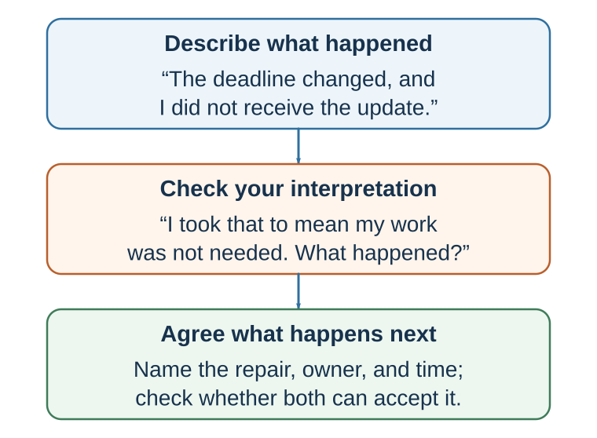

# The Art of Conversation and Repair

*Questions, layered listening, appreciation, support, disagreement, and apology*

::: {.callout-note .core-idea icon=false}
## Core Idea

Connection grows when people make attention visible, ask at the right depth, match the real conversation, separate observation from interpretation, and repair harm without hiding behind explanation.
:::

## Learning goals

- Use follow-up questions and layered listening.
- Give specific appreciation and ask for help effectively.
- Distinguish co-brooding from co-reflection.
- Use constructive disagreement and complete apology.

Good conversation is not only talking smoothly. It is mutual responsiveness.

Conversation creates connection through real-time feedback: quick replies, backchanneling, laughter, turn-taking, “yeah,” “uh-huh,” “tell me more,” and immediate adjustment. Live dialogue often creates more connection than watching or listening to a monologue because both people are shaping the interaction together.

Sacks, Schegloff, and Jefferson (1974) described the organization of turn-taking in conversation. Stivers and colleagues (2009) found that responses in conversation often occur with very short gaps across languages, though timing norms vary. Levinson (2016) argues that turn-taking is a fundamental infrastructure of human communication.

Asking questions is one of the easiest ways to build connection. Huang and colleagues (2017) found that people who ask more questions, especially follow-up questions, are better liked by conversation partners. Follow-up questions show attention because they build on what the other person has just said.

Good questions move conversation from surface to depth. A useful ladder is:

Depth does not mean forcing intimacy. It means allowing the conversation to move beyond exchange of labels into experience, meaning, and values when appropriate.

Good conversational questions include:

What was that like for you? What made that important? What surprised you? What did you learn? What are you hoping for? What is the hardest part? What would help?

Some questions are less helpful. Boomerasking turns the conversation back to oneself: “How was your trip? Mine was amazing…” Gotcha questions are designed to trap rather than understand. Repeated questions can feel like interrogation if they ignore the person’s answers. Good questions are responsive, not extractive.

Self-disclosure also builds connection. Aron and colleagues (1997) showed that structured mutual self-disclosure can create feelings of closeness between strangers. Collins and Miller’s (1994) meta-analysis found that people who disclose tend to be liked more, disclose more to people they like, and like people more after disclosing. Disclosure works when it is appropriate, reciprocal, and met with responsiveness.

People often fear that vulnerability will make them look weak. The beautiful mess effect suggests otherwise. Bruk, Scholl, and Bless (2018) found that people evaluate their own vulnerability more negatively than others’ vulnerability. What feels like a mess from the inside may look courageous, authentic, or connecting from the outside.

There is also a novelty penalty: unfamiliar stories, ideas, or experiences can be harder for others to process. People may prefer familiar topics because they require less effort. Good storytelling can overcome the novelty penalty by making unfamiliar experiences concrete, structured, and meaningful.

A practical conversational habit is:

Listen for the point of aliveness. Where does the other person become more animated, thoughtful, emotional, or specific? Ask one more question there.

Connection often begins where a person feels that their inner world has been noticed.

## Listen for the layer beneath the words

{#fig-conversation-repair fig-alt="Five-step sequence from event and private story through feeling, perspective-getting, and shared repair."}

When communication is difficult, it helps to slow down and separate layers of experience. One practical model is:

This model helps because people often argue at the “what” level while the real conflict is at the “who” level.

A manager says, “The report was late.” The employee hears, “You think I am incompetent.” A partner says, “You forgot to call.” The other hears, “You do not care about me.” A colleague says, “Can we revisit this assumption?” The presenter hears, “You are attacking my work.”

The “what” is the event. The “how” is the feeling. The “why” is the interpretation. The “who” is the identity concern. The “when” is the personal or cultural history. The “action” is what follows.

Good listening asks:

What happened? How did it feel? What story did your mind tell? What value or identity did it touch? Where might that reaction come from? What response would serve the relationship and the goal?

This model also helps with self-regulation. Before responding defensively, ask: what layer am I reacting from? Is the other person attacking me, or did my mind interpret uncertainty as threat?

Communication improves when people can name the layers rather than collapse them into accusation.

## Appreciation and kindness

People are too reluctant to be kind.

They hesitate to express gratitude, give compliments, offer support, or perform small acts of kindness because they underestimate how good these actions will make recipients feel and overestimate how awkward or inadequate they will seem.

Kumar and Epley (2018) found that people writing gratitude letters underestimated how positive and surprised recipients would feel and overestimated awkwardness. Boothby and Bohns (2021) found that compliment givers underestimated how positive recipients would feel and overestimated discomfort. Kumar and Epley (2023) found that people performing acts of kindness underestimated their positive impact on recipients. These studies converge on a simple pattern: actors focus on competence—Will my words be right? Will this be awkward? Is this enough? Recipients focus on warmth—They thought of me. They cared. That felt good.

This is a decision error. People fail to take low-cost, high-impact social actions because their forecasts are wrong.

Gratitude, compliments, and kindness also benefit the giver. Prosocial behavior can increase well-being, and expressing appreciation can strengthen the giver’s sense of social support. Public praise may also create a witnessing effect: observers who see gratitude or appreciation directed at someone else may feel warmer toward both the giver and the receiver, because public appreciation signals a relational norm.

The practical rule is:

Never stifle a sincere generous impulse.

Send the thank-you note. Give the sincere compliment. Reach out. Offer help. Notice effort. Praise specifically. Tell someone why their action mattered.

Specificity matters. “Great job” is pleasant. “Your explanation of the customer problem helped the team see what we were missing” is more connecting. A good compliment shows attention.

In organizations, appreciation is not only niceness. It is information. It tells people what matters. It reinforces values. It builds trust. It supports motivation. A culture that notices only mistakes teaches vigilance. A culture that notices effort, care, learning, and contribution teaches connection.

## Asking for help

People also underestimate others’ willingness to help.

Bohns (2016) reviews evidence that people often underestimate compliance with direct requests for help. Asking feels costly from the inside because the requester anticipates rejection, awkwardness, or burden. But helpers often experience helping as meaningful. Helping can create connection because it gives the helper a valued role.

The Benjamin Franklin effect refers to the possibility that doing someone a favor can increase liking for that person. Jecker and Landy (1969) found that participants liked a researcher more after doing him a favor. One interpretation is cognitive dissonance: if I helped this person, I must like him. More broadly, requests for help can communicate trust and create relational investment.

In Japanese, the concept of amae refers to the expectation or desire to depend on another’s benevolence in a relationship (Doi, 1973). Asking for help can be a form of relational closeness when done respectfully. It says: I trust you enough to need you.

But asking for help must preserve freedom. A request that creates obligation without room to refuse can damage connection. Good requests are clear, bounded, and respectful:

Would you be willing to look at this for ten minutes? No problem if not, but I would value your advice. Could I ask for help with one specific part? Would this be a bad time?

The lesson is not to become dependent on others for everything. It is to recognize that appropriate help-seeking can strengthen relationships, improve decisions, and reduce unnecessary isolation.

## Truth, vulnerability, and feedback

Connection also depends on truth.

Secrets can create psychological burden and isolation. Slepian and colleagues have shown that the burden of secrecy often comes not only from hiding in social interaction but from mind-wandering back to the secret (Slepian et al., 2017). Sharing a secret with a trusted person can sometimes reduce isolation and increase connection, though disclosure must be safe and appropriate.

Honesty is complicated because people often use kindness as a reason to avoid truth. White lies can protect feelings, but they can also be paternalistic or prevent learning. People often underestimate others’ desire for honest feedback, especially when the feedback would be useful. In professional contexts, avoiding necessary feedback may feel kind in the moment but unfair in the long run.

Good feedback is specific, respectful, and actionable. Avoid the “praise sandwich” if it makes praise seem like packaging for criticism. Instead:

Name the specific behavior. Explain the impact. Acknowledge context where appropriate. Invite perspective. Offer a path forward.

For example:

“In yesterday’s meeting, when you interrupted Anna twice, the discussion narrowed and she stopped contributing. I know the topic was urgent, but I want us to make space for the whole team. What was happening from your side?”

This is more useful than “You need to be more respectful” or “Great work overall, but…”

Vulnerability can support connection when it is honest and appropriately bounded. A leader who admits a mistake can make learning safer. A teacher who says, “Many people find this concept difficult at first,” can reduce shame. A colleague who shares uncertainty can invite collaboration.

But vulnerability should not be used theatrically. It should serve truth, relationship, and learning.

A useful question is:

What truth would strengthen this relationship if expressed with care?

## Support without trapping attention

When someone is distressed, many people assume the best support is to let them vent. Sometimes people do need to be heard. But mutual venting can become co-brooding or co-rumination: repeatedly discussing problems in ways that intensify negative emotion without creating insight or action (Rose, 2002).

A more helpful pattern is co-reflection: validating feelings while helping the person see the situation more clearly, broadly, or constructively.

Validation says: your feelings make sense. Co-reflection asks: what else might be true, what can be learned, what matters now, what can be done?

This distinction is important. Support that skips validation feels dismissive: “Just look on the bright side.” Support that stays only in venting can deepen helplessness. Good support combines warmth and perspective.

Research on rumination shows that repetitive negative thinking can maintain distress (Nolen-Hoeksema et al., 2008). Research on self-distancing suggests that people can gain perspective by viewing a situation from a more distant standpoint, such as imagining how they will see it later or how a wise observer might view it (Kross & Ayduk, 2011).

Practical support begins by asking what kind of support the person wants:

Do you want me to listen, help solve, distract you, or just be with you? Would advice be useful, or would you rather I simply hear you? What feels hardest right now? What would help in the next hour?

When moving from validation to reflection, use gentle questions:

What do you think this situation is teaching you? How might you see this six months from now? What would you tell a friend in this situation? What part is within your control? What meaning are you giving this event? Is there another interpretation that is also possible?

Good support does not impose insight. It invites it.

## Constructive disagreement

Connection does not mean avoiding disagreement. In fact, strong relationships and good decisions require disagreement. The question is whether disagreement destroys shared reality or deepens it.

Disagreement becomes destructive when people feel unheard, disrespected, or existentially isolated: “How can you not see what is obvious?” When people disagree about seemingly self-evident truths, they may feel that the other person inhabits a different reality. That feeling can push people toward groups that validate them and away from dialogue.

Civility matters because disrespect closes minds. A useful label is the Montagu Principle: civility costs nothing and buys everything. In heated disagreement, contempt may feel satisfying, but it reduces persuasion and damages reputation among observers. Civility does not mean weakness or false equivalence. It means preserving the conditions for thought.

Another useful label is the Tucholsky Principle: personal experience can sometimes persuade more than statistics in moral and political disagreement. This does not mean anecdotes should replace evidence. It means that stories can help others understand why an issue matters to a real person. A statistic may show scale; a personal experience may open the door to empathy.

Moral reframing is also useful. Feinberg and Willer (2015) found that political arguments can be more persuasive when framed in terms of the audience’s moral values rather than the speaker’s. If someone values loyalty, authority, liberty, care, fairness, or purity differently than you do, repeating only your own moral language may fail. Translation is not manipulation when it is truthful; it is respect for the listener’s moral world.

Constructive disagreement requires several habits:

Show that you want to understand before trying to be understood. Reflect the other person’s argument in a form they accept. Ask what value they are protecting. Share personal experience without treating it as universal proof. Use evidence, but do not use evidence as a weapon. Avoid contempt. Translate into the other person’s moral language when possible. Look for the concern beneath the position.

A useful disagreement question is:

What would make an intelligent, decent person see it this way?

This question does not force agreement. It restores complexity.

## Apology and repair

Connection is tested when harm occurs.

A good apology repairs moral meaning. It tells the harmed person: I see what happened. I understand why it hurt. I accept responsibility. I still value you or the relationship. I will try to repair or prevent the harm.

Apologies often help, but they work best when they are specific, responsible, empathic, reparative, and followed by changed behavior. Lewicki, Polin, and Lount (2016) identify several components of effective apologies: expression of regret, explanation, acknowledgment of responsibility, declaration of repentance, offer of repair, and request for forgiveness. Acknowledging responsibility and offering repair are especially important.

A weak apology says:

“I’m sorry if you were offended.”

A stronger apology says:

“I interrupted you twice in the meeting. That was disrespectful and it made it harder for you to contribute. I am sorry. In the next meeting, I will make sure you have space to finish your point, and I will also acknowledge this to the team.”

Apologies are hard because offenders focus on shame, blame, and loss of face. Victims often focus on whether the offender understands the harm and will repair it. The offender asks, “Will I look bad?” The harmed person asks, “Do they get it?”

Forgiveness is related but distinct. Forgiveness does not mean excusing, forgetting, or eliminating accountability. It means releasing the desire for revenge and moving toward a different relationship with the harm. Worthington’s REACH model is one structured approach: recall the hurt, empathize, offer an altruistic gift of forgiveness, commit, and hold onto forgiveness (Worthington, 2006). Forgiveness is associated with better mental and physical health in many studies, though it should not be demanded from victims or used to pressure people to remain in harmful relationships (Toussaint et al., 2015).

Repair often requires psychological distance. In conflict, people become trapped in immediate emotion. Asking how one will view the event in six months, how a neutral third party would describe it, or what larger pattern is at stake can restore perspective.

A useful apology checklist:

Name the harm. Take responsibility. Express remorse and empathy. Explain without excusing. Repair if possible. Commit to change. Allow the harmed person to respond. Do not demand immediate forgiveness.

Repair is not a speech. It is a process.

## Sharing success

People also struggle to communicate success.

Self-praise can trigger envy, status threat, or dislike, especially when it involves direct comparison: “I did better than others.” False modesty can also backfire because it feels insincere. Humblebragging often makes people less likable than straightforward boasting because it combines self-promotion with complaint or fake modesty (Sezer et al., 2018).

Yet hiding success can also reduce connection. When people share joy, achievement, or pride appropriately, they allow others to participate in what some writers call cofelicity: shared happiness in another’s good fortune. Gable and colleagues’ work on capitalization shows that sharing positive events and receiving active constructive responses improves relationship quality (Gable et al., 2004).

The skill is to share success without turning it into hierarchy.

Good success-sharing is accurate, appreciative, and relational:

State the achievement without exaggeration. Acknowledge help and luck where relevant. Share what it means to you. Avoid direct comparison. Invite the other person into the joy rather than using success to dominate.

For example:

“I’m really happy—the paper was accepted. I was nervous about it because the review process was difficult. Your feedback helped me clarify the argument.”

This communicates success, gratitude, vulnerability, and shared reality.

Connection is damaged when success becomes status display. It grows when success becomes shared meaning.

## Connection as decision infrastructure

Communication and connection may sound softer than probability, risk, game theory, or negotiation strategy. But they are infrastructure for good decisions.

A team without connection hides information. A leader without trust receives performance theater. A doctor without rapport misses patient concerns. A teacher without responsiveness misses confusion. A negotiator without listening misses value creation. A family without repair repeats the same conflict. An organization without psychological safety learns too late.

Connection improves information flow. It lowers defensiveness. It makes uncertainty speakable. It allows people to share weak signals before they become crises. It makes disagreement less threatening. It supports cooperation, learning, and repair.

This does not mean connection replaces analysis. Warmth without rigor can produce avoidance and groupthink. Teams need both trust and standards. Leaders need both empathy and clarity. Negotiators need both relationship and preparation. Doctors need both compassion and evidence. Teachers need both care and intellectual challenge.

The best communication supports better decision-making by combining:

Clarity: What are we saying? Listening: What are we missing? Grounding: Do we understand the same thing? Responsiveness: Does the other person feel understood? Shared reality: Do we experience the issue together? Trust: Can truth be spoken? Repair: Can rupture be addressed? Action: What follows from this conversation?

The next part of the book turns to negotiation. Negotiation is a joint decision process under conflict, interdependence, and incomplete information. It requires rational analysis, strategic thinking, persuasion, storytelling, and—above all—communication. The best negotiators are not merely tough talkers. They are disciplined listeners, meaning-makers, trust managers, and designers of conversation.

| Level | Example Question |
| --- | --- |
| Surface | What are you working on? |
| Experience | What has been most challenging? |
| Meaning | Why does this matter to you? |
| Identity | What kind of person do you want to become? |
| Future | What would meaningful progress look like? |
: A question ladder {#tbl-29-1}

| Layer | Meaning | Question |
| --- | --- | --- |
| What | Perceived situation, event, issue, task, or context | What is happening? |
| How | Bodily feeling, emotion, affect, impulse, anticipated feeling | How does it land in me? |
| Why | Interpretation, appraisal, attribution, perceived intent, prediction | Why did I feel that way? |
| Who | Value, need, identity, dignity, status, belonging, competence, autonomy | What self-relevant concern is touched? |
| When | History, habit, culture, prior experience, learned expectation | Where did I learn to see or feel it this way? |
| Action | Automatic reaction or mindful response | What do I do next? |
: Listening beneath the surface {#tbl-29-2}

## Key ideas

- Connection grows when people make attention visible, ask at the right depth, match the real conversation, separate observation from interpretation, and repair harm without hiding behind explanation.
- Use follow-up questions and layered listening.
- Give specific appreciation and ask for help effectively.
- Distinguish co-brooding from co-reflection.

## Study and practice

1. How would you use follow-up questions and layered listening in practice?

2. Give specific appreciation and ask for help effectively?

3. How would you distinguish co-brooding from co-reflection?

::: {.callout-tip .activity icon=false}
## Activity

Practice a question ladder with a partner: fact, experience, meaning, identity, and future. Paraphrase before moving deeper. End by asking what the partner wants from the conversation now.  
EXPERIENCE - EXPLAIN - APPLY (MAXIMUM 120 WORDS)  
Experience: describe one specific decision, interaction, or observation. Explain: use one or two concepts from this chapter accurately. Apply: state one improvement, implication, or testable prediction.
:::

## References cited in this chapter

::: {.reference}
Bohns, V. K. (2016). Underestimating our influence over others. Current Directions in Psychological Science, 25(2), 119–123.
:::

::: {.reference}
Boothby, E. J., & Bohns, V. K. (2021). Why a simple act of kindness is not as simple as it seems: Underestimating the positive impact of our compliments on others. Personality and Social Psychology Bulletin, 47(5), 826–840.
:::

::: {.reference}
Bruk, A., Scholl, S. G., & Bless, H. (2018). Beautiful mess effect: Self–other differences in evaluation of showing vulnerability. Journal of Personality and Social Psychology, 115(2), 192–205.
:::

::: {.reference}
Collins, N. L., & Miller, L. C. (1994). Self-disclosure and liking: A meta-analytic review. Psychological Bulletin, 116(3), 457–475.
:::

::: {.reference}
Doi, T. (1973). The anatomy of dependence. Kodansha International.
:::

::: {.reference}
Feinberg, M., & Willer, R. (2015). From gulf to bridge: When do moral arguments facilitate political influence? Personality and Social Psychology Bulletin, 41(12), 1665–1681.
:::

::: {.reference}
Gable, S. L., Reis, H. T., Impett, E. A., & Asher, E. R. (2004). What do you do when things go right? The intrapersonal and interpersonal benefits of sharing positive events. Journal of Personality and Social Psychology, 87(2), 228–245.
:::

::: {.reference}
Jecker, J., & Landy, D. (1969). Liking a person as a function of doing him a favour. Human Relations, 22(4), 371–378.
:::

::: {.reference}
Kross, E., & Ayduk, O. (2011). Making meaning out of negative experiences by self-distancing. Current Directions in Psychological Science, 20(3), 187–191.
:::

::: {.reference}
Kumar, A., & Epley, N. (2018). Undervaluing gratitude: Expressers misunderstand the consequences of showing appreciation. Psychological Science, 29(9), 1423–1435.
:::

::: {.reference}
Kumar, A., & Epley, N. (2023). A little good goes an unexpectedly long way: Underestimating the positive impact of kindness on recipients. Journal of Experimental Psychology: General, 152(1), 236–252.
:::

::: {.reference}
Levinson, S. C. (2016). Turn-taking in human communication—Origins and implications for language processing. Trends in Cognitive Sciences, 20(1), 6–14.
:::

::: {.reference}
Lewicki, R. J., Polin, B., & Lount, R. B., Jr. (2016). An exploration of the structure of effective apologies. Negotiation and Conflict Management Research, 9(2), 177–196.
:::

::: {.reference}
Nolen-Hoeksema, S., Wisco, B. E., & Lyubomirsky, S. (2008). Rethinking rumination. Perspectives on Psychological Science, 3(5), 400–424.
:::

::: {.reference}
Rose, A. J. (2002). Co-rumination in the friendships of girls and boys. Child Development, 73(6), 1830–1843.
:::

::: {.reference}
Sacks, H., Schegloff, E. A., & Jefferson, G. (1974). A simplest systematics for the organization of turn-taking for conversation. Language, 50(4), 696–735.
:::

::: {.reference}
Sezer, O., Gino, F., & Norton, M. I. (2018). Humblebragging: A distinct—and ineffective—self-presentation strategy. Journal of Personality and Social Psychology, 114(1), 52–74.
:::

::: {.reference}
Slepian, M. L., Chun, J. S., & Mason, M. F. (2017). The experience of secrecy. Journal of Personality and Social Psychology, 113(1), 1–33.
:::

::: {.reference}
Toussaint, L., Worthington, E. L., Jr., & Williams, D. R. (Eds.). (2015). Forgiveness and health: Scientific evidence and theories relating forgiveness to better health. Springer.
:::

::: {.reference}
Worthington, E. L., Jr. (2006). Forgiveness and reconciliation: Theory and application. Routledge.
:::
