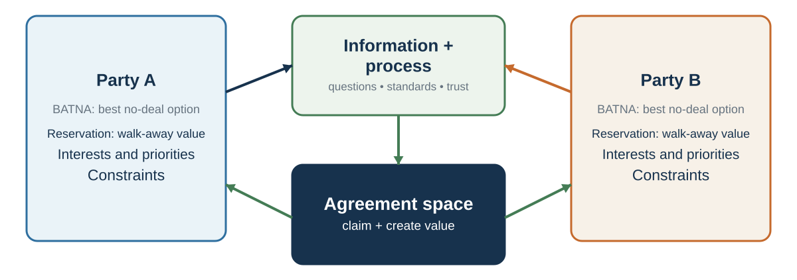

# Negotiation: Winning Is Not the Same as Succeeding

*Interdependence turns choice into a shared search*

::: {.callout-note .core-idea icon=false}
## Core Idea

Negotiation begins when parties need one another but do not want exactly the same thing. A wise agreement must beat each party's alternative, manage conflict, and exploit compatibility that positions can hide.
:::

## Learning goals

- Define negotiation and distinguish it from persuasion, compromise, and bargaining.
- Separate positions, interests, issues, and options.
- Explain value claiming and value creation.
- Analyze fairness, relationship, culture, ethics, and implementation.

## Start with the word *negotiation*

Before reading further, write down three words that come to mind when you hear *negotiation*. Then add one recent example from work, study, family life, or a purchase. Was your first image a contest, a compromise, a conversation, or a design problem? That first image matters because it quietly determines what you attend to.

Negotiation research gives us reason not to trust intuition alone. In the laboratory tasks synthesized for this course, fewer than 4% of participants reached the best available joint outcome, about one fifth selected a lose--lose agreement, and roughly half missed agreement despite compatible interests. These are results from particular experimental tasks, not universal failure rates. Their teaching value is diagnostic: negotiators can reach a deal and still miss what was possible (Thompson & Hrebec, 1996; Thompson et al., 2010).

::: {.callout-tip .activity icon=false}
## Winning or succeeding?

Choose privately before discussing:

| Choice | Your payoff | Rival's payoff |
| --- | ---: | ---: |
| Low Road | $40 million | $20 million |
| High Road | $80 million | $160 million |

Only your choice determines these payoffs. Which road do you take, and why? The Low Road wins the comparison; the High Road doubles your own return. Research on competitor-oriented objectives similarly warns that relative victory can distract managers from their own performance (Armstrong & Collopy, 1996).

Now try a one-minute thumb-wrestling round in pairs, scoring one point for every pin. Most pairs immediately compete. A pair that notices the scoring rule can cooperate and generate many points for both. The exercise is a metaphor, not a prescription: some value really is distributive, but rivalry should not prevent a search for compatible gains.
:::

::: {.callout-tip icon=false}
## Watch and diagnose: can both sides improve?

Watch this short [*Just Go with It* negotiation example](https://youtu.be/898OUCyBulM). Record (1) each side's stated position, (2) what each side appears to value, (3) any value created, and (4) any relationship cost. The link is provided for analysis; no film frame is reproduced here.
:::

The rational choice model asks how one decision-maker should choose among alternatives. Negotiation asks how multiple decision-makers can choose together when their outcomes depend on one another.

This makes negotiation different from ordinary individual choice. In individual choice, I compare options and choose. In negotiation, my best option depends on what you will accept, and your best option depends on what I will accept. My words change your beliefs. Your reactions change my strategy. My offer is both an option and a signal. Your silence may mean refusal, calculation, anger, respect, or uncertainty. Negotiation is strategic, social, and interpretive.

Negotiation also differs from pure strategic interaction because the parties communicate. In many games, players choose actions without discussion. In negotiation, communication is part of the process. Parties can ask questions, reveal information, make offers, explain constraints, frame standards, tell stories, signal priorities, build trust, threaten, promise, mislead, apologize, and repair.

Communication and persuasion therefore do different jobs. Communication helps the parties discover the agreement space; persuasion helps another person willingly accept a proposal. A frequent error is to start influencing before learning. Negotiation is an information game as well as an argument (Thompson et al., 2010).

That is why negotiation draws on many parts of this book. It requires rational analysis, because parties must know their alternatives and reservation values. It requires probability judgment, because parties estimate what the other side will accept. It requires valuation, because parties compare money, time, risk, status, fairness, relationship, and future opportunities. It requires social decision-making, because fairness, reciprocity, trust, face, and norms matter. It requires communication, because parties must understand one another well enough to identify possible agreements. It requires persuasion, because parties must help others see why an agreement is legitimate and valuable. It requires self-control, because emotions can derail the process.

Negotiation is therefore a capstone topic. It is where decision-making becomes interpersonal.

A useful way to understand negotiation is as a loop:

Information is exchanged. Each party interprets the other’s interests, constraints, intentions, and alternatives. Each party evaluates possible agreements. Offers and counteroffers are made. Reactions create feedback. Beliefs and expectations update. The parties either reach agreement, continue searching, or walk away.

This loop is often imperfect. Parties hide information. They misread each other. They anchor too strongly. They become defensive. They confuse positions with interests. They escalate commitment. They reject fair offers because of pride. They accept bad deals because of pressure. They leave value on the table because they fail to ask the right questions.

Good negotiation begins by making the structure visible.

## What negotiation is not

{#fig-negotiation-architecture fig-alt="Party A and Party B feed information and process into an agreement space where value is claimed and created."}

Negotiation is often misunderstood. These misunderstandings lead to poor preparation and poor outcomes.

Negotiation is a joint decision process in which communication, alternatives, beliefs, preferences, and strategic interdependence jointly determine the agreement set (Raiffa, 1982; Lax & Sebenius, 1986; Thompson, 2015).

The first myth is that negotiation is mainly about being tough. Toughness can matter in some distributive situations, especially when the main issue is price and each side wants a larger share. But toughness alone can destroy value. A negotiator who is only tough may win on price while damaging relationship, missing hidden interests, or provoking retaliation. A better negotiator is firm on interests and disciplined about process.

The second myth is that negotiation is mainly about compromise. Compromise means each side gives something up. Sometimes compromise is necessary. But compromise is not the highest form of negotiation. If one party values delivery speed more and the other values price more, they may be able to trade across issues and make both better off. If they simply split the difference, they may miss value.

The third myth is that negotiation is a fixed-pie contest. In many negotiations, some value must be divided. But there may also be value to create through differences in preferences, beliefs, risk tolerance, time horizons, capabilities, and constraints. The fixed-pie assumption makes people focus too narrowly on claiming value and too little on discovering value.

The fourth myth is that good negotiators are natural. Some people are socially fluent or confident, but negotiation skill depends heavily on preparation, structure, listening, information management, and learning. Confidence without preparation can be dangerous.

The fifth myth is that negotiation is mostly talking. In fact, much of negotiation is listening, asking, diagnosing, preparing, and designing options. A negotiator who talks constantly may reveal strength or insecurity, but they may learn little.

The sixth myth is that negotiation begins at the table. It begins before the table: in preparation, alternative development, coalition-building, stakeholder alignment, information gathering, standard setting, and deciding who should be involved.

The seventh myth is that negotiation ends when agreement is reached. In many settings, implementation matters more than signing. A bad implementation process can destroy a good deal. A good negotiation considers future cooperation, monitoring, trust, dispute resolution, and adaptation.

These myths share one problem: they treat negotiation as performance. Better negotiation treats it as decision design.

A useful corrective is:

Do not ask only, “How do I get them to say yes?” Ask, “What agreement would make sense, compared with each party’s alternatives, and how can we discover whether such an agreement exists?”

| Myth | Hidden cost | Replacement question |
| --- | --- | --- |
| “Good negotiators are tough.” | Toughness can destroy information and value. | What process protects interests and learning? |
| “Success means reaching agreement.” | A deal can be worse than the BATNA. | Is this agreement better than our best alternative? |
| “Compromise is the ideal.” | Splitting positions can miss compatible interests. | What do the parties value differently? |
| “Negotiation begins at the table.” | Alternatives, stakeholders, and standards are left undeveloped. | What can be improved before the conversation? |
| “Signing ends the negotiation.” | Implementation and adaptation are ignored. | How will the agreement be governed, reviewed, and repaired? |
: Negotiation myths and replacement questions {#tbl-30-1}

### What skilled practice looks like

An early field study compared negotiators identified as skilled with an average comparison group. The skilled group asked more questions, entered fewer defend--attack spirals, offered fewer separate reasons per proposal, and spent more planning time identifying possible common ground (Rackham & Carlisle, 1978).

| Observed behavior | Average group | Skilled group | Practical interpretation |
| --- | ---: | ---: | --- |
| Possible common ground identified in planning | 11% | 38% | Search for overlap before defending a position. |
| Reasons attached to each proposal | 3.0 | 1.8 | Use the strongest reasons rather than an easy-to-attack bundle. |
| Defend--attack spirals | 6.3% | 1.9% | Diagnose disagreement instead of escalating it. |
| Questions among observed verbal behaviors | 9.6% | 21.3% | Learn before trying to influence. |
: Behaviors observed in one classic field study of negotiators {#tbl-30-2}

The study is old, observational, and based on a particular definition of effectiveness; its percentages are not timeless targets. The more durable teaching move is to convert each comparison into a testable behavior: prepare common ground, ask diagnostic questions, make reasons selective, and interrupt defend--attack cycles.

## Positions, interests, and issues

One of the most important distinctions in negotiation is the difference between positions and interests.

A position is what a party says it wants.

“I want €70,000.” “We need delivery by June 1.” “I will not accept a noncompete clause.” “We want 40% equity.” “I need the office on Fridays.” “We require exclusivity.”

An interest is why the party wants it.

The job candidate may want €70,000 because of living costs, status, fairness, competing offers, debt, or future salary trajectory. The buyer may want delivery by June 1 because a production line depends on it. The employee may reject a noncompete because it threatens career mobility. The investor may want equity because of risk exposure and control. The parent may want Fridays in the office because of childcare. The supplier may want exclusivity because it justifies investment.

Positions often conflict. Interests may be more compatible.

Fisher, Ury, and Patton (2011) popularized the idea of focusing on interests rather than positions. This does not mean positions are irrelevant. Positions are important signals. But if negotiators stop at positions, they may miss the underlying reasons that allow creative agreement.

Consider two departments negotiating over a shared data analyst. Both say they need the analyst full time. Their positions conflict. But one department needs help with a quarterly report for two intense weeks each quarter; the other needs ongoing weekly dashboard maintenance. The underlying interests may allow a schedule that satisfies both.

Consider a job negotiation. The candidate asks for higher salary. The employer cannot raise salary due to internal equity constraints. If both remain fixed on salary, negotiation stalls. But if the candidate’s interests include learning, flexibility, relocation support, title, bonus, conference travel, or earlier review, there may be other ways to create value.

An issue is a negotiable dimension. Salary is an issue. Start date is an issue. Delivery time is an issue. Warranty is an issue. Payment schedule is an issue. Scope of work is an issue. Confidentiality is an issue. Relationship governance is an issue.

Single-issue negotiations are often distributive: more for one side means less for the other. Multi-issue negotiations create more possibilities because parties may value issues differently. Value creation often begins by adding issues to the table.

A useful preparation question is:

What are they asking for, and what interest might that position be trying to protect?

Another is:

What issues could be added so that we are not negotiating only over one dimension?

The difference between position and interest is the difference between arguing over demands and understanding value.

## Claiming and creating value

Negotiation has two fundamental tasks: claiming value and creating value.

Value claiming means obtaining a favorable share of existing value. If one issue is fixed, such as price, more for one side usually means less for the other. This is distributive negotiation. The central question is: how is value divided?

Value creation means finding ways to increase total value. This is integrative negotiation. The central question is: how can the parties structure agreement so that both are better off than they would be under a simple compromise?

Both tasks matter.

If negotiators focus only on claiming value, they may become defensive, hide information, and miss opportunities. If they focus only on creating value, they may reveal too much, fail to protect their interests, and be exploited. Skilled negotiators do both: they look for value to create while preparing to claim a fair share.

The tension is known as the negotiator’s dilemma (Lax & Sebenius, 1986). To create value, parties often need to share information about interests, priorities, constraints, and preferences. But sharing information can make one vulnerable. If I reveal that delivery date matters more than price, you might exploit that information. If you reveal that you have no good alternative, I might push harder.

Trust can help, but trust is rarely complete. Institutions, reputation, contracts, staged disclosure, objective standards, and reciprocal information sharing can reduce the risk.

One way to create value is to identify differences. Differences are not obstacles; they are raw material.

If one side cares more about timing and the other about price, trade timing for price. If one side is more risk tolerant, allocate risk accordingly. If one side has lower cost of providing a service, include it. If one side cares more about public recognition, trade recognition for money. If one side values future business, use contingent agreements. If parties disagree about future outcomes, create a contract contingent on what happens.

Value creation often begins with asking:

What do we value differently? What risks can each side best bear? What costs are low for one side but valuable to the other? What future events could determine payment or performance? What issues are missing from the table? What would make this agreement easier for them to accept without costing us much?

The next two chapters develop value claiming; the following two develop value creation and advanced agreement design. This chapter’s purpose is to show that negotiation always contains both possibilities. A negotiation is not purely a fight or purely a collaboration. It is a mixed-motive process.

## Information is currency and risk

Information is the lifeblood of negotiation.

Without information, parties cannot know whether agreement is possible. They cannot identify interests, estimate reservation values, create options, or justify proposals. But information is also risky. Revealing too much can weaken a party’s position.

This is why negotiation is partly an information design problem.

Some information is generally useful to reveal: interests, priorities, standards of fairness, constraints that explain positions, implementation concerns, and low-cost/high-value trades. Other information is often dangerous to reveal too early: weak BATNAs, desperation, exact reservation values, internal divisions, or constraints that could be exploited.

But hiding everything is also costly. If neither side reveals anything, negotiation becomes positional bargaining. Parties exchange demands, make small concessions, and may miss better agreements.

A skilled negotiator learns to ask good questions and reveal selectively.

Good questions include:

What is most important to you in this agreement? What makes that issue important? What constraints are you working under? If we could solve one problem first, what should it be? How would this agreement be evaluated by your stakeholders? What concerns would prevent you from accepting? Are there issues where flexibility is easier for you? What would make implementation successful?

Good information sharing often begins with interests rather than reservation values. For example:

“Delivery timing is especially important because our production schedule depends on it.” “Our budget is constrained this year, but we may have flexibility on contract length.” “We care about public recognition because the project must show community impact.” “We need predictability more than the lowest possible price.”

Such statements reveal value-relevant information without surrendering the whole bargaining position.

Information must also be interpreted carefully. Parties may misrepresent, exaggerate, or strategically frame their constraints. They may also misunderstand their own interests. A negotiator may say price is the only issue, but after discussion, risk, timing, face, or internal approval may matter more.

Listening is therefore a negotiation skill. Not passive listening, but diagnostic listening. What is the other side repeating? Where do they become emotional? What constraint do they hint at? What stakeholder do they mention? What issue do they avoid? What would make their position make sense?

A useful rule is:

Reveal enough to make value creation possible, but not so much that you cannot protect value.

This balance is difficult, and it is why negotiation requires judgment.

## Fairness and objective standards

Negotiation is not only about power and alternatives. It is also about legitimacy.

People care whether an agreement feels fair. They care about procedure, respect, reciprocity, precedent, market value, need, contribution, equality, equity, and rights. A materially acceptable offer can be rejected if it feels insulting or illegitimate. A difficult concession can be accepted if it is justified by a fair standard.

Objective standards help. Fisher, Ury, and Patton (2011) recommend using objective criteria: market prices, expert opinions, legal standards, industry norms, scientific evidence, precedent, cost data, or professional benchmarks. Standards reduce the sense that negotiation is merely a battle of wills.

For example:

Salary can be discussed using market data and internal equity. A supplier price can be discussed using cost indices and quality benchmarks. A deadline can be discussed using production schedules and dependency maps. A licensing fee can be discussed using comparable agreements. A workload issue can be discussed using hours, staffing ratios, and service standards.

Objective standards do not eliminate conflict. Parties may disagree about which standard is relevant. A candidate may cite external market salary; an employer may cite internal equity. A supplier may cite cost inflation; a buyer may cite competitor prices. But standards improve the conversation because they shift from “because I want it” to “because this standard supports it.”

Fairness is also psychological. People compare offers with reference points. They ask whether they are being respected. They evaluate whether concessions are reciprocal. They notice whether procedures are transparent. They care whether the other side listens.

Procedural justice research shows that people are more likely to accept outcomes, even unfavorable ones, when the process is perceived as fair, respectful, and unbiased (Lind & Tyler, 1988; Tyler, 1990). In negotiation, process matters because it shapes legitimacy.

A party may accept less favorable terms if they believe the process was honest and constraints were real. A party may reject objectively reasonable terms if they believe the process was disrespectful or manipulative.

A useful preparation question is:

What standard would make our proposal look legitimate to a reasonable outsider?

Another is:

What standard will the other side think is fair?

Good negotiators do not rely only on pressure. They build legitimacy.

## Emotion, face, and relationship

Negotiation is emotionally charged because it touches value, uncertainty, conflict, status, identity, and trust.

People may feel fear of losing, anger at unfairness, pride in standing firm, anxiety about being exploited, shame about needing agreement, excitement about opportunity, or regret about concessions. These emotions shape attention and action.

Anger can sometimes extract concessions, but it can also damage trust, reduce creativity, and provoke retaliation. Van Kleef and colleagues found that expressions of anger in negotiation can sometimes lead opponents to concede, especially when they see the anger as legitimate and have low power, but anger can backfire when perceived as inappropriate or manipulative (Van Kleef et al., 2004). Emotions are strategic signals, but they are also relational events.

Face matters. As the earlier culture chapter explained, face is the public image of social worth people maintain in interaction. A proposal can threaten face if it implies incompetence, weakness, low status, or disrespect. A negotiator may reject a financially reasonable offer because accepting it would humiliate them before their team. Another may resist apology because apology feels like loss of face. A concession may need to be framed so the other side can accept it with dignity.

Relationship also matters. Some negotiations are one-time transactions. Others occur inside ongoing relationships: employment, partnerships, supply chains, universities, families, professional networks, diplomacy. In ongoing relationships, the agreement is not the only outcome. Trust, reputation, commitment, and future cooperation matter.

A hard bargain may create short-term gain but long-term cost. A generous concession may build goodwill but set problematic precedent. A tough conversation may damage relationship if handled disrespectfully, but strengthen it if handled with clarity and care.

Negotiation should therefore distinguish between economic value and relational value. Economic value concerns money, time, risk, resources, and material outcomes. Relational value concerns trust, respect, reputation, future cooperation, and dignity. Good agreements often protect both.

A useful question is:

What will this agreement do to the relationship that must implement it?

If the relationship must continue, the answer matters.

## Culture without stereotypes

Negotiation is culturally embedded. Culture shapes what counts as respect, directness, fairness, relationship, authority, time, silence, agreement, and commitment.

In some contexts, parties expect to build relationship before discussing terms. In others, moving quickly to substance is seen as efficient. In some contexts, direct disagreement is valued. In others, disagreement is expressed indirectly to preserve face. In some contexts, a signed contract is the core commitment. In others, the relationship and ongoing adjustment matter as much as the document. In some contexts, the negotiator has full authority. In others, decisions require consultation with absent stakeholders.

Cultural differences are not only national. Professional, organizational, regional, class, gender, and generational cultures all shape negotiation. A lawyer, engineer, entrepreneur, doctor, diplomat, academic, and procurement manager may bring different negotiation scripts.

Culture should not be reduced to stereotype. The goal is not to assume “they negotiate this way.” The goal is to ask better questions.

What process do they expect? Who needs to be consulted? How direct should disagreement be? What does silence mean? How is respect shown? What role does hierarchy play? What makes an agreement legitimate? How are changes handled after agreement? What would cause loss of face? What does trust require?

Cross-cultural negotiation requires metacommunication: discussing how the negotiation itself should proceed. Parties can reduce misunderstanding by explicitly agreeing on agenda, decision authority, timeline, communication norms, confidentiality, and follow-up process.

This is especially important when one side interprets behavior through its own cultural script. A direct “no” may seem rude to one side and efficient to another. An indirect response may seem evasive to one side and respectful to another. Silence may be thoughtfulness, disagreement, hierarchy, or strategic withholding. Without checking, parties fill ambiguity with their own assumptions.

A useful rule is:

Treat cultural interpretation as a hypothesis, not a conclusion.

Ask, observe, and adapt.

### Culture can shape attention without defining a person

Culture is learned through institutions, language, livelihoods, relationships, and repeated practices. Research has reported average contrasts between analytic attention to focal objects and holistic attention to relationships and context, as well as differences in comfort with contradiction or change (Nisbett et al., 2001; Peng & Nisbett, 1999). In one laboratory task, people showed greater attentional-control activity when following the rule that was less familiar in their cultural setting. That finding concerns effort in a specific task; it does not establish permanent “Eastern” and “Western” brain types (Hedden et al., 2008).

Historical-ecology accounts offer another level of hypothesis. Studies within China have associated rice-growing regions, where irrigation historically required coordination, with more interdependent patterns than wheat-growing regions; a field study also examined whether customers moved obstructing chairs in cafés (Talhelm et al., 2014, 2018). Work on cultures of honor similarly connects some regional norms to histories of vulnerable herding livelihoods (Cohen et al., 1996). These designs cannot turn ecology into destiny. Migration, selection, institutions, urbanization, and many other explanations matter, and a regional average says little about a particular counterpart.

Country indices such as individualism and power distance are even more vulnerable to the ecological fallacy: a country-level mean cannot tell us an individual's preference, authority, or communication style (Hofstede, 2001; Taras et al., 2010). Use every framework to generate a question, never to answer the question in advance.

| Cultural hypothesis worth checking | Question for the actual counterpart |
| --- | --- |
| Disagreement may be direct or softened with “downgraders.” | “How would you prefer us to signal concerns or say no?” |
| Emotion may communicate sincerity in one setting and loss of control in another. | “If a discussion becomes intense, should we pause, continue, or involve someone else?” |
| Trust may begin with competence and reliability or with personal relationship. | “What would make us credible enough to exchange sensitive information?” |
| “Yes” may mean agreement, understanding, politeness, or permission to continue. | “What exactly have we agreed, and what remains provisional?” |
| Authority may sit at the table or with absent stakeholders. | “Who must be consulted, and who can make the final commitment?” |
| A contract may be treated as a final specification or a framework for adjustment. | “How should we handle change, review, and dispute after signing?” |
: Convert cultural contrasts into process questions {#tbl-30-3}

Cross-cultural studies do find differences in sequences of offers, information exchange, and trust-building, but outcomes depend on the combination of parties and the process they construct together (Adair et al., 2001; Brett et al., 1998; Gunia et al., 2011). The unit of diagnosis is the interaction, not a passport.

## Ethics beyond getting away with it

Negotiation raises ethical questions because parties have incentives to shape information, expectations, and pressure.

Is bluffing acceptable? Can I exaggerate my alternatives? Can I hide my reservation value? Can I misrepresent demand? Can I imply I have authority I do not have? Can I use a fake deadline? Can I exploit the other side’s mistake? Can I make a threat I do not intend to carry out? Can I conceal information that would affect their decision?

Ethical standards vary across cultures, professions, and contexts, but some distinctions are useful.

It is generally acceptable not to reveal your reservation value. Negotiation does not require full transparency. It is generally acceptable to present your interests persuasively, open ambitiously, and ask for favorable terms. It is not acceptable to commit fraud, forge documents, make promises you do not intend to keep, or lie about material facts where the other side is entitled to truth.

Between clear honesty and clear fraud lies a gray zone: bluffing, selective disclosure, strategic ambiguity, emotional display, and framing. Negotiators often rationalize questionable behavior by saying “it is just negotiation.” The chapter on the narrator after choice warned that ethical fading occurs when moral dimensions disappear behind strategic language.

One framework distinguishes between positions, intentions, facts, and promises. You may be strategic about positions. You should be careful with factual claims. You should not make promises you do not intend to honor. You should not deliberately create false beliefs about material facts that define the agreement.

Ethical negotiation is not naïve. It protects one’s interests. But it also recognizes that deception can destroy trust, reputation, implementation, and self-respect. In repeated or networked environments, reputation is a long-term asset.

Negotiation ethics also involves power. A tactic that seems acceptable between sophisticated parties may be exploitative when used against someone inexperienced, vulnerable, or lacking alternatives. High-pressure tactics, hidden terms, artificial scarcity, and complex contracts can undermine genuine consent.

A useful ethical test is:

Would I be comfortable if my negotiation behavior became known to the people whose respect matters to me?

Another is:

Would this tactic still seem acceptable if used against me by a more powerful party?

Ethics is not separate from negotiation skill. In many relationships, trustworthiness is skill.

## Deception: create diagnostic information instead of reading “tells”

Negotiators naturally look for averted eyes, fidgeting, pauses, or facial “leakage.” Those cues are much less diagnostic than popular culture suggests. Across many studies, unaided truth--lie judgments averaged only about 54% correct, just above chance, with accuracy depending on the task, base rates, and what information observers could access (Bond & DePaulo, 2006). Suspicion can make matters worse by turning ambiguous behavior into confirming evidence. Polygraph evidence likewise does not justify treating the machine as a general-purpose truth test (National Research Council, 2003).

::: {.callout-tip icon=false}
## Watch, predict, then audit your evidence

Before discussion, watch this [well-known Clinton clip](https://youtu.be/VBe_guezGGc). Record a private truthfulness judgment and confidence from 0--100. Then list the observable evidence you actually used and one innocent alternative explanation for every supposed “tell.” The historical fame of a clip does not validate a universal cue, and a confident judgment is not the same as verified ground truth.
:::

A better approach is to elicit information that can later be checked. The **Asymmetric Information Management (AIM)** technique tells an interviewee that detailed information makes an account easier to assess. In initial controlled studies, that instruction encouraged truth tellers to provide more detail while people fabricating accounts often withheld detail (Porter et al., 2020). AIM is an elicitation protocol, not a universal lie detector. Sparse accounts also arise from anxiety, trauma, memory failure, language differences, privacy, and lack of knowledge. Physiological or video-based proposals, including polygraph and transdermal optical methods, require their own validation and should not replace corroboration.

In ordinary negotiation, the transferable practice is simple:

1. Ask open questions before narrow accusations.
2. Request verifiable detail: dates, documents, decision authority, dependencies, and observable criteria.
3. Check claims against independent evidence and update both toward and away from suspicion.
4. Protect truthful privacy. A person may decline to reveal salary history, competing offers, or a reservation value without lying.

An ethical boundary can be direct: “I do not disclose other employers' offers, but I can explain the range that would make this role attractive,” or “I cannot share our walk-away point; what I can share is the cost basis for this proposal.” Refusing, reframing, or answering with a diagnostic question preserves private information without manufacturing a false fact.

## The negotiator's mind

Negotiators are human decision-makers. They bring biases and emotions to the table.

Anchoring matters. First offers can shape the bargaining range. Overconfidence matters. Negotiators often overestimate their alternatives or the strength of their case. Self-serving bias matters. Each side thinks its view of fairness is more objective than it is. Loss aversion matters. Concessions feel like losses. Reactive devaluation matters. A proposal may seem less attractive simply because it comes from the other side (Ross, 1995). Fixed-pie bias matters. Negotiators often assume interests are more opposed than they are (Thompson & Hastie, 1990).

The fixed-pie bias is especially important. Thompson and Hastie found that negotiators often assume that the other side’s interests are directly opposed to their own, even when compatible or tradeable interests exist. This bias leads parties to miss integrative potential.

Reactive devaluation is also common. If the other side proposes an idea, we may suspect it benefits them and therefore undervalue it. This can prevent agreement even when the proposal is objectively good.

Emotions can also narrow attention. Anger focuses on blame and retaliation. Anxiety may lead to premature concession. Pride may prevent apology. Fear may make walking away seem impossible. Excitement may lead to overcommitment. Shame may make people hide constraints.

Self-control matters. A negotiator should know what triggers them: disrespect, silence, pressure, deadlines, authority, comparison, or perceived unfairness. Preparation should include emotional preparation.

Useful questions include:

What bias am I most vulnerable to here? What emotion is likely to arise? What will I do if I feel pressured? What will I do if they make an extreme offer? What will I do if they insult my proposal? Who can help me think clearly before I respond?

Good negotiators design not only the deal but also their own mind.

## Agreement is not the end

A negotiated agreement is valuable only if it can be implemented.

Many negotiations fail after agreement because parties did not clarify expectations, responsibilities, timelines, contingencies, communication channels, monitoring, or dispute resolution. They agree in principle but disagree in practice.

Implementation questions include:

Who will do what by when? What resources are required? What happens if circumstances change? How will performance be measured? Who has authority to adjust? How will disputes be handled? What information will be shared? What happens if one side fails to perform? How will the relationship be maintained?

In complex negotiations, the agreement should include not only terms but governance. Governance means the structures that guide future interaction: meetings, reporting, escalation, review, revision, and enforcement.

A deal that looks efficient on paper may fail if it ignores relationship and implementation. A deal that looks less elegant may succeed if it includes clear process and trust-building mechanisms.

Negotiation should therefore ask:

Can the parties live with and carry out this agreement after the conversation ends?

If not, the negotiation is not finished.

::: {.callout-caution .evidence-and-boundary-conditions icon=false}
## Culture supplies hypotheses, not verdicts

Cultural frameworks can generate useful hypotheses about communication and norms. They should never substitute for asking the actual person about interests, authority, process, and meaning.
:::

## Key ideas

- Negotiation begins when parties need one another but do not want exactly the same thing. A wise agreement must beat each party's alternative, manage conflict, and exploit compatibility that positions can hide.
- Define negotiation and distinguish it from persuasion, compromise, and bargaining.
- Separate positions, interests, issues, and options.
- Explain value claiming and value creation.

## Study and practice

1. Define negotiation and distinguish it from persuasion, compromise, and bargaining?

2. Separate positions, interests, issues, and options?

3. How would you explain value claiming and value creation?

::: {.callout-tip .activity icon=false}
## Activity

Take a negotiation from work or life. List the stated positions, underlying interests, negotiable issues, possible options, relationship concerns, objective standards, and implementation risks.  
EXPERIENCE - EXPLAIN - APPLY (MAXIMUM 120 WORDS)  
Experience: describe one specific decision, interaction, or observation. Explain: use one or two concepts from this chapter accurately. Apply: state one improvement, implication, or testable prediction.
:::

## References cited in this chapter

::: {.reference}
Adair, W. L., Okumura, T., & Brett, J. M. (2001). Negotiation behavior when cultures collide: The United States and Japan. Journal of Applied Psychology, 86(3), 371–385.
:::

::: {.reference}
Armstrong, J. S., & Collopy, F. (1996). Competitor orientation: Effects of objectives and information on managerial decisions and profitability. Journal of Marketing Research, 33(2), 188–199.
:::

::: {.reference}
Bond, C. F., Jr., & DePaulo, B. M. (2006). Accuracy of deception judgments. Personality and Social Psychology Review, 10(3), 214–234.
:::

::: {.reference}
Brett, J. M., Adair, W., Lempereur, A., Okumura, T., Shikhirev, P., Tinsley, C., & Lytle, A. (1998). Culture and joint gains in negotiation. Negotiation Journal, 14(1), 61–86.
:::

::: {.reference}
Cohen, D., Nisbett, R. E., Bowdle, B. F., & Schwarz, N. (1996). Insult, aggression, and the Southern culture of honor: An experimental ethnography. Journal of Personality and Social Psychology, 70(5), 945–960.
:::

::: {.reference}
Fisher, R., Ury, W., & Patton, B. (2011). Getting to yes: Negotiating agreement without giving in (3rd ed.). Penguin.
:::

::: {.reference}
Gunia, B. C., Brett, J. M., Nandkeolyar, A. K., & Kamdar, D. (2011). Paying a price: Culture, trust, and negotiation consequences. Journal of Applied Psychology, 96(4), 774–789.
:::

::: {.reference}
Hedden, T., Ketay, S., Aron, A., Markus, H. R., & Gabrieli, J. D. E. (2008). Cultural influences on neural substrates of attentional control. Psychological Science, 19(1), 12–17.
:::

::: {.reference}
Hofstede, G. (2001). Culture's consequences: Comparing values, behaviors, institutions, and organizations across nations (2nd ed.). Sage.
:::

::: {.reference}
Lax, D. A., & Sebenius, J. K. (1986). The manager as negotiator: Bargaining for cooperation and competitive gain. Free Press.
:::

::: {.reference}
Lind, E. A., & Tyler, T. R. (1988). The social psychology of procedural justice. Plenum Press.
:::

::: {.reference}
National Research Council. (2003). The polygraph and lie detection. National Academies Press.
:::

::: {.reference}
Nisbett, R. E., Peng, K., Choi, I., & Norenzayan, A. (2001). Culture and systems of thought: Holistic versus analytic cognition. Psychological Review, 108(2), 291–310.
:::

::: {.reference}
Peng, K., & Nisbett, R. E. (1999). Culture, dialectics, and reasoning about contradiction. American Psychologist, 54(9), 741–754.
:::

::: {.reference}
Porter, C. N., Morrison, E., Fitzgerald, R. J., Taylor, R., & Harvey, A. C. (2020). Lie-detection by strategy manipulation: Developing an asymmetric information management technique. Journal of Applied Research in Memory and Cognition, 9(2), 232–241.
:::

::: {.reference}
Rackham, N., & Carlisle, J. (1978). The effective negotiator—Part I: The behaviour of successful negotiators. Journal of European Industrial Training, 2(6), 6–11.
:::

::: {.reference}
Raiffa, H. (1982). The art and science of negotiation. Harvard University Press.
:::

::: {.reference}
Ross, L. (1995). Reactive devaluation in negotiation and conflict resolution. In K. Arrow, R. H. Mnookin, L. Ross, A. Tversky, & R. Wilson (Eds.), Barriers to conflict resolution (pp. 26–42). W. W. Norton.
:::

::: {.reference}
Talhelm, T., Zhang, X., Oishi, S., Shimin, C., Duan, D., Lan, X., & Kitayama, S. (2014). Large-scale psychological differences within China explained by rice versus wheat agriculture. Science, 344(6184), 603–608.
:::

::: {.reference}
Talhelm, T., Zhang, X., & Oishi, S. (2018). Moving chairs in Starbucks: Observational studies find rice-wheat cultural differences in daily life in China. Science Advances, 4(4), Article eaap8469.
:::

::: {.reference}
Taras, V., Kirkman, B. L., & Steel, P. (2010). Examining the impact of Culture's Consequences: A three-decade, multilevel, meta-analytic review of Hofstede's cultural value dimensions. Journal of Applied Psychology, 95(3), 405–439.
:::

::: {.reference}
Thompson, L. L. (2015). The mind and heart of the negotiator (6th ed.). Pearson.
:::

::: {.reference}
Thompson, L., & Hrebec, D. (1996). Lose–lose agreements in interdependent decision making. Psychological Bulletin, 120(3), 396–409.
:::

::: {.reference}
Thompson, L. L., Wang, J., & Gunia, B. C. (2010). Negotiation. Annual Review of Psychology, 61, 491–515.
:::

::: {.reference}
Thompson, L. L., & Hastie, R. (1990). Social perception in negotiation. Organizational Behavior and Human Decision Processes, 47(1), 98–123.
:::

::: {.reference}
Tyler, T. R. (1990). Why people obey the law. Yale University Press.
:::

::: {.reference}
Van Kleef, G. A., De Dreu, C. K. W., & Manstead, A. S. R. (2004). The interpersonal effects of anger and happiness in negotiations. Journal of Personality and Social Psychology, 86(1), 57–76.
:::
