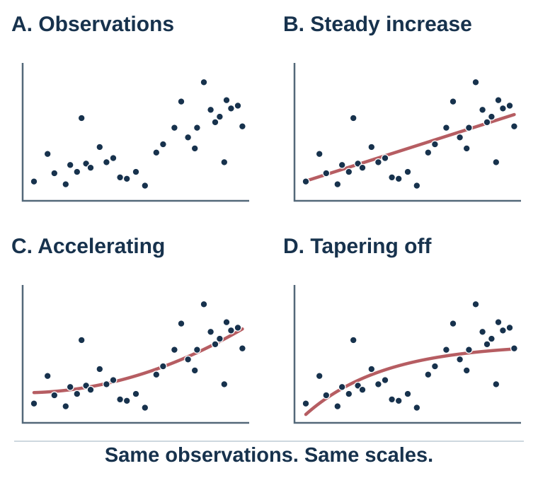

---
aliases:
  - 25-persuasion-is-model-updating.html
---

# Persuasion

*Changing Minds Means Updating Models*

*Changing minds requires more than adding facts*

::: {#chapter-30-start .chapter-epigraph}
> “Rhetoric may be defined as the faculty of observing in any given case the available means of persuasion.”
>
> — Aristotle, [*Rhetoric*](https://classics.mit.edu/Aristotle/rhetoric.1.i.html), c. 350 BCE, Book I, Part 2, 1355b
:::

Imagine that a company plans to replace its familiar project system with a shared digital platform. Leaders present figures showing time lost to duplicate files. Employees ask who will see their activity data and when they will have time to learn the system. The next presentation contains more efficiency statistics, and the objections remain.

The leaders are answering *Will this improve coordination?* Their audience is also asking *Will this cost me autonomy, and will the promised support arrive?* A correct answer to the first question cannot settle the others. To make progress, the proposal itself may need to change.

Persuasion begins by finding the question that stands between the audience and a possible change of mind. We will follow this platform proposal from an argument people resist to a decision they can examine.

::: {.callout-note .core-idea icon=false}
## Core Idea

Persuasion can change what people believe, value, or decide to do. A useful starting point is the audience’s current explanation of the situation: what it expects, what it doubts, and what matters to it. Match the evidence and proposed action to those concerns, while preserving the audience’s ability to judge the proposal.
:::

## Learning goals

- Diagnose the main barrier preventing a particular audience from revising its model.
- Design an evidence-aligned message that integrates source, argument, emotion, and feasible action.
- Produce and ethically audit a persuasive proposal that preserves the audience's agency.

## From information transfer to model updating

The [culture chapter](29-culture-and-identity-the-same-action-is-not-the-same-act.qmd#chapter-29-start) showed why the same action can carry different meanings. A persuasion problem begins when we overlook that difference. Information transfer says, “Here are more facts,” and quietly assumes that the audience will interpret them as the speaker does. Model-updating persuasion begins one step earlier: what model currently makes these facts mean what they mean? Audiences arrive with expectations about the speaker, the problem, the risk, the proposed solution, and themselves. The same observation can therefore look like traction, noise, danger, or opportunity.

Evidence constrains the models that deserve belief. But a visible pattern may fit several accounts: steady growth, acceleration, or an approaching plateau. In @fig-model-underdetermination, all three curves fit the observations so far, but a later observation of 44 favors the plateau. These are synthetic data: the point is to identify an observation that could distinguish the accounts before deciding which story to tell.

{#fig-model-underdetermination fig-alt="Five identical synthetic observations are shared by three candidate curves through period five. Beyond the observed window, one curve grows steadily, one accelerates, and one plateaus. A future synthetic observation of 44 at period eight lies near the plateau curve." width=100%}

Predictive processing offers a useful **theoretical lens**, especially in perception and action: the system predicts, compares incoming information with expectation, and updates when a credible discrepancy warrants revision (Clark, 2013). The following practical persuasion sequence draws on this analogy:

| Stage | Diagnostic question | Design move |
| --- | --- | --- |
| Current model | What does this audience expect, and why is that expectation intelligible? | Begin inside shared reality. |
| Meaningful mismatch | What relevant observation can the old model not explain? | Surface one real, consequential gap. |
| Candidate model | What better explanation resolves the gap? | State the mechanism, not merely a preferred conclusion. |
| Evidence | Why should the new account receive more weight? | Match source, comparison, test, and uncertainty to the claim. |
| Action | What feasible next step follows if the update is accepted? | Name who does what, by when, while preserving refusal. |
: A practical model-updating sequence {#tbl-25-model-update}

For the platform proposal, ask employees what makes adoption unattractive or difficult. Their answers might reveal several barriers requiring different responses:

| Barrier | What the audience may be thinking | Appropriate design response |
| --- | --- | --- |
| Attention | “This is one more announcement.” | Lead with the consequential mismatch, not background. |
| Trust | “Management will use the data against us.” | Use a credible messenger, disclose governance, and make commitments verifiable. |
| Comprehension | “I cannot see how this changes my work.” | Demonstrate the workflow with concrete before-and-after tasks. |
| Identity and values | “This treats professional judgment as a defect.” | Protect valued competence and explain what remains under local control. |
| Feasibility | “Even if it helps, I have no time to learn it.” | Provide time, training, support, and a reversible pilot. |
| Belief | “The promised benefit is only a projection.” | State the mechanism, uncertainty, comparison, and success test. |
: A barrier matrix for persuasive design {#tbl-25-barriers}

@tbl-25-barriers separates objections that another statistic can address from concerns requiring a change in governance, training, or workload. Listening may reveal a defect in the proposal rather than in its presentation.

::: {.callout-tip .activity icon=false}
## Bring one message to redesign

Choose a product, policy, behavior-change request, difficult conversation, or research claim. In six lines, write: audience; desired response; current model; main barrier; credible evidence; constraint. Then write one observation that would genuinely discriminate the old model from your proposed one. If you cannot state that test, you may have a preference rather than a persuasive explanation.
:::

## Source, evidence, and stakes

The platform’s efficiency evidence may be sound while employees still have good reasons to resist. They must judge both whether the system works and whether those controlling it will protect their interests. A proposal that answers only the technical question leaves the decision unresolved. Aristotle's ethos, logos, and pathos help distinguish the questions a message must address. **Ethos** asks whether the source is competent, trustworthy, and accountable. **Logos** asks whether evidence and causal reasoning support the claim. **Pathos** asks whether the emotional meaning fits what is genuinely at stake. These are not competing recipes. A warranted update may require all three.

Source credibility depends especially on perceived expertise and trustworthiness, although goodwill, similarity, status, confidence, and intent can also affect reception (Hovland & Weiss, 1951; Pornpitakpan, 2004). Credentials do not settle trust. A technically expert manager may still be an unsuitable messenger when earlier promises were broken or when the proposal benefits management at employees' expense. A different, conditional pattern is the **sleeper effect**: a message initially discounted because of a credibility warning can become more persuasive later. Kumkale and Albarracín’s (2004) meta-analysis found this delayed effect under particular message and discounting-cue conditions; it does not mean that every dubious claim grows persuasive with time.

For the platform proposal, a respected project leader who tested the system may be a more credible messenger than the chief technology officer alone. Yet a better messenger cannot substitute for verifiable governance. Employees need to know which data are recorded, who can see them, how the data may be used, and what recourse exists if the commitment is violated.

Evidence must answer the audience's actual question and match the claim being made. A demonstration can show that a workflow is possible; comparison data can estimate an effect; a case can illustrate a mechanism. Two-sided refutational messages can be especially useful for informed or skeptical audiences because they acknowledge consequential objections and answer them rather than pretending they do not exist (Hovland et al., 1949; O'Keefe, 1999). The test is not whether an objection was mentioned, but whether a reasonable skeptic can inspect the comparison, assumptions, uncertainty, and conditions under which the proposal would be withdrawn.

Emotion gives those consequences value. Different emotions orient attention and action differently, so “make it emotional” is not a scientific prescription (Lerner et al., 2015). Fear appeals are most defensible when the threat is real and the recommended response is both effective and feasible; fear without efficacy can produce avoidance or defensive control rather than protective action (Rogers, 1975, 1983; Witte, 1992). Hope, pride, compassion, anger, or humor may also affect motivation, but the relevant question is whether the feeling is proportionate to the evidence and points toward a feasible action.

Three diagnostic questions keep the modes aligned:

1. **Source:** Why should this audience trust this messenger on this claim?
2. **Evidence:** What would a reasonable skeptic need to know, and what result would count against the proposal?
3. **Stakes:** What should the audience feel if it understood the consequences accurately?

For the platform, that means showing where duplication occurs, how the proposed workflow is expected to reduce it, what comparison produced the estimate, and which costs were included. The message can make avoidable frustration and pride in competent work salient. It should not manufacture fear of dismissal unless employment risk is real and openly addressed.

## Two routes through a message

{#fig-persuasion-update fig-alt="An audience model connects to message design and then to separate outcomes: belief revision, intention, and action." .phone-fit}

A detailed workflow comparison gives employees material to inspect, but only if they have the time and motivation to use it. Others may initially rely on a colleague’s recommendation. The same presentation must therefore make careful scrutiny possible while giving a hurried reader a trustworthy entry point. Two influential theories explain how motivation and available attention affect this balance.

The elaboration likelihood model, developed by Petty and Cacioppo, uses *central* and *peripheral* routes as shorthand for the high- and low-elaboration ends of a continuum (Petty & Cacioppo, 1986; Petty & Briñol, 2012). Toward the high-elaboration end, people devote more thought to issue-relevant information. Toward the low-elaboration end, attitudes depend more on processes requiring little issue-relevant thought, such as familiarity, affect, or a simple source cue. Mixed processing is common.

Extensive elaboration can be selective or identity-defensive. Elaboration depends especially on how motivated and able people are to think about the message.

Motivation is higher when the issue is personally relevant, important, surprising, or connected to goals. Ability is higher when the message is understandable, the person has enough knowledge, distractions are low, and time is available. When motivation and ability are high, argument quality matters more. When motivation or ability is low, peripheral cues matter more.

Petty, Cacioppo, and Goldman (1981) demonstrated this with a study about comprehensive exams. When the issue was highly relevant to students, strong arguments produced more persuasion than weak arguments. When relevance was low, source expertise mattered more. More generally, the same variable can play different roles: source expertise can operate as a simple cue, be treated as evidence relevant to the merits, change the motivation to think, bias the thoughts generated, or change confidence in those thoughts. Its role must be identified rather than inferred from the label *central* or *peripheral*.

The heuristic-systematic model, developed by Chaiken, makes a related distinction between systematic processing and heuristic processing (Chaiken, 1980; Chaiken et al., 1989). Systematic processing involves comparatively careful evaluation of message content. Heuristic processing relies on simple rules such as “experts can be trusted,” “longer messages are stronger,” “consensus implies correctness,” or “likable people are credible.” The processes can co-occur rather than forcing an either–or classification.

One useful idea from this model is the sufficiency principle: people exert enough effort to reach a desired level of confidence, but not more. If a low-effort heuristic gives enough confidence, they may stop. If the decision is important or uncertainty remains, they may process more systematically.

These models connect persuasion to the rest of the book. Heuristics, fluency, authority, social proof, and affect can influence attitudes under lower elaboration, but they can also alter what people think about, how they interpret evidence, and how confident they are under higher elaboration. The scientific question is therefore not simply “Which route?” It is “How much issue-relevant thinking occurred, what did this variable do within that processing, and what changed—belief, evaluation, intention, or action?”

Attitudes formed or changed through greater elaboration tend, under appropriate conditions, to be more persistent, resistant to counterpersuasion, and predictive of behavior because they are connected to a more developed structure of supporting thoughts. Lower-elaboration change may be more fragile, though repetition, identity, learning, and later experience can stabilize it.

In the platform meeting, a dense technical report may help an interested specialist while overwhelming a colleague who has ten minutes between tasks. Match the presentation to the conditions in which people will use it:

| Audience condition | Likely elaboration pattern | Design implication |
| --- | --- | --- |
| High motivation and ability | Higher elaboration is likely; cues may still shape direction or confidence. | Use strong evidence, causal logic, uncertainty, and counterarguments. |
| High motivation, low ability | Elaboration is desired but constrained by comprehension, time, or load. | Reduce jargon, scaffold concepts, and show concrete mechanisms. |
| Low motivation, high ability | Lower elaboration is likely unless relevance increases; mixed processing remains possible. | Establish genuine relevance before adding detail. |
| Low motivation and ability | Lower-elaboration processes and simple cues are more influential. | Use transparent cues, one clear action, and avoid exploiting inattention. |
: Audience conditions and elaboration {#tbl-25-1}

### Influence cues are signals, not buttons

A colleague’s recommendation can help a busy employee decide whether the platform deserves a closer look. Yet visible approval may reflect independent experience or merely repeated endorsement of the same claim. Treating the two alike gives the proposal more support than the evidence warrants. The cues below may provide information, alter attention or motivation, create obligation, or change behavior without changing belief. Judge each cue by whether it reliably tracks what it appears to signal.

| Cue | Legitimate information | Counterfeit form | Pause question |
| --- | --- | --- | --- |
| Reason-giving | The request has a relevant justification. | A reason-shaped phrase supplies no decision-relevant information. | Would this reason change my judgment if the word *because* disappeared? |
| Social proof | Independent others have relevant experience or information. | Purchased approval or correlated copying appears to be independent evidence. | How independent and relevant are these observations? See [social norms and conformity](26-social-norms-and-conformity-when-other-people-become-evidence.qmd#chapter-26-start). |
| Commitment | A freely chosen promise expresses an endorsed value or plan. | A small early commitment is used after important costs have been concealed. | Was the later cost visible, and is revision or exit still meaningful? |
| Reciprocity | Help or a genuine concession signals goodwill and supports cooperation. | An unwanted gift or inflated first request manufactures obligation. | Am I evaluating the proposal, or merely repaying a feeling of debt? |
| Authority | Accountable, domain-relevant expertise improves the evidence. | A title, uniform, confidence, or logo substitutes for reasons. | What does this source know, how do they know it, and who can check them? See [authority and responsibility](28-authority-groupthink-and-shared-responsibility.qmd#authority-and-responsibility). |
| Scarcity | A real capacity or timing constraint changes the feasible choice set. | A fake countdown or artificial shortage creates urgency. | Is the constraint genuine, and does it change the option's underlying value? |
| Liking | Rapport or similarity may convey shared context and cooperative intent. | Manufactured affinity spills into judgments of truth or competence. | Would the claim survive if I did not like the messenger? |
| Unity | Shared identity can imply mutual obligation and a longer relationship. | Belonging is made conditional on compliance, or outsiders bear hidden costs. | Who is excluded, who pays, and can a member disagree without losing belonging? |
: Influence cues should be audited for cue validity, independence, transparency, and agency {#tbl-25-influence-signals}

Classic experiments show why the pause matters. In a low-cost photocopier request, reason-giving increased compliance compared with asking without a reason, even when the stated reason added little information, but the pattern weakened when the request imposed a larger cost (Langer et al., 1978). Compared with making the target request alone, securing compliance with a smaller initial request sometimes increased acceptance of a later related request (Freedman & Fraser, 1966), while retreating from a rejected larger request sometimes increased acceptance of the smaller target request (Cialdini et al., 1975). The outcome measured was compliance. When designing a message, distinguish compliance from durable belief updating and make costs and obligations visible.

## Diagnose the audience before designing the message

The barrier matrix becomes useful when the audience can correct it. Ask a few employees to explain the proposed change in their own words, identify their strongest objection, and describe what would make a trial worthwhile. An efficiency argument may miss a concern about professional judgment; moral reframing studies show that the values used to justify a proposal can affect its reception (Feinberg & Willer, 2015). Adapting the explanation should make the real reasons accessible, without concealing the speaker’s aims or the proposal’s costs.

Then distinguish agreement from action. Employees may accept the case for coordination yet lack training time. “Support innovation” leaves that obstacle untouched; “test this workflow for six weeks with two hours of training provided” creates a decision they can evaluate. [Chapter 32](32-building-an-evidence-aligned-message.qmd#chapter-32-start) develops the message-building routine.

## Resistance and reactance

Employees who hear “Only people afraid of accountability oppose this system” now have a further reason to object. Their freedom to disagree has become part of the dispute.

**Reactance** is motivation to restore a freedom perceived as threatened (Brehm, 1966; Brehm & Brehm, 1981). It is one explanation for resistance, alongside reasonable disagreement, distrust, competing priorities, and practical constraints. Calling every objection reactance would simply repeat the original mistake of ignoring its content.

An autonomy-supportive message can explain a strong recommendation while acknowledging concerns and identifying real choices. Self-determination theory connects the quality of motivation with experiences of autonomy, competence, and relatedness (Deci & Ryan, 2000). That framework offers reasons to provide choice and support. Where a decision is mandatory, communicate that limit honestly and specify what remains open to input.

An audience may understand the present proposal yet later encounter a misleading argument that makes it difficult to judge. Repeating the original message leaves that new vulnerability untouched. Inoculation theory asks whether preparing people to recognize and answer such arguments can protect their judgment. McGuire (1964) proposed that people can be made more resistant to persuasion by exposing them to weakened counterarguments and refutations, much like a vaccine exposes the body to a weakened threat. Inoculation messages warn people that they may encounter persuasion attempts, present common misleading arguments, and refute them. Meta-analyses suggest that inoculation can build resistance across domains (Banas & Rains, 2010).

One application is to explain a misleading technique before people encounter it: show how a graph can exaggerate a change, then let the audience inspect another example. Test whether the exercise improves later judgment.

Corrections also deserve a realistic expectation. A broad effect in which corrections routinely strengthen false beliefs has proved elusive (Wood & Porter, 2019), although a corrected claim can continue to influence reasoning. Clear corrections that offer an alternative explanation can help people replace the account they previously used (Lewandowsky et al., 2012).

Clinical motivational interviewing provides another example of eliciting people’s own reasons for change while respecting autonomy (Miller & Rollnick, 2013). Its conversational stance offers a useful model for workplace discussions.

The platform pilot should preserve meaningful choice where possible: teams can compare two workflows, propose safeguards, and examine results before scale-up. Participation makes concerns testable inputs.

## Ethical persuasion

A manager may want employees to choose a pilot freely, yet refusal can feel costly when the person making the request also influences promotion. Calling participation “voluntary” leaves that conflict unresolved. The ethical task is to make the proposal—and the consequences of saying no—possible to inspect.

An ethical proposal states consequential costs and uncertainty, makes the speaker’s purpose clear, and uses emotion in proportion to the evidence. A vivid account of wasted time is appropriate when it illuminates the problem; invented threats of dismissal would make the decision harder to judge. The actual freedom to decline must support the reassuring phrase in the presentation.

Before using a message, imagine giving the audience the design brief behind it. Could you explain why you chose the messenger, example, evidence, and proposed action? If their effectiveness depends on hiding relevant facts or manufacturing obligation, revise the proposal.

## The platform proposal, redesigned

The original message said, in effect, “The evidence shows that this platform is efficient; therefore use it.” The redesigned proposal follows the audience's model instead of ignoring it.

First, it begins in shared reality: teams are losing time to duplicate files, conflicting versions, and invisible handoffs. Second, it names the concern fairly: a shared system can improve coordination **and** create surveillance if access rules are vague. Third, it offers evidence matched to the claims: workflow data for duplication, a live demonstration for usability, written governance for data use, and a limited pilot for predicted time savings. Fourth, it makes identity and value explicit: the aim is to protect professional time and judgment, not replace them. Finally, it proposes an actionable and revisable step: two volunteer teams test the system for six weeks against predeclared measures, with training time, an independent feedback channel, and a decision rule for stopping, revising, or scaling.

Ethos, logos, and pathos now support the same update. A trusted project leader and a technical specialist share the message. The causal argument is inspectable. The emotional stakes—avoidable frustration, competent work, and fear of misuse—fit the situation. Motivation and ability are supported by relevance, demonstration, training, and time. Resistance is not treated as a defect; it helps specify the test.

Successful persuasion gives a defensible model appropriate weight while preserving the audience’s capacity to judge and refuse. The pilot gives both sides evidence for accepting, revising, or rejecting the proposal. [Building an Evidence-Aligned Message](32-building-an-evidence-aligned-message.qmd#chapter-32-start) turns this diagnosis into a usable draft.

## Practice Lab

Choose one organizational change that has met resistance. Produce a one-page persuasion brief containing: the desired response; the audience's current model; a completed barrier matrix; one claim-evidence-warrant chain; the messenger and why that source deserves weight; the appropriate emotional stake; a feasible next action; and one observation that would make you revise or withdraw the proposal. End with the transparency test: would you still use this design if the audience could see the brief?

## Take it forward

Return to the platform proposal. More efficiency statistics will help only if uncertainty about efficiency is what holds the audience back. A useful proposal also lets employees examine the consequences they care about—and gives the leaders a reason to revise their own plan when the objections are sound.

## References cited in this chapter

::: {.reference}
Aristotle. (2007). On rhetoric: A theory of civic discourse (G. A. Kennedy, Trans., 2nd ed.). Oxford University Press. (Original work ca. 4th century BCE).
:::

::: {.reference}
Banas, J. A., & Rains, S. A. (2010). A meta-analysis of research on inoculation theory. Communication Monographs, 77(3), 281–311.
:::

::: {.reference}
Brehm, J. W. (1966). A theory of psychological reactance. Academic Press.
:::

::: {.reference}
Brehm, S. S., & Brehm, J. W. (1981). Psychological reactance: A theory of freedom and control. Academic Press.
:::

::: {.reference}
Chaiken, S. (1980). Heuristic versus systematic information processing and the use of source versus message cues in persuasion. Journal of Personality and Social Psychology, 39(5), 752–766.
:::

::: {.reference}
Chaiken, S., Liberman, A., & Eagly, A. H. (1989). Heuristic and systematic information processing within and beyond the persuasion context. In J. S. Uleman & J. A. Bargh (Eds.), Unintended thought (pp. 212–252). Guilford Press.
:::

::: {.reference}
Cialdini, R. B., Vincent, J. E., Lewis, S. K., Catalan, J., Wheeler, D., & Darby, B. L. (1975). Reciprocal concessions procedure for inducing compliance: The door-in-the-face technique. Journal of Personality and Social Psychology, 31(2), 206–215.
:::

::: {.reference}
Clark, A. (2013). Whatever next? Predictive brains, situated agents, and the future of cognitive science. Behavioral and Brain Sciences, 36(3), 181–204.
:::

::: {.reference}
Deci, E. L., & Ryan, R. M. (2000). The "what" and "why" of goal pursuits: Human needs and the self-determination of behavior. Psychological Inquiry, 11(4), 227-268.
:::

::: {.reference}
Feinberg, M., & Willer, R. (2015). From gulf to bridge: When do moral arguments facilitate political influence? Personality and Social Psychology Bulletin, 41(12), 1665–1681.
:::

::: {.reference}
Freedman, J. L., & Fraser, S. C. (1966). Compliance without pressure: The foot-in-the-door technique. Journal of Personality and Social Psychology, 4(2), 195–202.
:::

::: {.reference}
Hovland, C. I., Lumsdaine, A. A., & Sheffield, F. D. (1949). Experiments on mass communication. Princeton University Press.
:::

::: {.reference}
Hovland, C. I., & Weiss, W. (1951). The influence of source credibility on communication effectiveness. Public Opinion Quarterly, 15(4), 635–650.
:::

::: {.reference}
Kumkale, G. T., & Albarracín, D. (2004). The sleeper effect in persuasion: A meta-analytic review. Psychological Bulletin, 130(1), 143–172.
:::

::: {.reference}
Langer, E. J., Blank, A., & Chanowitz, B. (1978). The mindlessness of ostensibly thoughtful action: The role of “placebic” information in interpersonal interaction. Journal of Personality and Social Psychology, 36(6), 635–642.
:::

::: {.reference}
Lerner, J. S., Li, Y., Valdesolo, P., & Kassam, K. S. (2015). Emotion and decision making. Annual Review of Psychology, 66, 799–823.
:::

::: {.reference}
Lewandowsky, S., Ecker, U. K. H., Seifert, C. M., Schwarz, N., & Cook, J. (2012). Misinformation and its correction: Continued influence and successful debiasing. Psychological Science in the Public Interest, 13(3), 106–131.
:::

::: {.reference}
McGuire, W. J. (1964). Inducing resistance to persuasion: Some contemporary approaches. In L. Berkowitz (Ed.), Advances in experimental social psychology (Vol. 1, pp. 191–229). Academic Press.
:::

::: {.reference}
Miller, W. R., & Rollnick, S. (2013). Motivational interviewing: Helping people change (3rd ed.). Guilford Press.
:::

::: {.reference}
O’Keefe, D. J. (1999). How to handle opposing arguments in persuasive messages: A meta-analytic review of the effects of one-sided and two-sided messages. Annals of the International Communication Association, 22(1), 209–249.
:::

::: {.reference}
Petty, R. E., & Briñol, P. (2012). The elaboration likelihood model. In P. A. M. Van Lange, A. W. Kruglanski, & E. T. Higgins (Eds.), Handbook of theories of social psychology (Vol. 1, pp. 224–245). Sage.
:::

::: {.reference}
Petty, R. E., & Cacioppo, J. T. (1986). Communication and persuasion: Central and peripheral routes to attitude change. Springer.
:::

::: {.reference}
Petty, R. E., Cacioppo, J. T., & Goldman, R. (1981). Personal involvement as a determinant of argument-based persuasion. Journal of Personality and Social Psychology, 41(5), 847–855.
:::

::: {.reference}
Pornpitakpan, C. (2004). The persuasiveness of source credibility: A critical review of five decades’ evidence. Journal of Applied Social Psychology, 34(2), 243–281.
:::

::: {.reference}
Rogers, R. W. (1975). A protection motivation theory of fear appeals and attitude change. Journal of Psychology, 91(1), 93–114.
:::

::: {.reference}
Rogers, R. W. (1983). Cognitive and physiological processes in fear appeals and attitude change: A revised theory of protection motivation. In J. Cacioppo & R. Petty (Eds.), Social psychophysiology (pp. 153–176). Guilford Press.
:::

::: {.reference}
Witte, K. (1992). Putting the fear back into fear appeals: The extended parallel process model. Communication Monographs, 59(4), 329–349.
:::

::: {.reference}
Wood, T., & Porter, E. (2019). The elusive backfire effect: Mass attitudes’ steadfast factual adherence. Political Behavior, 41(1), 135–163.
:::
